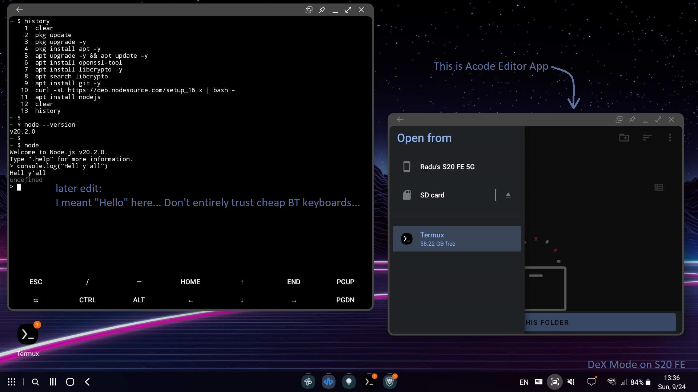
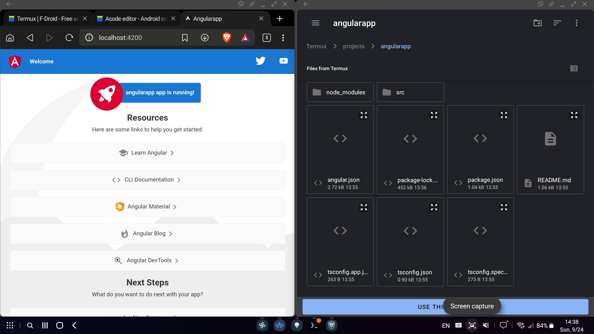
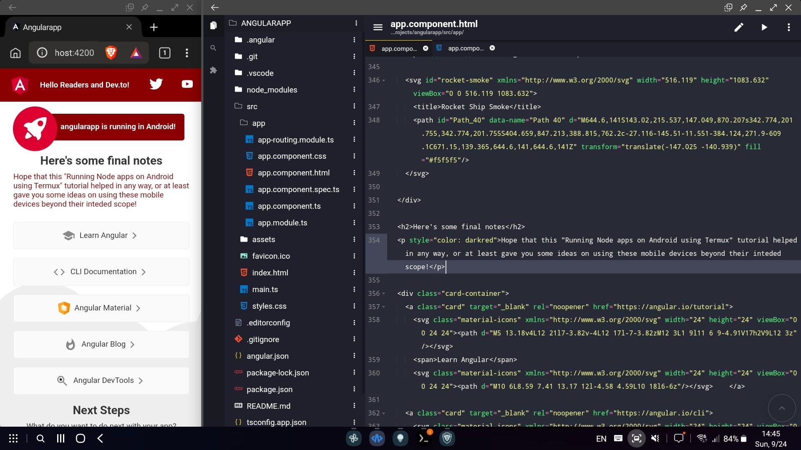
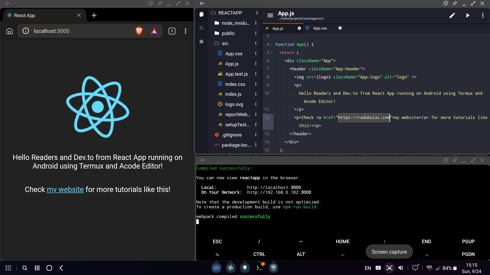
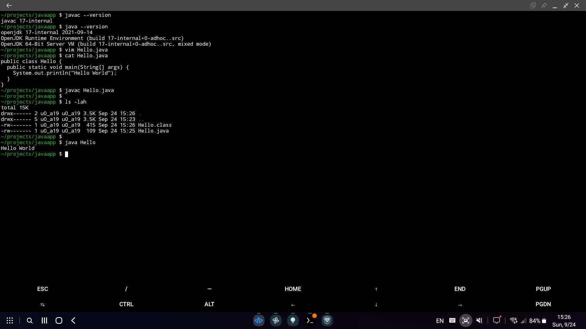

# Running Nodejs Apps in Android using Termux and Acode Editor App

Hello everyone!

In this tutorial we will run an Angular Node App on Android, and host it on localhost by using the Termux app. We will also use Acode Editor application to browse and easily change our code files. **NO ANDROID ROOT IS NEEDED**.

Prerequisites:

- Any Android device running Android 10 and up. In my case I will either use a [Lenovo Tab P11 Pro 8GB in Productivity Mode](https://www.gsmarena.com/compare.php3?idPhone1=11841&idPhone2=11343&idPhone3=12217) or a [Samsung Galaxy S20 FE 6GB in DeX Mode](https://www.gsmarena.com/compare.php3?idPhone1=11841&idPhone2=10377&idPhone3=12024) with a Bluetooth Mouse & Keyboard connected
- [Termux App from F-Droid](https://f-droid.org/packages/com.termux/) - Currently on Version 0.118.0 (118) - Added on 2022-01-11
- [Acode Editor App from F-Droid](https://f-droid.org/packages/com.foxdebug.acode/) - Currently on Version 1.8.6 (312) - Added on 2023-09-01

Table of Contents:

- [Running Nodejs Apps in Android using Termux and Acode Editor App](#running-nodejs-apps-in-android-using-termux-and-acode-editor-app)
  - [Installing Termux](#installing-termux)
    - [Installing apt package manager and other dependencies](#installing-apt-package-manager-and-other-dependencies)
    - [Installing Nodejs](#installing-nodejs)
    - [Installing and Running Angular (ng)](#installing-and-running-angular-ng)
  - [Installing Acode Editor App](#installing-acode-editor-app)
  - [Conclusions](#conclusions)
  - [Installing other packages in Termux](#installing-other-packages-in-termux)
    - [Running React App (npx)](#running-react-app-npx)
    - [Installing Java](#installing-java)

(Sunday, September 24, 2023, 12:48)

<br/>

## Installing Termux

First, we need to install [Termux (terminal) App from F-Droid](https://f-droid.org/packages/com.termux/) \*. We will not install the Termux from Google Play Store due to lack of updates there.

> \* Please make sure that you don't press the big blue "Download F-Droid" button as it will download the F-Droid store instead of the Termux App!
> Currently latest available version as of now (September 24, 2023) is Termux Version 0.118.0 (118) added on 2022-01-11

<br/>

### Installing apt package manager and other dependencies

Now that we are in Termux app on our Android device, we can run the followings:

- Update and upgrade Termux's `pkg` package manager

```bash
pkg update -y
pkg upgrade -y
```

> Note: In Termux you can click and hold to show the copy/paste menu (in order to copy paste these commands)

- Install `apt` Package Manager as well as updating and upgrading (Note that we add the `-y` option to automatically say "yes" to the install when asked)

```bash
pkg install apt -y
apt upgrade -y && apt update -y
```

- Install `openssl-tool` dependency

```bash
apt install openssl-tool -y
```

- Some other packages might come in handy, such as `git`

```bash
apt install git -y
```

<br/>

### Installing Nodejs

Now, time to actually install Node

- We just need to run:

```bash
apt install nodejs
```

- And check the installed version

```bash
node --version
```



<br/>

> Note: If we want a different version of Node.js
>
> - We can get the apt package for nodejs 16 by running the following and update the apt package manager including this version
>
> ```bash
> curl -sL https://deb.nodesource.com/setup_16.x | bash -
>
> apt update
> ```
>
> - And then just install it
>
> ```bash
> apt install nodejs
>
> node --version
> ```
>
> Resource: https://computingforgeeks.com/how-to-install-node-js-on-ubuntu-debian/?expand_article=11

<br/>

### Installing and Running Angular (ng)

Let's install Angular "globally" by running:

```bash
npm install -g @angular/cli
```

```bash
ng version
```

<br/>

And also let's create a quick demo project:

- First let's create our separate folder

```bash
mkdir projects
cd projects/
```

- And create a new Angular app within `angularapp` directory

```bash
ng new angularapp
cd angularapp/
```

- Now let's run locally this Angular app. The default Android browser should open to http://localhost:4200/

```bash
ng serve --open
```


<br/>

## Installing Acode Editor App

With [Acode App from F-Droid](https://f-droid.org/packages/com.foxdebug.acode/) installed, we can now browse through Termux's created directories and files within its emulated storage.



And of course, edit files and see changes in real time (without refreshing the app).



<br/>

## Conclusions

I wrote this mini tutorial as I didn't saw that many quick tutorials on this topic so I though I should write me my own (or at least for my future self).

The little mind bogling idea is the mobile devices that we use everyday (smartphones, tablets) are getting more powerful year by year - e.g. see the [performance comparison between Snapdragon 888 (2020) vs Snapdragon 8 Gen 2 (2022)](https://nanoreview.net/en/soc-compare/qualcomm-snapdragon-875-vs-qualcomm-snapdragon-8-gen-2) - therefore it feels like those devices aren't used by full their extent.

Performance wise of mid-range devices (such as Lenovo Tab P11, or Samsung Tab S7 FE, or Xiaomi Pad 6, or Samsung Galaxy S21 FE) are on pair with budget laptops from around 2020 (at least from the bench scores).

However, the weird part is that I use my budget laptop for multitasking tens of heavy-load applications. On a laptop equipped with a quad-core Intel I5 gen 10 CPU with 16GB of RAM (that scores around 3000 MultiCore points in Geekbench 5) I always have 20-30 Chrome tabs open while running 2 to 3 FullStack Docker Apps (with MySQL/Java/Nodejs and other microservices), while also playing videos in the background and compiling with maven java projects, while also doing some quick edits in Excel (Sheets) or Word (Docs) - and the performance/smoothness is fine. So why can't we use our mobile devices as well for all these tasks?

Maybe the mobile devices are still early for such tasks and the software is not yet there. Maybe the limiting factor is the different architecture (ARM based on RISC vs. x86 based on CISC), however Apple's M1/M2 chips might have proved this wrong. Maybe the general public will never use their smart devices for highload multitasking and productivity work (and only use for media consumption and fast email/news checking, as these devices were intended).

(Sunday, September 24, 2023, 14:35)

<br/>

## Installing other packages in Termux

### Running React App (npx)

We can also create a React application.

- Just run the following (also write "y" if prompted to install the "create-react-app" package)

```bash
npx create-react-app reactapp
```

```bash
cd reactapp
```

- Then run it on http://localhost:3000/

```bash
npm start
```



<br/>

### Installing Java

- We can search any available packages within APT (using an ARM based CPU) by running `apt search java`
- We see that we can install Java 17 by running

```bash
apt install openjdk-17
```

```bash
javac --version
java --version
```

- Now let's do a quick test

```bash
cd projects/
mkdir javaapp && cd javaapp
```

- By writing a fast [hello world example](https://www.w3schools.com/java/)

```bash
vi Hello.java

# Note, you can also install vim by running
apt install vim
```

```java
public class Hello {
  public static void main(String[] args) {
    System.out.println("Hello World");
  }
}
```

```bash
cat Hello.java
```

- Compile and run

```java
javac Hello.java
java Hello
```


