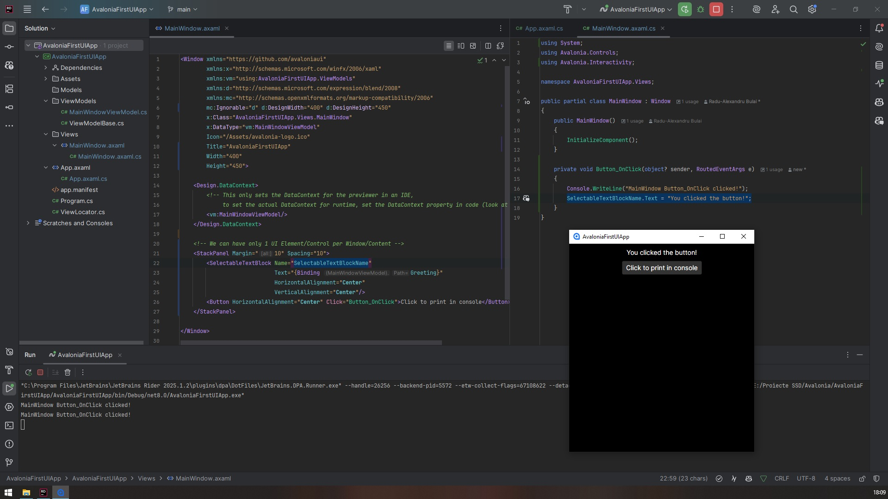
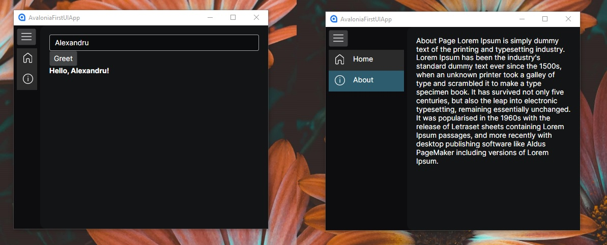
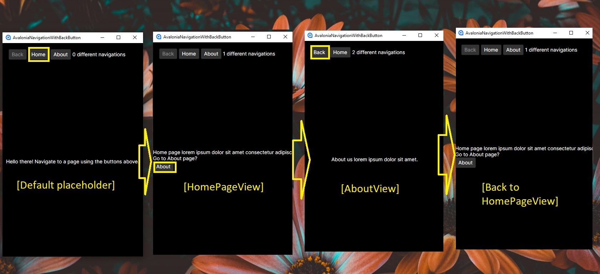

# Avalonia UI Tutorial Project

Credits / Notes taken from:

- Mamma Mia Dev - "Avalonia UI" https://www.youtube.com/watch?v=1mzM6N4drCU&list=PLJYo8bcmfTDF6ROxC8QMVw9Zr_3Lx4Lgd&index=2&ab_channel=MammaMiaDev (Published August 2023, Length of 3 hours 41 minutes)
- Avalonia Docs https://docs.avaloniaui.net/docs/overview/what-is-avalonia as of Saturday, May 10, 2025

<br/>

Table of Contents / ToC:

- [Avalonia UI Tutorial Project](#avalonia-ui-tutorial-project)
  - [.NET Setup on Windows](#net-setup-on-windows)
  - [.NET Setup on Debian using VBox](#net-setup-on-debian-using-vbox)
    - [Short: Differences between VirtualBox and Hyper-V Manager](#short-differences-between-virtualbox-and-hyper-v-manager)
    - [Short: Differences between Docker w/o WSL2](#short-differences-between-docker-wo-wsl2)
  - [.NET Avalonia Project Setup](#net-avalonia-project-setup)
    - [Install Avalonia UI Templates](#install-avalonia-ui-templates)
    - [Create Avalonia .NET MVVM Project](#create-avalonia-net-mvvm-project)
    - [First time build \& run](#first-time-build--run)
    - [Main App, MainWindow, MainWindowViewModel workflow](#main-app-mainwindow-mainwindowviewmodel-workflow)
  - [Playing with the UI - Controls](#playing-with-the-ui---controls)
  - [Data binding](#data-binding)
    - [Data binding with ReactiveUI Example1 - ChatGPT](#data-binding-with-reactiveui-example1---chatgpt)
    - [Data binding with ReactiveUI Example2 - TODO List](#data-binding-with-reactiveui-example2---todo-list)
    - [Data binding with CommunityToolkit - Tutorial](#data-binding-with-communitytoolkit---tutorial)
  - [Sidebar Menu Navigation using a Splitview](#sidebar-menu-navigation-using-a-splitview)
    - [Splitview Navigation routing using CommunityToolkit.Mvvm](#splitview-navigation-routing-using-communitytoolkitmvvm)
      - [SplitView Control](#splitview-control)
      - [Toggle open menu pane](#toggle-open-menu-pane)
      - [See view within TransitioningContentControl via its ViewModel](#see-view-within-transitioningcontentcontrol-via-its-viewmodel)
      - [Binding ListBox Items to Views](#binding-listbox-items-to-views)
      - [Adding more nav items and actually changing the view](#adding-more-nav-items-and-actually-changing-the-view)
      - [Adding icons to nav items](#adding-icons-to-nav-items)
      - [Complete code for Navigation using CommunityToolkit for binding with icons](#complete-code-for-navigation-using-communitytoolkit-for-binding-with-icons)
    - [Splitview Navigation routing using ReactiveUI](#splitview-navigation-routing-using-reactiveui)
  - [Real Page Routing using ReactiveUI \[Separate Project\]](#real-page-routing-using-reactiveui-separate-project)
    - [Real Page Routing using ReactiveUI - Adding Home and About pages](#real-page-routing-using-reactiveui---adding-home-and-about-pages)
  - [SubNavigation within Splitview Window routing using ReactiveUI](#subnavigation-within-splitview-window-routing-using-reactiveui)
  - [Open/Navigate to a new window](#opennavigate-to-a-new-window)
  - [Avalonia XAML UI Elements](#avalonia-xaml-ui-elements)
    - [Avalonia Images](#avalonia-images)
      - [Local Image using declarative/hardcoded path](#local-image-using-declarativehardcoded-path)
      - [Web Image using custom ImageHelper class](#web-image-using-custom-imagehelper-class)
    - [Avalonia Grids](#avalonia-grids)
      - [Standard Grids](#standard-grids)
      - [Uniform Grids](#uniform-grids)
      - [Data Grids](#data-grids)
    - [Fluent UI - Custom Avalonia Styles](#fluent-ui---custom-avalonia-styles)
  - [Avalonia Dependency Injection](#avalonia-dependency-injection)
  - [Avalonia Save to file (TODO App)](#avalonia-save-to-file-todo-app)
    - [Complete Code for ToDo App with save to JSON file](#complete-code-for-todo-app-with-save-to-json-file)
    - [Complete Code for ToDo App with save to XML file](#complete-code-for-todo-app-with-save-to-xml-file)

<br/>

Other UI Frameworks based on .NET / C# Table (generated with ChatGPT)

|     Framework     | Initial Release |               Latest Version                |               Supported .NET Versions               | Supported C# Versions |                      Platform Compatibility                       | Description                                                                                                                                                                                                                                                                                                                                                   |
| :---------------: | :-------------: | :-----------------------------------------: | :-------------------------------------------------: | :-------------------: | :---------------------------------------------------------------: | ------------------------------------------------------------------------------------------------------------------------------------------------------------------------------------------------------------------------------------------------------------------------------------------------------------------------------------------------------------- |
|   Windows Forms   |  Feb 13, 2002   |            8.0.0 (Nov 14, 2023)             | .NET Framework 1.0 – 4.8.1, .NET Core 3.0+, .NET 5+ |      Up to C# 12      |                           Windows only                            | Windows Forms: A classic UI framework for building Windows desktop applications using a drag-and-drop designer. While it's still maintained, it's considered legacy and primarily used for maintaining existing applications.                                                                                                                                 |
|        WPF        |  Nov 21, 2006   |            8.0.5 (May 14, 2024)             | .NET Framework 3.0 – 4.8.1, .NET Core 3.0+, .NET 5+ |      Up to C# 12      |                           Windows only                            | WPF (Windows Presentation Foundation): Introduced in .NET Framework 3.0, WPF uses XAML for rich UI design and supports advanced features like 3D graphics and data binding. It's Windows-only but remains a robust choice for complex desktop applications.                                                                                                   |
|        UWP        |  July 29, 2015  |                     N/A                     |           .NET Core 3.0 (via Windows SDK)           |      Up to C# 8       |              Windows 10/11 (Desktop, Xbox, HoloLens)              | UWP (Universal Windows Platform): Designed for building modern Windows applications that can run across various Windows devices. However, it's limited to C# 8 and is being gradually replaced by newer technologies like WinUI and .NET MAUI.                                                                                                                |
|     .NET MAUI     |  May 23, 2022   |             9.0 (Nov 12, 2024)              |                   .NET 6 – .NET 9                   |      Up to C# 12      |           Cross-platform (Windows, macOS, iOS, Android)           | .NET MAUI (Multi-platform App UI): The evolution of Xamarin.Forms, .NET MAUI allows developers to create cross-platform applications with a single codebase, targeting Windows, macOS, iOS, and Android. It supports the latest .NET and C# versions.                                                                                                         |
|      Blazor       |   Dec 3, 2018   |          Part of .NET 8 (Nov 2023)          |               .NET Core 3.0+, .NET 5+               |      Up to C# 12      |       Cross-platform (WebAssembly, Server, Hybrid Desktop)        | Blazor: A framework for building interactive web UIs using C#. Blazor WebAssembly allows client-side applications to run in the browser, while Blazor Server runs on the server. Blazor Hybrid enables desktop applications with web technologies.                                                                                                            |
| ASP.NET Web Forms |  Feb 13, 2002   | Final in .NET Framework 4.8.1 (Aug 9, 2022) |             .NET Framework 1.0 – 4.8.1              |     Up to C# 7.3      |                        Windows (IIS) only                         | ASP.NET Web Forms: An older web application framework that uses a drag-and-drop interface and event-driven programming model. It's only available in the .NET Framework and is not supported in .NET Core or later versions.                                                                                                                                  |
|     Avalonia      |   Aug 6, 2016   |          11.3.0-rc1 (Apr 25, 2025)          |          .NET Core 3.1+, .NET 5+, .NET 6+           |      Up to C# 12      | Cross-platform (Windows, macOS, Linux, iOS, Android, WebAssembly) | Avalonia: An open-source, cross-platform UI framework for .NET that supports Windows, macOS, Linux, iOS, Android, and WebAssembly. Avalonia uses XAML for UI design and leverages SkiaSharp for rendering, ensuring consistent visuals across platforms. It's suitable for developers looking to build modern, cross-platform desktop applications with .NET. |

---

Here's a comprehensive table detailing the major .NET versions, their release dates, support status, key features, end-of-support timelines, and notable deprecated features:

|       Version        | Release Date | LTS |                                                              Major Changes/Features                                                              | End of Support |                                               Deprecated Features                                                |
| :------------------: | :----------: | :-: | :----------------------------------------------------------------------------------------------------------------------------------------------: | :------------: | :--------------------------------------------------------------------------------------------------------------: |
|        .NET 9        | Nov 12, 2024 | No  |                        - Performance improvements<br>- Enhanced cloud-native support<br>- New APIs and language features                         |  May 12, 2026  |                                                       TBD                                                        |
|        .NET 8        | Nov 14, 2023 | Yes | Long-Term Support (LTS)<br>- Native AOT compilation improvements<br>- Enhanced MAUI and Blazor support<br>- Improved performance and diagnostics |  Nov 10, 2026  |                                                       TBD                                                        |
|        .NET 7        | Nov 8, 2022  | No  |                         Performance enhancements<br>- Simplified development experience<br>- Improved container support                          |  May 14, 2024  |                                                       TBD                                                        |
|        .NET 6        | Nov 8, 2021  | Yes |        LTS release<br>- Unified platform for desktop, mobile, and web<br>- Introduction of MAUI<br>- Improved performance and diagnostics        |  Nov 12, 2024  |                                                       TBD                                                        |
|        .NET 5        | Nov 10, 2020 | No  |               First release under unified .NET branding<br>- Cross-platform support<br>- Improved performance and support for C# 9               |  May 10, 2022  | .NET Framework-specific technologies<br/> like Web Forms, WCF,<br/> and Windows Workflow Foundation not included |
|    .NET Core 3.1     | Dec 3, 2019  | Yes |                                  LTS release<br>- Support for Windows Desktop (WinForms, WPF)<br>- C# 8 support                                  |  Dec 13, 2022  |                                                       TBD                                                        |
|    .NET Core 3.0     | Sep 23, 2019 | No  |                               Support for Windows Desktop applications<br>- C# 8 support<br>- Improved performance                               |  Mar 3, 2020   |                                                       TBD                                                        |
|    .NET Core 2.2     | Dec 4, 2018  | No  |                                                 Improved build performance<br>- Additional APIs                                                  |  Dec 23, 2019  |                                                       TBD                                                        |
|    .NET Core 2.1     | May 30, 2018 | Yes |                                    LTS release<br>- Improved performance and diagnostics<br>- C# 7.3 support                                     |  Aug 21, 2021  |                                                       TBD                                                        |
|    .NET Core 2.0     | Aug 14, 2017 | No  |                                             Support for .NET Standard 2.0<br>- Improved performance                                              |  Oct 1, 2018   |                                                       TBD                                                        |
|    .NET Core 1.1     | Nov 16, 2016 | No  |                                                    Improved performance<br>- Additional APIs                                                     |  Jun 27, 2019  |                                                       TBD                                                        |
|    .NET Core 1.0     | Jun 27, 2016 | No  |                                     Initial release of cross-platform .NET Core<br>- Modular and lightweight                                     |  Jun 27, 2019  |                                                       TBD                                                        |
| .NET Framework 4.8.1 | Aug 9, 2022  | Yes |                                 Last version of .NET Framework<br>- Improved accessibility and high DPI support                                  |      TBD       |             .NET Framework is no longer being developed; focus has shifted to .NET Core and .NET 5+              |
|  .NET Framework 4.8  | Apr 18, 2019 | Yes |                                        Improved performance and accessibility<br>- High DPI improvements                                         |      TBD       |                                                  Same as above                                                   |
| .NET Framework 4.7.2 | Apr 30, 2018 | Yes |                                             Enhanced cryptography support<br>- Improved performance                                              |      TBD       |                                                  Same as above                                                   |
| .NET Framework 4.7.1 | Oct 17, 2017 | Yes |                                          Support for .NET Standard 2.0<br>- Accessibility improvements                                           |      TBD       |                                                  Same as above                                                   |
|  .NET Framework 4.7  | Apr 11, 2017 | Yes |                                                  Performance improvements<br>- High DPI support                                                  |      TBD       |                                                  Same as above                                                   |
| .NET Framework 4.6.2 | Aug 2, 2016  | Yes |                                       Support for Windows 10 Anniversary Update<br>- Improved cryptography                                       |  Jan 12, 2027  |                                                  Same as above                                                   |
| .NET Framework 4.6.1 | Nov 30, 2015 | Yes |                                           Support for Windows 10<br>- Improved debugging and profiling                                           |  Apr 26, 2022  |                                     Retired due to SHA-1 certificate issues                                      |
|  .NET Framework 4.6  | Jul 29, 2015 | Yes |                                                   RyuJIT compiler<br>- Support for Windows 10                                                    |  Apr 26, 2022  |                                     Retired due to SHA-1 certificate issues                                      |
| .NET Framework 4.5.2 | May 5, 2014  | Yes |                                                  Enhanced diagnostics<br>- Improved performance                                                  |  Apr 26, 2022  |                                     Retired due to SHA-1 certificate issues                                      |

- LTS (Long-Term Support): Versions marked as LTS receive support and patches for three years.

- Deprecated Features: Starting with .NET 5, certain legacy technologies from the .NET Framework, such as Web Forms, WCF, and Windows Workflow Foundation, are not included. Developers are encouraged to use modern alternatives like ASP.NET Core, gRPC, and other open-source solutions.

- .NET Framework: While still supported, the .NET Framework is no longer being developed. Microsoft recommends transitioning to .NET Core or later versions for new development projects.

<br/>

## .NET Setup on Windows

Download .NET 8 (as of April 2025) from here https://dotnet.microsoft.com/en-us/download

```bash
dotnet --version
# 8.0.408

dotnet --list-sdks
#8.0.408 [C:\Program Files\dotnet\sdk]

dotnet nuget list source
# Registered Sources:
#   1.  nuget.org [Enabled]
#       https://api.nuget.org/v3/index.json
```

Note: https://stackoverflow.com/questions/68445047/rider-selects-wrong-net-version

<br/>

Download JetBrains Rider IDE ( https://www.jetbrains.com/rider/download/#section=windows ) OR Visual Studio ( https://visualstudio.microsoft.com/downloads/ ).

---

> Notes:
>
> - In JetBrains Rider (or JetBrains IntelliJ), we can set the following tabs preferences:
>
> 
>
> - ⚠In JetBrains Rider we can also install `AvaloniaRider` plugin that will allow us to preview `xaml` files
>
> 
>
> - In JetBrain Rider we can disable going to external sources while debugging
>
> 

<br/>

## .NET Setup on Debian using VBox

Install Virtual Box and Debian 12 ISO. System requirements for small side projects will be something like:

- 4GB RAM
- 30-40GB Storage
- 128MB Video Memory (needs to be set in VBox after OS installation)

<br/>

After Debian OS installation on Vbox:

- Enable SSH Root Login

```bash
# Change user to root
su

# Install ssh
sudo apt install ssh -y

# Edit sshd_config
sudo nano /etc/ssh/sshd_config

# Edit this line as
PermitRootLogin yes

# Save the file with CTRL+O then exit CTRL+X

# Restart ssh service
sudo systemctl restart ssh
```

- On VirtualBox, to SSH into Debian VM from Windows Host (steps from https://dev.to/developertharun/easy-way-to-ssh-into-virtualbox-machine-any-os-just-x-steps-5d9i):

  - In VirtualBox, open Devices > Network > Network Settings (for your VM)
  - Click on Port Forwarding and add:
    - Name: ssh
    - Protocol: TCP
    - HostPort: 3022
    - GuestPort: 22
  - Installing SSH (steps already done above)
    - On Debian VM, run `su` and `sudo apt install ssh`
    - On Debian VM, run `su` and `sudo nano /etc/ssh/sshd_config`, edit `PermitRootLogin yes` and run `sudo systemctl restart ssh`
  - On Windows Host, run from terminal `ssh -p 3022 root@127.0.0.1`
  - You can also SSH now into an Avalonia Project Folder (within VM via VirtualBox) directly from VS Code by remotig to `root@127.0.0.1:3022`

- You may install WinSCP on Windows host machine to connect as root to the Debian VM


- On VirtualBox, you may also add a shared directory between Windows Host PC and VM Debian (steps from https://serverfault.com/questions/674974/how-to-mount-a-virtualbox-shared-folder):

  - In VirtualBox, open Devices > Shared Folders > Shared Folder Settings (for your Debian VM) and add your shared directory from Windows Host
    - The folder should be added under "Machine Folders" (as "Transient Folders" will keep the shared folder only for this shared session)
  - The name will be by default the folder's name and it will be used in the mounting command (e.g. `VirtualBoxShared`)
  - Make the mount point as `/home/radu/share`
  - In Debian VM, run:

  ```bash
  su

  cd /home/radu
  mkdir share

  sudo mount -t vboxsf VirtualBoxShared /home/radu/share

  cd /home/radu/share
  xdg-open .
  ```

- Disable automatic suspend / sleep by going to Settings > Power > Screen Blank > "Never" ( https://askubuntu.com/questions/473037/how-to-permanently-disable-sleep-suspend ), then run:

```bash
# From https://wiki.debian.org/Suspend
sudo systemctl mask sleep.target suspend.target hibernate.target hybrid-sleep.target
```

- Set full permissions to user for home directory

```bash
echo ~
# /home/radu

su
echo ~
# /root

chown -R radu /home/radu
chmod -R u+rX /home/radu
```

<br/>

Install .NET 8 on Debian VM on Virtual Box (while not connected to any VPN):

```bash
# Update packages and install dependencies
sudo apt update
sudo apt upgrade -y
sudo apt install -y wget apt-transport-https gnupg

# Add Microsoft Package Repository
wget https://packages.microsoft.com/config/debian/12/packages-microsoft-prod.deb -O packages-microsoft-prod.deb
sudo dpkg -i packages-microsoft-prod.deb

# Update Package List
sudo apt update

# Install .NET 8 SDK
sudo apt install -y dotnet-sdk-8.0

# Check .NET SDK version
dotnet --version
# 8.0.411
```

To run .NET 8 apps on Debian VM, we can use the following command:

```bash
dotnet build

# Note: dotnet build is optional
# as we can build and run the project directly with

dotnet run
```

<br/>

Install GIT

```bash
sudo apt install git -y

git -v
# git version 2.39.5
```

<br/>

### Short: Differences between VirtualBox and Hyper-V Manager

**Hyper-V: Type 1 hypervisor (bare-metal-like)**, replaces parts of Windows networking, especially when virtualization is enabled in BIOS. Once active, it manages the networking stack more directly and often breaks VPN connectivity or WSL2 unless carefully configured.

- 🧩 **Architecture**: Runs at the kernel level as a **bare-metal hypervisor**, with Windows acting as a "management OS".
- ⚡ **Performance**: **High performance**, close to native — ideal for production-grade VMs.
- 🔄 **Parallel OS Behavior**: Acts like a lightweight separate OS running **alongside** Windows.
- 📡 **Networking**: Requires **virtual switches** (e.g., "Default Switch", "External", "Internal") — not always intuitive to set up.
- 🔒 **VPN Compatibility**: Often **incompatible with VPN clients like Cisco AnyConnect**; the VPN tunnel doesn't easily extend into Hyper-V VMs. It can work with Pulse Secure VPN.
- 💥 **System Impact**: Can conflict with WSL2, Docker, and cause networking issues if misconfigured (e.g., disabled virtual adapters, boot loops).
- 🖥️ **Hardware Virtualization**: Requires VT-x/AMD-V enabled in BIOS and may enforce system-wide changes.

**VirtualBox: Type 2 hypervisor**, runs as a regular application inside Windows — inherits network interfaces from the host and works well with VPNs out of the box in many cases.

- 🧩 **Architecture**: Runs **as an application inside the host OS (Windows/Linux/macOS)** — uses the host's OS and resources. Note: While VirtualBox does emulate some hardware components like hard disk controllers, it doesn't emulate the CPU in the way that emulators like QEMU do.
- 🐢 **Performance**: **Slightly slower** than Hyper-V due to running on top of another OS layer (user space).
- 🌉 **Networking**: Supports NAT, Bridged, Host-only networking — more flexible and often easier to set up.
- ✅ **VPN Compatibility**: **Works seamlessly with host-side VPNs** — the VM uses the same network stack as the host.
- 🚫 **System Impact**: Minimal — doesn't interfere with WSL2, Docker, or network drivers.
- 💡 **Best Use Case**: Great for developers who need compatibility with VPNs, flexible setups, and cross-platform portability.

<br/>

### Short: Differences between Docker w/o WSL2

1. **Docker with WSL2 (Recommended for Modern Windows Setups)**

- 🧩 **Architecture**: Uses a **lightweight Linux kernel** running inside WSL2 (Windows Subsystem for Linux v2).
- 🔧 **Windows Features Required**:
  - “Windows Subsystem for Linux”
  - “Virtual Machine Platform”
- 📦 **Docker Desktop** uses WSL2 back-end instead of Hyper-V.
- ⚙️ **Integration**:
  - Runs Linux containers natively within WSL2 distros.
  - Great integration with WSL2 distros (e.g., Ubuntu).
- 💻 **Performance**: **Much faster** than Hyper-V setup; near-native filesystem access and I/O.
- ✅ **VPN Compatibility**: **Works well with most VPNs** (no virtual switches).
- 📂 **File Access**: Seamless access between Windows and WSL2 file systems.
- 🔋 **Lightweight**: Consumes fewer resources than full Hyper-V VM.

> 💡 **Best choice** for modern development workflows on Windows.

<br/>

2. **Docker without WSL2 (Uses Hyper-V Backend)**

- 🧩 **Architecture**: Docker runs in a **LinuxKit VM** inside **Hyper-V**.
- 🔧 **Windows Features Required**:
  - “Hyper-V”
  - “Containers”
- 🖥️ **Runs in a hidden VM** that hosts the Docker daemon.
- 🧱 **Networking**: Uses a **Hyper-V virtual switch** (Default Switch or NAT).
- ❌ **VPN Conflicts**: Many VPNs (e.g., Cisco AnyConnect) **do not work** well — Docker loses external access or can't connect to services.
- 🐢 **Performance**: Slower than WSL2 — VM-based setup incurs higher resource and I/O overhead.
- 🔐 **Restricted File Sharing**: Sharing files between host and container can be slower and more error-prone.

> ⚠️ Use this only if **WSL2 is unavailable** (older Windows versions or specific enterprise restrictions).

<br/>

3. **Docker on Native Linux**

- 🧩 **Architecture**: Docker daemon runs directly on the **host Linux kernel**.
- ✅ **No virtualization**: No WSL, no Hyper-V, no extra layers — **fastest and most stable setup**.
- ⚙️ **Simple installation**:
  ```bash
  sudo apt install docker.io
  sudo systemctl start docker
  sudo usermod -aG docker $USER
  ```
- 📡 **Full network control**: No VPN or DNS conflicts.
- 💻 **Performance**: **Best possible performance** — native kernel features, no emulation or bridging.
- 🧪 **Reliability**: Ideal for production or real Linux dev environments.

> 🚀 This is **what Docker was originally built for** — cleanest, fastest, most trouble-free experience.

<br/>

🔚 Summary Table

| Feature                   | Docker on WSL2      | Docker on Hyper-V     | Docker on Linux     |
| ------------------------- | ------------------- | --------------------- | ------------------- |
| Kernel Layer              | WSL2 Kernel (Linux) | Hyper-V VM (LinuxKit) | Native Linux Kernel |
| Performance               | ✅ Good             | ❌ Slower             | 🏆 Best             |
| VPN Compatibility         | ✅ Works            | ❌ Often Broken       | ✅ Fully Compatible |
| Required Windows Features | WSL2, VM Platform   | Hyper-V, Containers   | None                |
| File Sharing              | ✅ Smooth           | ⚠️ Slower             | ✅ Native FS        |
| Setup Complexity          | Medium              | Higher                | Simple              |
| Best Use Case             | Dev on Win10+/11    | Legacy Windows        | Dev/Prod on Linux   |

(ChatGPT 4.5 Free, info must be verified...)

<br/>

## .NET Avalonia Project Setup

### Install Avalonia UI Templates

From https://docs.avaloniaui.net/docs/get-started/install we can install Avalonia Templates in our Windows PC, which will also make them appear as project templates when starting Rider IDE.

You can run this command anywhere:

```bash
dotnet new install Avalonia.Templates
# Success: Avalonia.Templates::11.2.7 installed the following templates:
# Template Name                        Short Name                 Language  Tags
# -----------------------------------  -------------------------  --------  -----------------------------------------
# Avalonia .NET App                    avalonia.app               [C#],F#   Desktop/Xaml/Avalonia/Windows/Linux/macOS
# Avalonia .NET MVVM App               avalonia.mvvm              [C#],F#   Desktop/Xaml/Avalonia/Windows/Linux/macOS
# Avalonia Cross Platform Application  avalonia.xplat             [C#],F#   Desktop/Xaml/Avalonia/Browser/Mobile
# Avalonia Resource Dictionary         avalonia.resource                    Desktop/Xaml/Avalonia/Windows/Linux/macOS
# Avalonia Styles                      avalonia.styles                      Desktop/Xaml/Avalonia/Windows/Linux/macOS
# Avalonia TemplatedControl            avalonia.templatedcontrol  [C#],F#   Desktop/Xaml/Avalonia/Windows/Linux/macOS
# Avalonia UserControl                 avalonia.usercontrol       [C#],F#   Desktop/Xaml/Avalonia/Windows/Linux/macOS
# Avalonia Window                      avalonia.window            [C#],F#   Desktop/Xaml/Avalonia/Windows/Linux/macOS
```


This project will use Avalonia 11.2.7 and .NET 8.0

<br/>

### Create Avalonia .NET MVVM Project

We can now create the Avalonia .NET MVVM App in a desired project location.

Example:

- Solution/Project name: AvaloniaFirstUIApp
- Solution directory: E:\Proiecte SSD\Avalonia\AvaloniaUITutorial
- Target Framework: net8.0

<br/>

We can add also add `ReactiveUI` ([NuGet](https://www.nuget.org/)) package - https://docs.avaloniaui.net/docs/concepts/reactiveui/

```bash
cd .\AvaloniaFirstUIApp\
dotnet add package Avalonia.ReactiveUI

# Note: You may need to manually downgrade
# the Avalonia.ReactiveUI to version 11.2.7 instead of 11.3.0
# to match the currently installed Avalonia 11.2.7
```

<br/>

We can also init this new clean project, with all the default files from Avalonia MVVM Template.

```bash
dotnet new gitignore
```

```bash
git init
git add -A
git commit -m "Git init Avalonia MVVM App .NET 8.0"

git status
# On branch main
# nothing to commit, working tree clean
```

<br/>

(Saturday, May 10, 2025, 14:50)

The Avalonia MVVM Project with its default files will look like this:


<br/>

### First time build & run

We can either build & run the project from Rider IDE (SHIFT+F10), or run:

```bash
# In Windows:
# PS E:\Proiecte SSD\Avalonia\AvaloniaFirstUIApp>

cd .\AvaloniaFirstUIApp\

dotnet build
dotnet run
```


<br/>

**MVVM** is an architectural pattern that promotes a clear separation of concerns:

- **Model**: Represents the application's data and business logic.

- **View**: The UI layer, defined in XAML (.axaml files in Avalonia), responsible for presenting data to the user.

- **ViewModel**: Acts as an intermediary between the View and Model, handling commands and **data binding**.

This separation facilitates easier testing, maintenance, and scalability. Avalonia's support for MVVM, combined with data binding capabilities, allows for a reactive and maintainable UI architecture.


<br/>

### Main App, MainWindow, MainWindowViewModel workflow

1. **Startup (`dotnet run`):**

   - The app starts at `Program.cs`, where it:

     - Configures the Avalonia app (invokes `BuildAvaloniaApp()`).

     - Starts the application using `StartWithClassicDesktopLifetime(args)`.

2. **Application Initialization (`App.axaml.cs`):**

   - `Initialize()` loads XAML resources.

   - `OnFrameworkInitializationCompleted()` is called after the base framework is set up:

     - It checks the app lifetime type.

     - Creates a new instance of `MainWindow`.

     - Sets `MainWindow.DataContext` to a new `MainWindowViewModel` --- this is how the View gets its data.

3. **Main Window Rendering (`MainWindow.axaml`):**

   - Avalonia renders the layout defined in XAML.

   - The `TextBlock` has `{Binding Greeting}`, which binds to the `Greeting` property in the ViewModel.

   - The `Design.DataContext` is just for IDE preview; **only the `DataContext` in code (step 2)** is used at runtime.

4. **ViewModel (`MainWindowViewModel.cs`):**

   - Holds the data and logic. In this simple case, just one string: `"Hello world from Avalonia!"`.


<br/>

## Playing with the UI - Controls

In `MainWindow.axaml` file, we can try to add some other UI elements besides the `<TextBlock>`.

⚠However, a xaml view cannot have multiple elements ("Controls") - we would receive a `Property Content is set more than once` error - https://stackoverflow.com/questions/14868713/xaml-the-property-content-is-set-more-than-once - **We would need a single "Control" that can hold a collection of children (such as `Canvas`, `Grid`, `StackPanel`, etc).**

https://docs.avaloniaui.net/docs/basics/user-interface/controls/ - In Avalonia, `Controls` are various interactive UI elements such as buttons, text boxes, sliders, and more


> Note: The error `Property Content is set more than once` may also appear when adding multiple UI Elements/Controls within a UI Element/Control that can hold only 1 Control inside (for example, in a `ScrollViewer` we can have only 1 Control inside, such as `StackPanel` that can hold multiple UI elements)

<br/>

Also note, that to set the actual height and width of the application, we need to add separate `Width=400` and `Height=450` properties to `<Window>` element... The `mc:Ignorable="d" d:DesignWidth="400" d:DesignHeight="450"` are only for the preview within an IDE...

```xml
<!-- MainWindow.axaml Example -->
<Window xmlns="https://github.com/avaloniaui"
        xmlns:x="http://schemas.microsoft.com/winfx/2006/xaml"
        xmlns:vm="using:AvaloniaFirstUIApp.ViewModels"
        xmlns:d="http://schemas.microsoft.com/expression/blend/2008"
        xmlns:mc="http://schemas.openxmlformats.org/markup-compatibility/2006"
        mc:Ignorable="d" d:DesignWidth="400" d:DesignHeight="450"
        x:Class="AvaloniaFirstUIApp.Views.MainWindow"
        x:DataType="vm:MainWindowViewModel"
        Icon="/Assets/avalonia-logo.ico"
        Title="AvaloniaFirstUIApp"
        Width="400"
        Height="450">

    <Design.DataContext>
        <!-- This only sets the DataContext for the previewer in an IDE,
             to set the actual DataContext for runtime, set the DataContext property in code (look at App.axaml.cs) -->
        <vm:MainWindowViewModel/>
    </Design.DataContext>

    <!-- We can have only 1 UI Element/Control per Window/Content -->
    <StackPanel Margin="10" Spacing="10">
    <StackPanel Margin="10" Spacing="10">
        <SelectableTextBlock Name="SelectableTextBlockName"
                             Text="{Binding Greeting}"
                             HorizontalAlignment="Center"
                             VerticalAlignment="Center"/>
        <Button HorizontalAlignment="Center" Click="Button_OnClick">Click to print in console</Button>
    </StackPanel>
    </StackPanel>

</Window>
```

```cs
using System; // needed for Console.WriteLine()
using Avalonia.Controls;
using Avalonia.Interactivity;

namespace AvaloniaFirstUIApp.Views;

public partial class MainWindow : Window
{
    public MainWindow()
    {
        InitializeComponent();
    }

    private void Button_OnClick(object? sender, RoutedEventArgs e)
    {
        Console.WriteLine("MainWindow Button_OnClick clicked!");
        SelectableTextBlockName.Text = "You clicked the button!";
    }
}
```

Note that by adding `name` to `<SelectableTextBlock Name="SelectableTextBlockName">` (in `MainWindow.axaml`), we can now use the `SelectableTextBlockName` in our `MainWindow.axaml.cs` to also modify the properties of this `<SelectableTextBlock>` Control Element. _This name for this element should be unique in the entire application if possible._



<br/>

## Data binding

Avalonia UI - 02 - Data Binding: https://www.youtube.com/watch?v=FSS6UdUy128&list=PLJYo8bcmfTDF6ROxC8QMVw9Zr_3Lx4Lgd&index=2&ab_channel=MammaMiaDev


https://docs.avaloniaui.net/docs/basics/data/data-binding/

Avalonia uses data binding to

- move data from application objects into UI controls (from C# variables to UI)
- change the data in application objects in response to user input
- and initiate actions on the application objects in response to commands from the user.

https://docs.avaloniaui.net/docs/basics/data/data-binding/data-context

When Avalonia performs data binding, it has to locate an application/C# object to bind to. This location is represented by a Data Context.

=> **Every control (UI element) in Avalonia has a property called `DataContext`, and this includes built-in controls, user controls and windows.**

<br/>

👉Data binding can be implemented:

1. either from scratch using `INotifyPropertyChanged`
2. either using frameworks such as
   - **ReactiveUI**
   - **CommunityToolkit.Mvvm** that includes
     - `ObservableObject`
     - `ObservablePropperty`
     - `RelayCommand`

<br/>

### Data binding with ReactiveUI Example1 - ChatGPT

```xml
<!-- MainWindow.axaml -->
<Window xmlns="https://github.com/avaloniaui"
        xmlns:x="http://schemas.microsoft.com/winfx/2006/xaml"
        xmlns:vm="using:AvaloniaFirstUIApp.ViewModels"
        xmlns:d="http://schemas.microsoft.com/expression/blend/2008"
        xmlns:mc="http://schemas.openxmlformats.org/markup-compatibility/2006"
        mc:Ignorable="d" d:DesignWidth="400" d:DesignHeight="200"
        x:Class="AvaloniaFirstUIApp.Views.MainWindow"
        x:DataType="vm:MainWindowViewModel"
        Icon="/Assets/avalonia-logo.ico"
        Title="AvaloniaFirstUIApp"
        Width="400"
        Height="200">

    <Design.DataContext>
        <!-- This only sets the DataContext for the previewer in an IDE,
             to set the actual DataContext for runtime, set the DataContext property in code (look at App.axaml.cs) -->
        <vm:MainWindowViewModel/>
    </Design.DataContext>

    <!-- We can have only 1 UI Element/Control per Window/Content -->
    <StackPanel Margin="20" Spacing="10">
        <TextBox Text="{Binding UserName, Mode=TwoWay}" Watermark="Enter your name" />
        <Button Content="Greet" Command="{Binding GreetCommand}" />
        <TextBlock Text="{Binding GreetingMessage}" FontWeight="Bold" />
    </StackPanel>

</Window>
```

> Note from https://docs.avaloniaui.net/docs/basics/data/data-binding/data-binding-syntax
> The available binding modes are:
> | Mode | Description |
> |----------------|---------------------------------------------------------------------------------------------------------------------------|
> | OneWay | Changes in the data source propagate to the binding target. |
> | TwoWay | Changes in the data source propagate to the binding target and vice-versa. |
> | OneTime | The value from the data source is propagated **_at initialization_** to the binding target, but subsequent changes are ignored. |
> | OneWayToSource | Changes in the binding target propagate to the data source, but not the other way. |
> | Default | The binding mode is based on a default mode defined in the code for the property. See below. |

```cs
// MainWindowViewModel.cs
using ReactiveUI;
using System.Reactive;
using System.Reactive.Linq;

namespace AvaloniaFirstUIApp.ViewModels
{
    public class MainWindowViewModel : ReactiveObject
    {
        private string _userName;
        public string UserName
        {
            get => _userName;
            set => this.RaiseAndSetIfChanged(ref _userName, value);
        }

        private string _greetingMessage;
        public string GreetingMessage
        {
            get => _greetingMessage;
            private set => this.RaiseAndSetIfChanged(ref _greetingMessage, value);
        }

        public ReactiveCommand<Unit, Unit> GreetCommand { get; }

        public MainWindowViewModel()
        {
            GreetCommand = ReactiveCommand.Create(() =>
            {
                GreetingMessage = string.IsNullOrWhiteSpace(UserName)
                    ? "Hello, stranger!"
                    : $"Hello, {UserName}!";
            });
        }
    }
}
```

- `UserName` is a reactive property that holds the user's input.
- `GreetingMessage` is a reactive property that updates when `GreetCommand` is executed.
- `GreetCommand` is a reactive command that sets `GreetingMessage` based on the `UserName`.

<br/>


<br/>

### Data binding with ReactiveUI Example2 - TODO List

```sh
# PS E:\Proiecte SSD\Avalonia\AvaloniaFirstUIApp>
git stash save "Temp Changes 2025-05-10"
git branch "AvaloniaFirstApp-TODO-List-2025-05-10"
git checkout "AvaloniaFirstApp-TODO-List-2025-05-10"
git stash apply
```


<br/>

📄 `./Views/MainWindow.axaml.cs` (not changed)

```cs
using Avalonia.Controls;

namespace AvaloniaFirstUIApp.Views;

public partial class MainWindow : Window
{
    public MainWindow()
    {
        InitializeComponent();
    }
}
```

<br/>

📄 `./ViewModels/TodoItemViewModel.cs` - Class for Todo list item - Data binding with ReactiveUI

```cs
// TodoItemViewModel.cs
using ReactiveUI;
using System;
using System.Reactive;

namespace AvaloniaFirstUIApp.ViewModels;

public class TodoItemViewModel : ReactiveObject
{
    public string Title { get; }

    private bool _isCompleted;
    public bool IsCompleted
    {
        get => _isCompleted;
        set => this.RaiseAndSetIfChanged(ref _isCompleted, value);
    }

    public ReactiveCommand<Unit, Unit> DeleteCommand { get; }

    public TodoItemViewModel(string title, Action<TodoItemViewModel> onDelete)
    {
        Title = title;

        DeleteCommand = ReactiveCommand.Create(() => onDelete?.Invoke(this));
    }
}
```

<br/>

📄 `./ViewModels/MainWindowViewModel.cs` - Data binding with ReactiveUI for TODO List App

```cs
using System;
using ReactiveUI;
using System.Collections.ObjectModel;
using System.Reactive;
using System.Linq; // needed for Tasks.Count
using DynamicData;
using DynamicData.Binding;

namespace AvaloniaFirstUIApp.ViewModels;

public class MainWindowViewModel : ReactiveObject
{
    private string _newTaskTitle = string.Empty;
    public string NewTaskTitle
    {
        get => _newTaskTitle;
        set => this.RaiseAndSetIfChanged(ref _newTaskTitle, value);
    }

    public ObservableCollection<TodoItemViewModel> Tasks { get; set;  } = new();

    public ReactiveCommand<Unit, Unit> AddTaskCommand { get; }

    public int CompletedCount => Tasks.Count(t => t.IsCompleted);
    public int PendingCount => Tasks.Count(t => !t.IsCompleted);

    public MainWindowViewModel()
    {
        // Recalculate counts when any task changes
        this.WhenAnyValue(x => x.Tasks.Count)
            .Subscribe(_ => this.RaisePropertyChanged(nameof(PendingCount)));

        Tasks
            .ToObservableChangeSet()
            .AutoRefresh(t => t.IsCompleted)
            .Subscribe(_ =>
            {
                this.RaisePropertyChanged(nameof(CompletedCount));
                this.RaisePropertyChanged(nameof(PendingCount));
            });

        var canAdd = this.WhenAnyValue(x => x.NewTaskTitle, title => !string.IsNullOrWhiteSpace(title));

        AddTaskCommand = ReactiveCommand.Create(() =>
        {
            Tasks.Add(new TodoItemViewModel(NewTaskTitle, RemoveTask));
            NewTaskTitle = string.Empty;
        }, canAdd);
    }

    private void RemoveTask(TodoItemViewModel task)
    {
        Tasks.Remove(task);
        this.RaisePropertyChanged(nameof(CompletedCount));
        this.RaisePropertyChanged(nameof(PendingCount));
    }
}
```

Note that `new TodoItemViewModel(NewTaskTitle, RemoveTask)` has an implemented `RemoveTask` method that is transmitted as a callback to `TodoItemViewModel` (that has `TodoItemViewModel(string title, Action<TodoItemViewModel> onDelete)` as arguments).

<br/>

📄 `./Views/MainWindow.axaml` - Main View for TODO List App - Data binding with ReactiveUI

```xml
<Window xmlns="https://github.com/avaloniaui"
        xmlns:x="http://schemas.microsoft.com/winfx/2006/xaml"
        xmlns:vm="using:AvaloniaFirstUIApp.ViewModels"
        xmlns:d="http://schemas.microsoft.com/expression/blend/2008"
        xmlns:mc="http://schemas.openxmlformats.org/markup-compatibility/2006"
        mc:Ignorable="d" d:DesignWidth="400" d:DesignHeight="400"
        x:Class="AvaloniaFirstUIApp.Views.MainWindow"
        x:DataType="vm:MainWindowViewModel"
        Icon="/Assets/avalonia-logo.ico"
        Title="Avalonia TODO App with ReactiveUI"
        Width="400"
        Height="400">

    <Design.DataContext>
        <!-- This only sets the DataContext for the previewer in an IDE,
             to set the actual DataContext for runtime, set the DataContext property in code (look at App.axaml.cs) -->
        <vm:MainWindowViewModel/>
    </Design.DataContext>

    <!-- We can have only 1 UI Element/Control per Window/Content -->
    <StackPanel Margin="20" Spacing="10">

        <TextBox Text="{Binding NewTaskTitle, Mode=TwoWay}"
                 Watermark="New task name" />
        <Button Content="Add Task" Command="{Binding AddTaskCommand}" />

        <ItemsControl ItemsSource="{Binding Tasks}">
            <ItemsControl.ItemTemplate>
                <DataTemplate x:DataType="vm:TodoItemViewModel">
                    <Grid ColumnDefinitions="Auto,*,Auto" VerticalAlignment="Center" Margin="0,2">
                        <CheckBox Grid.Column="0" IsChecked="{Binding IsCompleted}" VerticalAlignment="Center" />
                        <SelectableTextBlock Grid.Column="1"
                                             Text="{Binding Title}"
                                             VerticalAlignment="Center"
                                             Margin="5,0" />
                        <Button Grid.Column="2"
                                Content="❌"
                                Command="{Binding DeleteCommand}"
                                ToolTip.Tip="Delete task"
                                Background="Transparent"
                                HorizontalAlignment="Right" />
                    </Grid>
                </DataTemplate>
            </ItemsControl.ItemTemplate>
        </ItemsControl>

        <StackPanel Orientation="Horizontal" Spacing="10" Margin="0,10,0,0">
            <TextBlock Text="Pending:"/>
            <TextBlock Text="{Binding PendingCount}" />
            <TextBlock Text="Completed:"/>
            <TextBlock Text="{Binding CompletedCount}" />
        </StackPanel>

    </StackPanel>

</Window>

```

Note on the above nested structre of UI Elements/Controls:

|                     Element                      |                                                                                                   Purpose                                                                                                    |
| :----------------------------------------------: | :----------------------------------------------------------------------------------------------------------------------------------------------------------------------------------------------------------: |
|                 `<ItemsControl>`                 |                               A control that displays a collection of items — but unlike ListBox, it doesn’t have selection behavior. Think of it as a simple list container.                                |
|         `ItemsSource="{Binding Tasks}"`          |                                                           Binds the list of tasks `(ObservableCollection<TodoItemViewModel>)` from your ViewModel.                                                           |
|          `<ItemsControl.ItemTemplate>`           |                                                 Tells Avalonia how to render each individual item in the list — it’s a template that repeats for every item.                                                 |
|                 `<DataTemplate>`                 | Wraps the actual UI layout for each item in the list. The x:DataType tells the compiler that this template will receive an instance of TodoItemViewModel. Enables better IntelliSense and compiled bindings. |
|     `<StackPanel Orientation="Horizontal">`      |                               Arranges the child controls (checkbox and text) in a horizontal line. You could also use Grid, DockPanel, etc., depending on your layout needs.                                |
| `<CheckBox IsChecked="{Binding IsCompleted}" />` |                                                           Binds to the IsCompleted property of the individual task item (toggles its completion).                                                            |
| `<SelectableTextBlock Text="{Binding Title}" />` |                                                                    Displays the task title, bound to the Title property of the task item.                                                                    |


<br/>

### Data binding with CommunityToolkit - Tutorial

We will remove "ReactiveUi" as per tutorial.

Install CommunityToolkit.Mvvm package:


<br/>

```xml
<!-- Views/MainWindow.axaml -->
<Window xmlns="https://github.com/avaloniaui"
        xmlns:x="http://schemas.microsoft.com/winfx/2006/xaml"
        xmlns:vm="using:AvaloniaFirstUIApp.ViewModels"
        xmlns:d="http://schemas.microsoft.com/expression/blend/2008"
        xmlns:mc="http://schemas.openxmlformats.org/markup-compatibility/2006"
        mc:Ignorable="d" d:DesignWidth="800" d:DesignHeight="450"
        x:Class="AvaloniaFirstUIApp.Views.MainWindow"
        x:DataType="vm:MainWindowViewModel"
        Icon="/Assets/avalonia-logo.ico"
        Title="AvaloniaFirstUIApp">

    <Design.DataContext>
        <!-- This only sets the DataContext for the previewer in an IDE,
             to set the actual DataContext for runtime, set the DataContext property in code (look at App.axaml.cs) -->
        <vm:MainWindowViewModel/>
    </Design.DataContext>

    <StackPanel Margin="20" Spacing="10">
        <TextBox Text="{Binding Username, Mode=TwoWay}"
                 Watermark="Enter your name" />
        <Button Content="Greet"
                Command="{Binding GreetUser}" />
        <TextBlock Text="{Binding Greetingmessage}"
                   FontWeight="Bold" />
    </StackPanel>

</Window>
```

```cs
// ViewModes/MainViewModel.cs
using CommunityToolkit.Mvvm.ComponentModel;

namespace AvaloniaFirstUIApp.ViewModels;

public partial class MainWindowViewModel : ViewModelBase
{
    [ObservableProperty]
    private string _username = string.Empty;

    [ObservableProperty]
    private string _greetingmessage = string.Empty;

    [RelayCommand]
    public void GreetUser()
    {
        Greetingmessage = $"Hello, {Username}!";
    }
}
```

<br/>


<br/>

## Sidebar Menu Navigation using a Splitview

### Splitview Navigation routing using CommunityToolkit.Mvvm

#### SplitView Control

Avalonia UI - 03 - Sidebar Menu: https://www.youtube.com/watch?v=UDbKVheMBY8&list=PLJYo8bcmfTDF6ROxC8QMVw9Zr_3Lx4Lgd&index=3&ab_channel=MammaMiaDev

<br/>

A `SplitView IsPaneOpen="true">` UI Element / Control consists of a `<SplitView.Pane>` and a `<SplitView.Content>`

```xml
    <SplitView IsPaneOpen="true"
               OpenPaneLength="200"
               CompactPaneLength="32"
               DisplayMode="CompactInline"
               Background="#121416"
               PaneBackground="#0d0d0e">
        <SplitView.Pane>
            <!-- Navigation Items -->
        </SplitView.Pane>
        <SplitView.Content>
            <!-- Content -->
        </SplitView.Content>
    </SplitView>
```


<br/>

#### Toggle open menu pane

Now we can bind the `IsPaneOpen` property of `SplitView` to a `IsPaneNavMenuOpen` variable, in order to toggle open/close the menu bar on left.

```xml
<!-- MainWindow.axaml -->
    <SplitView IsPaneOpen="{Binding IsPaneNavMenuOpen}"
               OpenPaneLength="200"
               CompactPaneLength="48"
               DisplayMode="CompactInline"
               Background="#121416"
               PaneBackground="#0d0d0e">
        <SplitView.Pane>
            <StackPanel Spacing="6"
                        Margin="6">
                <Button Command="{Binding TogglePaneNavMenuCommand}">
                    =
                </Button>
                <ListBox>
                    <ListBoxItem>Item</ListBoxItem>
                    <ListBoxItem>Item</ListBoxItem>
                    <ListBoxItem>Item</ListBoxItem>
                </ListBox>
            </StackPanel>
        </SplitView.Pane>
        <SplitView.Content>

        </SplitView.Content>
    </SplitView>
```

```cs
// MainWindowViewModel.cs
using CommunityToolkit.Mvvm.ComponentModel;
using CommunityToolkit.Mvvm.Input;

namespace AvaloniaFirstUIApp.ViewModels;

public partial class MainWindowViewModel : ViewModelBase
{
    [ObservableProperty]
    private bool _isPaneNavMenuOpen = true;

    [RelayCommand]
    public void TogglePaneNavMenuCommand()
    {
        IsPaneNavMenuOpen = !IsPaneNavMenuOpen;
    }
}
```

<br/>

#### See view within TransitioningContentControl via its ViewModel

Now, to actually implement the pages transition when clicking on each tab => we will add a `<TransitioningContentControl Content="{Binding CurrentPage}">` within the `<SplitView.Content>` Control.

We will create the following pages (views), their C# classes and their viewmodels:

- For HomePage

  - `/Views/HomePageView.axaml` (Create it as "Avalonia User Control" in JetBrains Rider)
    - `/Views/HomePageView.axaml.cs` (will either be created automatically or create manually and make it dependant on `HomePageView.axaml`)
  - `/ViewModels/HomePageViewModel.cs` (Create it as CS class)

- For AboutPage
  - `/Views/AboutPageView.axaml` (Create it as "Avalonia User Control" in JetBrains Rider)
    - `/Views/AboutPageView.axaml.cs`
  - `/ViewModels/AboutPageViewModel.cs` (Create it as CS class)

<br/>

⚠Name convention is important (as Avalonia uses `ViewLocator.cs` which looks for a `View` starting from/based on their `ViewModel` name to automatically identify views):

- `axaml`/`xaml` pages/views to be displayed need their filenames to end in `View.axaml (or View.xaml)`
- `cs` view models associated with views need their filenames to end in `ViewModel.cs`
  - ⚠ViewModels also needs to be inherited from `ViewModelBase` (e.g. `public class HomePageViewModel : ViewModelBase`)

<br/>


<br/>

The above code so far (without a ListBox of items that will bind each View):

```cs
// ViewLocator.cs
using System;
using Avalonia.Controls;
using Avalonia.Controls.Templates;
using AvaloniaFirstUIApp.ViewModels;

namespace AvaloniaFirstUIApp;

public class ViewLocator : IDataTemplate
{
    public Control? Build(object? param)
    {
        if (param is null)
            return null;

        var name = param.GetType().FullName!.Replace("ViewModel", "View", StringComparison.Ordinal);
        var type = Type.GetType(name);

        if (type != null)
        {
            return (Control)Activator.CreateInstance(type)!;
        }

        return new TextBlock { Text = "Not Found: " + name };
    }

    public bool Match(object? data)
    {
        return data is ViewModelBase;
    }
}
```

```xml
<!-- Views / MainWindow.axaml -->
<Window xmlns="https://github.com/avaloniaui"
        xmlns:x="http://schemas.microsoft.com/winfx/2006/xaml"
        xmlns:vm="using:AvaloniaFirstUIApp.ViewModels"
        xmlns:d="http://schemas.microsoft.com/expression/blend/2008"
        xmlns:mc="http://schemas.openxmlformats.org/markup-compatibility/2006"
        mc:Ignorable="d" d:DesignWidth="800" d:DesignHeight="450"
        x:Class="AvaloniaFirstUIApp.Views.MainWindow"
        x:DataType="vm:MainWindowViewModel"
        Icon="/Assets/avalonia-logo.ico"
        Title="AvaloniaFirstUIApp"
        Width="500"
        Height="400">

    <Design.DataContext>
        <!-- This only sets the DataContext for the previewer in an IDE,
             to set the actual DataContext for runtime, set the DataContext property in code (look at App.axaml.cs) -->
        <vm:MainWindowViewModel/>
    </Design.DataContext>

    <SplitView IsPaneOpen="{Binding IsPaneNavMenuOpen}"
               OpenPaneLength="200"
               CompactPaneLength="48"
               DisplayMode="CompactInline"
               Background="#0d0d0e"
               PaneBackground="#0d0d0e">
        <SplitView.Pane>
            <StackPanel Spacing="6"
                        Margin="6">
                <Button Command="{Binding TogglePaneNavMenuCommand}">
                    =
                </Button>
                <ListBox>
                    <ListBoxItem>Item</ListBoxItem>
                    <ListBoxItem>Item</ListBoxItem>
                    <ListBoxItem>Item</ListBoxItem>
                </ListBox>
            </StackPanel>
        </SplitView.Pane>
        <SplitView.Content>
            <Border CornerRadius="12 0 0 0" Background="#121416">
                <TransitioningContentControl
                    Content="{Binding CurrentPage}">
                </TransitioningContentControl>
            </Border>
        </SplitView.Content>
    </SplitView>
</Window>
```

```cs
// ViewModels / MainWindowViewModel.cs
using CommunityToolkit.Mvvm.ComponentModel;
using CommunityToolkit.Mvvm.Input;

namespace AvaloniaFirstUIApp.ViewModels;

public partial class MainWindowViewModel : ViewModelBase
{
    [ObservableProperty]
    private bool _isPaneNavMenuOpen = false;

    [RelayCommand]
    public void TogglePaneNavMenuCommand()
    {
        IsPaneNavMenuOpen = !IsPaneNavMenuOpen;
    }

    [ObservableProperty]
    private ViewModelBase _currentPage = new HomePageViewModel();
}
```

```cs
// ViewModels / HomePageViewModel.cs
using CommunityToolkit.Mvvm.ComponentModel;
using CommunityToolkit.Mvvm.Input;

namespace AvaloniaFirstUIApp.ViewModels;

public partial class HomePageViewModel : ViewModelBase
{
    [ObservableProperty]
    private string _userName = string.Empty;

    [ObservableProperty]
    private string _greetingMessage = string.Empty;

    [RelayCommand]
    public void GreetUser()
    {
        GreetingMessage = string.IsNullOrWhiteSpace(_userName)
            ? "Hello, stranger!"
            : $"Hello, {_userName}!";
    }
}
```

```xml
<!-- Views / HomePageView.axaml -->
<!-- (Create it as "Avalonia User Control" in JetBrains Rider) -->
<UserControl xmlns="https://github.com/avaloniaui"
             xmlns:x="http://schemas.microsoft.com/winfx/2006/xaml"
             xmlns:d="http://schemas.microsoft.com/expression/blend/2008"
             xmlns:mc="http://schemas.openxmlformats.org/markup-compatibility/2006"
             xmlns:vm="clr-namespace:AvaloniaFirstUIApp.ViewModels"
             mc:Ignorable="d" d:DesignWidth="800" d:DesignHeight="450"
             x:DataType="vm:HomePageViewModel"
             x:Class="AvaloniaFirstUIApp.Views.HomePageView">
    <StackPanel Margin="20" Spacing="10">
        <TextBox Text="{Binding UserName, Mode=TwoWay}"
                 Watermark="Enter your name" />
        <Button Content="Greet"
                Command="{Binding GreetUser}" />
        <TextBlock Text="{Binding GreetingMessage}"
                   FontWeight="Bold" />
    </StackPanel>
</UserControl>
```

```cs
// Views / HomePageView.axaml.cs
using Avalonia.Controls;

namespace AvaloniaFirstUIApp.Views;

public partial class HomePageView : UserControl
{
    public HomePageView()
    {
        InitializeComponent();
    }
}
```

<br/>

#### Binding ListBox Items to Views

In `MainWindowViewModel.cs` we can create a `ListNavItemViewTemplate` that will contain items with information about each View/Page that we want to show when such navigation item is clicked. The information that each nav item hols will be:

- a label to show in the UI for that nav item
- the ModelView that points to its View

```cs
// ViewModels/MainWindowViewModel.cs
// ...
// at the bottom of the outside any brackets
// ...
public class ListNavItemViewTemplate
{
    public ListNavItemViewTemplate(Type typeOfViewModelToInstantiate) {
        ViewModelType = typeOfViewModelToInstantiate;
        // Remove "PageViewModel" from the name to look more clear in the UI
        LabelOfView = typeOfViewModelToInstantiate.Name.Replace("PageViewModel", "");
    }

    public string LabelOfView { get; }
    public Type ViewModelType { get; }
}
```

<br/>

In `MainWindow.axaml`:

- we can replace the hardcoded nav items with `<ListBox.ItemTemplate>` within `<SplitView.Pane>`
- we can add `<ListBox ItemsSource="{Binding NavItems}">` to provide the List of Navigation Items that holds the view label and ViewModel of each view (it will loop through it)

```xml
<!-- Views/MainWindow.axaml -->
    <SplitView IsPaneOpen="{Binding IsPaneNavMenuOpen}"
               OpenPaneLength="200"
               CompactPaneLength="48"
               DisplayMode="CompactInline"
               Background="#0d0d0e"
               PaneBackground="#0d0d0e">
        <SplitView.Pane>
            <StackPanel Spacing="6"
                        Margin="6">
                <Button Command="{Binding TogglePaneNavMenuCommand}">
                    =
                </Button>
                <ListBox ItemsSource="{Binding NavItems}">
                    <ListBox.ItemTemplate>
                        <DataTemplate DataType="{x:Type vm:ListNavItemViewTemplate}">
                            <StackPanel Spacing="16" Orientation="Horizontal">
                                <TextBlock Text="{Binding LabelOfView}"></TextBlock>
                            </StackPanel>
                        </DataTemplate>
                    </ListBox.ItemTemplate>
                </ListBox>
            </StackPanel>
        </SplitView.Pane>
        <SplitView.Content>
            <Border CornerRadius="12 0 0 0" Background="#121416">
                <TransitioningContentControl
                    Content="{Binding CurrentPage}">
                </TransitioningContentControl>
            </Border>
        </SplitView.Content>
    </SplitView>
```


<br/>

#### Adding more nav items and actually changing the view

(Wednesday, May 14, 2025, 22:53)

Add the AboutPage with:

- `/Views/AboutPageView.axaml` (Create it as "Avalonia User Control" in JetBrains Rider)
  - `/Views/AboutPageView.axaml.cs`
- `/ViewModels/AboutPageViewModel.cs` (Create it as CS class)

<br/>

So far if we add one more nav item _(e.g. "About" page/view with its `AboutPageView.axaml.cs` and `/ViewModels/AboutPageViewModel.cs`)_, **when we click on the menu the page will not change** - that's because we currently do not change the value of `CurrentPage` with the new ViewModel of the new page.

=> In `MainWindowViewModel.cs` we need to add a new observable for the selected nav item.

```cs
// MainWindowViewModel.cs
    [ObservableProperty]
    private ListNavItemViewTemplate? _selectedNavItemFromList;
```

=> In `MainWindow.axaml` we need to bind the new `SelectedNavItemFromList` (via Avalonia's `SelectedItem` prop) to `<ListBox ItemsSource="{Binding NavItems}">`

```xml
<!-- MainWindow.axaml -->
        <SplitView.Pane>
            <StackPanel Spacing="6"
                        Margin="6">
                <Button Command="{Binding TogglePaneNavMenuCommand}">
                    =
                </Button>
                <ListBox ItemsSource="{Binding NavItems}"
                         SelectedItem="{Binding SelectedNavItemFromList}">
                    <ListBox.ItemTemplate>
                        <DataTemplate DataType="{x:Type vm:ListNavItemViewTemplate}">
                            <StackPanel Spacing="16" Orientation="Horizontal">
                                <TextBlock Text="{Binding LabelOfView}"></TextBlock>
                            </StackPanel>
                        </DataTemplate>
                    </ListBox.ItemTemplate>
                </ListBox>
            </StackPanel>
        </SplitView.Pane>
```

=> In `MainWindowViewModel.cs` implement `OnSelectedNavItemFromListChanged` method (the method naming convention matters to be as `On...Changed`) to change the `CurrentPage`

```cs
// MainWindowViewModel.cs
    [ObservableProperty]
    private ListNavItemViewTemplate? _selectedNavItemFromList;

    partial void OnSelectedNavItemFromListChanged(ListNavItemViewTemplate? selectedNavItem)
    {
        if (selectedNavItem is null) return;

        // Create an instance of the ViewModel
        var viewModelInstance = (ViewModelBase)Activator.CreateInstance(selectedNavItem.ViewModelType);
        if (viewModelInstance is null) return;

        // Set the current page to the new ViewModel
        CurrentPage = viewModelInstance;
    }
```


<br/>

📄 The code so far from above (Functional Navigation Menu that changes view) - using CommunityToolkit.Mvvm for bindings

```xml
<!-- Views / MainWindow.axaml -->
<Window xmlns="https://github.com/avaloniaui"
        xmlns:x="http://schemas.microsoft.com/winfx/2006/xaml"
        xmlns:vm="using:AvaloniaFirstUIApp.ViewModels"
        xmlns:d="http://schemas.microsoft.com/expression/blend/2008"
        xmlns:mc="http://schemas.openxmlformats.org/markup-compatibility/2006"
        mc:Ignorable="d" d:DesignWidth="800" d:DesignHeight="450"
        x:Class="AvaloniaFirstUIApp.Views.MainWindow"
        x:DataType="vm:MainWindowViewModel"
        Icon="/Assets/avalonia-logo.ico"
        Title="AvaloniaFirstUIApp"
        Width="500"
        Height="400">

    <SplitView IsPaneOpen="{Binding IsPaneNavMenuOpen}"
               OpenPaneLength="200"
               CompactPaneLength="48"
               DisplayMode="CompactInline"
               Background="#0d0d0e"
               PaneBackground="#0d0d0e">
        <SplitView.Pane>
            <StackPanel Spacing="6"
                        Margin="6">
                <Button Command="{Binding TogglePaneNavMenuCommand}">
                    =
                </Button>
                <ListBox ItemsSource="{Binding NavItems}"
                         SelectedItem="{Binding SelectedNavItemFromList}">
                    <ListBox.ItemTemplate>
                        <DataTemplate DataType="{x:Type vm:ListNavItemViewTemplate}">
                            <StackPanel Spacing="16" Orientation="Horizontal">
                                <TextBlock Text="{Binding LabelOfView}"></TextBlock>
                            </StackPanel>
                        </DataTemplate>
                    </ListBox.ItemTemplate>
                </ListBox>
            </StackPanel>
        </SplitView.Pane>
        <SplitView.Content>
            <Border CornerRadius="12 0 0 12" Background="#121416"
                    Padding="18">
                <TransitioningContentControl
                    Content="{Binding CurrentPage}">
                </TransitioningContentControl>
            </Border>
        </SplitView.Content>
    </SplitView>
</Window>
```

```cs
// ViewModels / MainWindowViewModel.cs
using System;
using System.Collections.ObjectModel;
using CommunityToolkit.Mvvm.ComponentModel;
using CommunityToolkit.Mvvm.Input;

namespace AvaloniaFirstUIApp.ViewModels;

public partial class MainWindowViewModel : ViewModelBase
{
    [ObservableProperty]
    private bool _isPaneNavMenuOpen = false;

    [RelayCommand]
    public void TogglePaneNavMenuCommand()
    {
        IsPaneNavMenuOpen = !IsPaneNavMenuOpen;
    }

    [ObservableProperty]
    private ViewModelBase _currentPage = new HomePageViewModel();

    [ObservableProperty]
    private ListNavItemViewTemplate? _selectedNavItemFromList;

    partial void OnSelectedNavItemFromListChanged(ListNavItemViewTemplate? selectedNavItem)
    {
        if (selectedNavItem is null) return;

        // Create an instance of the ViewModel
        var viewModelInstance = (ViewModelBase)Activator.CreateInstance(selectedNavItem.ViewModelType);
        if (viewModelInstance is null) return;

        // Set the current page to the new ViewModel
        CurrentPage = viewModelInstance;
    }

    public ObservableCollection<ListNavItemViewTemplate> NavItems { get; } = new()
    {
        new ListNavItemViewTemplate(typeof(HomePageViewModel)),
        new ListNavItemViewTemplate(typeof(AboutPageViewModel))
    };
}

public class ListNavItemViewTemplate
{
    public ListNavItemViewTemplate(Type typeOfViewModelToInstantiate) {
        ViewModelType = typeOfViewModelToInstantiate;
        // Remove "PageViewModel" from the name to look more clear in the UI
        LabelOfView = typeOfViewModelToInstantiate.Name.Replace("PageViewModel", "");
    }

    public string LabelOfView { get; }
    public Type ViewModelType { get; }
}
```

```cs
// ViewModels / HomePageViewModel.cs UNCHANGED
using CommunityToolkit.Mvvm.ComponentModel;
using CommunityToolkit.Mvvm.Input;

namespace AvaloniaFirstUIApp.ViewModels;

public partial class HomePageViewModel : ViewModelBase
{
    [ObservableProperty]
    private string _userName = string.Empty;

    [ObservableProperty]
    private string _greetingMessage = string.Empty;

    [RelayCommand]
    public void GreetUser()
    {
        GreetingMessage = string.IsNullOrWhiteSpace(_userName)
            ? "Hello, stranger!"
            : $"Hello, {_userName}!";
    }
}
```

```xml
<!-- Views / HomePageView.axaml UNCHANGED -->
<!-- (Create it as "Avalonia User Control" in JetBrains Rider) -->
<UserControl xmlns="https://github.com/avaloniaui"
             xmlns:x="http://schemas.microsoft.com/winfx/2006/xaml"
             xmlns:d="http://schemas.microsoft.com/expression/blend/2008"
             xmlns:mc="http://schemas.openxmlformats.org/markup-compatibility/2006"
             xmlns:vm="clr-namespace:AvaloniaFirstUIApp.ViewModels"
             mc:Ignorable="d" d:DesignWidth="800" d:DesignHeight="450"
             x:DataType="vm:HomePageViewModel"
             x:Class="AvaloniaFirstUIApp.Views.HomePageView">
    <StackPanel>
        <TextBox Text="{Binding UserName, Mode=TwoWay}"
                 Watermark="Enter your name" />
        <Button Content="Greet"
                Command="{Binding GreetUser}" />
        <SelectableTextBlock Text="{Binding GreetingMessage}"
                   FontWeight="Bold" />
    </StackPanel>
</UserControl>
```

```cs
// Views / HomePageView.axaml.cs UNCHANGED
using Avalonia.Controls;

namespace AvaloniaFirstUIApp.Views;

public partial class HomePageView : UserControl
{
    public HomePageView()
    {
        InitializeComponent();
    }
}
```

<br/>

#### Adding icons to nav items

In main project folder, `Assets` folder, create a `Icons.axaml` file ("Avalonia Styles" in JetBrains Rider)

- We will have a `x:Key="LineHorizontal3Regular"` for a hamburger menu SVG which we will refer to it in our `axaml` view as `LineHorizontal3Regular`

```xml
<!-- Assets/Icons.axaml -->
<Styles xmlns="https://github.com/avaloniaui"
        xmlns:x="http://schemas.microsoft.com/winfx/2006/xaml">
    <Style>
        <Style.Resources>
            <StreamGeometry x:Key="LineHorizontal3Regular">M2 4.5C2 4.22386 2.22386 4 2.5 4H17.5C17.7761 4 18 4.22386 18 4.5C18 4.77614 17.7761 5 17.5 5H2.5C2.22386 5 2 4.77614 2 4.5Z M2 9.5C2 9.22386 2.22386 9 2.5 9H17.5C17.7761 9 18 9.22386 18 9.5C18 9.77614 17.7761 10 17.5 10H2.5C2.22386 10 2 9.77614 2 9.5Z M2.5 14C2.22386 14 2 14.2239 2 14.5C2 14.7761 2.22386 15 2.5 15H17.5C17.7761 15 18 14.7761 18 14.5C18 14.2239 17.7761 14 17.5 14H2.5Z</StreamGeometry>
            <StreamGeometry x:Key="HomeRegular">M21.6062 5.85517C23.0048 4.71494 24.9952 4.71494 26.3938 5.85517L39.5688 16.5966C40.4736 17.3342 41 18.4492 41 19.628V39.1134C41 41.2599 39.2875 43 37.175 43H32.075C29.9625 43 28.25 41.2599 28.25 39.1134V29.7492C28.25 29.0337 27.6792 28.4536 26.975 28.4536H21.025C20.3208 28.4536 19.75 29.0337 19.75 29.7492V39.1134C19.75 41.2599 18.0375 43 15.925 43H10.825C8.71251 43 7 41.2599 7 39.1134V19.628C7 18.4493 7.52645 17.3342 8.43124 16.5966L21.6062 5.85517ZM24.7979 7.87612C24.3317 7.49604 23.6683 7.49604 23.2021 7.87612L10.0271 18.6175C9.72548 18.8634 9.55 19.2351 9.55 19.628V39.1134C9.55 39.8289 10.1208 40.4089 10.825 40.4089H15.925C16.6292 40.4089 17.2 39.8289 17.2 39.1134V29.7492C17.2 27.6027 18.9125 25.8626 21.025 25.8626H26.975C29.0875 25.8626 30.8 27.6027 30.8 29.7492V39.1134C30.8 39.8289 31.3708 40.4089 32.075 40.4089H37.175C37.8792 40.4089 38.45 39.8289 38.45 39.1134V19.628C38.45 19.2351 38.2745 18.8634 37.9729 18.6175L24.7979 7.87612Z</StreamGeometry>
            <StreamGeometry x:Key="InfoRegular">M14,2 C20.6274,2 26,7.37258 26,14 C26,20.6274 20.6274,26 14,26 C7.37258,26 2,20.6274 2,14 C2,7.37258 7.37258,2 14,2 Z M14,3.5 C8.20101,3.5 3.5,8.20101 3.5,14 C3.5,19.799 8.20101,24.5 14,24.5 C19.799,24.5 24.5,19.799 24.5,14 C24.5,8.20101 19.799,3.5 14,3.5 Z M14,11 C14.3796833,11 14.6934889,11.2821653 14.7431531,11.6482323 L14.75,11.75 L14.75,19.25 C14.75,19.6642 14.4142,20 14,20 C13.6203167,20 13.3065111,19.7178347 13.2568469,19.3517677 L13.25,19.25 L13.25,11.75 C13.25,11.3358 13.5858,11 14,11 Z M14,7 C14.5523,7 15,7.44772 15,8 C15,8.55228 14.5523,9 14,9 C13.4477,9 13,8.55228 13,8 C13,7.44772 13.4477,7 14,7 Z</StreamGeometry>

        </Style.Resources>
    </Style>
</Styles>
```

Note: We can take the Fluent icons (free) from https://avaloniaui.github.io/icons.html

<br/>

In our main `App.axaml` file we need to add/include these new styles sheet using `<StyleInclude Source="avares://AvaloniaFirstUIApp/Assets/Icons.axaml"></StyleInclude>`

```xml
<!-- App.axaml -->
<Application xmlns="https://github.com/avaloniaui"
             xmlns:x="http://schemas.microsoft.com/winfx/2006/xaml"
             x:Class="AvaloniaFirstUIApp.App"
             xmlns:local="using:AvaloniaFirstUIApp"
             RequestedThemeVariant="Default">
             <!-- "Default" ThemeVariant follows system theme variant. "Dark" or "Light" are other available options. -->

    <Application.DataTemplates>
        <local:ViewLocator/>
    </Application.DataTemplates>

    <Application.Styles>
        <FluentTheme />
        <StyleInclude Source="avares://AvaloniaFirstUIApp/Assets/Icons.axaml"></StyleInclude>
    </Application.Styles>
</Application>
```

<br/>

Now in `MainWindow.axaml` we can add the icon with `<PathIcon>` element:

```xml
<!-- MainWindow.axaml -->
                <Button Command="{Binding TogglePaneNavMenuCommand}">
                    <PathIcon Data="{StaticResource LineHorizontal3Regular}"></PathIcon>
                </Button>
```

<br/>

Now, to add the menu icons to the dynamically list of nav items `ObservableCollection<ListNavItemViewTemplate> NavItems`, we can modity the `ListNavItemViewTemplate` class to:

- add a new property called `NavItemIcon`
- modify the constructor to add `string NavItemIconKey` and try to get the icon resource based on key name from the constructor

```cs
// MainWindowViewModel.cs
public class ListNavItemViewTemplate
{
    public ListNavItemViewTemplate(Type typeOfViewModelToInstantiate, string navItemIconKey) {
        ViewModelType = typeOfViewModelToInstantiate;
        // Remove "PageViewModel" from the name to look more clear in the UI
        LabelOfView = typeOfViewModelToInstantiate.Name.Replace("PageViewModel", "");
        // Get the icon from the resources
        Application.Current!.TryFindResource(navItemIconKey, out var iconResource);
        NavItemIcon = (StreamGeometry)iconResource;
    }

    public string LabelOfView { get; }
    public Type ViewModelType { get; }
    public StreamGeometry NavItemIcon { get; }
}
```

Then, where we define our `ObservableCollection<ListNavItemViewTemplate> NavItems` we will now also pass the icon key (that are found in `Icons.axaml`)

```cs
// MainWindowViewModel.cs
    public ObservableCollection<ListNavItemViewTemplate> NavItems { get; } = new()
    {
        new ListNavItemViewTemplate(typeof(HomePageViewModel), "HomeRegular"),
        new ListNavItemViewTemplate(typeof(AboutPageViewModel), "InfoRegular")
    };
```

Then, in `MainWindow.axaml` we will also add the `<PathIcon>`

```xml
<!-- MainWindow.axaml -->
                <ListBox ItemsSource="{Binding NavItems}"
                         SelectedItem="{Binding SelectedNavItemFromList}">
                    <ListBox.ItemTemplate>
                        <DataTemplate DataType="{x:Type vm:ListNavItemViewTemplate}">
                            <StackPanel Spacing="16" Orientation="Horizontal">
                                <PathIcon Data="{Binding NavItemIcon}"></PathIcon>
                                <TextBlock Text="{Binding LabelOfView}"></TextBlock>
                            </StackPanel>
                        </DataTemplate>
                    </ListBox.ItemTemplate>
                </ListBox>
```

<br/>



(Friday, May 16, 2025, 20:49)

<br/>

#### Complete code for Navigation using CommunityToolkit for binding with icons

- MainWindow

```cs
// ViewModels/MainWindowViewModel.cs
using System;
using System.Collections.ObjectModel;
using Avalonia;
using Avalonia.Controls;
using Avalonia.Media;
using CommunityToolkit.Mvvm.ComponentModel;
using CommunityToolkit.Mvvm.Input;

namespace AvaloniaFirstUIApp.ViewModels;

public partial class MainWindowViewModel : ViewModelBase
{
    [ObservableProperty]
    private bool _isPaneNavMenuOpen = false;

    [RelayCommand]
    public void TogglePaneNavMenuCommand()
    {
        IsPaneNavMenuOpen = !IsPaneNavMenuOpen;
    }

    [ObservableProperty]
    private ViewModelBase _currentPage = new HomePageViewModel();

    [ObservableProperty]
    private ListNavItemViewTemplate? _selectedNavItemFromList;

    partial void OnSelectedNavItemFromListChanged(ListNavItemViewTemplate? selectedNavItem)
    {
        if (selectedNavItem is null) return;

        // Create an instance of the ViewModel
        var viewModelInstance = (ViewModelBase)Activator.CreateInstance(selectedNavItem.ViewModelType);
        if (viewModelInstance is null) return;

        // Set the current page to the new ViewModel
        CurrentPage = viewModelInstance;
    }

    public ObservableCollection<ListNavItemViewTemplate> NavItems { get; } = new()
    {
        new ListNavItemViewTemplate(typeof(HomePageViewModel), "HomeRegular", "Home"),
        new ListNavItemViewTemplate(typeof(AboutPageViewModel), "InfoRegular", "About")
    };
}

public class ListNavItemViewTemplate
{
    public ListNavItemViewTemplate(
        Type typeOfViewModelToInstantiate,
        string navItemIconKey,
        string navItemToolTip) {
        ViewModelType = typeOfViewModelToInstantiate;
        NavItemToolTip = navItemToolTip;
        // Remove "PageViewModel" from the name to look more clear in the UI
        LabelOfView = typeOfViewModelToInstantiate.Name.Replace("PageViewModel", "");
        // Get the icon from the resources
        Application.Current!.TryFindResource(navItemIconKey, out var iconResource);
        NavItemIcon = (StreamGeometry)iconResource;
    }

    public string LabelOfView { get; }
    public Type ViewModelType { get; }
    public StreamGeometry NavItemIcon { get; }
    public string NavItemToolTip { get; }
}
```

```xml
<!-- Views/MainWindow.axaml -->
<Window xmlns="https://github.com/avaloniaui"
        xmlns:x="http://schemas.microsoft.com/winfx/2006/xaml"
        xmlns:vm="using:AvaloniaFirstUIApp.ViewModels"
        xmlns:d="http://schemas.microsoft.com/expression/blend/2008"
        xmlns:mc="http://schemas.openxmlformats.org/markup-compatibility/2006"
        mc:Ignorable="d" d:DesignWidth="800" d:DesignHeight="450"
        x:Class="AvaloniaFirstUIApp.Views.MainWindow"
        x:DataType="vm:MainWindowViewModel"
        Icon="/Assets/avalonia-logo.ico"
        Title="AvaloniaFirstUIApp"
        Width="500"
        Height="400">

    <Design.DataContext>
        <!-- This only sets the DataContext for the previewer in an IDE,
             to set the actual DataContext for runtime, set the DataContext property in code (look at App.axaml.cs) -->
        <vm:MainWindowViewModel/>
    </Design.DataContext>

    <SplitView IsPaneOpen="{Binding IsPaneNavMenuOpen}"
               OpenPaneLength="160"
               CompactPaneLength="52"
               DisplayMode="CompactInline"
               Background="#0d0d0e"
               PaneBackground="#0d0d0e">
        <SplitView.Pane>
            <StackPanel Spacing="6"
                        Margin="6">
                <Button Command="{Binding TogglePaneNavMenuCommand}">
                    <PathIcon Data="{StaticResource LineHorizontal3Regular}"
                              ToolTip.Tip="Toggle Nav Menu"></PathIcon>
                </Button>
                <ListBox ItemsSource="{Binding NavItems}"
                         SelectedItem="{Binding SelectedNavItemFromList}">
                    <ListBox.ItemTemplate>
                        <DataTemplate DataType="{x:Type vm:ListNavItemViewTemplate}">
                            <StackPanel Spacing="16" Orientation="Horizontal">
                                <PathIcon Data="{Binding NavItemIcon}"
                                          ToolTip.Tip="{Binding NavItemToolTip}"></PathIcon>
                                <TextBlock Text="{Binding LabelOfView}"></TextBlock>
                            </StackPanel>
                        </DataTemplate>
                    </ListBox.ItemTemplate>
                </ListBox>
            </StackPanel>
        </SplitView.Pane>
        <SplitView.Content>
            <Border CornerRadius="12 0 0 12" Background="#121416"
                    Padding="18">
                <TransitioningContentControl
                    Content="{Binding CurrentPage}">
                </TransitioningContentControl>
            </Border>
        </SplitView.Content>
    </SplitView>
</Window>
```

```cs
// Views/MainWindow.axaml.cs
using Avalonia.Controls;

namespace AvaloniaFirstUIApp.Views;

public partial class MainWindow : Window
{
    public MainWindow()
    {
        InitializeComponent();
    }
}
```

- HomePage

```cs
// ViewModels/HomePageViewModel.cs
using CommunityToolkit.Mvvm.ComponentModel;
using CommunityToolkit.Mvvm.Input;

namespace AvaloniaFirstUIApp.ViewModels;

public partial class HomePageViewModel : ViewModelBase
{
    [ObservableProperty]
    private string _userName = string.Empty;

    [ObservableProperty]
    private string _greetingMessage = string.Empty;

    [RelayCommand]
    public void GreetUser()
    {
        GreetingMessage = string.IsNullOrWhiteSpace(_userName)
            ? "Hello, stranger!"
            : $"Hello, {_userName}!";
    }
}
```

```cs
// Views/HomePageView.axaml.cs
using Avalonia;
using Avalonia.Controls;
using Avalonia.Markup.Xaml;

namespace AvaloniaFirstUIApp.Views;

public partial class HomePageView : UserControl
{
    public HomePageView()
    {
        InitializeComponent();
    }
}
```

```xml
<!-- Views/HomePageView.axaml -->
<UserControl xmlns="https://github.com/avaloniaui"
             xmlns:x="http://schemas.microsoft.com/winfx/2006/xaml"
             xmlns:d="http://schemas.microsoft.com/expression/blend/2008"
             xmlns:mc="http://schemas.openxmlformats.org/markup-compatibility/2006"
             xmlns:vm="clr-namespace:AvaloniaFirstUIApp.ViewModels"
             mc:Ignorable="d" d:DesignWidth="800" d:DesignHeight="450"
             x:DataType="vm:HomePageViewModel"
             x:Class="AvaloniaFirstUIApp.Views.HomePageView">
    <StackPanel>
        <TextBox Text="{Binding UserName, Mode=TwoWay}"
                 Watermark="Enter your name" />
        <Button Content="Greet"
                Command="{Binding GreetUser}" />
        <SelectableTextBlock Text="{Binding GreetingMessage}"
                   FontWeight="Bold" />
    </StackPanel>
</UserControl>
```

- AboutPage

```cs
// ViewModels/AboutPageViewModel
namespace AvaloniaFirstUIApp.ViewModels;

public class AboutPageViewModel : ViewModelBase
{

}
```

```cs
// Views/AboutPageView.axaml.cs
using Avalonia;
using Avalonia.Controls;
using Avalonia.Markup.Xaml;

namespace AvaloniaFirstUIApp.Views;

public partial class AboutPageView : UserControl
{
    public AboutPageView()
    {
        InitializeComponent();
    }
}
```

```xml
<!-- Views/AboutPageView.axaml -->
<UserControl xmlns="https://github.com/avaloniaui"
             xmlns:x="http://schemas.microsoft.com/winfx/2006/xaml"
             xmlns:d="http://schemas.microsoft.com/expression/blend/2008"
             xmlns:mc="http://schemas.openxmlformats.org/markup-compatibility/2006"
             mc:Ignorable="d" d:DesignWidth="800" d:DesignHeight="450"
             x:Class="AvaloniaFirstUIApp.Views.AboutPageView">
    <SelectableTextBlock TextWrapping="Wrap">
        About Page Lorem Ipsum is simply dummy text of the printing and typesetting industry.
        Lorem Ipsum has been the industry's standard dummy text ever since the 1500s,
        when an unknown printer took a galley of type and scrambled it to make a type specimen book.
        It has survived not only five centuries, but also the leap into electronic typesetting,
        remaining essentially unchanged.
        It was popularised in the 1960s with the release of Letraset sheets containing Lorem Ipsum passages,
        and more recently with desktop publishing software like Aldus PageMaker including versions of Lorem Ipsum.
    </SelectableTextBlock>
</UserControl>
```

<br/>

### Splitview Navigation routing using ReactiveUI

Key notes to migrate the above Avalonia MVVM navigation setup from CommunityToolkit.MVVM to ReactiveUI:

- Replace `ObservableProperty` with ReactiveUI's `ReactiveObject` and `this.RaiseAndSetIfChanged`
- Replace `RelayCommand` with `ReactiveCommand`
- For property change side-effects, override property setters or use `WhenAnyValue`
- Data binding in XAML stays mostly the same but commands will be `ReactiveCommand`
- `ViewLocator` stays the same - it just needs `ReactiveObject` base in VMs (`ViewModelBase.cs`)

```xml
<!-- App.axaml -->
<Application xmlns="https://github.com/avaloniaui"
             xmlns:x="http://schemas.microsoft.com/winfx/2006/xaml"
             x:Class="AvaloniaFirstUIApp.App"
             xmlns:local="using:AvaloniaFirstUIApp"
             RequestedThemeVariant="Default">
             <!-- "Default" ThemeVariant follows system theme variant. "Dark" or "Light" are other available options. -->

    <Application.DataTemplates>
        <local:ViewLocator/>
    </Application.DataTemplates>

    <Application.Styles>
        <FluentTheme />
        <StyleInclude Source="avares://AvaloniaFirstUIApp/Assets/Icons.axaml"></StyleInclude>
    </Application.Styles>
</Application>
```

```cs
// ViewLocator.cs
using System;
using Avalonia.Controls;
using Avalonia.Controls.Templates;
using AvaloniaFirstUIApp.ViewModels;

namespace AvaloniaFirstUIApp;

public class ViewLocator : IDataTemplate
{
    public Control? Build(object? param)
    {
        if (param is null)
            return null;

        var name = param.GetType().FullName!.Replace("ViewModel", "View", StringComparison.Ordinal);
        var type = Type.GetType(name);

        if (type != null)
        {
            return (Control)Activator.CreateInstance(type)!;
        }

        return new TextBlock { Text = "Not Found: " + name };
    }

    public bool Match(object? data)
    {
        return data is ViewModelBase;
    }
}
```

```cs
// ViewModels/ViewModelBase.cs
using ReactiveUI;

namespace AvaloniaFirstUIApp.ViewModels;

public class ViewModelBase : ReactiveObject
{
}
```

- MainWindow

```cs
// ViewModels/MainWindowViewModel.cs
using System;
using System.Collections.ObjectModel;
using System.Reactive;
using Avalonia;
using Avalonia.Controls;
using ReactiveUI;
using Avalonia.Media;

namespace AvaloniaFirstUIApp.ViewModels;

public class MainWindowViewModel : ViewModelBase
{
    private bool _isPaneNavMenuOpen;
    public bool IsPaneNavMenuOpen
    {
        get => _isPaneNavMenuOpen;
        set => this.RaiseAndSetIfChanged(ref _isPaneNavMenuOpen, value);
    }

    public ReactiveCommand<Unit, Unit> TogglePaneNavMenuCommand { get; }

    private ViewModelBase _currentPage;
    public ViewModelBase CurrentPage
    {
        get => _currentPage;
        set => this.RaiseAndSetIfChanged(ref _currentPage, value);
    }

    private ListNavItemViewTemplate? _selectedNavItemFromList;
    public ListNavItemViewTemplate? SelectedNavItemFromList
    {
        get => _selectedNavItemFromList;
        set
        {
            this.RaiseAndSetIfChanged(ref _selectedNavItemFromList, value);
            OnSelectedNavItemFromListChanged(value);
        }
    }

    public ObservableCollection<ListNavItemViewTemplate> NavItems { get; }

    public MainWindowViewModel()
    {
        IsPaneNavMenuOpen = false;
        CurrentPage = new HomePageViewModel();

        TogglePaneNavMenuCommand = ReactiveCommand.Create(() =>
        {
            IsPaneNavMenuOpen = !IsPaneNavMenuOpen;
        });

        NavItems = new ObservableCollection<ListNavItemViewTemplate>()
        {
            new(typeof(HomePageViewModel), "HomeRegular", "Home"),
            new(typeof(AboutPageViewModel), "InfoRegular", "About")
        };
    }

    private void OnSelectedNavItemFromListChanged(ListNavItemViewTemplate? selectedNavItem)
    {
        if (selectedNavItem is null)
            return;

        var viewModelInstance = (ViewModelBase?)Activator.CreateInstance(selectedNavItem.ViewModelType);
        if (viewModelInstance is null)
            return;

        CurrentPage = viewModelInstance;
    }
}

public class ListNavItemViewTemplate
{
    public ListNavItemViewTemplate(
        Type typeOfViewModelToInstantiate,
        string navItemIconKey,
        string navItemToolTip) {
        ViewModelType = typeOfViewModelToInstantiate;
        NavItemToolTip = navItemToolTip;
        // Remove "PageViewModel" from the name to look more clear in the UI
        LabelOfView = typeOfViewModelToInstantiate.Name.Replace("PageViewModel", "");
        // Get the icon from the resources
        Application.Current!.TryFindResource(navItemIconKey, out var iconResource);
        NavItemIcon = (StreamGeometry)iconResource;
    }

    public string LabelOfView { get; }
    public Type ViewModelType { get; }
    public StreamGeometry NavItemIcon { get; }
    public string NavItemToolTip { get; }
}
```

```xml
<!-- Views/MainWindow.axaml - REMAINS UNCHANGED FROM CommunityToolkit to ReactiveUI -->
<Window xmlns="https://github.com/avaloniaui"
        xmlns:x="http://schemas.microsoft.com/winfx/2006/xaml"
        xmlns:vm="using:AvaloniaFirstUIApp.ViewModels"
        xmlns:d="http://schemas.microsoft.com/expression/blend/2008"
        xmlns:mc="http://schemas.openxmlformats.org/markup-compatibility/2006"
        mc:Ignorable="d" d:DesignWidth="800" d:DesignHeight="450"
        x:Class="AvaloniaFirstUIApp.Views.MainWindow"
        x:DataType="vm:MainWindowViewModel"
        Icon="/Assets/avalonia-logo.ico"
        Title="AvaloniaFirstUIApp"
        Width="500"
        Height="400">

    <Design.DataContext>
        <!-- This only sets the DataContext for the previewer in an IDE,
             to set the actual DataContext for runtime, set the DataContext property in code (look at App.axaml.cs) -->
        <vm:MainWindowViewModel/>
    </Design.DataContext>

    <SplitView IsPaneOpen="{Binding IsPaneNavMenuOpen}"
               OpenPaneLength="160"
               CompactPaneLength="52"
               DisplayMode="CompactInline"
               Background="#0d0d0e"
               PaneBackground="#0d0d0e">
        <SplitView.Pane>
            <StackPanel Spacing="6"
                        Margin="6">
                <Button Command="{Binding TogglePaneNavMenuCommand}">
                    <PathIcon Data="{StaticResource LineHorizontal3Regular}"
                              ToolTip.Tip="Toggle Nav Menu"></PathIcon>
                </Button>
                <ListBox ItemsSource="{Binding NavItems}"
                         SelectedItem="{Binding SelectedNavItemFromList}">
                    <ListBox.ItemTemplate>
                        <DataTemplate DataType="{x:Type vm:ListNavItemViewTemplate}">
                            <StackPanel Spacing="16" Orientation="Horizontal">
                                <PathIcon Data="{Binding NavItemIcon}"
                                          ToolTip.Tip="{Binding NavItemToolTip}"></PathIcon>
                                <TextBlock Text="{Binding LabelOfView}"></TextBlock>
                            </StackPanel>
                        </DataTemplate>
                    </ListBox.ItemTemplate>
                </ListBox>
            </StackPanel>
        </SplitView.Pane>
        <SplitView.Content>
            <Border CornerRadius="12 0 0 12" Background="#121416"
                    Padding="18">
                <TransitioningContentControl
                    Content="{Binding CurrentPage}">
                </TransitioningContentControl>
            </Border>
        </SplitView.Content>
    </SplitView>
</Window>
```

```cs
// Views/MainWindow.axaml.cs
using Avalonia.ReactiveUI;

namespace AvaloniaFirstUIApp.Views;

public partial class MainWindow : ReactiveWindow<ViewModels.MainWindowViewModel>
{
    public MainWindow()
    {
        InitializeComponent();
    }
}
```

- HomePage

```cs
// ViewModels/HomePageViewModel.cs
using ReactiveUI;
using System.Reactive;

namespace AvaloniaFirstUIApp.ViewModels;

public class HomePageViewModel : ViewModelBase
{
    private string _userName = string.Empty;
    public string UserName
    {
        get => _userName;
        set => this.RaiseAndSetIfChanged(ref _userName, value);
    }

    private string _greetingMessage = string.Empty;
    public string GreetingMessage
    {
        get => _greetingMessage;
        set => this.RaiseAndSetIfChanged(ref _greetingMessage, value);
    }

    public ReactiveCommand<Unit, Unit> GreetUserCommand { get; }

    public HomePageViewModel()
    {
        GreetUserCommand = ReactiveCommand.Create(() =>
        {
            GreetingMessage = string.IsNullOrWhiteSpace(UserName)
                ? "Hello, stranger!"
                : $"Hello, {UserName}!";
        });
    }
}
```

```cs
// Views/HomePageView.axaml.cs - REMAINS UNCHANGED FROM CommunityToolkit to ReactiveUI
using Avalonia;
using Avalonia.Controls;
using Avalonia.Markup.Xaml;

namespace AvaloniaFirstUIApp.Views;

public partial class HomePageView : UserControl
{
    public HomePageView()
    {
        InitializeComponent();
    }
}
```

```xml
<!-- Views/HomePageView.axaml -->
<UserControl xmlns="https://github.com/avaloniaui"
             xmlns:x="http://schemas.microsoft.com/winfx/2006/xaml"
             xmlns:d="http://schemas.microsoft.com/expression/blend/2008"
             xmlns:mc="http://schemas.openxmlformats.org/markup-compatibility/2006"
             xmlns:vm="clr-namespace:AvaloniaFirstUIApp.ViewModels"
             mc:Ignorable="d" d:DesignWidth="800" d:DesignHeight="450"
             x:DataType="vm:HomePageViewModel"
             x:Class="AvaloniaFirstUIApp.Views.HomePageView">
    <StackPanel>
        <TextBox Text="{Binding UserName, Mode=TwoWay}"
                 Watermark="Enter your name" />
        <Button Content="Greet"
                Command="{Binding GreetUserCommand}" />
        <SelectableTextBlock Text="{Binding GreetingMessage}"
                   FontWeight="Bold" />
    </StackPanel>
</UserControl>
```

- AboutPage

```cs
// ViewModels/AboutPageViewModel - REMAINS UNCHANGED FROM CommunityToolkit to ReactiveUI
namespace AvaloniaFirstUIApp.ViewModels;

public class AboutPageViewModel : ViewModelBase
{

}
```

```cs
// Views/AboutPageView.axaml.cs - REMAINS UNCHANGED FROM CommunityToolkit to ReactiveUI
using Avalonia;
using Avalonia.Controls;
using Avalonia.Markup.Xaml;

namespace AvaloniaFirstUIApp.Views;

public partial class AboutPageView : UserControl
{
    public AboutPageView()
    {
        InitializeComponent();
    }
}
```

```xml
<!-- Views/AboutPageView.axaml - REMAINS UNCHANGED FROM CommunityToolkit to ReactiveUI  -->
<UserControl xmlns="https://github.com/avaloniaui"
             xmlns:x="http://schemas.microsoft.com/winfx/2006/xaml"
             xmlns:d="http://schemas.microsoft.com/expression/blend/2008"
             xmlns:mc="http://schemas.openxmlformats.org/markup-compatibility/2006"
             mc:Ignorable="d" d:DesignWidth="800" d:DesignHeight="450"
             x:Class="AvaloniaFirstUIApp.Views.AboutPageView">
    <SelectableTextBlock TextWrapping="Wrap">
        About Page Lorem Ipsum is simply dummy text of the printing and typesetting industry.
        Lorem Ipsum has been the industry's standard dummy text ever since the 1500s,
        when an unknown printer took a galley of type and scrambled it to make a type specimen book.
        It has survived not only five centuries, but also the leap into electronic typesetting,
        remaining essentially unchanged.
        It was popularised in the 1960s with the release of Letraset sheets containing Lorem Ipsum passages,
        and more recently with desktop publishing software like Aldus PageMaker including versions of Lorem Ipsum.
    </SelectableTextBlock>
</UserControl>
```

<br/>

## Real Page Routing using ReactiveUI [Separate Project]

(Friday, May 23, 2025, 20:15)

This is a completely separate project that implements the routing from this Avalonia Docs Page: https://docs.avaloniaui.net/docs/concepts/reactiveui/routing

```bash
git clone https://github.com/AvaloniaUI/avalonia-dotnet-templates
dotnet new --install ./avalonia-dotnet-templates

dotnet new avalonia.app -o AvaloniaNavigationWithBackButton

cd ./AvaloniaNavigationWithBackButton
dotnet add package Avalonia.ReactiveUI
```


- Main files in root directory of the project

```xml
<!-- AvaloniaNavigationWithBackButton.csproj -->
<Project Sdk="Microsoft.NET.Sdk">
    <PropertyGroup>
        <OutputType>WinExe</OutputType>
        <TargetFramework>net8.0</TargetFramework>
        <Nullable>enable</Nullable>
        <BuiltInComInteropSupport>true</BuiltInComInteropSupport>
        <ApplicationManifest>app.manifest</ApplicationManifest>
        <AvaloniaUseCompiledBindingsByDefault>true</AvaloniaUseCompiledBindingsByDefault>
    </PropertyGroup>

    <ItemGroup>
        <Folder Include="Models\"/>
        <AvaloniaResource Include="Assets\**"/>
    </ItemGroup>

    <ItemGroup>
        <PackageReference Include="Avalonia" Version="11.2.7"/>
        <PackageReference Include="Avalonia.Desktop" Version="11.2.7"/>
        <PackageReference Include="Avalonia.Themes.Fluent" Version="11.2.7"/>
        <PackageReference Include="Avalonia.Fonts.Inter" Version="11.2.7"/>
        <!--Condition below is needed to remove Avalonia.Diagnostics package from build output in Release configuration.-->
        <PackageReference Include="Avalonia.Diagnostics" Version="11.2.7">
            <IncludeAssets Condition="'$(Configuration)' != 'Debug'">None</IncludeAssets>
            <PrivateAssets Condition="'$(Configuration)' != 'Debug'">All</PrivateAssets>
        </PackageReference>
        <PackageReference Include="Avalonia.ReactiveUI" Version="11.2.7"/>
    </ItemGroup>
</Project>

```

```json
// global.json
{
  "sdk": {
    "version": "8.0.409"
  }
}
```

```cs
// Program.cs
using Avalonia;
using Avalonia.ReactiveUI;
using System;

namespace AvaloniaNavigationWithBackButton;

sealed class Program
{
    // Initialization code. Don't use any Avalonia, third-party APIs or any
    // SynchronizationContext-reliant code before AppMain is called: things aren't initialized
    // yet and stuff might break.
    [STAThread]
    public static void Main(string[] args) => BuildAvaloniaApp()
        .StartWithClassicDesktopLifetime(args);

    // Avalonia configuration, don't remove; also used by visual designer.
    public static AppBuilder BuildAvaloniaApp()
        => AppBuilder.Configure<App>()
            .UsePlatformDetect()
            .WithInterFont()
            .LogToTrace()
            .UseReactiveUI();
}
```

```xml
<!-- App.axaml -->
<Application xmlns="https://github.com/avaloniaui"
             xmlns:x="http://schemas.microsoft.com/winfx/2006/xaml"
             x:Class="AvaloniaNavigationWithBackButton.App"
             xmlns:local="using:AvaloniaNavigationWithBackButton"
             RequestedThemeVariant="Default">
             <!-- "Default" ThemeVariant follows system theme variant. "Dark" or "Light" are other available options. -->
    <Application.Styles>
        <FluentTheme />
    </Application.Styles>
</Application>
```

- App.axaml.cs
  - Make sure you initialize the DataContext of your root view in App.axaml.cs

```cs
// App.axaml.cs
using Avalonia;
using Avalonia.Controls.ApplicationLifetimes;
using Avalonia.Markup.Xaml;
using AvaloniaNavigationWithBackButton.ViewModels;
using AvaloniaNavigationWithBackButton.Views;

namespace AvaloniaNavigationWithBackButton;

public partial class App : Application
{
    public override void Initialize()
    {
        AvaloniaXamlLoader.Load(this);
    }

    public override void OnFrameworkInitializationCompleted()
    {
        if (ApplicationLifetime is IClassicDesktopStyleApplicationLifetime desktop)
        {
            desktop.MainWindow = new MainWindow
            {
                DataContext = new MainWindowViewModel(),
            };
        }

        base.OnFrameworkInitializationCompleted();
    }

}
```

```cs
// ViewLocator.cs
using System;
using Avalonia.Controls;
using Avalonia.Controls.Templates;
using AvaloniaNavigationWithBackButton.ViewModels;

namespace AvaloniaNavigationWithBackButton;

public class ViewLocator : IDataTemplate
{

    public Control? Build(object? param)
    {
        if (param is null)
            return null;

        var name = param.GetType().FullName!.Replace("ViewModel", "View", StringComparison.Ordinal);
        var type = Type.GetType(name);

        if (type != null)
        {
            return (Control)Activator.CreateInstance(type)!;
        }

        return new TextBlock { Text = "Not Found: " + name };
    }

    public bool Match(object? data)
    {
        return data is ViewModelBase;
    }
}
```

- AppViewLocator.cs
  - The `AppViewLocator` that we are passing to the `RoutedViewHost` control declared in the `MainWindow.xaml` markup shown above is responsible for resolving a View based on the type of the ViewModel. The `IScreen.Router` instance of type `RoutingState` determines which ViewModel should be currently shown. See [View Location](https://reactiveui.net/docs/handbook/view-location/) for details. The simplest possible `IViewLocator` implementation based on pattern matching might look like this.
  - Note that we will have both AppViewLocator and ViewLocator files

```cs
// AppViewLocator.cs
using System;
using AvaloniaNavigationWithBackButton.ViewModels;
using AvaloniaNavigationWithBackButton.Views;
using ReactiveUI;

namespace AvaloniaNavigationWithBackButton;

public class AppViewLocator : ReactiveUI.IViewLocator
{
    public IViewFor ResolveView<T>(T viewModel, string contract = null) => viewModel switch
    {
        FirstViewModel context => new FirstView { DataContext = context },
        _ => throw new ArgumentOutOfRangeException(nameof(viewModel))
    };
}
```

- ViewModels/FirstViewModel.cs
  - First, create routable view models and corresponding views. We derive routable view models from the `IRoutableViewModel` interface from `ReactiveUI` namespace, and from `ReactiveObject` as well. `ReactiveObject` is the base class for [view model classes](https://reactiveui.net/docs/handbook/view-models/), and it implements `INotifyPropertyChanged`.

```cs
// ViewModels/FirstViewModel.cs
using System;
using ReactiveUI;

namespace AvaloniaNavigationWithBackButton.ViewModels;

public class FirstViewModel : ReactiveObject, IRoutableViewModel
{
    // Reference to IScreen that owns the routable view model.
    public IScreen HostScreen { get; }

    // Unique identifier for the routable view model.
    public string UrlPathSegment { get; } = Guid.NewGuid().ToString().Substring(0, 5);

    public FirstViewModel(IScreen screen) => HostScreen = screen;
}
```

- Views/FirstView.xaml

```xml
<!-- Views/FirstView.xaml -->
<UserControl xmlns="https://github.com/avaloniaui"
             xmlns:x="http://schemas.microsoft.com/winfx/2006/xaml"
             xmlns:d="http://schemas.microsoft.com/expression/blend/2008"
             xmlns:mc="http://schemas.openxmlformats.org/markup-compatibility/2006"
             xmlns:vm="clr-namespace:AvaloniaNavigationWithBackButton.ViewModels"
             mc:Ignorable="d" d:DesignWidth="800" d:DesignHeight="450"
             x:DataType="vm:FirstViewModel"
             x:Class="AvaloniaNavigationWithBackButton.Views.FirstView">
    <StackPanel HorizontalAlignment="Center"
                VerticalAlignment="Center">
        <TextBlock Text="Hi, I'm the first view!" />
        <TextBlock Text="{Binding UrlPathSegment}" />
    </StackPanel>
</UserControl>
```

- Views/FirstView.xaml.cs
  - If we need to handle view model activation and deactivation, then we add a call to WhenActivated to the view. Generally, a rule of thumb is to always add WhenActivated to your views, see [Activation](https://docs.avaloniaui.net/docs/concepts/reactiveui/view-activation) docs for more info.

```cs
// Views/FirstView.xaml.cs
using Avalonia;
using Avalonia.Controls;
using Avalonia.Markup.Xaml;
using Avalonia.ReactiveUI;
using AvaloniaNavigationWithBackButton.ViewModels;
using ReactiveUI;

namespace AvaloniaNavigationWithBackButton.Views;

public partial class FirstView : ReactiveUserControl<FirstViewModel>
{
    public FirstView()
    {
        this.WhenActivated(disposables => { });
        AvaloniaXamlLoader.Load(this);
    }
}
```

- ViewModels/MainWindowViewModel.cs
  - Create a view model implementing the `IScreen` interface. It contains current `RoutingState` that manages the navigation stack. `RoutingState` also contains helper commands allowing you to navigate back and forward.
  - You can use as many `IScreen`s as you need in your application. Despite the name, it doesn't have to occupy the whole screen. You can use nested routing, place `IScreen`s side-by-side, etc.

```cs
// ViewModels/MainWindowViewModel.cs
using System.Reactive;
using ReactiveUI;

namespace AvaloniaNavigationWithBackButton.ViewModels;

public class MainWindowViewModel : ReactiveObject, IScreen
{
    // The Router associated with this Screen.
    // Required by the IScreen interface.
    public RoutingState Router { get; } = new RoutingState();

    // The command that navigates a user to first view model.
    public ReactiveCommand<Unit, IRoutableViewModel> GoNext { get; }

    // The command that navigates a user back.
    public ReactiveCommand<Unit, IRoutableViewModel> GoBack => Router.NavigateBack;

    public MainWindowViewModel()
    {
        // Manage the routing state. Use the Router.Navigate.Execute
        // command to navigate to different view models.
        //
        // Note, that the Navigate.Execute method accepts an instance
        // of a view model, this allows you to pass parameters to
        // your view models, or to reuse existing view models.
        //
        GoNext = ReactiveCommand.CreateFromObservable(
            () => Router.Navigate.Execute(new FirstViewModel(this))
        );
    }
}
```

- ViewModels/ViewModelBase

```cs
// ViewModels/ViewModelBase
using ReactiveUI;

namespace AvaloniaNavigationWithBackButton.ViewModels;

public class ViewModelBase : ReactiveObject
{
}
```

- Views/MainWindow.axaml
  - Now we need to place the `RoutedViewHost` XAML control to our main view. It will resolve and embed appropriate views for the view models based on the supplied `IViewLocator` implementation and the passed `Router` instance of type `RoutingState`. Note, that you need to import `rxui` namespace for `RoutedViewHost` to work. Additionally, you can override animations that are played when `RoutedViewHost` changes a view --- simply override `RoutedViewHost.PageTransition` property in XAML.

```xml
<Window xmlns="https://github.com/avaloniaui"
        xmlns:x="http://schemas.microsoft.com/winfx/2006/xaml"
        xmlns:vm="using:AvaloniaNavigationWithBackButton.ViewModels"
        xmlns:d="http://schemas.microsoft.com/expression/blend/2008"
        xmlns:mc="http://schemas.openxmlformats.org/markup-compatibility/2006"
        xmlns:reactiveUi="http://reactiveui.net"
        xmlns:reactiveUi1="clr-namespace:ReactiveUI;assembly=ReactiveUI"
        xmlns:avaloniaNavigationWithBackButton="clr-namespace:AvaloniaNavigationWithBackButton"
        mc:Ignorable="d" d:DesignWidth="800" d:DesignHeight="450"
        x:Class="AvaloniaNavigationWithBackButton.Views.MainWindow"
        x:DataType="vm:MainWindowViewModel"
        Icon="/Assets/avalonia-logo.ico"
        Title="AvaloniaNavigationWithBackButton">

    <Design.DataContext>
        <!-- This only sets the DataContext for the previewer in an IDE,
             to set the actual DataContext for runtime, set the DataContext property in code (look at App.axaml.cs) -->
        <vm:MainWindowViewModel/>
    </Design.DataContext>

    <Grid>
        <Grid.RowDefinitions>
            <RowDefinition Height="*" />
            <RowDefinition Height="Auto" />
        </Grid.RowDefinitions>
        <reactiveUi:RoutedViewHost Grid.Row="0" Router="{Binding Router}">
            <reactiveUi:RoutedViewHost.DefaultContent>
                <TextBlock Text="Default content"
                           HorizontalAlignment="Center"
                           VerticalAlignment="Center" />
            </reactiveUi:RoutedViewHost.DefaultContent>
            <reactiveUi:RoutedViewHost.ViewLocator>
                <!-- See AppViewLocator.cs section below -->
                <avaloniaNavigationWithBackButton:AppViewLocator  />
            </reactiveUi:RoutedViewHost.ViewLocator>
        </reactiveUi:RoutedViewHost>
        <StackPanel Grid.Row="1" Orientation="Horizontal" Margin="15">
            <StackPanel.Styles>
                <Style Selector="StackPanel > :is(Control)">
                    <Setter Property="Margin" Value="2"/>
                </Style>
                <Style Selector="StackPanel > TextBlock">
                    <Setter Property="VerticalAlignment" Value="Center"/>
                </Style>
            </StackPanel.Styles>
            <Button Content="Go next" Command="{Binding GoNext}" />
            <Button Content="Go back" Command="{Binding GoBack}" />
            <TextBlock Text="{Binding Router.NavigationStack.Count}" />
        </StackPanel>
    </Grid>
</Window>
```

- Views/MainWindow.xaml.cs

```cs
// MainWindow.xaml.cs
using Avalonia.Controls;
using Avalonia.Markup.Xaml;
using Avalonia.ReactiveUI;
using AvaloniaNavigationWithBackButton.ViewModels;
using ReactiveUI;

namespace AvaloniaNavigationWithBackButton.Views;

public partial class MainWindow : ReactiveWindow<MainWindowViewModel>
{
    public MainWindow()
    {
        this.WhenActivated(disposables => { });
        AvaloniaXamlLoader.Load(this);
    }
}
```


<br/>

### Real Page Routing using ReactiveUI - Adding Home and About pages

We can refactor the code above to have a "HomePage" and an "About" page. The goals are:

- to have these 2 different pages instead of a "FirstView"
- condition the "About" page nav button to be prevented+hidden when we are already on "About" page
  - To prevent navigation to the same page when already on that page, check the type of the current view model in the router's navigation stack before executing the navigation command. If the current view model is already of the target type, do not navigate. Use `Router.GetCurrentViewModel()` to get the current view model.
  - To hide the `"About"` navigation button when already on the About page, bind its IsVisible property to a boolean property in your `MainWindowViewModel` that returns `false` if the current view model is `AboutViewModel`.
- implement a way to navigate from "HomePage" to "About" page even if the button to go the about page is only defined in MainWindowViewModel
  - To use the `GoToAboutPage` command from `MainWindowViewModel` inside `HomePageView.xaml`, you need to access the parent `IScreen` (your `MainWindowViewModel`) from the `HomePageViewModel`



<br/>

Add to `AppViewLocator` the two pages:

```cs
// AppViewLocator.cs
using System;
using AvaloniaNavigationWithBackButton.ViewModels;
using AvaloniaNavigationWithBackButton.Views;
using ReactiveUI;

namespace AvaloniaNavigationWithBackButton;

public class AppViewLocator : ReactiveUI.IViewLocator
{
    public IViewFor ResolveView<T>(T viewModel, string contract = null) => viewModel switch
    {
        AboutViewModel context => new AboutView { DataContext = context },
        HomePageViewModel context => new HomePageView { DataContext = context },
        _ => throw new ArgumentOutOfRangeException(nameof(viewModel))
    };
}
```

```xml
<!-- Views/MainWindow.axaml -->
<Window xmlns="https://github.com/avaloniaui"
        xmlns:x="http://schemas.microsoft.com/winfx/2006/xaml"
        xmlns:vm="using:AvaloniaNavigationWithBackButton.ViewModels"
        xmlns:d="http://schemas.microsoft.com/expression/blend/2008"
        xmlns:mc="http://schemas.openxmlformats.org/markup-compatibility/2006"
        xmlns:reactiveUi="http://reactiveui.net"
        xmlns:avaloniaNavigationWithBackButton="clr-namespace:AvaloniaNavigationWithBackButton"
        xmlns:views="clr-namespace:AvaloniaNavigationWithBackButton.Views"
        mc:Ignorable="d" d:DesignWidth="800" d:DesignHeight="450"
        x:Class="AvaloniaNavigationWithBackButton.Views.MainWindow"
        x:DataType="vm:MainWindowViewModel"
        Width="400"
        Height="600"
        Icon="/Assets/avalonia-logo.ico"
        Title="AvaloniaNavigationWithBackButton">

    <Design.DataContext>
        <!-- This only sets the DataContext for the previewer in an IDE,
             to set the actual DataContext for runtime, set the DataContext property in code (look at App.axaml.cs) -->
        <vm:MainWindowViewModel/>
    </Design.DataContext>

    <Grid>
        <Grid.RowDefinitions>
            <RowDefinition Height="Auto" />
            <RowDefinition Height="*" />
        </Grid.RowDefinitions>

        <StackPanel Grid.Row="0" Orientation="Horizontal" Margin="15">
            <StackPanel.Styles>
                <Style Selector="StackPanel > :is(Control)">
                    <Setter Property="Margin" Value="2"/>
                </Style>
                <Style Selector="StackPanel > SelectableTextBlock">
                    <Setter Property="VerticalAlignment" Value="Center"/>
                </Style>
            </StackPanel.Styles>

            <Button Content="Back" Command="{Binding GoBack}" />
            <Button Content="Home" Command="{Binding GoToHomePage}" />
            <Button Content="About"
                    Command="{Binding GoToAboutPage}"
                    IsVisible="{Binding IsAboutButtonVisible}" />
            <SelectableTextBlock>
                <Run Text="{Binding Router.NavigationStack.Count}" />
                <Run Text="different navigations" />
            </SelectableTextBlock>
        </StackPanel>

        <reactiveUi:RoutedViewHost Grid.Row="1" Router="{Binding Router}">
            <reactiveUi:RoutedViewHost.DefaultContent>
                <TextBlock Text="Hello there! Navigate to a page using the buttons above."
                           HorizontalAlignment="Center"
                           VerticalAlignment="Center" />
            </reactiveUi:RoutedViewHost.DefaultContent>

            <reactiveUi:RoutedViewHost.ViewLocator>
                <!-- See AppViewLocator.cs section below -->
                <avaloniaNavigationWithBackButton:AppViewLocator  />
            </reactiveUi:RoutedViewHost.ViewLocator>
        </reactiveUi:RoutedViewHost>
    </Grid>
</Window>
```

```cs
// ViewModels/MainWindowVireModel.cs
using System.Linq;
using System.Reactive;
using System.Reactive.Linq;
using ReactiveUI;

namespace AvaloniaNavigationWithBackButton.ViewModels;

public class MainWindowViewModel : ReactiveObject, IScreen
{
    // The Router associated with this Screen.
    // Required by the IScreen interface.
    public RoutingState Router { get; } = new RoutingState();

    // The command that navigates a user to view model.
    public ReactiveCommand<Unit, IRoutableViewModel> GoToAboutPage { get; }
    public ReactiveCommand<Unit, IRoutableViewModel> GoToHomePage { get; }

    // The command that navigates a user back.
    public ReactiveCommand<Unit, IRoutableViewModel> GoBack => Router.NavigateBack;

    // Hide the about button if the user is on the About page.
    public bool IsAboutButtonVisible => !(Router.NavigationStack.LastOrDefault() is AboutViewModel);

    public MainWindowViewModel()
    {
        // Manage the routing state. Use the Router.Navigate.Execute
        // command to navigate to different view models.
        //
        // Note, that the Navigate.Execute method accepts an instance
        // of a view model, this allows you to pass parameters to
        // your view models, or to reuse existing view models.
        GoToAboutPage = ReactiveCommand.CreateFromObservable(
            () =>
            {
                var current = Router.NavigationStack.LastOrDefault();
                if (current is AboutViewModel)
                    return Observable.Empty<IRoutableViewModel>();
                return Router.Navigate.Execute(new AboutViewModel(this));
            }
        );

        Router.NavigationStack.CollectionChanged += (_, __) =>
            this.RaisePropertyChanged(nameof(IsAboutButtonVisible));

        GoToHomePage = ReactiveCommand.CreateFromObservable(
            () =>
            {
                var current = Router.NavigationStack.LastOrDefault();
                if (current is HomePageViewModel)
                    return Observable.Empty<IRoutableViewModel>();
                return Router.Navigate.Execute(new HomePageViewModel(this));
            }
        );
    }
}
```

```cs
// ViewModels/HomePageViewModel.cs
using System;
using System.Reactive;
using ReactiveUI;

namespace AvaloniaNavigationWithBackButton.ViewModels;

public class HomePageViewModel : ReactiveObject, IRoutableViewModel
{
    // Reference to IScreen that owns the routable view model.
    public IScreen HostScreen { get; }

    // Mandatory Unique identifier for the routable view model.
    public string UrlPathSegment { get; } = Guid.NewGuid().ToString().Substring(0, 5);

    // Expose the GoToAboutPage command in HomePageViewModel by forwarding it from the HostScreen.
    public ReactiveCommand<Unit, IRoutableViewModel> GoToAboutPage =>
        (HostScreen as MainWindowViewModel)?.GoToAboutPage;

    public string Description =>
        "Home page lorem ipsum dolor sit amet consectetur adipiscing elit.";

    public HomePageViewModel(IScreen screen) => HostScreen = screen;
}
```

```xml
<!-- Views/HomePageView.axaml -->
<UserControl xmlns="https://github.com/avaloniaui"
             xmlns:x="http://schemas.microsoft.com/winfx/2006/xaml"
             xmlns:d="http://schemas.microsoft.com/expression/blend/2008"
             xmlns:mc="http://schemas.openxmlformats.org/markup-compatibility/2006"
             xmlns:vm="clr-namespace:AvaloniaNavigationWithBackButton.ViewModels"
             mc:Ignorable="d" d:DesignWidth="800" d:DesignHeight="450"
             x:DataType="vm:HomePageViewModel"
             x:Class="AvaloniaNavigationWithBackButton.Views.HomePageView">
    <StackPanel HorizontalAlignment="Center"
                VerticalAlignment="Center">
        <TextBlock Text="{Binding Description}" />
        <TextBlock Text="Go to About page?" />
        <Button Content="About"
                Command="{Binding GoToAboutPage}" />
    </StackPanel>
</UserControl>
```

```cs
// Views/HomePageView.axaml.cs
using Avalonia.Markup.Xaml;
using Avalonia.ReactiveUI;
using AvaloniaNavigationWithBackButton.ViewModels;
using ReactiveUI;

namespace AvaloniaNavigationWithBackButton.Views;

public partial class HomePageView : ReactiveUserControl<HomePageViewModel>
{
    public HomePageView()
    {
        this.WhenActivated(disposables => { });
        AvaloniaXamlLoader.Load(this);
    }
}
```

```cs
// ViewModels/AboutViewModel.cs
using System;
using ReactiveUI;

namespace AvaloniaNavigationWithBackButton.ViewModels;

public class AboutViewModel : ReactiveObject, IRoutableViewModel
{
    // Reference to IScreen that owns the routable view model.
    public IScreen HostScreen { get; }

    // Mandatory Unique identifier for the routable view model.
    public string UrlPathSegment { get; } = Guid.NewGuid().ToString().Substring(0, 5);

    public string Description => "About us lorem ipsum dolor sit amet.";

    public AboutViewModel(IScreen screen) => HostScreen = screen;
}
```

```xml
<!-- Views/AboutView.axaml -->
<UserControl xmlns="https://github.com/avaloniaui"
             xmlns:x="http://schemas.microsoft.com/winfx/2006/xaml"
             xmlns:d="http://schemas.microsoft.com/expression/blend/2008"
             xmlns:mc="http://schemas.openxmlformats.org/markup-compatibility/2006"
             xmlns:vm="clr-namespace:AvaloniaNavigationWithBackButton.ViewModels"
             mc:Ignorable="d" d:DesignWidth="800" d:DesignHeight="450"
             x:DataType="vm:AboutViewModel"
             x:Class="AvaloniaNavigationWithBackButton.Views.AboutView">
    <StackPanel HorizontalAlignment="Center"
                VerticalAlignment="Center">
        <TextBlock Text="{Binding Description}" />
    </StackPanel>
</UserControl>
```

```cs
// Views/AboutView.axaml.cs
using Avalonia.Markup.Xaml;
using Avalonia.ReactiveUI;
using AvaloniaNavigationWithBackButton.ViewModels;
using ReactiveUI;

namespace AvaloniaNavigationWithBackButton.Views;

public partial class AboutView : ReactiveUserControl<AboutViewModel>
{
    public AboutView()
    {
        this.WhenActivated(disposables => { });
        AvaloniaXamlLoader.Load(this);
    }
}
```


<br/>

## SubNavigation within Splitview Window routing using ReactiveUI

Our goal now is to create a new level within our navigation. Besides Menu navigation within a main content (`SplitView.Content`), we will have subpages opened from previous Views within `SplitView.Content`.

For example, in Menu we will have `Main` and `About` pages that are opened in `SplitView.Content`. The About Page should now include a list of 2 items `About Application`, `Release Notes` that each can open a different view in the same `SplitView.Content`.

...

Note: Was not possible to be implemented directly via Language Models (Requirement was failed by ChatGPT 4o, Claude 3.7, GPT4.1 within Copilot, etc)... yet. However it might be possible by combining the two above projects so far.

<br/>

## Open/Navigate to a new window

( Wednesday, May 28, 2025, 20:08 - Code with Claude Sonnet 4.0 - https://claude.ai/chat/ )


We will add a button in `HomePageView.axaml` that will open **a new window** that contains the contents of the view `AboutPageView` (with `AboutPageViewModel`).

<br/>

- In `HomePageView.axaml`, just add the button `<Button Content="Open AboutPage in a new window" Command="{Binding OpenAboutPageInWindowCommand}"/>`

```xml
<!-- Views / HomePageView.axaml -->
<UserControl xmlns="https://github.com/avaloniaui"
             xmlns:x="http://schemas.microsoft.com/winfx/2006/xaml"
             xmlns:d="http://schemas.microsoft.com/expression/blend/2008"
             xmlns:mc="http://schemas.openxmlformats.org/markup-compatibility/2006"
             xmlns:vm="clr-namespace:AvaloniaFirstUIApp.ViewModels"
             mc:Ignorable="d" d:DesignWidth="800" d:DesignHeight="450"
             x:DataType="vm:HomePageViewModel"
             x:Class="AvaloniaFirstUIApp.Views.HomePageView">
    <StackPanel Spacing="10">
        <TextBox Text="{Binding UserName, Mode=TwoWay}"
                 Watermark="Enter your name" />
        <Button Content="Greet"
                Command="{Binding GreetUserCommand}" />
        <SelectableTextBlock Text="{Binding GreetingMessage}"
                             FontWeight="Bold" />
        <Button Content="Open AboutPage in a new window"
                Command="{Binding OpenAboutPageInWindowCommand}"
                Margin="0, 24,0,0" />
    </StackPanel>
</UserControl>
```

```cs
// Views / HomePageView.axaml.cs
using Avalonia;
using Avalonia.Controls;
using Avalonia.Markup.Xaml;

namespace AvaloniaFirstUIApp.Views;

public partial class HomePageView : UserControl
{
    public HomePageView()
    {
        InitializeComponent();
    }
}
```

- In `HomePageViewModel.cs`, declare `public ReactiveCommand<Unit, Unit> OpenAboutPageInWindowCommand { get; }` and then define this method in the `public HomePageViewModel()` constructor:

```cs
// ViewModels / HomePageViewModel.cs
using ReactiveUI;
using System.Reactive;
using Avalonia.Controls;
using AvaloniaFirstUIApp.Views;

namespace AvaloniaFirstUIApp.ViewModels;

public class HomePageViewModel : ViewModelBase
{
    private string userName = string.Empty;
    public string UserName
    {
        get => userName;
        set => this.RaiseAndSetIfChanged(ref userName, value);
    }

    private string greetingMessage = string.Empty;
    public string GreetingMessage
    {
        get => greetingMessage;
        set => this.RaiseAndSetIfChanged(ref greetingMessage, value);
    }

    public ReactiveCommand<Unit, Unit> GreetUserCommand { get; }
    public ReactiveCommand<Unit, Unit> OpenAboutPageInWindowCommand { get; }

    public HomePageViewModel()
    {
        GreetUserCommand = ReactiveCommand.Create(() =>
        {
            GreetingMessage = string.IsNullOrWhiteSpace(UserName)
                ? "Hello, stranger!"
                : $"Hello, {UserName}!";
        });

        OpenAboutPageInWindowCommand = ReactiveCommand.Create(() =>
        {
            var aboutWindow = new Window
            {
                Title = "About",
                Width = 500,
                Height = 800,
                Content = new AboutPageView
                {
                    DataContext = new AboutPageViewModel()
                },
                WindowStartupLocation = WindowStartupLocation.CenterScreen
            };

            aboutWindow.Show();
        });
    }
}
```

- `AboutPageView.axaml` `AboutPageView.axaml.cs` `AboutPageViewModel.cs` will remain unchanged (can be found below along with images).


<br/>

## Avalonia XAML UI Elements

### Avalonia Images

(Saturday, May 24, 2025, 12:44)

[Back to the previous project `AvaloniaFirstUIApp`]

Mamma Mia Dev - Avalonia UI - 04 - Images: https://youtu.be/a8Urtss7zIo?list=PLJYo8bcmfTDF6ROxC8QMVw9Zr_3Lx4Lgd&t=75

<br/>

In Avalonia Images are stored as `Assets`.


<br/>

#### Local Image using declarative/hardcoded path


Make sure to have `<AvaloniaResource Include="Assets\**" />` added in your `csproj` file.

Then, in your xaml view, just add:

```xml
<Image Source="/Assets/cat-pexels-henda-watani.jpg"
       MaxWidth="300"></Image>
```

<br/>

#### Web Image using custom ImageHelper class

Create a new cs file `Helpers/ImageHelper.cs`

```cs
// Helpers/ImageHelper.cs
using System;
using System.IO;
using System.Net.Http;
using System.Net.Http.Headers;
using System.Reflection;
using System.Threading.Tasks;
using Avalonia.Media.Imaging;
using Avalonia.Platform;

namespace AvaloniaFirstUIApp.Helpers;

public static class ImageHelper
{
    public static Bitmap LoadFromResource(string resourcePath)
    {
        Uri resourceUri;
        if (!resourcePath.StartsWith("avares://"))
        {
            var assemblyName = Assembly.GetEntryAssembly()?.GetName().Name;
            resourceUri = new Uri($"avares://{assemblyName}/{resourcePath.TrimStart('/')}");
        }
        else
        {
            resourceUri = new Uri(resourcePath);
        }
        return new Bitmap(AssetLoader.Open(resourceUri));
    }

    public static async Task<Bitmap?> LoadFromWeb(string resourcePath)
    {
        var uri = new Uri(resourcePath);
        using var httpClient = new HttpClient();
        try
        {
            httpClient.DefaultRequestHeaders.UserAgent.Add(new ProductInfoHeaderValue("AvaloniaTest", "0.1"));
            var data = await httpClient.GetByteArrayAsync(uri);
            return new Bitmap(new MemoryStream(data));
        }
        catch (HttpRequestException ex)
        {
            Console.WriteLine($"An error occurred while downloading image '{uri}' : {ex.Message}");
            return null;
        }
    }
}
```

In your viewmodel, add `public Task<Bitmap?> ImageSourceBitmapWeb => ImageHelper.LoadFromWeb("https://cataas.com/cat?height=300");`

```cs
// ViewModels/AboutPageViewModel.cs
using System.Threading.Tasks;
using Avalonia.Media.Imaging;
using AvaloniaFirstUIApp.Helpers;

namespace AvaloniaFirstUIApp.ViewModels;

public class AboutPageViewModel : ViewModelBase
{
    public Task<Bitmap?> ImageSourceBitmapWeb => ImageHelper.LoadFromWeb(
            "https://cataas.com/cat?height=300");
}
```

In your view xaml, add `x:DataType="vm:AboutPageViewModel"` and `<Image Source="{Binding ImageSourceBitmapWeb^}" MaxWidth="300"></Image>`

Make sure to add `^` after variable binding in the `xaml` file!

```xml
<!-- Views/AboutPageView.axaml -->
<UserControl xmlns="https://github.com/avaloniaui"
             xmlns:x="http://schemas.microsoft.com/winfx/2006/xaml"
             xmlns:d="http://schemas.microsoft.com/expression/blend/2008"
             xmlns:mc="http://schemas.openxmlformats.org/markup-compatibility/2006"
             xmlns:vm="clr-namespace:AvaloniaFirstUIApp.ViewModels"
             mc:Ignorable="d" d:DesignWidth="800" d:DesignHeight="450"
             x:Class="AvaloniaFirstUIApp.Views.AboutPageView"
             x:DataType="vm:AboutPageViewModel">
    <ScrollViewer>
        <StackPanel>
            <SelectableTextBlock TextWrapping="Wrap">
                About Page Lorem Ipsum is simply dummy text of the printing and typesetting industry.
                Lorem Ipsum has been the industry's standard dummy text ever since the 1500s.
                It has survived not only five centuries, but also the leap into electronic typesetting,
                remaining essentially unchanged.
            </SelectableTextBlock>

            <SelectableTextBlock Margin="0 24 0 8">Image using Declarative Approach (Hardcoded)</SelectableTextBlock>
            <Border CornerRadius="16" ClipToBounds="True" Width="300">
                <Image Source="/Assets/cat-pexels-henda-watani.jpg"
                       MaxWidth="300"></Image>
            </Border>

            <SelectableTextBlock Margin="0 24 0 8">Image from web using custom ImageHelper</SelectableTextBlock>
            <Border CornerRadius="16" ClipToBounds="True" Width="300">
                <Image Source="{Binding ImageSourceBitmapWeb^}"
                       MaxWidth="300"></Image>
            </Border>
        </StackPanel>
    </ScrollViewer>
</UserControl>
```

```cs
// Views/AboutPageView.axaml.cs
using Avalonia.Controls;

namespace AvaloniaFirstUIApp.Views;

public partial class AboutPageView : UserControl
{
    public AboutPageView()
    {
        InitializeComponent();
    }
}
```

<br/>

### Avalonia Grids

https://docs.avaloniaui.net/docs/reference/controls/grid/

Mamma Mia Dev - Avalonia UI - 05 - Grids (7 Dec 2023):

https://www.youtube.com/watch?v=-cDbz3gYz0g&list=PLJYo8bcmfTDF6ROxC8QMVw9Zr_3Lx4Lgd&index=5&ab_channel=MammaMiaDev

There are 3 types of grids in avalonia:

- `standard`
- `uniform` (divides evenly the amount of space for rows and columns)
- `datagrids` (available through nuget package `Avalonia.Controls.DataGrid`, they also use `datatemplates`)

<br/>

#### Standard Grids

(Wednesday, May 28, 2025, 23:01)

We can create 3 new files: `GridsPageViewModel.cs` `GridsPageView.axaml` `GridsPageView.axaml.cs`

- `/ViewModels/GridsPageViewModel.cs`
- `/Views/GridsPageView.axaml`
- `/Views/GridsPageView.axaml.cs`

<br/>

⚠ Every element (UI Item / Control) within a grid needs to have an index! Otherwise the grid elements will overlap!

- For rows and columns (each UI element within that parent Grid):

  - Rows and columns start at 0 and they are numbered from top to bottom and left to right
  - Rows and columns can be defined using `Grid.Row` and `Grid.Column`

- We also need to define in the parent Grid the `Grid.RowDefinitions` and `Grid.ColumnDefinitions`. In `RowDefinitions`/`ColumnDefinitions`:

  - We can use a number to define a column or row that will take up that amount of space
  - We can use `auto` to define a column or row that will take up the minimum space possible
  - We can use a star `*` to define a column or row that will expand as much as possible to take up the remaining space


We can also not force any width/heigth to the grid elements, as they will automatically expand to fit the content when using star `*`, and while setting a width and heigth to the Grid parent itself.


```xml
<!-- Views/GridsPageView.axaml -->
<UserControl xmlns="https://github.com/avaloniaui"
             xmlns:x="http://schemas.microsoft.com/winfx/2006/xaml"
             xmlns:d="http://schemas.microsoft.com/expression/blend/2008"
             xmlns:mc="http://schemas.openxmlformats.org/markup-compatibility/2006"
             xmlns:vm="clr-namespace:AvaloniaFirstUIApp.ViewModels"
             mc:Ignorable="d" d:DesignWidth="800" d:DesignHeight="450"
             x:DataType="vm:GridsPageViewModel"
             x:Class="AvaloniaFirstUIApp.Views.GridsPageView">
    <ScrollViewer>
        <StackPanel Margin="16">
            <TextBlock Margin="0 16" FontSize="20" FontWeight="Bold">Grids</TextBlock>
            <Grid ShowGridLines="True"
                RowDefinitions="2*, *"
                ColumnDefinitions="*, 2*"
                Width="300" Height="300">
                <Rectangle Grid.Row="0" Grid.Column="0"
                           Fill="#016160">
                </Rectangle>
                <Rectangle Grid.Row="0" Grid.Column="1"
                           Fill="#cb7646">
                </Rectangle>
                <Rectangle Grid.Row="1" Grid.Column="0"
                           Fill="#8b4e3b">
                </Rectangle>
                <Rectangle Grid.Row="1" Grid.Column="1"
                           Fill="#9dd1d1">
                </Rectangle>
            </Grid>
        </StackPanel>
    </ScrollViewer>
</UserControl>
```

```cs
// Views/GridsPageView.axaml.cs
using Avalonia;
using Avalonia.Controls;
using Avalonia.Markup.Xaml;

namespace AvaloniaFirstUIApp.Views;

public partial class GridsPageView : UserControl
{
    public GridsPageView()
    {
        InitializeComponent();
    }
}
```

```cs
// ViewModels/GridsPageViewModel.cs
namespace AvaloniaFirstUIApp.ViewModels;

public class GridsPageViewModel : ViewModelBase
{

}
```

<br/>

#### Uniform Grids

https://docs.avaloniaui.net/docs/reference/controls/uniform-grid

<br/>

#### Data Grids

https://docs.avaloniaui.net/docs/reference/controls/datagrid/

<br/>

### Fluent UI - Custom Avalonia Styles

https://www.youtube.com/watch?v=NnF6YRN4B5o&list=PLJYo8bcmfTDF6ROxC8QMVw9Zr_3Lx4Lgd&index=7&ab_channel=MammaMiaDev

So far Avalonia has these built-in styles:

- Official Avalonia Themes:
  - Fluent
  - Simple
- Community Avalonia Themes:
  - Material
  - Semi
  - Fluent Avalonia: https://github.com/amwx/FluentAvalonia

<br/>

## Avalonia Dependency Injection

https://www.youtube.com/watch?v=q6lFGr2DeHQ&list=PLJYo8bcmfTDF6ROxC8QMVw9Zr_3Lx4Lgd&index=6&ab_channel=MammaMiaDev

https://github.com/CommunityToolkit/Labs-Windows/discussions/463 with sample example code here https://github.com/stevemonaco/AvaloniaViewModelFirstDemos (using `Micosoft.Extensions.DependencyInjection`)

<br/>

## Avalonia Save to file (TODO App)

Continuing from the above TODO List App, we can add a Save to file functionality/persistence.

(Saturday, June 21, 2025, 13:21, Claude 4)

<br/>

> I have the following Avalonia 11 (using ReactiveUI) with .NET8 TODO App: <provide files> Can you please save the todo items to a file by implementing reading from file (creating if doesn't exist), updating the file when creating/deleting todo items, loading the todo items when starting the application if they exists in file?

Will be added:

- Automatic Loading: Tasks are loaded when the app starts
- Automatic Saving: Tasks are saved whenever you:
  - Add a new task
  - Delete a task
  - Check/uncheck a task
- File Location: Tasks are saved in `Documents/AvaloniaToDoApp/tasks.json`
- Error Handling: Gracefully handles file I/O errors
- JSON Format: Uses System.Text.Json for serialization

How it works:

- On Startup: The `MainWindowViewModel` constructor calls `LoadTasksAsync()` to restore saved tasks
- On Changes: The **reactive** subscriptions automatically trigger `SaveTasksAsync()` whenever the task collection or completion status changes
- Storage: Uses async file operations to prevent UI blocking

Writing the code:

- First create `/Models/TodoItem.cs` for data model for JSON serialization:

```cs
// /Models/TodoItem.cs
using System.Text.Json.Serialization;

namespace AvaloniaFirstUIApp.Models;

public class TodoItem
{
    [JsonPropertyName("title")]
    public string Title { get; set; } = string.Empty;

    [JsonPropertyName("isCompleted")]
    public bool IsCompleted { get; set; }

    public TodoItem() { }

    public TodoItem(string title, bool isCompleted = false)
    {
        Title = title;
        IsCompleted = isCompleted;
    }
}
```

- Create `/Services/TodoStorageService.cs` to handle reading/writing to JSON file

```cs
// /Services/TodoStorageService.cs
using System;
using System.Collections.Generic;
using System.IO;
using System.Text.Json;
using System.Threading.Tasks;
using AvaloniaFirstUIApp.Models;

namespace AvaloniaFirstUIApp.Services;

public class TodoStorageService
{
    private readonly string _filePath;
    private readonly JsonSerializerOptions _jsonOptions;

    public TodoStorageService()
    {
        // Store the file in the user's Documents folder or AppData
        var documentsPath = Environment.GetFolderPath(Environment.SpecialFolder.MyDocuments);
        _filePath = Path.Combine(documentsPath, "AvaloniaToDoApp", "tasks.json");

        // Ensure directory exists
        var directory = Path.GetDirectoryName(_filePath);
        if (!Directory.Exists(directory))
        {
            Directory.CreateDirectory(directory!);
        }

        _jsonOptions = new JsonSerializerOptions
        {
            WriteIndented = true,
            PropertyNamingPolicy = JsonNamingPolicy.CamelCase
        };
    }

    public async Task<List<TodoItem>> LoadTasksAsync()
    {
        try
        {
            if (!File.Exists(_filePath))
            {
                return new List<TodoItem>();
            }

            var json = await File.ReadAllTextAsync(_filePath);
            if (string.IsNullOrWhiteSpace(json))
            {
                return new List<TodoItem>();
            }

            var tasks = JsonSerializer.Deserialize<List<TodoItem>>(json, _jsonOptions);
            return tasks ?? new List<TodoItem>();
        }
        catch (Exception ex)
        {
            // Log the exception in a real app
            Console.WriteLine($"Error loading tasks: {ex.Message}");
            return new List<TodoItem>();
        }
    }

    public async Task SaveTasksAsync(IEnumerable<TodoItem> tasks)
    {
        try
        {
            var json = JsonSerializer.Serialize(tasks, _jsonOptions);
            await File.WriteAllTextAsync(_filePath, json);
        }
        catch (Exception ex)
        {
            // Log the exception in a real app
            Console.WriteLine($"Error saving tasks: {ex.Message}");
        }
    }

    public string GetStoragePath() => _filePath;
}
```

- Update `ViewModels/TodoItemViewModel.cs` to add a constructor for loading from storage and ToModel() method

```cs
// ViewModels/TodoItemViewModel.cs
using ReactiveUI;
using System;
using System.Reactive;
using AvaloniaFirstUIApp.Models;

namespace AvaloniaFirstUIApp.ViewModels;

public class TodoItemViewModel : ReactiveObject
{
    public string Title { get; }

    private bool _isCompleted;
    public bool IsCompleted
    {
        get => _isCompleted;
        set => this.RaiseAndSetIfChanged(ref _isCompleted, value);
    }

    public ReactiveCommand<Unit, Unit> DeleteCommand { get; }

    public TodoItemViewModel(string title, Action<TodoItemViewModel> onDelete)
    {
        Title = title;
        DeleteCommand = ReactiveCommand.Create(() => onDelete?.Invoke(this));
    }

    // Constructor for loading from storage
    public TodoItemViewModel(TodoItem todoItem, Action<TodoItemViewModel> onDelete)
    {
        Title = todoItem.Title;
        _isCompleted = todoItem.IsCompleted;
        DeleteCommand = ReactiveCommand.Create(() => onDelete?.Invoke(this));
    }

    // Convert to model for saving
    public TodoItem ToModel()
    {
        return new TodoItem(Title, IsCompleted);
    }
}
```

- Update `ViewModels/MainWindowViewModel.cs` to load tasks from storage and save tasks to storage

```cs
// ViewModels/MainWindowViewModel.cs
using System;
using ReactiveUI;
using System.Collections.ObjectModel;
using System.Reactive;
using System.Linq;
using DynamicData;
using DynamicData.Binding;
using System.Threading.Tasks;
using AvaloniaFirstUIApp.Services;
using AvaloniaFirstUIApp.Models;

namespace AvaloniaFirstUIApp.ViewModels;

public class MainWindowViewModel : ReactiveObject
{
    private readonly TodoStorageService _storageService;
    private string _newTaskTitle = string.Empty;

    public string NewTaskTitle
    {
        get => _newTaskTitle;
        set => this.RaiseAndSetIfChanged(ref _newTaskTitle, value);
    }

    public ObservableCollection<TodoItemViewModel> Tasks { get; set; } = new();

    public ReactiveCommand<Unit, Unit> AddTaskCommand { get; }

    public int CompletedCount => Tasks.Count(t => t.IsCompleted);
    public int PendingCount => Tasks.Count(t => !t.IsCompleted);

    public MainWindowViewModel()
    {
        _storageService = new TodoStorageService();

        // Setup reactive bindings for count updates
        this.WhenAnyValue(x => x.Tasks.Count)
            .Subscribe(_ => this.RaisePropertyChanged(nameof(PendingCount)));

        Tasks
            .ToObservableChangeSet()
            .AutoRefresh(t => t.IsCompleted)
            .Subscribe(async _ =>
            {
                this.RaisePropertyChanged(nameof(CompletedCount));
                this.RaisePropertyChanged(nameof(PendingCount));

                // Save to file whenever completion status changes
                await SaveTasksAsync();
            });

        var canAdd = this.WhenAnyValue(x => x.NewTaskTitle, title => !string.IsNullOrWhiteSpace(title));

        AddTaskCommand = ReactiveCommand.CreateFromTask(async () =>
        {
            var newTask = new TodoItemViewModel(NewTaskTitle, RemoveTask);
            Tasks.Add(newTask);
            NewTaskTitle = string.Empty;

            // Save to file after adding
            await SaveTasksAsync();
        }, canAdd);

        // Load tasks when the ViewModel is created
        _ = LoadTasksAsync();
    }

    private async void RemoveTask(TodoItemViewModel task)
    {
        Tasks.Remove(task);
        this.RaisePropertyChanged(nameof(CompletedCount));
        this.RaisePropertyChanged(nameof(PendingCount));

        // Save to file after removing
        await SaveTasksAsync();
    }

    private async Task LoadTasksAsync()
    {
        try
        {
            var todoItems = await _storageService.LoadTasksAsync();

            // Clear existing tasks and add loaded ones
            Tasks.Clear();
            foreach (var item in todoItems)
            {
                Tasks.Add(new TodoItemViewModel(item, RemoveTask));
            }
        }
        catch (Exception ex)
        {
            // In a real app, you might want to show this error to the user
            Console.WriteLine($"Error loading tasks: {ex.Message}");
        }
    }

    private async Task SaveTasksAsync()
    {
        try
        {
            var todoItems = Tasks.Select(vm => vm.ToModel()).ToList();
            await _storageService.SaveTasksAsync(todoItems);
        }
        catch (Exception ex)
        {
            // In a real app, you might want to show this error to the user
            Console.WriteLine($"Error saving tasks: {ex.Message}");
        }
    }

    // Optional: Method to get the storage path for debugging
    public string GetStoragePath() => _storageService.GetStoragePath();
}
```

- JSON file example

```json
// C:\Users\radu\Documents\AvaloniaToDoApp\tasks.json
[
  {
    "title": "Learn Avalonia",
    "isCompleted": false
  },
  {
    "title": "Cook rice",
    "isCompleted": true
  }
]
```


<br/>

### Complete Code for ToDo App with save to JSON file

The rest of the code:

```cs
// Program.cs
using Avalonia;
using System;
using Avalonia.ReactiveUI;

namespace AvaloniaFirstUIApp;

sealed class Program
{
    // Initialization code. Don't use any Avalonia, third-party APIs or any
    // SynchronizationContext-reliant code before AppMain is called: things aren't initialized
    // yet and stuff might break.
    [STAThread]
    public static void Main(string[] args) => BuildAvaloniaApp()
        .StartWithClassicDesktopLifetime(args);

    // Avalonia configuration, don't remove; also used by visual designer.
    public static AppBuilder BuildAvaloniaApp()
        => AppBuilder.Configure<App>()
            .UsePlatformDetect()
            .WithInterFont()
            .LogToTrace()
            .UseReactiveUI();
}
```

```xml
<!-- App.axaml -->
<Application xmlns="https://github.com/avaloniaui"
             xmlns:x="http://schemas.microsoft.com/winfx/2006/xaml"
             x:Class="AvaloniaFirstUIApp.App"
             xmlns:local="using:AvaloniaFirstUIApp"
             RequestedThemeVariant="Default">
             <!-- "Default" ThemeVariant follows system theme variant. "Dark" or "Light" are other available options. -->

    <Application.DataTemplates>
        <local:ViewLocator/>
    </Application.DataTemplates>

    <Application.Styles>
        <FluentTheme />
    </Application.Styles>
</Application>
```

```cs
// App.axaml.cs
using Avalonia;
using Avalonia.Controls.ApplicationLifetimes;
using Avalonia.Data.Core;
using Avalonia.Data.Core.Plugins;
using System.Linq;
using Avalonia.Markup.Xaml;
using AvaloniaFirstUIApp.ViewModels;
using AvaloniaFirstUIApp.Views;

namespace AvaloniaFirstUIApp;

public partial class App : Application
{
    public override void Initialize()
    {
        AvaloniaXamlLoader.Load(this);
    }

    public override void OnFrameworkInitializationCompleted()
    {
        if (ApplicationLifetime is IClassicDesktopStyleApplicationLifetime desktop)
        {
            // Avoid duplicate validations from both Avalonia and the CommunityToolkit.
            // More info: https://docs.avaloniaui.net/docs/guides/development-guides/data-validation#manage-validationplugins
            DisableAvaloniaDataAnnotationValidation();
            desktop.MainWindow = new MainWindow
            {
                DataContext = new MainWindowViewModel(),
            };
        }

        base.OnFrameworkInitializationCompleted();
    }

    /// <summary>
    /// Disables Avalonia's default data annotation validation by removing the
    /// <see cref="DataAnnotationsValidationPlugin"/> from the list of active data validation plugins.
    /// This is useful to avoid conflicts with other validation mechanisms, such as the CommunityToolkit.
    /// </summary>
    private void DisableAvaloniaDataAnnotationValidation()
    {
        // Get an array of plugins to remove by filtering for DataAnnotationsValidationPlugin
        var dataValidationPluginsToRemove =
            BindingPlugins.DataValidators.OfType<DataAnnotationsValidationPlugin>().ToArray();

        // Iterate through the plugins and remove each one from the DataValidators collection
        foreach (var plugin in dataValidationPluginsToRemove)
        {
            BindingPlugins.DataValidators.Remove(plugin);
        }
    }
}
```

```xml
<!-- MainWindow.axaml -->
<Window xmlns="https://github.com/avaloniaui"
        xmlns:x="http://schemas.microsoft.com/winfx/2006/xaml"
        xmlns:vm="using:AvaloniaFirstUIApp.ViewModels"
        xmlns:d="http://schemas.microsoft.com/expression/blend/2008"
        xmlns:mc="http://schemas.openxmlformats.org/markup-compatibility/2006"
        mc:Ignorable="d" d:DesignWidth="400" d:DesignHeight="400"
        x:Class="AvaloniaFirstUIApp.Views.MainWindow"
        x:DataType="vm:MainWindowViewModel"
        Icon="/Assets/avalonia-logo.ico"
        Title="Avalonia TODO App with ReactiveUI"
        Width="400"
        Height="400">

    <Design.DataContext>
        <!-- This only sets the DataContext for the previewer in an IDE,
             to set the actual DataContext for runtime, set the DataContext property in code (look at App.axaml.cs) -->
        <vm:MainWindowViewModel/>
    </Design.DataContext>

    <!-- We can have only 1 UI Element/Control per Window/Content -->
    <StackPanel Margin="20" Spacing="10">

        <TextBox Text="{Binding NewTaskTitle, Mode=TwoWay}"
                 Watermark="New task name" />
        <Button Content="Add Task" Command="{Binding AddTaskCommand}" />

        <ItemsControl ItemsSource="{Binding Tasks}">
            <ItemsControl.ItemTemplate>
                <DataTemplate x:DataType="vm:TodoItemViewModel">
                    <Grid ColumnDefinitions="Auto,*,Auto" VerticalAlignment="Center" Margin="0,2">
                        <CheckBox Grid.Column="0" IsChecked="{Binding IsCompleted}" VerticalAlignment="Center" />
                        <SelectableTextBlock Grid.Column="1"
                                             Text="{Binding Title}"
                                             VerticalAlignment="Center"
                                             Margin="5,0" />
                        <Button Grid.Column="2"
                                Content="❌"
                                Command="{Binding DeleteCommand}"
                                ToolTip.Tip="Delete task"
                                Background="Transparent"
                                HorizontalAlignment="Right" />
                    </Grid>
                </DataTemplate>
            </ItemsControl.ItemTemplate>
        </ItemsControl>

        <StackPanel Orientation="Horizontal" Spacing="10" Margin="0,10,0,0">
            <TextBlock Text="Pending:"/>
            <TextBlock Text="{Binding PendingCount}" />
            <TextBlock Text="Completed:"/>
            <TextBlock Text="{Binding CompletedCount}" />
        </StackPanel>

    </StackPanel>

</Window>
```

```cs
// MainWindow.axaml.cs
using Avalonia.Controls;

namespace AvaloniaFirstUIApp.Views;

public partial class MainWindow : Window
{
    public MainWindow()
    {
        InitializeComponent();
    }
}
```

```cs
// ViewModels/MainWindowViewModel.cs
// Update above
```

```cs
// ViewModels/ToDoItemViewModel.cs
// Update above
```

```cs
// /Models/TodoItem.cs
// Created Above
```

```cs
// /Services/TodoStorageService.cs
// Created above
```

```cs
// ViewModels/ViewModelBase - used in ViewLocator
using CommunityToolkit.Mvvm.ComponentModel;

namespace AvaloniaFirstUIApp.ViewModels;

public class ViewModelBase : ObservableObject
{
}
```

```cs
// ViewLocator.cs
using System;
using Avalonia.Controls;
using Avalonia.Controls.Templates;
using AvaloniaFirstUIApp.ViewModels;

namespace AvaloniaFirstUIApp;

public class ViewLocator : IDataTemplate
{
    public Control? Build(object? param)
    {
        if (param is null)
            return null;

        var name = param.GetType().FullName!.Replace("ViewModel", "View", StringComparison.Ordinal);
        var type = Type.GetType(name);

        if (type != null)
        {
            return (Control)Activator.CreateInstance(type)!;
        }

        return new TextBlock { Text = "Not Found: " + name };
    }

    public bool Match(object? data)
    {
        return data is ViewModelBase;
    }
}
```

<br/>

### Complete Code for ToDo App with save to XML file

(Sunday, June 22, 2025, 16:00)

To use storage system to use XML instead of JSON, we can change from above code the following:

- Update `TodoItem.cs` to use `XmlSerializer` attributes instead of `JsonPropertyName`

```cs
// Models/TodoItem.cs
using System.Xml.Serialization;

namespace AvaloniaFirstUIApp.Models;

[XmlRoot("TodoItem")]
public class TodoItem
{
    [XmlElement("Title")]
    public string Title { get; set; } = string.Empty;

    [XmlElement("IsCompleted")]
    public bool IsCompleted { get; set; }

    public TodoItem() { }

    public TodoItem(string title, bool isCompleted = false)
    {
        Title = title;
        IsCompleted = isCompleted;
    }
}
```

- Create `TodoList.cs` Container as a new wrapper class needed for XML serialization of collections

```cs
// Models/TodoList.cs
using System.Collections.Generic;
using System.Xml.Serialization;

namespace AvaloniaFirstUIApp.Models;

[XmlRoot("TodoList")]
public class TodoList
{
    [XmlElement("TodoItem")]
    public List<TodoItem> Items { get; set; } = new();

    public TodoList() { }

    public TodoList(IEnumerable<TodoItem> items)
    {
        Items = new List<TodoItem>(items);
    }
}
```

- Rewrite and update `TodoStorageService.cs` to use `XmlSerializer` instead of` System.Text.Json` and fix file access conflicts
  - use `await Task.Run()` to run the synchronous XML operations on a background thread (makes XML serialization asynchronous)
  - add SemaphoreSlim: `_fileLock` to ensure only one file operation happens at a time - 🚦 the semaphore prevents concurrent file access that was causing the "file being used by another process" error
  - for Proper File Sharing, add `FileShare.Read` for loading and `FileShare.None` for saving
  - for Lock Protection: all file operations are wrapped in `await _fileLock.WaitAsync()` with proper finally cleanup
  - operations are properly queued when multiple save/load operations happen quickly

```cs
// Services/TodoStorageService.cs
using System;
using System.Collections.Generic;
using System.IO;
using System.Threading.Tasks;
using System.Xml.Serialization;
using System.Threading;
using AvaloniaFirstUIApp.Models;

namespace AvaloniaFirstUIApp.Services;

public class TodoStorageService
{
    private readonly string _filePath;
    private readonly XmlSerializer _xmlSerializer;
    private readonly SemaphoreSlim _fileLock = new(1, 1);

    public TodoStorageService()
    {
        // Store the file in the user's Documents folder or AppData
        var documentsPath = Environment.GetFolderPath(Environment.SpecialFolder.MyDocuments);
        _filePath = Path.Combine(documentsPath, "AvaloniaToDoApp", "tasks.xml");

        // Ensure directory exists
        var directory = Path.GetDirectoryName(_filePath);
        if (!Directory.Exists(directory))
        {
            Directory.CreateDirectory(directory!);
        }

        _xmlSerializer = new XmlSerializer(typeof(TodoList));
    }

    public async Task<List<TodoItem>> LoadTasksAsync()
    {
        await _fileLock.WaitAsync();
        try
        {
            if (!File.Exists(_filePath))
            {
                return new List<TodoItem>();
            }

            return await Task.Run(() =>
            {
                using var fileStream = new FileStream(_filePath, FileMode.Open, FileAccess.Read, FileShare.Read);
                var todoList = (TodoList?)_xmlSerializer.Deserialize(fileStream);
                return todoList?.Items ?? new List<TodoItem>();
            });
        }
        catch (Exception ex)
        {
            // Log the exception in a real app
            Console.WriteLine($"Error loading tasks: {ex.Message}");
            return new List<TodoItem>();
        }
        finally
        {
            _fileLock.Release();
        }
    }

    public async Task SaveTasksAsync(IEnumerable<TodoItem> tasks)
    {
        await _fileLock.WaitAsync();
        try
        {
            var todoList = new TodoList(tasks);

            await Task.Run(() =>
            {
                using var fileStream = new FileStream(_filePath, FileMode.Create, FileAccess.Write, FileShare.None);
                _xmlSerializer.Serialize(fileStream, todoList);
            });
        }
        catch (Exception ex)
        {
            // Log the exception in a real app
            Console.WriteLine($"Error saving tasks: {ex.Message}");
        }
        finally
        {
            _fileLock.Release();
        }
    }

    public string GetStoragePath() => _filePath;
}
```

The rest of the code is the same as the above.

The `tasks.xml` file will look like this:

```xml
<!-- C:\Users\radu\Documents\AvaloniaToDoApp\tasks.xml -->
<?xml version="1.0" encoding="utf-8"?>
<TodoList xmlns:xsi="http://www.w3.org/2001/XMLSchema-instance" xmlns:xsd="http://www.w3.org/2001/XMLSchema">
  <TodoItem>
    <Title>change plant water</Title>
    <IsCompleted>true</IsCompleted>
  </TodoItem>
  <TodoItem>
    <Title>add pizza to oven</Title>
    <IsCompleted>false</IsCompleted>
  </TodoItem>
</TodoList>
```

<br/>

Note: The above save to XML file works out of the box (without any code changes) on Debian Linux as well.

- `Environment.SpecialFolder.MyDocuments` in code is mapped to `$HOME/Documents` on Debian Linux.
- If you are running the app as root, the path to the XML file is `/root/Documents/AvaloniaToDoApp/tasks.xml`
- If you are running the app as a regular user, the path to the XML file is `/home/radu/Documents/AvaloniaToDoApp/tasks.xml`

  - To be able to run the app as a regular user, add all permissions to project folders and files as follows:

  ```bash
  su
  cd /home/radu/share/AvaloniaFirstUIApp
  chown -R radu .
  chmod -R u+rX .

  CTRL+D # to exit root
  cd /home/radu/share/AvaloniaFirstUIApp/AvaloniaFirstUIApp
  dotnet run
  ```


- The cross-platform compatibility works because:
  - `.NET's Environment.SpecialFolder` automatically maps to the appropriate OS-specific directories
  - Avalonia handles UI rendering across different platforms
  - `System.Xml.Serialization` is part of the base .NET runtime and works identically across platforms
  - File I/O operations use the same APIs regardless of the underlying filesystem

Pretty cool that your TODO app now runs on both Windows and Linux with the same codebase! 🎉

<br/>

## Avalonia Popup to close the application

(Wednesday, July 09, 2025, 19:47)


### Initializing a new Avalonia project

We can start from scratch a new Avalonia Project / Application:

```bash
dotnet --version
# 8.0.411

dotnet new install Avalonia.Templates

dotnet new avalonia.mvvm -n AvaloniaTestApp

cd ./AvaloniaTestApp

echo '{"sdk": { "version": "8.0.409" }}' > global.json

# Note, in AvaloniaTestApp.csproj
# Change from <TargetFramework>net9.0</TargetFramework>
# To
# <TargetFramework>net8.0</TargetFramework>

dotnet add package Avalonia.ReactiveUI

# Open the project with JetBrains Rider
# ...

# Initialize version control 
git init

# Create .gitignore specific to this project
dotnet new gitignore 

# Commit
git add -A
git commit -m "First commit / git init"
```

<br/>

Based on this very simple .NET8 Avalonia 11.3.2 using ReactiveUI Application, containing the current files:

```cs
// Program.cs
using Avalonia;
using System;
using Avalonia.ReactiveUI;

namespace AvaloniaTestApp;

sealed class Program
{
    // Initialization code. Don't use any Avalonia, third-party APIs or any
    // SynchronizationContext-reliant code before AppMain is called: things aren't initialized
    // yet and stuff might break.
    [STAThread]
    public static void Main(string[] args) => BuildAvaloniaApp()
        .StartWithClassicDesktopLifetime(args);

    // Avalonia configuration, don't remove; also used by visual designer.
    public static AppBuilder BuildAvaloniaApp()
        => AppBuilder.Configure<App>()
            .UsePlatformDetect()
            .WithInterFont()
            .LogToTrace()
            .UseReactiveUI();
}
```

```cs
// ViewLocator.cs
using System;
using Avalonia.Controls;
using Avalonia.Controls.Templates;
using AvaloniaTestApp.ViewModels;

namespace AvaloniaTestApp;

public class ViewLocator : IDataTemplate
{

    public Control? Build(object? param)
    {
        if (param is null)
            return null;
        
        var name = param.GetType().FullName!.Replace("ViewModel", "View", StringComparison.Ordinal);
        var type = Type.GetType(name);

        if (type != null)
        {
            return (Control)Activator.CreateInstance(type)!;
        }
        
        return new TextBlock { Text = "Not Found: " + name };
    }

    public bool Match(object? data)
    {
        return data is ViewModelBase;
    }
}
```

```cs
// ViewModels/ViewModelBase.cs
using ReactiveUI;

namespace AvaloniaTestApp.ViewModels;

public class ViewModelBase : ReactiveObject
{
    // Base class for all ViewModels
    // This ensures the ViewLocator can properly identify ViewModels
}
```

```xml
<!-- App.axaml -->
<Application xmlns="https://github.com/avaloniaui"
             xmlns:x="http://schemas.microsoft.com/winfx/2006/xaml"
             x:Class="AvaloniaTestApp.App"
             xmlns:local="using:AvaloniaTestApp"
             RequestedThemeVariant="Default">
             <!-- "Default" ThemeVariant follows system theme variant. "Dark" or "Light" are other available options. -->

    <Application.DataTemplates>
        <local:ViewLocator/>
    </Application.DataTemplates>
  
    <Application.Styles>
        <FluentTheme />
    </Application.Styles>
</Application>
```

```cs
// App.axaml.cs
using Avalonia;
using Avalonia.Controls.ApplicationLifetimes;
using Avalonia.Data.Core;
using Avalonia.Data.Core.Plugins;
using System.Linq;
using Avalonia.Markup.Xaml;
using AvaloniaTestApp.ViewModels;
using AvaloniaTestApp.Views;

namespace AvaloniaTestApp;

public partial class App : Application
{
    public override void Initialize()
    {
        AvaloniaXamlLoader.Load(this);
    }

    public override void OnFrameworkInitializationCompleted()
    {
        if (ApplicationLifetime is IClassicDesktopStyleApplicationLifetime desktop)
        {
            // Avoid duplicate validations from both Avalonia and the CommunityToolkit. 
            // More info: https://docs.avaloniaui.net/docs/guides/development-guides/data-validation#manage-validationplugins
            DisableAvaloniaDataAnnotationValidation();
            desktop.MainWindow = new MainWindow
            {
                DataContext = new MainWindowViewModel(),
            };
        }

        base.OnFrameworkInitializationCompleted();
    }

    private void DisableAvaloniaDataAnnotationValidation()
    {
        // Get an array of plugins to remove
        var dataValidationPluginsToRemove =
            BindingPlugins.DataValidators.OfType<DataAnnotationsValidationPlugin>().ToArray();

        // remove each entry found
        foreach (var plugin in dataValidationPluginsToRemove)
        {
            BindingPlugins.DataValidators.Remove(plugin);
        }
    }
}
```

And most important:

```xml
<!-- Views/MainWindow.axaml -->
<Window xmlns="https://github.com/avaloniaui"
        xmlns:x="http://schemas.microsoft.com/winfx/2006/xaml"
        xmlns:vm="using:AvaloniaTestApp.ViewModels"
        xmlns:d="http://schemas.microsoft.com/expression/blend/2008"
        xmlns:mc="http://schemas.openxmlformats.org/markup-compatibility/2006"
        mc:Ignorable="d" d:DesignWidth="800" d:DesignHeight="450"
        x:Class="AvaloniaTestApp.Views.MainWindow"
        x:DataType="vm:MainWindowViewModel"
        Width="400"
        Height="500"
        Icon="/Assets/avalonia-logo.ico"
        Title="AvaloniaTestApp">
    
    <StackPanel Margin="20" Spacing="10">
        <TextBox Text="{Binding UserName, Mode=TwoWay}" Watermark="Enter your name" />
        <Button Content="Greet" Command="{Binding GreetCommand}" />
        <TextBlock Text="{Binding GreetingMessage}" FontWeight="Bold" />
    </StackPanel>

</Window>
```

```cs
// Views/MainWindow.axaml.cs
using Avalonia.Controls;

namespace AvaloniaTestApp.Views;

public partial class MainWindow : Window
{
    public MainWindow()
    {
        InitializeComponent();
    }
}
```

```cs
// ViewModels / MainWindowViewModel.cs
using System.Reactive;
using ReactiveUI;

namespace AvaloniaTestApp.ViewModels;

public class MainWindowViewModel : ReactiveObject
{
    private string _userName;
    public string UserName
    {
        get => _userName;
        set => this.RaiseAndSetIfChanged(ref _userName, value);
    }

    private string _greetingMessage;
    public string GreetingMessage
    {
        get => _greetingMessage;
        private set => this.RaiseAndSetIfChanged(ref _greetingMessage, value);
    }

    public ReactiveCommand<Unit, Unit> GreetCommand { get; }

    public MainWindowViewModel()
    {
        GreetCommand = ReactiveCommand.Create(() =>
        {
            GreetingMessage = string.IsNullOrWhiteSpace(UserName)
                ? "Hello, stranger!"
                : $"Hello, {UserName}!";
        });
    }
}
```

Let's create a simple new button in `MainWindow.axaml` (`MainWindowViewModel.cs`) that would open a separate new popup window with a "Please close and reopen the application for settings to be applied" text and two buttons "Close" and "Cancel". When user clicks on "Close", the application (all thread related to this Avalonia App) should be terminated.

<br/>

### Add popup window and close the app

Update `MainWindow.axaml` to add a new `ApplySettings` button that binds to `OpenApplySettingsCommand`

```xml
<!-- MainWindow.axaml -->
<Window xmlns="https://github.com/avaloniaui"
        xmlns:x="http://schemas.microsoft.com/winfx/2006/xaml"
        xmlns:vm="using:AvaloniaTestApp.ViewModels"
        xmlns:d="http://schemas.microsoft.com/expression/blend/2008"
        xmlns:mc="http://schemas.openxmlformats.org/markup-compatibility/2006"
        mc:Ignorable="d" d:DesignWidth="800" d:DesignHeight="450"
        x:Class="AvaloniaTestApp.Views.MainWindow"
        x:DataType="vm:MainWindowViewModel"
        Width="400"
        Height="500"
        Icon="/Assets/avalonia-logo.ico"
        Title="AvaloniaTestApp">
    
    <StackPanel Margin="20" Spacing="10">
        <TextBox Text="{Binding UserName, Mode=TwoWay}" Watermark="Enter your name" />
        <Button Content="Greet" Command="{Binding GreetCommand}" />
        <TextBlock Text="{Binding GreetingMessage}" FontWeight="Bold" />
        <Button Content="Apply Settings" 
                Command="{Binding OpenApplySettingsCommand}" />
    </StackPanel>

</Window>
```

Update `MainWindowViewModel.cs` to implement `OpenApplySettingsCommand` that creates and shows the apply settings window

```cs
// ViewModels/MainWindowViewModel.cs
using System.Reactive;
using ReactiveUI;
using AvaloniaTestApp.Views;

namespace AvaloniaTestApp.ViewModels;

public class MainWindowViewModel : ReactiveObject
{
    private string _userName;
    public string UserName
    {
        get => _userName;
        set => this.RaiseAndSetIfChanged(ref _userName, value);
    }

    private string _greetingMessage;
    public string GreetingMessage
    {
        get => _greetingMessage;
        private set => this.RaiseAndSetIfChanged(ref _greetingMessage, value);
    }

    public ReactiveCommand<Unit, Unit> GreetCommand { get; }
    public ReactiveCommand<Unit, Unit> OpenApplySettingsCommand { get; }

    public MainWindowViewModel()
    {
        GreetCommand = ReactiveCommand.Create(() =>
        {
            GreetingMessage = string.IsNullOrWhiteSpace(UserName)
                ? "Hello, stranger!"
                : $"Hello, {UserName}!";
        });

        OpenApplySettingsCommand = ReactiveCommand.Create(() =>
        {
            var applySettingsWindow = new ApplySettingsWindow();
            applySettingsWindow.DataContext = new ApplySettingsWindowViewModel(applySettingsWindow);
            applySettingsWindow.Show();
        });
    }
}
```

Create `ApplySettingsWindow.axaml` as a new popup window with:

```xml
<!-- Views/ApplySettingsWindow.axaml -->
<Window xmlns="https://github.com/avaloniaui"
        xmlns:x="http://schemas.microsoft.com/winfx/2006/xaml"
        xmlns:vm="using:AvaloniaTestApp.ViewModels"
        xmlns:d="http://schemas.microsoft.com/expression/blend/2008"
        xmlns:mc="http://schemas.openxmlformats.org/markup-compatibility/2006"
        mc:Ignorable="d" d:DesignWidth="400" d:DesignHeight="200"
        x:Class="AvaloniaTestApp.Views.ApplySettingsWindow"
        x:DataType="vm:ApplySettingsWindowViewModel"
        Width="400"
        Height="120"
        WindowStartupLocation="CenterOwner"
        CanResize="False"
        Title="Settings">
    
    <StackPanel Margin="20" Spacing="20">
        <TextBlock Text="Please close and reopen the application for settings to be applied." 
                   TextWrapping="Wrap" 
                   HorizontalAlignment="Center" 
                   VerticalAlignment="Center" />
        
        <StackPanel Orientation="Horizontal" 
                    HorizontalAlignment="Center" 
                    Spacing="10">
            <Button Content="Close" 
                    Command="{Binding CloseAppCommand}" 
                    Width="80" 
                    Height="30" />
            <Button Content="Cancel" 
                    Command="{Binding CancelCommand}" 
                    Width="80" 
                    Height="30" />
        </StackPanel>
    </StackPanel>

</Window>
```

```cs
// Views/ApplySettingsWindow.axaml.cs
using Avalonia.Controls;

namespace AvaloniaTestApp.Views;

public partial class ApplySettingsWindow : Window
{
    public ApplySettingsWindow()
    {
        InitializeComponent();
    }
}
```

Create `SettingsWindowViewModel.cs` ViewModel with:
- `CloseAppCommand` that closes the settings window and terminates the entire application using Avalonia's `desktop.Shutdown(0);` (or we can forcefully shut down the application using `Environment.Exit(0)`)
- `CancelCommand` that simply closes the settings window

```cs
// ViewModels/ApplySettingsWindowViewModel.cs
using System;
using System.Reactive;
using Avalonia;
using Avalonia.Controls;
using Avalonia.Controls.ApplicationLifetimes;
using ReactiveUI;

namespace AvaloniaTestApp.ViewModels;

public class ApplySettingsWindowViewModel : ReactiveObject
{
    private readonly Window _window;

    public ReactiveCommand<Unit, Unit> CloseAppCommand { get; }
    public ReactiveCommand<Unit, Unit> CancelCommand { get; }

    public ApplySettingsWindowViewModel(Window window)
    {
        _window = window;
        
        CloseAppCommand = ReactiveCommand.Create(() =>
        {
            // Close the settings window first
            _window.Close();
            
            // Graceful shutdown through Avalonia's application lifetime
            if (Application.Current?.ApplicationLifetime is IClassicDesktopStyleApplicationLifetime desktop)
            {
                Console.WriteLine("Closing application gracefully.");
                desktop.Shutdown(0);
            }
            else
            {
                // Fallback for other lifetime types
                Environment.Exit(0);
            }
        });

        CancelCommand = ReactiveCommand.Create(() =>
        {
            _window.Close();
        });
    }
}
```

The key features:
- The Settings button opens a new popup window
- The popup is modal and centered on the parent window
- "Close" button terminates the entire application
- "Cancel" button just closes the popup

When clicking "Close", `Environment.Exit(0)` will terminate all threads related to the Avalonia application.

<br/>

## Avalonia Simple Language Changer App

We will start from the same "greeting" project initialized above.

Let's implement a language feature by adding a dropdown (`ComboBox`) that will contain 2 languages: English (U.S.) and Français. When the user will select a language, the entire application will be shown in that language. All strings used in texts, buttons and other UI elements will need to be changed to adapt the language change by user.


<br/>

### Language Picker using hardcoded dictionary with en-US fr-FR strings

Update `MainWindow.axaml` to add ComboBox (dropdown) for language selection and bound all text to localized properties

```xml
<!-- Views/MainWindow.axaml -->
<Window xmlns="https://github.com/avaloniaui"
        xmlns:x="http://schemas.microsoft.com/winfx/2006/xaml"
        xmlns:vm="using:AvaloniaTestApp.ViewModels"
        xmlns:d="http://schemas.microsoft.com/expression/blend/2008"
        xmlns:mc="http://schemas.openxmlformats.org/markup-compatibility/2006"
        mc:Ignorable="d" d:DesignWidth="800" d:DesignHeight="450"
        x:Class="AvaloniaTestApp.Views.MainWindow"
        x:DataType="vm:MainWindowViewModel"
        Width="400"
        Height="500"
        Icon="/Assets/avalonia-logo.ico"
        Title="{Binding WindowTitle}">
    
    <StackPanel Margin="20" Spacing="10">
        <!-- Language Selection -->
        <StackPanel Orientation="Horizontal" Spacing="10">
            <TextBlock Text="{Binding LanguageLabel}" 
                       VerticalAlignment="Center" 
                       Width="80" />
            <ComboBox ItemsSource="{Binding Languages}"
                      SelectedItem="{Binding SelectedLanguage}"
                      DisplayMemberBinding="{Binding DisplayName}"
                      Width="150" />
        </StackPanel>
        
        <Separator Margin="0,10" />
        
        <!-- Name Input -->
        <TextBox Text="{Binding UserName, Mode=TwoWay}" 
                 Watermark="{Binding NameWatermark}" />
        
        <!-- Greet Button and Message -->
        <Button Content="{Binding GreetButtonText}" 
                Command="{Binding GreetCommand}" />
        <TextBlock Text="{Binding GreetingMessage}" 
                   FontWeight="Bold" />
    </StackPanel>
</Window>
```

Update `MainWindowViewModel.cs` 
- In Constructor, we'll initialize `_localizationService = LocalizationService.Instance;`
- For each string used in `MainWindow.axaml` (and in entire application), we use `_localizationService.GetString("HelloStranger")`
- When user changes the langauge, call `UpdateLocalizedStrings();` implemented here...
  - `UpdateLocalizedStrings();` manually gets and updates every string (via `_localizationService.GetString`) in the `MainWindow.axaml` (in this view) 

```cs
// ViewModels/MainWindowViewModel.cs
using System;
using System.Collections.ObjectModel;
using System.Reactive;
using System.Reactive.Linq;
using ReactiveUI;
using AvaloniaTestApp.Models;
using AvaloniaTestApp.Services;

namespace AvaloniaTestApp.ViewModels;

public class MainWindowViewModel : ReactiveObject
{
    private readonly LocalizationService _localizationService;
    private string _userName = string.Empty;
    private string _greetingMessage = string.Empty;
    private string _windowTitle = string.Empty;
    private string _nameWatermark = string.Empty;
    private string _greetButtonText = string.Empty;
    private string _languageLabel = string.Empty;
    private LanguageItem _selectedLanguage;

    public string UserName
    {
        get => _userName;
        set => this.RaiseAndSetIfChanged(ref _userName, value);
    }

    public string GreetingMessage
    {
        get => _greetingMessage;
        private set => this.RaiseAndSetIfChanged(ref _greetingMessage, value);
    }

    public string WindowTitle
    {
        get => _windowTitle;
        private set => this.RaiseAndSetIfChanged(ref _windowTitle, value);
    }

    public string NameWatermark
    {
        get => _nameWatermark;
        private set => this.RaiseAndSetIfChanged(ref _nameWatermark, value);
    }

    public string GreetButtonText
    {
        get => _greetButtonText;
        private set => this.RaiseAndSetIfChanged(ref _greetButtonText, value);
    }

    public string LanguageLabel
    {
        get => _languageLabel;
        private set => this.RaiseAndSetIfChanged(ref _languageLabel, value);
    }

    public LanguageItem SelectedLanguage
    {
        get => _selectedLanguage;
        set => this.RaiseAndSetIfChanged(ref _selectedLanguage, value);
    }

    public ObservableCollection<LanguageItem> Languages { get; }

    public ReactiveCommand<Unit, Unit> GreetCommand { get; }

    public MainWindowViewModel()
    {
        _localizationService = LocalizationService.Instance;

        // Initialize languages
        Languages = new ObservableCollection<LanguageItem>();
        InitializeLanguages();

        // Set initial selected language
        _selectedLanguage = Languages[0]; // English by default

        // Create greet command
        GreetCommand = ReactiveCommand.Create(() =>
        {
            GreetingMessage = string.IsNullOrWhiteSpace(UserName)
                ? _localizationService.GetString("HelloStranger")
                : _localizationService.GetString("HelloUser", UserName);
        });

        // Subscribe to language changes
        this.WhenAnyValue(x => x.SelectedLanguage)
            .Where(x => x != null)
            .Subscribe(language =>
            {
                _localizationService.CurrentLanguage = language.Code;
                UpdateLocalizedStrings();
            });

        // Subscribe to localization service language changes
        _localizationService.LanguageChanged
            .Subscribe(_ => UpdateLocalizedStrings());

        // Initialize localized strings
        UpdateLocalizedStrings();
    }

    private void InitializeLanguages()
    {
        Languages.Clear();
        Languages.Add(new LanguageItem("en-US", _localizationService.GetString("English")));
        Languages.Add(new LanguageItem("fr-FR", _localizationService.GetString("French")));
    }

    private void UpdateLocalizedStrings()
    {
        WindowTitle = _localizationService.GetString("WindowTitle");
        NameWatermark = _localizationService.GetString("NameWatermark");
        GreetButtonText = _localizationService.GetString("GreetButton");
        LanguageLabel = _localizationService.GetString("LanguageLabel");

        // Update language display names
        Languages[0].DisplayName = _localizationService.GetString("English");
        Languages[1].DisplayName = _localizationService.GetString("French");

        // Update greeting message if it exists
        if (!string.IsNullOrEmpty(GreetingMessage))
        {
            GreetingMessage = string.IsNullOrWhiteSpace(UserName)
                ? _localizationService.GetString("HelloStranger")
                : _localizationService.GetString("HelloUser", UserName);
        }

        // Trigger property change notifications for the collection
        this.RaisePropertyChanged(nameof(Languages));
    }
}
```

Create `Models/LanguageItem.cs` as a simple model for language selection items

```cs
// Models/LanguageItem.cs
namespace AvaloniaTestApp.Models;

public class LanguageItem
{
    public string Code { get; set; }
    public string DisplayName { get; set; }

    public LanguageItem(string code, string displayName)
    {
        Code = code;
        DisplayName = displayName;
    }
}
```

Create `Services/LocalizationService.cs` 
- Contains the hardcoded dictionaries for the languages

```cs
// Services/LocalizationService.cs
using System;
using System.Collections.Generic;
using System.Globalization;
using System.Reactive.Subjects;
using ReactiveUI;

namespace AvaloniaTestApp.Services;

public class LocalizationService : ReactiveObject
{
    private static readonly Lazy<LocalizationService> _instance = new(() => new LocalizationService());
    public static LocalizationService Instance => _instance.Value;

    private readonly Dictionary<string, Dictionary<string, string>> _resources;
    private string _currentLanguage = "en-US";
    private readonly Subject<string> _languageChanged = new();

    public IObservable<string> LanguageChanged => _languageChanged;

    public string CurrentLanguage
    {
        get => _currentLanguage;
        set
        {
            if (_currentLanguage != value && _resources.ContainsKey(value))
            {
                _currentLanguage = value;
                _languageChanged.OnNext(value);
                this.RaisePropertyChanged();
            }
        }
    }

    public IEnumerable<string> AvailableLanguages => _resources.Keys;

    private LocalizationService()
    {
        _resources = new Dictionary<string, Dictionary<string, string>>();
        InitializeResources();
    }

    private void InitializeResources()
    {
        // English (US) resources
        _resources["en-US"] = new Dictionary<string, string>
        {
            ["WindowTitle"] = "Avalonia Test App",
            ["NameWatermark"] = "Enter your name",
            ["GreetButton"] = "Greet",
            ["HelloStranger"] = "Hello, stranger!",
            ["HelloUser"] = "Hello, {0}!",
            ["LanguageLabel"] = "Language:",
            ["English"] = "English (U.S.)",
            ["French"] = "Français"
        };

        // French resources
        _resources["fr-FR"] = new Dictionary<string, string>
        {
            ["WindowTitle"] = "Application Avalonia Test",
            ["NameWatermark"] = "Entrez votre nom",
            ["GreetButton"] = "Saluer",
            ["HelloStranger"] = "Bonjour, étranger!",
            ["HelloUser"] = "Bonjour, {0}!",
            ["LanguageLabel"] = "Langue:",
            ["English"] = "English (U.S.)",
            ["French"] = "Français"
        };
    }

    public string GetString(string key)
    {
        if (_resources.TryGetValue(_currentLanguage, out var languageResources) &&
            languageResources.TryGetValue(key, out var value))
        {
            return value;
        }

        // Fallback to English if key not found in current language
        if (_currentLanguage != "en-US" && 
            _resources.TryGetValue("en-US", out var englishResources) &&
            englishResources.TryGetValue(key, out var englishValue))
        {
            return englishValue;
        }

        return $"[{key}]"; // Return key in brackets if not found
    }

    public string GetString(string key, params object[] args)
    {
        var format = GetString(key);
        return string.Format(format, args);
    }
}
```

<br/>

### Language Picker using dictionaries with values from en-US.json and fr-FR.json

<br/>

### Language Picker using Resources.resx, Resources.fr.

Avalonia (and .NET in general) commonly uses `.resx` (Resource) files for localization, which is the more traditional and integrated approach. 

Update `MainWindow.axaml` (it will be the same as above the language picker implementation)

```xml
<!-- /Views/MainWindow.axaml -->
<Window xmlns="https://github.com/avaloniaui"
        xmlns:x="http://schemas.microsoft.com/winfx/2006/xaml"
        xmlns:vm="using:AvaloniaTestApp.ViewModels"
        xmlns:d="http://schemas.microsoft.com/expression/blend/2008"
        xmlns:mc="http://schemas.openxmlformats.org/markup-compatibility/2006"
        mc:Ignorable="d" d:DesignWidth="800" d:DesignHeight="450"
        x:Class="AvaloniaTestApp.Views.MainWindow"
        x:DataType="vm:MainWindowViewModel"
        Width="400"
        Height="500"
        Icon="/Assets/avalonia-logo.ico"
        Title="{Binding WindowTitle}">
    
    <StackPanel Margin="20" Spacing="10">
        <!-- Language Selection -->
        <StackPanel Orientation="Horizontal" Spacing="10">
            <TextBlock Text="{Binding LanguageLabel}" 
                       VerticalAlignment="Center" 
                       Width="80" />
            <ComboBox ItemsSource="{Binding Languages}"
                      SelectedItem="{Binding SelectedLanguage}"
                      DisplayMemberBinding="{Binding DisplayName}"
                      Width="150" />
        </StackPanel>
        
        <Separator Margin="0,10" />
        
        <!-- Name Input -->
        <TextBox Text="{Binding UserName, Mode=TwoWay}" 
                 Watermark="{Binding NameWatermark}" />
        
        <!-- Greet Button and Message -->
        <Button Content="{Binding GreetButtonText}" 
                Command="{Binding GreetCommand}" />
        <TextBlock Text="{Binding GreetingMessage}" 
                   FontWeight="Bold" />
    </StackPanel>

</Window>
```

Update `MainWindowViewModel.cs` 
- In Constructor, we'll initialize `_localizationService = LocalizationService.Instance;`
- For each string used in `MainWindow.axaml` (and in entire application), we use `_localizationService.GetString("HelloStranger")`
- When user changes the langauge, call `UpdateLocalizedStrings();` implemented here...
  - `UpdateLocalizedStrings();` manually gets and updates every string (via `_localizationService.GetString`) in the `MainWindow.axaml` (in this view) 

```cs
// ViewModels/MainWindowViewModel.cs
using System;
using System.Collections.ObjectModel;
using System.Globalization;
using System.Reactive;
using System.Reactive.Linq;
using ReactiveUI;
using AvaloniaTestApp.Models;
using AvaloniaTestApp.Services;

namespace AvaloniaTestApp.ViewModels;

public class MainWindowViewModel : ReactiveObject
{
    private readonly LocalizationService _localizationService;
    private string _userName = string.Empty;
    private string _greetingMessage = string.Empty;
    private string _windowTitle = string.Empty;
    private string _nameWatermark = string.Empty;
    private string _greetButtonText = string.Empty;
    private string _languageLabel = string.Empty;
    private LanguageItem _selectedLanguage;

    public string UserName
    {
        get => _userName;
        set => this.RaiseAndSetIfChanged(ref _userName, value);
    }

    public string GreetingMessage
    {
        get => _greetingMessage;
        private set => this.RaiseAndSetIfChanged(ref _greetingMessage, value);
    }

    public string WindowTitle
    {
        get => _windowTitle;
        private set => this.RaiseAndSetIfChanged(ref _windowTitle, value);
    }

    public string NameWatermark
    {
        get => _nameWatermark;
        private set => this.RaiseAndSetIfChanged(ref _nameWatermark, value);
    }

    public string GreetButtonText
    {
        get => _greetButtonText;
        private set => this.RaiseAndSetIfChanged(ref _greetButtonText, value);
    }

    public string LanguageLabel
    {
        get => _languageLabel;
        private set => this.RaiseAndSetIfChanged(ref _languageLabel, value);
    }

    public LanguageItem SelectedLanguage
    {
        get => _selectedLanguage;
        set => this.RaiseAndSetIfChanged(ref _selectedLanguage, value);
    }

    public ObservableCollection<LanguageItem> Languages { get; }

    public ReactiveCommand<Unit, Unit> GreetCommand { get; }

    public MainWindowViewModel()
    {
        _localizationService = LocalizationService.Instance;

        // Initialize languages
        Languages = new ObservableCollection<LanguageItem>();
        InitializeLanguages();

        // Set initial selected language
        _selectedLanguage = Languages[0]; // English by default

        // Create greet command
        GreetCommand = ReactiveCommand.Create(() =>
        {
            GreetingMessage = string.IsNullOrWhiteSpace(UserName)
                ? _localizationService.GetString("HelloStranger")
                : _localizationService.GetString("HelloUser", UserName);
        });

        // Subscribe to language changes
        this.WhenAnyValue(x => x.SelectedLanguage)
            .Where(x => x != null)
            .Subscribe(language =>
            {
                _localizationService.CurrentCulture = language.Culture;
                UpdateLocalizedStrings();
            });

        // Subscribe to localization service culture changes
        _localizationService.CultureChanged
            .Subscribe(_ => UpdateLocalizedStrings());

        // Initialize localized strings
        UpdateLocalizedStrings();
    }

    private void InitializeLanguages()
    {
        Languages.Clear();
        
        foreach (var culture in _localizationService.SupportedCultures)
        {
            var displayName = culture.Name switch
            {
                "en-US" => _localizationService.GetString("English"),
                "fr-FR" => _localizationService.GetString("French"),
                _ => culture.DisplayName
            };
            
            Languages.Add(new LanguageItem(culture, displayName));
        }
    }

    private void UpdateLocalizedStrings()
    {
        WindowTitle = _localizationService.GetString("WindowTitle");
        NameWatermark = _localizationService.GetString("NameWatermark");
        GreetButtonText = _localizationService.GetString("GreetButton");
        LanguageLabel = _localizationService.GetString("LanguageLabel");

        // Update language display names
        for (int i = 0; i < Languages.Count; i++)
        {
            var item = Languages[i];
            var displayName = item.Culture.Name switch
            {
                "en-US" => _localizationService.GetString("English"),
                "fr-FR" => _localizationService.GetString("French"),
                _ => item.Culture.DisplayName
            };
            
            if (item.DisplayName != displayName)
            {
                Languages[i] = new LanguageItem(item.Culture, displayName);
            }
        }

        // Update greeting message if it exists
        if (!string.IsNullOrEmpty(GreetingMessage))
        {
            GreetingMessage = string.IsNullOrWhiteSpace(UserName)
                ? _localizationService.GetString("HelloStranger")
                : _localizationService.GetString("HelloUser", UserName);
        }

        // Trigger property change notifications for the collection
        this.RaisePropertyChanged(nameof(Languages));
    }
}
```

Create `/Models/LanguageItem.cs` as a data model to represent the "language" in the application
- The `Culture` property is of type `CultureInfo`, which is a .NET class representing information about a specific culture (language, country/region, formatting, etc.).
- There are two constructors: - The `CultureInfo` part is essential for localization, as it tells the app which language and regional settings to use.
  - One takes a CultureInfo object and a display name
  - The other takes a culture name string (like "en-US") and a display name, and creates a CultureInfo object from the string using `CultureInfo.GetCultureInfo(cultureName)`

```cs
// /Models/LanguageItem.cs
using System.Globalization;

namespace AvaloniaTestApp.Models;

public class LanguageItem
{
    public CultureInfo Culture { get; set; }
    public string DisplayName { get; set; }

    public LanguageItem(CultureInfo culture, string displayName)
    {
        Culture = culture;
        DisplayName = displayName;
    }

    public LanguageItem(string cultureName, string displayName)
    {
        Culture = CultureInfo.GetCultureInfo(cultureName);
        DisplayName = displayName;
    }
}
```

Create `Services/LocalizationService.cs` as a singleton that manages localization (language and culture) for the application:
- loads localized strings from resource files using `ResourceManager`.
- tracks the current culture (`CurrentCulture`) and notifies subscribers when it changes via `CultureChanged`.
- provides a list of supported cultures.
- `GetString` methods fetch localized strings, optionally formatting them.
- `SetCulture` and `CurrentLanguage` allow changing the app's language.
- Uses `ReactiveObject` for property change notifications, supporting reactive UI updates.

```cs
// Services/LocalizationService.cs
using System;
using System.Collections.Generic;
using System.Globalization;
using System.Resources;
using System.Reactive.Subjects;
using ReactiveUI;

namespace AvaloniaTestApp.Services;

public class LocalizationService : ReactiveObject
{
    private static readonly Lazy<LocalizationService> _instance = new(() => new LocalizationService());
    public static LocalizationService Instance => _instance.Value;

    private readonly ResourceManager _resourceManager;
    private CultureInfo _currentCulture = CultureInfo.GetCultureInfo("en-US");
    private readonly Subject<CultureInfo> _cultureChanged = new();
    private readonly List<CultureInfo> _supportedCultures;

    public IObservable<CultureInfo> CultureChanged => _cultureChanged;

    public CultureInfo CurrentCulture
    {
        get => _currentCulture;
        set
        {
            if (!Equals(_currentCulture, value) && _supportedCultures.Contains(value))
            {
                _currentCulture = value;
                _cultureChanged.OnNext(value);
                this.RaisePropertyChanged();
            }
        }
    }

    public string CurrentLanguage
    {
        get => _currentCulture.Name;
        set
        {
            var culture = CultureInfo.GetCultureInfo(value);
            CurrentCulture = culture;
        }
    }

    public IEnumerable<CultureInfo> SupportedCultures => _supportedCultures;

    private LocalizationService()
    {
        // Initialize ResourceManager to point to Resources.resx
        _resourceManager = new ResourceManager("AvaloniaTestApp.Resources.Resources", typeof(LocalizationService).Assembly);
        
        // Define supported cultures
        _supportedCultures = new List<CultureInfo>
        {
            CultureInfo.GetCultureInfo("en-US"),
            CultureInfo.GetCultureInfo("fr-FR")
        };
    }

    public string GetString(string key)
    {
        try
        {
            var value = _resourceManager.GetString(key, _currentCulture);
            return value ?? $"[{key}]"; // Return key in brackets if not found
        }
        catch (Exception ex)
        {
            System.Diagnostics.Debug.WriteLine($"Error getting resource string '{key}': {ex.Message}");
            return $"[{key}]";
        }
    }

    public string GetString(string key, params object[] args)
    {
        var format = GetString(key);
        try
        {
            return string.Format(format, args);
        }
        catch (Exception ex)
        {
            System.Diagnostics.Debug.WriteLine($"Error formatting string '{key}': {ex.Message}");
            return format;
        }
    }

    public void SetCulture(string cultureName)
    {
        try
        {
            var culture = CultureInfo.GetCultureInfo(cultureName);
            CurrentCulture = culture;
        }
        catch (Exception ex)
        {
            System.Diagnostics.Debug.WriteLine($"Error setting culture '{cultureName}': {ex.Message}");
        }
    }
}
```

Create `Resources/Resources.resx` for Default language (English)

```xml
<?xml version="1.0" encoding="utf-8"?>
<root>
    <xsd:schema id="root" xmlns="" xmlns:xsd="http://www.w3.org/2001/XMLSchema" xmlns:msdata="urn:schemas-microsoft-com:xml-msdata">
        <xsd:import namespace="http://www.w3.org/XML/1998/namespace" />
        <xsd:element name="root" msdata:IsDataSet="true">
            <xsd:complexType>
                <xsd:choice maxOccurs="unbounded">
                    <xsd:element name="metadata">
                        <xsd:complexType>
                            <xsd:sequence>
                                <xsd:element name="value" type="xsd:string" minOccurs="0" />
                            </xsd:sequence>
                            <xsd:attribute name="name" use="required" type="xsd:string" />
                            <xsd:attribute name="type" type="xsd:string" />
                            <xsd:attribute name="mimetype" type="xsd:string" />
                            <xsd:attribute ref="xml:space" />
                        </xsd:complexType>
                    </xsd:element>
                    <xsd:element name="assembly">
                        <xsd:complexType>
                            <xsd:attribute name="alias" type="xsd:string" />
                            <xsd:attribute name="name" type="xsd:string" />
                        </xsd:complexType>
                    </xsd:element>
                    <xsd:element name="data">
                        <xsd:complexType>
                            <xsd:sequence>
                                <xsd:element name="value" type="xsd:string" minOccurs="0" msdata:Ordinal="1" />
                                <xsd:element name="comment" type="xsd:string" minOccurs="0" msdata:Ordinal="2" />
                            </xsd:sequence>
                            <xsd:attribute name="name" type="xsd:string" use="required" msdata:Ordinal="1" />
                            <xsd:attribute name="type" type="xsd:string" msdata:Ordinal="3" />
                            <xsd:attribute name="mimetype" type="xsd:string" msdata:Ordinal="4" />
                            <xsd:attribute ref="xml:space" />
                        </xsd:complexType>
                    </xsd:element>
                    <xsd:element name="resheader">
                        <xsd:complexType>
                            <xsd:sequence>
                                <xsd:element name="value" type="xsd:string" minOccurs="0" msdata:Ordinal="1" />
                            </xsd:sequence>
                            <xsd:attribute name="name" type="xsd:string" use="required" />
                        </xsd:complexType>
                    </xsd:element>
                </xsd:choice>
            </xsd:complexType>
        </xsd:element>
    </xsd:schema>
    <resheader name="resmimetype">
        <value>text/microsoft-resx</value>
    </resheader>
    <resheader name="version">
        <value>2.0</value>
    </resheader>
    <resheader name="reader">
        <value>System.Resources.ResXResourceReader, System.Windows.Forms, Version=4.0.0.0, Culture=neutral, PublicKeyToken=b77a5c561934e089</value>
    </resheader>
    <resheader name="writer">
        <value>System.Resources.ResXResourceWriter, System.Windows.Forms, Version=4.0.0.0, Culture=neutral, PublicKeyToken=b77a5c561934e089</value>
    </resheader>
    <data name="WindowTitle" xml:space="preserve">
    <value>AvaloniaTestApp</value>
  </data>
    <data name="NameWatermark" xml:space="preserve">
    <value>Enter your name</value>
  </data>
    <data name="GreetButton" xml:space="preserve">
    <value>Greet</value>
  </data>
    <data name="HelloStranger" xml:space="preserve">
    <value>Hello, stranger!</value>
  </data>
    <data name="HelloUser" xml:space="preserve">
    <value>Hello, {0}!</value>
  </data>
    <data name="LanguageLabel" xml:space="preserve">
    <value>Language:</value>
  </data>
    <data name="English" xml:space="preserve">
    <value>English (U.S.)</value>
  </data>
    <data name="French" xml:space="preserve">
    <value>Français</value>
  </data>
</root>
```

Create `Resources/Resources.fr.resx` for French 

```xml
<?xml version="1.0" encoding="utf-8"?>
<root>
    <xsd:schema id="root" xmlns="" xmlns:xsd="http://www.w3.org/2001/XMLSchema" xmlns:msdata="urn:schemas-microsoft-com:xml-msdata">
        <xsd:import namespace="http://www.w3.org/XML/1998/namespace" />
        <xsd:element name="root" msdata:IsDataSet="true">
            <xsd:complexType>
                <xsd:choice maxOccurs="unbounded">
                    <xsd:element name="metadata">
                        <xsd:complexType>
                            <xsd:sequence>
                                <xsd:element name="value" type="xsd:string" minOccurs="0" />
                            </xsd:sequence>
                            <xsd:attribute name="name" use="required" type="xsd:string" />
                            <xsd:attribute name="type" type="xsd:string" />
                            <xsd:attribute name="mimetype" type="xsd:string" />
                            <xsd:attribute ref="xml:space" />
                        </xsd:complexType>
                    </xsd:element>
                    <xsd:element name="assembly">
                        <xsd:complexType>
                            <xsd:attribute name="alias" type="xsd:string" />
                            <xsd:attribute name="name" type="xsd:string" />
                        </xsd:complexType>
                    </xsd:element>
                    <xsd:element name="data">
                        <xsd:complexType>
                            <xsd:sequence>
                                <xsd:element name="value" type="xsd:string" minOccurs="0" msdata:Ordinal="1" />
                                <xsd:element name="comment" type="xsd:string" minOccurs="0" msdata:Ordinal="2" />
                            </xsd:sequence>
                            <xsd:attribute name="name" type="xsd:string" use="required" msdata:Ordinal="1" />
                            <xsd:attribute name="type" type="xsd:string" msdata:Ordinal="3" />
                            <xsd:attribute name="mimetype" type="xsd:string" msdata:Ordinal="4" />
                            <xsd:attribute ref="xml:space" />
                        </xsd:complexType>
                    </xsd:element>
                    <xsd:element name="resheader">
                        <xsd:complexType>
                            <xsd:sequence>
                                <xsd:element name="value" type="xsd:string" minOccurs="0" msdata:Ordinal="1" />
                            </xsd:sequence>
                            <xsd:attribute name="name" type="xsd:string" use="required" />
                        </xsd:complexType>
                    </xsd:element>
                </xsd:choice>
            </xsd:complexType>
        </xsd:element>
    </xsd:schema>
    <resheader name="resmimetype">
        <value>text/microsoft-resx</value>
    </resheader>
    <resheader name="version">
        <value>2.0</value>
    </resheader>
    <resheader name="reader">
        <value>System.Resources.ResXResourceReader, System.Windows.Forms, Version=4.0.0.0, Culture=neutral, PublicKeyToken=b77a5c561934e089</value>
    </resheader>
    <resheader name="writer">
        <value>System.Resources.ResXResourceWriter, System.Windows.Forms, Version=4.0.0.0, Culture=neutral, PublicKeyToken=b77a5c561934e089</value>
    </resheader>
    <data name="WindowTitle" xml:space="preserve">
    <value>Application Avalonia Test</value>
  </data>
    <data name="NameWatermark" xml:space="preserve">
    <value>Entrez votre nom</value>
  </data>
    <data name="GreetButton" xml:space="preserve">
    <value>Saluer</value>
  </data>
    <data name="HelloStranger" xml:space="preserve">
    <value>Bonjour, étranger!</value>
  </data>
    <data name="HelloUser" xml:space="preserve">
    <value>Bonjour, {0}!</value>
  </data>
    <data name="LanguageLabel" xml:space="preserve">
    <value>Langue:</value>
  </data>
    <data name="English" xml:space="preserve">
    <value>English (U.S.)</value>
  </data>
    <data name="French" xml:space="preserve">
    <value>Français</value>
  </data>
</root>
```

<br/>

<br/>

<br/>

<br/>
