# Build a Responsive Website | HTML, CSS Grid, Flexbox & More

## Credits / Notes taken from:

- [Build a Responsive Website - Brad Traversy](https://youtu.be/p0bGHP-PXD4)

Don't forget to have [Live Server](https://marketplace.visualstudio.com/items?itemName=ritwickdey.LiveServer) extension installed on Visual Code (access website after with http://127.0.0.1:5500/).

## HTML Template, Boilerplate

We can use [cdnjs.com](https://cdnjs.com/) to insert all our links (css, javascript) to utilities/libraries (like Font-Awesome).

[Link to Google Fonts](https://fonts.google.com/) - Preferable font: Light 300.

[Best 30 Google Fonts for a Website](https://www.justinmind.com/blog/best-google-web-fonts-website/)

```html
<!DOCTYPE html>
<html lang="en">
  <head>
    <meta charset="UTF-8" />
    <meta name="viewport" content="width=device-width, initial-scale=1.0" />
    <link rel="stylesheet" href="css/style.css" />
    <link
      rel="stylesheet"
      href="https://cdnjs.cloudflare.com/ajax/libs/font-awesome/5.15.1/css/all.min.css"
      integrity="sha512-+4zCK9k+qNFUR5X+cKL9EIR+ZOhtIloNl9GIKS57V1MyNsYpYcUrUeQc9vNfzsWfV28IaLL3i96P9sdNyeRssA=="
    />
    <title>Qualia Soft | Software Solutions for Everyone</title>
  </head>
  <body>
    <!-- Navbar: Logo and Navigation -->
    <div class="navbar">
      <div class="container">
        <h1 class="logo">Qualia Soft</h1>
        <nav>
          <ul>
            <li><a href="index.html">Home</a></li>
            <li><a href="solutions.html">Solutions</a></li>
            <li><a href="docs.html">Documentation</a></li>
          </ul>
        </nav>
      </div>
    </div>

    <!-- Showcase -->
    <section class="showcase">
      <div class="container grid"></div>
    </section>

    <!-- Stats -->
    <section class="stats">
      <div class="container"></div>
    </section>

    <!-- Solutions -->
    <section></section>

    <!-- Technologies -->
    <section></section>

    <!-- Footer -->
    <footer></footer>
  </body>
</html>
```

## CSS File

### CSS Boilerplate

First thing we need to do in our `style.css`

```css
* {
  box-sizing: border-box;
  padding: 0;
  margin: 0;
}
```

`box-sizing` allows us to add padding, borders without having to add `width` to the elements. Also, by default HTML has padding and margin in our `body` and a lot of other elements... so we need to overwrite them with zero first.

Then we need to set our font family to our body:

```css
body {
  font-family: "Montserrat", sans-serif;
  color: #333;
  line-height: 1.6;
}
```

Then we must make sure we don't have any bullet points for lists (eg. navbar), and we also need to get rid of the ugly underlines for links:

```css
ul {
  list-style-type: none;
}

a {
  text-decoration: none;
  color: #333;
}
```

And we also modify 

- the headings and paragraphs (margin top and bottom 10px, left and right 0px)
- images size so they'll be kept within their containers (even if it's a large image)

```css
h1,
h2 {
  font-weight: 300;
  line-height: 1.2;
  margin: 10px 0;
}

p {
  margin: 10px 0;
}

img {
  width: 100%;
}
```

### Styling the Navbar

HTML:

```html
<div class="navbar">
  <div class="container flex">
    <h1 class="logo">Qualia Soft</h1>
    <nav>
      <ul>
        <li><a href="index.html">Home</a></li>
        <li><a href="solutions.html">Solutions</a></li>
        <li><a href="docs.html">Documentation</a></li>
      </ul>
    </nav>
  </div>
</div>
```

CSS:

```css
/* Navbar */
.navbar {
  background-color: #047aed;
  color: #fff;
  height: 70px;
}

.container {
  max-width: 1100px;
  margin: 0 auto;
  overflow: auto;
  padding: 0 40px;
}
```

`max-width: 1100px;` will retain the navbar in the center (so it doesn't get stretched out to the edge of the screen)

Because the `h1` header has a margin top of 10px (we set that earlier), our navbar will not be at the top of the page, we can fix that with `overflow: auto;`

We also add ` padding: 0 40px;` (0px for top and bottom, 40px for top and right)

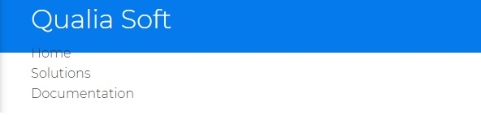

Now we'll use flexbox to arrange our navbar links. But we don't want to apply `flexbox` to the whole container itself, so we added another CSS class in our HTML called "flex" (`<div class="container flex">`) which we are going to create a CSS class for.

```css
.flex {
  display: flex;
}
```

If we want our navbar to be centered (logo centered and links) we can add `justify-content: center;`, and if we want to align them vertically: `align-items: center;`

However, we'll use the `.flex` class as a general purpose flexbox container (where we keep `justify-content: center;`), so we'll make another declarations for navbar, like this:

```css
/* Navbar */
.navbar {
  background-color: #047aed;
  color: #fff;
  height: 70px;
}

.navbar .flex {
  justify-content: space-between;
}

.container {
  max-width: 1100px;
  margin: 0 auto;
  overflow: auto;
  padding: 0 40px;
}

.flex {
  display: flex;
  justify-content: center;
  align-items: center;
  height: 100%;
}
```

<br/>

**Now, time to work on the links:**

```css
.navbar ul {
  display: flex;
}
```

`.navbar ul { display: flex; }` will display the links in the navbar horizontally (as we wanted)

```css
.navbar ul {
  display: flex;
}

.navbar a {
  color: #fff;
  padding: 10px;
  margin: 0 5px;
}

.navbar a:hover {
  border-bottom: 2px #fff solid;
}
```

Already looks good:

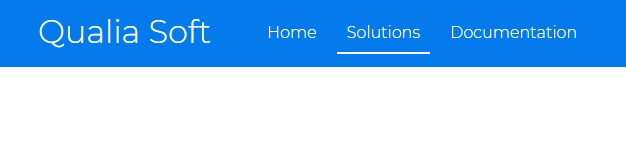

**Note:** So far we will make the website responsive for desktop first.

# Index.html page

## Showcase section

```html
<!-- Showcase | Hero Section -->
<section class="showcase">
  <div class="container grid">
    
    <div class="showcase-text">
      <h1>Bring Alive Ideas Seamlessly</h1>
      <p>
        We create applications of all kinds, from small static websites for
        individuals to large scale enterprise software. Fill out the form
        bellow to be in queue for a Live Demonstration of your own idea
      </p>
      <a href="solutions.html" class="btn btn-outline">Read More</a>
    </div>

    <div class="showcase-form card">
      <h2>Request a Demo</h2>
      <form>
        <div class="form-control">
          <input
                 type="text"
                 name="first_name"
                 placeholder="First Name"
                 required
                 />
        </div>
        <div class="form-control">
          <input
                 type="text"
                 name="last_name"
                 placeholder="Last Name"
                 required
                 />
        </div>
        <div class="form-control">
          <input
                 type="text"
                 name="company_name"
                 placeholder="Company Name (optional)"
                 />
        </div>
        <div class="form-control">
          <input type="email" name="email" placeholder="Email" required />
        </div>
        <input type="submit" value="Send" class="btn btn-primary" />
      </form>
    </div>
  </div>
</section>
```

**Now, time to add some CSS:** (Sunday, January 10, 2021, 17:20)

```css
.showcase {
  height: 400px;
  background-color: var(--primary-color);
  color: #fff;
  position: relative;
}
```

We use `position: relative;` so that we can place elements inside that have a position of `absolute`

```css
/* Showcase | Hero Section*/
.showcase {
  height: 400px;
  background-color: var(--primary-color);
  color: #fff;
  position: relative;
}

.showcase h1 {
  font-size: 40px;
}

.showcase p {
  margin: 20px 0;
}
```

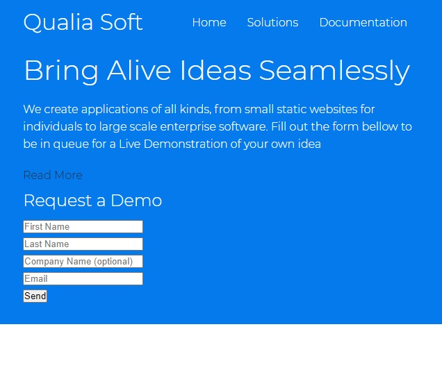

For our two items (`<div class="showcase-text">` and `<div class="showcase-form card">`) within our `<section class="showcase"> <div class="container grid">`, we want to display them in grid on two separate columns (for desktop view, we will later adjust them to display as rows for mobile).

```css
.grid {
  display: grid;
  grid-template-columns: 1fr 1fr;
  gap: 20px;
  justify-content: center;
  align-items: center;
  height: 100%;
}
```

**Note** that `align-items: center;` with a grid will not align items vertically (yet) unless we mention a `height` property.

We can now customize our grid even further for by adding a new CSS grid class within `.showcase`:

```css
.showcase .grid {
  grid-template-columns: 60% 40%;
  gap: 30px;
}
```

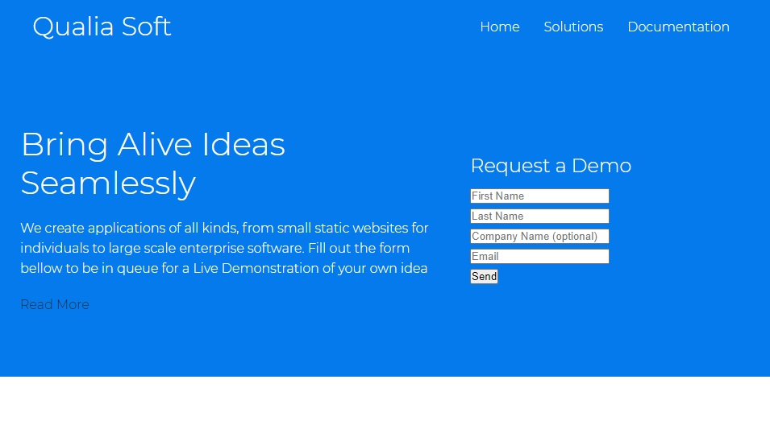

<br/>

### Form Card Layout

**Now let's make a card like layout for our form**

```html
<!-- HMTL -->
<div class="showcase-form card">
```


```css
.card {
  background-color: #fff;
  color: var(--font-color);
  border-radius: 30px;
  box-shadow: 0 3px 10px rgba(0, 0, 0, 0.2);
  padding: 20px;
  margin: 10px;
}
```

Perfect.

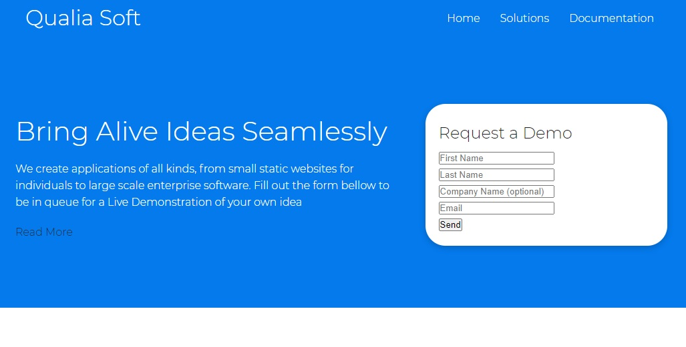

<br/>

**Now let's customize our Form**

First, we need to set `position: relative;` to our form in order to use `top` (or `right`, `bottom`, `left`) properties. We are going to push down the form 60px by setting `top: 60px;`

Then we can set `height: 350px;` to have the form going outside the container, but we'll need to also set in our `.showcase .grid` class the `overflow: visible;` in order to hide the scrollbar that will appear for that form.

```css
.showcase .grid {
  grid-template-columns: 60% 40%;
  gap: 30px;
  overflow: visible;
}

.showcase-form {
  position: relative;
  top: 60px;
  height: 350px;
}
```

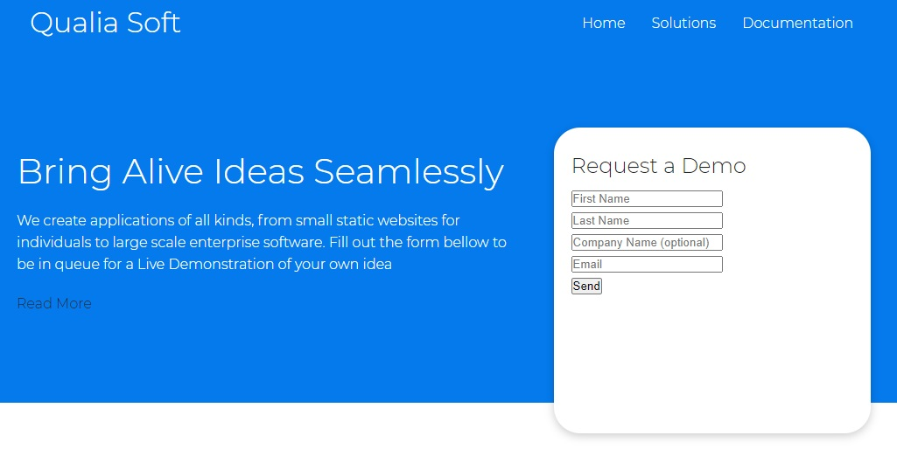

We can also add `z-index: 100;` to make sure our form will always show in front of other elements (it is useful for the time we will use animations and keyframes, for having the both items `showcase-text` and `showcase-form` coming from sides - for left and from right).

We also add `justify-self: flex-end` to push the form to the right.

```css
.showcase-form {
  position: relative;
  top: 60px;
  height: auto;
  width: 100%;
  padding: 20px 40px;
  z-index: 100;
  justify-self: flex-end;
}
```

<br/>

### Form Customize Inputs

**Continuing to customize our Form**

We'll add `margin: 30px 0;` (margin top and bottom to 30px) to separate (horizontally) each input in our form

However, if we target `showcase-form input` we will also target the button, so in order to style our inputs, we'll put `input[type='text']`

```css
.showcase-form .form-control {
  margin: 30px 0;
}

.showcase-form input[type="text"],
.showcase-form input[type="email"] {
  border: 0;
  border-bottom: 1px solid #b4becb;
  width: 100%;
  padding: 3px;
  font-size: 16px;
}

.showcase-form input:focus {
  outline: none;
}
```

We overwrite the default border cassettes around each input with `border: 0;`, but we add a `border-bottom` to have a nice separation. We'll set `width: 100%;` to make sure the inputs don't go outside the container (card).

We'd also want to get rid of the default border that appears when user clicks the form (focus): `.showcase-form input:focus {outline: none;}`

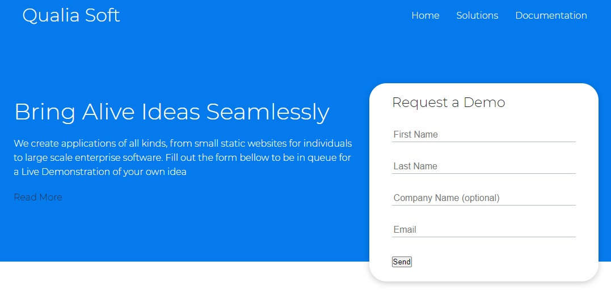

<br/>

### Customize Buttons

**Now, styling the buttons** - Sunday, January 10, 2021, 18:23

```html
<!-- HTML -->
<a href="solutions.html" class="btn btn-outline">Read More</a>
<input type="submit" value="Send" class="btn btn-primary" />
```

We will add `.btn`  class (the base button style for the webpage) as our CSS utility classes

`display: inline-block;` will work for both buttons and links, in order to make arrange them as inline blocks.

We'll set `cursor: pointer;` to show a pointer when user is hovering over the button (or link with `btn` class)

We'll get rid of default border around it

We'll also add a separate class `btn-outline` that we can apply to other buttons (customize them)

```css
.btn {
  display: inline-block;
  padding: 10px 30px;
  cursor: pointer;
  background-color: var(--primary-color);
  color: #fff;
  border: none;
  border-radius: 5px;
  transition: all 100ms;
}

.btn-outline {
  background-color: transparent;
  border: 1px #fff solid;
}

.btn:hover {
  transform: scale(0.97);
}
```

We also add some hover effect with `.btn:hover { transform: scale(0.97); }` which will animate with a `transition: all 100ms;`

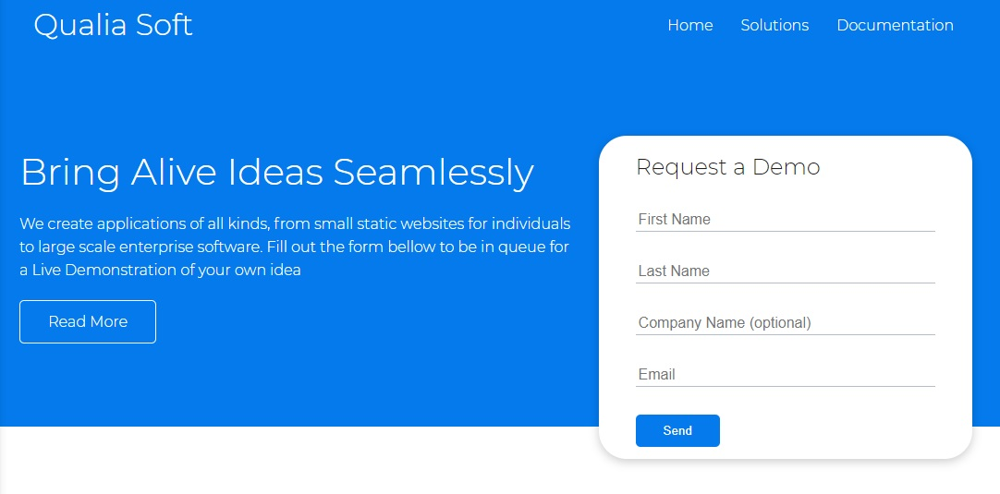

<br/>

### Add Details Personality to the page

**Let's add a slant (angled edge, sloped line) to our showcase section**

For this, we'll use the `:before` and `:after` pseudo-selector classes. We can use `position: absolute` here because we specified position relative in our main `.showcase` class.

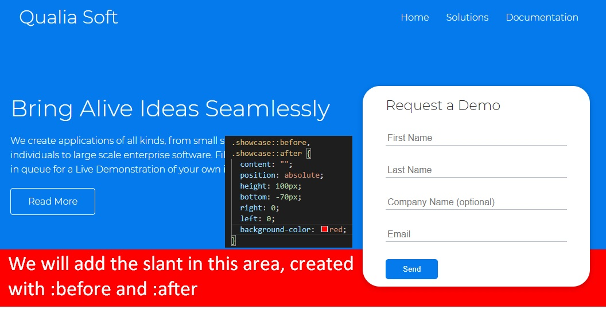

We'll create the angled edge using `transform: skewY(-3deg);`, and we'll switch back our background color to white (instead of red, as shown in example ^^)

Also, to make sure this will work on every browser, we will add `-webkit-transform` (Chrome and Safari), `-moz-transform`  (Mozilla Firefox) and `-ms-transform` (Internet Explorer)

```css
.showcase::before,
.showcase::after {
  content: "";
  position: absolute;
  height: 100px;
  bottom: -70px;
  right: 0;
  left: 0;
  background: #fff;
  transform: skewY(-2deg);
  -webkit-transform: skewY(-2deg);
  -moz-transform: skewY(-2deg);
  -ms-transform: skewY(-2deg);
}
```

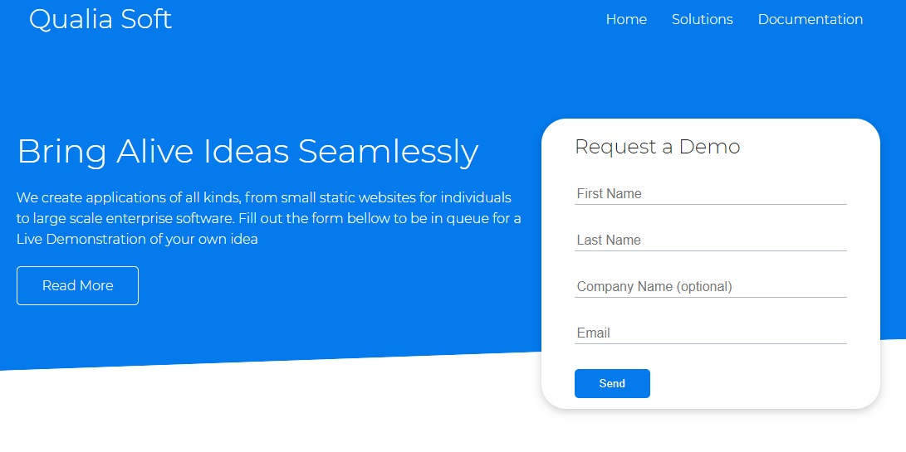

<br/>

***All CSS Code So far***

```css
@import url("https://fonts.googleapis.com/css2?family=Montserrat:wght@300&display=swap");

:root {
  --font-color: #222;
  --primary-color: #047aed;
}

/* Overwrite HTML Defaults */
* {
  box-sizing: border-box;
  padding: 0;
  margin: 0;
}

body {
  font-family: "Montserrat", sans-serif;
  color: var(--font-color);
  line-height: 1.6;
}

ul {
  list-style-type: none;
}

a {
  text-decoration: none;
  color: var(--font-color);
}

h1,
h2 {
  font-weight: 300;
  line-height: 1.2;
  margin: 10px 0;
}

p {
  margin: 10px 0;
}

img {
  width: 100%;
}

/* Navbar */
.navbar {
  background-color: var(--primary-color);
  color: #fff;
  height: 70px;
}

.navbar .flex {
  justify-content: space-between;
}

.navbar ul {
  display: flex;
}

.navbar a {
  color: #fff;
  padding: 10px;
  margin: 0 5px;
}

.navbar a:hover {
  border-bottom: 2px #fff solid;
}

/* Utilities: Classes for reuse */
.container {
  max-width: 1100px;
  margin: 0 auto;
  overflow: auto;
  padding: 0 40px;
}

.flex {
  display: flex;
  justify-content: center;
  align-items: center;
  height: 100%;
}

.grid {
  display: grid;
  grid-template-columns: 1fr 1fr;
  gap: 20px;
  justify-content: center;
  align-items: center;
  height: 100%;
}

.card {
  background-color: #fff;
  color: var(--font-color);
  border-radius: 30px;
  box-shadow: 0 3px 10px rgba(0, 0, 0, 0.2);
  padding: 20px;
  margin: 10px;
}

.btn {
  display: inline-block;
  padding: 10px 30px;
  cursor: pointer;
  background-color: var(--primary-color);
  color: #fff;
  border: none;
  border-radius: 5px;
  transition: all 100ms;
}

.btn-outline {
  background-color: transparent;
  border: 1px #fff solid;
}

.btn:hover {
  transform: scale(0.97);
}

/* Showcase | Hero Section */
.showcase {
  position: relative;
  height: 400px;
  background-color: var(--primary-color);
  color: #fff;
}

.showcase h1 {
  font-size: 40px;
}

.showcase p {
  margin: 20px 0;
}

.showcase .grid {
  grid-template-columns: 60% 40%;
  gap: 30px;
  overflow: visible;
}

.showcase-form {
  position: relative;
  top: 60px;
  height: auto;
  width: 100%;
  padding: 20px 40px;
  z-index: 100;
  justify-self: flex-end;
}

.showcase-form .form-control {
  margin: 30px 0;
}

.showcase-form input[type="text"],
.showcase-form input[type="email"] {
  border: 0;
  border-bottom: 1px solid #b4becb;
  width: 100%;
  padding: 3px;
  font-size: 16px;
}

.showcase-form input:focus {
  outline: none;
}

.showcase::before,
.showcase::after {
  content: "";
  position: absolute;
  height: 100px;
  bottom: -70px;
  right: 0;
  left: 0;
  background: #fff;
  transform: skewY(-2deg);
  -webkit-transform: skewY(-2deg);
  -moz-transform: skewY(-2deg);
  -ms-transform: skewY(-2deg);
}
```

***---***


## Stats section

```html
<!-- HTML -->
<!-- Stats -->
<section class="stats">
  <div class="container">
    <h3 class="stats-heading text-center my-1">
      Achievements we've reached so far
    </h3>

    <div class="grid grid-3 text-center my-4">
      <div>
        <i class="fas fa-server fa-3x"></i>
        <h3>174</h3>
        <p class="text-secondary">Deployed Software Applications</p>
      </div>
      <div>
        <i class="far fa-building fa-3x"></i>
        <h3>58</h3>
        <p class="text-secondary">Registered Software Companies</p>
      </div>
      <div>
        <i class="far fa-smile-beam fa-3x"></i>
        <h3>131</h3>
        <p class="text-secondary">Happy Clients</p>
      </div>
    </div>
  </div>
</section>
```

`text-center` will be a class for centering text only.`my-1` will be a class for margin in top and bottom (`y` name is for `y-axis`, vertically). These will be all utility classes in order to help with css and reduce manually adding margin and padding to each css of an element (remember that `rem` units represent the current text-size multiplied by specified number - *relative to font-size of the root element*).

We'll also have a separate `grid-3` class

Note: we can seamlessly create font-awesome icons with Emmet, just by writing `i.fas.fa-server.fa-3x` which will autocomplete to `<i class="fas fa-server fa-3x"></i>`

We'll create a `text-secondary` class

**Let's get into CSS**

```css
/* Utilities: Classes for reuse */
.grid-3 {
  grid-template-columns: repeat(3, 1fr);
}

.text-center {
  text-align: center;
}

/* Utilities: Margins */
/* Margins for top and bottom */
.my-1 {
  margin: 1rem 0;
}
.my-2 {
  margin: 1.5rem 0;
}
.my-3 {
  margin: 2rem 0;
}
.my-4 {
  margin: 3rem 0;
}
.my-5 {
  margin: 4rem 0;
}

/* Margins for all around */
.m-1 {
  margin: 1rem;
}
.m-2 {
  margin: 1.5rem;
}
.m-3 {
  margin: 2rem;
}
.m-4 {
  margin: 3rem;
}
.m-5 {
  margin: 4rem;
}

/* Paddings for top and bottom */
.py-1 {
  padding: 1rem 0;
}
.py-2 {
  padding: 1.5rem 0;
}
.py-3 {
  padding: 2rem 0;
}
.py-4 {
  padding: 3rem 0;
}
.py-5 {
  padding: 4rem 0;
}

/* Paddings for all around */
.p-1 {
  padding: 1rem;
}
.p-2 {
  padding: 1.5rem;
}
.p-3 {
  padding: 2rem;
}
.p-4 {
  padding: 3rem;
}
.p-5 {
  padding: 4rem;
}
```

Ok we almost created our own framework with these utility classes.

**Note** that we can separate the `style.css` file into two files: `style.css` and `utilities.css`, and add it into our `index.html` with `<link rel="stylesheet" href="css/utilities.css" />`. But **beware** that the order of classes in CSS matters, so, when we are adding the two files to `index.html` we need to import these in this order (the utilities will be first, because we will sometimes overwrite over them!)

```html
<head>
  <link rel="stylesheet" href="css/utilities.css" />
  <link rel="stylesheet" href="css/style.css" />
</head>
```

**Now for the Stats Section:**

```css
/* Stats Section */
.stats {
  padding-top: 100px;
}

.stats-heading {
  max-width: 500px;
  margin: auto;
}

.stats .grid h3 {
  font-size: 35px;
}

.stats .grid p {
  font-size: 20px;
  font-weight: bold;
}
```

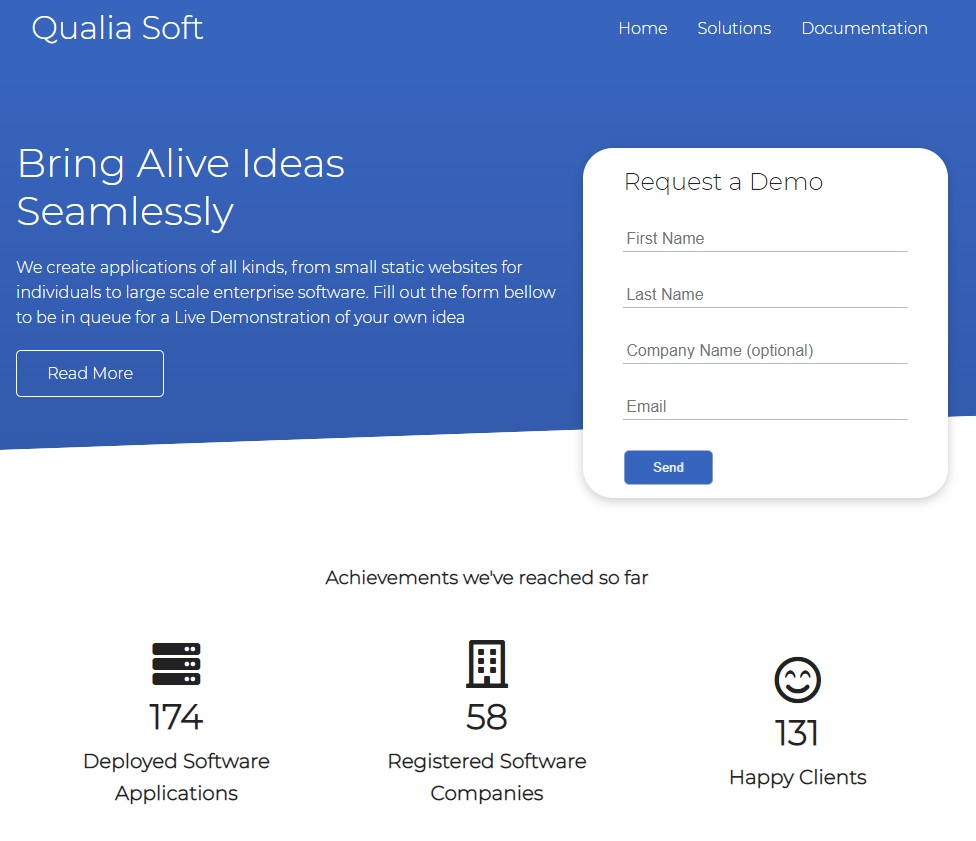

<br/>

## Steps CLI section

```html
<!-- HTML -->
<!-- Solutions -->
<section class="steps">
  <div class="container grid">
    
    <div class="card">
      <h3>Pick the right app that suits your idea</h3>
    </div>
    <div class="card">
      <h3>Get weekly updates on your app development</h3>
    </div>
    <div class="card">
      <h3>Deploy and see live metrics about yout app</h3>
    </div>
  </div>
</section>
```

For this section, we want two have a grid with 2 columns, but then each column (on the right) will have multiple rows. So, we want to have two columns, 3 rows, but we the first column to span over the 3 rows.

One solution for this can be to actually make multiple items as grid themselves, then we would have a grid within a grid. However, we can also just select the first item (as first child) to span over the entire first column.

... However we can make this even interesting: we will have 3 columns and 3 rows, and we'd want to span (extend) the first child over the first two columns, and over the three rows.

```css
/* Solutions CLI Section */
.steps .grid {
  grid-template-columns: repeat(3, 1fr);
  grid-template-rows: repeat(3, 1fr);
}

.steps .grid > *:first-child {
  grid-column: 1 / span 2;
  grid-row: 1 / span 3;
}
```

So here's the result - Sunday, January 10, 2021, 21:58 

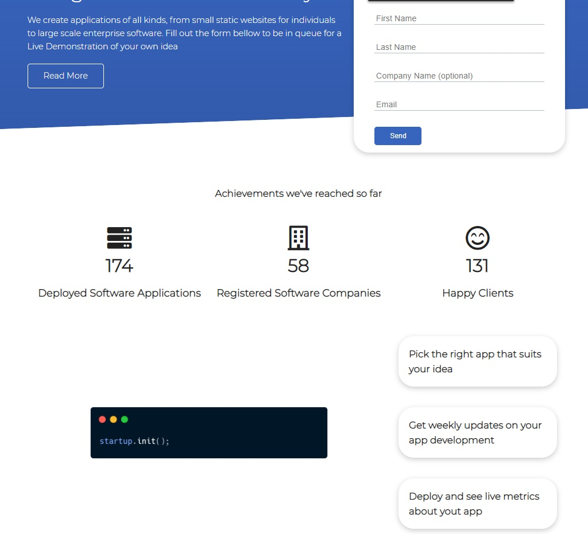

***CSS Grid really makes everything easier***

<br/>

## Banner section

Here we'll make a new class called `bg-primary` where we'll put our primary color as background

We'll also used the already created utility CSS classes `my-2` and `py-2`, and `my-1`

We'll introduce a new utility class called `lg` (that stands for *large*) and another class called `lead` for bigger paragraphs; as well as `sm` (for small text-size, which will be 1rem == 16px in HTML's default), `md` as medium (2rem or 32px), `lg` (3rem) and `xl` (4rem)

We'll add another class for `btn-dark`

```html
<!-- Banner -->
<section class="banner bg-primary my-2 py-2">
  <div class="container grid">
    <div class="text-center">
      <h2 class="lg">Discover Our Digital Capabilities</h2>
      <p class="lead my-1">
        With an acumulated experience from a talented team of developers, we
        deliver beautiful apps right on time
      </p>
      <a href="solutions.html" class="btn btn-dark">Read More</a>
    </div>
    
  </div>
</section>
```

**Now for the CSS part**

We can also have the following variables for our colors:

```css
/* style.css */
:root {
  --font-color: #222;
  --primary-color: #3764bd;
  --secondary-color: #325aac;
  --dark-color: #011627;
  --light-color: #83bceb;
}
```

Utility classes:

```css
/* utilities.css */
/* Backgrounds & colored buttons */
.bg-primary,
.btn-primary {
  background-color: var(--primary-color);
  color: #fff;
}

.btn-secondary,
.bg-secondary {
  background-color: var(--secondary-color);
  color: #fff;
}

.bg-dark,
.btn-dark {
  background-color: var(--dark-color);
  color: #fff;
}

.btn-light,
.bg-light {
  background-color: var(--light-color);
  color: var(--font-color);
}

/* Text sizes */
.lead {
  font-size: 20px;
}
.sm {
  font-size: 1rem;
}
.md {
  font-size: 2rem;
}
.lg {
  font-size: 3rem;
}
.xl {
  font-size: 4rem;
}
.text-center {
  text-align: center;
}
```

Our section's CSS

```css
/* style.css */
/* Banner Section */
.banner .grid {
  grid-template-columns: 4fr 3fr;
}
```

And voila:

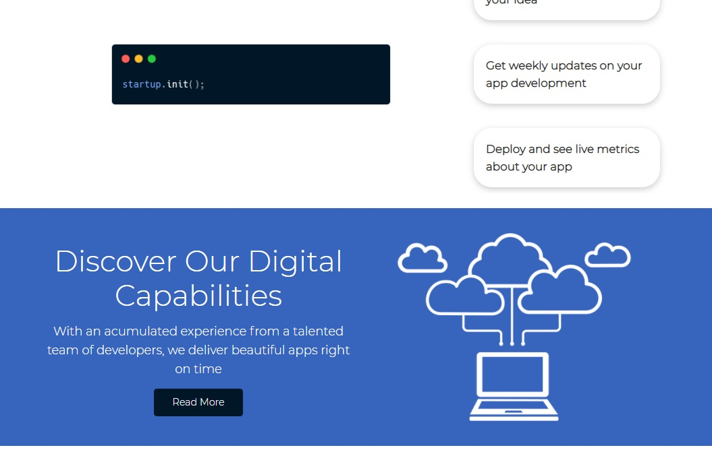

<br/>

Even if the [tutorial at 1h5m](https://youtu.be/p0bGHP-PXD4?t=3936) ends here with this section... I've decided to go a step further and and a slant (angled edge) like we did on the Showcase / Hero section.

**Let's add slant (angled edge) here too**

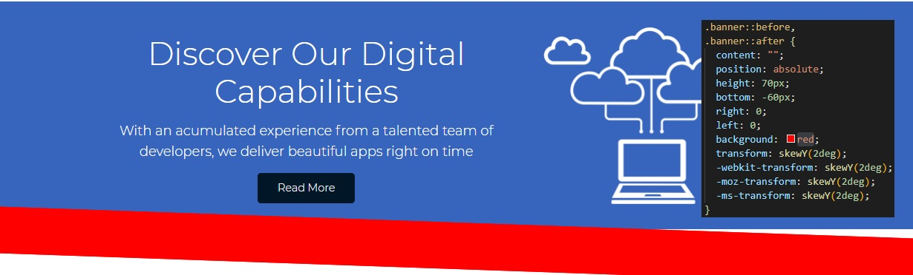

Here's the entire CSS part for our Banner Section

```css
/* style.css */
/* Banner Section */
.banner .grid {
  grid-template-columns: 4fr 3fr;
}

.banner {
  position: relative;
}

.banner::before,
.banner::after {
  content: "";
  position: absolute;
  height: 75px;
  bottom: -60px;
  right: 0;
  left: 0;
  background: #fff;
  transform: skewY(2deg);
  -webkit-transform: skewY(2deg);
  -moz-transform: skewY(2deg);
  -ms-transform: skewY(2deg);
}
```


Oook or maybe we can put the sloped edge before our section (replace bottom with top):

```css
.banner::before,
.banner::after {
  content: "";
  position: absolute;
  height: 65px;
  top: -45px;
  right: 0;
  left: 0;
  background: #fff;
  transform: skewY(2deg);
  -webkit-transform: skewY(2deg);
  -moz-transform: skewY(2deg);
  -ms-transform: skewY(2deg);
}
```

Oke done!

<br/>

## Technologies section

```html
<!-- Technologies -->
<section class="technologies">
  <h2 class="md text-center my">Tech Stack we use</h2>
  <div class="container flex">
    <div class="card">
      <h4>Django</h4>
      
    </div>
    <div class="card">
      <h4>Node.js</h4>
      
    </div>
    <div class="card">
      <h4>Go</h4>
      
    </div>
    <div class="card">
      <h4>Ruby</h4>
      
    </div>
    <div class="card">
      <h4>C#</h4>
      
    </div>
    <div class="card">
      <h4>PHP</h4>
      
    </div>
    <div class="card">
      <h4>Scala</h4>
      
    </div>
  </div>
</section>
```

**Now for the CSS**

```css
/* Technologies Section */
.technologies .flex {
  flex-wrap: wrap;
}

.technologies .card {
  text-align: center;
  margin: 18px 10px 40px;
  transition: transform 100ms ease-in;
}

.technologies .card .h4 {
  font-size: 20px;
  margin-bottom: 10px;
}

.technologies .card:hover {
  transform: translateY(-15px);
}
```

We used `transform: translateY(-15px);` so when the user is hovering over a card, the card goes up 10px. (We don't forget adding `transition: transform 100ms;` to seem more interactive / have a smoother transition)

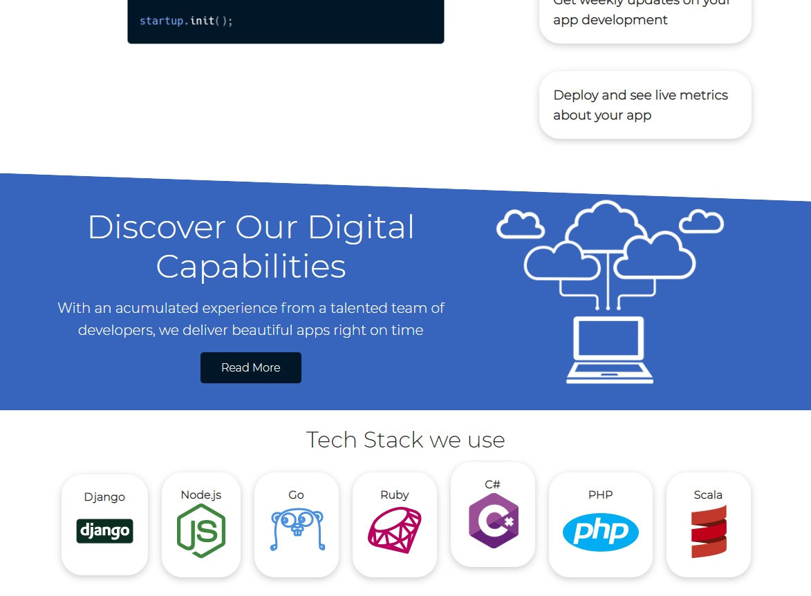

And with transition:


...

Wait.

I have a crazy idea.

What if, instead of using a simple hover that moves the card up... what if we do an infinite bounce while the user hovers it?

After a bit of playing with animations (without any luck on finding the code already on the Internet), I came up with this:

```css
/* Technologies Section */
.technologies .flex {
  flex-wrap: wrap;
}

.technologies .card {
  text-align: center;
  margin: 18px 10px 40px;
}

.technologies .card .h4 {
  font-size: 20px;
  margin-bottom: 10px;
}

.technologies .card:hover {
  animation-name: bounce;
  animation-duration: 250ms;
  animation-iteration-count: infinite;
  animation-direction: alternate;
  animation-timing-function: ease-out;
}

@keyframes bounce {
  0% {
    transform: translateY(0px);
  }
  100% {
    transform: translateY(-15px);
  }
}
```


Wonderful. (Monday, January 11, 2021, 00:00)

<br/>

## Footer section

```html
<!-- Footer -->
<footer class="footer bg-dark py-5">
  <div class="container grid grid-3">
    <div>
      <h1>Qualia Soft</h1>
      <p>
        Copyright &copy; 2021<br />
        Made by Radu-Alexandru Bulai
      </p>
    </div>

    <nav>
      <ul>
        <li><a href="index.html">Home</a></li>
        <li><a href="solutions.html">Solutions</a></li>
        <li><a href="docs.html">Documentation</a></li>
      </ul>
    </nav>

    <div class="social">
      <a
         target="_blank"
         rel="noopener noreferrer"
         href="https://radubulai.com"
         ><i class="fas fa-globe fa-2x"></i
        ></a>
      <a
         target="_blank"
         rel="noopener noreferrer"
         href="https://github.com/radualexandrub"
         title="GitHub"
         ><i class="fab fa-github fa-2x"></i
        ></a>
      <a
         target="_blank"
         rel="noopener noreferrer"
         href="https://www.linkedin.com/in/radu-alexandru-bulai"
         ><i class="fab fa-linkedin fa-2x"></i
        ></a>
      <a
         target="_blank"
         rel="noopener noreferrer"
         href="https://dev.to/radualexandrub"
         title="Dev.to"
         ><i class="fab fa-dev fa-2x"></i
        ></a>
    </div>
  </div>
</footer>
```

So far our links in the footer are black (on a dark/black background), so we need to overwrite links color in our `utilities.css`

```css
/* utilities.css */
.bg-primary a,
.btn-primary a,
.btn-secondary a,
.bg-secondary a,
.bg-dark a,
.btn-dark a {
  color: #fff;
}
```

And our footer's CSS in `style.css`:

```css
/* Footer */
.footer .social a {
  margin: 0 10px;
}

.footer a:hover {
  color: #ddd;
}

.footer .social i {
  transition: transform 100ms;
}

.footer .social i:hover {
  transform: scale(1.1);
}
```

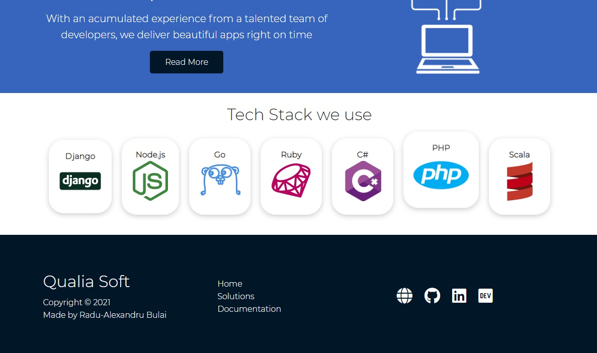

<br/>

## Media Queries for Mobile

Also, for mobile (smaller screens), we'll set the direction of the navbar vertically (`flex-direction: column;`) and add additional properties to make it responsive (eg, hide potentially scrollbar on navbar links that could appear, add transparent background, padding etc.)

For the mobile part, we'll just set for *all the grids* that we used: `grid-template-columns: 1fr;`

In our showcase (hero section), we'll set the height to auto in order to not overlap the whole hero section (with the form included) over the next section (Stats section). We can also center everything here for tablet and mobile screens. On the form part, we'll use `justify-self: center;` to align only this item (the form) on the center, and we also add `margin: auto;` to make sure it stays in the middle. We can also reduce the form's size.

```css
/* Tablets and under */
@media (max-width: 768px) {
  .grid,
  .showcase .grid,
  .stats .grid,
  .steps .grid,
  .banner .grid {
    grid-template-columns: 1fr;
    grid-template-rows: 1fr;
  }

  .showcase {
    height: auto;
  }

  .showcase-text {
    text-align: center;
    margin-top: 40px;
  }

  .showcase-form {
    justify-self: center;
    margin: auto;
    max-width: 500px;
  }
}

/* Mobile */
@media (max-width: 550px) {
  .navbar {
    height: 90px;
  }

  .navbar .flex {
    flex-direction: column;
    overflow: visible;
    justify-content: center;
  }

  .navbar ul {
    padding: 10px;
    background-color: rgba(0, 0, 0, 0.1);
  }
}
```

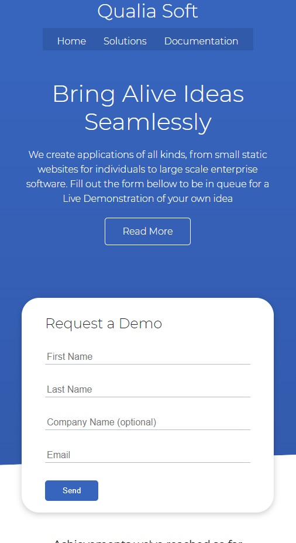

However, we need to reset the Steps (CLI) Section, because the spanning part of the first element over the other ones really messes up things in mobile (because we've set `grid-template-columns: 1fr;` and `grid-template-rows: 1fr;`).

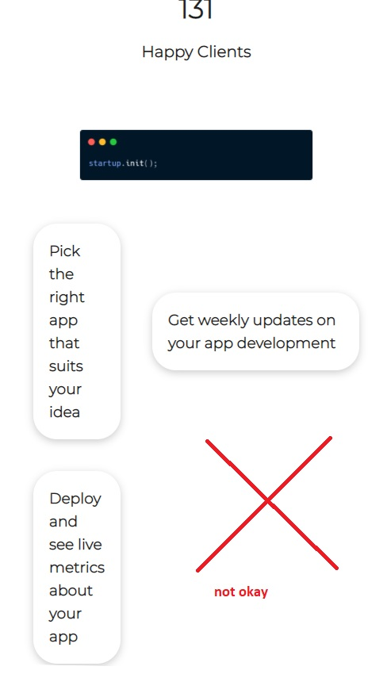

So, in order to reset the previous grid arrangement, we add:

```css
.steps .grid > *:first-child {
  grid-column: 1;
  grid-row: 1;
}
```

<br/>


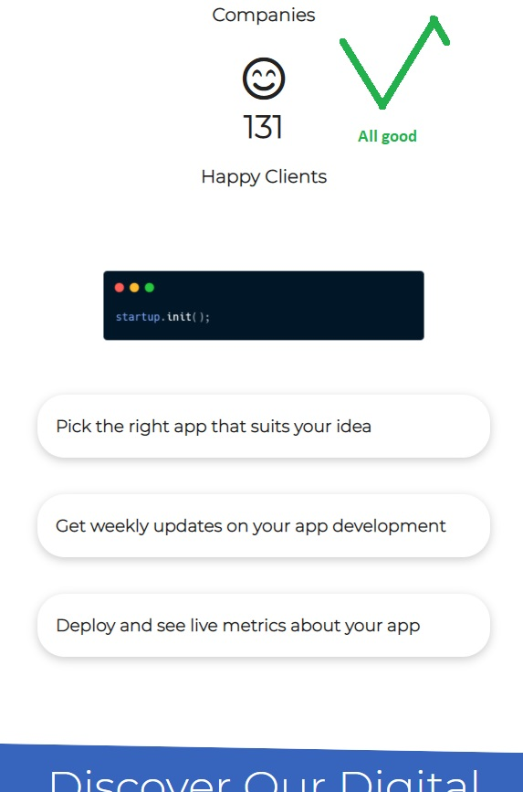

# Solutions.html page

## Solutions Head Hero section

```html
<!DOCTYPE html>
<html lang="en">
  <head>
    <meta charset="UTF-8" />
    <meta name="viewport" content="width=device-width, initial-scale=1.0" />
    <link rel="stylesheet" href="css/utilities.css" />
    <link rel="stylesheet" href="css/style.css" />
    <link
      rel="stylesheet"
      href="https://cdnjs.cloudflare.com/ajax/libs/font-awesome/5.15.1/css/all.min.css"
    />
    <title>Qualia Soft | Software Solutions for Everyone</title>
  </head>
  <body>
    <!-- Navbar: Logo and Navigation -->
    <div class="navbar">
      <div class="container flex">
        <h1 class="logo">Qualia Soft</h1>
        <nav>
          <ul>
            <li><a href="index.html">Home</a></li>
            <li><a href="solutions.html">Solutions</a></li>
            <li><a href="docs.html">Documentation</a></li>
          </ul>
        </nav>
      </div>
    </div>

    <!-- Head / Hero -->
    <section class="solutions-head bg-primary py-3">
      <div class="container grid">
        <div>
          <h1 class="xl">Solutions</h1>
          <p class="lead">
            Check out the solutions we offer that separate us from the
            competition
          </p>
        </div>
        
      </div>
    </section>

    <!-- Footer -->
    <footer class="footer bg-dark py-5">
      <div class="container grid grid-3">
        <div>
          <h1>Qualia Soft</h1>
          <p>
            Copyright &copy; 2021<br />
            Made by
            <a
              target="_blank"
              rel="noopener noreferrer"
              href="https://radubulai.com"
              >Radu-Alexandru Bulai</a
            >
          </p>
        </div>

        <nav>
          <ul>
            <li><a href="index.html">Home</a></li>
            <li><a href="solutions.html">Solutions</a></li>
            <li><a href="docs.html">Documentation</a></li>
          </ul>
        </nav>

        <div class="social">
          <a
            target="_blank"
            rel="noopener noreferrer"
            href="https://radubulai.com"
            ><i class="fas fa-globe fa-2x"></i
          ></a>
          <a
            target="_blank"
            rel="noopener noreferrer"
            href="https://github.com/radualexandrub"
            title="GitHub"
            ><i class="fab fa-github fa-2x"></i
          ></a>
          <a
            target="_blank"
            rel="noopener noreferrer"
            href="https://www.linkedin.com/in/radu-alexandru-bulai"
            ><i class="fab fa-linkedin fa-2x"></i
          ></a>
          <a
            target="_blank"
            rel="noopener noreferrer"
            href="https://dev.to/radualexandrub"
            title="Dev.to"
            ><i class="fab fa-dev fa-2x"></i
          ></a>
        </div>
      </div>
    </footer>
  </body>
</html>
```

**Note** that we will continuingly use the CSS classes created in `utilities.css` in other pages too!

Now, for the little CSS part (we'll create that `.solutions-head` class)

```css
/******************/
/* solutions.html */
/******************/

/* Solutions Head / Hero section */
.solutions-head img {
  width: 200px;
  justify-self: flex-end;
}
```

We used `justify-self: flex-end;` to push the image item (within the flexbox container) to the end.

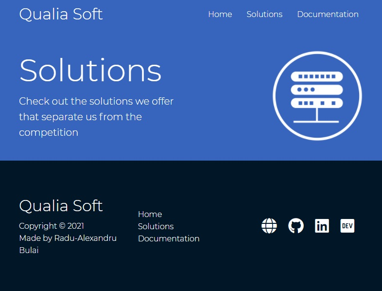