Credits / Notes taken from:

- [Learn HTML Forms in 25 Minutes - Web Dev Simplified](https://www.youtube.com/watch?v=fNcJuPIZ2WE)
- [freeCodeCamp Survey Form from Responsive Web Design Course -> Form Challenge](https://www.freecodecamp.org/learn/responsive-web-design/responsive-web-design-projects/build-a-survey-form)
- 

# HTML Forms

We can see all the input types of a form from [here](https://www.w3schools.com/html/html_form_input_types.asp):

- `<input type="button">`
- `<input type="checkbox">`
- `<input type="color">`
- `<input type="date">`
- `<input type="datetime-local">`
- `<input type="email">`
- `<input type="file">`
- `<input type="hidden">`
- `<input type="image">`
- `<input type="month">`
- `<input type="number">`
- `<input type="password">`
- `<input type="radio">`
- `<input type="range">`
- `<input type="reset">`
- `<input type="search">`
- `<input type="submit">`
- `<input type="tel">`
- `<input type="text">`
- `<input type="time">`
- `<input type="url">`
- `<input type="week">`

And all the HTML Form elements from [here](https://www.w3schools.com/html/html_form_elements.asp):

- `<input>`
- `<label>`
- `<select>`
- `<textarea>`
- `<button>`
- `<fieldset>`
- `<legend>`
- `<datalist>`
- `<output>`
- `<option>`
- `<optgroup>`

<br/>

## Form Example without style

Here's a Form that contains almost all input types:

```html
<div>
  <form action="./" method="GET" enctype="multipart/form-data">
    <div>
      <label for="name">Name</label>
      <input type="text" name="name" id="name" required>
    </div>

    <div>
      <label for="email">Email</label>
      <input type="email" name="email" id="email" required>
    </div>

    <div>
      <label for="phone">Phone</label>
      <input type="tel" name="phone" id="phone">
    </div>

    <div>
      <label for="age">Age</label>
      <input type="number" name="age" id="age" min="1" max="200" step="1">
    </div>

    <div>
      <label for="url">Website URL</label>
      <input type="url" name="url" id="url">
    </div>

    <div>
      <label for="password">Password</label>
      <input type="password" name="password" id="password" required>
    </div>

    <div>
      <label for="date">Birthdate</label>
      <input type="date" name="date" id="date" min="2019-06-10">
    </div>

    <div>
      <label for="week">Week</label>
      <input id="week" type="week" name="week">
    </div>

    <div>
      Favorite Food Checkbox
      <div>
        <input type="checkbox" name="banana" id="banana">
        <label for="banana">Banana</label>
      </div>
      <div>
        <input type="checkbox" name="apple" id="apple">
        <label for="apple">Apple</label>
      </div>
    </div>

    <div>
      Gender Radio
      <div>
        <input type="radio" name="gender" id="male" value="male">
        <label for="male">Male</label>
      </div>
      <div>
        <input type="radio" name="gender" id="female" value="female">
        <label for="female">Female</label>
      </div>
    </div>

    <div>
      <label for="eyeColor">Eye Color</label>
      <select name="eyeColor" id="eyeColor">
        <option value="Green">Green</option>
        <option value="Red">Red</option>
      </select>
    </div>

    <div>
      <label for="bio">Bio</label>
      <textarea id="bio" name="bio" rows="4"></textarea>
    </div>

    <div>
      <label for="range">Range</label>
      <input id="range" type="range" name="range" min="1" max="10">
    </div>

    <div>
      <label for="file">File</label>
      <input id="file" type="file" name="file">
    </div>

    <input type="hidden" name="hidden" value="hi">

    <div class="form__item--buttons">
      <button type="submit">Submit</button>
      <button type="reset">Reset</button>
    </div>
  </form>
</div>
```

This will render:

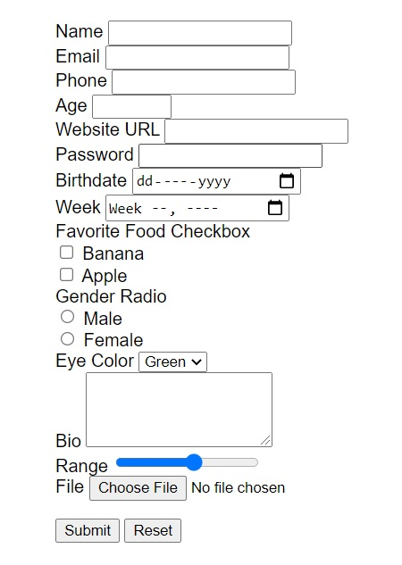


<br/>

## Customize basic HTML form elements

One of the best ways to style a form is by having custom CSS classes for each `<input>` and `<label>`, and a `<div>` that wraps them both.

Now we can customize our form only by using CSS classes (in our `style.css` we will not make any selection by HTML elements).

```html
<!DOCTYPE html>
<html lang="en">

<head>
  <meta charset="UTF-8">
  <meta http-equiv="X-UA-Compatible" content="IE=edge">
  <meta name="viewport" content="width=device-width, initial-scale=1.0">
  <title>All forms elements and customization</title>
  <link rel="stylesheet" href="./style.css">
</head>

<body>
  <div class="container">
    <div class="form-container">
      <form class="form" action="./" method="GET" enctype="multipart/form-data">
        <div class="form__item">
          <label class="form__label" for="name">Name</label>
          <input class="form__input" type="text" name="name" id="name" required>
        </div>

        <div class="form__item">
          <label class="form__label" for="email">Email</label>
          <input class="form__input" type="email" name="email" id="email" required>
        </div>

        <div class="form__item">
          <label class="form__label" for="phone">Phone</label>
          <input class="form__input" type="tel" name="phone" id="phone" placeholder="555-555-xxxx">
        </div>

        <div class="form__item">
          <label class="form__label" for="age">Age</label>
          <input class="form__input" type="number" name="age" id="age" min="1" max="200" step="1">
        </div>

        <div class="form__item">
          <label class="form__label" for="url">Website URL</label>
          <input class="form__input" type="url" name="url" id="url">
        </div>

        <div class="form__item">
          <label class="form__label" for="password">Password</label>
          <input class="form__input" type="password" name="password" id="password" required>
        </div>

        <div class="form__item">
          <label class="form__label" for="date">Birthdate</label>
          <input class="form__input" type="date" name="date" id="date" min="2019-06-10">
        </div>

        <div class="form__item">
          <label class="form__label" for="week">Week</label>
          <input class="form__input" id="week" type="week" name="week">
        </div>

        <div class="form__item">
          Favorite Food Checkbox
          <div>
            <input class="form__input" type="checkbox" name="banana" id="banana">
            <label class="form__label" for="banana">Banana</label>
          </div>
          <div>
            <input class="form__input" type="checkbox" name="apple" id="apple">
            <label class="form__label" for="apple">Apple</label>
          </div>
        </div>

        <div class="form__item">
          Gender Radio
          <div>
            <input class="form__input" type="radio" name="gender" id="male" value="male">
            <label class="form__label" for="male">Male</label>
          </div>
          <div>
            <input class="form__input" type="radio" name="gender" id="female" value="female">
            <label class="form__label" for="female">Female</label>
          </div>
        </div>

        <div class="form__item">
          <label class="form__label" for="eyeColor">Eye Color</label>
          <select name="eyeColor" id="eyeColor">
            <option value="Green">Green</option>
            <option value="Red">Red</option>
          </select>
        </div>

        <div class="form__item">
          <label class="form__label" for="bio">Bio</label>
          <textarea class="form__input" id="bio" name="bio" rows="4"></textarea>
        </div>

        <div class="form__item">
          <label class="form__label" for="range">Range</label>
          <input class="form__input" id="range" type="range" name="range" min="1" max="10">
        </div>

        <div class="form__item">
          <label class="form__label" for="file">File</label>
          <input class="form__input" id="file" type="file" name="file">
        </div>

        <input class="form__input" type="hidden" name="hidden" value="hi">

        <div class="form__item--buttons">
          <button class="form__button form__button--submit" type="submit">Submit</button>
          <button class="form__button form__button--reset" type="reset">Reset</button>
        </div>
      </form>
    </div>
  </div>

</body>

</html>
```

<br/>

And here's a basic example of customizing the form, in our `style.css`

```css
*,
*::before,
*::after {
  box-sizing: border-box;
}

::selection {
  background: #2b627c;
  color: #fff;
}

body {
  margin: 0;
  font-family: sans-serif;
}

.container {
  max-width: 720px;
  width: 100%;
  margin: 2rem auto;
}

.form-container {
  margin: 0.5rem;
  padding: 1rem 1.5rem;
  box-shadow: 0 0 3px 3px rgba(0, 0, 10, 0.1);
  border-radius: 1rem;
}

.form__item {
  margin-top: 1rem;
  display: flex;
  flex-direction: column;
}

.form__label {
  margin-bottom: 0.5rem;
}

.form__input {
  padding: 0.5rem;
  font-size: 1rem;
  border-width: 1px;
  border-color: rgba(0, 0, 10, 0.25);
  border-radius: 0.5rem;
  transition: border-color 200ms ease-in;
}

.form__input::placeholder {
  color: #bbb;
}

.form__input:focus {
  border-color: #2b627c;
  outline: 0;
}

.form__item--buttons {
  margin-top: 1rem;
}

.form__button {
  padding: 1em 2em;
  margin-right: 1rem;
  border-radius: 1rem;
  font-weight: 500;
  font-size: 0.875rem;
  letter-spacing: 1px;
  cursor: pointer;
}

.form__button.form__button--submit {
  background-color: #2b627c;
  border: 1px solid #2b627c;
  color: #fff;
}
.form__button.form__button--reset {
  background-color: #fff;
  border: 1px solid #0c1f24;
  color: #0c1f24;
}
```

<br/>

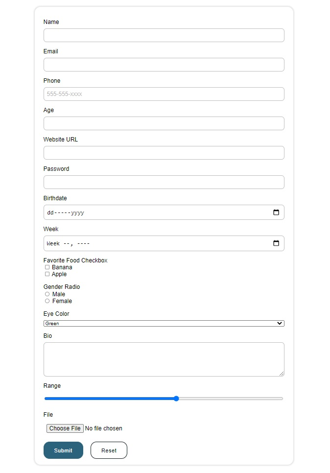

<br/>

# Styling special Form elements

Now let's see how can we style some special form elements like:

- Checkboxes: `<input type="checkbox">`
- Radio Buttons: `<input type="radio">`
- Range Slider: `<input type="range">`
- Dropdown selectors: `<select> <option></option> <option></option> </select>`
- Upload file button: `<input type="file">`

<br/>

## Checkboxes - Web Dev Simplified

Resource used:

- [Custom Checkbox Tutorial - Wev Dev Simplified](https://www.youtube.com/watch?v=YyLzwR-iXtI)

These checkboxes will also use accessibility functionalities (like toggling through tab and accessible for screen readers).

**HTML:**

```html
<div class="container">
  <div class="form-container">
    <form class="form" action="./" method="GET" enctype="multipart/form-data">

      <div class="form__item">
        <div class="form__item--title">Favorite Food Checkbox</div>
        <div class="form__item--checkbox-container">
          <input class="form__input" type="checkbox" name="banana" id="banana">
          <label class="form__label" for="banana">Banana</label>
        </div>
        <div class="form__item--checkbox-container">
          <input class="form__input" type="checkbox" name="grapefruit" id="grapefruit">
          <label class="form__label" for="grapefruit">Grapefruit</label>
        </div>
        <div class="form__item--checkbox-container">
          <input class="form__input" type="checkbox" name="blackberry" id="blackberry">
          <label class="form__label" for="blackberry">Blackberry</label>
        </div>
      </div>

      <div class="form__item--buttons">
        <button class="form__button form__button--submit" type="submit">Submit</button>
      </div>

    </form>
  </div>
</div>
```

(Note: you don't actually need the elements with `container` and `form-container` classes)

<br/>

And the initial CSS (that doesn't have any relation - yet - with our checkboxes):

```css
*,
*::before,
*::after {
  box-sizing: border-box;
}

::selection {
  background: #2b627c;
  color: #fff;
}

body {
  margin: 0;
  font-family: sans-serif;
}

.container {
  max-width: 720px;
  width: 100%;
  margin: 2rem auto;
}

.form-container {
  margin: 0.5rem;
  padding: 1rem 1.5rem;
  box-shadow: 0 0 3px 3px rgba(0, 0, 10, 0.1);
  border-radius: 1rem;
}

.form__item {
  margin-top: 1rem;
  display: flex;
  flex-direction: column;
}

.form__item--title {
  margin-bottom: 1rem;
}

.form__item--buttons {
  margin-top: 1rem;
}

.form__button {
  padding: 1em 2em;
  margin-right: 1rem;
  border-radius: 1rem;
  font-weight: 500;
  font-size: 0.875rem;
  letter-spacing: 1px;
  cursor: pointer;
}

.form__button.form__button--submit {
  background-color: #2b627c;
  border: 1px solid #2b627c;
  color: #fff;
}
```

All these will render:

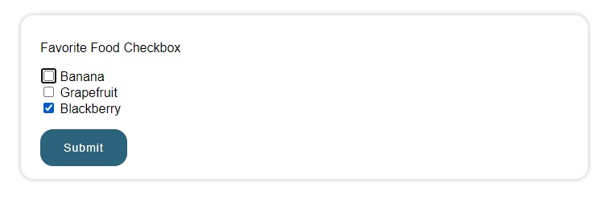

<br/>

Now, let's actually customize these checkboxes:

1. First, we could make sure that our label (text near checkboxes) is always aligned with the checkbox itself, for that we will set `display: flex; align-items: center` on `.form__item--checkbox-container`
   - Next, we should have a `cursor: pointer;` on our `.form__label` to point our that the checkbox is clickable
   - We will also add to our `.form_label` a `display: flex` in order to create a check/checkbox with `::before` pseudo-element (on step 3)

2. Then, on the checkbox input (either `input[type='checkbox']` or `.form__item--checkbox-container .form__input`), we need the hide the default check ✅... **We don't hide it with `display: none;``, because then we can no longer tab through the checkboxes, and screen readers won't actually pick these checkboxes anymore.**
	
- Instead, we will use `opacity: 0;` with `position: absolute;`
	
3. Now, we will actually create our checkbox icon, using the pseudo-selector `::before` on our `label` element, with the following properties: `conent:""; width: 1em; height:1em; border: 0.05em solid #000; border-radius: 0.15em; margin-right: 0.5em;`

   - (Optional) Here we can also set `border-radius: 50%; padding: 0.5em;` if we want to make our checkboxes a circle!

   - On hover (`.form__item--checkbox-container .form__label:hover::before` AND `.form__item--checkbox-container .form__input:hover + .form__label::before` - because we used opacity instead of display none, and the actual default checkbox is inside our custom checkbox, and we can't hover over it), we can add a color: `background-color: #2b627c41;`

4. A few more steps, now let's add actually a checkbox when we click

   - On `.form__item--checkbox-container .form__input:checked + .form__label::before`, we add `content: "\002714"; display: flex; justify-content: center; align-items: center; color: #fff; background-color: #2b627c;`

5. And finally, let's add an indication/highlight when the user toggles through checkboxes with tab:

   - on `.form__item--checkbox-container .form__input:focus + .form__label::before` we can add `outline: 0.15em solid #1a3b4b;` (or we can use a box-shadow or even border instead)

<br/>

Also, the nice part of these checkboxes, is that we can set the size of the checkboxes based on the `label` (or `.input__label`) `font-size` property! 

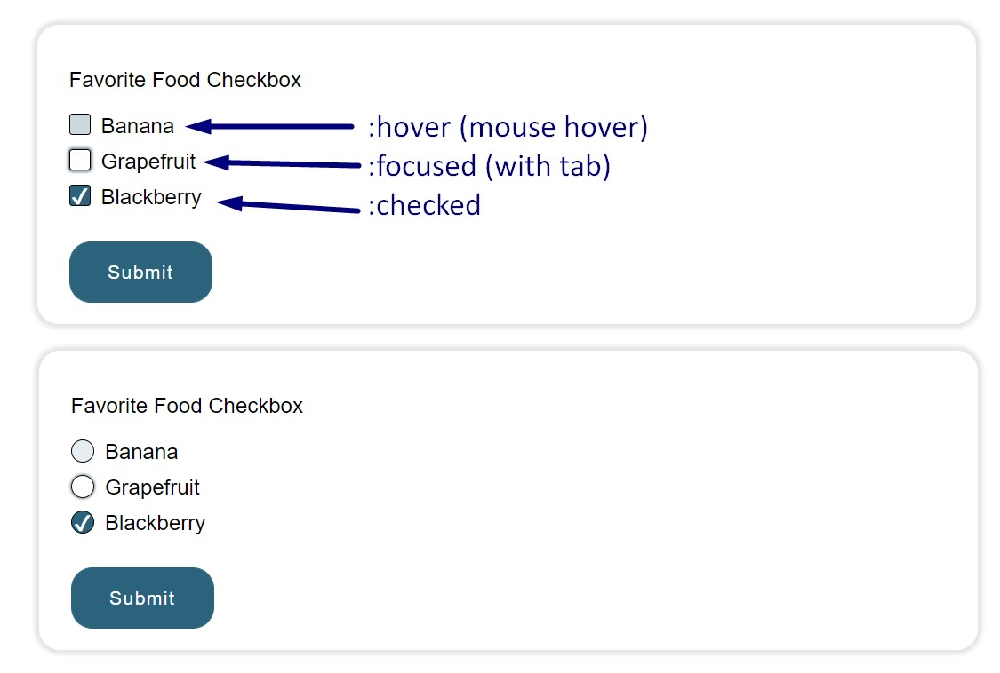

Here's the complete **CSS**:

```css
*,
*::before,
*::after {
  box-sizing: border-box;
}

::selection {
  background: #2b627c;
  color: #fff;
}

body {
  margin: 0;
  font-family: sans-serif;
}

.container {
  max-width: 720px;
  width: 100%;
  margin: 2rem auto;
}

.form-container {
  margin: 0.5rem;
  padding: 1rem 1.5rem;
  box-shadow: 0 0 3px 3px rgba(0, 0, 10, 0.1);
  border-radius: 1rem;
}

.form__item {
  margin-top: 1rem;
  display: flex;
  flex-direction: column;
}

.form__item--title {
  margin-bottom: 1rem;
}

.form__item--buttons {
  margin-top: 1rem;
}

.form__button {
  padding: 1em 2em;
  margin-right: 1rem;
  border-radius: 1rem;
  font-weight: 500;
  font-size: 0.875rem;
  letter-spacing: 1px;
  cursor: pointer;
}

.form__button.form__button--submit {
  background-color: #2b627c;
  border: 1px solid #2b627c;
  color: #fff;
}

/*************************************************/
/* Custom Checkbox Tutorial - Web Dev Simplified */
.form__item--checkbox-container {
  display: flex;
  align-items: center;
}
.form__item--checkbox-container .form__label {
  cursor: pointer;
  display: flex;
  margin-bottom: 0.5em;
}
.form__item--checkbox-container .form__input {
  cursor: pointer;
  opacity: 0;
  position: absolute;
}
.form__item--checkbox-container .form__label::before {
  content: "";
  width: 1em;
  height: 1em;
  border: 0.05em solid #000;
  border-radius: 0.15em;
  margin-right: 0.5em;
  transition: background-color 200ms;
}
.form__item--checkbox-container .form__label:hover::before,
.form__item--checkbox-container .form__input:hover + .form__label::before {
  background-color: #2b627c40;
}
.form__item--checkbox-container .form__input:checked + .form__label::before {
  content: "\002714";
  display: flex;
  justify-content: center;
  align-items: center;
  color: #fff;
  background-color: #2b627c;
}
.form__item--checkbox-container .form__input:focus + .form__label::before {
  box-shadow: 0 0 2px 1px #1a3b4b90;
}
```

<br/>

## Checkboxes SVG Animated

Resources:

- [Create a Custom SVG Checkbox (Animated AND Accessible!) - DesignCourse](https://www.youtube.com/watch?v=46iQVS7WddE)
- [Custom SVG Checkbox CSS Only - Foxxite on codepen.io](https://codepen.io/Foxxite/pen/LYEdOoX) - This is the code I use which I highly modified to be accessible and intuitive...

**HTML**:

```html
<!DOCTYPE html>
<html lang="en">

<head>
  <meta charset="UTF-8">
  <meta http-equiv="X-UA-Compatible" content="IE=edge">
  <meta name="viewport" content="width=device-width, initial-scale=1.0">
  <title>All forms elements and customization</title>
  <link rel="stylesheet" href="./style_checkbox.css">
</head>

<body>
  <div class="container">

    <!-- Animated Checkbox - DesignCourse -->
    <div class="form-container">
      <form class="form" action="./" method="GET" enctype="multipart/form-data">

        <div class="form__item">
          <div class="form__item--title">Favorite Food Checkbox</div>
          <div class="form__item--checkbox-container">
            <input type="checkbox" name="apple" id="apple">
            <label for="apple">
              <svg viewBox="0 0 100 100">
                <path class="box"
                  d="M82,89H18c-3.87,0-7-3.13-7-7V18c0-3.87,3.13-7,7-7h64c3.87,0,7,3.13,7,7v64C89,85.87,85.87,89,82,89z" />
                <polyline class="check" points="25.5,53.5 39.5,67.5 72.5,34.5 " />
              </svg>
              <span>Apple</span>
            </label>
          </div>

          <div class="form__item--checkbox-container">
            <input type="checkbox" name="avocado" id="avocado">
            <label for="avocado">
              <svg viewBox="0 0 100 100">
                <path class="box"
                  d="M82,89H18c-3.87,0-7-3.13-7-7V18c0-3.87,3.13-7,7-7h64c3.87,0,7,3.13,7,7v64C89,85.87,85.87,89,82,89z" />
                <polyline class="check" points="25.5,53.5 39.5,67.5 72.5,34.5 " />
              </svg>
              <span>Avocado</span>
            </label>
          </div>

          <div class="form__item--checkbox-container">
            <input type="checkbox" name="pomegranate" id="pomegranate">
            <label for="pomegranate">
              <svg viewBox="0 0 100 100">
                <path class="box"
                  d="M82,89H18c-3.87,0-7-3.13-7-7V18c0-3.87,3.13-7,7-7h64c3.87,0,7,3.13,7,7v64C89,85.87,85.87,89,82,89z" />
                <polyline class="check" points="25.5,53.5 39.5,67.5 72.5,34.5 " />
              </svg>
              <span>Pomegranate</span>
            </label>
          </div>
        </div>

        <div class="form__item--buttons">
          <button class="form__button form__button--submit" type="submit">Submit</button>
        </div>

      </form>
    </div>

  </div>
</body>

</html>
```

<br/>

The **CSS** code which I highly modified to be accessible (as shown in the checkbox tutorial by Web Deb Simplified, especially using `opacity: 0` and `position: absolute` instead of `display: none`).

```css
*,
*::before,
*::after {
  box-sizing: border-box;
}

::selection {
  background: #2b627c;
  color: #fff;
}

body {
  margin: 0;
  font-family: sans-serif;
}

.container {
  max-width: 720px;
  width: 100%;
  margin: 2rem auto;
}

.form-container {
  margin: 0.5rem;
  padding: 1rem 1.5rem;
  box-shadow: 0 0 3px 3px rgba(0, 0, 10, 0.1);
  border-radius: 1rem;
}

.form__item {
  margin-top: 1rem;
  display: flex;
  flex-direction: column;
}

.form__item--title {
  margin-bottom: 1rem;
}

.form__item--buttons {
  margin-top: 1rem;
}

.form__button {
  padding: 1em 2em;
  margin-right: 1rem;
  border-radius: 1rem;
  font-weight: 500;
  font-size: 0.875rem;
  letter-spacing: 1px;
  cursor: pointer;
}

.form__button.form__button--submit {
  background-color: #2b627c;
  border: 1px solid #2b627c;
  color: #fff;
}

/************************************/
/* Animated Checkbox - DesignCourse */
input[type="checkbox"] {
  opacity: 0;
  position: absolute;
  pointer-events: none;
}
input[type="checkbox"] + label {
  cursor: pointer;
  display: flex;
}
input[type="checkbox"] + label svg {
  width: 2em;
  stroke: #2b627c;
  stroke-width: 5;
  fill: white;
}
input[type="checkbox"] + label svg .box {
  stroke-dasharray: 320;
  stroke-dashoffset: 0;
  fill: #fff;
  transition: stroke-dashoffset 0.3s linear, fill 0.3s linear;
}
input[type="checkbox"]:hover + label svg .box {
  fill: #9cbbc920;
}
input[type="checkbox"]:focus + label svg .box {
  fill: #9cbbc950;
}
input[type="checkbox"] + label svg .check {
  stroke-dasharray: 70;
  stroke-dashoffset: 70;
  fill: none;
  transition: stroke-dashoffset 0.3s linear;
}
input[type="checkbox"] + label span {
  padding-top: 0.5em;
  margin-left: 0.3em;
}
input[type="checkbox"]:checked + label .box {
  stroke-dashoffset: 320;
  fill: #9cbbc920;
}
input[type="checkbox"]:checked + label .check {
  stroke-dashoffset: 0;
}
```

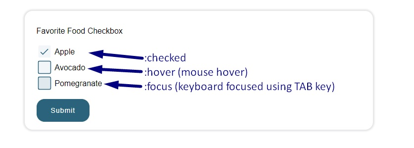

<br/>

## Checkboxes as Toggle Switch - dcode

Credits:

- [Creating a CSS-Only Toggle Switch (Custom Checkbox) - Tutorial from dcode](https://youtu.be/wQVkA6cOBiI) with this [codepen](https://codepen.io/dcode-software/pen/qBbGrLz)

**HTML**

```html
<label class="toggle" for="myToggle">
  <input class="toggle__input" name="" type="checkbox" id="myToggle">
  <div class="toggle__fill"></div>
  <span>Allow fruits recommendations?</span>
</label>
```

Note: The `<span>` element is completely optional.

<br/>

**CSS**

```css
/************************************/
/* Custom Checkbox as Toggle Switch */
.toggle {
  --width: 50px;
  --height: calc(var(--width) / 2);
  --border-radius: calc(var(--height) / 2);
  display: flex;
  align-items: center;
  cursor: pointer;
}
.toggle__input {
  display: none;
}
.toggle__fill {
  position: relative;
  width: var(--width);
  height: var(--height);
  border-radius: var(--border-radius);
  background: #ddd;
  margin-right: 0.5em;
  transition: background-color 0.2s;
}
.toggle__input:checked ~ .toggle__fill {
  background-color: #2b627c;
}
.toggle__fill::after {
  content: "";
  position: absolute;
  top: 0;
  left: 0;
  height: var(--height);
  width: var(--height);
  background: #ffffff;
  box-shadow: 0 0 10px rgba(0, 0, 0, 0.25);
  border-radius: var(--border-radius);
  transition: transform 0.2s;
}
.toggle__input:checked ~ .toggle__fill::after {
  transform: translateX(var(--height));
}
```

Result:

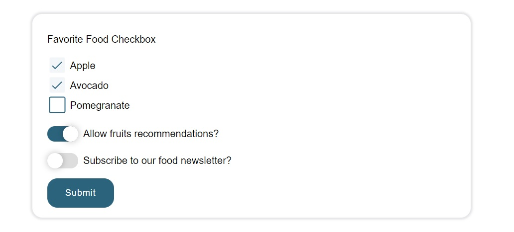

<br/>

Also, the awesome aspect about this: you can change these toggle switches from checkboxes to radio buttons, without modifying any CSS! Just make sure you have the same `name` property on `input` elements:

```html
<!-- Switch Togglers as radio buttons instead of checkboxes HTML -->
<label class="toggle" for="myToggle">
  <input class="toggle__input" name="fruit-toggler" type="radio" id="myToggle">
  <div class="toggle__fill"></div>
  <span>Allow fruits recommendations?</span>
</label>
<br />
<label class="toggle" for="myToggle2">
  <input class="toggle__input" name="fruit-toggler" type="radio" id="myToggle2">
  <div class="toggle__fill"></div>
  <span>Subscribe to our food newsletter?</span>
</label>
```

<br/>

## Radio Buttons Simple CSS

Resources:

- [How to Create a Custom Radio Button - HTML & CSS Tutorial - dcode](https://www.youtube.com/watch?v=5K7JefKDa4s)

The **HTML** inside a `<form>`:

```html
<!-- HTML File -->
<div class="form__item">
  <div class="form__item--title">How many fruits do you eat per day?</div>
  <label for="radioFruitPerDay_Zero" class="form__label--radio">
    <input type="radio" name="radioFruitPerDay" id="radioFruitPerDay_Zero" class="form__input--radio" checked>
    <div class="form__radio--radio"></div>
    <span class="form__text--radio">Zero fruits/day</span>
  </label>

  <label for="radioFruitPerDay_One" class="form__label--radio">
    <input type="radio" name="radioFruitPerDay" id="radioFruitPerDay_One" class="form__input--radio">
    <div class="form__radio--radio"></div>
    <span class="form__text--radio">One fruit/day</span>
  </label>

  <label for="radioFruitPerDay_Three" class="form__label--radio">
    <input type="radio" name="radioFruitPerDay" id="radioFruitPerDay_Three" class="form__input--radio">
    <div class="form__radio--radio"></div>
    <span class="form__text--radio">Over three fruits/day</span>
  </label>
</div>
```

<br/>

1. For the label we'll just use some simple CSS properties in order to display the text inline with the radio button:

   ```css
   .form__label--radio {
     display: inline-flex;
     align-items: center;
     cursor: pointer;
     margin-right: 0.75em;
     margin-bottom: 0.5em;
   }
   .form__input--radio {
     display: none;
   }
   ```

2. The actual outer round shape (the circle around the radio bullet check) will be represented by the following CSS (on which we set the border of the circle, the actual size based on font-size of the label, the margin-right from the text/label, and the padding inside the circle):

   ```css
   .form__radio--radio {
     width: 1.25em;
     height: 1.25em;
     border: 2px solid #d8e4e2;
     border-radius: 50%;
     margin-right: 0.625em;
     padding: 2px;
   }
   ```

3. Now, we add the bullet check that goes inside the circle, by default this will be hidden with the help of a transform property of `scale(0)`. Here we can customize the radio check with our favorite color, and an animation that get triggered when we check/uncheck the radio button:

   ```css
   .form__radio--radio::after {
     content: "";
     width: 100%;
     height: 100%;
     display: block;
     background: #2b627c;
     border-radius: 50%;
     transition: transform 200ms ease-in-out;
     transform: scale(0);
   }
   .form__input--radio:checked + .form__radio--radio::after {
     transform: scale(1);
   }
   ```

   <br/>

   Complete **CSS** code:

   ```css
   /* style.css */
   /***********************/
   /* Custom Radio Button */
   .form__label--radio {
     display: inline-flex;
     align-items: center;
     cursor: pointer;
     margin-right: 0.75em;
     margin-bottom: 0.5em;
   }
   .form__input--radio {
     display: none;
   }
   .form__radio--radio {
     width: 1.25em;
     height: 1.25em;
     border: 2px solid #d8e4e2;
     border-radius: 50%;
     margin-right: 0.625em;
     padding: 2px;
   }
   .form__radio--radio::after {
     content: "";
     width: 100%;
     height: 100%;
     display: block;
     background: #2b627c;
     border-radius: 50%;
     transition: transform 200ms ease-in-out;
     transform: scale(0);
   }
   .form__input--radio:checked + .form__radio--radio::after {
     transform: scale(1);
   }
   ```

   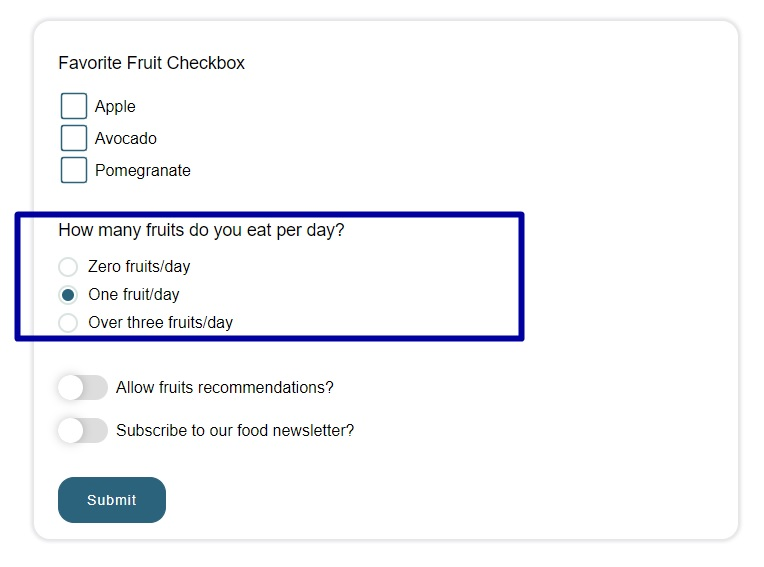

<br/><br/>

## Radio Buttons CSS - A better approach for accessibility

However, the tutorial above for the custom radio buttons is not that okay, as it's not suitable for accessibility (you use arrow keys through them while using screen readers). *Note: By default, in accessibility standards, you can tab through checkboxes then check with space key, and you can only use arrow keys through radio buttons.*

Here's the result (but unfortunately, this version doesn't have a scale animation like the previous radio box):

**HTML**:

```html
<div class="form__item">
  <div class="form__item--title">How many fruits do you eat per day?</div>

  <div class="form__item--radio-container">
    <input class="form__input" type="radio" name="radioFruitPerDay" id="radioFruitPerDay_Zero">
    <label class="form__label" for="radioFruitPerDay_Zero">Zero fruits/day</label>
  </div>

  <div class="form__item--radio-container">
    <input class="form__input" type="radio" name="radioFruitPerDay" id="radioFruitPerDay_One" checked>
    <label class="form__label" for="radioFruitPerDay_One">One fruit/day</label>
  </div>

  <div class="form__item--radio-container">
    <input class="form__input" type="radio" name="radioFruitPerDay" id="radioFruitPerDay_Three">
    <label class="form__label" for="radioFruitPerDay_Three">Over three fruits/day</label>
  </div>
</div>
```

**CSS**:

```css
/***********************/
/* Custom Radio Button */
.form__item--radio-container {
  display: flex;
  align-items: center;
}
.form__item--radio-container .form__label {
  cursor: pointer;
  display: flex;
  margin-bottom: 0.5em;
}
.form__item--radio-container .form__input {
  cursor: pointer;
  opacity: 0;
  position: absolute;
}
.form__item--radio-container .form__label::before {
  content: "";
  width: 1em;
  height: 1em;
  border: 2px solid #d8e4e2;
  border-radius: 50%;
  padding: 0.5em;
  margin-right: 0.5em;
  transition: background-color 200ms;
}
.form__item--radio-container .form__label:hover::before,
.form__item--radio-container .form__input:hover + .form__label::before {
  background-color: #9cbbc940;
}
.form__item--radio-container .form__input:checked + .form__label::before {
  content: "";
  display: flex;
  justify-content: center;
  align-items: center;
  background-color: var(--primary-color);
}
.form__item--radio-container .form__input:focus + .form__label::before {
  box-shadow: 0 0 2px 1px #1a3b4b90;
}
```

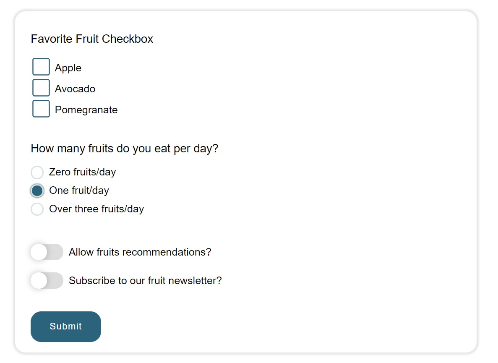

<br/>

<br/>

(Saturday, August 07, 2021, 00:05)

Okay, I managed to make them accessibility friendly with animation too! But beware, there could be a "little" (a lot) of struggle to center the radio check within the circle border. It might not work on every device / every browser. The catch here was to use both `::before` and `::after` pseudo-elements... but the main problem was, to make them overlap, we need to use `position: absolute`.

The HTML will remain the same. Here's the **CSS**:

```css
/***********************/
/* Custom Radio Button */
.form__item--radio-container {
  display: flex;
  align-items: center;
}
.form__item--radio-container .form__label {
  cursor: pointer;
  display: flex;
  margin-bottom: 0.5em;
  position: relative;
  margin-left: 2em;
}
.form__item--radio-container .form__input {
  cursor: pointer;
  opacity: 0;
  position: absolute;
}
.form__item--radio-container .form__label::before {
  content: "";
  position: absolute;
  left: -2em;
  top: -0.075em;
  width: 1em;
  height: 1em;
  border: 0.05em solid #d8e4e2;
  border-radius: 50%;
  padding: 0.5em;
  margin-right: 0.5em;
  transition: background-color 200ms;
}
.form__item--radio-container .form__label:hover::before,
.form__item--radio-container .form__input:hover + .form__label::before {
  background-color: #9cbbc940;
}
.form__item--radio-container .form__label::after {
  content: "";
  position: absolute;
  left: calc(-2em + 0.05em);
  top: calc(-0.075em + 0.05em);
  width: 1em;
  height: 1em;
  background-color: var(--primary-color);
  border-radius: 50%;
  transition: transform 200ms ease-in-out;
  transform: scale(0);
}
.form__item--radio-container .form__input:checked + .form__label::after {
  transform: scale(1);
}
.form__item--radio-container .form__input:focus + .form__label::before {
  box-shadow: 0 0 2px 1px #1a3b4b90;
}
```

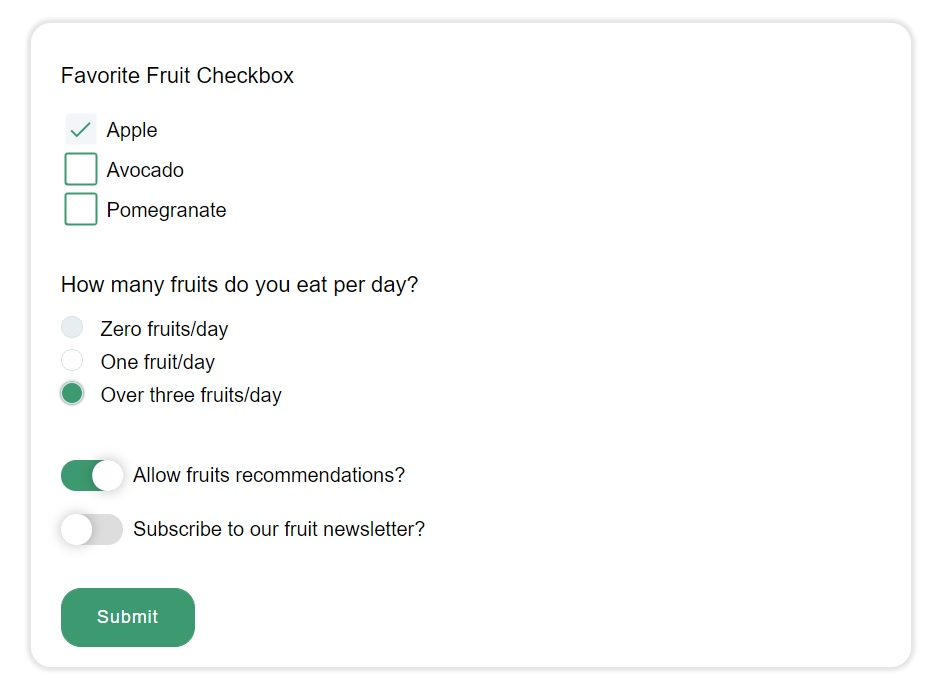

<br/><br/>

## Custom Range Slider

Resource:

- https://codepen.io/dsr/pen/rNLxBxw

The code was highly modified due to animation using margin-top which leads to huge performance issues (now the animation is done with `transform` property). It was also modified in order to accept the value "1" instead of "0" as minimum value. Also I've added CSS classes instead of directly selecting HTML elements.

However, unfortunately this range slider only accepts the minimum value as either 0 (zero) or 1 (one), you can't use a range (eg between 100 and 500) or any different min value.

The **HTML**:

```html
<div class="form__item">
  <label for="rangeFruitLikeness">How much do you like fruits?</label>
  <div class="form__item--range-container">
    <input class="form__input" type="range" id="rangeFruitLikeness" name="rangeFruitLikeness" min="1" max="10"
      value="1" step="1">
    <div class="form__range-value">
      <div id="rangeFruitLikenessDisplayValue"></div>
    </div>
  </div>
</div>
```

**JavaScript**:

```js
/* Custom Range Input - https://codepen.io/dsr/pen/rNLxBxw */
let rangeInput = document.querySelector(".form__item--range-container .form__input");
let rangeValue = document.querySelector(".form__item--range-container .form__range-value #rangeFruitLikenessDisplayValue");

let start = parseFloat(rangeInput.min);
let end = parseFloat(rangeInput.max);
let step = parseFloat(rangeInput.step);
rangeValue.innerHTML += '<div>' + start + '</div>';

for (let i = start; i <= end; i += step) {
  rangeValue.innerHTML += '<div>' + i + '</div>';
}

rangeInput.addEventListener("input", function () {
  let top = parseFloat(rangeInput.value) / step * -40;
  rangeValue.style.transform = `translateY(${top + "px"})`;
});
/* end of Custom Range Input */
```

**CSS**:

```css
/***********************/
/* Custom Range Slider */
.form__item--range-container {
  display: flex;
  align-items: center;
}
.form__item--range-container .form__input {
  -webkit-appearance: none;
  width: 100%;
  height: 3px;
  padding: unset;
  background: var(--primary-color);
  border: none;
}
.form__item--range-container .form__input::-webkit-slider-thumb {
  -webkit-appearance: none;
  width: 20px;
  height: 20px;
  background: #fff;
  border: 2px solid var(--primary-color);
  border-radius: 50%;
  transition: background-color 100ms ease-in;
}
.form__item--range-container .form__input::-webkit-slider-thumb:hover {
  background-color: var(--primary-color);
}
.form__item--range-container .form__range-value {
  color: var(--primary-color);
  text-align: center;
  font-size: 1.2rem;
  font-weight: 600;
  line-height: 40px;
  height: 40px;
  overflow: hidden;
  margin-left: 10px;
}
.form__item--range-container .form__range-value div {
  transition: transform 300ms linear;
}
```

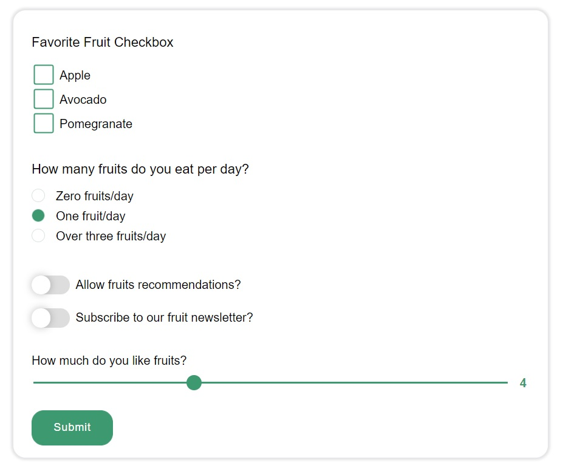

<br/>

## Custom Range Slider Animated

Source:

- Custom Range Slider from MinzCode from https://codepen.io/MinzCode/pen/bGEvXWR - with some minor modifications.

**HTML**:

```html
<div class="form__item">
  <label for="rangeFruitRecommendation">How much would you recommend a fruit to a friend?</label>
  <div class="slider-ui">
    <input id="rangeFruitRecommendation" name="rangeFruitRecommendation" type="range" min="1" max="10" step="1"
      value="4">
    <div class="bar">
      <span class="min"></span>
      <span class="max"></span>
    </div>
    <div class="track">
      <div class="value"></div>
    </div>
  </div>
</div>
```

**CSS**:

```css
/********************************/
/* Custom Range Slider Animated */
.slider-ui {
  position: relative;
  width: 95%;
  height: 2rem;
  margin: 2.25rem 0;
}
.slider-ui input {
  position: absolute;
  z-index: 10;
  top: 0;
  bottom: 0;
  width: 100%;
  cursor: pointer;
  opacity: 0;
}
.slider-ui .bar {
  position: absolute;
  z-index: 1;
  left: 0;
  right: 0;
  top: 0;
  bottom: 0;
  background-color: var(--primary-color);
  border-radius: 50px;
  box-shadow: 0 5px 0 rgba(0, 0, 0, 0.1);
}
.slider-ui .min,
.slider-ui .max {
  position: absolute;
  z-index: 2;
  top: 50%;
  transform: translateY(-50%);
  font-weight: 800;
  color: #fff;
}
.slider-ui .min {
  left: 2%;
}
.slider-ui .max {
  right: 2%;
}
.slider-ui .track {
  position: absolute;
  z-index: 3;
  left: 25px;
  right: 25px;
  top: 0;
  bottom: 0;
}
.slider-ui .value {
  position: absolute;
  left: 50%;
  top: 0;
  width: 2rem;
  height: 2rem;
  display: flex;
  justify-content: center;
  align-items: center;
  font-size: 14px;
  font-weight: 800;
  color: #fff;
  background-color: #fff;
  border: 2px solid var(--primary-color);
  border-radius: 100%;
  box-sizing: border-box;
  transform: translateX(-50%);
  transition: top 0.3s ease-in-out, color 0.3s ease-in-out;
}
.slider-ui .value.up {
  top: -110%;
  color: #000;
}
```

**JavaScript**:

```js
/* Custom Range Slider Animated - https://codepen.io/MinzCode/pen/bGEvXWR */
const sliders = document.querySelectorAll(".slider-ui");
sliders.forEach(slider => {
  let input = slider.querySelector("input[type=range]");
  let min = input.getAttribute("min");
  let max = input.getAttribute("max");
  let valueElem = slider.querySelector(".value");

  slider.querySelector(".min").innerText = min;
  slider.querySelector(".max").innerText = max;

  function setValueElem() {
    valueElem.innerText = input.value;
    let percent = (input.value - min) / (max - min) * 100;
    valueElem.style.left = percent + "%";
  }
  setValueElem();

  input.addEventListener("input", setValueElem);
  input.addEventListener("mousedown", () => {
    valueElem.classList.add("up");
  });
  input.addEventListener("mouseup", () => {
    valueElem.classList.remove("up");
  });
});
/* end of Custom Range Slider Animated */
```

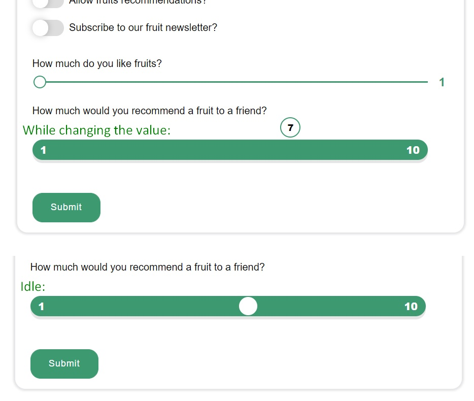<br/><br/>

## Custom Range Slider for Price Amounts

Resource:

- https://codepen.io/lavary/pen/OJbQPXe

The code was modified in order to style elements by CSS classes (instead of HTML elements), and get the input and output elements based on IDs (instead of HTML elements)... It would be a total mess if we would have styling by HTML elements (the range slider styling will affect other elements as well), and if we don't target elements by ID in JavaScript, we can't have multiple range sliders on a page.

**HTML**:

```html
<div class="form__item">
  <label for="rangeAmountSpentOnFruits">How much do you spend on fruits annualy?</label>
  <div class="form__item--range-container">
    <div class="form__item--range-group range__slider">
      <input id="rangeAmountSpentOnFruits" type="range" step="100">
    </div>
    <div class="form__item--range-group range__value">
      <span id="rangeAmountSpentOnFruitsDisplay"></span>
      <div class="range__text">Amount</div>
    </div>
  </div>
</div>
```

**CSS**:

```css
/**********************************/
/* Custom Range Slider for Prices */
.form__item--range-container {
  display: flex;
}
.range__slider {
  width: 95%;
}
.range__value {
  width: 35%;
  margin-left: 45px;
  text-align: center;
  border-left: #e6e4e4 1px solid;
}
.form__item--range-group {
  display: flex;
  flex-direction: column;
  justify-content: center;
}
.form__item--range-group .range__text {
  text-transform: uppercase;
  font-size: 0.7rem;
  color: #222;
  margin-bottom: 5px;
}
.form__item--range-group span {
  font-size: 1.5rem;
  font-weight: 600;
  color: #3c3b3b;
}
.range__slider .range__text {
  margin-bottom: 10px;
}
.range__slider [type="range"] {
  width: 100%;
  -webkit-appearance: none;
  height: 0.5rem;
  border-radius: 6px;
  background: #f1f1f1;
  padding: 0;
  margin: 0;
}
.range__slider [type="range"]::-webkit-slider-thumb {
  -webkit-appearance: none;
  appearance: none;
  width: 25px;
  height: 25px;
  border-radius: 50%;
  background-color: #fbfbfb;
  border: var(--primary-color) 3px solid;
  cursor: pointer;
  -webkit-transition: background-color 0.15s ease-in-out;
  transition: background-color 0.15s ease-in-out;
}
.range__slider [type="range"]::-webkit-slider-thumb:hover {
  background-color: var(--primary-color);
}
.range__slider [type="range"]::-moz-range-thumb {
  width: 20px;
  height: 20px;
  border: 0;
  border-radius: 50%;
  background-color: #ccc;
  border: var(--primary-color) 3px solid;
  cursor: pointer;
  -webkit-transition: background-color 0.15s ease-in-out;
  transition: background-color 0.15s ease-in-out;
}
.range__slider [type="range"]::-moz-range-thumb:hover {
  background-color: var(--primary-color);
}
input::-moz-focus-inner,
input::-moz-focus-outer {
  border: 0;
}
```

**JavaScript**:

```js
/* Custom Range Slider for Prices - https://codepen.io/lavary/pen/OJbQPXe */
class Slider {
  constructor(rangeElement, valueElement, options) {
    this.rangeElement = rangeElement
    this.valueElement = valueElement
    this.options = options
    this.rangeElement.addEventListener('input', this.updateSlider.bind(this))
  }
  init() {
    this.rangeElement.setAttribute('min', options.min)
    this.rangeElement.setAttribute('max', options.max)
    this.rangeElement.value = options.cur

    this.updateSlider()
  }
  asMoney(value) {
    /* Money Format */
    return parseFloat(value).toLocaleString('en-US', { maximumFractionDigits: 2 }) + " Lei"
  }
  generateBackground(rangeElement) {
    if (this.rangeElement.value === this.options.min) {
      return
    }
    var percentage = (this.rangeElement.value - this.options.min) / (this.options.max - this.options.min) * 100
    return 'background: linear-gradient(to right, var(--primary-color), var(--primary-color) ' + percentage + '%, #E9E9E9 ' + percentage + '%, #E6E6E6 100%)'
  }
  updateSlider(newValue) {
    this.valueElement.innerHTML = this.asMoney(this.rangeElement.value)
    this.rangeElement.style = this.generateBackground(this.rangeElement.value)
  }
}

var rangeElement = document.querySelector('.form__item--range-container #rangeAmountSpentOnFruits')
var valueElement = document.querySelector('.form__item--range-container .range__value #rangeAmountSpentOnFruitsDisplay')

var options = {
  min: 100,
  max: 5000,
  cur: 1500
}
if (rangeElement) {
  var slider = new Slider(rangeElement, valueElement, options)
  slider.init()
}
/* end of Custom Range Slider for Prices */
```

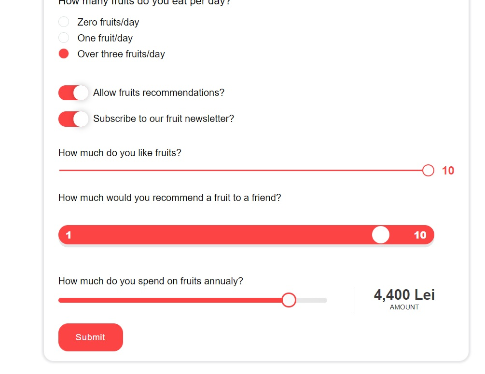

<br/>

<br/>

## File Upload Button

Source from:

- [Custom File Upload Button with FileList - HTML, CSS & JavaScript Tutorial - dcode](https://youtu.be/SE38zdOOrAQ)

We will need the following **HTML:**

```html
<div class="form__item">
  <label class="form__label" for="inputFileUpload">Import a file:</label>
  <input type="file" class="js-inputFileUpload" id="inputFileUpload" name="inputFileUpload[]" hidden="hidden"
    multiple>
  <div>
    <button type="button" class="form__button form__button--submit js-btnFileUpload">Choose File</button>
    <span class="form__item--files-name js-outputTextFileNames">No file(s) chosen</span>
  </div>
</div>
```

- Note that in order to hide the original File Input, we used `hidden=hidden` property on our input.

- **Also, if we want to add *multiple* files, we just need to add `multiple` keyword in our `<input>`, and also add `[]` in the name property.**

**CSS**:

```css
.form__item {
  margin: 1rem 0;
  display: flex;
  flex-direction: column;
  align-items: flex-start;
}
.form__button {
  padding: 1em 2em;
  margin-right: 1rem;
  border-radius: 1rem;
  font-weight: 500;
  font-size: 0.875rem;
  letter-spacing: 1px;
  cursor: pointer;
}
.form__button--submit {
  background-color: var(--primary-color);
  border: 1px solid var(--primary-color);
  color: #fff;
}

/* Custom File Upload Button */
.form__item--file .form__item--file-text {
  margin-left: 0.5em;
  color: #333;
}
.form__item--files-name {
  max-width: 250px;
  font-size: 0.95em;
  text-overflow: ellipsis;
  overflow: hidden;
  white-space: nowrap;
}
```

- `text-overflow: ellipsis;` along with `overflow: hidden;` and `white-space: nowrap;`  will add ... if the text goes over 250px width.

<br/>Now the **JavaScript** part, we will try to be virtually clicking the actual `<input>` (which is hidden) using JS:

```js
/* Custom File Upload Button */
Array.prototype.forEach.call(document.querySelectorAll(".js-btnFileUpload"), function (button) {
  var hiddenInputFileUpload = button.parentElement.parentElement.querySelector(".js-inputFileUpload");
  var outputTextFileNames = button.parentElement.querySelector(".js-outputTextFileNames");
  var defaultLabelText = "No file(s) selected";

  outputTextFileNames.textContent = defaultLabelText;
  outputTextFileNames.title = defaultLabelText;

  button.addEventListener('click', function () {
    hiddenInputFileUpload.click();
  })
  hiddenInputFileUpload.addEventListener('change', function () {
    var filenameList = Array.prototype.map.call(hiddenInputFileUpload.files, function (file) {
      return file.name;
    });
    outputTextFileNames.textContent = filenameList.join(', ') || defaultLabelText;
    outputTextFileNames.title = outputTextFileNames.textContent;
  });
});
/* end of Custom File Upload Button */
```

- (optional, if we have multiple file uploads buttons)`Array.prototype.forEach.call(document.querySelectorAll(".js-btnFileUpload"))` is for Internet Explorer support, if we don't want IE support, we could use `document.querySelectorAll(".js-btnFileUpload").forEach()`
- `outputTextFileNames.title = defaultLabelText;` when we haver over we get the classic informational text.
- `hiddenInputFileUpload.click();` will actually virtually click on the input type=file, therefore a file(s)-chooser window will appear
- `hiddenInputFileUpload.files` will return a `FileList` object that includes our filenames and the length. With this we will extract the name property of each file and show it in our output `<span>` near the button.
- (optional) If we don't want Internet Explorer support, instead of `var filenameList = Array.prototype.map.call(hiddenInputFileUpload.files, function (file) {} );` we could use `Array.from(hiddenInputFileUpload.files).map(function (file) {});`...

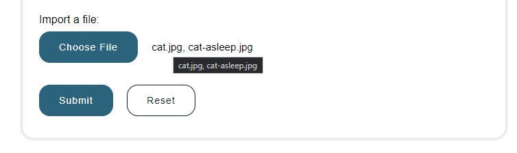

<br/><br/>

## Custom Select Dropdown Menu

Notes taken from:

- [Custom select menu - CSS only](https://www.youtube.com/watch?v=bB14uo0Tu5A)

**HTML**:

```HTML
<div class="form__item">
  <label class="form__label" for="selectFavoriteColor">Favorite Color</label>
  <div class="form__select">
    <select class="form__input" name="selectFavoriteColor" id="selectFavoriteColor">
      <option value="" disabled selected>Select your option</option>
      <option value="Green">Green</option>
      <option value="Red">Red</option>
      <option value="Blue">Blue</option>
      <option value="Brown">Brown</option>
      <option value="Purple">Purple</option>
    </select>
    <span class="form__select--arrow"></span>
  </div>
</div>
```

Note that we use a separate `<span>` element to display a custom arrow. And we need a `<div>` (that will have a `position: relative`) that wraps both `select` and `span` (where `span` will have a `position: absolute`), but this `<div>` must not include the `<label>`.

**CSS**:

```css
.form__label {
  margin-bottom: 0.5rem;
}
.form__input {
  width: 100%;
  padding: 0.5rem;
  font-size: 1rem;
  border-width: 1px;
  border-color: rgba(0, 0, 10, 0.25);
  border-radius: 0.5rem;
  transition: border-color 200ms ease-in;
}
.form__input::placeholder {
  color: #bbb;
}
.form__input:focus {
  border-color: var(--primary-color);
  background-color: #9cbbc920;
  outline: 0;
}

/**********************/
/* Custom Select Menu */
.form__select select {
  appearance: none;
  padding: 0.5rem 3rem 0.5rem 0.5rem;
}
.form__select {
  position: relative;
  width: 100%;
}
.form__select--arrow {
  position: absolute;
  top: 0;
  right: 0;
  display: block;
  background: #9cbbc930;
  border-radius: 0 0.5rem 0.5rem 0;
  height: 100%;
  width: 2em;
  pointer-events: none;
}

.form__select--arrow::before,
.form__select--arrow::after {
  content: "";
  position: absolute;
  width: 0;
  height: 0;
  left: 50%;
  transform: translate(-50%, -50%);
  border-left: 0.3em solid transparent;
  border-right: 0.3em solid transparent;
}

.form__select--arrow::before {
  top: 35%;
  border-bottom: 0.3em solid #000;
}
.form__select--arrow::after {
  top: 65%;
  border-top: 0.3em solid #000;
}
```

- In order for the arrow to be clickable and show the dropdown menu, we need to set `pointer-events: none`.
- We can choose between setting a `padding: 0.5rem 3rem 0.5rem 0.5rem;` on `.form__select select` (or else or arrow will be displayed on top of the default select placeholder text), OR set `width: 100%` on `.form__select`.
- For the arrow, we will use the [border trick (How (and why) to use borders to make a CSS triangle)](https://www.youtube.com/watch?v=fFJH6dguuqo)

And here's the result:

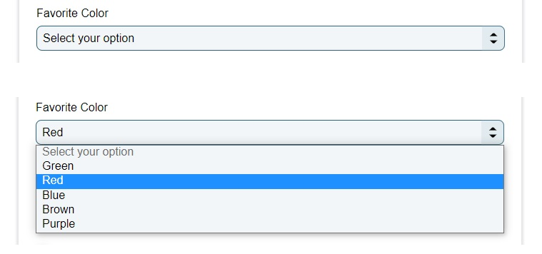

Or if we want a single down arrow:

```css
.form__select--arrow::after {
  content: "";
  position: absolute;
  width: 0;
  height: 0;
  left: 50%;
  top: 50%;
  transform: translate(-50%, -50%);
  border-left: 0.4em solid transparent;
  border-right: 0.4em solid transparent;
  border-top: 0.4em solid #000;
}
```

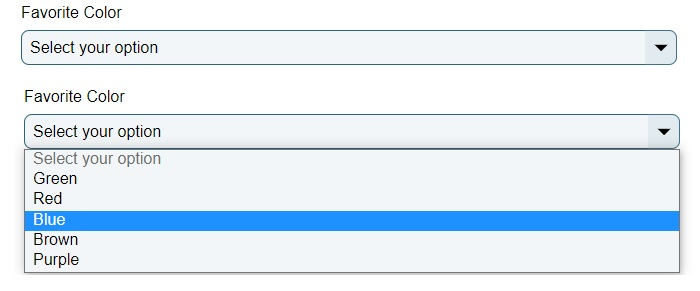

<br/><br/>

# JavaScript Form Validation on Submit

Notes taken from:

- [JavaScript Client-side Form Validation - Florin Pop](https://www.youtube.com/watch?v=rsd4FNGTRBw)

First, we'll add some icons into our **HTML** (using font-awesome) + some small placeholders for the error messages:

```html
<div class="form__item">
  <label class="form__label" for="name">Name</label>
  <input class="form__input" type="text" name="name" id="name">
  <i class="fas fa-check-circle"></i>
  <i class="fas fa-exclamation-circle"></i>
  <small>Error message</small>
</div>

<div class="form__item">
  <label class="form__label" for="email">Email</label>
  <input class="form__input" type="email" name="email" id="email">
  <i class="fas fa-check-circle"></i>
  <i class="fas fa-exclamation-circle"></i>
  <small>Error message</small>
</div>

<div class="form__item">
  <label class="form__label" for="password">Password</label>
  <input class="form__input" name="password" id="password" type="password">
  <i class="fas fa-check-circle"></i>
  <i class="fas fa-exclamation-circle"></i>
  <small>Error message</small>
</div>

<div class="form__item">
  <label class="form__label" for="passwordCheck">Password check</label>
  <input class="form__input" name="passwordCheck" id="passwordCheck" type="password">
  <i class="fas fa-check-circle"></i>
  <i class="fas fa-exclamation-circle"></i>
  <small>Error message</small>
</div>
```

**CSS**:

```CSS
/* Optional CSS */
.form__item {
  margin: 1.25rem 0;
  position: relative;
}
.form__label {
  display: inline-block;
  margin-bottom: 0.5rem;
}
.form__input {
  width: 100%;
  padding: 0.5rem;
  font-size: 1rem;
  border-width: 2px;
  border-color: rgba(0, 0, 10, 0.25);
  border-radius: 0.5rem;
  transition: border-color 200ms ease-in;
  background-color: #fcfcfc;
}
.form__input::placeholder {
  color: #bbb;
}
.form__input:focus {
  border-color: var(--primary-color);
  background-color: #fff;
  outline: 0;
}

/* CSS for green, red borders and icons for success/error messages */
.form__item i {
  visibility: hidden;
  position: absolute;
  font-size: 1.1em;
  top: 2.15em;
  right: 0.875em;
}
.form__item small {
  visibility: hidden;
  position: absolute;
  top: 100%;
  left: 0;
}
.form__item.error small {
  visibility: visible;
  color: #e74c3c;
}
.form__item.success i.fa-check-circle {
  visibility: visible;
  color: #2ecc71;
}
.form__item.error i.fa-exclamation-circle {
  visibility: visible;
  color: #e74c3c;
}
.form__item.success .form__input {
  border: 2px solid #2ecc71;
}
.form__item.error .form__input {
  border: 2px solid #e74c3c;
}
```

<br/>

Now for the **JavaScript** part:

```js
/* JavaScript Form Validation on Submit */
const form = document.getElementById("form");
const nameInput = document.getElementById("name");
const emailInput = document.getElementById("email");
const passInput = document.getElementById("password");
const passCheckInput = document.getElementById("passwordCheck");
form.addEventListener("submit", function (event) {
  event.preventDefault();
  checkInputs();
});
function checkInputs() {
  const nameValue = nameInput.value.trim();
  const emailValue = emailInput.value.trim();
  const passValue = passInput.value.trim();
  const passCheckValue = passCheckInput.value.trim();

  nameValue
    ? setSuccessFor(nameInput)
    : setErrorFor(nameInput, "Name cannot be blank");
  emailValue
    ? isEmail(emailValue)
      ? setSuccessFor(emailInput)
      : setErrorFor(emailInput, "Email is not valid")
    : setErrorFor(emailInput, "Email cannot be blank");
  passValue
    ? setSuccessFor(passInput)
    : setErrorFor(passInput, "Password cannot be blank");
  passCheckValue
    ? passCheckValue === passValue
      ? setSuccessFor(passCheckInput)
      : setErrorFor(passCheckInput, "Passwords does not match")
    : setErrorFor(passCheckInput, "Password check cannot be blank");
}
function setErrorFor(inputElement, message = "Error") {
  const formItem = inputElement.parentElement;
  formItem.className = "form__item error";
  formItem.querySelector("small").innerText = message;
}
function setSuccessFor(inputElement) {
  const formItem = inputElement.parentElement;
  formItem.className = "form__item success";
}
function isEmail(email) {
  return /^(([^<>()\[\]\\.,;:\s@"]+(\.[^<>()\[\]\\.,;:\s@"]+)*)|(".+"))@((\[[0-9]{1,3}\.[0-9]{1,3}\.[0-9]{1,3}\.[0-9]{1,3}])|(([a-zA-Z\-0-9]+\.)+[a-zA-Z]{2,}))$/.test(
    email
  );
}
/* end of JavaScript Form Validation on Submit */
```

And here's the result when pressing submit:


<br/><br/>

# JavaScript Form Validation onBlur

