# Responsive Web Design Certification - freeCodeCamp

## Credits / Notes taken from:

- [Responsive Web Design Certification - freeCodeCamp](https://www.freecodecamp.org/learn/responsive-web-design/basic-html-and-html5/)
- [HTML Tutorial from w3schools.com](https://www.w3schools.com/html/default.asp)
- [CSS Tutorial from w3schools.com](https://www.w3schools.com/css/)

## Contents

- [Responsive Web Design Certification - freeCodeCamp](#responsive-web-design-certification---freecodecamp)
  - [Credits / Notes taken from:](#credits--notes-taken-from)
  - [Contents](#contents)
  - [Basic HTML and HTML5](#basic-html-and-html5)
    - [Declare the Doctype of an HTML Document](#declare-the-doctype-of-an-html-document)
    - [Link to Internal Sections of a Page with Anchor Elements](#link-to-internal-sections-of-a-page-with-anchor-elements)
    - [Lists](#lists)
    - [Input Text Fields](#input-text-fields)
    - [Forms, Submit Button and Required fields](#forms-submit-button-and-required-fields)
    - [Radio Buttons](#radio-buttons)
    - [Checkboxes, value attribute and check by default](#checkboxes-value-attribute-and-check-by-default)
  - [Basic CSS](#basic-css)
    - [Use a CSS Class to Style an Element](#use-a-css-class-to-style-an-element)
    - [Import a Google Font](#import-a-google-font)
    - [Size images and add border](#size-images-and-add-border)
    - [Give a Background Color to a div Element](#give-a-background-color-to-a-div-element)
    - [Use an id Attribute to Style an Element](#use-an-id-attribute-to-style-an-element)
    - [Priorities and Orders in CSS - Overriding styles](#priorities-and-orders-in-css---overriding-styles)
    - [Use Attribute Selectors to Style Elements](#use-attribute-selectors-to-style-elements)
    - [Adjust padding and margin of an element](#adjust-padding-and-margin-of-an-element)
    - [Absolute Units versus Relative Units](#absolute-units-versus-relative-units)
    - [CSS Variables](#css-variables)
    - [Colors in CSS](#colors-in-css)
  - [Applied Visual Design](#applied-visual-design)
    - [Text Alignment and Formatting in CSS](#text-alignment-and-formatting-in-css)
    - [Box shadow and opacity of Elements](#box-shadow-and-opacity-of-elements)
    - [Text transform (uppercase, lowercase) and font size](#text-transform-uppercase-lowercase-and-font-size)
    - [Relative Position, offsets, Absolute Position, Fixed Position](#relative-position-offsets-absolute-position-fixed-position)
    - [Center an Element Horizontally Using the margin Property](#center-an-element-horizontally-using-the-margin-property)
    - [Gradual CSS Linear Gradient](#gradual-css-linear-gradient)
    - [CSS Transform Property: scale, move, rotate and skew](#css-transform-property-scale-move-rotate-and-skew)
    - [More Complex Shape Using CSS, ::before and ::after pseudo-elements](#more-complex-shape-using-css-before-and-after-pseudo-elements)
    - [CSS Animations, @keyframes and Animation Properties](#css-animations-keyframes-and-animation-properties)
    - [CSS Transitions](#css-transitions)
  - [Applied Accessibility](#applied-accessibility)
    - [Alt attribute on images and Headings](#alt-attribute-on-images-and-headings)
    - [Main, Header, Article, Section, Nav, Footer tags](#main-header-article-section-nav-footer-tags)
    - [Audio Element, Figure Element, Label Element](#audio-element-figure-element-label-element)
    - [Date Picker as Input](#date-picker-as-input)
    - [Custom CSS to improve Accessibility](#custom-css-to-improve-accessibility)
    - [Anchor links, accesskey and tabindex](#anchor-links-accesskey-and-tabindex)
  - [Responsive Web Design Principles](#responsive-web-design-principles)
    - [Media Queries](#media-queries)
    - [Make images responsive](#make-images-responsive)
    - [Viewport units for responsive typography](#viewport-units-for-responsive-typography)
  - [CSS Flexbox](#css-flexbox)
    - [Flexbox container](#flexbox-container)
    - [Flexbox items](#flexbox-items)
  - [CSS Grid](#css-grid)
  - [Responsive Web Design Projects](#responsive-web-design-projects)
    - [Build a Tribute Page](#build-a-tribute-page)
    - [Build a Survey Form](#build-a-survey-form)
    - [Build a Product Landing Page](#build-a-product-landing-page)
    - [Technical Documentation Page](#technical-documentation-page)
    - [Personal Portfolio Webpage](#personal-portfolio-webpage)

<br/>

<hr/>

<br/>

## Basic HTML and HTML5

Comments in HTML start with `<!--` and end with a `-->`

HTML5 (released on 28 October 2014) introduces more descriptive HTML tags. These include `main`, `header`, `footer`, `nav`, `video`, `article`, `section` and others.

<center>

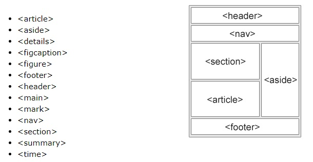

</center>

These tags give a descriptive structure to your HTML, make your HTML easier to read, and help with Search Engine Optimization (SEO) and accessibility. The `main` HTML5 tag helps search engines and other developers find the main content of your page.

```html
<h2>CatPhotoApp</h2>
<main>
  <p>
    Kitty ipsum dolor sit amet, shed everywhere shed everywhere stretching
    attack your ankles chase the red dot, hairball run catnip eat the grass
    sniff.
  </p>
  <p>
    Purr jump eat the grass rip the couch scratched sunbathe, shed everywhere
    rip the couch sleep in the sink fluffy fur catnip scratched.
  </p>
  <a href="#"
    ></a>
  <p>
    View more
    <a target="_blank" href="https://freecatphotoapp.com">cat photos</a>
  </p>
  <!-- the value "_blank" specifies to open the link in a new tab -->
</main>
```

```html
<section>
  <h1>WWF</h1>
  <p>
    The World Wide Fund for Nature (WWF) is an international organization
    working on issues regarding the conservation, research and restoration of
    the environment, formerly named the World Wildlife Fund. WWF was founded in
    1961.
  </p>
</section>
```

### Declare the Doctype of an HTML Document

At the top of your document, you need to tell the browser which version of HTML your page is using. HTML is an evolving language, and is updated regularly. Most major browsers support the latest specification, which is HTML5. However, older web pages may use previous versions of the language.

You tell the browser this information by adding the `<!DOCTYPE ...>` tag on the first line, where the `...` part is the version of HTML. For HTML5, you use `<!DOCTYPE html>`.

The `!` and uppercase `DOCTYPE` is important, especially for older browsers. The `html` is not case sensitive.

Next, the rest of your HTML code needs to be wrapped in `html` tags. The opening `<html>` goes directly below the `<!DOCTYPE html>` line, and the closing `</html>` goes at the end of the page.

```html
<!DOCTYPE html>
<html>
  <head>
    <title>Page title</title>
    <!-- metadata elements -->
  </head>
  <body>
    <!-- page contents -->
  </body>
</html>
```

### Link to Internal Sections of a Page with Anchor Elements

To create an internal link, you assign a link's `href` attribute to a hash symbol `#` plus the value of the `id` attribute for the element that you want to internally link to, usually further down the page. You then need to add the same `id` attribute to the element you are linking to. An `id` is an attribute that uniquely describes an element.

```html
<a href="#contacts-header">Contacts</a>
<a href="#footer">Jump to Bottom</a>

<h2 id="contacts-header">Contacts</h2>
<footer id="footer">Copyright Cat Photo App</footer>
```

### Lists

Unordered `ul` and ordered `ol` lists

```html
<h2>CatPhotoApp</h2>
<main>
  <p>Click here to view more <a href="#">cat photos</a>.</p>
  <p>Things cats love:</p>
  <ul>
    <li>cat nip</li>
    <li>laser pointers</li>
    <li>lasagna</li>
  </ul>
  <p>Top 3 things cats hate:</p>
  <ol>
    <li>flea treatment</li>
    <li>thunder</li>
    <li>other cats</li>
  </ol>
</main>
```

### Input Text Fields

`input` elements are a convenient way to get input from your user. You can also set placeholders that is displayed before your user has inputted anything.

```html
<input type="text" placeholder="cat photo URL" />
```

<center>

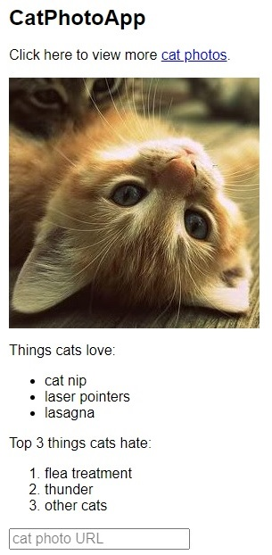

</center>

### Forms, Submit Button and Required fields

You can build web forms that actually submit data to a server using nothing more than pure HTML. You can do this by specifying an action on your `form` element.

```html
<form action="https://freecatphotoapp.com/submit-cat-photo">
  <input type="text" placeholder="cat photo URL" />
</form>
```

If user presses ENTER key after writing in input, the text will be submitted to the `url` in `action` attribute.

We can also add a Submit Button:

```html
<form action="https://freecatphotoapp.com/submit-cat-photo">
  <input type="text" placeholder="cat photo URL" />
  <button type="submit">Submit</button>
</form>
```

We can also use HTML5 to Require a Field

You can require specific form fields so that your user will not be able to submit your form until he or she has filled them out. For example, if you wanted to make a text input field required, you can just add the attribute `required` within your `input` element, like this: `<input type="text" required>`

```html
<form action="https://freecatphotoapp.com/submit-cat-photo">
  <input type="text" placeholder="cat photo URL" required />
  <button type="submit">Submit</button>
</form>
```

<center>

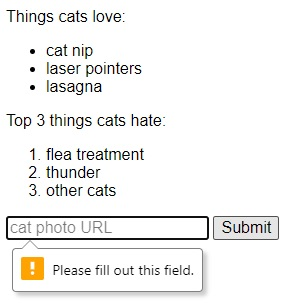

</center>

### Radio Buttons

You can use radio buttons for questions where you want the user to only give you **one** answer out of multiple options.

Radio buttons are a type of `input`.

Each of your radio buttons can be nested within its own `label` element. By wrapping an `input` element inside of a `label` element it will automatically associate the radio button input with the label element surrounding it.

All related radio buttons should have the same `name` attribute to create a radio button group. By creating a radio group, selecting any single radio button will automatically deselect the other buttons within the same group ensuring only one answer is provided by the user.

```html
<label> <input type="radio" name="indoor-outdoor" />Indoor </label>
```

It is considered best practice to set a `for` attribute on the `label` element, with a value that matches the value of the `id` attribute of the `input` element. This allows assistive technologies to create a linked relationship between the label and the child `input` element:

```html
<label for="indoor">
  <input id="indoor" type="radio" name="indoor-outdoor" />Indoor
</label>
```

Example:

```html
<form action="https://freecatphotoapp.com/submit-cat-photo">
  <input type="text" placeholder="cat photo URL" required />

  <label for="indoor">
    <input id="indoor" type="radio" name="indoor-outdoor" /> Indoor
  </label>
  <label for="indoor">
    <input id="outdoor" type="radio" name="indoor-outdoor" /> Outdoor
  </label>
  <button type="submit">Submit</button>
</form>
```

<center>


</center>

Another example:

```html
<!DOCTYPE html>
<html>
  <body>
    <h1>Display Radio Buttons</h1>

    <form action="/action_page.php">
      <p>Please select your gender:</p>
      <input type="radio" id="male" name="gender" value="male" />
      <label for="male">Male</label><br />
      <input type="radio" id="female" name="gender" value="female" />
      <label for="female">Female</label><br />
      <input type="radio" id="other" name="gender" value="other" />
      <label for="other">Other</label>

      <br />

      <p>Please select your age:</p>
      <input type="radio" id="age1" name="age" value="30" />
      <label for="age1">0 - 30</label><br />
      <input type="radio" id="age2" name="age" value="60" />
      <label for="age2">31 - 60</label><br />
      <input type="radio" id="age3" name="age" value="100" />
      <label for="age3">61 - 100</label><br /><br />
      <input type="submit" value="Submit" />
    </form>
  </body>
</html>
```

<center>

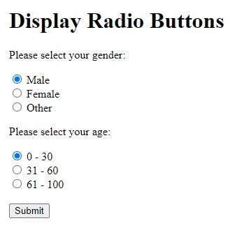

</center>

### Checkboxes, value attribute and check by default

Forms commonly use checkboxes for questions that may have **more than one** answer.

Checkboxes are a type of `input`.

Each of your checkboxes can be nested within its own `label` element. By wrapping an `input` element inside of a `label` element it will automatically associate the checkbox input with the label element surrounding it.

All related checkbox inputs should have the same `name` attribute.

It is considered best practice to explicitly define the relationship between a checkbox `input` and its corresponding `label` by setting the `for` attribute on the `label` element to match the `id` attribute of the associated `input` element.

Example:

```html
<label for="energetic">
  <input type="checkbox" id="good" name="personality" /> Energetic
</label>
<label for="loving">
  <input type="checkbox" id="good" name="personality" /> Loving
</label>
<label for="cute">
  <input type="checkbox" id="good" name="personality" /> Cute
</label>
<button type="submit">Submit</button>
```

Another Example:

```html
<form action="/action_page.php">
  <input type="checkbox" id="vehicle1" name="vehicle1" value="Bike" />
  <label for="vehicle1"> I have a bike</label><br />
  <input type="checkbox" id="vehicle2" name="vehicle2" value="Car" />
  <label for="vehicle2"> I have a car</label><br />
  <input type="checkbox" id="vehicle3" name="vehicle3" value="Boat" />
  <label for="vehicle3"> I have a boat</label><br /><br />
  <input type="submit" value="Submit" />
</form>
```

<form action="">
  <input type="checkbox" id="vehicle1" name="vehicle1" value="Bike">
  <label for="vehicle1"> I have a bike</label><br>
  <input type="checkbox" id="vehicle2" name="vehicle2" value="Car">
  <label for="vehicle2"> I have a car</label><br>
  <input type="checkbox" id="vehicle3" name="vehicle3" value="Boat">
  <label for="vehicle3"> I have a boat</label><br><br>
  <input type="submit" value="Submit">
</form>

<br/>

**Use the value attribute with Radio Buttons and Checkboxes**

When a form gets submitted, the data is sent to the server and includes entries for the options selected. Inputs of type `radio` and `checkbox` report their values from the `value` attribute.

```html
<label for="indoor">
  <input id="indoor" value="indoor" type="radio" name="indoor-outdoor" />Indoor
</label>
<label for="outdoor">
  <input
    id="outdoor"
    value="outdoor"
    type="radio"
    name="indoor-outdoor"
  />Outdoor
</label>
```

Here, you have two `radio` inputs. When the user submits the form with the `indoor` option selected, the form data will include the line: `indoor-outdoor=indoor`. This is from the `name` and `value` attributes of the "indoor" input.

_If you omit the `value` attribute, the submitted form data uses the default value, which is `on`. In this scenario, if the user clicked the "indoor" option and submitted the form, the resulting form data would be `indoor-outdoor=on`, which is not useful. So the `value` attribute needs to be set to something to identify the option._

```html
<label for="loving"
  ><input id="loving" value="loving" type="checkbox" name="personality" />
  Loving</label
>
<label for="lazy"
  ><input id="lazy" value="lazy" type="checkbox" name="personality" />
  Lazy</label
>
<label for="energetic"
  ><input id="energetic" value="energetic" type="checkbox" name="personality" />
  Energetic</label
><br />
```

<br/>

**Check Radio Buttons and Checkboxes by Default**

You can set a checkbox or radio button to be checked by default using the `checked` attribute.

To do this, just add the word "checked" to the inside of an input element:

```html
<input type="radio" name="test-name" checked />
```

<br/>

<hr/>

<br/>

## Basic CSS

- **External** CSS:

  ```html
  <head>
    <link rel="stylesheet" href="mystyle.css" />
    <link
      rel="stylesheet"
      href="https://cdn.jsdelivr.net/gh/konpa/devicon@master/devicon.min.css"
    />
  </head>
  ```

- **Internal** CSS: `<head><style>body{ color: gray; }</style></body>`

- **Inline** CSS: `<h1 style="color:purple; text-align:center;">This a nice heading, yes</h1>`

### Use a CSS Class to Style an Element

Turn all `h2` elements blue:

```html
<style>
  h2 {
    color: blue;
  }
</style>
<h2>CatPhotoApp</h2>
```

Give `h2` and `p` elements the `class` attribute with a value of `'red-text'`. Also change the font size for `p` elements.

```html
<style>
  .red-text {
    color: red;
  }
  p {
    font-size: 16px;
  }
</style>

<h2 class="red-text">CatPhotoApp</h2>
<p class="red-text">Click here to view more <a href="#">cat photos</a>.</p>
```

Set the Font Family of an Element:

```css
h2 {
  font-family: sans-serif;
}
```

<center>

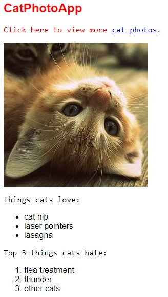

</center>

### Import a Google Font

[Google Fonts](https://fonts.google.com/) is a free library of web fonts that you can use in your CSS by referencing the font's URL. To import a Google Font, you can copy the font's URL from the Google Fonts library and then paste it in your HTML. For this challenge, we'll import the `Lobster` font. To do this, copy the following code snippet and paste it into the top of your code editor (before the opening `style` element):

```css
<link href="https://fonts.googleapis.com/css?family=Lobster" rel="stylesheet" type="text/css">
h2 {
  font-family: Lobster;
}
```

Now you can use the `Lobster` font in your CSS by using `Lobster` as the FAMILY_NAME as in the following example:
`font-family: FAMILY_NAME, GENERIC_NAME;`.

The GENERIC_NAME is optional, and is a fallback font in case the other specified font is not available.

Family names are case-sensitive and need to be wrapped in quotes if there is a space in the name. For example, you need quotes to use the `"Open Sans"` font, but not to use the `Lobster` font.

```css
<link href="https://fonts.googleapis.com/css2?family=Open+Sans" rel="stylesheet">
h2 {
  font-family: "Open Sans", sans-serif;
}
```

Also, there are several default fonts that are available in all browsers. These generic font families include `monospace`, `serif` and `sans-serif`. When one font isn't available, you can tell the browser to "degrade" to another font.

For example, if you wanted an element to use the `Helvetica` font, but degrade to the `sans-serif` font when `Helvetica` isn't available, you will specify it as follows:

```css
p {
  font-family: Helvetica, sans-serif;
}
```

### Size images and add border

```html
<style>
  h2 {
    font-family: Lobster, monospace;
  }
  .smaller-image {
    width: 100px;
  }
  .thick-green-border {
    border-color: green;
    border-width: 10px;
    border-style: solid;
  }
</style>
```

<center>

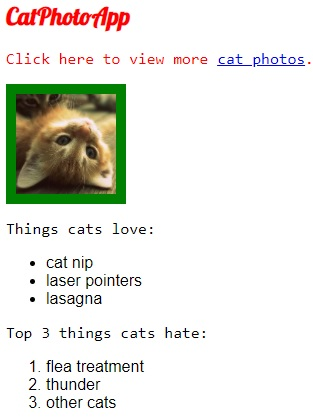

</center>

You can also specify `border-radius` using a percentage (eg. `50%` for making an image perfectly circular.)

```css
.thick-green-border {
  border-color: green;
  border-width: 10px;
  border-style: solid;
  border-radius: 50%;
}
```

<center>

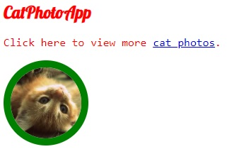

</center>

### Give a Background Color to a div Element

For example, if you wanted an element's background color to be `green`, you'd put this within your `style` element:

```
.green-background {
  background-color: green;
}
```

Note: There is no difference between `background` and `background-color` properties when applied with a color value. `background` is shorthand to combine many background tags into one line, like this: `background: #ffffff url("img_tree.png") no-repeat right top;`. More specifically, [`background`](https://developer.mozilla.org/en-US/docs/Web/CSS/background) actually is a shorthand for:

> ```css
> background-color
> background-image
> background-position
> background-repeat
> background-attachment
> background-clip
> background-origin
> background-size
> ```

However, the order where you apply CSS properties, matters! (you can find this in interview questions). For example, the final result of

```css
.silver-background {
  background-color: silver;
  background: pink;
}
```

will be pink; but the final result of

```css
.silver-background {
  background: pink;
  background-color: silver;
}
```

will be silver. (The last applied property will take effect). The final result of

```css
.silver-background {
  background: pink;
  background-color: silver;
  background-color: green;
}
```

will be green!

<br/>

**We can also use an image with a blended color displayed over**

```css
body {
  background-image: /urlResponsiveFCC(photo.jpg);
  background-color: purple;
  background-blend-mode: screen;
}
```


Other resources:

- https://www.w3schools.com/cssref/pr_background-blend-mode.asp
- https://css-tricks.com/almanac/properties/b/background-blend-mode/
- https://codetheweb.blog/fullscreen-image-hero/

<br/>

### Use an id Attribute to Style an Element

One cool thing about `id` attributes is that, like classes, you can style them using CSS. However, an `id` is not reusable and should only be applied to one element. An `id` also has a higher specificity (importance) than a class so if both are applied to the same element and have conflicting styles, the styles of the `id` will be applied.

```html
#green-bg-form { background-color: green; }
<form id="green-bg-form">...</form>
```

### Priorities and Orders in CSS - Overriding styles

The order of priority in CSS:

> `!important tag` > `inline style` > `ids` > `classes` and class declarations order > `body inheritance`

Examples:

- id attribute overrides class declarations and body inheritance:

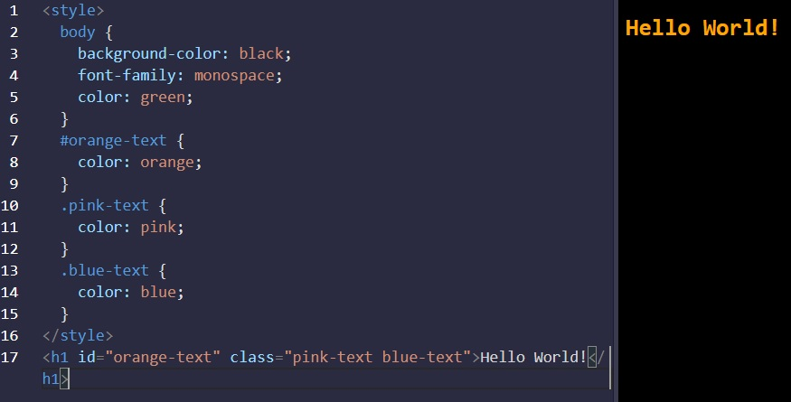

- inline styles overrides ids, class declarations, and body inheritance

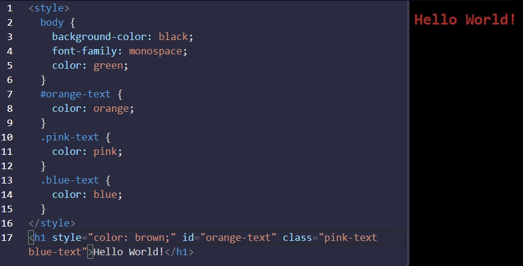

- override all styles by using `!important`


### Use Attribute Selectors to Style Elements

Instead of `id` or `class` attributes (known as ID and class selectors), we can use `[attr=value]` attribute selector to style elements. This selector matches and styles elements with a specific attribute value.

```css
[type="radio"] {
  margin: 20px 0px 20px 0px;
}
[type="checkbox"] {
  margin: 10px 0px 15px 0px;
}
```

### Adjust padding and margin of an element

All HTML elements are essentially little rectangles. Three important properties control the space that surrounds each HTML element: `padding`, `border`, and `margin`.

An element's `padding` controls the amount of space between the element's content and its `border`. When you increase the blue box's `padding`, it will increase the distance (`padding`) between the text and the border around it.

```css
.red-box {
  background-color: crimson;
  color: #fff;
  padding: 20px;
}

.blue-box {
  background-color: blue;
  color: #fff;
  padding: 10px;
}
```

<center>


</center>

An element's `margin` controls the amount of space between an element's `border` and surrounding elements. When you increase the blue box's `margin`, it will increase the distance between its border and surrounding elements.

```css
.red-box {
  background-color: crimson;
  color: #fff;
  padding: 20px;
  margin: 20px;
}

.blue-box {
  background-color: blue;
  color: #fff;
  padding: 20px;
  margin: 10px;
}
```

<center>

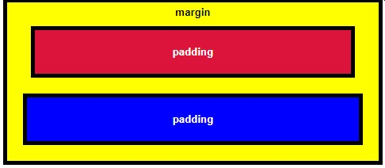

</center>

```html
<!-- Whole code from the examples above -->
<style>
  .injected-text {
    margin-bottom: -25px;
    text-align: center;
  }
  .box {
    border-style: solid;
    border-color: black;
    border-width: 5px;
    text-align: center;
  }
  .yellow-box {
    background-color: yellow;
    padding: 10px;
  }
  .red-box {
    background-color: crimson;
    color: #fff;
    padding: 20px;
    margin: 20px;
  }
  .blue-box {
    background-color: blue;
    color: #fff;
    padding: 20px;
    margin: 10px;
  }
</style>
<h5 class="injected-text">margin</h5>
<div class="box yellow-box">
  <h5 class="box red-box">padding</h5>
  <h5 class="box blue-box">padding</h5>
</div>
```

<br/>

**Negative Margin to an Element**

An element's `margin` controls the amount of space between an element's `border` and surrounding elements. If you set an element's `margin` to a negative value, the element will grow larger.

```html
.red-box { background-color: crimson; color: #fff; padding: 20px; margin: -15px;
} .blue-box { background-color: blue; color: #fff; padding: 20px; margin: 20px;
}
```

<center>


</center>

**Clockwise Notation to Specify the Padding/Margin of an Element**

Instead of specifying an element's `padding-top`, `padding-right`, `padding-bottom`, and `padding-left` properties individually, you can specify them all in one line, like this: `padding: 10px 20px 10px 20px;`.

<center>

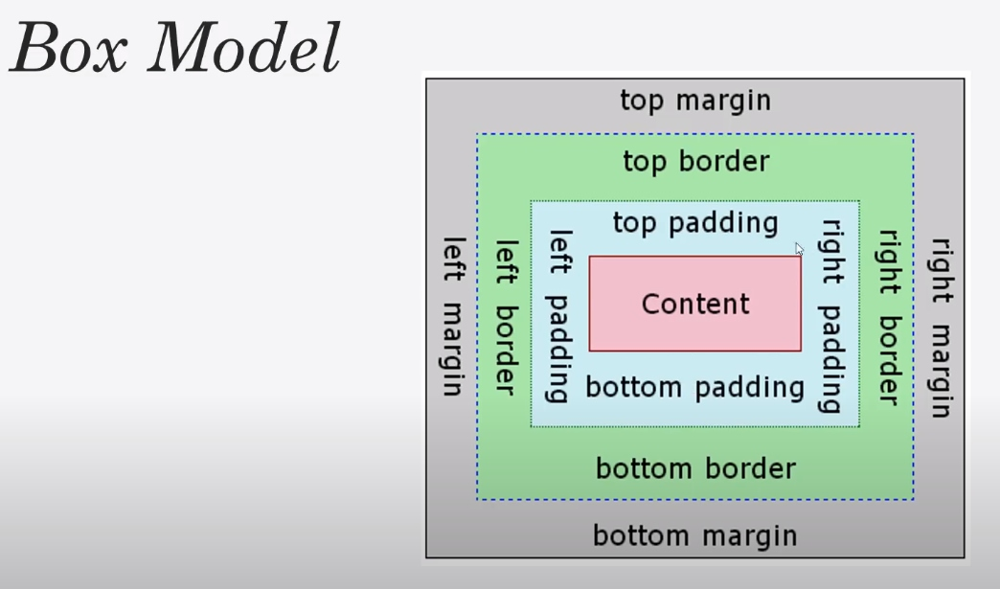

</center>

<br/>

### Absolute Units versus Relative Units

The two main types of length units are absolute and relative.

Absolute units tie to physical units of length. For example, `in` and `mm` refer to inches and millimeters, respectively. Absolute length units approximate the actual measurement on a screen, but there are some differences depending on a screen's resolution.

Relative units, such as `em` or `rem`, are relative to another length value. For example, `em` is based on the size of an element's font. If you use it to set the `font-size` property itself, it's relative to the parent's `font-size`.

- **Absolute Lengths**: fixed, these will appear as exactly that size. Absolute length units are not recommended for use on screen, because screen sizes vary so much. However, they can be used if the output medium is known, such as for print layout.
  - `cm`: centimeters
  - `mm`: millimeters
  - `in`: inches (1in = 96px = 2.54cm)
  - `px *`: pixels (1px = 1/96th of 1in)
  - `pt`: points (1pt = 1/72 of 1in)
  - `pc`: picas (1pc = 12 pt)
- **Relative Lengths**: length relative to another length property. Relative length units scale better between different rendering medium.
  - `em` Relative to the font-size of the element (2em means 2 times the size of the current font)
  - `ex` Relative to the x-height of the current font (rarely used)
  - `ch` Relative to the width of the "0" (zero)
  - `rem` Relative to font-size of the root element
  - `vw` Relative to 1% of the width of the viewport\*
  - `vh` Relative to 1% of the height of the viewport\*
  - `vmin` Relative to 1% of viewport's\* smaller dimension
  - `vmax` Relative to 1% of viewport's\* larger dimension
  - `%` Relative to the parent element

<br/>

### CSS Variables

Variables in CSS are declared/defined with two dashes `--` in front of their name. Variables can be accessed with `var(--var-name)`

```html
<style>
  :root {
    --penguin-belly: pink;
  }

  body {
    background: var(--penguin-belly, #c6faf1);
  }

  .penguin {
    --penguin-skin: gray;
    --penguin-beak: orange;
    --penguin-belly: white; // you can also overwrite previous variable values
    position: relative;
    margin: auto;
    display: block;
    margin-top: 5%;
    width: 300px;
    height: 300px;
  }

  .right-cheek {
    top: 15%;
    left: 35%;
    background: var(
      --penguin-belly,
      white
    ); // white is an attached fallback value if the variable could not be accessed
    width: 60%;
    height: 70%;
    border-radius: 70% 70% 60% 60%;
  }

  .left-cheek {
    top: 15%;
    left: 5%;
    background: var(--penguin-belly, white);
    width: 60%;
    height: 70%;
    border-radius: 70% 70% 60% 60%;
  }

  .belly {
    top: 60%;
    left: 2.5%;
    background: var(--penguin-belly, white);
    width: 95%;
    height: 100%;
    border-radius: 120% 120% 100% 100%;
  }

  .penguin-top {
    top: 10%;
    left: 25%;
    background: var(--penguin-skin, gray);
    width: 50%;
    height: 45%;
    border-radius: 70% 70% 60% 60%;
  }

  .penguin-bottom {
    top: 40%;
    left: 23.5%;
    background: var(--penguin-skin, gray);
    width: 53%;
    height: 45%;
    border-radius: 70% 70% 100% 100%;
  }

  .right-hand {
    top: 0%;
    left: -5%;
    background: var(--penguin-skin, gray);
    width: 30%;
    height: 60%;
    border-radius: 30% 30% 120% 30%;
    transform: rotate(45deg);
    z-index: -1;
  }

  .left-hand {
    top: 0%;
    left: 75%;
    background: var(--penguin-skin, gray);
    width: 30%;
    height: 60%;
    border-radius: 30% 30% 30% 120%;
    transform: rotate(-45deg);
    z-index: -1;
  }

  .right-feet {
    top: 85%;
    left: 60%;
    background: var(--penguin-beak, orange);
    width: 15%;
    height: 30%;
    border-radius: 50% 50% 50% 50%;
    transform: rotate(-80deg);
    z-index: -2222;
  }

  .left-feet {
    top: 85%;
    left: 25%;
    background: var(--penguin-beak, orange);
    width: 15%;
    height: 30%;
    border-radius: 50% 50% 50% 50%;
    transform: rotate(80deg);
    z-index: -2222;
  }

  .right-eye {
    top: 45%;
    left: 60%;
    background: black;
    width: 15%;
    height: 17%;
    border-radius: 50%;
  }

  .left-eye {
    top: 45%;
    left: 25%;
    background: black;
    width: 15%;
    height: 17%;
    border-radius: 50%;
  }

  .sparkle {
    top: 25%;
    left: 15%;
    background: white;
    width: 35%;
    height: 35%;
    border-radius: 50%;
  }

  .blush-right {
    top: 65%;
    left: 15%;
    background: pink;
    width: 15%;
    height: 10%;
    border-radius: 50%;
  }

  .blush-left {
    top: 65%;
    left: 70%;
    background: pink;
    width: 15%;
    height: 10%;
    border-radius: 50%;
  }

  .beak-top {
    top: 60%;
    left: 40%;
    background: var(--penguin-beak, orange);
    width: 20%;
    height: 10%;
    border-radius: 50%;
  }

  .beak-bottom {
    top: 65%;
    left: 42%;
    background: var(--penguin-beak, orange);
    width: 16%;
    height: 10%;
    border-radius: 50%;
  }

  .penguin * {
    position: absolute;
  }
  // The CSS * selector selects all elements within .penguin
  // Therefore, all elements within element with .penguin will have absolute position
</style>
<div class="penguin">
  <div class="penguin-bottom">
    <div class="right-hand"></div>
    <div class="left-hand"></div>
    <div class="right-feet"></div>
    <div class="left-feet"></div>
  </div>
  <div class="penguin-top">
    <div class="right-cheek"></div>
    <div class="left-cheek"></div>
    <div class="belly"></div>
    <div class="right-eye">
      <div class="sparkle"></div>
    </div>
    <div class="left-eye">
      <div class="sparkle"></div>
    </div>
    <div class="blush-right"></div>
    <div class="blush-left"></div>
    <div class="beak-top"></div>
    <div class="beak-bottom"></div>
  </div>
</div>
```

### Colors in CSS

```css
color: #000 // black as abbreviated hex code
color: #F00 // red as abbreviated hex code
color: #FF0000 // red
color: #00FF00 // green
color: #0000FF // blue
color: #FFA500 // orange
color: rgb(255, 255, 255) // white as rgb color instead of HEX
color: rgb(0, 255, 255) // cyan
background-color: rgba(45, 45, 45, 0.1) // a = alpha/level of opacity
```

Or we can use **hue, saturation, and lightness**:

|  Color  |         HSL         |
| :-----: | :-----------------: |
|   red   |  hsl(0, 100%, 50%)  |
| yellow  | hsl(60, 100%, 50%)  |
|  green  | hsl(120, 100%, 50%) |
|  cyan   | hsl(180, 100%, 50%) |
|  blue   | hsl(240, 100%, 50%) |
| magenta | hsl(300, 100%, 50%) |

**Note:** All elements have a default `background-color` of `transparent`.

**Colorful example** using teal (`#09A7A1`) as the dominant color, and its orange (`#FF790E`) complement to visually highlight the sign-up buttons:

```html
<style>
  body {
    background-color: white;
  }
  header {
    background-color: #09a7a1;
    color: white;
    padding: 0.25em;
  }
  h2 {
    color: #09a7a1;
  }
  button {
    background-color: #ff790e;
  }
  footer {
    background-color: #09a7a1;
    color: white;
    padding: 0.5em;
  }
</style>
<header>
  <h1>Cooking with FCC!</h1>
</header>
<main>
  <article>
    <h2>Machine Learning in the Kitchen</h2>
    <p>
      Join this two day workshop that walks through how to implement
      cutting-edge snack-getting algorithms with a command line interface.
      Coding usually involves writing exact instructions, but sometimes you need
      your computer to execute flexible commands, like
      <code>fetch Pringles</code>.
    </p>
    <button>Sign Up</button>
  </article>
  <article>
    <h2>Bisection Vegetable Chopping</h2>
    <p>
      This week-long retreat will level-up your coding ninja skills to actual
      ninja skills. No longer is the humble bisection search limited to sorted
      arrays or coding interview questions, applying its concepts in the kitchen
      will have you chopping carrots in O(log n) time before you know it.
    </p>
    <button>Sign Up</button>
  </article>
</main>
<br />
<footer>&copy; 2018 FCC Kitchen</footer>
```

<center>

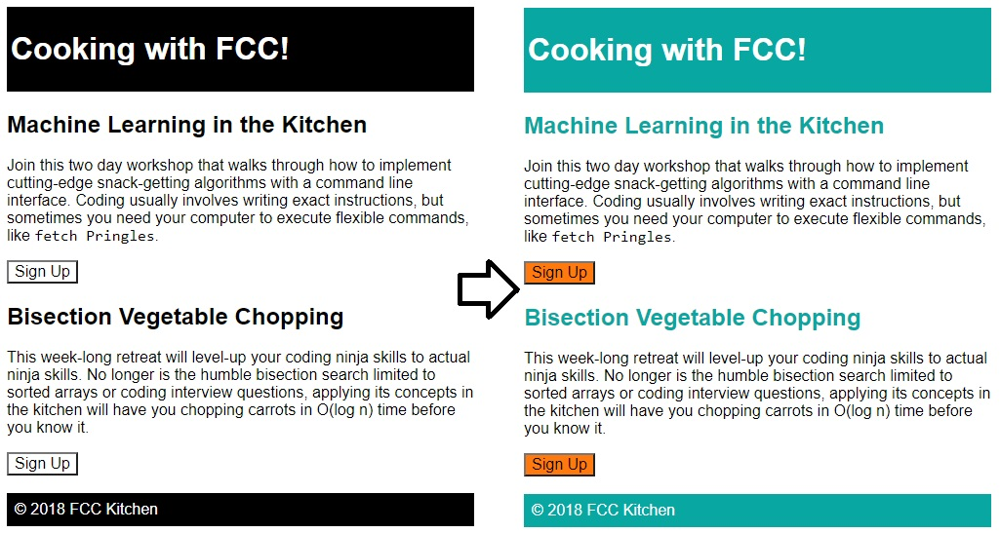

</center>

<br/>

<hr/>

<br/>

## Applied Visual Design

Visual Design in web development is a broad topic. It combines typography, color theory, graphics, animation, and page layout to help deliver a site's message.

### Text Alignment and Formatting in CSS

Text is often a large part of web content. CSS has several options for how to align it with the `text-align` property.

- `text-align: justify;` causes all lines of text except the last line to meet the left and right edges of the line box.
- `text-align: center;` centers the text
- `text-align: right;` right-aligns the text
- `text-align: left;` (the default) left-aligns the text.

Example:

```html
<style>
  h4 {
    text-align: center;
    height: 25px;
  }
  p {
    text-align: justify;
  }
  .links {
    text-align: left;
    color: black;
  }
  .fullCard {
    width: 245px;
    border: 1px solid #ccc;
    border-radius: 5px;
    margin: 10px 5px;
    padding: 4px;
  }
  .cardContent {
    padding: 10px;
  }
  .cardText {
    margin-bottom: 30px;
  }
</style>
<div class="fullCard">
  <div class="cardContent">
    <div class="cardText">
      <h4>Google</h4>
      <p>
        Google was founded by Larry Page and Sergey Brin while they were Ph.D.
        students at <strong>Stanford University</strong>.
      </p>
    </div>
    <div class="cardLinks">
      <a
        href="https://en.wikipedia.org/wiki/Larry_Page"
        target="_blank"
        class="links"
        >Larry Page</a
      ><br /><br />
      <a
        href="https://en.wikipedia.org/wiki/Sergey_Brin"
        target="_blank"
        class="links"
        >Sergey Brin</a
      >
    </div>
  </div>
</div>
```


**Text Formatting**

- **bold**: `<strong>Bold Text</strong>` or CSS property: `font-weight: bold;`
- <u>underlined</u>: `<u>Underlined Text</u>` or CSS property: `text-decoration: underline;`
- _italic_: `<em>Italic Text</em>` or using CSS property: `font-style: italic;`
- <s>strikethrough</s>: `<s>Strikethrough Text</s>` or CSS prop: `text-decoration: line-through;`

### Box shadow and opacity of Elements

The `box-shadow` property applies one or more shadows to an element. The `box-shadow` property takes values for:

- `offset-x` (how far to push the shadow horizontally from the element),
- `offset-y` (how far to push the shadow vertically from the element),
- `blur-radius`,
- `spread-radius` and
- `color`, in that order.

The `blur-radius` and `spread-radius` values are optional.

Multiple box-shadows can be created by using commas to separate properties of each `box-shadow` element. Here's an example of the CSS to create multiple shadows with some blur, at mostly-transparent black colors:

```css
box-shadow: offset-x, offset-y, blur-radius(opt), spread-radius(opt), color;
```

```css
box-shadow: 0 10px 20px rgba(0, 0, 0, 0.19), 0 6px 6px rgba(0, 0, 0, 0.23);
```

Example of `box-shadow` applied on a card with `id="thumbnail"`:

```html
<style>
  h4 {
    text-align: center;
    background-color: rgba(45, 45, 45, 0.1);
    padding: 10px;
    font-size: 27px;
  }
  p {
    text-align: justify;
  }
  .links {
    text-align: left;
    color: black;
  }
  #thumbnail {
    box-shadow: 0 10px 20px rgba(0, 0, 0, 0.19), 0 6px 6px rgba(0, 0, 0, 0.23);
  }
  .fullCard {
    width: 245px;
    border: 1px solid #ccc;
    border-radius: 5px;
    margin: 10px 5px;
    padding: 4px;
  }
  .cardContent {
    padding: 10px;
  }
  .cardText {
    margin-bottom: 30px;
  }
</style>
<div class="fullCard" id="thumbnail">
  <div class="cardContent">
    <div class="cardText">
      <h4>Alphabet</h4>
      <hr />
      <p>
        <em
          >Google was founded by Larry Page and Sergey Brin while they were
          <u>Ph.D. students</u> at <strong>Stanford University</strong>.</em
        >
      </p>
    </div>
    <div class="cardLinks">
      <a
        href="https://en.wikipedia.org/wiki/Larry_Page"
        target="_blank"
        class="links"
        >Larry Page</a
      ><br /><br />
      <a
        href="https://en.wikipedia.org/wiki/Sergey_Brin"
        target="_blank"
        class="links"
        >Sergey Brin</a
      >
    </div>
  </div>
</div>
```

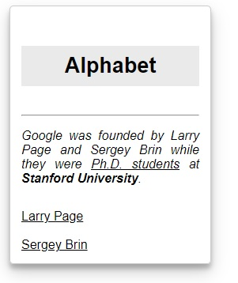

**Opacity of an Element**

The `opacity` property in CSS is used to adjust the opacity, or conversely, the transparency for an item.

> A value of 1 is opaque, which isn't transparent at all.
> A value of 0.5 is half see-through.
> A value of 0 is completely transparent.

```css
.links {
  text-align: left;
  color: black;
  opacity: 0.7;
}
```

<br/>

**Make a moon using box shadow and circle**

```html
<style>
  .center {
    position: absolute;
    margin: auto;
    top: 0;
    right: 0;
    bottom: 0;
    left: 0;
    width: 100px;
    height: 100px;
    background-color: transparent;
    border-radius: 50%;
    box-shadow: 25px 10px 0 0 blue;
  }
</style>
<div class="center"></div>
```

<center>


</center>

### Text transform (uppercase, lowercase) and font size

The `text-transform` property in CSS is used to change the appearance of text. It's a convenient way to make sure text on a webpage appears consistently, without having to change the text content of the actual HTML elements.

The following table shows how the different `text-transform`values change the example text "Transform me".

|    Value     |                         Result                         |
| :----------: | :----------------------------------------------------: |
| `lowercase`  |                     "transform me"                     |
| `uppercase`  |                     "TRANSFORM ME"                     |
| `capitalize` |                     "Transform Me"                     |
|  `initial`   |                 Use the default value                  |
|  `inherit`   | Use the `text-transform` value from the parent element |
|    `none`    |           **Default:** Use the original text           |

**Font size**

The `font-size` property is used to specify how large the text is in a given element. This rule can be used for multiple elements to create visual consistency of text on a page. In this challenge, you'll set the values for all `h1` through `h6` tags to balance the heading sizes.

Default font sizes:

```css
h1:   32px   (2em)
h2:   24px (1.5em)
h3: 20.8px (1.3em)
h4:   16px   (1em)
h5: 12.8px (0.8em)
h6: 11.2px (0.7em)
```

Default font sizes from `html.css` with the default style of Mozilla Firefox:

```css
h1 {
  font-size: 2em;
}
h2 {
  font-size: 1.5em;
}
h3 {
  font-size: 1.17em;
}
h4 {
  font-size: 1em;
}

h5 {
  font-size: 0.83em;
}

h6 {
  font-size: 0.67em;
}
```


We can modify all those values with:

```css
h1 {
  font-size: 68px;
}
h2 {
  font-size: 52px;
}
h3 {
  font-size: 40px;
}
h4 {
  font-size: 32px;
}

h5 {
  font-size: 21px;
}

h6 {
  font-size: 14px;
}
```

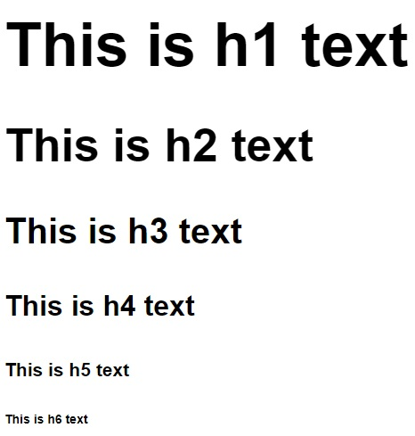

**Font weight**

The `font-weight` property sets how thick or thin characters are in a section of text.

```css
h1 {
  font-size: 68px;
  font-weight: 800;
}
h2 {
  font-size: 52px;
  font-weight: 600;
}
h3 {
  font-size: 40px;
  font-weight: 500;
}
h4 {
  font-size: 32px;
  font-weight: 400;
}
h5 {
  font-size: 21px;
  font-weight: 300;
}
h6 {
  font-size: 14px;
  font-weight: 200;
}
```


**Font size of a paragraph and space between lines with line-height**

```css
p {
  font-size: 16px;
  line-height: 25px;
}
```

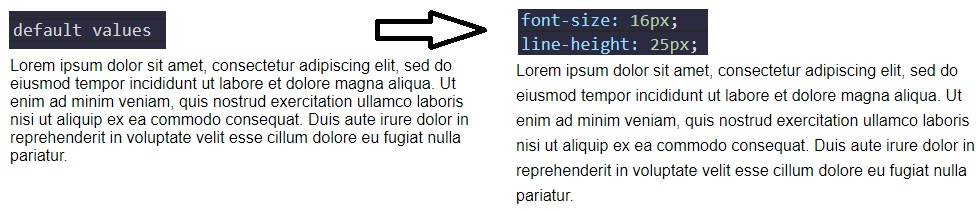

### Relative Position, offsets, Absolute Position, Fixed Position

Block-level items automatically start on a new line (think headings, paragraphs, and divs) while inline items sit within surrounding content (like images or spans). The default layout of elements in this way is called the normal flow of a document, but CSS offers the position property to override it.

When the position of an element is set to `relative`, it allows you to specify how CSS should move it _relative_ to its current position in the normal flow of the page.

Changing an element's position to relative does not remove it from the normal flow - other elements around it still behave as if that item were in its default position. **Note:** Positioning gives you a lot of flexibility and power over the visual layout of a page. It's good to remember that no matter the position of elements, the underlying HTML markup should be organized and make sense when read from top to bottom.

The following example moves the paragraph 10 pixels away from the bottom:

```css
p {
  position: relative;
  bottom: 10px;
}
```

The following example moves the paragraph 15 pixels away from the top:


**Relatively Positioned Element with CSS Offsets**

The CSS offsets of `top` or `bottom`, and `left` or `right` tell the browser how far to offset an item relative to where it would sit in the normal flow of the document. You're offsetting an element away from a given spot, which moves the element away from the referenced side (effectively, the opposite direction).

<center>


</center>

Use CSS offsets to move the `h2` 15 pixels to the right and 10 pixels up:

```css
h2 {
  position: relative;
  left: 15px;
  bottom: 10px;
}
```

<br/>

**Absolute position in CSS**

`absolute` property locks the element in place relative to its parent container. Unlike the `relative` position, `absolute` removes the element from the normal flow of the document, so surrounding items ignore it. The CSS offset properties (top or bottom and left or right) are used to adjust the position.

One nuance with absolute positioning is **that it will be locked relative to its closest _positioned_ ancestor.** If you forget to add a position rule to the parent item, (this is typically done using `position: relative;`), the browser will keep looking up the chain and ultimately default to the body tag.

Absolute position is commonly used for _search box_.

<br/>

**Fixed Position in CSS**

`fixed` position locks an element relative to the browser window. Similar to absolute positioning, it's used with the CSS offset properties and also removes the element from the normal flow of the document. Other items no longer "realize" where it is positioned, which may require some layout adjustments elsewhere.

**One key difference between the `fixed` and `absolute` positions is that an element with a fixed position won't move when the user scrolls.**

Fixed position is commonly used for _Navigation bar_.

```html
<style>
  body {
    min-height: 150vh;
  }
  #navbar {
    position: fixed;
    top: 0;
    left: 0;
    width: 100%;
    background-color: #767676;
  }
  nav ul {
    margin: 0px;
    padding: 5px 0px 5px 30px;
  }
  nav li {
    display: inline;
    margin-right: 20px;
  }
  a {
    text-decoration: none;
  }
</style>
<body>
  <header>
    <h1>Welcome!</h1>
    <nav id="navbar">
      <ul>
        <li><a href="">Home</a></li>
        <li><a href="">Contact</a></li>
      </ul>
    </nav>
  </header>
  <p>I shift up when the #navbar is fixed to the browser window.</p>
</body>
```

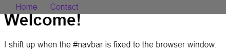

### Center an Element Horizontally Using the margin Property

Another positioning technique is to center a block element horizontally. One way to do this is to set its `margin` to a value of auto.

This method works for images, too. Images are inline elements by default, but can be changed to block elements when you set the `display` property to block.

```css
div {
  margin: 0 auto 0 auto;
}
```

Or simply:

```css
div {
  margin: auto;
}
```

### Gradual CSS Linear Gradient

Syntax:

```css
background: linear-gradient(gradient_direction, color 1, color 2, color 3, ...);
```

The first argument specifies the direction from which color transition starts - it can be stated as a degree, where `90deg` makes a horizontal gradient (from left to right) and `45deg` makes a diagonal gradient (from bottom left to top right).

Example of using it:

```css
background: linear-gradient(90deg, red, yellow, rgb(204, 204, 255));
```

Another example:

```html
<style>
  div {
    border-radius: 20px;
    width: 70%;
    height: 400px;
    margin: 50px auto;
    background: linear-gradient(35deg, #ccffff, #ffcccc);
  }
</style>

<div></div>
```

<center>

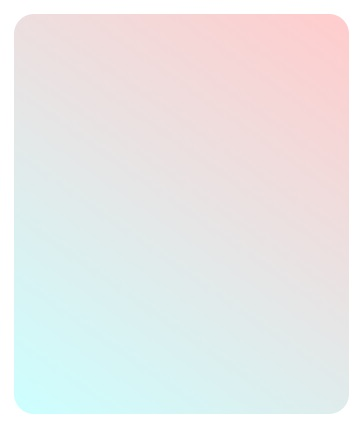

</center>

More examples:


CSS Gradient Tools:

- [cssgradient.io](https://cssgradient.io/)
- [cssgradient.io/gradient-backgrounds/](https://cssgradient.io/gradient-backgrounds/)
- [mycolor.space](https://mycolor.space/gradient)
- [Shape generator for backgrounds - bennettfeely.com/clippy](https://bennettfeely.com/clippy/)

<br/>

**CSS Linear Gradient to Create a Striped Element**

```html
<style>
  div {
    border-radius: 20px;
    width: 70%;
    height: 400px;
    margin: 50 auto;
    background: repeating-linear-gradient(
      90deg,
      yellow 0px,
      blue 40px,
      green 40px,
      red 80px
    );
  }
</style>

<div></div>
```


```html
<style>
  div {
    border-radius: 20px;
    width: 70%;
    height: 400px;
    margin: 50 auto;
    background: repeating-linear-gradient(
      45deg,
      yellow 0px,
      yellow 40px,
      black 40px,
      black 80px
    );
  }
</style>

<div></div>
```

**Subtle Pattern as a Background Image using a PNG Texture**

One way to add texture and interest to a background and have it stand out more is to add a subtle pattern.

```css
body {
  background: url(https://cdn-media-1.freecodecamp.org/imgr/MJAkxbh.png);
}
```

<br/>

**Other Example of Linear Gradient**

```css
body {
  height: 100%;
  background: rgb(70, 184, 167);
  background: radial-gradient(
    circle,
    rgba(70, 184, 167, 1) 0%,
    rgba(55, 80, 219, 1),
    100%
  );
}
```


<br/>

### CSS Transform Property: scale, move, rotate and skew

The `transform` property has a variety of functions that let you scale, move, rotate, skew, etc., your elements. When used with pseudo-classes such as `:hover` that specify a certain state of an element, the `transform` property can easily add interactivity to your elements.

```html
<style>
  div {
    width: 70%;
    height: 100px;
    margin: 50px auto;
    background: linear-gradient(53deg, #ccfffc, #ffcccf);
  }
  div:hover {
    transform: scale(1.1);
  }
</style>

<div></div>
```

The following code skews the paragraph element by -32 degrees along the X-axis.

```css
p {
  transform: skewX(-32deg);
}
```

The following code skews the element with the id of `bottom` by 24 degrees along the X-axis

```html
<style>
  div {
    width: 70%;
    height: 100px;
    margin: 50px auto;
  }
  #top {
    background-color: red;
  }
  #bottom {
    background-color: blue;
    transform: skewX(24deg);
  }
</style>

<p>Hello World</p>
<div id="top"></div>
<div id="bottom"></div>
```

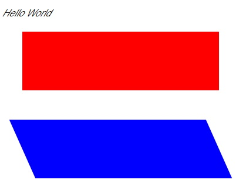

### More Complex Shape Using CSS, ::before and ::after pseudo-elements

[`::before` and `::after` pseudo-elements](https://www.freecodecamp.org/learn/responsive-web-design/applied-visual-design/create-a-more-complex-shape-using-css-and-html) are used to add something before or after a selected element. In the following example, a `::before` pseudo-element is used to add a rectangle to an element with the class `heart`:

```css
.heart::before {
  content: "";
  background-color: yellow;
  border-radius: 25%;
  position: absolute;
  height: 50px;
  width: 70px;
  top: -50px;
  left: 5px;
}
```

For the `::before` and `::after` pseudo-elements to function properly, they must have a defined `content` property. This property is usually used to add things like a photo or text to the selected element. When the `::before` and `::after` pseudo-elements are used to make shapes, the `content` property is still required, but it's set to an empty string. In the above example, the element with the class of `heart` has a `::before` pseudo-element that produces a yellow rectangle with `height` and `width` of 50px and 70px, respectively. This rectangle has round corners due to its 25% border radius and is positioned absolutely at 5px from the `left` and 50px above the `top` of the element.

Complete example for a heart shape:

```html
<style>
  .heart {
    position: absolute;
    margin: auto;
    top: 0;
    right: 0;
    bottom: 0;
    left: 0;
    background-color: pink;
    height: 50px;
    width: 50px;
    transform: rotate(-45deg);
  }
  .heart::before {
    content: "";
    background-color: pink;
    border-radius: 50%;
    position: absolute;
    width: 50px;
    height: 50px;
    top: -25px;
    left: 0px;
  }
  .heart::after {
    background-color: pink;
    content: "";
    border-radius: 50%;
    position: absolute;
    width: 50px;
    height: 50px;
    top: 0px;
    left: 25px;
  }
</style>
<div class="heart"></div>
```


<br/>

### CSS Animations, @keyframes and Animation Properties

The animation properties control how the animation should behave and the `@keyframes` rule controls what happens during that animation. There are [eight animation properties](https://www.w3schools.com/cssref/css3_pr_animation.asp) in total.

- [animation-name](https://www.w3schools.com/cssref/css3_pr_animation-name.asp)
- [animation-duration](https://www.w3schools.com/cssref/css3_pr_animation-duration.asp)
- [animation-timing-function](https://www.w3schools.com/cssref/css3_pr_animation-timing-function.asp)
- [animation-delay](https://www.w3schools.com/cssref/css3_pr_animation-delay.asp)
- [animation-iteration-count](https://www.w3schools.com/cssref/css3_pr_animation-iteration-count.asp)
- [animation-direction](https://www.w3schools.com/cssref/css3_pr_animation-direction.asp)
- [animation-fill-mode](https://www.w3schools.com/cssref/css3_pr_animation-fill-mode.asp)
- [animation-play-state](https://www.w3schools.com/cssref/css3_pr_animation-play-state.asp)

_[(Link to w3schools.com - CSS Animations)](https://www.w3schools.com/css/css3_animations.asp)_

`animation-name` sets the name of the animation, which is later used by `@keyframes` to tell CSS which rules go with which animations.

`animation-duration` sets the length of time for the animation.

`@keyframes` is how to specify exactly what happens within the animation over the duration. This is done by giving CSS properties for specific "frames" during the animation, with percentages ranging from 0% to 100%. If you compare this to a movie, the CSS properties for 0% is how the element displays in the opening scene. The CSS properties for 100% is how the element appears at the end. Then CSS applies the magic to transition the element over the given duration to act out the scene. Here's an example to illustrate the usage of `@keyframes` and the animation properties. Simple example:

```css
#anim {
  animation-name: colorful;
  animation-duration: 3s;
}

@keyframes colorful {
  0% {
    background-color: blue;
  }
  100% {
    background-color: yellow;
  }
}
```

For the element with the `anim` id, the code snippet above sets the `animation-name` to `colorful` and sets the `animation-duration` to 3 seconds. Then the `@keyframes` rule links to the animation properties with the name `colorful`. It sets the color to blue at the beginning of the animation (0%) which will transition to yellow by the end of the animation (100%). You aren't limited to only beginning-end transitions, you can set properties for the element for any percentage between 0% and 100%.

<br/>

You can also [combine starting and ending properties](https://css-tricks.com/snippets/css/keyframe-animation-syntax/):

```css
@keyframes fontbulger {
  0%,
  100% {
    font-size: 10px;
  }
  50% {
    font-size: 12px;
  }
}
```

<br/>

**Use CSS Animation to Change the Hover State of a Button**

If we just apply keyframes to a button, after the animation-duration, the color / state of the button will reset (causing the button to revert to the original color/size/etc.). If we want [the button to stay highlighted](https://www.freecodecamp.org/learn/responsive-web-design/applied-visual-design/modify-fill-mode-of-an-animation), we need to set `animation-fill-mode` property to `forwards`. The `animation-fill-mode` specifies the style applied to an element when the animation has finished.

```html
<style>
  button {
    border-radius: 5px;
    color: white;
    background-color: #0f5897;
    padding: 5px 10px 8px 10px;
  }
  button:hover {
    animation-name: background-color;
    animation-duration: 500ms;
    animation-fill-mode: forwards;
  }
  @keyframes background-color {
    100% {
      background-color: #4791d0;
    }
  }
</style>
<button>Register</button>
```

<center>

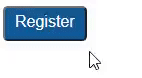

</center>

 <br/>

**[Create Movement Using CSS Animation](https://www.freecodecamp.org/learn/responsive-web-design/applied-visual-design/create-movement-using-css-animation)**

When elements have a specified `position`, such as `fixed` or `relative`, the CSS offset properties `right`, `left`, `top`, and `bottom` can be used in animation rules to create movement.

```html
<style>
  div {
    height: 40px;
    width: 70%;
    background: black;
    margin: 50px auto;
    border-radius: 5px;
    position: relative;
  }

  #rect {
    animation-name: rainbow;
    animation-duration: 4s;
  }

  @keyframes rainbow {
    0% {
      background-color: blue;
      top: 0px;
      left: 0px;
    }
    50% {
      background-color: green;
      top: 50px;
      left: 25px;
    }
    100% {
      background-color: yellow;
      top: 0px;
      left: -25px;
    }
  }
</style>

<div id="rect"></div>
```


<br/>

**[Animate Elements Continually Using an Infinite Animation Count](https://www.freecodecamp.org/learn/responsive-web-design/applied-visual-design/animate-elements-continually-using-an-infinite-animation-count)**

The `animation-iteration-count` property specifies the number of times an animation should run.

```html
<style>
  #ball {
    width: 100px;
    height: 100px;
    margin: 50px auto;
    position: relative;
    border-radius: 50%;
    background: linear-gradient(35deg, #ccffff, #ffcccc);
    animation-name: bounce;
    animation-duration: 1s;
    animation-iteration-count: infinite;
  }

  @keyframes bounce {
    0% {
      top: 0px;
    }
    50% {
      top: 249px;
      width: 130px;
      height: 70px;
    }
    100% {
      top: 0px;
    }
  }
</style>
<div id="ball"></div>
```

<center>


</center>

**[CSS Heartbeat using an Infinite Animation Count](https://www.freecodecamp.org/learn/responsive-web-design/applied-visual-design/make-a-css-heartbeat-using-an-infinite-animation-count)**

The one-second long heartbeat animation consists of two animated pieces. The `heart` elements (including the `:before` and `:after` pieces) are animated to change size using the `transform` property, and the background `div` is animated to change its color using the `background` property.

The `heart:before` and `heart:after` selectors do not need any animation properties.

```html
<style>
  .back {
    position: fixed;
    padding: 0;
    margin: 0;
    top: 0;
    left: 0;
    width: 100%;
    height: 100%;
    background: white;
    animation-name: backdiv;
    animation-duration: 1s;
    animation-iteration-count: infinite;
  }

  .heart {
    position: absolute;
    margin: auto;
    top: 0;
    right: 0;
    bottom: 0;
    left: 0;
    background-color: pink;
    height: 50px;
    width: 50px;
    transform: rotate(-45deg);
    animation-name: beat;
    animation-duration: 1s;
    animation-iteration-count: infinite;
  }
  .heart:after {
    background-color: pink;
    content: "";
    border-radius: 50%;
    position: absolute;
    width: 50px;
    height: 50px;
    top: 0px;
    left: 25px;
  }
  .heart:before {
    background-color: pink;
    content: "";
    border-radius: 50%;
    position: absolute;
    width: 50px;
    height: 50px;
    top: -25px;
    left: 0px;
  }

  @keyframes backdiv {
    50% {
      background: #ffe6f2;
    }
  }

  @keyframes beat {
    0% {
      transform: scale(1) rotate(-45deg);
    }
    50% {
      transform: scale(0.6) rotate(-45deg);
    }
  }
</style>
<div class="back"></div>
<div class="heart"></div>
```

<center>


</center>

<br/>

**[Change Animation Timing with Keywords](https://www.freecodecamp.org/learn/responsive-web-design/applied-visual-design/change-animation-timing-with-keywords)**

In CSS animations, the `animation-timing-function` property controls how quickly an animated element changes over the duration of the animation. If the animation is a car moving from point A to point B in a given time (your `animation-duration`), the `animation-timing-function` says how the car accelerates and decelerates over the course of the drive.

[The `animation-timing-function` property specifies the speed curve of the animation](https://www.w3schools.com/css/css3_animations.asp). The `animation-timing-function` property can have the following values:

- `ease` - Specifies an animation with a slow start, then fast, then end slowly (this is default)
- `linear` - Specifies an animation with the same speed from start to end
- `ease-in` - Specifies an animation with a slow start
- `ease-out` - Specifies an animation with a slow end
- `ease-in-out` - Specifies an animation with a slow start and end
- `cubic-bezier(n,n,n,n)` - Lets you define your own values in a cubic-bezier function. We can use [cubic-bezier.com](https://cubic-bezier.com/) in order to easily create custom animations using bezier.

[Example from w3schools.com](https://www.w3schools.com/css/tryit.asp?filename=trycss3_animation_speed)

Example from freeCodeCamp:

```html
<style>
  .balls {
    border-radius: 50%;
    background: linear-gradient(35deg, #ccffff, #ffcccc);
    position: fixed;
    width: 50px;
    height: 50px;
    margin-top: 50px;
    animation-name: bounce;
    animation-duration: 2s;
    animation-iteration-count: infinite;
  }
  #ball1 {
    left: 27%;
    animation-timing-function: linear;
  }
  #ball2 {
    left: 56%;
    animation-timing-function: ease-out;
  }
  #ball3 {
    left: 80%;
  }

  @keyframes bounce {
    0% {
      top: 0px;
    }
    100% {
      top: 249px;
    }
  }
</style>

<div class="balls" id="ball1"></div>
<div class="balls" id="ball2"></div>
<div class="balls" id="ball3"></div>
```

<center>

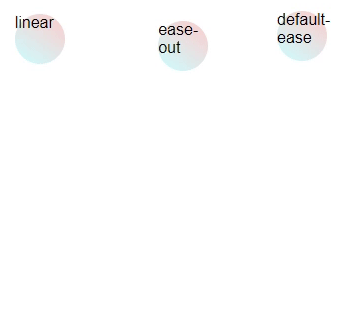

</center>

<br/>

**Animation Shorthand Property**

The example below uses six of the animation properties:

```css
div {
  animation-name: example;
  animation-duration: 5s;
  animation-timing-function: linear;
  animation-delay: 2s;
  animation-iteration-count: infinite;
  animation-direction: alternate;
}
```

The same animation effect as above can be achieved by using the shorthand `animation` property:

```css
div {
  animation: example 5s linear 2s infinite alternate;
}
```

<br/>

### CSS Transitions

[CSS transitions allows you to change property values smoothly, over a given duration.](https://www.w3schools.com/css/css3_transitions.asp) CSS Transitions have the following properties:

- `transition`
- `transition-delay`
- `transition-duration`
- `transition-property`
- `transition-timing-function`

To create a transition effect, you must specify two things:

- the CSS property you want to add an effect to
- the duration of the effect

**Note:** If the duration part is not specified, the transition will have no effect, because the default value is 0.

[Example:](https://www.w3schools.com/css/tryit.asp?filename=trycss3_transition1)

```html
<style>
  div {
    width: 100px;
    height: 100px;
    background: red;
    transition: width 1s;
  }

  // The transition effect will start when the specified CSS property (width) changes value.
  // We will change the value of width by using :hover

  div:hover {
    width: 300px;
  }
</style>
<div></div>
```

<center>

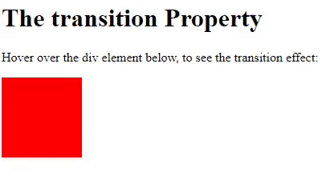

</center>

We can also change multiple property values simultaneously:

```css
div {
  width: 100px;
  height: 100px;
  background: red;
  transition: width 2s, height 4s;
}
div:hover {
  width: 300px;
  height: 300px;
}
```

**Specify the Speed Curve of the Transition**

The `transition-timing-function` property specifies the speed curve of the transition effect.

The transition-timing-function property can have the following values:

- `ease` - specifies a transition effect with a slow start, then fast, then end slowly (this is default)
- `linear` - specifies a transition effect with the same speed from start to end
- `ease-in` - specifies a transition effect with a slow start
- `ease-out` - specifies a transition effect with a slow end
- `ease-in-out` - specifies a transition effect with a slow start and end
- `cubic-bezier(n,n,n,n)` - lets you define your own values in a [cubic-bezier function](https://cubic-bezier.com/)

[Example from w3schools](https://www.w3schools.com/css/tryit.asp?filename=trycss3_transition_speed)

```css
#div1 {
  transition-timing-function: linear;
}
#div2 {
  transition-timing-function: ease;
}
#div3 {
  transition-timing-function: ease-in;
}
#div4 {
  transition-timing-function: ease-out;
}
#div5 {
  transition-timing-function: ease-in-out;
}
```

**Delay the Transition Effect**

The `transition-delay` property specifies a delay (in seconds) for the transition effect.

[Example:](https://www.w3schools.com/css/tryit.asp?filename=trycss3_transition_delay)

```css
div {
  transition-delay: 1s;
}
```

**Transition + Transformation**

[Example:](https://www.w3schools.com/css/tryit.asp?filename=trycss3_transition_transform)

```css
<style>
div {
  width: 100px;
  height: 100px;
  background: red;
  transition: width 2s, height 2s, transform 2s;
}
div:hover {
  width: 300px;
  height: 300px;
  transform: rotate(180deg);
}
</style>

<div></div>
```

<center>


</center>

**Transition Shorthand property**

The CSS transition properties can be specified one by one, like this:

```css
div {
  transition-property: width;
  transition-duration: 2s;
  transition-timing-function: linear;
  transition-delay: 1s;
}
```

or by using the shorthand property `transition`:

```css
div {
  transition: width 2s linear 1s;
}
```

<br/>

<br/>

## Applied Accessibility

"Accessibility" generally means having web content and a user interface that can be understood, navigated, and interacted with by a broad audience. This includes people with visual, auditory, mobility, or cognitive disabilities.

Here are three general concepts this section will explore throughout the following challenges:

1. have well-organized code that uses appropriate markup
2. ensure text alternatives exist for non-text and visual content
3. create an easily-navigated page that's keyboard-friendly

Having accessible web content is an ongoing challenge. A great resource for your projects going forward is the W3 Consortium's [Web Content Accessibility Guidelines (WCAG)](https://www.w3.org/WAI/WCAG21/quickref/). They set the international standard for accessibility and provide a number of criteria you can use to check your work.

### Alt attribute on images and Headings

`Alt` text describes the content of the image and provides a text-alternative for it. This helps in cases where the image fails to load or can't be seen by a user. It's also used by search engines to understand what an image contains to include it in search results.

```html

```

People with visual impairments rely on screen readers to convert web content to an audio interface. They won't get information if it's only presented visually. For images, screen readers can access the `alt` attribute and read its contents to deliver key information.

Good `alt` text provides the reader a brief description of the image. You should always include an `alt` attribute on your image. Per HTML5 specification, this is now considered mandatory.

However, [sometimes images are grouped with a caption already describing them](https://www.freecodecamp.org/learn/responsive-web-design/applied-accessibility/know-when-alt-text-should-be-left-blank), or are used for decoration only. In these cases `alt` text may seem redundant or unnecessary.

n situations when an image is already explained with text content, or does not add meaning to a page, the `img` still needs an `alt` attribute, but it can be set to an empty string.

```html

```

Background images usually fall under the 'decorative' label as well. However, they are typically applied with CSS rules, and therefore not part of the markup screen readers process.

**Note:** For images with a caption, you may still want to include `alt` text, since it helps search engines catalog the content of the image.

<br/>

**Hierarchical Relationships of Content with Headings**

Headings (`h1` through `h6` elements) are workhorse tags that help provide structure and labeling to your content. Screen readers can be set to read only the headings on a page so the user gets a summary.

Headings with equal (or higher) rank start new implied sections, headings with lower rank start subsections of the previous one.

**_As an example, a page with an `h2` element followed by several subsections labeled with `h4` tags would confuse a screen reader user. With six choices, it's tempting to use a tag because it looks better in a browser, but you can use CSS to edit the relative sizing._**

_One final point, each page should always have one (and only one) `h1` element, which is the main subject of your content. This and the other headings are used in part by search engines to understand the topic of the page._

_Note_: Google Lighthouse Analysis will tell if you don't use Headings in a correctly hierarchical structure.

Good example:

```html
<h1>How to Become a Ninja</h1>
<main>
  <h2>Learn the Art of Moving Stealthily</h2>
  <h3>How to Hide in Plain Sight</h3>
  <h3>How to Climb a Wall</h3>

  <h2>Learn the Art of Living with Honor</h2>
  <h3>How to Breathe Properly</h3>
  <h3>How to Simplify your Life</h3>
</main>
```

<br/>

### Main, Header, Article, Section, Nav, Footer tags

HTML5 (released on 28 October 2014) introduced a number of new elements that give developers more options while also incorporating accessibility features. These tags include `main`, `header`, `footer`, `nav`, `article`, and `section`, among others.

By default, a browser renders these elements similarly to the humble `div`. However, using them where appropriate gives additional meaning in your markup. The tag name alone can indicate the type of information it contains, which adds semantic meaning to that content. Assistive technologies can access this information to provide better page summary or navigation options to their users.

The `main` element is used to wrap (you guessed it) the main content, and there should be only one per page. It's meant to surround the information that's related to the central topic of your page. It's not meant to include items that repeat across pages, like navigation links or banners.

<br/>

The `article` sectioning element is used to wrap independent, self-contained content. The tag works well with blog entries, forum posts, or news articles.

The `section` element is also new with HTML5, and has a slightly different semantic meaning than `article`. An `article` is for standalone content, and a `section` is for grouping thematically related content. They can be used within each other, as needed. For example, if a book is the `article`, then each chapter is a `section`. When there's no relationship between groups of content, then use a `div`.

```html
<div>
  - groups content
  <section>
    - groups related content
    <article>- groups independent, self-contained content</article>
  </section>
</div>
```

Example:

```html
<h1>Deep Thoughts with Master Camper Cat</h1>
<main>
  <article>
    <h2>The Garfield Files: Lasagna as Training Fuel?</h2>
    <p>
      The internet is littered with varying opinions on nutritional paradigms,
      from catnip paleo to hairball cleanses. But let's turn our attention to an
      often overlooked fitness fuel, and examine the protein-carb-NOM trifecta
      that is lasagna...
    </p>
  </article>

  <article>
    <h2>Defeating your Foe: the Red Dot is Ours!</h2>
    <p>
      Felines the world over have been waging war on the most persistent of
      foes. This red nemesis combines both cunning stealth and lightning speed.
      But chin up, fellow fighters, our time for victory may soon be near...
    </p>
  </article>
</main>
```

<br/>

The next HTML5 element that adds semantic meaning and improves accessibility is the `header` tag. It's used to wrap introductory information or navigation links for its parent tag and works well around content that's repeated at the top on multiple pages.

`header` shares the embedded landmark feature you saw with `main`, allowing assistive technologies to quickly navigate to that content.

**Note:** The `header` is meant for use in the `body` tag of your HTML document. This is different than the `head` element, which contains the page's title, meta information, etc.

Example:

```html
<head>
  <title>Camper Cat Adventures</title>
</head>

<body>
  <header>
    <h1>Training with Camper Cat</h1>
  </header>

  <main>
    <section id="stealth">
      <h2>Stealth &amp; Agility Training</h2>
      <article>
        <h3>Climb foliage quickly using a minimum spanning tree approach</h3>
      </article>
      <article><h3>No training is NP-complete without parkour</h3></article>
    </section>
  </main>
</body>
```

<br/>

The `nav` element is another HTML5 item with the embedded landmark feature for easy screen reader navigation. This tag is meant to wrap around the main navigation links in your page.

[Example:](https://www.freecodecamp.org/learn/responsive-web-design/applied-accessibility/make-screen-reader-navigation-easier-with-the-nav-landmark)

```html
<head>
  <title>Camper Cat Adventures</title>
</head>

<body>
  <header>
    <h1>Training with Camper Cat</h1>

    <nav>
      <ul>
        <li><a href="#stealth">Stealth &amp; Agility</a></li>
        <li><a href="#combat">Combat</a></li>
        <li><a href="#weapons">Weapons</a></li>
      </ul>
    </nav>
  </header>

  <main>
    <section id="stealth">
      <h2>Stealth &amp; Agility Training</h2>
      <article>
        <h3>Climb foliage quickly using a minimum spanning tree approach</h3>
      </article>
      <article><h3>No training is NP-complete without parkour</h3></article>
    </section>
    <section id="weapons">
      <h2>Weapons Training</h2>
      <article>
        <h3>Swords: the best tool to literally divide and conquer</h3>
      </article>
      <article>
        <h3>Breadth-first or depth-first in multi-weapon training?</h3>
      </article>
    </section>
    <section id="weapons">
      <h2>Weapons Training</h2>
      <article>
        <h3>Swords: the best tool to literally divide and conquer</h3>
      </article>
      <article>
        <h3>Breadth-first or depth-first in multi-weapon training?</h3>
      </article>
    </section>
  </main>

  <footer>&copy; 2018 Camper Cat</footer>
</body>
```

<br/>

The `footer` element has a built-in landmark feature that allows assistive devices to quickly navigate to it. It's primarily used to contain copyright information or links to related documents that usually sit at the bottom of a page.

<br/>

### Audio Element, Figure Element, Label Element

**Improve Accessibility of Audio Content with the audio Element**

[HTML5's `audio` element](https://www.freecodecamp.org/learn/responsive-web-design/applied-accessibility/improve-accessibility-of-audio-content-with-the-audio-element) gives semantic meaning when it wraps sound or audio stream content in your markup. Audio content also needs a text alternative to be accessible to people who are deaf or hard of hearing. This can be done with nearby text on the page or a link to a transcript.

The `audio` tag supports the `controls` attribute. This shows the browser default play, pause, and other controls, and supports keyboard functionality. This is a boolean attribute, meaning it doesn't need a value, its presence on the tag turns the setting on.

```html
<main>
  <p>A sound clip of Zersiax's screen reader in action.</p>
  <audio controls>
    <source
      src="https://s3.amazonaws.com/freecodecamp/screen-reader.mp3"
      type="audio/mpeg"
    />
  </audio>
</main>
```

This code will render:

<center>


</center>

**Note:** Multimedia content usually has both visual and auditory components. It needs synchronized captions and a transcript so users with visual and/or auditory impairments can access it. Generally, a web developer is not responsible for creating the captions or transcript, but needs to know to include them.

<br/>

**Improve Chart Accessibility with the figure Element**

HTML5 introduced the `figure` element, along with the related `figcaption`. Used together, these items wrap a visual representation (like an image, diagram, or chart) along with its caption. This gives a two-fold accessibility boost by both semantically grouping related content, and providing a text alternative that explains the `figure`.

For data visualizations like charts, the caption can be used to briefly note the trends or conclusions for users with visual impairments. Another challenge covers how to move a table version of the chart's data off-screen (using CSS) for screen reader users.

```html
<figure>
  
  <br />
  <figcaption>
    Master Camper Cat demonstrates proper form of a roundhouse kick.
  </figcaption>
</figure>
```

<br/>

**Improve Form Field Accessibility with the label Element**

[The `label` tag](https://www.freecodecamp.org/learn/responsive-web-design/applied-accessibility/improve-form-field-accessibility-with-the-label-element) wraps the text for a specific form control item, usually the name or label for a choice. This ties meaning to the item and makes the form more readable. The `for` attribute on a `label` tag explicitly associates that `label` with the form control and is used by screen readers.

You learned about radio buttons and their labels in a lesson in the Basic HTML section. In that lesson, we wrapped the radio button input element inside a `label` element along with the label text in order to make the text clickable. Another way to achieve this is by using the `for` attribute as explained in this lesson.

The value of the `for` attribute must be the same as the value of the `id` attribute of the form control. Here's an example:

```html
<form>
  <label for="name">Name:</label>
  <input type="text" id="name" name="name" />

  <label for="email">Email:</label>
  <input type="text" id="email" name="name" />
</form>
```

<br/>

**Wrap Radio Buttons in a fieldset Element for Better Accessibility**

The next form topic covers accessibility of radio buttons. Each choice is given a `label` with a `for` attribute tying to the `id` of the corresponding item as covered in the last challenge. Since radio buttons often come in a group where the user must choose one, there's a way to semantically show the choices are part of a set.

The `fieldset` tag surrounds the entire grouping of radio buttons to achieve this. It often uses a `legend` tag to provide a description for the grouping, which is read by screen readers for each choice in the `fieldset` element.

The `fieldset` wrapper and `legend` tag are not necessary when the choices are self-explanatory, like a gender selection. Using a `label` with the `for` attribute for each radio button is sufficient.

```html
<form>
  <fieldset>
    <legend>Choose one of these three items:</legend>
    <input id="one" type="radio" name="items" value="one" />
    <label for="one">Choice One</label><br />
    <input id="two" type="radio" name="items" value="two" />
    <label for="two">Choice Two</label><br />
    <input id="three" type="radio" name="items" value="three" />
    <label for="three">Choice Three</label>
  </fieldset>
</form>
```

<br/>

### Date Picker as Input

Forms often include the `input` field, which can be used to create several different form controls. The `type` attribute on this element indicates what kind of input will be created.

HTML5 introduced an option to specify a `date` field. Depending on browser support, a date picker shows up in the `input` field when it's in focus, which makes filling in a form easier for all users. For older browsers, the type will default to `text`, so it helps to show users the expected date format in the label or as placeholder text just in case.

```html
<h1>Tournaments</h1>
<form>
  <p>Tell us the best date for the competition</p>
  <label for="pickdate">Preferred Date:</label>
  <input type="date" id="pickdate" name="date" />
  <input type="submit" name="submit" value="Submit" />
</form>
```

<center>


</center>

**[Standardize Times with the HTML5 datetime Attribute](https://www.freecodecamp.org/learn/responsive-web-design/applied-accessibility/standardize-times-with-the-html5-datetime-attribute)**

Continuing with the date theme, HTML5 also introduced the `time` element along with a `datetime` attribute to standardize times. This is an inline element that can wrap a date or time on a page. A valid format of that date is held by the `datetime` attribute. _This is the value accessed by assistive devices. It helps avoid confusion by stating a standardized version of a time, even if it's written in an informal or colloquial manner in the text._

```html
<p>
  Master Camper Cat officiated the cage match between Goro and Scorpion
  <time datetime="2013-02-13">last Wednesday</time>, which ended in a draw.
</p>
```

Another example:

```html
<p>
  Thank you to everyone for responding to Master Camper Cat's survey. The best
  day to host the vaunted Mortal Kombat tournament is
  <time datetime="2016-09-15">Thursday, September 15<sup>th</sup></time
  >. May the best ninja win!
</p>
```


<br/>

### Custom CSS to improve Accessibility

[CSS's magic can also improve accessibility](https://www.freecodecamp.org/learn/responsive-web-design/applied-accessibility/make-elements-only-visible-to-a-screen-reader-by-using-custom-css) on your page when you want to visually hide content meant only for screen readers (sr).

```css
.sr-only {
  position: absolute;
  left: -10000px;
  width: 1px;
  height: 1px;
  top: auto;
  overflow: hidden;
}
```

**Note:** The following CSS approaches will NOT do the same thing:

- `display: none;` or `visibility: hidden;` hides content for everyone, including screen reader users
- Zero values for pixel sizes, such as `width: 0px; height: 0px;` removes that element from the flow of your document, meaning screen readers will ignore it

**Improve Readability with High Contrast Text**

Low contrast between the foreground and background colors can make text difficult to read. Sufficient contrast improves the readability of your content, but what exactly does "sufficient" mean?

The Web Content Accessibility Guidelines (WCAG) **recommend at least a 4.5 to 1 contrast ratio for normal text**. The ratio is calculated by comparing the relative luminance values of two colors. This ranges from 1:1 for the same color, or no contrast, to 21:1 for white against black, the strongest contrast.

Contrast checking tools:

- [coolors.co/contrast-checker](https://coolors.co/contrast-checker/fb0000-acc8e5)
- [colorsafe.co - automatically suggests text colors based on background input](http://colorsafe.co/)
- [color.review](https://color.review/)

<br/>

### Anchor links, accesskey and tabindex

**[Give Links Meaning by Using Descriptive Link Text](https://www.freecodecamp.org/learn/responsive-web-design/applied-accessibility/give-links-meaning-by-using-descriptive-link-text)**

Screen reader users have different options for what type of content their device reads. This includes skipping to (or over) landmark elements, jumping to the main content, or getting a page summary from the headings. Another option is to only hear the links available on a page.

Screen readers do this by reading the link text, or what's between the anchor (`a`) tags. Having a list of "click here" or "read more" links isn't helpful. Instead, you should use brief but descriptive text within the `a` tags to provide more meaning for these users.

The link text that Camper Cat is using is not very descriptive without the surrounding context. Move the anchor (`a`) tags so they wrap around the text "information about batteries" instead of "Click here".

```html
<body>
  <header>
    <h1>Deep Thoughts with Master Camper Cat</h1>
  </header>
  <article>
    <h2>Defeating your Foe: the Red Dot is Ours!</h2>
    <p>
      Felines the world over have been waging war on the most persistent of
      foes. This red nemesis combines both cunning stealth and lightning speed.
      But chin up, fellow fighters, our time for victory may soon be near. Click
      here for <a href="">information about batteries</a>
    </p>
  </article>
</body>
```

<br/>

**[Make Links Navigable with HTML Access Keys](https://www.freecodecamp.org/learn/responsive-web-design/applied-accessibility/make-links-navigable-with-html-access-keys)**

TML offers the `accesskey` attribute to specify a shortcut key to activate or bring focus to an element. This can make navigation more efficient for keyboard-only users.

HTML5 allows this attribute to be used on any element, but it's particularly useful when it's used with interactive ones. This includes links, buttons, and form controls.

```html
<button accesskey="b">Important Button</button>
```

Camper Cat wants the links around the two blog article titles to have keyboard shortcuts so his site's users can quickly navigate to the full story. Add an `accesskey` attribute to both links and set the first one to "g" (for Garfield) and the second one to "c" (for Chuck Norris).

```html
<body>
  <header>
    <h1>Deep Thoughts with Master Camper Cat</h1>
  </header>
  <article>
    <h2>
      <a accesskey="g" id="first" href="#"
        >The Garfield Files: Lasagna as Training Fuel?</a
      >
    </h2>
    <p>
      The internet is littered with varying opinions on nutritional paradigms,
      from catnip paleo to hairball cleanses. But let's turn our attention to an
      often overlooked fitness fuel, and examine the protein-carb-NOM trifecta
      that is lasagna...
    </p>
  </article>
</body>
```

<br/>

[**Use tabindex to Add Keyboard Focus to an Element**](https://www.freecodecamp.org/learn/responsive-web-design/applied-accessibility/use-tabindex-to-add-keyboard-focus-to-an-element)

The HTML `tabindex` attribute has three distinct functions relating to an element's keyboard focus. When it's on a tag, it indicates that element can be focused on. The value (an integer that's positive, negative, or zero) determines the behavior.

Certain elements, such as links and form controls, automatically receive keyboard focus when a user tabs through a page. It's in the same order as the elements come in the HTML source markup. This same functionality can be given to other elements, such as `div`, `span`, and `p`, by placing a `tabindex="0"` attribute on them. Here's an example:

```html
<div tabindex="0">I need keyboard focus!</div>
```

**Note:** A negative `tabindex` value (typically -1) indicates that an element is focusable, but is not reachable by the keyboard. This method is generally used to bring focus to content programmatically (like when a `div` used for a pop-up window is activated), and is beyond the scope of these challenges.

Camper Cat created a new survey to collect information about his users. He knows input fields automatically get keyboard focus, but he wants to make sure his keyboard users pause at the instructions while tabbing through the items. Add a `tabindex` attribute to the `p` tag and set its value to `"0"`. Bonus - using `tabindex` also enables the CSS pseudo-class `:focus` to work on the `p` tag.

```html
<head>
  <style>
    p:focus {
      background-color: yellow;
    }
  </style>
</head>
<body>
  <header>
    <h1>Ninja Survey</h1>
  </header>
  <section>
    <form>
      <p tabindex="0">
        Instructions: Fill in ALL your information then click <b>Submit</b>
      </p>
      <label for="username">Username:</label>
      <input type="text" id="username" name="username" /><br />
      <fieldset>
        <legend>What level ninja are you?</legend>
        <input id="newbie" type="radio" name="levels" value="newbie" />
        <label for="newbie">Newbie Kitten</label><br />
        <input
          id="intermediate"
          type="radio"
          name="levels"
          value="intermediate"
        />
        <label for="intermediate">Developing Student</label><br />
        <input id="master" type="radio" name="levels" value="master" />
        <label for="master">9th Life Master</label>
      </fieldset>
      <br />
      <fieldset>
        <legend>Select your favorite weapons:</legend>
        <input id="stars" type="checkbox" name="weapons" value="stars" />
        <label for="stars">Throwing Stars</label><br />
        <input
          id="nunchucks"
          type="checkbox"
          name="weapons"
          value="nunchucks"
        />
        <label for="nunchucks">Nunchucks</label><br />
        <input id="sai" type="checkbox" name="weapons" value="sai" />
        <label for="sai">Sai Set</label><br />
        <input id="sword" type="checkbox" name="weapons" value="sword" />
        <label for="sword">Sword</label>
      </fieldset>
      <br />
      <input type="submit" name="submit" value="Submit" />
    </form>
    <br />
  </section>
  <footer>&copy; 2018 Camper Cat</footer>
</body>
```

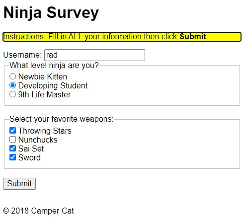

**[Use tabindex to Specify the Order of Keyboard Focus for Several Elements](https://www.freecodecamp.org/learn/responsive-web-design/applied-accessibility/use-tabindex-to-specify-the-order-of-keyboard-focus-for-several-elements)**

The `tabindex` attribute also specifies the exact tab order of elements. This is achieved when the value of the attribute is set to a positive number of 1 or higher.

Setting a `tabindex="1"` will bring keyboard focus to that element first. Then it cycles through the sequence of specified `tabindex` values (2, 3, etc.), before moving to default and `tabindex="0"` items.

It's important to note that when the tab order is set this way, it overrides the default order (which uses the HTML source). This may confuse users who are expecting to start navigation from the top of the page. This technique may be necessary in some circumstances, but in terms of accessibility, take care before applying it.

```html
<div tabindex="1">I get keyboard focus, and I get it first!</div>

<div tabindex="2">I get keyboard focus, and I get it second!</div>
```

<br/>

<hr/>

<br/>

## Responsive Web Design Principles

### Media Queries

Media Queries consist of a media type, and if that media type matches the type of device the document is displayed on, the styles are applied. You can have as many selectors and styles inside your media query as you want.

Here's an example of a media query that returns the content when the device's width is less than or equal to 100px, and another example that returns the content when the device's height is more than or equal to 350px:

```css
@media (max-width: 100px) {
  /* CSS Rules */
}

@media (min-height: 350px) {
  /* CSS Rules */
}
```

```css
@media (min-width: 576px) {
  .container {
    max-width: 540px;
  }
}

@media (min-width: 768px) {
  .container {
    max-width: 720px;
  }
}
```

The CSS inside the media query is applied only if the media type matches that of the device being used.

<br/>

You can also define media queries for landscape (when width > height) and portrait (height > width) modes:

```css
@media (orientation: landscape) {
}

@media (orientation: portrait) {
}
```

<br/>

Also, you want to always make sure that media queries comes after what you are overwriting. So, if you're overwriting a `<p>` tag, makes sure you place the media queries _after_ styling the selector `<p>` tag:

```css
p {
  color: #3e4147;
  font-family: "Arvo", serif;
  font-size: 1rem;
  font-weight: 400;
  margin-bottom: 2em;
}

@media (min-width: 600px) {
  p {
    font-size: 1.25rem;
  }
}

@media (min-width: 800px) {
  p {
    font-size: 1.5rem;
    line-height: 1.5;
  }
}
```

<br/>

Also, when you design a website for mobiles devices in mind, start by using `min-width`, otherwise, if you intend to use it mostly on desktops then on mobile, start by using `max-width`:

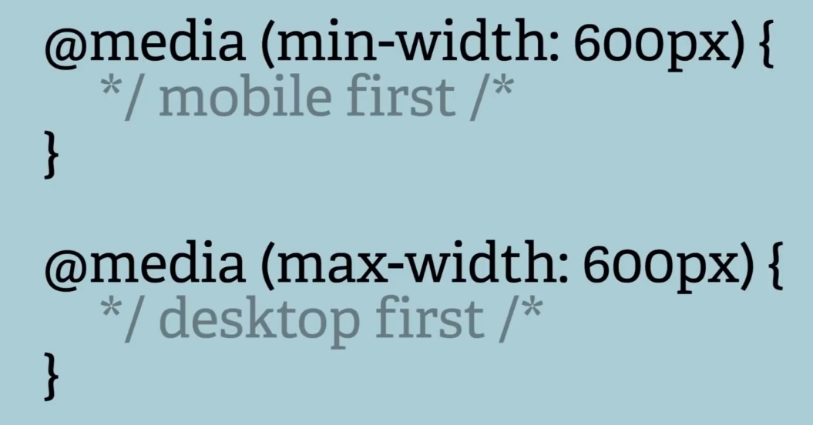

<br/>

**[Typical Device Breakpoints](https://www.w3schools.com/howto/howto_css_media_query_breakpoints.asp)**

```css
/* Extra small devices (phones, 600px and down) */
@media only screen and (max-width: 600px) {
  ...;
}

/* Small devices (portrait tablets and large phones, 600px and up) */
@media only screen and (min-width: 600px) {
  ...;
}

/* Medium devices (landscape tablets, 768px and up) */
@media only screen and (min-width: 768px) {
  ...;
}

/* Large devices (laptops/desktops, 992px and up) */
@media only screen and (min-width: 992px) {
  ...;
}

/* Extra large devices (large laptops and desktops, 1200px and up) */
@media only screen and (min-width: 1200px) {
  ...;
}
```

**[CSS3 Media Types](https://www.w3schools.com/css/css3_mediaqueries.asp)**

| Value  | Description                                            |
| :----- | :----------------------------------------------------- |
| all    | Used for all media type devices                        |
| print  | Used for printers                                      |
| screen | Used for computer screens, tablets, smart-phones etc.  |
| speech | Used for screen readers that "reads" the page out loud |

<br/>

Other resources on Media Queries:

- [CSS Media Queries Tutorial for Responsive Design - Adrian Twarog Youtube](https://youtu.be/j1AhSWFcZpg)
- [1h11m Microsoft Homepage Clone - CSS Grid, Flex & Media Queries - Traversy Media](https://www.youtube.com/watch?v=uKgn-To1C4Q&ab_channel=TraversyMedia)
- [2h Build a Responsive Website | HTML, CSS Grid, Flexbox & More - Traversy Media](https://youtu.be/p0bGHP-PXD4)
- [w3schools Media Queries examples for nav bard and menus](https://www.w3schools.com/css/css3_mediaqueries_ex.asp)
- [w3schools Media Queries examples for Responsive Web Design](https://www.w3schools.com/css/css_rwd_mediaqueries.asp)

<br/>

### Make images responsive

Making images responsive with CSS is actually very simple. You just need to add these properties to an image:

```css
img {
  max-width: 100%;
  height: auto;
}
```

The `max-width` of `100%` will make sure the image is never wider than the container it is in, and the `height` of `auto` will make the image keep its original aspect ratio.

<br/>

### Viewport units for responsive typography

Instead of using `em` or `px` to size text, you can use viewport units for responsive typography. Viewport units, like percentages, are relative units, but they are based off different items. Viewport units are relative to the viewport dimensions (width or height) of a device, and percentages are relative to the size of the parent container element.

The four different viewport units are:

- `vw` (viewport width): `10vw` would be 10% of the viewport's width.
- `vh` (viewport height): `3vh` would be 3% of the viewport's height.
- `vmin` (viewport minimum): `70vmin` would be 70% of the viewport's smaller dimension (height or width).
- `vmax` (viewport maximum): `100vmax` would be 100% of the viewport's bigger dimension (height or width).

Here is an example that sets a body tag to 30% of the viewport's width.

```css
body {
  width: 30vw;
}
```

Another example:

```html
<style>
  h2 {
    width: 80vw;
  }
  p {
    width: 75vmin;
  }
</style>

<h2>Importantus Ipsum</h2>
<p>
  Lorem ipsum dolor sit amet, consectetur adipiscing elit. Vivamus quis tempus
  massa. Aenean erat nisl, gravida vel vestibulum cursus, interdum sit amet
  lectus. Sed sit amet quam nibh. Suspendisse quis tincidunt nulla. In hac
  habitasse platea dictumst. Ut sit amet pretium nisl. Vivamus vel mi sem.
  Aenean sit amet consectetur sem. Suspendisse pretium, purus et gravida
  consequat, nunc ligula ultricies diam, at aliquet velit libero a dui.
</p>
```

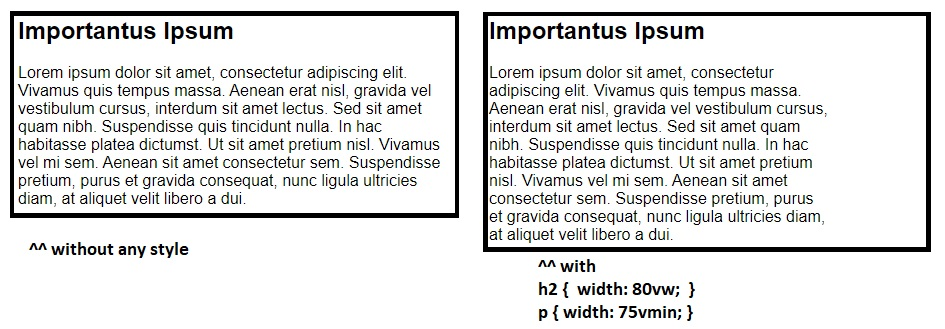

Or, another example:

```css
<style>
div {
  margin: 0 auto 0 auto;
  max-width: 80vmin;
}
</style>
```

That looks like this for both mobile and desktop:


<br/>

[More on viewport from sitepoint.com](https://www.sitepoint.com/css-viewport-units-quick-start/)

<br/>

<hr/>

<br/>

## CSS Flexbox

website's User Interface ("UI") has two components. First, there are the visual elements, such as colors, fonts, and images. Second, there is the placement or positioning of those elements. In Responsive Web Design, a UI layout must accommodate many different browsers and devices accessing the content.

CSS3 introduced Flexible Boxes, or flexbox, to create page layouts for a dynamic UI. It is a layout mode that arranges elements in a predictable way for different screen sizes and browsers. While somewhat new, all popular modern browsers support flexbox.

- [Flexbox cheatsheet webpage with live examples by yoksel](https://yoksel.github.io/flex-cheatsheet/#section-flex-direction)

Usually Flexbox is always used with items (`div`, `ul`, etc.) within a container class(`div`, `nav`, etc.), eg:

```html
<div class="flex-container">
  <div>1</div>
  <div>2</div>
  <div>3</div>
</div>

<style>
  .flex-container {
    display: flex; /* by default items will be aligned horizontally */
  }
  .flex-container div {
    background-color: DodgerBlue;
    color: white;
    width: 100px;
    margin: 10px;
    text-align: center;
  }
</style>
```

### Flexbox container

`flex-direction:` - defines in which direction the container wants to stack the flex items

```css
flex-direction: column; /* stacks the flex items vertically (from top to bottom) */
flex-direction: column-reverse; /* stacks the flex items vertically (but from bottom to top) */
flex-direction: row; /* (default) stacks the flex items horizontally (from left to right) */
flex-direction: row-reverse; /* stacks the flex items horizontally (but from right to left) */
```

`flex-wrap:` - specifies whether the flex items should wrap or not

```css
flex-wrap: wrap /* specifies that the flex items will wrap if necessary */
flex-wrap: nowrap /* specifies that the flex items will not wrap (this is default) */
flex-wrap: wrap-reverse /* specifies that the flexible items will wrap if necessary, in reverse order */
```

`flex-flow:` property is a shorthand property for setting both the `flex-direction` and `flex-wrap` properties

```css
flex-flow: row wrap;
```

`justify-content:` - property that is used to align/move the flex items _horizontally (for rows)_

```css
justify-content: center /* aligns the flex items at the center of the container */
justify-content: flex-start /* aligns the flex items at the beginning of the container (this is default) */
justify-content: flex-end /* aligns the flex items at the end of the container */
justify-content: space-around /* displays the flex items with space before, between, and after the lines */
justify-content: space-between /* displays the flex items with space between the lines */
justify-content: space-evenly
```

`align-items:` - property is used to align/move the flex items _vertically (for rows)_

```css
align-items: center /* aligns the flex items in the middle of the container */
align-items: flex-start /* aligns the flex items at the top of the container */
align-items: flex-end /* aligns the flex items at the bottom of the container */
align-items: stretch /* stretches the flex items to fill the container (this is default) */
align-items: baseline /* aligns the flex items such as their baselines aligns */
```

`align-content:` - property used to align the flex lines

```css
align-content: space-between /* displays the flex lines with equal space between them */
align-content: space-around /* displays the flex lines with space before, between, and after them */
align-content: stretch /* stretches the flex lines to take up the remaining space (this is default) */
align-content: center /* displays display the flex lines in the middle of the container */
align-content: flex-start /* displays the flex lines at the start of the container */
align-content: flex-end /* displays the flex lines at the end of the container */
```

<br/>

Example for Perfect Centering (horizontally and vertically):

```css
.flex-container {
  display: flex;
  height: 300px;
  justify-content: center;
  align-items: center;
}
```

<br/>

### Flexbox items

`flex-shrink:` - property that specifies how much a flex item will shrink relative to the rest of the flex items

The `flex-shrink` property takes numbers as values. The higher the number, the more it will shrink compared to the other items in the container. For example, if one item has a `flex-shrink` value of `1` and the other has a `flex-shrink` value of `3`, the one with the value of `3` will shrink three times as much as the other.

```css
#item-1 {
  flex-shrink: 1;
}

#item-2 {
  flex-shrink: 2;
}
```

`flex-grow:` - property that specifies how much a flex item will grow relative to the rest of the flex items

The opposite of `flex-shrink` is the `flex-grow` property. Recall that `flex-shrink` controls the size of the items when the container shrinks. The `flex-grow` property controls the size of items when the parent container expands.

```css
#item-1 {
  flex-grow: 1;
}

#item-2 {
  flex-grow: 2;
}
```

`flex-basis:` - property that specifies the initial length of a flex item (values in `px` or `%`)

The `flex-basis` property specifies the initial size of the item before CSS makes adjustments with `flex-shrink` or `flex-grow`. The units used by the `flex-basis` property are the same as other size properties (`px`, `em`, `%`, etc.). The value `auto` sizes items based on the content.

```css
#box-1 {
  background-color: dodgerblue;
  height: 200px;
  flex-basis: 10em;
}

#box-2 {
  background-color: orangered;
  height: 200px;
  flex-basis: 20em;
}
```

`flex:` property is a shorthand property for the `flex-grow`, `flex-shrink`, and `flex-basis` properties

- `flex: 1 0 10px;` will set the item to `flex-grow: 1;`, `flex-shrink: 0;`, and `flex-basis: 10px;`.
- the default property settings are `flex: 0 1 auto;`
- if it's set to `1`: `flex: 1;`, the items will grow and shrink automatically to the size of container

`order:` - property that specifies the order of the flex items

The `order` property is used to tell CSS the order of how flex items appear in the flex container. By default, items will appear in the same order they come in the source HTML. The property takes numbers as values, and negative numbers can be used.

```css
#item-1 {
  order: 2;
}

#item-2 {
  order: 1;
}
```

`align-self:` - property that specifies the alignment for the selected item inside the flexible container. This property overrides the default alignment set by the container's `align-items` property

This property allows you to adjust each item's alignment individually, instead of setting them all at once. This is useful since other common adjustment techniques using the CSS properties `float`, `clear`, and `vertical-align` do not work on flex items. `align-self` accepts the same values as `align-items` and will override any value set by the `align-items` property.

```css
#box-1 {
  background-color: dodgerblue;
  align-self: center;
  height: 200px;
  width: 200px;
}

#box-2 {
  background-color: orangered;
  align-self: flex-end;
  height: 200px;
  width: 200px;
}
```

<br/>

[**Complete Example of a Twitter Card using Flexbox**](https://www.freecodecamp.org/learn/responsive-web-design/css-flexbox/use-the-align-items-property-in-the-tweet-embed)

```html
<style>
  body {
    font-family: Arial, sans-serif;
  }
  header,
  footer {
    display: flex;
    flex-direction: row;
  }
  header .profile-thumbnail {
    width: 50px;
    height: 50px;
    border-radius: 4px;
  }
  header .profile-name {
    display: flex;
    flex-direction: column;
    justify-content: center;
    margin-left: 10px;
  }
  header .follow-btn {
    display: flex;
    align-items: center;
    margin: 0 0 0 auto;
  }
  header .follow-btn button {
    border: 0;
    border-radius: 3px;
    padding: 5px;
  }
  header h3,
  header h4 {
    display: flex;
    margin: 0;
  }
  #inner p {
    margin-bottom: 10px;
    font-size: 20px;
  }
  #inner hr {
    margin: 20px 0;
    border-style: solid;
    opacity: 0.1;
  }
  footer .stats {
    display: flex;
    font-size: 15px;
  }
  footer .stats strong {
    font-size: 18px;
  }
  footer .stats .likes {
    margin-left: 10px;
  }
  footer .cta {
    margin-left: auto;
  }
  footer .cta button {
    border: 0;
    background: transparent;
  }
</style>
<header>
  
  <div class="profile-name">
    <h3>Quincy Larson</h3>
    <h4>@ossia</h4>
  </div>
  <div class="follow-btn">
    <button>Follow</button>
  </div>
</header>
<div id="inner">
  <p>
    I meet so many people who are in search of that one trick that will help
    them work smart. Even if you work smart, you still have to work hard.
  </p>
  <span class="date">1:32 PM - 12 Jan 2018</span>
  <hr />
</div>
<footer>
  <div class="stats">
    <div class="Retweets"><strong>107</strong> Retweets</div>
    <div class="likes"><strong>431</strong> Likes</div>
  </div>
  <div class="cta">
    <button class="share-btn">Share</button>
    <button class="retweet-btn">Retweet</button>
    <button class="like-btn">Like</button>
  </div>
</footer>
```

<center>


</center>

<br/>

<hr/>

<br/>

## CSS Grid

https://www.freecodecamp.org/learn/responsive-web-design/css-grid/

```html
<style>
  .d1 {
    background: LightSkyBlue;
  }
  .d2 {
    background: LightSalmon;
  }
  .d3 {
    background: PaleTurquoise;
  }
  .d4 {
    background: LightPink;
  }
  .d5 {
    background: PaleGreen;
  }

  .container {
    font-size: 40px;
    width: 100%;
    display: grid;
  }
</style>

<div class="container">
  <div class="d1">1</div>
  <div class="d2">2</div>
  <div class="d3">3</div>
  <div class="d4">4</div>
  <div class="d5">5</div>
</div>
```


Grid Resources:

- https://learncssgrid.com/
- https://css-tricks.com/snippets/css/complete-guide-grid/
- https://www.freecodecamp.org/news/intro-to-css-grid-layout/ article
- https://gridbyexample.com/examples/

**[Create Flexible Layouts Using auto-fill](https://www.freecodecamp.org/learn/responsive-web-design/css-grid/create-flexible-layouts-using-auto-fill)**

The repeat function comes with an option called auto-fill. This allows you to automatically insert as many rows or columns of your desired size as possible depending on the size of the container. You can create flexible layouts when combining `auto-fill` with `minmax`, like this:

```css
.container {
  grid-template-columns: repeat(auto-fill, minmax(60px, 1fr));
}
```

When the container changes size, this setup keeps inserting 60px columns and stretching them until it can insert another one. **Note:** If your container can't fit all your items on one row, it will move them down to a new one.

**[Create Flexible Layouts Using auto-fit](https://www.freecodecamp.org/learn/responsive-web-design/css-grid/create-flexible-layouts-using-auto-fit)**

`auto-fit` works almost identically to `auto-fill`. The only difference is that when the container's size exceeds the size of all the items combined, `auto-fill` keeps inserting empty rows or columns and pushes your items to the side, while `auto-fit` collapses those empty rows or columns and stretches your items to fit the size of the container.

**Note:** If your container can't fit all your items on one row, it will move them down to a new one.

```css
.container {
  grid-template-columns: repeat(auto-fit, minmax(60px, 1fr));
}
```

**[Use Media Queries to Create Responsive Layouts](https://www.freecodecamp.org/learn/responsive-web-design/css-grid/use-media-queries-to-create-responsive-layouts)**

CSS Grid can be an easy way to make your site more responsive by using media queries to rearrange grid areas, change dimensions of a grid, and rearrange the placement of items.

In the preview, when the viewport width is 300px or more, the number of columns changes from 1 to 2. The advertisement area then occupies the left column completely.

```html
<style>
  .item1 {
    background: LightSkyBlue;
    grid-area: header;
  }

  .item2 {
    background: LightSalmon;
    grid-area: advert;
  }

  .item3 {
    background: PaleTurquoise;
    grid-area: content;
  }

  .item4 {
    background: lightpink;
    grid-area: footer;
  }

  .container {
    font-size: 1.5em;
    min-height: 300px;
    width: 100%;
    background: LightGray;
    display: grid;
    grid-template-columns: 1fr;
    grid-template-rows: 50px auto 1fr auto;
    grid-gap: 10px;
    grid-template-areas:
      "header"
      "advert"
      "content"
      "footer";
  }

  @media (min-width: 300px) {
    .container {
      grid-template-columns: auto 1fr;
      grid-template-rows: auto 1fr auto;
      grid-template-areas:
        "advert header"
        "advert content"
        "advert footer";
    }
  }

  @media (min-width: 400px) {
    .container {
      grid-template-areas:
        "header header"
        "advert content"
        "footer footer";
    }
  }
</style>

<div class="container">
  <div class="item1">header</div>
  <div class="item2">advert</div>
  <div class="item3">content</div>
  <div class="item4">footer</div>
</div>
```

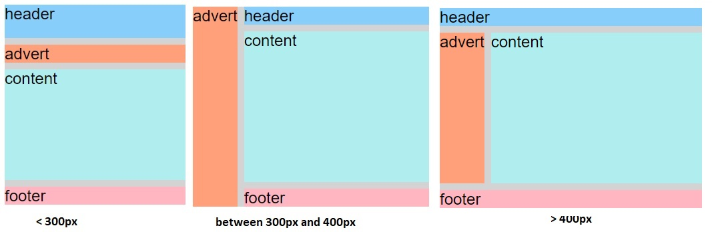

<br/>

**[Create Grids within Grids](https://www.freecodecamp.org/learn/responsive-web-design/css-grid/create-grids-within-grids)**

Turning an element into a grid only affects the behavior of its direct descendants. So by turning a direct descendant into a grid, you have a grid within a grid.

For example, by setting the `display` and `grid-template-columns` properties of the element with the `item3` class, you create a grid within your grid.

```html
<style>
  .container {
    font-size: 1.5em;
    min-height: 300px;
    width: 100%;
    background: LightGray;
    display: grid;
    grid-template-columns: auto 1fr;
    grid-template-rows: auto 1fr auto;
    grid-gap: 10px;
    grid-template-areas:
      "advert header"
      "advert content"
      "advert footer";
  }
  .item1 {
    background: LightSkyBlue;
    grid-area: header;
  }

  .item2 {
    background: LightSalmon;
    grid-area: advert;
  }

  .item3 {
    background: PaleTurquoise;
    grid-area: content;
    display: grid;
    grid-template-columns: auto 1fr;
  }

  .item4 {
    background: lightpink;
    grid-area: footer;
  }

  .itemOne {
    background: PaleGreen;
  }

  .itemTwo {
    background: BlanchedAlmond;
  }
</style>

<div class="container">
  <div class="item1">header</div>
  <div class="item2">advert</div>
  <div class="item3">
    <div class="itemOne">paragraph1</div>
    <div class="itemTwo">paragraph2</div>
  </div>
  <div class="item4">footer</div>
</div>
```

<center>

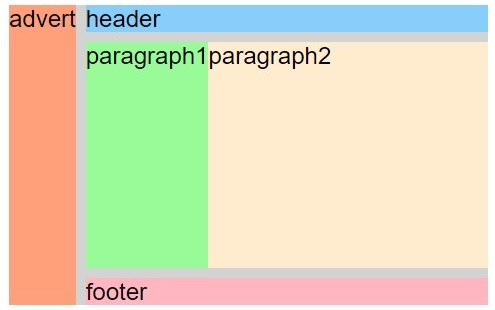

</center>

<br/>

<hr/>

<br/>

## Responsive Web Design Projects

### Build a Tribute Page

[Challenge Objective](https://www.freecodecamp.org/learn/responsive-web-design/responsive-web-design-projects/build-a-tribute-page)

My Solution (on [codepen.io](https://codepen.io/radualexandrub/pen/poEZQgM)) - Saturday, January 09, 2021:

<iframe height="417" style="width: 100%;" scrolling="no" title="Fork Me! FCC: Test Suite Template" src="https://codepen.io/radualexandrub/embed/poEZQgM?height=417&theme-id=dark&default-tab=html,result" frameborder="no" loading="lazy" allowtransparency="true" allowfullscreen="true">
  See the Pen <a href='https://codepen.io/radualexandrub/pen/poEZQgM'>Fork Me! FCC: Test Suite Template</a> by Radu-Alexandru B
  (<a href='https://codepen.io/radualexandrub'>@radualexandrub</a>) on <a href='https://codepen.io'>CodePen</a>.
</iframe>

<br/>

<hr/>

<br/>

### Build a Survey Form

[View the challenge here](https://www.freecodecamp.org/learn/responsive-web-design/responsive-web-design-projects/build-a-survey-form)

[View freeCodeCamp's solution](https://codepen.io/freeCodeCamp/pen/VPaoNP?editors=1100)

Survey Form without any CSS:

```html
<head>
  <title>Survey From</title>
</head>

<body>
  <main class="container">
    <header>
      <h1 id="title">User's Experience Survey Form</h1>
      <p id="description">
        Welcome and thank you for taking your time to help us improve our
        App.<br />We will make sure that every answer counts!
      </p>
    </header>

    <form id="survey-form">
      <div class="form-group">
        <label id="name-label" for="name">Name</label>
        <input
          type="text"
          name="name"
          id="name"
          class="form-control"
          placeholder="Enter your name"
          required
        />
      </div>

      <div class="form-group">
        <label id="email-label" for="email">Email</label>
        <input
          type="email"
          name="email"
          id="email"
          class="form-control"
          placeholder="Enter your email"
          required
        />
      </div>

      <div class="form-group">
        <label id="number-label" for="number"
          >Age<span class="clue">(optional)</span></label
        >
        <input
          type="number"
          name="age"
          id="number"
          min="10"
          max="99"
          class="form-control"
          placeholder="Enter your age"
        />
      </div>

      <div class="form-group">
        <p>Which option best describes your current role?</p>
        <select id="dropdown" name="role" class="form-control" required>
          <option disabled selected value>Select current role</option>
          <option value="student">Student</option>
          <option value="learner">Full Time Learner</option>
          <option value="part-job">Part Time Job</option>
          <option value="job">Full Time Job</option>
          <option value="freelance-job">Freelancer</option>
          <option value="preferNo">Prefer not to say</option>
          <option value="other">Other</option>
        </select>
      </div>

      <div class="form-group">
        <p>How would you rate our service so far?</p>
        <label
          ><input
            name="user-rating"
            value="5"
            type="radio"
            class="input-radio"
            checked
          />5 stars</label
        >
        <label
          ><input
            name="user-rating"
            value="4"
            type="radio"
            class="input-radio"
          />4 stars</label
        >
        <label
          ><input
            name="user-rating"
            value="3"
            type="radio"
            class="input-radio"
          />3 stars</label
        >
        <label
          ><input
            name="user-rating"
            value="2"
            type="radio"
            class="input-radio"
          />2 stars</label
        >
        <label
          ><input
            name="user-rating"
            value="1"
            type="radio"
            class="input-radio"
          />1 star</label
        >
      </div>

      <div class="form-group">
        <p>Would you recommend our service to any of your friends?</p>
        <label>
          <input
            name="user-recommend"
            value="definitely"
            type="radio"
            class="input-radio"
            checked
          />Definitely</label
        >
        <label>
          <input
            name="user-recommend"
            value="maybe"
            type="radio"
            class="input-radio"
          />Maybe</label
        >
        <label
          ><input
            name="user-recommend"
            value="no"
            type="radio"
            class="input-radio"
          />No</label
        >
      </div>

      <div class="form-group">
        <p>
          What would you like to see improved?
          <span class="clue">(Check all that apply)</span>
        </p>

        <label
          ><input
            name="prefer"
            value="front-end-projects"
            type="checkbox"
            class="input-checkbox"
          />Front-end Projects</label
        >
        <label>
          <input
            name="prefer"
            value="back-end-projects"
            type="checkbox"
            class="input-checkbox"
          />Back-end Projects</label
        >
        <label
          ><input
            name="prefer"
            value="data-visualization"
            type="checkbox"
            class="input-checkbox"
          />Data Visualization</label
        >
        <label
          ><input
            name="prefer"
            value="challenges"
            type="checkbox"
            class="input-checkbox"
          />Challenges</label
        >
        <label
          ><input
            name="prefer"
            value="open-source-community"
            type="checkbox"
            class="input-checkbox"
          />Open Source Community</label
        >
        <label
          ><input
            name="prefer"
            value="gitter-help-rooms"
            type="checkbox"
            class="input-checkbox"
          />Gitter help rooms</label
        >
        <label
          ><input
            name="prefer"
            value="videos"
            type="checkbox"
            class="input-checkbox"
          />Videos</label
        >
        <label
          ><input
            name="prefer"
            value="city-meetups"
            type="checkbox"
            class="input-checkbox"
          />City Meetups</label
        >
        <label
          ><input
            name="prefer"
            value="wiki"
            type="checkbox"
            class="input-checkbox"
          />Wiki</label
        >
        <label
          ><input
            name="prefer"
            value="forum"
            type="checkbox"
            class="input-checkbox"
          />Forum</label
        >
        <label
          ><input
            name="prefer"
            value="additional-courses"
            type="checkbox"
            class="input-checkbox"
          />Additional Courses</label
        >
      </div>

      <div class="form-group">
        <p>Any comments or suggestions?</p>
        <textarea
          id="comments"
          class="input-textarea"
          name="comment"
          placeholder="Enter your comment here..."
        ></textarea>
      </div>

      <div class="form-group">
        <button type="submit" id="submit" class="submit-button">Submit</button>
      </div>
    </form>
  </main>
</body>
```

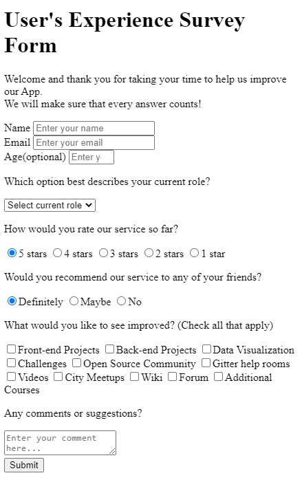

If we import Bootstrap:

```html
<head>
  <title>Survey From</title>
  <link
    rel="stylesheet"
    href="https://stackpath.bootstrapcdn.com/bootstrap/4.3.1/css/bootstrap.min.css"
    integrity="sha384-ggOyR0iXCbMQv3Xipma34MD+dH/1fQ784/j6cY/iJTQUOhcWr7x9JvoRxT2MZw1T"
    crossorigin="anonymous"
  />
</head>
```

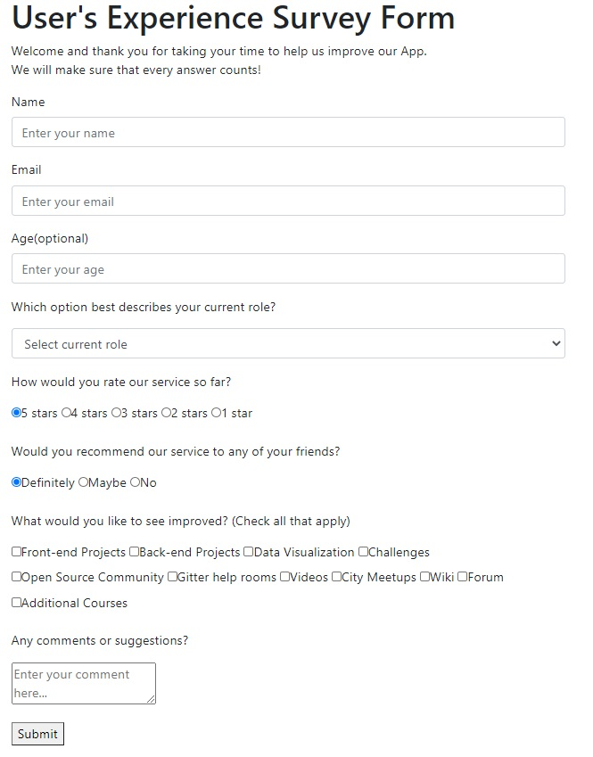

My solution (without Bootstrap) - Saturday, January 09, 2021:

<iframe height="432" style="width: 100%;" scrolling="no" title="FCC Responsive02 - Survey Form" src="https://codepen.io/radualexandrub/embed/ExgpOrw?height=432&theme-id=dark&default-tab=html,result" frameborder="no" loading="lazy" allowtransparency="true" allowfullscreen="true">
  See the Pen <a href='https://codepen.io/radualexandrub/pen/ExgpOrw'>FCC Responsive02 - Survey Form</a> by Radu-Alexandru B
  (<a href='https://codepen.io/radualexandrub'>@radualexandrub</a>) on <a href='https://codepen.io'>CodePen</a>.
</iframe>

<br/>

<hr/>

<br/>

### Build a Product Landing Page

[View the challenge here](https://www.freecodecamp.org/learn/responsive-web-design/responsive-web-design-projects/build-a-product-landing-page)

[freeCodeCamp's solution](https://codepen.io/freeCodeCamp/full/RKRbwL)

**HTML5 Starter Template - Boilerplate:**

```html
<!DOCTYPE html>
<html lang="en">
  <head>
    <meta charset="utf-8" />
    <meta
      name="viewport"
      content="width=device-width, initial-scale=1, shrink-to-fit=no"
    />

    <title>Product Landing Page</title>
    <meta name="description" content="A mockup of a Product Landing Page" />
    <meta name="author" content="Radu-Alexandru B" />

    <link rel="icon" type="image/x-icon" href="/favicon.ico?" />
    <link rel="apple-touch-icon" href="/favicon.png?" />
    <script src="https://cdn.freecodecamp.org/testable-projects-fcc/v1/bundle.js"></script>
  </head>

  <body>
    <!-- Navigation -->
    <nav></nav>

    <!-- Page Header -->
    <header>
      <h1></h1>
    </header>

    <!-- Main Content -->
    <main class="container">
      <section></section>

      <section></section>
    </main>

    <!-- Footer -->
    <footer></footer>
  </body>
</html>
```

<br/>

My Solution:

<iframe height="419" style="width: 100%;" scrolling="no" title="FCC Responsive03: Product Landing Page" src="https://codepen.io/radualexandrub/embed/JjRBxoQ?height=419&theme-id=dark&default-tab=html,result" frameborder="no" loading="lazy" allowtransparency="true" allowfullscreen="true">
  See the Pen <a href='https://codepen.io/radualexandrub/pen/JjRBxoQ'>FCC Responsive03: Product Landing Page</a> by Radu-Alexandru B
  (<a href='https://codepen.io/radualexandrub'>@radualexandrub</a>) on <a href='https://codepen.io'>CodePen</a>.
</iframe>

<br/>

<hr/>

<br/>

### Technical Documentation Page

[Technical Documentation Webpage Challenge Description](https://www.freecodecamp.org/learn/responsive-web-design/responsive-web-design-projects/build-a-technical-documentation-page)

[freeCodeCamp's Solution](https://codepen.io/freeCodeCamp/full/NdrKKL)

<br/>

<hr/>

<br/>

### Personal Portfolio Webpage

[Personal Portfolio Webpage Challenge Description](https://www.freecodecamp.org/learn/responsive-web-design/responsive-web-design-projects/build-a-personal-portfolio-webpage)

[freeCodeCamp's Solution](https://codepen.io/freeCodeCamp/full/zNBOYG)
