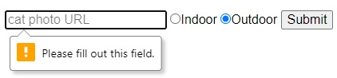
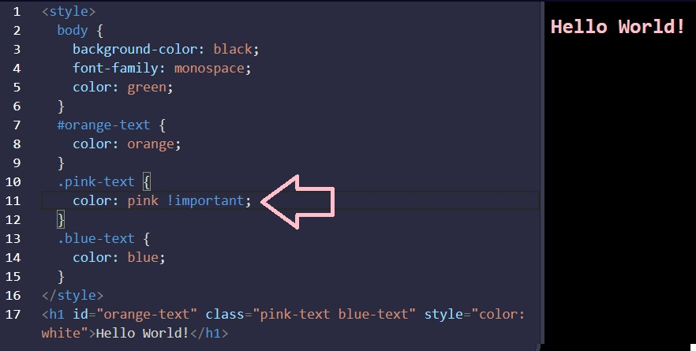
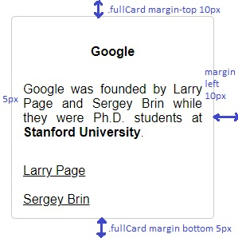
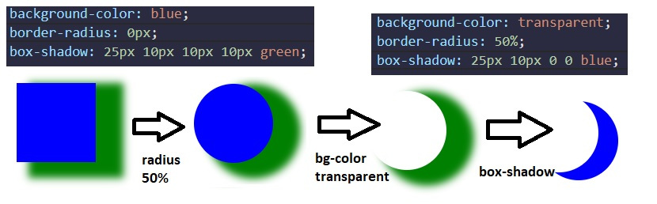
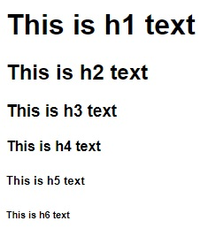
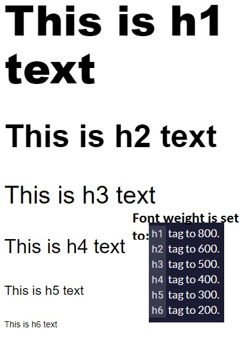
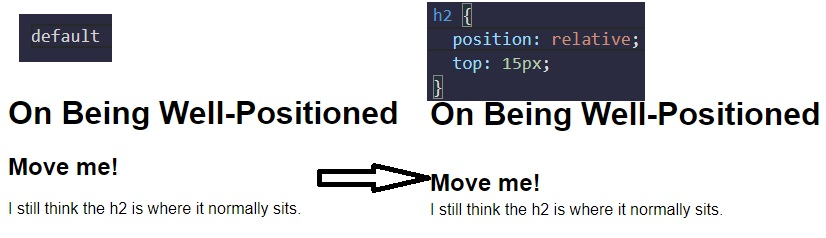
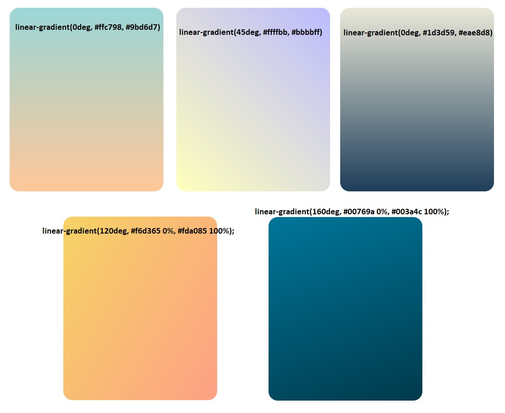
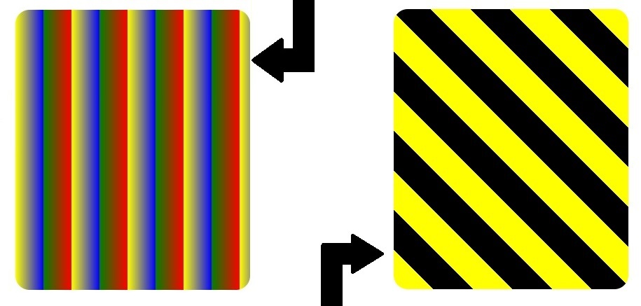
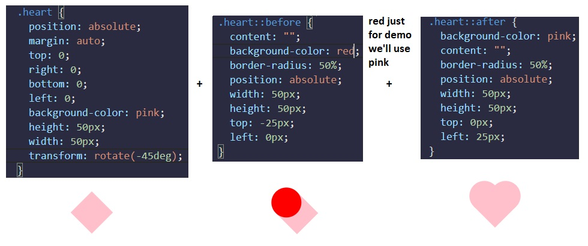

# Responsive Web Design Certification - freeCodeCamp

## Credits / Notes taken from:

- [Responsive Web Design Certification - freeCodeCamp](https://www.freecodecamp.org/learn/responsive-web-design/basic-html-and-html5/)
- [HTML Tutorial from w3schools.com](https://www.w3schools.com/html/default.asp)

## Contents

<br/>

<br/>

## Basic HTML and HTML5

Comments in HTML start with `<!--` and end with a `-->`

HTML5 (released on 28 October 2014) introduces more descriptive HTML tags. These include `main`, `header`, `footer`, `nav`, `video`, `article`, `section` and others.

<center>


</center>

These tags give a descriptive structure to your HTML, make your HTML easier to read, and help with Search Engine Optimization (SEO) and accessibility. The `main` HTML5 tag helps search engines and other developers find the main content of your page.

```html
<h2>CatPhotoApp</h2>
<main>
    <p>Kitty ipsum dolor sit amet, shed everywhere shed everywhere stretching attack your ankles chase the red dot, hairball run catnip eat the grass sniff.</p>
    <p>Purr jump eat the grass rip the couch scratched sunbathe, shed everywhere rip the couch sleep in the sink fluffy fur catnip scratched.</p>
    <a href="#"></a>
    <p>
        View more <a target="_blank" href="https://freecatphotoapp.com">cat photos</a>
    </p>
    <!-- the value "_blank" specifies to open the link in a new tab -->
</main>
```

```html
<section>
<h1>WWF</h1>
<p>The World Wide Fund for Nature (WWF) is an international organization working on issues regarding the conservation, research and restoration of the environment, formerly named the World Wildlife Fund. WWF was founded in 1961.</p>
</section>
```

### Declare the Doctype of an HTML Document

At the top of your document, you need to tell the browser which version of HTML your page is using. HTML is an evolving language, and is updated regularly. Most major browsers support the latest specification, which is HTML5. However, older web pages may use previous versions of the language.

You tell the browser this information by adding the `<!DOCTYPE ...>` tag on the first line, where the `...` part is the version of HTML. For HTML5, you use `<!DOCTYPE html>`.

The `!` and uppercase `DOCTYPE` is important, especially for older browsers. The `html` is not case sensitive.

Next, the rest of your HTML code needs to be wrapped in `html` tags. The opening `<html>` goes directly below the `<!DOCTYPE html>` line, and the closing `</html>` goes at the end of the page.

```html
<!DOCTYPE html>
<html>
  <head>
    <title>Page title</title>
    <!-- metadata elements -->
  </head>
  <body>
    <!-- page contents -->
  </body>
</html>
```

### Link to Internal Sections of a Page with Anchor Elements

To create an internal link, you assign a link's `href` attribute to a hash symbol `#` plus the value of the `id` attribute for the element that you want to internally link to, usually further down the page. You then need to add the same `id` attribute to the element you are linking to. An `id` is an attribute that uniquely describes an element.

```html
<a href="#contacts-header">Contacts</a>
<a href="#footer">Jump to Bottom</a>

<h2 id="contacts-header">Contacts</h2>
<footer id="footer">Copyright Cat Photo App</footer>
```

### Lists

Unordered `ul` and ordered `ol` lists

```html
<h2>CatPhotoApp</h2>
<main>
  <p>Click here to view more <a href="#">cat photos</a>.</p>  
  <p>Things cats love:</p>
  <ul>
    <li>cat nip</li>
    <li>laser pointers</li>
    <li>lasagna</li>
  </ul>
  <p>Top 3 things cats hate:</p>
  <ol>
    <li>flea treatment</li>
    <li>thunder</li>
    <li>other cats</li>
  </ol>
</main>
```

### Input Text Fields

`input` elements are a convenient way to get input from your user. You can also set placeholders that is displayed before your user has inputted anything.

```html
<input type="text" placeholder="cat photo URL">
```

<center>


</center>

### Forms, Submit Button and Required fields

You can build web forms that actually submit data to a server using nothing more than pure HTML. You can do this by specifying an action on your `form` element.

```html
  <form action="https://freecatphotoapp.com/submit-cat-photo">
    <input type="text" placeholder="cat photo URL">
  </form>
```

If user presses ENTER key after writing in input, the text will be submitted to the `url` in `action` attribute.

We can also add a Submit Button:

```html
<form action="https://freecatphotoapp.com/submit-cat-photo">
  <input type="text" placeholder="cat photo URL" />
  <button type="submit">Submit</button>
</form>
```

We can also use HTML5 to Require a Field

You can require specific form fields so that your user will not be able to submit your form until he or she has filled them out. For example, if you wanted to make a text input field required, you can just add the attribute `required` within your `input` element, like this: `<input type="text" required>`

```html
  <form action="https://freecatphotoapp.com/submit-cat-photo">
    <input type="text" placeholder="cat photo URL" required/>
    <button type="submit">Submit</button>
  </form>
```

<center>


</center>

### Radio Buttons

You can use radio buttons for questions where you want the user to only give you **one** answer out of multiple options.

Radio buttons are a type of `input`.

Each of your radio buttons can be nested within its own `label` element. By wrapping an `input` element inside of a `label` element it will automatically associate the radio button input with the label element surrounding it.

All related radio buttons should have the same `name` attribute to create a radio button group. By creating a radio group, selecting any single radio button will automatically deselect the other buttons within the same group ensuring only one answer is provided by the user.

```html
<label> 
  <input type="radio" name="indoor-outdoor">Indoor 
</label>
```

It is considered best practice to set a `for` attribute on the `label` element, with a value that matches the value of the `id` attribute of the `input` element. This allows assistive technologies to create a linked relationship between the label and the child `input` element:

```html
<label for="indoor"> 
  <input id="indoor" type="radio" name="indoor-outdoor">Indoor 
</label>
```

Example:

```html
  <form action="https://freecatphotoapp.com/submit-cat-photo">
    <input type="text" placeholder="cat photo URL" required>
    
    <label for="indoor"> 
      <input id="indoor" type="radio" name="indoor-outdoor"/> Indoor
    </label>
    <label for="indoor"> 
      <input id="outdoor" type="radio" name="indoor-outdoor"/> Outdoor
    </label>
    <button type="submit">Submit</button>
  </form>
```

<center>



</center>

Another example:

```html
<!DOCTYPE html>
<html>
<body>

<h1>Display Radio Buttons</h1>

<form action="/action_page.php">
  <p>Please select your gender:</p>
  <input type="radio" id="male" name="gender" value="male">
  <label for="male">Male</label><br>
  <input type="radio" id="female" name="gender" value="female">
  <label for="female">Female</label><br>
  <input type="radio" id="other" name="gender" value="other">
  <label for="other">Other</label>

  <br>  

  <p>Please select your age:</p>
  <input type="radio" id="age1" name="age" value="30">
  <label for="age1">0 - 30</label><br>
  <input type="radio" id="age2" name="age" value="60">
  <label for="age2">31 - 60</label><br>  
  <input type="radio" id="age3" name="age" value="100">
  <label for="age3">61 - 100</label><br><br>
  <input type="submit" value="Submit">
</form>

</body>
</html>
```

<center>


</center>

### Checkboxes, value attribute and check by default

Forms commonly use checkboxes for questions that may have **more than one** answer.

Checkboxes are a type of `input`.

Each of your checkboxes can be nested within its own `label` element. By wrapping an `input` element inside of a `label` element it will automatically associate the checkbox input with the label element surrounding it.

All related checkbox inputs should have the same `name` attribute.

It is considered best practice to explicitly define the relationship between a checkbox `input` and its corresponding `label` by setting the `for` attribute on the `label` element to match the `id` attribute of the associated `input` element.

Example:

```html
<label for="energetic">
    <input type="checkbox" id="good" name="personality"/> Energetic
</label>
<label for="loving">
    <input type="checkbox" id="good" name="personality"/> Loving
</label>
<label for="cute">
    <input type="checkbox" id="good" name="personality"/> Cute
</label> 
<button type="submit">Submit</button>
```

Another Example:

```html
<form action="/action_page.php">
  <input type="checkbox" id="vehicle1" name="vehicle1" value="Bike">
  <label for="vehicle1"> I have a bike</label><br>
  <input type="checkbox" id="vehicle2" name="vehicle2" value="Car">
  <label for="vehicle2"> I have a car</label><br>
  <input type="checkbox" id="vehicle3" name="vehicle3" value="Boat">
  <label for="vehicle3"> I have a boat</label><br><br>
  <input type="submit" value="Submit">
</form>
```

<form action="">
  <input type="checkbox" id="vehicle1" name="vehicle1" value="Bike">
  <label for="vehicle1"> I have a bike</label><br>
  <input type="checkbox" id="vehicle2" name="vehicle2" value="Car">
  <label for="vehicle2"> I have a car</label><br>
  <input type="checkbox" id="vehicle3" name="vehicle3" value="Boat">
  <label for="vehicle3"> I have a boat</label><br><br>
  <input type="submit" value="Submit">
</form>

<br/>

**Use the value attribute with Radio Buttons and Checkboxes**

When a form gets submitted, the data is sent to the server and includes entries for the options selected. Inputs of type `radio` and `checkbox` report their values from the `value` attribute.

```html
<label for="indoor">
  <input id="indoor" value="indoor" type="radio" name="indoor-outdoor">Indoor
</label>
<label for="outdoor">
  <input id="outdoor" value="outdoor" type="radio" name="indoor-outdoor">Outdoor
</label>
```

Here, you have two `radio` inputs. When the user submits the form with the `indoor` option selected, the form data will include the line: `indoor-outdoor=indoor`. This is from the `name` and `value` attributes of the "indoor" input.

*If you omit the `value` attribute, the submitted form data uses the default value, which is `on`. In this scenario, if the user clicked the "indoor" option and submitted the form, the resulting form data would be `indoor-outdoor=on`, which is not useful. So the `value` attribute needs to be set to something to identify the option.*

```html
<label for="loving"><input id="loving" value="loving" type="checkbox" name="personality"> Loving</label>
<label for="lazy"><input id="lazy" value="lazy" type="checkbox" name="personality"> Lazy</label>
<label for="energetic"><input id="energetic" value="energetic" type="checkbox" name="personality"> Energetic</label><br/>
```

<br/>

**Check Radio Buttons and Checkboxes by Default**

You can set a checkbox or radio button to be checked by default using the `checked` attribute. 

To do this, just add the word "checked" to the inside of an input element:

```html
<input type="radio" name="test-name" checked>
```

<br/>

<br/>

## Basic CSS

- **External** CSS:

  ```html
  <head>
    <link rel="stylesheet" href="mystyle.css">
    <link rel="stylesheet" href="https://cdn.jsdelivr.net/gh/konpa/devicon@master/devicon.min.css">
  </head>
  ```

- **Internal** CSS: `<head><style>body{ color: gray; }</style></body>`

- **Inline** CSS: `<h1 style="color:purple; text-align:center;">This a nice heading, yes</h1>`

### Use a CSS Class to Style an Element

Turn all `h2` elements blue:

```html
<style>
  h2 {
    color: blue;
  }
</style>
<h2>CatPhotoApp</h2>
```

Give `h2` and `p` elements the `class` attribute with a value of `'red-text'`. Also change the font size for `p` elements.

```html
<style>
  .red-text {
    color: red;
  }
  p {
    font-size: 16px;
  }
</style>

<h2 class="red-text">CatPhotoApp</h2>
<p class="red-text">Click here to view more <a href="#">cat photos</a>.</p>
```

Set the Font Family of an Element:

```css
h2 {
  font-family: sans-serif;
}
```

<center>


</center>

### Import a Google Font

[Google Fonts](https://fonts.google.com/) is a free library of web fonts that you can use in your CSS by referencing the font's URL. To import a Google Font, you can copy the font's URL from the Google Fonts library and then paste it in your HTML. For this challenge, we'll import the `Lobster` font. To do this, copy the following code snippet and paste it into the top of your code editor (before the opening `style` element):

```css
<link href="https://fonts.googleapis.com/css?family=Lobster" rel="stylesheet" type="text/css">
h2 {
  font-family: Lobster;
}
```

Now you can use the `Lobster` font in your CSS by using `Lobster` as the FAMILY_NAME as in the following example:
`font-family: FAMILY_NAME, GENERIC_NAME;`.

The GENERIC_NAME is optional, and is a fallback font in case the other specified font is not available.

Family names are case-sensitive and need to be wrapped in quotes if there is a space in the name. For example, you need quotes to use the `"Open Sans"` font, but not to use the `Lobster` font.

```css
<link href="https://fonts.googleapis.com/css2?family=Open+Sans" rel="stylesheet">
h2 {
  font-family: 'Open Sans', sans-serif;
}    
```

Also, there are several default fonts that are available in all browsers. These generic font families include `monospace`, `serif` and `sans-serif`. When one font isn't available, you can tell the browser to "degrade" to another font.

For example, if you wanted an element to use the `Helvetica` font, but degrade to the `sans-serif` font when `Helvetica` isn't available, you will specify it as follows:

```css
p {
  font-family: Helvetica, sans-serif;
}
```

### Size images and add border

```html
<style>  
  h2 {
    font-family: Lobster, monospace;
  }
  .smaller-image {
    width: 100px;
  }
  .thick-green-border {
    border-color: green;
    border-width: 10px;
    border-style: solid;
  }
</style>
```

<center>


</center>

You can also specify `border-radius` using a percentage (eg. `50%` for making an image perfectly circular.)

```css
.thick-green-border {
    border-color: green;
    border-width: 10px;
    border-style: solid;
    border-radius: 50%;
}
```

<center>


</center>

### Give a Background Color to a div Element

For example, if you wanted an element's background color to be `green`, you'd put this within your `style` element:

```
.green-background {
  background-color: green;
}
```

Note: There is no difference between `background` and `background-color` properties when applied with a color value. `background` is shorthand to combine many background tags into one line, like this: `background: #ffffff url("img_tree.png") no-repeat right top;`. More specifically, [`background`](https://developer.mozilla.org/en-US/docs/Web/CSS/background) actually is a shorthand for:

> ```css
> background-color  
> background-image  
> background-position  
> background-repeat  
> background-attachment  
> background-clip  
> background-origin  
> background-size
> ```

However, the order where you apply CSS properties, matters! (you can find this in interview questions). For example, the final result of

```css
.silver-background {
  background-color: silver;
  background: pink;
}
```

will be pink; but the final result of

```css
.silver-background {
  background: pink;
  background-color: silver;
}
```

will be silver. (The last applied property will take effect). The final result of

```css
.silver-background {
  background: pink;
  background-color: silver;
  background-color: green;
}
```

will be green!

### Use an id Attribute to Style an Element

One cool thing about `id` attributes is that, like classes, you can style them using CSS. However, an `id` is not reusable and should only be applied to one element. An `id` also has a higher specificity (importance) than a class so if both are applied to the same element and have conflicting styles, the styles of the `id` will be applied.

```html
#green-bg-form {
  background-color: green;
}
<form id="green-bg-form">
    ...
</form>
```

### Priorities and Orders in CSS - Overriding styles

The order of priority in CSS:

> `!important tag` > `inline style` > `ids` > `classes` and class declarations order > `body inheritance`

Examples:

- id attribute overrides class declarations and body inheritance:


- inline styles overrides ids, class declarations, and body inheritance


- override all styles by using `!important`



### Use Attribute Selectors to Style Elements

Instead of `id` or `class` attributes (known as ID and class selectors), we can use `[attr=value]` attribute selector to style elements. This selector matches and styles elements with a specific attribute value.

```css
[type='radio'] {
  margin: 20px 0px 20px 0px;
}
[type='checkbox'] {
  margin: 10px 0px 15px 0px;
}
```

### Adjust padding and margin of an element

All HTML elements are essentially little rectangles. Three important properties control the space that surrounds each HTML element: `padding`, `border`, and `margin`.

An element's `padding` controls the amount of space between the element's content and its `border`. When you increase the blue box's `padding`, it will increase the distance (`padding`) between the text and the border around it.

```css
  .red-box {
    background-color: crimson;
    color: #fff;
    padding: 20px;
  }

  .blue-box {
    background-color: blue;
    color: #fff;
    padding: 10px;
  }
```

<center> 


</center>

An element's `margin` controls the amount of space between an element's `border` and surrounding elements. When you increase the blue box's `margin`, it will increase the distance between its border and surrounding elements.

```css
  .red-box {
    background-color: crimson;
    color: #fff;
    padding: 20px;
    margin: 20px;
  }

  .blue-box {
    background-color: blue;
    color: #fff;
    padding: 20px;
    margin: 10px;
  }
```

<center> 


</center>

```html
<!-- Whole code from the examples above -->
<style>
  .injected-text {
    margin-bottom: -25px;
    text-align: center;
  }
  .box {
    border-style: solid;
    border-color: black;
    border-width: 5px;
    text-align: center;
  }
  .yellow-box {
    background-color: yellow;
    padding: 10px;
  }
  .red-box {
    background-color: crimson;
    color: #fff;
    padding: 20px;
    margin: 20px;
  }
  .blue-box {
    background-color: blue;
    color: #fff;
    padding: 20px;
    margin: 10px;
  }
</style>
<h5 class="injected-text">margin</h5>
<div class="box yellow-box">
  <h5 class="box red-box">padding</h5>
  <h5 class="box blue-box">padding</h5>
</div>
```

<br/>

**Negative Margin to an Element**

An element's `margin` controls the amount of space between an element's `border` and surrounding elements. If you set an element's `margin` to a negative value, the element will grow larger.

```html
  .red-box {
    background-color: crimson;
    color: #fff;
    padding: 20px;
    margin: -15px;
  }

  .blue-box {
    background-color: blue;
    color: #fff;
    padding: 20px;
    margin: 20px;
  }
```

<center> 


</center>

**Clockwise Notation to Specify the Padding/Margin of an Element**

Instead of specifying an element's `padding-top`, `padding-right`, `padding-bottom`, and `padding-left` properties individually, you can specify them all in one line, like this: `padding: 10px 20px 10px 20px;`.

<center>


</center>

<br/>

### Absolute Units versus Relative Units

The two main types of length units are absolute and relative. 

Absolute units tie to physical units of length. For example, `in` and `mm` refer to inches and millimeters, respectively. Absolute length units approximate the actual measurement on a screen, but there are some differences depending on a screen's resolution.

Relative units, such as `em` or `rem`, are relative to another length value. For example, `em` is based on the size of an element's font. If you use it to set the `font-size` property itself, it's relative to the parent's `font-size`.

- **Absolute Lengths**: fixed, these will appear as exactly that size. Absolute length units are not recommended for use on screen, because screen sizes vary so much. However, they can be used if the output medium is known, such as for print layout.
  - `cm`: centimeters
  - `mm`: millimeters
  - `in`: inches (1in = 96px = 2.54cm)
  - `px *`: pixels (1px = 1/96th of 1in)
  - `pt`: points (1pt = 1/72 of 1in)
  - `pc`: picas (1pc = 12 pt)
- **Relative Lengths**: length relative to another length property. Relative length units scale better between different rendering medium.
  - `em` Relative to the font-size of the element (2em means 2 times the size of the current font)
  - `ex` Relative to the x-height of the current font (rarely used)
  - `ch` Relative to the width of the "0" (zero)
  - `rem` Relative to font-size of the root element
  - `vw` Relative to 1% of the width of the viewport*
  - `vh` Relative to 1% of the height of the viewport*
  - `vmin` Relative to 1% of viewport's* smaller dimension
  - `vmax` Relative to 1% of viewport's* larger dimension
  - `%` Relative to the parent element

<br/>

### CSS Variables

Variables in CSS are declared/defined with two dashes `--` in front of their name. Variables can be accessed with `var(--var-name)`

```html
<style>
  :root {
    --penguin-belly: pink;
  }

  body {
    background: var(--penguin-belly, #c6faf1);
  }

  .penguin {
    --penguin-skin: gray;
    --penguin-beak: orange;
    --penguin-belly: white; // you can also overwrite previous variable values
    position: relative;
    margin: auto;
    display: block;
    margin-top: 5%;
    width: 300px;
    height: 300px;
  }

  .right-cheek {
    top: 15%;
    left: 35%;
    background: var(--penguin-belly, white); // white is an attached fallback value if the variable could not be accessed
    width: 60%;
    height: 70%;
    border-radius: 70% 70% 60% 60%;
  }

  .left-cheek {
    top: 15%;
    left: 5%;
    background: var(--penguin-belly, white);
    width: 60%;
    height: 70%;
    border-radius: 70% 70% 60% 60%;
  }

  .belly {
    top: 60%;
    left: 2.5%;
    background: var(--penguin-belly, white);
    width: 95%;
    height: 100%;
    border-radius: 120% 120% 100% 100%;
  }

  .penguin-top {
    top: 10%;
    left: 25%;
    background: var(--penguin-skin, gray);
    width: 50%;
    height: 45%;
    border-radius: 70% 70% 60% 60%;
  }

  .penguin-bottom {
    top: 40%;
    left: 23.5%;
    background: var(--penguin-skin, gray);
    width: 53%;
    height: 45%;
    border-radius: 70% 70% 100% 100%;
  }

  .right-hand {
    top: 0%;
    left: -5%;
    background: var(--penguin-skin, gray);
    width: 30%;
    height: 60%;
    border-radius: 30% 30% 120% 30%;
    transform: rotate(45deg);
    z-index: -1;
  }

  .left-hand {
    top: 0%;
    left: 75%;
    background: var(--penguin-skin, gray);
    width: 30%;
    height: 60%;
    border-radius: 30% 30% 30% 120%;
    transform: rotate(-45deg);
    z-index: -1;
  }

  .right-feet {
    top: 85%;
    left: 60%;
    background: var(--penguin-beak, orange);
    width: 15%;
    height: 30%;
    border-radius: 50% 50% 50% 50%;
    transform: rotate(-80deg);
    z-index: -2222;
  }

  .left-feet {
    top: 85%;
    left: 25%;
    background: var(--penguin-beak, orange);
    width: 15%;
    height: 30%;
    border-radius: 50% 50% 50% 50%;
    transform: rotate(80deg);
    z-index: -2222;
  }

  .right-eye {
    top: 45%;
    left: 60%;
    background: black;
    width: 15%;
    height: 17%;
    border-radius: 50%;
  }

  .left-eye {
    top: 45%;
    left: 25%;
    background: black;
    width: 15%;
    height: 17%;
    border-radius: 50%;
  }

  .sparkle {
    top: 25%;
    left: 15%;
    background: white;
    width: 35%;
    height: 35%;
    border-radius: 50%;
  }

  .blush-right {
    top: 65%;
    left: 15%;
    background: pink;
    width: 15%;
    height: 10%;
    border-radius: 50%;
  }

  .blush-left {
    top: 65%;
    left: 70%;
    background: pink;
    width: 15%;
    height: 10%;
    border-radius: 50%;
  }

  .beak-top {
    top: 60%;
    left: 40%;
    background: var(--penguin-beak, orange);
    width: 20%;
    height: 10%;
    border-radius: 50%;
  }

  .beak-bottom {
    top: 65%;
    left: 42%;
    background: var(--penguin-beak, orange);
    width: 16%;
    height: 10%;
    border-radius: 50%;
  }

  .penguin * {
    position: absolute;
  }
  // The CSS * selector selects all elements within .penguin
  // Therefore, all elements within element with .penguin will have absolute position
</style>
<div class="penguin">
  <div class="penguin-bottom">
    <div class="right-hand"></div>
    <div class="left-hand"></div>
    <div class="right-feet"></div>
    <div class="left-feet"></div>
  </div>
  <div class="penguin-top">
    <div class="right-cheek"></div>
    <div class="left-cheek"></div>
    <div class="belly"></div>
    <div class="right-eye">
      <div class="sparkle"></div>
    </div>
    <div class="left-eye">
      <div class="sparkle"></div>
    </div>
    <div class="blush-right"></div>
    <div class="blush-left"></div>
    <div class="beak-top"></div>
    <div class="beak-bottom"></div>
  </div>
</div>
```

### Colors in CSS

```css
color: #000 // black as abbreviated hex code
color: #F00 // red as abbreviated hex code
color: #FF0000 // red
color: #00FF00 // green
color: #0000FF // blue
color: #FFA500 // orange
color: rgb(255, 255, 255) // white as rgb color instead of HEX
color: rgb(0, 255, 255) // cyan
background-color: rgba(45, 45, 45, 0.1) // a = alpha/level of opacity
```

Or we can use **hue, saturation, and lightness**:

|  Color  |         HSL         |
| :-----: | :-----------------: |
|   red   |  hsl(0, 100%, 50%)  |
| yellow  | hsl(60, 100%, 50%)  |
|  green  | hsl(120, 100%, 50%) |
|  cyan   | hsl(180, 100%, 50%) |
|  blue   | hsl(240, 100%, 50%) |
| magenta | hsl(300, 100%, 50%) |

**Note:** All elements have a default `background-color` of `transparent`.

**Colorful example** using teal (`#09A7A1`) as the dominant color, and its orange (`#FF790E`) complement to visually highlight the sign-up buttons:

```html
<style>
  body {
    background-color: white;
  }
  header {
    background-color: #09A7A1;
    color: white;
    padding: 0.25em;
  }
  h2 {
    color: #09A7A1;
  }
  button {
    background-color: #FF790E;
  }
  footer {
    background-color: #09A7A1;
    color: white;
    padding: 0.5em;
  }
</style>
<header>
  <h1>Cooking with FCC!</h1>
</header>
<main>
  <article>
    <h2>Machine Learning in the Kitchen</h2>
    <p>Join this two day workshop that walks through how to implement cutting-edge snack-getting algorithms with a command line interface. Coding usually involves writing exact instructions, but sometimes you need your computer to execute flexible commands, like <code>fetch Pringles</code>.</p>
    <button>Sign Up</button>
  </article>
  <article>
    <h2>Bisection Vegetable Chopping</h2>
    <p>This week-long retreat will level-up your coding ninja skills to actual ninja skills. No longer is the humble bisection search limited to sorted arrays or coding interview questions, applying its concepts in the kitchen will have you chopping carrots in O(log n) time before you know it.</p>
    <button>Sign Up</button>
  </article>
</main>
<br>
<footer>&copy; 2018 FCC Kitchen</footer>
```

<center>


</center>

<br/>

<br/>

## Applied Visual Design

Visual Design in web development is a broad topic. It combines typography, color theory, graphics, animation, and page layout to help deliver a site's message.

### Text Alignment and Formatting in CSS

Text is often a large part of web content. CSS has several options for how to align it with the `text-align` property.

- `text-align: justify;` causes all lines of text except the last line to meet the left and right edges of the line box.
- `text-align: center;` centers the text
- `text-align: right;` right-aligns the text
- `text-align: left;` (the default) left-aligns the text.

Example:

```html
<style>
  h4 {
    text-align: center;
    height: 25px;
  }
  p {
    text-align: justify;
  }
  .links {
    text-align: left;
    color: black;
  }
  .fullCard {
    width: 245px;
    border: 1px solid #ccc;
    border-radius: 5px;
    margin: 10px 5px;
    padding: 4px;
  }
  .cardContent {
    padding: 10px;
  }
  .cardText {
    margin-bottom: 30px;
  }
</style>
<div class="fullCard">
  <div class="cardContent">
    <div class="cardText">
      <h4>Google</h4>
      <p>Google was founded by Larry Page and Sergey Brin while they were Ph.D. students at <strong>Stanford University</strong>.</p>
    </div>
    <div class="cardLinks">
      <a href="https://en.wikipedia.org/wiki/Larry_Page" target="_blank" class="links">Larry Page</a><br><br>
      <a href="https://en.wikipedia.org/wiki/Sergey_Brin" target="_blank" class="links">Sergey Brin</a>
    </div>
  </div>
</div>
```



**Text Formatting**

- **bold**: `<strong>Bold Text</strong>` or CSS property: `font-weight: bold;`
- <u>underlined</u>: `<u>Underlined Text</u>` or CSS property: `text-decoration: underline;`
- *italic*: `<em>Italic Text</em>` or using CSS property: `font-style: italic;`
- <s>strikethrough</s>: `<s>Strikethrough Text</s>` or CSS prop: `text-decoration: line-through;`

### Box shadow and opacity of Elements

The `box-shadow` property applies one or more shadows to an element. The `box-shadow` property takes values for:

- `offset-x` (how far to push the shadow horizontally from the element),
- `offset-y` (how far to push the shadow vertically from the element),
- `blur-radius`,
- `spread-radius` and
- `color`, in that order.

The `blur-radius` and `spread-radius` values are optional.

Multiple box-shadows can be created by using commas to separate properties of each `box-shadow` element. Here's an example of the CSS to create multiple shadows with some blur, at mostly-transparent black colors:

```css
box-shadow: offset-x, offset-y, blur-radius(opt), spread-radius(opt), color
```

```css
box-shadow: 0 10px 20px rgba(0,0,0,0.19), 0 6px 6px rgba(0,0,0,0.23);
```

Example of `box-shadow` applied on a card with `id="thumbnail"`:

```html
<style>
  h4 {
    text-align: center;
    background-color: rgba(45, 45, 45, 0.1);
    padding: 10px;
    font-size: 27px;
  }
  p {
    text-align: justify;
  }
  .links {
    text-align: left;
    color: black;
  }
  #thumbnail {
    box-shadow: 0 10px 20px rgba(0,0,0,0.19), 0 6px 6px rgba(0,0,0,0.23);
  }
  .fullCard {
    width: 245px;
    border: 1px solid #ccc;
    border-radius: 5px;
    margin: 10px 5px;
    padding: 4px;
  }
  .cardContent {
    padding: 10px;
  }
  .cardText {
    margin-bottom: 30px;
  }
</style>
<div class="fullCard" id="thumbnail">
  <div class="cardContent">
    <div class="cardText">
      <h4>Alphabet</h4>
      <hr>
      <p><em>Google was founded by Larry Page and Sergey Brin while they were <u>Ph.D. students</u> at <strong>Stanford University</strong>.</em></p>
    </div>
    <div class="cardLinks">
      <a href="https://en.wikipedia.org/wiki/Larry_Page" target="_blank" class="links">Larry Page</a><br><br>
      <a href="https://en.wikipedia.org/wiki/Sergey_Brin" target="_blank" class="links">Sergey Brin</a>
    </div>
  </div>
</div>
```


**Opacity of an Element**

The `opacity` property in CSS is used to adjust the opacity, or conversely, the transparency for an item.

> A value of 1 is opaque, which isn't transparent at all.
> A value of 0.5 is half see-through.
> A value of 0 is completely transparent.

```css
.links {
    text-align: left;
    color: black;
    opacity: 0.7;
}
```

<br/>

**Make a moon using box shadow and circle**

```html
<style>
  .center {
    position: absolute;
    margin: auto;
    top: 0;
    right: 0;
    bottom: 0;
    left: 0;
    width: 100px;
    height: 100px;
    background-color: transparent;
    border-radius: 50%;
    box-shadow: 25px 10px 0 0 blue;
  }
</style>
<div class="center"></div>
```

<center>



</center>

### Text transform (uppercase, lowercase) and font size

The `text-transform` property in CSS is used to change the appearance of text. It's a convenient way to make sure text on a webpage appears consistently, without having to change the text content of the actual HTML elements.

The following table shows how the different `text-transform`values change the example text "Transform me".

|    Value     |                         Result                         |
| :----------: | :----------------------------------------------------: |
| `lowercase`  |                     "transform me"                     |
| `uppercase`  |                     "TRANSFORM ME"                     |
| `capitalize` |                     "Transform Me"                     |
|  `initial`   |                 Use the default value                  |
|  `inherit`   | Use the `text-transform` value from the parent element |
|    `none`    |           **Default:** Use the original text           |

**Font size**

The `font-size` property is used to specify how large the text is in a given element. This rule can be used for multiple elements to create visual consistency of text on a page. In this challenge, you'll set the values for all `h1` through `h6` tags to balance the heading sizes.

Default font sizes:

```css
h1:   32px   (2em)
h2:   24px (1.5em)
h3: 20.8px (1.3em)
h4:   16px   (1em)
h5: 12.8px (0.8em)
h6: 11.2px (0.7em)
```

Default font sizes from `html.css` with the default style of Mozilla Firefox: 

```css
h1 {
  font-size: 2em;
}
h2 {
  font-size: 1.5em;
}
h3 {
  font-size: 1.17em;
}
h4 {
  font-size: 1.00em;
}

h5 {
  font-size: 0.83em;
}

h6 {
  font-size: 0.67em;
}
```



We can modify all those values with:

```css
h1 {
  font-size: 68px;
}
h2 {
  font-size: 52px;
}
h3 {
  font-size: 40px;
}
h4 {
  font-size: 32px;
}

h5 {
  font-size: 21px;
}

h6 {
  font-size: 14px;
}
```


**Font weight**

The `font-weight` property sets how thick or thin characters are in a section of text.

```css
h1 {
    font-size: 68px;
    font-weight: 800;
}
h2 {
    font-size: 52px;
    font-weight: 600;
}
h3 {
    font-size: 40px;
    font-weight: 500;
}
h4 {
    font-size: 32px;
    font-weight: 400;
}
h5 {
    font-size: 21px;
    font-weight: 300;
}
h6 {
    font-size: 14px;
    font-weight: 200;
}
```



**Font size of a paragraph and space between lines with line-height**

```css
p {
  font-size: 16px;
  line-height: 25px;
}
```


### Relative Position, offsets, Absolute Position, Fixed Position

Block-level items automatically start on a new line (think headings, paragraphs, and divs) while inline items sit within surrounding content (like images or spans). The default layout of elements in this way is called the normal flow of a document, but CSS offers the position property to override it.

When the position of an element is set to `relative`, it allows you to specify how CSS should move it *relative* to its current position in the normal flow of the page.

Changing an element's position to relative does not remove it from the normal flow - other elements around it still behave as if that item were in its default position. **Note:** Positioning gives you a lot of flexibility and power over the visual layout of a page. It's good to remember that no matter the position of elements, the underlying HTML markup should be organized and make sense when read from top to bottom. 

The following example moves the paragraph 10 pixels away from the bottom:

```css
p {
  position: relative;
  bottom: 10px;
}
```

The following example moves the paragraph 15 pixels away from the top:



**Relatively Positioned Element with CSS Offsets**

The CSS offsets of `top` or `bottom`, and `left` or `right` tell the browser how far to offset an item relative to where it would sit in the normal flow of the document. You're offsetting an element away from a given spot, which moves the element away from the referenced side (effectively, the opposite direction).

<center>


</center>

Use CSS offsets to move the `h2` 15 pixels to the right and 10 pixels up:

```css
h2 {
  position: relative;
  left: 15px;
  bottom: 10px; 
}
```

<br/>

**Absolute position in CSS**

`absolute` property locks the element in place relative to its parent container. Unlike the `relative` position, `absolute` removes the element from the normal flow of the document, so surrounding items ignore it. The CSS offset properties (top or bottom and left or right) are used to adjust the position.

One nuance with absolute positioning is **that it will be locked relative to its closest *positioned* ancestor.** If you forget to add a position rule to the parent item, (this is typically done using `position: relative;`), the browser will keep looking up the chain and ultimately default to the body tag.

Absolute position is commonly used for *search box*.

<br/>

**Fixed Position in CSS**

`fixed` position locks an element relative to the browser window. Similar to absolute positioning, it's used with the CSS offset properties and also removes the element from the normal flow of the document. Other items no longer "realize" where it is positioned, which may require some layout adjustments elsewhere.

**One key difference between the `fixed` and `absolute` positions is that an element with a fixed position won't move when the user scrolls.**

Fixed position is commonly used for *Navigation bar*.

```html
<style>
  body {
    min-height: 150vh;
  }
  #navbar {
    position: fixed;
    top: 0;
    left: 0;
    width: 100%;
    background-color: #767676;
  }
  nav ul {
    margin: 0px;
    padding: 5px 0px 5px 30px;
  }
  nav li {
    display: inline;
    margin-right: 20px;
  }
  a {
    text-decoration: none;
  }
</style>
<body>
  <header>
    <h1>Welcome!</h1>
    <nav id="navbar">
      <ul>
        <li><a href="">Home</a></li>
        <li><a href="">Contact</a></li>
      </ul>
    </nav>
  </header>
  <p>I shift up when the #navbar is fixed to the browser window.</p>
</body>
```


### Center an Element Horizontally Using the margin Property

Another positioning technique is to center a block element horizontally. One way to do this is to set its `margin` to a value of auto.

This method works for images, too. Images are inline elements by default, but can be changed to block elements when you set the `display` property to block.

```css
div {
  margin: 0 auto 0 auto;
}
```

Or simply:

```css
div {
  margin: auto;
}
```

### Gradual CSS Linear Gradient

Syntax:

```css
background: linear-gradient(gradient_direction, color 1, color 2, color 3, ...);
```

The first argument specifies the direction from which color transition starts - it can be stated as a degree, where `90deg` makes a horizontal gradient (from left to right) and `45deg` makes a diagonal gradient (from bottom left to top right).

Example of using it:

```css
background: linear-gradient(90deg, red, yellow, rgb(204, 204, 255));
```

Another example:

```html
<style>
  div {
    border-radius: 20px;
    width: 70%;
    height: 400px;
    margin: 50px auto;
    background: linear-gradient(35deg, #CCFFFF, #FFCCCC);
  }
</style>

<div></div>
```

<center>


</center>

More examples:



<br/>

**CSS Linear Gradient to Create a Striped Element**

```html
<style>
  div{
    border-radius: 20px;
    width: 70%;
    height: 400px;
    margin:  50 auto;
    background: repeating-linear-gradient(
      90deg,
      yellow 0px,
      blue 40px,
      green 40px,
      red 80px
    );
  }
</style>

<div></div>
```



```html
<style>
  div{
    border-radius: 20px;
    width: 70%;
    height: 400px;
    margin:  50 auto;
    background: repeating-linear-gradient(
      45deg,
      yellow 0px,
      yellow 40px,
      black 40px,
      black 80px
    );
  }
</style>

<div></div>
```


**Subtle Pattern as a Background Image using a PNG Texture**

One way to add texture and interest to a background and have it stand out more is to add a subtle pattern. 

```css
body {
  background: url(https://cdn-media-1.freecodecamp.org/imgr/MJAkxbh.png);
}
```

### CSS Transform Property: scale, move, rotate and skew

The `transform` property has a variety of functions that let you scale, move, rotate, skew, etc., your elements. When used with pseudo-classes such as `:hover` that specify a certain state of an element, the `transform` property can easily add interactivity to your elements.

```html
<style>
  div {
    width: 70%;
    height: 100px;
    margin:  50px auto;
    background: linear-gradient(
      53deg,
      #ccfffc,
      #ffcccf
    );
  }
  div:hover {
    transform: scale(1.1);
  }
</style>

<div></div>
```

The following code skews the paragraph element by -32 degrees along the X-axis.

```css
p {
  transform: skewX(-32deg);
}
```

The following code skews the element with the id of `bottom` by 24 degrees along the X-axis

```html
<style>
  div {
    width: 70%;
    height: 100px;
    margin:  50px auto;
  }
  #top {
    background-color: red;
  }
  #bottom {
    background-color: blue;
    transform: skewX(24deg);
  }
</style>

<p>Hello World</p>
<div id="top"></div>
<div id="bottom"></div>
```


### More Complex Shape Using CSS, ::before and ::after pseudo-elements

[`::before` and `::after` pseudo-elements](https://www.freecodecamp.org/learn/responsive-web-design/applied-visual-design/create-a-more-complex-shape-using-css-and-html) are used to add something before or after a selected element. In the following example, a `::before` pseudo-element is used to add a rectangle to an element with the class `heart`:

```css
.heart::before {
  content: "";
  background-color: yellow;
  border-radius: 25%;
  position: absolute;
  height: 50px;
  width: 70px;
  top: -50px;
  left: 5px;
}
```

For the `::before` and `::after` pseudo-elements to function properly, they must have a defined `content` property. This property is usually used to add things like a photo or text to the selected element. When the `::before` and `::after` pseudo-elements are used to make shapes, the `content` property is still required, but it's set to an empty string. In the above example, the element with the class of `heart` has a `::before` pseudo-element that produces a yellow rectangle with `height` and `width` of 50px and 70px, respectively. This rectangle has round corners due to its 25% border radius and is positioned absolutely at 5px from the `left` and 50px above the `top` of the element.

Complete example for a heart shape:

```html
<style>
  .heart {
    position: absolute;
    margin: auto;
    top: 0;
    right: 0;
    bottom: 0;
    left: 0;
    background-color: pink;
    height: 50px;
    width: 50px;
    transform: rotate(-45deg);
  }
  .heart::before {
    content: "";
    background-color: pink;
    border-radius: 50%;
    position: absolute;
    width: 50px;
    height: 50px;
    top: -25px;
    left: 0px;
  }
  .heart::after {
    background-color: pink;
    content: "";
    border-radius: 50%;
    position: absolute;
    width: 50px;
    height: 50px;
    top: 0px;
    left: 25px;
  }
</style>
<div class="heart"></div>
```



<br/>

### CSS @keyframes and animation Properties Work

The animation properties control how the animation should behave and the `@keyframes` rule controls what happens during that animation. There are [eight animation properties](https://www.w3schools.com/cssref/css3_pr_animation.asp) in total.

- [animation-name](https://www.w3schools.com/cssref/css3_pr_animation-name.asp)
- [animation-duration](https://www.w3schools.com/cssref/css3_pr_animation-duration.asp)
- [animation-timing-function](https://www.w3schools.com/cssref/css3_pr_animation-timing-function.asp)
- [animation-delay](https://www.w3schools.com/cssref/css3_pr_animation-delay.asp)
- [animation-iteration-count](https://www.w3schools.com/cssref/css3_pr_animation-iteration-count.asp)
- [animation-direction](https://www.w3schools.com/cssref/css3_pr_animation-direction.asp)
- [animation-fill-mode](https://www.w3schools.com/cssref/css3_pr_animation-fill-mode.asp)
- [animation-play-state](https://www.w3schools.com/cssref/css3_pr_animation-play-state.asp)

*[(Link to w3schools.com - CSS Animations)](https://www.w3schools.com/css/css3_animations.asp)*

`animation-name` sets the name of the animation, which is later used by `@keyframes` to tell CSS which rules go with which animations.

`animation-duration` sets the length of time for the animation.

`@keyframes` is how to specify exactly what happens within the animation over the duration. This is done by giving CSS properties for specific "frames" during the animation, with percentages ranging from 0% to 100%. If you compare this to a movie, the CSS properties for 0% is how the element displays in the opening scene. The CSS properties for 100% is how the element appears at the end. Then CSS applies the magic to transition the element over the given duration to act out the scene. Here's an example to illustrate the usage of `@keyframes` and the animation properties. Simple example:

```css
#anim {
  animation-name: colorful;
  animation-duration: 3s;
}

@keyframes colorful {
  0% {
    background-color: blue;
  }
  100% {
    background-color: yellow;
  }
}
```

For the element with the `anim` id, the code snippet above sets the `animation-name` to `colorful` and sets the `animation-duration` to 3 seconds. Then the `@keyframes` rule links to the animation properties with the name `colorful`. It sets the color to blue at the beginning of the animation (0%) which will transition to yellow by the end of the animation (100%). You aren't limited to only beginning-end transitions, you can set properties for the element for any percentage between 0% and 100%.

<br/>

**Use CSS Animation to Change the Hover State of a Button**

If we just apply keyframes to a button, after the animation-duration, the color / state of the button will reset (causing the button to revert to the original color/size/etc.). If we want [the button to stay highlighted](https://www.freecodecamp.org/learn/responsive-web-design/applied-visual-design/modify-fill-mode-of-an-animation), we need to set `animation-fill-mode` property to `forwards`. The `animation-fill-mode` specifies the style applied to an element when the animation has finished.

```html
<style>
  button {
    border-radius: 5px;
    color: white;
    background-color: #0F5897;
    padding: 5px 10px 8px 10px;
  }
  button:hover {
    animation-name: background-color;
    animation-duration: 500ms;
    animation-fill-mode: forwards;
  }
  @keyframes background-color {
    100% {
      background-color: #4791d0;
    }
  }
</style>
<button>Register</button>
```

<center>


</center>

 <br/>

**[Create Movement Using CSS Animation](https://www.freecodecamp.org/learn/responsive-web-design/applied-visual-design/create-movement-using-css-animation)**

When elements have a specified `position`, such as `fixed` or `relative`, the CSS offset properties `right`, `left`, `top`, and `bottom` can be used in animation rules to create movement.

```html
<style>
  div {
    height: 40px;
    width: 70%;
    background: black;
    margin: 50px auto;
    border-radius: 5px;
    position: relative;
  }

  #rect {
    animation-name: rainbow;
    animation-duration: 4s;
  }

  @keyframes rainbow {
    0% {
      background-color: blue;
      top: 0px;
      left: 0px;
    }
    50% {
      background-color: green;
      top: 50px;
      left: 25px;
    }
    100% {
      background-color: yellow;
      top: 0px;
      left: -25px;
    }
  }
</style>

<div id="rect"></div>
```


<br/>

**[Animate Elements Continually Using an Infinite Animation Count](https://www.freecodecamp.org/learn/responsive-web-design/applied-visual-design/animate-elements-continually-using-an-infinite-animation-count)**

The `animation-iteration-count` property specifies the number of times an animation should run.

```html
<style>

  #ball {
    width: 100px;
    height: 100px;
    margin: 50px auto;
    position: relative;
    border-radius: 50%;
    background: linear-gradient(
      35deg,
      #ccffff,
      #ffcccc
    );
    animation-name: bounce;
    animation-duration: 1s;
    animation-iteration-count: infinite;
  }

  @keyframes bounce{
    0% {
      top: 0px;
    }
    50% {
      top: 249px;
      width: 130px;
      height: 70px;
    }
    100% {
      top: 0px;
    }
  }
</style>
<div id="ball"></div>
```

<center>


</center>

<br/>

<br/>

## Applied Accessibility


<br/>

<br/>

## Responsive Web Design Principles


<br/>

<br/>

## CSS Flexbox


<br/>

<br/>

## CSS Grid


<br/>

<br/>

## Responsive Web Design Projects


