# Sass Tutorial for Beginners - CSS With Superpowers

<center>


</center>

## Credits / Notes taken from:

- [2h Sass Tutorial for Beginners - CSS With Superpowers from freeCodeCamp](https://youtu.be/_a5j7KoflTs)
- [48m Sass Crash Course from Traversy Media](https://youtu.be/nu5mdN2JIwM)
- [Sass Tutorials from w3schools](https://www.w3schools.com/sass/)
- [Sass Articles from css-tricks.com](https://css-tricks.com/tag/sass/)
- [Sass Documentation](https://sass-lang.com/guide)

[Is Sass Worth Learning In 2020? - scalablecss.com article](https://scalablecss.com/sass-in-2020/) - short answer: yes.

## Contents

- [Sass Tutorial for Beginners - CSS With Superpowers](#sass-tutorial-for-beginners---css-with-superpowers)
  - [Credits / Notes taken from:](#credits--notes-taken-from)
  - [Contents](#contents)
- [Introduction and Installation](#introduction-and-installation)
  - [Live Sass Compiler VSCode extension](#live-sass-compiler-vscode-extension)
  - [Sass Syntax](#sass-syntax)
- [Sass](#sass)
  - [Sass variables](#sass-variables)
    - [Sass variable scope](#sass-variable-scope)
  - [Sass Maps](#sass-maps)
  - [Sass Nesting](#sass-nesting)
    - [Sass Ampersand or Parent Selector](#sass-ampersand-or-parent-selector)
    - [Sass interpolation](#sass-interpolation)
    - [Sass Nested Properties](#sass-nested-properties)
  - [Sass Partials Files](#sass-partials-files)
  - [Sass Functions](#sass-functions)
  - [Sass Mixins](#sass-mixins)
    - [Dark mode using mixins](#dark-mode-using-mixins)
    - [Media Queries using mixins](#media-queries-using-mixins)
  - [Sass extend - inheritance](#sass-extend---inheritance)
- [Real Word Example from Scratch (Portfolio Website)](#real-word-example-from-scratch-portfolio-website)
  - [index.html boilerplate](#indexhtml-boilerplate)
  - [\_config.scss](#_configscss)
  - [main.scss](#mainscss)
  - [\_home.scss](#_homescss)
    - [Text-color function](#text-color-function)
  - [\_menu.scss](#_menuscss)
    - [Burger Menu with plain CSS](#burger-menu-with-plain-css)
    - [Navbar within burger menu](#navbar-within-burger-menu)
  - [about.html](#abouthtml)
    - [\_about.sccs](#_aboutsccs)
  - [projects.html](#projectshtml)
    - [\_projects.scss](#_projectsscss)
  - [contact.html](#contacthtml)
    - [\_contact.scss](#_contactscss)
  - [Making the website responsive](#making-the-website-responsive)
    - [\_config.scss](#_configscss-1)
    - [\_responsive.scss min-width 768px (md)](#_responsivescss-min-width-768px-md)
      - [Navbar for Desktop](#navbar-for-desktop)
      - [About page](#about-page)
      - [Projects page](#projects-page)
      - [Contact page](#contact-page)
    - [\_responsive.scss min-width 1024px (lg) and 1600px (xl)](#_responsivescss-min-width-1024px-lg-and-1600px-xl)
- [Full Code from Portfolio Website Project](#full-code-from-portfolio-website-project)
  - [HTML](#html)
    - [index.html](#indexhtml)
    - [about.html](#abouthtml-1)
    - [projects.html](#projectshtml-1)
    - [contact.html](#contacthtml-1)
  - [SCSS](#scss)
  - [main.scss](#mainscss-1)
  - [\_config.scss](#_configscss-2)
  - [\_home.scss](#_homescss-1)
  - [\_menu.scss](#_menuscss-1)
  - [\_about.scss](#_aboutscss)
  - [\_projects.scss](#_projectsscss-1)
  - [\_contact.scss](#_contactscss-1)
  - [\_responsive.scss](#_responsivescss)
  - [JS](#js)
  - [main.js](#mainjs)
  - [Compiled CSS](#compiled-css)
  - [main.css](#maincss)

# Introduction and Installation

[Sass is a CSS pre-processor](https://www.w3schools.com/sass/sass_intro.php). Sass reduces repetition of CSS and therefore saves time.

- **Sass** stands for **S**yntactically **A**wesome **S**tyle**s**heet
- Sass is an extension to CSS
- Sass is completely compatible with all versions of CSS
- Sass was designed by Hampton Catlin and developed by Natalie Weizenbaum in 2006
- Sass files has the ".scss" file extension.

Sass supports standard CSS comments `/* comment */`, and in addition it supports inline comments `// comment`.

Sass example:

```scss
/* define primary colors */
$primary_1: #a2b9bc;
$primary_2: #b2ad7f;

/* use the variables */
.main-header {
  background-color: $primary_1; // inline comment
}
```

<br/>

Browsers by default can't read SASS. Sass needs to be compiled into plain CSS:

- We can use Node.js to run a compiler to compile `.scss` to `.css`
- We can use GoLang
- We can use an extension in VsCode: [Live Sass Compiler](https://marketplace.visualstudio.com/items?itemName=ritwickdey.live-sass)

## Live Sass Compiler VSCode extension

For VsCode extension, we can set the compiled `.css` files save destination to a specific folder (by default it saves them where the `.sccs` file is placed). So, in VsCode go to `settings.json` (`CTRL+SHIFT+P` -> `Preferences: Open User Settings (JSON)`), and add:

```json
"liveSassCompile.settings.formats": [
  {
    "format": "expanded",
    "extensionName": ".css",
    "savePath": "/dist/css"
  }
]
```

`"format": "expanded"` = means no compressing when compiling

`"format": "compressed"` = means it will minify the resulting `.css` file

`"extensionName": ".min.css"` = the usually name convention for compressed / minified `.css` files is `.min.css`

`"savePath": null` = means the compiled `.css` goes in the same directory as the `.sccs` file. `dist` is short for distribution folder

So, here are the full options we can choose:

```json
  "liveSassCompile.settings.formats": [
    // This is Default
    {
      "format": "expanded",
      "extensionName": ".css",
      "savePath": null
    },
    // You can add more
    {
      "format": "compressed",
      "extensionName": ".min.css",
      "savePath": "/dist/css"
    },
    // More Complex
    {
      "format": "compressed",
      "extensionName": ".min.css",
      "savePath": "~/../css"
    }
  ]
```

So, in order to make Sass compiler work in Visual Studio Code, you need to press the `Watch Sass Button`. However, if you have multiple directories/projects opened in your VSCode WORKSPACE, make sure the current folder/project where you're in is the first in order.

<br/>

## Sass Syntax

There are two types of Sass syntax:

1. SCCS syntax: `.sccs` extension

   - Is a superset of `css`: All valid written `css` is valid in `scss` as well
   - it's the easiest syntax to get into and it's the most popular

   ```scss
   @mixin button-base() {
     @include typography(button);

     display: inline-flex;
     position: relative;
     height: $button-height;
     border: none;
     vertical-align: middle;

     &hover {
       cursor: pointer;
     }
   }
   ```

2. Indented Sass Syntax (was the original syntax for Sass)

   - used the file extension `.sass`
   - it uses indentation instead of curly brackets and semicolons

We will use SCCS syntax in this course.

# Sass

## Sass variables

CSS has it's own variables too! so why use Sass?

CSS variables are compatible over 90% of browsers. However, Sass variables compiles into actual values (so 100% compatibility across browsers).

```css
/* CSS variables */
:root {
  --primary-color: #272727;
  --text-color: #fff;
}

body {
  background: var(--primary-color);
}
```

<br/>

Sass variables starts with `$`

```scss
/* Sass variables */
$primary-color: #272727;
$text-color: #fff;

body {
  background: $primary-color;
}
```

And this is how Sass will compile into:

```css
/* Compiled CSS from SCSS */
body {
  background: #272727;
}
```

### Sass variable scope

Sass variables are only available at the level of nesting where they are defined.

```scss
/* SCSS syntax */
$myColor: red;
h1 {
  $myColor: green;
  color: $myColor;
}
p {
  color: $myColor;
}
```

will compile into:

```css
/* Compiled CSS from SCSS */
h1 {
  color: green;
}
p {
  color: red;
}
```

<br/>

You can store any CSS values in [Sass variables](https://www.w3schools.com/sass/sass_variables.php):

```scss
$myFont: Helvetica, sans-serif;
$myColor: red;
$myFontSize: 18px;
$myWidth: 680px;

body {
  font-family: $myFont;
  font-size: $myFontSize;
  color: $myColor;
}

.container {
  width: $myWidth;
}
```

## Sass Maps

Maps in Sass are similar to arrays in JavaScript. Maps are list of key-valued pairs. Sass Maps are defined within `( )`. To get a value out of the map, we use the `map-get($map: , $key: )` function.

```scss
/* Sass Maps */
$font-weights: (
    "regular": 400,
    "medium": 500,
    "bold": 700,
  )
  body {
  background: $primary-color;
  color: $text-color;
  font-weight: map-get($font-weights, bold);
}
```

Note that we can directly write `map-get($font-weights, bold);` instead of `font-weight: map-get($map: $font-weights, $key: bold);`. However, the good part is that if we don't write the corresponding syntax, we will get a syntax error at compilation (unlike vanilla CSS, letting the bug glow through the entire webpage).

```html
<!-- index.hmtl -->
<!DOCTYPE html>
<html lang="en">
  <head>
    <meta charset="UTF-8" />
    <meta name="viewport" content="width=device-width, initial-scale=1.0" />
    <link rel="stylesheet" href="./css/main.css" />
    <title>Sass Tutorial</title>
  </head>
  <body>
    <div class="main">
      <p>
        Lorem ipsum dolor sit amet consectetur adipisicing elit. Modi qui autem,
        ad, dicta voluptates recusandae vel quibusdam distinctio minima veniam.
      </p>
    </div>
  </body>
</html>
```

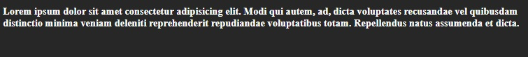

That was the result, and our compiled CSS in clean and simple (Comments are also included in the final CSS):

```css
/* Compiled CSS from SCSS */
/* Sass Maps */
body {
  background-color: #272727;
  color: #fff;
  font-weight: 700;
}
```

<br/>

You can see all [Sass Map functions at this w3schools page](https://www.w3schools.com/sass/sass_functions_map.php), although they may be only helpful for huge `.scss` files and debug purposes.

<br/>

## Sass Nesting

Sass lets you nest CSS selectors in the same way as HTML.

However, be careful with too much nesting, **it's preferable to use classes that can be reused** instead of nests after nests.

Here's an example from w3schools:

```scss
/* Sass */
nav {
  ul {
    margin: 0;
    padding: 0;
    list-style: none;
  }
  li {
    display: inline-block;
  }
  a {
    display: block;
    padding: 6px 12px;
    text-decoration: none;
  }
}
```

... that compiles into:

```css
/* CSS compiled from previous Sass */
nav ul {
  margin: 0;
  padding: 0;
  list-style: none;
}
nav li {
  display: inline-block;
}
nav a {
  display: block;
  padding: 6px 12px;
  text-decoration: none;
}
```

<br/>

Another example of nesting within a class:

```scss
/* Sass */
.main {
  width: 80%;
  margin: 0 auto;

  p {
    font-weight: map-get($font-weights, bold);
  }
}
```

or, if the our `<p>` paragraph tag had a class of `main__paragraph`:

```scss
/* Sass */
.main {
  width: 80%;
  margin: 0 auto;

  .main__paragraph {
    font-weight: map-get($font-weights, bold);
  }
}
```

<br/>

### Sass Ampersand or Parent Selector

The previous nesting could be written with a `&` ([Sass ampersand](https://css-tricks.com/the-sass-ampersand/) or [Parent Selector](https://sass-lang.com/documentation/style-rules/parent-selector))

```scss
$font-weights: (
  "regular": 400,
  "medium": 500,
  "bold": 700,
);

.main {
  width: 80%;
  margin: 0 auto;

  &__paragraph {
    font-weight: map-get($font-weights, bold);
  }
}
```

will compile into

```css
/* Compiled CSS */
.main {
  width: 80%;
  margin: 0 auto;
}

.main__paragraph {
  font-weight: 700;
}
```

### Sass interpolation

However, that's not what we wanted (the `&` alone will only copy name of the class it is nested in).. we wanted the `.main__paragraph` to be inside/within `.main` class... So we need to use **[interpolation](https://sass-lang.com/documentation/interpolation) along with Parent Selector**: `#{&}`

```scss
$font-weights: (
  "regular": 400,
  "medium": 500,
  "bold": 700,
);

.main {
  width: 80%;
  margin: 0 auto;

  #{&}__paragraph {
    font-weight: map-get($font-weights, bold);
  }
}
```

will compile into:

```css
/* CSS */
.main {
  width: 80%;
  margin: 0 auto;
}

.main .main__paragraph {
  font-weight: 700;
}
```

<br/>

Let's add more Sass to this example:

```scss
/* Sass */
.main {
  width: 80%;
  margin: 0 auto;

  #{&}__paragraph {
    font-weight: map-get($font-weights, bold);

    &:hover {
      color: pink;
    }
  }
}
```

will compile into:

```css
/* CSS */
.main {
  width: 80%;
  margin: 0 auto;
}

.main .main__paragraph {
  font-weight: 700;
}

.main .main__paragraph:hover {
  color: pink;
}
```

<br/>

[Another simple](https://css-tricks.com/the-sass-ampersand/#using-the-with-pseudo-classes) example using `&`:

<center>

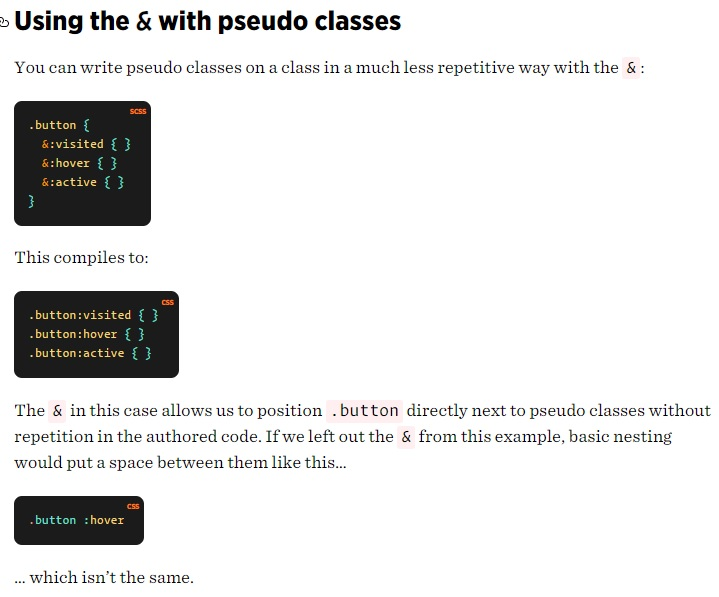

</center>

<br/>

<center>

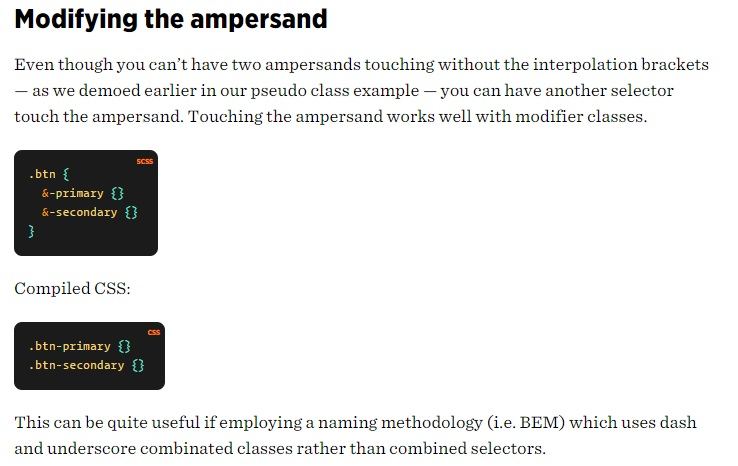

</center>

<br/>

### Sass Nested Properties

[Many CSS properties have the same prefix, like font-family, font-size and font-weight or text-align, text-transform and text-overflow.](https://www.w3schools.com/sass/sass_nesting.php) We will use `:`

```scss
font: {
  family: Helvetica, sans-serif;
  size: 18px;
  weight: bold;
}

text: {
  align: center;
  transform: lowercase;
  overflow: hidden;
}
```

will be compiled to:

```css
/* CSS */
font-family: Helvetica, sans-serif;
font-size: 18px;
font-weight: bold;

text-align: center;
text-transform: lowercase;
text-overflow: hidden;
```

<br/>

<br/>

## Sass Partials Files

[Sass Partials](https://sass-lang.com/guide#topic-4) are just separated files that contain little snippets of CSS, making the whole project be modularized into smaller parts (making it easier to maintain). Remember that with plain CSS, it's not okay break the whole `style.css` into smaller `.css` files (one reason being it will be harder to be cached by browsers), but with `scss` we can do that (and all the Sass Partials will compile into a single `.css` file).

A Sass Partial filename must start with an underscore `_` (the compiler will ignore those files starting with `_`, you will only include/reference them in your main `main.scss`).

<br/>

Let's create a `_resets.scss` file:

```scss
/* _resets.scss Partial */
* {
  box-sizing: border-box;
  margin: 0;
  padding: 0;
}

nav ul {
  list-style-type: none;
}

img {
  max-width: 100%;
}
```

And we can include it into our `main.scss` using `@import './name';` (Note that we don't have to put the underscore or the extension when importing)

```scss
/* main.scss */
@import "./resets";
```

<br/>

We can also make a Sass Partial file where we include all of our **SCSS Variables**

```scss
/* _variables.scss */
$primary-color: #272727;
$text-color: #fff;
$font-weights: (
  "regular": 400,
  "medium": 500,
  "bold": 700,
);
```

and import them in `main.scss`:

```scss
/* main.scss */
@import "./resets";
@import "./variables";
```

Or, instead of importing one by one, we could use:

```scss
@import "./resets", "variables";
```

This will be our folder structure so far:

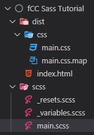

<br/>

## Sass Functions

For example, instead of using `map-get($font-weights, bold);` al over our scss file, we can use a function instead... so, at the beginning of our `main.scss` file, we can add:

```scss
/* _variables.scss */
$font-weights: (
  "regular": 400,
  "medium": 500,
  "bold": 700,
);

/* main.scss */
@function weight($weight-name) {
  @return map-get($font-weights, $weight-name);
}

.main {
  width: 80%;
  margin: 0 auto;

  #{&}__paragraph {
    // Call the created function with
    font-weight: weight(regular);
  }
}
```

<br/>

## Sass Mixins

[The `@mixin` directive](https://www.w3schools.com/sass/sass_mixin_include.php) lets you create CSS code that is to be reused throughout the website. The `@include` directive is created to let you use (include) the mixin.

```scss
@mixin flexCenter {
  display: flex;
  justify-content: center;
  align-items: center;
}

.main {
  @include flexCenter;
  width: 80%;
  margin: 0 auto;
}
```

They are more or less like variables where you can include multiple CSS properties and values to reuse them in other places.

We can also pass arguments into the mixins (just like functions):

```scss
@mixin flexCenter($direction) {
  display: flex;
  justify-content: center;
  align-items: center;
  flex-direction: $direction;
}

.main {
  @include flexCenter(column);
  width: 80%;
  margin: 0 auto;
}
```

However, we mainly use functions to computer and returns values. Mixins should define styles.

<br/>

Another [example of a mixin with arguments](https://www.w3schools.com/sass/sass_mixin_include.php):

```scss
/* Define mixin with two arguments */
@mixin bordered($color, $width) {
  border: $width solid $color;
}

.myArticle {
  @include bordered(blue, 1px); // Call mixin with two values
}

.myNotes {
  @include bordered(red, 2px); // Call mixin with two values
}
```

```css
/* CSS output */
.myArticle {
  border: 1px solid blue;
}
.myNotes {
  border: 2px solid red;
}
```

<br/>

We can also have default values into our mixin arguments:

```scss
@mixin bordered($color: blue, $width: 1px) {
  border: $width solid $color;
}

.myTips {
  @include bordered($color: orange);
}
```

will compile into:

```css
/* Compiled CSS*/
.myTips {
  border: 1px solid orange;
}
```

<br/>

A mixin can also include other mixins:

```scss
@mixin special-text {
  @include important-text;
  @include link;
  @include special-border;
}
```

<br/>

### Dark mode using mixins

We can create dark-mode themes with `mixins`, by using even `if` statements:

```scss
@mixin theme($light-theme: true) {
  @if $light-theme {
    background: lighten($primary-color, 100%); // this will invert the color
    color: darken($text-color, 100%);
  }
}

.light {
  @include theme($light-theme: true);
}
```

And we can add the `.light` CSS class to our body in `index.html`:

```html
<body class="light">
  <div>
    <p class="main__paragraph">
      Lorem ipsum dolor sit amet consectetur adipisicing elit. Voluptatibus,
      consectetur?
    </p>
  </div>
</body>
```

If the `$light-theme` variable is set to `false`, even we have the class present in our html, our theme will be black (dark), because the condition is false, so the mixin will return an empty style, therefore our CSS `.light` class will be empty.

<br/>

### Media Queries using mixins

Instead of `max-width: 800px` we will use a variable, so it will be easy to change.

```scss
/* _variables.scss */
$mobile: 800px;
```

```scss
@mixin mobile {
  @media (max-width: $mobile) {
    @content;
  }
}

.main {
  @include mobile {
    flex-direction: column;
  }
}
```

<br/>

## Sass extend - inheritance

```html
<div class="main">
  <p class="main__paragraph1">
    Lorem ipsum dolor sit amet consectetur adipisicing elit. Voluptatibus,
    consectetur?
  </p>
  <p class="main__paragraph2">
    Lorem ipsum dolor sit amet consectetur adipisicing elit. Minus, sequi?
  </p>
</div>
```

If we want to extend all of the styles of paragraph1 to paragraph2 and also add some styles to paragraph2 class, we can use `@extend` (so we don't repeat the code from paragraph1 class to paragraph2)...

_(Personal opinion: although it's weird to use so many Sass functions for all these... in plain CSS we would just create a general paragraph class then another paragraph1 and paragraph2 classes with custom properties... and in our HTML we would just add to our elements sth like `class="paragraph paragraph1"`.. and that was it... Monday, January 18, 2021, 21:40)_

```scss
/* main.scss */
.main {
  @include flexCenter;
  width: 80%;
  margin: 0 auto;

  #{&}__paragraph1 {
    font-weight: weight(bold);

    &:hover {
      color: red;
    }
  }

  #{&}__paragraph2 {
    @extend .main__paragraph1;
    &:hover {
      color: blue;
    }
  }
}
```

All of these will compile into this:

```css
/* Compiled CSS */
.main {
  display: -webkit-box;
  display: -ms-flexbox;
  display: flex;
  -webkit-box-pack: center;
  -ms-flex-pack: center;
  justify-content: center;
  -webkit-box-align: center;
  -ms-flex-align: center;
  align-items: center;
  -webkit-box-orient: horizontal;
  -webkit-box-direction: normal;
  -ms-flex-direction: row;
  flex-direction: row;
  width: 80%;
  margin: 0 auto;
}

.main .main__paragraph1,
.main .main__paragraph2 {
  font-weight: 700;
}

.main .main__paragraph1:hover,
.main .main__paragraph2:hover {
  color: red;
}

.main .main__paragraph2:hover {
  color: blue;
}
```

Interesting.

<br/>

<br/>

Let's see some [other examples of `@extend`](https://www.w3schools.com/sass/sass_extend.php)

```scss
/* SCSS Syntax */
.button-basic {
  border: none;
  padding: 15px 30px;
  text-align: center;
  font-size: 16px;
  cursor: pointer;
}

.button-report {
  @extend .button-basic;
  background-color: red;
}

.button-submit {
  @extend .button-basic;
  background-color: green;
  color: white;
}
```

```css
/* CSS Output */
.button-basic,
.button-report,
.button-submit {
  border: none;
  padding: 15px 30px;
  text-align: center;
  font-size: 16px;
  cursor: pointer;
}

.button-report {
  background-color: red;
}

.button-submit {
  background-color: green;
  color: white;
}
```

<br/>

"By using the `@extend` directive, you do not need to specify several classes for an element in your HTML code, like this: `<button class="button-basic button-report">Report this</button>`. You just need to specify .button-report to get both sets of styles. The `@extend` directive helps keep your Sass code very DRY."

_(Back to personal opinion: Ok ok then, now I get it.)_

<br/>

<br/>

# Real Word Example from Scratch (Portfolio Website)

Project Structure:

```
fCC Sass Portfolio Project
┣ dist/
┃ ┣ css/
┃ ┃ ┣ main.css
┃ ┃ ┗ main.css.map
┃ ┣ img/
┃ ┃ ┣ model-1.jpg
┃ ┃ ┣ project-1.jpg
┃ ┃ ┣ project-2.jpg
┃ ┃ ┣ project-3.jpg
┃ ┃ ┣ project-4.jpg
┃ ┃ ┣ project-5.jpg
┃ ┃ ┗ project-6.jpg
┃ ┣ js/
┃ ┃ ┗ main.js
┃ ┣ about.html
┃ ┣ contact.html
┃ ┣ index.html
┃ ┗ projects.html
┗ scss/
  ┣ main.scss
  ┣ _about.scss
  ┣ _config.scss
  ┣ _contact.scss
  ┣ _home.scss
  ┣ _menu.scss
  ┣ _projects.scss
  ┗ _responsive.scss
```

## index.html boilerplate

```html
<!DOCTYPE html>
<html lang="en">
  <head>
    <meta charset="UTF-8" />
    <meta name="viewport" content="width=device-width, initial-scale=1.0" />
    <link rel="stylesheet" href="css/main.css" />
    <link
      rel="stylesheet"
      href="https://cdnjs.cloudflare.com/ajax/libs/font-awesome/5.15.2/css/all.min.css"
      crossorigin="anonymous"
    />
    <title>Radu-Alexandru B. | Portfolio</title>
  </head>
  <body>
    <header>
      <div class="menu-btn">
        <span class="menu-btn__burger"></span>
      </div>

      <nav class="nav">
        <ul class="menu-nav">
          <li class="menu-nav__item">
            <a href="index.html" class="menu-nav__link">Home</a>
          </li>
          <li class="menu-nav__item">
            <a href="about.html" class="menu-nav__link">About</a>
          </li>
          <li class="menu-nav__item">
            <a href="projects.html" class="menu-nav__link">Projects</a>
          </li>
          <li class="menu-nav__item">
            <a href="contact.html" class="menu-nav__link">Contact</a>
          </li>
        </ul>
      </nav>
    </header>

    <main>
      <section class="home">
        <h2>Hi! I'm</h2>
        <h1 class="home__name"></h1>
        Radu-Alexandru <span class="home__name--last">B.</span>

        <div class="social-icons">
          <a href="#"><i class="fas fa-globe fa-2x"></i></a>
          <a href="#"><i class="fab fa-github fa-2x"></i></a>
          <a href="#"><i class="fab fa-linkedin fa-2x"></i></a>
          <a href="#"><i class="fab fa-dev fa-2x"></i></a>
        </div>

        <footer>&copy; 2021</footer>
      </section>
    </main>

    <script src="js/main.js"></script>
  </body>
</html>
```

<br/>

## \_config.scss

We will store our variables as well as our HTML CSS Resets in a Sass Partial `_config.scss`

```scss
/* _config.scss */
$primary-color: #272727;
$secondary-color: #ff652f;

* {
  box-sizing: border-box;
  margin: 0;
  padding: 0;
}

img {
  max-width: 100%;
}

@mixin transition-ease {
  transition: all 300ms ease-in-out;
}
```

## main.scss

This will be the base style of the website:

```scss
@import "config";

body {
  background-color: $primary-color;
  color: #fff;
  height: 100vh;
  font-family: "Segoe UI", Tahoma, Geneva, Verdana, sans-serif;
  line-height: 1;
}

h1,
h2,
h3 {
  font-weight: 400;
}

a {
  color: #fff;
  text-decoration: none;
}

header {
  position: fixed;
  z-index: 2;
  width: 100%;
  padding: 1rem;
}

main {
  height: 100%;
  width: 100%;

  .social-icons {
    position: fixed;
    bottom: 1rem;
    left: 1rem;

    a {
      padding: 0.4rem;

      &:hover {
        color: $secondary-color;
      }
    }
  }
}

footer {
  font-size: 1rem;
  position: fixed;
  bottom: 0.4rem;
  right: 1rem;
  text-align: right;
  padding: 1rem;
  color: #fff;
}
```

That looks like this so far:


But now we we'll create a separate Partial Sass File for each webpage.

## \_home.scss

`overflow: hidden;` to not allow any scroll bars on the page

`padding-top: 40vh;` add padding on top that occupies 40% of the viewport

```scss
/* main.scss */
@import "config", "home";
```

```scss
/* _home.scss */
.home {
  height: 100%;
  padding-top: 40vh;
  overflow: hidden;
  align-items: center;
  text-align: center;
  background: linear-gradient(
      to right,
      rgba($primary-color, 0.9),
      rgba($primary-color, 0.3)
    ), url("../img/model-1.jpg") center top;
  background-size: cover;
}
```

Nice.

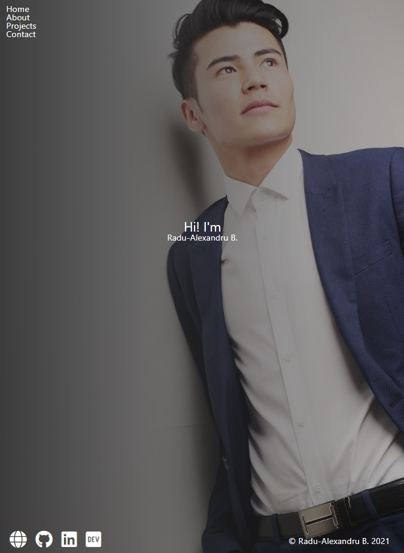

Let's add more style

```scss
/* _home.scss */
.home {
  height: 100%;
  padding-top: 40vh;
  overflow: hidden;
  align-items: center;
  text-align: center;
  background: linear-gradient(
      to right,
      rgba($primary-color, 0.9),
      rgba($primary-color, 0.3)
    ), url("../img/model-1.jpg") center top;
  background-size: cover;

  &__name {
    font-size: 5rem;
    padding-bottom: 1rem;
    margin-top: 1rem;

    &--last {
      color: $secondary-color;
      font-weight: 700;
    }
  }
}
```

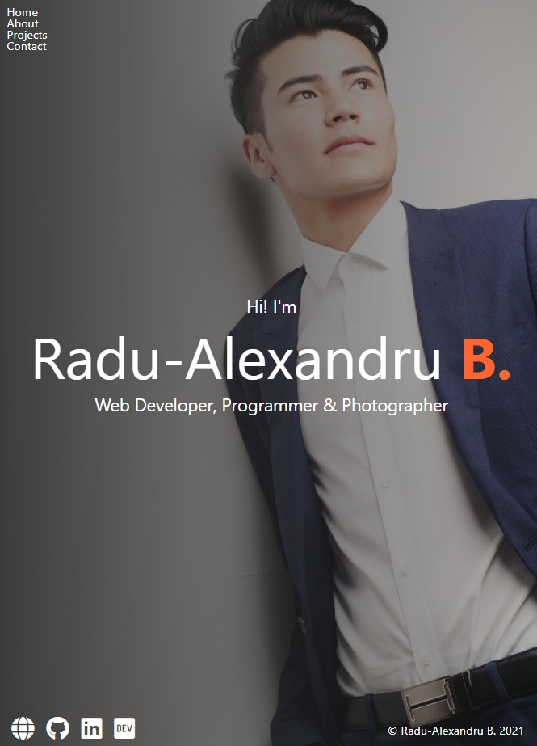

### Text-color function

We can add in our `_config.scss` a Sass function that if the lightness of the color (set as function argument) is lighter than 40%, then we return a black color instead, else return white color.

```scss
// _config.scss
@function set-text-color($color) {
  @if (lightness($color) > 40%) {
    @return #000;
  } @else {
    @return #fff;
  }
}
```

Now we can use this function wherever we set a color to a text, making sure every time we have the right text color on a background.

So, in `main.scss`

```scss
// main.scss
body {
  background-color: $primary-color;
  color: set-text-color($primary-color);
}
```

<br/>

## \_menu.scss

### Burger Menu with plain CSS

Let's customize our menu button/icon for our navbar:

In order to create the burger icon, we will also use `::before` and `::after` pseudo-elements.

```scss
// _menu.scss
.menu-btn {
  position: absolute;
  z-index: 1;
  right: 1rem;
  top: 1rem;
  height: 20px;
  width: 28px;
  cursor: pointer;
  @include transition-ease;

  &__burger {
    /* Middle burger bar */
    position: absolute;
    right: 0;
    top: 0.5rem;
    width: 28px;
    height: 3px;
    background: set-text-color($primary-color);
    @include transition-ease;

    /* Top burger bar */
    &::before {
      content: "";
      position: absolute;
      top: -8px;
      width: 28px;
      height: 3px;
      background-color: set-text-color($primary-color);
      @include transition-ease;
    }

    /* Bottom burger bar */
    &::after {
      content: "";
      position: absolute;
      top: 8px;
      width: 20px;
      height: 3px;
      background-color: set-text-color($primary-color);
      @include transition-ease;
    }
  }
}
```

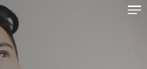

Now let's also add an `.open` class that changes the menu when it's opened... in the tutorial it just hides the middle bar from the burger icon and make a 360 rotation animation... like this:

```scss
.menu-btn {
  position: absolute;
  z-index: 1;
  right: 1.5rem;
  top: 1.5rem;
  height: 20px;
  width: 28px;
  cursor: pointer;
  @include transition-ease;

  &:hover {
    opacity: 0.7;
  }

  &__burger {
    /* Middle burger bar */
    position: absolute;
    right: 0;
    top: 0.5rem;
    width: 28px;
    height: 3px;
    background: set-text-color($primary-color);
    @include transition-ease;

    /* Top burger bar */
    &::before {
      content: "";
      position: absolute;
      top: -8px;
      width: 28px;
      height: 3px;
      background-color: set-text-color($primary-color);
      @include transition-ease;
    }

    /* Bottom burger bar */
    &::after {
      content: "";
      position: absolute;
      top: 8px;
      width: 20px;
      height: 3px;
      background-color: set-text-color($primary-color);
      @include transition-ease;
    }

    &.open {
      transform: rotate(360deg);
      background: transparent;

      // Adding the "X" animation
      &::before {
        transform: rotate(45deg) translate(5px, 8px);
      }

      &::after {
        width: 28px; // change bottom bar to original
        transform: rotate(-45deg) translate(3px, -7px);
      }
    }
  }
}
```

<s>However, I modified it so it will transform into an "X" button with:</s> Nvm he did this in the video too... Using exactly what I have used, OMG :o. (with the exception I've used `translateY(11px);` for before and `-12px` for after)

```scss
/* My solution.. ignore this */
&.open {
  background: transparent;
}
&.open::before {
  transform: rotate(-45deg) translateY(11px);
}
&.open::after {
  transform: rotate(45deg) translateY(-12px);
}
```

(Tuesday, January 19, 2021, 01:26)

Now let's create `./js/main.js` where we will add the following:

```js
/* main.js */
const menuBtn = document.querySelector(".menu-btn");
const hamburger = document.querySelector(".menu-btn__burger");

menuBtn.addEventListener("click", toggleMenu);

let showMenu = false;
function toggleMenu() {
  if (!showMenu) {
    hamburger.classList.add("open");
    showMenu = true;
  } else {
    hamburger.classList.remove("open");
    showMenu = false;
  }
}
```

Note that we cannot use const arrow functions with plain vanilla JS.

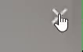

<br/>

Great, moving on to the navbar itself.

### Navbar within burger menu

The navbar will only appear when the burger menu is pressed. It will occupy the whole 100% view width (`100vw`).

We we'll also add an animation, translating it from the top of the page: `transform: translateY(-100%);` .

Add further to `_menu.scss` the following:

```scss
// _menu.scss
.nav {
  position: fixed;
  top: 0;
  left: 0;
  width: 100vw;
  opacity: 0.98;
  visibility: hidden;

  &.open {
    visibility: visible;
  }

  .menu-nav {
    display: flex;
    flex-flow: column wrap;
    align-items: center;
    justify-content: center;
    height: 100vh;
    overflow: hidden;
    background: $primary-color;
    list-style-type: none;
    padding-right: 1rem;
    transform: translateY(-100%);
    @include transition-ease;

    &.open {
      transform: translateY(0);
    }
  }
}
```

Then, going back to our `main.js`, add query selectors to nav and add `open` CSS class:

```js
/* main.js */
const menuBtn = document.querySelector(".menu-btn");
const hamburger = document.querySelector(".menu-btn__burger");

const nav = document.querySelector(".nav");
const menuNav = document.querySelector("menu-nav");

menuBtn.addEventListener("click", toggleMenu);

let showMenu = false;
function toggleMenu() {
  if (!showMenu) {
    hamburger.classList.add("open");
    nav.classList.add("open");
    menuNav.classList.add("open");
    showMenu = true;
  } else {
    hamburger.classList.remove("open");
    nav.classList.remove("open");
    menuNav.classList.remove("open");
    showMenu = false;
  }
}
```

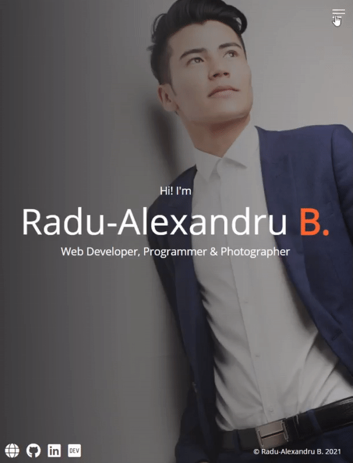

[Current tutorial at 1h12m52s](https://youtu.be/_a5j7KoflTs?t=4372)

**Now let's make the links within the navbar menu behave nicer.**

- let the menu links come from the right of the screen: `transform: translateX(100vw);` as it's original position, then when the menu icon is clicked (via js), we add class open an transition the menu links back to center of the screen `&.open {transform: translateX(0);}`

- we will use `.active > a { color: $secondary-color; }` to highlight whichever page we are currently on (it's highlighted permanently, to not confuse with hover)

  ```scss
  // _menu.scss
  .nav {
    position: fixed;
    top: 0;
    left: 0;
    width: 100vw;
    opacity: 0.98;
    visibility: hidden;

    &.open {
      visibility: visible;
    }

    .menu-nav {
      display: flex;
      flex-flow: column wrap;
      align-items: center;
      justify-content: center;
      height: 100vh;
      overflow: hidden;
      background: $primary-color;
      list-style-type: none;
      padding-right: 1rem;
      transform: translateY(-100%);
      @include transition-ease;

      &.open {
        transform: translateY(0);
      }

      &__item {
        transform: translateX(100vw);
        @include transition-ease;
        &.open {
          transform: translateX(0);
        }
        .active > a {
          color: $secondary-color;
        }
      }
    }
  }
  ```

Now let's add some javascript for adding the `open` class within HTML to each navbar link.

We used `querySelectorAll` to select all navbar links (we can't use `querySelector()` because it selects just one element at time - the first one encountered). We use `forEach` to apply the function to each element retrieved with the `querySelectorAll`.

```js
/* main.js */
const menuBtn = document.querySelector(".menu-btn");
const hamburger = document.querySelector(".menu-btn__burger");

const nav = document.querySelector(".nav");
const menuNav = document.querySelector(".menu-nav");
const navItems = document.querySelectorAll(".menu-nav__item");

menuBtn.addEventListener("click", toggleMenu);

let showMenu = false;
function toggleMenu() {
  if (!showMenu) {
    hamburger.classList.add("open");
    nav.classList.add("open");
    menuNav.classList.add("open");
    showMenu = true;
    navItems.forEach((item) => item.classList.add("open"));
  } else {
    hamburger.classList.remove("open");
    nav.classList.remove("open");
    menuNav.classList.remove("open");
    showMenu = false;
    navItems.forEach((item) => item.classList.remove("open"));
  }
}
```

<br/>

**Now for the links appearance.** (`.menu-nav__link`)

```scss
// _menu.scss
.nav {
  position: fixed;
  top: 0;
  left: 0;
  width: 100vw;
  opacity: 0.98;
  visibility: hidden;

  &.open {
    visibility: visible;
  }

  .menu-nav {
    display: flex;
    flex-flow: column wrap;
    align-items: center;
    justify-content: center;
    height: 100vh;
    overflow: hidden;
    background: $primary-color;
    list-style-type: none;
    padding-right: 1rem;
    transform: translateY(-100%);
    @include transition-ease;

    &.open {
      transform: translateY(0);
    }

    &__item {
      transform: translateX(100vw);
      @include transition-ease;

      &.open {
        transform: translateX(0);
      }

      &.active > a {
        color: $secondary-color;
      }
    }

    &__link {
      display: inline-block;
      font-size: 2rem;
      text-transform: uppercase;
      padding: 2rem 0;
      font-weight: 300;
      @include transition-ease;

      &:hover {
        color: $secondary-color;
      }
    }
  }
}
```

Cool.

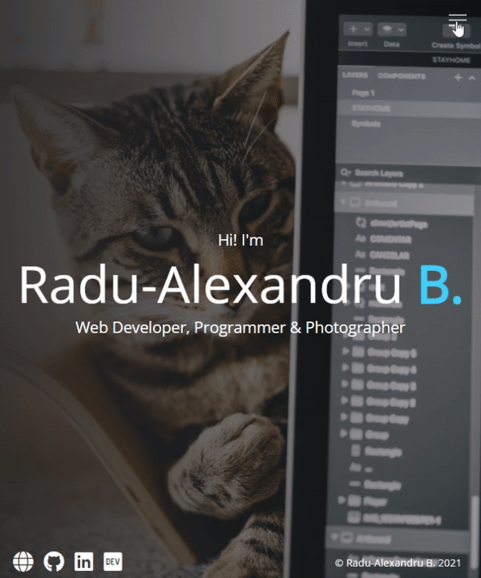

We can make the links transition a bit slower and increased for each individual item with a Sass for loop; we will use the actual `$i` index from the for loop to have custom delay to each item. So, at the end of `_menu.scss`, add:

```scss
@for $i from 1 through 4 {
  .menu-nav__item:nth-child(#{$i}) {
    transition-delay: ($i * 0.1s) + 0.15s;
  }
}
```


<br/>

That's all for the home page!

<br/>

## about.html

`about.html` HTML boilerplate:

```html
<!DOCTYPE html>
<html lang="en">
  <head>
    <meta charset="UTF-8" />
    <meta name="viewport" content="width=device-width, initial-scale=1.0" />
    <link rel="stylesheet" href="css/main.css" />
    <link
      rel="stylesheet"
      href="https://cdnjs.cloudflare.com/ajax/libs/font-awesome/5.15.2/css/all.min.css"
      crossorigin="anonymous"
    />
    <title>About Radu-Alexandru B.</title>
  </head>

  <body>
    <header>
      <div class="menu-btn">
        <span class="menu-btn__burger"></span>
      </div>

      <nav class="nav">
        <ul class="menu-nav">
          <li class="menu-nav__item">
            <a href="index.html" class="menu-nav__link">Home</a>
          </li>
          <li class="menu-nav__item active">
            <a href="about.html" class="menu-nav__link">About</a>
          </li>
          <li class="menu-nav__item">
            <a href="projects.html" class="menu-nav__link">Projects</a>
          </li>
          <li class="menu-nav__item">
            <a href="contact.html" class="menu-nav__link">Contact</a>
          </li>
        </ul>
      </nav>
    </header>

    <main>
      <section class="about">
        <div class="about__bio-image">
          <div class="about__bio">
            <h2 class="text-secondary">About me</h2>
            <p>
              Lorem ipsum dolor sit amet consectetur adipisicing elit. Quae
              culpa sapiente rerum dolores aliquam, fugiat eveniet commodi. Vel,
              nihil, numquam possimus deserunt officiis rerum in omnis error
              esse iusto quas.
            </p>
          </div>
        </div>

        <div class="jobs">
          <div class="jobs__job">
            <h2 class="text-secondary">2017 - Current</h2>
            <h3>Google</h3>
            <h4>Full Stack Developer</h4>
            <p>
              Lorem, ipsum dolor sit amet consectetur adipisicing elit. Repellat
              vero dolores eum ut, culpa ullam quis quasi exercitationem in
              adipisci.
            </p>
          </div>
          <div class="jobs__job">
            <h2 class="text-secondary">2015 - 2017</h2>
            <h3>Microsoft</h3>
            <h4>Front End Developer</h4>
            <p>
              Lorem, ipsum dolor sit amet consectetur adipisicing elit. Repellat
              vero dolores eum ut, culpa ullam quis quasi exercitationem in
              adipisci.
            </p>
          </div>
          <div class="jobs__job">
            <h2 class="text-secondary">2012 - 2015</h2>
            <h3>Web Design Co.</h3>
            <h4>Graphic Designer</h4>
            <p>
              Lorem, ipsum dolor sit amet consectetur adipisicing elit. Repellat
              vero dolores eum ut, culpa ullam quis quasi exercitationem in
              adipisci.
            </p>
          </div>
        </div>

        <div class="social-icons">
          <a href="#"><i class="fas fa-globe fa-2x"></i></a>
          <a href="#"><i class="fab fa-github fa-2x"></i></a>
          <a href="#"><i class="fab fa-linkedin fa-2x"></i></a>
          <a href="#"><i class="fab fa-dev fa-2x"></i></a>
        </div>
      </section>
    </main>

    <script src="js/main.js"></script>
  </body>
</html>
```

```scss
/* Add this in main.scss */
.text-secondary {
  color: $secondary-color;
}
```

### \_about.sccs

Now let's create `_about.scss`

```scss
.about {
  padding-bottom: 2rem;

  &__bio-image {
    height: 50vh;
    width: 100%;
    background: linear-gradient(
        to right,
        rgba($primary-color, 0.9),
        rgba($primary-color, 0.3)
      ), url("../img/model-3.jpg") center top;
    background-size: cover;
    display: flex;
    flex-direction: column;
    align-items: center;
    justify-content: flex-end;
  }

  p {
    margin-bottom: 2rem;
    line-height: 1.4rem;
  }

  &__bio {
    width: 80%;
    text-align: center;
    .text-secondary {
      padding-bottom: 1rem;
    }
  }

  .jobs {
    width: 60vw;
    margin: 2rem auto 0 auto;
    display: grid;
    grid-template-columns: 1fr;
    grid-gap: 2rem;

    &__job {
      background: lighten($primary-color, 10%);
      padding: 0.5rem;
      border-bottom: 5px solid $secondary-color;

      h2,
      h3 {
        margin: 0.5rem 0;
      }

      h4 {
        margin: 0.3rem 0;
      }
    }
  }

  .social-icons {
    display: flex;
    flex-direction: column;
  }
}
```

And... damn I'm impressed by [his](https://www.youtube.com/codeSTACKr) design skills.

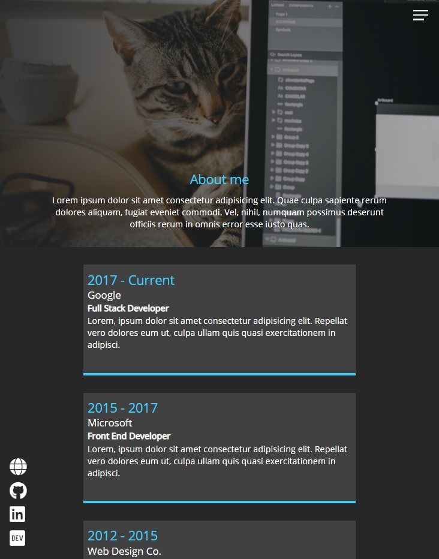

<br/>

## projects.html

`projects.html` boilerplate:

```html
<!DOCTYPE html>
<html lang="en">
  <head>
    <meta charset="UTF-8" />
    <meta name="viewport" content="width=device-width, initial-scale=1.0" />
    <link rel="stylesheet" href="css/main.css" />
    <link
      rel="stylesheet"
      href="https://cdnjs.cloudflare.com/ajax/libs/font-awesome/5.15.2/css/all.min.css"
      crossorigin="anonymous"
    />
    <title>Radu-Alexandru B. Projects</title>
  </head>

  <body>
    <header>
      <div class="menu-btn">
        <span class="menu-btn__burger"></span>
      </div>

      <nav class="nav">
        <ul class="menu-nav">
          <li class="menu-nav__item">
            <a href="index.html" class="menu-nav__link">Home</a>
          </li>
          <li class="menu-nav__item">
            <a href="about.html" class="menu-nav__link">About</a>
          </li>
          <li class="menu-nav__item active">
            <a href="projects.html" class="menu-nav__link">Projects</a>
          </li>
          <li class="menu-nav__item">
            <a href="contact.html" class="menu-nav__link">Contact</a>
          </li>
        </ul>
      </nav>
    </header>

    <main>
      <section class="projects">
        <div class="projects__bio-image">
          <h1 class="text-secondary">My Projects</h1>
        </div>

        <div class="projects__items">
          <div class="projects__item">
            
            <h2 class="projects__title">Django Blog</h2>
            <div class="projects__btns">
              <a href="#!" class="projects__btn">
                <i class="fas fa-eye"></i> Preview
              </a>
              <a href="#!" class="projects__btn">
                <i class="fab fa-github"></i> Github
              </a>
            </div>
          </div>

          <div class="projects__item">
            
            <h2 class="projects__title">React Landing Page</h2>
            <div class="projects__btns">
              <a href="#!" class="projects__btn">
                <i class="fas fa-eye"></i> Preview
              </a>
              <a href="#!" class="projects__btn">
                <i class="fab fa-github"></i> Github
              </a>
            </div>
          </div>

          <div class="projects__item">
            
            <h2 class="projects__title">CSS Product Landing Page</h2>
            <div class="projects__btns">
              <a href="#!" class="projects__btn">
                <i class="fas fa-eye"></i> Preview
              </a>
              <a href="#!" class="projects__btn">
                <i class="fab fa-github"></i> Github
              </a>
            </div>
          </div>

          <div class="projects__item">
            
            <h2 class="projects__title">Custom Software Solution Website</h2>
            <div class="projects__btns">
              <a href="#!" class="projects__btn">
                <i class="fas fa-eye"></i> Preview
              </a>
              <a href="#!" class="projects__btn">
                <i class="fab fa-github"></i> Github
              </a>
            </div>
          </div>

          <div class="projects__item">
            
            <h2 class="projects__title">Flutter Messenger App</h2>
            <div class="projects__btns">
              <a href="#!" class="projects__btn">
                <i class="fas fa-eye"></i> Preview
              </a>
              <a href="#!" class="projects__btn">
                <i class="fab fa-github"></i> Github
              </a>
            </div>
          </div>

          <div class="projects__item">
            
            <h2 class="projects__title">Eisenhower Task Organiser Web App</h2>
            <div class="projects__btns">
              <a href="#!" class="projects__btn">
                <i class="fas fa-eye"></i> Preview
              </a>
              <a href="#!" class="projects__btn">
                <i class="fab fa-github"></i> Github
              </a>
            </div>
          </div>
        </div>

        <div class="social-icons">
          <a href="#!">
            <i class="fab fa-twitter fa-2x"></i>
          </a>
          <a href="#!">
            <i class="fab fa-facebook fa-2x"></i>
          </a>
          <a href="#!">
            <i class="fab fa-instagram fa-2x"></i>
          </a>
          <a href="#!">
            <i class="fab fa-github fa-2x"></i>
          </a>
        </div>

        <footer>&copy; Radu-Alexandru B. 2021</footer>
      </section>
    </main>

    <script src="js/main.js"></script>
  </body>
</html>
```

<br/>

### \_projects.scss

```scss
.projects {
  padding-bottom: 2rem;

  &__bio-image {
    height: 30vh;
    width: 100%;
    background: linear-gradient(
        to right,
        rgba($primary-color, 0.9),
        rgba($primary-color, 0.3)
      ), url("../img/model-3.jpg") center top;
    background-size: cover;
    display: flex;
    flex-direction: column;
    align-items: center;
    justify-content: flex-end;
  }

  .text-secondary {
    font-size: 2rem;
    margin-bottom: 2rem;
  }

  &__items {
    width: 60vw;
    margin: 2rem auto 0 auto;
    display: grid;
    grid-template-columns: 1fr;
    grid-gap: 2rem;
  }

  &__item {
    position: relative;
    border-bottom: 5px solid $secondary-color;
    overflow: hidden;
    cursor: pointer;

    img {
      width: 100%;
      mask-image: linear-gradient(
        to bottom,
        rgba($primary-color, 1),
        rgba($primary-color, 0.3)
      );
    }

    &::after {
      content: "";
      position: absolute;
      top: 100%;
      left: 0;
      height: 100%;
      width: 100%;
      background: $secondary-color;
      opacity: 0;
      @include transition-ease;
    }

    &:hover {
      &::after {
        top: 0;
        opacity: 0.9;
      }
      .projects__btn {
        opacity: 1;
      }
      .projects__title {
        opacity: 0;
      }
    }
  }

  &__title {
    position: absolute;
    bottom: 0;
    width: 100%;
    display: grid;
    grid-template-columns: 1;
    text-align: center;
    margin-bottom: 1rem;
  }

  &__btns {
    position: absolute;
    top: 0;
    height: 100%;
    width: 100%;
    z-index: 1;
    display: grid;
    grid-template-columns: repeat(2, 1fr);
    align-items: center;
    text-align: center;
  }

  &__btn {
    opacity: 0;
    color: set-text-color($secondary-color);
    font-size: 1.5rem;
    @include transition-ease;

    &:hover {
      color: set-text-color(set-text-color($secondary-color));
    }
  }

  .social-icons {
    display: flex;
    flex-direction: column;
  }
}
```

I personally added titles (`projects__title`) and linear gradient to each project image (`mask-image: linear-gradient()`)

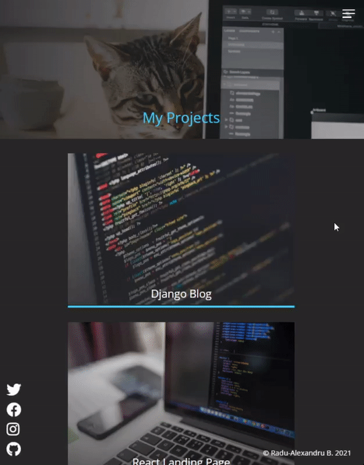

<br/>

## contact.html

`contact.html`

```html
<!DOCTYPE html>
<html lang="en">
  <head>
    <meta charset="UTF-8" />
    <meta name="viewport" content="width=device-width, initial-scale=1.0" />
    <link rel="stylesheet" href="css/main.css" />
    <link
      rel="stylesheet"
      href="https://cdnjs.cloudflare.com/ajax/libs/font-awesome/5.15.2/css/all.min.css"
      crossorigin="anonymous"
    />
    <title>Contact Radu-Alexandru B.</title>
  </head>

  <body>
    <header>
      <div class="menu-btn">
        <span class="menu-btn__burger"></span>
      </div>

      <nav class="nav">
        <ul class="menu-nav">
          <li class="menu-nav__item">
            <a href="index.html" class="menu-nav__link">Home</a>
          </li>
          <li class="menu-nav__item">
            <a href="about.html" class="menu-nav__link">About</a>
          </li>
          <li class="menu-nav__item">
            <a href="projects.html" class="menu-nav__link">Projects</a>
          </li>
          <li class="menu-nav__item active">
            <a href="contact.html" class="menu-nav__link">Contact</a>
          </li>
        </ul>
      </nav>
    </header>

    <main>
      <section class="contact">
        <h2>Contact me</h2>

        <div class="contact__list">
          <div class="contact__email">
            <i class="fas fa-envelope"> Email</i>
            <div>
              <a class="text-secondary" href="mailto:email@email.com"
                >email@email.com</a
              >
            </div>
          </div>

          <div class="contact__address">
            <i class="fas fa-marker"> Address</i>
            <div class="text-secondary">Bucharest, Romania</div>
          </div>
        </div>

        <div class="social-icons">
          <a href="#!">
            <i class="fab fa-twitter fa-2x"></i>
          </a>
          <a href="#!">
            <i class="fab fa-facebook fa-2x"></i>
          </a>
          <a href="#!">
            <i class="fab fa-instagram fa-2x"></i>
          </a>
          <a href="#!">
            <i class="fab fa-github fa-2x"></i>
          </a>
        </div>

        <footer>&copy; Radu-Alexandru B. 2021</footer>
      </section>
    </main>
    <script src="js/main.js"></script>
  </body>
</html>
```

### \_contact.scss

```scss
.contact {
  height: 100%;
  padding-top: 40vh;
  overflow: hidden;
  display: flex;
  flex-direction: column;
  align-items: center;
  background: linear-gradient(
      to right,
      rgba($primary-color, 0.9),
      rgba($primary-color, 0.6)
    ), url("../img/model-3.jpg") center top;
  background-size: cover;

  h2 {
    font-size: 3rem;
    margin-bottom: 2rem;
  }

  &__list {
    display: grid;
    grid-template-columns: 1fr;
    grid-gap: 2rem;
    font-size: 1.2rem;
  }

  .social-icons {
    position: initial;
    margin-top: 2rem;
  }
}
```

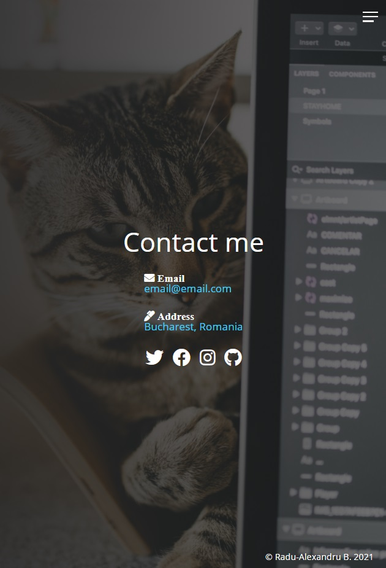

<br/>

## Making the website responsive

So far we made our portfolio page responsive to mobile first (9:16), but on desktop (16:9) the project images will look too big, the about section page text will look to small, and so on. The good part is that we used everywhere we could units of viewport's width, percentages, flex and grid displays (fr), and also relative, absolute and fixed elements (with top, left, bottom right positionings)... so every element still stays in place and doesn't look horrible.

### \_config.scss

First, we'll add in `_config.scss` some mixins (like variables) for custom media sizes.

```scss
/* All from _config.scss */
$primary-color: #272727;
$secondary-color: #40d0fc;

* {
  box-sizing: border-box;
  margin: 0;
  padding: 0;
}

img {
  max-width: 100%;
}

@mixin transition-ease {
  transition: all 200ms ease-in-out;
}

@function set-text-color($color) {
  @if (lightness($color) > 40%) {
    @return #000;
  } @else {
    @return #fff;
  }
}

/* Media Queries */
@mixin media-md {
  @media screen and (min-width: 768px) {
    @content;
  }
}
@mixin media-lg {
  @media screen and (min-width: 1024px) {
    @content;
  }
}
@mixin media-xl {
  @media screen and (min-width: 1600px) {
    @content;
  }
}
```

<br/>

### \_responsive.scss min-width 768px (md)

Let's create a new Sass Partial File named `_responsive.scss` where we will create our media queries. Include it in `main.scss`

```scss
/* main.scss */
@import "config", "home", "menu", "about", "projects", "contact", "responsive";
```

<br/>

#### Navbar for Desktop

First thing's first, we will actually display the navigation bar as whole, without having it shown from a hamburger menu!

We need to reset the translation with `transform: translateY(0);` (the previous was at -100% outside the page for the custom animation). We'll reset the background (that was currently dark gray color when hamburger menu was clicked) to `background: transparent;`.

```scss
/* _responsive.scss */
@include media-md {
  .menu-btn {
    visibility: hidden;
  }

  .nav {
    visibility: visible;

    .menu-nav {
      display: block;
      transform: translateY(0);
      height: 100%;
      background: transparent;
      text-align: right;

      &__item {
        display: inline;
        padding-right: 1.5rem;
      }

      &__link {
        font-size: 1.5rem;
      }
    }
  }
}
```

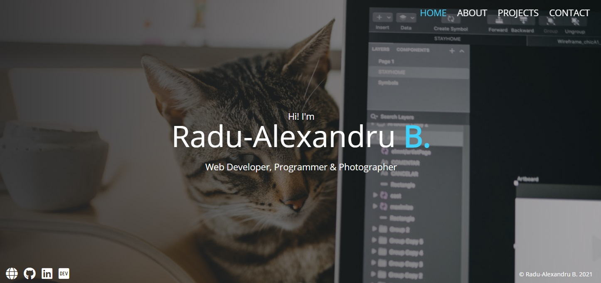

<br/>

#### About page

We'll just increase the font size:

```scss
/* _responsive.scss */
@include media-md {
  ... .about__bio {
    font-size: 1.3rem;
  }
}
```

<br/>

#### Projects page

```scss
/* _responsive.scss */
@include media-md {
  ... .projects {
    &__bio-image {
      height: 40vh;
    }
    .text-secondary {
      font-size: 3rem;
    }
    &__items {
      grid-template-columns: repeat(2, 1fr);
    }
    &__title {
      font-size: 1.2rem;
    }
  }
}
```

#### Contact page

All the `@content` for **media md** mixin (with `min-width: 768px`)

```scss
/* _responsive.scss */
@include media-md {
  .menu-btn {
    visibility: hidden;
  }

  .nav {
    visibility: visible;

    .menu-nav {
      display: block;
      transform: translateY(0);
      height: 100%;
      background: transparent;
      text-align: right;

      &__item {
        display: inline;
        padding-right: 1.5rem;
      }

      &__link {
        font-size: 1.5rem;
      }
    }
  }

  .about__bio {
    font-size: 1.3rem;
  }

  .projects {
    &__bio-image {
      height: 40vh;
    }
    .text-secondary {
      font-size: 3rem;
    }
    &__items {
      grid-template-columns: repeat(2, 1fr);
    }
    &__title {
      font-size: 1.2rem;
    }
  }

  .contact__list {
    grid-template-columns: repeat(2, 1fr);
  }
}
```

<br/>

### \_responsive.scss min-width 1024px (lg) and 1600px (xl)

Now let's repeat some parts of the previous code, but for the large and xl media queries (min-width 1024px, 1600px). Note that the previous properties set for min 768px will also be shown in the media for min 1024px and min 1600px.

```scss
/* Media Query for md min-width: 768px */
@include media-md {
  .menu-btn {
    visibility: hidden;
  }

  .nav {
    visibility: visible;

    .menu-nav {
      display: block;
      transform: translateY(0);
      height: 100%;
      background: transparent;
      text-align: right;

      &__item {
        display: inline;
        padding-right: 1.5rem;
      }

      &__link {
        font-size: 1.5rem;
      }
    }
  }

  .about__bio {
    font-size: 1.3rem;
  }

  .projects {
    &__bio-image {
      height: 40vh;
    }
    .text-secondary {
      font-size: 3rem;
    }
    &__items {
      grid-template-columns: repeat(2, 1fr);
    }
    &__title {
      font-size: 1.2rem;
    }
  }

  .contact__list {
    grid-template-columns: repeat(2, 1fr);
  }
}

/* Media Query for lg min-width: 1024px */
@include media-lg {
  .projects {
    &__items {
      grid-template-columns: repeat(3, 1fr);
    }
  }
}

/* Media Query for xl min-width: 1600px */
@include media-xl {
  .projects__bio-image {
    height: 50vh;
  }
}
```

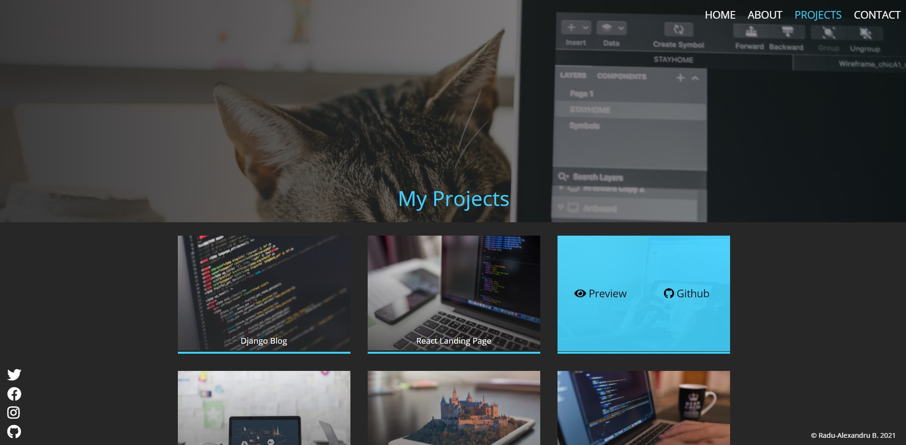

<br/>

# Full Code from Portfolio Website Project

(Tuesday, January 19, 2021, 17:28)

## HTML

### index.html

```html
<!DOCTYPE html>
<html lang="en">
  <head>
    <meta charset="UTF-8" />
    <meta name="viewport" content="width=device-width, initial-scale=1.0" />
    <link rel="stylesheet" href="css/main.css" />
    <link
      rel="stylesheet"
      href="https://cdnjs.cloudflare.com/ajax/libs/font-awesome/5.15.2/css/all.min.css"
      crossorigin="anonymous"
    />
    <title>Radu-Alexandru B. | Portfolio</title>
  </head>
  <body>
    <header>
      <div class="menu-btn">
        <span class="menu-btn__burger"></span>
      </div>

      <nav class="nav">
        <ul class="menu-nav">
          <li class="menu-nav__item active">
            <a href="index.html" class="menu-nav__link">Home</a>
          </li>
          <li class="menu-nav__item">
            <a href="about.html" class="menu-nav__link">About</a>
          </li>
          <li class="menu-nav__item">
            <a href="projects.html" class="menu-nav__link">Projects</a>
          </li>
          <li class="menu-nav__item">
            <a href="contact.html" class="menu-nav__link">Contact</a>
          </li>
        </ul>
      </nav>
    </header>

    <main>
      <section class="home">
        <h2>Hi! I'm</h2>
        <h1 class="home__name">
          Radu-Alexandru <span class="home__name--last">B.</span>
        </h1>
        <h2>Web Developer, Programmer & Photographer</h2>

        <div class="social-icons">
          <a href="#"><i class="fas fa-globe fa-2x"></i></a>
          <a href="#"><i class="fab fa-github fa-2x"></i></a>
          <a href="#"><i class="fab fa-linkedin fa-2x"></i></a>
          <a href="#"><i class="fab fa-dev fa-2x"></i></a>
        </div>

        <footer>&copy; Radu-Alexandru B. 2021</footer>
      </section>
    </main>

    <script src="js/main.js"></script>
  </body>
</html>
```

### about.html

```html
<!DOCTYPE html>
<html lang="en">
  <head>
    <meta charset="UTF-8" />
    <meta name="viewport" content="width=device-width, initial-scale=1.0" />
    <link rel="stylesheet" href="css/main.css" />
    <link
      rel="stylesheet"
      href="https://cdnjs.cloudflare.com/ajax/libs/font-awesome/5.15.2/css/all.min.css"
      crossorigin="anonymous"
    />
    <title>About Radu-Alexandru B.</title>
  </head>

  <body>
    <header>
      <div class="menu-btn">
        <span class="menu-btn__burger"></span>
      </div>

      <nav class="nav">
        <ul class="menu-nav">
          <li class="menu-nav__item">
            <a href="index.html" class="menu-nav__link">Home</a>
          </li>
          <li class="menu-nav__item active">
            <a href="about.html" class="menu-nav__link">About</a>
          </li>
          <li class="menu-nav__item">
            <a href="projects.html" class="menu-nav__link">Projects</a>
          </li>
          <li class="menu-nav__item">
            <a href="contact.html" class="menu-nav__link">Contact</a>
          </li>
        </ul>
      </nav>
    </header>

    <main>
      <section class="about">
        <div class="about__bio-image">
          <div class="about__bio">
            <h2 class="text-secondary">About me</h2>
            <p>
              Lorem ipsum dolor sit amet consectetur adipisicing elit. Quae
              culpa sapiente rerum dolores aliquam, fugiat eveniet commodi. Vel,
              nihil, numquam possimus deserunt officiis rerum in omnis error
              esse iusto quas.
            </p>
          </div>
        </div>

        <div class="jobs">
          <div class="jobs__job">
            <h2 class="text-secondary">2017 - Current</h2>
            <h3>Google</h3>
            <h4>Full Stack Developer</h4>
            <p>
              Lorem, ipsum dolor sit amet consectetur adipisicing elit. Repellat
              vero dolores eum ut, culpa ullam quis quasi exercitationem in
              adipisci.
            </p>
          </div>
          <div class="jobs__job">
            <h2 class="text-secondary">2015 - 2017</h2>
            <h3>Microsoft</h3>
            <h4>Front End Developer</h4>
            <p>
              Lorem, ipsum dolor sit amet consectetur adipisicing elit. Repellat
              vero dolores eum ut, culpa ullam quis quasi exercitationem in
              adipisci.
            </p>
          </div>
          <div class="jobs__job">
            <h2 class="text-secondary">2012 - 2015</h2>
            <h3>Web Design Co.</h3>
            <h4>Graphic Designer</h4>
            <p>
              Lorem, ipsum dolor sit amet consectetur adipisicing elit. Repellat
              vero dolores eum ut, culpa ullam quis quasi exercitationem in
              adipisci.
            </p>
          </div>
        </div>

        <div class="social-icons">
          <a href="#"><i class="fas fa-globe fa-2x"></i></a>
          <a href="#"><i class="fab fa-github fa-2x"></i></a>
          <a href="#"><i class="fab fa-linkedin fa-2x"></i></a>
          <a href="#"><i class="fab fa-dev fa-2x"></i></a>
        </div>
      </section>
    </main>

    <script src="js/main.js"></script>
  </body>
</html>
```

### projects.html

```html
<!DOCTYPE html>
<html lang="en">
  <head>
    <meta charset="UTF-8" />
    <meta name="viewport" content="width=device-width, initial-scale=1.0" />
    <link rel="stylesheet" href="css/main.css" />
    <link
      rel="stylesheet"
      href="https://cdnjs.cloudflare.com/ajax/libs/font-awesome/5.15.2/css/all.min.css"
      crossorigin="anonymous"
    />
    <title>Radu-Alexandru B. Projects</title>
  </head>

  <body>
    <header>
      <div class="menu-btn">
        <span class="menu-btn__burger"></span>
      </div>

      <nav class="nav">
        <ul class="menu-nav">
          <li class="menu-nav__item">
            <a href="index.html" class="menu-nav__link">Home</a>
          </li>
          <li class="menu-nav__item">
            <a href="about.html" class="menu-nav__link">About</a>
          </li>
          <li class="menu-nav__item active">
            <a href="projects.html" class="menu-nav__link">Projects</a>
          </li>
          <li class="menu-nav__item">
            <a href="contact.html" class="menu-nav__link">Contact</a>
          </li>
        </ul>
      </nav>
    </header>

    <main>
      <section class="projects">
        <div class="projects__bio-image">
          <h1 class="text-secondary">My Projects</h1>
        </div>

        <div class="projects__items">
          <div class="projects__item">
            
            <h2 class="projects__title">Django Blog</h2>
            <div class="projects__btns">
              <a href="#!" class="projects__btn">
                <i class="fas fa-eye"></i> Preview
              </a>
              <a href="#!" class="projects__btn">
                <i class="fab fa-github"></i> Github
              </a>
            </div>
          </div>

          <div class="projects__item">
            
            <h2 class="projects__title">React Landing Page</h2>
            <div class="projects__btns">
              <a href="#!" class="projects__btn">
                <i class="fas fa-eye"></i> Preview
              </a>
              <a href="#!" class="projects__btn">
                <i class="fab fa-github"></i> Github
              </a>
            </div>
          </div>

          <div class="projects__item">
            
            <h2 class="projects__title">CSS Product Landing Page</h2>
            <div class="projects__btns">
              <a href="#!" class="projects__btn">
                <i class="fas fa-eye"></i> Preview
              </a>
              <a href="#!" class="projects__btn">
                <i class="fab fa-github"></i> Github
              </a>
            </div>
          </div>

          <div class="projects__item">
            
            <h2 class="projects__title">Custom Software Solutions Website</h2>
            <div class="projects__btns">
              <a href="#!" class="projects__btn">
                <i class="fas fa-eye"></i> Preview
              </a>
              <a href="#!" class="projects__btn">
                <i class="fab fa-github"></i> Github
              </a>
            </div>
          </div>

          <div class="projects__item">
            
            <h2 class="projects__title">Flutter Messenger App</h2>
            <div class="projects__btns">
              <a href="#!" class="projects__btn">
                <i class="fas fa-eye"></i> Preview
              </a>
              <a href="#!" class="projects__btn">
                <i class="fab fa-github"></i> Github
              </a>
            </div>
          </div>

          <div class="projects__item">
            
            <h2 class="projects__title">Eisenhower Task Organiser Web App</h2>
            <div class="projects__btns">
              <a href="#!" class="projects__btn">
                <i class="fas fa-eye"></i> Preview
              </a>
              <a href="#!" class="projects__btn">
                <i class="fab fa-github"></i> Github
              </a>
            </div>
          </div>
        </div>

        <div class="social-icons">
          <a href="#!">
            <i class="fab fa-twitter fa-2x"></i>
          </a>
          <a href="#!">
            <i class="fab fa-facebook fa-2x"></i>
          </a>
          <a href="#!">
            <i class="fab fa-instagram fa-2x"></i>
          </a>
          <a href="#!">
            <i class="fab fa-github fa-2x"></i>
          </a>
        </div>

        <footer>&copy; Radu-Alexandru B. 2021</footer>
      </section>
    </main>

    <script src="js/main.js"></script>
  </body>
</html>
```

### contact.html

```html
<!DOCTYPE html>
<html lang="en">
  <head>
    <meta charset="UTF-8" />
    <meta name="viewport" content="width=device-width, initial-scale=1.0" />
    <link rel="stylesheet" href="css/main.css" />
    <link
      rel="stylesheet"
      href="https://cdnjs.cloudflare.com/ajax/libs/font-awesome/5.15.2/css/all.min.css"
      crossorigin="anonymous"
    />
    <title>Contact Radu-Alexandru B.</title>
  </head>

  <body>
    <header>
      <div class="menu-btn">
        <span class="menu-btn__burger"></span>
      </div>

      <nav class="nav">
        <ul class="menu-nav">
          <li class="menu-nav__item">
            <a href="index.html" class="menu-nav__link">Home</a>
          </li>
          <li class="menu-nav__item">
            <a href="about.html" class="menu-nav__link">About</a>
          </li>
          <li class="menu-nav__item">
            <a href="projects.html" class="menu-nav__link">Projects</a>
          </li>
          <li class="menu-nav__item active">
            <a href="contact.html" class="menu-nav__link">Contact</a>
          </li>
        </ul>
      </nav>
    </header>

    <main>
      <section class="contact">
        <h2>Contact me</h2>

        <div class="contact__list">
          <div class="contact__email">
            <i class="fas fa-envelope"> Email</i>
            <div>
              <a class="text-secondary" href="mailto:email@email.com"
                >email@email.com</a
              >
            </div>
          </div>

          <div class="contact__address">
            <i class="fas fa-marker"> Address</i>
            <div class="text-secondary">Bucharest, Romania</div>
          </div>
        </div>

        <div class="social-icons">
          <a href="#!">
            <i class="fab fa-twitter fa-2x"></i>
          </a>
          <a href="#!">
            <i class="fab fa-facebook fa-2x"></i>
          </a>
          <a href="#!">
            <i class="fab fa-instagram fa-2x"></i>
          </a>
          <a href="#!">
            <i class="fab fa-github fa-2x"></i>
          </a>
        </div>

        <footer>&copy; Radu-Alexandru B. 2021</footer>
      </section>
    </main>
    <script src="js/main.js"></script>
  </body>
</html>
```

## SCSS

## main.scss

```scss
@import url("https://fonts.googleapis.com/css2?family=Open+Sans&display=swap");
@import "config", "home", "menu", "about", "projects", "contact", "responsive";

body {
  background-color: $primary-color;
  color: set-text-color($primary-color);
  height: 100vh;
  font-family: "Open Sans", "Segoe UI", Tahoma, Geneva, Verdana, sans-serif;
  line-height: 1;
}

::selection {
  background: darken($secondary-color, 30%);
  color: #fff;
}

h1,
h2,
h3 {
  font-weight: 400;
}

a {
  color: set-text-color($primary-color);
  text-decoration: none;
}

.text-secondary {
  color: $secondary-color;
}

header {
  position: fixed;
  z-index: 2;
  width: 100%;
  padding: 1rem;
}

main {
  height: 100%;
  width: 100%;

  .social-icons {
    position: fixed;
    bottom: 1rem;
    left: 1rem;

    a {
      padding: 0.4rem;
      @include transition-ease;

      &:hover {
        color: $secondary-color;
      }
    }
  }
}

footer {
  font-size: 1rem;
  position: fixed;
  bottom: 0.4rem;
  right: 1rem;
  text-align: right;
  padding: 1rem;
  color: set-text-color($primary-color);
}
```

## \_config.scss

```scss
$primary-color: #272727;
$secondary-color: #40d0fc;

* {
  box-sizing: border-box;
  margin: 0;
  padding: 0;
}

img {
  max-width: 100%;
}

@mixin transition-ease {
  transition: all 200ms ease-in-out;
}

@function set-text-color($color) {
  @if (lightness($color) > 40%) {
    @return #000;
  } @else {
    @return #fff;
  }
}

/* Media Queries */
@mixin media-md {
  @media screen and (min-width: 768px) {
    @content;
  }
}
@mixin media-lg {
  @media screen and (min-width: 1024px) {
    @content;
  }
}
@mixin media-xl {
  @media screen and (min-width: 1600px) {
    @content;
  }
}
```

## \_home.scss

```scss
.home {
  height: 100%;
  padding-top: 40vh;
  overflow: hidden;
  align-items: center;
  text-align: center;
  background: linear-gradient(
      to right,
      rgba($primary-color, 0.9),
      rgba($primary-color, 0.3)
    ), url("../img/model-3.jpg") center top;
  background-size: cover;

  &__name {
    font-size: 5rem;
    padding-bottom: 1rem;
    margin-bottom: 1rem;

    &--last {
      color: $secondary-color;
      font-weight: 700;
    }
  }
}
```

## \_menu.scss

```scss
.menu-btn {
  position: absolute;
  z-index: 1;
  right: 1.5rem;
  top: 1.5rem;
  height: 20px;
  width: 28px;
  cursor: pointer;
  @include transition-ease;

  &:hover {
    opacity: 0.7;
  }

  &__burger {
    /* Middle burger bar */
    position: absolute;
    right: 0;
    top: 0.5rem;
    width: 28px;
    height: 3px;
    background: set-text-color($primary-color);
    @include transition-ease;

    /* Top burger bar */
    &::before {
      content: "";
      position: absolute;
      top: -8px;
      width: 28px;
      height: 3px;
      background-color: set-text-color($primary-color);
      @include transition-ease;
    }

    /* Bottom burger bar */
    &::after {
      content: "";
      position: absolute;
      top: 8px;
      width: 20px;
      height: 3px;
      background-color: set-text-color($primary-color);
      @include transition-ease;
    }

    &.open {
      transform: rotate(360deg);
      background: transparent;

      &::before {
        transform: rotate(45deg) translate(5px, 8px);
      }

      &::after {
        width: 28px;
        transform: rotate(-45deg) translate(3px, -7px);
      }
    }
  }
}

.nav {
  position: fixed;
  top: 0;
  left: 0;
  width: 100vw;
  opacity: 0.98;
  visibility: hidden;

  &.open {
    visibility: visible;
  }

  .menu-nav {
    display: flex;
    flex-flow: column wrap;
    align-items: center;
    justify-content: center;
    height: 100vh;
    overflow: hidden;
    background: $primary-color;
    list-style-type: none;
    padding-right: 1rem;
    transform: translateY(-100%);
    @include transition-ease;

    &.open {
      transform: translateY(0);
    }

    &__item {
      transform: translateX(100vw);
      @include transition-ease;

      &.open {
        transform: translateX(0);
      }

      &.active > a {
        color: $secondary-color;
      }
    }

    &__link {
      display: inline-block;
      font-size: 2rem;
      text-transform: uppercase;
      padding: 2rem 0;
      font-weight: 300;
      @include transition-ease;

      &:hover {
        color: $secondary-color;
      }
    }
  }
}

@for $i from 1 through 4 {
  .menu-nav__item:nth-child(#{$i}) {
    transition-delay: ($i * 0.1s) + 0.15s;
  }
}
```

## \_about.scss

```scss
.about {
  padding-bottom: 2rem;

  &__bio-image {
    height: 50vh;
    width: 100%;
    background: linear-gradient(
        to right,
        rgba($primary-color, 0.9),
        rgba($primary-color, 0.3)
      ), url("../img/model-3.jpg") center top;
    background-size: cover;
    display: flex;
    flex-direction: column;
    align-items: center;
    justify-content: flex-end;
  }

  p {
    margin: 1rem 0;
    line-height: 1.4rem;
  }

  &__bio {
    width: 80%;
    text-align: center;
    .text-secondary {
      padding-bottom: 1rem;
    }
  }

  .jobs {
    width: 60vw;
    margin: 2rem auto 0 auto;
    display: grid;
    grid-template-columns: 1fr;
    grid-gap: 2rem;

    &__job {
      background: lighten($primary-color, 10%);
      padding: 0.5rem;
      border-bottom: 5px solid $secondary-color;

      h2,
      h3 {
        margin: 0.5rem 0;
      }

      h4 {
        margin: 0.3rem 0;
      }
    }
  }

  .social-icons {
    display: flex;
    flex-direction: column;
  }
}
```

## \_projects.scss

```scss
.projects {
  padding-bottom: 2rem;

  &__bio-image {
    height: 30vh;
    width: 100%;
    background: linear-gradient(
        to right,
        rgba($primary-color, 0.9),
        rgba($primary-color, 0.3)
      ), url("../img/model-3.jpg") center top;
    background-size: cover;
    display: flex;
    flex-direction: column;
    align-items: center;
    justify-content: flex-end;
  }

  .text-secondary {
    font-size: 2rem;
    margin-bottom: 2rem;
  }

  &__items {
    width: 60vw;
    margin: 2rem auto;
    display: grid;
    grid-template-columns: 1fr;
    grid-gap: 2.5rem;
  }

  &__item {
    position: relative;
    border-bottom: 5px solid $secondary-color;
    overflow: hidden;
    cursor: pointer;

    img {
      width: 100%;
      mask-image: linear-gradient(
        to bottom,
        rgba($primary-color, 1),
        rgba($primary-color, 0.3)
      );
    }

    &::after {
      content: "";
      position: absolute;
      top: 100%;
      left: 0;
      height: 100%;
      width: 100%;
      background: $secondary-color;
      opacity: 0;
      @include transition-ease;
    }

    &:hover {
      &::after {
        top: 0;
        opacity: 0.9;
      }
      .projects__btn {
        opacity: 1;
      }
      .projects__title {
        opacity: 0;
      }
    }
  }

  &__title {
    position: absolute;
    bottom: 0;
    width: 100%;
    display: grid;
    grid-template-columns: 1;
    text-align: center;
    margin-bottom: 1rem;
  }

  &__btns {
    position: absolute;
    top: 0;
    height: 100%;
    width: 100%;
    z-index: 1;
    display: grid;
    grid-template-columns: repeat(2, 1fr);
    align-items: center;
    text-align: center;
  }

  &__btn {
    opacity: 0;
    color: set-text-color($secondary-color);
    font-size: 1.5rem;
    @include transition-ease;

    &:hover {
      color: set-text-color(set-text-color($secondary-color));
    }
  }

  .social-icons {
    display: flex;
    flex-direction: column;
  }
}
```

## \_contact.scss

```scss
.contact {
  height: 100%;
  padding-top: 40vh;
  overflow: hidden;
  display: flex;
  flex-direction: column;
  align-items: center;
  background: linear-gradient(
      to right,
      rgba($primary-color, 0.9),
      rgba($primary-color, 0.6)
    ), url("../img/model-3.jpg") center top;
  background-size: cover;

  h2 {
    font-size: 3rem;
    margin-bottom: 2rem;
  }

  &__list {
    display: grid;
    grid-template-columns: 1fr;
    grid-gap: 2rem;
    font-size: 1.2rem;
  }

  .social-icons {
    position: initial;
    margin-top: 2rem;
  }
}
```

## \_responsive.scss

```scss
/* Media Query for md min-width: 768px */
@include media-md {
  .menu-btn {
    visibility: hidden;
  }

  .nav {
    visibility: visible;

    .menu-nav {
      display: block;
      transform: translateY(0);
      height: 100%;
      background: transparent;
      text-align: right;

      &__item {
        display: inline;
        padding-right: 1.5rem;
      }

      &__link {
        font-size: 1.5rem;
      }
    }
  }

  .about__bio {
    font-size: 1.3rem;
  }

  .projects {
    &__bio-image {
      height: 40vh;
    }
    .text-secondary {
      font-size: 3rem;
    }
    &__items {
      grid-template-columns: repeat(2, 1fr);
    }
    &__title {
      font-size: 1.2rem;
    }
  }
}

/* Media Query for lg min-width: 1024px */
@include media-lg {
  .projects {
    &__items {
      grid-template-columns: repeat(3, 1fr);
    }
  }
}

/* Media Query for xl min-width: 1600px */
@include media-xl {
  .projects__bio-image {
    height: 50vh;
  }
}
```

## JS

## main.js

```js
const menuBtn = document.querySelector(".menu-btn");
const hamburger = document.querySelector(".menu-btn__burger");

const nav = document.querySelector(".nav");
const menuNav = document.querySelector(".menu-nav");
const navItems = document.querySelectorAll(".menu-nav__item");

menuBtn.addEventListener("click", toggleMenu);

let showMenu = false;
function toggleMenu() {
  if (!showMenu) {
    hamburger.classList.add("open");
    nav.classList.add("open");
    menuNav.classList.add("open");
    showMenu = true;
    navItems.forEach((item) => item.classList.add("open"));
  } else {
    hamburger.classList.remove("open");
    nav.classList.remove("open");
    menuNav.classList.remove("open");
    showMenu = false;
    navItems.forEach((item) => item.classList.remove("open"));
  }
}
```

## Compiled CSS

## main.css

```css
@import url("https://fonts.googleapis.com/css2?family=Open+Sans&display=swap");
* {
  -webkit-box-sizing: border-box;
  box-sizing: border-box;
  margin: 0;
  padding: 0;
}

img {
  max-width: 100%;
}

/* Media Queries */
.home {
  height: 100%;
  padding-top: 40vh;
  overflow: hidden;
  -webkit-box-align: center;
  -ms-flex-align: center;
  align-items: center;
  text-align: center;
  background: -webkit-gradient(
      linear,
      left top,
      right top,
      from(rgba(39, 39, 39, 0.9)),
      to(rgba(39, 39, 39, 0.3))
    ), url("../img/model-3.jpg") center top;
  background: linear-gradient(
      to right,
      rgba(39, 39, 39, 0.9),
      rgba(39, 39, 39, 0.3)
    ), url("../img/model-3.jpg") center top;
  background-size: cover;
}

.home__name {
  font-size: 5rem;
  padding-bottom: 1rem;
  margin-bottom: 1rem;
}

.home__name--last {
  color: #40d0fc;
  font-weight: 700;
}

.menu-btn {
  position: absolute;
  z-index: 1;
  right: 1.5rem;
  top: 1.5rem;
  height: 20px;
  width: 28px;
  cursor: pointer;
  -webkit-transition: all 200ms ease-in-out;
  transition: all 200ms ease-in-out;
}

.menu-btn:hover {
  opacity: 0.7;
}

.menu-btn__burger {
  /* Middle burger bar */
  position: absolute;
  right: 0;
  top: 0.5rem;
  width: 28px;
  height: 3px;
  background: #fff;
  -webkit-transition: all 200ms ease-in-out;
  transition: all 200ms ease-in-out;
  /* Top burger bar */
  /* Bottom burger bar */
}

.menu-btn__burger::before {
  content: "";
  position: absolute;
  top: -8px;
  width: 28px;
  height: 3px;
  background-color: #fff;
  -webkit-transition: all 200ms ease-in-out;
  transition: all 200ms ease-in-out;
}

.menu-btn__burger::after {
  content: "";
  position: absolute;
  top: 8px;
  width: 20px;
  height: 3px;
  background-color: #fff;
  -webkit-transition: all 200ms ease-in-out;
  transition: all 200ms ease-in-out;
}

.menu-btn__burger.open {
  -webkit-transform: rotate(360deg);
  transform: rotate(360deg);
  background: transparent;
}

.menu-btn__burger.open::before {
  -webkit-transform: rotate(45deg) translate(5px, 8px);
  transform: rotate(45deg) translate(5px, 8px);
}

.menu-btn__burger.open::after {
  width: 28px;
  -webkit-transform: rotate(-45deg) translate(3px, -7px);
  transform: rotate(-45deg) translate(3px, -7px);
}

.nav {
  position: fixed;
  top: 0;
  left: 0;
  width: 100vw;
  opacity: 0.98;
  visibility: hidden;
}

.nav.open {
  visibility: visible;
}

.nav .menu-nav {
  display: -webkit-box;
  display: -ms-flexbox;
  display: flex;
  -webkit-box-orient: vertical;
  -webkit-box-direction: normal;
  -ms-flex-flow: column wrap;
  flex-flow: column wrap;
  -webkit-box-align: center;
  -ms-flex-align: center;
  align-items: center;
  -webkit-box-pack: center;
  -ms-flex-pack: center;
  justify-content: center;
  height: 100vh;
  overflow: hidden;
  background: #272727;
  list-style-type: none;
  padding-right: 1rem;
  -webkit-transform: translateY(-100%);
  transform: translateY(-100%);
  -webkit-transition: all 200ms ease-in-out;
  transition: all 200ms ease-in-out;
}

.nav .menu-nav.open {
  -webkit-transform: translateY(0);
  transform: translateY(0);
}

.nav .menu-nav__item {
  -webkit-transform: translateX(100vw);
  transform: translateX(100vw);
  -webkit-transition: all 200ms ease-in-out;
  transition: all 200ms ease-in-out;
}

.nav .menu-nav__item.open {
  -webkit-transform: translateX(0);
  transform: translateX(0);
}

.nav .menu-nav__item.active > a {
  color: #40d0fc;
}

.nav .menu-nav__link {
  display: inline-block;
  font-size: 2rem;
  text-transform: uppercase;
  padding: 2rem 0;
  font-weight: 300;
  -webkit-transition: all 200ms ease-in-out;
  transition: all 200ms ease-in-out;
}

.nav .menu-nav__link:hover {
  color: #40d0fc;
}

.menu-nav__item:nth-child(1) {
  -webkit-transition-delay: 0.25s;
  transition-delay: 0.25s;
}

.menu-nav__item:nth-child(2) {
  -webkit-transition-delay: 0.35s;
  transition-delay: 0.35s;
}

.menu-nav__item:nth-child(3) {
  -webkit-transition-delay: 0.45s;
  transition-delay: 0.45s;
}

.menu-nav__item:nth-child(4) {
  -webkit-transition-delay: 0.55s;
  transition-delay: 0.55s;
}

.about {
  padding-bottom: 2rem;
}

.about__bio-image {
  height: 50vh;
  width: 100%;
  background: -webkit-gradient(
      linear,
      left top,
      right top,
      from(rgba(39, 39, 39, 0.9)),
      to(rgba(39, 39, 39, 0.3))
    ), url("../img/model-3.jpg") center top;
  background: linear-gradient(
      to right,
      rgba(39, 39, 39, 0.9),
      rgba(39, 39, 39, 0.3)
    ), url("../img/model-3.jpg") center top;
  background-size: cover;
  display: -webkit-box;
  display: -ms-flexbox;
  display: flex;
  -webkit-box-orient: vertical;
  -webkit-box-direction: normal;
  -ms-flex-direction: column;
  flex-direction: column;
  -webkit-box-align: center;
  -ms-flex-align: center;
  align-items: center;
  -webkit-box-pack: end;
  -ms-flex-pack: end;
  justify-content: flex-end;
}

.about p {
  margin: 1rem 0;
  line-height: 1.4rem;
}

.about__bio {
  width: 80%;
  text-align: center;
}

.about__bio .text-secondary {
  padding-bottom: 1rem;
}

.about .jobs {
  width: 60vw;
  margin: 2rem auto 0 auto;
  display: -ms-grid;
  display: grid;
  -ms-grid-columns: 1fr;
  grid-template-columns: 1fr;
  grid-gap: 2rem;
}

.about .jobs__job {
  background: #414141;
  padding: 0.5rem;
  border-bottom: 5px solid #40d0fc;
}

.about .jobs__job h2,
.about .jobs__job h3 {
  margin: 0.5rem 0;
}

.about .jobs__job h4 {
  margin: 0.3rem 0;
}

.about .social-icons {
  display: -webkit-box;
  display: -ms-flexbox;
  display: flex;
  -webkit-box-orient: vertical;
  -webkit-box-direction: normal;
  -ms-flex-direction: column;
  flex-direction: column;
}

.projects {
  padding-bottom: 2rem;
}

.projects__bio-image {
  height: 30vh;
  width: 100%;
  background: -webkit-gradient(
      linear,
      left top,
      right top,
      from(rgba(39, 39, 39, 0.9)),
      to(rgba(39, 39, 39, 0.3))
    ), url("../img/model-3.jpg") center top;
  background: linear-gradient(
      to right,
      rgba(39, 39, 39, 0.9),
      rgba(39, 39, 39, 0.3)
    ), url("../img/model-3.jpg") center top;
  background-size: cover;
  display: -webkit-box;
  display: -ms-flexbox;
  display: flex;
  -webkit-box-orient: vertical;
  -webkit-box-direction: normal;
  -ms-flex-direction: column;
  flex-direction: column;
  -webkit-box-align: center;
  -ms-flex-align: center;
  align-items: center;
  -webkit-box-pack: end;
  -ms-flex-pack: end;
  justify-content: flex-end;
}

.projects .text-secondary {
  font-size: 2rem;
  margin-bottom: 2rem;
}

.projects__items {
  width: 60vw;
  margin: 2rem auto;
  display: -ms-grid;
  display: grid;
  -ms-grid-columns: 1fr;
  grid-template-columns: 1fr;
  grid-gap: 2.5rem;
}

.projects__item {
  position: relative;
  border-bottom: 5px solid #40d0fc;
  overflow: hidden;
  cursor: pointer;
}

.projects__item img {
  width: 100%;
  -webkit-mask-image: -webkit-gradient(
    linear,
    left top,
    left bottom,
    from(#272727),
    to(rgba(39, 39, 39, 0.3))
  );
  -webkit-mask-image: linear-gradient(
    to bottom,
    #272727,
    rgba(39, 39, 39, 0.3)
  );
  mask-image: -webkit-gradient(
    linear,
    left top,
    left bottom,
    from(#272727),
    to(rgba(39, 39, 39, 0.3))
  );
  mask-image: linear-gradient(to bottom, #272727, rgba(39, 39, 39, 0.3));
}

.projects__item::after {
  content: "";
  position: absolute;
  top: 100%;
  left: 0;
  height: 100%;
  width: 100%;
  background: #40d0fc;
  opacity: 0;
  -webkit-transition: all 200ms ease-in-out;
  transition: all 200ms ease-in-out;
}

.projects__item:hover::after {
  top: 0;
  opacity: 0.9;
}

.projects__item:hover .projects__btn {
  opacity: 1;
}

.projects__item:hover .projects__title {
  opacity: 0;
}

.projects__title {
  position: absolute;
  bottom: 0;
  width: 100%;
  display: -ms-grid;
  display: grid;
  -ms-grid-columns: 1;
  grid-template-columns: 1;
  text-align: center;
  margin-bottom: 1rem;
}

.projects__btns {
  position: absolute;
  top: 0;
  height: 100%;
  width: 100%;
  z-index: 1;
  display: -ms-grid;
  display: grid;
  grid-template-columns: repeat(2, 1fr);
  -webkit-box-align: center;
  -ms-flex-align: center;
  align-items: center;
  text-align: center;
}

.projects__btn {
  opacity: 0;
  color: #000;
  font-size: 1.5rem;
  -webkit-transition: all 200ms ease-in-out;
  transition: all 200ms ease-in-out;
}

.projects__btn:hover {
  color: #fff;
}

.projects .social-icons {
  display: -webkit-box;
  display: -ms-flexbox;
  display: flex;
  -webkit-box-orient: vertical;
  -webkit-box-direction: normal;
  -ms-flex-direction: column;
  flex-direction: column;
}

.contact {
  height: 100%;
  padding-top: 40vh;
  overflow: hidden;
  display: -webkit-box;
  display: -ms-flexbox;
  display: flex;
  -webkit-box-orient: vertical;
  -webkit-box-direction: normal;
  -ms-flex-direction: column;
  flex-direction: column;
  -webkit-box-align: center;
  -ms-flex-align: center;
  align-items: center;
  background: -webkit-gradient(
      linear,
      left top,
      right top,
      from(rgba(39, 39, 39, 0.9)),
      to(rgba(39, 39, 39, 0.6))
    ), url("../img/model-3.jpg") center top;
  background: linear-gradient(
      to right,
      rgba(39, 39, 39, 0.9),
      rgba(39, 39, 39, 0.6)
    ), url("../img/model-3.jpg") center top;
  background-size: cover;
}

.contact h2 {
  font-size: 3rem;
  margin-bottom: 2rem;
}

.contact__list {
  display: -ms-grid;
  display: grid;
  -ms-grid-columns: 1fr;
  grid-template-columns: 1fr;
  grid-gap: 2rem;
  font-size: 1.2rem;
}

.contact .social-icons {
  position: initial;
  margin-top: 2rem;
}

/* Media Query for md min-width: 768px */
@media screen and (min-width: 768px) {
  .menu-btn {
    visibility: hidden;
  }
  .nav {
    visibility: visible;
  }
  .nav .menu-nav {
    display: block;
    -webkit-transform: translateY(0);
    transform: translateY(0);
    height: 100%;
    background: transparent;
    text-align: right;
  }
  .nav .menu-nav__item {
    display: inline;
    padding-right: 1.5rem;
  }
  .nav .menu-nav__link {
    font-size: 1.5rem;
  }
  .about__bio {
    font-size: 1.3rem;
  }
  .projects__bio-image {
    height: 40vh;
  }
  .projects .text-secondary {
    font-size: 3rem;
  }
  .projects__items {
    grid-template-columns: repeat(2, 1fr);
  }
  .projects__title {
    font-size: 1.2rem;
  }
}

/* Media Query for lg min-width: 1024px */
@media screen and (min-width: 1024px) {
  .projects__items {
    grid-template-columns: repeat(3, 1fr);
  }
}

/* Media Query for xl min-width: 1600px */
@media screen and (min-width: 1600px) {
  .projects__bio-image {
    height: 50vh;
  }
}

body {
  background-color: #272727;
  color: #fff;
  height: 100vh;
  font-family: "Open Sans", "Segoe UI", Tahoma, Geneva, Verdana, sans-serif;
  line-height: 1;
}

::-moz-selection {
  background: #037ca0;
  color: #fff;
}

::selection {
  background: #037ca0;
  color: #fff;
}

h1,
h2,
h3 {
  font-weight: 400;
}

a {
  color: #fff;
  text-decoration: none;
}

.text-secondary {
  color: #40d0fc;
}

header {
  position: fixed;
  z-index: 2;
  width: 100%;
  padding: 1rem;
}

main {
  height: 100%;
  width: 100%;
}

main .social-icons {
  position: fixed;
  bottom: 1rem;
  left: 1rem;
}

main .social-icons a {
  padding: 0.4rem;
  -webkit-transition: all 200ms ease-in-out;
  transition: all 200ms ease-in-out;
}

main .social-icons a:hover {
  color: #40d0fc;
}

footer {
  font-size: 1rem;
  position: fixed;
  bottom: 0.4rem;
  right: 1rem;
  text-align: right;
  padding: 1rem;
  color: #fff;
}
/*# sourceMappingURL=main.css.map */
```
