# Learn Docker in 7 Easy Steps - Beginner's Tutorial by Fireship.io

Credits / Notes taken from:

- [Learn Docker in 7 Easy Steps - Beginner's Tutorial in 11minutes (24-Aug-2020)](https://www.youtube.com/watch?v=gAkwW2tuIqE)

Resources:

- [My Angular Tasks App based on "Angular Crash Course Tutorial by Brad Traversy"](https://github.com/radualexandrub/angular-crash-course-traversy)

Table of Contents:

- [Learn Docker in 7 Easy Steps - Beginner's Tutorial by Fireship.io](#learn-docker-in-7-easy-steps---beginners-tutorial-by-fireshipio)
- [Installation](#installation)
- [Dockerfile](#dockerfile)
- [Build a Docker image](#build-a-docker-image)
- [Run Container locally](#run-container-locally)
  - [Port forwarding](#port-forwarding)
  - [Docker debugging](#docker-debugging)
- [Docker compose](#docker-compose)
  - [docker-compose.yml](#docker-composeyml)
  - [Docker-compose commands](#docker-compose-commands)

<br/>

Docker is just a way to package software (applications) so it can run on any hardware. So the app will work on every machine (eg. the Docker container will take care of every dependency that the app is using, either Node libraries with specific versions, or even Linux libraries with a specific version).

> Docker is an open source software platform to create, deploy and manage virtualized application containers on a common operating system (definition by [techtarget](https://www.techtarget.com/searchitoperations/definition/Docker)).

- A `Dockerfile` is a blueprint for building Docker images. This `Dockerfile` will define the "environment" for the application
- A Docker `image` is a template for running Docker containers. Every developer can use the `Dockerfile` to rebuild the image for that "environment" (an image is an immutable snapshot of that environment where the app is running)
- A Docker `container` is just a running process

Note: Images can be uploaded to the cloud in public or private registries (just like GitHub repos). Then, every developer can pull the image down from the Docker cloud to create a container (container = a running process of that image).

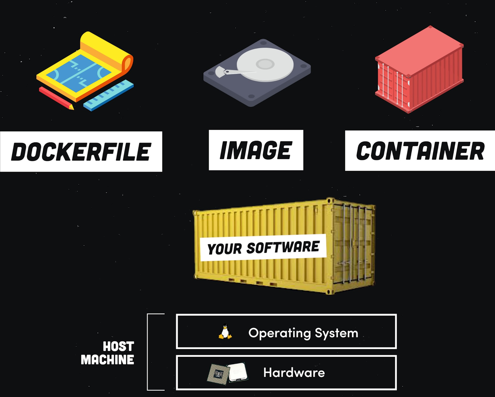

<br/>

# Installation

For **Windows**, install [Docker Desktop](https://www.docker.com/products/docker-desktop/). This will install everything needed for the command line (CLI) and also a GUI to inspect the running containers, logs and more.

<br/>

For **Linux (Debian/Ubuntu)** follow the steps mentioned here https://docs.docker.com/desktop/install/ubuntu/ (also available for Fedora/Arch).

<br/>
<br/>

Some Docker commands:

- `docker --help` to see all Docker commands, and `docker <command> --help` to see help/options for specific commands

```bash
docker --help

# or to see help for specific docker command
docker image --help
docker container --help
docker volume --help
```

- `docker ps` gives you a list with the running containers on current system (PC). Every container has an unique ID and a link to an image.

```bash
docker ps
```

- `docker image` / `docker container` / `docker volume` to manage images/containers/volumes

```bash
# Remove unused images
docker image prune

# Remove all stopped containers
docker container prune

# Remove unused local volumes
docker volume prune
```

<br/>

Docker commands cheat sheets:

- https://www.docker.com/wp-content/uploads/2022/03/docker-cheat-sheet.pdf
- https://dockerlabs.collabnix.com/docker/cheatsheet/

<br/>

# Dockerfile

In the app's project folder (eg. for a Node.js application like this [one here](https://fireship.io/lessons/docker-basics-tutorial-nodejs/), or my [angular app from Traversy Media crash course](https://github.com/radualexandrub/angular-crash-course-traversy)), create a `Dockerfile` file (without any file extension).

- The first instruction in our `Dockerfile` is `FROM` that sets the baseImage for our environment, eg.: `ubuntu` and [its variations of `ubuntu`](https://hub.docker.com/_/ubuntu/), or any other operating system. For the baseImage, we will use an official [`node:16` image](https://hub.docker.com/_/node/) that contains a machine that already has Node.js installed.

- With `WORKDIR` instruction we set the app's directory on that environment (just like when we `cd ./app` into our app in a Linux like virtual machine): `WORKDIR /app`

- Now we are installing the dependencies first (so they will be cached) in order to not reinstall the Node modules every time we change our source code => we use the `COPY` instruction that takes two arguments: `source` and `dest`:

  - the `source` argument is for our local `package.json` for our Node app
  - the `dest` argument is for the place we want to copy it in the container (which the current working directory)

- Now we can "run" the `npm install` command by using the `RUN npm install` instruction

- (Optional) we can also run a command for a specific application, eg. Angular: `RUN npm install -g @angular/cli`

- Now that we have our modules installes, we can copy our source code by copying all of our local files (in the current project on our machine) to the container's working directory: `COPY . .` => 🟠 however, if we do this directly, it will create a problem: we will also copy the `node_modules` directory that we already copied/installed in our Docker container (with the previous `RUN npm install` instruction) and it will be overriden => we need create a `.dockerignore` file and add `node_modules` in it.

- Good, so far we have the source code for our app and the `node_modules` folder that'll be found in the Docker container

- Now we need to set an environment variable (eg. for the port that the app will be running on) with `ENV PORT=8080` (or the app's port). And then we also expose the port with `EXPOSE 8080`

- Now, we will have the last `COMMAND` (`CMD`) instruction (that can be only one per `Dockerfile`) that tells the container how to actually run the application, which starts a process to serve the Node application: `CMD [ "npm", "start" ]`. Note that this command (unlike `RUN` instruction), this `CMD` command takes in an array of the words for that command.

<br/>

For our Angular App from [this angular-crash-course repository](https://github.com/radualexandrub/angular-crash-course-traversy), the `Dockerfile` will look like this:

```docker
FROM node:16

WORKDIR /app

COPY package*.json ./

RUN npm install

RUN npm install -g @angular/cli

COPY . .

ENV PORT=4200

EXPOSE 4200

CMD ["ng", "serve", "--host=0.0.0.0"]
```

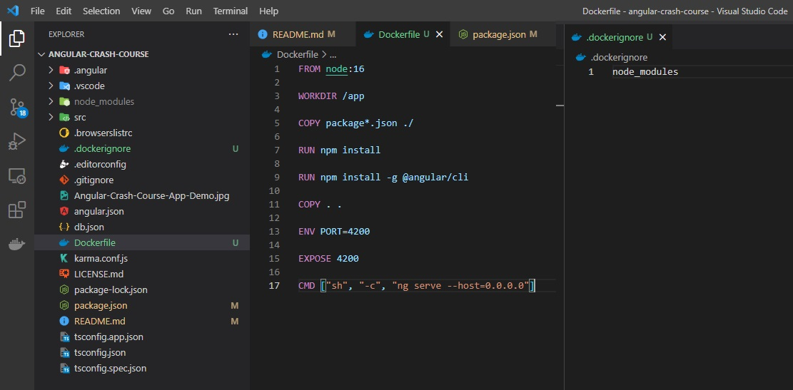

<br/>
<br/>

---

🔵 Note that we will run the development server for this Angular app, not the production one (that involves the `npm build` command and COPYing the files from the `dist` folder to the conetainer, like in [this article](https://betterprogramming.pub/how-to-create-an-angular-dockerfile-75c059e7f8e8))!

<br/>

Useful other resources / notes:

- [How can I expose more than 1 port with Docker?](https://stackoverflow.com/questions/20845056/how-can-i-expose-more-than-1-port-with-docker)
- [Multiple commands using Docker `CMD` instruction in `Dockerfile`](https://serverfault.com/questions/685697/multiple-commands-in-docker-cmd-directive)
  - Note, if we want to use multiple commands with `CMD` (such as `ng serve` and `npm run server`), we cannot write `CMD ["ng", "serve", ";", "npm", "run", "server"]` 🟠, neither `CMD ["ng serve;", "npm run server"]` 🟠... we can write something like `CMD ["sh", "-c", "ng serve; npm run server"]` 🟢 (However, we cannot handle anything if the first command fails)
  - Later edit: Note that you cannot run two commands that involves continuous processes such as `ng serve` and `npm run server` 🟠🟠🟠 => See [docker-compose](#docker-compose) section.
- [How to Create an Angular Dockerfile by Dieter Jordens, 08-Aug-2022 - FOR THE PRODUCTION (STATIC) ANGULAR APP](https://betterprogramming.pub/how-to-create-an-angular-dockerfile-75c059e7f8e8)

<br/>

# Build a Docker image

(Saturday, August 27, 2022)

To build a Docker image, we need to run the `docker build command`.

- We will give the image a `tag` (`-t`), which is a tagname of this image so we can remember easy it
  - the tagname will contain the `username` from [Docker Hub](https://hub.docker.com/) - we can create an account for free
  - followed by a name what we want to call our image, eg. `myusername/demoapp:1.0` (we can also add a version number)
  - and also, at the end of this command we need to add the path to the `Dockerfile` (in our case is just a `.` because we run the command from the project's folder that contains the `Dockerfile`)

```bash
docker build -t myusername/angularapp:1.0 .
```

<br/>

We can check the image that has been build within **_Docker Desktop_** application:

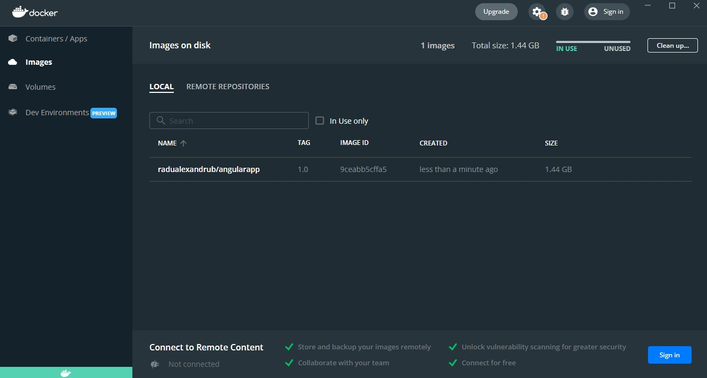

<br/>

# Run Container locally

We can run the image that has been build with the `docker run` with the image id or the tagname as parameter.

```bash
# View images IDs
docker image ls

# Run container
docker run 9ceabb5cffa5
```

If we do not encounter any errors, we should see our container running:

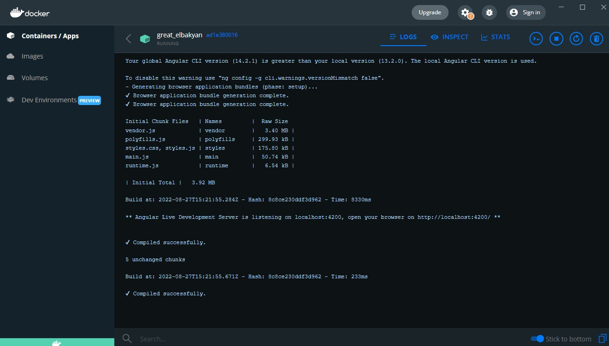

<br/>

## Port forwarding

🟠 However, if we open up the browser and go to http://localhost:4200 (our exposed port), we can't reach that site => we need to add some more arguments the `docker run` command, by using the `-p` flag to implement port forwarding from the docker container to our local machine:

- the `-p` flag will have the `localPort:containerPort` parameter (port from local machine on the left side, container's port that'll be forwarded to local port on the right side)

```bash
docker run -p 4200:4200 9ceabb5cffa5

# or if we want to forward multiple ports, just use -p multiple times
docker run -p 4200:4200 -p 5000:5000 9ceabb5cffa5
```

<br/>

- you can also give a name to the container

```bash
docker run --name angular_app_container -p 4200:4200 9ceabb5cffa5
```

<br/>

Here's all of our commands so far:

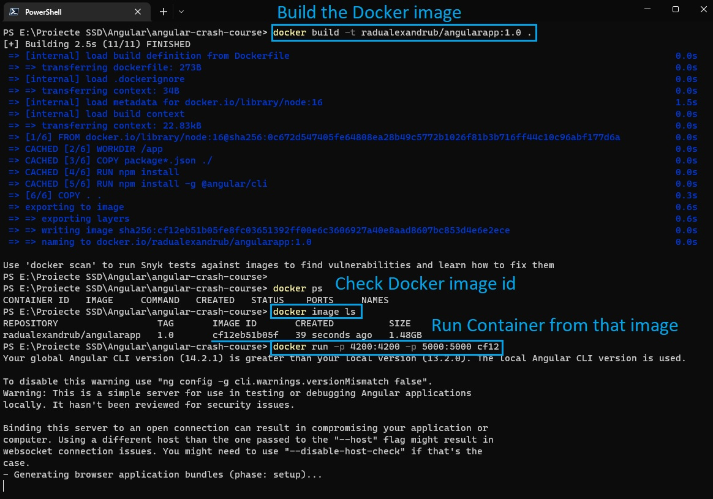

Now, in our case, we can see our Angular App running (on development server), on http://localhost:4200:

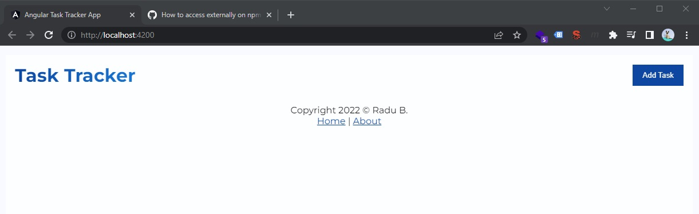

<br/>
<br/>

---

🔵 Note, to stop the previous running container:

```bash
# View list of running containers
docker ps

# Copy the container id (or the first digits)

# Stop the container
docker stop 2794cfc4435a

# Remove the container
docker rm 2794cfc4435a
```

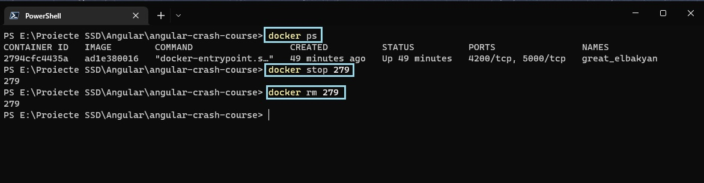

<br/>

🔵 Note, when we open http://localhost:4200/, we might encounter `localhost didn’t send any data.` `ERR_EMPTY_RESPONSE` error. For this, we would need to actually serve our node app to `0.0.0.0` address instead of `127.0.0.1 (localhost)` => so the command for `Dockerfile` will be `CMD ["ng", "serve", "--host=0.0.0.0"] `. More details [here](https://stackoverflow.com/questions/47048332/localhost-didnt-send-data-err-empty-response-and-curl-52-empty-reply-fro).

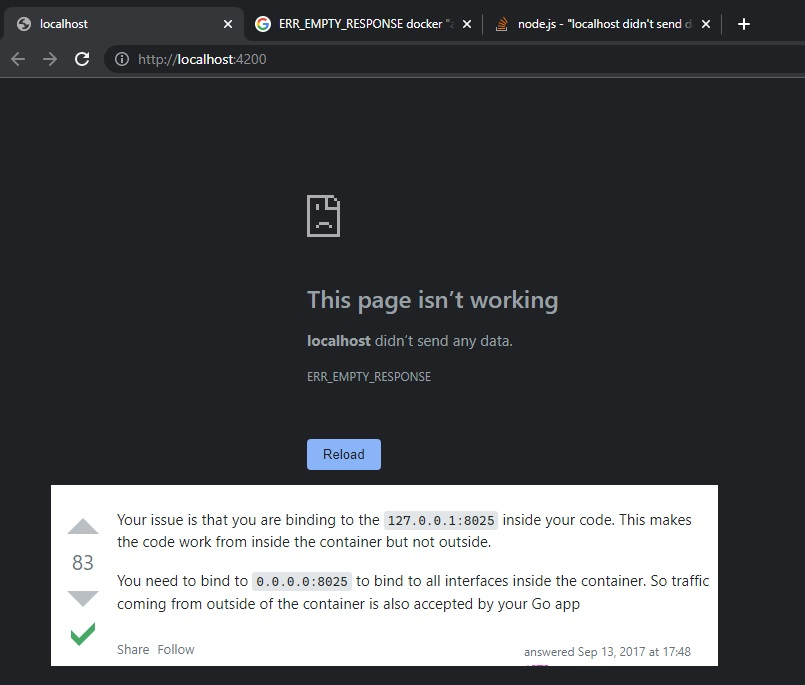

<br/>

Also note that for external node server (such as dummy pre-made back-end service (REST API), like **[JSON Server npm - a full fake REST API with zero coding in less than 30 seconds](https://www.npmjs.com/package/json-server)**), we also need to add `--host 0.0.0.0` in the command for that service (in order to fully expose the service port from Docker to our local machine):

```json
{
  "name": "angular-crash-course",
  "version": "0.0.0",
  "scripts": {
    "ng": "ng",
    "start": "ng serve",
    "build": "ng build",
    "watch": "ng build --watch --configuration development",
    "test": "ng test",
    "server": "json-server --watch db.json --port 5000 --host 0.0.0.0"
  }
}
```

<br/>

Useful other resources / notes:

- [How can I expose more than 1 port with Docker?](https://stackoverflow.com/questions/20845056/how-can-i-expose-more-than-1-port-with-docker)

<br/>

## Docker debugging

- To see the logs from our running container, run:

```bash
# View running containers
docker ps

# Copy the docker id, eg. aaa5c96fd2

# View logs from that container (with -f from follow)
docker logs -f aaa5c96fd2
```

<br/>

- You can also execute commands in the container with [`docker exec <containerId>`](https://docs.docker.com/engine/reference/commandline/exec/)

```bash
# docker exec <containerId> COMMAND
docker exec aaa5c96fd2 ls
```

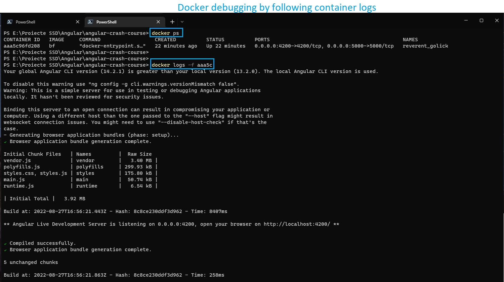

- Or you can enter in the interactive shell with `-i` (Keep STDIN open even if not attached) and `-t` flags (Allocate a pseudo-TTY):

```bash
docker exec -it aaa5c96fd2 /bin/sh

# Run Linux commands
pwd
ls

# Type exit to exit
exit
```

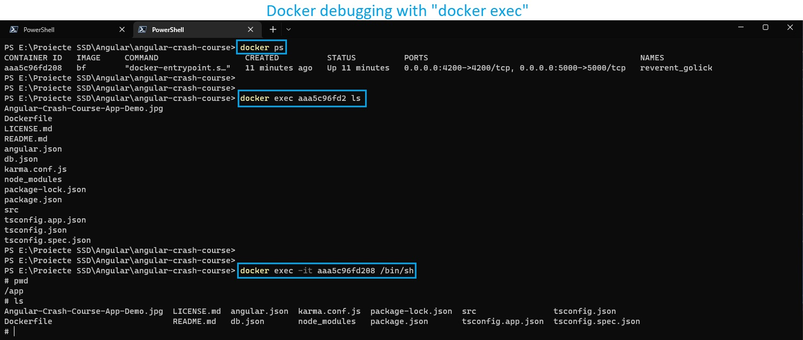

<br/>

# Docker compose

Docker only allows us to have one process per container. If our app runs multiple services (on multiple ports, eg. `4200` and `5000`), with only one Docker container we can't run all of the services.

For example, if our entire Application has a back-end (exposed on port `5000`) and a front-end (exposed on port `4200`), we need to use create and configure a `docker-compose.yml` file to run multiple Docker containers at the same time.

Another application example that needs docker-compose: a SpringBoot app as a REST API (as one service) that also needs a MySQL database to store the data (as another service).

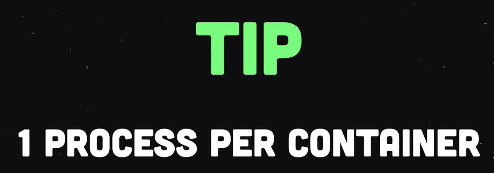

<br/>

Maybe useful link: [Dockerize a Node.js Application for development with docker-compose](https://www.digitalocean.com/community/tutorials/containerizing-a-node-js-application-for-development-with-docker-compose).

<br/>

## docker-compose.yml

Let's create a `docker-compose.yml` file in the root of our project.

- Inside this `yml` file, we have a `services` object, where each key (service) in that object represents a different container that we want to run (Note that each key will actually be the service/container name).

- Each service (key inside `services` object) will have a `build` key that needs to point to its `Dockerfile` file. 🔵 Note, if we have multiple `Dockerfile` files, we can place them in different locations, such as `./docker/frontend/Dockerfile` and `./docker/backend/Dockerfile` (More details [here](https://www.baeldung.com/ops/multiple-dockerfiles))...

  - Or instead of using different file locations for our multiple `Dockerfile` files, we can just rename them like `Dockerfile.frontend` and `Dockerfile.backend`
  - And, the `build` key/object will have two properties: `context` key with the location of the `Dockerfile`, and `dockerfile` key with the name of the `Dockerfile` (eg. `Dockerfile.backend`)

- Each service will also have a `ports` key with `- "localPort:containerPort` (port from local machine on the left side, container's port that'll be forwarded to local port on the right side)

<br/>

Finally:

- Our `Dockerfile` for front-end

```docker
FROM node:16

WORKDIR /app

COPY package*.json ./

RUN npm install

RUN npm install -g @angular/cli

COPY . .

ENV PORT=4200

EXPOSE 4200

CMD ["sh", "-c", "ng serve --host=0.0.0.0"]
```

- Our `Dockerfile.json_server` for back-end [JSON Server](https://www.npmjs.com/package/json-server)

```docker
FROM node:16

WORKDIR /app

COPY package*.json ./

RUN npm install

COPY . .

ENV PORT=5000

EXPOSE 5000

CMD ["npm", "run", "server"]
```

- Our `docker-compose.yml` file

```yml
version: "3"
services:
  angular_app:
    build: .
    ports:
      - "4200:4200"
  json_server:
    build:
      context: .
      dockerfile: Dockerfile.json_server
    ports:
      - "5000:5000"
```

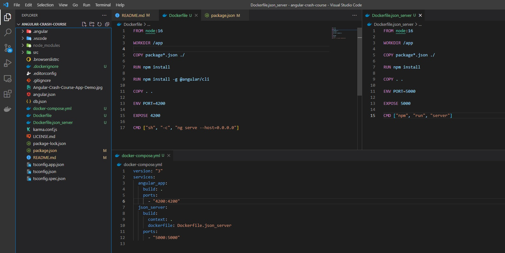

<br/>

## Docker-compose commands

Finally, we can start all the containers at once by running `docker-compose up` command.

```bash
docker compose up
```

🔵 Note: you can also use `docker compose up` (newer version) instead of `docker-compose up` (old version). See more [here](https://stackoverflow.com/questions/66514436/difference-between-docker-compose-and-docker-compose).

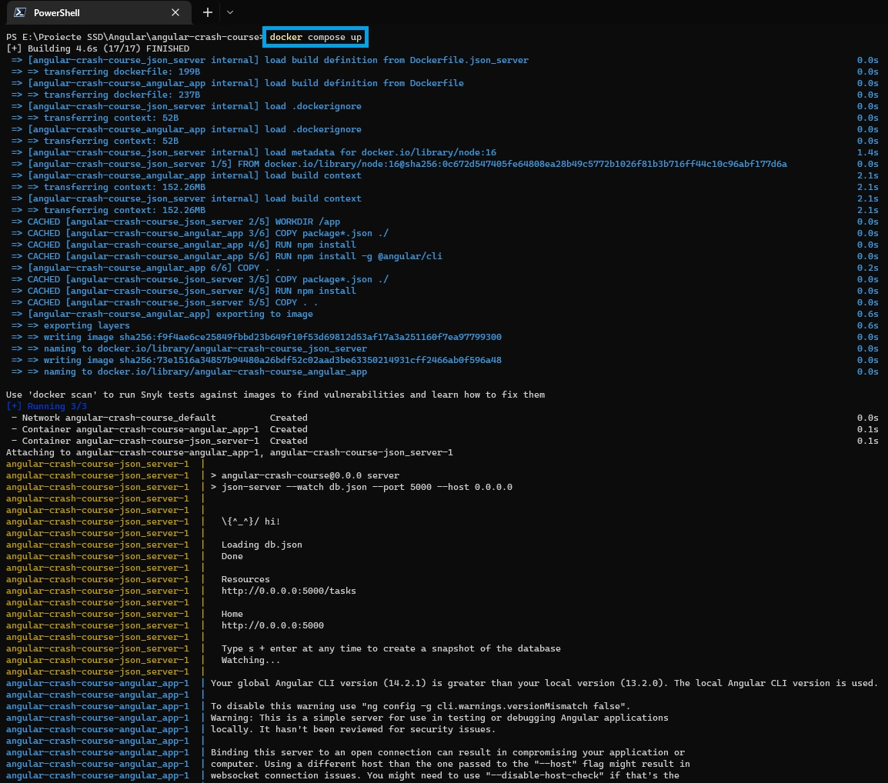

And we can see our "services" running (namely our front-end app on http://localhost:4200/ and our back-end JSON server on http://localhost:5000/)!

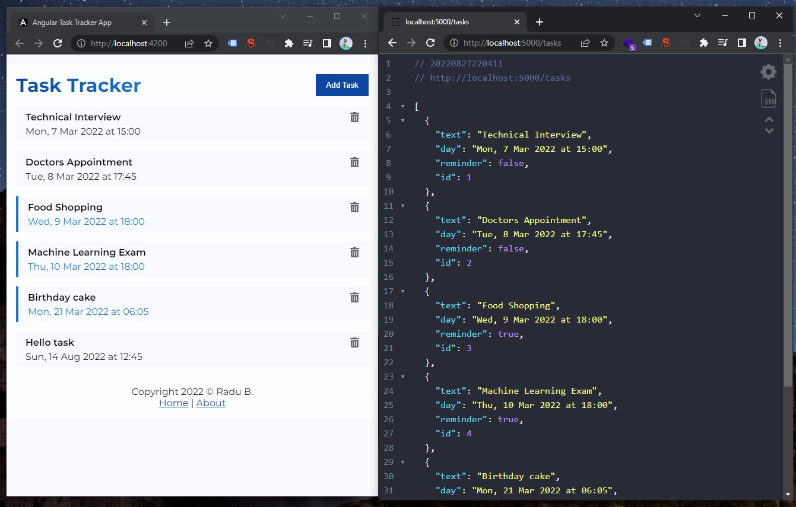

<br/>

Unlike `docker run` command, here (in the terminal that we ran `docker compose up`) if we press `CTRL+C` we will actually stop all docker containers. However, this command will not remove those containers (will be still be kept in memory), so we need to run `docker-compose down`.

```bash
docker compose down
```

If we had any volumes associated with these containers, we add `-v` (volumes) command.

```bash
docker compose down -v
```

To remove both built Docker images via command line

```bash
# View images and their IDs
docker images -a

# Remove both images by their IDs
docker rmi <angular_appImageID>
docker rmi <json_serverImageID>
```