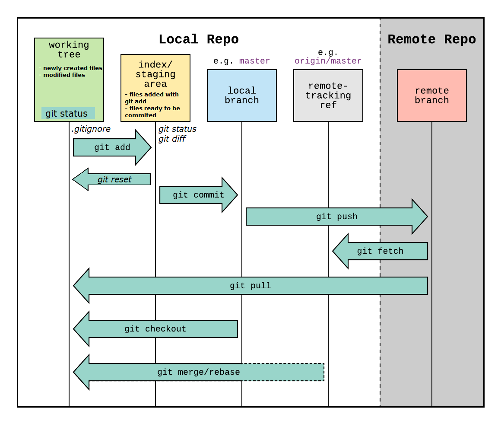

Notes with **_Git CLI commands_** taken from on-line tutorials such as:

- [Git Tutorials (1h24m) from **Corey Schafer**](https://www.youtube.com/playlist?list=PL-osiE80TeTuRUfjRe54Eea17-YfnOOAx)
- [Git and GitHub (2h16m) from **The Coding Train**](https://www.youtube.com/playlist?list=PLRqwX-V7Uu6ZF9C0YMKuns9sLDzK6zoiV)

Table of Contents:

- [Git basic commands](#git-basic-commands)
  - [git help](#git-help)
  - [Set up global configuration variables](#set-up-global-configuration-variables)
  - [Create local empty repo or clone an existing repo](#create-local-empty-repo-or-clone-an-existing-repo)
    - [git init](#git-init)
    - [git clone](#git-clone)
  - [git status](#git-status)
  - [git diff](#git-diff)
- [Git work-flow (on master branch)](#git-work-flow-on-master-branch)
  - [Schema: Working Directory, Staging Area, Git Remote Repository](#schema-working-directory-staging-area-git-remote-repository)
  - [Create a new branch from CLI](#create-a-new-branch-from-cli)
  - [Git **Complete Workflow** - Work from another branch](#git-complete-workflow---work-from-another-branch)
  - [Create a new repo from a locally existing/completed project (mini-workflow)](#create-a-new-repo-from-a-locally-existingcompleted-project-mini-workflow)
- [Locally Mistakes that could've been made](#locally-mistakes-that-couldve-been-made)
  - [If we made changes to a single\_file but then we don't want to keep the changes to that file anymore (we want to undo/go back):](#if-we-made-changes-to-a-single_file-but-then-we-dont-want-to-keep-the-changes-to-that-file-anymore-we-want-to-undogo-back)
  - [We mess up a commit -m message. We want to modify the last commit message without doing another commit](#we-mess-up-a-commit--m-message-we-want-to-modify-the-last-commit-message-without-doing-another-commit)
  - [We forgot to add a file to the last commit. We want the add the file without commiting again.](#we-forgot-to-add-a-file-to-the-last-commit-we-want-the-add-the-file-without-commiting-again)
  - [We made commits to the master branch instead of our working branch. Fix: we "move" a commit(hash) to the master and return the state of the master branch](#we-made-commits-to-the-master-branch-instead-of-our-working-branch-fix-we-move-a-commithash-to-the-master-and-return-the-state-of-the-master-branch)
  - [Types of git resets](#types-of-git-resets)
    - [**_SOFT RESET_**](#soft-reset)
    - [**_MIXED RESET_** (DEFAULT)](#mixed-reset-default)
    - [**_HARD RESET_**](#hard-reset)
  - [**Fatal: We did a hard reset on some changes but we realized that we actually need them: `git reflog` (or we deleted last commits)**](#fatal-we-did-a-hard-reset-on-some-changes-but-we-realized-that-we-actually-need-them-git-reflog-or-we-deleted-last-commits)
  - [Undoing a commit after pushing to remote server. Fix **without changing the git history**](#undoing-a-commit-after-pushing-to-remote-server-fix-without-changing-the-git-history)
- [Using the **`git stash`** command ("temporary" commits)](#using-the-git-stash-command-temporary-commits)
- [Discard / Drop local changes in Git](#discard--drop-local-changes-in-git)

---

# Git basic commands

## git help

Display help (all commands) in CLI:

```bash
git help
```

Check Git version installed on PC:

```bash
git --version
```

Git help on commands (the help menu will be displayed on a new Browser(Chrome, Firefox, etc) tab):

```bash
git help <command> # is the same as git <command< --help

git help config
git config --help # is the same as git help config
git add --help
```

## Set up global configuration variables

- Needed to push local repository to GitHub remote server
- Also useful when working in a team to see who changed the code (with **blame** command)
- For **_name_**: you can choose any name, it can be different from your github account
- For **_email_**: it must be the exact same email used on your github account

```bash
git config --global user.name "John Doe"
git config --global user.email "JohnDoe97@gmail.com"

git config --list # list all configurations
```

---

## Create local empty repo or clone an existing repo

### git init

- Create own local empty repo (**_init_**) (it will create a new folder **_.git_** with all the informations about that repo):

```bash
cd my_new_project_folder_name
git init
```

### git clone

- Copy/Download an existing repo (**_clone_**) as a local repository in your PC

```bash
git clone <url> <optional:where_to_clone>
# like this
git clone https://github/username/android-app AndroidAppFolder
```

---

## git status

```bash
git status
```

Git keeps track of modified/added/removed files and also which files are [are not] tracked.
However, sometimes you don't want to track some files (eg. personal files, personal configurations files, cache files auto-generated after each build) => create **_.gitignore_** file where you can write the files you don't want to include (ignore them forever):

```
mystuff.txt
*.pyc
.DS_Store
```

^^ These files won't show up anymore when calling **_git status_**.
Also, .gitignore should be included (_git add .gitignore_) to prevent a team collaborating on a project from committing generated cache files => don't add .gitignore to .gitignore itself lol.

---

## git diff

Git diff shows the changes made to the code within modified files (git status shows only which files have been modified/created).

```bash
git diff
```

---

# Git work-flow (on master branch)

- Add files to the staging area (= add all the files that are ready to be commited except the files from _.gitignore_)

```bash
git add -A
```

- Commit all the files added (tracked files) to the local repository.

```bash
git commit -m "Message from this commit"
```

- Add all the files to the staging area then commit:

```bash
git commit -a -m "Message from this commit"
```

- Git reset [file.ext] will make all the files [or only file.ext] untracked (out of the staging area) => The changes to that file.ext will not be commited!

```bash
git reset [file.ext]
```

- Git log shows all the made commits (with hash number, author, date of each commit). By default, the log opens in Vim text editor.
Keywords: `show all commits`, `see all commits`

```bash
git log
git log -2 # shows last 2 commits
```

```bash
git push -u origin master
# git push -u <remote> <branch>
# -u or --set-upstream is to save/add upstream (tracking) reference(the <remote> and <branch>), in order to just write "git push" without specifying again the <remote> and <branch>
```

- Git remote shows all the remotes (github repositories) where you can push the last (local) commit. Git remote -v is for verbose (all info about the remotes).

```bash
git remote
git remote -v
```

To add a remote:

```bash
git remote add origin https://github.com/username/projectname/.git
# git remote add <new_branch_name> <link_to_repository>
```

OBS: When cloning a remote (a github repository) with git clone, a remote named "origin" will be available by default.

Get (locally) the last state (last changes/updates) of the project if someone made changes on the global repository (the remote to github.com server):

```bash
git pull origin master
```

If this error occurs when pulling: **_"your local changes to the following files would be overwritten by merge"_** and **you** want to **drop/overwrite all the changes made from the local repository and get the latest updates from the global repository**, use:

```bash
# Drop local changes, revert to the HEAD reference (last local commit in the master branch)
git reset --hard # NEVER USE: git checkout HEAD^ file/to/overwrite
git pull origin master
# HEAD^ is short for HEAD^1, which means the one commit before HEAD. You could also do HEAD^2 for the commit before that one
```

**_Or, discard/give up all the changes (modified files) and go back to last (local) commit state of files:_**

```bash
git checkout -- .
```

NOTE1: git checkout HEAD^ filename (will overwrite the file to the state of _commit before_ last local commit in the master branch)<br>
NOTE2: git checkout HEAD^ **without specifying a file** will **DROP THE WHOLE LAST COMMIT!!! and will revert to the commit before last commit** (however you will be in a detached head state branch, so you can revert this action by just changing back to master branch: git checkout master)<br>
NOTE3: git checkout HEAD^1 is roughly the same as git reset HEAD^1, but:

- Use reset if you want to undo staging of a modified file !!!
- Use checkout if you want to discard changes to unstaged file/s !!! (however it is still possible to recover lost files with git reflog and cherry-pick, check [locally mistakes section](#mistakes_locally)).

## Schema: Working Directory, Staging Area, Git Remote Repository



---

## Create a new branch from CLI

- git branch, git checkout
  To create and move to a new branch:

```bash
git branch <new_branch_name>
git checkout <new_branch_name>
```

Show all branches/active branch with:

```bash
git branch
git branch -v
```

- Merge a branch: git merge (mini-workflow)<br>
  If all your modifications to the code is great and passes all the (unit) tests, merge your branch with the master branch:

```bash
git checkout master # change to master branch
git pull origin master # get last updates before making any changes to master
git branch --merged # show branches that are/aren't merged with master branch
git merge <my_new_branch_ive_worked_on>
git push origin master
```

- Delete a branch (mini-workflow)<br>
  After you added the features from your branch and merged with master, you can **delete** your branch you worked on:

```bash
git branch --merged
git branch -d <my_branch_ive_worked_on> # locally delete the branch
git branch -a # show all branches: we still have <my_branch> globally
git push origin --delete <my_branch_ive_worked_on> # globally/definitely delete the branch
```

---

## Git **Complete Workflow** - Work from another branch

```bash
git config --global user.name
git config --global user.email
git clone <url> <where_to_clone>
git branch <my_new_branch_name>
git checkout my_new_branch
# (make changes to the code ...)
git status
git add -A
git commit -m "Add @function in views.py | Solve bug in models.py that fixes #8"
git push -u origin my_new_branch
# (wait for unit tests to complete)
# (if all unit tests pass, then do these)
git checkout master
git pull origin master
git merge my_new_branch
git push origin master
# (now time to delete my_new_branch)
git branch -d my_new_branch
git branch -a # shows/list all branches
git push origin --delete my_new_branch
```

<br/>

(Wednesday, April 05, 2023, 19:43)

<u>**Or, use this step-by-step workflow using stash and a new hotfix/enhancement branch after you just finished writing (and locally testing) the code for the hotfix/enhancement on the main/parent branch:**</u>

1.  Before creating a new branch, ensure that your local repository is up-to-date with the remote repository:

    - `git fetch` (This command will download any changes from the remote repository without merging them)
    - (optional) `git pull` (This command will fetch and merge any changes from the remote repository into your local repository)

2.  Stash your code:

    - `git stash save "TICKETNUMBER-42 Fixed duplicated TaskComplete request` (This command will save your current changes in the stash with a description message)

3.  Discard changes and checkout to the created hotfix/enhancement branch:

    - `git checkout <branch-name>` (This will discard your current changes and switch to the specified branch)

    Best practice is to add the ticket number in the branch name and the commit as well!
    Example: `git checkout "TICKETNUMBER-42-Fixed-duplicated-request"` (Note branch names don't have spaces ` `)

    Note: If there are still some changes left and you cannot checkout to new branch, run `git reset –-hard` to get rid of any unwanted changes/code modifications.

4.  Apply the stash:

    - `git stash apply` (This command will apply the most recently saved stash)

    Note: You can see before-hand the stashes you have with `git stash list` and apply a stash by its number, such as `git stash apply stash@{0}`.
    Or you can apply a stash by its name `git stash apply <stash-name>`.
    You can also use the `git stash pop` command to apply the most recent stash and remove it from the stash list at the same time

    - Check that the code has been applied correctly with `git status`

5.  Make the necessary changes and commit with a meaningful message:

    - `git add <file(s)>` (This command will stage the specified file(s) for commit)
    - `git commit -m "TICKETNUMBER-42 Fixed duplicated TaskComplete request"` (This command will commit the changes with a descriptive message)

    Note: You can also run `git commit` (without `-m "message"`) and the commit message that needs to be written will be opened in Vim. In Vim, you can write an even more meaningful commit message with title and bullet points:

    ```
    TICKETNUMBER-42 Fixed duplicated TaskComplete request
    - TaskEventHandler.ts: Within onTaskComplete() method, eliminate the need to check again the condition X that sends the TaskComplete request
    - TaskEventHandler.spec.ts: Modify unit tests to accomodate the change
    - Note that the request JSON sent to SpringAPI Back-end Server looks like this:
    {
      "taskId": 1234,
      "completedBy": "John Smith",
      "completedAt": "2023-04-05T14:30:00Z",
      "notes": "Task to create a build was completed successfully",
      "isChecked": true
    }
    ```

    In other words: Document your changes! If you make changes that are not immediately obvious from the code, make sure to document them in the commit message AND pull request message (it can be the same message for both commit and pull request).

6.  After commit, wait for unit tests to pass.

7.  Push the code to the remote repository:

    - `git push -u origin <branch-name>` (This command will push the new branch to the remote repository and set the upstream branch)

    Example: `git push -u origin "TICKETNUMBER-42-Fixed-duplicated-request"`

    Note: If the branch already exists on the remote repository (e.g. was created already on BitBucket / GitHub), you can omit the `-u` flag.

8.  Create a pull request:

    - Go to the remote repository (e.g. Bitbucket / GitHub) and create a pull request from the new branch to the parent branch.

9.  Wait for the pull request to be approved by at least two other developers

    Note: Make sure that it has been reviewed by at least one or two other person on your team. This will help catch any bugs or issues before they make it into the main codebase.

10. If you encounter merge conflicts while applying the stash or merging the new branch:

    - Resolve the conflicts manually by editing the affected files
    - `git add <file(s)>` (This command will stage the resolved files for commit)
    - `git commit -m "<commit-message>"` (This command will commit the changes with a descriptive message)

11. (Optional) If you want to rebase your new branch onto the latest version of the parent branch before merging:

    - `git checkout <parent-branch>` (This command will switch to the parent branch)
    - `git pull` (This command will fetch and merge any changes from the remote repository into your local repository)
    - `git checkout <branch-name>` (This command will switch back to your new branch)
    - `git rebase <parent-branch>` (This command will apply your new branch's changes on top of the latest parent branch changes)
    - Resolve any conflicts that arise during the rebase process
    - `git add <file(s)>` (This command will stage the resolved files for commit)
    - `git rebase --continue` (This command will continue the rebase process after resolving conflicts)
    - `git push -f` (This command will force push the rebased new branch to the remote repository)

Note: Rebasing a branch can alter the commit history and should be used with caution. It is also important to communicate any changes made to the branch with other team members who may have been working on it.

1.  Merge the code:

    - Once the pull request has been approved, merge the new branch:
    - `git checkout <parent-branch>` (This command will switch to the parent branch)
    - `git pull` (This command will fetch and merge any changes from the remote repository into your local repository)
    - `git merge --no-ff <branch-name>` (This command will merge the new branch into the parent branch without fast-forwarding)
    - Resolve any conflicts that arise during the merge process
    - `git add <file(s)>` (This command will stage the resolved files for commit)
    - `git commit -m "<commit-message>"` (This command will commit the changes with a descriptive message)
    - `git push` (This command will push the merged changes to the remote repository)

2.  Checkout to parent branch:

    - `git checkout <parent-branch>` (This command will switch to the parent branch)

3.  Delete hotfix/enhancement branch:

    - `git branch -d <branch-name>` (This command will delete the specified branch locally)
    - `git push origin --delete <branch-name>` (This command will delete the specified branch on the remote repository)

<br/>

---

## Create a new repo from a locally existing/completed project (mini-workflow)

- On GitHub.com website:
  - Create a new repository (write name & description)
  - (optional) Create a Readme.MD file
- On CLI (locally):
  - Open the terminal in that folder/project's path
  - Write the following commands:

```bash
git init
git remote add origin https://github.com/username/projectname/.git
git remote -v
git pull origin master # needed to update the commit history of new repo (especially if Readme.MD or LICENSE was created)
git status
git add -A
git status
git commit -m "Initial commit from local project"
git push origin master
```

---

# Locally Mistakes that could've been made

## If we made changes to a single_file but then we don't want to keep the changes to that file anymore (we want to undo/go back):

```bash
git checkout single_file.py
```

And if we want to discard all changes/modifications to our files:

```bash
git checkout -- .
```

Also, if we want to delete/get rid of untracked files (newly created files):

```bash
git clean -fd # force directories
```

## We mess up a commit -m message. We want to modify the last commit message without doing another commit

**WARNING: The following commands in this section will change the hash of previous commits => THIS WILL CHANGE _GIT HISTORY_ => IF OTHER PEOPLE WILL PULL THE CHANGES AFTER EXECUTING THESE COMMANDS, THE CHANGED HISTORY COULD CAUSE BIG PROBLEMS TO THEIR REPOSITORIES. We can only change git history when we're the only one owners of the repository.**

```bash
git commit --amend -m "Corrected commit message"
```

## We forgot to add a file to the last commit. We want the add the file without commiting again.

```bash
git add file.c # get the file in the staging area
git commit --amend # this will add the new file to last commit, also it opens a log in Vim, exit with :wq
git log --stat # show file changes in commits
# The last commit hash will be changed, so the git history will be changed
```

## We made commits to the master branch instead of our working branch. Fix: we "move" a commit(hash) to the master and return the state of the master branch

```bash
# from master's branch
git log
# grab/copy (the first 6-7 characters of) the commit hash that we want to cherry-pick
# change to our working branch
git checkout [my-branch-name]
git cherry-pick 1b818d3b
git log

# Now delete the commit from master
git checkout master
git log
# grab/copy the hash of the commit before our wrong commit
git reset --hard 2e75207
git log
git clean -fd
```

**WARNING: Again, this will change git history and will cause consequences when working in a team!!! I'll write some alternatives in next sections.**

## Types of git resets

### **_SOFT RESET_**

```bash
git log # grab the hash of the commit we want to keep, the commits after that commit will be removed
git reset --soft 2e7520782

git log
git status
```

**Git soft reset** will set us back to the specified commit BUT will keep the modified and newly files from the unwanted commits (the ones we removed) in the **_staging area_** ("added files ready to be commited" area) - we still didn't lose our work, but we can discard with `git reset HEAD -- .`.

### **_MIXED RESET_** (DEFAULT)

```bash
git log # grab the hash of the commit we want to keep, the commits after that commit will be removed
git reset 2e7520782

git log
git status
```

**Git mixed/default reset** will set us back to the specified commit BUT will keep the modified and newly files from the unwanted commits (the ones we removed) in the **_working directory_** ("untracked files, before executing add -A" area) - we still didn't lose our work, but we can discard with `git checkout -- .`.

### **_HARD RESET_**

```bash
git log # grab the hash of the commit we want to keep, the commits after that commit will be removed
git reset --hard 2e7520782

git log
git status
```

**Git hard reset** will set us back to the specified commit AND will make all the changes in files to match the state that they were in the specified commit - we've lost our work.<br>
However, hard reset will not affect untracked files (newly created files from the unwanted commits, but it's irrelevant if we didn't create any new files). We can get rid of these untracked files with `git clean -fd`.<br>
<br>
NOTE: `git clean -fd` could be useful when we accidentally unzip an archive in a project directory (local repo) and we don't want to manually delete all the new files created.

## **Fatal: We did a hard reset on some changes but we realized that we actually need them: `git reflog` (or we deleted last commits)**

This "fix" works if we screwed up with `git checkout HEAD^1` or `git reset --hard HEAD^`. (HEAD^ is short for/same with HEAD^1).<br>
Luckily, git garbage collector (gc) collects/deletes (forever) lost commits after 30 days (IF WE DIDN'T ALREADY RAN `git gc` COMMAND).

```bash
git reflog
# grab the hash before executed reset command
git checkout [0c8189]
git log # happily see our changes back

git branch
# HOWEVER, we're in a detached head state - we are on a branch that would be trashed in the future, so we need to save those changes in a newly created branch
git branch backup
git checkout master
git branch
```

Now we've successfully recovered our lost changes, we can merge the backup branch with master (`git merge backup`) **OR** if our changes are already in master branch (do check), we can delete the backup branch (`git branch -d backup`).

---

## Undoing a commit after pushing to remote server. Fix **without changing the git history**

Undo a commit (when other people already pulled the changes), without rewriting the git history. We use `git revert` to create a new commit on top that reverses the changes of earlier commits.

```bash
git log # select the commit hash THAT WE WANT TO UNDO (the wrong commit)
git revert [1b818d3] # will also show a message in Vim, :wq to exit
git log # you can see the new revert commit

# You can also see the revert diff
git diff [1b818d3] [hash from revert commit]
```

---

# Using the **`git stash`** command ("temporary" commits)

Useful for changes that you are not ready to commit yet, but you need to switch branches (or revert back to another code) work temporarily in another part of the project.
NOTE: If you don't commit your changes (modified files) and you switch to another branch, your code will be lost.

```bash
git branch my_branch
git checkout my_branch
# Make changes to the code, realize you have to switch branch for a moment
git stash save "Worked on login function"
# git diff / git status will show "working tree clean" -> after pushing to stash, all modifications to files are gone.

# You can now switch branches / cherry-pick commits / work on other part of project, when you come back:
# Option 1:
git stash list
git stash apply stash@{0} # after executing this, the saved stash will still be listed in stash list
# Option 2:
git stash pop # grabs the very first (top) stash, applies changes then drops that stash from stash list
```

> Note if `git stash apply stash@{0}` does not work, you can just run `git stash apply 0` (`git stash apply n`) - [from StackOverflow](https://stackoverflow.com/questions/1910082/git-stash-apply-version)

<br/>

You can also drop/delete stashes in stash list:

```bash
git stash list
git stash drop stash@{2}

# Or delete all the stashes in the list (assume that all those changes were junk/no longer needed)
git stash clear
```

<br/>

NOTE: You can't merge two stashes (eg. `git stash pop` twice) -> will show _Error: files would be overwritten by merge, please commit your changes or stash them before you merge_.<br>

NOTE: **The same stash list is accesible to every branch** => Useful scenario: If you've written all your changes to code in a wrong branch (master) you need to commit to another branch, just stash the changes `git stash save "Worked on login function"`, `git checkout another_branch`, then grab changes from stack (`stash apply stash@{?}`/`stash pop`).

<hr/>

# Discard / Drop local changes in Git

From: **How to discard your local changes in Git** / **Remove and revert uncommitted Git changes**
https://www.theserverside.com/blog/Coffee-Talk-Java-News-Stories-and-Opinions/remove-revert-discard-local-uncommitted-changes-Git-how-to

There are two Git commands a developer must use in order to discard all local changes in Git, remove all uncommited changes and revert their Git working tree back to the state it was in when the last commit took place.

The commands to discard all local changes in Git are:

```bash
git reset –-hard
git clean -fxd
```

Explanation:

- `git reset –hard` reset will set us back to the the last commit AND will make all the changes in files to match the state that they were in the specified commit
- `git clean` removes untracked files from the working tree
  - `-d` Normally, when no <path> is specified, git clean will not recurse into untracked directories to avoid removing too much. Specify -d to have it recurse into such directories as well. If any paths are specified, -d is irrelevant; all untracked files matching the specified paths (with exceptions for nested git directories mentioned under --force) will be removed.
  - `x` This allows removing all untracked files, including build products. This can be used (possibly in conjunction with git restore or git reset) to create a pristine working directory to test a clean build.
  - `f` / `--force`

<br/>
<br/>

<hr/>

_Find me on my Social Pages_

🌍 My portfolio: **[radubulai.com](https://radubulai.com/)**

🥂 Social:<br/>
<a href="https://www.linkedin.com/in/radu-alexandru-bulai/" target="_blank"></a>
<a href="https://dev.to/radualexandrub" target="_blank"></a>
<a href="https://www.hackerrank.com/RaduAlexandruB" target="_blank"></a>
