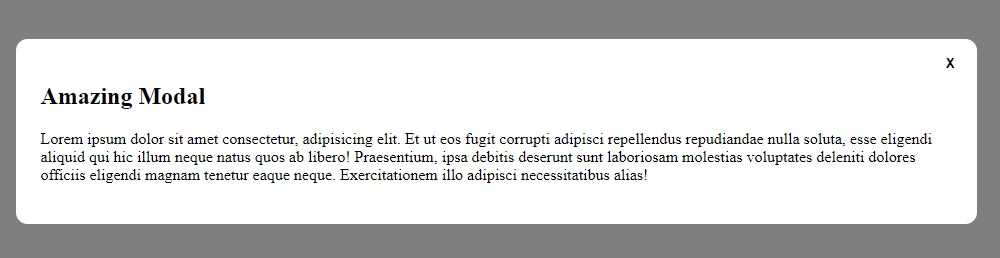
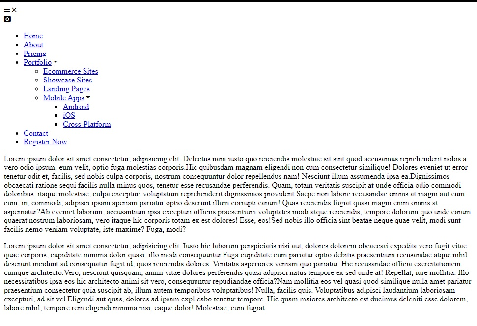
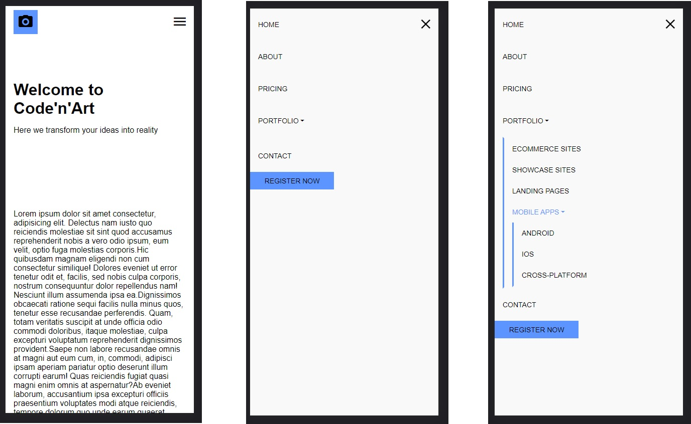
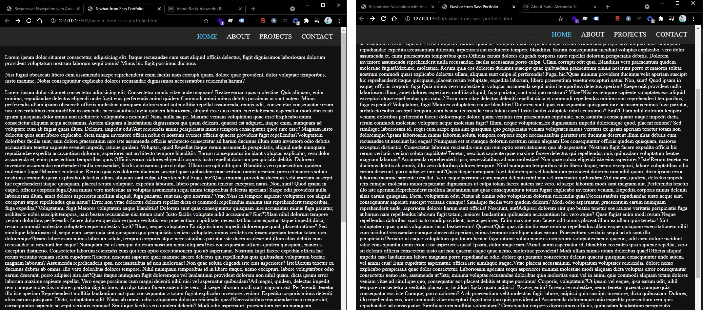
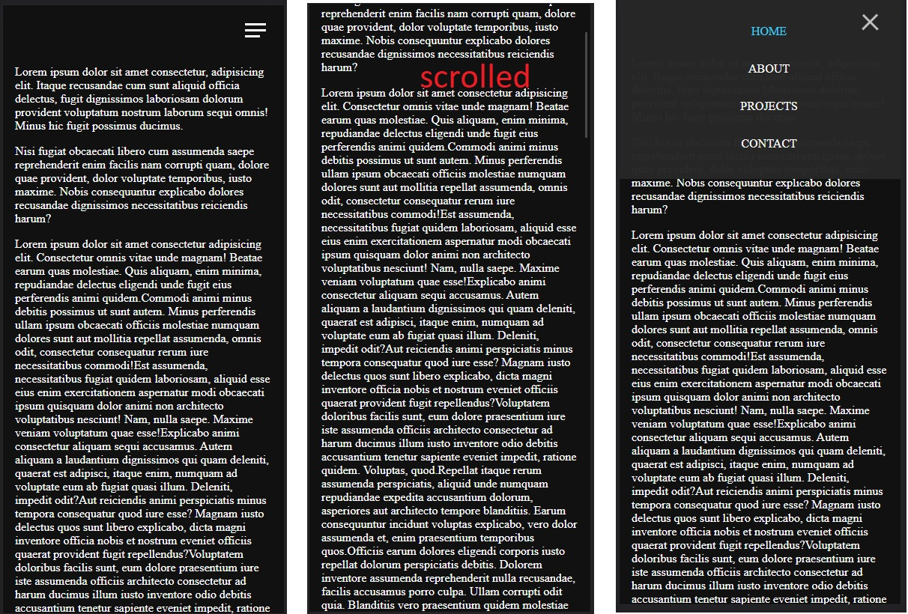
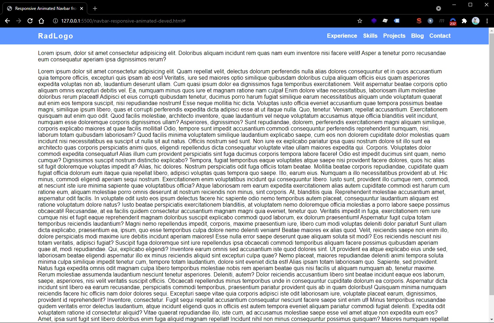
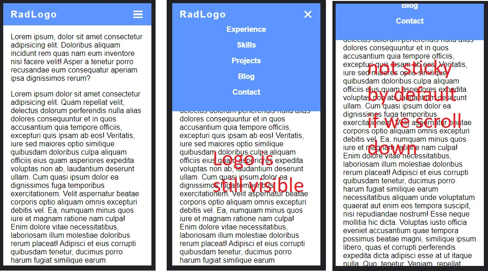
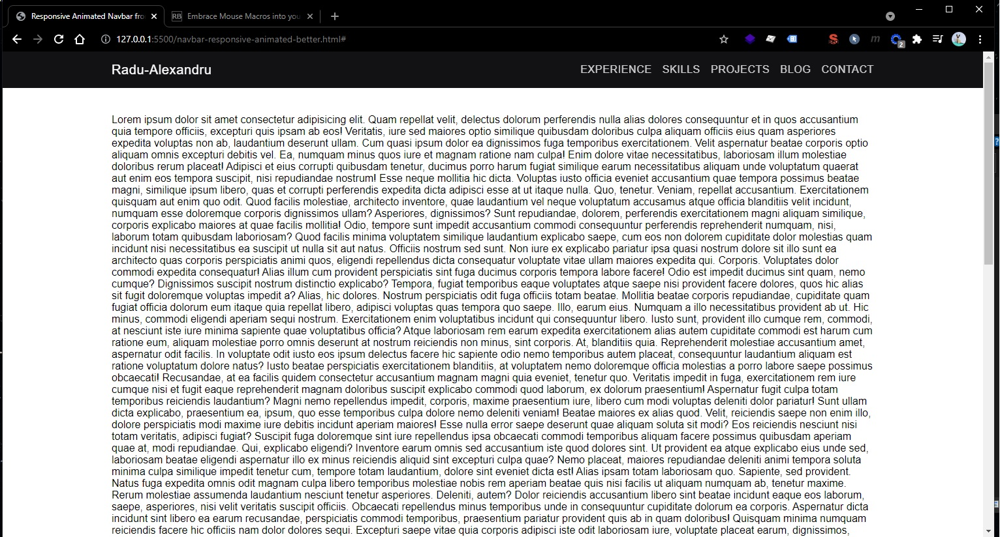
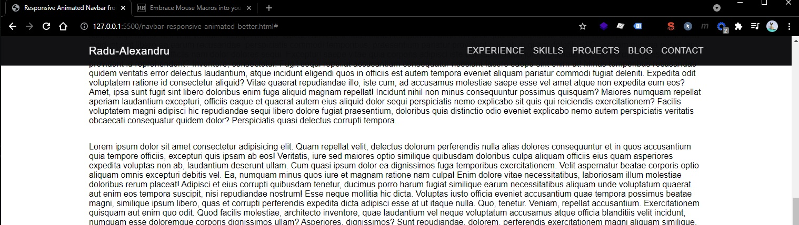
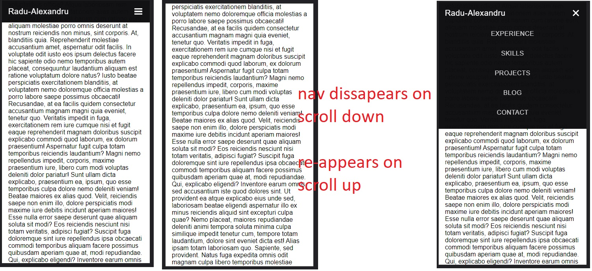

Table of Contents:

- [Modals](#modals)
  - [Vanilla JavaScript and CSS Modal Popup](#vanilla-javascript-and-css-modal-popup)
- [Navbars](#navbars)
  - [Responsive Navbar with Animated Dropdowns](#responsive-navbar-with-animated-dropdowns)
  - [Navbar from Sass Portfolio tutorial](#navbar-from-sass-portfolio-tutorial)
  - [Responsive Navigation Bar - DevEd](#responsive-navigation-bar---deved)
  - [Responsive Navigation Bar 2](#responsive-navigation-bar-2)

# Modals

## Vanilla JavaScript and CSS Modal Popup

(April 17, 2023, 23:52)

Credits to modal code from https://daily-dev-tips.com/posts/vanilla-javascript-modal-pop-up/ (https://codepen.io/rebelchris/pen/MWyyLXR) with slight modifications:

Note: This modal can be closed by clicking anywhere outside modal!



HTML:

```html
<div class="container">
  <button data-modal="modal-one">Open Modal</button>
</div>

<div class="modal" id="modal-one">
  <div class="modal__bg modal__exit"></div>
  <div class="modal__container">
    <h2>Amazing Modal</h2>
    <p>
      Lorem ipsum dolor sit amet consectetur, adipisicing elit. Et ut eos fugit
      corrupti adipisci repellendus repudiandae nulla soluta, esse eligendi
      aliquid qui hic illum neque natus quos ab libero! Praesentium, ipsa
      debitis deserunt sunt laboriosam molestias voluptates deleniti dolores
      officiis eligendi magnam tenetur eaque neque. Exercitationem illo adipisci
      necessitatibus alias!
    </p>
    <button class="modal__close modal__exit">X</button>
  </div>
</div>
```

CSS:

```css
.container {
  /* delete this CSS class when copying the modal */
  display: flex;
  align-items: center;
  justify-content: center;
  height: 100vh;
}
.modal {
  position: fixed;
  width: 100vw;
  height: 100vh;
  top: 0;
  left: 0;
  display: flex;
  align-items: center;
  justify-content: center;
  opacity: 0;
  visibility: hidden;
  transition: all 0.3s ease;
}
.modal.modal__open {
  visibility: visible;
  opacity: 1;
}
.modal__bg {
  position: absolute;
  background: rgba(0, 0, 0, 50%);
  width: 100%;
  height: 100%;
}
.modal__container {
  border-radius: 0.725rem;
  background: #fff;
  position: relative;
  width: calc(90% - 2rem);
  padding: 1.5rem;
}
.modal__close {
  position: absolute;
  right: 1rem;
  top: 1rem;
  outline: none;
  appearance: none;
  color: #000;
  background: none;
  border: 0;
  font-weight: bold;
  cursor: pointer;
}
```

JavaScript:

```js
const VanillaJSModals = document.querySelectorAll("[data-modal]");
VanillaJSModals.forEach(function (modalTrigger) {
  modalTrigger.addEventListener("click", function (event) {
    event.preventDefault();
    const modal = document.getElementById(modalTrigger.dataset.modal);
    modal.classList.add("modal__open");
    const modalExits = modal.querySelectorAll(".modal__exit");
    modalExits.forEach(function (exit) {
      exit.addEventListener("click", function (event) {
        event.preventDefault();
        modal.classList.remove("modal__open");
      });
    });
  });
});
```

<br/>

# Navbars

## Responsive Navbar with Animated Dropdowns

Credits:

- [46m Responsive Navigation with Animated Multi Level dropdown - from Julio Codes](https://youtu.be/wlCPOwBr7no)

🔴 Not usable in real world applications.

```html
<title>Responsive Navigation with Animated Dropdown</title>
<link
  rel="stylesheet"
  href="https://cdnjs.cloudflare.com/ajax/libs/ionicons/4.5.6/css/ionicons.min.css"
  integrity="sha512-0/rEDduZGrqo4riUlwqyuHDQzp2D1ZCgH/gFIfjMIL5az8so6ZiXyhf1Rg8i6xsjv+z/Ubc4tt1thLigEcu6Ug=="
  crossorigin="anonymous"
  referrerpolicy="no-referrer"
/>
```

<br/>

This Navbar uses position absolute for display...

Most of the navbar is hardcoded (the height and the position absolute of the items, also the position absolute using `top` and `left` properties makes this navbar very inefficient in performance when trying to include animations... even if I tried to rewrite the `top` and `left` based animations with `transform: translate`, there is still a lot of re-rendering and repainting)

**The HTML:**

- Note that we manually added `<i class="icon ion-md-arrow-dropdown"></i>` inside our anchor that will have dropdowns.
- Also note that this navbar is not sticky (it's position absolute is set relative to the header - I don't recommend setting it relative to the body, only if you want it to be sticky, but keep in mind you'll need to consider a margin-top on your `<main>` content)

```html
<body>
  <header>
    <div class="navbar">
      <div class="container">
        <nav>
          <div class="menu-icons">
            <i class="icon ion-md-menu"></i>
            <i class="icon ion-md-close"></i>
          </div>
          <a href="/" class="logo">
            <i class="icon ion-md-camera"></i>
          </a>

          <ul class="nav-list">
            <li>
              <a href="#">Home</a>
            </li>
            <li>
              <a href="#">About</a>
            </li>
            <li>
              <a href="#">Pricing</a>
            </li>
            <li>
              <a href="#"
                >Portfolio <i class="icon ion-md-arrow-dropdown"></i
              ></a>
              <ul class="sub-menu">
                <li><a href="#">Ecommerce Sites</a></li>
                <li><a href="#">Showcase Sites</a></li>
                <li><a href="#">Landing Pages</a></li>
                <li>
                  <a href="#"
                    >Mobile Apps <i class="icon ion-md-arrow-dropdown"></i
                  ></a>
                  <ul class="sub-menu">
                    <li><a href="#">Android</a></li>
                    <li><a href="#">iOS</a></li>
                    <li><a href="#">Cross-Platform</a></li>
                  </ul>
                </li>
              </ul>
            </li>
            <li>
              <a href="#">Contact</a>
            </li>
            <li class="move-right btn">
              <a href="#">Register Now</a>
            </li>
          </ul>
        </nav>
      </div>
    </div>

    <div class="hero">
      <div class="container">
        <h1>Welcome to Code'n'Art</h1>
        <p>Here we transform your ideas into reality</p>
      </div>
    </div>
  </header>

  <main>
    <section class="container">Lorem Ipsum</section>
  </main>
</body>
```



<br/>

**CSS**

```css
*,
*::before,
*::after {
  margin: 0;
  padding: 0;
  box-sizing: border-box;
}

:root {
  --primary-color: #5c95ff;
  --nav-height: 4rem;
}

html {
  font-family: "Roboto", sans-serif;
  font-size: 16px;
}

.navbar a {
  text-decoration: none;
}

.navbar ul {
  list-style: none;
}

header {
  position: relative;
}

.navbar {
  width: 100%;
  position: absolute;
  top: 0;
  left: 0;
}

.container {
  width: 100%;
  max-width: 1200px;
  margin: 0 auto;
  padding: 0 1rem;
}

.menu-icons {
  position: absolute;
  top: 50%;
  right: 1rem;
  transform: translateY(-50%);
  color: #000;
  font-size: 2rem;
  cursor: pointer;
  z-index: 100;
  display: none;
}

.navbar nav {
  width: 100%;
  height: var(--nav-height);
  border-bottom: 1px solid rgba(255, 255, 255, 0.1);
  display: flex;
  align-items: center;
}

.navbar .logo {
  display: flex;
  justify-content: center;
  align-items: center;
  width: 3rem;
  height: 3rem;
  margin-right: 3rem;
  background-color: var(--primary-color);
}

.navbar .logo i {
  font-size: 2rem;
  color: #000;
}

.navbar .nav-list {
  display: flex;
  width: 100%;
  align-items: center;
}

.navbar .nav-list li {
  position: relative;
  line-height: var(--nav-height);
}

.navbar .sub-menu li {
  line-height: calc(var(--nav-height) / 1.5);
}

.navbar .sub-menu {
  width: 13rem;
  display: block;
  position: absolute;
  top: 9rem;
  border-top: 3px solid var(--primary-color);
  background-color: #f9f9f9;
  z-index: 100;
  opacity: 0;
  visibility: hidden;
  transition: transform 300ms ease-in, opacity 300ms ease-in;
}

.navbar .sub-menu::before {
  /* Submenu Triangle */
  content: "";
  position: absolute;
  top: -1.8rem;
  left: 2rem;
  border: 0.875rem solid transparent;
  border-bottom-color: var(--primary-color);
}

.navbar .sub-menu .sub-menu {
  border-top: none;
  border-left: 3px solid var(--primary-color);
  top: 0;
  transform: translateX(160%);
}

/* Show submenus on hover */
.navbar .nav-list li:hover > .sub-menu {
  transform: translateY(-5rem);
  opacity: 1;
  visibility: visible;
}

.navbar .sub-menu li:hover > .sub-menu {
  transform: translateX(100%);
}

.navbar li.move-right {
  margin: auto 0 auto auto;
  /* Fix height of elements */
  line-height: initial;
}

.navbar .sub-menu .sub-menu::before {
  /* Subsubmenu Triangle */
  top: 0.875rem;
  left: -1.8rem;
  border: 0.875rem solid transparent;
  border-right-color: var(--primary-color);
}

.navbar .nav-list a {
  display: block;
  color: #000;
  padding: 0 1rem;
  font-size: 0.875rem;
  text-transform: uppercase;
  transition: color 300ms;
}

.navbar .nav-list a:hover {
  color: var(--primary-color);
}

.navbar .btn {
  padding: 0.6em 0.8em;
  display: inline-block;
  background-color: var(--primary-color);
}

@media screen and (max-width: 1200px) {
  .navbar .nav-list {
    display: none;
    position: fixed;
    top: 0;
    left: 0;
    height: 100vh;
    overflow: scroll;
    flex-direction: column;
    align-items: initial;
    background-color: #f9f9f9;
    z-index: 99;
  }

  .navbar .nav-list > li {
    line-height: var(--nav-height);
  }

  .navbar .sub-menu {
    position: initial;
    border: 3px solid transparent;
    border-left-color: var(--primary-color);
    margin-left: 1rem;
    max-height: 0;
  }

  .navbar .sub-menu::before {
    display: none;
  }

  .navbar .nav-list li:hover > .sub-menu {
    transform: none;
    opacity: 1;
    visibility: visible;
    max-height: initial;
  }

  .navbar .sub-menu .sub-menu {
    transform: none;
  }

  .navbar li.move-right {
    margin: 0 auto 0 0;
    line-height: initial;
  }

  .navbar .menu-icons {
    display: block;
  }

  .navbar .ion-md-close {
    display: none;
  }

  .navbar nav.active .ion-md-close {
    display: block;
  }

  .navbar nav.active .ion-md-menu {
    display: none;
  }

  .navbar nav.active .nav-list {
    display: flex;
  }
}

.hero {
  display: flex;
  align-items: center;
  height: 50vh;
}

.hero p {
  margin-top: 1rem;
}
```

<br/>

**JavaScript**

```js
document
  .querySelector(".navbar .menu-icons")
  .addEventListener("click", function () {
    document.querySelector(".navbar nav").classList.toggle("active");
  });
```




<br/><br/>

## Navbar from Sass Portfolio tutorial

Credits:

- [2h Sass Tutorial for Beginners - CSS With Superpowers from freeCodeCamp](https://youtu.be/_a5j7KoflTs)

🔴 Not usable in real world applications.

This navbar uses position `fixed` to always display on top on desktop. The mobile hamburger menu isn't sticky, it only shows at the start of the page.

This navbar wasn't thought with a logo addition or "Call to Action" buttons.

This navbar doesn't support dropdowns. It has simple "active" classes to show on which page the user is currently at.

This navbar has nice "hamburger" to "close" button animation and also transitions when opening/closing the menu on mobile.

**HTML**

```html
<body>
  <header>
    <div class="menu-btn">
      <span class="menu-btn__burger"></span>
    </div>

    <nav class="nav">
      <ul class="menu-nav">
        <li class="menu-nav__item active">
          <a href="index.html" class="menu-nav__link">Home</a>
        </li>
        <li class="menu-nav__item">
          <a href="about.html" class="menu-nav__link">About</a>
        </li>
        <li class="menu-nav__item">
          <a href="projects.html" class="menu-nav__link">Projects</a>
        </li>
        <li class="menu-nav__item">
          <a href="contact.html" class="menu-nav__link">Contact</a>
        </li>
      </ul>
    </nav>
  </header>

  <main>
    <section>
      <p>Lorem ipsum...</p>
    </section>
  </main>
</body>
```

<br/>

**CSS**

```css
body {
  background-color: #111111;
  margin: 0;
}

*,
*::after,
*::before {
  box-sizing: border-box;
}

a {
  color: #fff;
  text-decoration: none;
}

.container {
  width: 100%;
  max-width: 1200px;
  margin: 0 auto;
  padding: 0 1rem;
}

.nav {
  position: fixed;
  top: 0;
  left: 0;
  width: 100vw;
  opacity: 0.98;
  background: #272727;
  visibility: hidden;
}

.nav.open {
  visibility: visible;
}

.nav .menu-nav {
  display: flex;
  margin: 0;
  flex-flow: column wrap;
  align-items: center;
  justify-content: center;
  height: 30vh;
  overflow: hidden;
  background: #272727;
  list-style-type: none;
  padding-right: 1rem;
  transform: translateY(-100%);
  transition: all 200ms ease-in-out;
}

.nav .menu-nav.open {
  transform: translateY(0);
}

.nav .menu-nav__item {
  transform: translateX(100vw);
  transition: all 200ms ease-in-out;
}

.nav .menu-nav__item.open {
  transform: translateX(0);
}

.nav .menu-nav__item.active > a {
  color: #40d0fc;
}

.nav .menu-nav__link {
  display: inline-block;
  font-size: 1rem;
  text-transform: uppercase;
  padding: 1rem 0;
  font-weight: 300;
  transition: color 200ms ease-in-out;
}

.nav .menu-nav__link:hover {
  color: #40d0fc;
}

.menu-nav__item:nth-child(1) {
  transition-delay: 100ms;
}

.menu-nav__item:nth-child(2) {
  transition-delay: 150ms;
}

.menu-nav__item:nth-child(3) {
  transition-delay: 200ms;
}

.menu-nav__item:nth-child(4) {
  transition-delay: 250ms;
}

@media screen and (min-width: 768px) {
  .menu-btn {
    visibility: hidden;
  }

  .nav {
    visibility: visible;
  }

  .nav .menu-nav {
    display: block;
    transform: translateY(0);
    height: 100%;
    background: transparent;
    text-align: right;
  }

  .nav .menu-nav__item {
    display: inline;
    padding-right: 1.5rem;
  }

  .nav .menu-nav__link {
    font-size: 1.25rem;
  }
}

.menu-btn {
  position: absolute;
  z-index: 1;
  right: 1.5rem;
  top: 1.5rem;
  height: 20px;
  width: 28px;
  cursor: pointer;
  transition: all 200ms ease-in-out;
}

.menu-btn:hover {
  opacity: 0.7;
}

.menu-btn__burger {
  /* Middle burger bar */
  position: absolute;
  right: 0;
  top: 0.5rem;
  width: 28px;
  height: 3px;
  background: #fff;
  transition: all 200ms ease-in-out;
}

.menu-btn__burger::before {
  /* Top burger bar */
  content: "";
  position: absolute;
  top: -8px;
  width: 28px;
  height: 3px;
  background-color: #fff;
  transition: all 200ms ease-in-out;
}

.menu-btn__burger::after {
  /* Bottom burger bar */
  content: "";
  position: absolute;
  top: 8px;
  width: 20px;
  height: 3px;
  background-color: #fff;
  transition: all 200ms ease-in-out;
}

.menu-btn__burger.open {
  transform: rotate(360deg);
  background: transparent;
}

.menu-btn__burger.open::before {
  transform: rotate(45deg) translate(5px, 8px);
}

.menu-btn__burger.open::after {
  width: 28px;
  transform: rotate(-45deg) translate(3px, -7px);
}
```

<br/>

**JavaScript**

```js
const menuBtn = document.querySelector(".menu-btn");
const hamburger = document.querySelector(".menu-btn__burger");

const nav = document.querySelector(".nav");
const menuNav = document.querySelector(".menu-nav");
const navItems = document.querySelectorAll(".menu-nav__item");

menuBtn.addEventListener("click", toggleMenu);

let showMenu = false;
function toggleMenu() {
  if (!showMenu) {
    hamburger.classList.add("open");
    nav.classList.add("open");
    menuNav.classList.add("open");
    showMenu = true;
    navItems.forEach((item) => item.classList.add("open"));
  } else {
    hamburger.classList.remove("open");
    nav.classList.remove("open");
    menuNav.classList.remove("open");
    showMenu = false;
    navItems.forEach((item) => item.classList.remove("open"));
  }
}
```





<br/><br/>

## Responsive Navigation Bar - DevEd

Credits (slightly modified version):

- [35m Responsive Navigation Bar Tutorial - Dev Ed](https://www.youtube.com/watch?v=gXkqy0b4M5g)

✅This navbar is usable in real-word simple applications (it doesn't have any dropdown functionality)

This navbar is not sticky by default but it can be sticky with the help of a single CSS class `.nav.nav-fixed` placed on `<nav>` element.

This navbar has very nice and smooth animations for mobile - hamburger menu and links fade-in (animations are optimized using only `transform` and `opacity`).

This navbar doesn't depend on `position: absolute` elements (except the mobile nav main dropdown which is ok), everything is done by flex-box.

**HTML**

```html
<body>
  <header>
    <nav class="nav">
      <div class="container">
        <div class="nav-logo">
          <a href="#">RadLogo</a>
        </div>

        <ul class="nav-list">
          <li><a href="#">Experience</a></li>
          <li><a href="#">Skills</a></li>
          <li><a href="#">Projects</a></li>
          <li><a href="#">Blog</a></li>
          <li><a href="#">Contact</a></li>
        </ul>

        <button class="nav-burger">
          <div class="nav-burger--top"></div>
          <div class="nav-burger--middle"></div>
          <div class="nav-burger--bottom"></div>
        </button>
      </div>
    </nav>
  </header>

  <main>
    <section class="section container">
      <p>Lorem ipsum...</p>
    </section>
  </main>
</body>
```

<br/>

**CSS**

```css
*,
*::before,
*::after {
  margin: 0;
  padding: 0;
  box-sizing: border-box;
}

body {
  font-family: sans-serif;
}

:root {
  --primary-color: #5c95ff;
  --nav-height: 3rem;
}

.container {
  width: 100%;
  max-width: 1200px;
  margin-left: auto;
  margin-right: auto;
  padding: 0 1rem;
}

.section {
  margin-top: 1rem;
  margin-bottom: 1rem;
}

.nav {
  background-color: var(--primary-color);
}

.nav.nav-fixed {
  position: fixed;
  top: 0;
  left: 0;
  width: 100%;
}

.nav .container {
  display: flex;
  align-items: center;
  min-height: var(--nav-height);
}

.nav-logo {
  z-index: 2;
}

.nav-logo a {
  letter-spacing: 2px;
  text-decoration: none;
  font-size: 1.25rem;
  font-weight: 600;
  color: #fff;
}

.nav-list {
  display: flex;
  list-style: none;
  margin-left: auto;
}

.nav-list a {
  text-decoration: none;
  color: #fff;
  font-weight: 600;
}

.nav-list li + li {
  margin-left: 1rem;
}

.nav-burger {
  display: none;
  border: none;
  outline: none;
  background-color: transparent;
  cursor: pointer;
}

.nav-burger div {
  width: 1.25rem;
  height: 0.2rem;
  background-color: #fff;
  margin: 0.2rem;
  transition: transform 200ms ease-in-out, opacity 200ms ease-in-out;
}

.nav-burger-toggle .nav-burger--top {
  transform: rotate(-45deg) translate(-3px, 6px);
}

.nav-burger-toggle .nav-burger--middle {
  opacity: 0;
}

.nav-burger-toggle .nav-burger--bottom {
  transform: rotate(45deg) translate(-3px, -6px);
}

@media screen and (max-width: 1024px) {
  .nav .container {
    position: relative;
    padding: 0;
  }

  .nav-logo {
    /* Removed container, but keep padding to logo */
    padding: 0 1rem;
  }

  .nav-list li + li {
    margin-left: 0;
    margin-top: 1rem;
  }

  .nav-list {
    position: absolute;
    /* height: calc(100vh - var(--nav-height)); */
    width: 100%;
    top: var(--nav-height);
    right: 0px;
    padding-bottom: 2rem;
    background-color: var(--primary-color);
    display: flex;
    flex-direction: column;
    justify-content: center;
    align-items: center;
    transform: translateY(-150%);
    transition: transform 200ms ease-in;
  }

  .nav-list li {
    opacity: 0;
  }

  .nav-burger {
    display: block;
    margin-left: auto;
    padding: 0 1rem;
  }
}

.nav-active {
  transform: translateY(0);
}

@keyframes navLinkFade {
  0% {
    opacity: 0;
    transform: translateX(1rem);
  }

  100% {
    opacity: 1;
    transform: translateX(0);
  }
}
```

<br/>

**JavaScript**

```js
function navSlide() {
  var burgerMenu = document.querySelector(".nav-burger");
  var navList = document.querySelector(".nav-list");
  var navLinks = document.querySelectorAll(".nav-list li");

  burgerMenu.addEventListener("click", function () {
    navList.classList.toggle("nav-active");

    navLinks.forEach(function (link, index) {
      if (link.style.animation) {
        link.style.animation = ``;
      } else {
        link.style.animation = `navLinkFade 400ms ease-in-out forwards ${
          index / 15 + 0.15
        }s`;
      }
    });

    burgerMenu.classList.toggle("nav-burger-toggle");
  });
}

navSlide();
```





<br/>

## Responsive Navigation Bar 2

This navbar is sticky, but it disappears on scroll down and it reappears on first scroll up.

Also, this navbar auto-collapses it's menu on mobile when user clicks/taps outside the menu, or scrolls down/up with the menu open.

Further more, it's easy to change the container of the navbar to be full-width or be the same as the whole web page container. Also it is easy to reorganize to support "Call to Action" buttons on the right side, while keeping the menu on the middle (center). For this, we can set to `.nav .container` a property of `justify-content: space-between;`, and we can also set on each child of that container a `flex-grow: 1` (for logo left), `flex-grow: 2` (for the middle main menu center) and `flex-grow: 1` (for the right CTA buttons) --- also we can get rid of `margin-left: auto`.

✅This navbar is usable in real-word simple applications (it doesn't have any dropdown functionality)

**HTML**

```html
<body>
  <header>
    <nav class="nav nav-fixed">
      <div class="container">
        <div class="nav-logo">
          <a href="#">Radu-Alexandru</a>
        </div>

        <ul class="nav-list">
          <li><a href="#">Experience</a></li>
          <li><a href="#">Skills</a></li>
          <li><a href="#">Projects</a></li>
          <li><a href="#">Blog</a></li>
          <li><a href="#">Contact</a></li>
        </ul>

        <button class="nav-burger">
          <div class="nav-burger--top"></div>
          <div class="nav-burger--middle"></div>
          <div class="nav-burger--bottom"></div>
        </button>
      </div>
    </nav>
  </header>

  <main></main>
</body>
```

**CSS:**

```css
*,
*::before,
*::after {
  margin: 0;
  padding: 0;
  box-sizing: border-box;
}

body {
  font-family: muli, sans-serif;
}

:root {
  --primary-color: #2b627c;
  --primary-color: rgb(43, 98, 124);
  --primary-color-op95: rgba(43, 98, 124, 0.95);
  --primary-light-color: rgb(191, 236, 255);
  --primary-dark-color: rgb(28, 77, 100);
  --background-dark-primary: rgb(13, 13, 15);
  --background-dark-primary-op98: rgba(13, 13, 15, 0.98);
  --background-dark-secondary: rgb(18, 20, 22);
  --nav-height: 3.5rem;
}

.container {
  width: 100%;
  max-width: 1200px;
  margin-left: auto;
  margin-right: auto;
  padding: 0 1rem;
}

.section {
  margin-top: 2rem;
  margin-bottom: 2rem;
}

.nav {
  background-color: var(--background-dark-primary-op98);
}

.nav.nav-fixed {
  position: fixed;
  top: 0;
  left: 0;
  width: 100%;
  transition: top 200ms ease-in-out;
}

.nav .container {
  display: flex;
  align-items: center;
  min-height: var(--nav-height);
}

.nav-logo {
  z-index: 2;
}

.nav-logo a {
  letter-spacing: 0.04rem;
  text-decoration: none;
  font-size: 1.25rem;
  color: rgba(255, 255, 255, 1);
}

.nav-list {
  display: flex;
  list-style: none;
  margin-left: auto;
}

.nav-list a {
  text-decoration: none;
  color: rgba(255, 255, 255, 0.8);
  text-transform: uppercase;
  letter-spacing: 0.04rem;
  font-weight: 500;
  transition: 200ms color ease-in-out;
}

.nav-list a:hover {
  color: rgba(255, 255, 255, 1);
}

.nav-list li + li {
  margin-left: 1rem;
}

.nav-burger {
  display: none;
  border: none;
  outline: none;
  background-color: transparent;
  cursor: pointer;
}

.nav-burger div {
  width: 1.25rem;
  height: 0.2rem;
  background-color: #fff;
  margin: 0.2rem;
  transition: transform 200ms ease-in-out, opacity 200ms ease-in-out;
  pointer-events: none;
}

.nav-burger-toggle .nav-burger--top {
  transform: rotate(-45deg) translate(-3px, 6px);
}

.nav-burger-toggle .nav-burger--middle {
  opacity: 0;
}

.nav-burger-toggle .nav-burger--bottom {
  transform: rotate(45deg) translate(-3px, -6px);
}

@media screen and (max-width: 1024px) {
  .nav .container {
    position: relative;
    padding: 0;
  }

  .nav-logo {
    /* Removed container, but keep padding to logo */
    padding: 0 1rem;
  }

  .nav-list li + li {
    margin-left: 0;
    margin-top: 2rem;
  }

  .nav-list {
    position: absolute;
    /* height: calc(100vh - var(--nav-height)); */
    width: 100%;
    top: var(--nav-height);
    right: 0px;
    padding-top: 1rem;
    padding-bottom: 2rem;
    background-color: var(--background-dark-primary-op98);
    display: flex;
    flex-direction: column;
    justify-content: center;
    align-items: center;
    transform: translateY(-150%);
    transition: transform 200ms ease-in;
  }

  .nav-list li {
    opacity: 0;
  }

  .nav-burger {
    display: block;
    margin-left: auto;
    padding: 0 1rem;
  }
}

.nav-list-active {
  transform: translateY(0);
}

@keyframes navLinkFade {
  0% {
    opacity: 0;
    transform: translateX(1rem);
  }

  100% {
    opacity: 1;
    transform: translateX(0);
  }
}
```

**JavaScript**

(The JS part is a bit messy at the moment - Sunday, September 26, 2021, 21:41)

```js
function navSlide() {
  var burgerMenu = document.querySelector(".nav-burger");
  var navList = document.querySelector(".nav-list");
  var navLinks = document.querySelectorAll(".nav-list li");

  var prevScrollpos = window.pageYOffset;
  window.onscroll = function () {
    var currentScrollPos = window.pageYOffset;
    if (prevScrollpos > currentScrollPos) {
      document.querySelector(".nav-fixed").style.top = "0";
    } else {
      document.querySelector(".nav-fixed").style.top = "-5rem";
      if (
        navList.classList.contains("nav-list-active") &&
        burgerMenu.classList.contains("nav-burger-toggle")
      ) {
        navLinks.forEach(function (link, index) {
          if (link.style.animation) {
            link.style.animation = ``;
          }
        });
        navList.classList.remove("nav-list-active");
        burgerMenu.classList.remove("nav-burger-toggle");
      }
    }
    prevScrollpos = currentScrollPos;
  };

  burgerMenu.addEventListener("click", function () {
    navList.classList.toggle("nav-list-active");

    navLinks.forEach(function (link, index) {
      if (link.style.animation) {
        link.style.animation = ``;
      } else {
        link.style.animation = `navLinkFade 400ms ease-in-out forwards ${
          index / 15 + 0.15
        }s`;
      }
    });

    burgerMenu.classList.toggle("nav-burger-toggle");
  });

  document.querySelector("body").addEventListener("click", function (e) {
    if (
      e.target !== burgerMenu &&
      e.target !== navList &&
      e.target !== navLinks
    ) {
      if (
        navList.classList.contains("nav-list-active") &&
        burgerMenu.classList.contains("nav-burger-toggle")
      ) {
        navLinks.forEach(function (link, index) {
          if (link.style.animation) {
            link.style.animation = ``;
          }
        });
        navList.classList.remove("nav-list-active");
        burgerMenu.classList.remove("nav-burger-toggle");
      }
    }
  });
}

navSlide();
```






