# Java Tutorial

Credits / Notes taken from:

- [Java - W3Schools](https://www.w3schools.com/java/default.asp)
- [Intro to Java Programming - Course for Absolute Beginners - 21-May-2019 - 3h48m](https://youtu.be/GoXwIVyNvX0)
- [Java Tutorial from javatpoint](https://www.javatpoint.com/java-tutorial)
- [Learn Java 8 - Full Tutorial for Beginners 8-Aug-2018 - 9h32m - freeCodeCamp](https://youtu.be/grEKMHGYyns)

Table of Contents:

- [Java Tutorial](#java-tutorial)
  - [Java Introduction](#java-introduction)
  - [First Java Project](#first-java-project)
- [Java Syntax / Keywords](#java-syntax--keywords)
  - [Classes](#classes)
  - [Package](#package)
  - [Final keyword](#final-keyword)
  - [Naming Conventions](#naming-conventions)
- [Java Data Types and Operators](#java-data-types-and-operators)
  - [Primitive Data Types](#primitive-data-types)
  - [Type Casting](#type-casting)
  - [Java Operators](#java-operators)
  - [Java Math functions](#java-math-functions)
- [Java User Input and Scanners](#java-user-input-and-scanners)
- [Java Strings and String Methods](#java-strings-and-string-methods)
- [Java Built-in default Arrays](#java-built-in-default-arrays)
  - [Array Methods](#array-methods)
- [Java Conditions and Loops](#java-conditions-and-loops)
  - [Java Conditions](#java-conditions)
  - [Java Loops](#java-loops)
    - [for each loops](#for-each-loops)
- [Java Functions / Methods](#java-functions--methods)
  - [Lambda functions](#lambda-functions)
- [Java OOP](#java-oop)
  - [Static vs non-static (public) methods](#static-vs-non-static-public-methods)
  - [Constructors](#constructors)
  - [Modifiers](#modifiers)
    - [Access modifiers](#access-modifiers)
    - [Non-access modifiers](#non-access-modifiers)
  - [Encapsulation](#encapsulation)
  - [Inheritance](#inheritance)
  - [Abstraction](#abstraction)
  - [Java Interface](#java-interface)
  - [Java Inner Classes](#java-inner-classes)
- [Java Enums](#java-enums)
  - [Enums in a class example](#enums-in-a-class-example)
  - [Enhanced/Extended Enums with constructors](#enhancedextended-enums-with-constructors)
- [Sets, ArrayLists, LinkedLists](#sets-arraylists-linkedlists)
  - [Java Sets / Hashsets](#java-sets--hashsets)
  - [Java ArrayList](#java-arraylist)
  - [Java LinkedList](#java-linkedlist)
  - [Java Maps](#java-maps)
- [HashMaps](#hashmaps)
  - [TreeMap](#treemap)
- [Examples](#examples)
  - [LinkedList of HashMaps:](#linkedlist-of-hashmaps)
  - [LinkedList of objects](#linkedlist-of-objects)
- [Java Stream](#java-stream)
  - [Java Stream.reduce and Stream.filter](#java-streamreduce-and-streamfilter)
    - [Example 01 Stream.reduce](#example-01-streamreduce)
    - [Example 02 Stream.filter and Stream.sum](#example-02-streamfilter-and-streamsum)
    - [Example 03 Stream.reduce to find max value](#example-03-streamreduce-to-find-max-value)
    - [More on Stream.reduce and Stream.filter](#more-on-streamreduce-and-streamfilter)

## Java Introduction

Java is a high-level, class-based, object-oriented programming language that is designed to have as few implementation dependencies as possible. Java applications are typically compiled to bytecode that can run on any Java virtual machine (JVM) regardless of the underlying computer architecture _(Note from https://endoflife.date/java - Saturday, June 10, 2023)_.

Java versions 17, 11 and 8 are the currently supported _long-term support (LTS)_ versions.

**Java versions table**

| Java Version | Release Date | LTS | Major Changes/Features                                                                                                                                                 | End of Public Updates | End of Extended Support | JVM Implementation  | Security Enhancements                                                                                                      | Deprecated Features                                                                                                               |
| ------------ | ------------ | --- | ---------------------------------------------------------------------------------------------------------------------------------------------------------------------- | --------------------- | ----------------------- | ------------------- | -------------------------------------------------------------------------------------------------------------------------- | --------------------------------------------------------------------------------------------------------------------------------- |
| Java SE 1    | Jan 23, 1996 | No  |                                                                                                                                                                        |                       |                         |                     |                                                                                                                            |                                                                                                                                   |
| Java SE 2    | Dec 4, 1998  | No  |                                                                                                                                                                        |                       |                         |                     |                                                                                                                            |                                                                                                                                   |
| Java SE 3    | May 8, 2000  | No  |                                                                                                                                                                        |                       |                         |                     |                                                                                                                            |                                                                                                                                   |
| Java SE 4    | Feb 6, 2002  | No  | Enhanced performance and scalability, introduction of assert keyword, Java Web Start                                                                                   | Oct 30, 2008          | -                       | Oracle JDK          | -                                                                                                                          | -                                                                                                                                 |
| Java SE 5    | Sep 30, 2004 | No  | Generics, enhanced for loop, autoboxing/unboxing, varargs, enum types, annotations, improved security with JVM and language-level enhancements                         | Oct 8, 2009           | -                       | Oracle JDK, OpenJDK | -                                                                                                                          | -                                                                                                                                 |
| Java SE 6    | Dec 11, 2006 | No  | Scripting support with the introduction of the javax.script package, improved performance and stability, integration of JAXB for XML processing                        | Feb 3, 2013           | -                       | Oracle JDK, OpenJDK | -                                                                                                                          | -                                                                                                                                 |
| Java SE 7    | Jul 28, 2011 | No  | Switch statement enhancements, try-with-resources statement, diamond operator for generic instance creation, support for dynamic languages with invokedynamic bytecode | Apr 2015              | -                       | Oracle JDK, OpenJDK | Security enhancements, including stronger algorithm implementations, secure random number generation, SSL/TLS improvements | -                                                                                                                                 |
| Java SE 8    | Mar 18, 2014 | Yes | Lambda expressions, Stream API, Date and Time API (java.time package), default and static methods in interfaces, Nashorn JavaScript engine                             | Mar 2022              | Mar 2025                | Oracle JDK, OpenJDK | Improved security, including enhanced SSL/TLS support, stronger cryptographic algorithms                                   | Some features and APIs marked as deprecated, including some Date and Time classes                                                 |
| Java SE 9    | Sep 21, 2017 | No  | Modularity with the introduction of the Java Platform Module System (JPMS), REPL tool (JShell), new version-string scheme, improved garbage collection                 | Mar 2018              | Mar 2025                | Oracle JDK, OpenJDK | Enhanced security with the introduction of new security APIs, improved cryptography                                        | Some features and APIs marked as deprecated, including some deprecated Java EE and CORBA modules                                  |
| Java SE 10   | Mar 20, 2018 | No  | Local variable type inference with the var keyword, JIT compiler enhancements, standardized and simplified JVM logs                                                    | Sep 2018              | -                       | Oracle JDK, OpenJDK | Security enhancements, including the addition of new root certificates                                                     | Some features and APIs marked as deprecated, including the JavaFX module                                                          |
| Java SE 11   | Sep 25, 2018 | Yes | Long-term support (LTS) release, removal of Java EE and CORBA modules, introduction of HttpClient API, launch single-file source-code programs with java command       | Sep 2023              | Sep 2026                | Oracle JDK, OpenJDK | Enhanced security with TLS 1.3 support, cryptographic improvements, stronger algorithms                                    | Some features and APIs marked as deprecated, including some deprecated Java EE modules                                            |
| Java SE 12   | Mar 19, 2019 | No  | Switch expressions (preview feature), improvements to garbage collection, microbenchmarking with JMH (Java Microbenchmark Harness)                                     | Sep 2019              | -                       | Oracle JDK, OpenJDK | Security enhancements, including stronger encryption algorithms, secure random number generation                           | Some features and APIs marked as deprecated, including the Nashorn JavaScript engine                                              |
| Java SE 13   | Sep 17, 2019 | No  | Text blocks (preview feature), improvements to garbage collection, dynamic CDS archives                                                                                | Mar 2020              | -                       | Oracle JDK, OpenJDK | Enhanced security, including stronger cryptographic algorithms and secure random number generation                         | Some features and APIs marked as deprecated, including some APIs in the java.sql and java.desktop packages                        |
| Java SE 14   | Mar 17, 2020 | No  | Records (preview feature), pattern matching for instanceof (preview feature), improved NullPointerException messages                                                   | Sep 2020              | -                       | Oracle JDK, OpenJDK | Enhanced security with the introduction of the Secure Hash Algorithm 3 (SHA-3)                                             | Some features and APIs marked as deprecated, including the Nashorn JavaScript engine                                              |
| Java SE 15   | Sep 15, 2020 | No  | Sealed classes (preview feature), hidden classes, ZGC (garbage collector) enhancements                                                                                 | Mar 2021              | -                       | Oracle JDK, OpenJDK | Enhanced security with the introduction of the Edwards-curve Digital Signature Algorithm (EdDSA)                           | Some features and APIs marked as deprecated, including the Security Manager and the Concurrent Mark Sweep (CMS) garbage collector |
| Java SE 16   | Mar 16, 2021 | No  | Records, pattern matching for instanceof, foreign function and memory API (Incubator), Unix-Domain Socket Channel                                                      | Sep 2021              | -                       | Oracle JDK, OpenJDK | Enhanced security, including stronger algorithms and protocols                                                             | Some features and APIs marked as deprecated, including the Security Manager and some APIs in the java.xml.bind package            |
| Java SE 17   | Sep 14, 2021 | Yes | Sealed classes, pattern matching for switch (standard feature), preview features removed (incubator features finalized), improved security algorithms and protocols    | Sep 2025              | Sep 2028                | Oracle JDK, OpenJDK | Enhanced security with the introduction of the Edwards-curve Digital Signature Algorithm (EdDSA), improved TLS support     | Some features and APIs marked as deprecated, including the Security Manager                                                       |

<br/>

**Official Java-related sources:**

- Oracle Java SE Documentation: https://docs.oracle.com/en/java/javase/index.html
- OpenJDK: https://openjdk.java.net/
- Java SE Release Notes: https://www.oracle.com/java/technologies/javase/jdk-relnotes-index.html

<br/>

**Java Frameworks**

- [Spring](https://spring.io/) - lightweight web application development framework used for Enterprise Java (JEE)
  - [Spring vs Spring Boot](https://www.baeldung.com/spring-vs-spring-boot) - Spring Boot is basically an extension of the Spring framework, which eliminates the boilerplate configurations required for setting up a Spring application.
- [Hibernate](https://hibernate.org/) - object-relational mapping framework for relational database management systems (RDBMS)
- [JSF (JavaServer Faces)](https://www.oracle.com/java/technologies/javaserverfaces.html)
- [GWT (Google Web Toolkit)](http://www.gwtproject.org/)
- See also: [10 of the Most Popular Java Frameworks of 2020](https://stackify.com/10-of-the-most-popular-java-frameworks-of-2020/) and [Top 10 Java Frameworks You Should Know](https://www.edureka.co/blog/java-frameworks/)

<br/>

**Notes on deprecated features from the above table**

- **JavaFX**
  - JavaFX is a Java library used to develop Desktop applications as well as Rich Internet Applications (RIA). The applications built in JavaFX, can run on multiple platforms including Web, Mobile and Desktops. JavaFX is intended to replace swing in Java applications as a GUI framework (_from https://www.javatpoint.com/javafx-tutorial_).
  - JavaFX will be removed from the Java JDK as of JDK 11, which is due in September 2018. It is bundled in the current JDK 9 and will remain in JDK 10, due this spring. Commercial support for JavaFX in JDK 8 will continue through at least 2022 ([Source from infoworld.com](https://www.infoworld.com/article/3261066/javafx-will-be-removed-from-the-java-jdk.html)).
  - E.g. tutorial for creating GUI (Graphical User Interface) Java applications using JavaFX: [JavaFX GUI Full Course ☕ - 4h20m, posted on 22-Mar-2021](https://www.youtube.com/watch?v=9XJicRt_FaI)

<br/>

## First Java Project

- You should theoretically have Java already installed if on Windows Machine:


However, the "javac" command won't work (we can't compile java to binary classes with Command Prompt using the default Windows's Java)

(Recommended) You can download the JDK (Java Development Toolkit) separately from here: https://www.oracle.com/java/technologies/downloads/#jdk17-windows

**[Setup Java for Windows (Command Prompt) - w3schools](https://www.w3schools.com/java/java_getstarted.asp)**

1. Go to "System Properties" (Can be found on Control Panel > System and Security > System > Advanced System Settings)
2. Click on the "Environment variables" button under the "Advanced" tab
3. Then, select the "Path" variable in System variables and click on the "Edit" button
4. Click on the "New" button and add the path where Java is installed, followed by **\bin**. By default, Java is installed in C:\Program Files\Java\jdk-11.0.1 (If nothing else was specified when you installed it). In that case, You will have to add a new path with: **C:\Program Files\Java\jdk-11.0.1\bin**
   Then, click "OK", and save the settings
5. Restart PC
6. Open Command Prompt (cmd.exe) and type **java -version** to see if Java is running on your machine


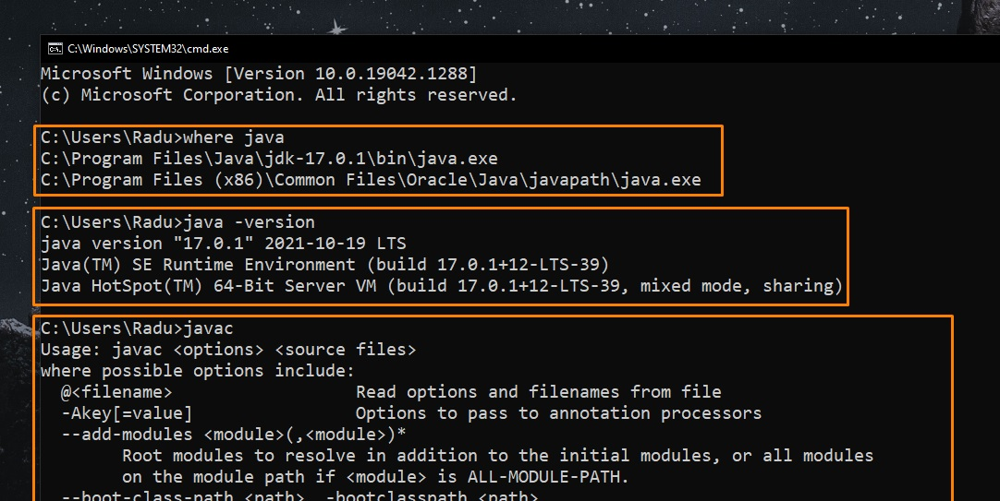

Now we can also run "javac" command.


<br/>

**Eclipse IDE:**

- Install Eclipse IDE from here: https://www.eclipse.org/downloads/ (it will be installed to `C:\Users\your_name\eclipse\java-2021-09\eclipse`)


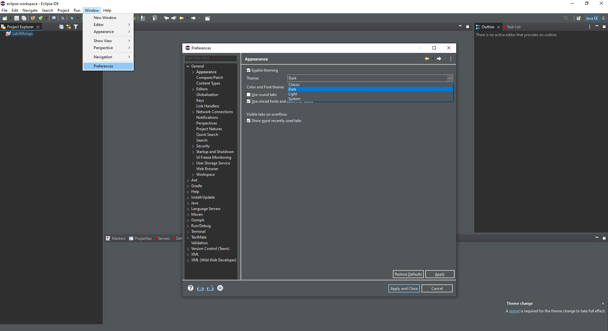

- To create a new Java Project, go to File -> New -> Other -> Java -> Java Project

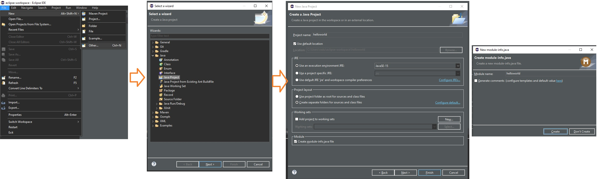

- We can delete the module that is automatically created
- On our new project, right click on "src" (source) folder -> new -> package. The first package (or the main package of the project) should be the same name as the project.

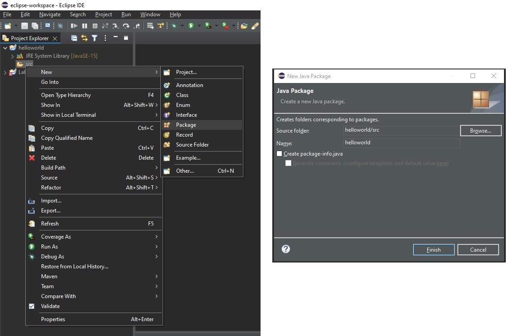

- Inside our package, we right click again -> new -> class -> we can name it "Main" (class names starts with Capital letters)

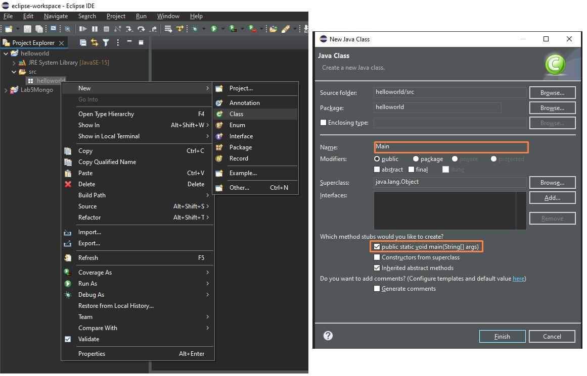

- Write "Hello World" and, to fix "Editor Does Not Contain Main Type" error, follow these steps (Right click on "src" folder):


- Click again on "Run Main" icon and... congrats, you successfully ran your first "Hello World" app in Java.

<br/>

<br/>

**[Enable Autocomplete / content assist in Eclipse](https://stackoverflow.com/questions/6912169/eclipse-enable-autocomplete-content-assist)**

Also see: [No Default Proposals in Eclipse Juno](https://stackoverflow.com/questions/11653448/no-default-proposals-in-eclipse-juno). Solution:

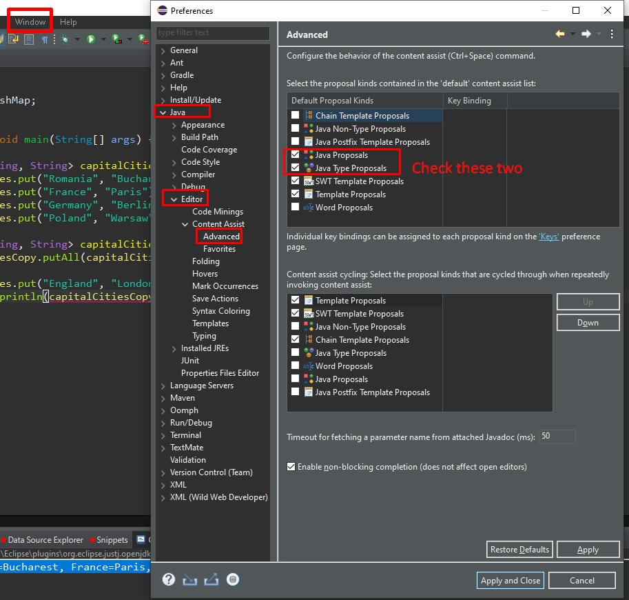

(You could check them all)

<br/>

# Java Syntax / Keywords

## Classes

https://www.w3schools.com/java/java_classes.asp

Everything in Java is associated with classes and objects, along with its attributes and methods. For example: in real life, a car is an object. The car has **attributes**, such as weight and color, and **methods**, such as drive and brake.

A Class is like an object constructor, or a "blueprint" for creating objects.

**Every Java program has a `class` name which must match the filename.**

## Package

https://www.w3schools.com/java/java_packages.asp

A java package is **a group of similar types of classes, interfaces and sub-packages**.

Think of it as **a folder in a file directory**. We use packages to avoid name conflicts, and to write a better maintainable code. Packages are divided into two categories:

- Built-in Packages (packages from the Java API), such as java, lang, awt, javax, swing, net, io, util, sql etc.
- User-defined Packages (create your own packages)

<br/>

To use a class or a package from the library, you need to use the `import` keyword:

```java
import package.name.Class;   // Import a single class
import package.name.*;   // Import the whole package
```

<br/>

**The main Method**

The `main()` method is required and you will see it in every Java program:

```java
public static void main(String[] args) {
  String userName = "Alex";
  System.out.println("Hello " + userName); // Hello Alex

  int x = 1, y = 2, z = 3;
  System.out.println(x + y + z); // 6
}
```

Any code inside the `main()` method will be executed.

## Final keyword

You can add the `final` keyword if you don't want others (or yourself) to overwrite existing values (this will declare the variable as "final" or "constant", which means unchangeable and read-only):

```java
int myNum = 15;
myNum = 20;
System.out.println(myNum); // 20

final int myNumFinal = 15;
myNumFinal = 20;  // will generate an error: cannot assign a value to a final variable

/* The final local variable myNumFinal cannot be assigned. It must be blank and not using a compound assignment */
```

<br/>

**Final keyword for attributes within a Class** (variables)

By default you can override existing values of attributes (obviously) - https://www.w3schools.com/java/java_class_attributes.asp

```java
public class Main {

  int x = 5;

  public static void main(String[] args) {
    Main obj = new Main();
    obj.x = 8;

    System.out.println(obj.x); // 8
  }
}
```

If you don't want the ability to override existing values, declare the attribute as `final`:

```java
public class Main {

  final int x = 5;

  public static void main(String[] args) {
    Main obj = new Main();
    obj.x = 8; // Error: The final field Main.x cannot be assigned

    System.out.println(obj.x);
  }
}
```

<br/>

🔵 Note: From [DigitalOcean: Overriding vs Overloading in Java](https://www.digitalocean.com/community/tutorials/overriding-vs-overloading-in-java) article:

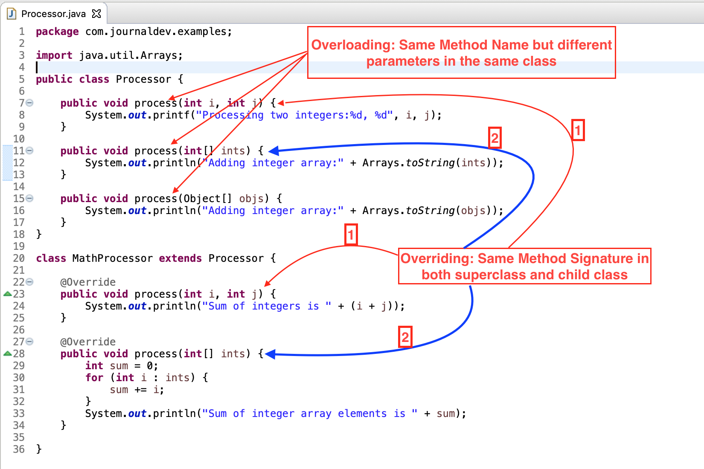

<br/>

**Final keyword for methods within a Class**

Final methods means that these methods cannot be overridden.

<br/>

## Naming Conventions

**Packages**

Packages should be written in all-lowercase ASCII letters, starting with a domain name (eg com, ro, gov, net, org, to, etc)

```
com.sun.eng
com.apple.quicktime.v2
edu.cmu.cs.bovik.cheese
```

<br/>

**Classes**

Class names should be nouns, in mixed case with the first letter of each internal word capitalized.

```
eg. Raster, ImageSprite, Student, Person, Employee
```

<br/>

**Interfaces**

Interface names should be adjectives and capitalized.

```
eg. Storing, RasterDelegate, Runable, Readable, Remote, Printable, BaseMessage
```

<br/>

**Methods**

Methods should be verbs, using camelCase.

```
eg. print(), run(), actionPerformed(), runFast(), getBackground(), draw(), sendMessage(), retryWithDeviceId()
```

<br/>

**Variables**

Variable names should not start with underscore \_ or dollar sign $ characters, even though both are allowed. Variables could use camelCase.

```
eg. id, sumPrice, keyWidth, stockprice
```

<br/>

**Constants**

The names of variables declared class constants and of ANSI constants should be all uppercase with words separated by underscores ("\_").

```
eg. PI, MIN_WIDTH, GET_CPU, MIN_AGE, DENSITY, MAX_PRICE, MAX_PRIORITY
```

<br/>

# Java Data Types and Operators

Source: https://www.w3schools.com/java/java_data_types.asp

## Primitive Data Types

**Primitive Data Types**

| Data Type | Size           | Description                                                                       |
| :-------- | :------------- | :-------------------------------------------------------------------------------- |
| byte      | 1 byte         | Stores whole numbers from -128 to 127                                             |
| short     | 2 bytes        | Stores whole numbers from -32,768 to 32,767                                       |
| int       | 4 bytes        | Stores whole numbers from -2,147,483,648 to 2,147,483,647                         |
| long      | 8 bytes        | Stores whole numbers from -9,223,372,036,854,775,808 to 9,223,372,036,854,775,807 |
| float     | 4 bytes        | Stores fractional numbers. Sufficient for storing 6 to 7 decimal digits           |
| double    | 8 bytes        | Stores fractional numbers. Sufficient for storing 15 decimal digits               |
| boolean   | 1 bit / 1 byte | Stores true or false values                                                       |
| char      | 2 bytes        | Stores a single character/letter or ASCII values                                  |

<br/>

Code Examples:

```java
int myNum = 5;               // Integer (whole number)
float myFloatNum = 5.99f;    // Floating point number
double myDouble = 5.99d;      // Double

char myLetter = 'D';         // Character
String myText = "Hello";     // String

boolean myBool = true;       // Boolean
```

<br/>

```java
double x = 0.2;
float y = .1f;
System.out.println(x + y); // 0.30000000149011613
```

<br/>

```java
System.out.println(0.1 + 0.2); // 0.30000000000000004

System.out.printf("%f", 0.1 + 0.2); // 0.300000
System.out.printf("%.2f", 0.1 + 0.2); // 0.30
```

More about [Floating Point Math](https://0.30000000000000004.com/)

<br/>

**Non-primitive data types**:

| Data Type | Size | Description                                                                                                      |
| :-------- | :--- | :--------------------------------------------------------------------------------------------------------------- |
| String    |      | Store a sequence of characters (text). String values must be surrounded by double quotes. Strings are immutable. |
| Array     |      | Store multiple values in a single variable                                                                       |
| Class     |      |                                                                                                                  |
| Interface |      |                                                                                                                  |

Code Examples:

```java
String[] cars = {"Volvo", "BMW", "Ford", "Mazda"};

// get type of data in cars variable (works only for non-primitive data)
System.out.println(cars.getClass().getName()); // [Ljava.lang.String;
System.out.println(cars.getClass().getSimpleName()); // String[]

// ? Get type of data in cars variable and hashcode (it's not the memory address)
System.out.println(cars); // [Ljava.lang.String;@182decdb

// Loop through Array
for (int i = 0; i < cars.length; i++) {
  System.out.print(cars[i] + " "); // Volvo BMW Ford Mazda
}
```

<br/>

**Java constants**

Java doesn't have built-in constants like PHP. However you can create a "constant" (a `final` variable).

Example:

```java
public class Main {
  public static final int MAX_SECONDS = 25;

  public static void main(String[] args) {
    System.out.println(MAX_SECONDS); // 25
  }
}
```

🟠 Note that Java doesn't have a `const` keyword. (Article [Why the const keyword in Java is not implemented?](https://www.theserverside.com/blog/Coffee-Talk-Java-News-Stories-and-Opinions/Why-the-const-keyword-in-Java-is-not-implemented))

<br/>

## Type Casting

https://www.w3schools.com/java/java_type_casting.asp

- **Widening Casting** (automatically) - converting a smaller type to a larger type size
  `byte` -> `short` -> `char` -> `int` -> `long` -> `float` -> `double`
- **Narrowing Casting** (manually) - converting a larger type to a smaller size type
  `double` -> `float` -> `long` -> `int` -> `char` -> `short` -> `byte`

<br/>

<u>**Widening Casting**</u>

Widening casting is done automatically when passing a smaller size type to a larger size type:

```java
public class Main {
  public static void main(String[] args) {
    int myInt = 9;
    double myDouble = myInt; // Automatic casting: int to double

    System.out.println(myInt);      // Outputs 9
    System.out.println(myDouble);   // Outputs 9.0
  }
}
```

**<u>Narrowing Casting</u>**

Narrowing casting must be done manually by placing the type in parentheses in front of the value:

```java
public class Main {
  public static void main(String[] args) {
    double myDouble = 9.78d;
    int myInt = (int) myDouble; // Manual casting: double to int

    System.out.println(myDouble);   // Outputs 9.78
    System.out.println(myInt);      // Outputs 9
  }
}
```

<br/>

**Convert Integer to String**

https://www.educative.io/edpresso/how-to-convert-an-integer-to-a-string-in-java

```java
int number = 5;
String.valueOf(number);
```

or

```java
int i = 1234;
String str = Integer.toString(i);
```

<br/>

**Convert String to Integer**

https://www.freecodecamp.org/news/java-string-to-int-how-to-convert-a-string-to-an-integer/

1. Use `Integer.parseInt()` to Convert a String to a **primitive type int**.

- If the string does not contain a valid integer then it will throw a NumberFormatException.

```java
String str = "25";
try {
    int number = Integer.parseInt(str);
    System.out.println(number); // output = 25
} catch (NumberFormatException ex){
    ex.printStackTrace();
}
```

1. Use `Integer.valueOf()` to Convert a String to an **Integer Object**.

- From the [Java documentation](<https://docs.oracle.com/javase/7/docs/api/java/lang/Integer.html#valueOf(java.lang.String)>), `Integer.valueOf()` returns an integer object which is equivalent to a `new Integer(Integer.parseInt(s))`
- If the string does not contain a valid integer then it will throw a NumberFormatException.

```java
String str = "25";
try {
    Integer number = Integer.valueOf(str);
    System.out.println(number); // output = 25
} catch (NumberFormatException ex){
    ex.printStackTrace();
}
```

<br/>

## Java Operators

Source: https://www.w3schools.com/java/java_operators.asp

**Java Arithmetic Operators**

| Operator | Name           | Description                      | Example |
| :------- | :------------- | :------------------------------- | :------ |
| +        | Addition       | Adds together two values         | x + y   |
| -        | Subtraction    | Subtracts one value from another | x - y   |
| \*       | Multiplication | Multiplies two values            | x \* y  |
| /        | Division       | Divides one value by another     | x / y   |
| %        | Modulus        | Returns the division remainder   | x % y   |

Increment / Decrement:

| Operator | Name           | Description                         |
| :------- | :------------- | :---------------------------------- |
| ++x      | Pre-increment  | Increments x by one, then returns x |
| x++      | Post-increment | Returns x, then increments x by one |
| --x      | Pre-decrement  | Decrements x by one, then returns x |
| x--      | Post-decrement | Returns x, then decrements x by one |

<br/>

**Assignment operators**

| Operator | Example | Same As    |
| :------- | :------ | :--------- |
| =        | x = 5   | x = 5      |
| +=       | x += 3  | x = x + 3  |
| -=       | x -= 3  | x = x - 3  |
| \*=      | x \*= 3 | x = x \* 3 |
| /=       | x /= 3  | x = x / 3  |
| %=       | x %= 3  | x = x % 3  |
| &=       | x &= 3  | x = x & 3  |
| \|=      | x \|= 3 | x = x \| 3 |
| ^=       | x ^= 3  | x = x ^ 3  |
| >>=      | x >>= 3 | x = x >> 3 |
| <<=      | x <<= 3 | x = x << 3 |

<br/>

**Java Comparison Operators to compare two values**

| Operator | Name                     | Example | Try it                                                                             |
| :------- | :----------------------- | :------ | :--------------------------------------------------------------------------------- |
| ==       | Equal to                 | x == y  | [Try it »](https://www.w3schools.com/java/tryjava.asp?filename=demo_oper_compare1) |
| !=       | Not equal                | x != y  | [Try it »](https://www.w3schools.com/java/tryjava.asp?filename=demo_oper_compare2) |
| >        | Greater than             | x > y   | [Try it »](https://www.w3schools.com/java/tryjava.asp?filename=demo_oper_compare3) |
| <        | Less than                | x < y   | [Try it »](https://www.w3schools.com/java/tryjava.asp?filename=demo_oper_compare4) |
| >=       | Greater than or equal to | x >= y  | [Try it »](https://www.w3schools.com/java/tryjava.asp?filename=demo_oper_compare5) |
| <=       | Less than or equal to    | x <= y  | [Try it »](https://www.w3schools.com/java/tryjava.asp?filename=demo_oper_compare6) |

<br/>

**Java Logical Operators**

| Operator | Name        | Description                                             | Example            | Try it                                                                             |
| :------- | :---------- | :------------------------------------------------------ | :----------------- | :--------------------------------------------------------------------------------- |
| &&       | Logical and | Returns true if both statements are true                | x < 5 && x < 10    | [Try it »](https://www.w3schools.com/java/tryjava.asp?filename=demo_oper_logical1) |
| \|\|     | Logical or  | Returns true if one of the statements is true           | x < 5 \|\| x < 4   | [Try it »](https://www.w3schools.com/java/tryjava.asp?filename=demo_oper_logical2) |
| !        | Logical not | Reverse the result, returns false if the result is true | !(x < 5 && x < 10) | [Try it »](https://www.w3schools.com/java/tryjava.asp?filename=demo_oper_logical3) |

<br/>

## Java Math functions

(Tuesday, November 16, 2021)

**Java `Math.min()` and `Math.max()` functions** (it only accepts two arguments)

```java
public static void main(String[] args) {
  System.out.println(Math.max(5.4, 10)); // prints 10.0
}
```

So you can't really use these functions to retrieve max value in an array of primitive numbers... (https://stackoverflow.com/questions/1484347/finding-the-max-min-value-in-an-array-of-primitives-using-java)

You can use `import java.util.IntSummaryStatistics;` (or double) instead (If execution time is important):

```java
import java.util.DoubleSummaryStatistics;
import java.util.Arrays;

public class Main {
  public static void main(String[] args) {
    double[] numberArr = {2.3, 4.5, 8.94, 4.42, 11.5};

    DoubleSummaryStatistics stat = Arrays.stream(numberArr).summaryStatistics();
    System.out.println(stat.getMin());
    System.out.println(stat.getMax());
  }
}
```

<br/>

**Java `Math.sqrt()`**

```java
System.out.println(Math.sqrt(64)); // 8.0
```

<br/>

**Java `Math.abs(x)`**

```java
System.out.println(Math.abs(-6.4)); // 6.4
```

<br/>

**Java `Math.random()`**

```java
System.out.println(Math.random()); // 0.29364907026149933
System.out.println(Math.random() * 100); // 72.94777492645706

/* Narrow Casting to integer, numbers between 0 and 100 - that's why we multiply by 101 */
System.out.println((int)(Math.random() * 101)); // 41
```

<br/>

**Java `Math.round()`** (returns an Integer)

```java
System.out.println(Math.round(3.49)); // 3
System.out.println(Math.round(3.5)); // 4
```

<br/>

**Java floor and ceil**

```java
System.out.println(Math.floor(3.6)); // 3.0

System.out.println(Math.ceil(3.2)); // 4.0
System.out.println(Math.ceil(3)); // 3.0
```

<br/>

**Java pow**

```java
System.out.println(Math.pow(5, 2)); // 25.0
System.out.println(Math.pow(2, 10)); // 1024.0
```

<br/>

More resources:

- https://www.javatpoint.com/java-math
- https://www.w3schools.com/java/java_ref_math.asp

| Method                                                                              | Description                                                                                                                                          |
| :---------------------------------------------------------------------------------- | :--------------------------------------------------------------------------------------------------------------------------------------------------- |
| [Math.abs()](https://www.javatpoint.com/java-math-abs-method)                       | It will return the Absolute value of the given value.                                                                                                |
| [Math.max()](https://www.javatpoint.com/java-math-max-method)                       | It returns the Largest of two values.                                                                                                                |
| [Math.min()](https://www.javatpoint.com/java-math-min-method)                       | It is used to return the Smallest of two values.                                                                                                     |
| [Math.round()](https://www.javatpoint.com/java-math-round-method)                   | It is used to round of the decimal numbers to the nearest value.                                                                                     |
| [Math.sqrt()](https://www.javatpoint.com/java-math-sqrt-method)                     | It is used to return the square root of a number.                                                                                                    |
| [Math.cbrt()](https://www.javatpoint.com/java-math-cbrt-method)                     | It is used to return the cube root of a number.                                                                                                      |
| [Math.pow()](https://www.javatpoint.com/java-math-pow-method)                       | It returns the value of first argument raised to the power to second argument.                                                                       |
| [Math.signum()](https://www.javatpoint.com/java-math-signum-method)                 | It is used to find the sign of a given value.                                                                                                        |
| [Math.ceil()](https://www.javatpoint.com/java-math-ceil-method)                     | It is used to find the smallest integer value that is greater than or equal to the argument or mathematical integer.                                 |
| [Math.copySign()](https://www.javatpoint.com/java-math-copysign-method)             | It is used to find the Absolute value of first argument along with sign specified in second argument.                                                |
| [Math.nextAfter()](https://www.javatpoint.com/java-math-nextafter-method)           | It is used to return the floating-point number adjacent to the first argument in the direction of the second argument.                               |
| [Math.nextUp()](https://www.javatpoint.com/java-math-nextup-method)                 | It returns the floating-point value adjacent to d in the direction of positive infinity.                                                             |
| [Math.nextDown()](https://www.javatpoint.com/java-math-nextdown-method)             | It returns the floating-point value adjacent to d in the direction of negative infinity.                                                             |
| [Math.floor()](https://www.javatpoint.com/java-math-floor-method)                   | It is used to find the largest integer value which is less than or equal to the argument and is equal to the mathematical integer of a double value. |
| [Math.floorDiv()](https://www.javatpoint.com/java-math-floordiv-method)             | It is used to find the largest integer value that is less than or equal to the algebraic quotient.                                                   |
| [Math.random()](https://www.javatpoint.com/java-math-random-method)                 | It returns a double value with a positive sign, greater than or equal to 0.0 and less than 1.0.                                                      |
| [Math.rint()](https://www.javatpoint.com/java-math-rint-method)                     | It returns the double value that is closest to the given argument and equal to mathematical integer.                                                 |
| [Math.hypot()](https://www.javatpoint.com/java-math-hypot-method)                   | It returns sqrt(x2 +y2) without intermediate overflow or underflow.                                                                                  |
| [Math.ulp()](https://www.javatpoint.com/java-math-ulp-method)                       | It returns the size of an ulp of the argument.                                                                                                       |
| [Math.getExponent()](https://www.javatpoint.com/java-math-getexponent-method)       | It is used to return the unbiased exponent used in the representation of a value.                                                                    |
| [Math.IEEEremainder()](https://www.javatpoint.com/java-math-ieeeremainder-method)   | It is used to calculate the remainder operation on two arguments as prescribed by the IEEE 754 standard and returns value.                           |
| [Math.addExact()](https://www.javatpoint.com/java-math-addexact-method)             | It is used to return the sum of its arguments, throwing an exception if the result overflows an int or long.                                         |
| [Math.subtractExact()](https://www.javatpoint.com/java-math-subtractexact-method)   | It returns the difference of the arguments, throwing an exception if the result overflows an int.                                                    |
| [Math.multiplyExact()](https://www.javatpoint.com/java-math-multiplyexact-method)   | It is used to return the product of the arguments, throwing an exception if the result overflows an int or long.                                     |
| [Math.incrementExact()](https://www.javatpoint.com/java-math-incrementexact-method) | It returns the argument incremented by one, throwing an exception if the result overflows an int.                                                    |
| [Math.decrementExact()](https://www.javatpoint.com/java-math-decrementexact-method) | It is used to return the argument decremented by one, throwing an exception if the result overflows an int or long.                                  |
| [Math.negateExact()](https://www.javatpoint.com/java-math-negateexact-method)       | It is used to return the negation of the argument, throwing an exception if the result overflows an int or long.                                     |
| [Math.toIntExact()](https://www.javatpoint.com/java-math-tointexact-method)         | It returns the value of the long argument, throwing an exception if the value overflows an int.                                                      |

<br/>

**Angular Math Methods**

| Method                                                                  | Description                                                                                |
| :---------------------------------------------------------------------- | :----------------------------------------------------------------------------------------- |
| [Math.toDegrees](https://www.javatpoint.com/java-math-todegrees-method) | It is used to convert the specified Radians angle to equivalent angle measured in Degrees. |
| [Math.toRadians](https://www.javatpoint.com/java-math-toradians-method) | It is used to convert the specified Degrees angle to equivalent angle measured in Radians. |

<br/>

<br/>

# Java User Input and Scanners

https://www.w3schools.com/java/java_user_input.asp

```java
Scanner scannerObj = new Scanner(System.in);
```

<br/>

The `Scanner` class is used to get user input, and it is found in the `java.util` package.

```java
import java.util.Scanner;

public class Main {

  public static void main(String[] args) {
    Scanner scannerObj = new Scanner(System.in);
    System.out.print("Enter username: ");

    String userName = scannerObj.nextLine();
    System.out.println("Username: " + userName);
  }
}

// Enter username: Daniel
// Username: Daniel
```

The `nextLine()` method is used to read Strings.

To read other types, look at the table below (methods for the Scanner object):

| Method          | Description                           |
| :-------------- | :------------------------------------ |
| `nextBoolean()` | Reads a `boolean` value from the user |
| `nextByte()`    | Reads a `byte` value from the user    |
| `nextDouble()`  | Reads a `double` value from the user  |
| `nextFloat()`   | Reads a `float` value from the user   |
| `nextInt()`     | Reads a `int` value from the user     |
| `nextLine()`    | Reads a `String` value from the user  |
| `nextLong()`    | Reads a `long` value from the user    |
| `nextShort()`   | Reads a `short` value from the user   |

<br/>

Another example

```java
import java.util.Scanner;

class Main {
  public static void main(String[] args) {
    Scanner scannerObj = new Scanner(System.in);
    System.out.println("Enter name, age and salary:");

    String name = scannerObj.nextLine();
    int age = scannerObj.nextInt();
    double salary = scannerObj.nextDouble();


    System.out.println("Name: " + name);
    System.out.println("Age: " + age);
    System.out.println("Salary: " + salary);
  }
}
/*
Enter name, age and salary:
Alex
24
999.99
Name: Alex
Age: 24
Salary: 999.99
*/
```

<br/>

🟠 **Note**

However, if we don't want to have any errors if the user is inserting the wrong type of data (double instead of int, etc)... We should always read as strings as input (using `next` or `nextLine`), then _parse_ the string in the type of data that we want.

```java
class Main {
  public static void main(String[] args) {
    Scanner scannerObj = new Scanner(System.in);
    System.out.println("Enter name, age and salary:");

    String name = scannerObj.next();
    int age = Integer.parseInt(scannerObj.next());
    double salary = Double.parseDouble(scannerObj.next());

    System.out.println("Name: " + name);
    System.out.println("Age: " + age);
    System.out.println("Salary: " + salary);
  }
}
/*
Enter name, age and salary:
Alex 24 998.97
Name: Alex
Age: 24
Salary: 998.97
*/
```

We will still need to check (if else) or throw/catch errors.

<br/>

<br/>

Another example:

```java
import java.util.Arrays;
import java.util.Scanner;

class Main {
  public static void main(String[] args) {

    Scanner scannerObj = new Scanner(System.in);
    String[] names = new String[4];

    for (int idx = 0; idx < names.length; idx++) {
      System.out.println("Input: ");
      names[idx] = scannerObj.nextLine();
    }

    System.out.println(Arrays.toString(names));
  }
}
/*
Input: Bob
Input: Alice
Input: Alex
Input: Joe
[Bob, Alice, Alex, Joe]
*/
```

<br/>

<br/>

# Java Strings and String Methods

```java
String greeting = "Hello";
```

You can only use double quotes to define a String,

<br/>

**Length and concatenation**

A String in Java is actually an object, which contain methods that can perform certain operations on strings. For example, the length of a string can be found with the `length()` method:

```java
String txt = "ABCDEFGHIJKLMNOPQRSTUVWXYZ";
System.out.println("Length of txt: " + txt.length()); // Length of txt: 26
```

```java
String firstName = "John";
String lastName = "Doe";
System.out.println(firstName + " " + lastName); // Jodn Doe

System.out.println(10 + "22"); // 1022
```

Note that the result between number and String is a concatenated String

<br/>

**`trim()` - Removes whitespace from both sides of a string**

```java
System.out.println("   Hello there!   ".trim()); // Hello there!
```

<br/>

**Uppercase and Lowercase**

```java
String txt = "Hello World";
System.out.println(txt.toUpperCase());   // Outputs "HELLO WORLD"
System.out.println(txt.toLowerCase());   // Outputs "hello world"
```

<br/>

**Compare two strings**

```java
System.out.println("hello" == "hello"); // true
System.out.println("hello".equals("hello")); // true
```

<br/>

**Split a string into an array of substrings**

```java
import java.util.Arrays;

public class Main {
  public static void main(String[] args) {
    System.out.println(Arrays.toString("hello world. all good".split("\\s+"))); // split by space
  }
}
// [hello, world., all, good]
```

<br/>

**Count words in a String (using split and regex)**

```java
System.out.println("hello world, all good".split("\\s+").length); // 4
```

<br/>

**Reverse a String using StringBuilder (added in Java 5, for earlier versions you can use StringBuffer)**

`StringBuilder` is built-in, no need for import

```java
public static void main(String[] args) {
  String greeting = new StringBuilder("Hello").reverse().toString();
  System.out.println(greeting); // olleH
}
```

A String is immutable in Java, while a `StringBuilder` is mutable in Java. An immutable object is an object whose content cannot be changed after it is created. See more differences between String and `StringBuilder` here: https://www.techiedelight.com/difference-between-string-stringbuilder-java/

<br/>

**Escape characters**

```java
System.out.println("It\'s ok"); // It's ok
System.out.println("It's ok"); // It's ok

System.out.println("They are so called \"AI\""); // They are so called "AI"
```

| Code | Result          |
| :--- | :-------------- |
| \n   | New Line        |
| \r   | Carriage Return |
| \t   | Tab             |
| \b   | Backspace       |

<br/>

**`replace()` searches a string for a specified value, and returns a new string where all the specified values are replaced**

`replaceFirst()` replaces the first occurrence of a substring that matches the given regular expression with the given replacement

```java
String myStr = "Hello";
System.out.println(myStr.replace('l', 'p')); // Heppo

String myStr = "Hello Hello World";
System.out.println(myStr.replaceFirst("Hello", "Hi"));
```

Note that `replace()` also accepts `chars` as arguments (written in single quotes), while `replaceFirst` accepts only Strings (written in double quotes)

<br/>

**`substring()` returns a new string which is the substring of a specified string**

```java
System.out.println("hello".substring(0)); // hello
System.out.println("hello".substring(2)); // llo

System.out.println("hello".substring(-1)); // ERROR: java.lang.StringIndexOutOfBoundsException: begin -1, end 5, length 5
```

<br/>

**Strings are immutable and can't be accessed by index**

```java
String myStr = "Hello";
System.out.println(myStr[0]); // ERROR: The type of the expression must be an array type but it resolved to String
```

(In other languages like PHP, strings are mutable - content can be changed without creating a new object - and can be accessed)

<br/>

**`charAt()` Returns the character at the specified index (position)**

```java
// public char charAt(int index)
System.out.println("hey".charAt(1)); // e
System.out.println("hey".charAt(2)); // y
```

<br/>

**`indexOf()` Returns the position of the first found occurrence of specified characters in a string**

The `lastIndexOf()` method returns the position of the last occurrence of specified character(s) in a string.

```java
System.out.println("hey there".indexOf("there")); // 4
System.out.println("hey there there".lastIndexOf("there")); // 10
```

<br/>

**`format()` Returns a formatted string using the specified locale, format string, and arguments**

```java
System.out.println(String.format("Hello %s, how are you today?"), userName);
```

```java
const methodName = "parsePopInformationData()";
System.out.println(String.format("%s for user %s with userId %d"), methodName, userName, userId);
```

<br/>

[All Java Strings Methods - w3schools](https://www.w3schools.com/java/java_ref_string.asp)

| Method                                                                                     | Description                                                                                                          | Return Type  |
| :----------------------------------------------------------------------------------------- | :------------------------------------------------------------------------------------------------------------------- | :----------- |
| [charAt()](https://www.w3schools.com/java/ref_string_charat.asp)                           | Returns the character at the specified index (position)                                                              | char         |
| [codePointAt()](https://www.w3schools.com/java/ref_string_codepointat.asp)                 | Returns the Unicode of the character at the specified index                                                          | int          |
| [codePointBefore()](https://www.w3schools.com/java/ref_string_codepointbefore.asp)         | Returns the Unicode of the character before the specified index                                                      | int          |
| [codePointCount()](https://www.w3schools.com/java/ref_string_codepointcount.asp)           | Returns the number of Unicode values found in a string.                                                              | int          |
| [compareTo()](https://www.w3schools.com/java/ref_string_compareto.asp)                     | Compares two strings lexicographically                                                                               | int          |
| [compareToIgnoreCase()](https://www.w3schools.com/java/ref_string_comparetoignorecase.asp) | Compares two strings lexicographically, ignoring case differences                                                    | int          |
| [concat()](https://www.w3schools.com/java/ref_string_concat.asp)                           | Appends a string to the end of another string                                                                        | String       |
| [contains()](https://www.w3schools.com/java/ref_string_contains.asp)                       | Checks whether a string contains a sequence of characters                                                            | boolean      |
| [contentEquals()](https://www.w3schools.com/java/ref_string_contentequals.asp)             | Checks whether a string contains the exact same sequence of characters of the specified CharSequence or StringBuffer | boolean      |
| [copyValueOf()](https://www.w3schools.com/java/ref_string_copyvalueof.asp)                 | Returns a String that represents the characters of the character array                                               | String       |
| [endsWith()](https://www.w3schools.com/java/ref_string_endswith.asp)                       | Checks whether a string ends with the specified character(s)                                                         | boolean      |
| [equals()](https://www.w3schools.com/java/ref_string_equals.asp)                           | Compares two strings. Returns true if the strings are equal, and false if not                                        | boolean      |
| [equalsIgnoreCase()](https://www.w3schools.com/java/ref_string_equalsignorecase.asp)       | Compares two strings, ignoring case considerations                                                                   | boolean      |
| format()                                                                                   | Returns a formatted string using the specified locale, format string, and arguments                                  | String       |
| getBytes()                                                                                 | Encodes this String into a sequence of bytes using the named charset, storing the result into a new byte array       | byte[]       |
| getChars()                                                                                 | Copies characters from a string to an array of chars                                                                 | void         |
| [hashCode()](https://www.w3schools.com/java/ref_string_hashcode.asp)                       | Returns the hash code of a string                                                                                    | int          |
| [indexOf()](https://www.w3schools.com/java/ref_string_indexof.asp)                         | Returns the position of the first found occurrence of specified characters in a string                               | int          |
| intern()                                                                                   | Returns the canonical representation for the string object                                                           | String       |
| [isEmpty()](https://www.w3schools.com/java/ref_string_isempty.asp)                         | Checks whether a string is empty or not                                                                              | boolean      |
| [lastIndexOf()](https://www.w3schools.com/java/ref_string_lastindexof.asp)                 | Returns the position of the last found occurrence of specified characters in a string                                | int          |
| [length()](https://www.w3schools.com/java/ref_string_length.asp)                           | Returns the length of a specified string                                                                             | int          |
| matches()                                                                                  | Searches a string for a match against a regular expression, and returns the matches                                  | boolean      |
| offsetByCodePoints()                                                                       | Returns the index within this String that is offset from the given index by codePointOffset code points              | int          |
| regionMatches()                                                                            | Tests if two string regions are equal                                                                                | boolean      |
| [replace()](https://www.w3schools.com/java/ref_string_replace.asp)                         | Searches a string for a specified value, and returns a new string where the specified values are replaced            | String       |
| replaceFirst()                                                                             | Replaces the first occurrence of a substring that matches the given regular expression with the given replacement    | String       |
| replaceAll()                                                                               | Replaces each substring of this string that matches the given regular expression with the given replacement          | String       |
| split()                                                                                    | Splits a string into an array of substrings                                                                          | String[]     |
| [startsWith()](https://www.w3schools.com/java/ref_string_startswith.asp)                   | Checks whether a string starts with specified characters                                                             | boolean      |
| subSequence()                                                                              | Returns a new character sequence that is a subsequence of this sequence                                              | CharSequence |
| substring()                                                                                | Returns a new string which is the substring of a specified string                                                    | String       |
| toCharArray()                                                                              | Converts this string to a new character array                                                                        | char[]       |
| [toLowerCase()](https://www.w3schools.com/java/ref_string_tolowercase.asp)                 | Converts a string to lower case letters                                                                              | String       |
| toString()                                                                                 | Returns the value of a String object                                                                                 | String       |
| [toUpperCase()](https://www.w3schools.com/java/ref_string_touppercase.asp)                 | Converts a string to upper case letters                                                                              | String       |
| [trim()](https://www.w3schools.com/java/ref_string_trim.asp)                               | Removes whitespace from both ends of a string                                                                        | String       |
| valueOf()                                                                                  | Returns the string representation of the specified value                                                             | String       |

<br/>

<br/>

# Java Built-in default Arrays

https://www.w3schools.com/java/java_arrays.asp

```java
String[] cars = {"Volvo", "BMW", "Ford", "Mazda"};
int[] myNums = {10, 20, 30, 40};
```

**Access the Elements of an Array**

```java
String[] cars = {"Volvo", "BMW", "Ford", "Mazda"};
System.out.println(cars[0]);
// Outputs Volvo
```

**Change an Array Element**

```java
String[] cars = {"Volvo", "BMW", "Ford", "Mazda"};
cars[0] = "Opel";
System.out.println(cars[0]);
// Now outputs Opel instead of Volvo
```

**Array Length**

```java
String[] cars = {"Volvo", "BMW", "Ford", "Mazda"};
System.out.println(cars.length);
// Outputs 4
```

**Loop Through an Array**

```java
String[] cars = {"Volvo", "BMW", "Ford", "Mazda"};
for (int i = 0; i < cars.length; i++) {
  System.out.printf("%s ", cars[i]);
}
// Volvo BMW Ford Mazda
```

**Loop Through an Array with For-Each**

```java
String[] cars = {"Volvo", "BMW", "Ford", "Mazda", "Renault"};
for (String car : cars) {
  System.out.printf("%s ".toUpperCase(), car);
}
// VOLVO BMW FORD MAZDA RENAULT
```

**Multidimensional Arrays**

A multidimensional array is an array of arrays.

```java
int[][] myNumbers = { {1, 2, 3, 4}, {5, 6, 7} };
System.out.println(myNumbers[1][2]); // Outputs 7
```

```java
int[][] myNumbers = { {1, 2, 3, 4}, {5, 6, 7} };
for (int i = 0; i < myNumbers.length; ++i) {
  for(int j = 0; j < myNumbers[i].length; ++j) {
    System.out.print(myNumbers[i][j]);
  }
}
// 1234567
```

<br/>

## Array Methods

https://www.programcreek.com/2013/09/top-10-methods-for-java-arrays/

<br/>

**Sort array in-place (mutates the array)**

```java
import java.util.Arrays;

public class Main {
  public static void main(String[] args) {

    int arr[] = {32, -76, 34, 12, 3, 37, 54, 21, 49};
    Arrays.sort(arr);

    System.out.println(Arrays.toString(arr)); // [-76, 3, 12, 21, 32, 34, 37, 49, 54]
  }
}
```

<br/>

<br/>

<br/>

# Java Conditions and Loops

(Tuesday, November 16, 2021, 22:31)

## Java Conditions

**if.. else if.. else**

```java
import java.time.LocalDateTime; // needs Java 8

public class Main {
  public static void main(String[] args) {

    int hour = LocalDateTime.now().getHour();

    if (hour >= 5 && hour < 12) {
      System.out.println("Good morning");
    } else if (hour < 18) {
      System.out.println("Good afternoon");
    } else {
      System.out.println("Good evening");
    }

    System.out.println(hour);
  }
}
// Good evening
// 22
```

Another example:

```java
int age = 14;
if (age < 18) System.out.println("Not allowed"); // Not allowed
```

<br/>

**Short Hand If...Else (Ternary Operator)**

```java
int time = 20;
String result = (time < 18) ? "Good day." : "Good evening.";
System.out.println(result);
```

<br/>

**Java Switch Case**

```java
import java.util.Calendar;

public class Main {
  public static String getCurrentDayName() {
    Calendar calendar = Calendar.getInstance();
    int day = calendar.get(Calendar.DAY_OF_WEEK);
    String dayName = "";

    switch (day) {
      case 1:
        dayName = "Sunday";
        break;
      case 2:
        dayName = "Monday";
        break;
      case 3:
        dayName = "Tuesday";
        break;
      case 4:
        dayName = "Wednesday";
        break;
      case 5:
        dayName = "Thursday";
        break;
      case 6:
        dayName = "Friday";
        break;
      case 7:
        dayName = "Saturday";
        break;
    }
    return dayName;
  }

  public static void main(String[] args) {
    System.out.println(getCurrentDayName());
  }
}
// Tuesday
```

Note that `calendar.get(Calendar.DAY_OF_WEEK)` returns an integer from 1 to 7, where 1 is Sunday and 7 is Saturday

Note: on this particular example we could have returned the string directly, without needing to include break on each case. Like this:

```java
public static String getCurrentDayName() {
  Calendar calendar = Calendar.getInstance();
  int day = calendar.get(Calendar.DAY_OF_WEEK);

  switch (day) {
    case 1:
      return "Sunday";
    case 2:
      return "Monday";
    case 3:
      return "Tuesday";
    case 4:
      return "Wednesday";
    case 5:
      return "Thursday";
    case 6:
      return "Friday";
    case 7:
      return "Saturday";
  }
  return "";
}
```

Or instead of using switch case, we could just use a simple String "array":

```java
import java.util.Calendar;

public class Main {
  public static String getCurrentDayName() {
    Calendar calendar = Calendar.getInstance();
    int day = calendar.get(Calendar.DAY_OF_WEEK); // returns int from 1 to 7

    String dayNames[] = {"Sunday", "Monday", "Tuesday", "Wednesday", "Thursday", "Friday", "Saturday"};
    return dayNames[day - 1];
  }

  public static void main(String[] args) {
    System.out.println(getCurrentDayName());
  }
}
// Tuesday
```

<br/>

## Java Loops

Java has 3-4 types of loops: `while`, `do..while`, `for` and "for-each".


<br/>

**`while` loop**

```java
int i = 0;
while (i < 5) {
  System.out.print(i);
  i++;
}
// 01234
```

<br/>

Another example using `break`:

```java
int i = 0;
while (i < 100) {
  if( i == 8) {
    break;
  }
  System.out.print(i);
  i++;
}
// 01234567
```

You have already seen the `break` statement used in an earlier chapter of this tutorial. It was used to "jump out" of a `switch` statement.

The `break` statement can also be used to jump out of a **loop**.

The `continue` statement breaks one iteration (in the loop), if a specified condition occurs, and continues with the next iteration in the loop.

This example skips the value of 4:

```java
for (int i = 0; i < 6; i++) {
  if (i == 4) {
    continue;
  }
  System.out.printf("%d ", i);
}
// 0 1 2 3 5
```

<br/>

Another example:

```java
String myStr = "";
String[] cars = {"BMW", "Volvo", "Dacia", "Ford"};

int idx = 0;
while (idx < cars.length) {
  myStr += cars[idx] + " ";
  idx += 1;
}
System.out.println(myStr);
// BMW Volvo Dacia Ford
```

<br/>

**`do while` loop**

```java
int i = 0;do {
  System.out.println(i);
  i++;
}
while (i < 5);

// 01234
```

The `do/while` loop is a variant of the `while` loop. This loop will execute the code block once, before checking if the condition is true, then it will repeat the loop as long as the condition is true

<br/>

**`for` loops**

```java
for (int i = 0; i <= 10; i = i + 2) {
  System.out.print(i);
}
// 0246810
```

Another examples:

```java
String[] cars = {"Volvo", "BMW", "Ford", "Mazda"};

for (int i = 0; i < cars.length; i++) {
  System.out.printf("%s ", cars[i]);
}
// Volvo BMW Ford Mazda
```

> Note you can use `printf` (print format) in Java and C/C++ (as an alternative to _Template Literals in JavaScript_ or _f-strings in Python_)

<br/>

### for each loops

There is also a "**for-each**" loop, which is used exclusively to loop through elements in an **array**:

```java
String[] cars = {"Volvo", "BMW", "Ford", "Mazda"};
for (String carName : cars) {
  System.out.printf("%s ", carName);
}
// Volvo BMW Ford Mazda
```

<br/>

More on For-each loop in Java here: https://www.geeksforgeeks.org/for-each-loop-in-java/

```java
for (type var : array) 		{
  // statements using var;
}

/* is equivalent to: */

for (int i = 0; i < arr.length; i++) {
  type var = arr[i];
  // statements using var;
}
```

<br/>

Another example:

```java
int[] nums = {9, 10, 11, 12};
int sum = 0;

for (int num : nums) {
  sum += num;
}
System.out.println(sum); // 42
```

<br/>

<br/>

# Java Functions / Methods

A **method** is a block of code which only runs when it is called, also known as **functions**.

```java
static double fahrenheitToCelsius(double fahrenheit) {
  return (5.0/9.0) * (fahrenheit - 32);
}

static double celsiusToFahrenheit(double celsius) {
  return celsius * 9.0 / 5.0 + 32;
}

public static void main(String[] args) {
  System.out.println(fahrenheitToCelsius(80)); // 26.666666666666668
  System.out.println(celsiusToFahrenheit(26.6)); // 79.88
}
```

Note that when dividing 5/9 the result is 0.0. You need to specify those constants as 5.0/9.0 to make them double and be equal to 0.555(5).

Note that:

- `static` means that the method belongs to the Main class and not an object of the Main class.
- the first `double` is the returned type

<br/>

**Method Overloading**

With **method overloading**, multiple methods can have the same name with different parameters. (https://www.w3schools.com/java/java_methods_overloading.asp)

```csharp
int myMethod(int x)
float myMethod(float x)
double myMethod(double x, double y)
```

Example:

```java
static int plusMethod(int x, int y) {
  return x + y;
}

static double plusMethod(double x, double y) {
  return x + y;
}

public static void main(String[] args) {
  int myNum1 = plusMethod(8, 5);
  double myNum2 = plusMethod(4.3, 6.26);
  System.out.println("int: " + myNum1);
  System.out.println("double: " + myNum2);
}
// int: 13
// double: 10.559999999999999
```

<br/>

<br/>

However, all the above examples are functions written in Java `Main` Class.

A better approach would be to write (and group) all our functions within Interfaces, as `public` (interfaces have public methods by default) and `static` methods , so we can access them everywhere. For example, we can write useful functions within a `CustomMath` interface, or useful functions in a `ImageProcessing` interface, or functions specific to a custom `DatabaseMethods` interface, etc...

<br/>


<br/>

## Lambda functions

<br/>

<br/>

# Java OOP

Resources on OOP from w3schols:

- [Java - What is OOP?](https://www.w3schools.com/java/java_oop.asp)
- [Java Classes and Objects](https://www.w3schools.com/java/java_classes.asp)
- [Java Class Attributes](https://www.w3schools.com/java/java_class_attributes.asp)
- [Java Class Methods](https://www.w3schools.com/java/java_class_methods.asp)
- [Java Constructors](https://www.w3schools.com/java/java_constructors.asp)
- [Java Modifiers](https://www.w3schools.com/java/java_modifiers.asp)
- [Java Encapsulation](https://www.w3schools.com/java/java_encapsulation.asp)
- [Java Inheritance](https://www.w3schools.com/java/java_inheritance.asp)
- [Java Polymorphism](https://www.w3schools.com/java/java_polymorphism.asp)
- [Java Inner Classes](https://www.w3schools.com/java/java_inner_classes.asp)
- [Java Abstraction](https://www.w3schools.com/java/java_abstract.asp)
- [Java Interface](https://www.w3schools.com/java/java_interface.asp)

<br/>

In Java, you can create an object (instance of a class) within the class itself (eg. **Main**):

```java
public class Main {

  int x = 5;

  public static void main(String[] args) {

    Main obj = new Main();
    System.out.println(obj.x); // 5
  }
}
```

<br/>

**Using multiple classes (in different files)**

We can have multiple classes (classes separated in .java files). If the classes are within the same package, there's no need to import them while creating objects in the Main Class.

```java
// package helloworld -> Person.java
package helloworld;

public class Person {
  int age = 0;
}
```

```java
// package helloword -> Main.java
package helloworld;

public class Main {

  public static void main(String[] args) {

    Person Donna = new Person();
    Donna.age = 25;

    System.out.println(Donna.age); // 25
  }
}
```

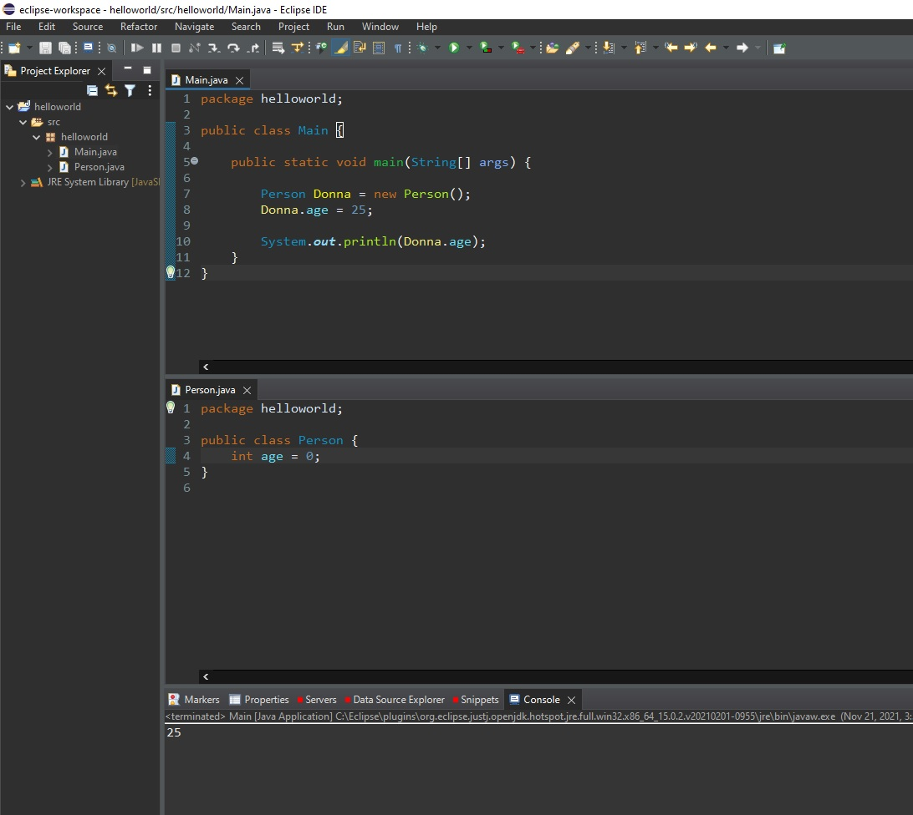

Note that public classes must be defined in their own .java files (with the filename matching the class).

<br/>

You can also import classes from other packages:

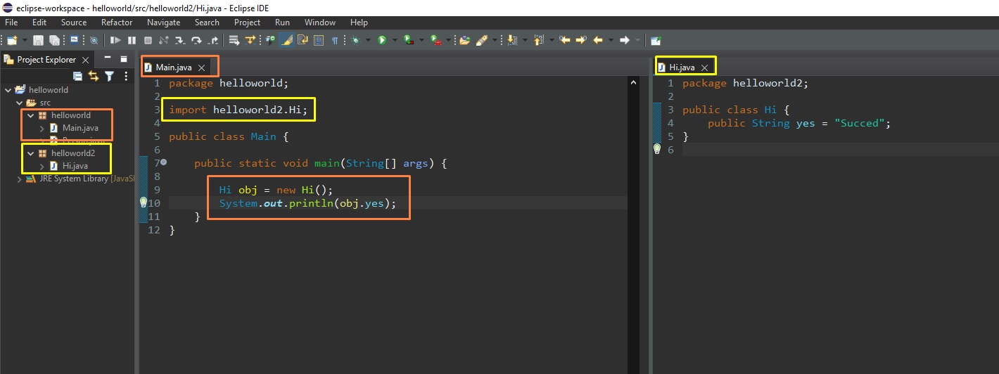

<br/>

## Static vs non-static (public) methods

https://www.w3schools.com/java/java_class_methods.asp

You will often see Java programs that have either `static` or `public` attributes and methods:

- `static` method means that it can be accessed without creating an object of the class (the static methods can be used within the Class itself), unlike `public` methods
- `public` methods can be only accessed by objects (instances) of that Class
- both `public static` means that the method can be accessed within its Class and/or accessed by objects in its Class.

Example within/using the **Main Class**

```java
public class Main {

  static void staticMethod() {
    System.out.println("Static methods can be called without creating objects");
  }
  public void publicMethod() {
    System.out.println("Public methods must be called by creating objects");
  }
  public static void publicStaticMethod() {
    System.out.println("Public static method can be called anywhere by anyone");
  }

  public static void main(String[] args) {

    staticMethod(); // prints Static methods can be called without creating objects

    Main obj = new Main();
    obj.publicMethod(); // prints Public methods must be called by creating objects

    publicStaticMethod(); // prints Public static method can be called anywhere by anyone
    obj.publicStaticMethod(); /* prints Public static method can be called anywhere by anyone
    -- although for this one we get warning:
    The static method publicStaticMethod() from the type Main should be accessed in a static way */
  }
}
```

<br/>

## Constructors

https://www.w3schools.com/java/java_constructors.asp

A constructor in Java is a **special method** that is used to initialize objects. The constructor is called when an object of a class is created. It can be used to set initial values for object attributes:

🟢 Note that the constructor name must **match the class name**, and it cannot have a **return type** (like `void`). The constructor is called when the object is created.

> In other languages, the constructor is created with different keywords (eg. `__init__(args)` in Python, or `__construct($args)` in PHP)

🟢 All classes have constructors by default: if you do not create a class constructor yourself, Java creates one for you. However, then you are not able to set initial values for object attributes.

```java
// Person.java
public class Person {

  private String name;
  private String surname;
  private String email;
  private int age;
  private double credits;

  public Person() {
    this.name = "";
    this.surname = "";
    this.email = "";
    this.credits = 0.0;
  }

  public Person(String name, String surname, String email) {
    this.name = name;
    this.surname = surname;
    this.email = email;
    this.credits = 0.0;
  }
}
```

Note: we can overeload constructors (by using different parameters), and we can access the properties (variables) within the class using `this` keyword _(just to be more specific, mandatory only when we have the same variable names as the Class properties used as parameters in constructors --- in other words, we use this keyword when the constructor parameters/variables have the same variable names as the Class properties/variables)_.

<br/>

<br/>

## Modifiers

https://www.w3schools.com/java/java_modifiers.asp

### Access modifiers

- **Access Modifiers** - controls the access level

For **classes**, you can use either `public` or _default_:

| Modifier  | Description                                                                                                      |
| :-------- | :--------------------------------------------------------------------------------------------------------------- |
| `public`  | The class is accessible by any other class                                                                       |
| _default_ | **The class is only accessible by classes in the same package**. This is used when you don't specify a modifier. |

<br/>

For **attributes, methods and constructors**, you can use the one of the following:

| Modifier    | Description                                                                                                                                                                                                                                                                                    |
| :---------- | :--------------------------------------------------------------------------------------------------------------------------------------------------------------------------------------------------------------------------------------------------------------------------------------------- |
| `public`    | The code is accessible for all classes                                                                                                                                                                                                                                                         |
| `private`   | The code is only accessible within the declared class                                                                                                                                                                                                                                          |
| _default_   | The code is only accessible in the same package. This is used when you don't specify a modifier. **(The _default_ modifier is like a _protected_ modifier, you can access/call the attributes/method of a Class in another derived Class, but only if they are situated in the same package)** |
| `protected` | The code is accessible in the same package and **subclasses** (classes inherited from that class).                                                                                                                                                                                             |

<br/>

### Non-access modifiers

- **Non-Access Modifiers** - do not control access level, but provides other functionality

For **classes**, you can use either `final` or `abstract`:

| Modifier   | Description                                                                                                              | Try it on w3schols                                                                                                    |
| :--------- | :----------------------------------------------------------------------------------------------------------------------- | :-------------------------------------------------------------------------------------------------------------------- |
| `final`    | The class cannot be inherited by other classes                                                                           | [Try it »](https://www.w3schools.com/java/tryjava.asp?filename=demo_inherit_final)                                    |
| `abstract` | The class cannot be used to create objects (Also, to access an abstract class, it must be inherited from another class). | [Try it »](https://www.w3schools.com/java/tryjava_multi.asp?filename=demo_mod_abstract&multi=demo_mod_abstract_multi) |

So, for example, if you create an abstract Class `public abstract class Person`, you cannot instantiate/create objects `Person` from this class anymore (you can't write `Person personObj = new Person()`, it will return error).

And, if you want to use (the properties/methods) this new abstract class Person, you must create another class (ex `Student`/`Teacher`/`Employee` class) that inherits all properties/methods from the abstract class `Person`.

<br/>

For **attributes and methods**, you can use the one of the following:

| Modifier       | Description                                                                                                                                                                                           |
| :------------- | :---------------------------------------------------------------------------------------------------------------------------------------------------------------------------------------------------- |
| `final`        | Attributes and methods cannot be overridden/modified (eg. constant values for attributes)                                                                                                             |
| `static`       | Attributes and methods belongs to the class, and cannot be accessed through an object of that class                                                                                                   |
| `abstract`     | Can only be used in an abstract class, and can only be used on methods. The method does not have a body, for example **abstract void run();**. The body is provided by the subclass (inherited from). |
| `transient`    | Attributes and methods are skipped when serializing the object containing them                                                                                                                        |
| `synchronized` | Methods can only be accessed by one thread at a time                                                                                                                                                  |
| `volatile`     | The value of an attribute is not cached thread-locally, and is always read from the "main memory"                                                                                                     |

<br/>

## Encapsulation

https://www.w3schools.com/java/java_encapsulation.asp

The meaning of **Encapsulation**, is to make sure that "sensitive" data is hidden from users. To achieve this, you must:

- declare class variables/attributes as `private`
- provide public **get** and **set** methods to access and update the value of a `private` variable

Benefits:

- Better control of class attributes and methods
- Class attributes can be made **read-only** (if you only use the `get` method), or **write-only** (if you only use the `set` method)
- Flexible: the programmer can change one part of the code without affecting other parts
- Increased security of data

<br/>

## Inheritance

https://www.w3schools.com/java/java_inheritance.asp

- **subclass** (child) - the class that inherits from another class
- **superclass** (parent) - the class being inherited from

To inherit from a class, use the `extends` keyword.

```java
// User.java
public class User {

  protected String name;
  protected String family_name;
  protected String email;

  public User() {
    this.name = "";
    this.family_name = "";
    this.email = "";
  }
  public User(String name, String family_name, String email) {
    this.name = name;
    this.family_name = family_name;
    this.email = email;
  }

  public String toString() {
    /* Override toString - Return a String representation when printing the object directly */
    return "[fullname: " + this.name + " " + this.family_name + ", email: " + this.email + "]";
  }
}
```

```java
// Author.java
import java.util.ArrayList;

public class Author extends User {

  private ArrayList<String> articlesWritten;

  public Author(String name, String family_name, String email, ArrayList<String> articlesWritten) {
    super(name, family_name, email);
    this.articlesWritten = articlesWritten;
  }

  public ArrayList<String> getArticlesWritten() {
    return this.articlesWritten;
  }
}
```

Note that we need to define a new constructor in the derived class, eg. Author (if we don't define a constructor, the constructor of superclass won't be called automatically when we instantiate a new object of subclass). Also, to inherit/call the constructor of the parent/superclass, we call the `super` method.

```java
// Main.java
import java.util.ArrayList;

public class Main {

  public static void main(String[] args) {

    ArrayList<String> author1Articles = new ArrayList<String>();
    author1Articles.add("How to eat well");
    author1Articles.add("Practice meditation");

    Author author1 = new Author("Anna", "Doe", "anna@example.com", author1Articles);

    System.out.println(author1);
    System.out.println(author1.getArticlesWritten());
  }
}
/* output
[fullname: Anna Doe, email: anna@example.com]
[How to eat well, Practice meditation]
*/
```

Note that `toString` method (print object representation) was called from superclass User (base class/parent class), and `getArticlesWritten` was called from sub class Author (child class).

<br/>

Let's create one more class:

```java
// Contributor.java
import java.util.ArrayList;

public class Contributor extends User {

  private ArrayList<String> articlesEdited;

  public Contributor(String name, String family_name, String email) {
    super(name, family_name, email);
  }

  public ArrayList<String> getArticlesEdited() {
    return articlesEdited;
  }
  public void setArticlesEdited(ArrayList<String> articlesEdited) {
    this.articlesEdited = articlesEdited;
  }

  @Override
  public String toString() {
    return "[fullname: " + this.name + " " + this.family_name + ", email: " + this.email +
        ", editedArticles: " + this.getArticlesEdited().toString() + "]";
  }
}

```

```java
// Main.java
import java.util.ArrayList;

public class Main {

  public static void main(String[] args) {

    ArrayList<String> author1Articles = new ArrayList<String>();
    author1Articles.add("How to eat well");
    author1Articles.add("Practice meditation");

    Author author1 = new Author("Anna", "Doe", "anna@example.com", author1Articles);

    System.out.println(author1); // [fullname: Anna Doe, email: anna@example.com]
    System.out.println(author1.getArticlesWritten()); // [How to eat well, Practice meditation]


    ArrayList<String> contributor1Articles = new ArrayList<String>();
    contributor1Articles.add("Practice meditation");
    contributor1Articles.add("Reading everyday");

    Contributor contributor1 = new Contributor("Andrew", "Christmas", "andrew.c@example.com");
    contributor1.setArticlesEdited(contributor1Articles);
    System.out.println(contributor1);
    /* [fullname: Andrew Christmas, email: andrew.c@example.com, editedArticles: [Practice meditation, Reading everyday]] */
  }
}
```

<br/>

Here's the UML Class representation of the Java Classes written above as example:

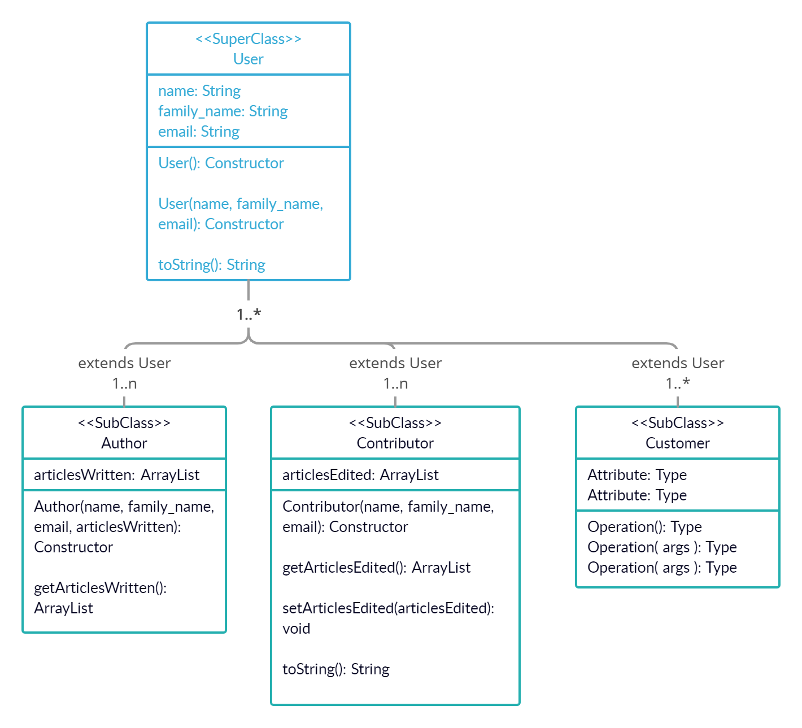

<br/>

## Abstraction

https://www.w3schools.com/java/java_abstract.asp

Data **abstraction** is the process of hiding certain details and showing only essential information to the user. Abstraction can be achieved with either **abstract classes** or [**interfaces**](https://www.w3schools.com/java/java_interface.asp).

The `abstract` keyword is a non-access modifier, used for classes and methods:

- **Abstract class:** is a restricted class that cannot be used to create objects (to access it, it must be inherited from another class).
- **Abstract method:** can only be used in an abstract class, and it does not have a body. The body is provided by the subclass (inherited from).

An abstract class can have both abstract and regular methods:

```java
abstract class Animal {
  public abstract void animalSound();
  public void sleep() {
    System.out.println("Zzz");
  }
}
```

From the example above, it is not possible to create an object of the Animal class:

```java
Animal myObj = new Animal(); // will generate an error
```

Simple example from w3schools:

```java
// Abstract class
abstract class Animal {
  // Abstract method (does not have a body)
  public abstract void animalSound();
  // Regular method
  public void sleep() {
    System.out.println("Zzz");
  }
}

// Subclass (inherit from Animal)
class Pig extends Animal {
  public void animalSound() {
    // The body of animalSound() is provided/implemented here
    System.out.println("The pig says: oink");
  }
}

class Main {
  public static void main(String[] args) {
    Pig myPig = new Pig();
    myPig.animalSound(); // The pig says: oink
    myPig.sleep(); // Zzz
  }
}
```

<br/>

<br/>

Another example based on the User example before:

```java
// User.java
public abstract class User {

  protected String userName;
  protected String hashedPassword;
  protected String foreName; // first name
  protected String surName; // family name
  protected String email;

  public User(String userName, String password) {
    this.setUserName(userName);
    this.hashedPassword = Integer.toString(password.hashCode());
  }
  public User(String userName, String password, String first_name, String family_name, String email) {
    this.setUserName(userName);
    this.hashedPassword = hashPassword(password);
    this.setForeName(first_name);
    this.setSurName(family_name);
    this.setEmail(email);
  }

  public static String hashPassword(String password) {
    return Integer.toString(password.hashCode());
  }

  public Boolean login(String userName, String password) {
    return (this.getUserName().equals(userName) && this.hashedPassword.equals(hashPassword(password)));
  }

  public String toString() {
    /* Override toString - Return a String representation when printing the object directly */
    return "User(userName: "+this.userName+", foreName: "+this.foreName+", surName: "+this.surName+", email: "+this.email+")";
  }

  public String getUserName() {
    return userName;
  }
  public void setUserName(String userName) {
    this.userName = userName;
  }
  public String getHashedPassword() {
    return hashedPassword;
  }
  public void setHashedPassword(String password) {
    this.hashedPassword = hashPassword(password);
  }
  public String getForeName() {
    return foreName;
  }
  public void setForeName(String foreName) {
    this.foreName = foreName;
  }
  public String getSurName() {
    return surName;
  }
  public void setSurName(String surName) {
    this.surName = surName;
  }
  public String getEmail() {
    return email;
  }
  public void setEmail(String email) {
    this.email = email;
  }
}
```

```java
// Author.java
import java.util.ArrayList;

public class Author extends User {

  private ArrayList<String> articlesWritten;

  public Author(String userName, String password) {
    super(userName, password);
  }
  public Author(String userName, String password, ArrayList<String> articlesWritten) {
    super(userName, password);
    this.setArticlesWritten(articlesWritten);
  }
  public Author(String userName, String password, String first_name, String family_name, String email,
      ArrayList<String> articlesWritten) {
    super(userName, password, first_name, family_name, email);
    this.setArticlesWritten(articlesWritten);
  }

  public ArrayList<String> getArticlesWritten() {
    return this.articlesWritten;
  }
  public void setArticlesWritten(ArrayList<String> articlesWritten) {
    this.articlesWritten = articlesWritten;
  }
}
```

```java
// Main.java
import java.util.ArrayList;

public class Main {

  public static void main(String[] args) {

    ArrayList<String> author1Articles = new ArrayList<String>();
    author1Articles.add("How to eat well");
    author1Articles.add("Practice meditation");

    Author author1 = new Author("alice_m", "helloworld");
    author1.setForeName("Alice");
    author1.setSurName("Mackie");
    author1.setArticlesWritten(author1Articles);

    System.out.println(author1); // User(userName: alice_m, foreName: Alice, surName: Mackie, email: null)
    System.out.println(author1.getArticlesWritten()); // [How to eat well, Practice meditation]

    System.out.println(author1.getHashedPassword()); // -1524582912
    System.out.println(author1.login("alice_m", "helloworlzz")); // false
    System.out.println(author1.login("alice_m", "helloworld")); // true

    // User user1 = new User("betty", "password123"); // ERROR: Cannot instantiate the type User
  }
}
```

<br/>

## Java Interface

https://www.w3schools.com/java/java_interface.asp

Another way to achieve [abstraction](https://www.w3schools.com/java/java_abstract.asp) in Java, is with interfaces. An `interface` is a completely "**abstract class**" that is used to group related methods with empty bodies:

Example from w3schools:

```java
// Interface
interface Animal {
  public void animalSound(); // interface method (does not have a body)
  public void sleep(); // interface method (does not have a body)
}

// Pig "implements" the Animal interface
class Pig implements Animal {
  public void animalSound() {
    // The body of animalSound() is provided here
    System.out.println("The pig says: wee wee");
  }
  public void sleep() {
    // The body of sleep() is provided here
    System.out.println("Zzz");
  }
}

class Main {
  public static void main(String[] args) {
    Pig myPig = new Pig();
    myPig.animalSound(); // The pig says: wee wee
    myPig.sleep(); // Zzz
  }
}
```

🟠 **To access the interface methods, the interface must be "implemented" (kinda like inherited) by another class with the `implements` keyword (instead of `extends`).**

Notes on Interfaces:

- Like **abstract classes**, interfaces **cannot** be used to create objects (in the example above, it is not possible to create an "Animal" object in the MyMainClass)
- **Interface methods do not have a body - the body is provided by the "implement" class** (abstract classes can have methods with bodies that aren't declared abstract)
- **On implementation of an interface, you must override all of its methods**
- Interface methods are by default `abstract` and `public`
- Interface attributes are by default `public`, `static` and `final`
- An interface cannot contain a constructor (as it cannot be used to create objects)

Why And When To Use Interfaces?

1. To achieve security - hide certain details and only show the important details of an object (interface).

2. Java does not support "multiple inheritance" (a class can only inherit from one superclass). However, it can be achieved with interfaces, because the class can **implement** multiple interfaces. **Note:** To implement multiple interfaces, separate them with a comma (see example below).

<br/>

**Multiple interfaces - example from w3schools**

```java
interface FirstInterface {
  public void myMethod(); // interface method
}

interface SecondInterface {
  public void myOtherMethod(); // interface method
}

class DemoClass implements FirstInterface, SecondInterface {
  public void myMethod() {
    System.out.println("Some text..");
  }
  public void myOtherMethod() {
    System.out.println("Some other text...");
  }
}

class Main {
  public static void main(String[] args) {
    DemoClass myObj = new DemoClass();
    myObj.myMethod(); // Some text...
    myObj.myOtherMethod(); // Some other text...
  }
}
```

<br/>

**More on difference between abstract classes and interfaces in Java: https://www.javatpoint.com/difference-between-abstract-class-and-interface**

| Abstract class                                                                                 | Interface                                                                                                         |
| :--------------------------------------------------------------------------------------------- | :---------------------------------------------------------------------------------------------------------------- |
| 1) Abstract class can **have abstract and non-abstract** methods.                              | Interface can have **only abstract** methods. But, since Java 8, it can have **default and static methods** also. |
| 2) Abstract class **doesn't support multiple inheritance**.                                    | Interface **supports multiple inheritance**.                                                                      |
| 3) Abstract class **can have final, non-final, static and non-static variables**.              | Interface has **only static and final variables**.                                                                |
| 4) Abstract class **can provide the implementation of interface**.                             | Interface **can't provide the implementation of abstract class**.                                                 |
| 5) The **abstract keyword** is used to declare abstract class.                                 | The **interface keyword** is used to declare interface.                                                           |
| 6) An **abstract class** can extend another Java class and implement multiple Java interfaces. | An **interface** can extend another Java interface only.                                                          |
| 7) An **abstract class** can be extended using keyword "extends".                              | An **interface** can be implemented using keyword "implements".                                                   |
| 8) A Java **abstract class** can have class members like private, protected, etc.              | Members of a Java interface are public by default.                                                                |
| 9) **Example:** public abstract class Shape{ public abstract void draw(); }                    | **Example:** public interface Drawable{ void draw(); }                                                            |

Simply, abstract class achieves partial abstraction (0 to 100%) whereas interface achieves fully abstraction (100%).

<br/>

<br/>

Another example using Shape -> Rectangle, Circle: https://www.geeksforgeeks.org/difference-between-abstract-class-and-interface-in-java/

<br/>

<br/>

## Java Inner Classes

To access the inner class, create an object of the outer class, and then create an object of the inner class:

Example from: https://www.w3schools.com/java/java_inner_classes.asp

```java
class OuterClass {
  int x = 10;

  class InnerClass {
    int y = 5;
  }
}

public class Main {
  public static void main(String[] args) {
    OuterClass myOuter = new OuterClass();
    OuterClass.InnerClass myInner = myOuter.new InnerClass();
    System.out.println(myInner.y + myOuter.x);
  }
}

// Outputs 15 (5 + 10)
```

<br/>

# Java Enums

Notes from: https://www.w3schools.com/java/java_enums.asp

An `enum` is a special "class" that represents a group of constants (unchangeable variables, like `final` variables).

Simple Enum Example:

```java
public class Main {
  enum Level {
    LOW,
    MEDIUM,
    HIGH
  }

  public static void main(String[] args) {
    Level myVar = Level.MEDIUM;

    System.out.println(myVar); // prints "MEDIUM"
    switch(myVar) {
      case LOW:
        System.out.println("Low level");
        break;
      case MEDIUM:
         System.out.println("Medium level");
        break;
      case HIGH:
        System.out.println("High level");
        break;
    }


    // Loop through an Enum
    for (Level myVar : Level.values()) {
      System.out.println(myVar);
    }
    /* will print
      LOW
      MEDIUM
      HIGH
    */
  }
}
```

<br/>

## Enums in a class example

> prompt: You're Java Expert. Can you write a real-world scenario using Java enums? use a class, inside that class have an enum (besides other properties), then in the main class, give an example where you're comparing two enums from instances of a class.

```java
package enumExample;
class Employee {
    private String name;
    private Department department;
    enum Department {
        SALES,
        MARKETING,
        IT,
        HR
    }

    public Employee(String name, Department department) {
        this.name = name;
        this.department = department;
    }
    public String getName() {
        return name;
    }
    public Department getDepartment() {
        return department;
    }
}

// Main class
public class EnumExample {
    public static void main(String[] args) {
        Employee employee1 = new Employee("John", Employee.Department.SALES);
        Employee employee2 = new Employee("Jane", Employee.Department.MARKETING);

        // Compare the departments of two employees
        if (employee1.getDepartment() == employee2.getDepartment()) {
            System.out.println("Both employees belong to the same department.");
        } else {
            System.out.println("Employees belong to different departments.");
        }
    }
}
```

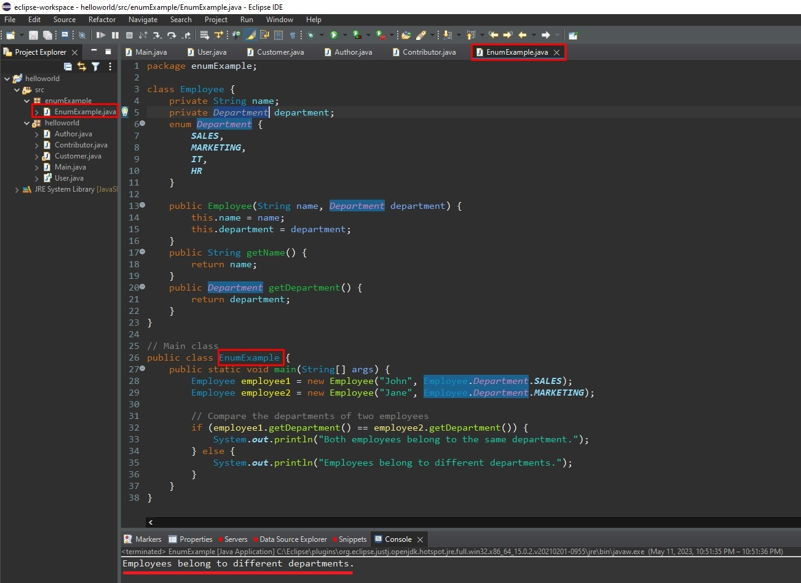

<br/>

## Enhanced/Extended Enums with constructors

Let's enhance the previous example by adding a few additional features to the Employee class and the Department enum:

```java
package enumExample;
import java.util.ArrayList;
import java.util.List;

class Employee {
    private String name;
    private Department department;
    private List<Role> roles;

    enum Department {
        /* Each enum constant (e.g., SALES, MARKETING, etc.)
        is created with a specific argument,
        and the constructor assigns the argument value
        to the displayName field of each enum constant.
        */
        SALES("Sales Department"),
        MARKETING("Marketing Department"),
        IT("IT Department"),
        HR("Human Resources Department");

        private final String displayName;

        Department(String displayName) {
            this.displayName = displayName;
        }

        public String getDisplayName() {
            return displayName;
        }
    }

    enum Role {
        MANAGER,
        DEVELOPER,
        ANALYST,
        INTERN
    }

    // Constructor
    public Employee(String name, Department department, List<Role> roles) {
        this.name = name;
        this.department = department;
        this.roles = roles;
    }
    // Getters and setters
    public String getName() {
        return name;
    }
    public Department getDepartment() {
        return department;
    }
    public List<Role> getRoles() {
        return roles;
    }
}

// Main class
public class EnumExample {
    public static void main(String[] args) {
        // Create instances of Employee
        List<Employee.Role> roles1 = new ArrayList<>();
        roles1.add(Employee.Role.DEVELOPER);
        roles1.add(Employee.Role.ANALYST);
        Employee employee1 = new Employee("John", Employee.Department.IT, roles1);

        List<Employee.Role> roles2 = new ArrayList<>();
        roles2.add(Employee.Role.MANAGER);
        Employee employee2 = new Employee("Jane", Employee.Department.SALES, roles2);

        // Compare the department of one employee
        if (employee1.getDepartment() == Employee.Department.IT) {
            System.out.println(String.format("%s is in %s", employee1.getName(), employee1.getDepartment().getDisplayName()));
            // Prints "John is in IT Department"
        }

        // Check if an employee has a specific role (e.g., developer) by using the contains method of the List interface.
        if (employee1.getRoles().contains(Employee.Role.DEVELOPER)) {
            System.out.println(employee1.getName() + " is a developer."); // John is a developer.
        }

        // List all departments
        System.out.println("Departments:");
        for (Employee.Department department : Employee.Department.values()) {
            System.out.println(department.getDisplayName());
        }
        /* Will print
          Sales Department
          Marketing Department
          IT Department
          Human Resources Department
        */
    }
}
```

<br/>

# Sets, ArrayLists, LinkedLists

When you create a set or a list, you don't need to specify it's size (like an array: `String arr[] = new String[3];` or `String[] arr = {"Hello", "Hey"}`).

```java
String[] arr = new String[3];

arr[0] = "Hello";
arr[1] = "yes";

System.out.println(Arrays.toString(arr));
// [Hello, yes, null]

String[] arr = new String[]; // ERROR: Variable must provide either dimension expressions or an array initializer
```

The difference between a built-in array and an `ArrayList` in Java, is that the size of an array cannot be modified (if you want to add or remove elements to/from an array, you have to create a new one). While elements can be added and removed from an `ArrayList` whenever you want.

<br/>

<br/>

## Java Sets / Hashsets

A set is a collection which is unordered and unindexed, meaning that the order doesn't matter in a set and you cannot be sure in which order the items will appear. Elements in a set are unique, without duplicates (you can't have 2 or more of a same value). (just like [Python Sets](https://www.w3schools.com/python/python_sets.asp)).

We can declare a set (eg of Strings) with `Set<String> set = new HashSet<String>();`.

**To add elements to a set, we call the `add()` method on a Set instance (object).**

```java
import java.util.HashSet;
import java.util.Set;

class Main {
  public static void main(String[] args) {

    Set<String> daysSet = new HashSet<String>();
    daysSet.add("Monday");
    daysSet.add("Monday"); // "Monday" value already exist
    daysSet.add("Tuesday");

    System.out.println(daysSet); // [Monday, Tuesday]
  }
}
```

<br/>

**Check if a set contains a value with `.contains()` method:**

```java
Set<String> paidMonthsSet = new HashSet<String>();
paidMonthsSet.add("Jan");
paidMonthsSet.add("Feb");
paidMonthsSet.add("Mar");

System.out.println(paidMonthsSet.contains("Feb")); // true
```

<br/>

**Get length of a set with `.size()`**

```java
System.out.println(paidMonthsSet.size()); // 3
```

<br/>

**Remove elements in a set based on value with remove()**

```java
Set<String> paidMonthsSet = new HashSet<String>();
paidMonthsSet.add("Jan");
paidMonthsSet.add("Feb");
paidMonthsSet.add("Mar");

paidMonthsSet.remove("Jan");
System.out.println(paidMonthsSet); // [Feb, Mar]
```

<br/>

**You can clear an entire set with `clear()`**

```java
paidMonthsSet.clear();
```

<br/>

**Check if a set is empty with `isEmpty()`**

```java
paidMonthsSet.clear();
paidMonthsSet.isEmpty(); // returs true
```

<br/>

**Loop through a HashSet**

https://www.w3schools.com/java/java_hashset.asp

```java
HashSet<String> cars = new HashSet<String>();
cars.add("Volvo");
cars.add("BMW");
cars.add("Ford");
cars.add("BMW");
cars.add("Mazda");

for (String car : cars) {
  System.out.print(car + " ");
}
// Volvo Mazda Ford BMW
```

<br/>

<br/>

## Java ArrayList

https://www.w3schools.com/java/java_arraylist.asp

The `ArrayList` class is a resizable [array](https://www.w3schools.com/java/java_arrays.asp), which can be found in the `java.util` package.

The difference between a built-in array and an `ArrayList` in Java, is that the size of an array cannot be modified (if you want to add or remove elements to/from an array, you have to create a new one). While elements can be added and removed from an `ArrayList` whenever you want.

<br/>

**Add items in ArrayList**

```java
import java.util.ArrayList;

public class Main {
  public static void main(String[] args) {
    ArrayList<String> shoppingList = new ArrayList<String>();

    shoppingList.add("Banana");
    shoppingList.add("Kiwi");

    System.out.println(shoppingList); // [Banana, Kiwi]
  }
}
```

<br/>

Unlike sets, you can **access, change/update and remove items (based on index) in ArrayList**

```java
ArrayList<String> shoppingList = new ArrayList<String>();

shoppingList.add("Banana");
shoppingList.add("Kiwi");

System.out.println(shoppingList.get(0)); // Banana
shoppingList.set(0, "Orange");
System.out.println(shoppingList); // [Orange, Kiwi]

shoppingList.remove(shoppingList.size() - 1);
System.out.println(shoppingList); // [Orange]
```

<br/>

**Empty/Clear an ArrayList**

```java
shoppingList.clear();
```

<br/>

**Get sublist elements from specified indexes (range from first index to second index)**

```java
ArrayList<String> shoppingList = new ArrayList<String>();

shoppingList.add("Apple"); // 0
shoppingList.add("Banana"); // 1
shoppingList.add("Kiwi"); // 2
shoppingList.add("Orange"); // 3

System.out.println(shoppingList.subList(1, 3)); // [Banana, Kiwi]
```

<br/>

**Loop through an ArrayList**

```java
ArrayList<String> cars = new ArrayList<String>();
cars.add("Volvo");
cars.add("BMW");
cars.add("Ford");
cars.add("Mazda");
for (int i = 0; i < cars.size(); i++) {
  System.out.println(cars.get(i));
}
/*
Volvo
BMW
Ford
Mazda
*/
```

```java
for (String car : cars) {
  System.out.println(car + " "); // Volvo BMW Ford Mazda
}
```

<br/>

https://www.javatpoint.com/java-arraylist

| Method                                                                                                                 | Description                                                                                                                                                               |
| :--------------------------------------------------------------------------------------------------------------------- | :------------------------------------------------------------------------------------------------------------------------------------------------------------------------ |
| void [add](https://www.javatpoint.com/java-arraylist-add-method)(int index, E element)                                 | It is used to insert the specified element at the specified position in a list.                                                                                           |
| boolean [add](https://www.javatpoint.com/java-arraylist-add-method)(E e)                                               | It is used to append the specified element at the end of a list.                                                                                                          |
| boolean [addAll](https://www.javatpoint.com/java-arraylist-addall-method)(Collection<? extends E> c)                   | It is used to append all of the elements in the specified collection to the end of this list, in the order that they are returned by the specified collection's iterator. |
| boolean [addAll](https://www.javatpoint.com/java-arraylist-addall-method)(int index, Collection<? extends E> c)        | It is used to append all the elements in the specified collection, starting at the specified position of the list.                                                        |
| void [clear](https://www.javatpoint.com/java-arraylist-clear-method)()                                                 | It is used to remove all of the elements from this list.                                                                                                                  |
| void ensureCapacity(int requiredCapacity)                                                                              | It is used to enhance the capacity of an ArrayList instance.                                                                                                              |
| E get(int index)                                                                                                       | It is used to fetch the element from the particular position of the list.                                                                                                 |
| boolean isEmpty()                                                                                                      | It returns true if the list is empty, otherwise false.                                                                                                                    |
| [Iterator()](https://www.javatpoint.com/java-arraylist-iterator-method)                                                |                                                                                                                                                                           |
| [listIterator()](https://www.javatpoint.com/java-arraylist-listiterator-method)                                        |                                                                                                                                                                           |
| int lastIndexOf(Object o)                                                                                              | It is used to return the index in this list of the last occurrence of the specified element, or -1 if the list does not contain this element.                             |
| Object[] toArray()                                                                                                     | It is used to return an array containing all of the elements in this list in the correct order.                                                                           |
| <T> T[] toArray(T[] a)                                                                                                 | It is used to return an array containing all of the elements in this list in the correct order.                                                                           |
| Object clone()                                                                                                         | It is used to return a shallow copy of an ArrayList.                                                                                                                      |
| boolean contains(Object o)                                                                                             | It returns true if the list contains the specified element                                                                                                                |
| int indexOf(Object o)                                                                                                  | It is used to return the index in this list of the first occurrence of the specified element, or -1 if the List does not contain this element.                            |
| E remove(int index)                                                                                                    | It is used to remove the element present at the specified position in the list.                                                                                           |
| boolean [remove](https://www.javatpoint.com/java-arraylist-remove-method)(Object o)                                    | It is used to remove the first occurrence of the specified element.                                                                                                       |
| boolean [removeAll](https://www.javatpoint.com/java-arraylist-removeall-method)(Collection<?> c)                       | It is used to remove all the elements from the list.                                                                                                                      |
| boolean removeIf(Predicate<? super E> filter)                                                                          | It is used to remove all the elements from the list that satisfies the given predicate.                                                                                   |
| protected void [removeRange](https://www.javatpoint.com/java-arraylist-removerange-method)(int fromIndex, int toIndex) | It is used to remove all the elements lies within the given range.                                                                                                        |
| void replaceAll(UnaryOperator<E> operator)                                                                             | It is used to replace all the elements from the list with the specified element.                                                                                          |
| void [retainAll](https://www.javatpoint.com/java-arraylist-retainall-method)(Collection<?> c)                          | It is used to retain all the elements in the list that are present in the specified collection.                                                                           |
| E set(int index, E element)                                                                                            | It is used to replace the specified element in the list, present at the specified position.                                                                               |
| void sort(Comparator<? super E> c)                                                                                     | It is used to sort the elements of the list on the basis of specified comparator.                                                                                         |
| Spliterator<E> spliterator()                                                                                           | It is used to create spliterator over the elements in a list.                                                                                                             |
| List<E> subList(int fromIndex, int toIndex)                                                                            | It is used to fetch all the elements lies within the given range.                                                                                                         |
| int size()                                                                                                             | It is used to return the number of elements present in the list.                                                                                                          |
| void trimToSize()                                                                                                      | It is used to trim the capacity of this ArrayList instance to be the list's current size.                                                                                 |

<br/>

<br/>

## Java LinkedList

https://www.w3schools.com/java/java_linkedlist.asp

The `LinkedList` class is a collection which can contain many objects (dynamic size) of the same type, just like the `ArrayList`.

he `LinkedList` class has all of the same methods as the `ArrayList` class because they both implement the `List` interface. This means that you can add items, change items, remove items and clear the list in the same way.

However, while the `ArrayList` class and the `LinkedList` class can be used in the same way, they are built very differently.

<br/>

The `LinkedList` stores its items in "containers." The list has a link to the first container and each container has a link to the next container in the list. To add an element to the list, the element is placed into a new container and that container is linked to one of the other containers in the list.

🟢 **Use case: Use an `ArrayList` for storing and accessing data, and `LinkedList` to manipulate data.**

<br/>

For many cases, the `ArrayList` is more efficient as it is common to need access to random items in the list, but the `LinkedList` provides several methods to do certain operations more efficiently:

| Method        | Description                                    | Try it                                                                                      |
| :------------ | :--------------------------------------------- | :------------------------------------------------------------------------------------------ |
| addFirst()    | Adds an item to the beginning of the list.     | [Try it »](https://www.w3schools.com/java/tryjava.asp?filename=demo_linkedlist_addfirst)    |
| addLast()     | Add an item to the end of the list             | [Try it »](https://www.w3schools.com/java/tryjava.asp?filename=demo_linkedlist_addlast)     |
| removeFirst() | Remove an item from the beginning of the list. | [Try it »](https://www.w3schools.com/java/tryjava.asp?filename=demo_linkedlist_removefirst) |
| removeLast()  | Remove an item from the end of the list        | [Try it »](https://www.w3schools.com/java/tryjava.asp?filename=demo_linkedlist_removelast)  |
| getFirst()    | Get the item at the beginning of the list      | [Try it »](https://www.w3schools.com/java/tryjava.asp?filename=demo_linkedlist_getfirst)    |
| getLast()     | Get the item at the end of the list            | [Try it »](https://www.w3schools.com/java/tryjava.asp?filename=demo_linkedlist_getlast)     |

<br/>

## Java Maps

An object that maps keys to values. A map cannot contain duplicate keys; each key can map to at most one value.

```java
import java.util.HashMap;
import java.util.Map;

public class Main {
  public static void main(String[] args) {

    Map persons = new HashMap();
    persons.put("Alex", 18);
    persons.put("Andrew", 23);

    System.out.println(persons); // {Alex=18, Andrew=23}
  }
}
```

```java
// However, if we use maps like this, we will get warnings:
/* Type safety: The method put(Object, Object) belongs to the raw type Map. References to generic type Map<K,V> should be parameterized */

// Solution:
Map<String, Integer> persons = new HashMap<String, Integer>();
persons.put("Alex", 18);
persons.put("Andrew", 23);

System.out.println(persons); // {Alex=18, Andrew=23}
```

<br/>

[Key Differences between Map and HashMap](https://www.javatpoint.com/map-and-hashmap-in-java):

- The Map is an interface, and HashMap is a class of the Java collection framework.
- The Map interface can be implemented by using its implementing classes. In comparison, the HashMap class implements the Map interface.
- The Map contains unique key-pair values. But, the HashMap can hold duplicate values.
- The Map does not allow null values. But the HashMap can have one null key and multiple values.
- The Map has two implementations, which are HashMap and TreeMap. Whereas HashMap implements Map interface and extends AbstractMap class.
- There is no difference between the Map and HashMap objects.

<br/>

# HashMaps

https://www.w3schools.com/java/java_hashmap.asp

https://www.geeksforgeeks.org/java-util-hashmap-in-java-with-examples/?ref=lbp

https://www.geeksforgeeks.org/hashmap-containsvalue-method-in-java/?ref=lbp

In the [`ArrayList`](https://www.w3schools.com/java/java_arraylist.asp) chapter, you learned that Arrays store items as an ordered collection, and you have to access them with an index number (`int` type). A `HashMap` however, store items in "**key**/**value**" pairs, and you can access them by an index of another type (e.g. a `String`).

<br/>

> _So, hashmaps in Java are just like [objects in JavaScript](https://www.w3schools.com/js/js_objects.asp), or [associative arrays in PHP](https://www.w3schools.com/php/php_arrays_associative.asp), or [dictionaries in Python](https://www.w3schools.com/python/python_dictionaries.asp)_

<br/>

One object is used as a key (index) to another object (value). It can store different types: `String` keys and `Integer` values, or the same type, like: `String` keys and `String` values:

<br/>

**Add items to HashMap with `put()`**

```java
import java.util.HashMap;

public class Main {
  public static void main(String[] args) {

    HashMap<String, String> capitalCities = new HashMap<String, String>();
    capitalCities.put("Romania", "Bucharest");
    capitalCities.put("France", "Paris");
    capitalCities.put("Germany", "Berlin");
    capitalCities.put("Poland", "Warsaw");

    System.out.println(capitalCities); // {Romania=Bucharest, Poland=Warsaw, France=Paris, Germany=Berlin}
  }
}
```

<br/>

**Length/Size of HashMap object with `size()`**

```java
System.out.println(capitalCities.size()); // 4
```

<br/>

**Check and Access the value of item by referring to its key with `get()`**

```java
System.out.println(capitalCities.containsKey("France")); // true

System.out.println(capitalCities.get("France")); // Paris
System.out.println(capitalCities.get("England")); // null
```

```java
// Check if HashMap contains a value
System.out.println(capitalCities.containsValue("Warsaw")); // true
```

Note that we don't get an error if we try to retrieve an item that doesn't exist (in Python we would get **KeyError** error)

<br/>

**Remove an item from hashmap by reffering to its key**

```java
HashMap<String, String> capitalCities = new HashMap<String, String>();
capitalCities.put("Romania", "Bucharest");
capitalCities.put("France", "Paris");
capitalCities.put("Germany", "Berlin");
capitalCities.put("Poland", "Warsaw");

System.out.println(capitalCities.remove("Poland")); // it also returns the value: Warsaw
System.out.println(capitalCities); // {Romania=Bucharest, France=Paris, Germany=Berlin}
```

<br/>

**Get all the values of HashMap object**

```java
HashMap<String, String> capitalCities = new HashMap<String, String>();
capitalCities.put("Romania", "Bucharest");
capitalCities.put("France", "Paris");
capitalCities.put("Germany", "Berlin");
capitalCities.put("Poland", "Warsaw");

System.out.println(capitalCities.values()); // [Bucharest, Warsaw, Paris, Berlin]
```

<br/>

**Loop through a HashMap**

```java
HashMap<String, String> capitalCities = new HashMap<String, String>();
capitalCities.put("Romania", "Bucharest");
capitalCities.put("France", "Paris");
capitalCities.put("Germany", "Berlin");
capitalCities.put("Poland", "Warsaw");

// Get only the values
for (String value : capitalCities.values()) {
  System.out.print(value + " "); // Bucharest Warsaw Paris Berlin
}

// Get key and value
for (String key : capitalCities.keySet()) {
  System.out.println(key + "=" + capitalCities.get(key));
}
/*
Romania=Bucharest
Poland=Warsaw
France=Paris
Germany=Berlin
*/
```

<br/>

Another [example](https://www.w3schools.com/java/java_hashmap.asp):

```java
public class Main {
  public static void main(String[] args) {

    // Create a HashMap object called people
    HashMap<String, Integer> people = new HashMap<String, Integer>();


    // Add keys and values (Name, Age)
    people.put("John", 32);
    people.put("Steve", 30);
    people.put("Angie", 33);

    for (String i : people.keySet()) {
      System.out.println("key: " + i + " value: " + people.get(i));
    }
  }
}
```

<br/>

**Copy a HashMap to another HashMap (copy without reference, so a true separate copy)**

```java
HashMap<String, String> capitalCities = new HashMap<String, String>();
capitalCities.put("Romania", "Bucharest");
capitalCities.put("France", "Paris");
capitalCities.put("Germany", "Berlin");
capitalCities.put("Poland", "Warsaw");

HashMap<String, String> capitalCitiesCopy = new HashMap<String, String>();
capitalCitiesCopy.putAll(capitalCities);

capitalCities.put("England", "London");
System.out.println(capitalCitiesCopy); // {Poland=Warsaw, Romania=Bucharest, France=Paris, Germany=Berlin}
```

<br/>

## TreeMap

A TreeMap is like a HashMap but it is sorted according to the [natural ordering](https://docs.oracle.com/javase/8/docs/api/java/lang/Comparable.html) of its keys (or based on a custom [Comparator](https://docs.oracle.com/javase/8/docs/api/java/util/Comparator.html) that you can provide at the time of creation of the TreeMap).

<br/>

Example: Given a **string**, store in a TreeMap the frequency of all characters (count all the characters into a map).

```java
import java.util.TreeMap;

public class Main {
  public static void main(String[] args) {

    TreeMap<Character, Integer> letterFrequency = new TreeMap<Character, Integer>();
    String inputString = "alphabetically";

    /* Or input from scanner */
    // Scanner scannerObj = new Scanner(System.in);
    // String inputString = scannerObj.nextLine();

    for (int i = 0; i < inputString.length(); i++) {
      char currentLetter = inputString.charAt(i);
      if (letterFrequency.containsKey(currentLetter)) {
        letterFrequency.put(currentLetter, letterFrequency.get(currentLetter) + 1);
      } else {
        letterFrequency.put(currentLetter, 1);
      }
    }

    System.out.println(letterFrequency); // {a=3, b=1, c=1, e=1, h=1, i=1, l=3, p=1, t=1, y=1}
  }
}
```

Note that in the template (_templates types is the common name in C/C++_) (when we specify the TypeArgument), we need to use **the wrapper object** of the primitive type we want to use. So, for `char`, its wrapper object is `Character`, for `int` its wrapper object is `Integer`.

See more about Wrapper Classes here: https://www.w3schools.com/java/java_wrapper_classes.asp

| Primitive Data Type | Wrapper Class |
| :------------------ | :------------ |
| byte                | Byte          |
| short               | Short         |
| int                 | Integer       |
| long                | Long          |
| float               | Float         |
| double              | Double        |
| boolean             | Boolean       |
| char                | Character     |

<br/>

Solution in JavaScript:

```javascript
/* JavaScript: Given a string, store in an JS Object the frequency/occurrences of all characters */

let countLetterFrequency = (inputString) => {
  let letterFrequency = {};

  inputString.split("").forEach((letter) => {
    if (letterFrequency.hasOwnProperty(letter)) {
      letterFrequency[letter] += 1;
    } else {
      letterFrequency[letter] = 1;
    }
  });
  return letterFrequency;
};

console.log(countLetterFrequency("alphabetically")); // {a=3, b=1, c=1, e=1, h=1, i=1, l=3, p=1, t=1, y=1}
```

<br/>

<br/>

# Examples

## LinkedList of HashMaps:

```java
LinkedList<HashMap<String, String>> persons = new LinkedList<HashMap<String, String>>();

HashMap<String, String> person1 = new HashMap<String, String>();
person1.put("name", "Alex");
person1.put("email", "alex@example.com");
person1.put("age", "23");

HashMap<String, String> person2 = new HashMap<String, String>();
person2.put("name", "Daniel");
person2.put("email", "daniel@example.com");
person2.put("age", "28");

HashMap<String, String> person3 = new HashMap<String, String>();
person3.put("name", "Emma");
person3.put("email", "emma.n@example.com");
person3.put("age", "22");

HashMap<String, String> person4 = new HashMap<String, String>();
person4.put("name", "Brittany");
person4.put("email", "britt.a@example.com");
person4.put("age", "25");

persons.add(person1);
persons.add(person2);
persons.add(person3);
persons.add(person4);

System.out.println(persons);
/* [{name=Alex, email=alex@example.com, age=23}, {name=Daniel, email=daniel@example.com, age=28}, {name=Emma, email=emma.n@example.com, age=22}, {name=Brittany, email=britt.a@example.com, age=25}] */
```

Loop through array of hashmaps (linkedlist of hashmaps):

```java
for (HashMap<String, String> person : persons) {
  System.out.println(person.get("name") + ", age: " + person.get("age"));
} /*
Alex, age: 23
Daniel, age: 28
Emma, age: 22
Brittany, age: 25
*/
```

Sort array of hashmaps (linkedlist of hashmaps) by "age" key:

```java
import java.util.Collections;
import java.util.HashMap;
import java.util.LinkedList;
import java.util.Comparator;

public class Main {
  public static void main(String[] args) {

    LinkedList<HashMap<String, String>> persons = new LinkedList<HashMap<String, String>>();

    HashMap<String, String> person1 = new HashMap<String, String>();
    person1.put("name", "Alex");
    person1.put("email", "alex@example.com");
    person1.put("age", "23");

    HashMap<String, String> person2 = new HashMap<String, String>();
    person2.put("name", "Daniel");
    person2.put("email", "daniel@example.com");
    person2.put("age", "28");

    HashMap<String, String> person3 = new HashMap<String, String>();
    person3.put("name", "Emma");
    person3.put("email", "emma.n@example.com");
    person3.put("age", "22");

    HashMap<String, String> person4 = new HashMap<String, String>();
    person4.put("name", "Brittany");
    person4.put("email", "britt.a@example.com");
    person4.put("age", "25");

    HashMap<String, String> person5 = new HashMap<String, String>();
    person5.put("name", "Diana");
    person5.put("email", "diana.z@example.com");
    person5.put("age", "19");

    persons.add(person1);
    persons.add(person2);
    persons.add(person3);
    persons.add(person4);
    persons.add(person5);

    Collections.sort(persons, new Comparator<HashMap<String, String>>() {
      @Override
      public int compare(HashMap<String, String> o1, HashMap<String, String> o2) {
        return Integer.parseInt(o1.get("age")) - Integer.parseInt(o2.get("age"));
      }
    });

    for (HashMap<String, String> person : persons) {
      System.out.println(person);
    }
  }
}
/* output:
{name=Diana, email=diana.z@example.com, age=19}
{name=Emma, email=emma.n@example.com, age=22}
{name=Alex, email=alex@example.com, age=23}
{name=Brittany, email=britt.a@example.com, age=25}
{name=Daniel, email=daniel@example.com, age=28}
*/
```

Sort array of hashmaps (linkedlist of hashmaps) by "name" key (alphabetically):

```java
/* Sort LinkedList of HashMaps by "name" key */
Collections.sort(persons, new Comparator<HashMap<String, String>>() {
  @Override
  public int compare(HashMap<String, String> o1, HashMap<String, String> o2) {
    return o1.get("name").compareTo(o2.get("name"));
      // return String.CASE_INSENSITIVE_ORDER.compare(o1.get("name"), o2.get("name"));
  }
});

for (HashMap<String, String> person : persons) {
  System.out.println(person);
}
/* output
{name=Alex, email=alex@example.com, age=23}
{name=Brittany, email=britt.a@example.com, age=25}
{name=Daniel, email=daniel@example.com, age=28}
{name=Diana, email=diana.z@example.com, age=19}
{name=Emma, email=emma.n@example.com, age=22}
*/
```

You can also return (in the compare method) a case-insensitive order by using:

```java
return String.CASE_INSENSITIVE_ORDER.compare(o1.get("name"), o2.get("name"));
```

References:

- **https://stackoverflow.com/questions/11176227/simple-way-to-sort-strings-in-the-case-sensitive-alphabetical-order**
- **https://stackoverflow.com/questions/57001594/comparator-cannot-be-resolved-to-a-type-what-should-i-do**
- **https://stackoverflow.com/questions/33190156/sort-a-linkedlist-of-objects-by-objects-variable**
- https://www.baeldung.com/java-hashmap-sort
- https://www.geeksforgeeks.org/sorting-hashmap-according-key-value-java/
- https://stackoverflow.com/questions/13069412/sort-array-of-hashmap-by-ascending-time

<br/>

<br/>

<br/>

**Another example just for fun:**

```java
public class Main {
  public static void main(String[] args) {

    LinkedList<HashMap<String, String>> shoppingList = new LinkedList<HashMap<String, String>>();

    HashMap<String, String> item1 = new HashMap<String, String>();
    item1.put("name", "Keyboard");
    item1.put("checked", "true");
    item1.put("price", "40.00");

    HashMap<String, String> item2 = new HashMap<String, String>();
    item2.put("name", "Display");
    item2.put("checked", "false");
    item2.put("price", "200.00");

    HashMap<String, String> item3 = new HashMap<String, String>();
    item3.put("name", "Mouse");
    item3.put("checked", "true");
    item3.put("price", "20.00");

    HashMap<String, String> item4 = new HashMap<String, String>();
    item4.put("name", "Hard-disk");
    item4.put("checked", "false");
    item4.put("price", "35.00");

    HashMap<String, String> item5 = new HashMap<String, String>();
    item5.put("name", "Speakers");
    item5.put("checked", "false");
    item5.put("price", "25.00");


    shoppingList.add(item1);
    shoppingList.add(item2);
    shoppingList.add(item3);
    shoppingList.add(item4);
    shoppingList.add(item5);

    for (HashMap<String, String> item : shoppingList) {
      System.out.println(item);
    }
  }
}
/* outputs:
{price=40.00, name=Keyboard, checked=true}
{price=200.00, name=Display, checked=false}
{price=20.00, name=Mouse, checked=true}
{price=35.00, name=Hard-disk, checked=false}
{price=25.00, name=Speakers, checked=false}
*/
```

<br/>

Let's return the sum of all prices in LinkedList:

```java
double sumPrices = 0.0;
for (HashMap<String, String> item : shoppingList) {
  sumPrices += item.get("price") != null ? Double.parseDouble(item.get("price")) : 0;
}
System.out.println(sumPrices); // 320.0
```

Return the sum of prices of checked items:

```java
// We only have keyboard and mouse in list priced at 40.0 and 20.0, so return value should be 60.0

double sumPricesCheckedItems = 0.0;
for (HashMap<String, String> item : shoppingList) {

  if (item.get("price") != null && Boolean.valueOf(item.get("checked"))) {
    sumPricesCheckedItems += Double.parseDouble(item.get("price"));
  }
}
System.out.println(sumPricesCheckedItems); // 60.0
```

Sort items by price then by checked/unchecked:

```java
Collections.sort(shoppingList, new Comparator<HashMap<String, String>>() {
  @Override
  public int compare(HashMap<String, String> o1, HashMap<String, String> o2) {
    return Double.compare(Double.parseDouble(o1.get("price")), Double.parseDouble(o2.get("price")));
  }
});

for(HashMap<String, String> item : shoppingList) {
  System.out.println(item);
}
System.out.println();
/*
{price=20.00, name=Mouse, checked=true}
{price=25.00, name=Speakers, checked=false}
{price=35.00, name=Hard-disk, checked=false}
{price=40.00, name=Keyboard, checked=true}
{price=200.00, name=Display, checked=false}
*/

Collections.sort(shoppingList, new Comparator<HashMap<String, String>>() {
  @Override
  public int compare(HashMap<String, String> o1, HashMap<String, String> o2) {
    return String.CASE_INSENSITIVE_ORDER.compare(o2.get("checked"), o1.get("checked"));
  }
});

for(HashMap<String, String> item : shoppingList) {
  System.out.println(item);
}
/*
{price=20.00, name=Mouse, checked=true}
{price=40.00, name=Keyboard, checked=true}
{price=25.00, name=Speakers, checked=false}
{price=35.00, name=Hard-disk, checked=false}
{price=200.00, name=Display, checked=false}
*/
```

Resources:

- https://stackoverflow.com/questions/13434143/sorting-a-double-value-of-an-object-within-an-arraylist

<br/>

<br/>

<br/>

## LinkedList of objects

First, we define these classes:

```java
// User.java
public abstract class User {

  protected String userName;
  protected String hashedPassword;
  protected String foreName; // first name
  protected String surName; // family name
  protected String email;

  public static String hashPassword(String password) {
    return Integer.toString(password.hashCode());
  }

  public User(String userName, String password) {
    this.setUserName(userName);
    this.hashedPassword = hashPassword(password);
  }
  public User(String userName, String password, String first_name, String family_name, String email) {
    this.setUserName(userName);
    this.hashedPassword = hashPassword(password);
    this.setForeName(first_name);
    this.setSurName(family_name);
    this.setEmail(email);
  }

  public Boolean login(String userName, String password) {
    return (this.getUserName().equals(userName) && this.hashedPassword.equals(hashPassword(password)));
  }

  public String toString() {
    /* Override toString - Return a String representation when printing the object directly */
    return "User(userName: "+this.userName+", foreName: "+this.foreName+", surName: "+this.surName+", email: "+this.email+")";
  }

  public String getUserName() {
    return userName;
  }
  public void setUserName(String userName) {
    this.userName = userName;
  }
  public String getHashedPassword() {
    return hashedPassword;
  }
  public void setHashedPassword(String password) {
    this.hashedPassword = hashPassword(password);
  }
  public String getForeName() {
    return foreName;
  }
  public void setForeName(String foreName) {
    this.foreName = foreName;
  }
  public String getSurName() {
    return surName;
  }
  public void setSurName(String surName) {
    this.surName = surName;
  }
  public String getEmail() {
    return email;
  }
  public void setEmail(String email) {
    this.email = email;
  }
}
```

```java
// Customer.java
public class Customer extends User {

  private ArrayList<String> itemsBought = new ArrayList<String>();
  private int noOfItemsBought = getNoOfItemsBought();

  public Customer(String userName, String password) {
    super(userName, password);
  }
  public Customer(String userName, String password, ArrayList<String> itemsBought) {
    super(userName, password);
    this.setItemsBought(itemsBought);
  }

  public int getNoOfItemsBought() {
    return this.getItemsBought().size();
  }
  public ArrayList<String> getItemsBought() {
    return itemsBought;
  }
  public void setItemsBought(ArrayList<String> itemsBought) {
    this.itemsBought = itemsBought;
  }
}
```

Examples of operations with a single object:

```java
// Main.java
import java.util.ArrayList;

public class Main {

  public static void main(String[] args) {

    ArrayList<String> customer1ItemsBought = new ArrayList<String>();
    customer1ItemsBought.add("Lenovo Laptop");
    customer1ItemsBought.add("RAM 32GB Kit");
    customer1ItemsBought.add("SSD 1TB NVMe");

    Customer customer1 = new Customer("zack95", "GamingLife#123", customer1ItemsBought);
    customer1.setEmail("zacky95@example.com");

    System.out.println(customer1); // User(userName: zack95, foreName: null, surName: null, email: zacky95@example.com)
    System.out.println(customer1.getItemsBought()); // [Lenovo Laptop, RAM 32GB Kit, SSD 1TB NVMe]
    System.out.println(customer1.getNoOfItemsBought()); // 3
  }
}
```

<br/>

**Loop through array of Customer objects**

```java
// Main.java
import java.util.ArrayList;
import java.util.Arrays;
import java.util.LinkedList;

public class Main {

  public static void main(String[] args) {

    ArrayList<String> customer1ItemsBought = new ArrayList<String>();
    customer1ItemsBought.add("Lenovo Laptop");
    customer1ItemsBought.add("RAM 32GB Kit");
    customer1ItemsBought.add("SSD 1TB NVMe");

    Customer customer1 = new Customer("zack95", "GamingLife#123", customer1ItemsBought);
    customer1.setEmail("zacky95@example.com");
    customer1.setForeName("Zack");
    customer1.setSurName("Hillbert");

    Customer customer2 = new Customer("emily_w", "TheNextEpisode");

    Customer customer3 = new Customer("sarah01", "EnterSandman01");
    customer3.setEmail("sarahh@example.com");

    Customer customer4 = new Customer("scott_x", "airplanes321");

    LinkedList<Customer> customers = new LinkedList<Customer>(
        Arrays.asList(customer1, customer2, customer3, customer4));

    for(Customer customer : customers) {
      System.out.println(customer);
    }
  }
}
/* outputs
User(userName: zack95, foreName: Zack, surName: Hillbert, email: zacky95@example.com)
User(userName: emily_w, foreName: null, surName: null, email: null)
User(userName: sarah01, foreName: null, surName: null, email: sarahh@example.com)
User(userName: scott_x, foreName: null, surName: null, email: null)
*/
```

> Ways to initialize an ArrayList in Java: https://www.geeksforgeeks.org/initialize-an-arraylist-in-java/ (works on LinkedList too)

<br/>

**Sort Array of Customer objects by their username alphabetically**

```java
// Main.java
import java.util.ArrayList;
import java.util.Arrays;
import java.util.LinkedList;
import java.util.Collections;
import java.util.Comparator;

public class Main {

  public static void main(String[] args) {

    ArrayList<String> customer1ItemsBought = new ArrayList<String>();
    customer1ItemsBought.add("Lenovo Laptop");
    customer1ItemsBought.add("RAM 32GB Kit");
    customer1ItemsBought.add("SSD 1TB NVMe");

    Customer customer1 = new Customer("zack95", "GamingLife#123", customer1ItemsBought);
    customer1.setEmail("zacky95@example.com");
    customer1.setForeName("Zack");
    customer1.setSurName("Hillbert");

    Customer customer2 = new Customer("emily_w", "TheNextEpisode");

    Customer customer3 = new Customer("sarah01", "EnterSandman01");
    customer3.setEmail("sarahh@example.com");

    Customer customer4 = new Customer("scott_x", "airplanes321");

    Customer customer5 = new Customer("anna_marie", "password1234");

    LinkedList<Customer> customers = new LinkedList<Customer>(
        Arrays.asList(customer1, customer2, customer3, customer4, customer5));

    Collections.sort(customers, new Comparator<Customer>() {
      @Override
      public int compare(Customer o1, Customer o2) {
        return String.CASE_INSENSITIVE_ORDER.compare(o1.getUserName(), o2.getUserName());
      }
    });

    for(Customer customer : customers) {
      System.out.println(customer);
    }
  }
}
/* outputs
User(userName: anna_marie, foreName: null, surName: null, email: null)
User(userName: emily_w, foreName: null, surName: null, email: null)
User(userName: sarah01, foreName: null, surName: null, email: sarahh@example.com)
User(userName: scott_x, foreName: null, surName: null, email: null)
User(userName: zack95, foreName: Zack, surName: Hillbert, email: zacky95@example.com)
*/
```

<br/>

**Sort Array of Customer objects by their number of items bought**

```java
import java.util.ArrayList;
import java.util.Arrays;
import java.util.LinkedList;
import java.util.Collections;
import java.util.Comparator;

public class Main {

  public static void main(String[] args) {

    ArrayList<String> customer1ItemsBought = new ArrayList<String>(
        Arrays.asList("Lenovo Laptop", "RAM 32GB Kit", "SSD 1TB NVMe"));
    Customer customer1 = new Customer("zack95", "GamingLife#123", customer1ItemsBought);
    customer1.setEmail("zacky95@example.com");
    customer1.setForeName("Zack");

    ArrayList<String> customer2ItemsBought = new ArrayList<String>(
        Arrays.asList("External Battery", "Power Cable"));
    Customer customer2 = new Customer("emily_w", "TheNextEpisode", customer2ItemsBought);

    Customer customer3 = new Customer("sarah01", "EnterSandman01");
    customer3.setEmail("sarahh@example.com");

    ArrayList<String> customer4ItemsBought = new ArrayList<String>(
        Arrays.asList("HDMI Adapter", "Samsung Phone", "External Display", "Fast Wall Charger"));
    Customer customer4 = new Customer("scott_x", "airplanes321", customer4ItemsBought);

    ArrayList<String> customer5ItemsBought = new ArrayList<String>(
        Arrays.asList("Bluetooth Speakers", "Microphone"));
    Customer customer5 = new Customer("anne_m", "password1234", customer5ItemsBought);


    LinkedList<Customer> customers = new LinkedList<Customer>(
        Arrays.asList(customer1, customer2, customer3, customer4, customer5));

    Collections.sort(customers, new Comparator<Customer>() {
      @Override
      public int compare(Customer o1, Customer o2) {
        return o1.getNoOfItemsBought() - o2.getNoOfItemsBought();
      }
    });

    for(Customer customer : customers) {
      System.out.printf("%-8s- %d items: %s \n", customer.getUserName(), customer.getNoOfItemsBought(), customer.getItemsBought());
    }
  }
}
/* outputs
sarah01 - 0 items: []
emily_w - 2 items: [External Battery, Power Cable]
anne_m  - 2 items: [Bluetooth Speakers, Microphone]
zack95  - 3 items: [Lenovo Laptop, RAM 32GB Kit, SSD 1TB NVMe]
scott_x - 4 items: [HDMI Adapter, Samsung Phone, External Display, Fast Wall Charger]
*/
```

<br/>

**Sum of total items bought by customers**

```java
int totalItemsBought = 0;
for(Customer customer : customers) {
  totalItemsBought += customer.getNoOfItemsBought();
}
System.out.printf("Total items bought: %d", totalItemsBought);
/*
sarah01 - 0 items: []
emily_w - 2 items: [External Battery, Power Cable]
anne_m  - 2 items: [Bluetooth Speakers, Microphone]
zack95  - 3 items: [Lenovo Laptop, RAM 32GB Kit, SSD 1TB NVMe]
scott_x - 4 items: [HDMI Adapter, Samsung Phone, External Display, Fast Wall Charger]
Total items bought: 11
*/
```

<br/>

# Java Stream

Resources on Java Stream:

- https://stackify.com/streams-guide-java-8/
- https://www.baeldung.com/java-8-streams
- https://www.baeldung.com/java-stream-reduce
- **https://mkyong.com/java8/java-8-stream-reduce-examples/**

<br/>

The addition of the _Stream_ was one of the major features added to Java 8 (released on March 18, 2014), that allows to operate with a data source and making bulk processing convenient and fast. Java 8 Streams should not be confused with Java I/O streams (ex: _FileInputStream_ etc).

**A stream does not store data and, in that sense, is not a data structure. It also <u>never modifies the underlying data source</u>.**

This functionality – _java.util.stream_ – supports functional-style operations on streams of elements, such as map-reduce transformations on collections.

<br/>

## Java Stream.reduce and Stream.filter

Using the reduce operation in Java Stream allows you to perform complex calculations or aggregations on a collection of objects efficiently and concisely.

### Example 01 Stream.reduce

Real-world example on a scenario where you have a list of transactions representing purchases made by customers:

- You want to calculate the total revenue generated from these transactions
- The `Transaction` class that represents a purchase made by a customer
- Each `Transaction` object has a product name and the corresponding price
- In the `main` method, we create a list of `Transaction` objects representing different purchases and then use the Java Stream API to calculate the total revenue generated from these transactions:
  1.  We start with the `transactions` list and call `stream()` to convert it into a stream of elements.
  2.  We then use the `mapToDouble` operation to extract the price of each transaction as a `double` value.
  3.  Finally, we use the `reduce` operation with an initial value of `0` and the `Double::sum` binary operator to add up all the prices and obtain the total revenue.
  4.  The result is stored in the `totalRevenue` variable, and we print it out to display the total revenue generated from the transactions.

```java
package streamExample;

import java.util.ArrayList;

class Transaction {
    private String product;
    private double price;

    public Transaction(String product, double price) {
        this.product = product;
        this.price = price;
    }
    public String getProduct() { return product; }
    public double getPrice() { return price; }
}

public class streamExample {
    public static void main(String[] args) {
        // Create a list of transactions
        ArrayList<Transaction> transactions = new ArrayList<>();
        transactions.add(new Transaction("Apple", 2.5));
        transactions.add(new Transaction("Banana", 1.5));
        transactions.add(new Transaction("Orange", 3.0));
        transactions.add(new Transaction("Mango", 2.0));
        transactions.add(new Transaction("Grapes", 4.5));

        // Calculate the total revenue using reduce
        double totalRevenue = transactions.stream()
                .mapToDouble(Transaction::getPrice)
                .reduce(0, Double::sum);

        System.out.println("Total revenue: $" + totalRevenue);
        // Total revenue: $13.5
    }
}
```


### Example 02 Stream.filter and Stream.sum

In this updated example:

- We introduced the `startDate` and `endDate` variables of type `LocalDate` to represent the desired time range for calculating the total revenue
- We modified the stream pipeline to include a `filter` operation
- The `filter` operation ensures that only transactions with dates falling between the `startDate` and `endDate` (exclusive) are considered
- The `sum` operation is used instead of `reduce` to directly calculate the sum of the filtered prices
- Finally, we display the total revenue between the specified dates

```java
package streamExample;

import java.time.LocalDate;
import java.util.ArrayList;

class Transaction {
    private String product;
    private double price;
    private LocalDate date;

    public Transaction(String product, double price, LocalDate date) {
        this.product = product;
        this.price = price;
        this.date = date;
    }
    public String getProduct() { return product; }
    public double getPrice() { return price; }
    public LocalDate getDate() { return date; }
}

public class streamExample {
    public static void main(String[] args) {
        // Create a list of transactions
        ArrayList<Transaction> transactions = new ArrayList<>();
        transactions.add(new Transaction("Apple", 2.5, LocalDate.of(2023, 5, 1)));
        transactions.add(new Transaction("Banana", 1.5, LocalDate.of(2023, 5, 2)));
        transactions.add(new Transaction("Orange", 3.0, LocalDate.of(2023, 5, 3)));
        transactions.add(new Transaction("Mango", 2.0, LocalDate.of(2023, 5, 4)));
        transactions.add(new Transaction("Grapes", 4.5, LocalDate.of(2023, 5, 5)));

        // Define the start and end dates
        LocalDate startDate = LocalDate.of(2023, 5, 2);
        LocalDate endDate = LocalDate.of(2023, 5, 5);

        // Calculate the total revenue between the start and end dates (exclusive)
        double totalRevenue = transactions.stream()
                .filter(transaction -> transaction.getDate().isAfter(startDate) && transaction.getDate().isBefore(endDate))
                .mapToDouble(Transaction::getPrice)
                .sum();

        System.out.println("Total revenue between " + startDate + " and " + endDate + ": $" + totalRevenue);
        // Total revenue between 2023-05-02 and 2023-05-05: $5.0
    }
}
```

### Example 03 Stream.reduce to find max value

(Saturday, June 10, 2023, 12:17)

In this updated example:

- We modified the stream pipeline to use the `reduce` operation to find the maximum value of a transaction between two specific dates
  1.  We start with the `transactions` list and convert it into a stream using the `stream()` method.
  2.  We apply the `filter` operation to include only transactions with dates falling between the `startDate` and `endDate` (exclusive).
  3.  We use the `map` operation to extract the price of each transaction as a `Double` value.
  4.  Finally, we apply the `reduce` operation with the `Double::max` binary operator to find the maximum value among the filtered transaction prices.
- The result is stored in an `Optional<Double>` object, `maxTransactionValue`.
- We check if a maximum value exists using `isPresent()`. If a maximum value is found, we print it along with the specified date range. Otherwise, we print a message indicating that no transactions were found within the given date range.

```java
package streamExample;

import java.time.LocalDate;
import java.util.ArrayList;
import java.util.Arrays;
import java.util.Optional;

class Transaction {
    private String product;
    private double price;
    private LocalDate date;

    public Transaction(String product, double price, LocalDate date) {
        this.product = product;
        this.price = price;
        this.date = date;
    }
    public String getProduct() { return product; }
    public double getPrice() { return price; }
    public LocalDate getDate() { return date; }
}

public class streamExample {
    public static void main(String[] args) {

        ArrayList<Transaction> transactions = new ArrayList<Transaction>(Arrays.asList(
            new Transaction("Apple", 2.5, LocalDate.of(2023, 5, 1)),
            new Transaction("Banana", 1.5, LocalDate.of(2023, 5, 2)),
            new Transaction("Orange", 3.0, LocalDate.of(2023, 5, 3)),
            new Transaction("Mango", 2.0, LocalDate.of(2023, 5, 4)),
            new Transaction("Grapes", 4.5, LocalDate.of(2023, 5, 5))
        ));

        LocalDate startDate = LocalDate.of(2023, 5, 2);
        LocalDate endDate = LocalDate.of(2023, 5, 4);

        // Find the maximum transaction value between the start and end dates using reduce
        Optional<Double> maxTransactionValue = transactions.stream()
                .filter(transaction -> transaction.getDate().isAfter(startDate) && transaction.getDate().isBefore(endDate))
                .map(Transaction::getPrice)
                .reduce(Double::max);

        if (maxTransactionValue.isPresent()) {
            System.out.println("Maximum transaction value between " + startDate + " and " + endDate + ": $" + maxTransactionValue.get());
        } else {
            System.out.println("No transactions found between " + startDate + " and " + endDate);
        }
        // Will print: Maximum transaction value between 2023-05-02 and 2023-05-04: $3.0
    }
}
```

### More on Stream.reduce and Stream.filter

`Stream.reduce`:

- The `reduce` operation combines the elements of a stream into a single result by repeatedly applying a binary operator to the elements.
- Normally, it takes two arguments: an identity value (initial value) and a binary operator.
- The binary operator is a function that takes two parameters of the stream's element type and returns a result of the same type.
- The `reduce` operation processes the elements in the stream in a way that allows parallelization and efficient processing.
- There are three versions of the `reduce` operation: `reduce(identity, accumulator)`, `reduce(identity, accumulator, combiner)`, and `reduce(accumulator)`.
- The `reduce` operation is commonly used for tasks like summing, finding the maximum or minimum value, concatenating strings, etc.

`Stream.filter`:

- The `filter` operation returns a new stream consisting of the elements that match the specified predicate (a boolean-valued function).
- It takes a single argument: the predicate that defines the filtering condition.
- The `filter` operation is a non-terminal operation, meaning it returns a new stream and allows further stream operations to be chained.
- Only elements for which the predicate returns `true` are included in the resulting stream.
- The `filter` operation is commonly used to select or exclude specific elements from a stream based on a given condition.

<br/>

Notes: Here are some important methods besides `filter` and `reduce`:

1.  `map`: Transforms each element of a stream into another object by applying a given function. It returns a new stream consisting of the transformed elements.

2.  `flatMap`: Applies a mapping function to each element of a stream and flattens the results into a single stream. It is useful when you want to transform each element into multiple elements and merge them into a single stream.

3.  `collect`: Performs a mutable reduction operation on the elements of a stream and collects the results into a mutable container, such as a `List`, `Set`, or `Map`.

4.  `distinct`: Returns a stream consisting of distinct elements based on their natural order or the result of a provided equality function.

5.  `sorted`: Sorts the elements of a stream based on their natural order or a provided comparator.

6.  `limit`: Returns a stream consisting of a maximum number of elements from the start of the stream.

7.  `skip`: Skips a specified number of elements from the start of the stream and returns a new stream with the remaining elements.

8.  `anyMatch`, `allMatch`, `noneMatch`: Check if any, all, or none of the elements in the stream match a given predicate.

    - `anyMatch:` Returns true if any element is found matching with the predicate. Predicate will not be applied to other elements if any matching found.
    - `allMatch:` Returns true if all elements are matching to the given predicate.
    - `noneMatch:` Returns true if none of the elements are matching to the predicate.
    - Example:
      ```java
      import java.util.stream.Stream;
      Stream.of(5, 10, 15, 20).anyMatch(i -> i % 10 == 0); // true
      Stream.of(5, 10, 15, 20).allMatch(i -> i % 5 == 0); // true
      Stream.of(5, 10, 15, 20).noneMatch(i -> i % 3 == 0); // false
      ```

9.  `findFirst`, `findAny`: Returns an `Optional` containing the first element or any element of the stream, respectively.
    - Example:
      ```java
      Stream.of(5, 10, 15).filter(i -> i % 20 == 0).findAny().orElse(0); // 0
      Stream.of(5, 10, 15, 20).filter(i -> i % 20 == 0).findAny().orElse(0); // 20
      Stream.of(5, 10, 15).map(i -> i * 2).findFirst().get(); // 10
      ```

These are just a few of the commonly used methods in the Stream API. There are many more available, including methods for grouping, partitioning, joining, and more. See the [Java documentation for the `java.util.stream.Stream` class](https://docs.oracle.com/javase/8/docs/api/java/util/stream/Stream.html) or [Stream API with examples](https://java-8-tips.readthedocs.io/en/stable/streamsapi.html) for all the methods and their capabilities.
