# JS Crash course on Callbacks, Promises, Async Await - Traversy

Credits:

- [24min Async JS Crash Course - Callbacks, Promises, Async Await - Traversy Media](https://youtu.be/PoRJizFvM7s?list=WL)
- [JavaScript Async, Callbacks, Promises - w3schools](https://www.w3schools.com/js/js_callback.asp)

> **A callback function is a function passed as an argument to another function**
>
> This technique allows a function to call another function
>
> A callback function can run after another function has finished

(Notes taken on Saturday, March 27, 2021)

## Example for receiving/sending Data

We'll mimic fetching a few blog posts from a server which are going to take a couple of seconds in order to retrieve them (we'll mimic using the `setTimeout()` function - this function takes a callback function as first argument, and number of milliseconds as second argument).. For this we will write in a file called `callbacks.js`:

HTML:

```html
<!DOCTYPE html>
<html lang="en">
<head>
    <meta charset="UTF-8">
    <meta http-equiv="X-UA-Compatible" content="IE=edge">
    <meta name="viewport" content="width=device-width, initial-scale=1.0">
    <title>Async JS</title>
</head>

<body>
    <script src="callbacks.js"></script>
</body>

</html>
```

JS:

```js
/* /callbacks.js */
const posts = [
    {
        title: "Post One",
        body: "This is post one"
    },
    {
        title: "Post Two",
        body: "This is post two"
    }
];

function getPosts() {
    setTimeout(() => {
        let output = '';
        posts.forEach((post, index) => {
            output += `<li>${post.title}</li>`;
        });
        document.body.innerHTML = output;
    }, 1000)
};

getPosts();
```

 ^^ After two seconds, our tittles for those two posts will appear:

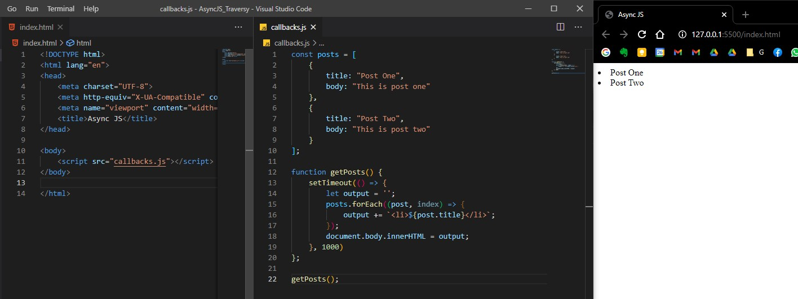

<br/>

Now let's try creating a new post (we will also use a `setTimeout` of 2 seconds to hypothetically deal with a server):

```js
/* /callbacks.js (full code) */
const posts = [
    {
        title: "Post One",
        body: "This is post one"
    },
    {
        title: "Post Two",
        body: "This is post two"
    }
];

function getPosts() {
    setTimeout(() => {
        let output = '';
        posts.forEach((post, index) => {
            output += `<li>${post.title}</li>`;
        });
        document.body.innerHTML = output;
    }, 1000)
};

function createPost(post) {
    setTimeout(() => {
        posts.push(post);
    }, 2000);
};

createPost({title: "Post Three", body: "This is post 3"});

getPosts();
```

**Now here comes the problem... after two seconds we will see the two posts we already created (as in the image above)**, but we will not gonna see the third newly created post... that is because the `createPost` took longer that the `getPosts` (for the `getPosts` method, our mimicked server took one second to respond, but for posts creation took 2 seconds... and by the time `getPosts` returned, the DOM/HTML was already rendered and won't do anything beyond that point)... **therefore this is why we need asynchronous programming.**

One way to handle this scenario is by using a **callback function**

## Sending/Receiving data using Callbacks

In our `createPost()` method, we will put another argument, namely a function called `callback`  (it can be any name, not necessarily *callback* - it's just common practice)... we want this callback `callback` function to be called right after the post is pushed on into the `posts` list. 

Also, when we will call the `createPost()` function, we'll actually put the `getPosts()` function as second argument for the `callback` function... like this:

```js
/* /callbacks.js (full code) */
const posts = [
    {
        title: "Post One",
        body: "This is post one"
    },
    {
        title: "Post Two",
        body: "This is post two"
    }
];

function getPosts() {
    setTimeout(() => {
        let output = '';
        posts.forEach((post, index) => {
            output += `<li>${post.title}</li>`;
        });
        document.body.innerHTML = output;
    }, 1000)
};

function createPost(post, callback) {
    setTimeout(() => {
        posts.push(post);
        callback();
    }, 2000);
};

createPost(
    {title: "Post Three", body: "This is post 3"},
    getPosts);
```

Nicely done, after four seconds (two seconds to create the post and push it to `posts`, and two more seconds to retrieve each post), we'll get the result we expected:

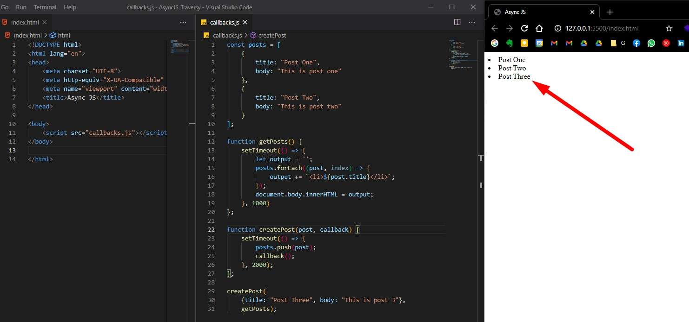

<br/>

Now let's explore another method of doing this, by using **Promises**.

<br/>

## Sending/Receiving data using Promises

`Promise` is a constructor function that is created with `new` keyword that take a callback function as its argument with two parameters: `resolve` and `reject` (these are methods used to determine the outcome of the promise):

- `resolve` is used when you want resolve your promise successfully
- `reject` is used when you want it to fail or you have some kind of error

```js
/* /promises.js (full code) */
const posts = [
  { title: "Post One", body: "This is post one" },
  { title: "Post Two", body: "This is post two" },
];

function getPosts() {
  setTimeout(() => {
    let output = "";
    posts.forEach((post, index) => {
      output += `<li>${post.title}</li>`;
    });
    document.body.innerHTML = output;
  }, 1000);
}

function createPost(post) {
  return new Promise((resolve, reject) => {
    setTimeout(() => {
      posts.push(post);

      const error = false; // error checking

      if (!error) {
        resolve();
      } else {
        reject("Error: Something went wrong");
      }
    }, 2000);
  });
}

createPost({ title: "Post Three", body: "This is post 3" })
	.then(getPosts);
```

Our `createPost` function will now return a `Promise` object on which we can call a method called `then()` (The `Promise` object has this `then()` method). We will pass our `getPosts` function as argument.

And voila, we successfully retrieve all posts (including the newly created one):

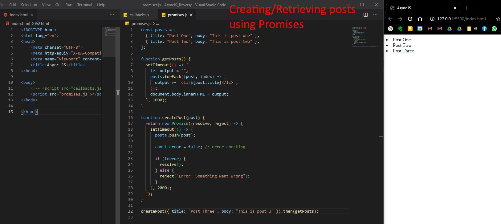

### Catching promise errors from reject

Note: If some error checking will return `true` to `error` variable, then the promise will be rejected. In our example we can simply set `error = true` to simulate this example:

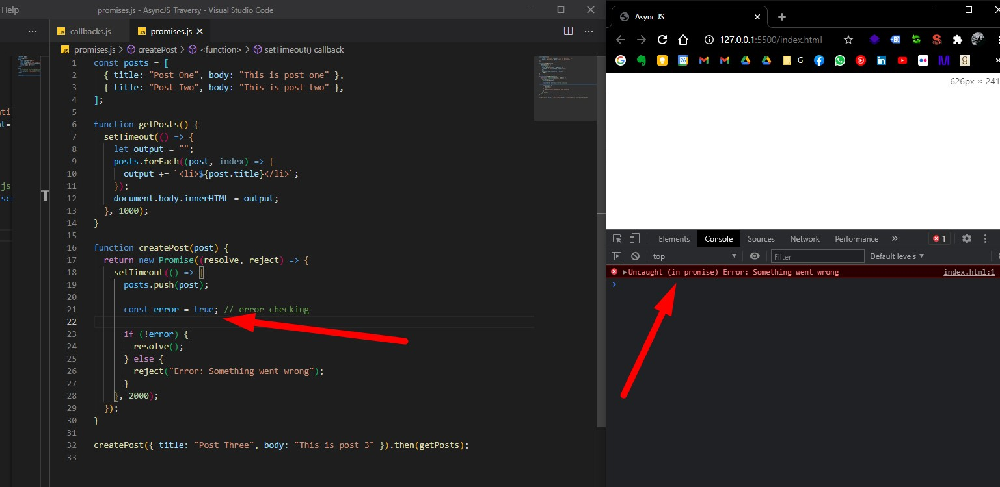

Note that we will get an actual error in our JS console.. which is not good. We can solve this issues by **catching** the errors... so after `then` method called on our returned `Promise` object, we can call `catch()`:

```js
createPost({ title: "Post Three", body: "This is post 3" })
  .then(getPosts)
  .catch((err) => console.log(err));
```

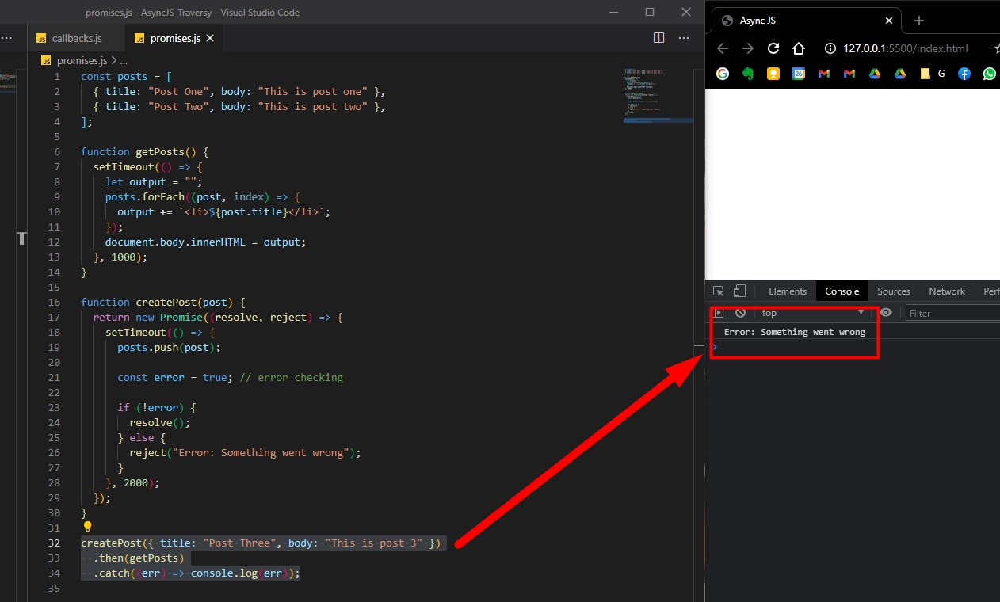

<br/>

We will often deal with promises when we will use the **Fetch API**, or **Axios (AJAX)**, or even **Mongoose** for **MongoDB** databases.

<br/>

### Using Promise.all function

If we will deal with a lot of different promises, we don't want to rewrite `.then` each and every time for each promise. For this we can use `Promise.all()`.

So, instead of calling `createPost` function, we will create a few other promises and use the `Promise.all` function to handle them.

```js
const promise1 = Promise.resolve("Hello World");
const promise2 = 10;
const promise3 = new Promise((resolve, reject) =>
  setTimeout(resolve, 2000, "Goodbye")
);

Promise.all([promise1, promise2, promise3]).then((values) =>
  console.log(values)
);
```

`Promise.all()` takes an array of promises as argument, and returns a Promise object on which we can call `.then()` and `.catch()`.

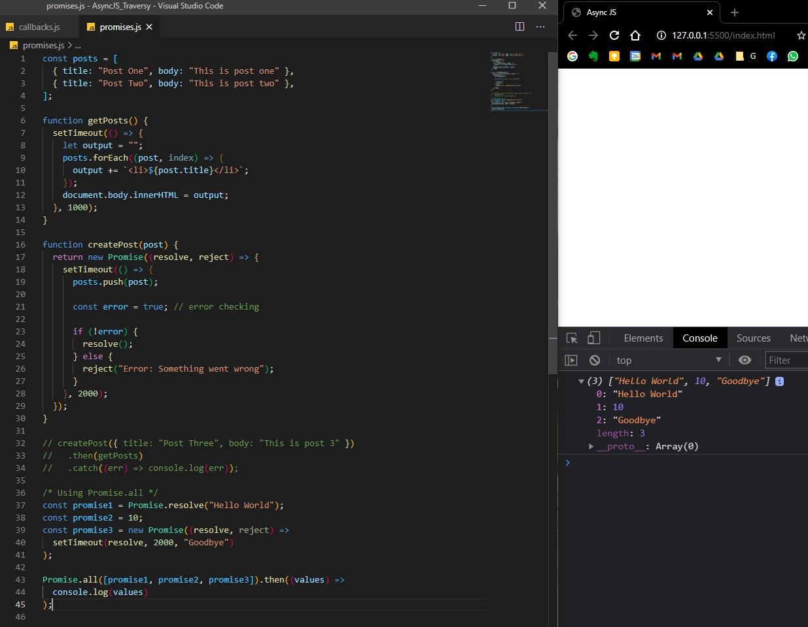

Note that it will take 2 seconds (the sum/longest of all promises) in order to return everything.

<br/>

### Using Promises with Fetch API

Let's see another example with promises using the **Fetch API**. We can actually fetch real data from a JSON from https://jsonplaceholder.typicode.com/

We will make a request to this `users` JSON (https://jsonplaceholder.typicode.com/users).

**`const promise4 = fetch("https://jsonplaceholder.typicode.com/users");` will return a promise. However, the `fetch()` is a little weird because you need to use two `.then` when you fetch data, because: we'll use the first `fetch` to format the data (the JSON), and the next `fetch` is used to display the data.**

```js
const promise1 = Promise.resolve("Hello World");
const promise2 = 10;
const promise3 = new Promise((resolve, reject) =>
  setTimeout(resolve, 2000, "Goodbye")
);
const promise4 = fetch(
  "https://jsonplaceholder.typicode.com/users"
).then((response) => response.json());

Promise.all([promise1, promise2, promise3, promise4]).then((values) =>
  console.log(values)
);
```

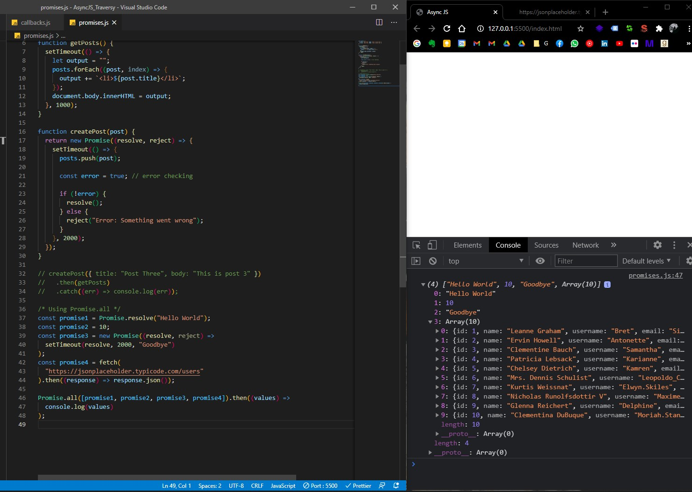

<br/>

## Handling promises with async await

**Async await** is another way to handle responses from promises (is not a different way to write/create promises!).

In order to use async await, we need to create a function that is labelled `async`, and we will use `await` inside it. `await` will wait for an asynchronous process/action to complete, then will execute whatever we want after (ex: `getPosts`).

```js
/* /promises_async_await.js (full code) */
const posts = [
  { title: "Post One", body: "This is post one" },
  { title: "Post Two", body: "This is post two" },
];

function getPosts() {
  setTimeout(() => {
    let output = "";
    posts.forEach((post, index) => {
      output += `<li>${post.title}</li>`;
    });
    document.body.innerHTML = output;
  }, 1000);
}

function createPost(post) {
  return new Promise((resolve, reject) => {
    setTimeout(() => {
      posts.push(post);

      const error = true; // error checking

      if (!error) {
        resolve();
      } else {
        reject("Error: Something went wrong");
      }
    }, 2000);
  });
}

async function init() {
  await createPost({ title: "Post Three", body: "This post three" });
  getPosts();
}

init();
```

And we got the expected result:

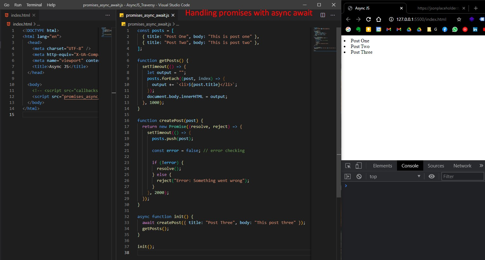

Overall, using async await to handle promises is cleaner (from a syntax perspective) than using `.then()` and `.catch()`.

<br/>

### Using async await to handle promises with Fetch API

(`res` = response)

```js
async function fetchUsers() {
  const res = await fetch("https://jsonplaceholder.typicode.com/users");
  const data = await res.json();
  console.log(data);
}

fetchUsers();
```

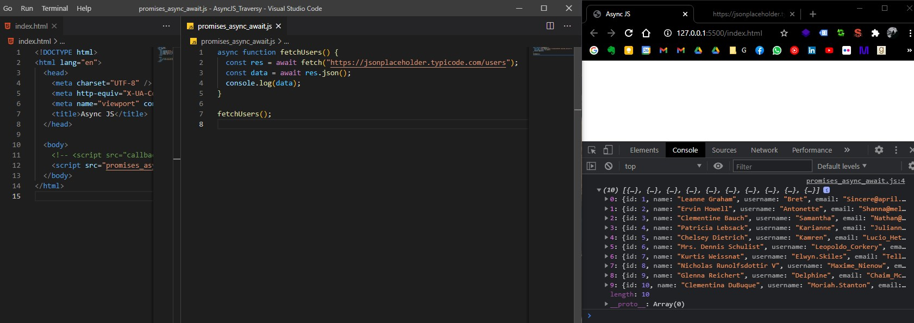

<br/>

<br/>

<br/>

# JavaScript Promises - fCC

[(Notes taken from freeCodeCamp JavaScript course)](https://www.freecodecamp.org/learn/javascript-algorithms-and-data-structures/es6/create-a-javascript-promise)

We use promises to do something asynchronously. When a task completes, you either fulfill your promise or fail to do so.<br/>
`Promise` is a constructor function that is created with `new` keyword. It takes a function as its argument, with two parameters: `resolve` and `reject`. These are methods used to determine the outcome of the promise.

```js
const myPromise = new Promise((resolve, reject) => {

});
```

A promise has three states: `pending`, `fulfilled`, and `rejected`: 

- `resolve` is used when you want your promise to succeed
- `reject` is used when you want it to fail.

```js
const myPromise = new Promise((resolve, reject) => {
  if(condition) {
    resolve("Promise was fulfilled or Data Acquired");
  } else {
    reject("Promise was rejected or Data not received");
  }
});
```

The example above uses strings for the argument of these functions, but it can really be anything. Often, it might be an object, that you would use data from, to put on your website or elsewhere.

## [Handle a Fulfilled Promise with `then`](https://www.freecodecamp.org/learn/javascript-algorithms-and-data-structures/es6/handle-a-fulfilled-promise-with-then)

Promises are most useful when you have a process that takes an unknown amount of time in your code (i.e. something asynchronous), often a server request. When you make a server request it takes some amount of time, and after it completes you usually want to do something with the response from the server. This can be achieved by using the `then` method. The `then` method is executed immediately after your promise is fulfilled with `resolve`:

```js
const makeServerRequest = new Promise((resolve, reject) => {   
  if(responseFromServer) {
    resolve("We got the data");
  } else {  
    reject("Data not received");
  }
});

makeServerRequest.then(result => {
  console.log(result);
});
```

## [Handle a Rejected Promise with `catch`](https://www.freecodecamp.org/learn/javascript-algorithms-and-data-structures/es6/handle-a-rejected-promise-with-catch)

`catch` is the method used when your promise has been rejected and it's executed immediately after a promise's reject method is called.

```js
makeServerRequest.catch(error => {
  console.log(error);
});
```

- More on **promises**:
  - [from web.dev](https://web.dev/promises/) 
  - [from developer.mozilla](https://developer.mozilla.org/en-US/docs/Web/JavaScript/Reference/Global_Objects/Promise).

<br/>

<br/>

<br/>

# Fetch API - Traversy

Notes taken from:

- [31m Fetch API Introduction - Traversy Media](https://www.youtube.com/watch?v=Oive66jrwBs)
- [w3schools Fetch API](https://www.w3schools.com/js/js_api_fetch.asp)
- [Developer Mozilla Fetch API](https://developer.mozilla.org/en-US/docs/Web/API/Fetch_API)

Resources:

- [JSONPlaceholder - Free Fake REST API](https://jsonplaceholder.typicode.com/)
- [Bootstrap 4](https://getbootstrap.com/docs/4.0/getting-started/introduction/)

(Notes taken on Sunday, March 28, 2021)

<br/>

The Fetch API provides an interface for fetching resources (including across the network). It will seem familiar to anyone who has used [`XMLHttpRequest` (used in AJAX)](https://developer.mozilla.org/en-US/docs/Web/API/XMLHttpRequest), but the new API provides a more powerful and flexible feature set. Note that the Fetch API is newer than AJAX request, [so it's not compatible with older browsers](https://developer.mozilla.org/en-US/docs/Web/API/Fetch_API#browser_compatibility) (eg. not compatible with IE Explorer at all).

> [The Fetch API interface allows web browser to make HTTP requests to web servers.](https://www.w3schools.com/js/js_api_fetch.asp)
>
> 😀 No need for XMLHttpRequest anymore.

<br/>

Let's get started with some examples from the Traversy Media tutorial: [Fetch API Introduction](https://www.youtube.com/watch?v=Oive66jrwBs)

## Example Fetching local TXT file asynchronously

First we are going to create a local text file with random text (`./sample.txt`).

The `fetch()` method takes one mandatory argument, the path to the resource you want to fetch (either a URL or a file name). Fetch API returns a `Promise` object that resolves to the [`Response`](https://developer.mozilla.org/en-US/docs/Web/API/Response) to that request, whether it is successful or not. To work with Promises we can either use `.then()` methods or the `async await` functions.

In `index.html`:

```html
<!DOCTYPE html>
<html lang="en">
  <head>
    <meta charset="UTF-8" />
    <meta http-equiv="X-UA-Compatible" content="IE=edge" />
    <meta name="viewport" content="width=device-width, initial-scale=1.0" />
    <title>Fetch API Tutorial</title>
  </head>
  <body>
    <button id="getText">Get Text</button>
  </body>

  <script>
    document.getElementById("getText").addEventListener("click", () => {
      fetch("sample.txt").then((res) => {
        console.log(res);
      });
    });
  </script>
</html>
```

We will get a `Response` with status 200 (The HTTP **`200 OK`** success status response code indicates that the request has succeeded):

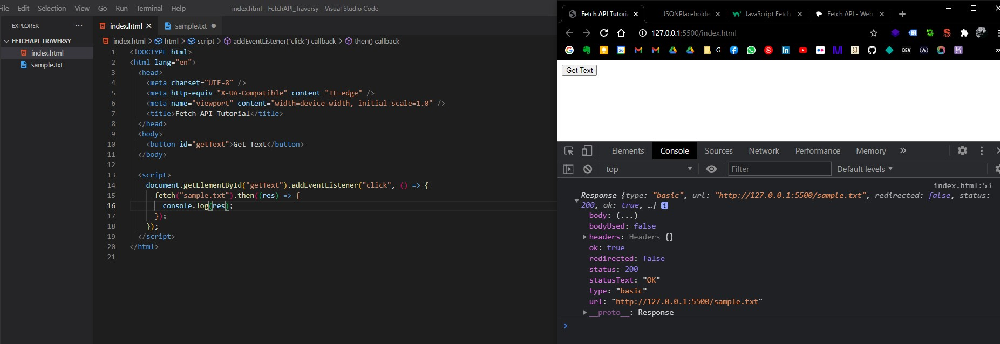

If we want to retrieve the actual text from the returned Promise, we need to use the `.text()` function (because the resource is from a `.txt` file, if it was a JSON file, we'd use `.json()`), then add another `.then()`.

```html
<script>
  document.getElementById("getText").addEventListener("click", () => {
    fetch("sample.txt")
      .then((res) => res.text())
      .then((data) => console.log(data));
  });
</script>
```

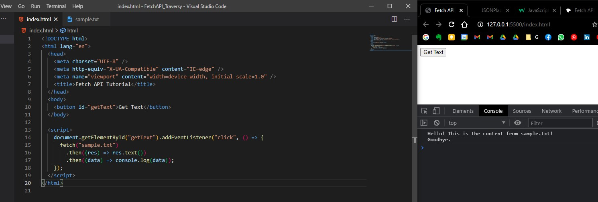

<br/>

Let's try to output the retrieved text to the DOM. We will add a `<div>` tag with an ID of `#output`.

Complete HTML:

```html
<!DOCTYPE html>
<html lang="en">
  <head>
    <meta charset="UTF-8" />
    <title>Fetch API Tutorial</title>
  </head>
  <body>
    <button id="getText">Get Text</button>
    <div id="output"></div>
  </body>

  <script>
    document.getElementById("getText").addEventListener("click", () => {
      fetch("sample.txt")
        .then((res) => res.text())
        .then((data) => {
          document.getElementById("output").innerHTML = data;
        })
        .catch((error) => console.log(error));
    });
  </script>
</html>
```

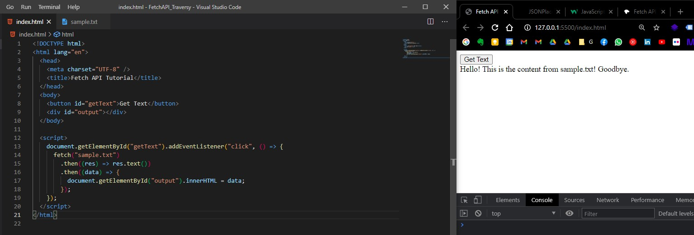

<br/>

## Example Fetching local JSON file

Let's create a JSON file:

```json
[
  {
    "id": 1,
    "name": "Alex",
    "email": "alex@example.com"
  },
  {
    "id": 2,
    "name": "Glenn",
    "email": "glenn@example.com"
  },
  {
    "id": 3,
    "name": "Negan",
    "email": "negam@example.com"
  }
]
```

HMTL:

```html
<!-- index.html -->
<!DOCTYPE html>
<html lang="en">
  <head>
    <meta charset="UTF-8" />
    <title>Fetch API Tutorial</title>
  </head>
  <body>
    <button id="getText">Get Text</button>
    <button id="getLocalUsers">Get Local Users</button>
    <div id="output"></div>
  </body>

  <script src="script.js"></script>
</html>
```

<br/>

We are going to fetch the content of our local `users.json` file, then we will loop through and display each user in the DOM HTML. We will also use JS template literals strings.

JS:

```js
/* script.js */
document.getElementById("getLocalUsers").addEventListener("click", () => {
  fetch("users.json")
    .then((res) => res.json())
    .then((data) => {
      let output = "<h2>Users:</h2>";
      data.forEach((user) => {
        output += `
          <ul>
            <li>ID: ${user.id}</li>
            <li>Name: ${user.name}</li>
            <li>Email: ${user.email}</li>
          </ul>
        `;
      });
      document.getElementById("output").innerHTML = output;
    });
});
```

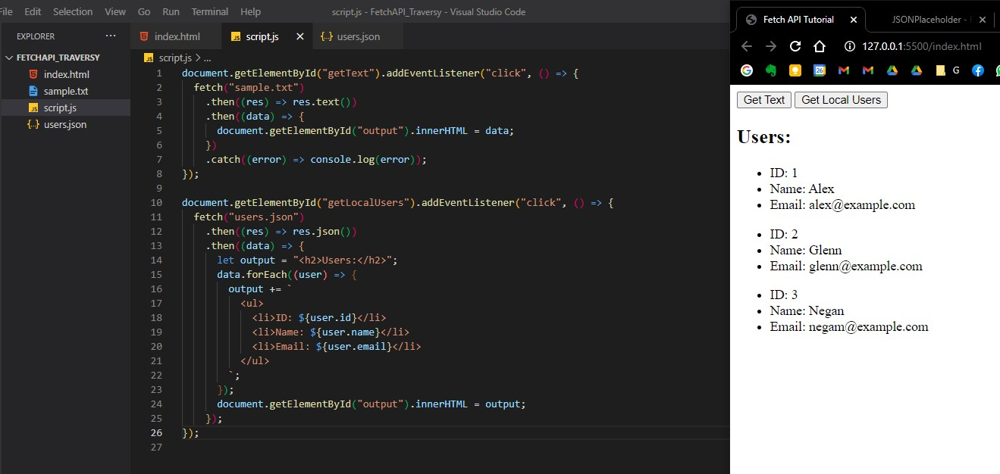

<br/>

<br/>

## Fetch Data from outside REST API

We will fetch data from an external REST API (namely https://jsonplaceholder.typicode.com/posts).

HTML:

```html
<!DOCTYPE html>
<html lang="en">
  <head>
    <meta charset="UTF-8" />
    <title>Fetch API Tutorial</title>
  </head>
  <body>
    <button id="getText">Get Text</button>
    <button id="getLocalUsers">Get Local Users</button>
    <button id="getExternalPosts">Get External Posts</button>
    <div id="output"></div>
  </body>

  <script src="script.js"></script>
</html>
```

JS:

```js
/* script.js */
document.getElementById("getExternalPosts").addEventListener("click", () => {
  fetch("https://jsonplaceholder.typicode.com/posts")
    .then((res) => res.json())
    .then((data) => {
      console.log(data);
    });
});
```

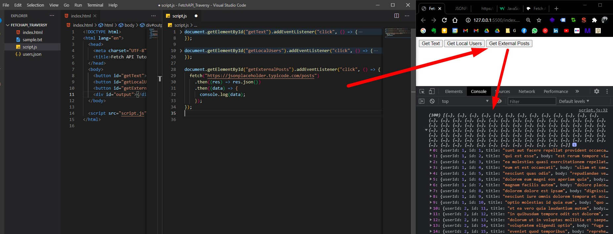

<br/>

Now let's display all these data to DOM:

```js
/* script.js */
document.getElementById("getExternalPosts").addEventListener("click", () => {
  fetch("https://jsonplaceholder.typicode.com/posts")
    .then((res) => res.json())
    .then((data) => {
      let output = "<h2>Posts</h2>";
      data.forEach((post) => {
        output += `
          <div>
            <h3>${post.title}</h3>
            <p>${post.body}</p>
          </div>
        `;
      });
      document.getElementById("output").innerHTML = output;
    });
});
```

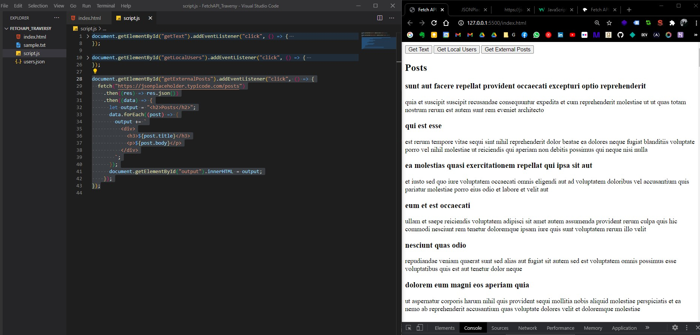

Nice.

<br/>

## Making a POST request to external API

Now let's make a POST request to the external REST API from https://jsonplaceholder.typicode.com/. We will make this request from a **form** in our HTML.

Of course we can make a POST request with data filled directly from JavaScript (see examples here: https://jsonplaceholder.typicode.com/guide/ on `Creating a resource` section), our example will be the same but we will retrieve the values from form fields.

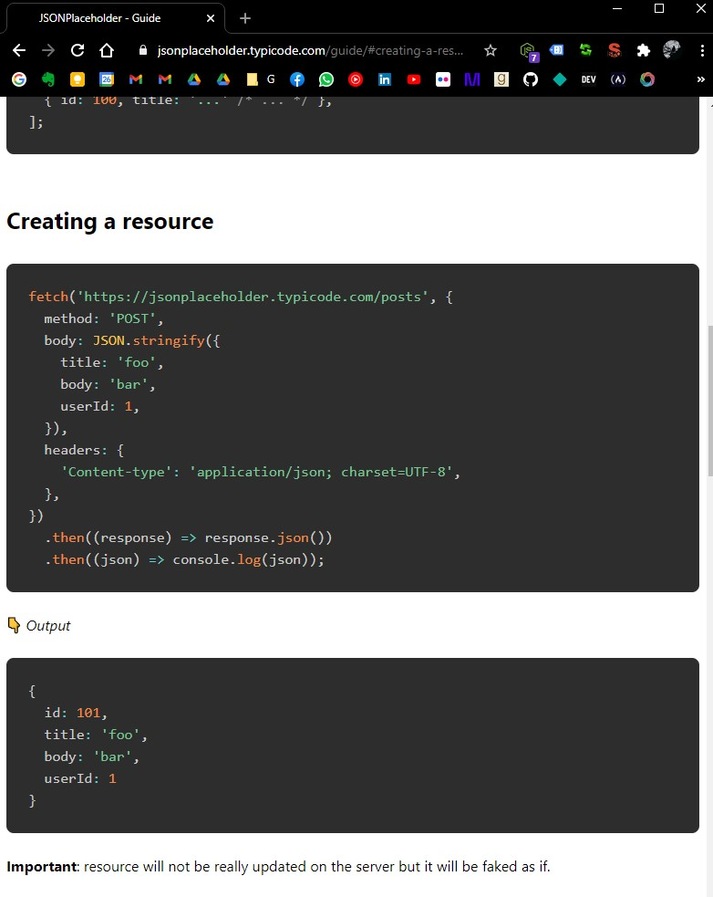

<br/>

Let's get started:

Add a simple form in HMTL:

```html
<!DOCTYPE html>
<html lang="en">
  <head>
    <meta charset="UTF-8" />
    <title>Fetch API Tutorial</title>
  </head>
  <body>
    <button id="getText">Get Text</button>
    <button id="getLocalUsers">Get Local Users</button>
    <button id="getExternalPosts">Get External Posts</button>
    <hr />

    <form id="addPost">
      <div>
        <input type="text" id="title" placeholder="Title" />
      </div>
      <div>
        <textarea id="body" placeholder="Body"></textarea>
      </div>
      <input type="submit" value="Submit" />
    </form>

    <div id="output"></div>
  </body>

  <script src="script.js"></script>
</html>
```

Now, in JS we'll add an event listener for that form with the action of `submit`. We'll also `preventDefault()` for the form submit and retrieve each value from the form's fields using `.value`.

Now, in our `fetch()` function we will add an object as a second argument, where we specify that the request method used is POST. Also, our request must contain the required headers and body...

```js
document.getElementById("addPost").addEventListener("submit", addPost);
function addPost(e) {
  e.preventDefault();

  let title = document.getElementById("title").value;
  let body = document.getElementById("body").value;

  fetch("https://jsonplaceholder.typicode.com/posts", {
    method: "POST",
    headers: {
      Accept: "application/json, text/plain, */*",
      "Content-type": "application/json",
    },
    body: JSON.stringify({ title: title, body: body }),
  })
    .then((res) => res.json())
    .then((data) => console.log(data));
}
```

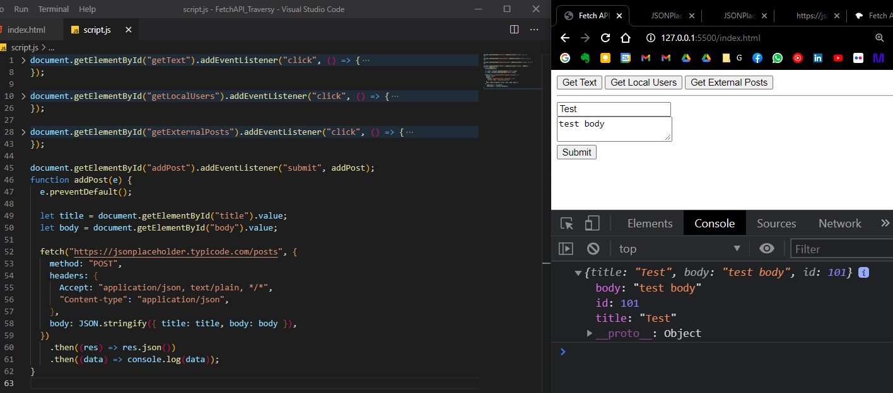

Nice.

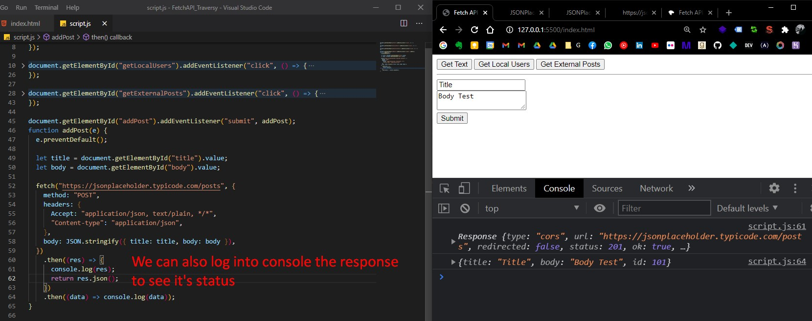

<br/>

## Adding bootstrap to the examples above for fun.

Now let's just add some [Bootstrap 4](https://getbootstrap.com/docs/4.0/getting-started/introduction/) for our buttons, form and output to look a little nicer.

We will wrap everything in a `<div class="container">`, add a `<h1 class="display-4 my-4">` header, wrap buttons in `d-flex` div, add style to buttons with `btn btn-info mr-4` classes.

We'll wrap our form div's in a `form-group` classes, and to the inputs/text-areas will add `form-control`, and then we add `btn btn-secondary` to submit.

In `script.js` we'll add `list-group mb-3` classes to `<ul>` tags, and `list-group-item` to `<li>` tags. For our external API, we'll add `class="card card-body mb-3"` to the div.

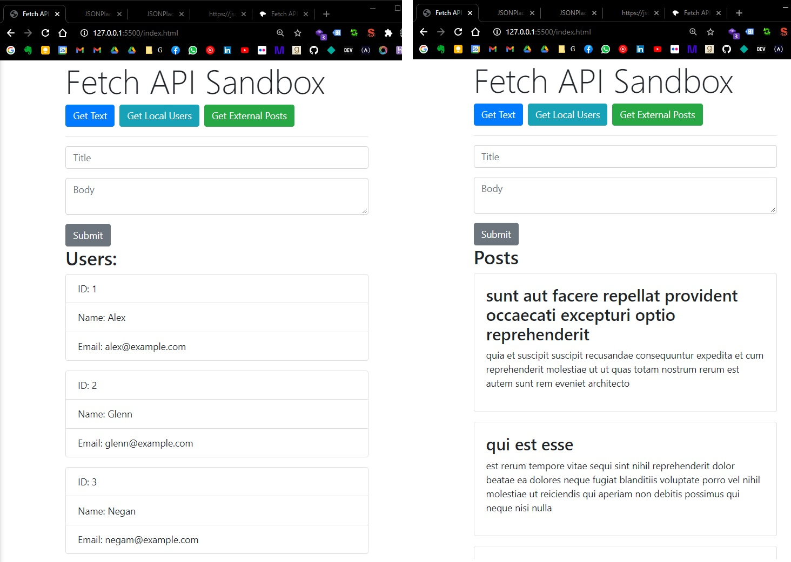

Nice.

<br/>

**COMPLETE CODE:**

HTML:

```html
<!-- index.html -->
<!DOCTYPE html>
<html lang="en">
  <head>
    <meta charset="UTF-8" />
    <link
      rel="stylesheet"
      href="https://maxcdn.bootstrapcdn.com/bootstrap/4.0.0/css/bootstrap.min.css"
      integrity="sha384-Gn5384xqQ1aoWXA+058RXPxPg6fy4IWvTNh0E263XmFcJlSAwiGgFAW/dAiS6JXm"
      crossorigin="anonymous"
    />

    <title>Fetch API Tutorial</title>
  </head>

  <body>
    <div class="container">
      <h1 class="display-4">Fetch API Sandbox</h1>
      <div class="d-flex">
        <button class="btn btn-primary mr-2" id="getText">Get Text</button>
        <button class="btn btn-info mr-2" id="getLocalUsers">
          Get Local Users
        </button>
        <button class="btn btn-success mr-2" id="getExternalPosts">
          Get External Posts
        </button>
      </div>

      <hr />

      <form id="addPost">
        <div class="form-group">
          <input
            class="form-control"
            type="text"
            id="title"
            placeholder="Title"
          />
        </div>
        <div class="form-group">
          <textarea
            class="form-control"
            id="body"
            placeholder="Body"
          ></textarea>
        </div>
        <input class="btn btn-secondary" type="submit" value="Submit" />
      </form>

      <div id="output"></div>
    </div>

    <script src="script.js"></script>
  </body>
</html>
```

JS:

```js
/* script.js */
document.getElementById("getText").addEventListener("click", () => {
  fetch("sample.txt")
    .then((res) => res.text())
    .then((data) => {
      document.getElementById("output").innerHTML = `<p>${data}</p>`;
    })
    .catch((error) => console.log(error));
});

document.getElementById("getLocalUsers").addEventListener("click", () => {
  fetch("users.json")
    .then((res) => res.json())
    .then((data) => {
      let output = "<h2>Users:</h2>";
      data.forEach((user) => {
        output += `
          <ul class="list-group mb-3">
            <li class="list-group-item">ID: ${user.id}</li>
            <li class="list-group-item">Name: ${user.name}</li>
            <li class="list-group-item">Email: ${user.email}</li>
          </ul>
        `;
      });
      document.getElementById("output").innerHTML = output;
    });
});

document.getElementById("getExternalPosts").addEventListener("click", () => {
  fetch("https://jsonplaceholder.typicode.com/posts")
    .then((res) => res.json())
    .then((data) => {
      let output = "<h2>Posts</h2>";
      data.forEach((post) => {
        output += `
          <div class="card card-body mb-3">
            <h3>${post.title}</h3>
            <p>${post.body}</p>
          </div>
        `;
      });
      document.getElementById("output").innerHTML = output;
    });
});

document.getElementById("addPost").addEventListener("submit", addPost);
function addPost(e) {
  e.preventDefault();

  let title = document.getElementById("title").value;
  let body = document.getElementById("body").value;

  fetch("https://jsonplaceholder.typicode.com/posts", {
    method: "POST",
    headers: {
      Accept: "application/json, text/plain, */*",
      "Content-type": "application/json",
    },
    body: JSON.stringify({ title: title, body: body }),
  })
    .then((res) => {
      console.log(res);
      return res.json();
    })
    .then((data) => console.log(data));
}
```

<br/>

<br/>

<br/>

# AJAX - Traversy

Notes taken from:

- [1h10 AJAX Crash Course in Vanilla JS - Traversy Media](https://youtu.be/82hnvUYY6QA)
- [AJAX on w3schools](https://www.w3schools.com/xml/ajax_intro.asp)
- [AJAX on developer.mozilla](https://developer.mozilla.org/en-US/docs/Web/Guide/AJAX)

AJAX stands for **Asynchronous JavaScript and XML**. With AJAX, you can:

- Update a web page without reloading the page (asynchronously)
- Request data from a server - after the page has loaded
- Receive data from a server - after the page has loaded
- Send data to a server - in the background

Although X in Ajax stands for XML, [JSON](https://developer.mozilla.org/en-US/docs/Glossary/JSON) is used more than XML nowadays because of its many advantages such as being lighter and a part of JavaScript. Both JSON and XML are used for packaging information in the Ajax model.

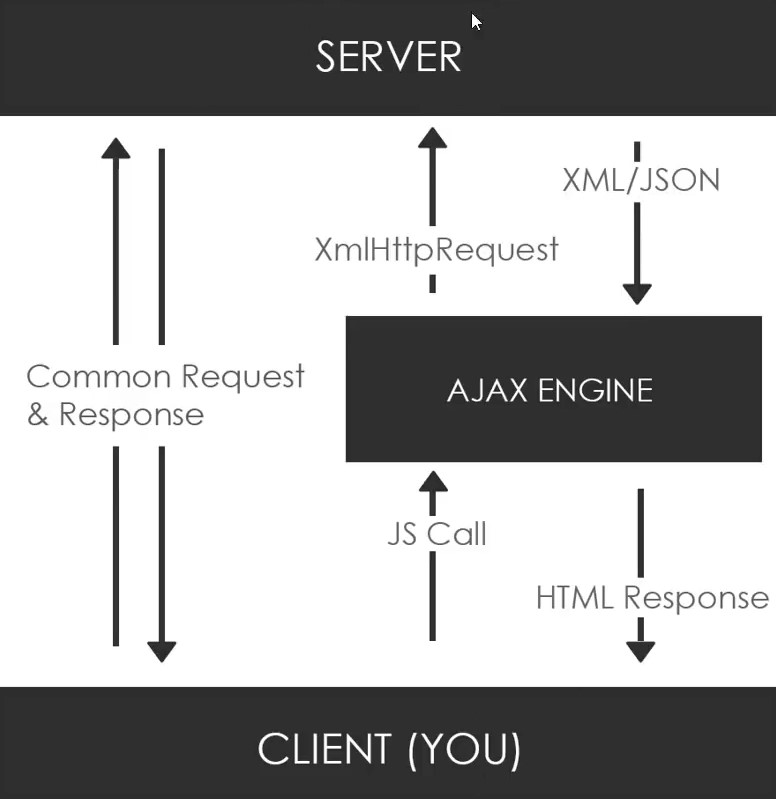

The JS Calls can be done with **Vanilla JS**, or **Fetch API**, or with **JQuery**, or a HTTP Library like **Axios**, or **Superagent**,or **Node HTTP**... These request are made with the **`XmlHttpRequest` object** (also called the XHR object). These request can be anything (like creating/adding an entry to the database, update the database, search within database, delete, etc... eg: when user clicks outside the form, automatically search in that database if the entered email is correct, and display a success/warning message).

<br/>

**NOTE: In order to use AJAX, we will need some kind of Server, for this tutorial we'll install [XAMPP](https://www.apachefriends.org/ro/index.html).**

<br/>


<br/>

<br/>

<br/>

# Axios HTTP Library

Notes taken from:

- [42m Axios Crash Course | HTTP Library - Traversy Media](https://youtu.be/6LyagkoRWYA)


