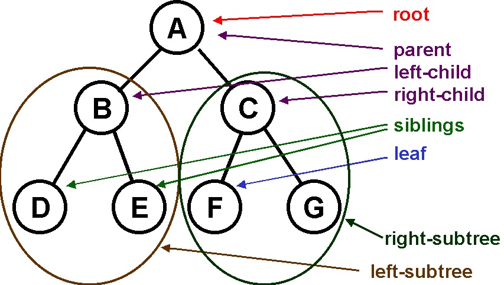
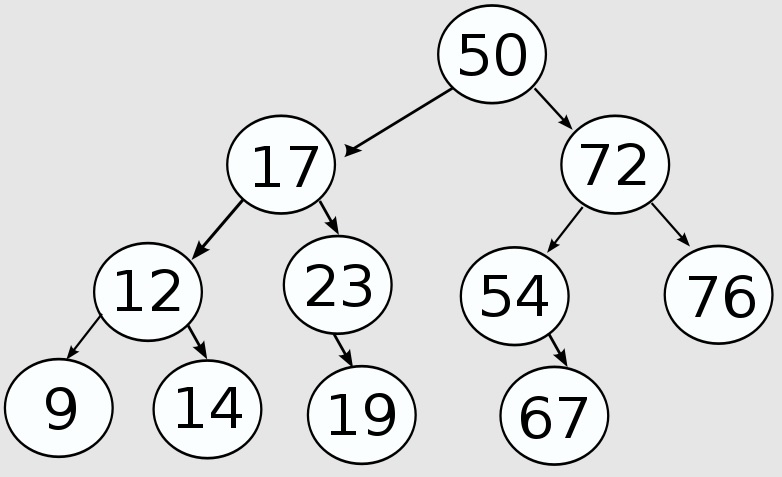
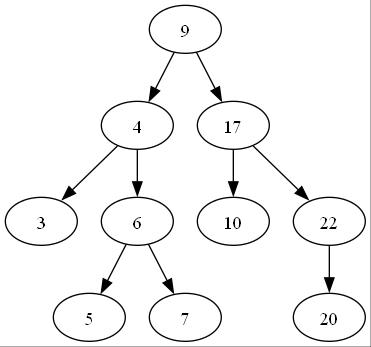

# JavaScript Data Structures

## Binary Tree

Credits / Notes taken from:

- [Binary Search Tree - Beau teaches JavaScript - freeCodeCamp - 13m](https://www.youtube.com/watch?v=5cU1ILGy6dM)
- [Binary Search Tree: Traversal & Height - Beau teaches JavaScript - 14m](https://www.youtube.com/watch?v=Aagf3RyK3Lw)
  - ^^Source Code: https://codepen.io/beaucarnes/pen/ryKvEQ?editors=0011





```js
/* Binary Search Tree */
class Node {
  constructor(data, left = null, right = null) {
    this.data = data;
    this.left = left;
    this.right = right;
  }
}

class BinarySearchTree {
  constructor() {
    this.root = null;
  }

  add(data) {
    const node = this.root;

    if (node === null) {
      this.root = new Node(data);
      return;
    }

    const searchTree = function (node) {
      if (data < node.data) {
        if (node.left === null) {
          node.left = new Node(data);
          return;
        }
        if (node.left !== null) {
          return searchTree(node.left);
        }
      }

      if (data > node.data) {
        if (node.right === null) {
          node.right = new Node(data);
          return;
        }
        if (node.right !== null) {
          return searchTree(node.right);
        }
      }

      return null;
    };

    return searchTree(node);
  }

  findMin() {
    let current = this.root;
    while (current.left !== null) {
      current = current.left;
    }
    return current.data;
  }

  findMax() {
    let current = this.root;
    while (current.right !== null) {
      current = current.right;
    }
    return current.data;
  }

  find(data) {
    let current = this.root;
    while (current.data !== data) {
      if (data < current.data) {
        current = current.left;
      } else {
        current = current.right;
      }
      if (current === null) {
        return null;
      }
    }
    return current;
  }

  isPresent(data) {
    let current = this.root;
    while (current) {
      if (data === current.data) {
        return true;
      }
      if (data < current.data) {
        current = current.left;
      } else {
        current = current.right;
      }
    }
    return false;
  }

  remove(data) {
    const removeNode = function (node, data) {
      if (node == null) {
        return null;
      }
      if (data == node.data) {
        // node has no children
        if (node.left == null && node.right == null) {
          return null;
        }
        // node has no left child
        if (node.left == null) {
          return node.right;
        }
        // node has no right child
        if (node.right == null) {
          return node.left;
        }
        // node has two children
        var tempNode = node.right;
        while (tempNode.left !== null) {
          tempNode = tempNode.left;
        }
        node.data = tempNode.data;
        node.right = removeNode(node.right, tempNode.data);
        return node;
      }

      if (data < node.data) {
        node.left = removeNode(node.left, data);
        return node;
      }

      if (data > node.data) {
        node.right = removeNode(node.right, data);
        return node;
      }
    };

    this.root = removeNode(this.root, data);
  }

  isBalanced() {
    return this.findMinHeight() >= this.findMaxHeight() - 1;
  }

  /**
   * @param {Node} node
   * @return {number} Distance from root node
   * to the first leaf node without two children
   */
  findMinHeight(node = this.root) {
    if (node == null) {
      return -1;
    }
    let left = this.findMinHeight(node.left);
    let right = this.findMinHeight(node.right);
    if (left < right) {
      return left + 1;
    } else {
      return right + 1;
    }
  }

  /**
   * @param {Node} node
   * @return {number} Distance from root node
   * to the last leaf node without children
   */
  findMaxHeight(node = this.root) {
    if (node == null) {
      return -1;
    }
    let left = this.findMaxHeight(node.left);
    let right = this.findMaxHeight(node.right);
    if (left > right) {
      return left + 1;
    } else {
      return right + 1;
    }
  }

  inOrder() {
    if (this.root == null) {
      return null;
    }

    var result = new Array();
    function traverseInOrder(node) {
      node.left && traverseInOrder(node.left);
      result.push(node.data);
      node.right && traverseInOrder(node.right);
    }
    traverseInOrder(this.root);
    return result;
  }

  preOrder() {
    if (this.root == null) {
      return null;
    }

    var result = new Array();
    function traversePreOrder(node) {
      result.push(node.data);
      node.left && traversePreOrder(node.left);
      node.right && traversePreOrder(node.right);
    }
    traversePreOrder(this.root);
    return result;
  }

  postOrder() {
    if (this.root == null) {
      return null;
    }

    var result = new Array();
    function traversePostOrder(node) {
      node.left && traversePostOrder(node.left);
      node.right && traversePostOrder(node.right);
      result.push(node.data);
    }
    traversePostOrder(this.root);
    return result;
  }

  levelOrder() {
    let result = [];
    let Q = [];
    if (this.root != null) {
      Q.push(this.root);
      while (Q.length > 0) {
        let node = Q.shift();
        result.push(node.data);
        if (node.left != null) {
          Q.push(node.left);
        }
        if (node.right != null) {
          Q.push(node.right);
        }
      }
      return result;
    }
    return null;
  }
}

const bst = new BinarySearchTree();

bst.add(9);
bst.add(4);
bst.add(17);
bst.add(3);
bst.add(6);
bst.add(22);
bst.add(5);
bst.add(7);
bst.add(20);

console.log(bst.findMinHeight()); // 1
console.log(bst.findMaxHeight()); // 3
console.log(bst.isBalanced()); // false

bst.add(10);
console.log(bst.findMinHeight()); // 2
console.log(bst.findMaxHeight()); // 3
console.log(bst.isBalanced()); // true

console.log("inOrder: " + bst.inOrder());
// Left->Root->Right
// inOrder: 3,4,5,6,7,9,10,17,20,22

console.log("preOrder: " + bst.preOrder());
// Root->Left->Right
// preOrder: 9,4,3,6,5,7,17,10,22,20

console.log("postOrder: " + bst.postOrder());
// Left->Right->Root
// postOrder: 3,5,7,6,4,10,20,22,17,9

console.log("levelOrder: " + bst.levelOrder());
// levelOrder: 9,4,17,3,6,10,22,5,7,20
```

<br/>



Notes on Tree Traversal Methods - In order to find all the values in the tree:

- Depth-First Search (DFS): A given subtree is explored as deeply as possible before the search continues on another subtree
  - In Order Traversal - Begin search from the left most and end at the right most node (The numbers will be in order/sorted!)
    - Example inOrder: 3, 4, 5, 6, 7, 9, 10, 17, 20, 22
  - Pre Order Traversal - Explore the root node before the leafs
    - Example preOrder: 9, 4, 3, 6, 5, 7, 17, 10, 22, 20
  - Post Order Travers - Explore the leaf ndoes before the root
    - Example postOrder: 3, 5, 7, 6, 4, 10, 20, 22, 17, 9
- Breadth-First Search (BFS):
  - Lever Order - Explores all the nodes in a given level within a tree before continuing to the next level
    - Example levelOrder: 9, 4, 17, 3, 6, 10, 22, 5, 7, 20

(Tuesday, October 24, 2023, 20:46)
