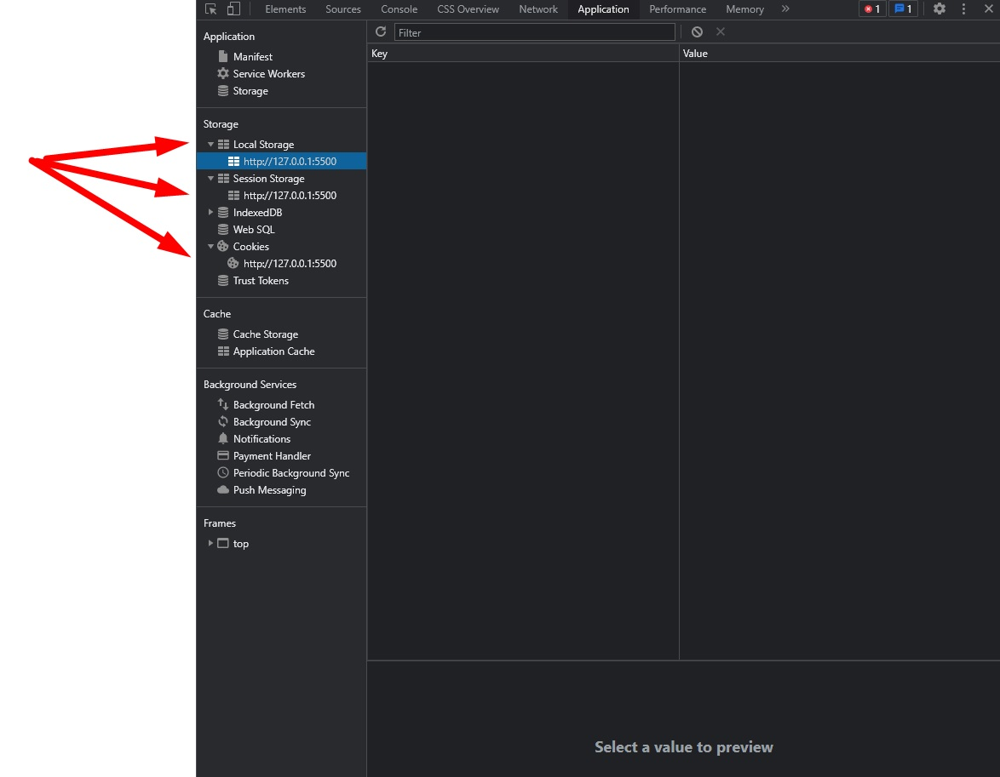
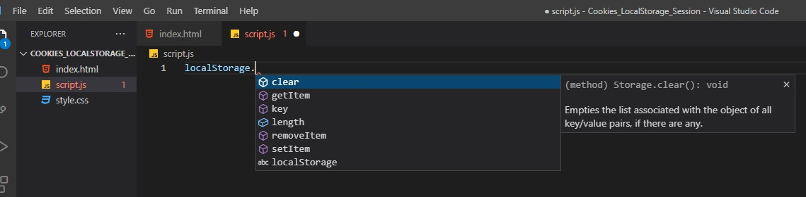
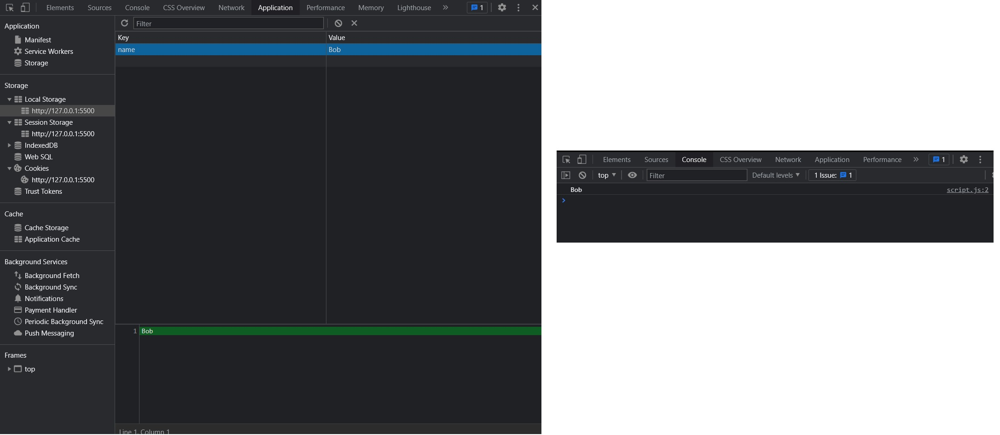
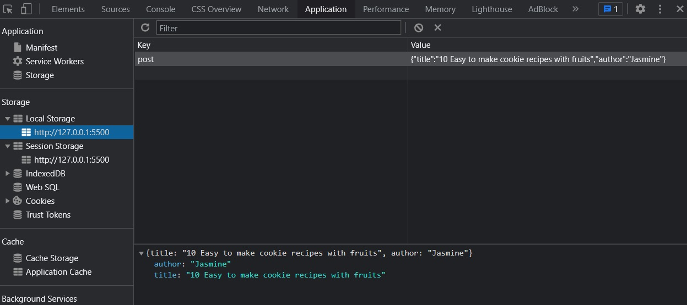
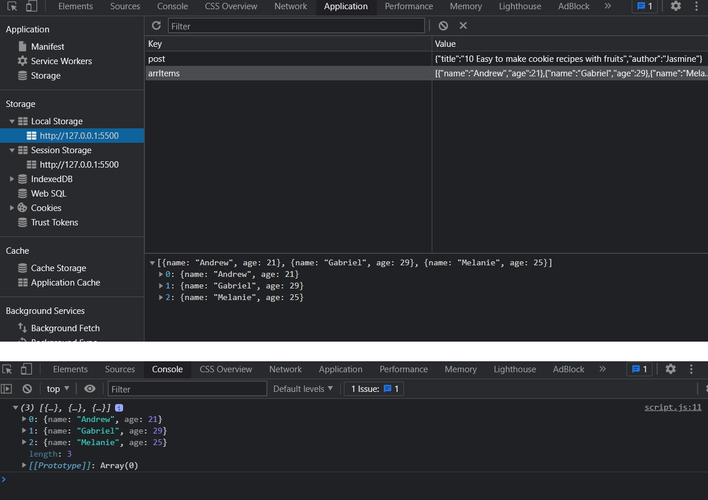
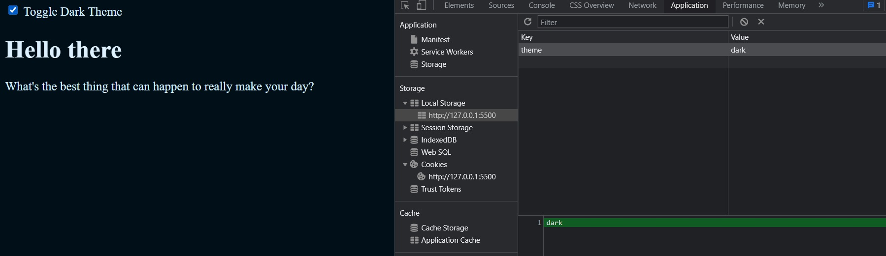
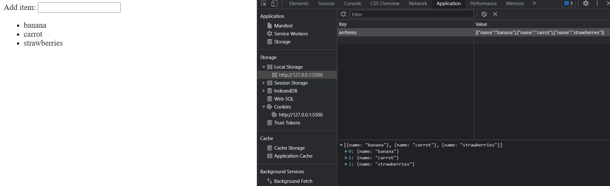
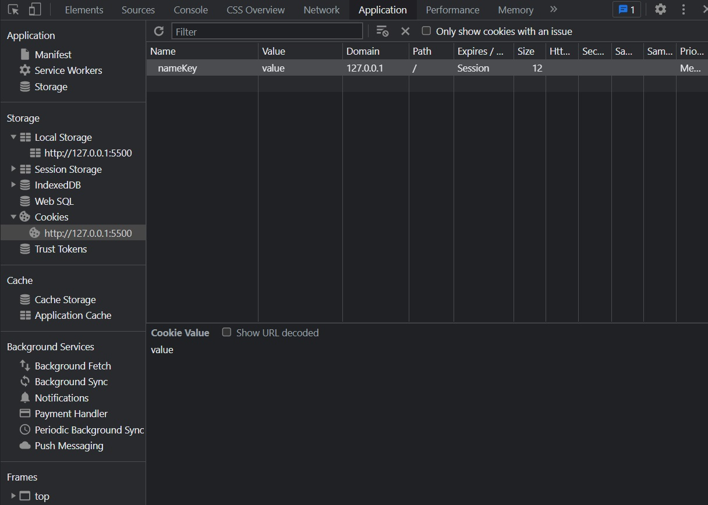
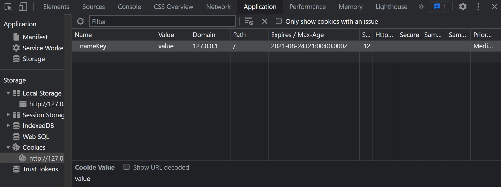
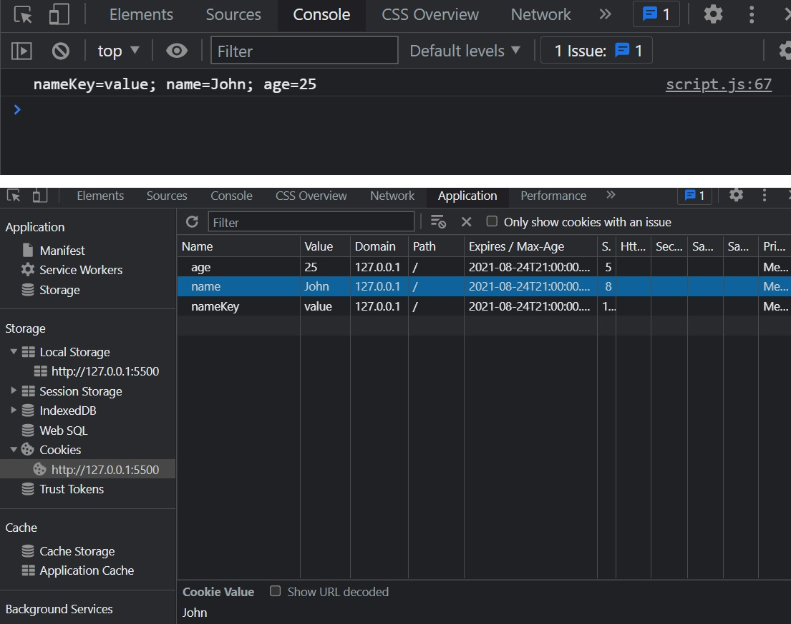

**Resources / Notes taken from:**

- [14min JavaScript Cookies vs Local Storage vs Session - Web Dev Simplified](https://www.youtube.com/watch?v=GihQAC1I39Q)
- [localStorage vs sessionStorage vs Cookies – a Detailed Comparison - WPreset article](https://wpreset.com/localstorage-sessionstorage-cookies-detailed-comparison/)
- [Create A Dark/Light Mode Switch with CSS Variables](https://dev.to/ananyaneogi/create-a-dark-light-mode-switch-with-css-variables-34l8)
- [PHP Create/Retrieve a Cookie - w3schools.com](https://www.w3schools.com/php/php_cookies.asp)
- [JavaScript Cookies - w3schools.com](https://www.w3schools.com/js/js_cookies.asp)

<br/>

**Table of Contents:**

- [General Information](#general-information)
- [localStorage and sessionStorage](#localstorage-and-sessionstorage)
  - [Setting and retrieving data in localStorage](#setting-and-retrieving-data-in-localstorage)
  - [Setting and retrieving data in sessionStorage](#setting-and-retrieving-data-in-sessionstorage)
  - [Storing and retrieving JSON in localStorage](#storing-and-retrieving-json-in-localstorage)
  - [Examples of using localStorage](#examples-of-using-localstorage)
    - [Saving dark-mode / light-theme settings](#saving-dark-mode--light-theme-settings)
    - [Storing items from ToDo List](#storing-items-from-todo-list)
- [Cookies](#cookies)
  - [Creating Cookies in JS](#creating-cookies-in-js)
  - [Retrieving Cookies in JS by name](#retrieving-cookies-in-js-by-name)
  - [Creating/Retrieving Cookies on server-side](#creatingretrieving-cookies-on-server-side)

<br/>

# General Information

- **Do not store any sensitive data** such as credit card numbers or passwords in any form of local storage! Ever!
- Users can delete their localStorage. cookies storage and sessions at any time.
- All **cookies expire** at some point, but people tend to set lifetime to a few years which seems forever in internet time. Local storage on the other hand never expires and is available till the app or user deletes it. Session storage gets purged when tab or window gets closed – no exceptions.
- Even if the supported data types are **only strings**, you can save data as **JSON** in the form of "string".
- With local storage, **no data is transferred between the client and the server** (unless there’s code that explicitly does that, for example reading cookies with PHP). It’s great for reducing payload size.
- So, cookies can be sent to the server for further processing.
- **Users “shouldn’t” access local data and change it directly** (outside your app) but nothing is stopping them in doing so. There are numerous [debugging tools](https://chrome.google.com/webstore/detail/html5-storage-manager-all/giompennnhheakjcnobejbnjgbbkmdnd?hl=en) available for editing locally stored data. So don’t trust local data or assume the user didn’t touch it. Always assume the worse.

<br/>

| Feature                                | Cookies                                            | localStorage                      | sessionStorage                 |
| -------------------------------------- | -------------------------------------------------- | --------------------------------- | ------------------------------ |
| Maximum data size                      | 4 kB                                               | 5 MB                              | 5 MB                           |
| Blockable by users                     | yes                                                | yes                               | yes                            |
| Auto-expire option                     | yes                                                | no                                | yes                            |
| Accessible from                        | any window                                         | any window                        | same tab                       |
| Supported data types                   | string only                                        | string only                       | string only                    |
| Accessible server-side                 | yes                                                | no                                | no                             |
| Data transferred on every HTTP request | yes                                                | no                                | no                             |
| Editable by users                      | yes                                                | yes                               | yes                            |
| Supported on SSL                       | yes                                                | n/a                               | n/a                            |
| Can be accessed on                     | server-side & client-side<br />(Server an Browser) | client-side only<br/>(Browser)    | client-side only<br/>(Browser) |
| Clearing / deleting                    | PHP, JS & automatic                                | JS only                           | JS & automatic                 |
| Lifetime                               | as specified                                       | until deleted<br />by user or app | until tab is closed            |
| Secure data storage                    | no                                                 | no                                | no                             |

(Table taken from https://wpreset.com/localstorage-sessionstorage-cookies-detailed-comparison/)

<br/>

You can find each storage type and values stored, for the current website you are on, with Dev Tools (`F12` or `CTRL+SHIFT+I`) under the `Application` tab:



<br/>

# localStorage and sessionStorage

There are a few methods for localStorage:



- `localStorage.getItem("keyName")` - returns the current value (string) associated with the given key name
- `locatStorage.setItem("keyName", "value")` - sets the value of the pair identified by key to value, creating a new key/value pair if none existed for key previously
- `localStorage.removeItem("keyName")` - removes the key/value pair with the given key from the list associated with the object
- `localStorage.key(number)` - returns the name of the nth key in the list, or null if n is greater than or equal to the number of key/value pairs in the object

<br/>

## Setting and retrieving data in localStorage

All data in localStorage (as well as cookies and session storage) are stored as key-value pairs.

In order to set an item/data in localStorage, we need to call `localStorage.setItem('keyName', 'value')`. To retrieve data, we call `localStorage.getItem('keyName')`.

```js
localStorage.setItem("name", "Bob");
console.log(localStorage.getItem("name")); // Bob
```



Now, even if we delete `localStorage.setItem('name', 'Bob');` from our JavaScript file, the data with name:Bob will remain there, in the browser, even after hitting refresh (the localStorage is persistent even when we close the browser, unlike session storage that will delete itself when the tab/browser is closed).

<br/>

In order to update the value of an item, we just need to call `localStorage.setItem('keyName', 'value')` again on the item (key) we want to update.

To remove an item from localStorage from the app, we call in our js `localStorage.removeItem("keyName")`.

```js
localStorage.removeItem("name");
console.log(localStorage.getItem("name")); // null
```

<br/>

There are also other ways of setting and removing items from localStorage (or sessionStorage), by directly assigning properties to `localStorage`:

```js
localStorage.keyName = "value";
console.log(localStorage.keyName); // value

delete localStorage.keyName;
console.log(localStorage.keyName); // undefined
```

or:

```js
localStorage["keyName"] = "value";
console.log(localStorage["keyName"]); // value

delete localStorage.keyName;
console.log(localStorage.keyName); // undefined
```

<br/>

## Setting and retrieving data in sessionStorage

`sessionStorage` works exactly the same way (with the same methods of `localStorage`):

```js
sessionStorage.setItem("name", "John");
console.log(sessionStorage.getItem("name")); // John

sessionStorage.removeItem("name");
console.log(sessionStorage.getItem("name")); // null
```

<br/>

## Storing and retrieving JSON in localStorage

Here's an example of storing and retrieving a JS object with localStorage, using JSON:

```js
var post = {
  title: "10 Easy to make cookie recipes with fruits",
  author: "Jasmine",
};
localStorage.setItem("post", JSON.stringify(post));

// retrieve the object
var post = JSON.parse(localStorage.getItem("post"));
```



<br/>

Another example of storing an array of objects:

```js
var arrItems = [
  { name: "Andrew", age: 21 },
  { name: "Gabriel", age: 29 },
  { name: "Melanie", age: 25 },
];

arrItemsJSON = JSON.stringify(arrItems);
localStorage.setItem("arrItems", arrItemsJSON);

arrItemsRetrieved = JSON.parse(localStorage.getItem("arrItems"));
console.log(arrItemsRetrieved); // (3) [{…}, {…}, {…}]
```



<br/>

## Examples of using localStorage

### Saving dark-mode / light-theme settings

It's pretty convenient to save user preferences of an app, with local storage... for example, saving the light/dark mode preference:

- In CSS file, we would have:

```css
/* style.css */
:root {
  --primary-color: #2e4d5e;
  --font-color: #101a20;
  --bg-color: #fff;
}

[data-theme="dark"] {
  --primary-color: #dcf0fd;
  --font-color: #d4efff;
  --bg-color: #010f18;
}

body {
  background-color: var(--bg-color);
  color: var(--font-color);
}
h1 {
  color: var(--primary-color);
}
```

- Our simple HTML could look like this:

```html
<!-- index.html -->
<!DOCTYPE html>
<html lang="en">
  <head>
    <meta charset="UTF-8" />
    <title>LocalStorage, Cookies and Session Storage</title>
    <link rel="stylesheet" href="./style.css" />
    <script defer src="./script.js"></script>
  </head>

  <body>
    <input type="checkbox" id="checkboxDarkTheme" />
    <label for="checkboxDarkTheme">Toggle Dark Theme</label>
    <h1>Hello there</h1>
    <p>What's the best thing that can happen to really make your day?</p>
  </body>
</html>
```

- In our JavaScript file, we would have something like this:

```js
/* script.js */
const checkboxDarkTheme = document.getElementById("checkboxDarkTheme");

const currentTheme = localStorage.getItem("theme")
  ? localStorage.getItem("theme")
  : null;
if (currentTheme) {
  document.documentElement.setAttribute("data-theme", currentTheme);
  if (currentTheme === "dark") {
    checkboxDarkTheme.checked = true;
  }
}

checkboxDarkTheme.addEventListener("change", toggleDarkTheme);
function toggleDarkTheme(e) {
  if (e.target.checked) {
    document.documentElement.setAttribute("data-theme", "dark");
    localStorage.setItem("theme", "dark");
  } else {
    document.documentElement.setAttribute("data-theme", "light");
    localStorage.setItem("theme", "light");
  }
}
```

<br/>

Aand done. The change will persist on page refresh (or on browser closing and reopening).




<br/>

### Storing items from ToDo List

For the simplest to do app that runs without a database, we could store all the items in local storage.

If the local storage is empty, just don't render anything, else, we render the items (each item in a `<li>` tag):

```js
/* script.js */
/* Get items array (if any) from localStorage */
let arrItems;
let arrItemsJSON = localStorage.getItem("arrItems");
if (arrItemsJSON && arrItemsJSON.length) {
  arrItems = JSON.parse(arrItemsJSON);
} else {
  arrItems = [];
}

/* Grab DOM elements from HTML */
let outputItemList = document.getElementById("outputItemList");
let formAddItem = document.getElementById("formAddItem");
let inputTextItemName = document.getElementById("inputTextItemName");

/* Display items */
window.onload = displayItemsOnLoad;
function displayItemsOnLoad() {
  arrItems.forEach((item) => {
    let li = document.createElement("li");
    li.innerText = item.name;
    outputItemList.appendChild(li);
  });
}

/* Insert item */
formAddItem.addEventListener("submit", addItem);
function addItem(event) {
  event.preventDefault();
  if (inputTextItemName.value === "") return;

  let li = document.createElement("li");
  li.innerText = inputTextItemName.value.trim();
  outputItemList.appendChild(li);

  // Push to arrItems array, clear input, and save to localStorage
  arrItems.push({ name: inputTextItemName.value.trim() });
  inputTextItemName.value = "";
  localStorage.setItem("arrItems", JSON.stringify(arrItems));
}
```

And the HTML:

```html
<!-- index.html -->
<!DOCTYPE html>
<html lang="en">
  <head>
    <meta charset="UTF-8" />
    <title>LocalStorage, Cookies and Session Storage</title>
    <link rel="stylesheet" href="./style.css" />
    <script defer src="./script.js"></script>
  </head>

  <body>
    <form id="formAddItem">
      <label for="inputTextItemName">Add item: </label>
      <input type="text" id="inputTextItemName" />
    </form>
    <ul id="outputItemList"></ul>
  </body>
</html>
```

<br/>



<br/>

# Cookies

Cookies are a bit different to work with in JavaScript (unlike Local Storage). The only way to interact with cookies is with `document.cookie` object.

## Creating Cookies in JS

To create a cookie with JavaScript, we would use:

```js
document.cookie = "keyName=value";
```



<br/>

If we want to add a cookie with an **expiration date**. For the date, we need to write the UTC format of the day that we want it to expire (for this, we will use JavaScript dates):

```js
document.cookie =
  "keyName=value; expires=" + new Date(2021, 07, 25).toUTCString();

// if we want the cookie to never expire, we'll just write a very distant date (ex: year 9999)
document.cookie =
  "keyName=value; expires=" + new Date(9999, 01, 01).toUTCString();
```



We can have as many cookies as we want (as long as they don't have similar key names).

- Note that **we can update** the cookie just by setting it again with the same existing key name.
- To **delete a cookie**, we just need to set the expiration date past the current date: `document.cookie = "username=; expires=Thu, 01 Jan 1970 00:00:00 UTC; path=/;";`

<br/>

To retrieve the cookies values, we can only view/retrieve all the informations at once (returned as a string) with `document.cookie` object. _There's no easy way to parse each cookie (or each value of a cookie)..._

```js
document.cookie = "name=John; expires=" + new Date(2021, 07, 25).toUTCString();
document.cookie = "age=25; expires=" + new Date(2021, 07, 25).toUTCString();
console.log(document.cookie);
```



<br/>

So it's easier to work with Local Storage or Session Storage, where the data within them are stored in the browser, and in most cases, we don't need the data to be sent to the server (especially with JavaScript).

<br/>

## Retrieving Cookies in JS by name

However, we can find some answers on StackOverflow to retrieve cookies by name in JavaScript, but it can get complicated:

```js
/* This function won't work if multiple cookies contain same name in their key name 
(eg. "name" is in both cookies named "cookiename1" and "cookiename2") */
function getCookie(name) {
  const value = `; ${document.cookie}`;
  const parts = value.split(`; ${name}=`);
  if (parts.length === 2) return parts.pop().split(";").shift();
}
```

Another solution using regular expressions (regex):

```js
function getCookie(name) {
  var match = document.cookie.match(new RegExp("(^| )" + name + "=([^;]+)"));
  if (match) return match[2];
}

document.cookie = "name=John; expires=" + new Date(2021, 07, 25).toUTCString();
document.cookie = "age=25; expires=" + new Date(2021, 07, 25).toUTCString();

console.log(getCookie("name")); // John
console.log(getCookie("age")); // 25
```

(Source: https://stackoverflow.com/questions/10730362/get-cookie-by-name)

<hr/>

Or, we can see another solution (and also more about cookies) here: https://www.w3schools.com/js/js_cookies.asp.

```js
function setCookie(cname, cvalue, exdays) {
  const d = new Date();
  d.setTime(d.getTime() + exdays * 24 * 60 * 60 * 1000);
  let expires = "expires=" + d.toUTCString();
  document.cookie = cname + "=" + cvalue + ";" + expires + ";path=/";
}

function getCookie(cname) {
  let name = cname + "=";
  let ca = document.cookie.split(";");
  for (let i = 0; i < ca.length; i++) {
    let c = ca[i];
    while (c.charAt(0) == " ") {
      c = c.substring(1);
    }
    if (c.indexOf(name) == 0) {
      return c.substring(name.length, c.length);
    }
  }
  return "";
}

function checkCookie() {
  let user = getCookie("username");
  if (user != "") {
    alert("Welcome again " + user);
  } else {
    user = prompt("Please enter your name:", "");
    if (user != "" && user != null) {
      setCookie("username", user, 365);
    }
  }
}
```

<br/>

## Creating/Retrieving Cookies on server-side

However, we will usually set cookies (and get cookies values based on their key names) with server-side languages (like PHP), on server:

In **PHP**:

```php
<?php
/* PHP - Set a cookie that will expire after 30 days */
$cookie_name = "user";
$cookie_value = "John Doe";
setcookie($cookie_name, $cookie_value, time() + (86400 * 30), "/"); // 86400 = 1 day
?>

/* And retrieve the cookie based on its name */
<html>
<body>

<?php
if(!isset($_COOKIE[$cookie_name])) {
  echo "Cookie named '" . $cookie_name . "' is not set!";
} else {
  echo "Cookie '" . $cookie_name . "' is set!<br>";
  echo "Value is: " . $_COOKIE[$cookie_name];
}
?>

</body>
</html>
```

<br/>

Another example in **PHP** (redirect user if the "Details" form on site wasn't completed):

```php
<?php
if ((empty($_COOKIE['isDetailsFormCompleted']) || $_COOKIE['isDetailsFormCompleted'] != 'Yes')) {
?>
<script type="text/javascript">
    /* Pages that will cause redirect if Details form on /details-form page was not completed */
    form_pages = ['/home-insurance', '/car-insurance', '/travel-insurance'];
    for (var i = 1; i <= form_pages.length; i++) {
        if (window.location.href.indexOf(form_pages[i]) > 0 && window.location.href.indexOf('?result=success') == -1 ) {
            self.location = "/details-form";
        }
    }
</script>
<?php
}
```

<br/>

In **Django (Python)**:

```python
# views.py
from django.shortcuts import render
from django.http import HttpResponse

def setcookie(request):
    response = HttpResponse("<h1>Cookie Set</h1>")
    response.set_cookie('java-tutorial', 'javatpoint.com')
    return response
def getcookie(request):
    tutorial  = request.COOKIES['java-tutorial']
    return HttpResponse("java tutorials @: "+  tutorial)

# urls.py
from django.contrib import admin
from django.urls import path
from myapp import views
urlpatterns = [
    path('admin/', admin.site.urls),
    path('index/', views.index),
    path('scookie',views.setcookie),
    path('gcookie',views.getcookie)
]
```

(Source: https://www.javatpoint.com/django-cookie and https://data-flair.training/blogs/django-cookies-handling/)
