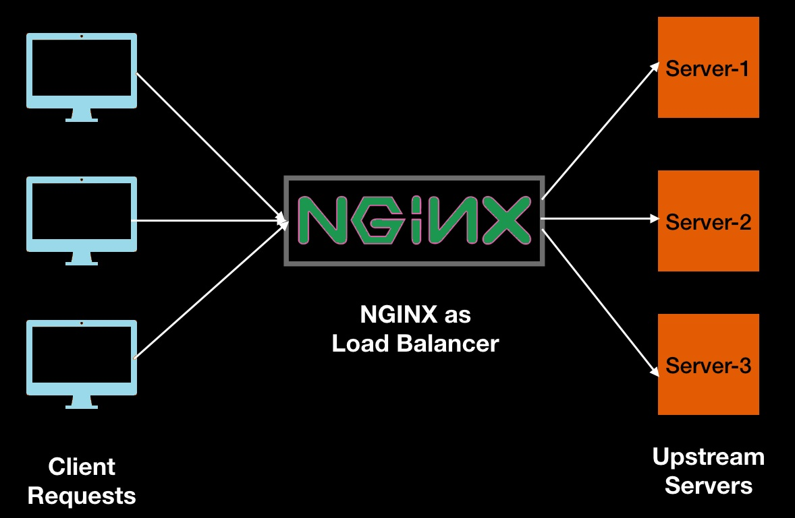
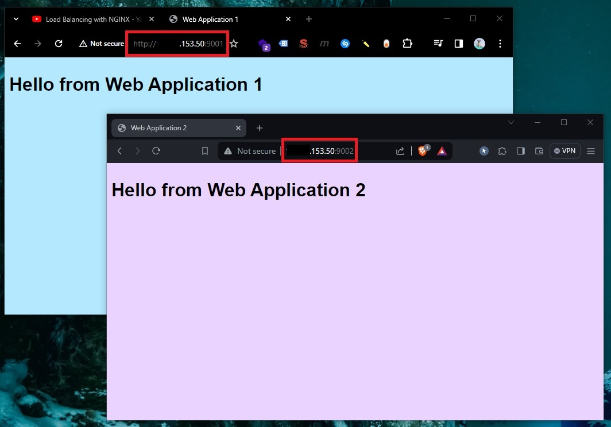
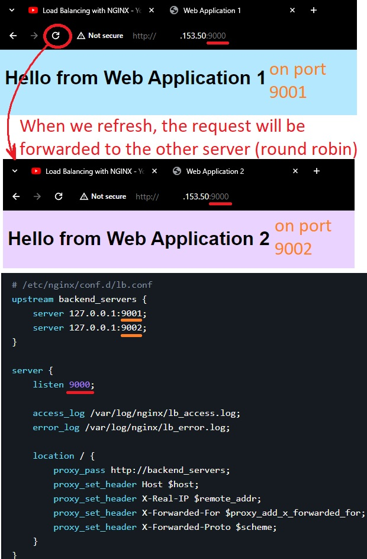
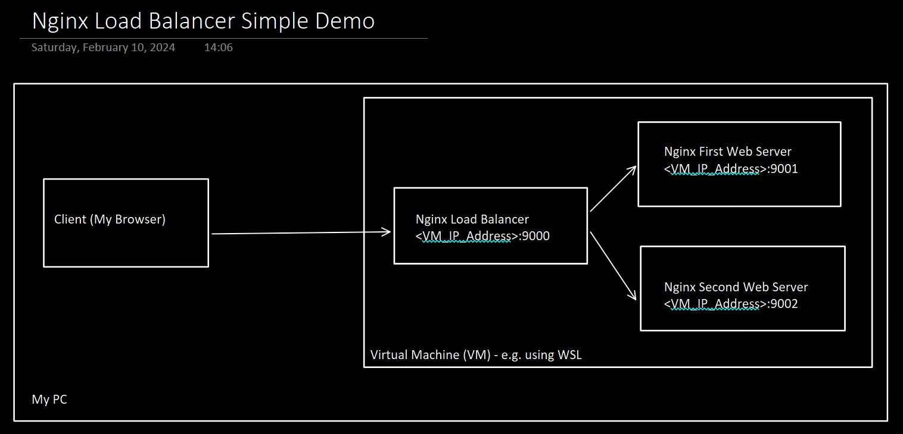
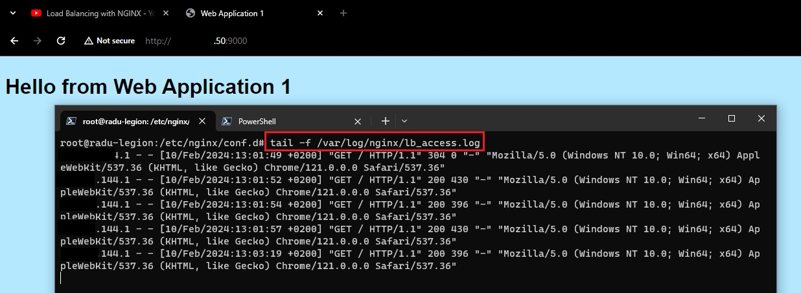
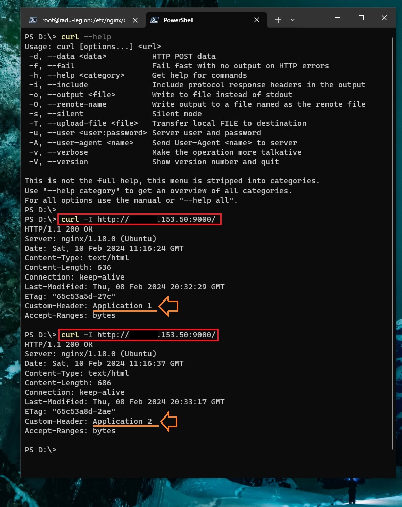
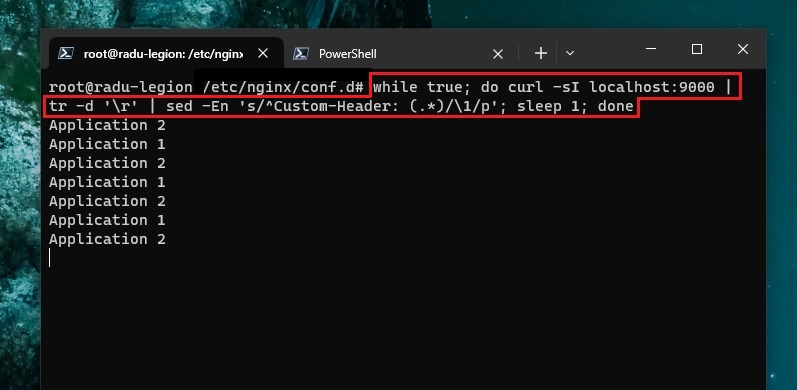
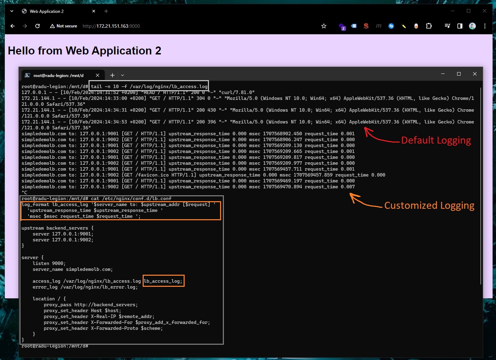

# Load Balancer using Nginx

Resources / Notes taken from:

- [Load Balancing with NGINX - 30m](https://www.youtube.com/watch?v=a41jxGP9Ic8)
- [How to configure NGINX as a load balancer - 5m - Linux Academy](https://www.youtube.com/watch?v=v81CzSeiQjo)

Other Resources:

- https://docs.nginx.com/nginx/admin-guide/load-balancer/http-load-balancer/
- http://nginx.org/en/docs/http/load_balancing.html
- https://www.nginx.com/products/nginx/load-balancing/

<br/>

Nginx Use Cases

- Web Server
  - to serve static and dynamic content over HTTP and HTTPS.
- Reverse Proxy
  - to distribute client requests to backend servers and hiding server details from clients.
- Load Balancer
  - to distribute incoming traffic across multiple backend servers to enhance scalability and reliability.
- Cache
  - to store frequently accessed content in memory to reduce server load and improve response times.
- Web Application Firewall
  - to help protect web applications from various security threats and attacks.
- Internal DDoS Protection
  - to mitigate Distributed Denial of Service attacks by rate limiting and filtering malicious traffic.
- API Gateway
  - to manage and secure API traffic, enforcing authentication, rate limiting, and other policies.
- K8s IC
  - in Kubernetes environments, Nginx can serve as an Ingress Controller, managing external access to services running inside the cluster.
- Sidecar Proxy
  - to facilitate communication between microservices within a distributed system while providing features like load balancing and circuit breaking.

---

> Note:
> A reverse proxy is like a middleman between users and servers. For example, when visiting a website ("example.com"), instead of connecting directly to the server that hosts example.com, you first connect to a reverse proxy server.
>
> The reverse proxy server then forwards your request to the actual server where example.com is hosted. It receives the response from that server and sends it back to you. A reverse proxy offers:
>
> 1. **Security**: It hides the details of your actual servers, making it harder for attackers to directly target them.
> 2. **Load Balancing**: It can distribute incoming requests among multiple servers to improve performance and prevent overload.
> 3. **Caching**: It can cache frequently accessed content, reducing the load on backend servers and speeding up response times for users.
> 4. **SSL Termination**: It can handle SSL encryption and decryption, offloading this task from backend servers and simplifying their configuration.
>
> In essence, a reverse proxy helps manage and optimize incoming traffic to ensure a smoother and more secure experience for users accessing web services.

---

<br/>

## Other Servers Like Nginx

There are several other servers similar to Nginx that serve various purposes such as web serving, reverse proxying, load balancing, and more:

1. **Apache HTTP Server (httpd)** - https://httpd.apache.org/ - Apache HTTP Server is a free and open-source web server software. It's widely used for serving static and dynamic content over HTTP and HTTPS.

2. **Microsoft Internet Information Services (IIS)** - https://www.iis.net/ - IIS is the web server provided by Microsoft for Windows servers. It's tightly integrated with Windows Server environments and supports ASP.NET and other Microsoft technologies.

3. **Caddy** - https://caddyserver.com/ - Caddy is an open-source web server with automatic HTTPS support. It's known for its simplicity and ease of configuration, supporting modern web technologies out of the box.

4. **HAProxy** - https://www.haproxy.org/ - HAProxy is a powerful open-source load balancer and proxy server known for its high performance and reliability. It's commonly used for distributing traffic across multiple backend servers.

5. **Apache Traffic Server (ATS)** - https://trafficserver.apache.org/ - ATS is a high-performance reverse proxy and caching server developed by the Apache Software Foundation. It's designed to handle large volumes of traffic and offers features like caching, compression, and request routing.

6. **Envoy** - https://www.envoyproxy.io/ - Envoy is a modern, high-performance proxy server designed for cloud-native applications and microservices architectures. It's extensible and can be used as an edge proxy, service mesh proxy, or API gateway.

7. **Lighttpd (Lighty)** - https://www.lighttpd.net/ - Lighttpd is a lightweight web server known for its speed and efficiency, especially in serving static content. It's often used in scenarios where low resource usage is a priority.

8. **Nginx Plus** - https://www.nginx.com/products/nginx/ - Nginx Plus is the commercial version of Nginx, offering additional features such as advanced load balancing algorithms, enhanced monitoring, and dedicated support from Nginx Inc.

9. **Undertow by JBoss** - https://undertow.io/ - Undertow is primarily known in the Java ecosystem. It's a lightweight, high-performance web server implemented in Java and developed by the JBoss community. Undertow is often used in Java-based applications, especially in environments where embedded servers are preferred or in Java EE (now Jakarta EE) applications.

10. **Jetty** - https://eclipse.dev/jetty/ - Jetty is a highly scalable and feature-rich web server and servlet container developed by the Eclipse Foundation. It's popular for its embeddable nature and is commonly used in Java applications and frameworks.

11. **Tomcat** - https://tomcat.apache.org/ - Apache Tomcat is a widely used open-source web server and servlet container developed by the Apache Software Foundation. It's known for its robustness and support for the Java Servlet, JavaServer Pages (JSP), and Java Expression Language (EL) technologies.

12. **Node.js (with Express)** - https://expressjs.com/ - While not a traditional server like Nginx or Apache, Node.js can be used to create web servers using frameworks like Express.js. Node.js servers are event-driven and highly scalable, making them popular for building real-time web applications and APIs.

13. **CherryPy** - https://docs.cherrypy.dev/en/latest/ - CherryPy is a minimalist Python web framework that includes a built-in HTTP server. It's known for its simplicity and ease of use, making it a good choice for small to medium-sized web applications.

14. **Gunicorn** - https://gunicorn.org/ - Gunicorn (Green Unicorn) is a Python WSGI HTTP server commonly used for deploying Python web applications, especially those built with frameworks like Django or Flask. It's known for its simplicity, reliability, and ability to handle concurrent requests.

<br/>

## Network ports

- [14 common network ports you should know](https://opensource.com/article/18/10/common-network-ports)
- [Network Ports Explained - PowerCert Animated Videos](https://www.youtube.com/watch?v=g2fT-g9PX9o)
  - On Windows you can run in CMD Prompt `netstat -n`

| Port Number | Usage                                                                               |
| ----------- | ----------------------------------------------------------------------------------- |
| 20          | File Transfer Protocol (FTP) Data Transfer                                          |
| 21          | File Transfer Protocol (FTP) Command Control                                        |
| 22          | Secure Shell (SSH)                                                                  |
| 23          | Telnet - Remote login service, unencrypted text messages                            |
| 25          | Simple Mail Transfer Protocol (SMTP) E-mail Routing                                 |
| 53          | Domain Name System (DNS) service                                                    |
| 80          | Hypertext Transfer Protocol (HTTP) used in World Wide Web (e.g. http://example.com) |
| 110         | Post Office Protocol (POP3) used by e-mail clients to retrieve e-mail from a server |
| 119         | Network News Transfer Protocol (NNTP)                                               |
| 123         | Network Time Protocol (NTP)                                                         |
| 143         | Internet Message Access Protocol (IMAP) Management of Digital Mail                  |
| 161         | Simple Network Management Protocol (SNMP)                                           |
| 194         | Internet Relay Chat (IRC)                                                           |
| 443         | HTTP Secure (HTTPS) HTTP over TLS/SSL                                               |

- Port numbers 0 - 1023 are called System or Well-known ports

  - These ports are used on a Server

- Port numbers 1024 - 49151 are called User or Registered ports

  - These ports are used on a Server
  - These ports can be registered by companies and developers for a particular service (e.g. Adobe Server 1102, Microsoft SQL Server 1433, Oracle 1527)

- Port numbers 49152 - 65535 are called Dynamic or Private ports
  - There are client-side ports that your computer assings temporarilly to itself during a session (e.g. when making a connection to https://google.com)


<br/>

## Nginx Load Balancer Introduction



In order to set a Nginx Load Balancer (LB) we need to:

- Define a group / pool of servers that will handle incoming client (e.g. browser) requests
- Set a proxy_pass directive to pass the client request to one of the servers in the group
- Servers within the group / pool can be defined by:
  - UNIX Socket (e.g. /var/run/php/php7.4-fpm.sock)
  - Domain Name
  - IP Address:Port

<br/>

Here's a basic template example for Nginx load balancer configuration:

- The `upstream` directive is defined in a HTTP Context and describes the server pool
- The `proxy_pass` directive forwards the client request to upstream (one of the servers in the pool)

```conf
upstream backend_servers {
  server 10.1.1.4:9001;
  server 10.1.1.4:9002;
}
server {
  listen 80;
  location / {
    proxy_pass http://backend_servers;
  }
}
```

<br/>

### Nginx LB Methods

https://docs.nginx.com/nginx/admin-guide/load-balancer/http-load-balancer/#choosing-a-load-balancing-method

(Thursday, February 08, 2024, 21:57)

Nginx offers several methods for load balancing, each designed to distribute incoming requests among a group of backend servers:

01\] **Round Robin**: This is the **default** method in Nginx. Each new request is forwarded to the next server in the list, looping back to the beginning once it reaches the end of the list (E.g. For 2 upstream servers: Request 1>Server 1, Request 2>Server 2, Request 3>Server 1, Request 4>Server 2 and so on). The default weight for each server is 1.

```nginx
upstream backend_servers {
    server 192.168.1.101;
    server 192.168.1.102;
    server 192.168.1.103;
}
```

02\] **Least Connections**: Nginx directs new requests to the server with the fewest active connections at the time of the request. This helps distribute the load more evenly among the servers.

```nginx
upstream backend_servers {
    least_conn;
    server 192.168.1.101;
    server 192.168.1.102;
    server 192.168.1.103;
}
```

03\] **Hash**: The server to which a request is sent is determined from a user‑defined key which can be a text string, variable, or a combination. For example, the key may be a paired source IP address and port, or a URI as in this example:

```nginx
upstream backend {
    hash $request_uri consistent;
    server backend1.example.com;
    server backend2.example.com;
}
```

The optional [consistent](https://nginx.org/en/docs/http/ngx_http_upstream_module.html#hash) parameter to the `hash` directive enables [ketama](http://www.last.fm/user/RJ/journal/2007/04/10/rz_libketama_-_a_consistent_hashing_algo_for_memcache_clients) consistent‑hash load balancing. Requests are evenly distributed across all upstream servers based on the user‑defined hashed key value. If an upstream server is added to or removed from an upstream group, only a few keys are remapped which minimizes cache misses in the case of load‑balancing cache servers or other applications that accumulate state.

04\] **IP Hash**: Nginx calculates a hash value based on the client's IP address and uses this value to determine which server to send the request to. This ensures that requests from the same client are consistently routed to the same backend server, which can be useful for session persistence.

```nginx
upstream backend_servers {
    ip_hash;
    server 192.168.1.101;
    server 192.168.1.102;
    server 192.168.1.103;
}
```

05\] **Weighted Round Robin**: This method allows you to assign weights to each server, indicating their relative capacity or performance. Servers with higher weights receive a proportionally higher number of requests.

```nginx
upstream backend_servers {
    server 192.168.1.101 weight=3;
    server 192.168.1.102 weight=2;
    server 192.168.1.103 weight=1;
}
```

In this example:

- 3 out of 6 requests (sum of weights 3+2+1) are routed to the first server
- 2 out of 6 requests (sum of weights 3+2+1) are routed to the second server
- 1 out of 6 requests (sum of weights 3+2+1) are routed to the third server

06\] **Least Time (NGINX Plus Only)**: Nginx selects the server with the lowest average response time for the current request. This method helps route requests to the server that can respond most quickly, potentially improving overall user experience.

```nginx
upstream backend_servers {
    least_time header;
    server 192.168.1.101;
    server 192.168.1.102;
    server 192.168.1.103;
}
```

07\] **Random (NGINX Plus Only)**: Each request will be passed to a randomly selected server. If the `two` parameter is specified, first, NGINX randomly selects two servers taking into account server weights, and then chooses one of these servers using the specified method:

- `least_conn` -- The least number of active connections
- `least_time=header` (NGINX Plus) -- The least average time to receive the response header from the server ([`$upstream_header_time`](https://nginx.org/en/docs/http/nghttp_upstream_module.html#var_upstream_header_time))
- `least_time=last_byte` (NGINX Plus) -- The least average time to receive the full response from the server ([`$upstream_response_time`](https://nginx.org/en/docs/http/ngx_http_upstream_module.html#var_upstream_response_time))

```nginx
upstream backend {
    random two least_time=last_byte;
    server backend1.example.com;
    server backend2.example.com;
    server backend3.example.com;
    server backend4.example.com;
}
```

<br/>

### Server Fails and Timeouts

The `max_fails` and `fail_timeout` directives in Nginx are used to configure how Nginx handles backend servers that are considered to have failed. Example:

```nginx
upstream backend_servers {
    server 192.168.1.101 max_fails=3 fail_timeout=30s;
    server 192.168.1.102 max_fails=2 fail_timeout=20s;
    server 192.168.1.103 max_fails=4 fail_timeout=40s;
}
```

- `max_fails`: This directive sets the maximum number of consecutive failed attempts to communicate with the server before considering it as unavailable. In the example above, if a server fails to respond to requests three times in a row (`max_fails=3`), it will be marked as unavailable.

- `fail_timeout`: This directive specifies the duration for which Nginx will consider a server as unavailable after it has reached the maximum number of failed attempts. In the example above, if a server fails and reaches the maximum number of failed attempts, it will be marked as unavailable for 30 seconds (`fail_timeout=30s`), 20 seconds (`fail_timeout=20s`), or 40 seconds (`fail_timeout=40s`) respectively.

These directives help Nginx manage server failures more intelligently, preventing it from unnecessarily sending requests to servers that are known to be unresponsive. Adjusting `max_fails` and `fail_timeout` values can help fine-tune your load balancing configuration to handle server failures effectively while maintaining high availability (ha) and performance.

<br/>

### NGINX Plus Session Persistence

https://docs.nginx.com/nginx/admin-guide/load-balancer/http-load-balancer/#enabling-session-persistence

NGINX Plus supports three session persistence methods. The methods are set with the sticky directive. (For session persistence with NGINX Open Source, use the `hash` or `ip_hash` directive)

<br/>

### NGINX Plus Limiting the Number of Connections

https://docs.nginx.com/nginx/admin-guide/load-balancer/http-load-balancer/#limiting-the-number-of-connections

With NGINX Plus, it is possible to limit the number of active connections to an upstream server by specifying the maximum number with the [`max_conns`](https://nginx.org/en/docs/http/ngx_http_upstream_module.html#max_conns) parameter.

If the `max_conns` limit has been reached, the request is placed in a queue for further processing, provided that the [`queue`](https://nginx.org/en/docs/http/ngx_http_upstream_module.html#queue) directive is also included to set the maximum number of requests that can be simultaneously in the queue:

```nginx
upstream backend {
    server backend1.example.com max_conns=3;
    server backend2.example.com;
    queue 100 timeout=70;
}
```

<br/>

## Simple Demo Example using Nginx Open-Source

[Load Balancing with NGINX - 15m out of 30m](https://youtu.be/a41jxGP9Ic8?t=892)

Note: We will be running nginx in Windows through WSL (Windows Subsystem for Linux) with Ubuntu 22.04.3 LTS

```bash
root@radu-legion:/home> date
# Thu Feb  8 22:14:03 EET 2024

sudo apt install nginx-core
```

```bash
nginx -v
nginx version: nginx/1.18.0 (Ubuntu)
```

First we will need to change directory to `/etc/nginx/conf.d/` (that will be currently empty when first installing Nginx):

```bash
cd /etc/nginx/conf.d/
```

<br/>

---

> Note: At the end of tutorial we can shutdown the WSL with `wsl --shutdown`

---

<br/>

### Creating simple Nginx web servers

(Thursday, February 08, 2024, 22:40)

First we can create `web.conf` file (`/etc/nginx/conf.d/web.conf`):

```bash
cd /etc/nginx/conf.d/
vi web.conf
```

```nginx
# web.conf
server {
  listen 9001;
  index index.html;
  add_header Custom-Header "Application 1";

  location / {
    root /opt/services/NginxSampleApp1;
  }
}

server {
  listen 9002;
  index index.html;
  add_header Custom-Header "Application 2";

  location / {
    root /opt/services/NginxSampleApp2;
  }
}
```

<br/>

We can now create some simple web applications. For this, we need to ensure the `/opt/services/NginxSampleApp1` and `/opt/services/NginxSampleApp2` directories exist and contain the HTML files.

```bash
# First we create the folders for these web apps
mkdir /opt/services
mkdir /opt/services/NginxSampleApp1
mkdir /opt/services/NginxSampleApp2
```

Let's create the first `index.html` file:

```bash
cd /opt/services/NginxSampleApp1
vim index.html
```

```html
<!-- /opt/services/NginxSampleApp1/index.html -->
<!DOCTYPE html>
<html lang="en">
  <head>
    <meta charset="UTF-8" />
    <meta name="viewport" content="width=device-width, initial-scale=1.0" />
    <title>Web Application 1</title>
    <style type="text/css">
      body {
        font-family: sans-serif;
        font-size: 16px;
        color: #000;
        /* useful for sticking the footer to bottom of page */
        min-height: 100%;
        display: flex;
        flex-direction: column;
        background-color: #b3e8ff;
        transition: background-color 200ms ease-in;
      }
    </style>
  </head>
  <body>
    <h1>Hello from Web Application 1</h1>
  </body>
</html>
```

<br/>

Let's create the second `index.html` file:

```bash
cd /opt/services/NginxSampleApp2
vim index.html
```

```html
<!-- /opt/services/NginxSampleApp2/index.html -->
<!DOCTYPE html>
<html lang="en">
  <head>
    <meta charset="UTF-8" />
    <meta name="viewport" content="width=device-width, initial-scale=1.0" />
    <title>Web Application 2</title>
    <style type="text/css">
      body {
        font-family: sans-serif;
        font-size: 16px;
        color: #000;
        /* useful for sticking the footer to bottom of page */
        min-height: 100%;
        display: flex;
        flex-direction: column;
        background-color: #ebd3ff;
        transition: background-color 200ms ease-in;
      }
    </style>
  </head>
  <body>
    <h1>Hello from Web Application 2</h1>
  </body>
</html>
```

<br/>

To start the Nginx web servers, we need to run:

```bash
sudo service nginx start
```

<br/>

Note: We can also find the IP Address of our Ubuntu VM (Virtual Machine) by running `ifconfig | grep inet`. Then we can access the two Nginx web servers from our main machine/PC!

- http://<VM_IP_Address>:9001/
- http://<VM_IP_Address>:9002/



<br/>

### Configuring Nginx Load Balancer

```bash
cd /etc/nginx/conf.d/
vi lb.conf
```

Now we can configure a simple load balancer (`/etc/nginx/conf.d/lb.conf`) to distribute traffic between the two web servers:

```nginx
# /etc/nginx/conf.d/lb.conf
upstream backend_servers {
    server 127.0.0.1:9001;
    server 127.0.0.1:9002;
}

server {
    listen 9000;

    access_log /var/log/nginx/lb_access.log;
    error_log /var/log/nginx/lb_error.log;

    location / {
        proxy_pass http://backend_servers;
        proxy_set_header Host $host;
        proxy_set_header X-Real-IP $remote_addr;
        proxy_set_header X-Forwarded-For $proxy_add_x_forwarded_for;
        proxy_set_header X-Forwarded-Proto $scheme;
    }
}
```

- We define an upstream group called `backend_servers` containing the two web servers listening on ports 9001 and 9002.
- The `server` block listens on port 9000 for incoming HTTP requests.
- The `location` block proxies incoming requests to the `backend_servers` upstream group.
- The `proxy_set_header` directives forward necessary headers to preserve client information.
- For logging:
  - The `access_log` directive specifies the path where access logs will be written. In this example, access logs will be written to `/var/log/nginx/lb_access.log`.
  - The `error_log` directive specifies the path where error logs will be written. In this example, error logs will be written to `/var/log/nginx/lb_error.log`.

<br/>

To run the load balancer with the configuration provided (`lb.conf`):

1. **Verify Nginx Configuration**: Before starting Nginx, it's a good practice to verify the syntax of the configuration file. This command checks the syntax of all Nginx configuration files and reports any errors:

```bash
sudo nginx -t
```

2. **Start Nginx**: If the configuration syntax is correct, you can start Nginx by running:

```bash
sudo systemctl restart nginx

# or

sudo nginx -s reload
```

(Saturday, February 10, 2024, 12:48)



<br/>

Our current setup configuration (using WSL) looks like this:



<br/>
<br/>

#### Nginx LB Logging

Note: We can also check the logs from the Nginx Load Balancer:

```bash
tail -f /var/log/nginx/lb_access.log

tail -n number_of_n_last_lines -f /var/log/nginx/lb_access.log
tail -n 1 -f /var/log/nginx/lb_access.log
```

https://www.linuxfoundation.org/blog/blog/classic-sysadmin-14-tail-and-head-commands-in-linux-unix



<br/>
<br/>

Note: We can also "cURL" from our main machine/PC (client) to the Nginx LB:

```bash
PS D:\> curl --help
Usage: curl [options...] <url>
 -d, --data <data>          HTTP POST data
 -f, --fail                 Fail fast with no output on HTTP errors
 -h, --help <category>      Get help for commands
 -i, --include              Include protocol response headers in the output
 -o, --output <file>        Write to file instead of stdout
 -O, --remote-name          Write output to a file named as the remote file
 -s, --silent               Silent mode
 -T, --upload-file <file>   Transfer local FILE to destination
 -u, --user <user:password> Server user and password
 -A, --user-agent <name>    Send User-Agent <name> to server
 -v, --verbose              Make the operation more talkative
 -V, --version              Show version number and quit

This is not the full help, this menu is stripped into categories.
Use "--help category" to get an overview of all categories.
```

```bash
curl -I http://<VM_IP_Address>:9000/
```



From https://github.com/jay-nginx/load-balancing - we can also make the cURL in a loop:

```bash
# ONLY IN LINUX BASH
# While Loop used to extract and print a specific value from the header:

while true; do curl -sI <load-balancer-ip:port> | tr -d '\r' | sed -En 's/^Custom-Header: (.*)/\1/p'; sleep 1; done

# Example
while true; do curl -sI localhost:9000 | tr -d '\r' | sed -En 's/^Custom-Header: (.*)/\1/p'; sleep 1; done
```



<br/>
<br/>

---

Note (From [How to configure NGINX as a load balancer - 5m - Linux Academy](https://www.youtube.com/watch?v=v81CzSeiQjo)):
We can personalize the logging in Nginx `lb.conf` file with our own `log_format`:

```nginx
# /etc/nginx/conf.d/lb.conf
log_format lb_access_log '$server_name to: $upstream_addr [$request] '
  'upstream_response_time $upstream_response_time '
  'msec $msec request_time $request_time ';

upstream backend_servers {
    server 127.0.0.1:9001;
    server 127.0.0.1:9002;
}

server {
    listen 9000;
    server_name simpledemolb.com;

    access_log /var/log/nginx/lb_access.log lb_access_log;
    error_log /var/log/nginx/lb_error.log;

    location / {
        proxy_pass http://backend_servers;
        proxy_set_header Host $host;
        proxy_set_header X-Real-IP $remote_addr;
        proxy_set_header X-Forwarded-For $proxy_add_x_forwarded_for;
        proxy_set_header X-Forwarded-Proto $scheme;
    }
}
```



<br/>

### Weighted Round Robin

If we reconfigure `/etc/nginx/conf.d/lb.conf` to use weighted Round Robin

```bash
vi /etc/nginx/conf.d/lb.conf
```

```nginx
# /etc/nginx/conf.d/lb.conf
upstream backend_servers {
    server 127.0.0.1:9001 weight=3;
    server 127.0.0.1:9002 weight=1;
}

server {
    listen 9000;

    access_log /var/log/nginx/lb_access.log;
    error_log /var/log/nginx/lb_error.log;

    location / {
        proxy_pass http://backend_servers;
        proxy_set_header Host $host;
        proxy_set_header X-Real-IP $remote_addr;
        proxy_set_header X-Forwarded-For $proxy_add_x_forwarded_for;
        proxy_set_header X-Forwarded-Proto $scheme;
    }
}
```

```bash
# Reload Nginx LB Server and Web Servers
sudo nginx -t
sudo nginx -s reload
```

We would see the following route forwardings to the two upstream web servers

```bash
while true; do curl -sI localhost:9000 | tr -d '\r' | sed -En 's/^Custom-Header: (.*)/\1/p'; sleep 1; done
```


