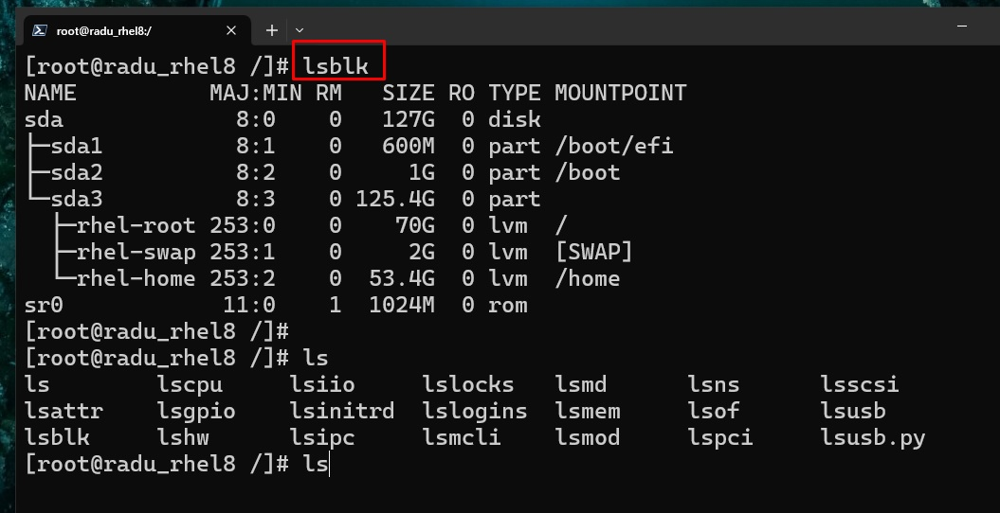

**The Most Popular Linux & Terminal Commands**

(If you do not have a Linux PC or a Linux Virtual Machine) See the Windows tutorial on _"WSL Tutorial and Basic Linux commands"_ first:

- [Install Windows Subsystem for Linux (WSL) and Learn these first basic Linux commands](./WSL-Tutorial-and-Linux-Commands.md)

<br/>

Credits / Notes taken from:

- [The 50 Most Popular Linux & Terminal Commands - freeCodeCamp, 5h Course](https://youtu.be/ZtqBQ68cfJc)
- [The Linux commands Handbook](https://www.freecodecamp.org/news/the-linux-commands-handbook)
- [Learn Linux TV YouTube Channel - Linux Crash Course Playlist](https://www.youtube.com/playlist?list=PLT98CRl2KxKHKd_tH3ssq0HPrThx2hESW)

<br/>

Table of Contents:

- [Basic Linux Commands](#basic-linux-commands)
  - [touch, echo, cat, head, tail, less](#touch-echo-cat-head-tail-less)
  - [mkdir, rmdir, rm](#mkdir-rmdir-rm)
  - [split](#split)
  - [ls, cd, open](#ls-cd-open)
  - [mv, cp](#mv-cp)
  - [wc](#wc)
- [Linux File System](#linux-file-system)
- [Piping commands](#piping-commands)
- [Expansions](#expansions)
- [Searching, Sorting, Replacing](#searching-sorting-replacing)
  - [sort](#sort)
  - [uniq](#uniq)
  - [find](#find)
  - [ack](#ack)
  - [grep](#grep)
  - [pdfgrep](#pdfgrep)
  - [sed](#sed)
- [Disk usage commands](#disk-usage-commands)
  - [du](#du)
  - [df](#df)
  - [Partitions, Storage Volumes](#partitions-storage-volumes)
    - [lsblk](#lsblk)
- [Network commands](#network-commands)
  - [scp](#scp)
- [history](#history)
- [Memory](#memory)
  - [free](#free)
- [Processes](#processes)
  - [ps, htop](#ps-htop)
  - [top](#top)
  - [kill](#kill)
  - [killall](#killall)
  - [jobs, bg, fg](#jobs-bg-fg)
  - [fuser](#fuser)
  - [lsof](#lsof)
  - [Example of stopping a continuously running script](#example-of-stopping-a-continuously-running-script)
  - [Example of creating and stopping a systemd service](#example-of-creating-and-stopping-a-systemd-service)
- [gzip, tar](#gzip-tar)
- [wget](#wget)
- [xargs](#xargs)
  - [xargs multiple commands](#xargs-multiple-commands)
  - [More xargs examples](#more-xargs-examples)
- [Permissions](#permissions)
  - [chmod](#chmod)
  - [Making a bash script executable](#making-a-bash-script-executable)

<br/>

For reference: A table listing some popular Linux distributions along with their associated operating systems and the package managers they use:

| Distribution | Associated Operating Systems                                                                          | Package Manager | Possible Desktop Environments          |
| ------------ | ----------------------------------------------------------------------------------------------------- | --------------- | -------------------------------------- |
| Red Hat      | CentOS, Fedora, Oracle Linux, Rocky Linux                                                             | RPM             | GNOME, KDE, Xfce, Cinnamon, LXQt       |
| Debian       | Ubuntu, Linux Mint, KDE neon, Zorin OS, Kali Linux, Pop! OS, MX Linux, Elementary OS, Raspberry Pi OS | APT             | GNOME, KDE, Xfce, Cinnamon, LXQt, MATE |
| Arch Linux   | Manjaro, Antergos, EndeavourOS, ArcoLinux                                                             | Pacman          | GNOME, KDE, Xfce, Cinnamon, LXQt       |
| SUSE Linux   | openSUSE, SUSE Linux Enterprise Server                                                                | Zypper          | GNOME, KDE, Xfce, LXQt                 |
| Slackware    | Absolute Linux, Zenwalk Linux, Slax                                                                   | pkgtools        | Xfce, Fluxbox, KDE, MATE               |
| Gentoo       | Sabayon, Funtoo, Calculate Linux                                                                      | Portage         | GNOME, KDE, Xfce, LXQt, MATE           |
| Alpine Linux | postmarketOS, Adélie Linux, NixOS                                                                     | APK             | XFCE, i3, Fluxbox, MATE                |
| Mageia       | OpenMandriva, PCLinuxOS, ROSA Linux                                                                   | urpmi           | GNOME, KDE, Xfce, LXQt                 |
| Solus        | Budgie, GNOME, MATE, Plasma                                                                           | eopkg           | Budgie, GNOME, MATE, Plasma            |
| Void Linux   | Artix Linux, Obarun, Adélie Linux                                                                     | XBPS            | Xfce, Cinnamon, Enlightenment, MATE    |
| macOS        | -                                                                                                     | Homebrew        | Aqua (default)                         |

Note: macOS is a proprietary operating system (is not a Linux distribution) developed by Apple and differs significantly from Linux distributions in terms of its core architecture and package management.

<br/>

**Bash Shortcuts**

Most used shortcuts in bash (More [here](https://www.makeuseof.com/linux-bash-terminal-shortcuts/)):

- `CTRL+R` - search through commands history - based on your before-used commands, you can re-run a command by searching part of it (`history`)
- `CTRL+A` / `CTRL+E` - while you write a command, `CTRL+A` will move your cursor to the start of the command line, `CTRL+E` will move your cursor to the end
- `Ctrl+U` - Deletes before the cursor until the start of the command
- `CTRL+L` - clears the command line (`clear`)
- `Ctrl+D` - Closes the current terminal

Bash Control/Processes

- `Ctrl+S` - Stops command output to the screen
- `Ctrl+C` - Sends SIGI signal and kills currently executing command
- `Ctrl+Z` - Suspends current command execution and moves it to the background
- `Ctrl+Q` - Resumes suspended command

<br/>

**Bash Manual**

Each argument given to `man` command is normaly the name of the program, utility or function, then the information/documentation about that is displayed.

```bash
man man
man bash
man <command>
man git
man gcc
man python3
```

An alternative to `man` is `tldr` (as in "too long didn't read") command, that only lists some direct/command examples of using the specified command:

```bash
sudo apt install tldr
```


<br/>

# Basic Linux Commands

## touch, echo, cat, head, tail, less

Create files with `touch` - Note that `touch` is mainly used to alter the "modified" timestamp of a file:

```bash
touch myfile.txt

# You can create multiple files
nano file1.txt markdownFile.md script.py
```

(More on Nano here: [The 50 Most Popular Linux & Terminal Commands - 3h23m48s](https://youtu.be/ZtqBQ68cfJc?t=12228))

You can create and edit files with `nano` editor (after entering nano editor, you will have multiple options like "save" `CTRL+O`, or "exit" `CTRL+X`):

```bash
nano hello.py
```

You can also create a file with content already in it by using `echo "your_string"` and direct the content to the file using `>` operator (redirect standard output):

```bash
echo "This is my text file" > myfile.txt
echo "print("hi there")" > hi.py
python3 hi.py
```

You can also add content to the bottom of a file that already has content in it (append more content to end of file) by using `>>` operator. Note: you can also view the content of a file using `cat file.txt`

```bash
echo "My first text line" > myfile.txt
echo "My second text line on the same file" >> myfile.txt
cat myfile.txt

# will output
# My first text line
# My second text line on the same file
```

```bash
# Concatenate multiple files with cat
cat butcher.txt groceries.txt > shoppingList.txt

# Show line numbers with cat
cat -n pythonScript.py
```

- We can print current date and time with `date` (`man date`)

```bash
date
# will print Tue 10 May 2022, 21:44:47 +0300

date > today.txt
```

Both `>` and `>>` operators create a file if the mentioned file is not existent in current folder (https://linuxhint.com/difference-arrow-double-arrow-bash/), and:

- `>` redirect standard output operator overwrites anything in a file
- `>>` appends to the existing file

<br/>

Note: You can see the content of a file by using `cat`. Or, you can see the first 10 lines of a files by running `head` command (`head myfile.txt`), and if you want to see the last 10 lines from a file, run `tail` (`tail myfile.txt`). There are also `more` and `less` commands in order to see the content of a file "page by page" (`more myfile.txt`) or line by line (`less myfile.txt`).

```bash
# Show the first 100 lines of a file
head song_lyrics.txt -n 100

# Show the last 50 lines of a file
tail scripts.sh -n 50
```

With `less` command, we also find strings by writing `/mysearchedstring` while we have a file opened:

```bash
less myfile.txt
# press / and search your string
```

<br/>
<br/>

You can also use other text editor like `gedit`, or `vim` (that is almost used as an IDE) - you can run `vimtutor` command for a complete `vim` editor walkthrough.

```bash
vim myfile.txt
```

With `touch` (`man touch` for manual) we can manipulate the "modified" timestamp of files. Here we can mention the timestamp in any way we want, even as "2 hours ago" (with `-d` flag).

```bash
touch -d "09:00" myfile.txt
touch -d "2 hours ago" myfile.txt
touch -d "2022-02-24 13:23:40" myfile.txt
touch -d "next Wednesday" myfile.txt
touch -d "last Monday" myfile.txt
touch -d "last Thursday 16:21:32" myfile.txt
touch -d "Sun, 29 Feb 2020 16:21:42" myfile.txt
touch -d '1 June 2018 11:02' file1

# you can also touch multiple files
touch myfile1.txt myfile2.txt myfile3.txt
```

<br/>

## mkdir, rmdir, rm

- To create a directory/folder:

```bash
mkdir myfolder
```

- To remove a directory/folder that is not empty (if is not empty, will receive error: `rmdir: failed to remove 'ubuntu/': Directory not empty`):

```bash
rmdir myfolder
```

- To remove a directory that has files in it (Use `rm` with caution! ⚠⚠⚠) - `-r` stands for `recursive`, `remove directories and their contents recursively`

```bash
rm -r myfolder
```

- To create a directory within a directory (`-p, --parents - make parent directories as needed`):

```bash
mkdir -p mydir/mysubdir
cd mydir/mysubdir
```

- To remove a directory that has files in it (Use `rm` with caution! ⚠⚠⚠) - `-r` stands for `recursive`, `remove directories and their contents recursively`

```bash
rm -r myfolder
```

- You can also delete multiple files with `rm`

```bash
rm file1.txt file2.txt file3.md
```

- Delete all JPG files in the current folder

```bash
rm *.jpg
```

<br/>

## split

Split large (text) files into smaller files (default is 1000 lines per file). This is useful when we have a huge log file (that contains millions of lines of logs) and we want it to be split in several files that contains around 100,000 (or 200,000) lines in order to be opened by a text editor without freezing our PC (eg. with Notepad++ we can make operations such as highlighting and complex searching).

The base syntax is: `split [options] <name_of_file> <prefix_for_new_files>`.

- Split a large text file into smaller files with 2000 lines each

```bash
split -l 2000 ./logfile.log logfile_
```


- Split a file and add both a prefix and suffix (such as `.log` extension) to each new subfile

```bash
split -l 2000 ./logfile.log logfile_ --additional-sufix=".log"

# and if you want to delete the created files after
rm logfile_*.log
```


- Split using digits/numeric suffix (`-d`) for file incrementation instead of letters/alphabetic.

```bash
split -l 10000 ./logfile.log log_ --additional-suffix=".log" -d

# Optionally, move the new subfiles into a new folder
mkdir logsplit
mv log_*.log ./logsplit
cd ./logsplit

# And now you can grep through them and open only
# the file of interest that matched your string pattern
grep -rnia ./ -e "ERROR_NAME"
```


🟢 Note, if you want to split by file size (each separate file will have a defined file size in KB or MB), we use `-b (bytes)` option instead of `-l (lines)`:

```bash
# This will output 100KB files
split -b 100k ./logfile.log log_ --additional-suffix=".log" -d

# This will output 100MB files
split -b 100m ./logfile.log log_ --additional-suffix=".log" -d
```

<br/>

## ls, cd, open

- To see current directory you're in, write `pwd` (print working/current directory):

```bash
pwd
```

- To list/view all the files within a folder, eg use flags to see detailed view (`man ls`):

```bash
ls
ls ./myfolder/mysubfolder
ls /pathFromRoot/to/folder

ls -lah
```

`ls` flags:

- `-a, --all` - do not ignore entries starting with . (hidden files)
- `-l` - use long listing format (display as list with 1 file and its details per row)
- `-h` - human-readable, print sizes like 1K, 234M, 2G, etc
- `-d, --directory` - list only directories
- `-c` - used with `-lt`, sort by ctime (time of last modification)
- `-C` - list entries by columns
- `--sort` - sort by WORD instead of name, eg `size (-S)`, `time (-t)`, `version (-v)`, `extension (-X)`

For example, to sort files by size within a folder, run `ls --sort=size -lah` ("sort by size").

Note: Instead of using `ls -la`, you can directly write `ll` (double "L") for the same effect. For human readable sizes, use you can `ll -h` instead of `ls -lah`. `ll` is a predefined alias for `ls -alF` (at least on Ubuntu/Mint/Zorin/other derivates).

```bash
ll

# sames as
ls -la
```

```bash
type ll
# ll is aliased to `ls -alF'
```

You can edit (permanently) this alias further to `ls -alFh` (for human-readable). Just search and modify the alias in the `~/.bashrc` file (bash script that is executed every time the system boots).

```bash
nano ~/.bashrc

# press CTRL+W to search for "alias ll"
```


<br/>

- To navigate to a folder within current path (`ls`), use "change directory" with `cd`. To go to the previous folder use `cd ..`, to go to previous previous directory `cd ../..` (go 2 levels back) and so on.

```bash
cd mydir/myotherdir
cd ..
cd ../..
```

<br/>

- To open files with your current File Explorer/Applications (in your Desktop Environment), use `xdg-open` command (For MacOS we can just use `open`). If `xdg-open` is not installed, run `sudo apt install xdg-utils` (Debian).

```bash
xdg-open filename.txt
xdg-open folder_name

# open current directory in Finder/Dolphin/File explorer etc
xdg-open .
```

<br/>

## mv, cp

(Tuesday, 10 May 2022)

- Move a file to another location (`man mv`, `mv /path/to/sourcefile /path/to/targetlocationfile`)

```bash
mv hi.py ../hi.py  # move one folder up
mv ../hi.py ./hi.py  # move file from one folder up to current folder/path

# You can also move multiple files (ex. within a directory)
mv file1 file2 file3 DestFolder/
```

<br/>

- Changing filenames (renaming files) are also done with `mv`

```bash
mv currentFileName.txt newFileName.txt
mv hi.py hello.py
```

<br/>

- Copy files (either in same location, or other locations, with/withourt different names, etc) with `cp`

```bash
cp file_2.txt file_3.txt
cp hello.py ../hello2.py

# to copy a folder that has files in it
cp -r folder folder_copy

# If folder does not exist
cp hello.py /v2/hello.py  # cp: cannot create regular file '/v2/hello2.py': No such file or directory
mkdir -p ./v2 && cp hello.py $_
```

https://stackoverflow.com/questions/1529946/linux-copy-and-create-destination-dir-if-it-does-not-exist

Copy all `.txt` files from a folder into another foder:

```bash
mkdir ./random/texts_folder
cp -rv ./random/*.txt ./random/texts_folder
```

<br/>

Also, `cp` is often used for backups

```bash
cp file_2.txt{,.bkp}

cp hello.py{,.bkp}
cp hello.py hello.py.bkp #  the equivalent command
```

<br/>

## wc

- Word Count: Find number of lines, words and bytes of a file (`man wc`)

```bash
wc LongTextFiles.txt
# 1757 15767 87022
# lines words bytes
```

```bash
echo -e "cat\ndog\nmouse\nrabbit\nfish" | wc -l
# 5 lines
```

Note: The `echo -e` option enables interpretion of backslash, meaning `/n` will tell echo to write each string to a new line.

<br/>

# Linux File System


<br/>

From:

- https://www.linuxfoundation.org/blog/blog/classic-sysadmin-the-linux-filesystem-explained:
- https://www.blackmoreops.com/2015/02/14/linux-file-system-hierarchy/


<br/>

# Piping commands

We can take the output of a command, and pass it as an input to another command. Examples:

- Find how many words are in a string

```bash
echo "How many words are here" | wc
# 1 line, 5 words, 24 bytes

echo "Hello" > greeting.txt
echo "How are you?" >> greeting.txt
wc -l greeting.txt
# 2 lines
```

- Count the number of files by piping ls and wc (Note that `ls -l | wc -l` will count _number of files + 1_ because `ls -l` will also add a line of size in kbytes... or we can just print the number of lines in wc command `ls | wc -l`)

```bash
ls | wc -l

ls /etc | echo "There are $(wc -l) files"

# include/count hidden files as well
ls -a | wc -l
```

- Combine content of 2-3-4 files and count number of lines

```bash
cat appliances.txt groceris.txt | wc -l

cat server1.log server2.log server3.log | wc -l
```

<br/>

# Expansions

Note that in Linux, some strings are interpreted as other strings (just like aliases or hotstrings). For example, whenever we write `~` it is expanded to `/home/username` path.

```bash
echo ~
# will print /home/username
```

We can also see some popular Environment Variables (variables in bash start with `$`).

Another example is `*`, that is an expansion to every filename in current directory (`pwd`). And, we can also narrow down to `*.txt` (shows every filename that matches with `.txt` at end). Other use-case of using `*` alias, is listing all files that ends with an extension: `ls -lah *.txt`.

```bash
echo $USER
echo $SHELL
echo $PATH
```


<br/>

Another useful alias is `?` (question mark), that matches every single character. Two `??` will match two any-characters in a row, three `???` will match 3 characters and so on.

```bash
# example: match any filename that ends with an extension of exactly 2 characters
ls -lah *.??
```


<br/>

Another extension is use of curly braces `{}`, where bash will expand to the values within curly braces (separated by `,` comma).

```bash
echo {a,b,c}.txt
# a.txt b.txt c.txt

echo a{d,c,b}e
# ade ace abe

touch app.{html,css,js,py}
# will create 4 files: app.html app.css app.js app.py
ls app.*
# app.css app.html app.js app.py
```

We can also expand into ranges, like `{1..10}`, or `{a..z}`.

```bash
echo {1..10}
# 1 2 3 4 5 6 7 8 9 10

echo file{01..05}.txt
# file01.txt file02.txt file03.txt file04.txt file05.txt

touch file{00..10}.txt
ls
# file00.txt  file01.txt  file02.txt  file03.txt  file04.txt  file05.txt
# file06.txt  file07.txt  file08.txt  file09.txt  file10.txt

touch file{A..Z}.txt
# fileA.txt  fileC.txt  fileE.txt  fileG.txt  fileI.txt  fileK.txt  fileM.txt  fileO.txt  fileQ.txt  fileS.txt  fileU.txt  fileW.txt  fileY.txt
# fileB.txt  fileD.txt  fileF.txt  fileH.txt  fileJ.txt  fileL.txt  fileN.txt  fileP.txt  fileR.txt  fileT.txt  fileV.txt  fileX.txt  fileZ.txt

rm -fr ./* # Carrefully make sure to be in the directory you want to delete all files in
```

```bash
echo {Z..A}
# Z Y X W V U T S R Q P O N M L K J I H G F E D C B A
```

More on expansions here: https://linuxcommand.org/lc3_lts0080.php

<br/>

# Searching, Sorting, Replacing

## sort

[The 50 Most Popular Linux Commands - 1h56min](https://youtu.be/ZtqBQ68cfJc?t=7016)

- We can sort the lines from a file. Note that `sort` will not change the content of file, it will just print to console. `sort` is also case sensitive, use `sort -f` to ignore case.

```bash
sort file.txt

sort file.txt > file_sorted_lines.txt
```


- Sort lines numerically in files that contains numbers (by default is not doing a numeric sort). We can also use `sort -nu` to get only the unique numbers (get lines/numbers without repetition)

```bash
sort -n nums.

sort -nur nums.txt # -r option to sort in reverse order
```

More on `sort` here: https://www.geeksforgeeks.org/sort-command-linuxunix-examples/


- We can also pipe the content of files into sort

```bash
cat logsWithTimestamps01.log logsWithTimestamps02.log | sort

cat logsWithTimestamps01.log logsWithTimestamps02.log | sort > allLogsSorted.log
```

- Sort by second/third column (eg. alphabetically or numerically `-n`) using `-k <column_number>` option

```bash
sort -gk 2 shopping.txt

sort -nrk 3 employees.txt
```


See more about sorting floating point numbers (`general sorting`) here: https://unix.stackexchange.com/questions/459257/how-to-sort-lines-by-float-number.

<br/>

## uniq

If we have a text files that has duplicated lines, we can use `uniq` to print out the content of that file without adjacent duplicates lines (consecutive duplicated lines one after another):

```bash
uniq logs.log
```

If we want to remove all duplicated lines, we can use `uniq` in combination with `sort`:

```bash
sort langs.txt | uniq

# this is same as running sort -u langs.txt
sort -u langs.txt
```

However, if we only want to show us the dupliacated in a file, we can run `sort langs.txt | uniq -d`. And if we want only the lines that appear once (non-duplicates), we can run `sort langs.txt | uniq -u`.


And, if we want to count how many times each line is repeating, we can use the count option: `sort langs.txt | uniq -c`. And we can even sort that numerically:

```bash
sort flavours.txt | uniq -c | sort -n
```


<br/>

## find

[The Most Popular Linux Commands: find - 2h21m](https://youtu.be/ZtqBQ68cfJc?t=8470)

To find files in the entire system (`/` - the root directory) or in current path (`.`) and folders inside (recursively), we can use `find` (`man find`) - it will output the path(s) to the searched file:

```bash
find path_name

find / -name "host.conf"
find . -name "docker-compose.yml"
```

- We can find files based on filename, modification time, file type / directory, size, etc.

```bash
# show all .py files in current path and folders inside (recursively)
find . -name "*.py"  # same as ls *.py

# find a file that has the exact math of "myfile.txt"
find /path/to/a/folder -name "myfile.txt"

# find by type
find . -type d  # eg find all directories (d)
find . -type f  # find only files, not directories
```

- Note that `find some/path -name` is case-sensitive. For case insensitive we use `-iname`

```bash
find . -type d -name '*new*'  # find all directories that contain 'new' in their name
find . -type d -iname '*new*'  # find all directories that contain 'new' or 'New' in their name
```

- We can also use `-or` operator:

```bash
# eg Find directories under the current tree matching name "node_modules" or "public"
find . -type d -name "node_modules" -or -name "public"
```

- We can also exclude a path with `-not` when searching for a file:

```bash
find . -name "*.md" -not -path "node_modules"
```

More examples:

- Search for files that have more than 100 characters (bytes) in them:

```bash
find . -type f -size +100c
```

- Search files bigger than 100KB but smaller than 2MB:

```bash
find . -type f -size +100k -size -2M
```

- Search files edited more than 3 days ago, or edited in the last 24hours

```bash
find . -type f -mtime +3
find . -type f -mtime -1
```

<br/>

With the found files, youn can run another command on them with `-exec` (just like piping, however piping is not supported with `find` command, you can't run something like `find -name "F*.txt" | ls -lah`, but instead you can run `find -name "F*.txt" -exec ls -lah \;`). Note that every command after `-exec` should end with `\;`

- List with details all the files edited in the last 24hours:

```bash
find . -type f -mtime -1 -exec ls -lah {} \;
```

- See all the content from the found files with `cat` (Note that `{}` is filled/replaced with the file names at execution time)

```bash
find . -name "*.py" -exec cat {} \;  # {} will be replaced with "file1.py file2.py" etc
```


<br/>

## ack

To search for strings inside files (and output their path), use `ack` (`man ack`), is just as powerful, but easier than `grep`. Note, it is possible that `ack` needs to be installed (`sudo apt install ack` for Debian based distros).

```bash
ack -i 'stringpattern'

# or grep equivalent
grep -rni '/path/to/somewhere/' -e 'stringpattern'
# -r or -R is recursive
# -n is to show line number in file
# -w stands for match the whole word
# -l (lower-case L) can be added to just give the file name of matching files (show the file name, not the result itself)
# -e is the pattern used during the search
# -i for ignore case
```

https://stackoverflow.com/questions/16956810/how-do-i-find-all-files-containing-specific-text-on-linux

<br/>

## grep

(Sunday, May 22, 2022)

[The Most Popular Linux Commands: grep - 2h32m](https://youtu.be/ZtqBQ68cfJc?t=9145)

`grep` (global regular expression print) is used to search for text inside files.

- Show the lines (with the line number `-n`) that contains the searched word:

```bash
grep -n Sarah employees.txt

# see some Context related to found words (eg show 2 before and 2 lines after)
grep -nc 2 Sarah employees.txt
```

- Search recursively in current directory (in all nested subdirectories) with `-r` and case-insensitive with `-i`

```bash
grep -ri "hello"
```


<br/>

To use regular expressions in grep, we need to use `-E` flag ("Extended regular expressions", by default it's using `-G` for basic regex)

```bash
# Search by emails in all files in current directory
grep -rE -o "\b[A-Za-z0-9._%+-]+@[A-Za-z0-9.-]+\.[A-Za-z]{2,6}\b" .
```


<br/>

Some other random examples of using grep:

- If command history was not erased, you can run something like `history | grep "sudo apt install"` and see everything you installed so far on your Linux machine

```bash
history | grep "sudo apt install" > installed_apps.txt

# or if you want to save to a file without line numbers
history -w history.txt
grep "sudo apt install" history.txt > history.txt
```


<br/>

- If grep returns something like `Binary file ./app_logs/server_logs.log matches` instead of the line containing the searched word, we need to add the `-a` flag:

```bash
grep -rnia ./app_logs -e "Request failed"
```

<br/>

- If we need to see the lines above or below the line that contains the searched string, we need to use (in front of all the other flags) the `-A` (for after) and/or `-B` (for before) flags. We can also use the `-C` flag (for Context) to show both before and after lines.

```bash
# get the lines that contains "OutOfMemoryError" string
grep -rnia ./ -e "OutOfMemoryError"

# show the 4 lines before every line that contains "OutOfMemoryError" string
grep -B 4 -rnia ./ -e "OutOfMemoryError"

# show the 4 lines that comes after every line that contains "OutOfMemoryError" string
grep -A 4 -rnia ./ -e "OutOfMemoryError"
```

<br/>

## pdfgrep

[Search text within multiple pdfs and docs - askubuntu.com](https://askubuntu.com/questions/558812/search-text-within-multiple-pdfs-and-docs)

```bash
sudo apt install pdfgrep
```

Search text within multiple PDFs by using `pdfgrep -r "my expression"` where `-r` searches recursively through directories.

```bash
# Example
pdfgrep -B 4 -A 4 -rnia ./ -e "storage.*limitation"
```

<br/>

## sed

(Monday, April 17, 2023)

SED command in UNIX stands for stream editor and it can perform lots of functions on file like searching, find and replace, insertion or deletion. However, most common use of **SED command is for substitution or for find and replace**. Syntax: `sed OPTIONS... [SCRIPT] [INPUTFILE...]`

Example: `sed 's/unix/linux/g' sedExample.txt`, where:

- `s` specifies the substitution operation
- `/` is a delimiter, where the “unix” is the search pattern and the “linux” is the replacement string
- `/g` the substitute flag (global replacement) specifies the sed command to replace all the occurrences of the string in the line

```bash
cat sedExample.txt
# Unix is great OS. unix is opensource. unix is a free os.
# Operating Unix is a great skill to know in 2023

sed 's/unix/linux/g' sedExample.txt
# Unix is great OS. linux is opensource. linux is a free os.
# Operating Unix is a great skill to know in 2023

# ^^ Note that the above command was case sensitive and "Unix" was not replaced
```


- for case insensitive we can use `/i` flag: `sed 's/unix/linux/gi' sedExample.txt`


<br/>

Another example: Parenthesize first character of each word:

```bash
echo "Welcome aboard, Captain!" | sed 's/\(\b[A-Z]\)/\(\1\)/gi'
# (W)elcome (a)board, (C)aptain!
```


<br/>

Another more complex example:

```bash
sed -i s/${bamboo.POM_LEAD_VERSION}.${bamboo.POM_VERSION}/${bamboo.releaseBuildNumber}/g ./pom.xml
```

- `sed`: This is the command to invoke the sed tool for text editing.
- `-i`: This option tells sed to edit the file in place, meaning the changes will be made directly to the file `pom.xml` without creating a backup.
- `s/`: This is the beginning of a substitution command in sed, indicating that text substitution is going to take place.
- `${bamboo.POM_LEAD_VERSION}.${bamboo.POM_VERSION}`: This is a regular expression pattern that will be searched for in the file `pom.xml`. It appears to be a placeholder for a version number, likely read from a Bamboo build system variable or property called `bamboo.POM_LEAD_VERSION` and `bamboo.POM_VERSION`.
- `/`: This is a delimiter that separates the search pattern from the replacement pattern in the sed command.
- `${bamboo.releaseBuildNumber}`: This is the replacement pattern that will replace the matched pattern in `pom.xml`. It appears to be another Bamboo build system variable or property called `bamboo.releaseBuildNumber`.
- `/`: This is another delimiter that separates the replacement pattern from the options in the sed command.
- `g`: This is an option that tells sed to perform the substitution globally, meaning it will replace all occurrences of the search pattern in the file, not just the first occurrence.
- `./pom.xml`: This is the path to the file `pom.xml` on which the sed command will be applied. The `.` indicates the current directory where the command is executed.

Let's say the value of `bamboo.POM_LEAD_VERSION` is "1.0" and the value of `bamboo.POM_VERSION` is "SNAPSHOT" and the value of `bamboo.releaseBuildNumber` is "12". The `pom.xml` file contains the following line:

```xml
<version>1.0.SNAPSHOT</version>
```

After running the sed command you provided, the `pom.xml` file will be modified in place, and the line will be changed to:

```xml
<version>12</version>
```

<br/>

Some of the above notes for `sed` command were taken from:

- https://www.geeksforgeeks.org/sed-command-in-linux-unix-with-examples/
- https://stackoverflow.com/questions/20802056/python-regular-expression-1

<br/>

# Disk usage commands

## du

- Find size of files and directories (`-h` option for human-readable file sizes)

```bash
du -h .  # will show all the sizes of directories within current path tree
```

- We use `-a` if we want to show file sizes too (not just directories)

```bash
du -ah .
```

- We can use `-s` (`--summarize`) to display only a total for each argument

```bash
du -sh /*
```

- And we if want to see all directories (and files with `-a`) "sort by size", we can pipe the command with `sort`

```bash
du -ah | sort -h

# we can also use
ls --sort=size -lahr

# and if we want top 5 largest files
ls --sort=size -lahr | tail -n 5

# or top 10 largest files using du (and reversing the list)
du -ah | sort -hr | head
```


<br/>

## df

- `df` is used for **mounted** disk usage (like "partitions" on Windows OS) information (is not about files/directories in the mentioned/current path) - `-h` for human-readable sizes.

```bash
df -h

# or

df -h /
```

See the disk usage of the filesystem (like a "partition" but not really) where `~/Desktop` is located

```bash
df -h ~/Desktop

# will prind something like
# Filesystem      Size  Used Avail Use% Mounted on
# /dev/sda5       439G   39G  378G  10% /
```


<br/>

## Partitions, Storage Volumes

(Sunday, June 02, 2024, 12:15)

[Linux Crash Course - Formatting & Mounting Storage Volumes - 32min - July 2021 - Learn Linux TV](https://www.youtube.com/watch?v=2Z6ouBYfZr8)

Other resources for Linux Partitions:

- https://www.unix.com/shell-programming-and-scripting/207169-non-interactive-fdisk-partition-script.html
- https://serverfault.com/questions/258152/fdisk-partition-in-single-line
- https://linux.die.net/man/8/parted

### lsblk

The 'lsblk' stands for 'list block devices' - it is used to list out all block devices in a tree-like format. This command can help gather comprehensive information about each block device connected to the Linux system, including the disk partitions and their respective sizes.

```bash
lsblk
# NAME          MAJ:MIN RM   SIZE RO TYPE MOUNTPOINT
# sda             8:0    0   127G  0 disk
# ├─sda1          8:1    0   600M  0 part /boot/efi
# ├─sda2          8:2    0     1G  0 part /boot
# └─sda3          8:3    0 125.4G  0 part
#   ├─rhel-root 253:0    0    70G  0 lvm  /
#   ├─rhel-swap 253:1    0     2G  0 lvm  [SWAP]
#   └─rhel-home 253:2    0  53.4G  0 lvm  /home
# sr0            11:0    1  1024M  0 rom
```



<Br/>

```bash
df -h
# Filesystem             Size  Used Avail Use% Mounted on
# devtmpfs               831M     0  831M   0% /dev
# tmpfs                  850M  1.1M  849M   1% /dev/shm
# tmpfs                  850M  8.7M  842M   2% /run
# tmpfs                  850M     0  850M   0% /sys/fs/cgroup
# /dev/mapper/rhel-root   70G   12G   59G  17% /
# /dev/mapper/rhel-home   54G  414M   53G   1% /home
# /dev/sda2             1014M  225M  790M  23% /boot
# /dev/sda1              599M  5.8M  594M   1% /boot/efi
# tmpfs                  170M     0  170M   0% /run/user/0
# overlay                 70G   12G   59G  17% /var/lib/docker/overlay2/7d.../merged
# overlay                 70G   12G   59G  17% /var/lib/docker/overlay2/6c.../merged
# overlay                 70G   12G   59G  17% /var/lib/docker/overlay2/f3.../merged

df -h /
# Filesystem             Size  Used Avail Use% Mounted on
# /dev/mapper/rhel-root   70G   12G   59G  17% /

df /home -h
# Filesystem             Size  Used Avail Use% Mounted on
# /dev/mapper/rhel-home   54G  414M   53G   1% /home

du -sh /* | sort -hr
# 8.6G    /var
# 3.3G    /usr
# 191M    /boot
# 29M     /etc
# 13M     /opt
# 8.7M    /run
# 1.1M    /dev
# 200K    /root
# 8.0K    /tmp
# 0       /sys
# 0       /srv
# 0       /sbin
# 0       /proc
# 0       /mnt
# 0       /media
# 0       /lib64
# 0       /lib
# 0       /home
# 0       /bin
```

<br/>

# Network commands

## scp

https://phoenixnap.com/kb/linux-scp-command

SCP Command Syntax:

```bash
scp [option] [user_name@source_host:path/to/source/file] [user_name@target_host:target/path]

man scp | cat
```

<br/>

- Send/Copy file from Local to Remote Server

```shell
scp -R <path_to_local_source_file> root@remote_dest_IP_Address:/remote_dest_path_folder/
```

```bash
# Example:
ip addr show eth0
docker ps -a
docker image ls

# Save the Docker image (3 methods) https://docs.docker.com/reference/cli/docker/image/save/
docker image save serverpingstatustracker-angular-client > serverpingstatustracker-angular-client.tar
docker image save --output serverpingstatustracker-angular-client.tar serverpingstatustracker-angular-client:latest
docker image save -o serverpingstatustracker-angular-client.tar serverpingstatustracker-angular-client:latest
docker save serverpingstatustracker-angular-client:latest | gzip > serverpingstatustracker-angular-client.tar.gz

ls -lah

scp serverpingstatustracker-angular-client.tar.gz root@172.23.50.251:/opt/resources/
# Note: /opt/resources path was already created on the other machine (remote)
```

<br/>

- Send/Copy multiple files from Local to Remote Server

```bash
# Example
docker image ls
docker save serverpingstatustracker-angular-client:latest | gzip > serverpingstatustracker-angular-client.tar.gz
docker save serverpingstatustracker-spring-api:latest | gzip > serverpingstatustracker-spring-api.tar.gz

scp serverpingstatustracker-angular-client.tar.gz serverpingstatustracker-spring-api.tar.gz root@172.23.50.251:/opt/resources/
serverpingstatustracker-angular-client.tar.gz                 100%   66MB 337.7MB/s   00:00
serverpingstatustracker-spring-api.tar.gz                     100%  244MB 291.1MB/s   00:00

# On the other remote host:
pwd
# /opt/resources
ls -lah
# total 310M
# -rw-r--r--. 1 root root  66M May 31 10:29 serverpingstatustracker-angular-client.tar.gz
# -rw-r--r--. 1 root root 244M May 31 10:29 serverpingstatustracker-spring-api.tar.gz
```

<br/>

- Receive/Copy file from Remote Server to Local Host

```bash
scp -R root@remote_IP_Address:/remote_path_to_file/ <local_file_to_be_transffered>
```

```bash
# Example
scp root@172.23.54.145:/opt/serverpingstatustracker/serverpingstatustracker-angular-client.tar.gz /opt/resources

scp root@172.23.54.145:/opt/serverpingstatustracker/serverpingstatustracker-angular-client.tar.gz .
```

<br/>

# history

(Monday, May 23, 2022)

[The Most Popular Linux Commands: history - 2h44m](https://youtu.be/ZtqBQ68cfJc?t=9853)

The `history` command shows a list of the commands entered since you started the session. You can replay any command from history by using a command such as: `!3` (with exclamation mark and history id from history list, like `!command_id_from_history`)

```bash
history
history | less

!145 # runs command 145 from history list
```

You can also search through history by piping `grep`:

```bash
# See all apt installs
history | grep "sudo apt install"

# See all commits made
history | grep "git commit"

# View compiled C files with gcc or ran/interpreted with Python3
history | grep "gcc"
history | grep "python3"

# View all .txt files edited in vim (or nano)
history | grep -E "vim.*txt"
```

<br/>

**CTRL+R shortcut**

However, another way to get to this search functionality is by typing `Ctrl+R` to invoke a recursive search of your command history. After typing this, the prompt changes to:

```bash
(reverse-i-search)`':
```

Now you can start typing a command, and matching commands will be displayed for you to execute by pressing Return or Enter, or keep pressing `CTRL+R` until you find the match you want.

<br/>

**Erasing history**

From https://opensource.com/article/18/6/history-command: If you want to delete a particular command, enter `history -d <line number>`. To clear the entire contents of the history file, execute `history -c`.

The history file is stored in a file that you can modify, as well. Bash shell users find it in their home directory as `.bash_history`.

```bash
nano ~/.bash_history
```

<br/>

**See history commands with timestamps**

Solution taken from: https://askubuntu.com/questions/391082/how-to-see-time-stamps-in-bash-history

- Just write the following command in terminal:

```bash
# for e.g. “1999-02-29 23:59:59”
HISTTIMEFORMAT="%F %T "

# for e.g. “29/02/99 23:59:59”
HISTTIMEFORMAT="%d/%m/%y %T "
```

- To make the change permanent for the current user run:

```bash
echo 'HISTTIMEFORMAT="%F %T "' >> ~/.bashrc
source ~/.bashrc
```

Note that this will only record timestamps for new history items, after HISTTIMEFORMAT is set for sessions, i.e. you can't use this retrospectively.

<br/>

# Memory

## free

[Understanding Memory and Swap Usage 20min on May 2022 - Learn Linux TV](https://www.youtube.com/watch?v=XTMyJ5l0GLg)

From `man free`: `free` displays the total amount of free and used physical and swap memory in the system, as well as the buffers and caches used by the kernel. The information is gathered by parsing /proc/meminfo. The displayed columns are:

- `total` - Total installed memory (MemTotal and SwapTotal in /proc/meminfo)
- `used` - Used memory (calculated as total - free - buffers - cache)
- `free` - Unused memory (MemFree and SwapFree in /proc/meminfo)
- `shared` - Memory used (mostly) by tmpfs (Shmem in /proc/meminfo)
- `buffers` - Memory used by kernel buffers (Buffers in /proc/meminfo)
- `cache` - Memory used by the page cache and slabs (Cached and SReclaimable in /proc/meminfo)
- `buff/cache` - Sum of buffers and cache
- `available` - Estimation of how much memory is available for starting new applications, without swapping. Unlike the data provided by the cache or free fields, this field takes into account page cache and also that not all reclaimable memory slabs will be reclaimed due to items being in use (MemAvailable in /proc/meminfo, available on kernels 3.14, emulated on kernels 2.6.27+, otherwise the same as free)

```bash
man free | cat

Options:
-m, --mebi Display the amount of memory in mebibytes.
-g, --gibi Display the amount of memory in gibibytes.
-h, --human Show all output fields automatically scaled to shortest three digit unit and display the units of print out.
            Following units are used:
            B = bytes, Ki = kibibyte, Mi = mebibyte, Gi = gibibyte, Ti = tebibyte, Pi = pebibyte.

-l, --lohi Show detailed low and high memory statistics.
-t, --total Display a line showing the column totals (memory+swap)
```

<br/>

```bash
free -h
#                total        used        free      shared  buff/cache   available
# Mem:           521Mi       395Mi        68Mi       5.0Mi       194Mi       125Mi
# Swap:          2.4Gi        33Mi       2.3Gi
```

Output Breakdown:

1. Total Memory (`total`) - The total amount of physical RAM available on the system.
2. Used Memory (`used`) - The amount of RAM currently being used by all processes, buffers, and cache.
3. Free Memory (`free`) - The amount of RAM that is completely unused.
4. Shared Memory (`shared`) - Memory used by the temporary filesystem (`tmpfs`), usually shared between processes.
5. Buffer/Cache Memory (`buff/cache`) - Memory used by the kernel buffers and the page cache. This memory is reclaimable by applications if needed.
6. Available Memory (`available`) - An estimate of the memory available for starting new applications, without swapping. This includes free memory and most of the memory used by buffers and cache.

<br/>

Important Points to Focus On:

1. Free vs. Available Memory:

   - Free Memory: Often quite low, as Linux uses free memory for caching ("Unused memory is wasted memory").
   - Available Memory: More accurate for assessing how much memory is readily available for new processes.

2. Used Memory:

   - A high percentage of used memory does not necessarily indicate a problem if a large portion is used by cache/buffers.

3. Buffer/Cache Memory:

   - High values are normal as Linux uses unused memory for cache to improve performance. It is released when more memory is needed by applications.

4. Swap Memory:

   - Used Swap: Indicates that the system is using disk space to extend RAM, which can slow down performance significantly.
   - Frequent or high swap usage suggests that the system is low on physical memory.

<br/>

Key Scenarios and Conclusions:

1. Low Free Memory but High Available Memory:

   - Normal behavior. The system is efficiently using RAM for caching.

2. High Used Memory with Low Free and Available Memory:

   - Potentially problematic. The system might be running out of memory, leading to performance issues.

3. High Swap Usage:

   - Indicates insufficient physical memory or memory leaks. Performance may degrade significantly due to slow disk I/O.
   - Consider adding more RAM or optimizing memory usage of running applications.

4. Consistently High Shared Memory:
   - If unusually high, investigate processes using shared memory (e.g., large shared memory segments used by databases or other applications).

<br/>

Example `free -h` Output with Key Takeaways:

```
        total   used    free    shared   buff/cache   available
Mem:    15Gi    12Gi    500Mi   1.0Gi    2.5Gi        1.5Gi
Swap:   4.0Gi   1.0Gi   3.0Gi
```

- Total Memory: 15Gi
- Used Memory: 12Gi
- Free Memory: 500Mi (low, but not critical)
- Buffer/Cache: 2.5Gi (healthy use of caching)
- Available Memory: 1.5Gi (sufficient for new processes)
- Swap Usage: 1.0Gi (watch closely; consider adding more RAM if it increases)

<br/>

# Processes

## ps, htop

[The Most Popular Linux Commands: ps - 2h47m](https://youtu.be/ZtqBQ68cfJc?t=10061)

You can inspect processes (started by current user/you) that running on your Linux machine with `ps`.

To see all the processes by all users run `ps ax` (or, to see all the processes in a GUI you can run `top` and `htop`). To view all the path related to processes you can run `ps axww` (with simple `ps ax` the names gets cut, by adding `ww` word-wrap we can see the entire path).

```bash
ps axww
```

<br/>

However, a waaay easier method to manage processes is by installing and using `htop`. See [The htop Command | Linux Essentials Tutorial
](https://www.youtube.com/watch?v=bKWZJ3_5ODc)

```bash
htop
```

<br/>

## top

On a Server, run the `top` command.

```bash
man top
```

```bash
top
```


In `top` command you can press:

- -d, --delay = SECS [.TENTHS] - Specifies the delay between screen updates

- -E, --scale-summary-mem = k | m | g | t | p | e - Instructs top to force summary area memory to be scaled as:

  - k - kibibytes
  - m - mebibytes
  - g - gibibytes
  - t - tebibytes
  - p - pebibytes
  - e - exbibytes

- -e, --scale-task-mem = k | m | g | t | p - Instructs top to force task area memory to be scaled as:

  - k - kibibyte = 1024 bytes
  - m - mebibyte = 1024 KiB = 1,048,576 bytes
  - g - gibibyte = 1024 MiB = 1,073,741,824 bytes
  - t - tebibyte = 1024 GiB = 1,099,511,627,776 bytes
  - p - pebibyte = 1024 TiB = 1,125,899,906,842,624 bytes

- -i, --idle-toggle - When this toggle is Off, tasks that have not used any CPU since the last update will **not** be displayed.

- k - Kill-a-task - You will be prompted for a PID and then the signal to send.

  - Entering no PID or a negative number will be interpreted as the default shown in the prompt (the first task displayed).
  - The default signal, as reflected in the prompt, is SIGTERM. However, you can send any signal, via number or name.
  - If you wish to abort the kill process, do one of the following depending on your progress:
    - at the pid prompt, type an invalid number
    - at the signal prompt, type 0 (or any invalid signal)
    - at any prompt, type `<Esc>`

- r - Renice-a-Task - You will be prompted for a PID and then the value to **nice** it to.

- SORTING of task window by pressing
  - `SHIFT+m` (Capital M) - Sort by `%MEM`
  - `SHIFT+n` (Capital N) - Sort by `PID`
  - `SHIFT+p` (Capital P) - Sort by `%CPU`
  - `SHIFT+t` (Capital T) - Sort by `TIME+`

<br/>

More notes on `top` command here:

- https://man7.org/linux/man-pages/man1/top.1.html
- https://askubuntu.com/questions/656771/process-niceness-vs-priority
- [Demystifying the Top Command in Linux | Linux Crash Course Series - Learn Linux Tv](https://www.youtube.com/watch?v=WsR11EGF9PA)
- [Top Command: A Linux Command for Quickly Seeing What is Running on Your System](https://www.youtube.com/watch?v=hK-tYkiIoqY)

<br/>

## kill

Notes taken from the book: https://www.freecodecamp.org/news/the-linux-commands-handbook/#the-linux-kill-command

```bash
kill <PID>
```

By default, this sends the TERM signal to the process id specified.

We can use flags (options, switches) to send other signals (Note that we can view all the flags by running `kill -l` that won't kill anything, it will just list all the signals we can use)


- `kill -HUP <PID>UP` means hang up. It's sent automatically when a terminal window that started a process is closed before terminating the process.

- `kill -INT <PID>` means interrupt, and it sends the same signal used when we press ctrl-C in the terminal, which usually terminates the process.

- `kill -KILL <PID>` is not sent to the process, but to the operating system kernel, which immediately stops and terminates the process.

- `kill -TERM <PID>` means terminate. The process will receive it and terminate itself. It's the default signal sent by kill.

- `kill -CONT <PID>` means continue. It can be used to resume a stopped process.

- `kill -STOP <PID>` is not sent to the process, but to the operating system kernel, which immediately stops (but does not terminate) the process.

<br/>

## killall

https://www.freecodecamp.org/news/the-linux-commands-handbook/#the-linux-killall-command

Similar to the kill command, killall will send the signal to multiple processes with same **name** at once instead of sending a signal to a specific process id.

```bash
killall <name>
```

where name is the name of a program. For example you can have multiple instances of the top program running, and killall top will terminate them all.

<br/>

## jobs, bg, fg

[The Most Popular Linux Commands: jobs, bg, fg - 2h47m](https://youtu.be/ZtqBQ68cfJc?t=10918)

We can put (long) running commands in the background in our terminal, so we can run other commands.

For example, if we run a command that takes a lot of time (eg. `grep -rnia ./huge-logs.log -e "stringpattern"` or `find / -ctime -1` to find all files in root directory that changed in the last 24 hours), the command will run in the foreground, where we can either:

- stop the process by pressing `CTRL+C`
- suspend the process (put in on pause, don't stop it) by pressing `CTRL+Z` => if we have some suspended processes, we can then type the `jobs` command to see them (the jobs/suspended processes will be shown with an id associated as well).
  - Then, to run again the process in the foreground, we can write `fg <id>` with the id of the process (listed when running `jobs`).
  - Or, to run again the process in the background, we can write `bg <id>` (we can see the process running in the background by running `jobs` command again)

Note: we can also run a process (a command) directly in the background by adding ` &` at the end of the command (for example `grep -rna ./logs.log -e "timestamp" > logs-today.log &`, or something like `docker-compose up &`).

Note: we can also suspend (`CTRL+Z`) "processes" like editing a file in nano/vim -> while we are in nano/vim, press `ctrl+z`, do something else in the terminal, then run `fg` command to get back to editing a file in nano/vim (this is especially useful on servers while remote with ssh). This is like "minizing" a program/app (or note-taking with vim/nano) in the terminal.

<br/>

## fuser

https://phoenixnap.com/kb/fuser-linux

The `fuser` command (Find USER) is a process management tool that **identifies processes using a file, a directory, or a socket**.

Additionally, `fuser` provides information about the process owner and access type and **terminates** processes in question.

```bash
man fuser | cat
```

| Options for `fuser`    | Description                                                                                                                                      |
| ---------------------- | ------------------------------------------------------------------------------------------------------------------------------------------------ |
| `-v`, `--verbose`      | 🟡Shows USER, PID, ACCESS, and COMMAND fields instead of only listing PIDs.                                                                      |
| -n, `--namespace`      | Changes the namespace from the default value to the new one.                                                                                     |
| `-m`, `--mount`        | 🟡Specifies a file belonging to a file and lists every process accessing files in that [filesystem](https://phoenixnap.com/glossary/filesystem). |
| `-k`, `--kill`         | 🟡Kills processes.                                                                                                                               |
| `-i`, `--interactive`  | Asks the user for confirmation before terminating a process.                                                                                     |
| `-[SIGNAL]`            | Kills processes with the specified signal instead of the default one (SIGKILL).                                                                  |
| `-l`, `--list-signals` | Lists all signal names that can be used by `fuser`.                                                                                              |
| `-a`, `--all`          | Shows files specified on the command accessed by at least one process.                                                                           |
| `-u`, `--user`         | 🟡Adds the process owner's username to each PID.                                                                                                 |
| `-4`, `--ipv4`         | Searches only for IPv4 sockets.                                                                                                                  |
| `-6`, `--ipv6`         | Search only for IPv6 sockets.                                                                                                                    |
| `-M`, `--ismountpoint` | Kills processes only if NAME specifies a mount point.                                                                                            |
| `-w`                   | Kill only processes with write access.                                                                                                           |
| `-s`, `--silent`       | Represents a silent operation ignoring `-u` and `-v` options.                                                                                    |

- In the default display mode (or when using `-v`), each file name is followed by a letter denoting the **type of access**:
  - `c` current directory.
  - `e` executable being run.
  - `f` open file. f is omitted in default display mode.
  - `F` open file for writing. F is omitted in default display mode.
  - `r` root directory.
  - `m` mmap'ed file or shared library.
  - `.` Placeholder, omitted in default display mode.

<br/>

Examples:

- Locate processes in a directory:

```bash
# The output lists PIDs of all processes accessing the current directory.
fuser /opt/serverpingstatustracker
# /opt/serverpingstatustracker:  2710c  2935c
```

```bash
# To print a more readable output, use the -v (verbose) option before the directory:
fuser -v /opt/serverpingstatustracker
#                      USER        PID ACCESS COMMAND
# /opt/serverpingstatustracker:
#                      root       2710 ..c.. bash
#                      root       2935 ..c.. bash
```

- ⚠Locate and kill processes in a directory:

```bash
fuser -km /var/log/audit
fuser -km /var/log
```

- The fuser command also works on an executable, like PYTHON3 in the bin directory:

```bash
fuser -v /bin/python3
                     USER        PID ACCESS COMMAND
# /usr/bin/python3.9:  root        690 ...e. firewalld
#                      root        720 ...e. tuned

# - Root as the process owner.
# - Process's PID.
# - The access symbol e, conveying that the file is an executable.
# - The command networkd-dispat running the file.
```

<br/>

## lsof

Resources:

- https://phoenixnap.com/kb/lsof-command
- https://unix.stackexchange.com/questions/60492/whats-the-difference-between-lsof-and-fuser-uvm

  > For lsof, to show opened files for certain path only, put -- in front of first path specified:
  >
  > ```bash
  > lsof -- /home4
  > lsof -- /home4 /home2
  > # lsof will show all opened file containing the path.
  > ```
  >
  > For fuser, on the other hand, show process opening the file you specified
  >
  > ```bash
  > fuser -uv <filename>
  >
  > # To show processes accessing a particular path, use -m
  > fuser -uvm /home3
  > ```
  >
  > fuser is more useful in identifying process id opening a particular file.
  > lsof is useful to find out all file(s) opened by particular process.

<br/>

The `lsof` command stands for `LiSt Open Files` and shows open files and which process uses them. Since Linux sees every object as a file, such as devices, directories, etc., unidentified open files prevent users from modifying them.

| Options for `lsof`              | Description                                                                                               |
| ------------------------------- | --------------------------------------------------------------------------------------------------------- |
| `-b`                            | Suppresses kernel blocks.                                                                                 |
| `/ [file system] /`             | Shows open files in a particular file system.                                                             |
| `/dev/tty*`                     | Displays files associated with the terminal.                                                              |
| `-u [username]`                 | Prints all files opened by a user.                                                                        |
| `-u ^[username]`                | Prints all files opened by everyone except a specific user.                                               |
| `-c [process]`                  | Lists all files accessed by a particular process.                                                         |
| `-p [process ID]`               | Shows all open files associated with a specific [process ID](https://phoenixnap.com/glossary/process-id). |
| `-p ^[process ID]`              | Shows files opened by all other PIDs.                                                                     |
| `-R`                            | Lists parent process IDs.                                                                                 |
| `+D [directory path]`           | Prints all open files in a directory.                                                                     |
| `-i`                            | Displays all files accessed by network connections.                                                       |
| `-i [IP version number]`        | Filters files based on their IP.                                                                          |
| `- i [udp or tcp]`              | Filters open files based on the connection type (TCP or UDP).                                             |
| `-i :[port number]`             | Finds processes running on a specific port.                                                               |
| `-i :[port range]`              | Finds processes running on specific port ranges.                                                          |
| `-t [file name]`                | Lists IDs of processes that have accessed a particular file.                                              |
| `# kill -9 'lsof -t -u [user]'` | Kills all user processes.                                                                                 |
| `-d mem`                        | Shows all memory-mapped files.                                                                            |
| `[path] grep deleted`           | Prints locked deleted files.                                                                              |

<br/>

Examples:

- Display Files Used by a Process. The `-c` flag opens all files used by a process

```bash
# Example, list files opened by the dockerd process:
lsof -c dockerd
```

- Show Files Under a Directory: To see all files that have been opened under a directory, use the following command:

```bash
sudo lsof +D /opt/serverpingstatustracker
# COMMAND  PID USER   FD   TYPE DEVICE SIZE/OFF     NODE NAME
# bash    2710 root  cwd    DIR  253,0     4096 51157413 /opt/serverpingstatustracker
# bash    2935 root  cwd    DIR  253,0     4096 51157413 /opt/serverpingstatustracker
```

- Find processes running on a specific port. This option is useful to check which file is preventing another app from binding to a specific port: `sudo lsof -i :[port number/name]`

```bash
lsof -i :80
# COMMAND  PID  USER   FD   TYPE DEVICE SIZE/OFF NODE NAME
# nginx   1068  root   12u  IPv4  20758      0t0  TCP *:http (LISTEN)
# nginx   1068  root   13u  IPv6  20759      0t0  TCP *:http (LISTEN)
# nginx   1069 nginx   12u  IPv4  20758      0t0  TCP *:http (LISTEN)
# nginx   1069 nginx   13u  IPv6  20759      0t0  TCP *:http (LISTEN)
```

- ⚠Show services in a directory (to later stop them using `service` or `systemctl`):

```bash
lsof +f -- /var/log/audit
# COMMAND PID USER FD TYPE SIZE/OFF NODE NAME
# auditd 2536 root 5wd DIR 4096 4096 12 /var/log/audit/audit.log

# stop audit daemon
service auditd stop

# Example for a use-case
# now we will be able to unmount that partition/directory
# no longer receiving error:
# unmount of /var/log/audit failed: Device or resource busy
# or
# umount: /var/log/audit: target is busy.
lsof +f -- /var/log/audit
umount /var/log/audit

...

# Example for another use-case
fuser -km /var/log
lsof +f -- /var/log/
service rsyslog stop
service rsyslogd stop
service systemd-journald stop
umount /var/log
umount /var/tmp
lsblk
```

<br/>

## Example of stopping a continuously running script

🟡Let's make a script `system_usage.sh` that continuously writes the current date, time, CPU, and memory usage to a file every 5 seconds.

```bash
cd /opt
mkdir system_usage_script

cd /opt/system_usage_script
vi system_usage.sh
# chmod +x system_usage.sh
```

```bash
#!/bin/bash

# Output file
output_file="system_usage.log"

# Function to get CPU and memory usage
get_usage() {
    # Get the current date and time
    current_time=$(date "+%Y-%m-%d %H:%M:%S")

    # Get CPU usage from top command (average over 1 second)
    cpu_usage=$(top -bn1 | grep "Cpu(s)" | awk '{usage = $2 + $4; printf "%.2f", usage}')

    # Get memory usage from /proc/meminfo
    mem_total=$(grep MemTotal /proc/meminfo | awk '{print $2}')
    mem_free=$(grep MemFree /proc/meminfo | awk '{print $2}')
    mem_available=$(grep MemAvailable /proc/meminfo | awk '{print $2}')
    mem_used=$((mem_total - mem_free))
    mem_used_mib=$(awk "BEGIN {printf \"%.2f\", $mem_used/1024}")
    mem_available_mib=$(awk "BEGIN {printf \"%.2f\", $mem_available/1024}")

    # Get swap usage from /proc/meminfo
    swap_total=$(grep SwapTotal /proc/meminfo | awk '{print $2}')
    swap_free=$(grep SwapFree /proc/meminfo | awk '{print $2}')
    swap_used=$((swap_total - swap_free))
    swap_used_mib=$(awk "BEGIN {printf \"%.2f\", $swap_used/1024}")

    # Write the usage data to the output file
    echo "$current_time CPU: ${cpu_usage}% Memory Used: ${mem_used_mib}MiB, Available: ${mem_available_mib}MiB, Swap Used: ${swap_used_mib}MiB" >> $output_file
}

# Infinite loop to write usage data every 5 seconds
while true; do
    get_usage
    sleep 5
done
```

To make the script executable, run:

```bash
chmod +x system_usage.sh
```

To run the script, run:

```bash
./system_usage.sh
```

To pause the script and them make it run in the background, press `CTRL+Z` then run `bg`.

We can check the script is running by running `ps -ef | grep system_usage.sh`. We can also check the logs printed to `system_usage.log` file by running `tail -f ./system_usage.log`

```bash
ps -ef | grep system_usage.sh
# root        3274    3216  0 19:01 pts/2    00:00:00 /bin/bash ./system_usage.sh

tail -f ./system_usage.log
# 2024-06-02 19:10:12 CPU: 6.20% Memory Used: 453.74MiB, Available: 203.65MiB, Swap Used: 48.74MiB
# 2024-06-02 19:10:17 CPU: 0.00% Memory Used: 453.74MiB, Available: 203.65MiB, Swap Used: 48.74MiB
# 2024-06-02 19:10:22 CPU: 0.00% Memory Used: 453.74MiB, Available: 203.65MiB, Swap Used: 48.74MiB
```

If we run `lsof` and `fuser`, we will see:

```bash
pwd
# /opt/system_usage_script

sudo lsof +D .
# COMMAND    PID USER   FD   TYPE DEVICE SIZE/OFF     NODE NAME
# bash      3216 root  cwd    DIR  253,0       53 17094098 .
# system_us 4624 root  cwd    DIR  253,0       53 17094098 .
# system_us 4624 root  255r   REG  253,0     1357 17094140 ./system_usage.sh
# sleep     5058 root  cwd    DIR  253,0       53 17094098 .
# sudo      5059 root  cwd    DIR  253,0       53 17094098 .
# lsof      5061 root  cwd    DIR  253,0       53 17094098 .
# lsof      5062 root  cwd    DIR  253,0       53 17094098 .

fuser -v .
#                      USER        PID ACCESS COMMAND
# /opt/system_usage_script:
#                      root       3216 ..c.. bash
#                      root       4624 ..c.. system_usage.sh
#                      root       5542 ..c.. sleep
```

<br/>

To kill the this script, we have multiple options:

**_Option 1 to kill the script:_** If the process/job is running on the background we can run `jobs`:

- then either bring the job back in the foreground by writing `fg $1` and then press CTRL+C to kill it.
- or we can kill directly by writing `kill %1`

```bash
jobs
# [1]+  Running                 ./system_usage.sh &

kill %1
# [1]+  Terminated              ./system_usage.sh
```

**_Option 2 to kill the script:_** Using `ps` and `kill`, we can find the PID of the script with `ps aux | grep system_usage.sh` and then `kill 6841`

```bash
ps aux | grep system_usage.sh
# root        6841  0.0  0.6   7252  3784 pts/2    S    19:18   0:00 /bin/bash ./system_usage.sh
# root        7377  0.0  0.4   6420  2204 pts/2    S+   19:20   0:00 grep --color=auto system_usage.sh

kill 6841
# [1]+  Terminated              ./system_usage.sh
```

**_Option 3 to kill the script using `fuser`:_**

```bash
fuser -v .
#                      USER        PID ACCESS COMMAND
# /opt/system_usage_script:
#                      root       3216 ..c.. bash
#                      root       7571 ..c.. system_usage.sh
#                      root       8324 ..c.. sleep

kill 7571
# [1]+  Terminated              ./system_usage.sh
```

**_Option 4 to kill the script using `lsof`:_**

```bash
sudo lsof +D .
# COMMAND    PID USER   FD   TYPE DEVICE SIZE/OFF     NODE NAME
# bash      3216 root  cwd    DIR  253,0       53 17094098 .
# system_us 8932 root  cwd    DIR  253,0       53 17094098 .
# system_us 8932 root  255r   REG  253,0     1357 17094140 ./system_usage.sh
# sleep     9536 root  cwd    DIR  253,0       53 17094098 .

kill 8932
# [1]+  Terminated              ./system_usage.sh
```

<br/>

## Example of creating and stopping a systemd service

Let's make the above script as a as a service using `systemd`. This allows managing the script with `systemctl`.

**_Step 01:_** Ensure the script is executable and located in a directory accessible by the systemd service, for example, `/usr/local/bin/system_usage.sh`.

```bash
vi /usr/local/bin/system_usage.sh
```

```bash
#!/bin/bash

# Output file
output_file="/var/log/system_usage.log"
free -h >> $output_file

# Function to get CPU and memory usage
get_usage() {
    # Get the current date and time
    current_time=$(date "+%Y-%m-%d %H:%M:%S")

    # Get CPU usage from top command (average over 1 second)
    cpu_usage=$(top -bn1 | grep "Cpu(s)" | awk '{usage = $2 + $4; printf "%.2f", usage}')

    # Get memory usage from /proc/meminfo
    mem_total=$(grep MemTotal /proc/meminfo | awk '{print $2}')
    mem_free=$(grep MemFree /proc/meminfo | awk '{print $2}')
    mem_available=$(grep MemAvailable /proc/meminfo | awk '{print $2}')
    mem_used=$((mem_total - mem_free))
    mem_used_mib=$(awk "BEGIN {printf \"%.2f\", $mem_used/1024}")
    mem_available_mib=$(awk "BEGIN {printf \"%.2f\", $mem_available/1024}")

    # Get swap usage from /proc/meminfo
    swap_total=$(grep SwapTotal /proc/meminfo | awk '{print $2}')
    swap_free=$(grep SwapFree /proc/meminfo | awk '{print $2}')
    swap_used=$((swap_total - swap_free))
    swap_used_mib=$(awk "BEGIN {printf \"%.2f\", $swap_used/1024}")

    # Write the usage data to the output file
    echo "$current_time CPU: ${cpu_usage}% Memory Used: ${mem_used_mib}MiB, Available: ${mem_available_mib}MiB, Swap Used: ${swap_used_mib}MiB" >> $output_file
}

# Infinite loop to write usage data every 5 seconds
while true; do
    get_usage
    sleep 5
done
```

```bash
chmod +x /usr/local/bin/system_usage.sh
```

Note: We might see the following error `Jun 02 21:27:44 localhost.localdomain system_usage[9907]: /usr/local/bin/system_usage.sh: line 30: /var/log/system_usage.log: Permission denied` when we will check the service with `sudo systemctl status system_usage.service`. To fix this, we can run:

```bash
sudo touch /var/log/system_usage.log
sudo chmod 664 /var/log/system_usage.log
```

<br/>

**_Step 02:_** Create a service unit file in the `/etc/systemd/system/` directory. The file should have a `.service` extension. For example, you can create `/etc/systemd/system/system_usage.service`

```bash
cd /etc/systemd/system/
vi system_usage.service
```

```bash
[Unit]
Description=Monitor System Usage
After=network.target

[Service]
ExecStart=/usr/local/bin/system_usage.sh
Restart=always
User=root
StandardOutput=syslog
StandardError=syslog
SyslogIdentifier=system_usage

[Install]
WantedBy=multi-user.target
```

- Description: A description of the service.
- After: Specifies the service dependencies.
- ExecStart: The command to start the script.
- Restart: Ensures the service restarts automatically if it crashes.
- User: The user under which the service will run (consider creating a dedicated user for the service).
- StandardOutput and StandardError: Redirects output to syslog.
- SyslogIdentifier: A tag for log entries.

<br/>

**_Step 03:_** After creating the service unit file, reload the systemd configuration to recognize the new service.

```bash
sudo systemctl daemon-reload
```

<br/>

**_Step 04:_** Start the service immediately and (optional) enable it to start (`enable`) on boot.

```bash
sudo systemctl start system_usage.service
sudo systemctl enable system_usage.service
```

<br/>

**_Step 05:_** Check the status of your service to ensure it is running correctly

```bash
sudo systemctl status system_usage.service
```

```bash
tail -f /var/log/system_usage.log
```

<br/>

**_Step 06:_** To stop and disable the service, use the following commands:

```bash
sudo systemctl stop system_usage.service
sudo systemctl disable system_usage.service
```

Also, there are several ways to search for this process if we do not know its name (but we might know that is writing to a file in `/var/log`)

```bash
systemctl list-units --type=service --state=running
# UNIT                     LOAD   ACTIVE SUB     DESCRIPTION
# system_usage.service     loaded active running Monitor System Usage

ps aux | grep /usr/local/bin
# root       12489  0.0  0.6   7120  3360 ?        Ss   21:36   0:00 /bin/bash /usr/local/bin/system_usage.sh

grep -r '/usr/local/bin' /etc/systemd/system/
# /etc/systemd/system/system_usage.service:ExecStart=/usr/local/bin/system_usage.sh

fuser -uvm /var/log
#                      USER        PID ACCESS COMMAND
# /var/log/system_usage.log:
#                      ...
#                      root      12489 .rce. (root)system_usage.sh

ps aux | grep 12489
# root       12489  0.0  0.6   7120  3360 ?        Ss   21:36   0:00 /bin/bash /usr/local/bin/system_usage.sh

top -b -n 1 -p 12489 | tail -2
#   PID USER      PR  NI    VIRT    RES    SHR S  %CPU  %MEM     TIME+ COMMAND
# 12489 root      20   0    7120   3360   3052 S   0.0   0.6   0:00.62 system_usage.sh
```

<br/>
<hr/>

However, this script that is writing to `/var/logsystem_usage.log` file directly is not optimal as a service. If we run `sudo journalctl | grep system_usage` we can see the `Standard output type syslog is obsolete, automatically updating to journal. Please update your unit file, and consider removing the setting altogether.` message.

```bash
sudo journalctl | grep system_usage
# Jun 02 22:16:00 localhost.localdomain systemd[1]: /etc/systemd/system/system_usage.service:10: Standard output type syslog is obsolete, automatically updating to journal. Please update your unit file, and consider removing the setting altogether.
```

Instead of writing directly to a file, we can use `syslog` for logging. This approach is cleaner and integrates better with system logging mechanisms. Here’s how we can modify our script:

`vi /usr/local/bin/system_usage.sh`

```bash
#!/bin/bash

# Function to get CPU and memory usage
get_usage() {
    # Get the current date and time
    current_time=$(date "+%Y-%m-%d %H:%M:%S")

    # Get CPU usage from top command (average over 1 second)
    cpu_usage=$(top -bn1 | grep "Cpu(s)" | awk '{usage = $2 + $4; printf "%.2f", usage}')

    # Get memory usage from /proc/meminfo
    mem_total=$(grep MemTotal /proc/meminfo | awk '{print $2}')
    mem_free=$(grep MemFree /proc/meminfo | awk '{print $2}')
    mem_available=$(grep MemAvailable /proc/meminfo | awk '{print $2}')
    mem_used=$((mem_total - mem_free))
    mem_used_mib=$(awk "BEGIN {printf \"%.2f\", $mem_used/1024}")
    mem_available_mib=$(awk "BEGIN {printf \"%.2f\", $mem_available/1024}")

    # Get swap usage from /proc/meminfo
    swap_total=$(grep SwapTotal /proc/meminfo | awk '{print $2}')
    swap_free=$(grep SwapFree /proc/meminfo | awk '{print $2}')
    swap_used=$((swap_total - swap_free))
    swap_used_mib=$(awk "BEGIN {printf \"%.2f\", $swap_used/1024}")

    # Log the usage data using logger
    logger -t system_usage "CPU: ${cpu_usage}% Memory Used: ${mem_used_mib}MiB, Available: ${mem_available_mib}MiB, Swap Used: ${swap_used_mib}MiB"
}

# Infinite loop to write usage data every 5 seconds
while true; do
    get_usage
    sleep 5
done
```

`chmod +x /usr/local/bin/system_usage.sh`

And the service unit

`vi /etc/systemd/system/system_usage.service`

```bash
[Unit]
Description=Monitor System Usage
After=network.target

[Service]
ExecStart=/usr/local/bin/system_usage.sh
Restart=always
User=root
StandardOutput=syslog
StandardError=syslog
SyslogIdentifier=system_usage

[Install]
WantedBy=multi-user.target
```

Then reload the systemd configuration, restart the service

```bash
sudo systemctl daemon-reload
sudo systemctl restart system_usage.service

sudo systemctl status system_usage.service
# ● system_usage.service - Monitor System Usage
#      Loaded: loaded (/etc/systemd/system/system_usage.service; disabled; preset: disabled)
#      Active: active (running) since Sun 2024-06-02 22:37:37 EEST; 10s ago
#    Main PID: 28040 (system_usage.sh)
#       Tasks: 5 (limit: 4180)
#      Memory: 2.1M
#         CPU: 59ms
#      CGroup: /system.slice/system_usage.service
#              ├─28040 /bin/bash /usr/local/bin/system_usage.sh
#              ├─28096 /bin/bash /usr/local/bin/system_usage.sh
#              ├─28097 top -bn1
#              ├─28098 grep "Cpu(s)"
#              └─28099 awk "{usage = \$2 + \$4; printf \"%.2f\", usage}"

# Jun 02 22:37:37 localhost.localdomain systemd[1]: Started Monitor System Usage.
# Jun 02 22:37:37 localhost.localdomain system_usage[28064]: CPU: 0.00% Memory Used: 455.91MiB, Available: 189.44MiB, Swap Used: 51.50MiB
# Jun 02 22:37:42 localhost.localdomain system_usage[28093]: CPU: 0.00% Memory Used: 455.91MiB, Available: 189.44MiB, Swap Used: 51.50MiB
```

And now logs can be checked via journalctl

```bash
sudo journalctl -u system_usage.service

sudo journalctl -u system_usage.service | tail -f
# Jun 02 22:32:46 localhost.localdomain systemd[1]: Started Monitor System Usage.
# Jun 02 22:32:46 localhost.localdomain system_usage[27591]: CPU: 0.00% Memory Used: 455.91MiB, Available: 189.43MiB, Swap Used: 51.50MiB
# Jun 02 22:32:51 localhost.localdomain system_usage[27620]: CPU: 6.20% Memory Used: 455.91MiB, Available: 189.43MiB, Swap Used: 51.50MiB
```

```bash
sudo systemctl stop system_usage.service

sudo systemctl status system_usage.service
# ○ system_usage.service - Monitor System Usage
#      Loaded: loaded (/etc/systemd/system/system_usage.service; disabled; preset: disabled)
#      Active: inactive (dead)

# Jun 02 22:38:03 localhost.localdomain system_usage[28197]: CPU: 0.00% Memory Used: 455.91MiB, Available: 189.44MiB, Swap Used: 51.50MiB
# Jun 02 22:38:04 localhost.localdomain systemd[1]: Stopping Monitor System Usage...
# Jun 02 22:38:04 localhost.localdomain systemd[1]: system_usage.service: Deactivated successfully.
# Jun 02 22:38:04 localhost.localdomain systemd[1]: Stopped Monitor System Usage.
```

<br/>

# gzip, tar

(Monday, July 18, 2022)

Gzip is a lossless compression tool that makes large chunks of data smaller ([gzip file compression in 100 Seconds - Fireship.io](https://www.youtube.com/watch?v=NLtt4S9ErIA)).

```bash
gzip --version

# Compress a file
gzip filename.txt  # it will create a filename.txt.gz

# Print the compression rate of gzip file
gzip -l filename.txt.gz
```

```bash
# Decompress gz file to original using -d (Method 1)
gzip -d filename.txt.gz

# Decompress gz file to original using g-unzip (Method 2)
gunzip filename.txt.gz
```

Note: `gzip filename.txt` will add filename.txt to the filename.txt.gz compressed file and will delete the filename.txt file. To keep both `filename.txt` and compressed `filename.txt.gz` file, add the `-k` (keep the original) flag: `gzip -k filename.txt`.

```bash
gzip -kv changes.txt # -v for verbose
# changes.txt 86.8% - created changes.txt.gz
```

<br/>

However, gzip cannot compress a whole directory. We need to use the `tar` (**t**ape **ar**chive) archiver, with `-z` flag that compresses multiple files into a single `.tar.gz` (compressespressed tarball) file.

```bash
tar -czvf MyArchiveName.tar.gz MyDirectoryName
# -c flag is for create
# -f flag is for providing the filename the tar will have
# -z flag automatically compresses the archive
# -v flag is for verbose
```

To extract files from a tar archive we use the `-x` option (extract):

```bash
# Archive without compression
tar -cf MyArchiveName.tar

# View files inside archive with -t option
tar -tf MyArchiveName.tar

# Extract (in the same directory)
tar -xf MyArchiveName.tar

# Extract (in the specified directory)
tar -xf MyArchiveName.tar -C ./extracted
```

If we want to add multiple selected files into a tar archive:

```bash
tar -cfv MyArchiveName.tar file1.log file2.log file3.log

gzip -v MyArchiveName.tar
```

Note that tar command does not compress any files, so every time we create a tar archive of a group of file, we then need to compress the `tar` file with `gzip`. Or we should use the `tar -z` option (for automatic compress) as shown:

```bash
# Archive and Compress files
tar -czvf MyArchiveName.tar.gz file1 file2 file3

# Decompress and extract files from archive
tar -xf MyArchiveName.tar.gz
```

<br/>

# wget

Wget command is the non-interactive network downloader which is used to download files from the server even when the user has not logged on to the system and it can work in the background without hindering the current process. Syntax: `wget [option] [URL]`

Examples:

1. To simply a webpage: `wget http://example.com/sample.php`

2. To download the file in background: `wget -b http://www.example.com/samplepage.php`

3. To overwrite the log while of the wget command: `wget http://www.example.com/filename.txt -o /path/filename.txt`

4. To resume a partially downloaded file: `wget -c http://example.com/samplefile.tar.gz`


<br/>

Notes from: https://www.geeksforgeeks.org/wget-command-in-linux-unix/.

<br/>

# xargs

([The Most Popular Linux Commands - xargs 3h43m18s](https://youtu.be/ZtqBQ68cfJc?t=13398) and [The Linux xargs command](https://www.freecodecamp.org/news/the-linux-commands-handbook/#the-linux-xargs-command))

(Tuesday, July 19, 2022)

The xargs command is to convert input from standard input into arguments to a command. The syntax for xargs is something like `command1 | xargs command2`.

Examples:

- We have in a text file (`FilesToDelete.txt`) a list of files that we want to delete. We can take the output of `cat FilesToDelete.txt` and add them as an argument to `rm` command:

```bash
cat FilesToDelete.txt | xargs rm
```

We can also add a `-p` option to print a confirmation prompt with the action performed.


<br/>

- Another example: we have a list of filenames in `FilesToCreate.txt` that we want to actually create (with `touch`):

```bash
cat FilesToCreate.txt | xargs touch
```


<br/>

- Detailed list of files that are larger that 10MB. Note that `ls` does not support arguments with simple piping (eg. `find . -size +10M | ls -lh` won't work), therefore we must use `xargs`:

```bash
# Show detalied list of files that are larger than 10MB
find . -size +10M | xargs ls -lh

# And remove those files that are larger than 10MB
find . -size +10M | xargs rm
```

<br/>

- Example: Get the total number of lines of code from a GitHub repository (credits: https://stackoverflow.com/questions/26881441/can-you-get-the-number-of-lines-of-code-from-a-github-repository)

```bash
git ls-files | xargs wc -l

# You can also add more instructions, e.g. looking at the JavaScript files
git ls-files | grep '\.html' | xargs wc -l
git ls-files | grep '\.js' | xargs wc -l
git ls-files | grep '\.ts' | xargs wc -l
git ls-files | grep '\.java' | xargs wc -l
```

<br/>

## xargs multiple commands

You can also run multiple commands at once using the `-I` option, that allows you to get the output into a `%` placeholder.

```bash
command1 | xargs -I % /bin/bash -c 'command2 %; command3 %'
```

```bash
# Example
cat FilesToDelete.txt | xargs -I % /bin/bash -c 'cat %; rm %'

# or you can use "sh -c" instead of "/bin/bash -c"
cat FilesToDelete.txt | xargs -I % sh -c 'cat %; rm %'
```

Note: You can swap the `%` symbol used above with anything else – it's a variable.

<br/>

## More xargs examples

- Archive all JPG files into a `tar.gz`

```bash
ls *.jpg | xargs tar -czvf myjpgs.tar.gz

# and remove them after
rm *jpg
```


<br/>

- Find all the `.c` files that contains a string

```bash
find . -name '*.c' | xargs grep 'stdlib.h'
```

<br/>

- Convert any multi-line output to a single line just by passing the output to `xargs`

```bash
# Simple example
ls | xargs

cat ListOfItems.txt | xargs
```


<br/>

- Move all files that contains a certain string to another directory

```bash
grep -lir 'btn-green, btn-red' ./* | xargs mv -t ./tmp
grep -li 'img' ./* | xargs mv -t ./tmp_imgs
```

<br/>

- Delete all files with a .backup extension (-print0 uses a null character to split file names, and -0 uses it as delimiter):

```bash
find . -name {{'*.backup'}} -print0 | xargs -0 rm -v
```

<br/>

# Permissions

[Top Linux Commands: permissions - 4h32m](https://youtu.be/ZtqBQ68cfJc?t=16286)

- When viewing a detailed list of files (with `ls -lah`), the first 10 characters of every file represents the file type (`-` for file, `d` for directory, and `l` for symbolic link / "shortcuts")


- The next 9 characters (3 groups of 3 characters each) represents the following:

  - the 1st group of 3 characters are the permissions for the Owner of the file/directory
  - the 2nd group are the permissions for the Group Owner
  - the 3rd group are the permissions for everyone else (the world at large, everyone else that is not the owner of the file/directory nor an user that belongs to a group)

- The 3 characters of each user group are:
  - read (`r`) or cannot read (`-`)
  - write (`w`) or cannot write (`-`)
  - execute (`x`) or cannot execute (`-`)


- Examples


<br/>

## chmod


Examples:


<br/>

Note: You can also use octals to set permissions to all three groups of users in one command:


<br/>

## Making a bash script executable

- Create the file `nano myscript.sh`

- Add `#!/bin/bash` at the top (first line of the file)

- Make the file/script executable by adding `chmod +x myscript.sh`

- Run the script as `./myscript.sh`


