**Install Windows Subsystem for Linux (WSL) and Learn these first basic Linux commands**

---

Table of Contents:

- [WSL Tutorial](#wsl-tutorial)
  - [WSL Installation](#wsl-installation)
  - [Run Python from Linux Subsystem](#run-python-from-linux-subsystem)
  - [Compile C/C++ from Linux Subsystem](#compile-cc-from-linux-subsystem)
  - [Nyancat](#nyancat)
- [Command Line Crash Course](#command-line-crash-course)
  - [Intro to Bash Command Line](#intro-to-bash-command-line)
  - [Very basic Bash commands](#very-basic-bash-commands)
    - [Creating files and directories](#creating-files-and-directories)
    - [Navigating and finding/searching files](#navigating-and-findingsearching-files)
    - [Manipulating files](#manipulating-files)
    - [Connecting to a server from a Linux PC](#connecting-to-a-server-from-a-linux-pc)
    - [Process Management in brief](#process-management-in-brief)

Resources used:

- [WSL 2: Getting started - David Bombal](https://www.youtube.com/watch?v=_fntjriRe48)
- [Windows 10 tutorial: install WSL2 — Windows Subsystem for Linux 2](https://www.youtube.com/watch?v=n-J9438Mv-s)
- [Command Line Crash Course - freeCodeCamp (35m)](https://youtu.be/yz7nYlnXLfE)

Recommended resources after these notes:

- [Hak5 Linux Terminal 101 Youtube Playlist - 7h54m](https://www.youtube.com/playlist?list=PLW5y1tjAOzI2ZYTlMdGzCV8AJuoqW5lKB)
- [The 50 Most Popular Linux & Terminal Commands - freeCodeCamp - 5h0m](https://www.youtube.com/watch?v=ZtqBQ68cfJc&t=12s)

# WSL Tutorial

(Friday, April 29, 2022)

## WSL Installation

In order to install WSL (Windows Subsystem for Linux), we need to follow these steps:

- Open Start, search for "Turn Windows Features" and check `Virtual Machine Platform` and `Windows Subsystem for Linux`. Click OK, wait for features to install, then **restart your Windows PC**.

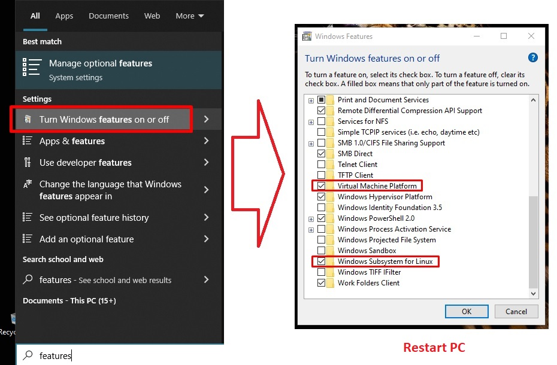

- Open PowerShell with Admin rights, run `wsl --install`. After installation, **restart PC again**.

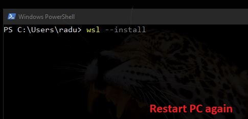

**Note**: If nothing happens when running `wsl --install`, then it is possible that you have an older verion of WSL installed (that could cause some problems when downloading and trying to install Ubuntu-22.04 in the next steps). Try to run `wsl --update` instead, then restart PC.

- Open PowerShell with Admin rights, run `wsl --set-default-version 2`

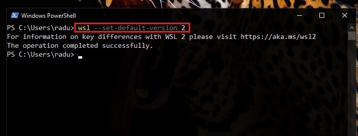

- Open Windows Store, and download ("Get") "Ubuntu 22.04 LTS" (or "Ubuntu 20.04 LTS"). After download is finished, click on "Open"/"Launch" from Windows Store.

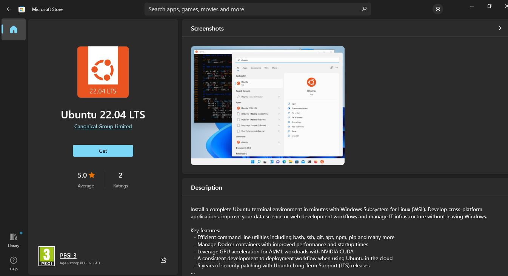

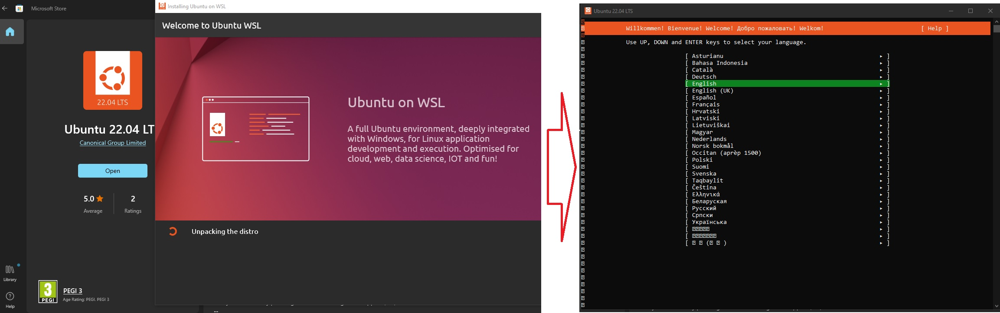

- Complete Ubuntu Installation Process in the new window (only using keyboard) - also press ENTER after the "mounting options" screen. _If "Provide a new UNIX username" (that only contains lowercase letters, underscore `_`, and dash `-`)_ is asked, just press CTRL+C (the user was already created when you provided an username and a pass).

- You can now run Ubuntu 22.04 LTS directly from start -> Run "Ubuntu 22.04 LTS"

- In a separate PowerShell, check for installed Linux subsystems by running `wsl --list --verbose` (or `wls -l -v` for short). You should see "Ubuntu-22.04" in RUNNING state with WSL Version 2.

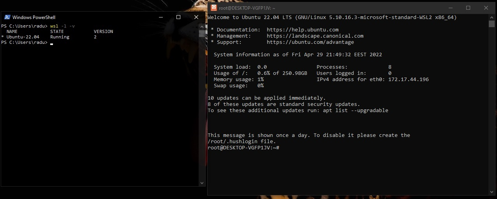

Congratulations, you officially have GNU/Linux Ubuntu 22.04 (based on Debian Distribution) installed on your system!

You can run `lsb_release -a` command on your Ubuntu Shell... and you can also install any package like `neofetch` (`sudo apt install neofetch`) - note that neofetch will download A LOT of additional packages automatically (like bzip2 fonts ghostscript jp2a etc... don't know any of these either).

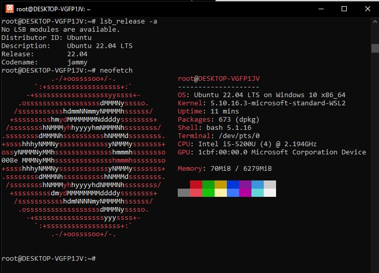

You can run `htop` as well:

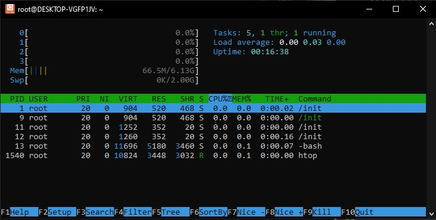

Or, we can run other "system information" related commands, like:
- `uptime`
- `free` - current memory usage (just like `top`/`htop`)
- `ps` - show current Linux Processes (`ps -A` to show all the processes)
- `df -h` - show file system disk space usage
- `lsblk` - list block devices

Display related and other devices/drivers:
- `lspci` - list all PCI devices (PCI buses) and drivers
- `nvidia-smi` - provies information about NVIDIA GPUs and drivers
- `lshw` - list all hardware information on machine (use `lshw -C display` for display/GPU related hardware information)
- `nvtop` - show GPU related processes, just like `htop` but for discrete graphics (eg. NVIDIA) (`sudo apt install nvtop`)

<br/>

Now, if you just close the Ubuntu Terminal, the container for Ubuntu subsystem will still run in background (you can check again by running in `wsl -l -v` in a PowerShell window).

From `wsl --help`, we can see the following commands:

- `wsl --shutdown` - terminates/shutdowns all distributions in "running" state -> This will put our Ubuntu 22.04 in "Stopped" state.
- `wsl --set-default Ubuntu-22.04` - sets our Ubuntu-22.04 distribution as default, namely, if you have multiple other distributions, "Ubuntu-22.04" will start if you just type/run `wsl` command directly from PoweShell.

So, we can run our Ubuntu 22.04 subsystem from PowerShell by running `wsl` command (instead of opening it from Start menu).

<br/>

Note that the current path in Ubuntu is `/mnt/c/Users/YOUR_USERNAME/`, so our main `C: (system)` partition is mounted as a drive in Linux... so you can theoretically access/remove/modify all Windows System Files ⚠⚠⚠.

<br/>

Note, that even if Ubuntu (or any other Linux) is in "Stopped" state (eg. after `wsl --shutdown`), you can still run any linux command _inside_ that Linux subsystem by writing `wsl <Linux command>` in PowerShell, and the output will be printed in PowerShell, and Ubuntu/Linux subsystem will still remain offline after 🟠 (so any `wsl <command>` from PowerShell will start/boot the Linux Subsystem Container, run the command, then shuts it down if it was in "Stopped" state). You will often see commands like `wsl docker` when working with Docker or any other Linux applications on Windows that runs with the help of WSL.

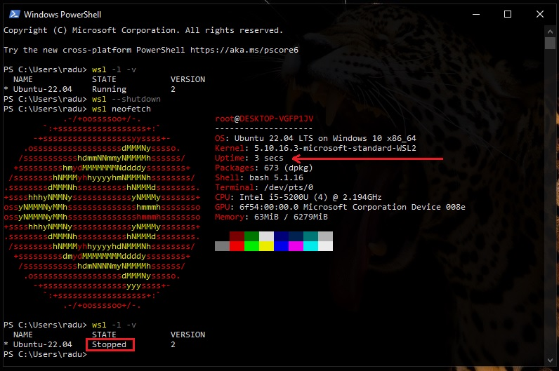

<br/>

## Run Python from Linux Subsystem

It's kind of amazing how fast we can transition from Powershell to Linux Subsystem terminal. For example, even if our Ubuntu subsystem is in "stopped" state, we can run `wsl python3` directly from PowerShell, and, we are actually running Python inside Linux in "PowerShell" (that's actually Ubuntu's Terminal). And, if we open another Ubuntu Terminal and run `htop`, we can see that our Ubuntu subsystem contains our previous Python "Task".

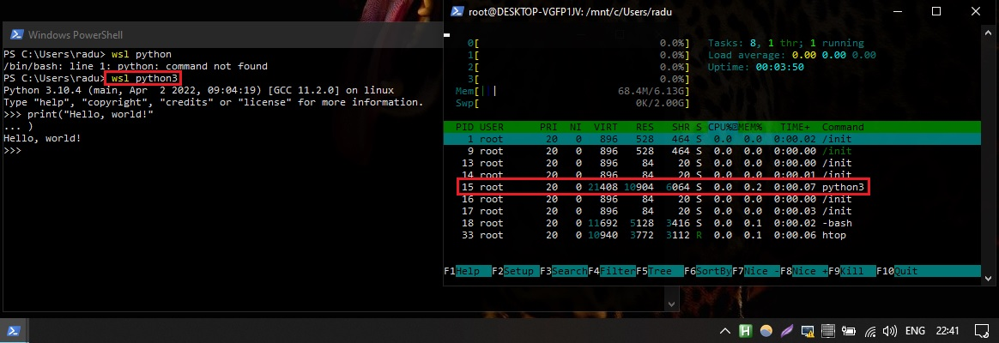

<br/>

## Compile C/C++ from Linux Subsystem

This could be also really useful if we want to compile `.c` or `.cpp` (C/C++) programs directly from PowerShell, by using our Linux Subsystem! Let's try it, by running the following from Ubuntu terminal:

```bash
apt show gcc
sudo apt install gcc
gcc --version
```

Since we are on Ubuntu (Debian based), we can install the _GNU C Compiler_ (GCC) using _Advanced Packaging Tool_ (APT).

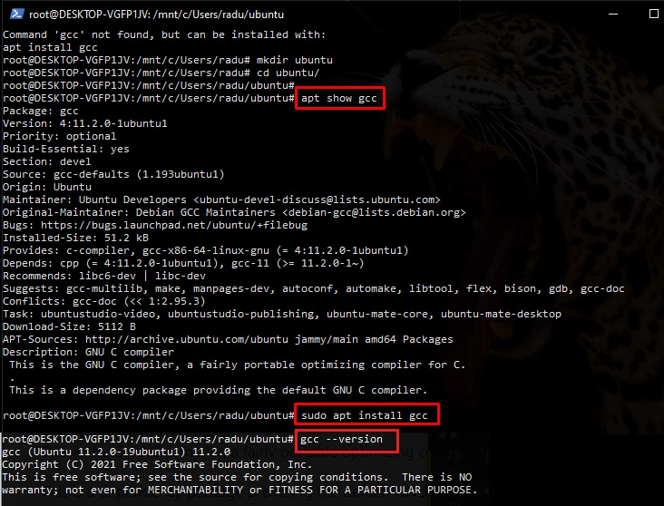

Create a new file using Nano editor:

```bash
nano hello.c
```

```c
#include <stdio.h>

int main() {
    printf("Hello there\n");
    return 0;
}
```

Press CTRL+O (Nano editor for "Write Out", meaning "Save"), CTRL+X to exit Nano editor. Run:

```bash
gcc -o hello hello.c
./hello
```

We should see our "Hello there" output. We can also find the created files in Windows File Explorer:

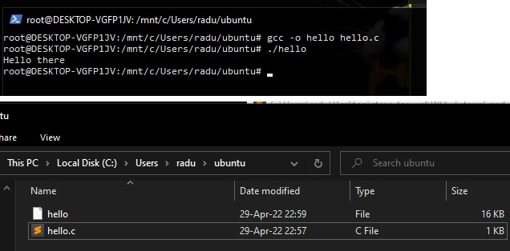

<br/>

## Nyancat

And, we can also run fun things like...

```bash
sudo apt install nyancat -y
nyancat
```

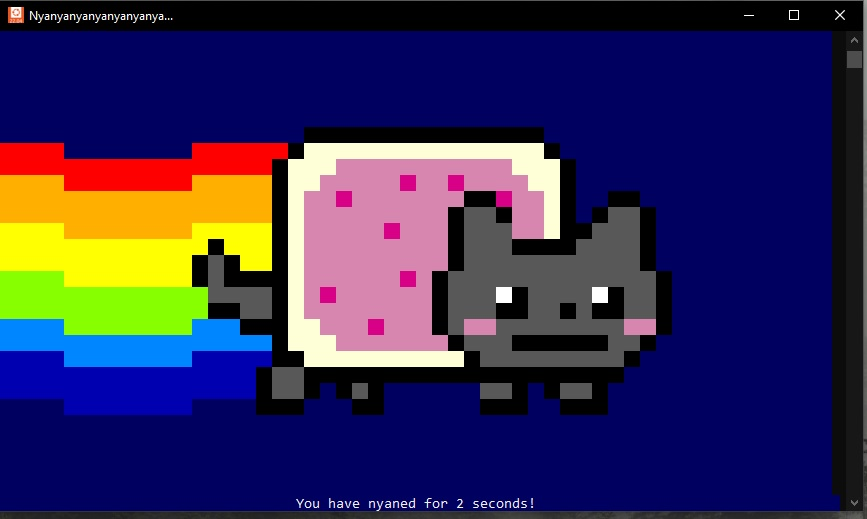
<br/>

Or... `sudo apt install cowsay`

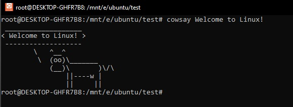

<br/>

Other fun commands:
- https://www.binarytides.com/linux-fun-commands/
- https://www.tecmint.com/20-funny-commands-of-linux-or-linux-is-fun-in-terminal/

<br/>

# Command Line Crash Course

Notes taken from:

- [Command Line Crash Course - freeCodeCamp (35m)](https://youtu.be/yz7nYlnXLfE)

## Intro to Bash Command Line

**Bash Shortcuts**

Most used shortcuts in bash (More [here](https://www.makeuseof.com/linux-bash-terminal-shortcuts/)):

- `CTRL+R` - search through commands history - based on your before-used commands, you can re-run a command by searching part of it (`history`)
- `CTRL+A` / `CTRL+E` - while you write a command, `CTRL+A` will move your cursor to the start of the command line, `CTRL+E` will move your cursor to the end
- `Ctrl+U` - Deletes before the cursor until the start of the command
- `CTRL+L` - clears the command line (`clear`)
- `Ctrl+D` - Closes the current terminal

Bash Control/Processes

- `Ctrl+S` - Stops command output to the screen
- `Ctrl+C` - Sends SIGI signal and kills currently executing command
- `Ctrl+Z` - Suspends current command execution and moves it to the background
- `Ctrl+Q` - Resumes suspended command

<br/>

**Bash Manual**

Each argument given to `man` command is normaly the name of the program, utility or function, then the information/documentation about that is displayed.

```bash
man bash
man <command>
man git
man gcc
man python3
```

(Monday, May 02, 2022)

<br/>

## Very basic Bash commands

### Creating files and directories

**Directories/Folders:**

- To create a directory/folder:

```bash
mkdir myfolder
```

- To remove a directory/folder that is not empty (if is not empty, will receive error: `rmdir: failed to remove 'ubuntu/': Directory not empty`):

```bash
rmdir myfolder
```

- To remove a directory that has files in it (Use `rm` with caution! ⚠⚠⚠) - `-r` stands for `recursive`, `remove directories and their contents recursively`

```bash
rm -r myfolder
```

- To create a directory within a directory (`-p, --parents - make parent directories as needed`):

```bash
mkdir -p mydir/mysubdir
cd mydir/mysubdir
```

<br/>
<br/>

**Files:**

Create files with `touch` - Note that `touch` is mainly used to alter the "modified" timestamp of a file:

```bash
touch myfile.txt

# You can create multiple files
nano file1.txt markdownFile.md script.py
```

You can create and edit files with `nano` editor (after entering nano editor, you will have multiple options like "save" `CTRL+O`, or "exit" `CTRL+X`):

```bash
nano hello.py
```

You can also create a file with content already in it by using `echo "your_string"` and direct the content to the file using `>` operator:

```bash
echo "This is my text file" > myfile.txt
echo "print("hi there")" > hi.py
python3 hi.py
```

You can also add content to the bottom of a file that already has content in it (append more content to end of file) by using `>>` operator. Note: you can also view the content of a file using `cat file.txt`

```bash
echo "My first text line" > myfile.txt
echo "My second text line on the same file" >> myfile.txt
cat myfile.txt

# will output
# My first text line
# My second text line on the same file
```

Both `>` and `>>` operators create a file if the mentioned file is not existent in current folder (https://linuxhint.com/difference-arrow-double-arrow-bash/), and:

- `>` output operator overwrites anything in a file
- `>>` appends to the existing file

<br/>

Note: You can see the content of a file by using `cat`. Or, you can see the first 10 lines of a files by running `head` command (`head myfile.txt`), and if you want to see the last 10 lines from a file, run `tail` (`tail myfile.txt`). There are also `more` and `less` commands in order to see the content of a file "page by page" (`more myfile.txt`) or line by line (`less myfile.txt`).

<br/>
<br/>

You can also use other text editor like `gedit`, or `vim` (that is almost used as an IDE) - you can run `vimtutor` command for a complete `vim` editor walkthrough.

```bash
vim myfile.txt
```

**Note:** We can also use vim as a "file explorer" by running `vim .` (it is also exited with `:q!`)

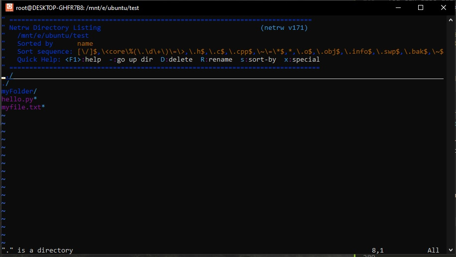

<br/>

Others:
If you want to see more information about a file (that is not necessarily a text file), you can run the `file` command. For example, viewing more details about a picture/image/photo:

```bash
file foggyPhoto.jpg

# will return
# foggyPhoto.jpg: JPEG image data, JFIF standard 1.01, resolution (DPI), density 72x72, segment length 16, progressive, precision 8, 5472x3648, components 3
```

Or, just for image files, you can also use `identify` (`man identiyf`) command (more on this [here](https://superuser.com/questions/275502/how-to-get-information-about-an-image-picture-from-the-linux-command-line)):

```bash
identify foggyPhoto.jpg
foggyPhoto.jpg JPEG 5472x3648 5472x3648+0+0 8-bit sRGB 1.07214MiB 0.000u 0:00.006
```

<br/>

### Navigating and finding/searching files

To list/view all the files within a folder, eg use flags to see detailed view (`man ls`):

```bash
ls
ls -lah
```

`ls` flags:

- `-a, --all` - do not ignore entries starting with . (hidden files)
- `-l` - use long listing format (display as list with 1 file and its details per row)
- `-h` - human-readable, print sizes like 1K, 234M, 2G, etc
- `-d, --directory` - list only directories
- `-c` - used with `-lt`, sort by ctime (time of last modification)
- `-C` - list entries by columns
- `--sort` - sort by WORD instead of name, eg `size (-S)`, `time (-t)`, `version (-v)`, `extension (-X)`

For example, to sort files by size within a folder, run `ls --sort=size -lah`.

<br/>
<br/>

To navigate to a folder within current path (`ls`), use "change directory" with `cd`. To go to the previous folder use `cd ..`, to go to previous previous directory `cd ../..` (go 2 levels back) and so on.

```bash
cd mydir/myotherdir
cd ..
cd ../..
```

<br/>
<br/>

To find files in the entire system (`/` - the root directory) or in current path and folders inside (`.`), we can use `find` (`man find`) - it will output the path(s) to the searched file:

```bash
find .
find / -name host.conf
find . -name docker-compose.yml
```

<br/>

To search for strings inside files (and output their path), use `ack` (`man ack`), is just as powerful, but easier as `grep`. Note, it is possible that `ack` needs to be installed (`sudo apt install ack` for Debian based distros).

```bash
ack 'stringpattern'

# or grep equivalent
grep -rni '/path/to/somewhere/' -e 'stringpattern'
# -r or -R is recursive
# -n is to show line number in file
# -w stands for match the whole word
# -l (lower-case L) can be added to just give the file name of matching files (show the file name, not the result itself)
# -e is the pattern used during the search
# -i for ignore case
```

https://stackoverflow.com/questions/16956810/how-do-i-find-all-files-containing-specific-text-on-linux

<br/>

### Manipulating files

As we saw, with `touch` (`man touch` for manual) we can manipulate the "modified" timestamp of files. Here we can mention the timestamp in any way we want, even as "2 hours ago" (with `-d` flag).

```bash
touch -d "09:00" myfile.txt
touch -d "2 hours ago" myfile.txt
touch -d "2022-02-24 13:23:40" myfile.txt
touch -d "next Wednesday" myfile.txt
touch -d "last Monday" myfile.txt
touch -d "last Thursday 16:21:32" myfile.txt
touch -d "Sun, 29 Feb 2020 16:21:42" myfile.txt
touch -d '1 June 2018 11:02' file1

# you can also touch multiple files
touch myfile1.txt myfile2.txt myfile3.txt
```

<br/>
<br/>

Remove/Delete files with `rm` (`man rm`).

- `rm -r` – delete files recursively from all directories and sub-directories
- `rm -f` – delete files on the path provided without prompting the user. This also includes deleting the “Read Only Files”

```bash
rm myfile.txt
rm -r myDirContainingFiles
```

You can also check these articles:

- https://vitux.com/10-deadly-commands-that-you-should-never-run-on-linux/
- https://phoenixnap.com/kb/dangerous-linux-terminal-commands

<br/>
<br/>

Move a file to another location (`man mv`, `mv /path/to/sourcefile /path/to/targetlocationfile`)

```bash
mv hi.py ../hi.py  # move one folder up
mv ../hi.py ./hi.py  # move file from one folder up to current folder/path
```

<br/>
<br/>

Changing filenames (renaming files) are also done with `mv`

```bash
mv currentFileName.txt newFileName.txt
mv hi.py hello.py
```

<br/>
<br/>

Copy files (either in same location, or other locations, with/withourt different names, etc)

```bash
cp file_2.txt file_3.txt
cp hello.py ../hello2.py

# If folder does not exist
cp hello.py /v2/hello.py  # cp: cannot create regular file '/v2/hello2.py': No such file or directory
mkdir -p ./v2 && cp hello.py $_
```

https://stackoverflow.com/questions/1529946/linux-copy-and-create-destination-dir-if-it-does-not-exist

<br/>

Also, `cp` is often used for backups

```bash
cp file_2.txt{,.bkp}

cp hello.py{,.bkp}
cp hello.py hello.py.bkp #  the equivalent command
```

<br/>

### Networking. Connecting to a server from a Linux PC

[(min22:20 - Command Line Crash Course)](https://youtu.be/yz7nYlnXLfE?t=1340)

Tunnel/Connect to a server terminal with `ssh`

```bash
ssh username@ipv4_ip_addres

# example
ssh root@127.54.43.98
```

If we connect to a session, then exit that session, we can use `tmux` to reconnect back to that session without needing to run again `ssh username@ipv4_ip_addres` command.

```bash
tmux  # same as tmux attach, attach to last session
exit  # exits current session opened with tmux (detach session), same as CTRL+B, D
```

You can select from multiple sessions with `tmux ls`, then attach to one from list by its index

```bash
tmux ls
tmux attach -t 0
```

To [close/kill all tmux session](https://askubuntu.com/questions/868186/how-to-kill-all-tmux-sessions-or-at-least-multiple-sessions-from-the-cli) use either:

```bash
tmux kill-server
# or
pkill -f tmux
```

<br/>

**Other related networking commands:**

- `ifconfig` - view the configuration of network interface (more about [here](https://www.computerhope.com/unix/uifconfi.htm)). Also used for network configuration.

Note: `ifconfig` needs to be installed with `sudo apt install net-tools`.
In Windows OS, we have `ipconfig` equivalent command.

- `ip` - newer command for `ifconfig` (`ip` command requests must have an "object" parameter, eg. `ip a`)

<br/>

### Process Management in brief

Get the pid (process id) of a process/application/task

```bash
pidof program

# example
pidof chrome
pidof firefox
```

Example kill program with pid of 9378 (assuming this pid was found with `top` or `pidof` command)

```bash
kill 9378
```

Kill a program (all programs) by its name(s) (`man pkill`)

```bash
pkill program

# example
pkill chrome
```

Get a list of all running programs/tasks

```bash
top
```

Get a list of all running programs/tasks (with a nice interface)

```bash
htop
```
