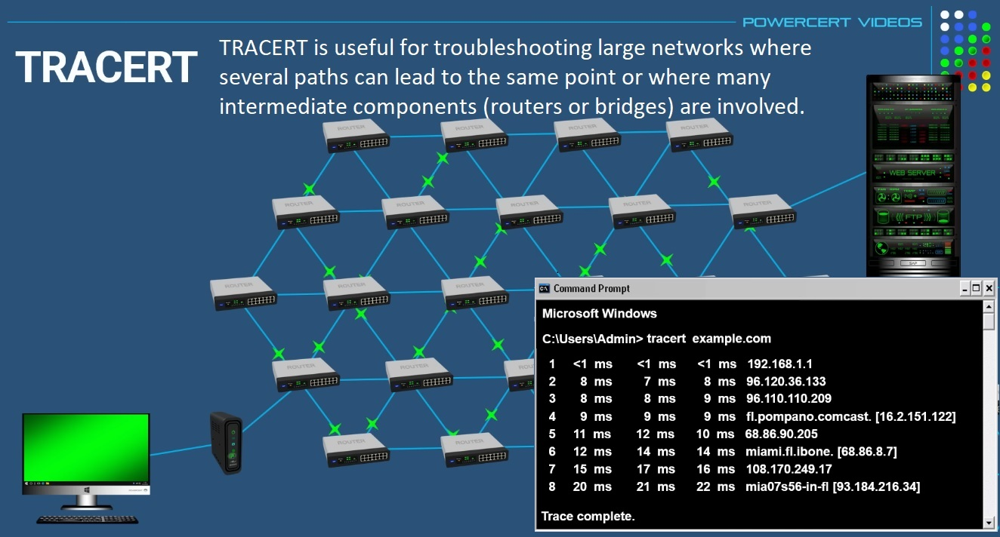
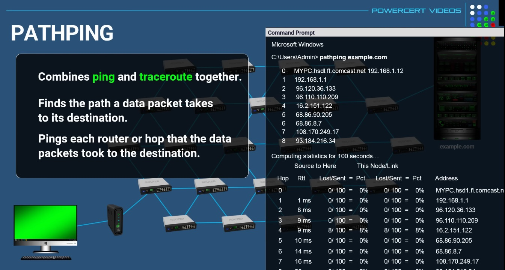
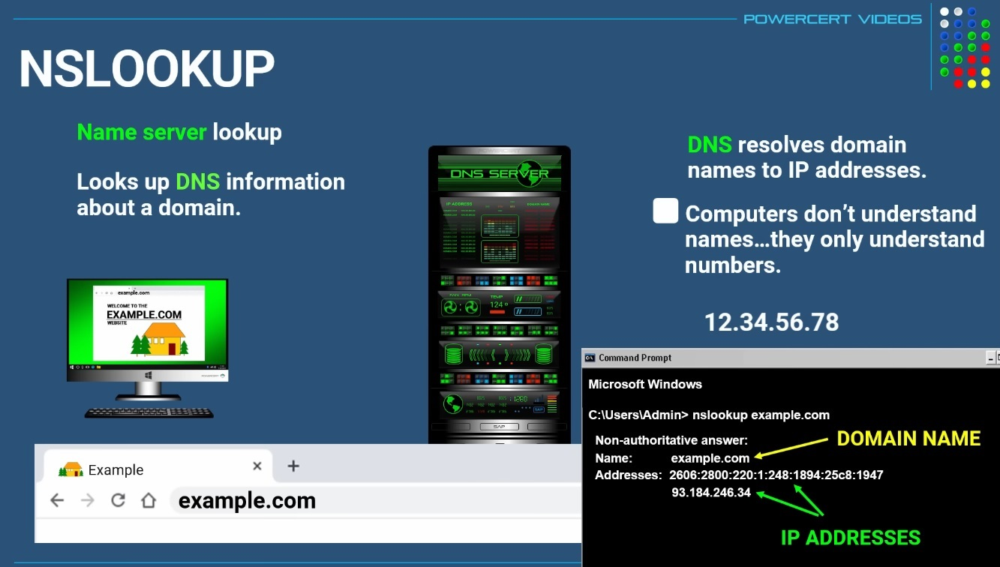
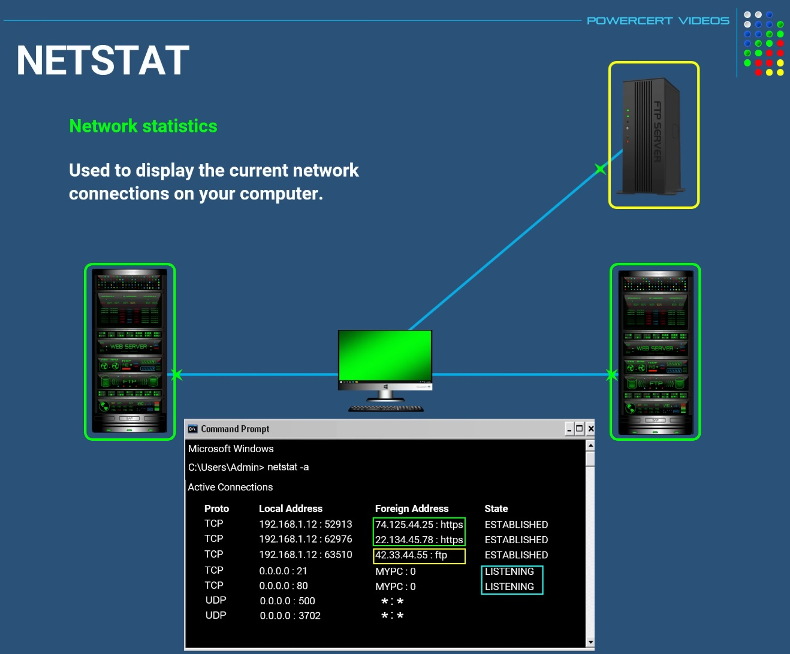
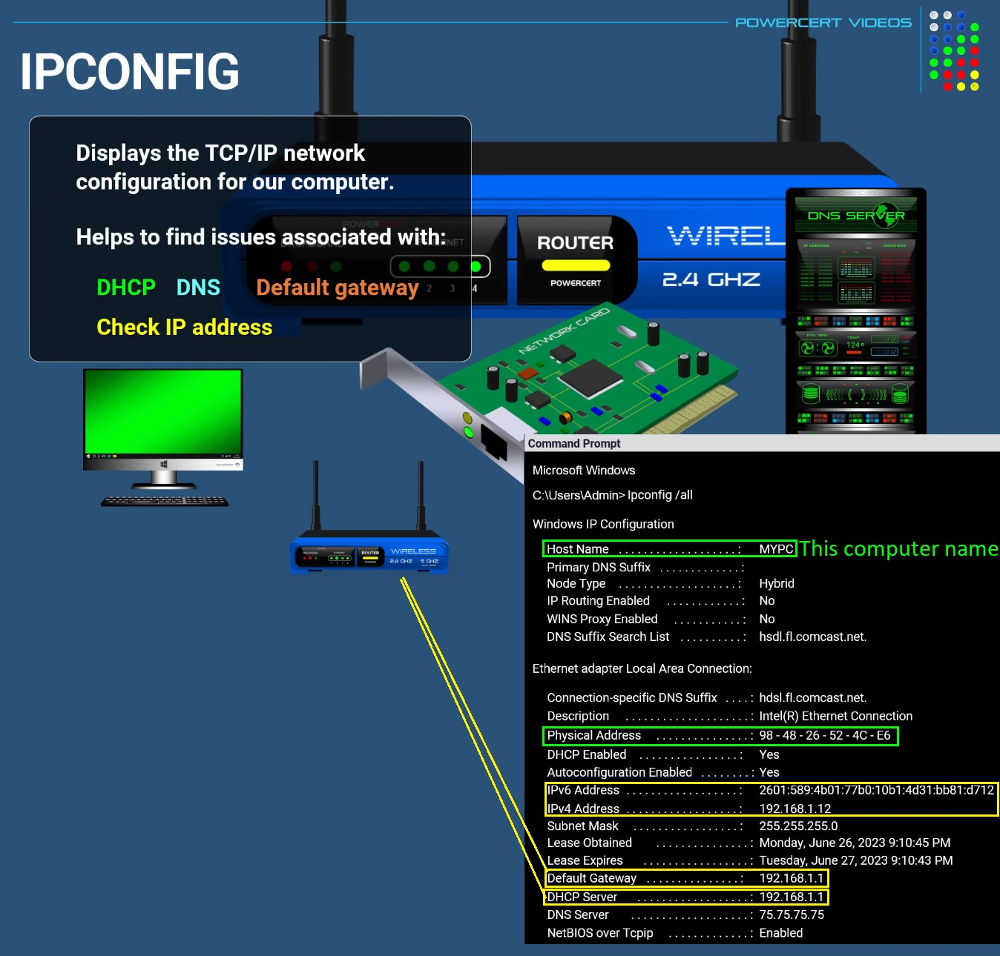
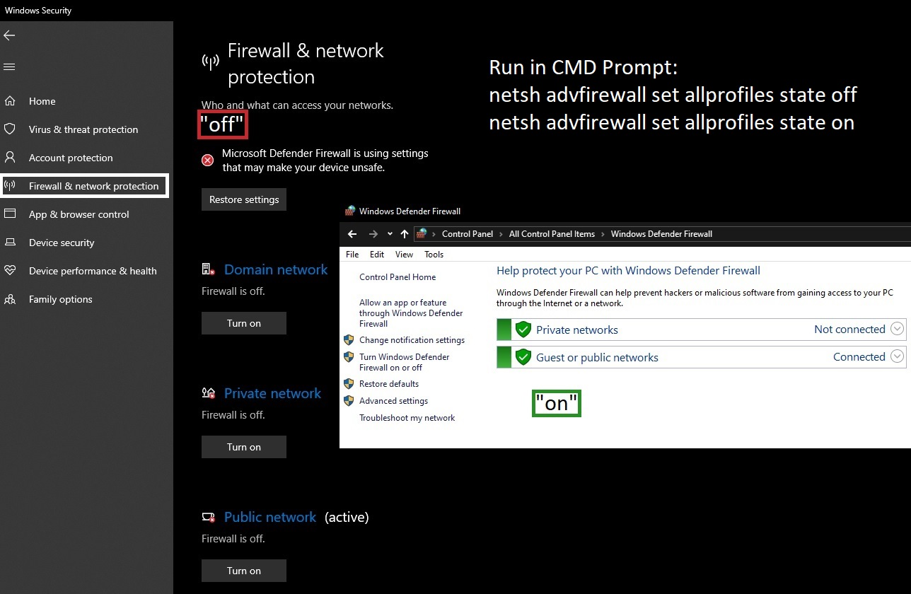
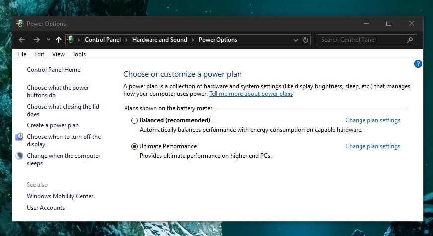
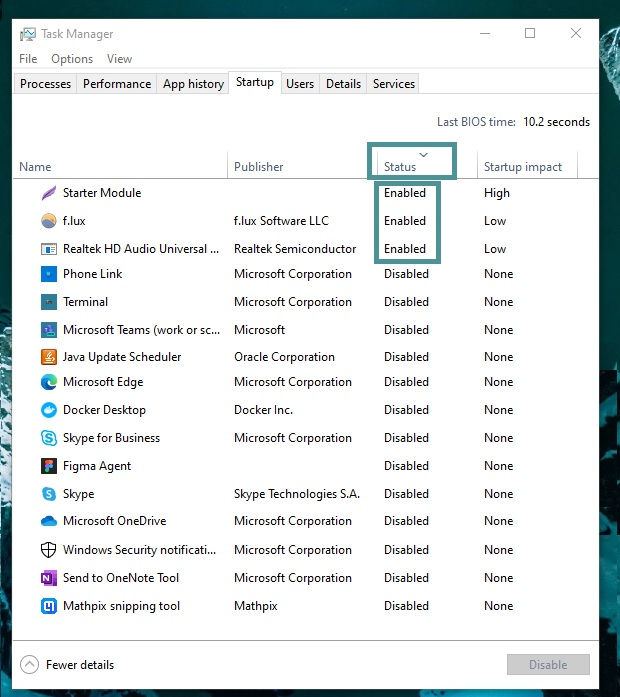
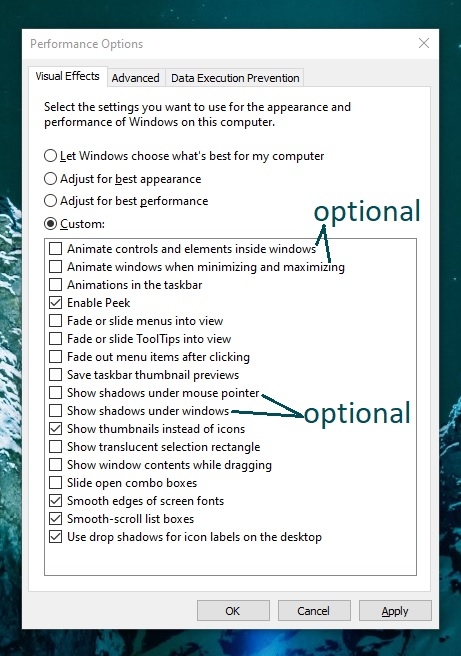

# Windows Command Line Tools

## Network Commands for CMD Prompt

Resources:

- [Windows Command Line Tools 14m - PowerCert Animated Videos](https://www.youtube.com/watch?v=Jfq_BYhxvy0)
- [40 Windows Commands you NEED to know (in 10 Minutes) - NetworkChuck](https://www.youtube.com/watch?v=Jfvg3CS1X3A)
- [Windows Command Line Tools - CompTIA A+ 220-1102 - 1.2 - 24min - Professor Messer](https://www.youtube.com/watch?v=Df2rx7b2tMY)
- [30 Windows Commands you CAN’T live without 14min - NetworkChuck](https://www.youtube.com/watch?v=prVHU1fLR20)

<br/>

Table of Contents:

- [Windows Command Line Tools](#windows-command-line-tools)
  - [Network Commands for CMD Prompt](#network-commands-for-cmd-prompt)
    - [ping](#ping)
    - [tracert](#tracert)
    - [pathping](#pathping)
    - [nslookup](#nslookup)
    - [arp - Address Resolution Protocol](#arp---address-resolution-protocol)
    - [getmac](#getmac)
    - [netstat - Network statistics](#netstat---network-statistics)
    - [route print](#route-print)
    - [ipconfig](#ipconfig)
    - [ipconfig release \& renew](#ipconfig-release--renew)
    - [ipconfig for DNS](#ipconfig-for-dns)
      - [Add DNS to hosts file manually](#add-dns-to-hosts-file-manually)
    - [netsh](#netsh)
    - [netsh advfirewall](#netsh-advfirewall)
  - [Useful system commands](#useful-system-commands)
    - [chkdsk](#chkdsk)
    - [SFC and DISM commands](#sfc-and-dism-commands)
    - [tasklist \& taskkill](#tasklist--taskkill)
    - [clip command](#clip-command)
    - [powercfg](#powercfg)
      - [Enable Performance Mode](#enable-performance-mode)
    - [shutdown](#shutdown)
    - [winver](#winver)
  - [CMD Prompt File system commands](#cmd-prompt-file-system-commands)
    - [File Management commands](#file-management-commands)
      - [mkdir, rm, rmdir, copy](#mkdir-rm-rmdir-copy)
      - [xcopy, robocopy](#xcopy-robocopy)
    - [Partition commands](#partition-commands)
      - [Powershell Get-Volume](#powershell-get-volume)
      - [diskpart utility tool](#diskpart-utility-tool)

(Monday, May 06, 2024)

### ping

```bash
ping 8.8.8.8

# continuous ping until stopped with CTRL+C
ping -t 8.8.8.8
```

<br/>

### tracert

Trace route/path to specified IP Address

```sh
tracert 8.8.8.8

# Tracing route to dns.google [8.8.8.8]
# over a maximum of 30 hops:
```

<br/>

To not resolve domain names, use `-d` flag (the process will be faster)

```bash
tracert -d 1.1.1.1
```



<br/>

### pathping

```sh
pathping 8.8.8.8
```

- shows all the hops that it took to reach 8.8.8.8
- then it will ping each router/hop 100 times along the path it took to show statistics of the ping
- note that this will take some time (5 or more minutes...)



<br/>

### nslookup

Stand for Name Server Lookup

- looks up DNS (Domain Name System) information about a domain
- DNS resolves domain names to ip addresses (e.g. IP Address for example.com is 93.184.215.14)

```sh
nslookup example.com
# Server:  your-IPS-provider-server-name
# Address:  your-IPS-provider-ip-address

# Non-authoritative answer:
# Name:    example.com
# Addresses:  2606:2800:21f:cb07:6820:80da:af6b:8b2c
#           93.184.215.14
```



<br/>

### arp - Address Resolution Protocol

- ARP resolves IP Addresses to MAC (physical) addresses
- a PC needs to also know the MAC address of another PC to communicate with (and it will store it in its cache afterwards)
- we can use `arp -a` to check the current PC's ARP Cache


<br/>

https://stackoverflow.com/questions/30644314/list-all-devices-on-local-network

```bash
# Windows Batch Script (.bat)
# notepad pingAll.bat
# however it is very slow...
for /L %%i in (1,1,254) do (
ping -a -n 1 192.168.0.%%i
)

arp -a >con
```

### getmac

Get all physical (MAC) addresses associated with current Windows PC

```bash
getmac /v
```

<br/>

### netstat - Network statistics

```sh
netstat -a
```

<br/>

Show which ports are open

```bash
netstat -af
```

Show which Process IDs (PIDs) are associated with the open ports `-o`

```bash
netstat -o
```

Show which Process IDs and Process names are associated with the open ports `b`

```bash
netstat -o -b
```



<br/>

Show interface statistics on sent/received packets each 5 seconds

```bash
netstat -e -t 5
```

<br/>

### route print

Show routes this Windows PC will take to get to some other computer networks (show the routing table of this PC)

```bash
route print
```

<br/>

We can also manually add routes to customize how our PC will reach a certain network

```bash
# Example to go to 192.168.40.0 network through 10.7.1.44 gateway
route add 192.168.40.0 mask 255.255.255.0 10.7.1.44

cls

route print

# Example to delete a route
route delete 192.168.40.0
```

Note: The above is useful when playing with Docker Containers (and Docker Networks) on a local VirtualMachine

<br/>

### ipconfig

```bash
ipconfig /all
```

```bash
ipconfig /all | findstr DNS
```



<br/>

### ipconfig release & renew

If we want a new (local) IP Address to our Windows PC, we can run the following to ask our DHCP Server (our router) to give us a new IP Address

```bash
ipconfig /release

ipconfig /renew

# we can also specify on which interface we want to renew the ip address
ipconfig /release "Wi-Fi"
```

<br/>

### ipconfig for DNS

We can check all of our associated IP Addresses with their DNS saved in our PC DNS Cache by running

```bash
# Show information on all DNS cached
ipconfig /displaydns

# Automatically copy to clipboard the output of command
ipconfig /displaydns | clip
```

<br/>

Flush/Remove all DNS Cache entries stored in this Windows PC

```bash
ipconfig /flushdns
```

<br/>

#### Add DNS to hosts file manually

https://4it.com.au/kb/article/how-to-add-a-dns-entry-manually-to-a-windows-computer/

Go to

```
C:\Windows\System32\drivers\etc
```

Open hosts file with a text editor (e.g. sublime text, notepad++, visual studio code, etc)

```bash
notepad C:\Windows\System32\drivers\etc\hosts

code C:\Windows\System32\drivers\etc\hosts
```

Add the new DNS entry by appending a line

```
127.0.0.1 kubernetes.docker.internal
```

<br/>

### netsh

Get a HTML report on all the Wi-Fi information and Wi-Fi events from the last three days and groups them by Wi-Fi connection sessions.

```bash
netsh wlan show wlanreport
```

<br/>

Show information (state: connected/disconnected) on connection interfaces

```bash
netsh interface show interface
```

<br/>

Show interfaces configurations

```bash
netsh interface ip show address
```

<br/>

Show DNS Servers

```bash
netsh interface ip show dnsservers
```

<br/>

### netsh advfirewall

Turn off/on Windows Defender Firewall

```bash
netsh advfirewall set allprofiles state off

netsh advfirewall set allprofiles state on
```



<br/>

## Useful system commands

### chkdsk

Check disk errors

```bash
chkdsk /f
```

Check disk errors on physical sector

```bash
chkdsk /r
```

<br/>

### SFC and DISM commands

SFC - System File Checker scans the OS files and repairs them if they are corrupted (includes DLL files)

- SFC repairs corrupted files within operating system by using a copy of windows called "system image" (if the "system image" is corrupted too, SFC won't be able to fix the files)

```bash
sfc /scannow

# Verification 100% complete.
# Windows Resource Protection did not find any integrity violations.
```

DISM - Deployment Image Servicing and Management tool

- If System File Checker has found corrupted files and the repair was not successful (`Windows Resource Protection found corrupt files but was unable to fix some of them` after running `sfc /scannow`)
- DISM command will repair the system image (it will fetch it from the Internet)
- Then we can run `sfc /scannow` again

```bash
dism /online /cleanup-image /scanhealth
dism /online /cleanup-image /restorehealth

# Deployment Image Servicing and Management tool
# Version: 10.0.19041.3636

# Image Version: 10.0.19045.4291

# [==========================100.0%==========================]
# The restore operation completed successfully.
# The operation completed successfully.

sfc /scannow
```

<br/>

### tasklist & taskkill

```bash
tasklist

Image Name                     PID Session Name        Session#    Mem Usage
========================= ======== ================ =========== ============
System Idle Process              0 Services                   0          8 K
System                           4 Services                   0      7,072 K
Secure System                  104 Services                   0     58,140 K
```

Find by program name

```bash
tasklist | findstr firefox
```

Kill task by PID

```bash
taskkill /f /pid 15532
```

Kill task by nanme

```bash
taskkill /f /IM firefox.exe
```

<br/>

### clip command

We can copy to clipboard the output of a command by piping a `clip` command

```bash
# Show information on all DNS cached
ipconfig /displaydns

# Automatically copy to clipboard the output of command
ipconfig /displaydns | clip
```

<br/>

### powercfg

Check any energy or power issues with the current Windows PC/Laptop

```bash
powercfg /energy

# Enabling tracing for 60 seconds...
# Observing system behavior...

# Energy efficiency problems were found.

# 6 Errors
# 6 Warnings
# 41 Informational

# See C:\WINDOWS\system32\energy-report.html for more details.
```

```bash
powercfg /batteryreport

# Battery life report saved to file path C:\WINDOWS\system32\battery-report.html

# Note: The above file path can pe run directly in CMD Prompt
```

<br/>

#### Enable Performance Mode

From: https://www.howtogeek.com/368781/how-to-enable-ultimate-performance-power-plan-in-windows-10/

In Windows 10 or later, to enable performance power plan, run:

```bash
powercfg -duplicatescheme e9a42b02-d5df-448d-aa00-03f14749eb61
```

Now go to Start > Choose a power plan > Ultimate Performance



<br/>

Go to Task Manager (CTRL+SHIFT+ESC) > StartUp Tab > Disable all unnecessary apps (except Docker, Realtech HD Audio)



<br/>

For more UI perfomance, go to Start > Adjust the appearance and performance > Uncheck all options except the followings



Finally restart the laptop.

<br/>

### shutdown

(Tuesday, May 07, 2024)

Restart the Windows PC on BIOS mode by using the `/r` `/fw` `/f` `t` switches (for no more spamming of F2/F10/F11/F12 when rebooting)

```bash
shutdown /r /fw /f /t 0
```

Note: It is also useful for enabling virtualization from BIOS.

Other resources on this:

- https://superuser.com/questions/1809071/shutdown-client-via-cmd-and-enter-boot-menu Check `Start -> Run -> "msconfig"`
- https://asmed.com/msconfig-2/

<br/>

- To shutdown and **restart** the system on UEFI mode, we can use the `/r` switch

```bash
# Restart
shutdown /r

# Wait 10 seconds, then shutdown and restart
shutdown /r /t 10

# Abort the shutdown countdown
shutdown /a
```

<br/>

### winver

`winver` (Windows Version) is a utility used to obtain information about the operating system version.

```bash
winver
```

<br/>

## CMD Prompt File system commands

Resource: [Windows Command Line Tools - CompTIA A+ 220-1102 - 1.2 - 24min - Professor Messer](https://www.youtube.com/watch?v=Df2rx7b2tMY)

Note: For manual (help) of each command, we can use `/?` option.

```bash
# In CMD Prompt
copy /?

# In PowerShell
man copy

# NAME
#     Copy-Item

# SYNTAX
#     Copy-Item [-Path] <string[]> [[-Destination] <string>] [-Container] [-Force] [-Filter <string>] [-Include <string[]>] [-Exclude <string[]>] [-Recurse] [-PassThru] [-Credential <pscredential>] [-WhatIf]
#     [-Confirm] [-FromSession <PSSession>] [-ToSession <PSSession>] [<CommonParameters>]

#     Copy-Item [[-Destination] <string>] -LiteralPath <string[]> [-Container] [-Force] [-Filter <string>] [-Include <string[]>] [-Exclude <string[]>] [-Recurse] [-PassThru] [-Credential <pscredential>]
#     [-WhatIf] [-Confirm] [-FromSession <PSSession>] [-ToSession <PSSession>] [<CommonParameters>]

# PARAMETERS
#     -Confirm
#     -Container
#     -Credential <pscredential>
#     -Destination <string>
#     -Exclude <string[]>
#     -Filter <string>
#     -Force
#     -FromSession <PSSession>
#     -Include <string[]>
#     -LiteralPath <string[]>
#     -PassThru
#     -Path <string[]>
#     -Recurse
#     -ToSession <PSSession>
#     -WhatIf
#     <CommonParameters>
#         This cmdlet supports the common parameters: Verbose, Debug,
#         ErrorAction, ErrorVariable, WarningAction, WarningVariable,
#         OutBuffer, PipelineVariable, and OutVariable. For more information, see
#         about_CommonParameters (https://go.microsoft.com/fwlink/?LinkID=113216).

# INPUTS
#     System.String[]
#     System.String
#     System.Management.Automation.PSCredential

# OUTPUTS
#     System.Object

# ALIASES
#     cpi
#     cp
#     copy

# REMARKS
#     Get-Help cannot find the Help files for this cmdlet on this computer. It is displaying only partial help.
#         -- To download and install Help files for the module that includes this cmdlet, use Update-Help.
#         -- To view the Help topic for this cmdlet online, type: "Get-Help Copy-Item -Online" or
#            go to https://go.microsoft.com/fwlink/?LinkID=2096990.
```

<Br/>

### File Management commands

#### mkdir, rm, rmdir, copy

- Create an empty directory (folder)

```shell
PS D:\> cd E:
PS E:\> mkdir WindowsCommands

#     Directory: E:\
# Mode                 LastWriteTime         Length Name
# ----                 -------------         ------ ----
# d----           29-May-24    21:40                WindowsCommands

rmdir .\WindowsCommands\
```

- Create recursive directories

```shell
# CMD Prompt
mkdir WindowsCommands\SubFolder\SubSubFolder

# Powershell
mkdir -p WindowsCommands\SubFolder\SubSubFolder
# or md (make directory) for short
md -p WindowsCommands\SubFolder\SubSubFolder
```

- Delete Directory containing files

```shell
# PowerShell
rm -r .\SubFolder\

# CMD Prompt
rmdir /s/q foldername
```

> https://stackoverflow.com/questions/186737/whats-the-fastest-way-to-delete-a-large-folder-in-windows

- Copy files with `copy (/v, /y)`
  - `/v` - verifies that new files are written correctyl
  - `/y` - supresses propting to confirm you want to overwrite an existing destination file

```shell
echo "Hello" > hello.txt

copy hello.txt hello2.txt
```

<br/>

#### xcopy, robocopy

https://www.quora.com/Is-it-faster-to-copy-tons-of-small-files-say-1TB-of-photos-using-xcopy-in-dos-or-Linux-or-whatever-than-in-Windows-In-other-words-does-Windows-indexing-and-all-that-slow-down-the-copy-or-is-the-bottleneck-in-the-HD

Copy files and directory trees (using `/s` option)

```shell
xcopy /s .\Documents E:\backups\Documents

# Note Wednesday, May 29, 2024:
# This was very fast (around 2 seconds) considering it was from a partition to another
# It would've taken longer if I was using Explorer GUI

cd E:\
rm -r .\backups\
```

Robocopy (robust copy) is a better version of `xcopy`. It has multithreading (default) and can be used to copy files and directory trees.

```shell
cd ~

# For manual, note that /s for subdirectories and files should be used
robocopy /?

robocopy /s .\Documents\ E:\backups\Documents
  #              Total    Copied   Skipped  Mismatch    FAILED    Extras
  #   Dirs :       397       393         1         0         3         0
  #  Files :       714       710         4         0         0         0
  #  Bytes :  775.62 m  775.57 m    51.3 k         0         0         0
  #  Times :   0:00:02   0:00:00                       0:00:00   0:00:01


  #  Speed :           1017837949 Bytes/sec.
  #  Speed :            58241.154 MegaBytes/min.
  #  Ended : Wednesday, May 29, 2024 22:20:30
# It took again around 2 seconds
```

<br/>

### Partition commands

#### Powershell Get-Volume

```shell
# PowerShell
Get-Volume
# DriveLetter FriendlyName FileSystemType DriveType HealthStatus OperationalStatus SizeRemaining      Size
# ----------- ------------ -------------- --------- ------------ ----------------- -------------      ----
# D           Second SSD   NTFS           Fixed     Healthy      OK                     75.39 GB 931.51 GB
#                          FAT32          Fixed     Healthy      OK                     976.3 MB    996 MB
# C                        NTFS           Fixed     Healthy      OK                     41.54 GB 299.46 GB
#                          NTFS           Fixed     Healthy      OK                     84.75 MB    556 MB
```

#### diskpart utility tool

To enter `diskpart` cli, just run:

```shell
diskpart
```

Now we can use `list volume` command to list all the volumes on the system

```shell
list
# Microsoft DiskPart version 10.0.19041.3636

# DISK        - Display a list of disks. For example, LIST DISK.
# PARTITION   - Display a list of partitions on the selected disk. For example, LIST PARTITION.
# VOLUME      - Display a list of volumes. For example, LIST VOLUME.
# VDISK       - Displays a list of virtual disks.

list volume
  # Volume ###  Ltr  Label        Fs     Type        Size     Status     Info
  # ----------  ---  -----------  -----  ----------  -------  ---------  --------
  # Volume 0                      FAT32  Partition   1000 MB  Healthy    System
  # Volume 1     C                NTFS   Partition    299 GB  Healthy    Boot
  # Volume 3                      NTFS   Partition    556 MB  Healthy    Hidden
  # Volume 4     D   Second SSD   NTFS   Partition    931 GB  Healthy
```
