# PHP Tutorial

Credits / Notes taken from:

- [6h30m PHP For Absolute Beginners | 6.5 Hour Course - Traversy Media (dec-2020)](https://youtu.be/2eebptXfEvw)
- [4h30m PHP Programming Language Tutorial - freeCodeCamp (jun-2018)](https://www.youtube.com/watch?v=OK_JCtrrv-c&ab_channel=freeCodeCamp.org)
- [PHP Tutorial - w3schools](https://www.w3schools.com/php/)
- https://www.php.net/manual/en/index.php

<br/>

Table of Contents:

- [PHP Tutorial](#php-tutorial)
  - [PHP Introduction](#php-introduction)
  - [PHP Installation using XAMPP](#php-installation-using-xampp)
  - [Set a new password to MySQL Xampp database](#set-a-new-password-to-mysql-xampp-database)
  - [PHP Syntax](#php-syntax)
  - [PHP Variables](#php-variables)
  - [PHP Variables Scope](#php-variables-scope)
    - [PHP The global Keyword](#php-the-global-keyword)
    - [PHP The static keyword](#php-the-static-keyword)
  - [PHP Debug / Print to JS Console function](#php-debug--print-to-js-console-function)
- [PHP Data types and operators](#php-data-types-and-operators)
  - [PHP Data types, var_dump(), check functions](#php-data-types-var_dump-check-functions)
  - [PHP Constants](#php-constants)
  - [PHP Operators](#php-operators)
  - [PHP Numbers](#php-numbers)
    - [PHP Casting Strings and Floats to Integers](#php-casting-strings-and-floats-to-integers)
    - [PHP Number formatting](#php-number-formatting)
    - [PHP Math](#php-math)
  - [PHP Dates](#php-dates)
- [PHP String methods](#php-string-methods)
  - [strlen, trim, strpos, substr, str_replace](#strlen-trim-strpos-substr-str_replace)
  - [String indexes, PHP Strings are mutable](#string-indexes-php-strings-are-mutable)
  - [String Explode, Array Implode](#string-explode-array-implode)
- [PHP Arrays](#php-arrays)
  - [Array methods](#array-methods)
    - [count, push, pop, unshift, shift](#count-push-pop-unshift-shift)
    - [String Explode, Array Implode](#string-explode-array-implode-1)
    - [Check if element in array, get index of element](#check-if-element-in-array-get-index-of-element)
    - [Merge arrays, chunk arrays](#merge-arrays-chunk-arrays)
    - [Sort Arrays](#sort-arrays)
  - [PHP Associative Arrays (Dictionaries/JS Objects)](#php-associative-arrays-dictionariesjs-objects)
    - [Associative Array simple methods](#associative-array-simple-methods)
    - [Sort Associative array](#sort-associative-array)
    - [Two dimensional Array like JS Objects](#two-dimensional-array-like-js-objects)
- [PHP conditionals and loops](#php-conditionals-and-loops)
  - [PHP conditionals](#php-conditionals)
    - [if.. elseif.. else](#if-elseif-else)
    - [ternary operator ?](#ternary-operator-)
    - [short ternary ?:](#short-ternary-)
    - [null coalescing operator ??](#null-coalescing-operator-)
    - [switch case](#switch-case)
  - [PHP loops](#php-loops)
    - [while, do while](#while-do-while)
    - [for loops](#for-loops)
    - [foreach (arrays)](#foreach-arrays)
- [PHP Functions](#php-functions)
  - [Arrow Functions in PHP 7.4, array_reduce](#arrow-functions-in-php-74-array_reduce)
  - [Higher order array functions](#higher-order-array-functions)
    - [Array Reduce](#array-reduce)
    - [Array Map](#array-map)
    - [Array Filter](#array-filter)
- [PHP OOP](#php-oop)
  - [Introduction to PHP OOP syntax](#introduction-to-php-oop-syntax)
    - [Static properties and methods](#static-properties-and-methods)
    - [Inheritance](#inheritance)
    - [Private vs Protected access specifiers](#private-vs-protected-access-specifiers)
- [PHP Files](#php-files)
  - [Including PHP files with include, require](#including-php-files-with-include-require)
  - [Working with File system](#working-with-file-system)
    - [Magic constants](#magic-constants)
    - [Create, rename, delete directory with PHP](#create-rename-delete-directory-with-php)
    - [Create files, Read files](#create-files-read-files)
    - [Read JSON files from API](#read-json-files-from-api)
  - [File upload from HTML Form](#file-upload-from-html-form)
- [PHP cURL](#php-curl)
  - [PHP cURL Introduction](#php-curl-introduction)
    - [Make a simple cURL request](#make-a-simple-curl-request)
    - [Retrieve cURL status code](#retrieve-curl-status-code)
    - [POST request with cURL](#post-request-with-curl)
    - [Retrieve HTML from a website and save into file](#retrieve-html-from-a-website-and-save-into-file)

## PHP Introduction

- PHP is an acronym for "PHP: Hypertext Preprocessor"
- PHP is a widely-used, open source scripting language
- PHP is a server-side language. PHP scripts/code are executed on the server, and the result is returned to the browser as plain HTML
- `.php` files can contain text, HTML, CSS, JavaScript, and PHP code
- PHP is an interpreted language

[What can PHP do?](https://www.w3schools.com/php/php_intro.asp)

- PHP can generate dynamic page content

- PHP can create, open, read, write, delete, and close files on the server

- PHP can collect form data

- PHP can send and receive cookies

- PHP can add, delete, modify data in your database

- PHP can be used to control user-access

- PHP can encrypt data

- **PHP is used for**
  - Simple or Complex websites
  - CRM Portals (Customer relationship management)
  - E-commerce systems
  - REST APIs
  - Image/video/audio processing
  
  <br/>
  
- **PHP CMSs (Content management systems)**
  - [Wordpress](https://wordpress.org/download/) - Most popular CMS (Open-source)
  - [Drupal](https://www.drupal.org/download) - CMS + E-commerce (Open-source)
  - [Magento](https://magento.com/tech-resources/download) - E-commerce ([Open-source - limited; Product - "Adobe Magento Commerce"](https://magento.com/products/magento-open-source))
  - [Prestashop](https://www.prestashop.com/en/download) - E-commerce (Open-source)
  - [Opencart](https://www.opencart.com/index.php?route=cms/download) - E-commerce (Open-source)
  - [Joomla](https://www.joomla.org/) - CMS (Open-source)
  - [October CMS](https://octobercms.com/) - Lightweight (although limited) Open-source "CMS" (most of interactions are based on writing HTML/PHP code, unlike WordPress with drag and dropping elements/components)
  
  <br/>
  
- **PHP Frameworks**
  
  - [Laravel](https://laravel.com/)
  - [Symfony](https://symfony.com/)
  - [CodeIgniter](https://www.codeigniter.com/)
  - [Yii2](https://www.yiiframework.com/)
  - [CakePHP](https://cakephp.org/)

With PHP you are not limited to output HTML. You can output images, PDF files, and even Flash movies. You can also output any text, such as XHTML and XML.

What's new in PHP 7? (released December 2015)

- PHP 7 is much faster than the previous popular stable release (PHP 5.6 - released Aug 2014)
- PHP 7 has improved Error Handling
- PHP 7 supports stricter Type Declarations for function arguments
- PHP 7 supports new operators (like the spaceship operator: `<=>`)

Note: PHP 8 was released on November 2020.

## PHP Installation using XAMPP

In order to run PHP, we need run an Web Apache Server that processes `.php` files and sends the output to the browser.<br/>For this, we can install [XAMPP](https://www.apachefriends.org/ro/index.html) distribution (X-Cross Platform, Apache, MariaDB/MySQL, PHP, Perl).

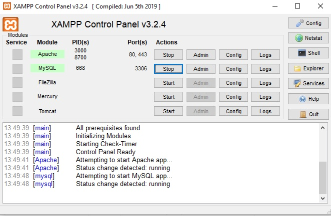

- To check if Apache server is running, open your browser and type http://localhost/dashboard/

- To check if MySQL is running, open http://localhost/phpmyadmin/

Add `C:\xampp\php` to `Environment Variables (Windows)` &rarr; `path`.

- Restart PC. Run in CMD Prompt `php -v`

If we want the Apache and MySQL to **autostart** at Windows Startup, we need to open XAMPP Control Panel as Administrator, click on red **X** to install Apache and MySQL as Window's Services &rarr; click on `Config` &rarr; check on `Autostart modules: Apache, MySQL`.

---

https://bitnami.com/stack/xampp#wordpress

---

**All the `php` files can be accessed from localhost from the `C:\xampp\htdocs` path.** The Apache Server can open all the `php` files located within than folder. For projects with multiple `php` files, the path will be `C:\xampp\htdocs\myProject`.

---

For the **text editor**, we can choose:

- [Visual Studio Code - free](https://code.visualstudio.com/)
- [Atom - free](https://atom.io/)
- [Jetbrain PhpStorm - 30-day trial, then €199.00 per year](https://www.jetbrains.com/phpstorm/)

Useful **VSCode extensions** for PHP:

- [PHP Intelephense](https://marketplace.visualstudio.com/items?itemName=bmewburn.vscode-intelephense-client)
- [PHP Getters & Setters ?](https://marketplace.visualstudio.com/items?itemName=phproberto.vscode-php-getters-setters)

[Other extensions from blog article on codewall.co.uk](https://www.codewall.co.uk/best-visual-studio-code-php-extensions/)

---

**Now, we can start Apache and MySQL server from XAMPP Control Panel, navigate with Windows Explorer to `C:\xampp\htdocs\phptutorialsetup`, open our CMD Prompt in that location and type `code .` . <br/>(`phptutorialsetup` is obtained from [this github repo](https://github.com/thecodeholic/php-crash-course-2020/tree/master) from [PHP Tutorial - Traversy Media](https://youtu.be/2eebptXfEvw))**

**Now, we need to navigate to our `http://localhost/phptutorialsetup/` address in Chrome Browser.**

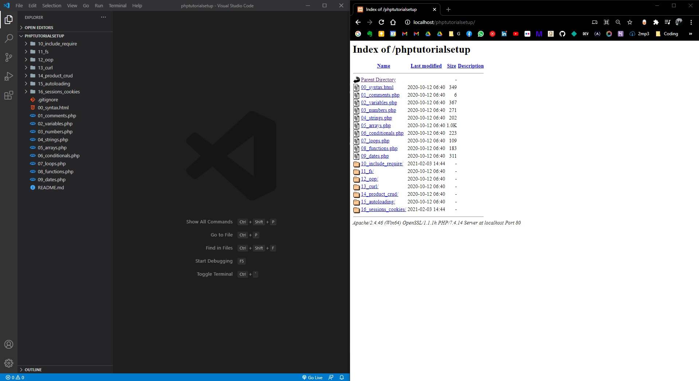

---

## Set a new password to MySQL Xampp database

By default, the password for `root` is an empty string `""` (so we don't have any password).

(Optional) To set a new password for **root** in MySQL in XAMPP: Configure it with the "XAMPP Shell" (command prompt). Open the shell from the XAMPP control panel and execute this command: `mysqladmin.exe -u root password secret` this sets the root password to 'secret'.

After that, we need to edit the `C:\xampp\phpMyAdmin\config.inc.php` file, and restart both Apache and MySQL servers from XAMPP Control Panel.

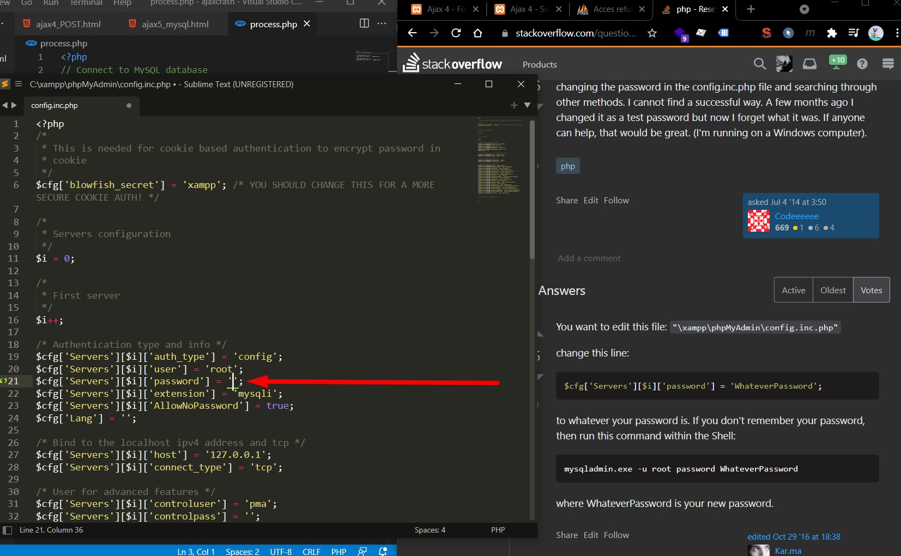

Now you can access http://localhost/phpmyadmin/.

<br/>

## PHP Syntax

[A PHP script starts with `<?php` and ends with `?>`:](https://www.w3schools.com/php/php_syntax.asp)

```php
<?php
// PHP code goes here
?>
```

The default file extension for PHP files is "`.php`". (unlike `Python Django`, PHP will **not** work within `.html` files !!!)

A PHP file normally contains HTML tags, and some PHP scripting code.

```php
<!DOCTYPE html>
<html>
<body>
<h1>My first PHP page</h1>
<?php
  echo "<h2>Hello World!</h2><br>";
  ECHO "Hello World!<br>";
  EcHo "Hello World!<br>";

  // This is a single-line comment
  # This is also a single-line comment

  /*
  This is a multiple-lines comment block
  that spans over multiple lines
  */

  // You can also use comments to leave out parts of a code line
  $x = 5 /* + 15 */ + 5;
  echo $x;
?>
</body>
</html>
```

In PHP, keywords (e.g. `if`, `else`, `while`, `echo`, etc.), classes, functions, and user-defined functions are **not** case-sensitive. :open_mouth:

**However; all variable names are case-sensitive!** :ok_hand:

```php
<?php
/*
only the first statement will display
the value of the $color variable!
This is because $color, $COLOR, and $coLOR
are treated as three different variables:
*/
$color = "red";
echo "My car is " . $color . "<br>";
echo "My house is " . $COLOR . "<br>";
echo "My boat is " . $coLOR . "<br>";
?>
```

## PHP Variables

In PHP, a variable starts with the `$` sign, followed by the name of the variable. In PHP (as it's dynamically written language) variables don't have types.

```php
$txt = "Hello world!";
$x = 5;
$y = 10.5;
echo $x + $y;
echo "<hr/>";
$name = "Radu";
echo "$txt my name is $name";
```

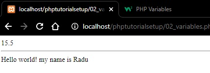

Rules for PHP variables:

- A variable starts with the `$` sign, followed by the name of the variable
- A variable name must start with a letter or the underscore character
- A variable name cannot start with a number
- A variable name can only contain alpha-numeric characters and underscores (A-z, 0-9, and \_ )
- Variable names are case-sensitive (`$age` and `$AGE` are two different variables)

In PHP 7, type declarations were added. This gives an option to specify the data type expected when declaring a function, and by enabling the strict requirement, it will throw a "Fatal Error" on a type mismatch.

## PHP Variables Scope

https://www.w3schools.com/php/php_variables_scope.asp

PHP has three different variable scopes:

- local
- global
- static

A variable declared **outside** a function has a **GLOBAL SCOPE** and can only be accessed outside a function:

```php
<?php
$x = 5; // global scope

function myTest() {
  // using x inside this function will generate an error
  echo "<p>Variable x inside function is: $x</p>";
}
myTest();

echo "<p>Variable x outside function is: $x</p>";
?>
```

A variable declared **within** a function has a **LOCAL SCOPE** and can only be accessed within that function:

```php
<?php
function myTest() {
  $x = 5; // local scope
  echo "<p>Variable x inside function is: $x</p>";
}
myTest();

// using x outside the function will generate an error
echo "<p>Variable x outside function is: $x</p>";
?>
```

### PHP The global Keyword

The `global` keyword is used to access a global variable from within a function.

```php
<?php
$x = 5;
$y = 10;
function myTest() {
  global $x, $y;
  $y = $x + $y;
}
myTest();
echo $y; // outputs 15

/* Note, you can't declare global variables like this:
global $x = 5; // it will give a Parse error...
global $y = 10;
function myTest() {
  $y = $x + $y;
}
myTest();
*/

/* Note, if you don't declare the varibles as global outside function
$x = 5;
$y = 10;
global $x, $y;
function myTest() {
  $y = $x + $y; // it will give Undefined variable: x, y
}
myTest();
*/
?>
```

PHP also stores all global variables in an array called `$GLOBALS[*index*]`. The _`index`_ holds the name of the variable. This array is also accessible from within functions and can be used to update global variables directly.

```php
<?php
$x = 5;
$y = 10;

function myTest() {
  $GLOBALS['y'] = $GLOBALS['x'] + $GLOBALS['y'];
}

myTest();
echo $y; // outputs 15
?>
```

<br/>

### PHP The static keyword

Normally, when a function is completed/executed, all of its variables are deleted. However, sometimes we want a local variable NOT to be deleted. We need it for a further job. To do this, use the `static` keyword when you first declare the variable:

```php
<?php
function myTest2() {
  static $x = 0;
  echo $x."<br>";
  $x++;
}

myTest2(); // 1
myTest2(); // 2
myTest2(); // 3

/* each time the function is called,
that variable will still have the information
it contained from the last time the function was called. */
?>
```

## PHP Debug / Print to JS Console function

(Thu, February 04, 2021) Okay, maybe it's just me... but I've noted that, I don't have any console in PHP ...

- for Python (Django), I have my development server up and running in the CMD Prompt.
- for JavaScript, we have the console within our Browser.

However, instead of using `echo`, `var_dump()`, `get_type()`, `print_r()` functions and render directly in HTML code... I came across this _[function](https://www.php.net/manual/en/debugger.php)_

```php
function console_log( $data ){
  echo '<script>';
  echo 'console.log('. json_encode( $data ) .')';
  echo '</script>';
}

// Usage:
$myvar = array("Banana", "Apple", "Orange");
console_log( $myvar );
```

Now we can use `console_log();` to print to Browser's console, just like in JavaScript (`console.log();`)... except, we are actually using JavaScript ofc. :laughing:

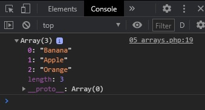

# PHP Data types and operators

## PHP Data types, var_dump(), check functions

The PHP `var_dump()` function returns the data type and value (basically prints out all the information of a variable).

The [`print_r()`](https://www.php.net/manual/en/function.print-r.php) prints human-readable information about a variable

The PHP function `gettype($name)` function returns only the data type.

PHP supports the following data types:

- **String**

```php
$txt = "Hello world!"; // 12 characters
var_dump($txt); // string(12)
echo gettype($txt); // string

// We can concatenate strings using . (dot)
echo $txt . " How are you?" . "<br/>"; // Hello world! How are you?
// or
echo "$txt How are you?<br/>"; // Hello world! How are you?
```

- **Integer**

```php
$x = 52;
var_dump($x); // int(52)
echo gettype($x); // integer
```

- **Float (floating point numbers - also called double)**

```php
$x = 10.365;
var_dump($x); // float(10.365)
echo gettype($x); // double
```

- **Boolean**

```php
$x = true;
$y = false;
var_dump(x); // bool(true)
echo gettype($x); // boolean
echo $x; // 1
echo $y; //

// Whenever booleans are converted into strings:
// true is converted into "1"
// false is converted into empty string "" (which will not show anything in html)
```

- **Array**

```php
$cars = array("Volvo","BMW","Toyota");
var_dump($cars);
// array(3) { [0]=> string(5) "Volvo" [1]=> string(3) "BMW" [2]=> string(6) "Toyota" }

$nested_array = array(array("red", "green"), "blue");
// array(2) { [0]=> array(2) { [0]=> string(3) "red" [1]=> string(5) "green" } [1]=> string(4) "blue" }
```

- **NULL**

```php
// If a variable is created without a value, it is automatically assigned a value of NULL.
// Variables can also be emptied by setting the value to NULL:
$x = "Hello world!";
$x = null;
var_dump($x); // NULL
echo gettype($x); // NULL
echo $x; //

// null is converted into an empty string "" as well
```

- **Object**

```php
/* with __construct() function,
PHP will automatically call this function when you create an object from a class.
*/
class Car {
  public $color;
  public $model;
  public function __construct($color, $model) {
    $this->color = $color;
    $this->model = $model;
  }
  public function message() {
    return "My car is a " . $this->color . " " . $this->model . "!";
    // or
    // return "My car is a $this->color $this->model!";
  }
}

$myCar = new Car("black", "Volvo");
echo $myCar -> message(); // My car is a black Volvo!
echo "<br>";
$myCar = new Car("red", "Toyota");
echo $myCar -> message(); // My car is a red Toyota!

var_dump($myCar); // object(Car)#2 (2) { ["color"]=> string(3) "red" ["model"]=> string(6) "Toyota" }
echo gettype($x); // object
```

- **Resource**

The special resource type is not an actual data type. It is the storing of a reference to functions and resources external to PHP. A common example of using the resource data type is a database call.

<br/>

**Variable checking functions**

```php
var_dump("Hello"); // string(5) "Hello"
echo gettype("Hello"); // string

is_string($name); // false
is_int($age); // true
is_double($height); // true
is_bool($isMale); // true

/* However these functions will not print anything in HTML
... and you cannot use echo is_double($var)... because if
it's false, it will not print anything in HTML...
So, the safest way to check is with: */

var_dump(is_string($name)); // bool(false)
var_dump(is_int($age)); // bool(true)
var_dump(is_double($height)); // bool(true)
var_dump(is_bool($isMale)); // bool(true)
```

<br/>

**Check if variable is declared/defined**

```php
$name = "Alex";
isset($name); // true
isset($address); // false
```

## PHP Constants

**To declare CONSTANT variables (const) in PHP, we use `define` (just like in C/C++):**

```php
define(name, value, case_insensitive);
```

- _name_: Specifies the name of the constant
- _value_: Specifies the value of the constant
- _case-insensitive_: Specifies whether the constant name should be case-insensitive. Default is false

Example:

```php
define('PI', 3.14);

// to use/print a constant, we don't use $ anymore
echo PI; // 3.1415

// predefined constants in PHP
echo PHP_INT_MAX.'<br>'; // 9223372036854775807
echo PHP_FLOAT_MAX.'<br>'; // 1.7976931348623E+308
```

Example:

```php
<?php
define("GREETING", "Welcome aboard, Captain!", true);
echo greeting; // Welcome aboard, Captain!
?>
```

<br/>

**PHP Constant Arrays**

In PHP7, you can create an Array constant using the `define()` function.

```php
<?php
define("cars", [
  "Alfa Romeo",
  "BMW",
  "Toyota"
]);
echo cars[0]; // Alfa Romeo
?>
```

<br/>

**NOTE:** **_Constants are automatically global and can be used across the entire script._**

<br/>

## PHP Operators

https://www.w3schools.com/php/php_operators.asp

**PHP Arithmetic Operators**

| Operator | Name           | Example    | Result                                  |
| :------- | :------------- | :--------- | :-------------------------------------- |
| +        | Addition       | `$x + $y`  | Sum of $x and $y                        |
| -        | Subtraction    | `$x - $y`  | Difference of $x and $y                 |
| \*       | Multiplication | `$x * $y`  | Product of $x and $y                    |
| /        | Division       | `$x / $y`  | Quotient of $x and $y                   |
| %        | Modulus        | `$x % $y`  | Remainder of $x divided by $y           |
| \*\*     | Exponentiation | `$x ** $y` | Result of raising $x to the $y'th power |

**PHP Comparison Operators**

| Operator | Name                     | Example     | Result                                                                                                                                                         |
| -------- | ------------------------ | ----------- | -------------------------------------------------------------------------------------------------------------------------------------------------------------- |
| ==       | Equal                    | `$x == $y`  | Returns true if $x is equal to $y                                                                                                                              |
| ===      | Identical                | `$x === $y` | Returns true if $x is equal to $y,<br/>and they are of the same type                                                                                           |
| !=       | Not equal                | `$x != $y`  | Returns true if $x is not equal to $y                                                                                                                          |
| <>       | Not equal                | `$x <> $y`  | Returns true if $x is not equal to $y                                                                                                                          |
| !==      | Not identical            | `$x !== $y` | Returns true if $x is not equal to $y,<br/>or they are not of the same type                                                                                    |
| >        | Greater than             | `$x > $y`   | Returns true if $x is greater than $y                                                                                                                          |
| <        | Less than                | `$x < $y`   | Returns true if $x is less than $y                                                                                                                             |
| >=       | Greater than or equal to | `$x >= $y`  | Returns true if $x is greater than or equal to $y                                                                                                              |
| <=       | Less than or equal to    | `$x <= $y`  | Returns true if $x is less than or equal to $y                                                                                                                 |
| <=>      | Spaceship                | `$x <=> $y` | Returns an integer less than, equal to,<br/>or greater than zero, depending on if $x is less<br/> than, equal to, or greater than $y.<br/>Introduced in PHP 7. |

**PHP Logical Operators**

| Operator | Name | Example      | Result                                              |
| -------- | ---- | ------------ | --------------------------------------------------- |
| `and`    | And  | `$x and $y`  | True if both `$x and $y` are true                   |
| `or`     | Or   | `$x or $y`   | True if either `$x or $y` is true                   |
| `xor`    | Xor  | `$x xor $y`  | True if either `$x or $y` is true,<br/>but not both |
| `&&`     | And  | `$x && $y`   | True if both `$x and $y` are true                   |
| `\|\|`   | Or   | `$x \|\| $y` | True if either `$x or $y` is true                   |
| `!`      | Not  | `!$x`        | True if $x is not true                              |

**PHP Increment / Decrement Operators**

| Operator | Name           | Description                           |
| -------- | -------------- | ------------------------------------- |
| `++$x`   | Pre-increment  | Increments $x by one, then returns $x |
| `$x++`   | Post-increment | Returns $x, then increments $x by one |
| `--$x`   | Pre-decrement  | Decrements $x by one, then returns $x |
| `$x--`   | Post-decrement | Returns $x, then decrements $x by one |

**PHP String Operators**

| Operator | Name                     | Example          | Result                           |
| -------- | ------------------------ | ---------------- | -------------------------------- |
| .        | Concatenation            | `$txt1 . $txt2`  | Concatenation of $txt1 and $txt2 |
| .=       | Concatenation assignment | `$txt1 .= $txt2` | Appends $txt2 to $txt1           |

**PHP Array Operators**

| Operator | Name         | Example     | Result                                                                                                    |
| -------- | ------------ | ----------- | --------------------------------------------------------------------------------------------------------- |
| +        | Union        | `$x + $y`   | Union of $x and $y                                                                                        |
| ==       | Equality     | `$x == $y`  | Returns true if $x and $y<br/>have the same key/value pairs                                               |
| ===      | Identity     | `$x === $y` | Returns true if $x and $y <br/>have the same key/value pairs <br/>in the same order and of the same types |
| !=       | Inequality   | `$x != $y`  | Returns true if $x is not equal to $y                                                                     |
| <>       | Inequality   | `$x <> $y`  | Returns true if $x is not equal to $y                                                                     |
| !==      | Non-identity | `$x !== $y` | Returns true if $x is not identical to $y                                                                 |

**PHP Conditional Assignment Operators**

| Operator | Name            | Example                      | Result                                                                                                                                                                 |
| -------- | --------------- | ---------------------------- | ---------------------------------------------------------------------------------------------------------------------------------------------------------------------- |
| ?:       | Ternary         | `$x = expr1 ? expr2 : expr3` | Returns the value of $x. The value of $x is expr2 if expr1 = TRUE. The value of $x is expr3 if expr1 = FALSE                                                           |
| ??       | Null coalescing | `$x = expr1 ?? expr2`        | Returns the value of $x. The value of $x is expr1 if expr1 exists, and is not NULL. If expr1 does not exist, or is NULL, the value of $x is expr2. Introduced in PHP 7 |

<br/>

## PHP Numbers

https://www.w3schools.com/php/php_numbers.asp

```php
echo 0.2 + 0.1; // 0.3

/* Note that the result with echo is trimmed and we don't see a floating point number */
// But
var_dump(.1 + .2); // float(0.30000000000000004441)
var_dump(.2 + .1 === 0.3); // bool(false)

# Python
print(0.2 + 0.3) # 0.30000000000000004
// JavaScript (Node.js)
console.log(0.2 + 0.3); // 0.30000000000000004
```

**PHP Integers and floats/doubles**

```php
<?php
$x = 10.365;
var_dump(is_float($x)); // bool(true)

$x = 10
var_dump(is_int($x)); // bool(true)
?>
```

**PHP Infinity**

A numeric value that is larger than PHP_FLOAT_MAX is considered infinite.

PHP has the following functions to check if a numeric value is finite or infinite:

- [is_finite()](https://www.w3schools.com/php/func_math_is_finite.asp)
- [is_infinite()](https://www.w3schools.com/php/func_math_is_infinite.asp)

```php
echo PHP_FLOAT_MAX.'<br>'; // 1.7976931348623E+308

$x = 1.9e411;
var_dump($x); // float(INF)

var_dump(is_infinite($x)); // bool(true)
var_dump(is_finite($x)); // bool(false)

var_dump(is_finite(43)); // true
```

<br/>

**PHP NaN (Not a Number)**

NaN is used for impossible mathematical operations. PHP has the following functions to check if a value is not a number:

- [is_nan()](https://www.w3schools.com/php/func_math_is_nan.asp)

```php
// Invalid calculation will return a NaN value
$x = acos(8);
var_dump($x); // float(NAN)
```

<br/>

**PHP Numerical Strings**

The PHP `is_numeric()` function can be used to find whether a variable is numeric. The function returns true if the variable is a number or a numeric string, false otherwise.

```php
$x = 5985;
var_dump(is_numeric($x)); // bool(true)

$x = "5985";
var_dump(is_numeric($x)); // bool(true)

$x = "59.85" + 100;
var_dump(is_numeric($x)); // bool(true)

$x = "Hello";
var_dump(is_numeric($x)); // bool(false)
```

### PHP Casting Strings and Floats to Integers

```php
// Cast float to int
$x = 23465.768;
$int_cast = (int)$x;
echo $int_cast; // 23465

echo "<br>";

// Cast string to int
$x = "23465.768";
$int_cast = (int)$x;
echo $int_cast; // 23465

// Cast string to float
$float_cast = (float)$x;
```

Other ways of casting using functions:

```php
$strNumber = '12.23';
$number = intval($strNumber);
var_dump($number); // int(12)

echo "<br/>";

var_dump(floatval("12.23")); // float(12.23)
```

### PHP Number formatting

`number_format($number, $decimals = 0, $dec_point = '.', $thousands_sep = ',')`

```php
$number = 123456789.12345;
echo number_format($number, 2, '.', " "); // 123 456 789.12
echo number_format($number, 2, '.', ","); // 123,456,789.12
```

<br/>

### PHP Math

https://www.w3schools.com/php/php_math.asp

**PHP `pi()` function**

```php
echo(pi()); // returns 3.1415926535898
```

**PHP min() and max() Functions**

```php
echo(min(0, 150, 30, 20, -8, -200));  // returns -200
echo(max(0, 150, 30, 20, -8, -200));  // returns 150
```

**PHP abs() (absolute value) Function**

```php
echo(abs(-6.7));  // returns 6.7
```

**PHP sqrt() Function**

```php
echo(sqrt(64));  // returns 8
```

**PHP round() Function**

```php
echo(round(0.60));  // returns 1
echo(round(0.49));  // returns 0
```

**PHP floor and ceil**

```php
echo(floor(0.60)); // 0
echo(ceil(0.49)); // 1
```

**Random Numbers**

```php
echo(rand()); // 1381167960
echo(rand(10, 100)); // 97
```

**[All PHP Math Functions](https://www.w3schools.com/php/php_ref_math.asp)**

| Function                                                                     | Description                                                                             |
| :--------------------------------------------------------------------------- | :-------------------------------------------------------------------------------------- |
| [abs()](https://www.w3schools.com/php/func_math_abs.asp)                     | Returns the absolute (positive) value of a number                                       |
| [acos()](https://www.w3schools.com/php/func_math_acos.asp)                   | Returns the arc cosine of a number                                                      |
| [acosh()](https://www.w3schools.com/php/func_math_acosh.asp)                 | Returns the inverse hyperbolic cosine of a number                                       |
| [asin()](https://www.w3schools.com/php/func_math_asin.asp)                   | Returns the arc sine of a number                                                        |
| [asinh()](https://www.w3schools.com/php/func_math_asinh.asp)                 | Returns the inverse hyperbolic sine of a number                                         |
| [atan()](https://www.w3schools.com/php/func_math_atan.asp)                   | Returns the arc tangent of a number in radians                                          |
| [atan2()](https://www.w3schools.com/php/func_math_atan2.asp)                 | Returns the arc tangent of two variables x and y                                        |
| [atanh()](https://www.w3schools.com/php/func_math_atanh.asp)                 | Returns the inverse hyperbolic tangent of a number                                      |
| [base_convert()](https://www.w3schools.com/php/func_math_base_convert.asp)   | Converts a number from one number base to another                                       |
| [bindec()](https://www.w3schools.com/php/func_math_bindec.asp)               | Converts a binary number to a decimal number                                            |
| [ceil()](https://www.w3schools.com/php/func_math_ceil.asp)                   | Rounds a number up to the nearest integer                                               |
| [cos()](https://www.w3schools.com/php/func_math_cos.asp)                     | Returns the cosine of a number                                                          |
| [cosh()](https://www.w3schools.com/php/func_math_cosh.asp)                   | Returns the hyperbolic cosine of a number                                               |
| [decbin()](https://www.w3schools.com/php/func_math_decbin.asp)               | Converts a decimal number to a binary number                                            |
| [dechex()](https://www.w3schools.com/php/func_math_dechex.asp)               | Converts a decimal number to a hexadecimal number                                       |
| [decoct()](https://www.w3schools.com/php/func_math_decoct.asp)               | Converts a decimal number to an octal number                                            |
| [deg2rad()](https://www.w3schools.com/php/func_math_deg2rad.asp)             | Converts a degree value to a radian value                                               |
| [exp()](https://www.w3schools.com/php/func_math_exp.asp)                     | Calculates the exponent of e                                                            |
| [expm1()](https://www.w3schools.com/php/func_math_expm1.asp)                 | Returns exp(x) - 1                                                                      |
| [floor()](https://www.w3schools.com/php/func_math_floor.asp)                 | Rounds a number down to the nearest integer                                             |
| [fmod()](https://www.w3schools.com/php/func_math_fmod.asp)                   | Returns the remainder of x/y                                                            |
| [getrandmax()](https://www.w3schools.com/php/func_math_getrandmax.asp)       | Returns the largest possible value returned by rand()                                   |
| [hexdec()](https://www.w3schools.com/php/func_math_hexdec.asp)               | Converts a hexadecimal number to a decimal number                                       |
| [hypot()](https://www.w3schools.com/php/func_math_hypot.asp)                 | Calculates the hypotenuse of a right-angle triangle                                     |
| [intdiv()](https://www.w3schools.com/php/func_math_intdiv.asp)               | Performs integer division                                                               |
| [is_finite()](https://www.w3schools.com/php/func_math_is_finite.asp)         | Checks whether a value is finite or not                                                 |
| [is_infinite()](https://www.w3schools.com/php/func_math_is_infinite.asp)     | Checks whether a value is infinite or not                                               |
| [is_nan()](https://www.w3schools.com/php/func_math_is_nan.asp)               | Checks whether a value is 'not-a-number'                                                |
| [lcg_value()](https://www.w3schools.com/php/func_math_lcg_value.asp)         | Returns a pseudo random number in a range between 0 and 1                               |
| [log()](https://www.w3schools.com/php/func_math_log.asp)                     | Returns the natural logarithm of a number                                               |
| [log10()](https://www.w3schools.com/php/func_math_log10.asp)                 | Returns the base-10 logarithm of a number                                               |
| [log1p()](https://www.w3schools.com/php/func_math_log1p.asp)                 | Returns log(1+number)                                                                   |
| [max()](https://www.w3schools.com/php/func_math_max.asp)                     | Returns the highest value in an array, or the highest value of several specified values |
| [min()](https://www.w3schools.com/php/func_math_min.asp)                     | Returns the lowest value in an array, or the lowest value of several specified values   |
| [mt_getrandmax()](https://www.w3schools.com/php/func_math_mt_getrandmax.asp) | Returns the largest possible value returned by mt_rand()                                |
| [mt_rand()](https://www.w3schools.com/php/func_math_mt_rand.asp)             | Generates a random integer using Mersenne Twister algorithm                             |
| [mt_srand()](https://www.w3schools.com/php/func_math_mt_srand.asp)           | Seeds the Mersenne Twister random number generator                                      |
| [octdec()](https://www.w3schools.com/php/func_math_octdec.asp)               | Converts an octal number to a decimal number                                            |
| [pi()](https://www.w3schools.com/php/func_math_pi.asp)                       | Returns the value of PI                                                                 |
| [pow()](https://www.w3schools.com/php/func_math_pow.asp)                     | Returns x raised to the power of y                                                      |
| [rad2deg()](https://www.w3schools.com/php/func_math_rad2deg.asp)             | Converts a radian value to a degree value                                               |
| [rand()](https://www.w3schools.com/php/func_math_rand.asp)                   | Generates a random integer                                                              |
| [round()](https://www.w3schools.com/php/func_math_round.asp)                 | Rounds a floating-point number                                                          |
| [sin()](https://www.w3schools.com/php/func_math_sin.asp)                     | Returns the sine of a number                                                            |
| [sinh()](https://www.w3schools.com/php/func_math_sinh.asp)                   | Returns the hyperbolic sine of a number                                                 |
| [sqrt()](https://www.w3schools.com/php/func_math_sqrt.asp)                   | Returns the square root of a number                                                     |
| [srand()](https://www.w3schools.com/php/func_math_srand.asp)                 | Seeds the random number generator                                                       |
| [tan()](https://www.w3schools.com/php/func_math_tan.asp)                     | Returns the tangent of a number                                                         |
| [tanh()](https://www.w3schools.com/php/func_math_tanh.asp)                   | Returns the hyperbolic tangent of a number                                              |

https://www.php.net/manual/en/ref.math.php

<br/>

## PHP Dates

Print the number of seconds since 01.01.1970

```php
echo time(); // 1631120754
```

Print the current date using formatting:

```php
echo date('Y-m-d H:i:s'); // 2021-09-08 19:00:23
```

Print the yesterday's date using a timestamp parameter, where we specify the time minus the day in seconds (there are `60 * 60 * 24` seconds in a day)

```php
// Print yesterday's date
echo date('Y-m-d H:i:s', time() - 60 * 60 * 24); // 2021-09-07 19:02:56

// Print tomorrow's date
echo date('Y-m-d H:i:s', time() + 60 * 60 * 24); // 2021-09-07 19:02:56
```

More examples using date formats

```php
echo date('F j Y, H:i:s'); // September 8 2021, 19:04:34
```

Another example of getting the current date in PHP in a specific format:

- More on `date()` formatting parameters [here](https://www.w3schools.com/php/func_date_date.asp)
- More on [`date()` function from php.net](https://www.php.net/manual/en/function.date.php)

```php
function getTodayDateFormatted() {
  return date("l, F d, Y");
}
echo getTodayDateFormatted(); // Saturday, September 04, 2021
```

---

Parse dates from HTML forms (will return an [associative array](#php-associative-arrays-dictionariesjs-objects)):

```php
$parseDate = date_parse('2021-08-12 09:00:00');

echo "<pre>";
var_dump($parseDate);
echo "</pre>";

/* returns
array(12) {
  ["year"]=>
  int(2021)
  ["month"]=>
  int(8)
  ["day"]=>
  int(12)
  ["hour"]=>
  int(9)
  ["minute"]=>
  int(0)
  ["second"]=>
  int(0)
  ["fraction"]=>
  float(0)
  ["warning_count"]=>
  int(0)
  ["warnings"]=>
  array(0) {
  }
  ["error_count"]=>
  int(0)
  ["errors"]=>
  array(0) {
  }
  ["is_localtime"]=>
  bool(false)
}
*/
```

<br/>

Parse a date from in a different format (form a different source, other than HTML form) using `date_parse_from_format`. Here we need to specify the format of the date received in a way that PHP will print it using it's `date()` formatting options:

```php
$dateString = 'February 12 2021 12:54:34';
$parseDate = date_parse_from_format('F j Y H:i:s', $dateString);

echo "<pre>";
var_dump($parseDate);
echo "</pre>";

/* returns
array(12) {
  ["year"]=>
  int(2021)
  ["month"]=>
  int(2)
  ["day"]=>
  int(12)
  ["hour"]=>
  int(12)
  ["minute"]=>
  int(54)
  ["second"]=>
  int(34)
  ["fraction"]=>
  float(0)
  ["warning_count"]=>
  int(0)
  ["warnings"]=>
  array(0) {
  }
  ["error_count"]=>
  int(0)
  ["errors"]=>
  array(0) {
  }
  ["is_localtime"]=>
  bool(false)
}
*/
```

Note that it will also work using just `date_parse()`

```php
$dateString = 'February 12 2021 12:54:34';
$parseDate = date_parse($dateString);
```

<br/>

# PHP String methods

(Friday, February 05, 2021)

**Strings concatenation** (Note that the use of single or double quotes matters)

```php
$name = "Alex";
echo 'Hi I am '.$name.'!<br/>'; // Hi I am Alex!
echo 'Hi I am $name!<br/>'; // Hi I am $name!
echo "Hi I am $name!<br/>"; // Hi I am Alex!
```

<br/>

## strlen, trim, strpos, substr, str_replace

**`strlen()` - Return the Length of a String**

```php
echo strlen("Hello world!"); // outputs 12
```

<br/>

**`trim()` - Removes whitespace from both sides of a string**<br/>For right or left side, use `rtrim()` / `ltrim()`

```php
echo trim("   Hi, World!   "); // Hi, World!
```

<br/>

**`str_word_count()` - Count Words in a String**

```php
echo str_word_count("Hello world!"); // outputs 2
```

<br/>

**`strrev()` - Reverse a String**

```php
echo strrev("Hello world!"); // !dlrow olleH
```

<br/>

**`strpos()` - Search For a Text Within a String (case sensitive), returns the first characters position of the first match, if no match is found, returns `false`**

```php
echo strpos("Hello world!", "world"); // 6
```

**`stripos()` - Search For a Text Within a String (ignore case sensitive)**

```php
echo strpos("Hello World!", "world"); // 6
```

<br/>

**`substr()` - Returns part of a string (substring)**

```php
echo substr("Hello World", 4);  // o World
echo substr("Hello World", -4); // orld

echo substr("Hello World", 4, 3); // O W (takes only 3 characters from pos 4)
```

<br/>

**`str_replace()` - Replace Text (all occurrences) within a String**<br/>`str_ireplace()` (ignore case sensitive)

```php
echo str_replace("world", "Captain", "Hello world!"); // Hello Captain!
echo str_ireplace("hello", "Captain", "Hello? hello!"); // Captain? Captain!
```

<br/>

**`strtolower()` and `strtoupper()`** converts string to Lower Case / Upper Case

```php
echo strtolower("Hello World"); // hello world
echo strtoupper("Hello World"); // HELLO WORLD
```

**`ucfirst()` and `lcfirst()`** converts to Upper Case / Lower Case only the first character

```php
echo ucfirst("hello world"); // Hello world
echo lcfirst("HELLO WORLD"); // hELLO WORLD
```

**`ucwords()`** Upper Case all words in string

```php
echo ucwords("hello world"); // Hello World
```

<br/>

**`nl2br()`** - newline to break line

```php
$longText = "
  Hi,
  I'm Alex,
  I like back-end.
";

echo $longText.'<br>'; // Hi, I'm Alex, I like back-end.
echo nl2br($longText).'<br>';
// Hi,
// I'm Alex,
// I like back-end.
```

<br/>

## String indexes, PHP Strings are mutable

We can access string character's with `[ ]`:

```php
echo "Hello"[0]; // H
echo "Hello"[1]; // e
echo "Hello"[-1]; // o
```

Unlike **JavaScript** and **Python**... Strings in PHP are **mutable** (content can be changed without creating a new object).

```php
$myStr = "hello";
$myStr[0] = "j";
$myStr[-1] = 'y';
echo $myStr; // jelly
```

<br/>

## String Explode, Array Implode

[**`explode()`**](https://www.php.net/manual/en/function.explode.php) Breaks a string into an array (in JavaScript/Python we have `str.split()`)

`` explode ( string `$separator` , string `$string` , int `$limit` = `PHP_INT_MAX`) : array ``

```php
$pizza  = "piece1 piece2 piece3";
$pieces = explode(" ", $pizza);
echo $pieces[0]; // piece1
echo $pieces[1]; // piece2
```

**`implode()`** Returns a string from the elements of an array (`join()` does the same, is an alias of `implode()`)

```php
$arr = array('Test1', 'Test2', 'Test3');
$str = join(",", $arr);
echo $str; // Test1,Test2,Test3.
```

<center>

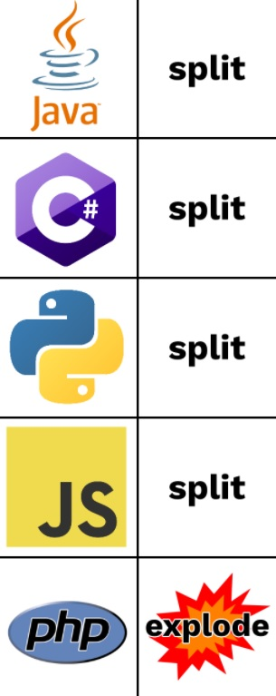

</center>

<br/>

**[All PHP String Methods](https://www.w3schools.com/php/php_ref_string.asp)**

| Function                                                                                                 | Description                                                                                                |
| :------------------------------------------------------------------------------------------------------- | :--------------------------------------------------------------------------------------------------------- |
| [addcslashes()](https://www.w3schools.com/php/func_string_addcslashes.asp)                               | Returns a string with backslashes in front of the specified characters                                     |
| [addslashes()](https://www.w3schools.com/php/func_string_addslashes.asp)                                 | Returns a string with backslashes in front of predefined characters                                        |
| **[bin2hex()](https://www.w3schools.com/php/func_string_bin2hex.asp)**                                   | **Converts a string of ASCII characters to hexadecimal values**                                            |
| **[chop()](https://www.w3schools.com/php/func_string_chop.asp)**                                         | **Removes whitespace or other characters from the right end of a string**                                  |
| [chr()](https://www.w3schools.com/php/func_string_chr.asp)                                               | Returns a character from a specified ASCII value                                                           |
| **[chunk_split()](https://www.w3schools.com/php/func_string_chunk_split.asp)**                           | **Splits a string into a series of smaller parts**                                                         |
| [convert_cyr_string()](https://www.w3schools.com/php/func_string_convert_cyr_string.asp)                 | Converts a string from one Cyrillic character-set to another                                               |
| [convert_uudecode()](https://www.w3schools.com/php/func_string_convert_uudecode.asp)                     | Decodes a uuencoded string                                                                                 |
| [convert_uuencode()](https://www.w3schools.com/php/func_string_convert_uuencode.asp)                     | Encodes a string using the uuencode algorithm                                                              |
| [count_chars()](https://www.w3schools.com/php/func_string_count_chars.asp)                               | Returns information about characters used in a string                                                      |
| [crc32()](https://www.w3schools.com/php/func_string_crc32.asp)                                           | Calculates a 32-bit CRC for a string                                                                       |
| [crypt()](https://www.w3schools.com/php/func_string_crypt.asp)                                           | One-way string hashing                                                                                     |
| [echo()](https://www.w3schools.com/php/func_string_echo.asp)                                             | Outputs one or more strings                                                                                |
| **[explode()](https://www.w3schools.com/php/func_string_explode.asp)**                                   | **Breaks a string into an array**                                                                          |
| [fprintf()](https://www.w3schools.com/php/func_string_fprintf.asp)                                       | Writes a formatted string to a specified output stream                                                     |
| [get_html_translation_table()](https://www.w3schools.com/php/func_string_get_html_translation_table.asp) | Returns the translation table used by htmlspecialchars() and htmlentities()                                |
| [hebrev()](https://www.w3schools.com/php/func_string_hebrev.asp)                                         | Converts Hebrew text to visual text                                                                        |
| [hebrevc()](https://www.w3schools.com/php/func_string_hebrevc.asp)                                       | Converts Hebrew text to visual text and new lines (\n) into <br>                                           |
| **[hex2bin()](https://www.w3schools.com/php/func_string_hex2bin.asp)**                                   | **Converts a string of hexadecimal values to ASCII characters**                                            |
| [html_entity_decode()](https://www.w3schools.com/php/func_string_html_entity_decode.asp)                 | Converts HTML entities to characters                                                                       |
| [htmlentities()](https://www.w3schools.com/php/func_string_htmlentities.asp)                             | Converts characters to HTML entities                                                                       |
| [htmlspecialchars_decode()](https://www.w3schools.com/php/func_string_htmlspecialchars_decode.asp)       | Converts some predefined HTML entities to characters                                                       |
| [htmlspecialchars()](https://www.w3schools.com/php/func_string_htmlspecialchars.asp)                     | Converts some predefined characters to HTML entities                                                       |
| **[implode()](https://www.w3schools.com/php/func_string_implode.asp)**                                   | **Returns a string from the elements of an array**                                                         |
| [join()](https://www.w3schools.com/php/func_string_join.asp)                                             | Alias of [implode()](https://www.w3schools.com/php/func_string_implode.asp)                                |
| [lcfirst()](https://www.w3schools.com/php/func_string_lcfirst.asp)                                       | Converts the first character of a string to lowercase                                                      |
| [levenshtein()](https://www.w3schools.com/php/func_string_levenshtein.asp)                               | Returns the Levenshtein distance between two strings                                                       |
| [localeconv()](https://www.w3schools.com/php/func_string_localeconv.asp)                                 | Returns locale numeric and monetary formatting information                                                 |
| [ltrim()](https://www.w3schools.com/php/func_string_ltrim.asp)                                           | Removes whitespace or other characters from the left side of a string                                      |
| [md5()](https://www.w3schools.com/php/func_string_md5.asp)                                               | Calculates the MD5 hash of a string                                                                        |
| [md5_file()](https://www.w3schools.com/php/func_string_md5_file.asp)                                     | Calculates the MD5 hash of a file                                                                          |
| [metaphone()](https://www.w3schools.com/php/func_string_metaphone.asp)                                   | Calculates the metaphone key of a string                                                                   |
| [money_format()](https://www.w3schools.com/php/func_string_money_format.asp)                             | Returns a string formatted as a currency string                                                            |
| [nl_langinfo()](https://www.w3schools.com/php/func_string_nl_langinfo.asp)                               | Returns specific local information                                                                         |
| [nl2br()](https://www.w3schools.com/php/func_string_nl2br.asp)                                           | Inserts HTML line breaks in front of each newline in a string                                              |
| [number_format()](https://www.w3schools.com/php/func_string_number_format.asp)                           | Formats a number with grouped thousands                                                                    |
| [ord()](https://www.w3schools.com/php/func_string_ord.asp)                                               | Returns the ASCII value of the first character of a string                                                 |
| [parse_str()](https://www.w3schools.com/php/func_string_parse_str.asp)                                   | Parses a query string into variables                                                                       |
| [print()](https://www.w3schools.com/php/func_string_print.asp)                                           | Outputs one or more strings                                                                                |
| [printf()](https://www.w3schools.com/php/func_string_printf.asp)                                         | Outputs a formatted string                                                                                 |
| [quoted_printable_decode()](https://www.w3schools.com/php/func_string_quoted_printable_decode.asp)       | Converts a quoted-printable string to an 8-bit string                                                      |
| [quoted_printable_encode()](https://www.w3schools.com/php/func_string_quoted_printable_encode.asp)       | Converts an 8-bit string to a quoted printable string                                                      |
| [quotemeta()](https://www.w3schools.com/php/func_string_quotemeta.asp)                                   | Quotes meta characters                                                                                     |
| [rtrim()](https://www.w3schools.com/php/func_string_rtrim.asp)                                           | Removes whitespace or other characters from the right side of a string                                     |
| [setlocale()](https://www.w3schools.com/php/func_string_setlocale.asp)                                   | Sets locale information                                                                                    |
| [sha1()](https://www.w3schools.com/php/func_string_sha1.asp)                                             | Calculates the SHA-1 hash of a string                                                                      |
| [sha1_file()](https://www.w3schools.com/php/func_string_sha1_file.asp)                                   | Calculates the SHA-1 hash of a file                                                                        |
| [similar_text()](https://www.w3schools.com/php/func_string_similar_text.asp)                             | Calculates the similarity between two strings                                                              |
| [soundex()](https://www.w3schools.com/php/func_string_soundex.asp)                                       | Calculates the soundex key of a string                                                                     |
| [sprintf()](https://www.w3schools.com/php/func_string_sprintf.asp)                                       | Writes a formatted string to a variable                                                                    |
| [sscanf()](https://www.w3schools.com/php/func_string_sscanf.asp)                                         | Parses input from a string according to a format                                                           |
| [str_getcsv()](https://www.w3schools.com/php/func_string_str_getcsv.asp)                                 | Parses a CSV string into an array                                                                          |
| [str_ireplace()](https://www.w3schools.com/php/func_string_str_ireplace.asp)                             | Replaces some characters in a string (case-insensitive)                                                    |
| [str_pad()](https://www.w3schools.com/php/func_string_str_pad.asp)                                       | Pads a string to a new length                                                                              |
| [str_repeat()](https://www.w3schools.com/php/func_string_str_repeat.asp)                                 | Repeats a string a specified number of times                                                               |
| [str_replace()](https://www.w3schools.com/php/func_string_str_replace.asp)                               | Replaces some characters in a string (case-sensitive)                                                      |
| [str_rot13()](https://www.w3schools.com/php/func_string_str_rot13.asp)                                   | Performs the ROT13 encoding on a string                                                                    |
| [str_shuffle()](https://www.w3schools.com/php/func_string_str_shuffle.asp)                               | Randomly shuffles all characters in a string                                                               |
| [str_split()](https://www.w3schools.com/php/func_string_str_split.asp)                                   | Splits a string into an array                                                                              |
| **[str_word_count()](https://www.w3schools.com/php/func_string_str_word_count.asp)**                     | **Count the number of words in a string**                                                                  |
| **[strcasecmp()](https://www.w3schools.com/php/func_string_strcasecmp.asp)**                             | **Compares two strings (case-insensitive)**                                                                |
| [strchr()](https://www.w3schools.com/php/func_string_strchr.asp)                                         | Finds the first occurrence of a string inside another string (alias of strstr())                           |
| **[strcmp()](https://www.w3schools.com/php/func_string_strcmp.asp)**                                     | **Compares two strings (case-sensitive)**                                                                  |
| [strcoll()](https://www.w3schools.com/php/func_string_strcoll.asp)                                       | Compares two strings (locale based string comparison)                                                      |
| [strcspn()](https://www.w3schools.com/php/func_string_strcspn.asp)                                       | Returns the number of characters found in a string before any part of some specified characters are found  |
| [strip_tags()](https://www.w3schools.com/php/func_string_strip_tags.asp)                                 | Strips HTML and PHP tags from a string                                                                     |
| [stripcslashes()](https://www.w3schools.com/php/func_string_stripcslashes.asp)                           | Unquotes a string quoted with addcslashes()                                                                |
| [stripslashes()](https://www.w3schools.com/php/func_string_stripslashes.asp)                             | Unquotes a string quoted with addslashes()                                                                 |
| [stripos()](https://www.w3schools.com/php/func_string_stripos.asp)                                       | Returns the position of the first occurrence of a string inside another string (case-insensitive)          |
| [stristr()](https://www.w3schools.com/php/func_string_stristr.asp)                                       | Finds the first occurrence of a string inside another string (case-insensitive)                            |
| [strlen()](https://www.w3schools.com/php/func_string_strlen.asp)                                         | Returns the length of a string                                                                             |
| [strnatcasecmp()](https://www.w3schools.com/php/func_string_strnatcasecmp.asp)                           | Compares two strings using a "natural order" algorithm (case-insensitive)                                  |
| [strnatcmp()](https://www.w3schools.com/php/func_string_strnatcmp.asp)                                   | Compares two strings using a "natural order" algorithm (case-sensitive)                                    |
| [strncasecmp()](https://www.w3schools.com/php/func_string_strncasecmp.asp)                               | String comparison of the first n characters (case-insensitive)                                             |
| [strncmp()](https://www.w3schools.com/php/func_string_strncmp.asp)                                       | String comparison of the first n characters (case-sensitive)                                               |
| [strpbrk()](https://www.w3schools.com/php/func_string_strpbrk.asp)                                       | Searches a string for any of a set of characters                                                           |
| [strpos()](https://www.w3schools.com/php/func_string_strpos.asp)                                         | Returns the position of the first occurrence of a string inside another string (case-sensitive)            |
| [strrchr()](https://www.w3schools.com/php/func_string_strrchr.asp)                                       | Finds the last occurrence of a string inside another string                                                |
| **[strrev()](https://www.w3schools.com/php/func_string_strrev.asp)**                                     | **Reverses a string**                                                                                      |
| [strripos()](https://www.w3schools.com/php/func_string_strripos.asp)                                     | Finds the position of the last occurrence of a string inside another string (case-insensitive)             |
| [strrpos()](https://www.w3schools.com/php/func_string_strrpos.asp)                                       | Finds the position of the last occurrence of a string inside another string (case-sensitive)               |
| [strspn()](https://www.w3schools.com/php/func_string_strspn.asp)                                         | Returns the number of characters found in a string that contains only characters from a specified charlist |
| **[strstr()](https://www.w3schools.com/php/func_string_strstr.asp)**                                     | **Finds the first occurrence of a string inside another string (case-sensitive)**                          |
| [strtok()](https://www.w3schools.com/php/func_string_strtok.asp)                                         | Splits a string into smaller strings                                                                       |
| **[strtolower()](https://www.w3schools.com/php/func_string_strtolower.asp)**                             | **Converts a string to lowercase letters**                                                                 |
| **[strtoupper()](https://www.w3schools.com/php/func_string_strtoupper.asp)**                             | **Converts a string to uppercase letters**                                                                 |
| [strtr()](https://www.w3schools.com/php/func_string_strtr.asp)                                           | Translates certain characters in a string                                                                  |
| [substr()](https://www.w3schools.com/php/func_string_substr.asp)                                         | Returns a part of a string                                                                                 |
| [substr_compare()](https://www.w3schools.com/php/func_string_substr_compare.asp)                         | Compares two strings from a specified start position (binary safe and optionally case-sensitive)           |
| [\*\*substr_count()](https://www.w3schools.com/php/func_string_substr_count.asp)\*\*                     | **Counts the number of times a substring occurs in a string**                                              |
| **[substr_replace()](https://www.w3schools.com/php/func_string_substr_replace.asp)**                     | **Replaces a part of a string with another string**                                                        |
| **[trim()](https://www.w3schools.com/php/func_string_trim.asp)**                                         | **Removes whitespace or other characters from both sides of a string**                                     |
| [ucfirst()](https://www.w3schools.com/php/func_string_ucfirst.asp)                                       | Converts the first character of a string to uppercase                                                      |
| [ucwords()](https://www.w3schools.com/php/func_string_ucwords.asp)                                       | Converts the first character of each word in a string to uppercase                                         |
| [vfprintf()](https://www.w3schools.com/php/func_string_vfprintf.asp)                                     | Writes a formatted string to a specified output stream                                                     |
| [vprintf()](https://www.w3schools.com/php/func_string_vprintf.asp)                                       | Outputs a formatted string                                                                                 |
| [vsprintf()](https://www.w3schools.com/php/func_string_vsprintf.asp)                                     | Writes a formatted string to a variable                                                                    |
| [wordwrap()](https://www.w3schools.com/php/func_string_wordwrap.asp)                                     | Wraps a string to a given number of characters                                                             |

<br/>

# PHP Arrays

There are two ways to create indexed arrays:

The index can be assigned automatically (index always starts at 0), like this:

```php
$cars = array("Volvo", "BMW", "Toyota");
```

or like this:

```php
$cars = ["Volvo", "BMW", "Toyota"];
var_dump($cars);
// array(3) { [0]=> string(5) "Volvo" [1]=> string(3) "BMW" [2]=> string(6) "Toyota" }

echo $cars[0]; // Volvo
echo $cars[1]; // BMW
echo $cars[2]; // Toyota
```

or we can set elements by index manually (without declaring `$cars` first):

```php
$cars[0] = "Volvo";
$cars[1] = "BMW";
$cars[2] = "Toyota";
```

<br/>

Print all the contents of an array while nicely formated:

```php
$fruits = ["Banana", "Apple", "Orange"];
echo '<pre>';
var_dump($fruits);
echo '</pre>';
```

```
array(3) {
  [0]=>
  string(5) "Banana"
  [1]=>
  string(5) "Apple"
  [2]=>
  string(6) "Orange"
}
```

<br/>

**Loop through an Indexed Array** using a `for` loop

```php
$fruits = ["Banana", "Apple", "Orange"];

for($i = 0; $i < count($fruits); $i++) {
  echo $fruits[$i].'<br>';
}
/*
Banana
Apple
Orange */
```

## Array methods

(Saturday, February 06, 2021)

### count, push, pop, unshift, shift

**Get the length of array with `count()`**

```php
$fruits = ["Banana", "Apple", "Orange"];
echo count($fruits); // 3
```

`sizeof()` it's an alias of `count()` (it's the same function)

```php
echo sizeof($fruits); // 3
```

<br/>

**Check if array has an element at index**

```php
isset($fruits[2]); // true
var_dump(isset($fruits[2])); // bool(true)
```

<br/>

**Append element at the end of Array**

```php
$fruits[] = 'Kiwi';
var_dump($fruits);
// array(4) { [0]=> string(5) "Banna" [1]=> string(5) "Apple" [2]=> string(6) "Orange" [3]=> string(4) "Kiwi" }
```

```php
// Note that
$fruits[] = ['Kiwi', 'Mango'];
// will append an array to the end of the array.

array(4) {
  [0]=>
  string(5) "Banna"
  [1]=>
  string(5) "Apple"
  [2]=>
  string(6) "Orange"
  [3]=>
  array(2) {
    [0]=>
    string(4) "Kiwi"
    [1]=>
    string(5) "Mango"
  }
}
```

^^ So with this, we can create an array just by appending using `$array[] = "element"`

```php
// example: Array with names
$a[] = "Anna";
$a[] = "Brittany";
$a[] = "Cindy";
$a[] = "Diana";
$a[] = "Eva";
$a[] = "Fiona";
```

<br/>

We can also append multiple elements to array using `array_push()`

```php
$fruits = ["Banana", "Apple", "Orange"];
array_push($fruits, "Kiwi", "Raspberry");

print_r($fruits);
// Array ( [0] => Banana [1] => Apple [2] => Orange [3] => Kiwi [4] => Raspberry )
```

<br/>

**Remove (pop) element from the end of Array (and also return it)**

```php
$fruits = ["Banana", "Apple", "Orange"];
echo array_pop($fruits); // Orange
print_r($fruits); // Array ( [0] => Banana [1] => Apple )
```

<br/>

**Add element at the beginning of the array with `array_unshift()`**

```php
$fruits = ["Banana", "Apple", "Orange"];
array_unshift($fruits, 'Pineapple');
print_r($fruits); // Array ( [0] => Pineapple [1] => Banana [2] => Apple [3] => Orange )
```

<br/>

**Remove element from the beginning of the array with `array_shift()`**

```php
$fruits = ["Banana", "Apple", "Orange"];
array_shift($fruits);
// Array ( [0] => Apple [1] => Orange )
```

<br/>

### String Explode, Array Implode

`` explode ( string `$separator` , string `$string` , int `$limit` = `PHP_INT_MAX` ) : array ``

```php
$fruits = explode(",", "Banana,Apple,Orange");
print_r($fruits); // Array ( [0] => Banana [1] => Apple [2] => Orange )
```

`` implode ( string `$separator` , array `$array` ) : string ``

```php
$fruits = ["Banana", "Apple", "Orange"];
echo implode(", ", $fruits); // Banana, Apple, Orange
```

<br/>

### Check if element in array, get index of element

**Check if element exists in Array with `in_array()`**

```php
$fruits = ["Banana", "Apple", "Orange"];
var_dump(in_array('Apple', $fruits)); // bool(true)
var_dump(in_array('Lemon', $fruits)); // bool(false)
```

**Return element's index in Array (if exists) with `array_search()`**

```php
$fruits = ["Banana", "Apple", "Orange"];
var_dump(array_search('Apple', $fruits)); // int(1)
var_dump(array_search('Lemon', $fruits)); // bool(false)
```

<br/>

### Merge arrays, chunk arrays

**Return merged array from two or more arrays with `array_merge()`**

```php
$fruits = ["Banana", "Apple", "Orange"];
$veggies = ["Potato", "Cucumber"];
print_r(array_merge($fruits, $veggies));
// Array ( [0] => Banana [1] => Apple [2] => Orange [3] => Potato [4] => Cucumber )
```

From `PHP 7.4` and above, we can use the **Spread** operator to merge arrays:

```php
print_r( [...$fruits, ...$veggies] );
// Array ( [0] => Banana [1] => Apple [2] => Orange [3] => Potato [4] => Cucumber )
```

<br/>

**The [`array_chunk()`](https://www.w3schools.com/php/func_array_chunk.asp) function splits an array into chunks of new arrays.**

```php
$cars = array("Volvo","BMW","Toyota","Honda","Mercedes");
echo "<pre>";
print_r(array_chunk($cars, 2));
echo "</pre>";

Array
(
    [0] => Array
        (
            [0] => Volvo
            [1] => BMW
        )
    [1] => Array
        (
            [0] => Toyota
            [1] => Honda
        )
    [2] => Array
        (
            [0] => Mercedes
        )
)
```

<br/>

### Sort Arrays

```php
$fruits = ["Banana", "Apple", "Orange"];
sort($fruits);
print_r($fruits); // Array ( [0] => Apple [1] => Banana [2] => Orange )

$numbers = array(4,6,2,22,11);
sort($numbers);
echo(join(', ', $numbers)); // 2, 4, 6, 11, 22
```

(`sort($arr)` mutates the array and returns true on success, false on failure)

## PHP Associative Arrays (Dictionaries/JS Objects)

[Associative arrays](https://www.w3schools.com/php/php_arrays_associative.asp) are `key-value` pairs.

They are the equivalent of [dictionaries in Python](https://www.w3schools.com/python/python_dictionaries.asp) or [objects in JavaScript](https://www.w3schools.com/js/js_objects.asp). All in all, associative arrays are like JSON in PHP's coat (the same applies for objects in JavaScript, this data format is JSON - [read more here](https://stackoverflow.com/questions/8067590/associative-array-versus-object-in-javascript)).

Example:

```php
$ages = array("Peter"=>"35", "Ben"=>"37", "Joe"=>"43");
// Array ( [Peter] => 35 [Ben] => 37 [Joe] => 43 )
```

Another example:

```php
$person = [
  'name' => 'Brad',
  'surname' => 'Traversy',
  'age' => 30,
  'hobbies' => ['Tennis', 'Video Games']
];
echo "<pre>";
print_r($person);
echo "</pre>";
```

Output:

```
Array
(
    [name] => Brad
    [surname] => Traversy
    [age] => 30
    [hobbies] => Array
        (
            [0] => Tennis
            [1] => Video Games
        )
)
```

<br/>

Let's compare the same "associative array" to a JavaScript object:

```js
// JavaScript
let person = {
  name: "Brad",
  surname: "Traversy",
  age: 30,
  hobbies: ["Tennis", "Video Games"],
};
console.log(person);
```

Output:

```
{name: "Brad", surname: "Traversy", age: 30, hobbies: Array(2)}
  age: 30
  hobbies: (2) ["Tennis", "Video Games"]
  name: "Brad"
  surname: "Traversy"
```

<br/>

### Associative Array simple methods

**Loop Through an Associative Array**

```php
$person = [
  'name' => 'Brad',
  'surname' => 'Traversy',
  'age' => 30,
  'hobbies' => ['Tennis', 'Video Games']
];

foreach($person as $key => $value) {
  echo($key.": ");
  print_r($value);
  echo("<br/>");
}
```

```
name: Brad
surname: Traversy
age: 30
hobbies: Array ( [0] => Tennis [1] => Video Games )
```

<br/>

**Get/Set/Check element in array by key**

```php
$person = [
  'name' => 'Brad',
  'surname' => 'Traversy',
  'age' => 30,
  'hobbies' => ['Tennis', 'Video Games']
];

echo $person['name']; // Brad
$person['age'] = 34;

if (!isset($person['address'])) {
  // if $person addres does not exist, add and set the 'address' key to 'unknown' value
  $person['address'] = 'unknown';
}
```

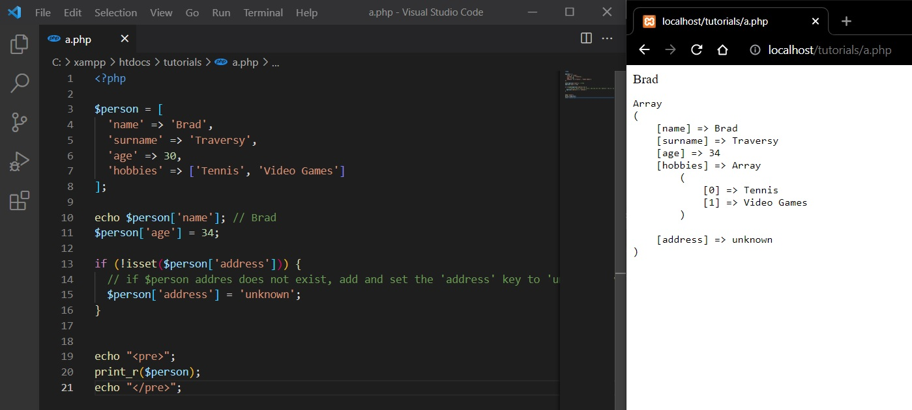

<br/>

However, from PHP 7.4, we can check and set a value to a non-existing key with double question marks `??`:

```php
$person['address'] ??= 'unknown';

// same as
$person['address'] = $person['address'] ?? 'unknown';

// same as
if (!isset($person['address'])) {
  $person['address'] = 'unknown';
}
```

<br/>

**If we want to print out the keys of an associative array, we use `array_keys($arr)`**

```php
echo '<pre>';
var_dump(array_keys($person));
echo '</pre>';
```

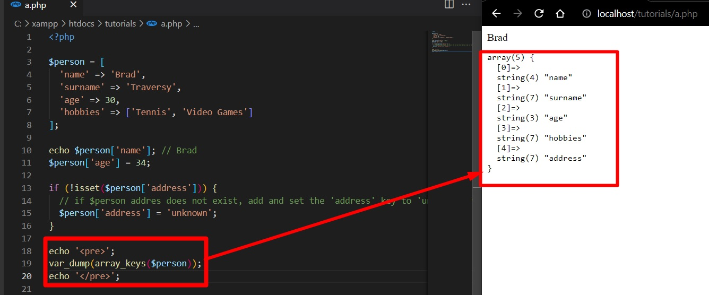

**And to print our an associative array values, we use `array_values()`**

```php
echo '<pre>';
var_dump(array_values($person));
echo '</pre>';
```

<br/>

### Sort Associative array

We can sort associative arrays by **keys** using `ksort($assoc_array)`:

```php
$person = [
  'name' => 'Brad',
  'surname' => 'Traversy',
  'age' => 30,
  'hobbies' => ['Tennis', 'Video Games']
];
ksort($person);

echo "<pre>";
print_r($person);
echo "</pre>";
```

Or we can sort associative arrays by **values** using `asort($assoc_array)`

```php
$person = [
  'name' => 'Brad',
  'surname' => 'Traversy',
  'age' => 30,
  'hobbies' => ['Tennis', 'Video Games']
];
asort($person);
```

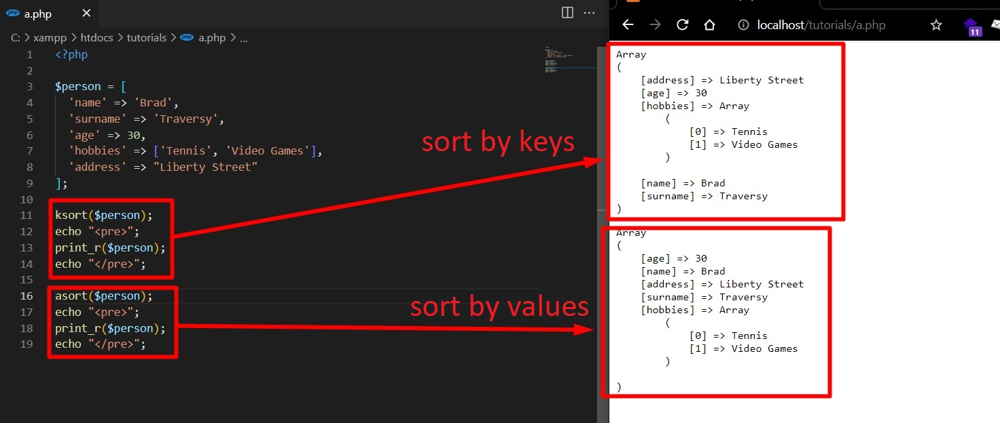

<br/>

**Sort a associative multidimensional array**

If we want to sort by the values of "price" key (source [here](https://stackoverflow.com/questions/1597736/how-to-sort-an-array-of-associative-arrays-by-value-of-a-given-key-in-php))

```php
$inventory = array(
   array("type"=>"pork", "price"=>5.43),
   array("type"=>"fruit", "price"=>3.50),
   array("type"=>"milk", "price"=>2.90),
);
```

```php
/* For PHP < 5.5 */
$price = array();
foreach ($inventory as $key => $row) {
    $price[$key] = $row['price'];
}
array_multisort($price, SORT_DESC, $inventory);

/* For PHP > 5.5 */
$price = array_column($inventory, 'price');
array_multisort($price, SORT_DESC, $inventory);

/* For PHP > 7.0 */
// Ascending
usort($inventory, function ($item1, $item2) {
    return $item1['price'] <=> $item2['price'];
});

// Descending
usort($inventory, function ($item1, $item2) {
    return $item2['price'] <=> $item1['price'];
});
```

> `<=>`, the spaceship comparison operator, returns 0 if both operands are equal, 1 if the left is greater, and -1 if the right is greater

<br/>

### Two dimensional Array like JS Objects

```php
<?php
$todos = [
  ['title' => 'Todo title 1', 'completed' => true],
  ['title' => 'Todo title 2', 'completed' => false],
  ['title' => 'Todo title 3', 'completed' => true]
];
```

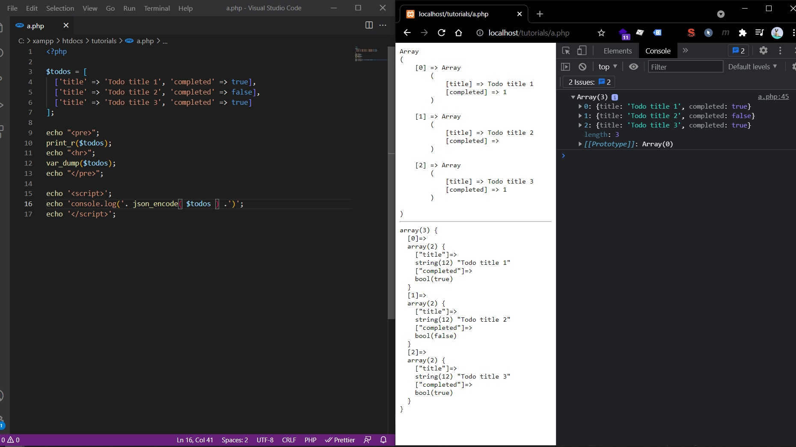

(This is how the data might look like when we are using REST API - same as with JavaScript Objects / JSON)

<br/>

# PHP conditionals and loops

## PHP conditionals

### if.. elseif.. else

```php
$time_hour = date("H");

if ($time_hour >= "10" && $time_hour < "12") {
  echo "Good morning!";
} elseif ($time_hour < "18") {
  echo "Good afternoon!";
} else {
  echo "Good evening!";
}

var_dump($time_hour); // string(2) "17"
```

Another example:

```php
$age = 24;
if ($age === 24) echo "Your age is ".$age;
```

| Operator | Name      | Example     | Result                                                               |
| -------- | --------- | ----------- | -------------------------------------------------------------------- |
| ==       | Equal     | `$x == $y`  | Returns true if $x is equal to $y                                    |
| ===      | Identical | `$x === $y` | Returns true if $x is equal to $y,<br/>and they are of the same type |

<br/>

Example of writing if else statement with HMTL:

```php
<?php if( is_product() ): ?>
  
  <div><a class="product-link" href="<?php echo esc_url( get_permalink() ); ?>" title="<?php the_title_attribute(); ?>"><?php the_title(); ?></a></div>
  
<?php else: ?>
  
  <h3><a class="product-link" href="<?php echo esc_url( get_permalink() ); ?>" title="<?php the_title_attribute(); ?>"><?php the_title(); ?></a></h3>
  
<?php endif; ?>
```

Another example: https://www.php.net/manual/en/control-structures.elseif.php

<br/>

### ternary operator ?

```php
$age = 24;
echo $age < 21 ? "Bellow 21 yo" : "Above 21 yo";
```

Another example:

```php
$a = 5;
$b = 10;
$c = ($a < $b) ? "a is less than b"  : "a is not less than b";
echo $c; // a is less than b
```

Another example (Note that you need to use parenthesis for nested ternary expressions!):

```php
function checkSign($num) {
  return $num > 0 ?
    "positive" :
    ($num < 0 ?
      "negative" :
      "zero");
}
echo checkSign(23); // positive
echo checkSign(0); // zero
echo checkSign(-2); // negative
```

### short ternary ?:

Short ternary operator `?:` will check if the variable has a _falsy_ value (or if it does not exist), then executes.

```php
$age = 24;
echo $age ?: 18; // 24
```

If `$age` variable was falsy, we would get:

```php
$age = 0;
echo $age ?: 18; // 18
```

If `$age` variable was undefined, we would get a warning, but it will still echo the value '18':

```php
echo $age ?: 18;
// Warning: Undefined variable $age in C:\xampp\htdocs\tutorials\a.php on line 3
// 18
```

Another example:

```php
$price;
$defaultPrice = $price ?: 15;
echo($defaultPrice);

// Warning: Undefined variable $price in C:\xampp\htdocs\tutorials\a.php on line 4
// 15
```

Another example (without warning - the better way):

```php
$defaultPrice = isset($price) ?: 15;
echo($defaultPrice); // 15
```

### null coalescing operator ??

Another example with **Null coalescing operator `??`**

```php
$defaultPrice = $price ?? 15;

// same as
$defaultPrice = isset($price) ?: 15;

// same as (the most readable)
$defaultPrice = isset($price) ? $price : 15;
```

### switch case

```php
$favcolor = "red";

switch ($favcolor) {
  case "red":
    echo "Your favorite color is red!";
    break;
  case "blue":
    echo "Your favorite color is blue!";
    break;
  case "green":
    echo "Your favorite color is green!";
    break;
  default:
    echo "Your favorite color is neither red, blue, nor green!";
}
```

Another example:

```php
$message = '';
$role = 'author';

switch ($role) {
	case 'admin':
		$message = 'Welcome, admin!';
		break;
	case 'editor':
	case 'author':
		$message = 'Welcome! Do you want to create a new article?';
		break;
	case 'subscriber':
		$message = 'Welcome! Check out some new articles.';
		break;
	default:
		$message = 'You are not authorized to access this page';
}

echo $message; // Welcome! Do you want to create a new article?
```

## PHP loops


### while, do while

```php
$i = 1;
while ($i <= 10):
    echo $i;
    $i++;
endwhile;

// 12345678910
```

Or

```php
$i = 0;
while($i <= 100) {
  echo $i.' ';
  $i += 10;
}
// 0 10 20 30 40 50 60 70 80 90 100
```

Another example:

```php
$i = 0;
while($i <= 100) {
  echo $i.' ';
  if ($i === 5) break;
  $i++;
}
// 0 1 2 3 4 5
```

<br/>Example with **do while**

```php
$i = 1;
do {
  echo "$i ";
  $i++;
} while ($i <= 5);
// 1 2 3 4 5
```

### for loops

```php
for ($i = 0; $i <= 10; $i++) {
  echo "$i ";
}
// 0 1 2 3 4 5 6 7 8 9 10
```

```php
for ($i = 0; $i <= 100; $i += 10) {
  echo "$i ";
}
// 0 10 20 30 40 50 60 70 80 90 100
```

Another example - looping over an array and initializing both `$i` and `$mySum` variables

```php
$myArr = [9, 10, 11, 12];
for ($i = 0, $mySum = 0; $i < count($myArr); $i++) {
  $mySum += $myArr[$i];
}

echo $mySum; // 42
```

### foreach (arrays)

The `foreach` loop - Loops through a block of code for each element in an array.

```php
$colors = array("red", "green", "blue", "yellow");

foreach ($colors as $color_value) {
  echo "$color_value ";
}
// red green blue yellow
```

And for associative arrays:

```php
$ages = array("Peter"=>"35", "Ben"=>"37", "Joe"=>"43");

foreach($ages as $key => $value) {
  echo "$key = $value<br>";
}
/*
Peter = 35
Ben = 37
Joe = 43
*/
```

<br/>

More examples

```php
$todos = [
  ['title' => 'Todo title 1', 'completed' => true],
  ['title' => 'Todo title 2', 'completed' => false],
  ['title' => 'Todo title 3', 'completed' => true]
];

/* Example 1 */
foreach($todos as $key => $value) {
  echo("<pre>");
  echo($key." = ");  print_r($value);
  echo("</pre>");
}

/* Example 2 */
foreach($todos as $id => $todo) {
  if(is_array($todo)) {
    foreach($todo as $key => $val) {
      echo "$key = $val; ";
    }
    echo "<br>";
  }
}
```

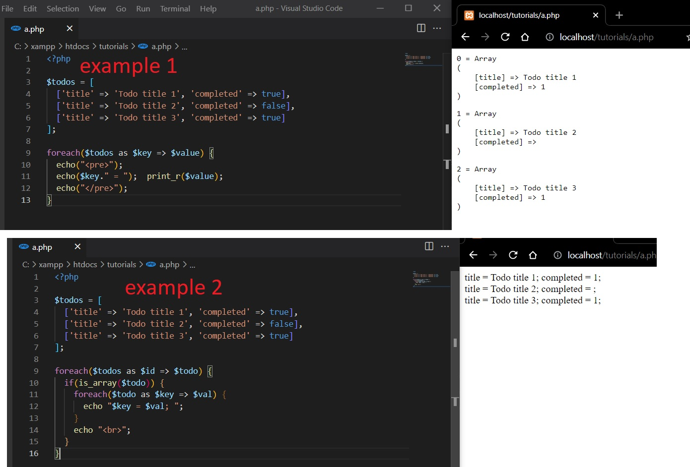

Another example:

```php
$person = [
  'name' => 'Brad',
  'surname' => 'Traversy',
  'age' => 30,
  'hobbies' => ['Tennis', 'Video Games']
];

foreach($person as $key => $val) {
  if (is_array($val)) {
    echo "$key = " . implode(", ", $val) . "<br>";
  } else {
    echo "$key = $val<br>";
  }
}
```

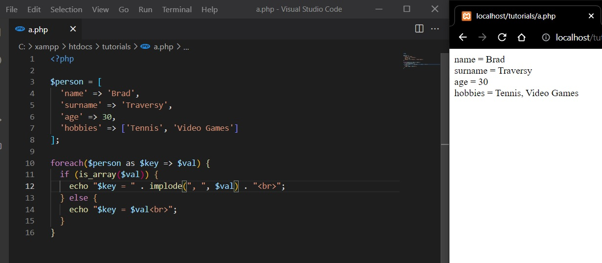

<br/>

# PHP Functions

[More about functions and `strict_types` on w3schools](https://www.w3schools.com/php/php_functions.asp)

```php
function getTodayDateFormatted() {
  return date("l, F d, Y");
}
echo getTodayDateFormatted(); // Saturday, September 04, 2021
```

```php
echo toCelsius(80); // 26.666666666667

function toCelsius($fahrenheit) {
  return (5/9) * ($fahrenheit - 32);
}

function toFahrenheit($celsius) {
  return $celsius * 9 / 5 + 32;
}
```

Note that functions can be called before they are declared.

<br/>

Another example:

```php
$inventory = array(
  array("name"=>"pork", "price"=>5.00),
  array("name"=>"pizza", "price"=>4.50),
  array("name"=>"milk", "price"=>1.90),
  array("name"=>"oranges", "price"=>2.10)
);

function sumOfPrices($arrOfObj) {
  $sum = 0;
  foreach($arrOfObj as $obj) {
    $sum += $obj["price"];
  }
  return $sum;
}
echo sumOfPrices($inventory); // 13.5
```

In JavaScript, we would have write:

```js
// JavaScript
var inventory = [
  { name: "pork", price: 5.0 },
  { name: "pizza", price: 4.5 },
  { name: "milk", price: 1.9 },
  { name: "oranges", price: 2.1 },
];

var sum = inventory.reduce((total, item) => total + item.price, 0);
console.log(sum); // 13.5
```

<br/>

**Take all the arguments of a function and save as an array**

```php
function sum(...$nums) {
  return array_sum($nums);
}
echo sum(1,2,3,4,5,6,7,8,9); // 45
```

<br/>

## Arrow Functions in PHP 7.4, array_reduce

```php
function sum(...$nums) {
  return array_reduce($nums, fn($carry, $n) => $carry + $n);
}
echo sum(1,2,3,4,5,6,7,8,9); // 45
```

Another example:

```php
$inventory = array(
  array("name"=>"pork", "price"=>5.00),
  array("name"=>"pizza", "price"=>4.50),
  array("name"=>"milk", "price"=>1.90),
  array("name"=>"oranges", "price"=>2.10)
);
$sumPrice = array_reduce($inventory, fn($total, $arr) => $total + $arr["price"], 0);
echo($sumPrice); // 13.5
```

## Higher order array functions

### Array Reduce

### Array Map

Another example

```php
$func = function($value) {
    return $value * 2;
};

print_r(array_map($func, range(1, 5))); // [2, 4, 6, 8, 10]
```

### Array Filter

<br/>

<br/>

<br/>

# PHP OOP

Resources on PHP OOP from w3schools:

- [PHP - What is OOP? - Introduction](https://www.w3schools.com/php/php_oop_what_is.asp)
- [PHP OOP - Classes and Objects](https://www.w3schools.com/php/php_oop_classes_objects.asp)
- [PHP OOP - constructors](https://www.w3schools.com/php/php_oop_constructor.asp)
- [PHP OOP - destructors](https://www.w3schools.com/php/php_oop_destructor.asp)
- [PHP OOP - Access Modifiers (public, private, protected)](https://www.w3schools.com/php/php_oop_access_modifiers.asp)
- [PHP OOP - Inheritance](https://www.w3schools.com/php/php_oop_inheritance.asp)
- [PHP OOP - Class Constants](https://www.w3schools.com/php/php_oop_constants.asp)
- [PHP OOP - Abstract Classes](https://www.w3schools.com/php/php_oop_classes_abstract.asp)
- [PHP OOP - Interfaces](https://www.w3schools.com/php/php_oop_interfaces.asp)

---

## Introduction to PHP OOP syntax

- Classes names always starts with an Uppercase letter.
- We must always declare the properties first
- We use `new` keyword (`new Classname();`) to create an instance (object) of a Class
- We use arrows `->` to set properties of objects (instances)

```php
class Person {
  public $name;
  public $surname;
  private $age;
}

// To create an instance (object) of Person class
$personObj = new Person();
$personObj->name = "Radu";
$personObj->surname = "Alex";

// if we try to set a value to a private property we get Fatal Error
// $personObj->age = 24;

echo "<pre>";
var_dump($personObj);
echo "</pre>";
```

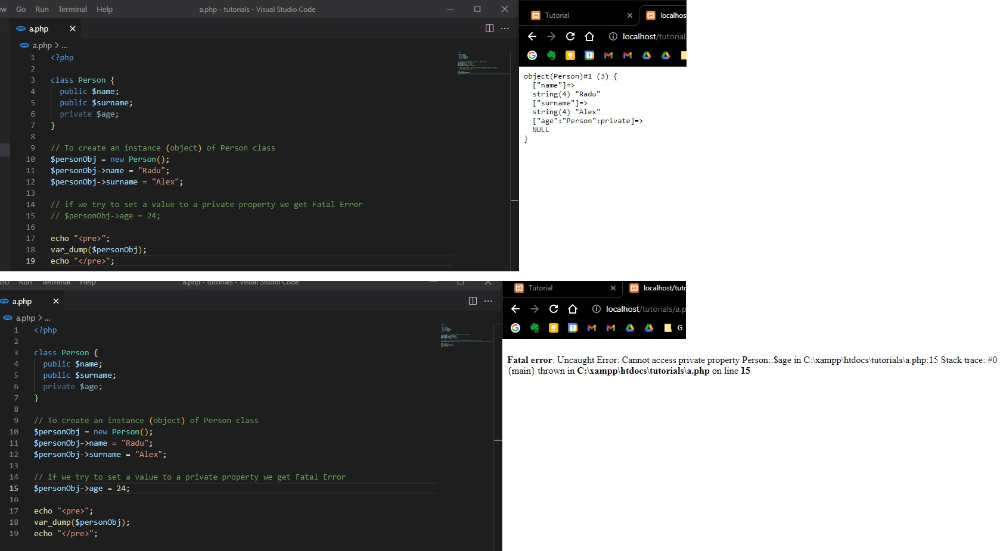

<br/>

- We can define a constructor using `__construct` keyword
- We use `$this->` keyword to access the properties of a class within that class (eg. in Python Language we would use `self.`)
- In PHP we cannot have multiple constructors (we cannot override constructors based on type of parameters or the number of parameters like in C, C++, Java or Python... however we can set a default value)
- If we set a constructor with 2 parameters, we cannot call the constructor (while creating an instance/object) with another number of parameters, we must use exactly 2 parameters (or, as a workaround, we can set default values when defining the constructor within that class)

```php
class Person {
  public $name;
  public $surname;
  private $age;

  public function __construct($name, $surname = "undefined", $age = 0) {
    $this->name = $name;
    $this->surname = $surname;
    $this->age = $age;
  }
}

$personObj = new Person('Radu', 'Alex');

echo "<pre>";
var_dump($personObj);
echo "</pre>";

/*
object(Person)#1 (3) {
  ["name"]=>
  string(4) "Radu"
  ["surname"]=>
  string(4) "Alex"
  ["age":"Person":private]=>
  int(0)
}
*/
```

<br/>

- For private properties, we need to create getters and setters to set and retrieve the values from them. We cannot access directly the private properties outside that class.
- We can call the setters and getters from outside our class using arrows `->`

```php
class Person {
  public $name;
  public $surname;
  private $age;

  public function __construct($name, $surname = null, $age = null) {
    $this->name = $name;
    $this->surname = $surname;
    $this->age = $age;
  }
  public function setAge($age) {
    $this->age = $age;
  }
  public function getAge($age) {
    return $this->$age;
  }
}

$personObj = new Person('Radu', 'Alex');
$personObj->setAge(24);

echo "<pre>";
var_dump($personObj);
echo "</pre>";

/*
object(Person)#1 (3) {
  ["name"]=>
  string(4) "Radu"
  ["surname"]=>
  string(4) "Alex"
  ["age":"Person":private]=>
  int(24)
}
*/
```

<br/>

### Static properties and methods

- static properties and methods only belong to the class itself (they do not belong to the instance/object created out of that class)
- if we want to use the static properties/methods inside our class, we use the `self::` keyword (instead of arrow `->`)
- if we want to directly access a **public static** property outside of the class, we would retrieve it like this: `Classname::$counter` (with double colon `::`), same with the functions.
- in the bellow example we create a static property `$counter` that increments its value every time we create a new object form that class (or every time we call the constructor of that class), and we also create a static function `getCounter()`.
- in the example, we created two object of `Person` class, therefore we called the `__construct` function two times, so the Person's **static property** `$counter` has a value of two when echoed.

```php
class Person {
  public $name;
  public $surname;
  private $age;
  public static $counter = 0;

  public function __construct($name, $surname = null, $age = null) {
    $this->name = $name;
    $this->surname = $surname;
    $this->age = $age;
    self::$counter++;
  }

  public function setAge($age) {
    $this->age = $age;
  }
  public function getAge($age) {
    return $this->$age;
  }
  public static function getCounter() {
    return self::$counter;
  }
}

$personObj = new Person('James', 'May');
$personObj->setAge(58);

$personObj2 = new Person('Jeremy', 'Clarkson', 61);

echo Person::$counter; // 2
echo Person::getCounter(); // 2
```

<br/>

### Inheritance

- Very often (almost in all cases), when we write a Class, we will put that Class inside its own file. For example, in `Person.php` we will only have the `Person` class. Then in another file we will use `require_once "classes_folder/Person.php"`.
- **Since PHP 7.4 (latest as Aug-2021), we have possibility to specify the types (int, string, etc) of the properties of a class. For example, if we declare a property with `private int $age`, we cannot assign a value of `null` to it anymore. However, if we add a question mark `?` before its type (like this `private ?int $age`), now that property will also accept null (along ints).**

- In this example we will have a `Person` class (in Person.php) and a `Student` class (Student.php) that will be inherited from Person class.
- Obviously in the Student.php we will need to `require_once "Person.php"` (and **not** just require!!! because when we will require the Student class, it will also require again the Person class!! we would get the error `Cannot declare class Person, because the name is already in use`)
- In PHP, in order to inherit from another class, we write `extends` keyword. Like this `class Student extends Person`.
- Note that the Student class that inherits Person will have the same constructor as the Person class (so when we create a Student object, we need to specify the parameters in the same way as we would create a Person class)

```php
<?php
// Person.php
class Person {
  public string $name;
  public string $surname;
  private ?int $age;
  public static int $counter = 0;

  public function __construct($name, $surname = "", $age = null) {
    $this->name = $name;
    $this->surname = $surname;
    $this->age = $age;
    self::$counter++;
  }

  public function setAge($age) {
    $this->age = $age;
  }
  public function getAge($age) {
    return $this->$age;
  }
  public static function getCounter() {
    return self::$counter;
  }
}
```

```php
<?php
// Student.php
require_once "Person.php";

class Student extends Person {

}
```

```php
<?php
// index.php
require_once "Person.php";
require_once "Student.php";

$personObj = new Person('Oliver', 'Doe', 32);
$studentObj = new Student('Emma', 'Doe', 28);


echo "<pre>";
var_dump($personObj);
echo "</pre>";

echo "<pre>";
var_dump($studentObj);
echo "</pre>";
```

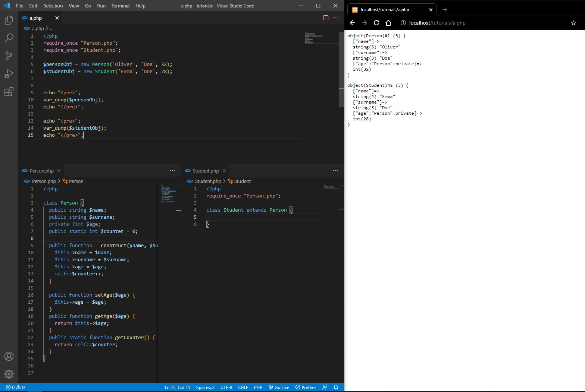

<br/>

- If we want to add other properties to the Student class (that inherits Person), and we want to override the constructor of the Person class... we need to use the following syntax (the constructor of Student will assign the values for its properties, then it will call the constructor of the inherited class Person):
- (Note that the order of parameter will matter.. the parameters of the constructor that we don't assign a default value will need to be first, like this `public function __construct($name, $studentId, $surname = "", $age = 0, )`, or else, if we have them like this `($name, $surname = "", $age = 0, $studentId)`, all 4 of them will be required when we make a new Student object)

```php
// Student.php
require_once "Person.php";

class Student extends Person {
  public string $studentId;

  public function __construct($name, $surname, $age, $studentId) {
    parent::__construct($name, $surname, $age);
    $this->studentId = $studentId;
  }
}
```

```php
// index.php
require_once "Person.php";
require_once "Student.php";

$personObj = new Person('Oliver', 'Doe', 32);
$studentObj = new Student('Emma', 'Doe', 28, 2321);


echo "<pre>";
var_dump($personObj);
echo "</pre>";

echo "<pre>";
var_dump($studentObj);
echo "</pre>";
```


<br/>

### Private vs Protected access specifiers

- Also note, that in the Student class, because the `$age` property is `private` and its in the Person class, we cannot the `$age` property in the `Student` class that inherits `Person`.
- The private `$age` property can be accessed only in its class `Person`
- If we want the `$age` property to be accessed in the class that inherits from Person class (namely Student class), we need to set the type of `$age` property from `private` to `protected`
- Therefore, with `protected`, even if `$age` was declared in inherited Person class, we can still access that property inside Student class with `$this->$age`.

Public/Protected/Private are called access specifiers or access modifiers.

<br/>

<br/>

<br/>

# PHP Files

## Including PHP files with include, require

Let's simulate two pages of a website, having `index.php` and `about.php` files.

```html
<!-- index.php -->
<body>
  <nav>
    <a href="index.php">Home</a>
    <a href="about.php">About</a>
  </nav>

  <h1>Homepage</h1>
</body>

<!-- about.php -->
<body>
  <nav>
    <a href="index.php">Home</a>
    <a href="about.php">About</a>
  </nav>

  <h1>About us</h1>
</body>
```

But, instead of having repetitive code (in this case the menu with `<nav>` element), we can store the HTML elements (or JS scripts) in another php file (in this example `header.php`), which we will access from both `index.php` and `about.php`.

We will create a folder called `partials` where we will have the `/partials/header.php` file.

```php
<!-- /partials/header.php -->
<!DOCTYPE html>
<html lang="en">
<head>
  <meta charset="UTF-8">
  <meta http-equiv="X-UA-Compatible" content="IE=edge">
  <meta name="viewport" content="width=device-width, initial-scale=1.0">
  <title>Tutorial</title>
</head>

<body>
<header>
  <nav>
    <ul>
      <li><a href="index.php">Home</a></li>
      <li><a href="about.php">About</a></li>
    </ul>
  </nav>
</header>
```

Then, on both `index.php` and `about.php` we will write at the beginning:

```php
<?php include "partials/header.php"; ?>

<h1>Homepage</h1>
</body>
```

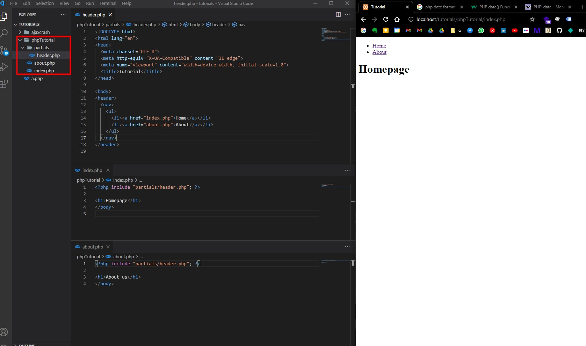

---

The difference between `include()` and `require()` in PHP is that... if we use `include()` to include a file that doesn't actually exists, then the PHP will give us a warning that the file was not found, but it will continue to execute the rest of the code.

`require()` will stop the execution of entire PHP file if the file that we are trying to include is not found -> it will give us a Fatal error.

---

There are also `include_once` and `require_once` parameters. If we `require`/`include` a file multiple times, it will get included multiple times. `include_once`/`require_once` will stop that from happening.

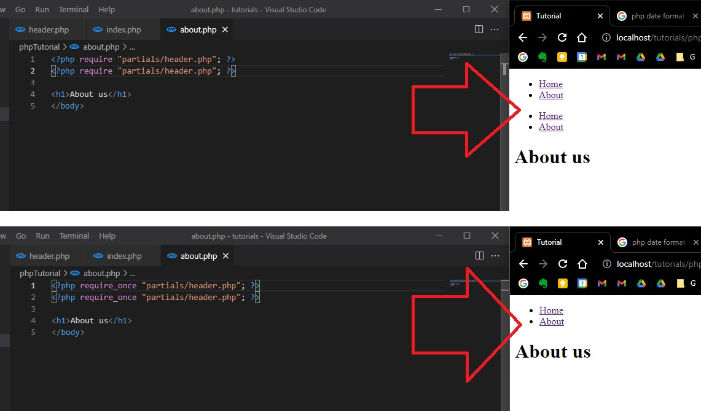

<br/>

We can also create a `partials/footer.php` where we add `<footer>` element and we close the `</body>`,

```php+HTML
<!-- /partials/footer.php -->

<footer>
  Copyright &copy; <?php echo date("Y");?> Radu B. All rights reserved.
</footer>
</body>
```

```php+HTML
<!-- index.php -->

<?php require_once "partials/header.php"; ?>

<h1>Homepage</h1>

<?php require_once "partials/footer.php"; ?>
```

```php+HTML
<!-- about.php -->

<?php require_once "partials/header.php"; ?>

<h1>About us</h1>

<?php require_once "partials/footer.php"; ?>
```

---

Also, we can write `php` files with `functions` in them, and include the files in other `php` files where we can call the functions.

_Example:_

```php
<?php
/* /functions/calculate.php */

function calculatePrice($price, $taxes) {
  if (empty($taxes)) $taxes = 0.05;
  return $price * (1 + $taxes);
}
```

```php
<?php
/* index.php */

require_once "functions/calculate.php";

echo calculatePrice(100, 0.19); // 119
```

<br/>

## Working with File system

References from [w3schools](https://www.w3schools.com/php/php_file.asp):

- [PHP readfile() function](https://www.w3schools.com/php/php_file.asp)
- [PHP Open/Read/Close File with fopen(), fread(), fclose()](https://www.w3schools.com/php/php_file_open.asp)
- [PHP Create file and write file with fopen() and fwrite()](https://www.w3schools.com/php/php_file_create.asp)

<br/>

But first, let's explore some definitions:

### Magic constants

Magic constants = constants that change their value based on the execution of context.

```php
echo __DIR__; // C:\xampp\htdocs\tutorials\phpTutorial
echo __FILE__; // C:\xampp\htdocs\tutorials\phpTutorial\index.php
echo __LINE__; // 8 -- this prints the current line number in the current file
```

Other magic constants unrelated to files:

- `__FUNCTION__` and `__METHOD__` as in PHP 5.0.4 where `__FUNCTION__` returns only the name of the function while `__METHOD__` returns the name of the class along with the name of the function
- `__CLASS__` gets the current class a function is executed within that class

[See more PHP Predefined constants](https://www.php.net/manual/en/reserved.constants.php).

### Create, rename, delete directory with PHP

We can create directories (folders) on server with `mkdir('directory_name', 0755);` (where 0755 represents the permissions).

```php
// Create directory
mkdir('new_dir', 0777);

// Rename directory
rename('new_dir', "new_dir_v2");

// Delete directory
rmdir('new_dir_v2');
```

<br/>

### Create files, Read files

([Notes from w3schools](https://www.w3schools.com/php/php_file.asp))

The `readfile()` function reads a file and writes it to the output buffer. The `readfile()` function is useful if all you want to do is open up a file and read its contents.

The `fopen()` function is a better method to open files. This function gives you more options than the `readfile()` function.

The `fopen()` function is also used to create a file. Maybe a little confusing, but in PHP, a file is created using the same function used to open files. If you use `fopen()` on a file that does not exist, it will create it, given that the file is opened for writing (w) or appending (a).

| Modes for fopen | Description                                                                                                                                                      |
| :-------------- | :--------------------------------------------------------------------------------------------------------------------------------------------------------------- |
| r               | **Open a file for read only**. File pointer starts at the beginning of the file                                                                                  |
| w               | **Open a file for write only**. Erases the contents of the file or creates a new file if it doesn't exist. File pointer starts at the beginning of the file      |
| a               | **Open a file for write only**. The existing data in file is preserved. File pointer starts at the end of the file. Creates a new file if the file doesn't exist |
| x               | **Creates a new file for write only**. Returns FALSE and an error if file already exists                                                                         |
| r+              | **Open a file for read/write**. File pointer starts at the beginning of the file                                                                                 |
| w+              | **Open a file for read/write**. Erases the contents of the file or creates a new file if it doesn't exist. File pointer starts at the beginning of the file      |
| a+              | **Open a file for read/write**. The existing data in file is preserved. File pointer starts at the end of the file. Creates a new file if the file doesn't exist |
| x+              | **Creates a new file for read/write**. Returns FALSE and an error if file already exists                                                                         |

<br/>

Another method to get a file and retrieve its content is with `file_get_contents('lorem.txt')`.

<br/>

Examples:

```php
<?php
echo file_get_contents("webdictionary.txt");

echo readfile("webdictionary.txt");
```

```php
file_put_contents("newly_created_file.txt", "Some content"); // creates and appends "Some content"

echo readfile("newly_created_file.txt"); // Some content

unlink("newly_created_file.txt"); // deletes newly_created_file.txt
```

```php
<?php
$myfile = fopen("webdictionary.txt", "r") or die("Unable to open file!");
echo fread($myfile, filesize("webdictionary.txt"));
fclose($myfile);
```

The first parameter of `fread()` contains the name of the file to read from and the second parameter specifies the maximum number of bytes to read.

The `fclose()` function is used to close an open file.

```php
<?php
$myfile = fopen("webdictionary.txt", "r");
// some code to be executed....
fclose($myfile);
?>
```

<br/>

More examples:

```php
<?php
$myfile = fopen("webdictionary.txt", "r") or die("Unable to open file!");
// Output one line until end-of-file
while(!feof($myfile)) {
  echo fgets($myfile) . "<br>";
}
fclose($myfile);
```

The `feof()` function checks if the "end-of-file" (EOF) has been reached.

The `feof()` function is useful for looping through data of unknown length.

---

Another example: **Download a file from another server and put it on your server:**

```php
<?php
$url_to_file = "http://staging.testserver.com/website-archive.tgz";
$new_filename = "website-archive-2021-09-12.tgz";

file_put_contents($new_filename, fopen($url_to_file, 'r') );

echo "The file ". $new_filename ." has been uploaded to your server!";
```

---

<br/>

**Read files and folders inside a directory with scandir()**

```php
$files = scandir('./');

echo "<pre>";
var_dump($files);
echo "</pre>";

/*
array(5) {
  [0]=>
  string(1) "."
  [1]=>
  string(2) ".."
  [2]=>
  string(9) "about.php"
  [3]=>
  string(9) "index.php"
  [4]=>
  string(8) "partials"
}
*/
```

<br/>

**More useful functions:**

```php
file_exists('sample.txt'); // true / false

is_dir('test'); // false if a directory named 'test' doesn't exist in the same folder as this file

filemtime('test.txt'); // file modification time

filesize('test.txt');
```

ALL OF THESE FUCTIONS AND MORE [HERE - php manual filesystem](https://www.php.net/manual/en/book.filesystem.php).

<br/>

### Read JSON files from API

```php
$usersJson = file_get_contents("https://jsonplaceholder.typicode.com/users");

echo($usersJson); // returns a string of 5645 characters...
```

We can convert the retrieved JSON into an array using `json_decode()`:

```php
$usersJson = file_get_contents("https://jsonplaceholder.typicode.com/users");

echo "<pre>";
var_dump(json_decode($usersJson));
echo "</pre>";
```

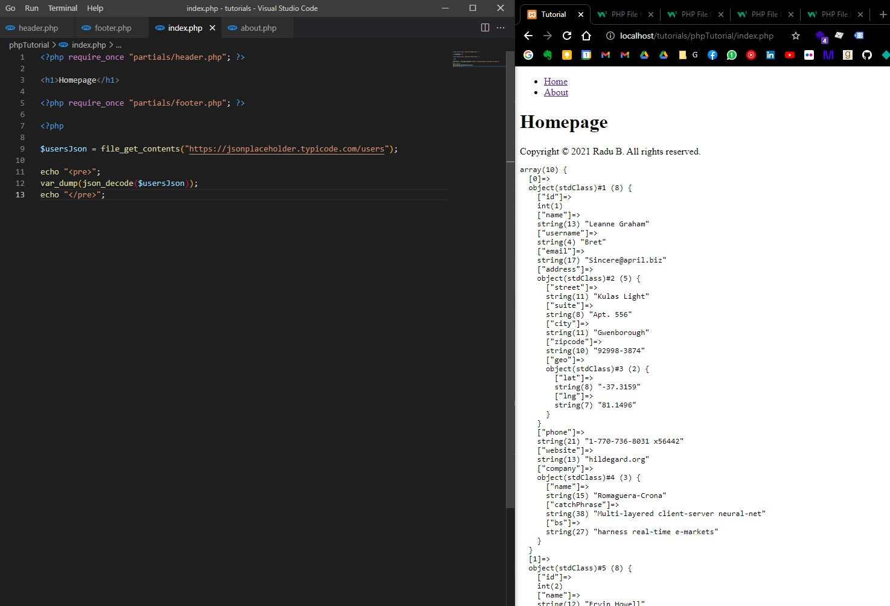

We can also specify if we want to convert the elements in the main array as associative arrays with key-value pairs (by default the element within main array are objects - the second parameter is `false` by default):

```php
$usersJson = file_get_contents("https://jsonplaceholder.typicode.com/users");
$users = json_decode($usersJson, true);

echo "<pre>";
var_dump($users);
echo "</pre>";
```

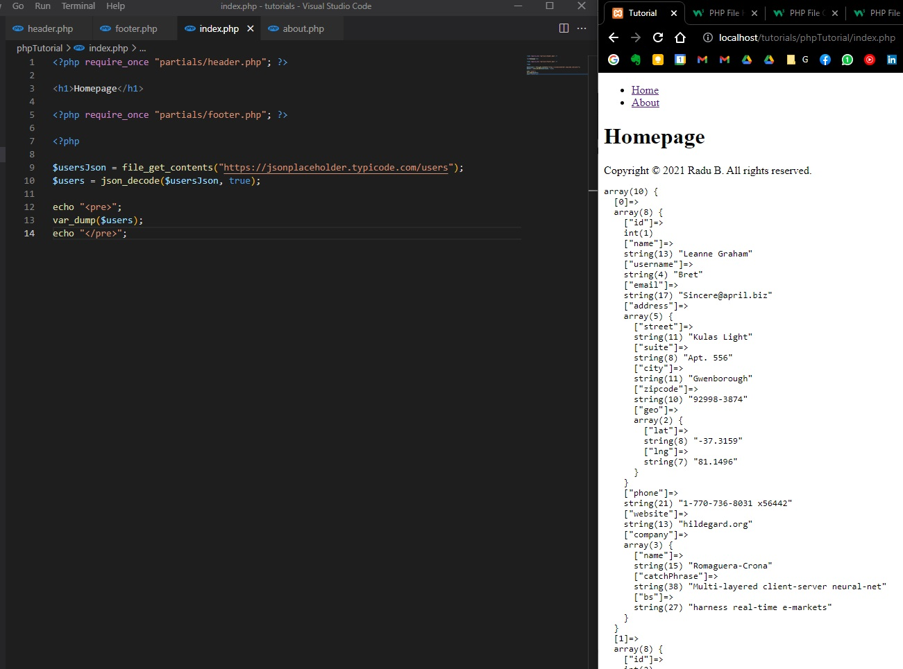

<br/>

## File upload from HTML Form

[PHP File Upload from HTML Form](https://www.w3schools.com/php/php_file_upload.asp)

<br/>

<br/>

<br/>

# PHP cURL

[cURL](http://php.net/curl) (a **c**lient for **URL**s) is a library that lets you make HTTP requests in PHP. Or, cURL is a tool that gives us the possibility to interact (remotely) with other services (eg. with an API).

- If we want to get the information (JSON) from the following URL: https://jsonplaceholder.typicode.com/users, we would use `cURL`
- We can also retrieve this information with `file_get_contents`, but this function could have security issues. And also `file_get_contents` cannot be used if we want to pass some additional headers to the request, and it also can't hold any information that we want to send along the request. so that's why we need to use `cURL`.

cURL is very powerful in retrieving data from API, making POST request to APIs, uploading and downloading files, and authentication.

<br/>

Here's a fast simple cURL example from

```php
// Initialize a connection with cURL (ch = cURL handle, or "channel")
$ch = curl_init();

// Set the URL
curl_setopt($ch, CURLOPT_URL, 'http://www.example.com');

// Set the HTTP method
curl_setopt($ch, CURLOPT_CUSTOMREQUEST, 'GET');

// Return the response instead of printing it out
curl_setopt($ch, CURLOPT_RETURNTRANSFER, 1);

// Send the request and store the result in $response
$response = curl_exec($ch);

echo 'HTTP Status Code: ' . curl_getinfo($ch, CURLINFO_HTTP_CODE) . PHP_EOL;
echo 'Response Body: ' . $response . PHP_EOL;

// Close cURL resource to free up system resources
curl_close($ch);
```

## PHP cURL Introduction

### Make a simple cURL request

- So, first thing we want to do, it's to **initialize a cURL session** by calling `curl_init()` function. The `curl_init()` function returns a `Resource` type (a `CurlHandle` object) (https://www.php.net/manual/en/language.types.resource.php)
- Then, we need **to set an option for the cURL transfer** by calling `curl_setopt()` in which we will pass the returned `$resource` from `curl_init()` along with a CONSTANT called `CURLOPT_RETURNTRANSFER` and also a boolean `true` value.
- Then, we need **to perform/execute the cURL session** with `curl_exec()` that will return a `$result` (a string with the whole response)

```php
$url = "https://jsonplaceholder.typicode.com/users";
$resource = curl_init($url);
curl_setopt($resource, CURLOPT_RETURNTRANSFER, true);
$result = curl_exec($resource);

echo "<pre>";
var_dump($result);
echo "</pre>";
// returns a string of 5645 characters long...
```

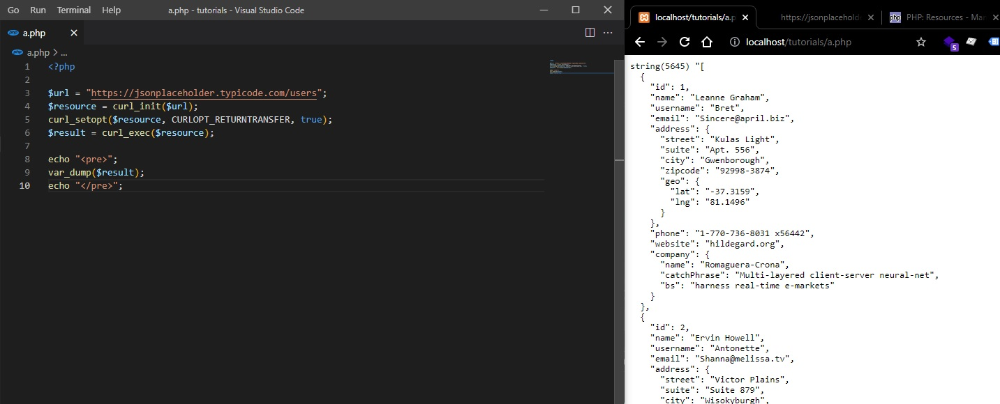

- Also, it is important to close the cURL session after!!! (Continue reading bellow)

<br/>

### Retrieve cURL status code

- Now, if we want to get the status code of the request we made with the cURL session, we need to call `curl_getinfo($resource)` where we specify the Resource returned from `curl_init()`. We will get a looot of info.
- In the `curl_getinfo()` function's parameters we could also specify the constant `CURLINFO_HTTP_CODE`
- Finally, after we finished retrieved the information and the resource/data from the URL/API, we need to close the cURL session with `curl_close($resource)`. Note that after we close the resource, we cannot retrieve any more information using `curl_getinfo()`

```php
$url = "https://jsonplaceholder.typicode.com/users";
$resource = curl_init($url);
curl_setopt($resource, CURLOPT_RETURNTRANSFER, true);
$result = curl_exec($resource);

$status_code = curl_getinfo($resource, CURLINFO_HTTP_CODE);

echo "<pre>";
var_dump($status_code);
echo "</pre>";

curl_close($resource);

// echo "<pre>";
// var_dump($result);
// echo "</pre>";
```

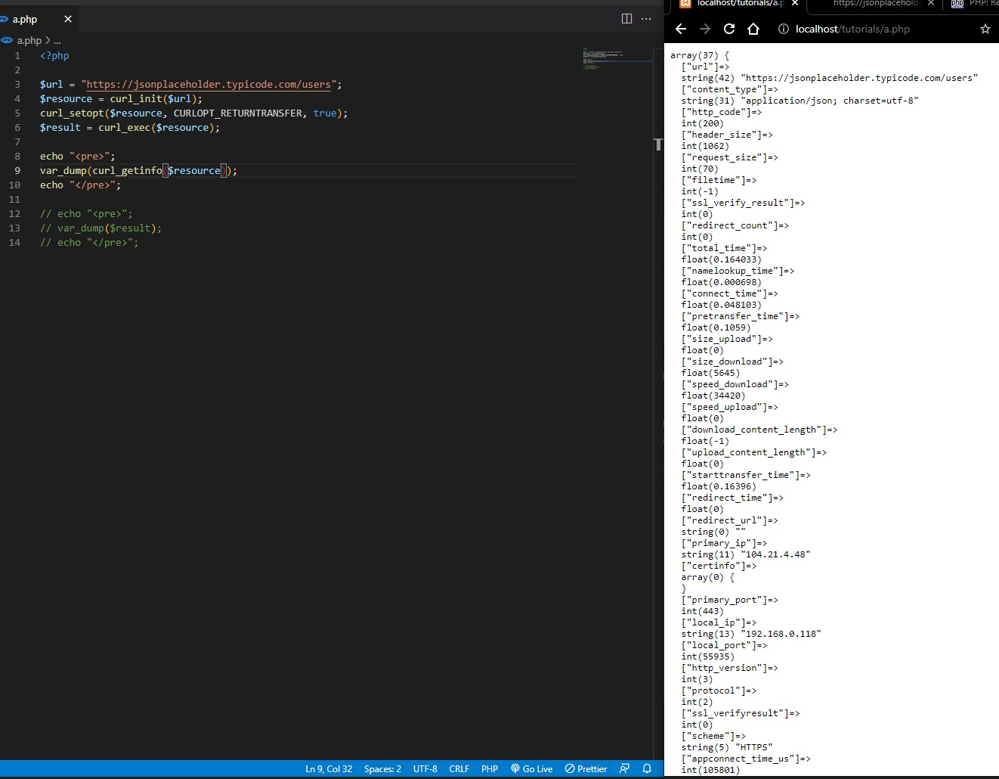

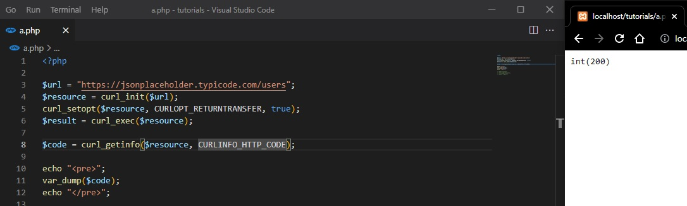

<br/>

### POST request with cURL

- Now, instead of passing a URL to `curl_init($url);`, we will just call it without parameters, and insert our URL along with multiple options within the call of `curl_setopt_array()` function. Here in `curl_setopt_array()` we'll pass:
  - the `CURLOPT_URL` with API's URL
  - `CURLOPT_RETURNTRANSFER => true` (true which means we want to get the response)
  - `CURLOPT_POST => true` (we specify that the request is a POST method, eg. for creating a new user)
  - `CURLOPT_HTTPHEADER` where we tell the API the type of content we are sending, in this case it is JSON, so we specify `content-type: application/json`
  - `CURLOPT_POSTFIELDS` (the data/user object/associative array that we want to send - json encoded).
- Then we call `curl_exec($resource)` with the `$resource` that we initiated and set options to, that will return a `Result`.

```php
$url = "https://jsonplaceholder.typicode.com/users";
$resource = curl_init();

$user = [
  'name' => 'Johnny Doe',
  'username'=> 'john',
  'email' => `john.doe@example.com`
];
curl_setopt_array($resource, [
  CURLOPT_URL => $url,
  CURLOPT_RETURNTRANSFER => true,
  CURLOPT_POST => true,
  CURLOPT_HTTPHEADER => ['content-type: application/json'],
  CURLOPT_POSTFIELDS => json_encode($user)
]);

$result = curl_exec($resource);
$status_code = curl_getinfo($resource, CURLINFO_HTTP_CODE);

curl_close($resource);


echo "<pre>";
var_dump($status_code);
echo "</pre>";

echo "<pre>";
var_dump($result);
echo "</pre>";
```

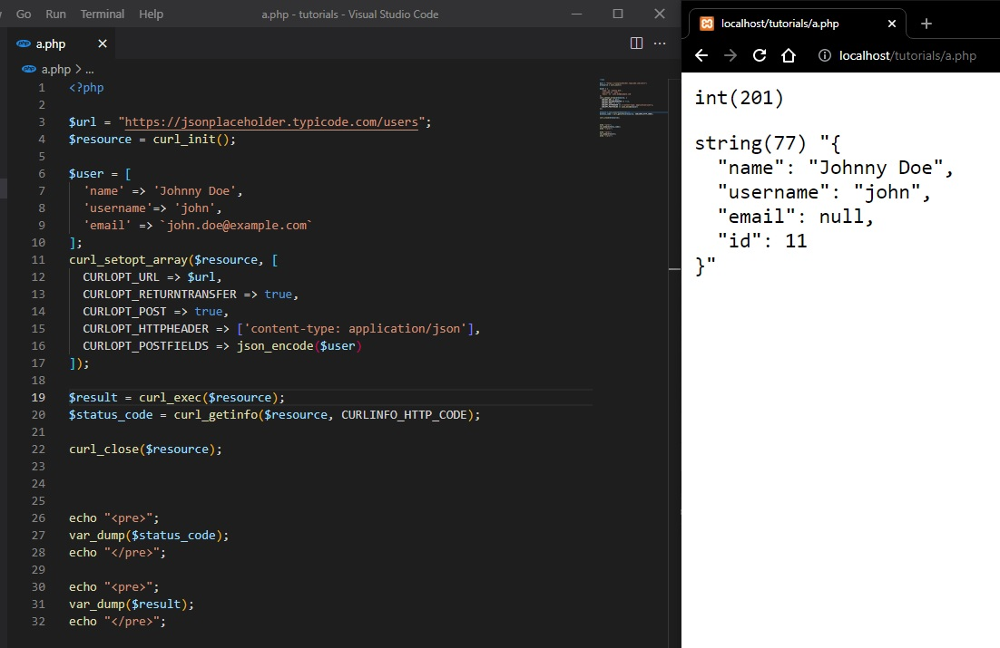

<br/><br/>

(Optional) Interesting observation when using `cURL` to POST data from here: https://www.php.net/manual/en/curl.examples-basic.php

> _It is important to notice that when using curl to post form data and you use an array for CURLOPT_POSTFIELDS option, the post will be in multipart format_
>
> ```php
> <?php
> $params=['name'=>'John', 'surname'=>'Doe', 'age'=>36)
> $defaults = array(
>   CURLOPT_URL => 'http://myremoteservice/',
>   CURLOPT_POST => true,
>   CURLOPT_POSTFIELDS => $params,
> );
>
> $ch = curl_init();
> curl_setopt_array($ch, ($options + $defaults));
> curl_close($ch);
> ?>
> ```
>
> _This produce the following post header:_
>
> ```
> --------------------------fd1c4191862e3566
> Content-Disposition: form-data; name="name"
>
> John
> --------------------------fd1c4191862e3566
> Content-Disposition: form-data; name="surnname"
>
> Doe
> --------------------------fd1c4191862e3566
> Content-Disposition: form-data; name="age"
>
> 36
> --------------------------fd1c4191862e3566--
> ```
>
> _You need to set `CURLOPT_POSTFIELDS` as follow to produce a standard post header_
>
> ```php
> CURLOPT_POSTFIELDS => http_build_query($params),
>
> // Which is:
> // name=John&surname=Doe&age=36
> ```
>
> _This caused me 2 days of debug while interacting with a java service which was sensible to this difference, while the equivalent one in PHP got both format without problem._

### Retrieve HTML from a website and save into file

[**Example: Using PHP's cURL module to fetch the example.com HTML homepage**](https://www.php.net/manual/en/curl.examples-basic.php)

```php
<?php
// Initialize a connection with cURL (ch = cURL handle, or "channel")
$ch = curl_init("http://www.example.com/");
$fp = fopen("example_homepage.txt", "w");

curl_setopt($ch, CURLOPT_FILE, $fp);
curl_setopt($ch, CURLOPT_HEADER, 0);

curl_exec($ch);
if(curl_error($ch)) {
    fwrite($fp, curl_error($ch));
}
curl_close($ch);
fclose($fp);
```

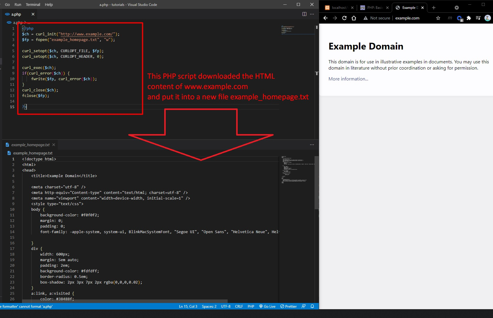

_^^ This can also be used to download files (from another server) and save them on your server._

<br>

---

**_More examples here: [5 PHP cURL examples](https://phpenthusiast.com/blog/five-php-curl-examples) that includes:_**

1. [Downloading the content of a website](https://phpenthusiast.com/blog/five-php-curl-examples#download-content)
2. [Downloading a file from a website](https://phpenthusiast.com/blog/five-php-curl-examples#download-file)
3. [Auto form submission](https://phpenthusiast.com/blog/five-php-curl-examples#form-submit)
4. [Authentication](https://phpenthusiast.com/blog/five-php-curl-examples#authentication)
5. [Use of cookies](https://phpenthusiast.com/blog/five-php-curl-examples#cookies)

---

Web scraping with PHP?

- https://stackoverflow.com/questions/9813273/web-scraping-in-php -> https://simplehtmldom.sourceforge.io/
- [Web Scraping with PHP – How to Crawl Web Pages Using Open Source Tools - freeCodeCamp](https://www.freecodecamp.org/news/web-scraping-with-php-crawl-web-pages/)
- https://www.scrapingbee.com/blog/web-scraping-php/

---

<br/><br/><br/>
