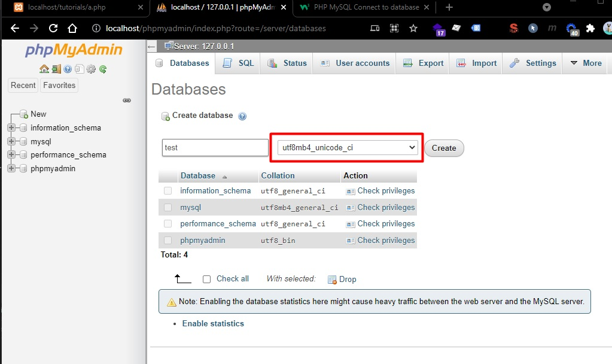
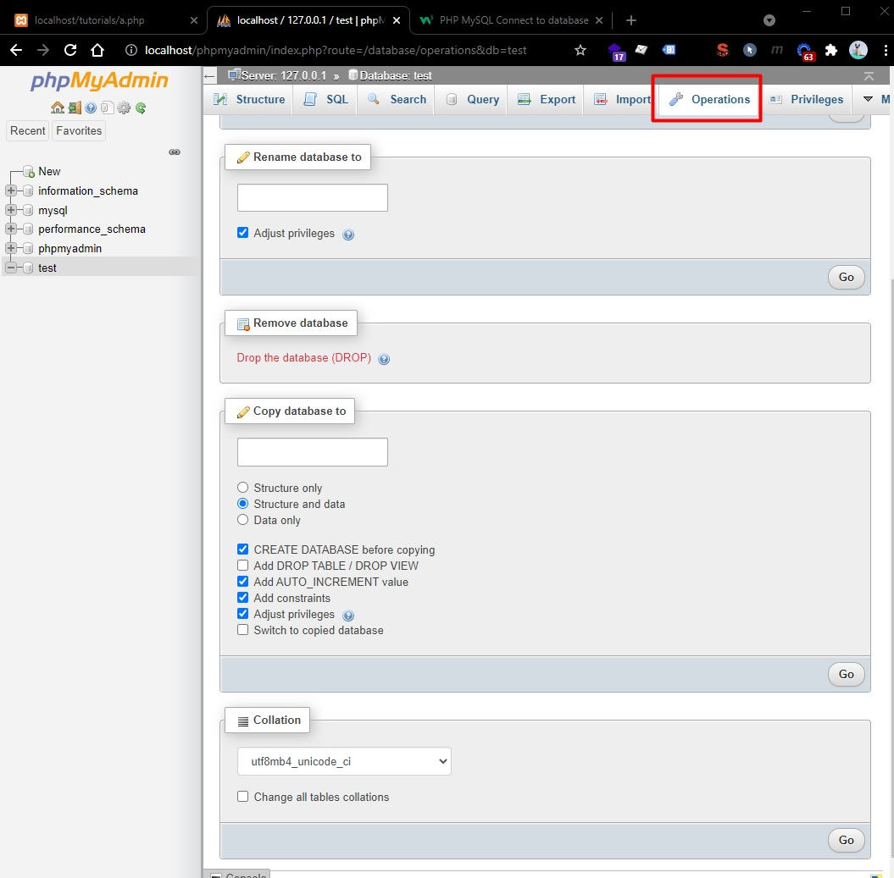

# PHP Tutorial Part 2

Credits / Notes taken from:

- [PHP For Absolute Beginners - Travery Media starting from 2h35m (out of 6h30m)](https://youtu.be/2eebptXfEvw?t=9309)

Table of Contents:

# MySQL

We can manage our databases (that contains tables) with the a GUI "phpMyAdmin", located at http://localhost/phpmyadmin (with [XAMPP](https://www.apachefriends.org/ro/index.html) server running).

To create a database within MySQL phpMyAdmin, we can go to "New" -> "Create Database", and we will choose `utf8mb4_unicode_ci` for "[Collation](https://docs.microsoft.com/en-us/sql/relational-databases/collations/collation-and-unicode-support?view=sql-server-ver15)".

If we want to remove, rename, change "Collation" of the database, we can go to "Operations" tab:

