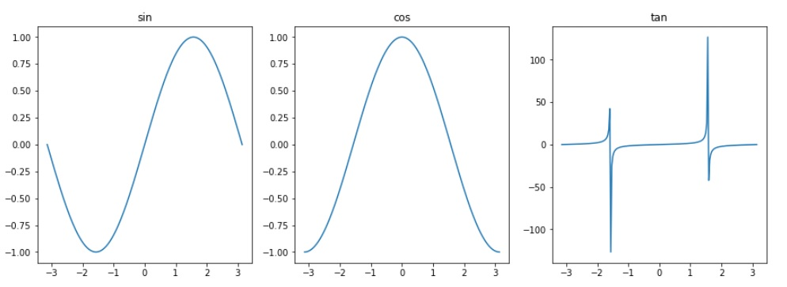

# NumPy Tutorial

## Contents
- [Creating NumPy arrays(vectors) / matrices](#CreatingArrays)
  - [Generating arrays with `arange` and `linspace`](#GeneratingArrays)
  - [Initializing arrays/matrices with zeros / ones](#InitializingArraysWithZeros)
  - [Initializing matrix with other numbers or random numbers](#InitializingArraysWithRandom)
  - [Identity matrix](#IdentityMatrix)

- [Accessing/Changing elements, rows and columns](#AccesingChangingElem)
  - [Accessing/Slicing matrices based on conditions](#AccessingSlicingMat)
  - [Repeat an array (or Repeat an array into a matrix)](#RepeatAnArray)
  - [Make a 5x5 matrix with border of 1's, middle of 0's, and 9 in center](#Make55Matrix)
  - [Copying arrays with `arr.copy()`](#CopyingArrays)
  - [Reorganizing/Reshaping arrays](#ReorganizingReshaping)
  - [Transpose arrays/matrices; Flip arrays/matrices](#TransposeArrays)
  - [Swap axes of array: Flatten a matrix](#SwapAxesOfArray)
  - [Sorting arrays/matrices](#SortingArrays)
  - [Stacking vectors/matrix together (vertical/horizontal stack)](#stackingVectors)
- [Simple math operations](#SimpleMath)
  - [Matrix multiplication (dot product) and Matrix determinant](#MatrixMultiplication)
  - [Array/Matrix `floor`, `ceil`, `round` and `astype`](#ArrayMatrixFloorCeil)
  - [Matrix statistic functions: min, max, sum, mean, median, standard deviation, variance](#MatrixStatisticFunc)
  - [Trigonometric functions](#TrigonometricFunction)

## NumPy introduction

```python
import numpy as np
```
### Getting "help" documentation on a function using `?` (in Jupyter Notebook)

```python
np.arange?
np.random.randint?
```

### <a name="CreatingArrays">Creating arrays(vectors)/matrices</a>

```python
a = np.array([1, 2, 3], dtype='int')
b = np.array([[9.0, 7., 6.5],[5.42, 4.32, 2],[2.34, 0., 9.9]])
print(a)
print(b)
print()

print("a shape is", a.shape)
print("b shape is", b.shape)

print("a is stored as", a.dtype)
print("b is stored as", b.dtype)

print('\n', 'No. of elements in b:', b.size)
```
Output:
```
[1 2 3]
[[9.   7.   6.5 ]
 [5.42 4.32 2.  ]
 [2.34 0.   9.9 ]]

a shape is (3,)
b shape is (3, 3)
a is stored as int32
b is stored as float64

No. of elements in b: 9
```

### <a name="GeneratingArrays"></a>Generating arrays with `arange` and `linspace`

```python
# arange([start,] stop[, step,], dtype=None)

print(np.arange(1, 10), '\n')
print(np.arange(1, 10, 2), '\n')
print(np.arange(0, 5, 0.5), '\n')
print(np.arange(0, 5, 0.5).reshape(2,5), '\n')
```

Output:

```
[1 2 3 4 5 6 7 8 9] 

[1 3 5 7 9] 

[0.  0.5 1.  1.5 2.  2.5 3.  3.5 4.  4.5] 

[[0.  0.5 1.  1.5 2. ]
 [2.5 3.  3.5 4.  4.5]] 
```

```python
# np.linspace(start, stop, num=50, endpoint=True, retstep=False, dtype=None, axis=0)

myArr = np.linspace(0, 5, 10)
print(myArr, '\n', 'No. of elements of myArr:', myArr.size, '\n')

print(np.linspace(0, 5, 5), '\n')
```

```
[0.         0.55555556 1.11111111 1.66666667 2.22222222 2.77777778
 3.33333333 3.88888889 4.44444444 5.        ] 
 No. of elements of myArr: 10 

[0.   1.25 2.5  3.75 5.  ] 
```

### <a name="InitializingArraysWithZeros"></a>Initializing arrays/matrix with zeros / ones

```python
np.ones((3,4)) # Data type is float(float64) by default 
```

Output:

```
array([[1., 1., 1., 1.],
       [1., 1., 1., 1.],
       [1., 1., 1., 1.]])
```

```python
zeros = np.zeros((2,2,3), dtype='int') # Here we set data type to int32
print(zeros, '\n', zeros.shape, zeros.dtype)
```

Output:

```
[[[0 0 0]
  [0 0 0]]

 [[0 0 0]
  [0 0 0]]] 
 (2, 2, 3) int32
```

### <a name="InitializingArraysWithRandom"></a>Initializing matrix with other numbers or random numbers

```python
np.full((3, 3, 3), 255)
```

Output:

```
array([[[255, 255, 255],
        [255, 255, 255],
        [255, 255, 255]],

       [[255, 255, 255],
        [255, 255, 255],
        [255, 255, 255]],

       [[255, 255, 255],
        [255, 255, 255],
        [255, 255, 255]]])
```


```python
rando = np.random.rand(2,2,3)
print(rando)
print()
print(rando[:,:,0])
```

Output:

```
[[[0.26523683 0.78707532 0.87603104]
  [0.8942336  0.33106099 0.40255043]]

 [[0.13712088 0.04693038 0.55075024]
  [0.30973622 0.40831036 0.62029987]]]

[[0.26523683 0.8942336 ]
 [0.13712088 0.30973622]]
```


```python
rando_int = np.random.randint(0, 256, size=(2,2,3)) # the interval is excluding tha last value: 256 
print(rando_int)
```

Output:

```
[[[252  58 187]
  [111   6  21]]

 [[159 155 219]
  [249 146  89]]]
```

### <a name="IdentityMatrix"></a>Identity matrix


```python
print(np.identity(4))
# or using np.eye
print(np.eye(2,2,dtype=int))
```

Output:

```
[[1. 0. 0. 0.]
 [0. 1. 0. 0.]
 [0. 0. 1. 0.]
 [0. 0. 0. 1.]]
[[1 0]
 [0 1]]
```

## <a name="AccesingChangingElem"></a>Accessing/Changing elements, rows and columns

```python
# Get a specific element [rowIndex, columnIndex]
C = np.array([[1, 2., 3.],[4, 5, 6],[7, 8., 9.9], [10, 11, 12]])
print(C)

print()
print("C[0, 0] is", C[0, 0])
print("C[1, 2] is", C[1, 2])
print("C[-1, -1] is", C[-1, -1])

print()
print("C[0, :] is", C[0, :])
print("C[2, :] is", C[2, :])
print("C[-1, :] is", C[-1, :])
print("C[:, 0] is", C[:, 0])
print("C[:, -1] is", C[:, -1])

# [startIndex:endIndex:stepSize]
print()
print("Using C[startIndex:endIndex:stepSize], keep in mind that it's exclusive interval")
print("C[0:3:2, 0] is", C[0:3:2, 0])
print("C[0:-1:2, 0] is", C[0:-1:2, 0])
print()
print("C[0:2, 0:2] is\n", C[0:2, 0:2])
print()
print("C[0:-2, 0:-1] is\n", C[0:-2, 0:-1])
print()
print("C[2:4, 1:4] is\n", C[2:4, 1:4])
```

Output:

```
[[ 1.   2.   3. ]
 [ 4.   5.   6. ]
 [ 7.   8.   9.9]
 [10.  11.  12. ]]

C[0, 0] is 1.0
C[1, 2] is 6.0
C[-1, -1] is 12.0

C[0, :] is [1. 2. 3.]
C[2, :] is [7.  8.  9.9]
C[-1, :] is [10. 11. 12.]
C[:, 0] is [ 1.  4.  7. 10.]
C[:, -1] is [ 3.   6.   9.9 12. ]

Using C[startIndex:endIndex:stepSize], keep in mind that it's exclusive interval
C[0:3:2, 0] is [1. 7.]
C[0:-1:2, 0] is [1. 7.]

C[0:2, 0:2] is
 [[1. 2.]
 [4. 5.]]

C[0:-2, 0:-1] is
 [[1. 2.]
 [4. 5.]]

C[2:4, 1:4] is
 [[ 8.   9.9]
 [11.  12. ]]
```


```python
# [startIndex:endIndex:stepSize]
print(C)
print()
print("C[::-1] is\n", C[::-1], 'flipped')
print()
print("C[::-1] is\n", C[::], 'flipped')
```

Output:

```
[[ 1.   2.   3. ]
 [ 4.   5.   6. ]
 [ 7.   8.   9.9]
 [10.  11.  12. ]]

C[::-1] is
 [[10.  11.  12. ]
 [ 7.   8.   9.9]
 [ 4.   5.   6. ]
 [ 1.   2.   3. ]] flipped

C[::-1] is
 [[ 1.   2.   3. ]
 [ 4.   5.   6. ]
 [ 7.   8.   9.9]
 [10.  11.  12. ]] flipped
```


```python
# Assign a value to a whole column / row
print(C)
print()
print(C[:,2])
C[:,2] = 89
print()
print(C)
```

Output:

```
[[ 1.  2. 89.]
 [ 4.  5. 89.]
 [ 7.  8. 89.]
 [10. 11. 89.]]

[89. 89. 89. 89.]

[[ 1.  2. 89.]
 [ 4.  5. 89.]
 [ 7.  8. 89.]
 [10. 11. 89.]]
```

### <a name="AccessingSlicingMat"></a>Accessing/Slicing matrices based on conditions

```python
arr = np.arange(1,10).reshape(3,3)
print(arr, '\n')

evens = arr[arr % 2 == 0]
print(evens, '\n') # grabs an array that meet the condition

print(arr[(1 <= arr) & (arr < 5)], '\n')

print(np.unique(arr)) # grab unique values (get rid of duplicate values)
```

Output:

```
[[1 2 3]
 [4 5 6]
 [7 8 9]] 

[2 4 6 8] 

[1 2 3 4] 

[1 2 3 4 5 6 7 8 9]
```

### <a name="RepeatAnArray"></a>Repeat an array (or Repeat an array into a matrix)

```python
arr = np.array([1, 2, 3])
print(np.repeat(arr, 3))
print(np.repeat(arr, 3, axis=0)) # Only axis 0 for arrays, obviosly
```

Output:

```
[1 1 1 2 2 2 3 3 3]
[1 1 1 2 2 2 3 3 3]
```

```python
arr = np.array([[1, 2, 3]]) # Note that we need to specify it as a matrix
np.repeat(arr, 3, axis=0)
```

Output:

```
array([[1, 2, 3],
       [1, 2, 3],
       [1, 2, 3]])
```


```python
arr = np.array([[1, 2, 3]]) # Note that we need to specify it as a matrix
np.repeat(arr, 3, axis=1)
```

Output:

```
array([[1, 1, 1, 2, 2, 2, 3, 3, 3]])
```

### <a name="Make55Matrix"></a>Make a 5x5 matrix with border of 1's, middle of 0's, and 9 in center

```python
output = np.ones((5,5), dtype='int')
z = np.zeros((3,3))
z[1,1] = 9

output[1:-1, 1:-1] = z
print(output)
```

Output:

```
[[1 1 1 1 1]
 [1 0 0 0 1]
 [1 0 9 0 1]
 [1 0 0 0 1]
 [1 1 1 1 1]]
```

### <a name="CopyingArrays"></a>Copying arrays with `arr.copy()`


```python
a = np.array([1,2,3])
b = a
a[1] = 47
print(b) # b array will point to the same array, will not be independent
```

Output:

```
[ 1 47  3]
```

```python
a = np.array([1,2,3])
b = a.copy()
a[1] = 47
print(b)
```

Output:

```
[1 2 3]
```

### <a name="ReorganizingReshaping"></a>Reorganizing/Reshaping arrays

```python
before = np.array([[1,2,3,4],[5,6,7,8]])
print(before)

after = before.reshape((4,2))
print(after)

after = before.reshape((1,8))
print(after)

after = before.reshape((2,2,2))
print(after)
```

Output:

```
[[1 2 3 4]
 [5 6 7 8]]
[[1 2]
 [3 4]
 [5 6]
 [7 8]]
[[1 2 3 4 5 6 7 8]]
[[[1 2]
  [3 4]]

 [[5 6]
  [7 8]]]
```

### <a name="TransposeArrays"></a>Transpose arrays/matrices; Flip arrays/matrices

```python
arr = np.arange(1,10).reshape(3,3)
arr_t = arr.transpose()

print(arr, 'arr original\n')
print(arr_t, 'arr transposed\n')
print(arr[::-1], 'arr flipped horizontally using arr[::-1]\n')
print(np.flip(arr, axis=0), 'arr flipped axis 0\n')
print(np.flip(arr, axis=1), 'arr flipped axis 1\n')
```

Output:

```
[[1 2 3]
 [4 5 6]
 [7 8 9]] arr original

[[1 4 7]
 [2 5 8]
 [3 6 9]] arr transposed

[[7 8 9]
 [4 5 6]
 [1 2 3]] arr flipped horizontally using arr[::-1]

[[7 8 9]
 [4 5 6]
 [1 2 3]] arr flipped axis 0

[[3 2 1]
 [6 5 4]
 [9 8 7]] arr flipped axis 1
```

### <a name="SwapAxesOfArray"></a>Swap axes of array: Flatten a matrix

```python
arr = np.arange(1,10).reshape(3,3)

print(arr, 'arr original\n')
print(arr.swapaxes(0,1), 'arr swapaxes(0,1) same as swapaxes(1,0) equivalent of transpose\n')
print(arr.swapaxes(1,1), 'arr swapaxes(1,1) same as swapaxes(0,0) same as arr original\n')

print(arr.flatten(), 'arr flatten\n')
```

Output:

```
arr = np.arange(1,10).reshape(3,3)

print(arr, 'arr original\n')
print(arr.swapaxes(0,1), 'arr swapaxes(0,1) same as swapaxes(1,0) equivalent of transpose\n')
print(arr.swapaxes(1,1), 'arr swapaxes(1,1) same as swapaxes(0,0) same as arr original\n')

print(arr.flatten(), 'arr flatten\n')
1
arr = np.arange(1,10).reshape(3,3)
2
​
3
print(arr, 'arr original\n')
4
print(arr.swapaxes(0,1), 'arr swapaxes(0,1) same as swapaxes(1,0) equivalent of transpose\n')
5
print(arr.swapaxes(1,1), 'arr swapaxes(1,1) same as swapaxes(0,0) same as arr original\n')
6
​
7
print(arr.flatten(), 'arr flatten\n')
[[1 2 3]
 [4 5 6]
 [7 8 9]] arr original

[[1 4 7]
 [2 5 8]
 [3 6 9]] arr swapaxes(0,1) same as swapaxes(1,0) equivalent of transpose

[[1 2 3]
 [4 5 6]
 [7 8 9]] arr swapaxes(1,1) same as swapaxes(0,0) same as arr original

[1 2 3 4 5 6 7 8 9] arr flatten
```

### <a name="SortingArrays"></a>Sorting arrays

```python
arr = np.array([[9,6,4],[5,3,1],[2,7,8]])
print(arr, 'arr original\n')

arr.sort(axis=0)
print(arr, 'arr sorted by axis 0\n')

arr = np.array([[9,6,4],[5,3,1],[2,7,8]])
arr.sort(axis=1)
print(arr, 'arr sorted by axis 1 (default)\n')

arr = np.array([[9,6,4],[5,3,1],[2,7,8]])
arr.sort(axis=0)
arr.sort(axis=1)
print(arr, 'arr sorted by both axis 0 THEN 1\n')

arr = np.array([[9,6,4],[5,3,1],[2,7,8]])
arr.sort(axis=1)
arr.sort(axis=0)
print(arr, 'arr sorted by both axis 1 THEN 0\n')
```

Output:

```
[[9 6 4]
 [5 3 1]
 [2 7 8]] arr original

[[2 3 1]
 [5 6 4]
 [9 7 8]] arr sorted by axis 0

[[4 6 9]
 [1 3 5]
 [2 7 8]] arr sorted by axis 1 (default)

[[1 2 3]
 [4 5 6]
 [7 8 9]] arr sorted by both axis 0 THEN 1

[[1 3 5]
 [2 6 8]
 [4 7 9]] arr sorted by both axis 1 THEN 0
```

### <a name="stackingVectors"></a>Stacking vectors/matrix together (vertical/horizontal stack)


```python
v1 = np.linspace(1, 5, num=5, dtype='int')
v2 = np.linspace(5, 9, num=5, dtype='int')

print(np.vstack([v1,v2]))
print()
print(np.vstack([v1,v2,v2,v1]))
print()
print(np.hstack([v1,v2]))
```

Output:

```
[[1 2 3 4 5]
 [5 6 7 8 9]]

[[1 2 3 4 5]
 [5 6 7 8 9]
 [5 6 7 8 9]
 [1 2 3 4 5]]

[1 2 3 4 5 5 6 7 8 9]
```


```python
mat1 = np.zeros((2,3), dtype='int')
mat2 = np.ones((2,3), dtype='int')

print(np.vstack([mat1,mat2]))
print()
print(np.vstack([mat1, mat2, np.full((4, 3), 2)]))
print()
print(np.hstack([mat1, np.ones((2, 5), dtype='int')]))
```

Output:

```
[[0 0 0]
 [0 0 0]
 [1 1 1]
 [1 1 1]]

[[0 0 0]
 [0 0 0]
 [1 1 1]
 [1 1 1]
 [2 2 2]
 [2 2 2]
 [2 2 2]
 [2 2 2]]

[[0 0 0 1 1 1 1 1]
 [0 0 0 1 1 1 1 1]]
```

## <a name="SimpleMath"></a>Simple Math operations


```python
a = np.array([[1,2,3],[4,5,6]])
print(a + 10)
print(a * 2)
print(a / 2)
print(a ** 2)

print()
b = np.array([[6,5,4],[3,2,1]])
print(a - b)

print()
print(np.array([[1,2],[3,4]]) * np.identity(2))
```

Output:

```
[[11 12 13]
 [14 15 16]]
[[ 2  4  6]
 [ 8 10 12]]
[[0.5 1.  1.5]
 [2.  2.5 3. ]]
[[ 1  4  9]
 [16 25 36]]

[[-5 -3 -1]
 [ 1  3  5]]

[[1. 0.]
 [0. 4.]]
```

### <a name="MatrixMultiplication"></a>Matrix multiplication (dot product) and Matrix determinant


```python
a = np.ones((2,3)); print(a)
b = np.full((3,2), 2); print(b)

print('\n', np.dot(a, b))
```

Output:

```
[[1. 1. 1.]
 [1. 1. 1.]]
[[2 2]
 [2 2]
 [2 2]]

 [[6. 6.]
 [6. 6.]]
```


```python
# Multiple matrix multiplications
np.linalg.multi_dot([a, b, np.array([[1,2],[2,1]])])
```

Output:

```
array([[18., 18.],
       [18., 18.]])
```


```python
identityMatrix = np.identity(3)
print(np.linalg.det(identityMatrix))
```

Output:

```
1.0
```


```python
matA = np.array([[1,2],[3,4]])

# Matrix multiplication dot product with Identity matrix (A * I = A)
print(np.dot(matA, np.identity(2)), '\n')

# Matrix inner dot product with Identity matrix
print(np.inner(matA, np.identity(2)), '\n')

# Matrix mult as scalar (one-on-one)...
print(matA * np.identity(2), '\n')
```

Output:

```
[[1. 2.]
 [3. 4.]] 

[[1. 2.]
 [3. 4.]] 

[[1. 0.]
 [0. 4.]] 
```

### <a name="ArrayMatrixFloorCeil"></a>Array/Matrix `floor`, `ceil` and `astype`, `round`

```python
arrr = np.array([3.56, 2.432, 8.96])

print(arrr, 'arrr original')
print(np.floor(arrr), 'arrr with floor')
print(np.ceil(arrr), 'arrr with ceil')
print(np.round(arrr), 'arrr with round\n')

print(np.floor(arrr).astype(int), 'arrr with floor and astype(int)')
print(np.array(arrr).astype(int), 'arrr with astype(int) only')
```

Output:

```
[3.56  2.432 8.96 ] arrr original
[3. 2. 8.] arrr with floor
[4. 3. 9.] arrr with ceil
[4. 2. 9.] arrr with round

[3 2 8] arrr with floor and astype(int)
[3 2 8] arrr with astype(int) only
```

### <a name="MatrixStatisticFunc"></a>Matrix statistic functions: min, max, sum, mean, median, standard deviation, variance

```python
mat = np.array([[1,2,3,4],[5,6,7,8],[9,10,11,12]])

print(mat, '\n')
print('min global:', np.min(mat))
print('max global:', np.max(mat))
print('min axis 0:', np.min(mat, axis = 0))
print('min axis 1:', np.min(mat, axis = 1))

print()
print('sum global:', np.sum(mat))
print('sum axis 0:', np.sum(mat, axis=0))
print('sum axis 1:', np.sum(mat, axis=1))

print()
print('mean global:', np.mean(mat))
print('mean axis 0:', np.mean(mat, axis=0))
print('mean axis 1:', np.mean(mat, axis=1))

print()
print('median global:', np.median(mat))
print('median axis 0:', np.median(mat, axis=0))
print('median axis 1:', np.median(mat, axis=1))

print()
print('standard deviation global:', np.std(mat))
print('standard deviation axis 0:', np.std(mat, axis=0))
print('standard deviation axis 1:', np.std(mat, axis=1))

print()
print('variance global:', np.var(mat))
print('variance axis 0:', np.var(mat, axis=0))
print('variance axis 1:', np.var(mat, axis=1))
```

Output:

```
[[ 1  2  3  4]
 [ 5  6  7  8]
 [ 9 10 11 12]] 

min global: 1
max global: 12
min axis 0: [1 2 3 4]
min axis 1: [1 5 9]

sum global: 78
sum axis 0: [15 18 21 24]
sum axis 1: [10 26 42]

mean global: 6.5
mean axis 0: [5. 6. 7. 8.]
mean axis 1: [ 2.5  6.5 10.5]

median global: 6.5
median axis 0: [5. 6. 7. 8.]
median axis 1: [ 2.5  6.5 10.5]

standard deviation global: 3.452052529534663
standard deviation axis 0: [3.26598632 3.26598632 3.26598632 3.26598632]
standard deviation axis 1: [1.11803399 1.11803399 1.11803399]

variance global: 11.916666666666666
variance axis 0: [10.66666667 10.66666667 10.66666667 10.66666667]
variance axis 1: [1.25 1.25 1.25]
```

### <a name="TrigonometricFunction"></a>Trigonometric functions

```python
import numpy as np
import matplotlib.pyplot as plt

t_arr = np.linspace(-np.pi, np.pi, 200)
fig, ax =  plt.subplots(1, 3, figsize=(15,5))
ax[0].plot(t_arr, np.sin(t_arr)); ax[0].set_title('sin')
ax[1].plot(t_arr, np.cos(t_arr)); ax[1].set_title('cos')
ax[2].plot(t_arr, np.tan(t_arr)); ax[2].set_title('tan')

# Converting radians to degrees
print(np.rad2deg(np.pi))

# Converting degrees to radians
print(np.deg2rad(180))
```

Output:

```
180.0
3.141592653589793
```

