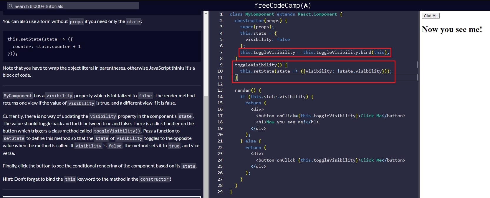
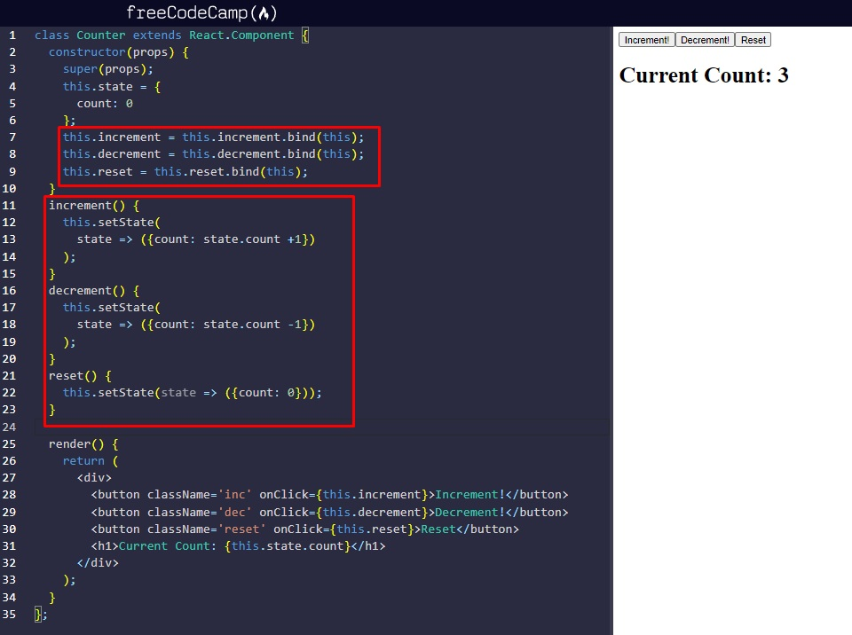
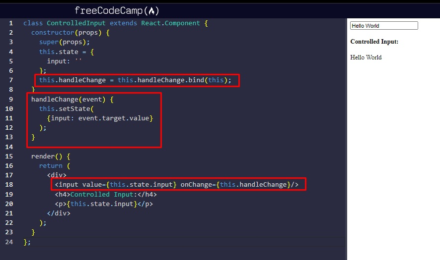
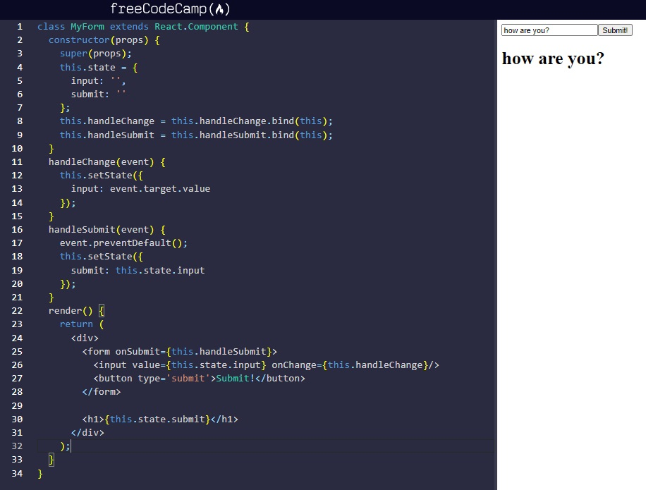

Credits / Notes taken from:

- [1h48m React JS Crash Course 2021 - Traversy Media](https://youtu.be/w7ejDZ8SWv8)

Table of Contents:

# Introduction

React runs on the client as a SPA (Single Page Application), but it can be used to build full stack apps by communicating with a server/API (eg. MERN Stack with Express/Node, or Laravel API, Django API, etc.)

React is often referred to as a front-end "framework" because it is capable and directly comparable to a framework such as Angular or Vue.


# React Course from freeCodeCamp

Notes taken from "Front End Development Libraries Certification (300 hours)":

- https://www.freecodecamp.org/learn/front-end-development-libraries/
- https://www.freecodecamp.org/learn/front-end-development-libraries/react/create-a-simple-jsx-element

<br/>

Example of JSX (React uses a syntax extension of JavaScript called JSX that allows you to write HTML directly within JavaScript).

The naming convention for all HTML attributes and event references in JSX become camelCase (eg. `className` instead of `class`, `onClick` instead of `onclick`, `onChange`, `onMouseEnter` - for hover, `onMouseLeave`). 

```html
const JSX =
  <div className="card">
    {/* Comment Example */}
    <h1>TeaHouse Budapest</h1>
    <p>Come and try our best tea sortiments:</p>
    <ul>
        <li>Tea 1</li>
        <li>Tea 2</li>
        <li>Tea 3</li>
    </ul>
  </div>;
```

To put comments inside JSX, you use the syntax `{/* */}` to wrap around the comment text.

<br/>

**Render JSX code to HTML:**

With React, we can render this JSX directly to the HTML DOM using React's rendering API known as ReactDOM.

ReactDOM offers a simple method to render React elements to the DOM which looks like this: `ReactDOM.render(componentToRender, targetNode)`, where the first argument is the React element or component that you want to render, and the second argument is the DOM node that you want to render the component to.

```html
const JSX = (
  <div>
    <h1>Hello World</h1>
    <hr/>
    <p>Lets render this to the DOM</p>
  </div>
);
ReactDOM.render(JSX, document.getElementById("challenge-node"));
```

Another example, rendering a Class component (note the use of ```<Component/>```)

```html
class TypesOfFood extends React.Component {
  constructor(props) {
    super(props);
  }
  render() {
    return (
      <div>
        <h1>Types of Food:</h1>
        <Fruits/>
        <Vegetables/>
      </div>
    );
  }
};

ReactDOM.render(<TypesOfFood/>, document.getElementById("challenge-node"));
```


<br/>

## React Components

Notes taken from: https://www.freecodecamp.org/learn/front-end-development-libraries/react/create-a-stateless-functional-component

Components are the core of React. There are two ways to create a React component: using a JavaScript function or a JavaScript Class. Component names begin with a Capital letter (and are using CamelCase).

Example of Function component:

```html
const MyComponent = function() {
  return <div>Hello</div>;
}
```

Example of Class component:

```html
class MyComponent extends React.Component {
  constructor(props) {
    super(props);
  }
  render() {
    return <div><h1>Hello React!</h1></div>;
  }
};
```

The class uses `super()` to call the constructor of the parent class, in this case `React.Component`. The constructor is a special method used during the initialization of objects that are created with the `class` keyword. It is best practice to call a component's `constructor` with `super`, and pass `props` to both. This makes sure the component is initialized properly. For now, know that it is standard for this code to be included. 

Another example (with a component within a component)

```html
const ChildComponent = () => {
  return (
    <div>
      <p>I am the child</p>
    </div>
  );
};

class ParentComponent extends React.Component {
  constructor(props) {
    super(props);
  }
  render() {
    return (
      <div>
        <h1>I am the parent</h1>
        <ChildComponent/>
      </div>
    );
  }
};
```

<br/>


## React Props

https://www.freecodecamp.org/learn/front-end-development-libraries/react/pass-props-to-a-stateless-functional-component

In React, you can pass props, or properties, to child components. Say you have an `App` component which renders a child component called `Welcome` which is a stateless functional component. You can pass `Welcome` a `user` property by writing:

```jsx
<App>
  <Welcome user='Mark' />
</App>
```

You use **custom HTML attributes** created by you and supported by React to be passed to the component. In this case, the created property `user` is passed to the component `Welcome`. Since `Welcome` is a stateless functional component, it has access to this value like so:

```jsx
const Welcome = (props) => <h1>Hello, {props.user}!</h1>
```

It is standard to call this value `props` and when dealing with stateless functional components, you basically consider it as an argument to a function which returns JSX. You can access the value of the argument in the function body. With class components, you will see this is a little different.

<br/>

Example:

```jsx
const CurrentDate = (props) => {
  return (
    <div>
      <p>The current date is: {props.date} </p>
    </div>
  );
};

class Calendar extends React.Component {
  constructor(props) {
    super(props);
  }
  render() {
    return (
      <div>
        <h3>What date is it?</h3>
        <CurrentDate date={Date()}/>
      </div>
    );
  }
};
```

Output:

```
What date is it?
The current date is: Sun Dec 26 2021 11:06:55 GMT+0200 (Eastern European Standard Time)
```


<br/>

Another example:

```jsx
const List = (props) => {
  return <p>{props.tasks.join(', ')}</p>
};

class ToDo extends React.Component {
  constructor(props) {
    super(props);
  }
  render() {
    return (
      <div>
        <h1>To Do Lists</h1>
        <h2>Today</h2>
        <List tasks={["Learn React", "Cook cookies"]}/>
        <h2>Tomorrow</h2>
        <List tasks={["Buy Gifts", "Decorate tree"]}/>
      </div>
    );
  }
};
```

Output:

```
To Do Lists
Today
Learn React, Cook cookies

Tomorrow
Buy Gifts, Decorate tree
```

<br/>

**Default props**

You can assign default props to a component as a property on the component itself and React assigns the default prop if necessary. This allows you to specify what a prop value should be if no value is explicitly provided. For example, if you declare `MyComponent.defaultProps = { location: 'San Francisco' }`.

Example:

```jsx
const Items = (props) => {
  return <h1>Current Quantity of Items in Cart: {props.quantity}</h1>
}

Items.defaultProps = {
  quantity: 0
}

class ShoppingCart extends React.Component {
  constructor(props) {
    super(props);
  }
  render() {
    return <Items quantity={10}/>
  }
};
```

```
Current Quantity of Items in Cart: 10
```

<br/>

**Type Checking Props**

https://www.freecodecamp.org/learn/front-end-development-libraries/react/use-proptypes-to-define-the-props-you-expect

React provides useful type-checking features to verify that components receive props of the correct type. For example, your application makes an API call to retrieve data that you expect to be in an array, which is then passed to a component as a prop. You can set `propTypes` on your component to require the data to be of type `array`. This will throw a useful warning when the data is of any other type.

It's considered a best practice to set `propTypes` when you know the type of a prop ahead of time:

```js
MyComponent.propTypes = { handleClick: PropTypes.func.isRequired }
```

In the example above, the `PropTypes.func` part checks that `handleClick` is a function. Adding `isRequired` tells React that `handleClick` is a required property for that component. You will see a warning if that prop isn't provided. Also notice that `func` represents `function`. Among the seven JavaScript primitive types, `function` and `boolean` (written as `bool`) are the only two that use unusual spelling. In addition to the primitive types, there are other types available. For example, you can check that a prop is a React element. Please refer to the [documentation](https://reactjs.org/docs/typechecking-with-proptypes.html#proptypes) for all of the options.

<br/>

Example:

```jsx
const Items = (props) => {
  return <h1>Current Quantity of Items in Cart: {props.quantity}</h1>
};

Items.propTypes = {
  quantity: PropTypes.number.isRequired
};

Items.defaultProps = {
  quantity: 0
};

class ShoppingCart extends React.Component {
  constructor(props) {
    super(props);
  }
  render() {
    return <Items />
  }
};
```


<br/>

**Note:** If the child component that you're passing a prop to is an ES6 **class** component, rather than a stateless **functional** component, you need to use `this` keyword to access the props within that class component. For example, if an ES6 class component has a prop called `data`, you write `{this.props.data}` in JSX.

Example:

```jsx
class App extends React.Component {
  constructor(props) {
    super(props);

  }
  render() {
    return (
        <div>
            <Welcome name={"Alex"}/>
        </div>
    );
  }
};

class Welcome extends React.Component {
  constructor(props) {
    super(props);
  }
  render() {
    return (
        <div>
          <p>Hello, <strong>{this.props.name}</strong>!</p>
        </div>
    );
  }
};
```

```
Hello, Alex!
```

<br/>

Another example:

```jsx
class CampSite extends React.Component {
  constructor(props) {
    super(props);
  }
  render() {
    return (
      <div>
        <Camper/>
      </div>
    );
  }
};

class Camper extends React.Component {
  constructor(props) {
    super(props);
  }
  render() {
    return <p>{this.props.name}</p>;
  }
}

Camper.propTypes = {
  name: PropTypes.string.isRequired
}

Camper.defaultProps =  {
  name: "CamperBot"
};
```


<br/>

## React states

https://www.freecodecamp.org/learn/front-end-development-libraries/react/create-a-stateful-component

State consists of any data your application needs to know about, that can change over time. You want your apps to respond to state changes and present an updated UI when necessary. 

You create state in a React component by declaring a `state` property on the component class in its `constructor`. This initializes the component with `state` when it is created. The `state` property must be set to a JavaScript `object`. Declaring it looks like this:

```jsx
this.state = {

}
```

You have access to the `state` object throughout the life of your component. You can update it, render it in your UI, and pass it as props to child components. The `state` object can be as complex or as simple as you need it to be. Note that you must create a class component by extending `React.Component` in order to create `state` like this.

Example:

```jsx
class MyComponent extends React.Component {
  constructor(props) {
    super(props);
    this.state = {
      name: 'freeCodeCamp'
    }
  }
  render() {
    return (
      <div>
        <h1>{this.state.name}</h1>
      </div>
    );
  }
};
```

```
freeCodeCamp
```

<br/>

Example 2 (using React `setState`):

```jsx
class MyComponent extends React.Component {
  constructor(props) {
    super(props);
    this.state = {
      name: 'Initial State'
    };
    {/* explicitly bind "this" keyword to the handleClick() method, otherwise this will be undefined */}
    this.handleClick = this.handleClick.bind(this);
  }
  handleClick() {
    this.setState({name: "React Rocks!"});
  }
  render() {
    return (
      <div>
        <button onClick={this.handleClick}>Click Me</button>
        <h1>{this.state.name}</h1>
      </div>
    );
  }
};
```

<br/>

Example 3 (toggle the visibility of a `<div>`)

```jsx
class MyComponent extends React.Component {
  constructor(props) {
    super(props);
    this.state = {
      visibility: false
    };
    this.toggleVisibility = this.toggleVisibility.bind(this);
  }
  toggleVisibility() {
    this.setState(state => ({visibility: !state.visibility}));
  }
  
  render() {
    if (this.state.visibility) {
      return (
        <div>
          <button onClick={this.toggleVisibility}>Click Me</button>
          <h1>Now you see me!</h1>
        </div>
      );
    } else {
      return (
        <div>
          <button onClick={this.toggleVisibility}>Click Me</button>
        </div>
      );
    }
  }
}
```



<br/>

Example 4: Simple counter

```jsx
class Counter extends React.Component {
  constructor(props) {
    super(props);
    this.state = {
      count: 0
    };
    this.increment = this.increment.bind(this);
    this.decrement = this.decrement.bind(this);
    this.reset = this.reset.bind(this);
  }
  increment() {
    this.setState(
      state => ({count: state.count +1})
    );
  }
  decrement() {
    this.setState(
      state => ({count: state.count -1})
    );
  }
  reset() {
    this.setState(state => ({count: 0}));
  }

  render() {
    return (
      <div>
        <button className='inc' onClick={this.increment}>Increment!</button>
        <button className='dec' onClick={this.decrement}>Decrement!</button>
        <button className='reset' onClick={this.reset}>Reset</button>
        <h1>Current Count: {this.state.count}</h1>
      </div>
    );
  }
};
```



<br/>

### User input

Example 5: Get String from user input using states

```jsx
class ControlledInput extends React.Component {
  constructor(props) {
    super(props);
    this.state = {
      input: ''
    };
    this.handleChange = this.handleChange.bind(this);
  }
  handleChange(event) {  
    this.setState(
      {input: event.target.value}
    );
  }

  render() {
    return (
      <div>
        <input value={this.state.input} onChange={this.handleChange}/>
        <h4>Controlled Input:</h4>
        <p>{this.state.input}</p>
      </div>
    );
  }
};
```



Save input text to a `state.submit` String (and show/render the String in a h1 tag on subbmit):

```jsx
class MyForm extends React.Component {
  constructor(props) {
    super(props);
    this.state = {
      input: '',
      submit: ''
    };
    this.handleChange = this.handleChange.bind(this);
    this.handleSubmit = this.handleSubmit.bind(this);
  }
  handleChange(event) {
    this.setState({
      input: event.target.value
    });
  }
  handleSubmit(event) {
    event.preventDefault();
    this.setState({
      submit: this.state.input
    });
  }
  render() {
    return (
      <div>
        <form onSubmit={this.handleSubmit}>
          <input value={this.state.input} onChange={this.handleChange}/>
          <button type='submit'>Submit!</button>
        </form>

        <h1>{this.state.submit}</h1>
      </div>
    );
  }
}
```



<br/>

