# React Fundamentals

## Credits / Notes taken from:
- [10h7m Full React Course 2020 - Fundamentals, Hooks, Context API, React Router, Custom Hooks from freeCodeCamp](https://youtu.be/4UZrsTqkcW4)
- [w3schools React Tutorial](https://www.w3schools.com/react/default.asp)
- [React Official Documentation](https://www.w3schools.com/react/default.asp)

## Contents


## Requirements:

- Some JavaScript Knowledge, you can refer to my [JavaScript Notes](../JavaScript/JavaScriptBeginners.md)
- Installation of Node.js and a Text Editor, you can follow [my first React notes here](../React/React-ToDoApp.md)


## NPM Basics and Create-React-App
- `npm init` - creates package.json (manifest) file and list dependencies<br/>
When we share/upload a Node app to GitHub, we usually just include `package.json`, without large-sized `node_modules` folder where all the files from the installed modules are stored. To restore the `node_modules` folder, we just need to run `npm install` in our local project.
- `npm install <package_name> --save` - Install package locally (default) and add to package.json<br/>
Example: `npm install bootstrap --save`
- `npm install <package_name> -g` - Install package globally (access it anywhere, not only current project)<br/>
Example: `sudo npm install gatsby-cli -g`
- `npm install <package_name> --save-dev` (used only in development, for testing, once we ship the application into production, the package is not longer needed)
<br/><br/>
- `npx create-react-app my-app` will do all the *"heavy lifting"* for your Node/React application, it will install automatically (locally) all the dependencies needed for a React application. Create-React-App uses [Babel](https://babeljs.io/) behind the scenes.

## Hello World (First component) in React
- You can delete these files: `App.css`, `App.js`, `App.test.js`, `index.css`, `logo.svg`, `serviceWorked` and `setupTests`
- Keep in mind that our main component is `<div id="root">` from our `./public/index.html`
- You cand delete everything in index.js and write:

```js
// index.js
import React from 'react'
import ReactDom from 'react-dom'

function Greeting() {
  return <h2>This is my first component</h2>;
}

/* Or we can create an element using React:
const Greeting = () => {
  return React.createElement('h1', {}, 'hello world');
};
*/

ReactDom.render(<Greeting/>, document.getElementById('root'));


// Now open terminal and:
>> npm start
```

If we have more elements (tags), we can write:
```js
import React from 'react'
import ReactDom from 'react-dom'

function Greeting() {
  return (
    <div>
      <h1>Hello world</h1>
    </div>
  );
}

// Or (under the hood):
const Greeting = () => {
  return React.createElement(
    'div',
    {}, 
    React.createElement('h1', {}, 'Hello World')
  );
};

ReactDom.render(<Greeting/>, document.getElementById('root'));
```
We observe than using JSX (first method) is easier and more readable for making components.<br/>
**Short JSX Rules:**
- We must return a single element (only one `<div></div>` or a `section`/`article`/`React Fragment`)
- Use camelCase for html attributes
- Use `className` instead of `class`
- close every element (even we have `, we need to use `
      <p>Main component</p>
      <Person />
      <Message />
    </div>
  );
}

const Person = () => <h2>child component</h2>;
const Message = () => {
  return <p>another child component</p>;
};

ReactDOM.render(<Greeting />, document.getElementById("root"));
```
Our component structure will look like this:
- Greeting (Main)
  - Person
  - Message

**A real-world simple example with nested components**:
```js
// index.js
import React from "react";
import ReactDOM from "react-dom";

function BookList() {
  return (
    <section>
      <Book />
      <Book />
    </section>
  );
}

const Book = () => {
  return (
    <article className="book">
      
      <BookTitle />
      <BookAuthor />
    </article>
  );
};

const BookTitle = () => {
  return <h2>12 Rules for Life</h2>;
};

const BookAuthor = () => {
  return <h4>Jordan B. Peterson</h4>;
};

ReactDOM.render(<BookList />, document.getElementById("root"));
```
Our component structure will look like this:
- BookList
  - Book
    - BookTitle
    - BookAuthor
  - Book
    - BookTitle
    - BookAuthor


## Add CSS to our React components (from index.css or in JSX)

```CSS
/* index.css */
* {
  margin: 0;
  padding: 0;
  box-sizing: border-box;
}

body {
  font-family: -apple-system, BlinkMacSystemFont, "Segoe UI", Roboto, Oxygen,
    Ubuntu, Cantarell, "Open Sans", "Helvetica Neue", sans-serif;
  background: #e0e0e0;
  min-height: 100vh;
}

.booklist {
  padding: 2rem 3rem 4rem 3rem;
  display: flex;
  gap: 2rem;
  flex-wrap: wrap;
  justify-content: center;
}

.book {
  background: #fff;
  border-radius: 1rem;
  padding: 1rem 3rem;
}

.book img {
  max-width: 10rem;
}
```

Then we import `index.css` in our `index.js`
```js
import "./index.css"; // "../" means previous folder; "./" is current/same folder

function BookList() {
  return (
    <section className="booklist"> // Add className to each of our components
      <Book />
      <Book />
    </section>
  );
}

// Or we can add CSS directly into our JSX code as an object
// one pair of brackes is for JavaScript, another pair is for object {{}}
const BookTitle = () => {
  return <h2 style={{ color: "#263B44FF", marginTop: "0.25rem"}}>
    12 Rules for Life
  </h2>;
};

```


## JavaScript JSX, variables and props
We can write variables inside or outside of function components:
```js
const title = "The Brothers Karamazov";
const img = "https://images-na.ssl-images-amazon.com/images/I/51FIyYKsCXL._SX333_BO1,204,203,200_.jpg"
const Book = () => {
  const author = "Fyodor Dostoevsky";
  return (
    <article className="book">
      
      <h2>{title}</h2>
      <h4>{author.toUpperCase()}</h4>
      <p>{6 + 6}</p>
    </article>
  );
};
```
<br/><br/>
However,<br/>

`Book` is a function, so we can give it parameters (we use `props` as convention, meaning properties in React):

```js
const Book = (props) => {
  return (
    <article className="book">
      
      <h2>{props.title}</h2>
      <h4>{props.author}</h4>
    </article>
  );
};
```
And we pass the parameters we want inside our main/upper component (`BookList` here) as an object:

```js
function BookList() {
  return (
    <section className="booklist">
      <Book
        title="The Brothers Karamazov"
        author="Fyodor Dostoevsky"
        img="https://images-na.ssl-images-amazon.com/images/I/51FIyYKsCXL._SX333_BO1,204,203,200_.jpg"
      />
      <Book
        title="12 Rules for Life"
        author="Jordan B. Peterson"
        img="https://images-na.ssl-images-amazon.com/images/I/41LtJtWn9OL._SX331_BO1,204,203,200_.jpg"
      />
    </section>
  );
}
```
This will be the result so far:<br/>
<p align="center"></p>

<br/><br/>
Also, inside our `Book` function, if we don't want to repeat `props` var name, we can use ***JavaScript Destructuring***:

```js
const Book = (props) => {
  const { img, title, author } = props;
  return (
    <article className="book">
      
      <h2>{title}</h2>
      <h4>{author}</h4>
    </article>
  );
};

// However, we don't even need to specify "props" object
/* We know that the parameter will eb an object, 
   so we can get it's properties right away */
const Book = ({ img, title, author }) => {
  return (
    <article className="book">
      
      <h2>{title}</h2>
      <h4>{author}</h4>
    </article>
  );
};
```


## Props: `children` keyword as parameter in function component 
If we add more properties directly in our Main Component ("BookList" here) without naming them, we can include a `children` parameter in our "Book" sub-component function (in order to render it):

```js
// index.js
var secondBook = {
  title: "12 Rules for Life",
  author: "Jordan B. Peterson",
  img: "https://images-na.ssl-images-amazon.com/images/I/41LtJtWn9OL._SX331_BO1,204,203,200_.jpg",
};

function BookList() {
  return (
    <section className="booklist">
      <Book
        title={firstBook.title}
        author={firstBook.author}
        img={firstBook.img}
      >
        <p>
          Lorem ipsum dolor sit amet, consectetur adipiscing elit. Curabitur
          malesuada fermentum pharetra.
        </p>
      </Book>
      <Book
        title={secondBook.title}
        author={secondBook.author}
        img={secondBook.img}
      />
    </section>
  );
}

const Book = ({ img, title, author, children }) => {
  return (
    <article className="book">
      
      <h2>{title}</h2>
      <h4>{author}</h4>
      <p>{children}</p>
    </article>
  );
};
```


## Rewrite our dummy data as a simple list of objects and Iterate through it with `map()`
We can put all our books objects in a simple (global) `Array [ ]` called `books`:

```js
// index.js
var books = [
  {
    title: "The Brothers Karamazov",
    author: "Fyodor Dostoevsky",
    img:
      "https://images-na.ssl-images-amazon.com/images/I/51FIyYKsCXL._SX333_BO1,204,203,200_.jpg",
  },
  {
    title: "12 Rules for Life",
    author: "Jordan B. Peterson",
    img:
      "https://images-na.ssl-images-amazon.com/images/I/41LtJtWn9OL._SX331_BO1,204,203,200_.jpg",
  },
];
```

Then we can iterate through each object in that array in our base component (`BookList` function) using `map()` and destructuring:

```js
function BookList() {
  return (
    <section className="booklist">
      {books.map((book) => {
        return 
          <Book 
            title={book.title}
            img={book.img}
            author={book.author} 
          />;
      })}
    </section>
  );
}

// Our "Book" component will remain the same
const Book = ({ img, title, author }) => {
  return (
    <article className="book">
      
      <h2>{title}</h2>
      <h4>{author}</h4>
    </article>
  );
};
```

We can also use the ***Spread operator*** (`...`) inside our `BookList` main component, without modifying our `Book` function:

```js
function BookList() {
  return (
    <section className="booklist">
      {books.map((book) => {
        return 
          <Book 

            {...book} 
          />;
      })}
    </section>
  );
}
```


## Solve warning: Each child in a list should have a unique "key" prop
React uses the `key` property create a relationship between the component and the DOM element, so each object should have an `id`. [The library uses this relationship to determine whether or not the component should be re-rendered](https://sentry.io/answers/unique-key-prop/).

```js
// index.js
// We just need to add an id to each object in our array
var books = [
  {
    id: 1,
    title: "The Brothers Karamazov",
    ...
  },
];

// Then add key={book.id} as a return in our arrow function inside BookList()
function BookList() {
  return (
    <section className="booklist">
      {books.map((book) => {
        return 
          <Book 
            key={book.id}
            {...book} 
          />;
      })}
    </section>
  );
}
```


## React Event Basics
Complete List of events from documentation: [here](https://reactjs.org/docs/events.html).<br/>
The main two components of an event is: **attribute** and **eventHandler**.

- ***onClick*** event:
Add a `<button>` with an `onClick` event, and a new `const (arrow) function` to handle that event:

```js
const Book = ({ img, title, author }) => {
  const clickHandler = () => {
    alert(title);
  };
  return (
    <article className="book">
      
      <h2>{title}</h2>
      <h4>{author}</h4>
      <button type="button" onClick={clickHandler}>
        See description
      </button>
    </article>
  );
};
```

<p align="center"></p>

[But what happens if we want to pass an argument to our outside Handler function (timestamp:3h5m)?](https://youtu.be/4UZrsTqkcW4?t=11121) The Handler functions (with a passed argument) will execute all at once when first opening the page! To solve this we need to pass an arrow function with the argument we want as an argument:

```js
// Our Handler function is outside our Book() component
const complexClickHandler = (author) => {
  alert(author);
};

const Book = ({ img, title, author }) => {
  return (
    <article className="book">
      
      <h2>{title}</h2>
      <h4>{author}</h4>
      <button type="button" onClick={() => complexClickHandler(author)}>
        See description
      </button>
    </article>
  );
};
```

- ***onMouseOver*** event:

```js
const Book = ({ img, title, author }) => {
  const clickHandler = () => {
    console.log(title);
  };

  return (
    <article className="book">
      
      <h2>{title}</h2>
      <h4>{author}</h4>
      <button type="button" onMouseOver={clickHandler}>
        See description
      </button>
    </article>
  );
};
```


## Import and Export modules (JavaScript ES6)

We can split our functionalities in separate files instead of putting them all together in `index.js`.<br/>
We can create a new folder `./src/components` with `BookItem.js`, and a new file `booksData.js` where we'll store our dummy data books (array)
  - `./src/components/BookItem.js`
  - `./src/booksData.js`

In `./src/booksData.js` we will cut and paste our array and add `export`:

```js
// booksData.js
export const books = [
  {
    id: 1,
    title: "The Brothers Karamazov",
    author: "Fyodor Dostoevsky",
    img:
      "https://images-na.ssl-images-amazon.com/images/I/51FIyYKsCXL._SX333_BO1,204,203,200_.jpg",
  },
  {
    id: 2,
    title: "12 Rules for Life",
    author: "Jordan B. Peterson",
    img:
      "https://images-na.ssl-images-amazon.com/images/I/41LtJtWn9OL._SX331_BO1,204,203,200_.jpg",
  },
  {
    id: 3,
    title: "Beyond Good and Evil",
    author: "Friedrich Nietzsche",
    img:
      "https://images-na.ssl-images-amazon.com/images/I/412Nd1QaikL._SX322_BO1,204,203,200_.jpg",
  },
  {
    id: 4,
    title: "Atomic Habits",
    author: "James Clear",
    img:
      "https://images-na.ssl-images-amazon.com/images/I/412gUd3iiKL._SX331_BO1,204,203,200_.jpg",
  },
];
```

In `./src/components/BookItem.js` we will have:

```js
import React from "react";

const Book = ({ img, title, author }) => {
  const clickHandler = () => {
    alert(title);
  };
  return (
    <article className="book">
      
      <h2>{title}</h2>
      <h4>{author}</h4>
      <button type="button" onClick={clickHandler}>
        See description
      </button>
    </article>
  );
};

export default Book;

```

Note, we can only have ***one*** `default export` per `.js` file. However, it is good practice to keep the component name `Book` same as our `.js` file name (here we have `BookItem.js` instead of `Book.js`)<br/><br/>

In our main `./src/index.js` we will import these new files (for `.js` files, we don't have to specify the extension):

```js
// index.js
import {books} from './booksData'
import Book from "./components/BookItem";
import "./index.css";
```

Note that we use ***curly brackets {}*** for exports that aren't `default` (like our `books` array from our `booksData.js`).


## Basic React Hooks: `useState` and `useEffect`
- [Other examples of hooks](https://reactjs.org/docs/hooks-reference.html): `useContext/Context API`, `useReducer`, `useCallback`, `useMemo`, `useRef`, `useImerativeHandle`, `useLayoutEffect`.
- More React concepts: `Conditional Rendering`, `Forms`, `Prop Drilling`, `React Router`

## `useState`

By default, if I try to change the `<h2>{title}</h2>` title directly using a Handler function (by clicking a button), the component **will not re-render** with the new title.

```js
const ErrorExample = () => {
  let title = 'random title';

  const handleClick = () => {
    title = 'hello people';
    console.log(title);
  };
  return (
    <React.Fragment>
      <h2>{title}</h2>
      <button type='button' onClick={handleClick}>
        change title
      </button>
    </React.Fragment>
  );
};
```

Therefore we need to use `useState()`.<br/>
`usetState()` returns two parameters: 
- the value given from its parameter and a special function which **will be used as a handler**.

  ```js
  const UseStateBasics = () => {
    console.log(useState('hello')); // the Parameter could be a number/string/boolean/array/etc
    const value = useState()[0]; // value = 'hello'
    const handler = useState()[1]; // a function
    console.log(value, handler);
  };
  ```

Therefore, in order to change our `<h2>` title by pressing a button (call the Handler function) and **re-render** the component, we must import and use `useState`

```js
import React, { useState } from 'react';

const UseStateBasics = () => {
  const [text, setText] = useState('random title'); // We used array destructuring
  const handleClick = () => {
    setText('hello world');
  };

  return (
    <React.Fragment>
      <h1>{text}</h1>
      <button type='button' onClick={handleClick}>
        change title
      </button>
    </React.Fragment>
  );
};

export default UseStateBasics;
```

<p align="center"></p>

However, there are some **rules** while using `useState()` (or other hooks):
- the hook functions name starts with `use` (`useState`, `useEffect`, `useRef`, `useReducer`, `useCallback`, etc)
- component function name must be uppercase (here we used a component named `UseStateBasics`)
- hooks functions must be invoked inside function/component body
- we don't call hooks conditionally
- name convention for the returned function Handler from a hook (`useState`) should be `setSth`


### `useState` Array with Data objects Example

We'll have a list of items coming from a dummy data:
  - we are rendering/showing each element from the list
  - we have a button that will render a clear list (with all items removed)
  - each item has a button next to it to its removal
    - don't forget that we need to pass an arrow function in order to call the handler (from useState) only when we are pressing the button, if we called the handler directly, the handler will be executed for all items after opening/refreshing the page.

```js
const data = [
  { id: 1, name: 'john' },
  { id: 2, name: 'peter' },
  { id: 3, name: 'susan' },
  { id: 4, name: 'anna' },
];

import React from 'react';

const UseStateArray = () => {
  const [people, setPeople] = React.useState(data); // We pass an array with objects

  const removeItem = (id) => {
    // We filter the array and showing all the items that don't have the matching id set as parameter
    let newPeople = people.filter(  (person) => person.id !== id  );
    setPeople(newPeople);
  };
  return (
    <div>
      {people.map((person) => {
        const { id, name } = person;
        return (
          <div key={id} className='item'>
            <h4>{name}</h4>
            <button onClick={() => removeItem(id)}>remove</button> // arrow function that returns a call to handler
          </div>
        );
      })}
      <button className='btn' onClick={() => setPeople([])}> // We render an empty array for our re-rendered empty list
        clear items
      </button>
    <div/>
  );
};

export default UseStateArray;
```

<p align="center">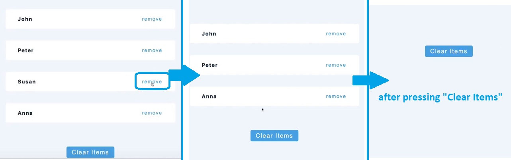</p>

Also, as we will see in **Counter example**, we can write our `removeItem` function in order to be more explicit, by writing another sub-function as parameter when calling `setPeople` handler:

```js
const UseStateArray = () => {
  const [people, setPeople] = React.useState(data);

  const removeItem = (id) => {
    setPeople((oldPeople) => {
      let newPeople = oldPeople.filter( (person) => person.id !== id );
      return newPeople;
    });
  };

  return ( 
    <div>...</div>
  )
```


### `useState` with a single object example

The problem while using a single object and we want to change (and display with re-render) a property, the whole object will disappear

```js
/* BAD EXAMPLE */
const UseStateObject = () => {
  const [person, setPerson] = useState({
    name: 'peter',
    age: 24,
    message: 'random message',
  });
  const changeMessage = () => {
    setPerson('hello world');  // THIS WILL NOT WORK, It will wipe out the data
    // SEE PICTURE BELLOW
  };
  return (
    <>
      <h3>{person.name}</h3>
      <h3>{person.age}</h3>
      <h4>{person.message}</h4>
      <button className='btn' onClick={changeMessage}>
        change message
      </button>
    </>
  );
};
/* BAD EXAMPLE */
```

<p align="center">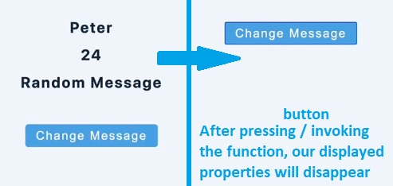</p>

```js
const UseStateObject = () => {
  const [person, setPerson] = useState({
    name: 'peter',
    age: 24,
    message: 'random message',
  });

  /* METHOD 2 - We create a setHandler for every property */
  // const [name,setName] = useState('peter')
  // const [age,setAge] = useState(24)
  // const [message,setMessage] = useState('random message')

  const changeMessage = () => {
    /* METHOD 1 */
    // We use the spread operator to leave the old values as they are, but we'll only change the message
    setPerson({ ...person, message: 'hello world' });

    /* METHOD 2 */
    // setMessage('hello world')
  };

  return (
    <>
      <h3>{person.name}</h3>
      <h3>{person.age}</h3>
      <h4>{person.message}</h4>
      <button className='btn' onClick={changeMessage}>
        change message
      </button>
    </>
  );
};
```

<p align="center"></p>


### `useState` simple Counter example

Preparing our UI and setting initial value `0` in our `useState()`:

<p align="center">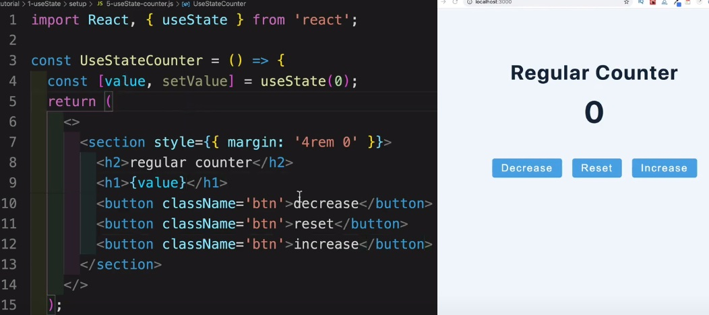</p>

Complete code:

```js
import React, { useState } from 'react';

const UseStateCounter = () => {
  const [value, setValue] = useState(0);

  const reset = () => {
    setValue(0);
  };

  return (
    <>
      <section style={{ margin: '4rem 0' }}>
        <h2>regular counter</h2>
        <h1>{value}</h1>
        <button className='btn' onClick={() => setValue(value - 1)}>
          Decrease
        </button>
        <button className='btn' onClick={reset}>
          Reset
        </button>
        <button className='btn' onClick={() => setValue(value + 1)}>
          Increase
        </button>
      </section>
     </>
  );
};

export default UseStateCounter;
```

<p align="center">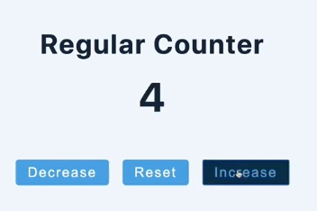</p>


### `useState` complex Counter example with a delay of two seconds:

We are using JavaScript's built-in `setTimer(value, milisec)` function, where we pass `value=setValueHandler` and `milisec=2000` (eg: from `setTimer(2, 2000)` to `setTimer( ()=>{setValue(value+1)}, 2000)`).

```js
const UseStateCounter = () => {
  const [value, setValue] = useState(0);

/* // THIS WILL NOT WORK IF USER WILL PRESS THE BUTTON MULTIPLE TIMES WITHIN 2 SECONDS
  const complexIncrease = () => {
    setTimeout(() => {
      setValue(value + 1); // setValue function is asynchronous, if we click 3 times within 2s it will take only the current value
      }, 2000);
  };
*/

  const complexIncrease = () => {
    setTimeout(() => {
      setValue((prevState) => { // Instead of passing directly the current value
        return prevState + 1;   // we pass another function
      });
    }, 2000);
  };

  return (
    <>
      <section style={{ margin: "4rem 0" }}>
        <h2>more complex counter</h2>
        <h1>{value}</h1>
        <button className="btn" onClick={complexIncrease}>
          increase later
        </button>
      </section>
    </>
  );
};
```

<p align="center"></p>


## [`useEffect`](https://reactjs.org/docs/hooks-reference.html#useeffect)

`useEffect` function will run (by default) after every re-render (after every call of a `setHandler` function returned from the `useState()` hook).<br/>
<br/>

Simple example: Every time we increase a counter by clicking a button, **we will change our page title with the current counter value**:

```js
import React, { useState, useEffect } from 'react';

const UseEffectBasics = () => {
  const [value, setValue] = useState(0);
  useEffect(() => {
    // console.log('call useEffect');
    if (value > 0) {
      document.title = `New Messages(${value})`;
    }
  });

  // console.log('render component');
  return (
    <>
      <h1>{value}</h1>
      <button className='btn' onClick={() => setValue(value + 1)}>
        click me
      </button>
    </>
  );
};

export default UseEffectBasics;
```

<p align="center"></p>

### `useEffect` second parameter: trigger an effect conditionally

However, we can fire an ***effect*** conditionally. For example, if we add an empty array as second argument, the effect from our `useEffect` hook will run only when page loads/refresh.

```js
const UseEffectBasics = () => {
  const [value, setValue] = useState(0);
  useEffect(() => {
    if (value > 0) {
      document.title = `New Messages(${value})`;
    }
  }, []); // Adding empty array will make useEffect trigger only on first page load/refresh

  useEffect(() => {
    if (value > 0) {
      document.title = `New Messages(${value})`;
    }
  }, [value]); // Here useEffect will trigger every time "value" changes

  /* In the first example (without a second parameter), 
  useEffect triggered every time we re-rendered the component AND on first page load/refresh !!! */
  ...
```

**NOTE:** We can have ***as many useEffect functions*** as we want inside a component.


### `useEffect` Cleanup Function

Without a return on `useEffect`, the function `window.addEvenListener` will trigger every time we resize the window without removing it with `window.removeEventListener`... However we can return an arrow function with the `window.removeEventListener` as a clean-up after every effect.

```js
const UseEffectCleanup = () => {
  const [size, setSize] = useState(window.innerWidth);

  const checkSize = () => {
    setSize(window.innerWidth);
  };

  useEffect(() => {
    console.log('useEffect');
    window.addEventListener('resize', checkSize);
    return () => {
      console.log('cleanup');
      window.removeEventListener('resize', checkSize);
    };
  }, []);
  console.log('render');
  return (
    <>
      <h1>window</h1>
      <h2>{size} PX</h2>
    </>
  );
};
```


### `useEffect` to fetch data (eg. GitHub users)

We will render in real-time the data (users) we fetch from an API.

```js
import React, { useState, useEffect } from 'react';
const url = 'https://api.github.com/users';

const UseEffectFetchData = () => {
  const [users, setUsers] = useState([]);

  const getUsers = async () => {
    const response = await fetch(url);
    const users = await response.json();
    setUsers(users);
    // console.log(users);
  };

  useEffect(() => {
    getUsers();
  }, []); // IT IS VERY IMPORTANT TO RENDER THE LIST OF USER'S ONLY ON FIRST PAGE RELOAD
  // OR ELSE WE WILL CALL getUsers METHOD INFINITELY (this infinite loop will crash our browser)
  return (
    <>
      <h3>github users</h3>
      <ul className='users'>
        {users.map((user) => {
          const { id, login, avatar_url, html_url } = user;
          return (
            <li key={id}>
              
              <div>
                <h4>{login}</h4>
                <a href={html_url}>profile</a>
              </div>
            </li>
          );
        })}
      </ul>
    </>
  );
};

export default UseEffectFetchData;

```

<p align="center"></p>


<br/>

## Conditional [Component] Rendering - Display specific content based on conditions with multiple returns

```js
import React, { useState, useEffect } from 'react';
const url = 'https://api.github.com/users/radualexandrub';
const MultipleReturns = () => {
  const [isLoading, setIsLoading] = useState(true);
  const [isError, setIsError] = useState(false);
  const [user, setUser] = useState('default user');

  useEffect(() => {
    fetch(url)
      .then((resp) => {
        if (resp.status >= 200 && resp.status <= 299) {
          return resp.json();
        } else {
          setIsLoading(false);
          setIsError(true);
          throw new Error(resp.statusText);
        }
      })
      .then((user) => {
        const { loginName } = user;
        setUser(loginName);
        setIsLoading(false);
      })
      .catch((error) => console.log(error));
  }, []);

  if (isLoading) {
    return (
      <div>
        <h1>Loading...</h1>
      </div>
    );
  }
  if (isError) {
    return (
      <div>
        <h1>Error....</h1>
      </div>
    );
  }
  return (
    <div>
      <h1>{user}</h1>
    </div>
  );
};

export default MultipleReturns;
```


## JS short-circuit evaluation (return values with a condition) and Ternary operator

In React we are not allowed to write in JSX an `if` statement:

```js
/* BAD EXAMPLE - won't work*/
const MyComponent = () => {
  return <div>
    {if(condition) {console.log("Can't log that")}}
  </div>
};
/* BAD EXAMPLE */
```

But we can use ***short-circuit evaluation***:

```js
const MyComponent = () => {
  const [text, setText] = useState(''); // empty string (equivalent of false)
  const firstValue = text || 'hello world'; // will return 'hello world'
  const secondValue = text && 'hello world'; // will return ''

  return <div>
    <h1>{firstValue}</h1>
    <h1>value : {secondValue}</h1>
  </div>
};
```

This will display:

<p align="center"></p>

And **this is how we are going to use it in JSX**:

```js
// Let's say we will receive a text from a server call
// But if the text is empty, we'll directly show something else in JSX
const MyComponent = () => {
  const [text, setText] = useState(''); // empty string (equivalent of false)

  return <div>
    <h1>{text || "Text is empty, John Doe"}</h1>
    {/*Or, if the text is true, we want to display something else*/}
    <h1>{text && "Text is not empty (is true) so we'll display sth else"}</h1>
  </div>
};
```

However, we can also use **ternary operator** (`condition ? trueBlock : falseBlock`)

```js
import React from "react";

const MyComponent = () => {
  const [isError, setisError] = React.useState(false);

  return (
    <div>
      {isError ? (
        <h1>Error...</h1>
      ) : (
        <div>
          <h2>No error. Yay.</h2>
          <p>John Doe or other Data</p>
        </div>
      )}
    </div>
  );
};
```

When `isError === false`, this will render:

<p align="center"></p>


<br/>

## Show/Hide components with a button

```js
import React, { useState, useEffect } from 'react';

const ShowHide = () => {
  const [show, setShow] = useState(false);
  return (
    <>
      <button className='btn' onClick={() => setShow(!show)}>
        show/hide
      </button>
      {show && <Item />}
    </>
  );
};

const Item = () => {
  const [size, setSize] = useState(window.innerWidth);
  const checkSize = () => {
    setSize(window.innerWidth);
  };
  useEffect(() => {
    window.addEventListener('resize', checkSize);
    // We need a cleanup function every time we toggle the button
    return () => {
      window.removeEventListener('resize', checkSize);
    };
  }, []);

  return (
    <div style={{ marginTop: '2rem' }}>
      <h1>Window</h1>
      <h2>size : {size}</h2>
    </div>
  );
};
```

<p align="center">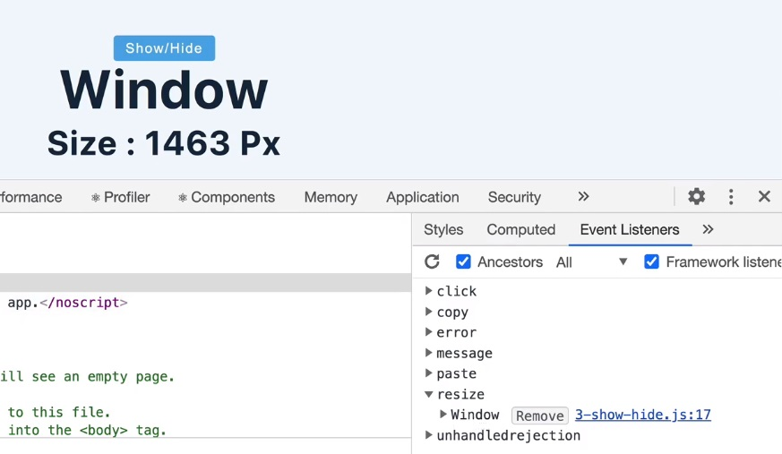</p>


<br/>

## Forms in React

### Form basics in React (User input) and `preventDefault`

Display a form:

```js
const NonFunctionalForm = () => {
  return (
    <>
      <article>
        <form className="form">
          <div className="form-control">
            <label htmlFor="firstName">Name: </label>
            <input type="text" id="firstName" name="firstName"></input>
          </div>

          <div className="form-control">
            <label htmlFor="email">Email: </label>
            <input
              type="text"
              id="email"
              name="email"
            />
          </div>
          <button type="submit">Add Person</button>
        </form>
      </article>
    </>
  );
};
```

Will render:

<p align="center">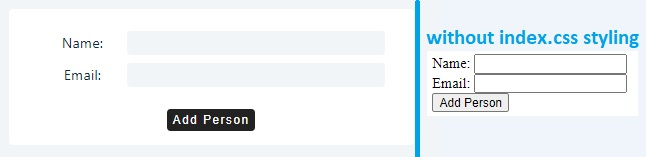</p>

We have **two methods** for submitting a form:
1. We include `onSubmit={handleSubmitFunction}` on our `<form>` tag.
2. OR; We include `onClick={handleSubmitFunction}` on out `<button>` tag.

[Form onSubmit is a more correct approach, for the simple reason that a form can also be submitted with the `ENTER` key, and not just by clicking the submit button.](https://stackoverflow.com/questions/6908187/form-onsubmit-versus-submit-button-onclick) However if we have multiple buttons ofc we'll choose the later option.

<br/>

All good.<br/>
However after we write our `handleSubmit` function, the **default behavior** of JavaScript (React included) **is to refresh/reload the page**.

```js
/* BAD EXAMPLE */
const FunctionalForm = () => {
  const handleSubmit = (e) => { // e = event object parameter
    console.log("hello"); // WILL NOT WORK
  }; // The page will log "hello" for a short period then will refresh/reload and will not log anything

  return (
    <>
      <article>
        <form className="form" onSubmit={handleSubmit}> // NOTE that we don't call the function with ()
          ...
    </>
  );
};
```

We need to overwrite the **default behavior** with `preventDefault()`. Now the page will not reload after pressing ENTER/button and will log 'hello'. ([More about the **event object**](https://www.w3schools.com/jsref/obj_event.asp))

```js
const FunctionalForm = () => {
  const handleSubmit = (e) => {
    e.preventDefault();
    console.log("hello"); 
  };
  ...
```

### Controlled inputs (functional form)

We can now add `value`s to our `<input>` fields, and also declare/define some `const` variables for each **default** value using again `useState()` (Obvious note: the *value* of the input depends on the value of *useState*). <br/>
We also need to specify and define an `onChange` method in each field's `<input>`, that has an `event (e)` parameter which is returned as parameter as `e.target.value` to our `setName` function/handler.

```js
const FunctionalForm = () => {
  const [firstName, setFirstName] = useState("");
  const [email, setEmail] = useState("");

  const handleSubmit = (e) => {
    e.preventDefault();
    console.log(firstName, email);
  };

  return (
    <>
      <article>
        <form className="form" onSubmit={handleSubmit}>
          <div className="form-control">
            <label htmlFor="firstName">Name: </label>
            <input
              type="text"
              id="firstName"
              name="firstName"
              value={firstName}
              onChange={(e) => setFirstName(e.target.value)}
            ></input>
          </div>
          <div className="form-control">
            <label htmlFor="email">Email: </label>
            <input
              type="text"
              id="email"
              name="email"
              value={email}
              onChange={(e) => setEmail(e.target.value)}
            />
          </div>
          <button type="submit">Add Person</button>
        </form>
      </article>
    </>
  );
};
```


<p align="center">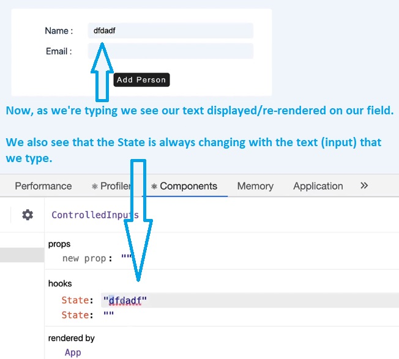</p>


### Add elements to a list via Form (step-by-step)

- We define an empty List/Array `const [peopleList, setPeopleList] = useState([]);` and we will also check them to not be empty in our `handleSubmit()` function
- We create an object in our `handleSubmit()`:

  ```js
  const FunctionalForm = () => {
    const [firstName, setFirstName] = useState('');
    const [email, setEmail] = useState('');
    const [peopleList, setPeopleList] = useState([]);

    const handleSubmit = (e) => {
      e.preventDefault();
      if (firstName && email) {
        // console.log(`${firstName}: ${email}`);
        const person = { firstName: firstName, email: email };
      }
    };
  ...
  ```
  However, if the object's keys matches the variables names (that holds the values), we can re-write (refactor) in a shorter way (JS ES6):

  ```js
    ...
    const handleSubmit = (e) => {
      e.preventDefault();
      if (firstName && email) {
        const person = { firstName, email };
      }
    };
    ...
  ```
- Then we add our new object to our `peopleList` array (along with the already-existing elements in that array using the `Spread` operator `...`)
- Then we call `setFirstName` and `setEmail` with an empty string as parameter (After user presses submit button, the form will "clear"/the text added in the form fields will be re-rendered as empty strings)

  ```js
    ...
    const handleSubmit = (e) => {
      e.preventDefault();
      if (firstName && email) {
        const person = { firstName, email };
        setPeopleList((peopleList) => {
          return [...peopleList, person];
        });
        setFirstName('');
        setEmail('');
      }
    };
    ...
  ```

<p align="center">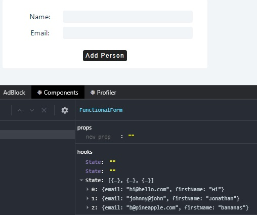</p>

- Now we can display the people we have in our `peopleList` array. We will iterate over each value using `map()`

  ```js
  <article>
    <form>
      ...
    </form>
    // Keep in mind that using `index` here is not suitable for a list where we want to remove items, we'll fix this later
    {peopleList.map((person, index) => {
      const { id, firstName, email } = person;
      return (
        <div className="item">
          <h4>{firstName}</h4>
          <p>{email}</p>
        </div>
      );
    })}
  </article>
  ```

<p align="center"></p>

- But now, React will throw the warning: ***Each child in a list should have a unique "key" prop***.<br/>
We can add an `id` in various ways: 
    - using `Math.random()` function (`0.5822776560245544`)
    - using `new Date().getTime().toString()` (`1602953600928`)
    - using a [npm package `uuid`](https://www.npmjs.com/package/uuid): `npm install uuid`, `import { v4 as uuidv4 } from 'uuid';
      uuidv4(); // ⇨ '9b1deb4d-3b7d-4bad-9bdd-2b0d7b3dcb6d'`<br/>

  We'll add this new `id` on our `handleSubmit` function when we create our `person` object.

- We'll also add this id as a `key` when we're iterating (displaying/rendering) the objects within our `peopleList` array.<br/>

Our complete component will look like this:

```js
const FunctionalForm = () => {
  const [firstName, setFirstName] = useState('');
  const [email, setEmail] = useState('');
  const [peopleList, setPeopleList] = useState([]);

  const handleSubmit = (e) => {
    e.preventDefault();
    if (firstName && email) {
      const person = { id: new Date().getTime.toString(), firstName, email };
      setPeopleList((peopleList) => {
        return [...peopleList, person];
      });
      setFirstName('');
      setEmail('');
    }
  };

  return (
    <>
      <article>
        <form className="form" onSubmit={handleSubmit}>
          <div className="form-control">
            <label htmlFor="firstName">Name: </label>
            <input
              type="text"
              id="firstName"
              name="firstName"
              value={firstName}
              onChange={(e) => setFirstName(e.target.value)}
            />
            <label htmlFor="email">Email: </label>
            <input
              type="text"
              id="email"
              name="email"
              value={email}
              onChange={(e) => setEmail(e.target.value)}
            />
          </div>
          <button type="submit">Add Person</button>
        </form>
        {peopleList.map((person) => {
          const { id, firstName, email } = person;
          return (
            <div className="item" key={id}>
              <h4>{firstName}</h4>
              <p>{email}</p>
            </div>
          );
        })}
      </article>
    </>
  );
};
```

<p align="center">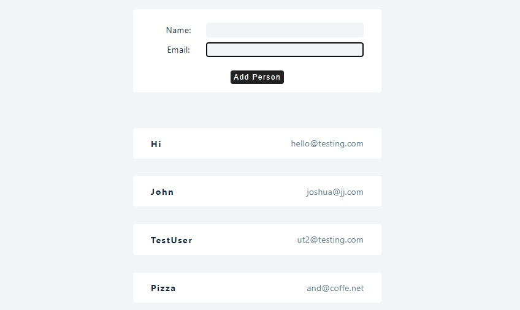</p>


### Complete Form with multiple inputs (lots of inputs)

The previous form with only 2 inputs (name and email) have lots of code, especially because we are calling the `setFunction` on every subcomponent (every field).<br/><br/>

- This time we'll define our `person` object outside our `handleSubmit` handler function: `const [person, setPerson] = useState({firstName: '', lastName: '', email:'', age:''})`
- We will also write a `handleChange` method to handle the `onChange` property of each form field.
- And also add `Person.property` as a `value` to each input field.

```js
const FunctionalForm = () => {
  const [person, setPerson] = useState({
    firstName: '',
    lastName: '',
    email: '',
    age: '',
  });
  const [peopleList, setPeopleList] = useState([]);

  const handleChange = (e) => {
    const name = e.target.name;
    const value = e.target.value;
    setPerson({ ...person, [name]: value });
  };

  const handleSubmit = (e) => {
    e.preventDefault();
    if (person.firstName && person.lastName && person.email && person.age) {
      const newPerson = { ...person, id: new Date().getTime().toString() };
      setPeopleList([...peopleList, newPerson]);
      setPerson({ firstName: '', lastName: '', email: '', age: '' });
    }
  };

  return (
    <>
      <article>
        <form className="form" onSubmit={handleSubmit}>
          <div className="form-control">
            <label htmlFor="firstName">First Name: </label>
            <input
              type="text"
              id="firstName"
              name="firstName"
              value={person.firstName}
              onChange={handleChange}
            />
            <label htmlFor="lastName">Last Name: </label>
            <input
              type="text"
              id="lastName"
              name="lastName"
              value={person.lastName}
              onChange={handleChange}
            />
            <label htmlFor="email">Email: </label>
            <input
              type="text"
              id="email"
              name="email"
              value={person.email}
              onChange={handleChange}
            />
            <label htmlFor="age">Age: </label>
            <input
              type="text"
              id="age"
              name="age"
              value={person.age}
              onChange={handleChange}
            />
          </div>
          <button type="submit">Add Person</button>
        </form>
        {peopleList.map((person) => {
          const { id, firstName, lastName, email, age } = person;
          return (
            <div className="item" key={id}>
              <h4>
                {firstName} {lastName}
              </h4>
              <p>{age} years old</p>
              <p>{email}</p>
            </div>
          );
        })}
      </article>
    </>
  );
};
```

<p align="center">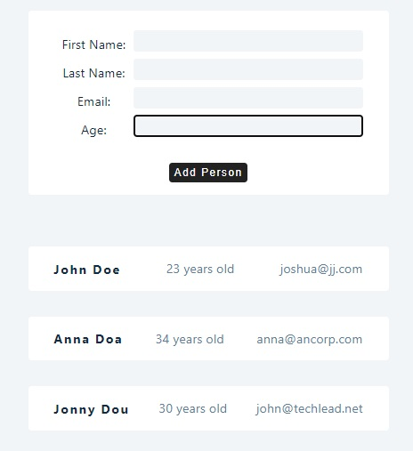</p>


## React Hooks

### `useRef` - using Uncontrolled inputs in a Form

- `useRef` is similar to (works like) `useState`: it preserves the values between the renders. But unlike useState, `useRef` DOES NOT trigger re-render!!! It is commonly used for targeting DOM nodes/elements.

```javascript
import React, { useRef } from "react";

const UseRefBasics = () => {
  const refContainer = useRef(null); // null as default value

  const handleSubmit = (e) => {
    e.preventDefault();
    console.log(refContainer.current.value);
  };
    
  return (
    <>
      <form className="form" onSubmit={handleSubmit}>
        <div>
          <input type="text" ref={refContainer} /> // add the ref attribute
        </div>
        <button type="submit">submit</button>
      </form>
    </>
  );
};

function App() {
  return (
    <div className="container">
      <UseRefBasics />
    </div>
  );
}

export default App;
```

NOTE: We are not sending a controlled input (We don't have the *state* value that is reflected in the form's input) -> We also don't call anymore a `onChange` with a `handleChange` (or `(e) => setName(e.target.value)`) method every time we type something in the (form's) input.

By using `useRef()` and adding `ref={refContainer}` property we can grab the value in the input form (after "submit" button was clicked) and store in the `refContainer.current.value`

<p align="center">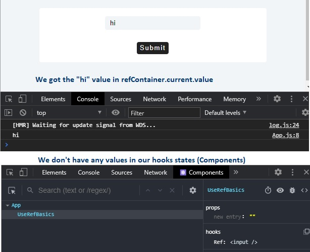</p>

<br/>

Here's an example where we use `useRef` to target DOM elements (stored in `divContainer.current`). Since `useRef` doesn't trigger re-render, we can use `useEffect()`.

```javascript
import React, { useRef, useEffect } from "react";

const UseRefBasics = () => {
  const refContainer = useRef(null);
  const divContainer = useRef(null);

  const handleSubmit = (e) => {
    e.preventDefault();
    console.log(refContainer.current.value);
  };

  useEffect(() => {
    console.log(divContainer.current);
    refContainer.current.focus();
  });

  return (
    <>
      <form className="form" onSubmit={handleSubmit}>
        <div>
          <input type="text" ref={refContainer} />
        </div>
        <button type="submit">submit</button>
      </form>
      <div ref={divContainer}>Hello World</div>
    </>
  );
};
```

As soon as we focus on the form's input, we can retrieve a specific *DOM element* (`<div>Hello World</div>` in this example), and do whatever we want with *it*. (Note that it doesn't trigger re-render and will also retrieve the DOM element only once)

<p align="center">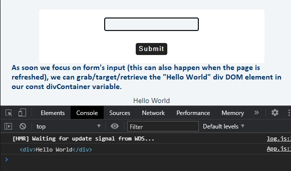</p>

<br/>

### `useReducer` - Complete example

For simple apps like ToDo's we can use `useState`. But as an app gets more complicated we use `useReducer` as it will make the code more structured.

We will use a similar example as the [Form with controlled inputs using `useState()`](#controlled-inputs-functional-form), but we will refactor it in order to use `useReducer` instead of `useState`:

<p align="center">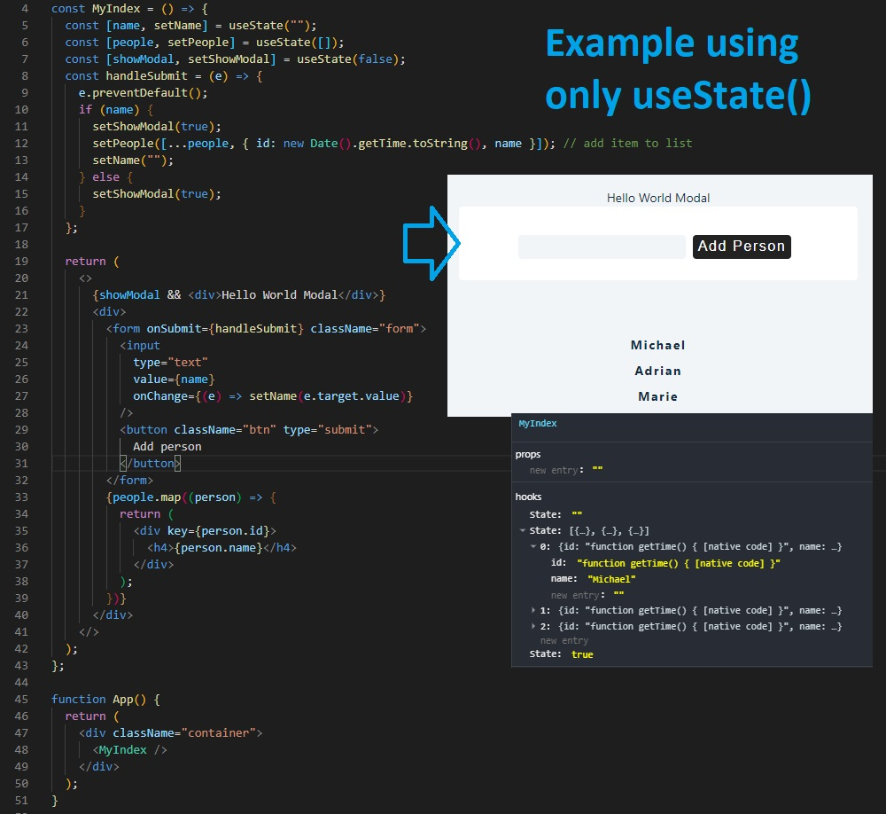</p>


For this example we will use 3 separate files placed in a folder named "userReducerExample". An `index.js` file placed in a folder will act as a main JavaScript file where all the other components within it's folder are imported.<br/>We can import (in our `App.js`) a folder that contains a `index.js` file by just specifying the path to that folder (it will be automatically interpreted as we were to type `./FolderPath/index.js`).

<p align="center">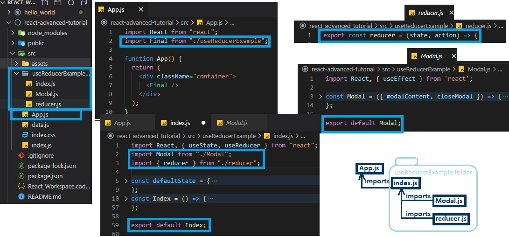</p>

<br/>

`useReducer` always takes as parameters:

- a function `reducer()` that has two arguments: `state` and `action` (this function **must** always return a state in all for every case)
- a `defaultState` object that contains, in this example:
  - the people list of persons objects (empty list by default)
  - a Boolean variable `isModalOpen` for the current state of modal (false by default)
  - a `modalContent` variable with the default string of "hello world"

For our Modal (`Modal.js`) we will return a `<div>` with `{modalContent}` message:

```javascript
// ./useReducerExample/Modal.js
import React, { useEffect } from 'react';
const Modal = ({ modalContent }) => {
  return (
    <div className='modal'>
      <p>{modalContent}</p>
    </div>
  );
};
export default Modal;
```

 Let's first write a simple (basic) example using `useReducer` that uses dummy data:

```javascript
import React, { useState, useReducer } from "react";
import Modal from "./useReducerExample/Modal";

const reducer = (state, action) => {};
const defaultState = {
  people: [
    { id: 1, name: "john" },
    { id: 2, name: "peter" },
    { id: 3, name: "anna" },
  ],
  isModalOpen: true,
  modalContent: "hello world",
};

const MyIndex = () => {
  const [name, setName] = useState("");
  const [state, dispatch] = useReducer(reducer, defaultState);
  const handleSubmit = (e) => {
    e.preventDefault();
    if (name) {
    } else {
    }
  };

  return (
    <>
      {state.isModalOpen && <Modal modalContent={state.modalContent} />}
      <div>
        <form onSubmit={handleSubmit} className="form">
          <input
            type="text"
            value={name}
            onChange={(e) => setName(e.target.value)}
          />
          <button className="btn" type="submit">
            Add person
          </button>
        </form>
        {state.people.map((person) => {
          return (
            <div key={person.id}>
              <h4>{person.name}</h4>
            </div>
          );
        })}
      </div>
    </>
  );
};

function App() {
  return (
    <div className="container">
      <MyIndex />
    </div>
  );
}

export default App;
```

Will render:

<p align="center">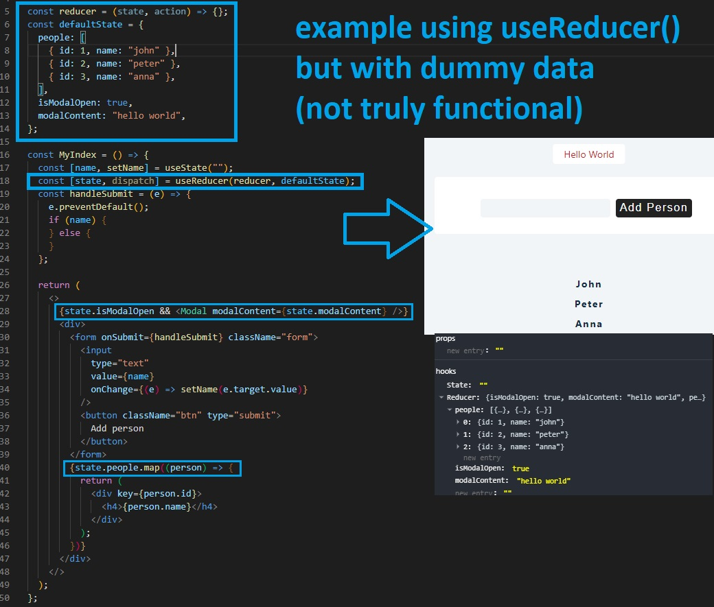</p>

(Monday, November 23, 2020)

So, by using `useReducer` we will have a state (as an object) that has multiple properties (eg. people list, modal state, modal message). With`useReducer` I can update these properties by using `dispatch` every time a specific `action` happens.

([Complete explanation for following code here: React Full Course 7h37m](https://youtu.be/4UZrsTqkcW4?t=27429))

Code to just **add and display** an item to a list using `useReducer()`:

```javascript
const reducer = (state, action) => {
  if (action.type === "ADD_ITEM") {
    const newItems = [...state.people, action.payload];
    return {
      ...state,
      people: newItems,
      isModalOpen: true,
      modalContent: "Item added",
    };
  } else if (action.type === "NO_VALUE") {
    return {
      ...state,
      isModalOpen: true,
      modalContent: "Can't add empty values!",
    };
  }

  throw new Error("No matching action type in useReducer");
};
const defaultState = {
  people: [],
  isModalOpen: false,
  modalContent: "hello world",
};

const MyIndex = () => {
  const [name, setName] = useState("");
  const [state, dispatch] = useReducer(reducer, defaultState);
  const handleSubmit = (e) => {
    e.preventDefault();
    if (name) {
      const newItem = { id: new Date().getTime().toString(), name };
      dispatch({ type: "ADD_ITEM", payload: newItem });
      setName("");
    } else {
      dispatch({ type: "NO_VALUE" });
    }
  };

  return (
    <>
      {state.isModalOpen && <Modal modalContent={state.modalContent} />}
      <div>
        <form onSubmit={handleSubmit} className="form">
          <input
            type="text"
            value={name}
            onChange={(e) => setName(e.target.value)}
          />
          <button className="btn" type="submit">
            Add person
          </button>
        </form>
        {state.people.map((person) => {
          return (
            <div key={person.id}>
              <h4>{person.name}</h4>
            </div>
          );
        })}
      </div>
    </>
  );
};
```

<p align="center">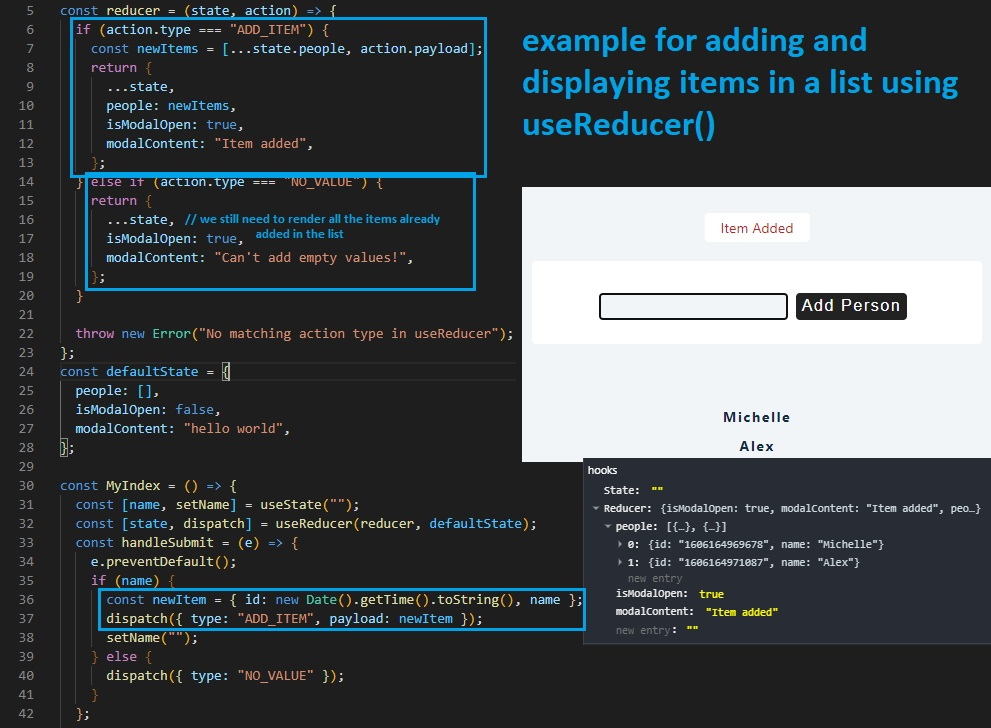</p>

<br/>

### useReducer - Complete example code

**Complete code for adding, displaying, removing and also closing modal (Complete example)**:

```js
// ./useReducerExample/Modal.js
import React, { useEffect } from "react";
const Modal = ({ modalContent, closeModal }) => {
  useEffect(() => {
    setTimeout(() => {
      closeModal();
    }, 3000);
  });
  return (
    <div className="modal">
      <p>{modalContent}</p>
    </div>
  );
};
export default Modal;
```


```js
// ./useReducerExample/reducer.js
export const reducer = (state, action) => {
  if (action.type === "ADD_ITEM") {
    const newPeople = [...state.people, action.payload];
    return {
      ...state,
      people: newPeople,
      isModalOpen: true,
      modalContent: "item added",
    };
  }
  if (action.type === "NO_VALUE") {
    return { ...state, isModalOpen: true, modalContent: "please enter value" };
  }
  if (action.type === "CLOSE_MODAL") {
    return { ...state, isModalOpen: false };
  }
  if (action.type === "REMOVE_ITEM") {
    const newPeople = state.people.filter(
      (person) => person.id !== action.payload
    );
    return {
      ...state,
      isModalOpen: true,
      modalContent: "item removed",
      people: newPeople,
    };
  }
  throw new Error("no matching action type");
};
```


```js
// ./useReducerExample/index.js
import React, { useState, useReducer } from "react";
import Modal from "./Modal";
import { reducer } from "./reducer";

const defaultState = {
  people: [],
  isModalOpen: false,
  modalContent: "",
};
const Index = () => {
  const [name, setName] = useState("");
  const [state, dispatch] = useReducer(reducer, defaultState);
  const handleSubmit = (e) => {
    e.preventDefault();
    if (name) {
      const newItem = { id: new Date().getTime().toString(), name };
      dispatch({ type: "ADD_ITEM", payload: newItem });
      setName("");
    } else {
      dispatch({ type: "NO_VALUE" });
    }
  };
  const closeModal = () => {
    dispatch({ type: "CLOSE_MODAL" });
  };
  return (
    <>
      {state.isModalOpen && (
        <Modal closeModal={closeModal} modalContent={state.modalContent} />
      )}
      <form onSubmit={handleSubmit} className="form">
        <div>
          <input
            type="text"
            value={name}
            onChange={(e) => setName(e.target.value)}
          />
        </div>
        <button type="submit">add </button>
      </form>
      {state.people.map((person) => {
        return (
          <div key={person.id} className="item">
            <h4>{person.name}</h4>
            <button
              onClick={() =>
                dispatch({ type: "REMOVE_ITEM", payload: person.id })
              }
            >
              remove
            </button>
          </div>
        );
      })}
    </>
  );
};

export default Index;
```


```js
// ./App.js
import React, { useState, useReducer } from "react";
import Final from "./useReducerExample";

function App() {
  return (
    <div className="container">
      <Final />
    </div>
  );
}

export default App;
```

<p align="center">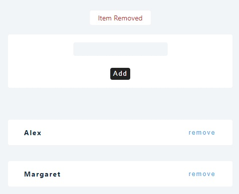</p>

<br/>

### Prop Drilling

We'll replicate the [`useState` Array with Data objects Example](#usestate-array-with-data-objects-example).

We use **prop drilling** to pass data from one part of a React Component tree to another by going through other parts that do not need the data [(they only help in passing it around)](https://medium.com/javascript-in-plain-english/how-to-avoid-prop-drilling-in-react-using-component-composition-c42adfcdde1b). In this example, we pass the "remove person function" from the Main component (`const PropDrilling`) to the `const List` component (that doesn't need the function) and finally to the `const SinglePerson` component. 

```js
import React, { useState } from "react";

const data = [
  { id: 1, name: "john" },
  { id: 2, name: "peter" },
  { id: 3, name: "susan" },
  { id: 4, name: "anna" },
];

const PropDrilling = () => {
  const [people, setPeople] = useState(data);
  const removePerson = (id) => {
    setPeople((people) => {
      return people.filter((person) => person.id !== id);
    });
  };
  return (
    <section>
      <h3>prop drilling</h3>
      <List people={people} removePerson={removePerson} />
    </section>
  );
};

const List = ({ people, removePerson }) => {
  return (
    <>
      {people.map((person) => {
        return (
          <SinglePerson
            key={person.id}
            {...person}
            removePerson={removePerson}
          />
        );
      })}
    </>
  );
};

const SinglePerson = ({ id, name, removePerson }) => {
  return (
    <div className="item">
      <h4>{name}</h4>
      <button onClick={() => removePerson(id)}>remove</button>
    </div>
  );
};

function App() {
  return (
    <div className="container">
      <PropDrilling />
    </div>
  );
}

export default App;
```

<p align="center">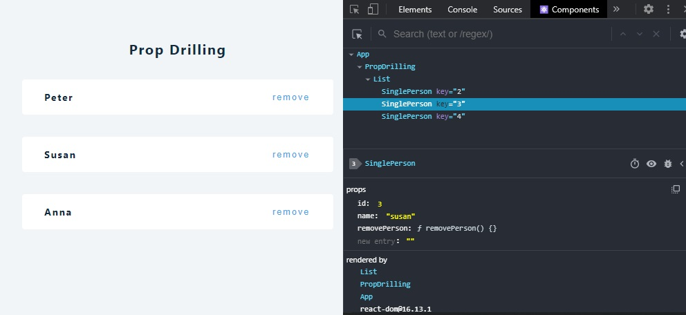</p>

Note that **prop drilling** method isn't efficient if we have a lot of components that we need to pass. It's also inefficient if we are passing data between more than 2-3 levels (eg. we need to pass data between 10 or 15 other levels).

As an alternative to prop drilling, we can use **Context API** (`useContext`) or **React Redux** (however, Redux is used for more complex cases).

<br/>

### `useContext` - Context API

[(React Full Course 2020 - 8h14m)](https://youtu.be/4UZrsTqkcW4?t=29678)

Context API is used to avoid prop drilling. [Context is designed to share data that can be considered “global” for a tree of React components, such as the current authenticated user, theme, or preferred language.](https://reactjs.org/docs/context.html)

We'll refactor the [example used earlier for Prop Drilling](#prop-drilling).

First we need to [Create a Context object](https://reactjs.org/docs/context.html#reactcreatecontext): `const PersonContext = React.createContext();` Once we set up a `createContext` object we get two components: **the Provider** and **the Consumer**.

We need now to find our *root component* (in this example it will be `const ContextAPI`) and **wrap** the return of this root component in `<PersonContext.Provider> ... </PersonContext.Provider>`. The `Provider` has a `value` property where we can put the component we want to pass (in this example the `removePerson` function). 

```js
const PersonContext = React.createContext();

const ContextAPI = () => {
  const [people, setPeople] = useState(data);
  const removePerson = (id) => {
    setPeople((people) => {
      return people.filter((person) => person.id !== id);
    });
  };
  return (
    <PersonContext.Provider value={{ removePerson }}>
      <h3>Context API / useContext</h3>
      <List people={people}/>
    </PersonContext.Provider>
  ); // Reminder: first pair of brackets {} are for JS Code in JSX,
     // second pair of {} are for removePerson object
};
```

After that, we can go to the component (final destination) where we'll use `removePerson` function (`singlePerson` in this example) and pass in the *Context Object* (`PersonContext`) using `useContext()`:

```js
const List = ({ people }) => {
  return (
    <>
      {
          people.map((person) => {return (<SinglePerson key={person.id} {...person}/>);})
      }
    </>
  );
}; // Note that we only pass people in this List component, without removePerson

const SinglePerson = ({ id, name }) => {
  const { removePerson } = useContext(PersonContext);

  return (
    <div className="item">
      <h4>{name}</h4>
      <button onClick={() => removePerson(id)}>remove</button>
    </div>
  );
};
```

<br/>

We can also pass the `people` list of objects (using `useContext`) to the `const List` component (see complete code bellow).

---

***Complete code (with both removePerson and people objects passed using Context API):***

```js
import React, { useState, useContext } from "react";

const data = [
  { id: 1, name: "john" },
  { id: 2, name: "peter" },
  { id: 3, name: "susan" },
  { id: 4, name: "anna" },
];

const PersonContext = React.createContext();

const ContextAPI = () => {
  const [people, setPeople] = useState(data);
  const removePerson = (id) => {
    setPeople((people) => {
      return people.filter((person) => person.id !== id);
    });
  };
  return (
    <PersonContext.Provider value={{ removePerson, people }}>
      <h3>Context API / useContext</h3>
      <List />
    </PersonContext.Provider>
  );
};

const List = () => {
  const mainData = useContext(PersonContext);
  console.log(mainData);
  return (
    <>
      {mainData.people.map((person) => {
        return <SinglePerson key={person.id} {...person} />;
      })}
    </>
  );
};

const SinglePerson = ({ id, name }) => {
  const { removePerson } = useContext(PersonContext);
  return (
    <div className="item">
      <h4>{name}</h4>
      <button onClick={() => removePerson(id)}>remove</button>
    </div>
  );
};

function App() {
  return (<div className="container"><ContextAPI /></div>);
}
export default App;
```

<p align="center">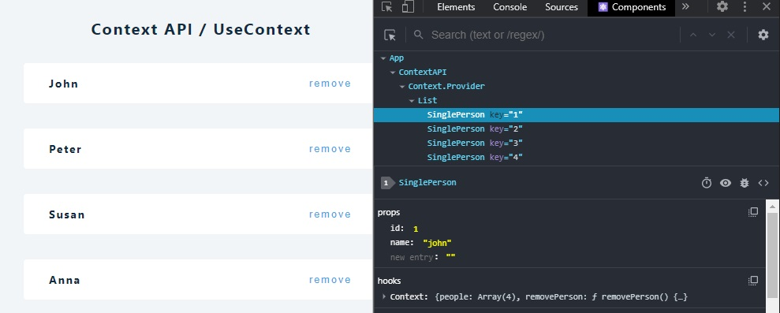</p>


<br/>

## React Custom Hooks

(Tuesday, November 24, 2020)

[Building your own Hooks lets you extract component logic into reusable functions.](https://reactjs.org/docs/hooks-custom.html).

[A **custom hook** allows you to extract some components logic into a reusable function. A **custom hook** is a Javascript function that starts with use and that call can other **hooks**. Remember that components and **hooks** are functions, so we are really not creating any new concepts here](https://dev.to/damcosset/how-to-create-custom-hooks-in-react-44nd). [Custom hooks means fewer keystrokes and less repetitive code](https://blog.bitsrc.io/writing-your-own-custom-hooks-4fbcf77e112e).

Other way of saying it: Custom hooks allow us to re-use functionalities like fetching data (eg. fetch data and [display a message indicating that a friend is online or not](https://reactjs.org/docs/hooks-custom.html)), saving to local storage, [increasing a counter and updating the title of the page](https://blog.bitsrc.io/writing-your-own-custom-hooks-4fbcf77e112e) (eg. `(3) New Messages`), extract and display images from an [API like Unsplash](https://unsplash.com/developers), etc.

### `useFetch`

[(React Full Course 2020 - 8h26m)](https://youtu.be/4UZrsTqkcW4?t=30384). More examples on creating your custom `useFetch` [here](https://medium.com/swlh/usefetch-a-custom-react-hook-36d5f5819d8) or [here](https://medium.com/better-programming/learn-to-create-your-own-usefetch-react-hook-9cc31b038e53)

In this example we'll create a custom hook that fetches data (JSON) from an URL (from an API) and also returns `loading` state (true/false).

```js
import { useState, useEffect } from "react";

const useFetch = (url) => {
  const [loading, setLoading] = useState(true);
  const [products, setProducts] = useState([]);

  const getProducts = async () => {
    const response = await fetch(url);
    const products = await response.json();
    setProducts(products);
    setLoading(false);
  };

  useEffect(() => {
    getProducts();
  }, [url]); // useEffect will trigger on first page reload
  // and whenever the url variable is changed

  return { loading, products };
};
```

Obviously we can put this new custom hook (`const useFetch()` function) in a separate file like `useFetch.js`.

Here's an example how we will call this newly created custom hook:

```js
const url = "https://course-api.netlify.app/api/javascript-store-products";
const CustomHookExample = () => {
  const { loading, products } = useFetch(url);
  console.log(products);

  return (
    <div>
      <h2>{loading ? "Loading..." : "Products"}</h2>
    </div>
  );
};
```

Once all the data is fetched from the API, it will display a "Products" strings, and we'll also have all the fetched data in our `products` 

<p align="center">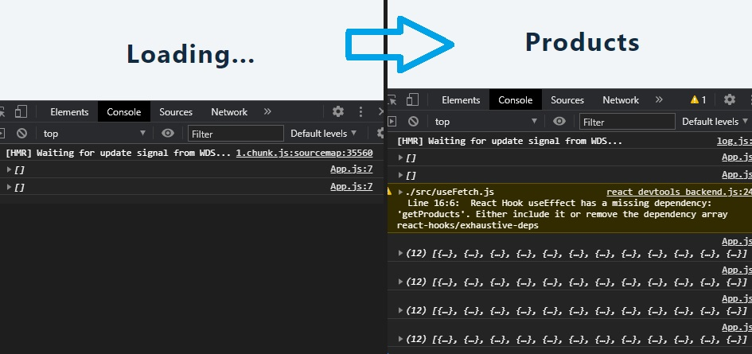</p>

However, (in this example) we need to use a hook called [`useCallback`](https://reactjs.org/docs/hooks-reference.html#usecallback) in order to [memoize](https://stackoverflow.com/questions/45242851/why-memoization-instead-of-memorization) the data and prevent unnecessary renders. [We also need to include `getProducts` in our `useEffect`](https://reactjs.org/docs/hooks-faq.html#is-it-safe-to-omit-functions-from-the-list-of-dependencies).

---

***Complete code***

```js
// ./useFetch.js
import { useState, useEffect, useCallback } from "react";

export const useFetch = (url) => {
  const [loading, setLoading] = useState(true);
  const [products, setProducts] = useState([]);

  const getProducts = useCallback(async () => {
    const response = await fetch(url);
    const products = await response.json();
    setProducts(products);
    setLoading(false);
  }, [url]);

  useEffect(() => {
    getProducts();
  }, [url, getProducts]);
  return { loading, products };
};
```

```js
// ./App.js
import React from "react";
import { useFetch } from "./useFetch";

const url = "https://course-api.netlify.app/api/javascript-store-products";
const CustomHookExample = () => {
  const { loading, products } = useFetch(url);
  console.log(products);

  return (
    <div>
      <h2>{loading ? "Loading..." : "Products"}</h2>
    </div>
  );
};

function App() {
  return (
    <div className="container">
      <CustomHookExample />
    </div>
  );
}

export default App;
```

<p align="center">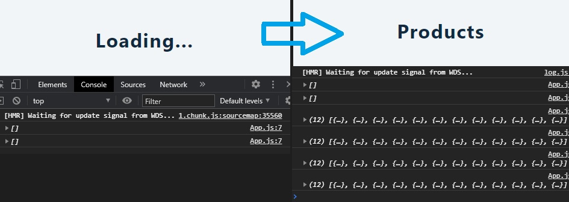</p>

<br/>


## React PropTypes

[Typechecking With PropTypes](https://reactjs.org/docs/typechecking-with-proptypes.html): As your app grows, you can catch a lot of bugs with type checking. For some applications, you can use JavaScript extensions like [Flow](https://flow.org/) or [TypeScript](https://www.typescriptlang.org/) to typecheck your whole application. But even if you don’t use those, React has some built-in type checking abilities. To run type checking on the props for a component, you can assign the special `propTypes` property,

---

In this example we'll use the `useFetch` custom hook made in the previous example. We will retrieve data from an API such as *name, price* and *image* of a Product (eg. furniture).

```json
[
  {
    "id": "recmg2a1ctaEJNZhu",
    "name": "utopia sofa",
    "image": {
      "url": "https://dl.airtable.com/.attachments/6ac7f7b55d505057317534722e5a9f03/9183491e/product-3.jpg"
    },
    "price": 39.95
  },
  {
    "id": "recvKMNR3YFw0bEt3",
    "name": "entertainment center",
    "image": {
      "url": "https://dl.airtable.com/.attachments/da5e17fd71f50578d525dd5f596e407e/d5e88ac8/product-2.jpg"
    },
    "price": 29.98
  },
  {
    "id": "recxaXFy5IW539sgM",
    "name": "albany sectional",
    "image": {
      "url": "https://dl.airtable.com/.attachments/05ecddf7ac8d581ecc3f7922415e7907/a4242abc/product-1.jpeg"
    },
    "price": 10.99
  },
  {
    "id": "recyqtRglGNGtO4Q5",
    "name": "leather sofa",
    "image": {
      "url": "https://dl.airtable.com/.attachments/3245c726ee77d73702ba8c3310639727/f000842b/product-5.jpg"
    },
    "price": 9.99
  },
  { "id": "recNWGyP7kjFhSqw3", "name": "sofa set" }
]
```

We will use PropTypes to check if every fetched Product (data) has the required properties used in our application (and also if it's not null). Eg., in JavaScript if we try to display a image from an URL but the URL is empty (null, or the image URL property of that Product object does not exist) we get an error: `TypeError: Cannot read property 'url' of undefined` (other way of saying: even if 99% of fetched data have all the properties, if one data will not have one, the app will crash).

<p align="center">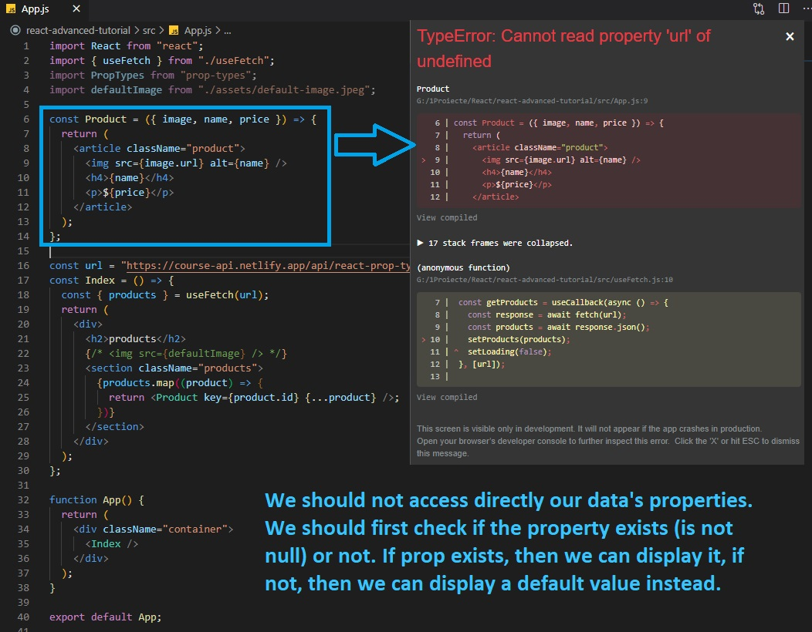</p>

We are going to handle these situations using PropTypes, checking all the props of each fetched data. We can also manually check each Product using `console.log();`, but `PropTypes` will check automatically each data. Each data (Product in this example) has a `.propTypes` property by default (without needing to import anything), that we can further define with the properties we want to check using the imported `PropTypes`:

```js
import PropTypes from 'prop-types';

const Product = ({image, name, price}) => {
  ...  
};

Product.propTypes = {
    image: PropTypes.object.isRequired,
    name: PropTypes.string.isRequired,
    price: PropTypes.number.isRequired
};
```

<p align="center"></p>

Now, to handle the undefined properties, we can either set ***default props*** OR use [***short-circuit operators*** presented earlier](#js-short-circuit-evaluation-return-values-with-a-condition-and-ternary-operator)

### Solving undefined properties with Default Props

Default Props are straightforward. Just define our data's (Product's) `defaultProps` property:

```js
import defaultImage from "./assets/default-image.jpeg";

Product.defaultProps = {
    name: "Product name missing",
    price: 0.00,
    image: defaultImage
};
```

<p align="center">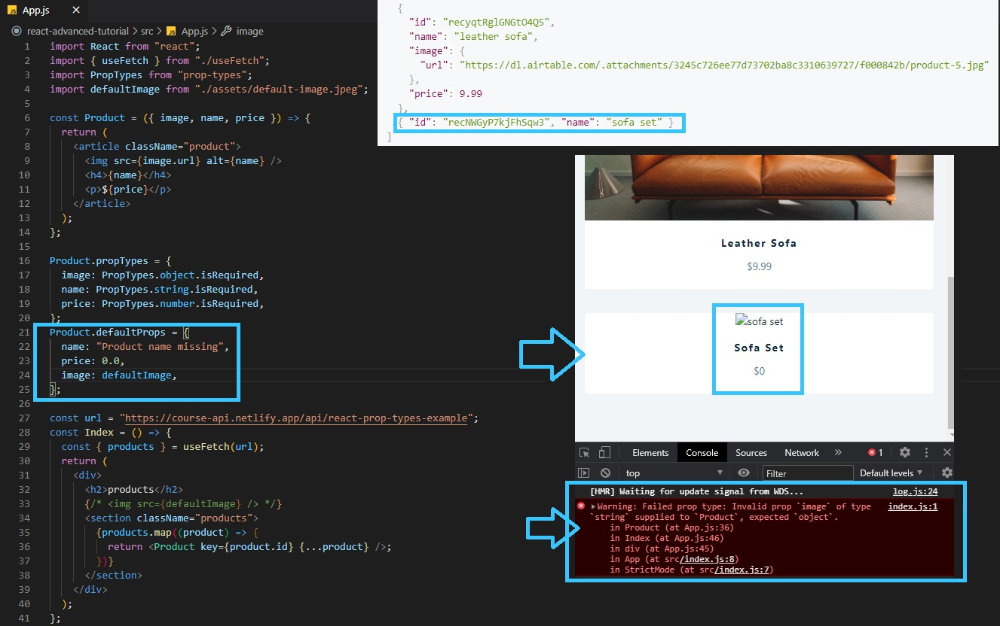</p>

But, we still have a problem: image property is an object (that further contains a `url` property with the link to the image). We cannot initialize the `url` property of the `image` object using `.defaultProps`. Therefore, we will use short-circuit operators.

### Solving undefined properties using short-circuit operators

For `price` and `name` we straightforward write an alternative value. For `image` object, we first check if the property image.url exists, if not, then the image might be undefined; if the image is undefined, we take the `defaultImage` path.

```js
import defaultImage from "./assets/default-image.jpeg";

const Product = ({ image, name, price }) => {
  const imageUrl = image && image.url;
  return (
    <article className="product">
      
      <h4>{name || "Product name missing"}</h4>
      <p>${price || 0.0}</p>
    </article>
  );
};
```

<p align="center"></p>

---

***Complete Code:***

```js
import React from "react";
import { useFetch } from "./useFetch";
import PropTypes from "prop-types";
import defaultImage from "./assets/default-image.jpeg";

const Product = ({ image, name, price }) => {
  const imageUrl = image && image.url;
  return (
    <article className="product">
      
      <h4>{name || "Product name missing"}</h4>
      <p>${price || 0.0}</p>
    </article>
  );
};

Product.propTypes = {
  image: PropTypes.object.isRequired,
  name: PropTypes.string.isRequired,
  price: PropTypes.number.isRequired,
};
// Product.defaultProps = {
//   name: "Product name missing",
//   price: 0.0,
//   image: defaultImage,
// };

const url = "https://course-api.netlify.app/api/react-prop-types-example";
const Index = () => {
  const { products } = useFetch(url);
  return (
    <div>
      <h2>products</h2>
      {/*  */}
      <section className="products">
        {products.map((product) => {
          return <Product key={product.id} {...product} />;
        })}
      </section>
    </div>
  );
};

function App() { return (<div className="container"> <Index /> </div>); }
export default App;
```

<br/>

## React Router

[(React Full Course 9h01m)](https://youtu.be/4UZrsTqkcW4?t=32445) - (Wednesday, November 25, 2020)

https://reactrouter.com/web/guides/quick-start

Instead of going to the server and request each web page user navigates, React Router sets up a routing on the client side without page refreshing. Each new web page will load instantly, without refresh (without going to the server to fetch the data).

<p align="center">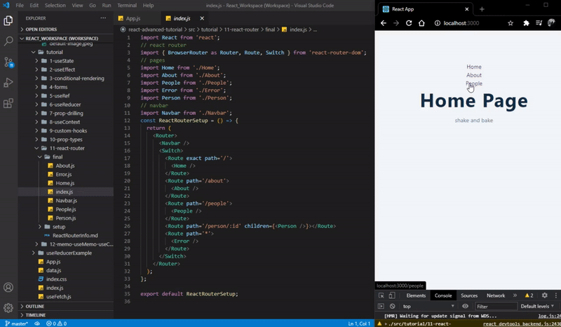</p>

However, React doesn't have a built-in Routing, so we'll use an **external** package, namely [**React Router**](https://reactrouter.com/), that can be installed with `npm`:

```bash
npm install react-router-dom
```

We can now find the package in our `./package.json`

```json
"react-router-dom": "^5.2.0",
```

<p align="center">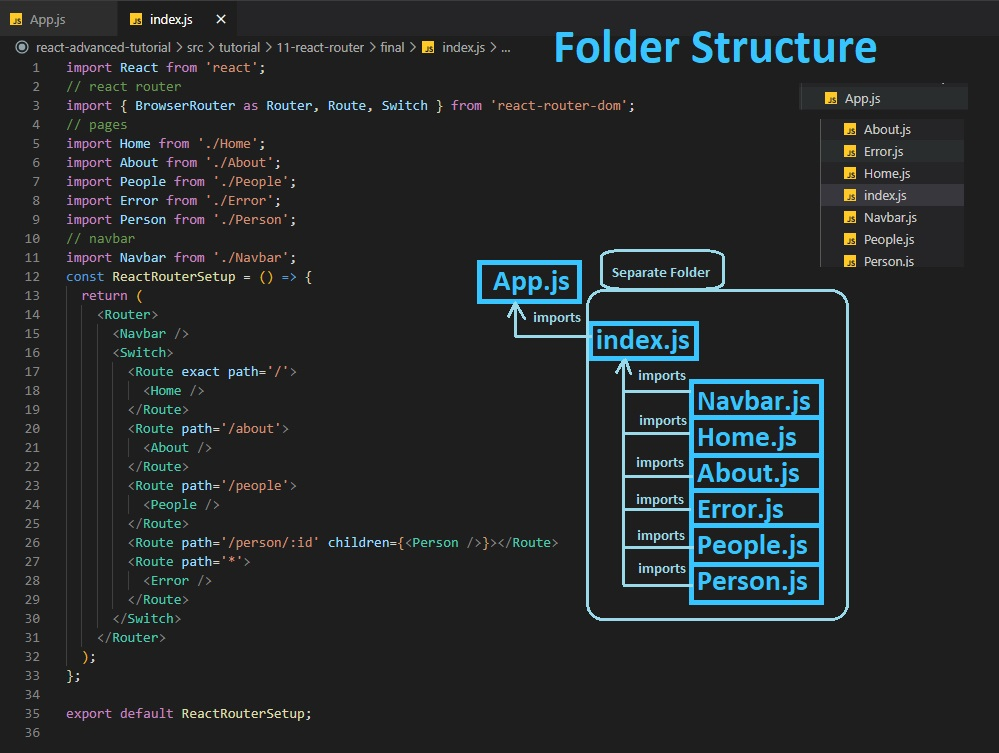</p>

Each separate **simple/static page** (`.js`) will return some JSX code:

```js
// ./SeparateFolder/Home.js
import React from 'react';
const Home = () => {
  return (
    <div>
      <h1>Home Page</h1>
      <p>shake and bake</p>
    </div>
  );
};
export default Home;
```

```js
// ./SeparateFolder/About.js
import React from 'react';
const About = () => {
  return (
    <div>
      <h1>About Page</h1>
    </div>
  );
};
export default About;
```

### Routing Basics

First thing we need to do is to import in our main `index.js` our React Router components.

Then, in our main component of `index.js` we need to wrap everything inside `return ()` in `<Router> </Router>`.

```js
// ./SeparateFolder/index.js
import React from "react";
import { BrowserRouter as Router, Route, Switch } from "react-router-dom";
// pages
import Home from "./Home";
import About from "./About";

const MainIndexReactRouter = () => {
  return (
    <Router>
      <Route path="/">
        <Home />
      </Route>
      <Route path="/about">
        <About />
      </Route>
    </Router>
  );
};

export default MainIndexReactRouter;
```

For each specific component (page), we need to set a `<Route> </Route>`, where we specify a `path=` prop where we will write the URL for that page (eg. `path="/"` for home page, `path="/about"` for about page). Then, inside our `<Route></Route>`, we display the component (page) that we imported.

<p align="center">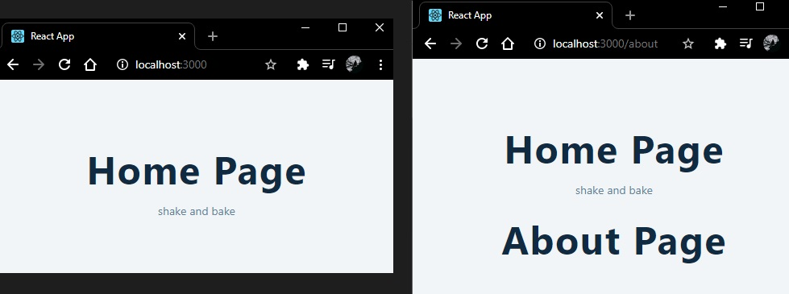</p>

However, there is a problem when we are trying to access and display the About page: namely, we can also see the Home Page. **By default in React Router, if a path matches two (or more) other paths, it will display both components** (`/` URL is somehow included in `/about`, or: `/about` also matches `/`).

In order to fix that, we need to add the **`exact` prop**: `<Route exact path='/'> <Home/> </Route>`. If we are going to have nested components (pages), eg. `./blog/post/1`, `./blog/recipe/4`, we can add the `exact` prop to each page/route.

<p align="center">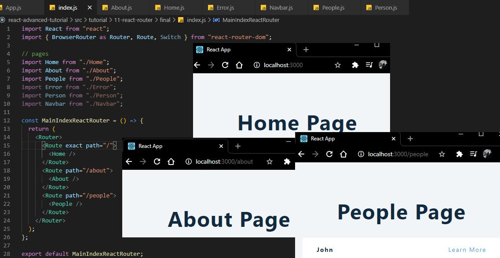</p>

```js
const MainIndexReactRouter = () => {
  return (
    <Router>
      <Route exact path="/">
        <Home />
      </Route>
      <Route path="/about">
        <About />
      </Route>
    </Router>
  );
};
```

<br/>

### 404 Error and Switch Component

If we have set up 3 routes (eg. Home, Index, People), but we are accessing a page that hasn't been set up: React (Router) will display an empty page. With an Error component, we can display a page that tells the user the specific page doesn't exist, providing a link to return to the home page (more like a 404 error page).

First, we need to create an Error page component (`Error.js`):

```js
// ./SeparateFolder/Error.js
import React from 'react';
import { Link } from 'react-router-dom';
const Error = () => {
  return (
    <div>
      <h1>Error Page</h1>
      <Link to='/' className='btn'>
        Go back to Home
      </Link>
    </div>
  );
};
export default Error;
```

In `index.js`, if we want to set up a Router for an Error page, we need to write a star (`*`) to our `path` component:<br/>`<Route path="*"> <Error /> </Route>`<br/>A star (`*`) means that it will always match anything else.

```js
// ./SeparateFolder/index.js
import Error from "./Error";
const MainIndexReactRouter = () => {
  return (
    <Router>
      <Route exact path="/">
        <Home />
      </Route>
      <Route path="*">
        <Error />
      </Route>
    </Router>
  );
};
// ^Bad implementation
```

But, now we have a problem almost like the one before: Every time we go to an existing page (Home, About), the Error page will also be displayed because it's URL always matches:

<p align="center">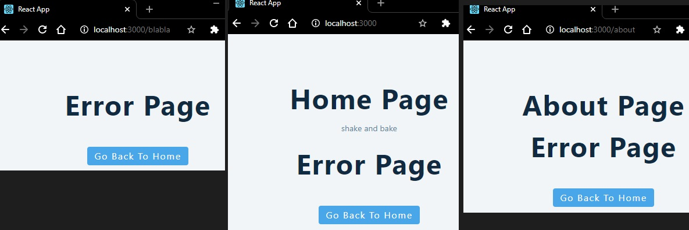</p>

We can't use `exact` prop to solve this issue, but we will use a `Switch` component. Therefore, we will place all of our router within a `<Switch> </Switch>`:

```js
// ./SeparateFolder/index.js
import Home from "./Home";
import Error from "./Error";

const MainIndexReactRouter = () => {
  return (
    <Router>
      <Switch>
        <Route exact path="/">
          <Home />
        </Route>
        <Route path="*">
          <Error />
        </Route>
      </Switch>
    </Router>
  );
};
// ^Good implementation
```

With a `Switch` component, only the first URL that matches will display the (page) component.

<br/>

### Navbar and Link

We can create a navbar with multiple accessible link using `<Navbar />` component.

First, we need to create a `Navbar.js` component page, where we will import a `Link` component from `'react-router-dom'`, and we will add `<Link to="/..."> PageName </Link>` to every other page/component:

```js
// ./SeparateFolder/Navbar.js
import React from 'react';
import { Link } from 'react-router-dom';
const Navbar = () => {
  return (
    <nav>
      <ul className="nav-links">
        <li>
          <Link to='/'>Home</Link>
        </li>
        <li>
          <Link to='/about'>About</Link>
        </li>
        <li>
          <Link to='/people'>People</Link>
        </li>
      </ul>
    </nav>
  );
};
export default Navbar;
```

Now, in `index,js` we just need to import and add `<Navbar />` (add before `Switch` and Routes!):<br/>Note that Navbar will be displayed on every page!

```js
// ./SeparateFolder/index.js
import Navbar from "./Navbar";

const MainIndexReactRouter = () => {
  return (
    <Router>
      <Navbar />
      <Switch>
        <Route exact path="/">
          <Home />
        </Route>
        <Route path="*">
          <Error />
        </Route>
      </Switch>
    </Router>
  );
};
```

<p align="center">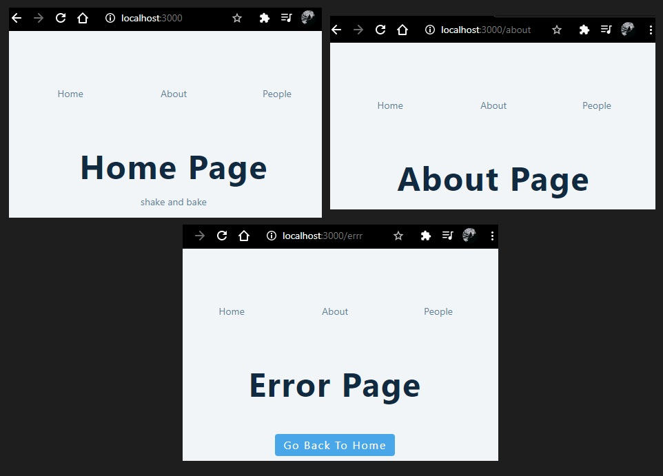</p>

<br/>

### Lists: URL Params and Placeholder

We can display a list of object as usual using `useState()`, AND we can also set some placeholders (links) to each item (object in that list), that when clicked, it can further display details (that we will write) by opening a separate page (without refreshing):

```js
// ./SeparateFolder/People.js
import React, { useState } from 'react';
import { Link } from 'react-router-dom';
import { data } from '../../../data';

const People = () => {
  const [people, setPeople] = useState(data);
  return (
    <div>
      <h1>People Page</h1>
      {people.map((person) => {
        return (
          <div key={person.id} className='item'>
            <h4>{person.name}</h4>
            <Link to={`/person/${person.id}`}>See More</Link>
          </div>
        );
      })}
    </div>
  );
};
export default People;
```

```js
// data.js
export const data = [
  { id: 1, name: 'john' },
  { id: 2, name: 'peter' },
  { id: 3, name: 'susan' },
  { id: 4, name: 'anna' },
];
```

Add `People.js` to `index.js` AND also add<br/>`<Route path="/person/:id" children={<Person />}></Route>` (you can choose any name instead of `/person/`, just remember when you're using it on each individual item in `People.js`):

```js
// ./SeparateFolder/index.js
import People from "./People";
import Person from "./Person";

const MainIndexReactRouter = () => {
  return (
    <Router>
      <Navbar />
      <Switch>
        <Route exact path="/">
          <Home />
        </Route>
        <Route path="/people">
          <People />
        </Route>
        <Route path="/person/:id" children={<Person />}></Route>
        <Route path="*">
          <Error />
        </Route>
      </Switch>
    </Router>
  );
};
```

Now let's create `Person.js`:

```js
// ./SeparateFolder/Person.js
import React, { useState, useEffect } from 'react';
import { data } from '../../../data';
import { Link, useParams } from 'react-router-dom';

const Person = () => {
  const [name, setName] = useState('default name');
  const { id } = useParams();

  useEffect(() => {
    const newPerson = data.find((person) => person.id === parseInt(id));
    setName(newPerson.name);
  }, []);

  return (
    <div>
      <h1>{name}</h1>
      <Link to='/people' className='btn'>
        Back To People
      </Link>
    </div>
  );
};

export default Person;
```

- We also import `data.js` here (we have `data.js` in both `People.js` and `Person.js`)
- `useParams` will allow us to access the parameters, BUT: all the returned parameters will have the `typeof` a `string`. [`useParams` returns an object of key/value pairs of URL parameters. Use it to access `match.params` of the current `<Route>`.](https://reactrouter.com/web/api/Hooks/useparams)
- We use `useEffect` (triggered once the component initially renders, by specifying `[ ]` as 2nd parameter) to change displayed name by the item's `id`, retrieved with `useParams`. We'll use `find()` in order to get the current object in our `data` by it's `id` (where `id` is parsed from String to Integer), then we call `SetName` with the retrieved object's name.

<p align="center">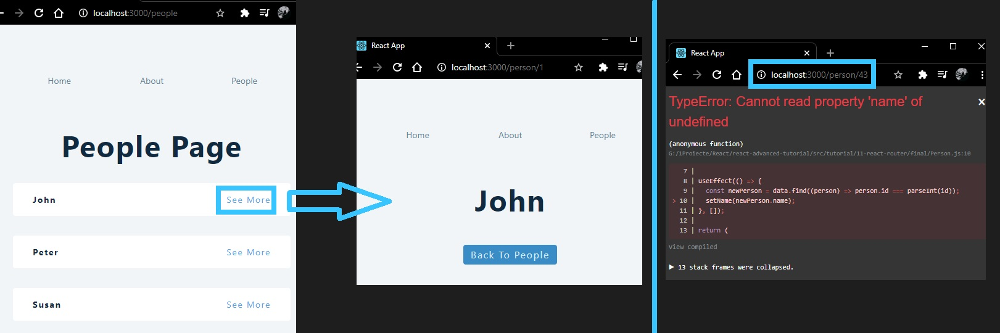</p>

However, if we are trying to access a person that doesn't exist in our data, we get `TypeError: Cannot read property 'name' of undefined`

We can solve this issue by using short-circuit operators, [as we saw earlier](#solving-undefined-properties-using-short-circuit-operators).

```js
const Person = () => {
  const [name, setName] = useState("Default name");
  const { id } = useParams();

  useEffect(() => {
    const newPerson = data.find((person) => person.id === parseInt(id));
    const nameDefault = newPerson && newPerson.name;
    setName(nameDefault || "Person not found");
  }, []);
  return (
    <div>
      <h1>{name}</h1>
      <Link to="/people" className="btn">
        Back To People
      </Link>
    </div>
  );
};
```

<br/>

---

---

<br/>

## React Performance Optimization

([React Full Course 9h38m](https://youtu.be/4UZrsTqkcW4?t=34684)) (Wednesday, November 25, 2020)

"React is fast by default", therefore there is not really a priority to optimize every application. Optimizing a React app should be the last task after finalizing a project.

Also, optimizations add their own costs: they're using more memory (memoizing - caching results - remembering) or more computational power. ([When to useMemo and useCallback - Kent C. Dodds](https://kentcdodds.com/blog/usememo-and-usecallback))

