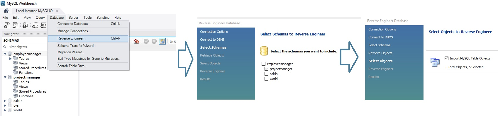
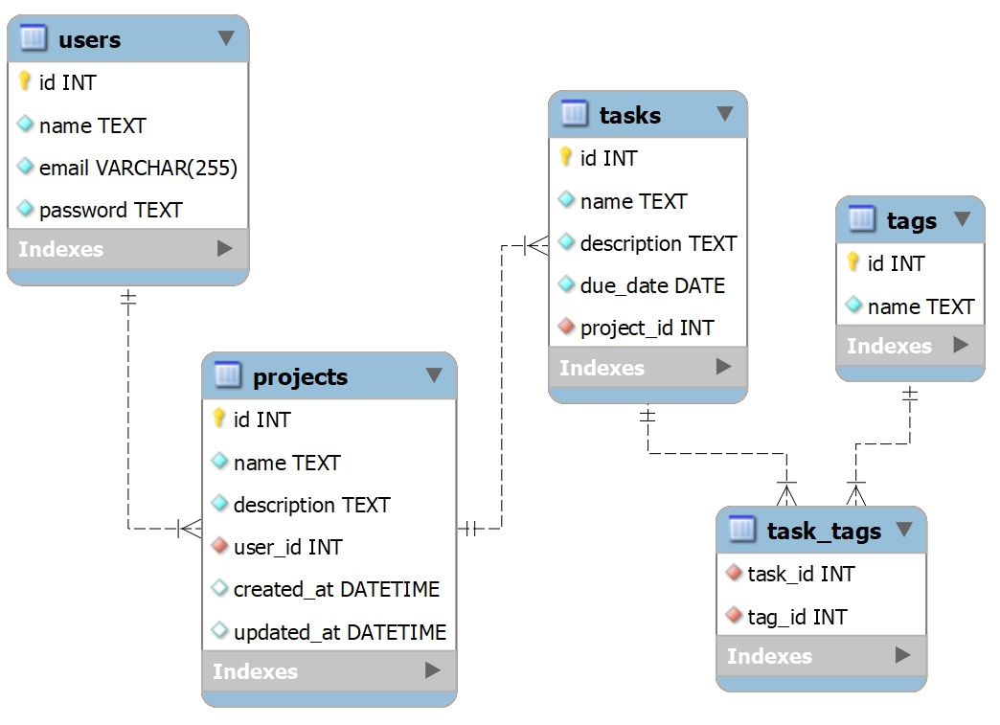

***All credits to https://chat.openai.com/chat.***

<hr/>

# SQL for Project Manager App with 5 tables

(The entire conversation was generated on Thursday, December 22, 2022)

## Create database

```sql
CREATE DATABASE projectmanager;
SHOW DATABASES;
USE projectmanager;
```

## Create tables

> Can you write the SQL for 5 tables for a Task Manager App?

Sure! Here is an example of how you might structure the tables for a task manager app using SQL:

- `users` table: This table would store information about each user of the app, such as their name, email, and password.


```sql
CREATE TABLE users (
  id INTEGER PRIMARY KEY AUTO_INCREMENT,
  name TEXT NOT NULL,
  email TEXT NOT NULL UNIQUE,
  password TEXT NOT NULL
);
```

- `projects` table: This table would store information about the different projects that users can create, such as the project name and a description.


```sql
CREATE TABLE projects (
  id INTEGER PRIMARY KEY AUTO_INCREMENT,
  name TEXT NOT NULL,
  description TEXT NOT NULL,
  user_id INTEGER NOT NULL,
  FOREIGN KEY (user_id) REFERENCES users(id)
);
```

- `tasks` table: This table would store information about the individual tasks that belong to a project, such as the task name, description, and due date.


```sql
CREATE TABLE tasks (
  id INTEGER PRIMARY KEY AUTO_INCREMENT,
  name TEXT NOT NULL,
  description TEXT NOT NULL,
  due_date DATE NOT NULL,
  project_id INTEGER NOT NULL,
  FOREIGN KEY (project_id) REFERENCES projects(id)
);
```

- `tags` table: This table would store the different tags that users can use to organize their tasks.


```sql
CREATE TABLE tags (
  id INTEGER PRIMARY KEY AUTO_INCREMENT,
  name TEXT NOT NULL
);
```

- `task_tags` table: This table would store a many-to-many relationship between tasks and tags, indicating which tags are applied to which tasks.


```sql
CREATE TABLE task_tags (
  task_id INTEGER NOT NULL,
  tag_id INTEGER NOT NULL,
  FOREIGN KEY (task_id) REFERENCES tasks(id),
  FOREIGN KEY (tag_id) REFERENCES tags(id)
);
```

This is just one way you could structure the tables for a task manager app. You might want to add additional columns or tables depending on the specific requirements of your app.

```sql
SHOW TABLES;
```

<br/>

🔵 All the code above converted from SQL to MySQL:

Notes:
- To convert the given code from SQL to MySQL, you can simply remove the type INTEGER and replace it with INT, like this:
- `Error Code: 1170. BLOB/TEXT column 'email' used in key specification without a key length` - This error occurs because you are trying to define the email column as a unique key, but the data type of the column is TEXT, which is a variable-length string type. In MySQL, the maximum size of a TEXT column is 65535 characters, which means that it can potentially hold very large strings. To fix this error, you can either change the data type of the email column to a fixed-length string type, such as CHAR or VARCHAR, and specify a maximum length for the column.


```sql
CREATE TABLE users (
  id INT PRIMARY KEY AUTO_INCREMENT,
  name TEXT NOT NULL,
  email VARCHAR(255) NOT NULL UNIQUE,
  password TEXT NOT NULL
);

CREATE TABLE projects (
  id INT PRIMARY KEY AUTO_INCREMENT,
  name TEXT NOT NULL,
  description TEXT NOT NULL,
  user_id INT NOT NULL,
  FOREIGN KEY (user_id) REFERENCES users(id)
);

CREATE TABLE tasks (
  id INT PRIMARY KEY AUTO_INCREMENT,
  name TEXT NOT NULL,
  description TEXT NOT NULL,
  due_date DATE NOT NULL,
  project_id INT NOT NULL,
  FOREIGN KEY (project_id) REFERENCES projects(id)
);

CREATE TABLE tags (
  id INT PRIMARY KEY AUTO_INCREMENT,
  name TEXT NOT NULL
);

CREATE TABLE task_tags (
  task_id INT NOT NULL,
  tag_id INT NOT NULL,
  FOREIGN KEY (task_id) REFERENCES tasks(id),
  FOREIGN KEY (tag_id) REFERENCES tags(id)
);
```

```sql
ALTER TABLE projects
ADD created_at datetime;

ALTER TABLE projects
ADD updated_at datetime;
```

<br/>

## Project Schema

> Can you represent the database schema for the tables above?

Sure! Here is a visual representation of the database schema for the tables described above:

```
                      +-------------+
                      |    users    |
                      +-------------+
                      | id          |
                      | name        |
                      | email       |
                      | password    |
                      +-------------+

+--------------------+         +-------------+
|    projects       |1      *  |    users    |
+--------------------+         +-------------+
| id                 |         | id          |
| name               |         | name        |
| description        |         | email       |
| user_id            |         | password    |
+--------------------+         +-------------+

+--------------------+         +-------------+
|     tasks         |1      *  |   projects  |
+--------------------+         +-------------+
| id                 |         | id          |
| name               |         | name        |
| description        |         | description |
| due_date           |         | user_id     |
| project_id         |         +-------------+
+--------------------+

+-------------+
|    tags     |
+-------------+
| id          |
| name        |
+-------------+

+--------------------+
|   task_tags       |
+--------------------+
| task_id           |
| tag_id            |
+--------------------+
```

In this schema, the users table has a one-to-many relationship with the projects table, indicated by the 1 on the projects side and the * on the users side. This means that each user can have multiple projects, but each project can only belong to one user. Similarly, the tasks table has a one-to-many relationship with the projects table, and the task_tags table has a many-to-many relationship with both the tasks and tags tables.

<br/>

### View the Schema Diagram in MySQL Workbench

🔵 Optional: In MySQL Workbench, go to `Database` > R`everse Engineer...` > `Next` > `Next` > Select desired database > `Next`  > `Next` > Check `Import MySQL Table Objects` > `Execute`.



<br/>

For the Project Manager Database:



<br/>

## Insert data

> Can you write the SQL to insert two rows to each table?

Sure! Here is an example of how you might insert two rows into each table using SQL:

```sql
-- Insert two rows into the users table
INSERT INTO users (name, email, password) VALUES
  ('Alice', 'alice@example.com', 'password1'),
  ('Bob', 'bob@example.com', 'password2');

-- Insert two rows into the projects table
INSERT INTO projects (name, description, user_id) VALUES
  ('Project 1', 'This is the first project', 1),
  ('Project 2', 'This is the second project', 2);

-- Insert two rows into the tasks table
INSERT INTO tasks (name, description, due_date, project_id) VALUES
  ('Task 1', 'This is the first task', '2022-01-01', 1),
  ('Task 2', 'This is the second task', '2022-01-02', 2);

-- Insert two rows into the tags table
INSERT INTO tags (name) VALUES
  ('Important'),
  ('Urgent');

-- Insert two rows into the task_tags table
INSERT INTO task_tags (task_id, tag_id) VALUES
  (1, 1),
  (2, 2);
```

Note that in these INSERT statements, the values for the user_id and project_id columns are references to the `id` column in the users and projects tables, respectively. These values should correspond to the `id` values of the rows that you want to link these rows to.

<br/>

> Can you please print out the tables with the rows that were added?

Sure! Here is what the tables would look like after the rows are inserted, assuming that the `id` column is set to auto-increment:

```
                    users
+----+--------+-------------------+------------+
| id | name   | email             | password   |
+----+--------+-------------------+------------+
| 1  | Alice  | alice@example.com | password1  |
| 2  | Bob    | bob@example.com   | password2  |
+----+--------+-------------------+------------+

                   projects
+----+------------+------------------------+----------+
| id | name       | description            | user_id  |
+----+------------+------------------------+----------+
| 1  | Project 1  | This is the first      | 1        |
|    |            | project                |          |
| 2  | Project 2  | This is the second     | 2        |
|    |            | project                |          |
+----+------------+------------------------+----------+

                   tasks
+----+------------+------------------------+------------+------------+
| id | name       | description            | due_date   | project_id |
+----+------------+------------------------+------------+------------+
| 1  | Task 1     | This is the first      | 2022-01-01 | 1          |
|    |            | task                    |            |            |
| 2  | Task 2     | This is the second     | 2022-01-02 | 2          |
|    |            | task                    |            |            |
+----+------------+------------------------+------------+------------+

                    tags
+----+------------+
| id | name       |
+----+------------+
| 1  | Important  |
| 2  | Urgent     |
+----+------------+

                  task_tags
+------------+------------+
| task_id    | tag_id     |
+------------+------------+
| 1          | 1          |
| 2          | 2          |
+------------+------------+
```

<br/>

## SQL Queries

### SELECT

> Can you write the SQL to select all the projects from the first user?

To select all the projects from the first user in the users table, you can use the following SQL query:

```sql
SELECT * FROM projects WHERE user_id = 1;
```

This query selects all columns (`*`) from the projects table where the value in the user_id column is equal to 1. This will return all rows in the projects table where the user_id is 1, which corresponds to the first user in the users table (assuming that the id column is set to auto-increment).

Here is an example of what the output of this query might look like:

```sql
+----+------------+------------------------+----------+
| id | name       | description            | user_id  |
+----+------------+------------------------+----------+
| 1  | Project 1  | This is the first      | 1        |
|    |            | project                |          |
+----+------------+------------------------+----------+
```

<br/>

### INNER JOIN

> Can you please show an example of using INNER JOIN?

Sure! INNER JOIN is used to combine rows from two or more tables based on a related column between them. Here is an example of how you might use INNER JOIN to select data from multiple tables:

```sql
SELECT users.name, projects.name
FROM users
INNER JOIN projects ON users.id = projects.user_id;
```

This query selects the name column from the users table and the name column from the projects table, and combines the rows from these tables based on the id column in the users table and the user_id column in the projects table.

Here is an example of what the output of this query might look like:

```sql
+--------+------------+
| name   | name       |
+--------+------------+
| Alice  | Project 1  |
| Bob    | Project 2  |
+--------+------------+
```

I hope this helps! Let me know if you have any other questions.

<br/>

### USING clause

> Thanks! Can you write an examples of using the "USING" SQL query?

Sure! The USING clause is used in an INNER JOIN or a NATURAL JOIN to specify the column(s) that should be used to match rows from the two tables.

Here is an example of how you might use the USING clause in an INNER JOIN:

```sql
SELECT users.name, projects.name
FROM users
INNER JOIN projects USING (id);
```

This query is equivalent to the following query using the ON clause:

```sql
SELECT users.name, projects.name
FROM users
INNER JOIN projects ON users.id = projects.id;
```

Both of these queries select the name column from the users table and the name column from the projects table, and combine the rows from these tables based on the id column, which exists in both tables.

Here is an example of what the output of this query might look like:

```sql
+--------+------------+
| name   | name       |
+--------+------------+
| Alice  | Project 1  |
| Bob    | Project 2  |
+--------+------------+
```

### UNION clause

> Can you please show an example of using UNION clause in a SQL query?

Sure! The UNION clause is used to combine the results of two or more SELECT statements into a single result set. Each SELECT statement within the UNION must have the same number of columns, and the columns must have compatible data types.

Here is an example of how you might use the UNION clause in a SQL query:

```sql
SELECT name FROM users WHERE id < 3
UNION
SELECT name FROM projects WHERE id < 3;
```

This query selects the name column from the users table where the id is less than 3, and selects the name column from the projects table where the id is less than 3. The UNION clause combines these two result sets into a single result set.

Here is an example of what the output of this query might look like:

```
+--------+
| name   |
+--------+
| Alice  |
| Bob    |
| Project 1  |
+--------+
```

<br/>

### UPDATE 

> Can you please insert two more projects to the first user?

ure! To insert two more projects for the first user in the users table, you can use the following SQL query:

```sql
INSERT INTO projects (name, description, user_id) VALUES
  ('Project 3', 'This is the third project', 1),
  ('Project 4', 'This is the fourth project', 1);
```

This query inserts two rows into the projects table, with the user_id column set to 1, which corresponds to the first user in the users table (assuming that the id column is set to auto-increment).

Here is an example of what the projects table would look like after these two rows are inserted:

```
+----+------------+------------------------+----------+
| id | name       | description            | user_id  |
+----+------------+------------------------+----------+
| 1  | Project 1  | This is the first      | 1        |
|    |            | project                |          |
| 2  | Project 2  | This is the second     | 2        |
|    |            | project                |          |
| 3  | Project 3  | This is the third      | 1        |
|    |            | project                |          |
| 4  | Project 4  | This is the fourth     | 1        |
|    |            | project                |          |
+----+------------+------------------------+----------+
```

<br/>

> Can you please show an example of using the UPDATE clause on the projects of the first user?

Sure! To update the projects of the first user in the users table, you can use the following SQL query:

```sql
UPDATE projects
SET name = 'Updated Project'
WHERE user_id = 1;
```

This query updates the name column in the projects table to 'Updated Project' for all rows where the user_id column is equal to 1. This will update all the projects belonging to the first user in the users table (assuming that the id column is set to auto-increment).

Here is an example of what the projects table would look like after this update:

```
+----+------------+------------------------+----------+
| id | name       | description            | user_id  |
+----+------------+------------------------+----------+
| 1  | Updated    | This is the first      | 1        |
|    | Project    | project                |          |
| 3  | Updated    | This is the third      | 1        |
|    | Project    | project                |          |
| 4  | Updated    | This is the fourth     | 1        |
|    | Project    | project                |          |
+----+------------+------------------------+----------+
```

<br/>

> Can you use the UPDATE clause on "name" and "description" only on project with id=3 where user_id=1?

Sure! To update the name and description columns of the project with id equal to 3 and user_id equal to 1, you can use the following SQL query:

```sql
UPDATE projects
SET name = 'New Project Name', description = 'New project description'
WHERE id = 3 AND user_id = 1;
```

This query updates the name column to 'New Project Name' and the description column to 'New project description' for the row in the projects table where the id column is equal to 3 and the user_id column is equal to 1.

Here is an example of what the projects table would look like after this update:

```
+----+------------+------------------------+----------+
| id | name       | description            | user_id  |
+----+------------+------------------------+----------+
| 1  | Updated    | This is the first      | 1        |
|    | Project    | project                |          |
| 3  | New        | New project            | 1        |
|    | Project    | description            |          |
| 4  | Updated    | This is the fourth     | 1        |
|    | Project    | project                |          |
+----+------------+------------------------+----------+
```

<br/>

### DELETE

> Can you please show an example of using DELETE clause?

Sure! To delete rows from a table using the DELETE clause, you can use the following syntax:

```sql
DELETE FROM table_name WHERE condition;
```

Here is an example of how you might use the DELETE clause to delete rows from the projects table:

```sql
DELETE FROM projects WHERE user_id = 1;
```

This query will delete all rows from the projects table where the user_id column is equal to 1.

<br/>

### GROUP BY, HAVING

> Can you please show an example of using GROUP BY clause?

Sure! The GROUP BY clause is used in a SELECT statement to group rows together based on the values in one or more columns. It is typically used in conjunction with aggregation functions such as SUM, AVG, MAX, and MIN.

Here is an example of how you might use the GROUP BY clause in a SELECT statement:

```sql
SELECT user_id, COUNT(*)
FROM projects
GROUP BY user_id;
```

This query selects the user_id column and the count of rows (using the COUNT function) from the projects table, and groups the rows based on the user_id column.

Here is an example of what the output of this query might look like:

```
+----------+----------+
| user_id  | COUNT(*) |
+----------+----------+
| 1        | 2        |
| 2        | 1        |
+----------+----------+
```

<br/>

> Can you please show a SQL query using HAVING clause?

Sure! The HAVING clause is used to filter the groups that are returned by a GROUP BY clause based on a condition. It is typically used in conjunction with aggregation functions such as SUM, AVG, MAX, and MIN.

Here is an example of how you might use the HAVING clause in a SELECT statement:

```sql
SELECT user_id, COUNT(*)
FROM projects
GROUP BY user_id
HAVING COUNT(*) > 1;
```

This query selects the user_id column and the count of rows (using the COUNT function) from the projects table, groups the rows based on the user_id column, and filters the groups based on the condition `COUNT(*) > 1`, which means that only groups with more than one row will be returned.

Here is an example of what the output of this query might look like:

```
+----------+----------+
| user_id  | COUNT(*) |
+----------+----------+
| 1        | 2        |
+----------+----------+
```

<br/>

### ORDER BY

> Can you please show a SQL query using ORDER BY clause?

Sure! The ORDER BY clause is used to sort the rows that are returned by a SELECT statement in ascending or descending order based on the values in one or more columns.

Here is an example of how you might use the ORDER BY clause in a SELECT statement:

```sql
SELECT name, created_at
FROM projects
ORDER BY created_at DESC;
```

This query selects the name and created_at columns from the projects table, and sorts the rows in descending order (DESC) based on the created_at column.

Here is an example of what the output of this query might look like:

```
+------------+------------------------+
| name       | created_at             |
+------------+------------------------+
| Project 4  | 2021-12-31 23:59:59   |
| Project 3  | 2021-12-31 23:59:58   |
| Project 2  | 2021-12-31 23:59:57   |
| Project 1  | 2021-12-31 23:59:56   |
+------------+------------------------+
```

You can also specify multiple columns to sort by, and specify the sort order for each column. For example:

```sql
SELECT name, created_at
FROM projects
ORDER BY user_id ASC, created_at DESC;
This query sorts the rows first by user_id in ascending order (ASC) and then by created_at in descending order.
```

<br/>

> Can you please ALTER the Projects table to have a `created_at` column?

Sure! To alter the projects table to add a `created_at` column, you can use the following SQL statement:

```sql
ALTER TABLE projects
ADD created_at datetime;
```

This statement adds a `created_at` column to the projects table with a data type of datetime.

Here is an example of what the projects table would look like after this ALTER TABLE statement is executed:

```
+----+------------+------------------------+----------+------------------------+
| id | name       | description            | user_id  | created_at            |
+----+------------+------------------------+----------+------------------------+
| 1  | Project 1  | This is the first      | 1        |                       |
|    |            | project                |          |                       |
| 2  | Project 2  | This is the second     | 2        |                       |
|    |            | project                |          |                       |
+----+------------+------------------------+----------+------------------------+
```

You can then update the `created_at` column for each row with a value using the `UPDATE` clause, or insert new rows with a value in the `created_at` column using the `INSERT INTO` clause.

<br/>

## SQL Subqueries

> Can you please show an SQL example that uses subqueries?

Sure! In SQL, a subquery is a SELECT statement that is embedded within another SELECT, INSERT, UPDATE, or DELETE statement. Subqueries can be used to return data that is used in the outer query, or to filter the results of the outer query based on the results of the subquery.

Here is an example of an SQL query that uses a subquery to return the names of all projects that were created after the most recent project for a given user:

```sql
SELECT name
FROM projects
WHERE user_id = 1
  AND created_at > (SELECT MAX(created_at) FROM projects WHERE user_id = 1);
```

This query selects the `name` column from the `projects` table where the `user_id` is 1 and the `created_at` column is greater than the maximum created_at value for `projects` with a `user_id` of `1` (determined by the subquery).

Here is an example of the output of this query:

```
+------------+
| name       |
+------------+
| Project 3  |
| Project 4  |
+------------+
```

<br/>

> Can you please show an SQL example that uses a subquery for `DELETE` clause?

Sure! Here is an example of an SQL DELETE statement that uses a subquery to delete all projects that were created more than one year ago:

```sql
DELETE FROM projects
WHERE created_at < (SELECT DATE_SUB(NOW(), INTERVAL 1 YEAR));
```

This DELETE statement removes rows from the projects table where the created_at column is less than the current date minus one year (determined by the subquery using the DATE_SUB and NOW functions).

<br/>

## SQL Types of Keys

> Can you please enumerate the type of SQL keys (eg. primary, foreign)?

Sure! In SQL, there are several types of keys that can be used to enforce relationships between tables and ensure the integrity of the data in a database:

1. `Primary key`: A primary key is a column or set of columns that uniquely identifies each row in a table. Primary keys cannot contain null values, and must be unique across all rows in the table. Primary keys are used to enforce referential integrity, which means that foreign keys in other tables must reference a valid primary key value in the referenced table.

2. `Foreign key`: A foreign key is a column or set of columns that references a primary key in another table. Foreign keys are used to establish relationships between tables, and enforce referential integrity.

3. `Unique key`: A unique key is a column or set of columns that contains unique values across all rows in a table, but may contain null values. Unique keys are used to enforce uniqueness within a table, and can be used in place of a primary key when a table does not have a single column or set of columns that uniquely identifies each row.

4. `Candidate key`: A candidate key is a column or set of columns that could be used as a primary key for a table. A table can have multiple candidate keys, but only one can be designated as the primary key.

I hope this helps! Let me know if you have any other questions.

<br/>

## Others

> Nice. How can you know so much about SQL queries?

As an AI language model, I have been trained on a large dataset of text, which includes information about a wide range of topics, including SQL. My training data includes many examples of SQL queries, so I have learned how to write and understand various types of SQL statements.

I do not have access to the internet, so I cannot browse the web or access new information. I can only provide information that I have been trained on, which was current as of my knowledge cutoff date.

I am here to help answer your questions to the best of my ability based on the information that I have been trained on. If you have any further questions, please don't hesitate to ask!

<br/>

> What are the main SQL clauses that any SQL developer should know?

Here are some of the main SQL clauses that are commonly used in SQL queries:

1. SELECT: used to select specific columns from a table or multiple tables.
2. FROM: specifies the table or tables from which the columns are selected.
3. WHERE: filters the rows that are returned based on a condition.
4. GROUP BY: groups rows together based on the values in one or more columns.
5. HAVING: filters the groups that are returned based on a condition.
6. ORDER BY: sorts the rows that are returned in ascending or descending order based on the values in one or more columns.
7. INSERT INTO: inserts a new row into a table.
8. UPDATE: updates the values in one or more columns of existing rows in a table.
9. DELETE: deletes rows from a table.
10. INNER JOIN: combines rows from two or more tables based on a related column between them.
11. LEFT JOIN: combines all rows from the left table with matching rows from the right table, and returns NULL for non-matching rows from the right table.
12. RIGHT JOIN: combines all rows from the right table with matching rows from the left table, and returns NULL for non-matching rows from the left table.
13. FULL OUTER JOIN: combines all rows from both tables, and returns NULL for non-matching rows from either table.
14. UNION: combines the results of two or more SELECT statements into a single result set.

These clauses are just a few examples of the many that are available in SQL. There are many other clauses and functions that you can use in your queries to perform various operations on your data. It is important for SQL developers to have a good understanding of the different clauses and functions available, and how to use them effectively to manipulate

<br/>

## Normalization Forms

> Can you briefly exaplain the SQL Normalization Forms?

In SQL, normalization is the process of organizing a database in such a way as to reduce redundancy and dependency, and improve the integrity and performance of the database. There are several normal forms that are used to guide the design of a database and ensure that it is properly normalized.

Here is a brief overview of the main normal forms:

1. `First Normal Form (1NF)`: In 1NF, a table must meet the following conditions:

    - It must contain only atomic values (i.e., values that cannot be divided into smaller parts).
    - There must not be any repeating groups of data in the table.
    - Each column must have a unique name.
    - The order of the columns is not important.

2. `Second Normal Form (2NF)`: In 2NF, a table must meet the following conditions:

    - It must be in 1NF.
    - It must not have any partial dependencies (i.e., a non-key column should depend on the entire primary key, not just a part of it).

3. `Third Normal Form (3NF)`: In 3NF, a table must meet the following conditions:

    - It must be in 2NF.
    - It must not have any transitive dependencies (i.e., a non-key column should not depend on another non-key column).

4. `Boyce-Codd Normal Form (BCNF)`: In BCNF, a table must meet the following conditions:

    - It must be in 3NF.
    - It must not have any non-trivial functional dependencies (i.e., a non-key column should depend on the entire primary key, not just a part of it).

These are just a few examples of the normal forms that are used in SQL. There are also higher normal forms, such as Fourth Normal Form (4NF) and Fifth Normal Form (5NF), which have more strict requirements for reducing redundancy and dependency in a database.

<br/>

## ACID Properties in DBMS

In the context of database systems, ACID (Atomicity, Consistency, Isolation, Durability) is a set of properties that are used to ensure the reliability and integrity of transactions.

Here is a brief overview of the ACID properties:

1. `Atomicity`: Atomicity means that a transaction is an all-or-nothing operation. If any part of the transaction fails, the entire transaction is rolled back and the database is returned to its previous state.

2. `Consistency`: Consistency means that a transaction must leave the database in a consistent state. This means that the data in the database must meet all the constraints and rules that have been defined for it, even if the transaction fails or is rolled back.

3. `Isolation`: Isolation means that the changes made by one transaction must be isolated from the changes made by other transactions until the current transaction is complete. This ensures that the changes made by a transaction are not visible to other transactions until the transaction has been successfully committed.

4. `Durability`: Durability means that once a transaction has been committed, the changes it has made to the database are permanent and cannot be undone.

These properties are important for ensuring the reliability and integrity of transactions in a database system, and are essential for maintaining the consistency of the data in the database.

<br/>

## SQL Triggers / Stored Procedures

### SQL Trigger example

> Can you show an SQL trigger example on the above database?

Sure! An SQL trigger is a piece of code that is automatically executed by the database in response to a specific event, such as the insertion, update, or deletion of a row in a table. Triggers can be used to enforce rules, maintain data integrity, or perform other tasks whenever the specified event occurs.

Here is an example of an SQL trigger that updates the `updated_at` column of the `projects` table whenever a row is updated:

```sql
CREATE TRIGGER update_projects_updated_at
AFTER UPDATE ON projects
FOR EACH ROW
BEGIN
  UPDATE projects
  SET updated_at = NOW()
  WHERE id = NEW.id;
END;
```

This trigger creates a new trigger called update_projects_updated_at that is executed after an update (AFTER UPDATE) on the projects table. It updates the updated_at column of the projects table with the current date and time (NOW()) for the row that was updated (WHERE id = NEW.id).

Here is an example of what the projects table might look like after this trigger is executed:

```
+----+------------+------------------------+----------+------------------------+------------------------+
| id | name       | description            | user_id  | created_at            | updated_at            |
+----+------------+------------------------+----------+------------------------+------------------------+
| 1  | Project 1  | This is the first     
```

<br/>

> Can you please ALTER the Projects table to have a updated_at column?

Sure! To alter the projects table to add an updated_at column, you can use the following SQL statement:

```sql
ALTER TABLE projects
ADD updated_at datetime;
```

This statement adds an updated_at column to the projects table with a data type of datetime.

Here is an example of what the projects table would look like after this ALTER TABLE statement is executed:

```
+----+------------+------------------------+----------+------------------------+------------------------+
| id | name       | description            | user_id  | created_at            | updated_at            |
+----+------------+------------------------+----------+------------------------+------------------------+
| 1  | Project 1  | This is the first      | 1        |                       |                       |
|    |            | project                |          |                       |                       |
| 2  | Project 2  | This is the second     | 2        |                       |                       |
|    |            | project                |          |                       |                       |
+----+------------+------------------------+----------+------------------------+------------------------+
```

You can then update the updated_at column for each row with a value using the UPDATE clause, or insert new rows with a value in the updated_at column using the INSERT INTO clause.

<br/>

#### Write message to a log table

> Can you please write an example of creating a trigger that shows a warning message to the console?

Sure! While it is not possible to create a trigger that shows a warning message directly to the console in most database systems, you can create a trigger that writes a message to a log table or sends a message to an external system (such as an email or text message).

Here is an example of an SQL trigger that inserts a row into a log table whenever a row is deleted from the `projects` table:

```sql
CREATE TRIGGER log_project_deletes
AFTER DELETE ON projects
FOR EACH ROW
BEGIN
  INSERT INTO log (message)
  VALUES ('A project was deleted: ' || OLD.name);
END;
```

This trigger creates a new trigger called `log_project_deletes` that is executed after a delete (`AFTER DELETE`) on the projects table. It inserts a new row into the `log` table with a message that includes the name of the deleted project (`OLD.name`).

Here is an example of what the `log` table might look like after this trigger is executed:

```
+------------------------+
| message                |
+------------------------+
| A project was deleted: |
| Project 1              |
+------------------------+
```

<br/>

#### SIGNAL statement

> Can you show a trigger examples that uses SIGNAL SQLSTATE?

Sure! The SIGNAL statement is used in MySQL to raise an exception and terminate the current statement. The exception can be caught using a handler, which allows you to specify a custom error message and error code.

Here is an example of an SQL trigger that uses the SIGNAL statement to raise an exception if a row is inserted into the `projects` table with a `name` that **is more than 50 characters long**:

```sql
CREATE TRIGGER validate_project_name_length
BEFORE INSERT ON projects
FOR EACH ROW
BEGIN
  IF LENGTH(NEW.name) > 50 THEN
    SIGNAL SQLSTATE '45000'
    SET MESSAGE_TEXT = 'Project name must be 50 characters or less';
  END IF;
END;
```

This trigger creates a new trigger called `validate_project_name_length` that is executed before an insert (`BEFORE INSERT`) on the `projects` table. It checks the length of the `name` column (using the LENGTH function) for the new row (`NEW.name`), and raises an exception if it is more than 50 characters long. The exception has a custom error code of '45000' and a custom error message of 'Project name must be 50 characters or less'.

If the `name` column is more than 50 characters long, the trigger will raise the exception and the insert will be cancelled. If the `name` column is 50 characters or less, the insert will be allowed to proceed.

<br/>

### SQL Stored Procedure

> Can you please show an SQL stored procedure example on the above database?

Sure! An SQL stored procedure is a pre-compiled piece of SQL code that can be stored in the database and executed repeatedly. Stored procedures are useful for encapsulating complex logic or queries that are used frequently, and can help improve the performance and maintainability of a database.

Here is an example of an SQL stored procedure that returns the total number of projects for a given user:

```sql
CREATE PROCEDURE count_projects_for_user(IN user_id INT)
BEGIN
  SELECT COUNT(*)
  FROM projects
  WHERE user_id = user_id;
END;
```

This stored procedure creates a new stored procedure called count_projects_for_user that takes a single input parameter (user_id) of type INT. It selects the count of rows (using the COUNT function) from the projects table where the user_id column matches the input parameter.

To call this stored procedure, you can use the following SQL statement:

```sql
CALL count_projects_for_user(1);
```

This statement calls the count_projects_for_user stored procedure and passes the value 1 as the input parameter.

Here is an example of what the output of this stored procedure might look like:

```
+----------+
| COUNT(*) |
+----------+
| 2        |
+----------+
```

<br/>

## Other examples on this database

> What else can we try on our database besides what was already done? 🤯

There are many other things that you can do with a database beyond the examples that I provided. Some additional things you could try with the database schema that you provided include:

1. Create indexes on columns that are frequently used in queries, such as the `id`, `user_id`, and `created_at` columns. This can improve the performance of queries that filter or sort by these columns.

2. Implement foreign key constraints to enforce relationships between tables. For example, you could add a foreign key constraint to the projects table that references the id column in the users table, to ensure that every project is associated with a valid user.

3. Use views to create virtual tables that are derived from one or more underlying tables. This can be useful for simplifying complex queries or for creating a consistent interface for users or applications that need to access the data.

4. Use transactions to group multiple SQL statements into a single unit of work. This can be useful for ensuring that a series of updates are applied atomically, so that either all of the updates are applied or none of them are applied if an error occurs.

5. Use database events to schedule tasks or trigger actions at specific intervals or times. This can be useful for tasks such as archiving old data, purging logs, or sending notifications.

These are just a few examples of the many things that you can do with a database. I hope this gives you some ideas for further exploration! Let me know if you have any other questions.

<br/>

## Indexes. CREATE INDEX

> Can you please show an example of creating indexes on id, user_id and created_at columns?

Sure! To create an index on a column in an SQL database, you can use the `CREATE INDEX` statement. Here is an example of how to create indexes on the `id`, `user_id`, and `created_at` columns of the projects table:

```sql
CREATE INDEX projects_id_index ON projects (id);
CREATE INDEX projects_user_id_index ON projects (user_id);
CREATE INDEX projects_created_at_index ON projects (created_at);
```

This will create three separate indexes, one for each column. The index for the `id` column will be called `projects_id_index`, the index for the `user_id` column will be called `projects_user_id_index`, and the index for the `created_at` column will be called `projects_created_at_index`.

Indexes can help improve the performance of queries that filter or sort by the indexed column(s). However, they can also add overhead to insert, update, and delete operations, so it is important to carefully consider which columns to index and the trade-offs between performance and maintenance.

<br/>

## Views. CREATE VIEW

> Can you please show a simple example of creating views?

Sure! In SQL, a view is a virtual table that is derived from one or more underlying tables. Views can be used to simplify complex queries or to provide a consistent interface for users or applications that need to access the data.

To create a view in SQL, you can use the `CREATE VIEW` statement. Here is an example of how to create a view that returns the names and descriptions of all projects sorted by user:

```sql
CREATE VIEW project_summary AS
SELECT users.name AS user_name, projects.name AS project_name, projects.description
FROM projects
INNER JOIN users ON projects.user_id = users.id
ORDER BY users.name;
```

This creates a new view called `project_summary` that selects the `name` column from the `users` table (aliased as `user_name`), the `name` and `description` columns from the `projects` table (aliased as `project_name` and `description`, respectively), and joins the projects and `users` tables on the `user_id` and `id` columns. The results are sorted by the `name` column of the users table.

To query the view, you can use a `SELECT` statement just like you would for a regular table:

```sql
SELECT * FROM project_summary;
```

Here is an example of the output of this SELECT statement:

```
+------------+------------+------------------------+
| user_name  | project_name | description           |
+------------+------------+------------------------+
| User 1     | Project 1  | This is the first      |
|            |            | project                |
| User 1     | Project 2  | This is the second     |
|            |            | project                |
| User 2     | Project 3  | This is the third      |
|            |            | project                |
+------------+------------+------------------------+
```