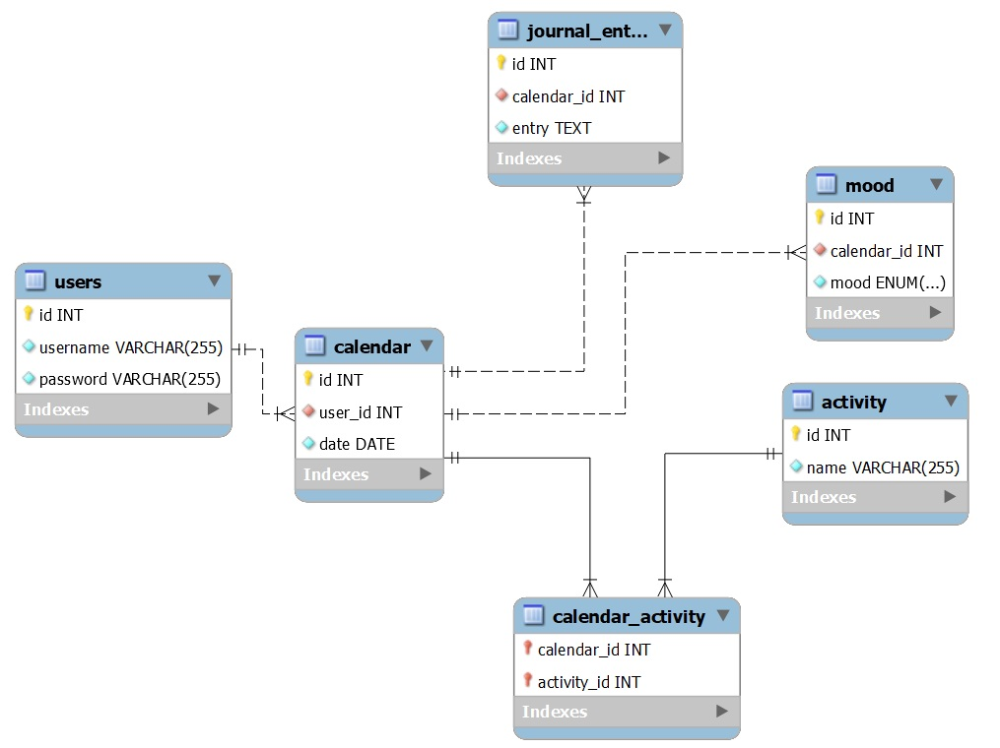

***Credits to https://chat.openai.com/chat.***

---

# MySQL for Calendar Mood Tracker and Journal App

## Creating the tables

(Saturday, December 24, 2022, 18:43)

> Can you please write the MySQL for creating 5 tables for a "Calendar Mood Tracker and Journal" app?

Sure! Here is an example of how you can create 5 tables for a "Calendar Mood Tracker and Journal" app using MySQL:

`calendar` table:

```
CREATE TABLE calendar (
  id INTEGER PRIMARY KEY AUTO_INCREMENT,
  date DATE NOT NULL,
  UNIQUE (date)
);
```

This table will store the dates for which a user can track their mood and journal entries. The id field is a unique identifier for each record, and the date field stores the date for which the mood and journal entry was recorded.

`mood` table:

```
CREATE TABLE mood (
  id INTEGER PRIMARY KEY AUTO_INCREMENT,
  calendar_id INTEGER NOT NULL,
  mood ENUM('happy', 'neutral', 'sad') NOT NULL,
  FOREIGN KEY (calendar_id) REFERENCES calendar(id)
);
```

This table will store the mood for each day. The id field is a unique identifier for each record, the calendar_id field is a foreign key that references the id field in the calendar table, and the mood field stores the mood for the day (either "happy", "neutral", or "sad").

`journal_entry` table:

```
CREATE TABLE journal_entry (
  id INTEGER PRIMARY KEY AUTO_INCREMENT,
  calendar_id INTEGER NOT NULL,
  entry TEXT NOT NULL,
  FOREIGN KEY (calendar_id) REFERENCES calendar(id)
);
```

This table will store the journal entries for each day. The id field is a unique identifier for each record, the calendar_id field is a foreign key that references the id field in the calendar table, and the entry field stores the journal entry for the day.

`activity` table:

```
CREATE TABLE activity (
  id INTEGER PRIMARY KEY AUTO_INCREMENT,
  name VARCHAR(255) NOT NULL,
  UNIQUE (name)
);
```

This table will store the activities that a user can select when tracking their mood. The id field is a unique identifier for each record, and the name field stores the name of the activity.

`calendar_activity` table:

```
CREATE TABLE calendar_activity (
  calendar_id INTEGER NOT NULL,
  activity_id INTEGER NOT NULL,
  PRIMARY KEY (calendar_id, activity_id),
  FOREIGN KEY (calendar_id) REFERENCES calendar(id),
  FOREIGN KEY (activity_id) REFERENCES activity(id)
);
```

This table will store the activities that a user selects for each day. The calendar_id field is a foreign key that references the id field in the calendar table, and the activity_id field is a foreign key that references the id field in the activity table. This table also has a composite primary key consisting of both calendar_id and activity_id.

<br/>

> Can you please write just the entire MySQL code to create this database (without any commentary)?

Sure! Here is an example of how you can add a users table to the database:

```
CREATE TABLE users (
  id INTEGER PRIMARY KEY AUTO_INCREMENT,
  username VARCHAR(255) NOT NULL,
  password VARCHAR(255) NOT NULL,
  UNIQUE (username)
);
```

This table will store the user accounts for the app. The id field is a unique identifier for each user, the username field stores the username chosen by the user, and the password field stores the hashed password for the user.

To integrate this table with the rest of the database, you can add a user_id field as a foreign key to the other tables. For example, you can modify the calendar table to include a user_id field as follows:

```
CREATE TABLE calendar (
  id INTEGER PRIMARY KEY AUTO_INCREMENT,
  user_id INTEGER NOT NULL,
  date DATE NOT NULL,
  UNIQUE (date),
  FOREIGN KEY (user_id) REFERENCES users(id)
);
```

(???) You can also add a user_id field as a foreign key to the mood, journal_entry, and calendar_activity tables. This will allow you to track the mood, journal entries, and activities for each user individually.

<br/>

### Code for creating the tables

> Can you please write just the entire MySQL code to create this database (without any commentary)?

```sql
CREATE DATABASE calendarmoodtracker;
USE calendarmoodtracker;
```

Sure! Here is the entire MySQL code to create the database for the "Calendar Mood Tracker and Journal" app:

```sql
CREATE TABLE users (
  id INTEGER PRIMARY KEY AUTO_INCREMENT,
  username VARCHAR(255) NOT NULL,
  password VARCHAR(255) NOT NULL,
  UNIQUE (username)
);

CREATE TABLE calendar (
  id INTEGER PRIMARY KEY AUTO_INCREMENT,
  user_id INTEGER NOT NULL,
  date DATE NOT NULL,
  UNIQUE (date),
  FOREIGN KEY (user_id) REFERENCES users(id)
);

CREATE TABLE mood (
  id INTEGER PRIMARY KEY AUTO_INCREMENT,
  calendar_id INTEGER NOT NULL,
  mood ENUM('happy', 'neutral', 'sad') NOT NULL,
  FOREIGN KEY (calendar_id) REFERENCES calendar(id)
);

CREATE TABLE journal_entry (
  id INTEGER PRIMARY KEY AUTO_INCREMENT,
  calendar_id INTEGER NOT NULL,
  entry TEXT NOT NULL,
  FOREIGN KEY (calendar_id) REFERENCES calendar(id)
);

CREATE TABLE activity (
  id INTEGER PRIMARY KEY AUTO_INCREMENT,
  name VARCHAR(255) NOT NULL,
  UNIQUE (name)
);

CREATE TABLE calendar_activity (
  calendar_id INTEGER NOT NULL,
  activity_id INTEGER NOT NULL,
  PRIMARY KEY (calendar_id, activity_id),
  FOREIGN KEY (calendar_id) REFERENCES calendar(id),
  FOREIGN KEY (activity_id) REFERENCES activity(id)
);
```

<br/>

🔵 Note from me: Running the above MySQL Code will result in the following MySQL EER Diagram:




<br/>

## Describe the Database as an App Idea and Features

> Can you create a description for an app idea that uses this database?

Sure! Here is a description of an app that uses the database schema that we have created:

The "Calendar Mood Tracker and Journal" app is a tool for users to track their daily mood and activities, as well as write journal entries. The app allows users to create an account and log in to track their mood and activities on a daily basis.

The app has a calendar feature that displays the current month, and allows users to select a specific day to view or edit their mood and activities for that day. Users can select from three options for their mood: "happy", "neutral", or "sad". They can also select from a list of activities that they have completed on that day.

In addition to tracking mood and activities, the app also has a journal feature that allows users to write and view their journal entries for each day. Users can write as much or as little as they want in their journal entries, and can view their past entries at any time.

Overall, the "Calendar Mood Tracker and Journal" app is a simple and intuitive tool that helps users track their mood and activities, and provides a space for them to reflect on their experiences through journaling.

<br/>

> Can you list the features of this app as well as new features that could be added?

Sure! Here are some of the features of the "Calendar Mood Tracker and Journal" app, as well as some potential additional features that could be added:

- Calendar view: The app has a calendar view that displays the current month and allows users to select a specific day to view or edit their mood and activities.

- Mood tracking: Users can select from three options for their mood: "happy", "neutral", or "sad".

- Activity tracking: Users can select from a list of activities that they have completed on a specific day.

- Journaling: Users can write and view their journal entries for each day.

- Account creation and login: Users can create an account and log in to the app to track their mood and activities.

- Additional features: Here are some potential additional features that could be added to the app:

    - Goal tracking: Users could set goals for themselves and track their progress towards those goals.
    - Trend analysis: The app could provide users with insights and trends based on their mood and activity data over time.
    - Notifications: Users could receive reminders to track their mood and activities on a daily basis.
    - Integration with other apps: The app could integrate with other apps or services, such as fitness tracking apps or weather services, to provide users with additional context for their mood and activities.

I hope this helps! Let me know if you have any questions.

<br/>

## SQL Queries

### INSERT Entries

> Can you please write the MySQL for inserting two entries to each table?

Here is an example of how you can insert two entries into each table of the "Calendar Mood Tracker and Journal" app database:

`users` table:


```sql
INSERT INTO users (username, password)
VALUES
  ('user1', 'password1'),
  ('user2', 'password2');
```

This will insert two user records into the users table, with the username and password values specified.

`calendar` table:

```sql
INSERT INTO calendar (user_id, date)
VALUES
  (1, '2022-01-01'),
  (2, '2022-01-02');
```

This will insert two calendar records into the calendar table, with the user_id and date values specified. The user_id values correspond to the id values of the users in the users table.

`mood` table:

```sql
INSERT INTO mood (calendar_id, mood)
VALUES
  (1, 'happy'),
  (2, 'neutral');
```

This will insert two mood records into the mood table, with the calendar_id and mood values specified. The calendar_id values correspond to the id values of the calendar entries in the calendar table.

`journal_entry` table:

```sql
INSERT INTO journal_entry (calendar_id, entry)
VALUES
  (1, 'Today was a great day! I went for a walk and spent time with friends.'),
  (2, 'Today was an average day. I spent some time working and relaxing at home.');
```

This will insert two journal entries into the journal_entry table, with the calendar_id and entry values specified. The calendar_id values correspond to the id values of the calendar entries in the calendar table.

`activity` table:

```sql
INSERT INTO activity (name)
VALUES
  ('walking'),
  ('reading');
```

This will insert two activity records into the activity table, with the name values specified.

`calendar_activity` table:

```sql
INSERT INTO calendar_activity (calendar_id, activity_id)
VALUES
  (1, 1),
  (2, 2);
```

This will insert two calendar activity records into the calendar_activity table, with the calendar_id and activity_id values specified. The calendar_id values correspond to the id values of the calendar entries in the calendar table, and the activity_id values correspond to the id values of the activities in the activity table.

<br/>

> Can you please add more calendar/journal/mood/activities entries to the first user?

Sure! Here is an example of how you can add more calendar, journal, mood, and activity entries to the first user in the "Calendar Mood Tracker and Journal" app database:

calendar table:

```sql
INSERT INTO calendar (user_id, date)
VALUES
  (1, '2022-01-03'),
  (1, '2022-01-04');
```

This will insert two additional calendar records for the first user into the calendar table, with the user_id and date values specified. The user_id value corresponds to the id value of the first user in the users table.

mood table:

```sql
INSERT INTO mood (calendar_id, mood)
VALUES
  (3, 'sad'),
  (4, 'neutral');
```

This will insert two additional mood records for the first user into the mood table, with the calendar_id and mood values specified. The calendar_id values correspond to the id values of the calendar entries in the calendar table that belong to the first user.

journal_entry table:

```sql
INSERT INTO journal_entry (calendar_id, entry)
VALUES
  (3, 'Today was a tough day. I had a lot of work to do and didn't have much free time.'),
  (4, 'Today was an okay day. I spent some time working and also had a chance to relax.');
```

This will insert two additional journal entries for the first user into the journal_entry table, with the calendar_id and entry values specified. The calendar_id values correspond to the id values of the calendar entries in the calendar table that belong to the first user.

activity table:

```sql
INSERT INTO activity (name)
VALUES
  ('exercise'),
  ('cooking');
```

This will insert two additional activity records into the activity table, with the name values specified.

calendar_activity table:

```sql
INSERT INTO calendar_activity (calendar_id, activity_id)
VALUES
  (3, 3),
  (4, 4);
```

This will insert two additional calendar activity records for the first user into the calendar_activity table, with the calendar_id and activity_id values specified. The calendar_id values correspond to the id values of the calendar entries in the calendar table that belong to the first user, and the activity_id values correspond to the id values of the activities in the activity table.

<br/>

### SELECT and JOIN

> Can you please SELECT and join all the columns for the first user?

Sure! Here is an example of how you can use a SELECT statement to join all the columns for the first user in the "Calendar Mood Tracker and Journal" app database:

```sql
SELECT
  calendar.id AS calendar_id,
  calendar.date AS calendar_date,
  mood.mood AS mood,
  journal_entry.entry AS journal_entry,
  activity.name AS activity
FROM calendar
LEFT JOIN mood ON calendar.id = mood.calendar_id
LEFT JOIN journal_entry ON calendar.id = journal_entry.calendar_id
LEFT JOIN calendar_activity ON calendar.id = calendar_activity.calendar_id
LEFT JOIN activity ON calendar_activity.activity_id = activity.id
WHERE calendar.user_id = 1;
```

This SELECT statement will return a result set with the following columns:

- `calendar_id`: the id of the calendar entry
- `calendar_date`: the date of the calendar entry
- `mood`: the mood for the calendar entry
- `journal_entry`: the journal entry for the calendar entry
- `activity`: the activity for the calendar entry

The query uses LEFT JOINS to join the `calendar`, `mood`, `journal_entry`, and `activity` tables based on the foreign key relationships between them. The `WHERE` clause filters the results to only include entries for the first user (`user_id = 1`).

I hope this helps! Let me know if you have any questions.

<br/>

> Can you please show the result for the above JOIN query?

Sure! Here is an example result set for the SELECT query that joins all the columns for the first user in the "Calendar Mood Tracker and Journal" app database:

| calendar_id | calendar_date | mood    | journal_entry                                                                    | activity |
|-------------|---------------|---------|----------------------------------------------------------------------------------|----------|
| 1           | 2022-01-01    | happy   | Today was a great day! I went for a walk and spent time with friends.            | walking  |
| 3           | 2022-01-03    | sad     | Today was a tough day. I had a lot of work to do and didn't have much free time. | exercise |
| 4           | 2022-01-04    | neutral | Today was an okay day. I spent some time working and also had a chance to relax. | cooking  |

This result set includes three calendar entries for the first user, with the corresponding mood, journal entry, and activity values for each entry. If a calendar entry does not have a corresponding value in the mood, journal_entry, or activity table, the corresponding column will be NULL in the result set.

I hope this helps! Let me know if you have any questions.

<br/>


### ALTER User Table

> Thanks! Can you please ALTER the Users table in order to use a hashed password?

Sure! Here is an example of how you can use the ALTER TABLE statement to modify the users table to store hashed passwords:

```sql
ALTER TABLE users
ADD COLUMN hashed_password CHAR(60) NOT NULL;
```

This statement will add a new hashed_password column to the users table, with a datatype of CHAR(60) and a NOT NULL constraint. This column will be used to store the hashed version of the user's password.

Once you have added the hashed_password column, you will need to update your code to hash the user's password when they create an account or change their password, and then store the hashed password in the hashed_password column. You should also modify your login logic to compare the hashed password stored in the hashed_password column to the hashed version of the password provided by the user.

<br/>

### CREATE TRIGGER to hash user password

> Can you please create a trigger to hash a user password when they register a new account?

Sure! Here is an example of how you can create a trigger in MySQL to hash a user's password when they register a new account in the "Calendar Mood Tracker and Journal" app:

```sql
DELIMITER $$

CREATE TRIGGER hash_password_on_insert
BEFORE INSERT ON users
FOR EACH ROW
BEGIN
  SET NEW.hashed_password = SHA2(NEW.password, 256);
END $$

DELIMITER ;
```

This trigger will be executed before any INSERT statement on the users table. It will hash the value of the password column using the SHA2 function, with a hash length of 256 bits, and store the hashed password in the hashed_password column.

You will need to make sure that the hashed_password column is added to the users table before you create this trigger. You can do this using the ALTER TABLE statement, as shown in my previous answer.

<br/>

> Shouldn't the plain text password be deleted after hashing the password?

Yes, it is generally a good idea to delete the plain text password after it has been hashed and stored in the hashed_password column. This helps to protect the user's password in case the database is compromised or accessed by unauthorized users.

Here is an example of how you can modify the trigger to delete the plain text password after it has been hashed:

```sql
DELIMITER $$

CREATE TRIGGER hash_password_on_insert
BEFORE INSERT ON users
FOR EACH ROW
BEGIN
  SET NEW.hashed_password = SHA2(NEW.password, 256);
  SET NEW.password = NULL;
END $$

DELIMITER ;
```

This trigger will set the value of the password column to NULL after it has been used to generate the hashed password. You should also make sure to update your code to use the hashed_password column instead of the password column when checking the user's password during login.

<br/>

### Subqueries examples for mood, activity count

> Can you please show a subquery example on this database?

Sure! Here is an example of how you can use a subquery in a SELECT statement on the "Calendar Mood Tracker and Journal" app database:

```sql
SELECT
  calendar.date AS calendar_date,
  mood.mood AS mood,
  (SELECT AVG(mood.mood) FROM mood WHERE mood.calendar_id = calendar.id) AS avg_mood
FROM calendar
LEFT JOIN mood ON calendar.id = mood.calendar_id
WHERE calendar.user_id = 1;
```

This SELECT statement will return a result set with the following columns:

- `calendar_date`: the date of the calendar entry
- `mood`: the mood for the calendar entry
- `avg_mood`: the average mood for all calendar entries for the current user

The subquery in the SELECT clause calculates the average mood for all calendar entries by querying the mood table and grouping the results by the calendar_id column. The outer query then retrieves the calendar_date and mood values for each calendar entry and joins them with the avg_mood value calculated by the subquery.

<br/>

> That's amazing thanks! Can you show me another subquery example?

```sql
SELECT
  calendar.date AS calendar_date,
  mood.mood AS mood,
  (SELECT COUNT(*) FROM activity WHERE activity.id IN (SELECT calendar_activity.activity_id FROM calendar_activity WHERE calendar_activity.calendar_id = calendar.id)) AS activity_count
FROM calendar
LEFT JOIN mood ON calendar.id = mood.calendar_id
WHERE calendar.user_id = 1;
```

This SELECT statement will return a result set with the following columns:

- `calendar_date`: the date of the calendar entry
- `mood`: the mood for the calendar entry
- `activity_count`: the number of activities for the calendar entry

The subquery in the SELECT clause counts the number of activities for each calendar entry by querying the activity table and filtering the results based on the activity_id values in the calendar_activity table that are associated with the calendar entry. The outer query then retrieves the calendar_date and mood values for each calendar entry and joins them with the activity_count value calculated by the subquery.

<br/>

## Steps to build this app

> Can you briefly describe the steps needed in order to build this app using SpringBoot (as Back-End REST API) and Angular (as Front-End)?

Sure! Here are the steps that you can follow to build the "Calendar Mood Tracker and Journal" app using Spring Boot as the back-end REST API and Angular as the front-end:

1. Set up the development environment: Install and set up the necessary tools and libraries for your development environment, including a Java Development Kit (JDK), an Integrated Development Environment (IDE), and any other dependencies.

2. Create the back-end API: Use Spring Boot to create the back-end API for the app. This involves designing the API endpoints and the data models for the app, as well as implementing the business logic for handling requests and responses. You can use a MySQL database to store the data for the app.

3. Create the front-end interface: Use Angular to create the front-end interface for the app. This involves designing the layout and user interface of the app, as well as implementing the logic for handling user interactions and making API requests to the back-end.

4. Test and debug the app: Test and debug the app to ensure that it is working correctly. This may involve testing the API endpoints and the front-end interface separately, as well as testing the integration between the back-end and front-end.

5. Deploy the app: Once the app is working correctly, you can deploy it to a hosting platform, such as Heroku or AWS, to make it available to users.

<br/>

### API Endpoints

> Can you enumerate the API Endpoints (URLs) for the SpringBoot Back-End that uses this database?

Sure! Here is a list of example API endpoints for a Spring Boot back-end that uses the "Calendar Mood Tracker and Journal" app database:

- `/api/users/register`: Endpoint for creating a new user account.
- `/api/users/login`: Endpoint for logging in to an existing user account.
- `/api/calendar`: Endpoint for retrieving or updating a calendar entry for the current user.
- `/api/mood`: Endpoint for retrieving or updating the mood for a calendar entry.
- `/api/journal`: Endpoint for retrieving or updating the journal entry for a calendar entry.
- `/api/activity`: Endpoint for creating or retrieving a list of activities.
- `/api/calendar/activity`: Endpoint for adding or removing an activity from a calendar entry.

These endpoints are just examples, and you can design your API endpoints in a way that makes sense for your specific app. You may also want to add additional endpoints for features such as goal tracking or trend analysis.

<br/>

### Angular Components

> Thank you very much! Can you briefly describe the Angular components that will be used for this app?

Sure! Here is a list of some of the Angular components that you might use for the "Calendar Mood Tracker and Journal" app:

- `LoginComponent`: Component for the login page, which allows users to enter their username and password and log in to their account.
- `CalendarComponent`: Component for the calendar page, which displays the current user's calendar entries and allows them to add or edit entries.
- `MoodComponent`: Component for the mood page, which displays a form for the user to enter their mood for a specific calendar entry.
- `JournalComponent`: Component for the journal page, which displays a form for the user to enter their journal entry for a specific calendar entry.
- `ActivityComponent`: Component for the activity page, which displays a list of activities and allows the user to add or remove activities from a calendar entry.
- `TrendsComponent`: Component for the trends page, which displays graphs or charts showing the user's mood or activity trends over time.

These components will be responsible for rendering the UI for the app and handling user interactions. You will also need to create services to handle the communication with the back-end API and the data management for the app.

<br/>

### SpringBoot Model Classes

> Can you please write the SpringBoot model class for each MySQL table with no commentary?

Sure! Here are the Spring Boot model classes for the tables in the "Calendar Mood Tracker and Journal" app database:

```java
// User model

@Entity
@Table(name = "users")
public class User {

  @Id
  @GeneratedValue(strategy = GenerationType.IDENTITY)
  private Long id;

  @Column(nullable = false)
  private String username;

  @Column(nullable = false)
  private String hashedPassword;

  // Getters and setters for the fields

}

// Calendar model

@Entity
@Table(name = "calendar")
public class Calendar {

  @Id
  @GeneratedValue(strategy = GenerationType.IDENTITY)
  private Long id;

  @Column(nullable = false)
  private Date date;

  @ManyToOne
  @JoinColumn(name = "user_id", nullable = false)
  private User user;

  // Getters and setters for the fields

}

// Mood model

@Entity
@Table(name = "mood")
public class Mood {

  @Id
  @GeneratedValue(strategy = GenerationType.IDENTITY)
  private Long id;

  @Column(nullable = false)
  private String mood;

  @ManyToOne
  @JoinColumn(name = "calendar_id", nullable = false)
  private Calendar calendar;

  // Getters and setters for the fields

}

// Journal model

@Entity
@Table(name = "journal_entry")
public class Journal {

  @Id
  @GeneratedValue(strategy = GenerationType.IDENTITY)
  private Long id;

  @Column(nullable = false)
  private String entry;

  @ManyToOne
  @JoinColumn(name = "calendar_id", nullable = false)
  private Calendar calendar;

  // Getters and setters for the fields

}

// Activity model

@Entity
@Table(name = "activity")
public class Activity {

  @Id
  @GeneratedValue(strategy = GenerationType.IDENTITY)
  private Long id;

  @Column(nullable = false)
  private String name;

  // Getters and setters for the fields

}

// CalendarActivity model

@Entity
@Table(name = "calendar_activity")
public class CalendarActivity {

  @Id
  @GeneratedValue(strategy = GenerationType.IDENTITY)
  private Long id;

  @ManyToOne
  @JoinColumn(name = "calendar_id", nullable = false)
  private Calendar calendar;

  @ManyToOne
  @JoinColumn(name = "activity_id", nullable = false)
  private Activity activity;

  // Getters and setters for the fields

}
```

Each model class corresponds to a table in the database and represents the data for that table as Java object properties. The `@Entity` and `@Table` annotations specify that the class represents a database entity and maps to a specific table in the database. The `@Id` and @GeneratedValue annotations specify that the id field is the primary key and should be generated automatically by the database. The `@Column`...

> continue

annotation specifies that the field maps to a column in the table, and the `@ManyToOne` and `@JoinColumn` annotations specify that the field is a foreign key that references another entity.

I hope this helps! Let me know if you have any questions.

<br/>

(Saturday, December 24, 2022, 20:34)

> Can you please write the SpringBoot services for each model without commentary?

An error occurred. If this issue persists please contact us through our help center at help.openai.com.

🔴 Note: It seems that this is the time (or conversation) limit for a ChatGPT session:
- 4,297 words;
- 26,821 characters;
- 700 lines;
- 19/20 queries;
- 2 hours.
