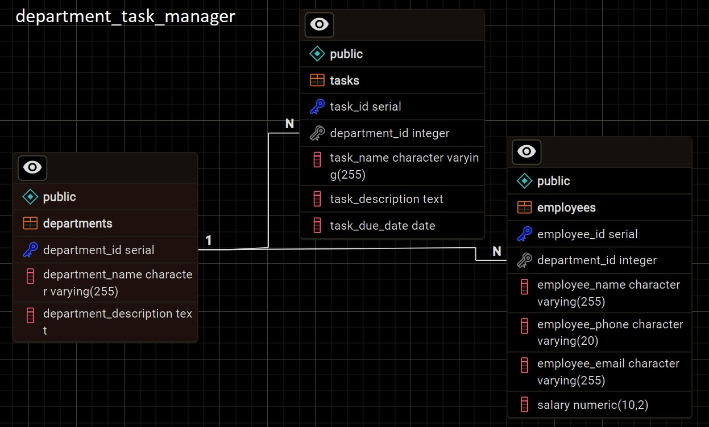
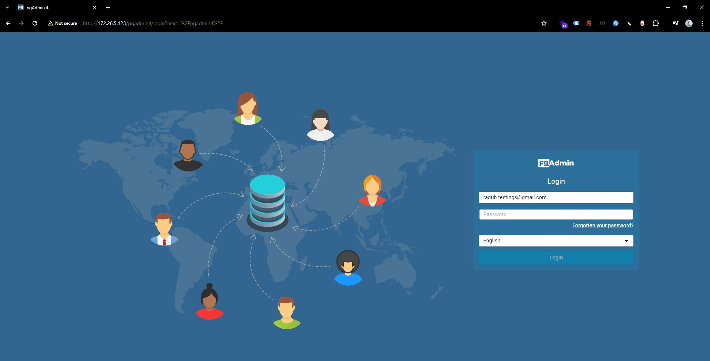
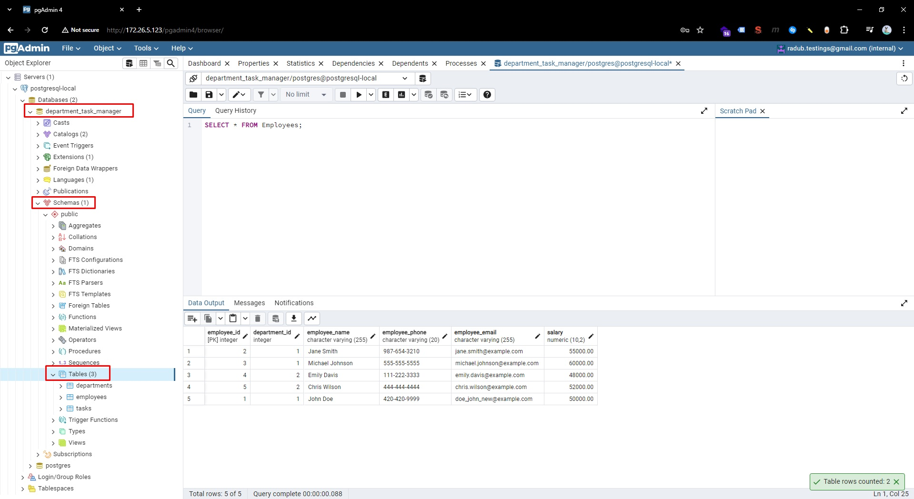
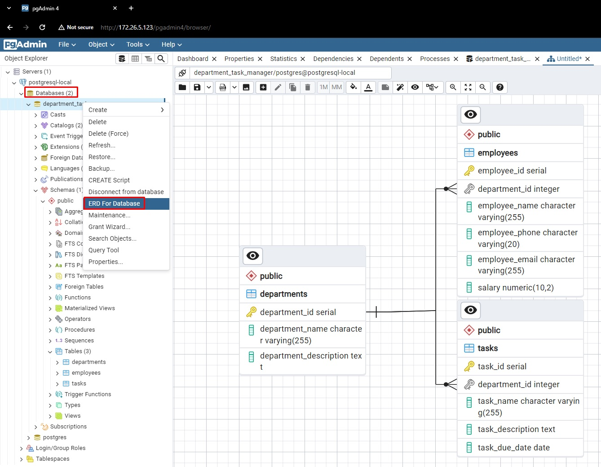

# Installing PostgreSQL 15 on RedhHat 8.9

Table of Contents (ToC):

- [Installing PostgreSQL 15 on RedhHat 8.9](#installing-postgresql-15-on-redhhat-89)
  - [Search and Install PostgreSQL 15 via DNF](#search-and-install-postgresql-15-via-dnf)
  - [Create new Postgresql database cluster](#create-new-postgresql-database-cluster)
    - [Using Postgres Roles](#using-postgres-roles)
  - [Creating a database](#creating-a-database)
    - [CREATE tables](#create-tables)
    - [INSERT data into tables](#insert-data-into-tables)
    - [SELECT data from tables](#select-data-from-tables)
    - [INNER JOIN data](#inner-join-data)
    - [UNION clause](#union-clause)
    - [UPDATE rows](#update-rows)
    - [DELETE rows](#delete-rows)
    - [ALTER tables](#alter-tables)
    - [GROUP BY, HAVING](#group-by-having)
    - [Subqueries](#subqueries)
- [Installing PgAdmin 4 on RHEL8](#installing-pgadmin-4-on-rhel8)
  - [Download an Install PgAdmin](#download-an-install-pgadmin)
  - [Configure PgAdmin4](#configure-pgadmin4)
  - [Open and configure PgAdmin4 Web](#open-and-configure-pgadmin4-web)
  - [PgAdmin4 Web QueryTool and ERD Schema](#pgadmin4-web-querytool-and-erd-schema)
  - [PgAdmin 4 other features list](#pgadmin-4-other-features-list)

<br/>

## Search and Install PostgreSQL 15 via DNF

```bash
cat /etc/redhat-release
# Red Hat Enterprise Linux release 8.9 (Ootpa)
```

<br/>

Postgresql versions end of life from: https://www.postgresql.org/support/versioning/ (Copied on Monday, April 08, 2024)

| Version | Current minor | Supported | First Release      | Final Release     |
| ------- | ------------- | --------- | ------------------ | ----------------- |
| 16      | 16.2          | Yes       | September 14, 2023 | November 9, 2028  |
| 15      | 15.6          | Yes       | October 13, 2022   | November 11, 2027 |
| 14      | 14.11         | Yes       | September 30, 2021 | November 12, 2026 |
| 13      | 13.14         | Yes       | September 24, 2020 | November 13, 2025 |
| 12      | 12.18         | Yes       | October 3, 2019    | November 14, 2024 |
| 11      | 11.22         | No        | October 18, 2018   | November 9, 2023  |
| 10      | 10.23         | No        | October 5, 2017    | November 10, 2022 |

<br/>

https://www.digitalocean.com/community/tutorials/how-to-install-and-use-postgresql-on-centos-8

```bash
dnf module list postgresql

# Updating Subscription Management repositories.
# Last metadata expiration check: 0:00:32 ago on Mon 08 Apr 2024 03:21:57 PM EDT.
# Red Hat Enterprise Linux 8 for x86_64 - AppStream (RPMs)
# Name        Stream     Profiles              Summary
# postgresql  9.6        client, server [d]    PostgreSQL server and client module
# postgresql  10 [d]     client, server [d]    PostgreSQL server and client module
# postgresql  12         client, server [d]    PostgreSQL server and client module
# postgresql  13         client, server [d]    PostgreSQL server and client module
# postgresql  15         client, server [d]    PostgreSQL server and client module

# Hint: [d]efault, [e]nabled, [x]disabled, [i]nstalled
```

To enable the module stream for Postgres version 15, run the following command:

```bash
sudo dnf module enable postgresql:15

Dependencies resolved.
====================================================================
 Package                  Architecture   Version   Repository  Size
====================================================================
Enabling module streams:
 postgresql                              15

Transaction Summary
====================================================================
Is this ok [y/N]: y
Complete!
```

After enabling the version 15 that we want to use, we can install it via:

```bash
sudo dnf install postgresql-server

# Last metadata expiration check: 0:10:58 ago on Mon 08 Apr 2024 03:21:57 PM EDT.
# Dependencies resolved.
# ============================================================================================================
#  Package                 Arch   Version                              Repository                        Size
# ============================================================================================================
# Installing:
#  postgresql-server       x86_64 15.6-1.module+el8.9.0+21287+d0eecfe6 rhel-8-for-x86_64-appstream-rpms 6.1 M
# Installing dependencies:
#  postgresql              x86_64 15.6-1.module+el8.9.0+21287+d0eecfe6 rhel-8-for-x86_64-appstream-rpms 1.7 M
#  postgresql-private-libs x86_64 15.6-1.module+el8.9.0+21287+d0eecfe6 rhel-8-for-x86_64-appstream-rpms 133 k

# Transaction Summary
# ============================================================================================================
# Install  3 Packages

# Total download size: 8.0 M
# Installed size: 32 M
```

```bash
postgres --version
# postgres (PostgreSQL) 15.6
```

<br/>

## Create new Postgresql database cluster

https://www.digitalocean.com/community/tutorials/how-to-install-and-use-postgresql-on-centos-8#step-2-creating-a-new-postgresql-database-cluster

The Postgres package we installed in the previous step comes with a handy script called postgresql-setup which helps with low-level database cluster administration.

```bash
sudo postgresql-setup --initdb
# * Initializing database in '/var/lib/pgsql/data'
# * Initialized, logs are in /var/lib/pgsql/initdb_postgresql.log
```

Start and enable the PostgreSQL service using `systemctl`:

```bash
sudo systemctl start postgresql

sudo systemctl enable postgresql

sudo systemctl status postgresql
# ● postgresql.service - PostgreSQL database server
#    Loaded: loaded (/usr/lib/systemd/system/postgresql.service; enabled; vendor preset: disabled)
#    Active: active (running) since Mon 2024-04-08 15:40:46 EDT; 12s ago
#  Main PID: 29713 (postmaster)
#     Tasks: 7 (limit: 10626)
#    Memory: 17.6M
```

<br/>

### Using Postgres Roles

https://www.digitalocean.com/community/tutorials/how-to-install-and-use-postgresql-on-centos-8#step-3-using-postgresql-roles-and-databases

Note: if we try to run any `postgres` command, we will receive the following:

```bash
[root@radu_rhel8 ~]# postgres
# "root" execution of the PostgreSQL server is not permitted.
# The server must be started under an unprivileged user ID to prevent
# possible system security compromise. See the documentation for
# more information on how to properly start the server.
```

PostgreSQL uses a concept called [_roles_](https://www.postgresql.org/docs/12/database-roles.html) to handle client authentication and authorization.

> These are in some ways similar to regular Unix-style accounts, but Postgres does not distinguish between users and groups and instead prefers the more flexible term _role_.

Upon installation, Postgres is set up to use [_ident_ authentication](https://www.postgresql.org/docs/12/auth-ident.html), meaning that it associates Postgres roles with a matching Unix/Linux system account. If a role exists within Postgres, a Unix/Linux username with the same name is able to sign in as that role.

<br/>

The Postgres installation already created a user account called `postgres` that is associated with the default `postgres` role.

We can Switch over/Log in to the postgres account on your server by typing:

```bash
sudo -i -u postgres

# You can now access a Postgres prompt immediately by typing:
[postgres@radu_rhel8 ~]$ psql
# psql (15.6)
# Type "help" for help.

postgres=#

# exit twice to get back to root
```

Note: Instead of the above, we access postgres prompt without switching accounts by running:

```bash
sudo -u postgres psql
```

<br/>

## Creating a database

https://www.digitalocean.com/community/tutorials/how-to-install-and-use-postgresql-on-centos-8#step-5-creating-a-new-database

Let's create a DepartmentTaskManager database

- Either directly as a root

```bash
sudo -u postgres createdb DepartmentTaskManager
```

- Or by having a logged `postgres` account

```bash
sudo -i -u postgres
psql
create database department_task_manager;
# CREATE DATABASE
```

> Note: `createdb` is a command line utility which you can run from **bash** and not from `psql`. To create a database from **psql**, use the `create database` (https://stackoverflow.com/questions/13321005/postgresql-not-creating-db-with-createdb-as-superuser-yet-not-outputting-erro)

<br/>

To list all the databases we can run `\list` (or `\l` for short)

```sql
postgres=# \list
                                                        List of databases
          Name           |  Owner   | Encoding |   Collate   |    Ctype    | ICU Locale | Locale Provider |   Access privileges
-------------------------+----------+----------+-------------+-------------+------------+-----------------+-----------------------
 department_task_manager | postgres | UTF8     | en_US.UTF-8 | en_US.UTF-8 |            | libc            |
 postgres                | postgres | UTF8     | en_US.UTF-8 | en_US.UTF-8 |            | libc            |
 template0               | postgres | UTF8     | en_US.UTF-8 | en_US.UTF-8 |            | libc            | =c/postgres          +
                         |          |          |             |             |            |                 | postgres=CTc/postgres
 template1               | postgres | UTF8     | en_US.UTF-8 | en_US.UTF-8 |            | libc            | =c/postgres          +
                         |          |          |             |             |            |                 | postgres=CTc/postgres
(4 rows)
```

<br/>

https://www.atlassian.com/data/admin/how-to-list-databases-and-tables-in-postgresql-using-psql

To switch to the created database, use `\c`

```sql
\c department_task_manager
-- You are now connected to database "department_task_manager" as user "postgres".
```

<br/>

### CREATE tables

https://www.digitalocean.com/community/tutorials/how-to-install-and-use-postgresql-on-centos-8#step-7-creating-and-deleting-tables



We will try to make the following tables schema:

- Table Departments one-to-many Table Employees
- Table Departments one-to-many Table Tasks

```sql
-- Create Table A: Departments
CREATE TABLE Departments (
    department_id SERIAL PRIMARY KEY,
    department_name VARCHAR(255),
    department_description TEXT
);

-- Create Table B: Employees
CREATE TABLE Employees (
    employee_id SERIAL PRIMARY KEY,
    department_id INT REFERENCES Departments(department_id),
    employee_name VARCHAR(255),
    employee_phone VARCHAR(20),
    employee_email VARCHAR(255)
);

-- Create Table C: Tasks
CREATE TABLE Tasks (
    task_id SERIAL PRIMARY KEY,
    department_id INT REFERENCES Departments(department_id),
    task_name VARCHAR(255),
    task_description TEXT,
    task_due_date DATE
);
```

In the above SQL code:

- `SERIAL` is used for auto-incrementing integer columns.
- `INT` is used to store integer values.
- `VARCHAR` is used for variable-length character strings.
- `TEXT` is used for variable-length text.
- `REFERENCES` establishes a **foreign key** relationship between tables, ensuring referential integrity.
- `PRIMARY KEY` indicates the **primary key** for each table.

<br/>

We can run `\dt` to list all the table within `\c department_task_manager` database

```sql
\dt
        List of relations
Schema |    Name     | Type  |  Owner
--------+-------------+-------+----------
public | departments | table | postgres
public | employees   | table | postgres
public | tasks       | table | postgres
```

<br/>

### INSERT data into tables

```sql
-- Inserting data into Departments table
INSERT INTO Departments (department_name, department_description) VALUES
    ('Sales', 'Responsible for selling products and services.'),
    ('Marketing', 'Responsible for promoting products and brand awareness.');

-- Inserting data into Employees table
INSERT INTO Employees (department_id, employee_name, employee_phone, employee_email) VALUES
    (1, 'John Doe', '123-456-7890', 'john.doe@example.com'),
    (1, 'Jane Smith', '987-654-3210', 'jane.smith@example.com'),
    (1, 'Michael Johnson', '555-555-5555', 'michael.johnson@example.com'),
    (2, 'Emily Davis', '111-222-3333', 'emily.davis@example.com'),
    (2, 'Chris Wilson', '444-444-4444', 'chris.wilson@example.com');

-- Inserting data into Tasks table
INSERT INTO Tasks (department_id, task_name, task_description, task_due_date) VALUES
    (1, 'Create sales presentation', 'Prepare a presentation for the new product launch.', '2024-04-15'),
    (1, 'Follow up with leads', 'Contact potential customers who have shown interest in our products.', '2024-04-10'),
    (1, 'Attend sales meeting', 'Participate in the weekly sales team meeting.', '2024-04-12'),
    (2, 'Develop marketing campaign', 'Plan and execute a marketing campaign for the upcoming promotion.', '2024-04-20'),
    (2, 'Social media posting', 'Create and schedule posts on social media platforms.', '2024-04-18'),
    (2, 'Design promotional materials', 'Create flyers and banners for the marketing campaign.', '2024-04-25'),
    (2, 'Market research', 'Gather data and insights to inform marketing strategies.', '2024-04-30');
```

<br/>

### SELECT data from tables

```sql
sudo -i -u postgres psql
\c department_task_manager
```

```sql
SELECT * FROM Departments;

 department_id | department_name |                 department_description
---------------+-----------------+---------------------------------------------------------
             1 | Sales           | Responsible for selling products and services.
             2 | Marketing       | Responsible for promoting products and brand awareness.
(2 rows)
```

```sql
SELECT * FROM Employees;

 employee_id | department_id |  employee_name  | employee_phone |       employee_email
-------------+---------------+-----------------+----------------+-----------------------------
           1 |             1 | John Doe        | 123-456-7890   | john.doe@example.com
           2 |             1 | Jane Smith      | 987-654-3210   | jane.smith@example.com
           3 |             1 | Michael Johnson | 555-555-5555   | michael.johnson@example.com
           4 |             2 | Emily Davis     | 111-222-3333   | emily.davis@example.com
           5 |             2 | Chris Wilson    | 444-444-4444   | chris.wilson@example.com
(5 rows)
```

```sql
SELECT * FROM Tasks;

 task_id | department_id |          task_name           |                           task_description                           | task_due_date
---------+---------------+------------------------------+----------------------------------------------------------------------+---------------
       1 |             1 | Create sales presentation    | Prepare a presentation for the new product launch.                   | 2024-04-15
       2 |             1 | Follow up with leads         | Contact potential customers who have shown interest in our products. | 2024-04-10
       3 |             1 | Attend sales meeting         | Participate in the weekly sales team meeting.                        | 2024-04-12
       4 |             2 | Develop marketing campaign   | Plan and execute a marketing campaign for the upcoming promotion.    | 2024-04-20
       5 |             2 | Social media posting         | Create and schedule posts on social media platforms.                 | 2024-04-18
       6 |             2 | Design promotional materials | Create flyers and banners for the marketing campaign.                | 2024-04-25
       7 |             2 | Market research              | Gather data and insights to inform marketing strategies.             | 2024-04-30
(7 rows)
```

<br/>
<br/>

Or let's see some more specific SELECT queries

- Select employees in a specific department:

```sql
SELECT * FROM Employees WHERE department_id = 1;

 employee_id | department_id |  employee_name  | employee_phone |       employee_email
-------------+---------------+-----------------+----------------+-----------------------------
           1 |             1 | John Doe        | 123-456-7890   | john.doe@example.com
           2 |             1 | Jane Smith      | 987-654-3210   | jane.smith@example.com
           3 |             1 | Michael Johnson | 555-555-5555   | michael.johnson@example.com
```

- Select tasks assigned to a specific department:

```sql
SELECT * FROM Tasks WHERE department_id = 2;

 task_id | department_id |          task_name           |                         task_description                          | task_due_date
---------+---------------+------------------------------+-------------------------------------------------------------------+---------------
       4 |             2 | Develop marketing campaign   | Plan and execute a marketing campaign for the upcoming promotion. | 2024-04-20
       5 |             2 | Social media posting         | Create and schedule posts on social media platforms.              | 2024-04-18
       6 |             2 | Design promotional materials | Create flyers and banners for the marketing campaign.             | 2024-04-25
       7 |             2 | Market research              | Gather data and insights to inform marketing strategies.          | 2024-04-30
(4 rows)
```

- Select employees along with their department information:

```sql
SELECT e.*, d.department_name
FROM Employees e
INNER JOIN Departments d ON e.department_id = d.department_id;

 employee_id | department_id |  employee_name  | employee_phone |       employee_email        | department_name
-------------+---------------+-----------------+----------------+-----------------------------+-----------------
           3 |             1 | Michael Johnson | 555-555-5555   | michael.johnson@example.com | Sales
           2 |             1 | Jane Smith      | 987-654-3210   | jane.smith@example.com      | Sales
           1 |             1 | John Doe        | 123-456-7890   | john.doe@example.com        | Sales
           5 |             2 | Chris Wilson    | 444-444-4444   | chris.wilson@example.com    | Marketing
           4 |             2 | Emily Davis     | 111-222-3333   | emily.davis@example.com     | Marketing
(5 rows)
```

- Select tasks along with their department information:

```sql
SELECT t.*, d.department_name
FROM Tasks t
INNER JOIN Departments d ON t.department_id = d.department_id;

 task_id | department_id |          task_name           |                           task_description                           | task_due_date | department_name
---------+---------------+------------------------------+----------------------------------------------------------------------+---------------+-----------------
       1 |             1 | Create sales presentation    | Prepare a presentation for the new product launch.                   | 2024-04-15    | Sales
       2 |             1 | Follow up with leads         | Contact potential customers who have shown interest in our products. | 2024-04-10    | Sales
       3 |             1 | Attend sales meeting         | Participate in the weekly sales team meeting.                        | 2024-04-12    | Sales
       4 |             2 | Develop marketing campaign   | Plan and execute a marketing campaign for the upcoming promotion.    | 2024-04-20    | Marketing
       5 |             2 | Social media posting         | Create and schedule posts on social media platforms.                 | 2024-04-18    | Marketing
       6 |             2 | Design promotional materials | Create flyers and banners for the marketing campaign.                | 2024-04-25    | Marketing
       7 |             2 | Market research              | Gather data and insights to inform marketing strategies.             | 2024-04-30    | Marketing
(7 rows)
```

- Select tasks due before a specific date:

```sql
SELECT * FROM Tasks WHERE task_due_date < '2024-04-20';

 task_id | department_id |         task_name         |                           task_description                           | task_due_date
---------+---------------+---------------------------+----------------------------------------------------------------------+---------------
       1 |             1 | Create sales presentation | Prepare a presentation for the new product launch.                   | 2024-04-15
       2 |             1 | Follow up with leads      | Contact potential customers who have shown interest in our products. | 2024-04-10
       3 |             1 | Attend sales meeting      | Participate in the weekly sales team meeting.                        | 2024-04-12
       5 |             2 | Social media posting      | Create and schedule posts on social media platforms.                 | 2024-04-18
```

- Select employees whose email contains 'example.com':

```sql
SELECT * FROM Employees WHERE employee_email LIKE '%example.com%';

 employee_id | department_id |  employee_name  | employee_phone |       employee_email
-------------+---------------+-----------------+----------------+-----------------------------
           1 |             1 | John Doe        | 123-456-7890   | john.doe@example.com
           2 |             1 | Jane Smith      | 987-654-3210   | jane.smith@example.com
           3 |             1 | Michael Johnson | 555-555-5555   | michael.johnson@example.com
           4 |             2 | Emily Davis     | 111-222-3333   | emily.davis@example.com
           5 |             2 | Chris Wilson    | 444-444-4444   | chris.wilson@example.com
```

- Select departments with a description longer than 50 characters:

```sql
SELECT * FROM Departments WHERE LENGTH(department_description) > 50;

 department_id | department_name |                 department_description
---------------+-----------------+---------------------------------------------------------
             2 | Marketing       | Responsible for promoting products and brand awareness.
(1 row)
```

- Select employees sorted alphabetically by name:

```sql
SELECT * FROM Employees ORDER BY employee_name;

 employee_id | department_id |  employee_name  | employee_phone |       employee_email
-------------+---------------+-----------------+----------------+-----------------------------
           5 |             2 | Chris Wilson    | 444-444-4444   | chris.wilson@example.com
           4 |             2 | Emily Davis     | 111-222-3333   | emily.davis@example.com
           2 |             1 | Jane Smith      | 987-654-3210   | jane.smith@example.com
           1 |             1 | John Doe        | 123-456-7890   | john.doe@example.com
           3 |             1 | Michael Johnson | 555-555-5555   | michael.johnson@example.com
```

<br/>

### INNER JOIN data

```
Departments one-to-many Employees
Departments one-to-many Tasks
```

Example: Template to select all the tasks of a specific employee:

```sql
SELECT t.*
FROM Tasks t
INNER JOIN Employees e ON t.department_id = e.department_id
WHERE e.employee_id = <employee_id>;
```

- Select all tasks for employee with ID 1:

```sql
SELECT t.*, e.employee_name
FROM Tasks t
INNER JOIN Employees e ON t.department_id = e.department_id
WHERE e.employee_id = 1;
```

```
 task_id | department_id |         task_name         |                           task_description                           | task_due_date | employee_name
---------+---------------+---------------------------+----------------------------------------------------------------------+---------------+---------------
       1 |             1 | Create sales presentation | Prepare a presentation for the new product launch.                   | 2024-04-15    | John Doe
       2 |             1 | Follow up with leads      | Contact potential customers who have shown interest in our products. | 2024-04-10    | John Doe
       3 |             1 | Attend sales meeting      | Participate in the weekly sales team meeting.                        | 2024-04-12    | John Doe
(3 rows)
```

<Br/>

### UNION clause

The `UNION` operator is used to combine the results of two or more SELECT statements into a single result set.

```sql
-- Select department names
SELECT department_name FROM Departments
UNION
-- Select employee names
SELECT employee_name FROM Employees;
```

```
 department_name
-----------------
 Emily Davis
 Marketing
 Chris Wilson
 Michael Johnson
 John Doe
 Jane Smith
 Sales
(7 rows)
```

This query will return a list of unique department names and employee names. If a department name and an employee name happen to match, `UNION` will eliminate duplicates and return only unique values.

You can also use `UNION ALL` if you want to include duplicate values (in this case we do not have duplicates):

```sql
-- Select department names
SELECT department_name FROM Departments
UNION ALL
-- Select employee names
SELECT employee_name FROM Employees;
```

```
 department_name
-----------------
 Sales
 Marketing
 John Doe
 Jane Smith
 Michael Johnson
 Emily Davis
 Chris Wilson
(7 rows)
```

<br/>

### UPDATE rows

```sql
-- Update the email of employee with ID 1
UPDATE Employees
SET employee_email = 'doe_john@example.com'
WHERE employee_id = 1;

-- OR

-- Update the phone and email of employee with name 'John Doe'
UPDATE Employees
SET employee_phone = '420-420-9999', employee_email = 'doe_john_new@example.com'
WHERE employee_name = 'John Doe';

```

```sql
SELECT * FROM Employees WHERE employee_id = 1;

 employee_id | department_id | employee_name | employee_phone |      employee_email
-------------+---------------+---------------+----------------+--------------------------
           1 |             1 | John Doe      | 420-420-9999   | doe_john_new@example.com
```

<br/>

### DELETE rows

```sql
-- Inserting a new employee
INSERT INTO Employees (department_id, employee_name, employee_phone, employee_email)
VALUES (1, 'Alice Johnson', '999-888-7777', 'alice.johnson@example.com');

SELECT * FROM Employees;

-- Deleting the newly inserted employee
DELETE FROM Employees
WHERE employee_name = 'Alice Johnson';

SELECT * FROM Employees;
```

<br/>

### ALTER tables

Exmaple: Add a `salary` column to the `Employees` table using the `ALTER TABLE` statement.

```sql
ALTER TABLE Employees
ADD COLUMN salary DECIMAL(10, 2); -- Adjust the data type and precision/scale as needed

-- ALTER TABLE
```

This statement will add a new column named `salary` to the `Employees` table with a `DECIMAL` data type, representing a decimal number with up to 10 digits, 2 of which are after the decimal point.

<br/>

After adding the column, you can then update the salary for each employee as needed. Once the `salary` column is populated, you can use it in your queries for aggregate functions or other purposes:

```sql
UPDATE Employees
SET salary = CASE
                WHEN employee_id = 1 THEN 50000
                WHEN employee_id = 2 THEN 55000
                WHEN employee_id = 3 THEN 60000
                WHEN employee_id = 4 THEN 48000
                WHEN employee_id = 5 THEN 52000
            END;

SELECT * FROM Employees;

 employee_id | department_id |  employee_name  | employee_phone |       employee_email        |  salary
-------------+---------------+-----------------+----------------+-----------------------------+----------
           2 |             1 | Jane Smith      | 987-654-3210   | jane.smith@example.com      | 55000.00
           3 |             1 | Michael Johnson | 555-555-5555   | michael.johnson@example.com | 60000.00
           4 |             2 | Emily Davis     | 111-222-3333   | emily.davis@example.com     | 48000.00
           5 |             2 | Chris Wilson    | 444-444-4444   | chris.wilson@example.com    | 52000.00
           1 |             1 | John Doe        | 420-420-9999   | doe_john_new@example.com    | 50000.00
(5 rows)
```

<br/>

### GROUP BY, HAVING

Example 01: **Find departments that have more than two employees**

```sql
SELECT d.department_id, d.department_name, COUNT(e.employee_id) AS employee_count
FROM Departments d
LEFT JOIN Employees e ON d.department_id = e.department_id
GROUP BY d.department_id, d.department_name
HAVING COUNT(e.employee_id) > 2;

 department_id | department_name | employee_count
---------------+-----------------+----------------
             1 | Sales           |              3
(1 row)
```

In this query:

- We're selecting the department ID and name from the `Departments` table.
- We're counting the number of employees (`employee_id`) in each department using the `COUNT` function.
- We're grouping the results by department ID and name using the `GROUP BY` clause.
- We're using the `HAVING` clause to filter departments that have more than two employees.

<br/>

Example 02: **Calculate the average salary of employees in each department**

```sql
SELECT d.department_id, d.department_name, AVG(e.salary) AS average_salary
FROM Departments d
JOIN Employees e ON d.department_id = e.department_id
GROUP BY d.department_id, d.department_name
ORDER BY average_salary DESC;

 department_id | department_name |   average_salary
---------------+-----------------+--------------------
             1 | Sales           | 55000.000000000000
             2 | Marketing       | 50000.000000000000
(2 rows)
```

In this query:

- We're selecting the department ID and name from the `Departments` table.
- We're using the `AVG` function to calculate the average salary (`e.salary`) of employees in each department.
- We're joining the `Employees` table to the `Departments` table based on the `department_id`.
- We're grouping the results by department ID and name using the `GROUP BY` clause.

<br/>

### Subqueries

Example 01: **Subquery to get Employees with salary above Average**:

```sql
SELECT *
FROM Employees
WHERE salary > (
    SELECT AVG(salary)
    FROM Employees
);

 employee_id | department_id |  employee_name  | employee_phone |       employee_email        |  salary
-------------+---------------+-----------------+----------------+-----------------------------+----------
           2 |             1 | Jane Smith      | 987-654-3210   | jane.smith@example.com      | 55000.00
           3 |             1 | Michael Johnson | 555-555-5555   | michael.johnson@example.com | 60000.00
(2 rows)
```

In this example:

- The inner subquery calculates the average salary of all employees.
- The outer query selects all employees whose salary is above the average calculated by the subquery.

<br/>

Example 02: **Subquery to get Departments with more than two Employees**:

```sql
SELECT department_id, department_name
FROM Departments
WHERE department_id IN (
    SELECT department_id
    FROM Employees
    GROUP BY department_id
    HAVING COUNT(*) > 2
);

 department_id | department_name
---------------+-----------------
             1 | Sales
(1 row)
```

In this example:

- The inner subquery counts the number of employees in each department.
- The outer query selects departments where the count of employees is greater than 2 based on the result of the subquery.

<br/>

Example 03: **Subquery to delete all employees who belong to a department that has fewer than two employees**:

```sql
DELETE FROM Employees
WHERE department_id IN (
    SELECT department_id
    FROM Employees
    GROUP BY department_id
    HAVING COUNT(*) < 2
);
```

In this example:

- The inner subquery retrieves the department IDs that have fewer than three employees.
- The outer `DELETE` statement deletes all records from the `Employees` table where the `department_id` matches any of the department IDs returned by the subquery.

<br/>

# Installing PgAdmin 4 on RHEL8

(Sunday, April 14, 2024, 14:00)

Resources:

- https://computingforgeeks.com/how-to-install-pgadmin-4-on-centos-linux/
- https://www.pgadmin.org/download/pgadmin-4-rpm/

<Br/>

## Download an Install PgAdmin

Downloading and installing redhat repo for PgAdmin4:

```bash
sudo dnf install https://ftp.postgresql.org/pub/pgadmin/pgadmin4/yum/pgadmin4-redhat-repo-2-1.noarch.rpm

# pgadmin4-redhat-repo-2-1.noarch.rpm                                                      10 kB/s | 9.9 kB     00:00
# Dependencies resolved.
# ========================================================================================================================
#  Package                               Architecture            Version              Repository                     Size
# ========================================================================================================================
# Installing:
#  pgadmin4-redhat-repo                  noarch                  2-1                  @commandline                  9.9 k

# Transaction Summary
# ========================================================================================================================
# Install  1 Package

# Total size: 9.9 k
# Installed size: 4.0 k
# Is this ok [y/N]:
```

<br/>

To install for web mode only, suitable for server, use the commands:

```bash
sudo yum install pgadmin4-web

# pgadmin4                                                                                2.8 kB/s | 833  B     00:00
# pgadmin4                                                                                3.8 MB/s | 3.8 kB     00:00
# Importing GPG key 0x210976F2:
#  Userid     : "Package Manager (Package Signing Key) <packages@pgadmin.org>"
#  Fingerprint: E869 7E2E EF76 C02D 3A63 3277 8881 B2A8 2109 76F2
#  From       : /etc/pki/rpm-gpg/PGADMIN_PKG_KEY
```

Note the above will also prompt again to install `policycoreutils-python-utils`. So we could have ran (it will also update it):

```bash
sudo yum install pgadmin4 policycoreutils-python-utils

# Last metadata expiration check: 0:00:35 ago on Sun 14 Apr 2024 08:34:36 AM EDT.
# Package policycoreutils-python-utils-2.9-24.el8.noarch is already installed.
# Dependencies resolved.
# ========================================================================================================================
#  Package                    Arch    Version                                     Repository                         Size
# ========================================================================================================================
# Installing:
#  pgadmin4                   noarch  8.5-1.el8                                   pgAdmin4                          6.2 k
# Installing dependencies:
#  apr                        x86_64  1.6.3-12.el8                                rhel-8-for-x86_64-appstream-rpms  130 k
#  apr-util                   x86_64  1.6.1-9.el8                                 rhel-8-for-x86_64-appstream-rpms  106 k
#  httpd                      x86_64  2.4.37-62.module+el8.9.0+19699+7a7a2044     rhel-8-for-x86_64-appstream-rpms  1.4 M
#  httpd-filesystem           noarch  2.4.37-62.module+el8.9.0+19699+7a7a2044     rhel-8-for-x86_64-appstream-rpms   44 k
#  httpd-tools                x86_64  2.4.37-62.module+el8.9.0+19699+7a7a2044     rhel-8-for-x86_64-appstream-rpms  111 k
#  libatomic                  x86_64  8.5.0-20.el8                                rhel-8-for-x86_64-baseos-rpms      25 k
#  libpq5                     x86_64  16.2-42PGDG.rhel8                           pgAdmin4                          251 k
#  mod_http2                  x86_64  1.15.7-8.module+el8.9.0+21652+2dd1200b.5    rhel-8-for-x86_64-appstream-rpms  155 k
#  pgadmin4-desktop           x86_64  8.5-1.el8                                   pgAdmin4                           96 M
#  pgadmin4-server            x86_64  8.5-1.el8                                   pgAdmin4                          107 M
#  pgadmin4-web               noarch  8.5-1.el8                                   pgAdmin4                          9.2 k
#  python39                   x86_64  3.9.18-1.module+el8.9.0+20024+793d7211      rhel-8-for-x86_64-appstream-rpms   34 k
#  python39-libs              x86_64  3.9.18-1.module+el8.9.0+20024+793d7211      rhel-8-for-x86_64-appstream-rpms  8.2 M
#  python39-mod_wsgi          x86_64  4.7.1-7.module+el8.9.0+19644+d68f775d       rhel-8-for-x86_64-appstream-rpms  487 k
#  python39-pip-wheel         noarch  20.2.4-8.module+el8.9.0+21344+82807453.1    rhel-8-for-x86_64-appstream-rpms  1.3 M
#  python39-setuptools        noarch  50.3.2-4.module+el8.9.0+19644+d68f775d      rhel-8-for-x86_64-appstream-rpms  871 k
#  python39-setuptools-wheel  noarch  50.3.2-4.module+el8.9.0+19644+d68f775d      rhel-8-for-x86_64-appstream-rpms  497 k
#  redhat-logos-httpd         noarch  84.5-2.el8                                  rhel-8-for-x86_64-baseos-rpms      29 k
# Installing weak dependencies:
#  apr-util-bdb               x86_64  1.6.1-9.el8                                 rhel-8-for-x86_64-appstream-rpms   25 k
#  apr-util-openssl           x86_64  1.6.1-9.el8                                 rhel-8-for-x86_64-appstream-rpms   27 k
#  python39-pip               noarch  20.2.4-8.module+el8.9.0+21344+82807453.1    rhel-8-for-x86_64-appstream-rpms  1.9 M
# Enabling module streams:
#  httpd                              2.4
#  python39                           3.9

# Transaction Summary
# ========================================================================================================================
# Install  22 Packages

# Total download size: 219 M
# Installed size: 781 M
# Is this ok [y/N]:

# ...

# Installed:
#   apr-1.6.3-12.el8.x86_64
#   apr-util-1.6.1-9.el8.x86_64
#   apr-util-bdb-1.6.1-9.el8.x86_64
#   apr-util-openssl-1.6.1-9.el8.x86_64
#   httpd-2.4.37-62.module+el8.9.0+19699+7a7a2044.x86_64
#   httpd-filesystem-2.4.37-62.module+el8.9.0+19699+7a7a2044.noarch
#   httpd-tools-2.4.37-62.module+el8.9.0+19699+7a7a2044.x86_64
#   libatomic-8.5.0-20.el8.x86_64
#   libpq5-16.2-42PGDG.rhel8.x86_64
#   mod_http2-1.15.7-8.module+el8.9.0+21652+2dd1200b.5.x86_64
#   pgadmin4-8.5-1.el8.noarch
#   pgadmin4-desktop-8.5-1.el8.x86_64
#   pgadmin4-server-8.5-1.el8.x86_64
#   pgadmin4-web-8.5-1.el8.noarch
#   python39-3.9.18-1.module+el8.9.0+20024+793d7211.x86_64
#   python39-libs-3.9.18-1.module+el8.9.0+20024+793d7211.x86_64
#   python39-mod_wsgi-4.7.1-7.module+el8.9.0+19644+d68f775d.x86_64
#   python39-pip-20.2.4-8.module+el8.9.0+21344+82807453.1.noarch
#   python39-pip-wheel-20.2.4-8.module+el8.9.0+21344+82807453.1.noarch
#   python39-setuptools-50.3.2-4.module+el8.9.0+19644+d68f775d.noarch
#   python39-setuptools-wheel-50.3.2-4.module+el8.9.0+19644+d68f775d.noarch
#   redhat-logos-httpd-84.5-2.el8.noarch

# Complete!
```

<br/>

## Configure PgAdmin4

Start and enable httpd service to start on boot

```bash
sudo systemctl start httpd && sudo systemctl enable httpd
# Created symlink /etc/systemd/system/multi-user.target.wants/httpd.service → /usr/lib/systemd/system/httpd.service.
```

<br/>

Run the web setup script to configure the system to run in web mode:

```bash
sudo /usr/pgadmin4/bin/setup-web.sh

# Setting up pgAdmin 4 in web mode on a Redhat based platform...
# Creating configuration database...
# NOTE: Configuring authentication for SERVER mode.

# Enter the email address and password to use for the initial pgAdmin user account:

# Email address: radub.testings@gmail.com
# Password:
# Retype password:
# pgAdmin 4 - Application Initialisation
# ======================================

# Creating storage and log directories...
# Configuring SELinux...
# The Apache web server is running and must be restarted for the pgAdmin 4 installation to complete. Continue (y/n)? y
# Apache successfully restarted. You can now start using pgAdmin 4 in web mode at http://127.0.0.1/pgadmin4
```

<br/>

If you have an active firewall service, allow http port:

```bash
sudo firewall-cmd --permanent --add-service=http
# success

sudo firewall-cmd --reload
# success
```

<br/>

## Open and configure PgAdmin4 Web

https://computingforgeeks.com/how-to-install-pgadmin-4-on-centos-linux/

Open your browser and navigate to `http://127.0.0.1/pgadmin4` (or `http://VmIpAddress/pgadmin4`)



<br/>

Click on `Add New Server`.

Under the “General” tab, give the server a name & description.

- Server Name: postgresql-local
- Comments: Local PostgreSQL 15 server with PgAdmin4

Under “Connection” tab, provide access details – DB host, DB user and Password.

- Host name/address: 127.0.0.1
- Port: 5432
- Maintenance database: postgres
- Username: postgres
- Password: <PASSWORD> (default for "postgres" is "postgres")

<br/>

👉 Troubleshooting Note 01: From https://stackoverflow.com/questions/12720967/how-can-i-change-a-postgresql-user-password

To change the PostgreSQL user's password, follow these steps:

1. log in into the psql console:

```bash
sudo -u postgres psql
```

2.  Then in the *psql* console, change the password and quit:

```bash
postgres=# \password postgres
Enter new password: <new-password>
postgres=# \q
```

Or using a query:

```sql
ALTER USER postgres PASSWORD '<new-password>';
```

Or in one line

```sql
sudo -u postgres psql -c "ALTER USER postgres PASSWORD '<new-password>';"
```

<br/>

👉 Troubleshooting Note 02:

- From https://stackoverflow.com/questions/2942485/psql-fatal-ident-authentication-failed-for-user-postgres and https://access.redhat.com/documentation/fr-fr/red_hat_enterprise_linux/9/html/configuring_and_using_database_servers/configuring-postgresql_using-postgresql
- If we still receive `psql: error: connection to server at "localhost" (::1), port 5432 failed: FATAL:  Ident authentication failed for user "postgres"` after password update, go to `cd /var/lib/pgsql/data` and edit `vi pg_hba.conf` and replace `ident` by `md5` in the line `host    all             all             127.0.0.1/32            ident`
- Then restart `/etc/init.d/postgresql reload` or `systemctl restart postgresql.service`
- Restart/Refresh PgAdmin in browser and try again to Add new server.
- `cat phb.conf`:

```bash
# TYPE  DATABASE        USER            ADDRESS                 METHOD
# "local" is for Unix domain socket connections only
local   all             all                                     peer
# IPv4 local connections:
host    all             all             127.0.0.1/32            md5
# IPv6 local connections:
host    all             all             ::1/128                 ident
# Allow replication connections from localhost, by a user with the
# replication privilege.
local   replication     all                                     peer
host    replication     all             127.0.0.1/32            ident
host    replication     all             ::1/128                 ident
```

<br/>

## PgAdmin4 Web QueryTool and ERD Schema

We can right click on database/Tables and select "Query Tool" to query our db in PgAdmin



<br/>

We can also view the database ERD Schema (Entity-Relationship Diagram - "Modelul entitate-asociere") by right click and select "ERD For database"



<br/>

## PgAdmin 4 other features list

PgAdmin offers a plethora of functionalities beyond querying and displaying the Entity-Relationship Diagram (ERD) schema. Here are some cool things you can do with PgAdmin:

1. **Database Design and Management**: PgAdmin provides tools for creating and modifying database objects such as tables, views, indexes, sequences, and functions. You can design and manage your database schema visually or through SQL scripts.

2. **Data Import and Export**: PgAdmin allows you to import and export data to and from your PostgreSQL database. You can import data from various file formats like CSV, Excel, and SQL files, and export data to CSV, Excel, JSON, and other formats.

3. **Backup and Restore**: You can perform backups and restores of your PostgreSQL databases directly from PgAdmin. This includes full backups, incremental backups, and point-in-time recovery.

4. **Query Tool Enhancements**: PgAdmin's query tool offers advanced features like query history, query bookmarks, query templates, and syntax highlighting. It supports executing multiple queries simultaneously and displaying results in different formats.

5. **Monitoring and Performance Tuning**: PgAdmin includes tools for monitoring and analyzing database performance. You can view database statistics, analyze query performance, and identify slow queries for optimization.

6. **Security Management**: PgAdmin allows you to manage database security by creating and managing roles, permissions, and access control lists (ACLs). You can grant or revoke privileges at the database, schema, table, or column level.

7. **Extensions and Plug-ins**: PgAdmin supports extensions and plug-ins that extend its functionality. You can install additional features such as graphical explain plans, query plan visualization, and database maintenance utilities.

8. **Customization and Preferences**: PgAdmin offers customization options and preferences to tailor the interface according to your preferences. You can customize keyboard shortcuts, themes, and layouts to improve productivity.

9. **Server Groups and Connections**: PgAdmin lets you organize database servers into groups and manage multiple database connections simultaneously. You can create server groups based on environments (e.g., development, staging, production) and switch between connections easily.

10. **Documentation and Help**: PgAdmin provides extensive documentation and help resources to assist users in understanding its features and functionalities. You can access documentation, release notes, and community forums directly from the PgAdmin interface.
