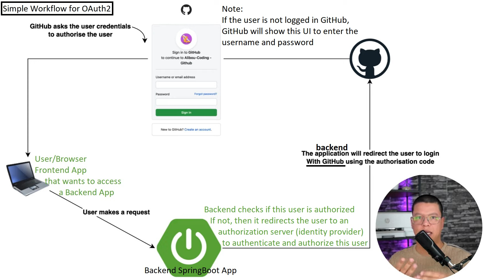
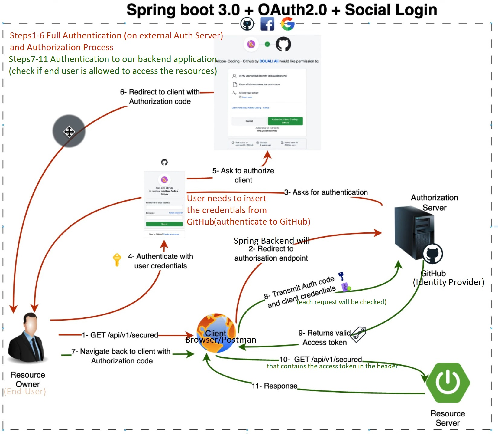
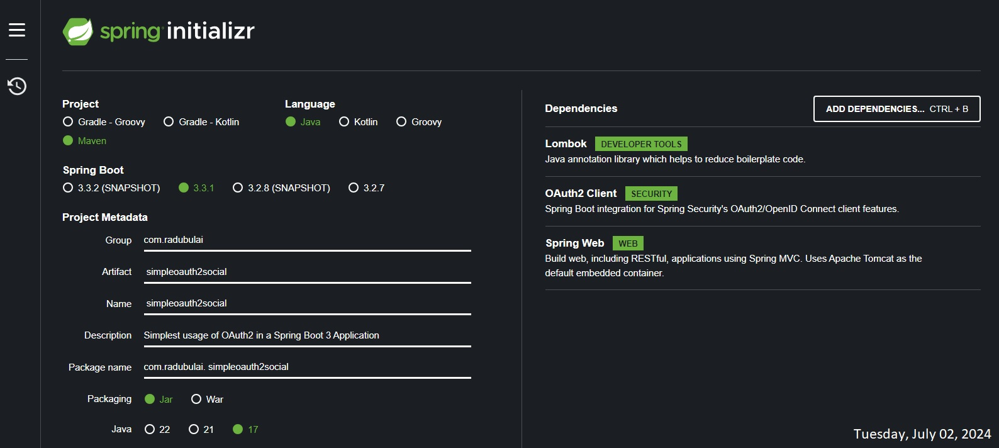
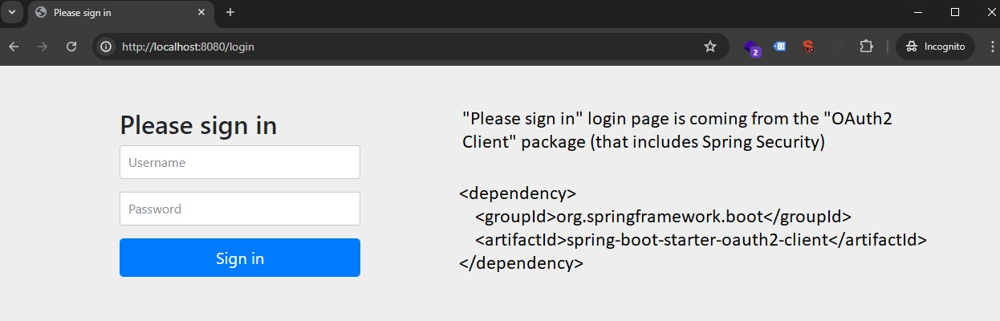

# Simplest Spring Boot 3 OAuth2 Social Login

Credits / Notes taken from:

- OAuth2 & Spring boot 3 & Social login - Bouali Ali - 1h5m - https://www.youtube.com/watch?v=2WNjmT2z7c4

<br/>

# OAuth2 Theory

## What is OAuth 2.0

https://auth0.com/intro-to-iam/what-is-oauth-2

OAuth 2.0, which stands for “Open Authorization”, is a standard protocol for authorization designed to allow a website or application to grant access to (to authorize) resources hosted by other web apps on behalf of a user.

OAuth2 Example: If you want a **third-party application** to post pictures to your social media on your behalf. Instead of giving the **application** your social media username/email and password, you use OAuth 2.0 to authorize the app. You log in to your social media, approve the app’s request, and then the app gets a special token to access your account.

How OAuth2 works in simple terms:

1. **User Authorization:** The user grants permission.
2. **Token Issuance:** The authorization server gives a token to the app.
3. **Resource Access:** The app uses the token to access resources (like posting a picture) on behalf of the user.

<br/>

## OAuth2 vs JWT (JSON Web Token)

- **OAuth 2.0:**

  - Used for **authorization** (granting access to resources).
  - Involves multiple steps (e.g., user granting permissions, token exchange).
  - Often used when third-party services need to access your resources.

- **JWT:**

  - Used for **authentication** (verifying identity via username/email and password).
  - Simpler, single step: the server creates and verifies the token.
  - Often used for single applications where you want to authenticate users.

<br/>

**JWT** is a way to securely transmit information between parties as a JSON object. It's often used for authentication.

JWT Example: After you log in to an application, the server generates a JWT and sends it back to you. This token contains your user information and a signature that ensures the token hasn’t been tampered with. You send this token with each request, and the server verifies it to know you are authenticated.

How JWT works in simple terms:

1. **User Authentication:** The user logs in with a username and password.
2. **Token Creation:** The server generates a JWT containing user info.
3. **Token Usage:** The user sends the JWT with each request, and the server verifies it.

<br/>

**In Summary:**

- Use **OAuth 2.0** when you need to allow third-party applications to act on behalf of users without sharing passwords.
- Use **JWT** for authenticating users within your own application, where the server can issue and verify tokens directly.

<br/>

## OAuth2 Workflow

Simplest OAuth2 workflow (High-Level) diagram:



<br/>

Detailed OAuth2 workflow (Low-Level) diagram:



Images credits: https://www.youtube.com/@BoualiAli

<br/>

# Project Setup using Spring Boot 3.3.1

Currently installed on Windows 10 System as of Tuesday, July 02, 2024:

```bash
# Command Prompt Only
where java
# C:\Program Files\Java\jdk-17.0.1\bin\java.exe
# C:\Program Files (x86)\Common Files\Oracle\Java\javapath\java.exe

java --version
# java 17.0.1 2021-10-19 LTS
# Java(TM) SE Runtime Environment (build 17.0.1+12-LTS-39)
# Java HotSpot(TM) 64-Bit Server VM (build 17.0.1+12-LTS-39, mixed mode, sharing)
java -version # for older versions (e.g. Java8 - build 1.8)

where mvn
# C:\Program Files\apache-maven-3.8.6\bin\mvn
# C:\Program Files\apache-maven-3.8.6\bin\mvn.cmd

mvn --version
# Apache Maven 3.8.6 (84538c9988a25aec085021c365c560670ad80f63)
# Maven home: C:\Program Files\apache-maven-3.8.6
# Java version: 17.0.1, vendor: Oracle Corporation, runtime: C:\Program Files\Java\jdk-17.0.1
```

Note that mvn -version should yield the same Java version value as running java --version (Note that Maven takes the Java JDK from the path value within JAVA_HOME system environment variable). More info can be found here: https://mkyong.com/maven/maven-error-invalid-target-release-17/

```bash
docker --version
# Docker version 20.10.13, build a224086

docker compose version # for newer docker comppose
# Docker Compose version v2.3.3

docker-compose --version # for older docker-compose
# docker-compose version 1.29.2, build 5becea4c
```

<br/>

## Spring Initializr

[Spring Initializr - Initializr generates Spring Boot project with just what you need to start quickly!](https://start.spring.io/)

(Tuesday, July 02, 2024)

Project configuration:

- *Project:* Maven
- *Language:* Java
- *Spring Boot:* 3.3.1 (June 2024)
- _Project Metadata:_
  - *Group (domain):* "ENTER YOUR DOMAIN HERE" (for me it'll be [com.radubulai](https://radubulai.com/))
  - *Artifact (the name of the application):* simpleoauth2social
  - *Name:* simpleoauth2social
  - *Description:* Simplest usage of OAuth2 in a Spring Boot 3 Application
  - *Package name (you could leave the autogenerated name):* com.radubulai.simpleoauth2social
  - *Packaging:* Jar
  - *Java Version:* 17

Dependencies:

- Lombok `DEVELOPER TOOL` - Java annotation library which helps to reduce boilerplate code.

- OAuth2 Client `SECURITY` - Spring Boot integration for Spring Security's OAuth2/OpenID Connect client features.

> Note: `OAuth2 Resource Server` is in case you want to create your own Authorization Server (you will be the Identity Provider?) just like Microsoft, Facebook, Github, Google, AWS, Okta, etc.

- Spring Web - Build web, including RESTful, applications using Spring MVC. Uses Apache Tomcat as the default embedded container.



```xml
<!-- pom.xml -->
<?xml version="1.0" encoding="UTF-8"?>
<project xmlns="http://maven.apache.org/POM/4.0.0" xmlns:xsi="http://www.w3.org/2001/XMLSchema-instance"
	xsi:schemaLocation="http://maven.apache.org/POM/4.0.0 https://maven.apache.org/xsd/maven-4.0.0.xsd">
	<modelVersion>4.0.0</modelVersion>
	<parent>
		<groupId>org.springframework.boot</groupId>
		<artifactId>spring-boot-starter-parent</artifactId>
		<version>3.3.1</version>
		<relativePath/> <!-- lookup parent from repository -->
	</parent>
	<groupId>com.radubulai</groupId>
	<artifactId>simpleoauth2social</artifactId>
	<version>0.0.1-SNAPSHOT</version>
	<name>simpleoauth2social</name>
	<description>Simplest usage of OAuth2 in a Spring Boot 3 Application</description>
	<url/>
	<licenses>
		<license/>
	</licenses>
	<developers>
		<developer/>
	</developers>
	<scm>
		<connection/>
		<developerConnection/>
		<tag/>
		<url/>
	</scm>
	<properties>
		<java.version>17</java.version>
	</properties>
	<dependencies>
		<dependency>
			<groupId>org.springframework.boot</groupId>
			<artifactId>spring-boot-starter-oauth2-client</artifactId>
		</dependency>
		<dependency>
			<groupId>org.springframework.boot</groupId>
			<artifactId>spring-boot-starter-web</artifactId>
		</dependency>

		<dependency>
			<groupId>org.projectlombok</groupId>
			<artifactId>lombok</artifactId>
			<optional>true</optional>
		</dependency>
		<dependency>
			<groupId>org.springframework.boot</groupId>
			<artifactId>spring-boot-starter-test</artifactId>
			<scope>test</scope>
		</dependency>
	</dependencies>

	<build>
		<plugins>
			<plugin>
				<groupId>org.springframework.boot</groupId>
				<artifactId>spring-boot-maven-plugin</artifactId>
				<configuration>
					<excludes>
						<exclude>
							<groupId>org.projectlombok</groupId>
							<artifactId>lombok</artifactId>
						</exclude>
					</excludes>
				</configuration>
			</plugin>
		</plugins>
	</build>

</project>
```

<br/>

## Create ClientId and ClientSecret

### via GitHub

https://github.com/settings/profile > https://github.com/settings/apps

Log into GitHub > Go to Settings > Go to "Developer Settings" (last menu item on left) > "GitHub Apps" > "New Github App"

- GitHub App name: springbootsimpleoauth2
- Description: The simplest usage of OAuth2 in a Spring Boot 3 Demo Application
- Homepage URL: http://localhost:8080
- Callback URL: http://localhost:8080

> After a successful login, we want to come back to the same URL that we came from
> The full URL to redirect to after a user authorizes an installation. Read our Callback [URL documentation](https://docs.github.com/apps/creating-github-apps/registering-a-github-app/about-the-user-authorization-callback-url/) for more information.

- Uncheck Webhook
- Where can this GitHub App be installed? Check "Any account"

<br/>

Copy the "Client ID" and generate a "Client Secret"

<br/>

### via Google

Go to https://console.cloud.google.com/

Click on your projects > New Project

- Google Cloud Project Name: springbootsimpleoauth2
- Location: No organisation

Select the "springbootsimpleoauth2" Project

- From Quick access > Click "APIs and services" > On left menu, click on "Credentials" > Create a "OAuth 2.0 Client ID" (via "Create Credentials" button on top menu)

  - On OAuth Consent screen: select "External"
  - App name: springbootsimpleoauth2
  - App domain: http://localhost:8080

- Application type: Desktop app
- Name: springbootsimpleoauth2
- Authorised JavaScript origins: http://localhost:8080 & http://localhost:4200
- Authorised redirect URIs: http://localhost:8080

Copy the "Client ID" and "Client Secret"

<br/>

# Create the Spring Boot Application

(Tuesday, July 02, 2024)

## Create a Demo Controller

[OAuth2 & Spring boot 3 & Social login - 0h30m](https://youtu.be/2WNjmT2z7c4?t=1829)

Right click on our main project package -> New -> Package -> "demo"

Inside `src/main/java/com/radubulai/simpleoauth2social/demo` create `DemoController.java` class

```java
// DemoController.java
package com.radubulai.simpleoauth2social.demo;

import org.springframework.http.ResponseEntity;
import org.springframework.web.bind.annotation.GetMapping;
import org.springframework.web.bind.annotation.RequestMapping;
import org.springframework.web.bind.annotation.RestController;

@RestController
@RequestMapping("/api/v1/demo")
public class DemoController {

    @GetMapping
    public ResponseEntity<String> hello() {
        return ResponseEntity.ok("Hello from secure endpoint");
    }
}
```

<br/>

If we run the application and navigate to http://localhost:8080/api/v1/demo, we will see a "Please sign in" default login page, that is coming from the "OAuth2 Client" (that includes the Spring Security dependency) package that we have installed.



<br/>

## Web Security Configuration

- On `src/main/java/com/radubulai/simpleoauth2social`: Create `security` package
- Within `security` package, create `SecurityConfig` java class (or, directly, New Java Class: `security.SecurityConfig`)
- Here we will create our `SecurityFilterChain` to secure ALL the endpoints that we have

```java
// SecurityConfig.java
package com.radubulai.simpleoauth2social.security;

import org.springframework.context.annotation.Bean;
import org.springframework.context.annotation.Configuration;
import org.springframework.security.config.annotation.web.builders.HttpSecurity;
import org.springframework.security.config.annotation.web.configuration.EnableWebSecurity;
import org.springframework.security.web.SecurityFilterChain;

@Configuration
@EnableWebSecurity
public class SecurityConfig {
    @Bean
    public SecurityFilterChain securityFilterChain(HttpSecurity http) throws Exception {
        http
            .csrf()
            .disable()
            .authorizeRequests()
            .anyRequest()
            .authenticated()
            .and()
            .oauth2Login();
        return http.build();
    }
}
```

<br/>

## Add GitHub and Google to application.yml

```yml
# application.yml
spring:
  security:
    oauth2:
      client:
        registration:
          github:
            client-id: your_github_client_id
            client-secret: your_github_client_secret
          google:
            client-id: your_google_client_id
            client-secret: your_google_client_secret
```
