# Spring Boot with Angular App: Server Ping Status Tracker

Credits / Notes taken from:

- [Spring Boot and Angular Full Stack Development | 4 Hour Youtube Tutorial from AmigosCode](https://www.youtube.com/watch?v=8ZPsZBcue50)
- [Full Stack Spring Boot RESTful API with MySQL and Angular - Youtube Playlist - Direct Source from getarrays.io | Roland Toussaint "Junior"](https://www.youtube.com/playlist?list=PLopcHtZ0hJF0OIOr88qHuJ3-UKRuCUrKf)
    - https://github.com/getarrays/server-backend/ - Spring Boot Backend
    - https://github.com/getarrays/serverapp/ - Angular Frontend

<br/>

Table of Contents (ToC):

- [Spring Boot with Angular App: Server Ping Status Tracker](#spring-boot-with-angular-app-server-ping-status-tracker)
- [Backend Spring Boot](#backend-spring-boot)
  - [Project Setup](#project-setup)
    - [Spring Initializr](#spring-initializr)
  - [Server Model, Repository, Service, Controller](#server-model-repository-service-controller)
    - [Server Model - Data representation](#server-model---data-representation)
    - [Server Repository - CRUD Operations in Database](#server-repository---crud-operations-in-database)
    - [Server Service - Business logic and application workflow](#server-service---business-logic-and-application-workflow)
    - [(Optional) Response Model for each response from API](#optional-response-model-for-each-response-from-api)
      - [HTTP Status codes from Spring HttpStatus enum](#http-status-codes-from-spring-httpstatus-enum)
    - [Server Controller/Resource - HTTP requests handling, Exposing the API](#server-controllerresource---http-requests-handling-exposing-the-api)
  - [Database configuration](#database-configuration)
  - [Testing with Postman](#testing-with-postman)
- [Frontend Angular](#frontend-angular)
  - [package.json](#packagejson)
  - [Enums, interfaces, services](#enums-interfaces-services)
    - [Server status.enum.ts and date-state.enum.ts](#server-statusenumts-and-date-stateenumts)
    - [Server and Response interface/model](#server-and-response-interfacemodel)
    - [Application state interface app-state.ts](#application-state-interface-app-statets)
    - [Server Angular Service](#server-angular-service)
  - [Demo - Calling GET Servers from app.component.ts](#demo---calling-get-servers-from-appcomponentts)
    - [Solving "blocked by CORS policy" - CORS Configuration](#solving-blocked-by-cors-policy---cors-configuration)
  - [User Interface - Building the HTML using Bootstrap CSS](#user-interface---building-the-html-using-bootstrap-css)
    - [HTML+CSS Boilerplate](#htmlcss-boilerplate)
      - [Spinning Icon based on LOADING dataState when retriving servers](#spinning-icon-based-on-loading-datastate-when-retriving-servers)
      - [Displaying the servers](#displaying-the-servers)
      - [Showing spinning loading icon when pinging individual server](#showing-spinning-loading-icon-when-pinging-individual-server)
  - [UI Functionalities](#ui-functionalities)
    - [Pinging each server from db](#pinging-each-server-from-db)
    - [Filter servers in list by status](#filter-servers-in-list-by-status)
    - [Add new server](#add-new-server)
    - [Delete a server](#delete-a-server)
    - [Update a server and onOpenModal method](#update-a-server-and-onopenmodal-method)
    - [Search Servers in UI](#search-servers-in-ui)
  - [Refactoring: About Page Route](#refactoring-about-page-route)
  - [Angular-Notifier](#angular-notifier)
  - [Angular Reactive vs Procedural approach](#angular-reactive-vs-procedural-approach)

<br/>

Prerequisites / Needs to be installed:

- [Java](https://www.java.com/en/). Check out my [Study Notes on Java](https://github.com/radualexandrub/Study/blob/master/Java/README.md).
- [Apache Maven (mvn)](https://maven.apache.org/download.cgi).
- [Node.js installed](https://nodejs.org/en/). We need it to use NPM (Node Package Manager) to create an Angular App.
- [Angular](https://angular.io/). Check out my [Study Notes on Angular](https://github.com/radualexandrub/Study/blob/master/Angular/README.md).
- [IntelliJ IDEA (Community or other)](https://www.jetbrains.com/idea/) or [Eclipse IDE](https://www.eclipse.org/ide/).
- [Visual Studio Code](https://code.visualstudio.com/).
- [Postman API Platform](https://www.postman.com/) and [HTTPie – API testing client](https://httpie.io/)... or you can use [Insomnia](https://insomnia.rest/) instead
- [MySQL 8.0 (448MB installer)](https://dev.mysql.com/downloads/installer/)

<br/>

# Backend Spring Boot

## Project Setup

Currently installed on system:

```bash
where java
# C:\Program Files\Java\jdk-17.0.1\bin\java.exe
# C:\Program Files (x86)\Common Files\Oracle\Java\javapath\java.exe

java --version
# java 17.0.1 2021-10-19 LTS
# Java(TM) SE Runtime Environment (build 17.0.1+12-LTS-39)
# Java HotSpot(TM) 64-Bit Server VM (build 17.0.1+12-LTS-39, mixed mode, sharing)
java -version # for older versions (e.g. Java8 - build 1.8)

where mvn
# C:\Program Files\apache-maven-3.8.6\bin\mvn
# C:\Program Files\apache-maven-3.8.6\bin\mvn.cmd

mvn --version
# Apache Maven 3.8.6 (84538c9988a25aec085021c365c560670ad80f63)
# Maven home: C:\Program Files\apache-maven-3.8.6
# Java version: 17.0.1, vendor: Oracle Corporation, runtime: C:\Program Files\Java\jdk-17.0.1
```

Note that `mvn -version` should yield the same Java version value as running `java --version` (Note that Maven takes the Java JDK from the path value within `JAVA_HOME` system environment variable). More info can be found here: https://mkyong.com/maven/maven-error-invalid-target-release-17/

```bash
mysqlsh --version
# C:\Program Files\MySQL\MySQL Shell 8.0\bin\mysqlsh.exe   Ver 8.0.30 for Win64 on x86_64 - for MySQL 8.0.30 (MySQL Community Server (GPL))

docker --version
# Docker version 20.10.13, build a224086

docker-compose --version
# docker-compose version 1.29.2, build 5becea4c
```

<br/>

### Spring Initializr

[Spring Initializr - Initializr generates Spring Boot project with just what you need to start quickly!](https://start.spring.io)

(Thursday, July 06, 2023, 19:32)

Project configuration:

- _Project:_ Maven Project
- _Spring Boot:_ Version 2.7.14 (July 2023)
- _Project Metadata:_
  - _Group (domain):_ "ENTER YOUR DOMAIN HERE" (for me it'll be [com.radubulai](https://radubulai.com))
  - _Artifact (the name of the application):_ serverpingstatustracker
  - _Name:_ serverpingstatustracker
  - _Description:_ Server Ping Status Tracker App with Angular Frontend and Spring Boot API Backend
  - _Package name (you could leave the autogenerated name):_ com.radubulai.serverpingstatustracker
  - _Packaging:_ Jar
  - _Java Version:_ 17

Dependencies:

- **Spring Web** - Build web, including RESTful, applications using Spring MVC. Uses Apache Tomcat as the default embedded container.
- **Spring Data JPA** - Persist data in SQL stores with Java Persistence API using Spring Data and Hibernate (ORM - Object Relational Mappind).
- **MySQL JDBC driver**
- **Validation** `I/O` - Bean Validation with Hibernate validator.
- **Lombok** `DEVELOPER TOOL` - Java annotation library which helps to reduce boilerplate code.

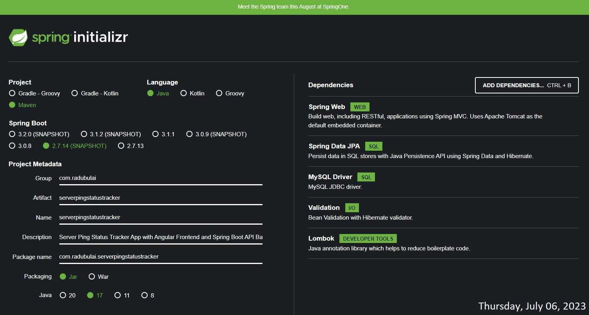

<br/>

The contents of `pom.xml` file:

```xml
<?xml version="1.0" encoding="UTF-8"?>
<project xmlns="http://maven.apache.org/POM/4.0.0" xmlns:xsi="http://www.w3.org/2001/XMLSchema-instance"
    xsi:schemaLocation="http://maven.apache.org/POM/4.0.0 https://maven.apache.org/xsd/maven-4.0.0.xsd">
    <modelVersion>4.0.0</modelVersion>
    <parent>
        <groupId>org.springframework.boot</groupId>
        <artifactId>spring-boot-starter-parent</artifactId>
        <version>2.7.14-SNAPSHOT</version>
        <relativePath/> <!-- lookup parent from repository -->
    </parent>
    <groupId>com.radubulai</groupId>
    <artifactId>serverpingstatustracker</artifactId>
    <version>0.0.1-SNAPSHOT</version>
    <name>serverpingstatustracker</name>
    <description>Server Ping Status Tracker App with Angular Frontend and Spring Boot API Backend</description>
    <properties>
        <java.version>17</java.version>
    </properties>
    <dependencies>
        <dependency>
            <groupId>org.springframework.boot</groupId>
            <artifactId>spring-boot-starter-data-jpa</artifactId>
        </dependency>
        <dependency>
            <groupId>org.springframework.boot</groupId>
            <artifactId>spring-boot-starter-validation</artifactId>
        </dependency>
        <dependency>
            <groupId>org.springframework.boot</groupId>
            <artifactId>spring-boot-starter-web</artifactId>
        </dependency>
        <dependency>
            <groupId>com.mysql</groupId>
            <artifactId>mysql-connector-j</artifactId>
            <scope>runtime</scope>
        </dependency>
        <dependency>
            <groupId>org.projectlombok</groupId>
            <artifactId>lombok</artifactId>
            <optional>true</optional>
        </dependency>
        <dependency>
            <groupId>org.springframework.boot</groupId>
            <artifactId>spring-boot-starter-test</artifactId>
            <scope>test</scope>
        </dependency>
    </dependencies>

    <build>
        <plugins>
            <plugin>
                <groupId>org.springframework.boot</groupId>
                <artifactId>spring-boot-maven-plugin</artifactId>
                <configuration>
                    <excludes>
                        <exclude>
                            <groupId>org.projectlombok</groupId>
                            <artifactId>lombok</artifactId>
                        </exclude>
                    </excludes>
                </configuration>
            </plugin>
        </plugins>
    </build>
    <repositories>
        <repository>
            <id>spring-milestones</id>
            <name>Spring Milestones</name>
            <url>https://repo.spring.io/milestone</url>
            <snapshots>
                <enabled>false</enabled>
            </snapshots>
        </repository>
        <repository>
            <id>spring-snapshots</id>
            <name>Spring Snapshots</name>
            <url>https://repo.spring.io/snapshot</url>
            <releases>
                <enabled>false</enabled>
            </releases>
        </repository>
    </repositories>
    <pluginRepositories>
        <pluginRepository>
            <id>spring-milestones</id>
            <name>Spring Milestones</name>
            <url>https://repo.spring.io/milestone</url>
            <snapshots>
                <enabled>false</enabled>
            </snapshots>
        </pluginRepository>
        <pluginRepository>
            <id>spring-snapshots</id>
            <name>Spring Snapshots</name>
            <url>https://repo.spring.io/snapshot</url>
            <releases>
                <enabled>false</enabled>
            </releases>
        </pluginRepository>
    </pluginRepositories>

</project>
```

<br/>

## Server Model, Repository, Service, Controller

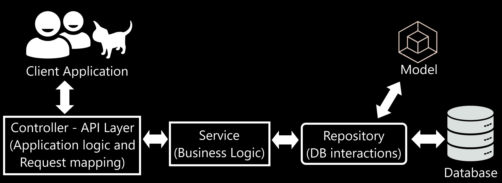

### Server Model - Data representation

[Full Stack Spring Boot RESTful API with MySQL and Angular | RxJs State Management - Part 2](https://www.youtube.com/watch?v=97IZT1Sires&list=PLopcHtZ0hJF0OIOr88qHuJ3-UKRuCUrKf&index=2)

To create a first model class, we right click on our main project package -> New -> Package -> "model".

Inside our "model" package, we right click -> New -> New Java Class -> `Server`.

Our server model will have the following fields (for now):

```java
// /model/Server.java
import com.radubulai.serverpingstatustracker.enumeration.Status;

import java.io.Serializable;

/**
 * @author Radu-Alexandru Bulai (https://radubulai.com)
 * @version 1.0
 * @since 06/07/2023
 */
public class Server implements Serializable {
    private Long id;
    private String ipAddress;
    private String name;
    private String network;
    private Status status;
}
```

> Note: Importing the `Serializable` interface in the `Server` class allows instances of the class to be serialized and deserialized. Serialization is the process of converting an object into a byte stream, which can be stored in a file or transmitted over a network. Deserialization is the reverse process, where the byte stream is converted back into an object. The `Serializable` interface itself doesn't require implementing any methods. It serves as a marker interface, indicating that the class is serializable. This `Server` class can be serialized because all its fields (`id`, `ipAddress`, `name`, `network`, and `status`) are serializable or primitive types.

<br/>

Now we create another `enumeration` package, and `Status.java` inside:

```java
// /enumeration/Status.java
package com.radubulai.serverpingstatustracker.enumeration;

public enum Status {
    SERVER_UP("SERVER_UP"),
    SERVER_DOWN("SERVER_DOWN");

    private final String status;

    Status(String status) {
        this.status = status;
    }

    public String getStatus() {
        return this.status;
    }
}
```

<br/>

Now we want this class to be in a database - that's why we added [_"Spring Data JPA (Java Persistence API)"_](https://spring.io/projects/spring-data-jpa):

- We first add the `@Entity` annotation from _Java Persistence API (JPA)_. This marks the class as an entity, representing a table in a relational database. It indicates that instances of the Server class can be persisted and managed by an ORM (Object-Relational Mapping) framework, such as Hibernate.
- We need to set our "PRIMARY KEY", for this we add `@Id` decorator. We also need to tell it how to generate this ID, so we add `@GeneratedValue(strategy = AUTO)`: This JPA annotation specifies the generation strategy for the `id` field. In this case, the value is set to `AUTO`, which means that the persistence provider (e.g., Hibernate) will determine the most appropriate strategy for generating the primary key values.
- `@Column(unique = true)`: This JPA annotation specifies that the `ipAddress` field should be mapped to a database column, and the `unique` attribute indicates that the values in this column must be unique. It ensures that each `Server` entity has a distinct IP address in the corresponding database column.

Note: from the "Lombok" library we'll use the following decorators:

- `@Data`: This Lombok annotation generates boilerplate code for common methods such as getters, setters, `equals()`, `hashCode()`, and `toString()`. It helps reduce the verbosity of the code by automatically generating these methods based on the class's fields.
- `@NoArgsConstructor`: This Lombok annotation generates a no-argument constructor for the `Server` class. It allows frameworks like JPA to create instances of the class without having to provide constructor arguments explicitly. This constructor is useful in scenarios such as object instantiation through reflection or object population through deserialization.
- `@AllArgsConstructor`: This Lombok annotation generates a constructor with parameters for all fields in the `Server` class. It provides a convenient way to initialize all the fields in a single constructor call. This constructor can be useful when creating instances of the class manually or when mapping data from external sources to the `Server` class, and `status`) are serializable or primitive types.

Note: from the "Validation" (Hibernate Validator library) library we'll use the following:

- `@NotEmpty(message = "IP Address cannot be empty or null")` indicates that the `ipAddress` field must not be empty or null. If an empty or null value is encountered during validation, a validation error with the specified message will be generated.

```java
// /model/Server.java
@Entity
@Data
@NoArgsConstructor
@AllArgsConstructor
public class Server implements Serializable {
    @Id
    @GeneratedValue(strategy = AUTO)
    private Long id;
    @Column(unique = true)
    @NotEmpty(message = "IP Address cannot be empty or null")
    private String ipAddress;
    private String name;
    private String network;
    private Status status;
}
```

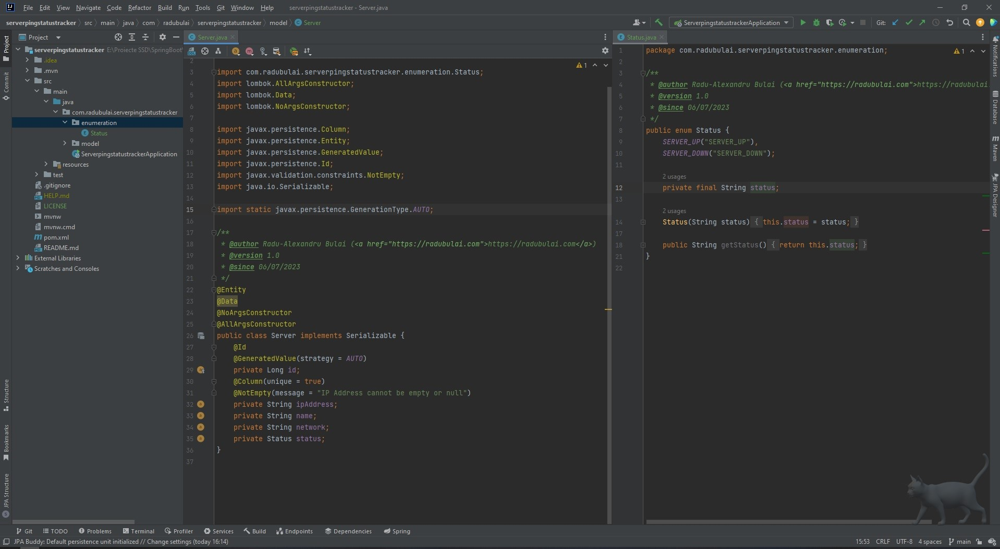

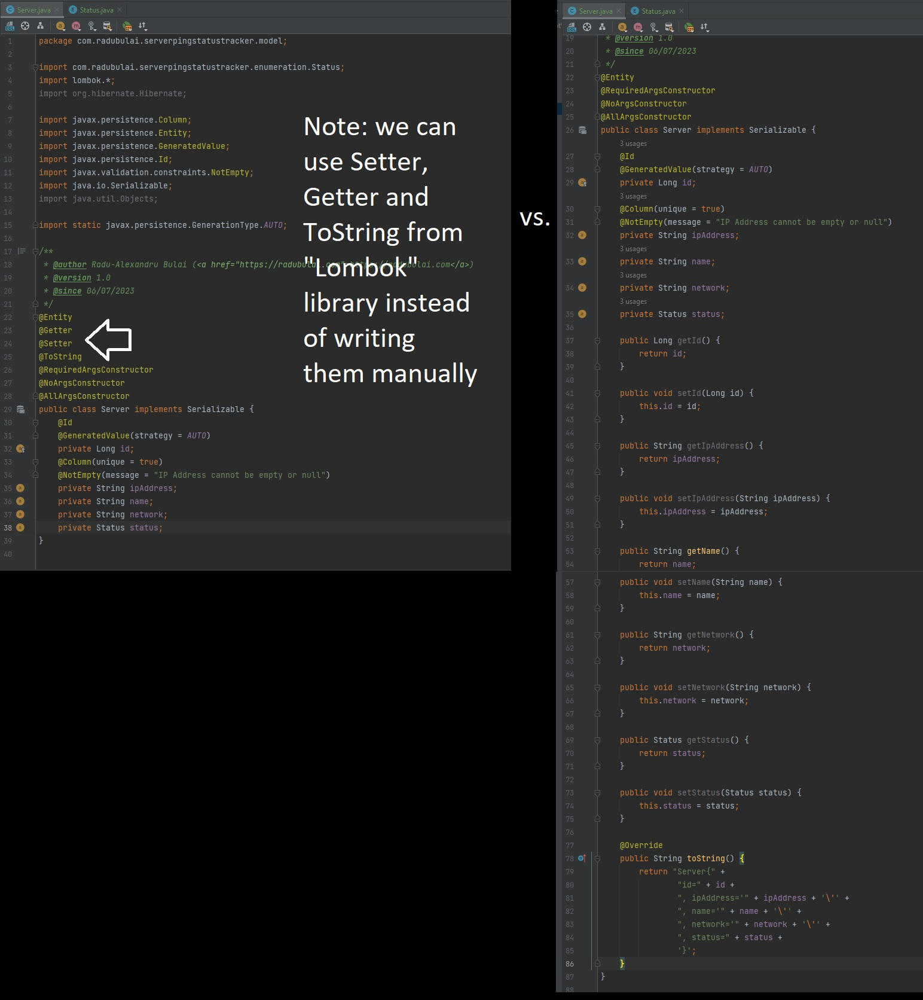

<br/>

### Server Repository - CRUD Operations in Database

[Full Stack Spring Boot RESTful API with MySQL and Angular | RxJs State Management - Part 3](https://www.youtube.com/watch?v=SuWTVgRJG94&list=PLopcHtZ0hJF0OIOr88qHuJ3-UKRuCUrKf&index=3)

All the CRUD (Create, Read, Update, Delete) operations will be created under a "Server Repository" Java package (`repository`).

For the `repository` package:

- On our main project package -> create a new package called `repository`
- Inside `repository` package, we create a Java Interface called `ServerRepository`
- This interface `ServerRepository` will extend the `JpaRepository`. Also, when extending from `JpaRepository` interface, we need to specify the model type (`Server`) and the ID data type (`Long`): `public interface ServerRepository extends JpaRepository<Server, Long>`.

> Note: We can CTRL+Click on `JpaRepository` interface to see its decompilled .class file (its code), and look over its methods, eg: `findAll`, `saveAll`, `deleteAllInBatch`, etc... (those are useful methods as we don't need to implement them from scratch)

<br/>

We are going to use the default methods that are already implemented in the JpaRepository in order to manipulate the data within the database (create Servers, or delete Servers, etc).

However, we will create one additional custom method in order to find a Server entry by its IP Address: `Server findByIpAddress(String ipAddress);` _(or `findServerByIpAddress`, either way is correct)_ - the equivalent MySQL query for this JPA Entity Mapping would be `SELECT * FROM Server WHERE ipAddress = <ipAddress>;`.

> More notes: The process behind "translating `Server findByIpAddress(String ipAddress);` in SQL and returning the `Server` Java Object:
>
> 1.  JPA Entity Mapping: Assuming you have properly configured JPA with Hibernate or any other JPA implementation, and you have mapped the `Server` class to a corresponding table in the database, JPA will handle the mapping between the Java object and the database table.
>
> 2.  Repository Interface: In JPA, you typically define a repository interface that extends `JpaRepository<Server, Long>` or a similar interface. This interface provides various methods for performing CRUD (Create, Read, Update, Delete) operations on the entity.
>
> 3.  Method Declaration: By defining the method `findByIpAddress(String ipAddress)` in the repository interface, you are specifying a custom query method. JPA will automatically generate the SQL query based on the method name and the rules defined in Spring Data JPA.
>
> 4.  SQL Generation: When the application starts up, Spring Data JPA analyzes the method name and parses it to determine the query's intent. In this case, the method name follows the naming convention of `findBy<PropertyName>`. So, Spring Data JPA understands that you want to find a `Server` object based on its `ipAddress` property.
>
> 5.  Query Execution: At runtime, when you invoke the `findByIpAddress()` method with a specific `ipAddress` parameter, Spring Data JPA generates the SQL query mentioned above. It replaces `<ipAddress>` with the actual parameter value and executes the query against the underlying MySQL database.
>
> 6.  Result Mapping: Once the query is executed, the database returns the result set, which consists of rows that match the specified `ipAddress`. Spring Data JPA maps the result set to the `Server` entity class and returns the corresponding Java object or objects.
>
> In summary, the process involves the JPA entity mapping, defining a repository interface with the custom query method, SQL generation based on the method name, execution of the generated query, and mapping the query result back to Java objects. This allows you to easily perform database operations using familiar Java methods and have JPA handle the underlying SQL queries and result mapping for you.
>
> <hr/>
>
> Why JpaRepository is called "repository"?
>
> The term "repository" in the context of Spring Data JPA refers to a pattern commonly used in software development for providing a standardized way to interact with a data source, such as a database. The repository pattern abstracts the underlying data access operations and provides a higher-level interface for working with data.
>
> In the case of Spring Data JPA, the `JpaRepository` interface is an implementation of the repository pattern specifically designed for JPA (Java Persistence API). It combines the features of the repository pattern with the capabilities of JPA to simplify data access and provide a consistent interface for CRUD operations.

<br/>

```java
// ServerRepository.java
package com.radubulai.serverpingstatustracker.repository;

import com.radubulai.serverpingstatustracker.model.Server;
import org.springframework.data.jpa.repository.JpaRepository;

import java.util.Optional;

public interface ServerRepository extends JpaRepository<Server, Long> {

    Server findByIpAddress(String ipAddress);
    void deleteServerById(Long id);
    Optional<Server> findServerById(Long id);
}
```

<br/>

### Server Service - Business logic and application workflow

[Full Stack Spring Boot RESTful API with MySQL and Angular | RxJs State Management - Part 4](https://www.youtube.com/watch?v=TdL-QKKKBc4&list=PLopcHtZ0hJF0OIOr88qHuJ3-UKRuCUrKf&index=4)

So far we have the `Server Model` (data representation) and the `Server Repository` in order to manipulate the data (through CRUD operations in the SQL database). Next we will define the `Server Service` for the different features (or data processing within Java backend - Business logic) that we want to have in our application.

For the `service` package:

- On our main/base project package -> create a new package called `service`
- Inside `service` package, create a new Java **Interface** called `ServerServiceI`
- Here in `ServerServiceI` we can define all our of methods that we will want to implement, such as:
  - retrieving all Servers from database: `Collection<Server> findAllServer();`
  - adding/creating a Server in database: `Server addServer(Server server);`
  - updating a Server in database: `Server updateServer(Server server);`
  - deleting a Server in database: `void deleteServer(Long id);`
  - pinging a server in database: `Server ping(String ipAddress);`

```java
// ServerServiceI.java
package com.radubulai.serverpingstatustracker.service;

import com.radubulai.serverpingstatustracker.model.Server;
import com.radubulai.serverpingstatustracker.repository.ServerRepository;

import java.util.Collection;

public interface ServerServiceI {

    Collection<Server> findAllServers();

    Server addServer(Server server);

    Server updateServer(Server server);

    void deleteServer(Long id);

    Server pingServer(String ipAddress);
}
```

<br/>

- Inside `service` package we can create another `implementation` package, and here we'll have the `ServerServiceImpl.java` class
  - Inside `ServerServiceImpl.java`, we create a `ServerRepository` object where we will use the defined SQL / Query methods
  - Now, usually after declaring this `serverRepository` object, we needed to initialize it by calling the `public ServerServiceImpl(ServerRepository serverRepository) { this.serverRepository = serverRepository; }` constructor - however, since we use the Lombok library, we can simply add the `@RequiredArgsConstructor` annotation
  - We also need to annotate the `ServerService` class repo with `@Service` decorator

```java
// ServerServiceImpl.java
package com.radubulai.serverpingstatustracker.service.implementation;

@Service
@RequiredArgsConstructor
@Transactional
@Slf4j
public class ServerServiceImpl implements ServerServiceI {
    private final ServerRepository serverRepository;
}
```

> Notes on the annotations used:
>
> - `@Service`: This annotation is from the Spring Framework and is used to mark a class as a service component. It indicates that the class contains the business logic of the application. By annotating the class with `@Service`, it becomes eligible for auto-detection and can be injected into other Spring components, such as controllers.
> - `@RequiredArgsConstructor`: This is a Lombok annotation that automatically generates a constructor with required arguments based on the class's final fields. In this case, since the `ServerRepository` field is marked as `final`, Lombok generates a constructor that accepts an instance of `ServerRepository` and assigns it to the field. This eliminates the need for explicitly defining a constructor in the class.
> - `@Transactional`: This annotation is from the Spring Framework and is used to define the transactional behavior of a method or class. By annotating the class with `@Transactional`, all public methods in the class become transactional. Transactions ensure data consistency and integrity by enforcing ACID (Atomicity, Consistency, Isolation, Durability) properties when performing database operations.
> - `@Slf4j`: This annotation is from Lombok and is used to generate a logger field in the class. It automatically creates a logger instance with the name "log" that can be used for logging messages within the class. The logging framework used depends on the project's configuration.

<br/>

Now, we can define all of our business operations, such as:

1\) `pingServer(String ipAddress)`

```java
public Server pingServer(String ipAddress) throws IOException {
    log.info("Pinging Server IP {}", ipAddress);
    int IS_REACHABLE_TIMEOUT_IN_MILLIS = 10000;
    Server server = serverRepository.findByIpAddress(ipAddress);
    InetAddress inetAddress = InetAddress.getByName(ipAddress);
    server.setStatus(inetAddress.isReachable(IS_REACHABLE_TIMEOUT_IN_MILLIS) ? SERVER_UP : SERVER_DOWN);
    serverRepository.save(server);
    return server;
}
```

- retrieves a `Server` object from the `serverRepository` by calling `findByIpAddress` (JPA Entity Mapping of `SELECT * FROM Server WHERE ipAddress = <ipAddress>;` SQL query)
- uses the `InetAddress.getByName` method to obtain an `InetAddress` object corresponding to the given `ipAddress`. This allows the function to perform network-related operations using the IP address.
- sets the status of the `Server` object based on whether the IP address is reachable. If the IP address is reachable within the given timeout, it sets the server's status to "SERVER_UP". Otherwise, it sets the status to "SERVER_DOWN".sets the status of the `Server` object based on whether the IP address is reachable. If the IP address is reachable within the given timeout, it sets the server's status to "SERVER_UP". Otherwise, it sets the status to "SERVER_DOWN".
- saves to database and returns the updated Server object

<br/>

2\) `findAllServers()`

```java
public Collection<Server> findAllServers(int limit) {
    log.info("Fetching {} servers", limit);
    return serverRepository.findAll(PageRequest.of(0, limit)).toList();
}
```

- retrieves a collection of `Server` objects from the `serverRepository` by calling the `findAll` method with a `PageRequest` object. The `PageRequest.of(0, limit)` method creates a `PageRequest` object that specifies the page number (`0` indicates the first page) and the number of results to fetch (`limit` represents the maximum number of servers to fetch)
- returns the collection of `Server` objects

<br/>

3\) `addServer(Server server)`

- return the returned `Server` object from calling the JPA Repository `save` method: `return serverRepository.save(server);` that has an equivalent query of `INSERT INTO servers (column1, column2, column3, ...) VALUES (value1, value2, value3, ...)`

```java
public Server addServer(Server server) {
    log.info("Saving Server {}", server);
    return serverRepository.save(server);
}
```

<br/>

4\) `updateServer(Server server)`

- return `Server` object from the `save` JPA (and underlying JPA provider - e.g. Hibernate) method with the equivalent query of `UPDATE servers SET column1 = value1, column2 = value2, column3 = value3, ... WHERE id = serverId`

```java
public Server updateServer(Server server) {
    log.info("Updating Server {}", server);
    return serverRepository.save(server);
}
```

<br/>

5\) `deleteServerById(Long id)`

- since we can't use `serverRepo.delete(id);` because the `delete` method from inherited JPA Repo does not accept any `Long` type parameter (as an ID), we will need to create our own `serverRepo.deleteserverById(id);` inside `/repo/serverRepo.java`

```java
public void deleteServerById(Long id) {
    log.info("Deleting Server with id={}", id);
    serverRepository.deleteServerById(id);
}
```

<br/>

6\) `findServerById(Long id)`

- `findServerById(Long id)` needs to be defined in the `ServerRepository` (returns `Optional<Server>`)
- if no server is found by id in db, do not return anything - throw a `ServerNotFoundException` instead (using `orElseThrow` Java8 method that receives a Java8 lambda function as parameter)
- we define `ServerNotFoundException` (that inherits `RuntimeException`) separatedly in a package `exception` in `ServerNotFoundExeption.java`

```java
// ServerServiceImpl.java
public Server findServerById(Long id) {
    log.info("Fetching server with id={}", id);
    return serverRepository.findServerById(id).orElseThrow(
            () -> new ServerNotFoundException("Server by id " + id + " was not found")
    );
}
```

```java
// ServerNotFoundExeption.java
package com.radubulai.serverpingstatustracker.exception;

public class ServerNotFoundException extends RuntimeException {
    public ServerNotFoundException(String message) {
        super(message);
    }
}
```

```java
// ServerRepository.java
public interface ServerRepository extends JpaRepository<Server, Long> {

    Server findServerByIpAddress(String ipAddress);
    void deleteServerById(Long id);
    Optional<Server> findServerById(Long id);
}
```

<br/>

Complete code from `ServerServiceImpl.java`:

```java
// ServerServiceImpl.java
package com.radubulai.serverpingstatustracker.service.implementation;

import com.radubulai.serverpingstatustracker.exception.ServerNotFoundException;
import com.radubulai.serverpingstatustracker.model.Server;
import com.radubulai.serverpingstatustracker.repository.ServerRepository;
import com.radubulai.serverpingstatustracker.service.ServerServiceI;
import lombok.RequiredArgsConstructor;
import lombok.extern.slf4j.Slf4j;
import org.springframework.data.domain.Page;
import org.springframework.data.domain.PageRequest;
import org.springframework.data.domain.Pageable;
import org.springframework.stereotype.Service;

import javax.transaction.Transactional;
import java.io.IOException;
import java.net.InetAddress;
import java.util.Collection;

import static com.radubulai.serverpingstatustracker.enumeration.Status.*;

@Service
@RequiredArgsConstructor
@Transactional
@Slf4j
public class ServerServiceImpl implements ServerServiceI {
    private final ServerRepository serverRepository;

    @Override
    public Collection<Server> findAllServers() {
        return serverRepository.findAll();
    }

    public Collection<Server> findAllServers(int limit) {
        log.info("Fetching {} servers", limit);
        return serverRepository.findAll(PageRequest.of(0, limit)).toList();
    }

    public Page<Server> findAllServers(int pageNumber, int pageSize) {
        log.info("Fetching {} servers (Page {})", pageSize, pageNumber);
        Pageable pageable = PageRequest.of(pageNumber, pageSize);
        return serverRepository.findAll(pageable);
    }

    public Server findServerById(Long id) {
        log.info("Fetching server with id={}", id);
        return serverRepository.findServerById(id).orElseThrow(
                () -> new ServerNotFoundException("Server by id " + id + " was not found")
        );
    }

    @Override
    public Server addServer(Server server) {
        log.info("Saving Server {}", server);
        return serverRepository.save(server);
    }

    @Override
    public Server updateServer(Server server) {
        log.info("Updating Server {}", server);
        return serverRepository.save(server);
    }

    @Override
    public void deleteServerById(Long id) {
        log.info("Deleting Server with id={}", id);
        serverRepository.deleteServerById(id);
    }

    @Override
    public Server pingServer(String ipAddress) throws IOException {
        log.info("Pinging Server with ipAddress={}", ipAddress);
        int IS_REACHABLE_TIMEOUT_IN_MILLIS = 10000;
        Server server = serverRepository.findServerByIpAddress(ipAddress);
        InetAddress inetAddress = InetAddress.getByName(ipAddress);
        server.setStatus(inetAddress.isReachable(
            IS_REACHABLE_TIMEOUT_IN_MILLIS) ? SERVER_UP : SERVER_DOWN);
        serverRepository.save(server);
        return server;
    }
}
```

(Saturday, July 08, 2023, 00:46)

<br/>

### (Optional) Response Model for each response from API

[Full Stack Spring Boot RESTful API with MySQL and Angular | RxJs State Management - Part 8](https://www.youtube.com/watch?v=yh2ZlJJ0jXg&list=PLopcHtZ0hJF0OIOr88qHuJ3-UKRuCUrKf&index=8)

Before implementing the Controller, we can create a `Response` class (under `model` package) that we can send back to the end user (browser) no matter the response to the request is an error or a succesfull retrieve/update/etc of data. The `Response` will include several properties such as:

- `timeStamp`
- `statusCode` (the numerical status code)
- `status` (the corresponding `HttpStatus` enum value from Spring Framework, e.g. `OK` for 200, `CREATED` for 201, `MOVED_PERMANENTLY` for 301, `FOUND` for 302, `BAD_REQUEST` for 400, `UNAUTHORIZED` for 401, `NOT_FOUND` for 404, `INTERNAL_SERVER_ERROR` for 500, etc.)
- `reason` (a descriptive reason for the response)
- `message` (a human-readable message that can be shown to the end user)
- `developerMessage` (a more technical message for developers or for debugging purposes)
- `data`

Note, by default, if we do not implement such class, every response that our API will send will be the direct JSON data (and other details will be found in the header of the HTTP request).

```java
package com.radubulai.serverpingstatustracker.model;

import com.fasterxml.jackson.annotation.JsonInclude;
import lombok.Data;
import lombok.experimental.SuperBuilder;
import org.springframework.http.HttpStatus;

import java.time.LocalDateTime;
import java.util.Map;

@Data
@SuperBuilder
@JsonInclude(JsonInclude.Include.NON_NULL)
public class Response {
    protected LocalDateTime timeStamp;
    protected int statusCode;
    protected HttpStatus status;
    protected String reason;
    protected String message;
    protected String developerMessage;
    protected Map<?, ?> data;
}
```

Annotations from above:

- `@Data` annotation from Lombok library generates boilerplate code for common methods such as getters, setters, `equals()`, `hashCode()`, and `toString()`
- `@SuperBuilder` annotation from Lombok library allows for a fluent builder API for constructing instances of the `Response` class (see below its usage in ServerResource controller).
- `@JsonInclude(JsonInclude.Include.NON_NULL)` annotation from the Jackson library ensures that properties with null values are not included in the JSON serialization - it helps in producing a more concise and clean JSON response

<br/>

#### HTTP Status codes from Spring HttpStatus enum

`org.springframework.http.HttpStatus.class`

| Value | HttpStatus.Series | Reason Phrase                   |
| ----- | ----------------- | ------------------------------- |
| 100   | INFORMATIONAL     | Continue                        |
| 101   | INFORMATIONAL     | Switching Protocols             |
| 102   | INFORMATIONAL     | Processing                      |
| 103   | INFORMATIONAL     | Checkpoint                      |
| 200   | SUCCESSFUL        | OK                              |
| 201   | SUCCESSFUL        | Created                         |
| 202   | SUCCESSFUL        | Accepted                        |
| 203   | SUCCESSFUL        | Non-Authoritative Information   |
| 204   | SUCCESSFUL        | No Content                      |
| 205   | SUCCESSFUL        | Reset Content                   |
| 206   | SUCCESSFUL        | Partial Content                 |
| 207   | SUCCESSFUL        | Multi-Status                    |
| 208   | SUCCESSFUL        | Already Reported                |
| 226   | SUCCESSFUL        | IM Used                         |
| 300   | REDIRECTION       | Multiple Choices                |
| 301   | REDIRECTION       | Moved Permanently               |
| 302   | REDIRECTION       | Found                           |
| 303   | REDIRECTION       | See Other                       |
| 304   | REDIRECTION       | Not Modified                    |
| 307   | REDIRECTION       | Temporary Redirect              |
| 308   | REDIRECTION       | Permanent Redirect              |
| 400   | CLIENT_ERROR      | Bad Request                     |
| 401   | CLIENT_ERROR      | Unauthorized                    |
| 402   | CLIENT_ERROR      | Payment Required                |
| 403   | CLIENT_ERROR      | Forbidden                       |
| 404   | CLIENT_ERROR      | Not Found                       |
| 405   | CLIENT_ERROR      | Method Not Allowed              |
| 406   | CLIENT_ERROR      | Not Acceptable                  |
| 407   | CLIENT_ERROR      | Proxy Authentication Required   |
| 408   | CLIENT_ERROR      | Request Timeout                 |
| 409   | CLIENT_ERROR      | Conflict                        |
| 410   | CLIENT_ERROR      | Gone                            |
| 411   | CLIENT_ERROR      | Length Required                 |
| 412   | CLIENT_ERROR      | Precondition Failed             |
| 413   | CLIENT_ERROR      | Payload Too Large               |
| 414   | CLIENT_ERROR      | URI Too Long                    |
| 415   | CLIENT_ERROR      | Unsupported Media Type          |
| 416   | CLIENT_ERROR      | Requested range not satisfiable |
| 417   | CLIENT_ERROR      | Expectation Failed              |
| 418   | CLIENT_ERROR      | I'm a teapot                    |
| 419   | CLIENT_ERROR      | Insufficient Space On Resource  |
| 420   | CLIENT_ERROR      | Method Failure                  |
| 421   | CLIENT_ERROR      | Destination Locked              |
| 422   | CLIENT_ERROR      | Unprocessable Entity            |
| 423   | CLIENT_ERROR      | Locked                          |
| 424   | CLIENT_ERROR      | Failed Dependency               |
| 425   | CLIENT_ERROR      | Too Early                       |
| 426   | CLIENT_ERROR      | Upgrade Required                |
| 428   | CLIENT_ERROR      | Precondition Required           |
| 429   | CLIENT_ERROR      | Too Many Requests               |
| 431   | CLIENT_ERROR      | Request Header Fields Too Large |
| 451   | CLIENT_ERROR      | Unavailable For Legal Reasons   |
| 500   | SERVER_ERROR      | Internal Server Error           |
| 501   | SERVER_ERROR      | Not Implemented                 |
| 502   | SERVER_ERROR      | Bad Gateway                     |
| 503   | SERVER_ERROR      | Service Unavailable             |
| 504   | SERVER_ERROR      | Gateway Timeout                 |
| 505   | SERVER_ERROR      | HTTP Version not supported      |
| 506   | SERVER_ERROR      | Variant Also Negotiates         |
| 507   | SERVER_ERROR      | Insufficient Storage            |
| 508   | SERVER_ERROR      | Loop Detected                   |
| 509   | SERVER_ERROR      | Bandwidth Limit Exceeded        |
| 510   | SERVER_ERROR      | Not Extended                    |
| 511   | SERVER_ERROR      | Network Authentication Required |

<br/>

### Server Controller/Resource - HTTP requests handling, Exposing the API

[Full Stack Spring Boot RESTful API with MySQL and Angular | RxJs State Management - Part 9](https://www.youtube.com/watch?v=sY2oO9oh1BE&list=PLopcHtZ0hJF0OIOr88qHuJ3-UKRuCUrKf&index=9)

For a newly created `resource` package:

- We can create a `ServerResource.java` class (resource is a more usual term for the RESTful API Design Methodology - we could have call it `ServerController.java` instead)
- Add the following annotations:
  - `@RestController`: This annotation is from the Spring Framework and combines the `@Controller` and `@ResponseBody` annotations. It marks the class as a RESTful controller, indicating that the class will handle incoming HTTP requests and produce HTTP responses. The `@RestController` annotation is typically used in Spring MVC or Spring WebFlux applications.
  - `@RequestMapping("/api/servers")`: This annotation is from the Spring Framework and is used to map incoming requests to specific handler methods in the controller. It defines the base URL ("/api/servers") that this controller will handle. In this case, any request that starts with "/api/servers" will be directed to methods within this class for further processing.
  - `@RequiredArgsConstructor`: This annotation is from the Lombok library and generates a constructor with required arguments for the `ServerResource` class. Since `ServerServiceImpl` is a required dependency for `ServerResource`, Lombok generates a constructor that accepts an instance of `ServerServiceImpl` and assigns it to the `serverService` field. This annotation eliminates the need to explicitly write the constructor code.

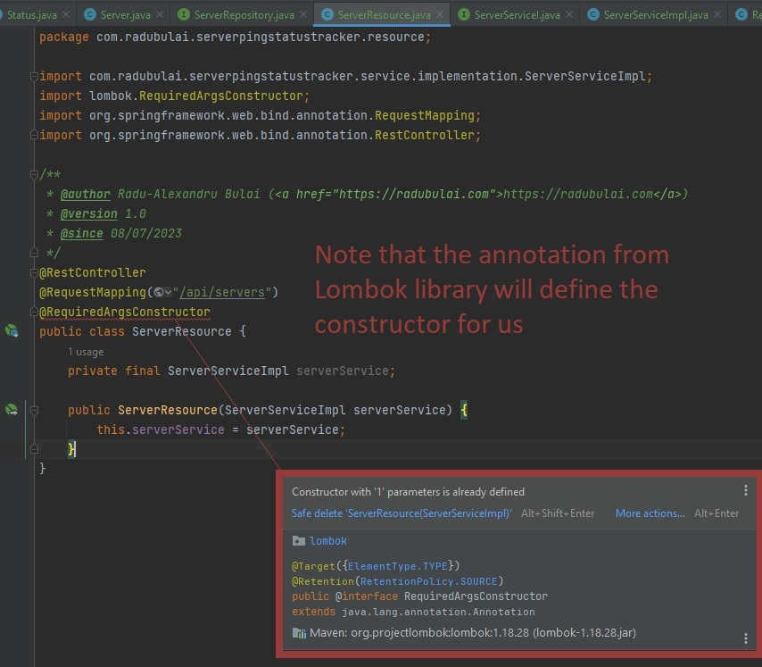

(Saturday, July 08, 2023, 23:41)

<br/>

1\) **getAllServers**

```java
@RestController
@RequestMapping("/api/servers")
@RequiredArgsConstructor
public class ServerResource {
    private final ServerServiceImpl serverService;

    @GetMapping("")
    public ResponseEntity<Response> getAllServers() {
        return ResponseEntity.ok(
                Response.builder()
                        .timeStamp(now())
                        .data(Map.of("servers", serverService.findAllServers()))
                        .message("Servers retrieved")
                        .status(OK)
                        .statusCode(OK.value())
                        .build());
    }
}
```

- `@GetMapping("")`: Spring Framework annotation that maps the function to handle GET requests on the base URL ("/api/servers"). The empty string within the `@GetMapping` annotation indicates that the function will handle GET requests to the base URL itself.
- `public ResponseEntity<Response> getAllServers()`: returns a `ResponseEntity<Response>` object, which represents the HTTP response that will be sent back to the client. The `Response` class is a custom class that encapsulates the response data.
- `ResponseEntity.ok(...)`: method is used to create a `ResponseEntity` object with an HTTP status of 200 (OK). It indicates that the request was successful, and the response will contain the desired data.
- `Response.builder()`: uses the builder pattern (from Lombok library) to create a new `Response` object.
- `.timeStamp(now())`: sets the `timeStamp` property of the `Response` object to the current timestamp.
- `.data(Map.of("servers", serverService.findAllServers()))`: sets the `data` property of the `Response` object to a map containing a single key-value pair. The key is "servers" and the value is the result of calling the `findAllServers()` method on the `serverService` instance.
- `.message("Servers retrieved")`: sets the `message` property of the `Response` object to "Servers retrieved". It provides a human-readable message indicating the purpose of the response.
- `.status(OK)`: sets the `status` property of the `Response` object to the `HttpStatus.OK` enum value, indicating that the request was successful.
- `.statusCode(OK.value())`: sets the `statusCode` property of the `Response` object to the numerical value of the `HttpStatus.OK` enum, which is 200.
- `.build()`: builds the final `Response` object using the configured properties and returns it.

<br/>

2\) **pingServer**

[Full Stack Spring Boot RESTful API with MySQL and Angular | RxJs State Management - Part 10](https://www.youtube.com/watch?v=ngFKEGmV2Ik&list=PLopcHtZ0hJF0OIOr88qHuJ3-UKRuCUrKf&index=10)

The `pingServer` function handles a GET request to ping a server with a specified IP address. It calls the `pingServer` method on the `serverService` instance, retrieves the server object, and constructs a `Response` object containing the server data, timestamp, and a message indicating the success or failure of the ping operation. The response is wrapped in a `ResponseEntity` object with an HTTP status of 200 (OK) and returned to the client.

```java
@GetMapping("/ping/{ipAddress}")
public ResponseEntity<Response> pingServer(
        @PathVariable("ipAddress") String ipAddress) throws IOException {
    Server server = serverService.pingServer(ipAddress);
    return ResponseEntity.ok(
            Response.builder()
                    .timeStamp(now())
                    .data(Map.of("server", server))
                    .message(server.getStatus() == SERVER_UP ? "Ping success" : "Ping failed")
                    .status(OK)
                    .statusCode(OK.value())
                    .build());
}
```

1.  `@GetMapping("/ping/{ipAddress}")`: annotation from the Spring Framework that maps the function to handle GET requests on the URL "/api/servers/ping/{ipAddress}". The `{ipAddress}` is a path variable that will be dynamically replaced with the actual IP address provided in the URL.
2.  `public ResponseEntity<Response> pingServer(@PathVariable("ipAddress") String ipAddress) throws IOException`: handles the GET request and expects a path variable named "ipAddress" to be provided in the URL. The value of the path variable will be passed as the `ipAddress` parameter of the function. It also specifies that the function may throw an `IOException`.
3.  `Server server = serverService.pingServer(ipAddress)`: line calls the `pingServer` method on the `serverService` instance, passing the `ipAddress` parameter. It retrieves a `Server` object representing the server with the specified IP address.
4.  `ResponseEntity.ok(...)`: is used to create a `ResponseEntity` object with an HTTP status of 200 (OK). It indicates that the request was successful, and the response will contain the desired data.
5.  `Response.builder()`: starts building a new `Response` object using the builder pattern.
6.  `.timeStamp(now())`: sets the `timeStamp` property of the `Response` object to the current timestamp.
7.  `.data(Map.of("server", server))`: sets the `data` property of the `Response` object to a map containing a single key-value pair. The key is "server," and the value is the `server` object obtained from the `serverService.pingServer` method.
8.  `.message(server.getStatus() == SERVER_UP ? "Ping success" : "Ping failed")`: sets the `message` property of the `Response` object based on the status of the `server` object. If the server status is `SERVER_UP`, the message is set to "Ping success"; otherwise, it is set to "Ping failed".
9.  `.status(OK)`: sets the `status` property of the `Response` object to the `HttpStatus.OK` enum value, indicating that the request was successful.
10. `.statusCode(OK.value())`: sets the `statusCode` property of the `Response` object to the numerical value of the `HttpStatus.OK` enum, which is 200.
11. `.build()`: builds the final `Response` object using the configured properties and returns it.

<br/>

3\) **addServer**

The `addServer` method handles an HTTP POST request to create a new server. It validates the request payload, adds the server using the `serverService.addServer` method, and constructs a `Response` object containing the server data, timestamp, and a success message. The response is wrapped in a `ResponseEntity` object with an HTTP status of 200 (OK) and returned to the client.

```java
@PostMapping("")
public ResponseEntity<Response> addServer(@RequestBody @Valid Server server) {
    return ResponseEntity.ok(
            Response.builder()
                    .timeStamp(now())
                    .data(Map.of("server", serverService.addServer(server)))
                    .message("Server created")
                    .status(CREATED)
                    .statusCode(CREATED.value())
                    .build());
}
```

1.  `public ResponseEntity<Response> addServer(@RequestBody @Valid Server server)`: method expects a **JSON payload** representing a `Server` object in the request body. The `@RequestBody` annotation binds the request body to the `server` parameter. The `@Valid` annotation validates the `Server` object using the specified validation constraints (e.g., from the ServerModel - `@Column(unique = true) @NotEmpty(message = "IP Address cannot be empty or null") private String ipAddress;`).
2.  `ResponseEntity.ok(...)`: method is used to create a `ResponseEntity` object with an HTTP status of 200 (OK). It indicates that the request was successful, and the response will contain the desired data. Note that if we used `create` it would not let us return back the Server object that was added to database.
3.  `Response.builder()`: starts building a new `Response` object using the builder pattern.
4.  `.timeStamp(now())`: sets the `timeStamp` property of the `Response` object to the current timestamp.
5.  `.data(Map.of("server", serverService.addServer(server)))`: sets the `data` property of the `Response` object to a map containing a single key-value pair. The key is "server," and the value is the `server` object obtained from the `serverService.addServer` method, which adds the server to the system.
6.  `.message("Server created")`: sets the `message` property of the `Response` object to "Server created". It provides a human-readable message indicating the successful creation of the server.
7.  `.status(CREATED)`: sets the `status` property of the `Response` object to the `HttpStatus.CREATED` enum value
8.  `.statusCode(CREATED.value())`: sets the `statusCode` property of the `Response` object to the numerical value of the `HttpStatus.CREATED` enum, which is 201.
9.  `.build()`: builds the final `Response` object using the configured properties and returns it.

<br/>

4\) **getServerById**

[Full Stack Spring Boot RESTful API with MySQL and Angular | RxJs State Management - Part 11](https://www.youtube.com/watch?v=-ZcJLE2mcR8&list=PLopcHtZ0hJF0OIOr88qHuJ3-UKRuCUrKf&index=11)

```java
@GetMapping("/{id}")
public ResponseEntity<Response> getServerById(@PathVariable Long id) {
    return ResponseEntity.ok(
            Response.builder()
                    .timeStamp(now())
                    .data(Map.of("server", serverService.findServerById(id)))
                    .message("Server retrieved")
                    .status(OK)
                    .statusCode(OK.value())
                    .build());
}
```

<br/>

5\) **deleteServerById**

Deletes a server by sending a DELETE request to the `/api/servers/{id}` endpoint, where `{id}` is the identifier of the server to be deleted.

```java
@DeleteMapping("/{id}")
public ResponseEntity<Response> deleteServerById(@PathVariable Long id) {
    return ResponseEntity.ok(
            Response.builder()
                    .timeStamp(now())
                    .data(Map.of("deleted", serverService.deleteServerById(id)))
                    .message("Server deleted")
                    .status(OK)
                    .statusCode(OK.value())
                    .build());
}
```

<br/>

<br/>

Complete code (so far) for `ServerResource.java` (Sunday, July 09, 2023, 00:38)

```java
package com.radubulai.serverpingstatustracker.resource;

import com.radubulai.serverpingstatustracker.model.Response;
import com.radubulai.serverpingstatustracker.model.Server;
import com.radubulai.serverpingstatustracker.service.implementation.ServerServiceImpl;
import lombok.RequiredArgsConstructor;
import org.springframework.http.ResponseEntity;
import org.springframework.web.bind.annotation.*;

import javax.validation.Valid;
import java.io.IOException;
import java.util.Map;

import static com.radubulai.serverpingstatustracker.enumeration.Status.*;
import static java.time.LocalDateTime.*;
import static org.springframework.http.HttpStatus.CREATED;
import static org.springframework.http.HttpStatus.OK;

/**
 * @author Radu-Alexandru Bulai (<a href="https://radubulai.com">https://radubulai.com</a>)
 * @version 1.0
 * @since 08/07/2023
 */
@RestController
@RequestMapping("/api/servers")
@RequiredArgsConstructor
public class ServerResource {
    private final ServerServiceImpl serverService;

    @GetMapping("")
    public ResponseEntity<Response> getAllServers() {
        return ResponseEntity.ok(
                Response.builder()
                        .timeStamp(now())
                        .data(Map.of("servers", serverService.findAllServers()))
                        .message("Servers retrieved")
                        .status(OK)
                        .statusCode(OK.value())
                        .build());
    }

    @GetMapping("/{id}")
    public ResponseEntity<Response> getServerById(@PathVariable Long id) {
        return ResponseEntity.ok(
                Response.builder()
                        .timeStamp(now())
                        .data(Map.of("server", serverService.findServerById(id)))
                        .message("Server retrieved")
                        .status(OK)
                        .statusCode(OK.value())
                        .build());
    }

    @PostMapping("")
    public ResponseEntity<Response> addServer(@RequestBody @Valid Server server) {
        return ResponseEntity.ok(
                Response.builder()
                        .timeStamp(now())
                        .data(Map.of("server", serverService.addServer(server)))
                        .message("Server created")
                        .status(CREATED)
                        .statusCode(CREATED.value())
                        .build());
    }

    @PutMapping("")
    public ResponseEntity<Response> updateServer(@RequestBody @Valid Server server) {
        return ResponseEntity.ok(
                Response.builder()
                        .timeStamp(now())
                        .data(Map.of("server", serverService.updateServer(server)))
                        .message("Server updated")
                        .status(OK)
                        .statusCode(OK.value())
                        .build());
    }

    @DeleteMapping("/{id}")
    public ResponseEntity<Response> deleteServerById(@PathVariable Long id) {
        return ResponseEntity.ok(
                Response.builder()
                        .timeStamp(now())
                        .data(Map.of("deleted", serverService.deleteServerById(id)))
                        .message("Server deleted")
                        .status(OK)
                        .statusCode(OK.value())
                        .build());
    }

    @GetMapping("/ping/{ipAddress}")
    public ResponseEntity<Response> pingServer(
            @PathVariable("ipAddress") String ipAddress) throws IOException {
        Server server = serverService.pingServer(ipAddress);
        return ResponseEntity.ok(
                Response.builder()
                        .timeStamp(now())
                        .data(Map.of("server", server))
                        .message(server.getStatus() == SERVER_UP ? "Ping success" : "Ping failed")
                        .status(OK)
                        .statusCode(OK.value())
                        .build());
    }
}
```

<br/>

Note on July 10, 2023, 22:00: Additional methods were added:

- `public Server pingServer(Long id) throws IOException` - that finds the server by its id then pings it
- `public Collection<Server> pingAllServers() throws IOException` - retrieves all the servers then pings each one of them, returns the list of servers with all statuses updated (Note: could take long until the list is received on client browser)
- `public Status pingServerOnly(String ipAddress) throws IOException` - only pings server specified in URL `@GetMapping("/ping/{ipAddress}")` and returns its status (does not query the database)

<br/>

## Database configuration

After installing [MySQL 8.0 (448MB installer)](https://dev.mysql.com/downloads/installer/), we can open "MySQL 8.0 Command Line Client" (from Windows Start Menu).

🔵 Note: _(On Windows)_ If we cannot start the MySQL Server (eg. "MySQL Workbench" just crashes when we try to start the server):

- Open Windows Start Menu, search and open "Services", manually find `MySQL80` service -> Right click it -> Start.
- (does not work in my case) We can just run (as administrator) the executable from `C:\Program Files\MySQL\MySQL Server 8.0\bin\mysqld.exe`.
- See more here: [Can't startup and connect to MySQL server](https://stackoverflow.com/questions/31387036/cant-startup-and-connect-to-mysql-server).

<br/>

> Alternative: Using MySQL Docker image instead of installing MySQL 8.0 Server _on Linux (or Windows)_ PC
>
> - Install [Docker](https://www.docker.com/).
> - _(In Linux)_ Check if Docker service is running by `systemctl status docker` (use `systemctl start docker` if service is not running)
> - Run `sudo docker images -a` to view current images
> - Run `sudo docker pull mysql` to pull the latest MySQL image from https://hub.docker.com/_/mysql
> - Run the below command that will create a MySQL server container with the following configurations:
>   - Container name: mysql-server
>   - Root password: yourpassword
>   - Database name: pingstatustracker
>   - Exposed port: 3306
>
> ```shell
> sudo docker run -d \
>   --name mysql-server \
>   -e MYSQL_ROOT_PASSWORD=yourpassword \
>   -e MYSQL_DATABASE=pingstatustracker \
>   -p 3306:3306 \
>   mysql:latest \
>   --character-set-server=utf8mb4 \
>   --collation-server=utf8mb4_unicode_ci \
>   --default-authentication-plugin=mysql_native_password \
>   --sql-mode=NO_ENGINE_SUBSTITUTION \
>   --innodb-flush-log-at-trx-commit=0
> ```
>
> Or in one line:
>
> ```shell
> sudo docker run -d --name mysql-server -e MYSQL_ROOT_PASSWORD=yourpassword -e MYSQL_DATABASE=pingstatustracker -p 3306:3306 mysql:latest --character-set-server=utf8mb4 --collation-server=utf8mb4_unicode_ci --default-authentication-plugin=mysql_native_password --sql-mode=NO_ENGINE_SUBSTITUTION --innodb-flush-log-at-trx-commit=0
> ```
>
> - Check if the MySQL container was created with `sudo docker container ls`. You can also check images, containers, cache size with `sudo docker system df`
> - Check if the MySQL container is running with `sudo docker container ls -a`. If MySQL:latest container is up, you can start the Spring Boot Application by running `mvn spring-boot:run` - if application ran with no errors, then the Spring Boot app did successfully connect to MySQL running as docker image!
>
> - You can run `sudo docker exec -it mysql-server mysql -uroot -pyourpassword -D pingstatustracker` to enter the MySQL image and run some INSERT SQL queries, e.g.: `INSERT INTO server (id, ip_address, name, network, status) VALUES (1, '8.8.8.8', 'Google 1', 'External', '0');`
> - Check http://localhost:8080/api/servers if servers from MySQL database running in Docker can be retrieved

<hr/>

<br/>

To set up our database in our Java Spring Application, we need to go to `src/main/resource/application.yml` (Note: `application.properties` can be easily renamed/refactored to `application.yml`):

```yml
# application.yml
spring:
  datasource:
    # MySQL
    url: jdbc:mysql://localhost:3306/pingstatustracker
    username: root
    password: yourpassword
  jpa:
    show-sql: true
    hibernate:
      ddl-auto: update
    properties:
      hibernate:
        dialect: org.hibernate.dialect.MySQL5InnoDBDialect
        format_sql: true
```

For the MySQL setup:

- The default port for MySQL is 3306, so the DB address will be `localhost:3306`
- the name of the database will be `pingstatustracker` => the address will be localhost:3306/`pingstatustracker`

The `spring.jpa` section contains configuration settings for JPA (Java Persistence API) and Hibernate, the ORM (Object-Relational Mapping) framework.

- `show-sql: true` enables logging of SQL statements executed by Hibernate, providing visibility into the generated SQL queries (Note that this should always be disabled in production).
- `hibernate.ddl-auto:`
  - `create` specifies that Hibernate should automatically create the database schema based on the entity mappings. This will create the necessary tables when the application starts. Note that this setting is typically used in development and should be handled differently in production.
  - `update` means that Hibernate will update the database schema based on the entity classes' definitions if necesary.
- `properties.hibernate.dialect` specifies the dialect to use for the MySQL database. In this case, the `org.hibernate.dialect.MySQL5InnoDBDialect` dialect is selected, which is suitable for MySQL version 5 and InnoDB storage engine.
- `properties.hibernate.format_sql: true` enables the formatting of SQL statements logged by Hibernate, making them more readable for debugging purposes.

<hr/>

We can now create the `pingstatustracker` MySQL database:

- Open "MySQL 8.0 Command Line Client", write: `create database pingstatustracker;`
- We can check with `show databases;` command

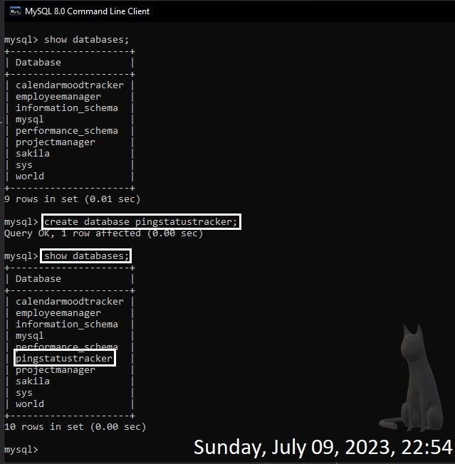

<br/>

We can run the Java Application from Terminal, in the main project directory:

```shell
mvn spring-boot:run
```

<br/>

After running the app, the `Server` table from the `pingstatustracker` database is created automatically in MySQL and can be seen via MySQL Workbench App:

- On MySQL Workbench -> Click on "Database" from the menu -> "Reverse Engineer(CTRL+B)" -> next, next, next -> Select your schema -> "execute".

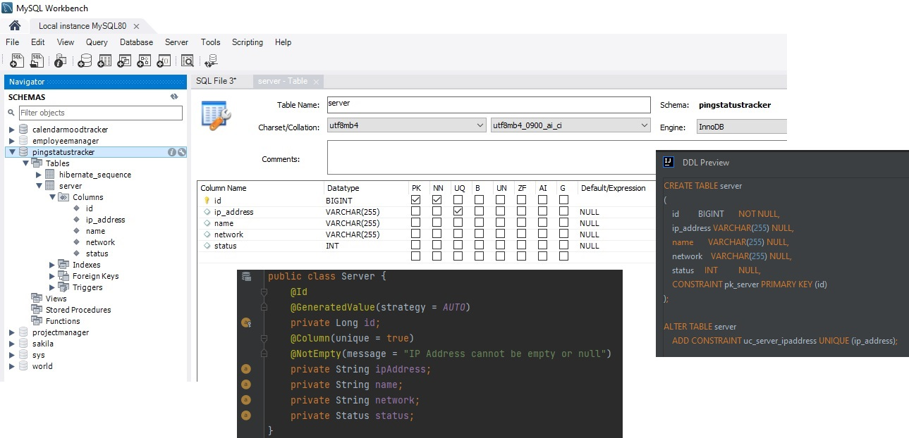


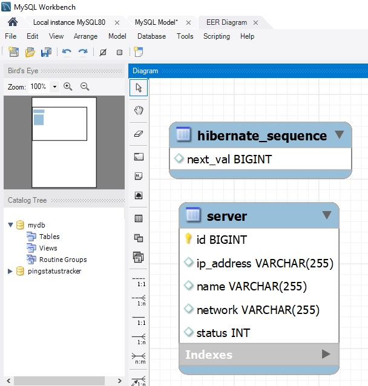

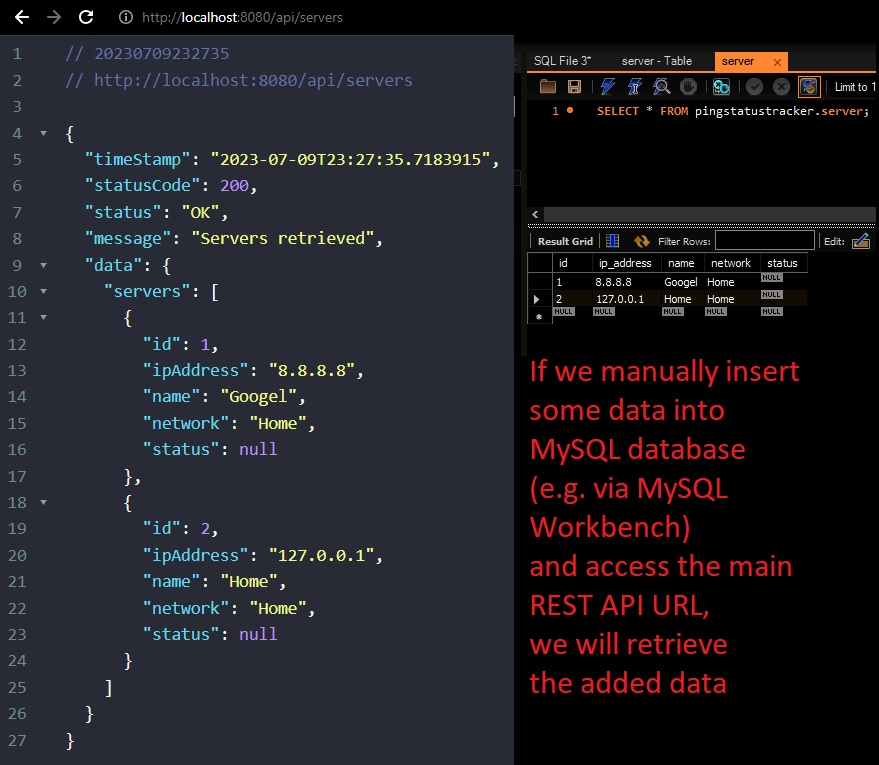

(Sunday, July 09, 2023, 23:35)

<br/>

Note: We can also interogate (or insert some data into) our MySQL database from the `MySQL 8.0 Command Line Client.exe`:

```sql
show databases;

use pingstatustracker;

show tables;

select * from server;
```

We can insert the following data, where:

- `0` = "SERVER_UP" (Ping success)
- `1` = "SERVER_DOWN" (Ping failed)

```sql
INSERT INTO server (id, ip_address, name, network, status) VALUES (1, '8.8.8.8', 'Google 1', 'External', '0');
INSERT INTO server (id, ip_address, name, network) VALUES (2, '4.4.4.4', 'Google 2', 'External');
INSERT INTO server (id, ip_address, name, network) VALUES (3, '192.168.0.1', 'Server 1', 'Office');
INSERT INTO server (id, ip_address, name) VALUES (4, '192.168.0.3', 'License');
```

- Note: To remove all rows from the server table, effectively deleting all the inserted entries, run `DELETE FROM server;`

<br/>

## Testing with Postman

[Full Stack Spring Boot RESTful API with MySQL and Angular | RxJs State Management - Part 12](https://www.youtube.com/watch?v=A5AebdQACgY&list=PLopcHtZ0hJF0OIOr88qHuJ3-UKRuCUrKf&index=12)

You can create an account and download Postman from here: <https://www.postman.com/downloads/>

<br/>

Run the application (`mvn spring-boot:run` in terminal).

🟢 Note that our Java Spring application runs on port `8080` by default (<http://localhost:8080/>). So we can already make a GET request to <http://localhost:8080/api/servers> in our browser (Chrome/Edge/Firefox/etc).

<br/>

In Postman:

🔵 Send a GET request to <http://localhost:8080/api/servers> (`findAllServers`)

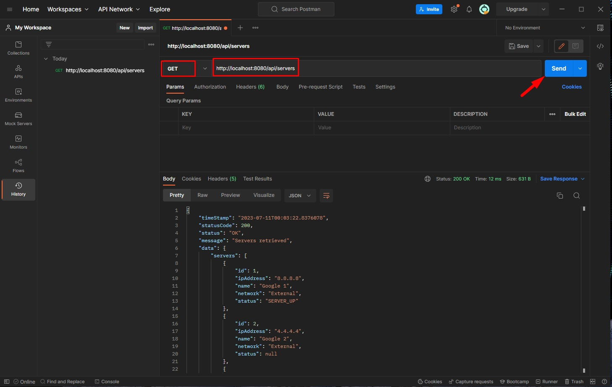

<br/>

🔵 Send a GET request to <http://localhost:8080/api/servers/<id>> (`findAllServers`)

- http://localhost:8080/api/servers/1
- http://localhost:8080/api/servers/2

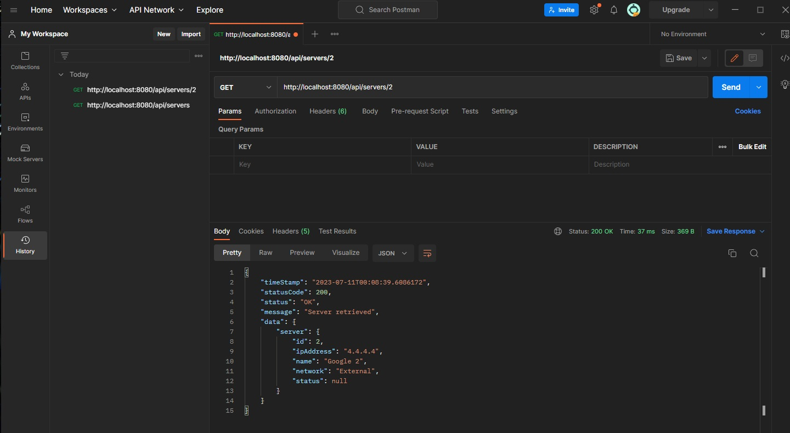

<br/>

🔵 Send a POST request with new Server information

- Open a new tab in Postman with the URL of http://localhost:8080/servers
- Set the request type to POST request
- Click on "Body" subtab
  - check the "raw" radio button
  - select "JSON" format
  - write a JSON without specifying the id (the id will be generated by Spring JPA)

```json
{
  "ipAddress": "192.168.0.2",
  "name": "Default IP",
  "network": "Home",
  "status": null
}
```

Another example:

- for the following JSON

```json
{
  "ipAddress": "192.168.1.1",
  "name": "Linksys",
  "network": "Home",
  "status": null
}
```

- the server will return:

```json
{
  "timeStamp": "2023-07-11T21:26:11.1401562",
  "statusCode": 201,
  "status": "CREATED",
  "message": "Server created",
  "data": {
    "server": {
      "id": 7,
      "ipAddress": "192.168.1.1",
      "name": "Linksys",
      "network": "Home",
      "status": null
    }
  }
}
```

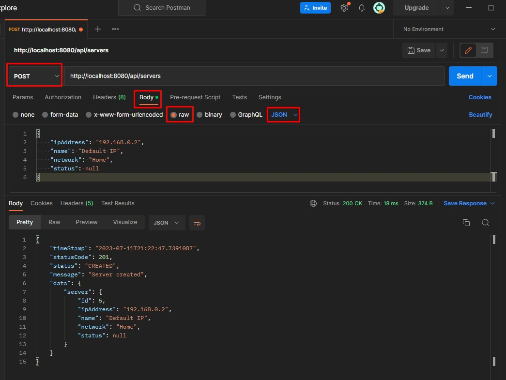

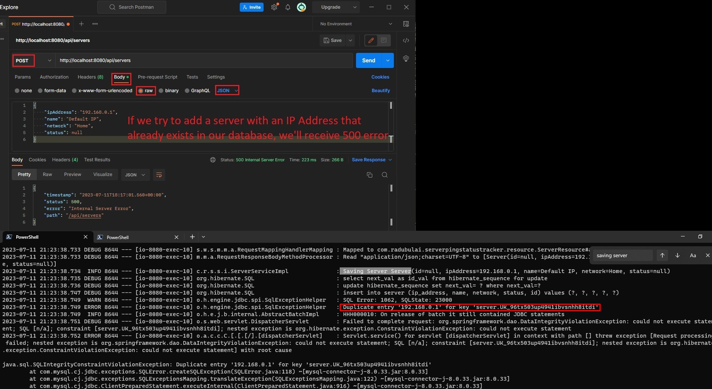

<br/>

🔵 Send UPDATE request to update a server

- Open a new tab in Postman with the URL of <http://localhost:8080/servers>
- Set the request type to PUT request
- Click on "Body" subtab, check the "raw" radio button, and select "JSON" format
- Instead of this entry (that we currenly have in our database):

```json
"server": {
    "id": 7,
    "ipAddress": "192.168.1.1",
    "name": "Linksys",
    "network": "Home",
    "status": null
}
```

- We'll send this (where the `name` and `imageUrl` was changed)

```json
{
  "id": 7,
  "ipAddress": "192.168.1.1",
  "name": "Linksys Updated",
  "network": "Home 2",
  "status": null
}
```

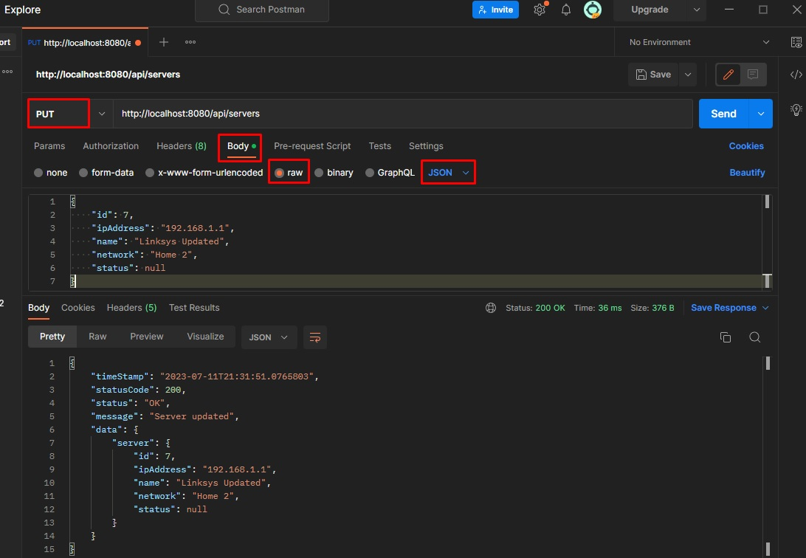

<br/>

🔵 Sent GET request to http://localhost:8080/api/servers/ping/8.8.8.8

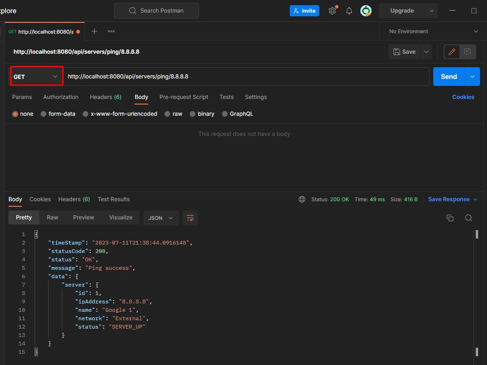

<br/>

🔵 Sent GET request to http://localhost:8080/api/servers/ping/ to ping and retrieve all servers

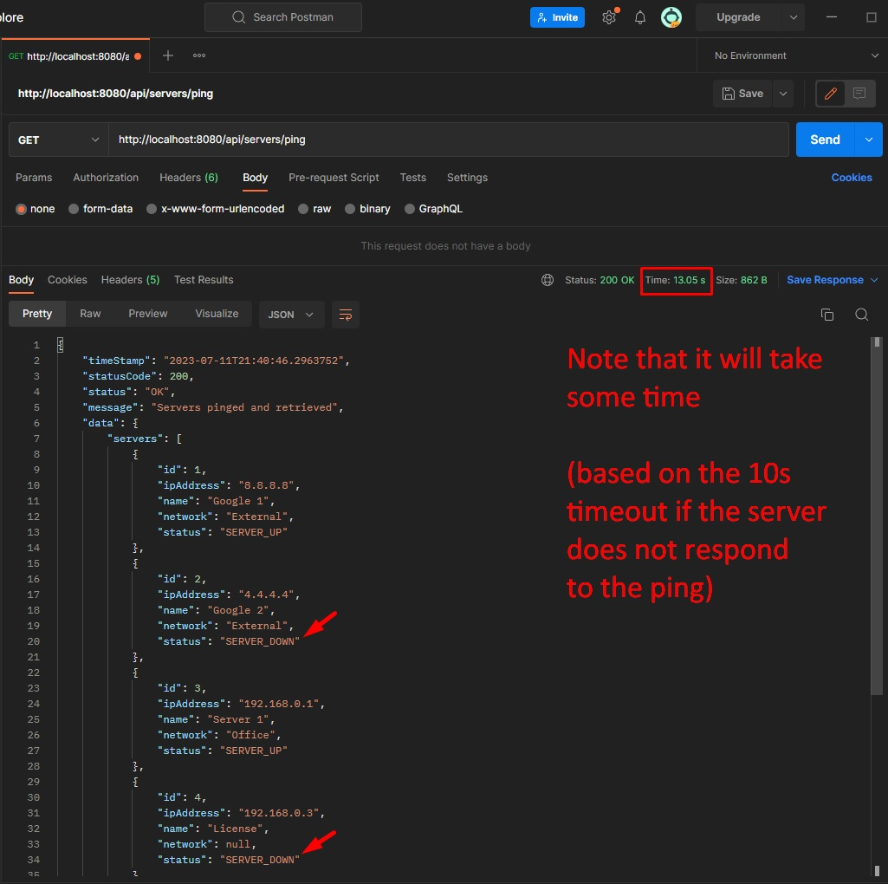

<br/>

# Frontend Angular

[Full Stack Spring Boot RESTful API with MySQL and Angular | RxJs State Management - Part 13](https://www.youtube.com/watch?v=Bwl2WAsC-8Y&list=PLopcHtZ0hJF0OIOr88qHuJ3-UKRuCUrKf&index=13)

We will use [Node.js](https://nodejs.org/en/download) and [Angular CLI](https://angular.io/cli) to create our Front-End Angular Application!

Currently installed on system:

```shell
node --version
# v18.16.1

npm --version
# 9.5.1

ng version
#      _                      _                 ____ _     ___
#     / \   _ __   __ _ _   _| | __ _ _ __     / ___| |   |_ _|
#    / △ \ | '_ \ / _` | | | | |/ _` | '__|   | |   | |    | |
#   / ___ \| | | | (_| | |_| | | (_| | |      | |___| |___ | |
#  /_/   \_\_| |_|\__, |\__,_|_|\__,_|_|       \____|_____|___|
#                 |___/
#
# Angular CLI: 16.1.4
# Node: 18.16.1
# Package Manager: npm 9.5.1
# OS: win32 x64
#
# Package                      Version
# ------------------------------------------------------
# @angular-devkit/architect    0.1601.4 (cli-only)
# @angular-devkit/core         16.1.4 (cli-only)
# @angular-devkit/schematics   16.1.4 (cli-only)
# @schematics/angular          16.1.4 (cli-only)
```

(Tuesday, July 11, 2023, 23:42)

<br/>

In main app's folder after installing Node.js:

```shell
# Install the Angular CLI: To install the Angular CLI globally,
# open a terminal window and run the following command
# (You will run this only once):
npm install -g @angular/cli

# To create a new project (a new workspace for an app)
ng new serverpingstatustracker-app

# Change directory
cd serverpingstatustracker-app

# The Angular CLI includes a server, for you to build and serve your app locally
ng serve --open
```

- Would you like to add Angular routing? (y/N): y
- Which stylesheet format would you like to use?: CSS

<br/>

## package.json

```json
// package.json
{
  "name": "serverpingstatustracker-app",
  "version": "0.0.0",
  "scripts": {
    "ng": "ng",
    "start": "ng serve",
    "build": "ng build",
    "watch": "ng build --watch --configuration development",
    "test": "ng test"
  },
  "private": true,
  "dependencies": {
    "@angular/animations": "^16.1.0",
    "@angular/common": "^16.1.0",
    "@angular/compiler": "^16.1.0",
    "@angular/core": "^16.1.0",
    "@angular/forms": "^16.1.0",
    "@angular/platform-browser": "^16.1.0",
    "@angular/platform-browser-dynamic": "^16.1.0",
    "@angular/router": "^16.1.0",
    "rxjs": "~7.8.0",
    "tslib": "^2.3.0",
    "zone.js": "~0.13.0"
  },
  "devDependencies": {
    "@angular-devkit/build-angular": "^16.1.4",
    "@angular/cli": "~16.1.4",
    "@angular/compiler-cli": "^16.1.0",
    "@types/jasmine": "~4.3.0",
    "jasmine-core": "~4.6.0",
    "karma": "~6.4.0",
    "karma-chrome-launcher": "~3.2.0",
    "karma-coverage": "~2.2.0",
    "karma-jasmine": "~5.1.0",
    "karma-jasmine-html-reporter": "~2.1.0",
    "typescript": "~5.1.3"
  }
}
```

- `package.json`: this fo;e contains the metadata and configuration for your project, including the dependencies and scripts. It serves as a manifest for your application, specifying what libraries and versions are required.
- `package-lock.json`: this file is automatically generated by `npm` when you install or update dependencies. It provides a detailed and deterministic description of the dependency tree, including the specific versions of each dependency installed. It ensures that all developers working on the project get the same dependency versions, helping to maintain consistency and avoid dependency conflicts.

Brief explanation of above packages:

1.  rxjs (~7.8.0): RxJS is imported by default in Angular. RxJS is a library for reactive programming (opposite of procedural programming) using Observables, enabling you to work with asynchronous data streams. The version "~7.8.0" indicates that any version starting with 7.8.x is acceptable, allowing minor updates but keeping the major version fixed.

2.  tslib (^2.3.0): tslib is a runtime library for TypeScript that provides helper functions used by the generated JavaScript code. The "^2.3.0" version specifier means that any version equal to or higher than 2.3.0 can be used, allowing both minor and patch updates.

3.  zone.js (~0.13.0): Zone.js is a library that helps with managing asynchronous operations in JavaScript. It provides execution context and hooks into asynchronous operations. The version "~0.13.0" indicates that any version starting with 0.13.x is acceptable, allowing minor updates.

4.  jasmine-core (~4.6.0): Jasmine is a behavior-driven development (BDD) testing framework for JavaScript. It provides a clean and readable syntax for writing tests. The version "~4.6.0" indicates that any version starting with 4.6.x is acceptable, allowing minor updates.

5.  karma (~6.4.0): Karma is a test runner for JavaScript that enables you to execute tests in multiple browsers simultaneously. It provides a simple and consistent way to run tests, capture browsers, and generate test reports. The version "~6.4.0" means that any version starting with 6.4.x is acceptable, allowing minor updates.

6.  karma-chrome-launcher (~3.2.0): Karma Chrome Launcher is a plugin for Karma that launches Google Chrome to run tests in it. The version "~3.2.0" means that any version starting with 3.2.x is acceptable, allowing minor updates.

7.  karma-coverage (~2.2.0): Karma Coverage is a plugin for Karma that generates code coverage reports for your tests, showing how much of your code is covered by tests. The version "~2.2.0" indicates that any version starting with 2.2.x is acceptable, allowing minor updates.

8.  karma-jasmine (~5.1.0): Karma Jasmine is a plugin for Karma that integrates the Jasmine testing framework, allowing you to write and run Jasmine tests using Karma. The version "~5.1.0" means that any version starting with 5.1.x is acceptable, allowing minor updates.

9.  karma-jasmine-html-reporter (~2.1.0): Karma Jasmine HTML Reporter is a plugin for Karma that generates an HTML report with the results of Jasmine tests executed by Karma. The version "~2.1.0" indicates that any version starting with 2.1.x is acceptable, allowing minor updates.

<br/>

## Enums, interfaces, services

### Server status.enum.ts and date-state.enum.ts

First, we can create a folder that will contain all the enumerations within the Angular Project:

- create `./src/app/enum/status.enum.ts`

```ts
// status.enum.ts
export enum Status {
  ALL = "ALL",
  SERVER_UP = "SERVER_UP",
  SERVER_DOWN = "SERVER_DOWN",
}
```

- with `ALL` we will have the option to select (from font-end/UI) all the servers no matter the status - we can then filter the servers based on the SERVER_UP or SERVER_DOWN statuses.

<br/>

- create `./src/app/enum/data-state.enum.ts` that will represent the "Data state" of the data that is in progress to be retrieved

```ts
// data-state.enum.ts
export enum DataState {
  LOADING_STATE = "LOADING_STATE",
  LOADED_STATE = "LOADED_STATE",
  ERROR_STATE = "ERROR_STATE",
}
```

<br/>

### Server and Response interface/model

- create `./src/app/interface/server.ts`
- define all the attributes that the Server model (in Spring API & database) has:

```ts
// server.ts
import { Status } from "../enum/status.enum";

export interface Server {
  id: number;
  ipAddress: string;
  name: string;
  network: string;
  status: Status;
}
```

<br/>

- create `./src/app/interface/custom-response.ts`
- define all the attributes that the Response model (in Spring API) has:
  - the response that the client gets back from Spring API BackEnd could either have a server or multiple servers as data

```ts
// custom-response.ts
import { Server } from "./server";

export interface CustomResponse {
  timeStamp: Date;
  statusCode: number;
  status: string;
  reason: string;
  message: string;
  developerMessage: string;
  data: { servers?: Server[]; server?: Server };
}
```

(Saturday, July 15, 2023)

<br/>

### Application state interface app-state.ts

[Full Stack Spring Boot RESTful API with MySQL and Angular | RxJs State Management - Part 15](https://www.youtube.com/watch?v=4ucfk6znWjM&list=PLopcHtZ0hJF0OIOr88qHuJ3-UKRuCUrKf&index=15)

For a reactive approach, we will habe the state of the entire application at any given moment:

- create `./src/app/interface/app-state.ts`
  - the state will be defined from the above enum `enum DataState { LOADING_STATE = 'LOADING_STATE', LOADED_STATE = 'LOADED_STATE', ERROR_STATE = 'ERROR_STATE' }`
  - `appData` will be generic (`<T>`)
  - since we cannot get the data and an error at the same time, `appData?` and `error?` will be both optional

```ts
// app-state.ts
import { DataState } from "../enum/data-state.enum";

export interface AppState<T> {
  dataState: DataState;
  appData?: T;
  error?: string;
}
```

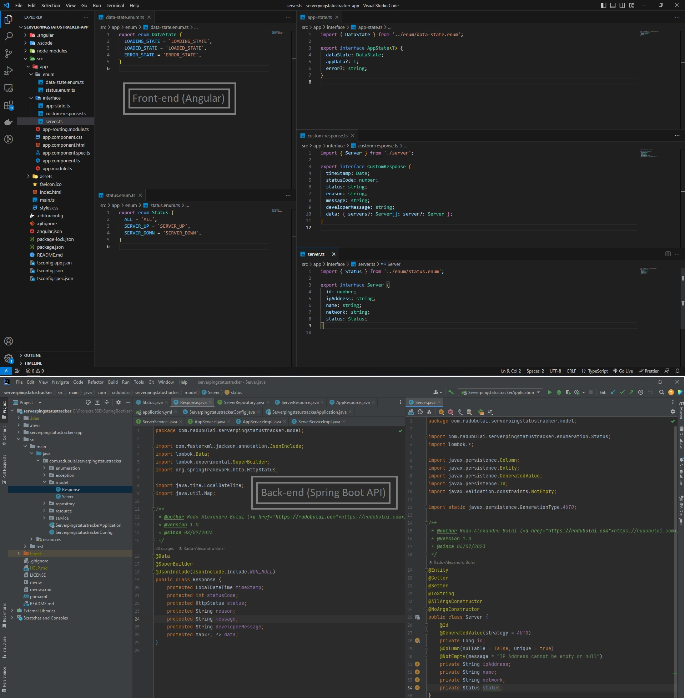

<br/>

### Server Angular Service

[Full Stack Spring Boot RESTful API with MySQL and Angular | RxJs State Management - Part 16](https://www.youtube.com/watch?v=4ucfk6znWjM&list=PLopcHtZ0hJF0OIOr88qHuJ3-UKRuCUrKf&index=16)

First, before working on server service, un the Angular's main `/src/app/app.module.ts` we need to import: `import { HttpClientModule } from '@angular/common/http';`, and also add it to the imports array: `imports: [BrowserModule, HttpClientModule],`. 🟠 Note: If we don't import the `HttpClientModule` we will receive the following error from Angular in our browser console: `ERROR NullInjectorError: R3InjectorError(AppModule)[EmployeeService -> HttpClient -> HttpClient -> HttpClient]: NullInjectorError: No provider for HttpClient!`

```ts
// app.module.ts
import { NgModule } from "@angular/core";
import { BrowserModule } from "@angular/platform-browser";
import { HttpClientModule } from "@angular/common/http";

import { AppRoutingModule } from "./app-routing.module";
import { AppComponent } from "./app.component";

@NgModule({
  declarations: [AppComponent],
  imports: [BrowserModule, AppRoutingModule, HttpClientModule],
  providers: [],
  bootstrap: [AppComponent],
})
export class AppModule {}
```

<br/>

We will now generate the "server" service that will contain all the methods for the HTTP Requests. With Angular's CLI, in the Angular project path, run:

```shell
ng generate service services/server
```

<br/>

In `server.service.ts` we will use Angular's `HttpClient` in order to make HTTP requests (`get`, `post`, `put`, `delete`) that'll be injected in the constructor: `export class ServerService { constructor(private http: HttpClient) {} }`

<br/>

<u>The **procedural approach** of implementing the `ServerService` class that provides methods to interact with the backend API would be the following:</u>

```ts
// server.service.ts - The procedural approach
import { HttpClient } from "@angular/common/http";
import { Injectable } from "@angular/core";
import { Observable } from "rxjs";
import { CustomResponse } from "../interfaces/custom-response";

@Injectable({ providedIn: "root" }) // The Injectable decorator is used to mark the ServerService as a service that can be injected with dependencies. It allows the service to be injected into other components or services.
export class ServerService {
  constructor(private http: HttpClient) {}

  getServers(): Observable<CustomResponse> {
    return this.http.get<CustomResponse>("http://localhost:8080/api/servers");
  }

  getServerById(serverId: number): Observable<CustomResponse> {
    return this.http.get<CustomResponse>(
      `http://localhost:8080/api/servers/${serverId}`
    );
  }

  addServer(server: Server): Observable<Server> {
    const methodName = "addServer() ";
    console.debug(methodName + "Request Sent: " + JSON.stringify(server));
    return this.http.post<Server>(`http://localhost:8080/api/servers`, server);
  }
}
```

<br/>

<u>However, we will implement the `ServerService` class using the **reactive approach with RxJS operators**:</u>

- `servers$ = <Observable<CustomResponse>>...`: declares a property `servers$` of type `Observable<CustomResponse>`. The dollar sign convention (`$`) is a good practice to indicate that this property is an observable.
- `this.http.get<CustomResponse>(${this.apiUrl}/servers`): makes an HTTP GET request to the API endpoint `${this.apiUrl}/servers` using the `HttpClient` service's `get` method. It expects the response to be of type `CustomResponse`
- `.pipe(tap(console.log), catchError(this.handleError))`: uses the `pipe` operator to chain multiple operators to the observable. The `tap` operator is used to perform a side effect of logging the response to the console, while the `catchError` operator is used to handle any errors that may occur during the HTTP request.
- `handleError(handleError: any): Observable<never> { ... }`: This method defines an error handler function named `handleError` which takes an `error` parameter of type `any`. The return type is `Observable<never>`, indicating that it returns an observable that never emits any values. However, in the provided code, the implementation of the `handleError` method is incomplete and throws a `Method not implemented` error when called.

The reactive approach using RxJS operators allows for a more streamlined and declarative way of handling asynchronous operations. It promotes composing and transforming observables using operators, making the code more concise and readable. Operators like `tap` and `catchError` provide powerful ways to perform side effects and error handling within the observable pipeline.

Compared to the procedural approach in the previous example, this reactive approach separates the observable creation and configuration (`servers$`) from the actual usage of the observable. The reactive approach also leverages the power of RxJS operators to handle errors and perform side effects, making it more flexible and easier to manage complex asynchronous flows.

```ts
// server.service.ts - The reactive approach
import { HttpClient } from "@angular/common/http";
import { Injectable } from "@angular/core";
import { Observable, throwError } from "rxjs";
import { catchError, tap } from "rxjs/operators";
import { CustomResponse } from "../interfaces/custom-response";

@Injectable({ providedIn: "root" })
export class ServerService {
  private readonly apiUrl = "http://localhost:8080/api";

  constructor(private http: HttpClient) {}

  servers$ = <Observable<CustomResponse>>(
    this.http
      .get<CustomResponse>(`${this.apiUrl}/servers`)
      .pipe(tap(console.log), catchError(this.handleError))
  );

  handleError(handleError: any): Observable<never> {
    return throwError("Method not implemented.");
  }
}
```

<br/>

(Monday, July 17, 2023, 22:34)

The complete `server.service.ts` using the reactive approach

```ts
// server.service.ts - The reactive approach | Complete code
import { HttpClient, HttpErrorResponse } from "@angular/common/http";
import { Injectable } from "@angular/core";
import { Observable, throwError } from "rxjs";
import { catchError, tap } from "rxjs/operators";
import { CustomResponse } from "../interfaces/custom-response";
import { Server } from "../interfaces/server";
import { Status } from "../enums/status.enum";

@Injectable({ providedIn: "root" })
export class ServerService {
  private readonly apiUrl = "http://localhost:8080/api";

  constructor(private http: HttpClient) {}

  servers$ = <Observable<CustomResponse>>(
    this.http
      .get<CustomResponse>(`${this.apiUrl}/servers`)
      .pipe(tap(console.log), catchError(this.handleError))
  );

  filter$ = (status: Status, response: CustomResponse) =>
    <Observable<CustomResponse>>new Observable<CustomResponse>((subscriber) => {
      console.log(response);
      const servers = response.data?.servers || [];
      const filteredServers = servers.filter(
        (server) => server.status === status
      );

      const message =
        status === Status.ALL
          ? `Servers filtered by ${status} status`
          : filteredServers.length > 0
          ? `Servers filtered by ${
              status === Status.SERVER_UP ? "SERVER UP" : "SERVER DOWN"
            } status`
          : `No servers of ${status} found`;

      subscriber.next({
        ...response,
        message,
        data: {
          servers: filteredServers,
        },
      });
      subscriber.complete();
    }).pipe(tap(console.log), catchError(this.handleError));

  getServerById = (serverId: number) =>
    <Observable<CustomResponse>>(
      this.http
        .get<CustomResponse>(`${this.apiUrl}/servers/${serverId}`)
        .pipe(tap(console.log), catchError(this.handleError))
    );

  addServer$ = (server: Server) =>
    <Observable<CustomResponse>>(
      this.http
        .post<CustomResponse>(`${this.apiUrl}/servers`, server)
        .pipe(tap(console.log), catchError(this.handleError))
    );

  updateServer$ = (server: Server) =>
    <Observable<CustomResponse>>(
      this.http
        .put<CustomResponse>(`${this.apiUrl}/servers`, server)
        .pipe(tap(console.log), catchError(this.handleError))
    );

  deleteServerById = (serverId: number) =>
    <Observable<CustomResponse>>(
      this.http
        .delete<CustomResponse>(`${this.apiUrl}/servers/${serverId}`)
        .pipe(tap(console.log), catchError(this.handleError))
    );

  pingServerById = (serverId: number) =>
    <Observable<CustomResponse>>(
      this.http
        .get<CustomResponse>(`${this.apiUrl}/servers/${serverId}/ping`)
        .pipe(tap(console.log), catchError(this.handleError))
    );

  pingServerByIpAddress = (ipAddress: string) =>
    <Observable<CustomResponse>>(
      this.http
        .get<CustomResponse>(`${this.apiUrl}/servers/ping/${ipAddress}`)
        .pipe(tap(console.log), catchError(this.handleError))
    );

  handleError(error: HttpErrorResponse): Observable<never> {
    console.error(error);
    return throwError(() => new Error(`Error Code: ${error.status}`));
  }
}
```

<br/>

For the `filter$` function that performs filtering on a `CustomResponse` object based on the provided `status` parameter. Here's a breakdown of the function:

1.  `(status: Status, response: CustomResponse) =>`: takes two parameters: `status` of type `Status` and `response` of type `CustomResponse`.
2.  `<Observable<CustomResponse>>new Observable<CustomResponse>((subscriber) => { ... })`: creates a new instance of an observable that emits values of type `CustomResponse`. It takes a subscriber function as an argument.
3.  `const servers = response.data?.servers || [];`: initializes the `servers` variable with the value of `response.data.servers` if it exists; otherwise, it assigns an empty array to `servers`. This guards against `response.data` or `response.data.servers` being `undefined`.
4.  `const filteredServers = servers.filter((server) => server.status === status);`: filters the `servers` array based on the provided `status`, creating a new array `filteredServers` that only contains servers with a matching status.
5.  `const message = ...`: This block assigns the appropriate message based on the conditionals:
    - If `status` is `Status.ALL`, it sets `message` to `'Servers filtered by ${status} status'`.
    - If `filteredServers.length` is greater than 0, it sets `message` to `'Servers filtered by SERVER UP status'` or `'Servers filtered by SERVER DOWN status'`.
    - If none of the above conditions are met, it sets `message` to `'No servers of ${status} found'`.
6.  `subscriber.next({ ... })`: emits a new `CustomResponse` object to the subscriber, which includes the modified `response` object:
    - The `message` property is updated based on the filtering results.
    - The `data` property is updated with the filtered servers.
7.  `subscriber.complete();`: signals the completion of the observable stream.
8.  `.pipe(tap(console.log), catchError(this.handleError))`: pipes the observable to apply additional operators:
    - The `tap(console.log)` operator logs the emitted values to the console.
    - The `catchError(this.handleError)` operator catches and handles any errors that occur during the observable stream, using the `handleError` method of the `ServerService`.

In summary, the `filter$` function filters servers based on the provided `status` and emits a modified `CustomResponse` object as an observable. The emitted response includes a message indicating the filtering results and the filtered server data.

<br/>

## Demo - Calling GET Servers from app.component.ts

- `@Component` decorator provides metadata for the component, such as the selector, main template URL, and CSS styles
- `appState$!: Observable<AppState<CustomResponse>>;`: declares the `appState$` property as an observable of type `AppState<CustomResponse>`. The `!` indicates that the property will be assigned a value later.
- The constructor initializes the `serverService` property with an instance of the `ServerService` injected through dependency injection so we can use all the methods defined there.
- `ngOnInit(): void` is a lifecycle hook that runs when the component is initialized
- `this.appState$ = this.serverService.getServersPinged$().pipe(...)`: assigns the `appState$` property to the result of the `getServersPinged$()` method call from the `serverService`. The method is assumed to return an observable that emits `CustomResponse` data.
  - `map((response) => { return { dataState: DataState.LOADED_STATE, appData: response }; })`: `map` operator transforms the emitted `response` data by wrapping it in an object with `dataState` and `appData` properties. It sets the `dataState` to `DataState.LOADED_STATE` and assigns the `response` to `appData`.
  - `startWith({ dataState: DataState.LOADING_STATE })`: `startWith` operator emits an initial value `{ dataState: DataState.LOADING_STATE }` before the actual values emitted by the observable. This helps indicate the loading state when the component first initializes.
  - `catchError((error: string) => { return of({ dataState: DataState.ERROR_STATE, error }); })`: `catchError` operator catches any errors that occur in the observable stream and handles them. It transforms the error into an object with `dataState` set to `DataState.ERROR_STATE` and includes the error message.

In summary, this code sets up the `appState$` observable in the `AppComponent` class. It fetches data from the `serverService`, transforms the response using the `map` operator, handles loading state with `startWith`, and catches and handles errors with `catchError`. The `appState$` observable will emit different states (`LOADING_STATE`, `LOADED_STATE`, or `ERROR_STATE`) based on the server response and error conditions.

```ts
// app.component.ts
import { Component, OnInit } from "@angular/core";
import { ServerService } from "./services/server.service";
import { Observable, catchError, map, of, startWith } from "rxjs";
import { AppState } from "./interfaces/app-state";
import { CustomResponse } from "./interfaces/custom-response";
import { DataState } from "./enums/data-state.enum";

@Component({
  selector: "app-root",
  templateUrl: "./app.component.html",
  styleUrls: ["./app.component.css"],
})
export class AppComponent implements OnInit {
  appState$!: Observable<AppState<CustomResponse>>;

  constructor(private serverService: ServerService) {}

  ngOnInit(): void {
    this.appState$ = this.serverService.getServersPinged$().pipe(
      map((response) => {
        return { dataState: DataState.LOADED_STATE, appData: response };
      }),
      startWith({ dataState: DataState.LOADING_STATE }),
      catchError((error: string) => {
        return of({ dataState: DataState.ERROR_STATE, error });
      })
    );
  }
}
```

```html
<!-- app.component.html -->
<div>{{ appState$ | async | json }}</div>
```

- `{{ appState$ | async | json }}`: is an Angular template expression enclosed within double curly braces (`{{ }}`). It binds the value of the `appState$` observable to the content of the `<div>` element.
  - `appState$`: is the `appState$` property defined in the `AppComponent` class, which is an observable of type `AppState<CustomResponse>`.
  - `async`: `async` pipe is used to subscribe to the `appState$` observable and automatically handle the subscription and unsubscription. It allows the template to display the latest emitted value from the observable.
  - `json`: The `json` pipe is used to format the value as a JSON string. It converts the emitted value from the observable into a string representation in JSON format.

So, in summary, this HTML template code displays the JSON string representation of the latest emitted value from the `appState$` observable within the `<div>` element. It leverages the `async` pipe to handle the subscription and updates the displayed value whenever the observable emits a new value.

<br/>

### Solving "blocked by CORS policy" - CORS Configuration

[Full Stack Spring Boot RESTful API with MySQL and Angular | RxJs State Management - Part 20](https://www.youtube.com/watch?v=aBwdbMdq1Ck&list=PLopcHtZ0hJF0OIOr88qHuJ3-UKRuCUrKf&index=20)

Now:

- if we start the application, namely:
  - starting the MySQL Server (Start Menu, search and open "Services", manually find MySQL80 service -> Right click it -> Start)
  - starting the SpringBoot Back-end Server (`mvn spring-boot:run` and test on http://localhost:8080/api/servers)
  - starting the Front-end Angular Application (`ng serve --open` on http://localhost:4200/)
- we will run into the following CORS error:

> Access to XMLHttpRequest at 'http://localhost:8080/api/servers/ping' from origin 'http://localhost:4200' has been blocked by CORS policy: No 'Access-Control-Allow-Origin' header is present on the requested resource.

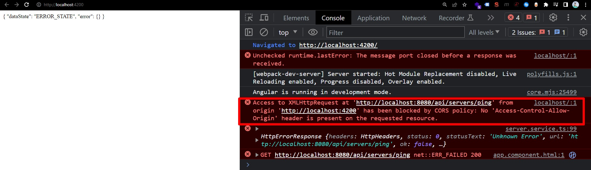

<br/>

To solve this issue, we need to tell the back-end to allow the front-end app to run on requested url (origin) in order to access the resources.

On the SpringBoot project, in the main application class `ServerpingstatustrackerApplication` we need to add the following CORS Configuration after the `main()` function:

```java
// ServerpingstatustrackerApplication.java
package com.radubulai.serverpingstatustracker;

import org.springframework.boot.SpringApplication;
import org.springframework.boot.autoconfigure.SpringBootApplication;
import org.springframework.context.annotation.Bean;
import org.springframework.web.cors.CorsConfiguration;
import org.springframework.web.cors.UrlBasedCorsConfigurationSource;
import org.springframework.web.filter.CorsFilter;

import java.util.Arrays;

@SpringBootApplication
public class ServerpingstatustrackerApplication {

    public static void main(String[] args) {
        SpringApplication.run(ServerpingstatustrackerApplication.class, args);
    }

    @Bean
    public CorsFilter corsFilter() {
        CorsConfiguration corsConfiguration = new CorsConfiguration();
        corsConfiguration.setAllowCredentials(true);
        corsConfiguration.setAllowedOrigins(Arrays.asList("http://localhost:4200", "http://localhost:8081"));
        corsConfiguration.setAllowedHeaders(Arrays.asList("Origin", "Access-Control-Allow-Origin", "Content-Type",
                "Accept", "Authorization", "Origin, Accept", "X-Requested-With",
                "Access-Control-Request-Method", "Access-Control-Request-Headers"));
        corsConfiguration.setAllowedHeaders(Arrays.asList("Origin", "Content-Type", "Accept", "Authorization",
                "Access-Control-Allow-Origin", "Access-Control-Allow-Credentials"));
        corsConfiguration.setAllowedMethods(Arrays.asList("GET", "POST", "PUT", "DELETE", "OPTIONS"));
        UrlBasedCorsConfigurationSource urlBasedCorsConfigurationSource = new UrlBasedCorsConfigurationSource();
        urlBasedCorsConfigurationSource.registerCorsConfiguration("/**", corsConfiguration);
        return new CorsFilter(urlBasedCorsConfigurationSource);
    }
}
```

Now we can successfully make requests from frontend:

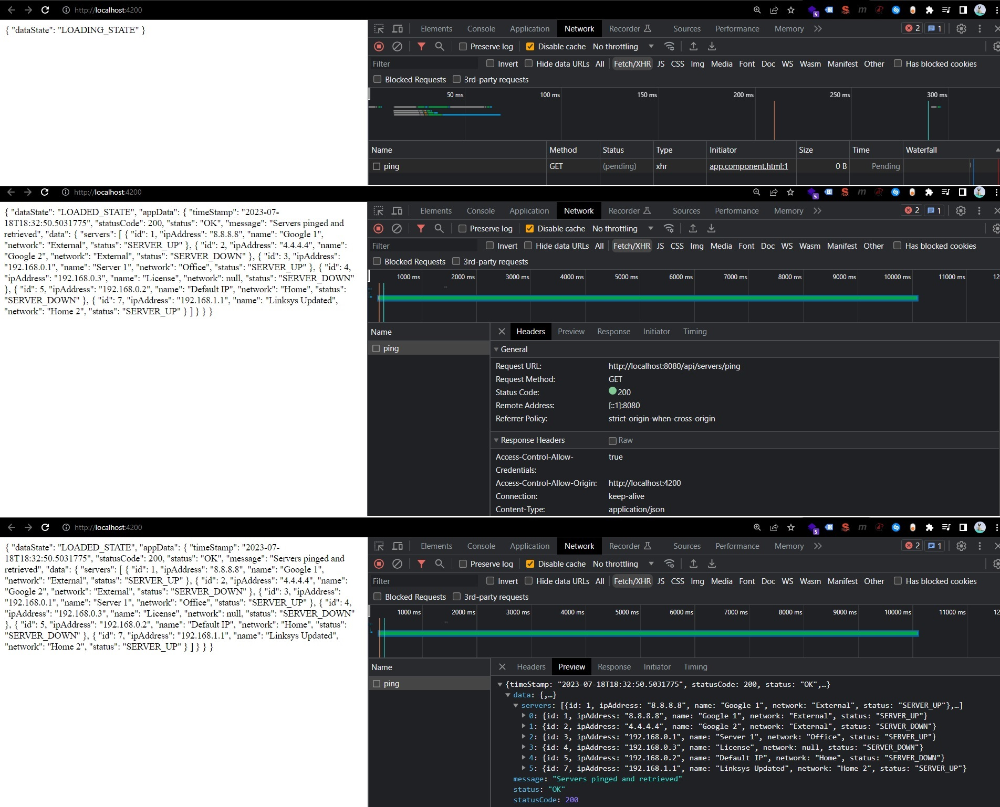

<br/>

## User Interface - Building the HTML using Bootstrap CSS

### HTML+CSS Boilerplate

[Full Stack Spring Boot RESTful API with MySQL and Angular | RxJs State Management - Part 21](https://www.youtube.com/watch?v=QNKLK6U0Pt8&list=PLopcHtZ0hJF0OIOr88qHuJ3-UKRuCUrKf&index=21)

We will use the following (NOT FINISHED) HTML + CSS code (Note these may change completely untill the end of tutorial):

```html
<!-- app.component.html -->
<!-- <div>{{ appState$ | async | json }}</div> -->
<!-- Navigation bar -->
<nav class="navbar navbar-expand-lg navbar-dark">
  <h1 style="font-size: 1rem">
    <a class="navbar-brand" style="color: white">Server Ping Status Tracker</a>
  </h1>
  <button
    class="navbar-toggler"
    type="button"
    data-toggle="collapse"
    data-target="#navbarColor02"
    aria-controls="navbarColor02"
    aria-expanded="false"
    aria-label="Toggle navigation"
  >
    <span class="navbar-toggler-icon"></span>
  </button>
  <div class="collapse navbar-collapse" id="navbarColor02">
    <ul class="navbar-nav mr-auto">
      <li class="nav-item active">
        <a class="nav-link" href="#addServerModal" data-toggle="modal"
          >Add Server <span class="sr-only">(current)</span></a
        >
      </li>
      <li class="nav-item">
        <a class="nav-link" routerLink="/"
          >All employees <span class="sr-only">(current)</span></a
        >
      </li>
      <li class="nav-item">
        <a routerLink="/about" class="nav-link"
          >About <span class="sr-only">(current)</span></a
        >
      </li>
    </ul>
    <div>
      <select
        name="status"
        ngModel="ALL"
        class="btn btn-primary"
        title="Filter Severs by Status"
      >
        <option value="ALL">ALL</option>
        <option value="SERVER_UP">SERVER UP</option>
        <option value="SERVER_DOWN">SERVER DOWN</option>
      </select>
    </div>
    <div
      class="dark-mode-icon nav-item"
      title="Toggle between light/dark theme"
    >
      <i class="fa fa-moon-o fa-2x mx-2"></i>
    </div>
  </div>
</nav>

<div class="container">
  <div class="table-responsive">
    <div class="table-wrapper">
      <ng-container
        *ngIf="appState$ | async as appState"
        [ngSwitch]="appState.dataState"
      >
        <ng-container *ngSwitchCase="">
          <div class="col-md-12 text-center">
            <div class="spinner-border text-info" role="status"></div>
          </div>
        </ng-container>
        <ng-container>
          <table class="table table-striped table-hover" id="servers">
            <thead>
              <tr>
                <th>IP Address</th>
                <th>Name</th>
                <th>Network</th>
                <th>Status</th>
                <th>Ping</th>
                <th>Actions</th>
              </tr>
            </thead>
            <tbody
              *ngFor="
                let server of (appState$ | async)?.appData?.data?.servers;
                let i = index
              "
            >
              <tr>
                <td>{{ server.ipAddress }}</td>
                <td>{{ server.name }}</td>
                <td>{{ server.network }}</td>
                <td>
                  <span
                    class="badge"
                    [ngClass]="[
                      server.status === Status.SERVER_UP
                        ? ' badge-success'
                        : ' badge-danger'
                    ]"
                  >
                    {{ server.status === Status.SERVER_UP ? "SERVER UP" :
                    "SERVER DOWN" }}
                  </span>
                </td>
                <td>
                  <a style="cursor: pointer">
                    <i *ngIf="" class="material-icons" title="Ping server"
                      >&#xe328;</i
                    >
                    <i
                      class="fa fa-spinner fa-spin"
                      style="font-size: 24px"
                    ></i>
                  </a>
                </td>
                <td>
                  <a class="delete" data-toggle="modal" style="cursor: pointer"
                    ><i
                      class="material-icons"
                      data-toggle="tooltip"
                      title="Delete"
                      >&#xE872;</i
                    ></a
                  >
                </td>
              </tr>
            </tbody>
          </table>
        </ng-container>
        <!-- <ng-container *ngSwitchCase="DataState.ERROR_STATE">
          <div class="alert-danger">
            {{ appState.error }}
          </div>
        </ng-container> -->
      </ng-container>
    </div>
  </div>
</div>

<!-- Add server Modal HTML -->
<div id="addServerModal" class="modal fade">
  <div class="modal-dialog">
    <div class="modal-content">
      <form>
        <div class="modal-header">
          <h4 class="modal-title">Add Server</h4>
          <button
            type="button"
            class="close"
            data-dismiss="modal"
            aria-hidden="true"
          >
            &times;
          </button>
        </div>
        <div class="modal-body">
          <div class="form-group">
            <label>IP</label>
            <input
              type="text"
              ngModel
              name="ipAddress"
              class="form-control"
              required
            />
          </div>
          <div class="form-group">
            <label>Name</label>
            <input
              type="text"
              ngModel
              name="name"
              class="form-control"
              required
            />
          </div>
          <div class="row">
            <div class="col-xl-6 col-lg-6 col-md-6 col-sm-6 col-6">
              <div class="form-group">
                <label>Memory</label>
                <input
                  type="text"
                  ngModel
                  name="memory"
                  class="form-control"
                  required
                />
              </div>
            </div>
            <div class="col-xl-6 col-lg-6 col-md-6 col-sm-6 col-6">
              <div class="form-group">
                <label>Type</label>
                <input
                  type="text"
                  ngModel
                  name="type"
                  class="form-control"
                  required
                />
              </div>
            </div>
          </div>
          <div class="form-group">
            <label>Status</label>
            <select
              name="status"
              ngModel="SERVER_DOWN"
              class="form-control"
              name="status"
              required
            >
              <option value="SERVER_UP">SERVER UP</option>
              <option value="SERVER_DOWN">SERVER DOWN</option>
            </select>
          </div>
        </div>
        <div class="modal-footer">
          <button
            type="button"
            class="btn btn-warning"
            id="closeModal"
            data-dismiss="modal"
          >
            Cancel
          </button>
          <!-- <button
            type="submit"
            [disabled]="serverForm.invalid || (isLoading$ | async)"
            class="btn btn-success"
          >
            <i *ngIf="isLoading$ | async" class="fas fa-spinner fa-spin"></i>
            <span *ngIf="isLoading$ | async">Saving...</span>
            <span *ngIf="!(isLoading$ | async)">Add</span>
          </button> -->
        </div>
      </form>
    </div>
  </div>
</div>
<!-- <notifier-container></notifier-container> -->
```

<br/>

Importing Bootstrap CSS and Jquery for Bootstrap builtin HTML "components" such as modals

```html
<!-- index.html -->
<!DOCTYPE html>
<html lang="en">
  <head>
    <meta charset="utf-8" />
    <title>Server Ping Status Tracker by Radu-Alexandru Bulai</title>
    <base href="/" />
    <meta name="viewport" content="width=device-width, initial-scale=1" />
    <link rel="icon" type="image/x-icon" href="favicon.ico" />

    <script
      src="https://code.jquery.com/jquery-3.3.1.slim.min.js"
      defer
    ></script>
    <script
      src="https://cdnjs.cloudflare.com/ajax/libs/popper.js/1.14.6/umd/popper.min.js"
      defer
    ></script>
    <script
      src="https://stackpath.bootstrapcdn.com/bootstrap/4.2.1/js/bootstrap.min.js"
      defer
    ></script>
  </head>
  <body>
    <app-root></app-root>
  </body>
</html>
```

<br/>

```css
/* styles.css */
@import "https://stackpath.bootstrapcdn.com/bootstrap/4.2.1/css/bootstrap.min.css";
@import "https://cdnjs.cloudflare.com/ajax/libs/font-awesome/4.3.0/css/font-awesome.css";

:root {
  --background-color: hsl(201, 33%, 98%);
  --background-color-secondary: hsl(0, 0%, 100%);
  --primary-color: hsl(200, 27%, 37%);
  --secondary-color: hsl(200, 33%, 24%);
  --primary-font-color: #000;
  --container-color: hsl(0, 0%, 97%);
}
[data-theme="dark"] {
  --background-color: hsl(207, 29%, 6%);
  --background-color-secondary: hsl(206, 28%, 10%);
  --primary-color: hsl(216, 85%, 80%);
  --secondary-color: hsl(210, 79%, 75%);
  --primary-font-color: #fff;
  --container-color: hsl(207, 29%, 8%);
}
::selection {
  background: var(--primary-color);
  color: #fff;
}
body {
  background-color: var(--background-color);
  font-size: 16px;
  color: var(--primary-font-color);
  transition: background-color 300ms ease-in, color 300ms ease-in;
}
@media (min-width: 1200px) {
  .container {
    max-width: 1400px;
  }
}
.container {
  margin-top: 2rem;
}
.modal-content {
  background-color: var(--container-color);
}
.modal-footer {
  border-top: none !important;
}
.navbar {
  background-color: hsl(200, 33%, 10%);
}
.nav-link:hover {
  cursor: pointer;
}
@media screen and (max-width: 992px) {
  .nav-item {
    display: flex;
    justify-content: center;
  }
}

input {
  color: var(--primary-font-color) !important;
  background-color: var(--background-color-secondary) !important;
  transition: background-color 300ms ease-in !important;
}
.card {
  background-color: var(--container-color);
  border: none;
  box-shadow: 1px 2px 5px 1px rgba(0, 0, 0, 0.1);
  margin-bottom: 1rem;
  border-radius: 1rem;
  transition: background-color 300ms ease-in;
}
.card--name {
  font-size: 1.2rem;
  font-weight: 600;
  color: var(--primary-color);
}
.card--img {
  aspect-ratio: 1/1;
  object-fit: cover;
}
.card .list-group-item {
  background-color: transparent;
}
.dark-mode-icon {
  color: #fff;
  cursor: pointer;
}
.w-60 {
  width: 4rem;
}
.btn-primary {
  background-color: var(--primary-color) !important;
  border-color: var(--primary-color) !important;
}
.btn-primary:hover {
  background-color: var(--secondary-color) !important;
  border-color: var(--primary-color) !important;
}
.btn-primary:disabled {
  color: #fff;
  background-color: gray;
  border-color: gray;
}
.social-links li a {
  -webkit-border-radius: 50%;
  background-color: var(--primary-color);
  border-radius: 50%;
  color: #fff;
  display: inline-block;
  height: 30px;
  line-height: 30px;
  text-align: center;
  width: 30px;
  font-size: 12px;
  transition: background-color 200ms ease-in;
}
.social-links li a:hover {
  background-color: var(--secondary-color);
}
a {
  color: var(--primary-color);
}
a:hover {
  color: var(--secondary-color);
}
.alert-title {
  font-size: 1.2rem;
  font-weight: 700;
  margin-bottom: 1rem;
}
```

<br/>

```css
/* app.component.css */
```

<br/>

#### Spinning Icon based on LOADING dataState when retriving servers

[Full Stack Spring Boot RESTful API with MySQL and Angular | RxJs State Management - Part 21](https://www.youtube.com/watch?v=QNKLK6U0Pt8&list=PLopcHtZ0hJF0OIOr88qHuJ3-UKRuCUrKf&index=21)

First, by using [Bootstrap v4.x CSS Spinner](https://getbootstrap.com/docs/4.3/components/spinners/) (and [fontawesome 6.4.0](https://fontawesome.com/v6/search?q=spinner&o=r&m=free)) and based on our LOADING/LOADED `appState$.dataState`, we can use `ngSwitch` and `ngSwitchCase` for displaying different `ng-containers` for different states of the application.

```html
<!-- app.component.html -->
<ng-container
  *ngIf="appState$ | async as appState"
  [ngSwitch]="appState.dataState"
>
  <ng-container *ngSwitchCase="DataState.LOADING_STATE">
    <div class="col-md-12 text-center">
      <div class="spinner-border text-info" role="status"></div>
    </div>
  </ng-container>

  ...

  <ng-container *ngSwitchCase="DataState.LOADED_STATE">
    <table>
      ...
    </table>
  </ng-container>

  ...

  <ng-container *ngSwitchCase="DataState.ERROR_STATE">
    <div class="alert-danger">{{ appState.error }}</div>
  </ng-container>
</ng-container>
```

```ts
// app.component.ts
// Here we add readonly DataState = DataState;
...
import { DataState } from './enums/data-state.enum';
import { Status } from './enums/status.enum';

@Component({
  selector: 'app-root',
  templateUrl: './app.component.html',
  styleUrls: ['./app.component.css'],
})
export class AppComponent implements OnInit {
  appState$!: Observable<AppState<CustomResponse>>;
  readonly Status = Status;
  readonly DataState = DataState;

  constructor(private serverService: ServerService) {}

  ngOnInit(): void {
    this.appState$ = this.serverService.servers$.pipe(
      map((response) => {
        return { dataState: DataState.LOADED_STATE, appData: response };
      }),
      startWith({ dataState: DataState.LOADING_STATE }),
      catchError((error: string) => {
        return of({ dataState: DataState.ERROR_STATE, error });
      })
    );
  }
}
```

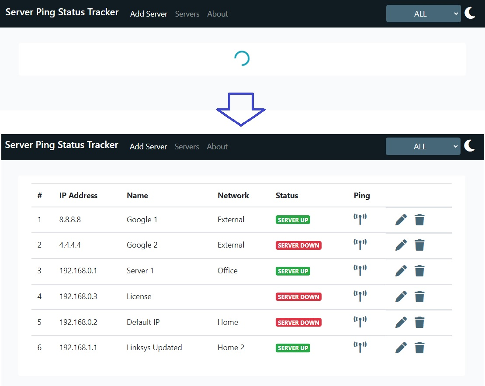

(Thursday, July 20, 2023, 22:56)

<br/>

#### Displaying the servers

[Full Stack Spring Boot RESTful API with MySQL and Angular | RxJs State Management - Part 22](https://www.youtube.com/watch?v=QNKLK6U0Pt8&list=PLopcHtZ0hJF0OIOr88qHuJ3-UKRuCUrKf&index=22)

```html
<!-- app.component.html -->
<div class="container">
  <div class="table-responsive">
    <ng-container
      *ngIf="appState$ | async as appState"
      [ngSwitch]="appState.dataState"
    >
      <ng-container *ngSwitchCase="DataState.LOADING_STATE">
        <div class="col-md-12 text-center">
          <div
            title="Loading Servers..."
            class="spinner-border text-info"
            role="status"
          ></div>
        </div>
      </ng-container>

      <ng-container *ngSwitchCase="DataState.LOADED_STATE">
        <table class="table table-hover" id="servers">
          <thead>
            <tr>
              <th>#</th>
              <th>IP Address</th>
              <th>Name</th>
              <th>Network</th>
              <th>Status</th>
              <th>Ping</th>
              <th>Actions</th>
            </tr>
          </thead>
          <tbody
            *ngFor="
              let server of appState.appData?.data?.servers;
              let i = index
            "
          >
            <tr>
              <td title="Server ID: {{ server.id }}">{{ i + 1 }}</td>
              <td>{{ server.ipAddress }}</td>
              <td>{{ server.name }}</td>
              <td>{{ server.network }}</td>
              <td>
                <span
                  class="badge"
                  [ngClass]="[
                    server.status === Status.SERVER_UP
                      ? ' badge-success'
                      : ' badge-danger'
                  ]"
                >
                  {{ server.status === Status.SERVER_UP ? "SERVER UP" : "SERVER
                  DOWN" }}
                </span>
              </td>
              <td>
                <a style="cursor: pointer">
                  <i
                    class="fa fa-globe"
                    title="Ping Server"
                    style="font-size: 1.5rem"
                  ></i>
                  <i
                    class="fa fa-spinner fa-spin"
                    style="font-size: 1.5rem"
                  ></i>
                </a>
              </td>
              <td>
                <a class="delete" data-toggle="modal" style="cursor: pointer"
                  ><i
                    class="fa fa-trash-o fa-1x mx-2"
                    title="Delete Server"
                    style="font-size: 1.5rem"
                  ></i
                ></a>
              </td>
            </tr>
          </tbody>
        </table>
      </ng-container>

      <ng-container *ngSwitchCase="DataState.ERROR_STATE">
        <div class="alert-danger">{{ appState.error }}</div>
      </ng-container>
    </ng-container>
  </div>
</div>
```

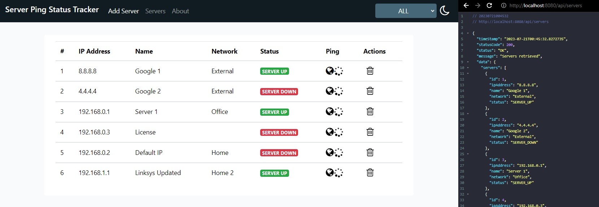

<br/>

#### Showing spinning loading icon when pinging individual server

[Full Stack Spring Boot RESTful API with MySQL and Angular | RxJs State Management - Part 23](https://www.youtube.com/watch?v=I_YRbgGAdRc&list=PLopcHtZ0hJF0OIOr88qHuJ3-UKRuCUrKf&index=23)

We want that (from the above screenshot), when we click the "ping server" button to show a spinnig loading icon while we wait for a response.

For this, we can define the following in `app.component.ts`:

- `private filterSubject = new BehaviorSubject<string>('');`:
  - A `BehaviorSubject` is a type of `Subject` that always emits the most recent value to its subscribers, even if they subscribe after the value has been emitted. It is initialized with an empty string `''`.
- `readonly filterStatus$ = this.filterSubject.asObservable();`:
  - creates a public read-only `Observable` named `filterStatus$`, which is derived from the `filterSubject` using the `asObservable()` method. This ensures that external components can only subscribe to the `filterStatus$` observable and cannot modify its value directly. This observable will emit the values of the `filterSubject`.

In `app.component.html`:

- `*ngIf="... (filterStatus$ | async) === '' || (filterStatus$ | async) !== server.ipAddress"`:
  - checks if the value emitted by the `filterStatus$` observable is an empty string `''` or not equal to `server.ipAddress`. The server IP address is used to filter the servers, so if there's no filtering (`filterStatus$` is an empty string) or if the filtering is not applied to the current server, the first `<i>` element with the class `fa fa-tower-broadcast` (an icon representing a server) is displayed (this would be the default since the declared string is empty).
- `*ngIf="(filterStatus$ | async) == server.ipAddress"`:
  - checks if the value emitted by the `filterStatus$` observable is equal to the current `server.ipAddress`. If it matches, the second `<i>` element with the class `fa fa-circle-notch fa-spin` (an icon representing a spinning circle) is displayed. This typically indicates that the server is being actively pinged or processed.

Note: We use `.fa-spin` CSS Class for the [`.fa-spinner` icon](https://fontawesome.com/v6/icons/spinner?f=classic&s=solid) (from [fontawesome 6.4.0](https://fontawesome.com/v6/icons/circle-notch?f=classic&s=solid)) for the HTML loading icon.

<br/>

## UI Functionalities

### Pinging each server from db

(Saturday, July 22, 2023)

[Full Stack Spring Boot RESTful API with MySQL and Angular | RxJs State Management - Part 25](https://www.youtube.com/watch?v=8CtdbheG71Y&list=PLopcHtZ0hJF0OIOr88qHuJ3-UKRuCUrKf&index=25)

```ts
// app.component.ts
import { Component, OnInit } from "@angular/core";
import { ServerService } from "./services/server.service";
import {
  BehaviorSubject,
  Observable,
  catchError,
  map,
  of,
  startWith,
} from "rxjs";
import { AppState } from "./interfaces/app-state";
import { CustomResponse } from "./interfaces/custom-response";
import { DataState } from "./enums/data-state.enum";
import { Status } from "./enums/status.enum";

/**
 * @author Radu-Alexandru Bulai
 * @version 1.0.0
 * @since 18/07/2023
 */
@Component({
  selector: "app-root",
  templateUrl: "./app.component.html",
  styleUrls: ["./app.component.css"],
})
export class AppComponent implements OnInit {
  appState$!: Observable<AppState<CustomResponse>>;
  readonly Status = Status;
  readonly DataState = DataState;
  private ipAddressSubjectWhenPinging = new BehaviorSubject<string>("");
  readonly ipAddressStatusWhenPinging$ =
    this.ipAddressSubjectWhenPinging.asObservable();
  private serversCopyDataSubject = new BehaviorSubject<CustomResponse>(null!);
  // Assert that null can be assigned by using the non-null assertion operator !
  // This assumes that the data passed to serversDataCopySubject (the UI copy of servers)
  // will be updated before any subscribers access it, ensuring that it won't actually be null.

  constructor(private serverService: ServerService) {}

  ngOnInit(): void {
    this.appState$ = this.serverService.servers$.pipe(
      map((response) => {
        this.serversCopyDataSubject.next(response);
        return { dataState: DataState.LOADED_STATE, appData: response };
      }),
      startWith({ dataState: DataState.LOADING_STATE }),
      catchError((error: string) => {
        return of({ dataState: DataState.ERROR_STATE, error });
      })
    );
  }

  pingServerByItsIpAddress(ipAddress: string): void {
    // Assign ip string to show a spinning loading icon while pinging
    this.ipAddressSubjectWhenPinging.next(ipAddress);
    this.appState$ = this.serverService.pingServerByIpAddress$(ipAddress).pipe(
      map((response) => {
        const serversCopy = this.serversCopyDataSubject.value.data.servers;
        const indexOfPingedServer = serversCopy!.findIndex(
          (server) => server.id === response.data.server!.id
        );
        // Update the Server from serversCopy in UI after it has been pinged
        serversCopy![indexOfPingedServer] = response.data.server!;
        // Assign empty string to stop showing spinning loading icon
        this.ipAddressSubjectWhenPinging.next("");
        return {
          dataState: DataState.LOADED_STATE,
          appData: this.serversCopyDataSubject.value,
        };
      }),
      startWith({
        dataState: DataState.LOADED_STATE,
        appData: this.serversCopyDataSubject.value,
      }),
      catchError((error: string) => {
        this.ipAddressSubjectWhenPinging.next("");
        return of({ dataState: DataState.ERROR_STATE, error });
      })
    );
  }
}
```

`app.component.ts` - `pingServerByItsIpAddress()`:

- `this.ipAddressSubjectWhenPinging.next(ipAddress);` from the HTML code, we added a condition that whenever this "variable" (that has its observer on ` readonly ipAddressStatusWhenPinging$ = this.ipAddressSubjectWhenPinging.asObservable();`) is populated, we will show a loading spinner in UI (if this `ipAddressSubjectWhenPinging` is empty then we will show the "Ping" button in UI)
- `this.serverService.pingServerByIpAddress$` will make the ping request to the REST SpringBoot API (by calling `pingServer` method from SpringBoot) which will return a **CustomResponse** containing the updated server (with its status updated).
- we will keep a copy of all the Servers that are already rendered/retrieved in the UI, this copy will be inside `serversCopyDataSubject = new BehaviorSubject<CustomResponse>(null!);` (and the servers data will be inside the value property, such as `const serversCopy = this.serversCopyDataSubject.value.data.servers;`)
- once we retrieve the response from backend server:
  - now we need to update our Server from the Servers list from UI (stored as a copy)
  - we will identify the server (that has been pinged) from our copy of servers list in UI by founding its index
  - to find the equivalent server in our UI, we will search the list by comparing the IDs of any server from our UI list vs the id of updated server retrieved as response from backend
  - note that this `pingServerByItsIpAddress` called from `app.component.html` will return (in `this.appState$`) the entire copy of servers list from UI that contains the updated server, therefore the UI will be updated
  - `this.ipAddressSubjectWhenPinging.next('');` assign an empty string to show back the "Ping" button in UI (`app.component.html`) instead of spinning loading icon

<br/>

```html
<!-- app.component.html -->
<tbody
  *ngFor="
      let server of appState.appData?.data?.servers;
      let i = index
    "
>
  <tr>
    <td title="Server ID: {{ server.id }}">{{ i + 1 }}</td>
    <td>{{ server.ipAddress }}</td>
    <td>{{ server.name }}</td>
    <td>{{ server.network }}</td>
    <td>
      <span
        class="badge"
        [ngClass]="[
            server.status === Status.SERVER_UP
              ? ' badge-success'
              : ' badge-danger'
          ]"
      >
        {{ server.status === Status.SERVER_UP ? "SERVER UP" : "SERVER DOWN" }}
      </span>
    </td>
    <td>
      <a
        class="edit"
        style="cursor: pointer"
        (click)="pingServerByItsIpAddress(server.ipAddress)"
      >
        <i
          *ngIf="
              (ipAddressStatusWhenPinging$ | async) === '' ||
              (ipAddressStatusWhenPinging$ | async) !== server.ipAddress
            "
          class="fa fa-tower-broadcast fa-1x"
          title="Ping Server"
          style="font-size: 1.5rem"
        ></i>
        <i
          *ngIf="
              (ipAddressStatusWhenPinging$ | async) === server.ipAddress
            "
          class="fa fa-circle-notch fa-spin"
          style="font-size: 1.5rem"
        ></i>
      </a>
    </td>
    <td>
      <a class="edit" data-toggle="modal" style="cursor: pointer"
        ><i
          class="fa fa-pen fa-1x mx-2"
          title="Delete Server"
          style="font-size: 1.5rem"
        ></i
      ></a>
      <a class="delete" data-toggle="modal" style="cursor: pointer"
        ><i
          class="fa fa-trash fa-1x mx-2"
          title="Delete Server"
          style="font-size: 1.5rem"
        ></i
      ></a>
    </td>
  </tr>
</tbody>
```

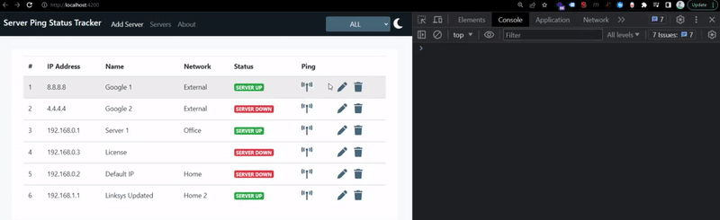

<br/>

### Filter servers in list by status

[Full Stack Spring Boot RESTful API with MySQL and Angular | RxJs State Management - Part 27](https://www.youtube.com/watch?v=zEpukgALl3U&list=PLopcHtZ0hJF0OIOr88qHuJ3-UKRuCUrKf&index=27)

Implement Angular Filter By Status method and call it in UI

- Refactor `filterByStatus$` from `server.service.ts` component
  - to work with "ALL" option (that just returns the unmodified list of servers)
  - simplify message by either "Servers filtered by %{status} status" or "No servers of ${status} status were found"

```ts
// server.service.ts
filterByStatus$ = (status: Status, response: CustomResponse) =>
  <Observable<CustomResponse>>new Observable<CustomResponse>((subscriber) => {
    console.log(response);
    const servers = response.data?.servers || [];
    const filteredServers =
      status === Status.ALL
        ? servers
        : servers.filter((server) => server.status === status);
    const message =
      filteredServers.length > 0
        ? `Servers filtered by ${status} status`
        : `No servers of ${status} status were found`;

    subscriber.next({
      ...response,
      message,
      data: {
        servers: filteredServers,
      },
    });
    subscriber.complete();
  }).pipe(tap(console.log), catchError(this.handleError));
```

- Implement `filterServersByStatus` in `app.component.ts`
  - we will call `this.serverService.filterByStatus$(status, this.serversCopyDataSubject.value)` with a copy of our data from our UI (namely `this.serversCopyDataSubject.value`)
    - we don't want to overwrite the entire data when we filter! (therefore the original list with all servers will remain in the copy of `this.serversCopyDataSubject.value` and only `appState$` will be altered with missing Servers after filtering)
  - after the copy of our data has been filtered by `this.serverService.filterByStatus$` method, the filtered list of servers will come as a `response`
  - with this response we will update our main `appState$`

```ts
// app.component.ts
filterServersByStatus(event: Event): void {
  const statusValue: String = (event.target as HTMLInputElement).value;
  const status: Status = Status[statusValue as keyof typeof Status];
  this.appState$ = this.serverService
    .filterByStatus$(status, this.serversCopyDataSubject.value)
    .pipe(
      map((response) => {
        return {
          dataState: DataState.LOADED_STATE,
          appData: response,
        };
      }),
      startWith({
        dataState: DataState.LOADED_STATE,
        appData: this.serversCopyDataSubject.value,
      }),
      catchError((error: string) => {
        return of({ dataState: DataState.ERROR_STATE, error });
      })
    );
}
```

- Call `filterServersByStatus` from `app.component.html`

```html
<select
  name="status"
  (change)="filterServersByStatus($event)"
  class="btn btn-primary"
  title="Filter Severs by Status"
>
  <option value="ALL">ALL SERVERS</option>
  <option value="SERVER_UP">SERVERS UP</option>
  <option value="SERVER_DOWN">SERVERS DOWN</option>
</select>
```

We can also go a step further and retain the Status Filtered within our application UI using a `BehaviorSubject`: `private statusSubject = new BehaviorSubject<Status>( Status['ALL' as keyof typeof Status] );`. It might be useful later, since we now have a <u>bug</u> that: when we filter the list by status and we ping a server, we will show to the user all servers instead of keeping the filtered list as it was.

(Saturday, July 22, 2023, 15:37 - Radu-Alexandru Bulai)

Resources on issues encountered:

- [Property 'value' does not exist on type EventTarget in TypeScript](https://stackoverflow.com/questions/44321326/property-value-does-not-exist-on-type-eventtarget-in-typescript)

<br/>

### Add new server

[Full Stack Spring Boot RESTful API with MySQL and Angular | RxJs State Management - Part 28](https://www.youtube.com/watch?v=HyjQNpEt5ig&list=PLopcHtZ0hJF0OIOr88qHuJ3-UKRuCUrKf&index=28&ab_channel=GetArrays)

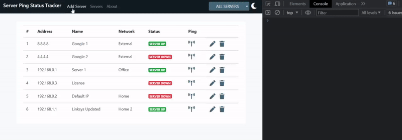

Since we are going to use Angular Forms (where user will submit a form with the new server details), we first need to import the `FormsModule` in `app.module.ts`:

```ts
// app.module.ts
import { NgModule } from "@angular/core";
import { BrowserModule } from "@angular/platform-browser";
import { HttpClientModule } from "@angular/common/http";
import { FormsModule } from "@angular/forms";

import { AppRoutingModule } from "./app-routing.module";
import { AppComponent } from "./app.component";

@NgModule({
  declarations: [AppComponent],
  imports: [BrowserModule, AppRoutingModule, HttpClientModule, FormsModule],
  providers: [],
  bootstrap: [AppComponent],
})
export class AppModule {}
```

<br/>

Implement Angular Add new server method and call it in UI:

- first call `this.serverService.addServer$` that receives `addServerForm.value` (`NgForm`) which is a JSON object containing all the keys (HTML property `name` for each `<input>`) and values when a user submits a form
- the response from the Back-End REST Spring API will be the new server that has been created
- we will modify this response by adding the current servers in UI (copy of servers) and then appending the new server to the list
- after that, we reset the HTML Form that uses sees, and assign the false state for the `this.isServerLoadingSubject.next(false);` variable (we will show a loading spinning icon while we wait for a response from the backend), and we can also close the modal on UI

```ts
// app.component.ts
onAddServer(addServerForm: NgForm): void {
  this.isServerLoadingSubject.next(true);
  this.appState$ = this.serverService
    .addServer$(addServerForm.value as Server)
    .pipe(
      map((response) => {
        const currentServers =
          this.currentServersCopyDataSubject.value?.data?.servers || [];
        this.currentServersCopyDataSubject.next({
          ...response,
          data: {
            servers: [...currentServers, response.data.server!],
          },
        });
        addServerForm.resetForm({ status: this.Status.SERVER_DOWN });
        this.isServerLoadingSubject.next(false);
        document.getElementById('closeModal')?.click();
        return {
          dataState: DataState.LOADED_STATE,
          appData: this.currentServersCopyDataSubject.value,
        };
      }),
      startWith({
        dataState: DataState.LOADED_STATE,
        appData: this.currentServersCopyDataSubject.value,
      }),
      catchError((error: string) => {
        this.isServerLoadingSubject.next(false);
        return of({ dataState: DataState.ERROR_STATE, error });
      })
    );
}
```

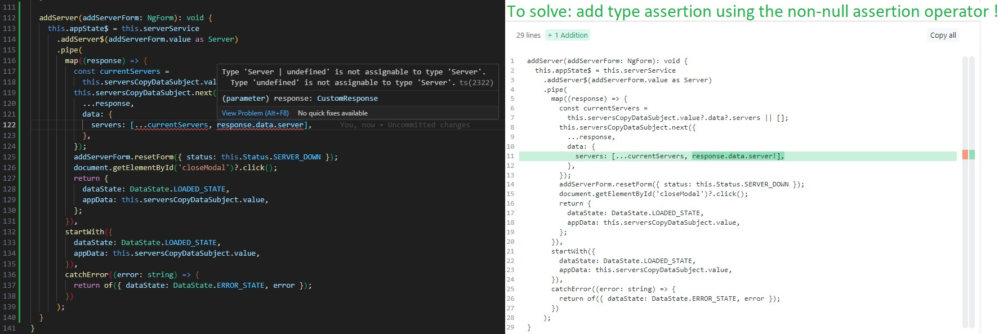

<br/>

In order to have a loading spinning icon right after the user adds the new server (and waits for a response from backend), we can:

- define a `isServerRequestLoadingSubject = new BehaviorSubject<boolean>(false);` where we will keep a "state" of loading
- on the very start of `onAddServer` method, we can set this variable to true, then set it back on false
  - when the request is completed and we received (and process) the response from backend server
  - or when we receive an error

```ts
// app.component.ts
private isServerRequestLoadingSubject = new BehaviorSubject<boolean>(false);
readonly isServerRequestLoading$ = this.isServerRequestLoadingSubject.asObservable();
```

- on HTML, we will use the observable of `isServerRequestLoadingSubject` to show/hide the _"Add" button_ or _"Saving..." disabled button along with a spinner icon_

```html
<!-- app.component.html -->
<!-- Add server Modal HTML -->
<div id="addServerModal" class="modal fade">
  <div class="modal-dialog">
    <div class="modal-content">
      <form #addServerForm="ngForm" (ngSubmit)="onAddServer(addServerForm)">
        <div class="modal-header">
          <div class="modal-title">Add Server</div>
          <button
            type="button"
            class="close"
            data-dismiss="modal"
            aria-hidden="true"
          >
            &times;
          </button>
        </div>
        <div class="modal-body">
          <div class="form-group">
            <label>IP Address / FQDN</label>
            <input
              type="text"
              ngModel
              name="ipAddress"
              class="form-control"
              required
            />
          </div>
          <div class="form-group">
            <label>Name</label>
            <input
              type="text"
              ngModel
              name="name"
              class="form-control"
              required
            />
          </div>
          <div class="form-group">
            <label>Network</label>
            <input
              type="text"
              ngModel
              name="network"
              class="form-control"
              required
            />
          </div>
          <div class="form-group">
            <label>Status</label>
            <select
              name="status"
              ngModel="SERVER_DOWN"
              class="form-control"
              name="status"
              required
            >
              <option value="SERVER_UP">SERVER UP</option>
              <option value="SERVER_DOWN">SERVER DOWN</option>
            </select>
          </div>
        </div>
        <div class="modal-footer">
          <button
            type="button"
            class="btn"
            id="closeModal"
            data-dismiss="modal"
          >
            Cancel
          </button>
          <button
            type="submit"
            class="btn btn-primary"
            [disabled]="addServerForm.invalid || (isServerLoading$ | async)"
          >
            <span *ngIf="!(isServerLoading$ | async)">Add</span>
            <span *ngIf="isServerLoading$ | async">Saving...</span>
            <i
              *ngIf="isServerLoading$ | async"
              class="fas fa-spinner fa-spin"
            ></i>
          </button>
        </div>
      </form>
    </div>
  </div>
</div>
```


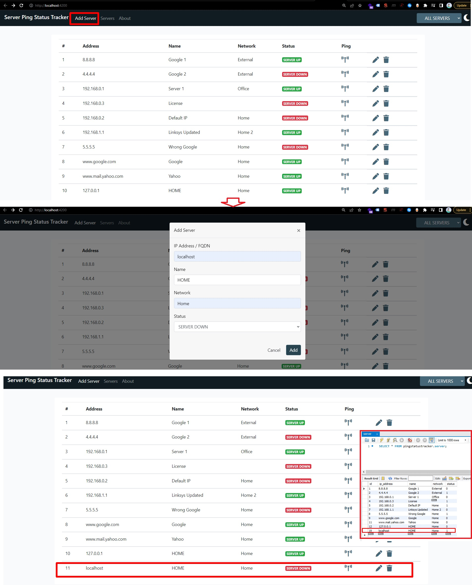

(Sunday, July 23, 2023, 15:52)

<br/>

### Delete a server

[Full Stack Spring Boot RESTful API with MySQL and Angular | RxJs State Management - Part 30](https://www.youtube.com/watch?v=HyjQNpEt5ig&list=PLopcHtZ0hJF0OIOr88qHuJ3-UKRuCUrKf&index=30&ab_channel=GetArrays)

Implement Angular Delete Server method and call it in UI

- `app.component.ts`: implement `onDeleteServer` method that will receive a server object as parameter (we will use this server to filter out our Servers Copy list that is currently displayed in UI) -> this is needed because the "Delete" method from SpringBoot backend does not send back the whole server that was just been deleted
- once we retrieved the succesful resposne form backend, we filter out the server that has been deleted from our servers UI list

```ts
// app.component.ts
onDeleteServer(server: Server): void {
  this.appState$ = this.serverService.deleteServerById$(server.id).pipe(
    map((response) => {
      this.currentServersCopyDataSubject.next({
        ...response,
        data: {
          servers:
            this.currentServersCopyDataSubject.value.data.servers?.filter(
              (serverToDelete) => serverToDelete.id !== server.id
            ),
        },
      });
      return {
        dataState: DataState.LOADED_STATE,
        appData: this.currentServersCopyDataSubject.value,
      };
    }),
    startWith({
      dataState: DataState.LOADED_STATE,
      appData: this.currentServersCopyDataSubject.value,
    }),
    catchError((error: string) => {
      return of({ dataState: DataState.ERROR_STATE, error });
    })
  );
}
```

<br/>

```html
<!-- app.component.html -->
<table class="table table-hover" id="servers">
  <thead>
    <tr>
      <th>#</th>
      <th>Address</th>
      <th>Name</th>
      <th>Network</th>
      <th>Status</th>
      <th>Ping</th>
      <th></th>
    </tr>
  </thead>
  <tbody
    *ngFor="
      let server of appState.appData?.data?.servers;
      let i = index
    "
  >
    <tr>
      <td title="Server ID: {{ server.id }}">{{ i + 1 }}</td>
      <td>{{ server.ipAddress }}</td>
      <td>{{ server.name }}</td>
      <td>{{ server.network }}</td>
      <td>
        <span
          class="badge"
          [ngClass]="[
            server.status === Status.SERVER_UP
              ? ' badge-success'
              : ' badge-danger'
          ]"
        >
          {{ server.status === Status.SERVER_UP ? "SERVER UP" : "SERVER DOWN" }}
        </span>
      </td>
      <td>
        <a
          class="edit"
          style="cursor: pointer"
          (click)="onPingServerByItsIpAddress(server.ipAddress)"
        >
          <i
            *ngIf="
              (ipAddressStatusWhenPinging$ | async) === '' ||
              (ipAddressStatusWhenPinging$ | async) !== server.ipAddress
            "
            class="fa fa-tower-broadcast fa-1x"
            title="Ping Server"
            style="font-size: 1.5rem"
          ></i>
          <i
            *ngIf="
              (ipAddressStatusWhenPinging$ | async) === server.ipAddress
            "
            class="fa fa-circle-notch fa-spin"
            style="font-size: 1.5rem"
          ></i>
        </a>
      </td>
      <td class="d-flex flex-row">
        <a class="edit" data-toggle="modal" style="cursor: pointer"
          ><i
            class="fa fa-pen fa-1x mx-2"
            title="Delete Server"
            style="font-size: 1.5rem"
          ></i
        ></a>
        <a
          (click)="onDeleteServer(server)"
          class="delete"
          data-toggle="modal"
          style="cursor: pointer"
          ><i
            class="fa fa-trash fa-1x mx-2"
            title="Delete Server"
            style="font-size: 1.5rem"
          ></i
        ></a>
      </td>
    </tr>
  </tbody>
</table>
```

<br/>

### Update a server and onOpenModal method

This part is not included in the [Main Tutorial of Full Stack Spring Boot RESTful API with MySQL and Angular](https://www.youtube.com/playlist?list=PLopcHtZ0hJF0OIOr88qHuJ3-UKRuCUrKf)

(Monday, July 24, 2023, 22:59 - Radu-Alexandru Bulai)

Since the edit modal will need access to the Server object that we want to edit (in order to populate the input fields): we either need to include _the HTML modal with the edit `<form>`_ right inside the servers list. However, for a better code separation we can use a different approach:

- we can create a separate `openModal` method where the "current to edit" server will be transmitted
- we store the server locally in a separate `editServer$` variable/observable (currently in `app.component.ts`)
- we can access the `editServer$` server anywhere in `app.component.html`

<br/>

The `onOpenModal` function (in `app.component.ts`) will have a "modalMode" parameter what will determine which modal will be opened: `onOpenModal(server: Server, modalMode: String): void {}`

- in `onOpenModal` we will create a button (by default, when we createElement button, its default type is "type=submit", but we can change it to "type=button")
- the button attribute `data-toggle` will be "modal" (needed for Bootstrap4)
- the button attribute `data-target` will be dynamic (received from the function parameter)
- we want to add these buttons (that opens a specific modal) dinamically to our UI (`app.component.html`): we can first add an ID to the container div in HTML: `<div class="container" id="main-container">`
- get the container in `app.component.ts`: `const container = document.getElementById('main-container');`
- append the created button to the div container (in DOM) and click it: `container?.appendChild(button); button.click();`

```ts
// app.component.ts
private editServerSubject = new BehaviorSubject<Server>(null!);
readonly editServer$ = this.editServerSubject.asObservable();

...

onOpenModal(server: Server, modalMode: String): void {
  const container = document.getElementById('main-container');
  const button = document.createElement('button');
  button.type = 'button';
  button.style.display = 'none';
  button.setAttribute('data-toggle', 'modal');
  if (modalMode == 'edit') {
    this.editServerSubject.next(server);
    button.setAttribute('data-target', '#editServerModal');
  }
  container?.appendChild(button);
  button.click();
  button.remove();
}
```

<br/>

For the `onUpdateServer` method:

- `this.isServerRequestLoadingSubject.next(true)`: sets the value of the isServerRequestLoadingSubject subject to true to indicate that a server update request is currently in progress (until we get a response from backend).
- `this.appState$ = this.serverService.updateServer$(updateServerForm.value as Server).pipe(...);`: calls the `updateServer$` method from the `serverService` and pipes the resulting observable through various operators like `map`, `startWith`, and `catchError`
- Inside the `map` operator, the function processes the server update response:
  - update the `currentServersCopyDataSubject` with the updated server data and set the `isServerRequestLoadingSubject` to `false` after the update operation completes (we will show a loading spinning icon while we wait for a response from the backend)
  - `document.getElementById('closeEditModal')?.click();`: close the edit modal after the server update operation is completed
  - Note that unlike "adding" action, we do not need to reset the "edit" HTML form sincethe form will always be populated with selected server's values
- Finally, the `map` operator returns an object with the `dataState` set to `DataState.LOADED_STATE` and `appData` set to the value of `currentServersCopyDataSubject`

```ts
// app.component.ts
onUpdateServer(updateServerForm: NgForm): void {
  this.isServerRequestLoadingSubject.next(true);
  this.appState$ = this.serverService
    .updateServer$(updateServerForm.value as Server)
    .pipe(
      map((response) => {
        const currentServers =
          this.currentServersCopyDataSubject.value?.data?.servers || [];
        const indexOfUpdatedServer = currentServers!.findIndex(
          (server) => server.id === response.data.server!.id
        );
        currentServers![indexOfUpdatedServer] = response.data.server!;
        this.isServerRequestLoadingSubject.next(false);
        document.getElementById('closeEditModal')?.click();
        return {
          dataState: DataState.LOADED_STATE,
          appData: this.currentServersCopyDataSubject.value,
        };
      }),
      startWith({
        dataState: DataState.LOADED_STATE,
        appData: this.currentServersCopyDataSubject.value,
      }),
      catchError((error: string) => {
        this.isServerRequestLoadingSubject.next(false);
        return of({ dataState: DataState.ERROR_STATE, error });
      })
    );
}
```

<br/>

In `app.component.html`

- Each input field will have its value populated (by default) with the current server's data that can be retrieved by the `editServer$` observable: `ngModel="{{ (editServer$ | async)?.name }}"`
- We will use the same observable of `isServerRequestLoadingSubject` to show/hide the _"Update" button_ or _"Updating..." disabled button along with a loading spinner icon_
- Note that we will need to have a hidden input (of server's id) in order to have a complete Server object (without missing any properties) for when we will call the updateEmployee method with the UPDATE (PUT) request to our backend SpringBoot API: `<input type="hidden" ngModel="{{ (editServer$ | async)?.id }}" name="id" />`

```html
<!-- app.component.html -->
<a
  (click)="onOpenModal(server, 'edit')"
  class="edit"
  data-toggle="modal"
  style="cursor: pointer"
  ><i
    class="fa fa-pen fa-1x mx-2"
    title="Edit Server"
    style="font-size: 1.5rem"
  ></i
></a>

...

<!-- Update server Modal HTML -->
<div id="editServerModal" class="modal fade">
  <div class="modal-dialog">
    <div class="modal-content">
      <form
        #editServerForm="ngForm"
        (ngSubmit)="onUpdateServer(editServerForm)"
      >
        <div class="modal-header">
          <div class="modal-title">
            Edit Server "{{ (editServer$ | async)?.name }}"
          </div>
          <button
            type="button"
            class="close"
            data-dismiss="modal"
            aria-hidden="true"
          >
            &times;
          </button>
        </div>
        <div class="modal-body">
          <input
            type="hidden"
            ngModel="{{ (editServer$ | async)?.id }}"
            name="id"
          />
          <div class="form-group">
            <label>IP Address / FQDN</label>
            <input
              type="text"
              ngModel="{{ (editServer$ | async)?.ipAddress }}"
              name="ipAddress"
              class="form-control"
              required
            />
          </div>
          <div class="form-group">
            <label>Name</label>
            <input
              type="text"
              ngModel="{{ (editServer$ | async)?.name }}"
              name="name"
              class="form-control"
              required
            />
          </div>
          <div class="form-group">
            <label>Network</label>
            <input
              type="text"
              ngModel="{{ (editServer$ | async)?.network }}"
              name="network"
              class="form-control"
            />
          </div>
          <div class="form-group">
            <label>Status</label>
            <select
              name="status"
              ngModel="{{ (editServer$ | async)?.status }}"
              class="form-control"
              name="status"
              required
            >
              <option value="SERVER_UP">SERVER UP</option>
              <option value="SERVER_DOWN">SERVER DOWN</option>
            </select>
          </div>
        </div>
        <div class="modal-footer">
          <button
            type="button"
            class="btn"
            id="closeEditModal"
            data-dismiss="modal"
          >
            Cancel
          </button>
          <button
            type="submit"
            class="btn btn-primary"
            [disabled]="
              editServerForm.invalid || (isServerRequestLoading$ | async)
            "
          >
            <span *ngIf="!(isServerRequestLoading$ | async)">Update</span>
            <span *ngIf="isServerRequestLoading$ | async">Updating...</span>
            <i
              *ngIf="isServerRequestLoading$ | async"
              class="fas fa-circle-notch fa-spin"
            ></i>
          </button>
        </div>
      </form>
    </div>
  </div>
</div>
```

<br/>

### Search Servers in UI

(Saturday, July 29, 2023, 23:39)

```ts
// server.service.ts
searchServersByKeyword$ = (keyword: String, response: CustomResponse) =>
  <Observable<CustomResponse>>new Observable<CustomResponse>((subscriber) => {
    const currentServers = response.data?.servers || [];
    const searchedText = keyword.toLowerCase();
    const resultedServers: Server[] = currentServers.filter(
      (server) =>
        server.name.toLowerCase().indexOf(searchedText) !== -1 ||
        server.ipAddress.toLowerCase().indexOf(searchedText) !== -1 ||
        server.network.toLowerCase().indexOf(searchedText) !== -1
    );
    // --- Older less eficient method ---
    // let resultedServers: Server[] = [];
    // for (const server of currentServers) {
    //   if (
    //     server.name.toLowerCase().indexOf(searchedText) !== -1 ||
    //     server.ipAddress.toLowerCase().indexOf(searchedText) !== -1 ||
    //     server.network.toLowerCase().indexOf(searchedText) !== -1
    //   ) {
    //     resultedServers.push(server);
    //   }
    // }
    subscriber.next({
      ...response,
      message: "Servers resulted by search",
      data: {
        servers: resultedServers,
      },
    });
    subscriber.complete();
  }).pipe(tap(console.log), catchError(this.handleError));
```

<br/>

```ts
// app.components.ts or servers.component.ts
onSearchServers(keyword: String): void {
  this.appState$ = this.serverService
    .searchServersByKeyword$(
      keyword,
      this.currentServersCopyDataSubject.value
    )
    .pipe(
      map((response) => {
        return {
          dataState: DataState.LOADED_STATE,
          appData: response,
        };
      }),
      startWith({
        dataState: DataState.LOADED_STATE,
        appData: this.currentServersCopyDataSubject.value,
      }),
      catchError((error: string) => {
        return of({ dataState: DataState.ERROR_STATE, error });
      })
    );
}
```

<br/>

```html
<!-- app.components.html or servers.component.html -->
<form class="form-inline">
  <input
    (ngModelChange)="onSearchServers(keyword.value)"
    #keyword="ngModel"
    ngModel
    name="keyword"
    type="search"
    id="searchName"
    class="form-control"
    style="border: none !important"
    title="Search servers by name, address or network"
    placeholder="Search servers..."
  />
</form>
```

<br/>
<br/>

> <hr>
>
> **Refactoring...**
>
> Refactor: split app.component in separate servers & header components
>
> - Create server and header components with `ng generate component components/header` and `ng generate component components/servers`
> - Move all properties and methods from app.component.ts to servers.component.ts + Edit onOpenModal method to have additional "add" modalMode (and add click event listener on "Add Server" button from the header/navbar)
> - Move all HTML from app.component.html to servers.component.html
> - Within "header.component.ts" Pass/Inject the serversComponent: ServersComponent in constructor + Implement own onOpenModal method that calls this.serversComponent.onOpenModal(server, modalMode);
> - Move the `<nav>` element from app.component.html/servers.component.html to header.component.html
> - In "app.module.ts" Add `providers: [ServersComponent]` in order to fix "NullInjectorError: No provider for ServersComponent!" error
>
> (Wednesday, July 26, 2023, 23:47 - Radu-Alexandru Bulai)
>
> <hr>

<br/>

<br/>

<hr>

## Refactoring: About Page Route

(Saturday, July 29, 2023, 13:25)

Reuse of personal notes

- from https://github.com/radualexandrub/Study/blob/master/Angular/README.md#angular-router
- and commit from previous EmployeeManager application https://github.com/radualexandrub/SpringBoot-Angular-EmployeeManagerApp/commit/572dbe053a617cd1f11730a9daee5444494adb67#diff-5468d09e26643f32f6d6f60deb0960d87f4f5bd8e6da893a27453e3f9ccd9116

<br/>

1\) Create About page by running `ng generate component components/pages/aboutPage`

2\) In `app.module.ts`

- import "Routes", define "appRoutes" where routes are specified
- add `imports: [RouterModule.forRoot(appRoutes, { enableTracing: false })]` (this should be set on true for debugging purposes and false in production)

```ts
// app.module.ts
const appRoutes: Routes = [
  { path: "", component: ServersComponent },
  { path: "about", component: AboutPageComponent },
];

...

@NgModule({
  declarations: [
    AppComponent,
    FooterComponent,
    ServersComponent,
    HeaderComponent,
    AboutPageComponent,
  ],
  imports: [
    BrowserModule,
    AppRoutingModule,
    HttpClientModule,
    FormsModule,
    RouterModule.forRoot(appRoutes, { enableTracing: false }),
  ],
  providers: [ServersComponent],
  bootstrap: [AppComponent],
})
```

3\) In `app.component.html`, instead of `<app-servers>` component we add `<router-outlet>`

```html
<!-- app.component.html -->
<app-header></app-header>
<router-outlet></router-outlet>
<app-footer></app-footer>
```

4\) Add contents to `about-page.component.html`

5\) In `header.component.ts`

- make sure "private router: Router" is passed in contructor
- make sure "hasRoute" and "hasRouteIncluded" methods are defined

```ts
// header.component.ts
constructor(
  private serversComponent: ServersComponent,
  private router: Router
) {}

...

hasRoute(route: string): boolean {
  return this.router.url === route;
}

hasRouteIncluded(route: string): boolean {
  return this.router.url.includes(route);
}
```

6\) In `header.component.html`

- add `*ngIf="hasRoute('/')"` on "Add Server" button to hide it from navbar when we are in "About" page
- add `*ngIf="hasRoute('/about')"` to show Servers(/) link when in "About" page
- add `[ngClass]="{ active: hasRoute('/about') }"` to show "About" link page as active

<hr>

<br/>

<hr>

> Dockerize Application with docker-compose (Angular, Spring Boot, MySQL)
>
> - Create and configure "Angular.Dockerfile"
>   - Note that we use "outputPath": "dist/out" configured in "angular.json" as Angular build location
> - Create .dockerignore
> - Create and configure "Spring.Dockerfile"
>   - Note that we use Java 17 (FROM openjdk:17-jdk-slim)
> - Create and configure docker-compose.yml (contains MySQL Server image)
>   - For MySQL, the db name from mysql-db service (MYSQL_DATABASE: pingstatustracker) should be reflected under the Back-End Spring Service property of SPRING_DATASOURCE_URL, as well as username and password
> - Create environment.prod.ts Add Angular env variables from development environment.ts
> - Create nginx-custom.con Add 'Access-Control-Allow-Origin' headers for Nginx Server (where browser clients will connect to) for CORS
>
> Endpoints:
>
> - Angular will run on http://localhost:8081/
> - SpringBoot API will run on http://localhost:8080/api/servers
> - MySQL will run on port 3306
>   - Note: You can enter the MySQL docker container by running `docker ps -a`, then copy the container ID, then run
>     `docker exec -it containerID mysql -uradu -pradu123456 -D pingstatustracker`
>     -- e.g. for running queries directly on db:
>     `INSERT INTO server (id, ip_address, name, network) VALUES (3, '192.168.0.1', 'Server 1', 'Office');`
>
> Resources used: - https://github.com/radualexandrub/SpringBoot-Angular-EmployeeManagerApp/commit/7ecee0943a11e0d10c4cde6a238feae752fbb249 - https://www.javachinna.com/angular-nginx-spring-boot-mysql-docker-compose/
> (Monday, July 31, 2023, 23:27 - Radu-Alexandru Bulai)

<hr>

<br/>

## Angular-Notifier

[Full Stack Spring Boot RESTful API with MySQL and Angular | RxJs State Management - Part 32 Notifications](https://www.youtube.com/watch?v=hTDVVdBZBqo&list=PLopcHtZ0hJF0OIOr88qHuJ3-UKRuCUrKf&index=32)

(Saturday, August 26, 2023, 10:18)

https://www.npmjs.com/package/angular-notifier - A well designed, fully animated, highly customizable, and easy-to-use notification library for your Angular 2+ application.

<br/>

Step 1\) Install the angular-notifier library using `npm i angular-notifier`.

Step 2\) In `app.module.ts`, import and add to `imports: []` the `BrowserAnimationsModule` - `import { BrowserAnimationsModule } from '@angular/platform-browser/animations';`

Step 3\) We will turn the above `Angular Notifier` library into a module which will be bringed to `app.module.ts`.

- Create in Angular `/src/app` directory a file called `notification.module.ts` (could be a copy paste of `app.module.ts`)
- Add angular-notifier's options `const notifierDefaultOptions: NotifierOptions = {}`

```ts
// notification.module.ts
import { NgModule } from "@angular/core";
import { NotifierModule, NotifierOptions } from "angular-notifier";

const customNotifierOptions: NotifierOptions = {
  position: {
    horizontal: {
      position: "right",
      distance: 12,
    },
    vertical: {
      position: "top",
      distance: 12,
      gap: 10,
    },
  },
  theme: "material",
  behaviour: {
    autoHide: 3000,
    onClick: false,
    onMouseover: "pauseAutoHide",
    showDismissButton: true,
    stacking: 4,
  },
  animations: {
    enabled: true,
    show: {
      preset: "slide",
      speed: 300,
      easing: "ease",
    },
    hide: {
      preset: "fade",
      speed: 300,
      easing: "ease",
      offset: 50,
    },
    shift: {
      speed: 300,
      easing: "ease",
    },
    overlap: 150,
  },
};

@NgModule({
  imports: [NotifierModule.withConfig(customNotifierOptions)],
  exports: [NotifierModule],
})
export class NotificationModule {}
```

Step 4\) In `app.module.ts`, import the above created module `import { NotificationModule } from './notification.module';` and add it to `imports: []`

Step 5\) In `styles.css`, import the styles from the module (using `~`): `@import "~angular-notifier/styles";` ... or just use `@import "../node_modules/angular-notifier/styles.css";`

Step 6\) In `app.component.html` we can simply add `<notifier-container></notifier-container>`

Step for demo only\) In `app.component.ts` (or `servers.component.ts` for refactored code)

- in the `constructor`, add/inject as parameter `private notifier: NotifierService`
- we can add `this.notifier.notify('success', 'You are awesome! I mean it!');` on a function like `ngOnInit()` for a demo example
- Or add `this.notifier.notify('success', "Servers filtered by ${statusValue}");` in `onFilterServersByStatus()` method

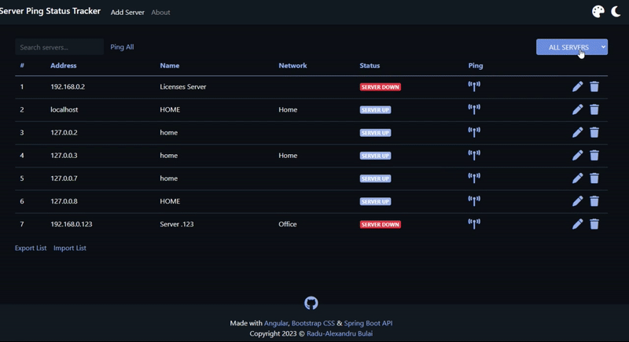

<br/>

[Full Stack Spring Boot RESTful API with MySQL and Angular | RxJs State Management - Part 34](https://www.youtube.com/watch?v=UGhNvjpf6VA&list=PLopcHtZ0hJF0OIOr88qHuJ3-UKRuCUrKf&index=34)

Step 7\) Under `/src/app/services`, we can create our own `notification.service.ts` (or run CLI command `ng generate service services/notification`)

- Logic is: our `notification.service.ts` will have direct methods to call each type of message, e.g. instead of calling (in our `app.component.ts`) a `notifierService.notify('success', 'Message for success')`, we would call a `notificationService.onSuccess('Message for success')`.

```ts
// notification.service.ts
import { Injectable } from "@angular/core";
import { NotifierService } from "angular-notifier";

@Injectable({
  providedIn: "root",
})
export class NotificationService {
  private readonly notifier: NotifierService;

  constructor(notifierService: NotifierService) {
    this.notifier = notifierService;
  }

  onDefaultMessage(message: string) {
    this.notifier.notify(Type.DEFAULT, message);
  }
  onInfoMessage(message: string) {
    this.notifier.notify(Type.INFO, message);
  }
  onSuccessMessage(message: string) {
    this.notifier.notify(Type.SUCCESS, message);
  }
  onWarningMessage(message: string) {
    this.notifier.notify(Type.WARNING, message);
  }
  onErrorMessage(message: string) {
    this.notifier.notify(Type.ERROR, message);
  }
}

enum Type {
  DEFAULT = "default",
  INFO = "info",
  SUCCESS = "success",
  WARNING = "warning",
  ERROR = "error",
}
```

Step 8\) In `app.component.ts` (or `servers.component.ts` for refactored code):

- `import { NotificationService } from 'src/app/services/notification.service';`
- in the `constructor`, add/inject as parameter `private notification: NotificationService`
- under each success method, we can call `this.notification.onSuccessMessage("A success message");`

<br/>

## Angular Reactive vs Procedural approach

[Full Stack Spring Boot RESTful API with MySQL and Angular | RxJs State Management - Part 35](https://www.youtube.com/watch?v=vl0wcmgi_Ik&list=PLopcHtZ0hJF0OIOr88qHuJ3-UKRuCUrKf&index=35)

Performance Advantages:

- **Default (Procedural Approach)**: In the default approach, Angular uses the `checkAlways` strategy, where it constantly checks for changes in components and updates the UI. This means that Angular will continuously monitor the application's state and trigger UI updates whenever there's a potential change / Constantly watching if every variable changes.

- **OnPush (Reactive Approach)**: With the OnPush change detection strategy, Angular takes a more optimized approach. It only looks for changes when certain triggers occur:
  - When an `@Input` property changes (typically initiated by user interaction).
  - When `events are emitted` (for example, through event binding).
  - When `observables emit new values` (used extensively in this project).

By using the OnPush strategy, Angular reduces the frequency of UI updates, leading to improved performance and responsiveness. This is particularly beneficial when dealing with complex and data-intensive applications.

```typescript
// Example of forcing OnPush strategy in Angular:
// app.component.ts
@Component({
  selector: "app-root",
  templateUrl: "./app.component.html",
  styleUrls: ["./app.component.css"],
  changeDetection: ChangeDetectionStrategy.OnPush,
  // This will force Angular to only detect changes based on specific triggers
  // such as @Input changes, event emissions, or observable emissions
})
export class AppComponent {
  // If this variable changes its value over time,
  // the changes will not be automatically detected
  name = "Radu";
}
```

By explicitly applying the `OnPush` change detection strategy to a component, as shown in the example, Angular restricts change detection to specific triggers. This can significantly enhance performance by reducing unnecessary UI updates and improving the efficiency of rendering operations.

---

Here's an extended example of how the OnPush strategy works with different triggers like `@Input` changes, event emissions, and observable emissions:

1. The `title` property is marked with `@Input()`, which means it can change based on external changes (typically from a parent component).
2. An observable (`data$`) is created using a `BehaviorSubject` to simulate an asynchronous data source. The value of this observable changes over time.
3. The `buttonClicks` property is used to track how many times a button is clicked. This is a simple event emission scenario.

By using the `OnPush` change detection strategy, Angular will only perform change detection when any of these triggers are activated:

- When the `title` property, marked as `@Input()`, changes from its parent component.
- When the observable (`data$`) emits a new value.
- When the button is clicked and the `buttonClicks` value changes.

```typescript
import { Component, Input, ChangeDetectionStrategy } from "@angular/core";
import { BehaviorSubject } from "rxjs";

@Component({
  selector: "app-root",
  templateUrl: "./app.component.html",
  styleUrls: ["./app.component.css"],
  changeDetection: ChangeDetectionStrategy.OnPush,
})
export class AppComponent {
  // @Input change trigger
  @Input() title: string = "";

  // Observable emissions trigger
  dataSubject = new BehaviorSubject<string>("Initial Value");
  data$ = this.dataSubject.asObservable();

  // Event emissions trigger
  buttonClicks = 0;

  constructor() {
    // Simulating changes over time
    setInterval(() => {
      // Update the Observable value
      this.dataSubject.next("Updated Value");

      // Increment button clicks
      this.buttonClicks++;
    }, 1000);
  }
}
```

This approach minimizes the frequency of change detection cycles and results in better performance, as Angular avoids unnecessary re-renders when no relevant triggers are activated.

<br/>

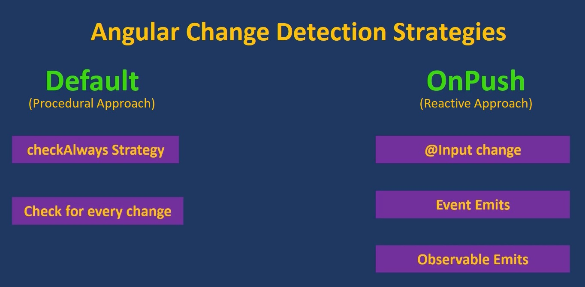

<br/>

> ---
>
> Building an app in Angular using the Reactive approach versus the Procedural approach involves different ways of structuring and managing the codebase, particularly when dealing with asynchronous operations, state management, and data flow.
>
> 1\. <u>**Procedural Approach**</u>:
> In the Procedural approach, you typically handle asynchronous operations and state changes using callbacks, promises, and imperative programming techniques. This approach is more sequential and involves writing code that explicitly defines the steps to be taken.
>
> - **Code Structure**: Code tends to be organized around actions and events. You might have multiple callbacks or nested promises to manage asynchronous operations.
> - **State Management**: State changes are handled explicitly by updating variables or calling functions in response to events.
> - **Data Flow**: Data flow can be more complex to manage, as you need to ensure that the right data is available at the right time.
> - **Error Handling**: Error handling can involve try-catch blocks or explicit checks for error conditions.
>
> Advantages of the Procedural Approach:
>
> - **Familiarity**: If developers are more comfortable with imperative programming, the procedural approach might feel more familiar.
> - **Simplicity for Simple Scenarios**: For simpler use cases, a procedural approach might require less overhead than setting up and managing observables.
>
> <br/>
>
> 2\. <u>**Reactive Approach**</u>:
> The Reactive approach utilizes observables and reactive programming principles to manage asynchronous operations and state changes. This approach is more declarative and focuses on describing how the data should behave over time.
>
> - **Code Structure**: Code is organized around data streams and how they transform over time. Observables are used to represent these streams of data.
> - **State Management**: State changes are managed by observing streams of data and reacting to changes using operators like `map`, `filter`, and `merge`.
> - **Data Flow**: Data flow is more streamlined, as observables provide a structured way to handle asynchronous data.
> - **Error Handling**: Error handling is built into the observable pipeline, allowing you to catch and handle errors more effectively.
>
> Advantages of the Reactive Approach:
>
> - **Declarative**: Reactive code is more declarative, making it easier to understand the data flow and transformations.
> - **Streamlined Data Flow**: Observables provide a clear way to handle asynchronous data flow and updates.
> - **Composable**: Operators allow you to compose and manipulate data streams in a modular way.
> - **Error Handling**: Observables have built-in error handling capabilities, making it easier to handle errors.
>
> Choosing between these approaches depends on factors like the complexity of your application, the team's familiarity with reactive programming, and the level of control you need over asynchronous operations and data flow.
>
> In recent years, the Reactive approach has gained popularity for its ability to handle complex asynchronous scenarios more elegantly. It also aligns well with modern frontend patterns and is often used in combination with other technologies like Redux or NgRx for state management in Angular applications.
>
> ---
>
> The statement "Reactive programming aligns well with modern frontend patterns" refers to how reactive programming principles fit naturally with some of the common patterns and practices used in modern front-end development. Here are a few patterns and concepts that are closely related to reactive programming:
>
> 1. **Component-Based Architecture**: Modern front-end development often follows a component-based architecture, where UI components are self-contained and reusable. Reactive programming's focus on data flow and isolation fits well with the idea of managing component state and interactions using observables.
> 2. **State Management**: Reactive programming is used extensively in state management solutions like Redux, NgRx (for Angular), and MobX. These libraries utilize observables to manage application state in a predictable and efficient manner. Reactive programming's emphasis on data streams aligns with the need to manage and propagate state changes across the application.
> 3. **Event-Driven Programming**: In reactive programming, observables are a natural fit for representing and handling events in the application. Modern frontend patterns often involve handling various user interactions, network requests, and other events. Reactive programming simplifies managing these asynchronous event streams.
> 4. **UI Reactivity**: Reactive programming helps achieve responsive and dynamic user interfaces. Changes in data are automatically propagated to the UI components that depend on that data. This aligns with the goal of creating interactive and reactive user interfaces.
> 5. **Data Transformation and Pipelines**: Modern front-end applications deal with complex data transformations, filtering, mapping, and combining data from multiple sources. Reactive programming's operators provide a powerful and composable way to perform these operations on data streams.
> 6. **Asynchronous Operations**: Web applications often involve asynchronous operations like API calls, user interactions, timers, and more. Reactive programming provides a structured and unified approach to handle these asynchronous operations and their outcomes.
> 7. **Real-Time Applications**: Applications that require real-time updates, such as collaborative editing, chat applications, or live data dashboards, can benefit from reactive programming's ability to handle continuous data streams and updates.
> 8. **Functional Programming**: Reactive programming shares some functional programming concepts, such as immutability, pure functions, and transformations. Modern front-end development often embraces functional programming principles for code organization and maintainability.
>    While not all modern front-end patterns explicitly require reactive programming, its principles align with the demands of building interactive, responsive, and data-driven web applications. It offers a more structured and elegant way to manage complex asynchronous operations and state changes, which is crucial in today's complex front-end landscapes.
>
> ---

<br/>
