Credits / Notes taken from:

- [Spring Boot Full Stack with Angular Application - Full Course 05-Feb-2021 - Amigoscode - 2h40m](https://youtu.be/Gx4iBLKLVHk)

<br/>

Resources:

- [Spring Boot Full Stack with Angular Application - GITHUB - Amigoscode](https://github.com/getarrays/employeemanagerapp)
- [Bootdey - Free Bootstrap snippets and examples](https://www.bootdey.com/bootstrap-snippets)
- [Start Bootstrap - Bootstrap themes, Templates and more](https://startbootstrap.com/)
- [Getbootstrap.com - Bootstrap4.4 - Modals](https://getbootstrap.com/docs/4.4/components/modal/)

<br/>

Table of Contents:


<br/>

Prerequisites:

- [Java](https://www.java.com/en/). Check out my [Study Notes on Java](https://github.com/radualexandrub/Study/blob/master/Java/README.md).
- [Apache Maven (mvn)](https://maven.apache.org/download.cgi).
- [Node.js installed](https://nodejs.org/en/). We need it to use NPM (Node Package Manager) to create an Angular App.
- [Angular](https://angular.io/). Check out my [Study Notes on Angular](https://github.com/radualexandrub/Study/blob/master/Angular/README.md).
- [IntelliJ IDEA (Community or other)](https://www.jetbrains.com/idea/) or [Eclipse IDE](https://www.eclipse.org/ide/).
- [Visual Studio Code](https://code.visualstudio.com/).
- [Postman API Platform](https://www.postman.com/) and [HTTPie – API testing client](https://httpie.io/)... or you can use [Insomnia](https://insomnia.rest/) instead
- [MySQL 8.0 (448MB installer)](https://dev.mysql.com/downloads/installer/)

<br/>

What is REST (API)?

https://30secondsofinterviews.org/


<br/>

# Back-End

## Project Setup

### Installing Java

- You should theoretically have Java already installed if on Windows Machine:

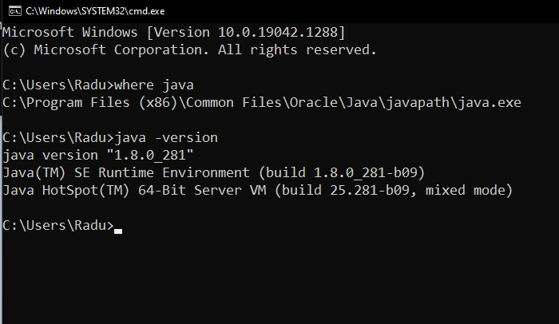

However, the "javac" command won't work (we can't compile java to binary classes with Command Prompt using the default Windows's Java)

(Recommended) You can download the JDK (Java Development Toolkit) separately from here: https://www.oracle.com/java/technologies/downloads/#jdk17-windows

**[Setup Java for Windows (Command Prompt) - w3schools](https://www.w3schools.com/java/java_getstarted.asp)**

1. Go to "System Properties" (Can be found on Control Panel > System and Security > System > Advanced System Settings)
2. Click on the "Environment variables" button under the "Advanced" tab
3. Then, select the "Path" variable in System variables and click on the "Edit" button
4. Click on the "New" button and add the path where Java is installed, followed by **\bin**. By default, Java is installed in C:\Program Files\Java\jdk-11.0.1 (If nothing else was specified when you installed it). In that case, You will have to add a new path with: **C:\Program Files\Java\jdk-11.0.1\bin**
   Then, click "OK", and save the settings
5. Restart PC
6. Open Command Prompt (cmd.exe) and type **java -version** to see if Java is running on your machine


Now we can also run "javac" command.

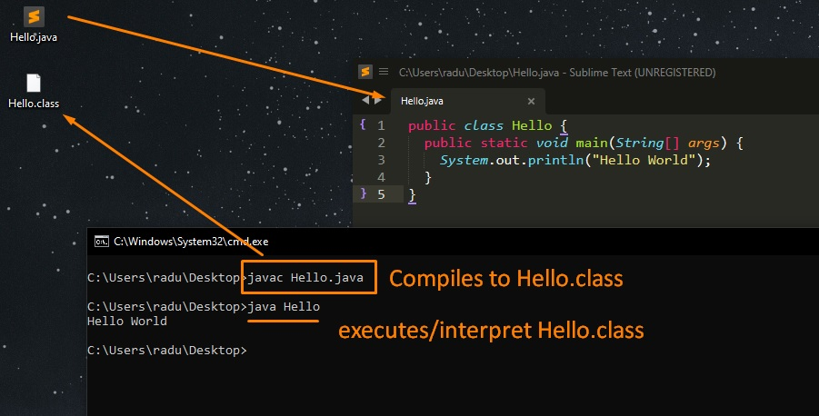

<br/>

### Installing Maven

(Sunday, August 14, 2022)

Note that we need to have [Apache Maven](https://maven.apache.org/download.cgi) installed on our machine.

You can download the "Binary zip archive". Then follow the install notes from Maven `README.txt` file:

```
  Installing Maven
  ----------------

  1) Unpack the archive where you would like to store the binaries, e.g.:

    Unix-based operating systems (Linux, Solaris and Mac OS X)
      tar zxvf apache-maven-3.x.y.tar.gz
    Windows
      unzip apache-maven-3.x.y.zip

  2) A directory called "apache-maven-3.x.y" will be created.

  3) Add the bin directory to your PATH, e.g.:

    Unix-based operating systems (Linux, Solaris and Mac OS X)
      export PATH=/usr/local/apache-maven-3.x.y/bin:$PATH
    Windows
      set PATH="c:\program files\apache-maven-3.x.y\bin";%PATH%

  4) Make sure JAVA_HOME is set to the location of your JDK

  5) Run "mvn --version" to verify that it is correctly installed.
```

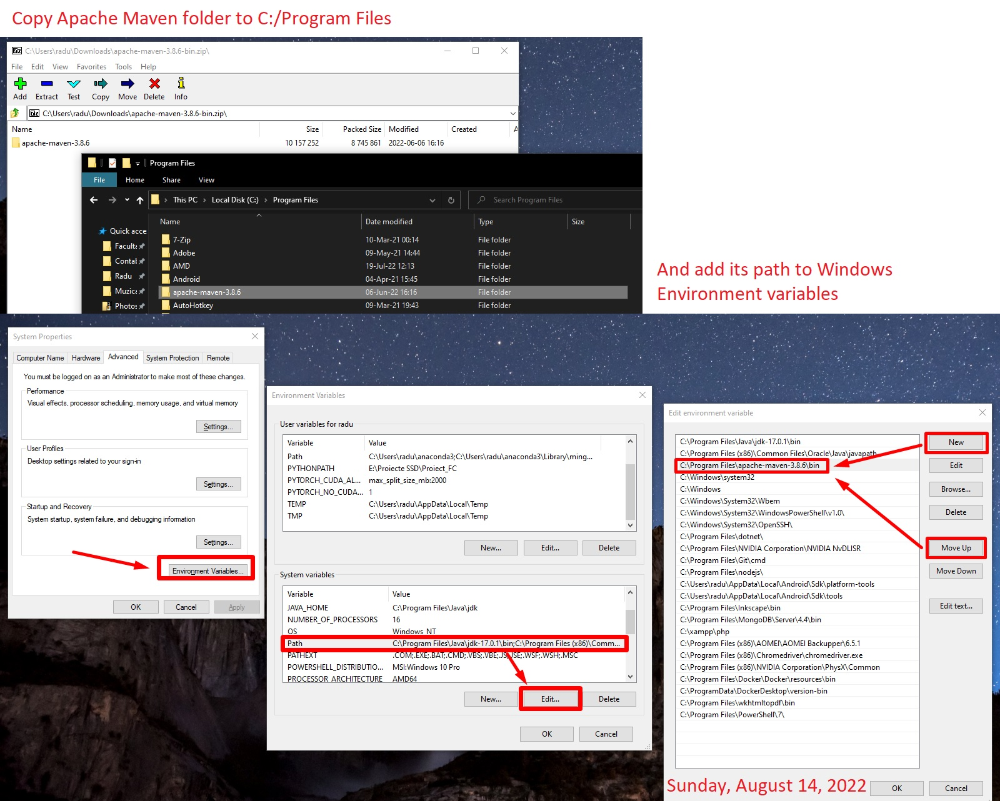

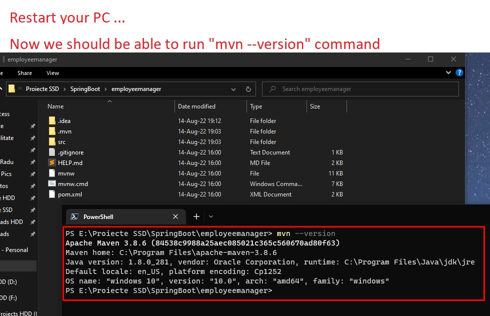

<br/>


### Initialize project with Spring Initializr

[Spring Initializr - Initializr generates spring boot project with just what you need to start quickly!](https://start.spring.io)

Project configuration:

- *Project:* Maven Project
- *Spring Boot:* Version 2.7.2
- *Project Metadata:*
    - *Group (domain):* "ENTER YOUR DOMAIN HERE" (for me it'll be [com.radubulai](https://radubulai.com))
    - *Artifact (the name of the application):* employeemanager
    - *Name:* employeemanager
    - *Description:* Employee Manager App
    - *Package name (you could leave the autogenerated name):* com.radubulai.employeemanager
    - *Packaging:* Jar
    - *Java Version:* 8

Dependencies:

- Spring Web
- Spring Data JPA
- MySQL Driver

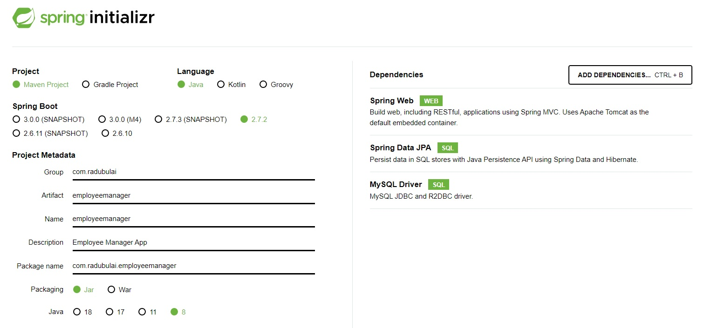

We can click "Explore" button to look at our Project's `pom.xml` file.

> From https://maven.apache.org/guides/introduction/introduction-to-the-pom.html:

> A Project Object Model or POM is the fundamental unit of work in Maven. It is an XML file that contains information about the project and configuration details used by Maven to build the project. It contains default values for most projects. Examples for this is the build directory, which is `target`; the source directory, which is `src/main/java`; the test source directory, which is `src/test/java`; and so on. When executing a task or goal, Maven looks for the POM in the current directory. It reads the POM, gets the needed configuration information, then executes the goal.

> Some of the configuration that can be specified in the POM are the project dependencies, the plugins or goals that can be executed, the build profiles, and so on. Other information such as the project version, description, developers, mailing lists and such can also be specified.

The contents of `pom.xml` file that will be generated:

```xml
<?xml version="1.0" encoding="UTF-8"?>
<project xmlns="http://maven.apache.org/POM/4.0.0" xmlns:xsi="http://www.w3.org/2001/XMLSchema-instance"
  xsi:schemaLocation="http://maven.apache.org/POM/4.0.0 https://maven.apache.org/xsd/maven-4.0.0.xsd">
  <modelVersion>4.0.0</modelVersion>
  <parent>
    <groupId>org.springframework.boot</groupId>
    <artifactId>spring-boot-starter-parent</artifactId>
    <version>2.7.2</version>
    <relativePath/> <!-- lookup parent from repository -->
  </parent>
  <groupId>com.radubulai</groupId>
  <artifactId>employeemanager</artifactId>
  <version>0.0.1-SNAPSHOT</version>
  <name>employeemanager</name>
  <description>Employee Manager App</description>
  <properties>
    <java.version>1.8</java.version>
  </properties>
  <dependencies>
    <dependency>
      <groupId>org.springframework.boot</groupId>
      <artifactId>spring-boot-starter-data-jpa</artifactId>
    </dependency>
    <dependency>
      <groupId>org.springframework.boot</groupId>
      <artifactId>spring-boot-starter-web</artifactId>
    </dependency>

    <dependency>
      <groupId>mysql</groupId>
      <artifactId>mysql-connector-java</artifactId>
      <scope>runtime</scope>
    </dependency>
    <dependency>
      <groupId>org.springframework.boot</groupId>
      <artifactId>spring-boot-starter-test</artifactId>
      <scope>test</scope>
    </dependency>
  </dependencies>

  <build>
    <plugins>
      <plugin>
        <groupId>org.springframework.boot</groupId>
        <artifactId>spring-boot-maven-plugin</artifactId>
      </plugin>
    </plugins>
  </build>

</project>
```

Finally, we can click on "GENERATE" button to generate our Spring project! And we can extract the `employeemanager.zip` archive into a `employeemanager` folder.

We can open our project in IntelliJ IDEA by opening the `pom.xml` file -> "Open as Project".

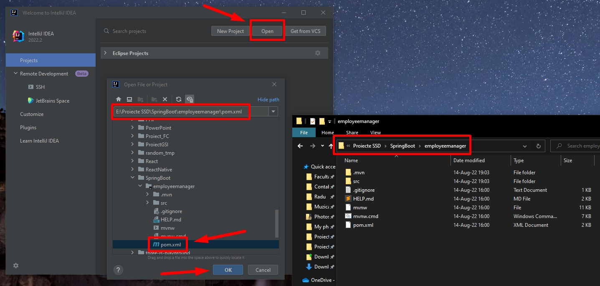

And we should see our main java file of our application:

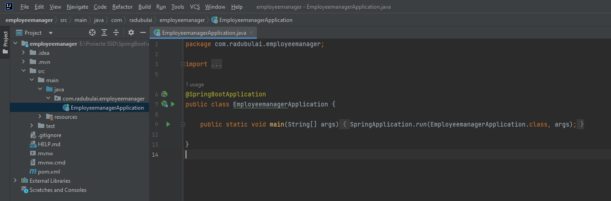

<br/>

---

<br/>

(Optional) Useful links/settings on IntelliJ IDEA:

- https://stackoverflow.com/questions/2065659/how-to-increase-the-maximum-number-of-opened-editors-in-intellij (default maximum number of open tabs is 10...)

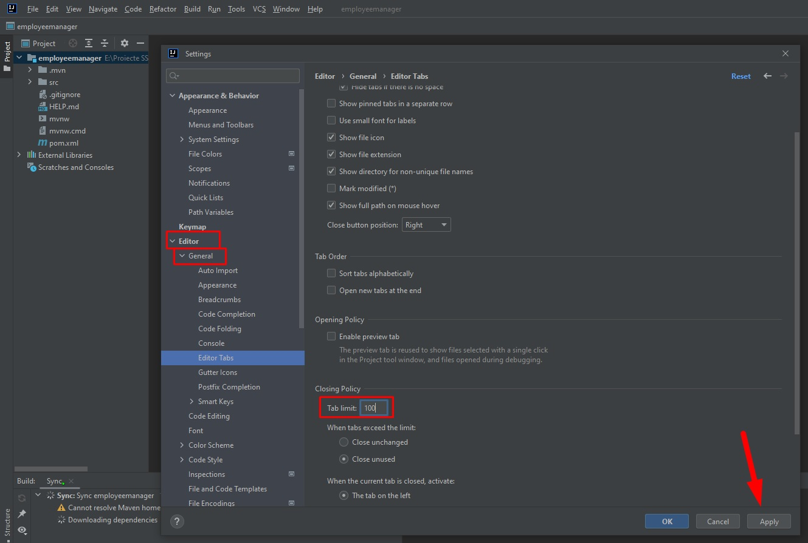

<br/>

## Create Employee model class

To create a first model class, we right click on our main project package -> New -> Package -> "model".

Inside our "model" package, we right click -> New -> New Java Class -> "Employee".

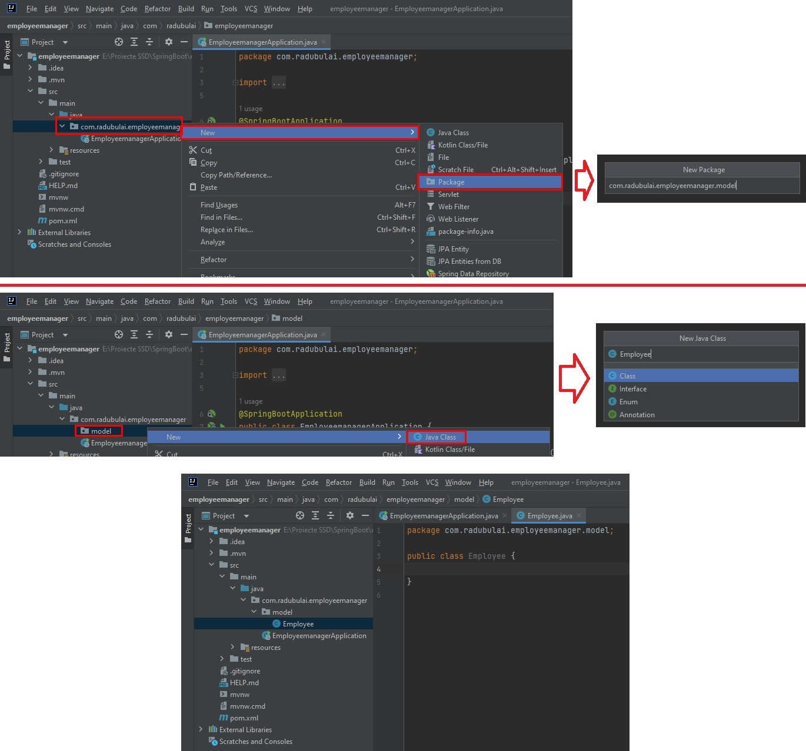

Our employee model will have the following fields:

```java
// Employee.java
package com.radubulai.employeemanager.model;

import java.io.Serializable;

public class Employee implements Serializable {
    private Long id;
    private String name;
    private String email;
    private String jobTitle;
    private String phone;
    private String imageUrl;
    private String employeeCode;
}
```

We will also have our class been implemented from the `Serializable` interface (our class "inherits" the `Serializable` class) in order to be able to "transform" this Java "Employee" Class into different types of strings (because this class will be saved in a database, and it should be able for this class to be converted in something like e.g. JSON). So it's always a good practice to make model classes being implemented as `Serializable`.

<br/>

Now we want this class to be in a database - that's why we added [*"Spring Data JPA (Java Persistence API)"*](https://spring.io/projects/spring-data-jpa):
- We first add the `@Entity` decorator
- We need to set our "PRIMARY KEY", for this we add `@Id` decorator. We also need to tell it how to generate this ID, so we add `@GeneratedValue(strategy = GenerationType.IDENTITY)` (with the passed parameter of `strategy`)
- We can also set different SQL "parameters" for our Id column, like "NOT NULL", "NOT UPDATABLE", etc, by using more decorators such as `@Column(nullable = false, updatable = false)`.

```java
// Employee.java
package com.radubulai.employeemanager.model;

import javax.persistence.*;
import java.io.Serializable;

@Entity
public class Employee implements Serializable {
    @Id
    @GeneratedValue(strategy = GenerationType.IDENTITY)
    @Column(nullable = false, updatable = false)
    private Long id;
    private String name;
    private String email;
    private String jobTitle;
    private String phone;
    private String imageUrl;
    @Column(nullable = false, updatable = false)
    private String employeeCode;
}
```

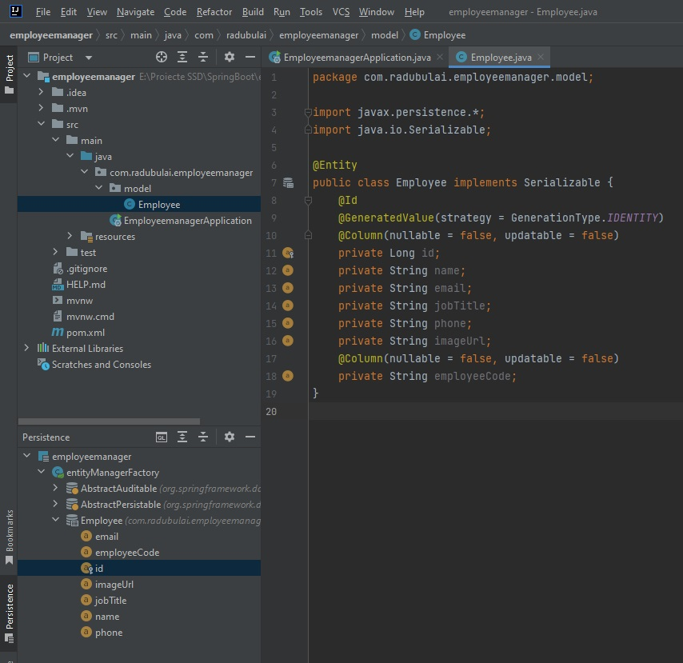

<br/>

Now, in this same file `Employee.java`, we will generate all the constructors and getters and setters. Note that we can use IntelliJ's IDEA "Generate..." menu for automatic generation of these methods: (instead of writing them manually). Right click on `public class Employee implements Serializable`:
- Generate... -> Constructor (select all fields/properties)
- Generate... -> Getter and Setter
- Generate... -> toString()

All the code for `src/main/java/com/radubulai/employeemanager/model/Employee.java`:

```java
// Employee.java
package com.radubulai.employeemanager.model;

import javax.persistence.*;
import java.io.Serializable;

@Entity
public class Employee implements Serializable {
    @Id
    @GeneratedValue(strategy = GenerationType.IDENTITY)
    @Column(nullable = false, updatable = false)
    private Long id;
    private String name;
    private String email;
    private String jobTitle;
    private String phone;
    private String imageUrl;
    @Column(nullable = false, updatable = false)
    private String employeeCode;

    public Employee() {}

    public Employee(Long id, String name, String email, String jobTitle, String phone, String imageUrl, String employeeCode) {
        this.id = id;
        this.name = name;
        this.email = email;
        this.jobTitle = jobTitle;
        this.phone = phone;
        this.imageUrl = imageUrl;
        this.employeeCode = employeeCode;
    }

    public Long getId() {
        return id;
    }

    public void setId(Long id) {
        this.id = id;
    }

    public String getName() {
        return name;
    }

    public void setName(String name) {
        this.name = name;
    }

    public String getEmail() {
        return email;
    }

    public void setEmail(String email) {
        this.email = email;
    }

    public String getJobTitle() {
        return jobTitle;
    }

    public void setJobTitle(String jobTitle) {
        this.jobTitle = jobTitle;
    }

    public String getPhone() {
        return phone;
    }

    public void setPhone(String phone) {
        this.phone = phone;
    }

    public String getImageUrl() {
        return imageUrl;
    }

    public void setImageUrl(String imageUrl) {
        this.imageUrl = imageUrl;
    }

    public String getEmployeeCode() {
        return employeeCode;
    }

    public void setEmployeeCode(String employeeCode) {
        this.employeeCode = employeeCode;
    }

    @Override
    public String toString() {
        return "Employee{" +
                "id=" + id +
                ", name='" + name + '\'' +
                ", email='" + email + '\'' +
                ", jobTitle='" + jobTitle + '\'' +
                ", phone='" + phone + '\'' +
                ", imageUrl='" + imageUrl + '\'' +
                ", employeeCode='" + employeeCode + '\'' +
                '}';
    }
}
```

<br/>

## Database Configuration

[Spring Boot Full Stack with Angular - Amigoscode - 0h20m](https://youtu.be/Gx4iBLKLVHk?t=1202)

After installing [MySQL 8.0 (448MB installer)](https://dev.mysql.com/downloads/installer/), we can open "MySQL 8.0 Command Line Client" (from Windows Start Menu), and type commands like `show databases;`.

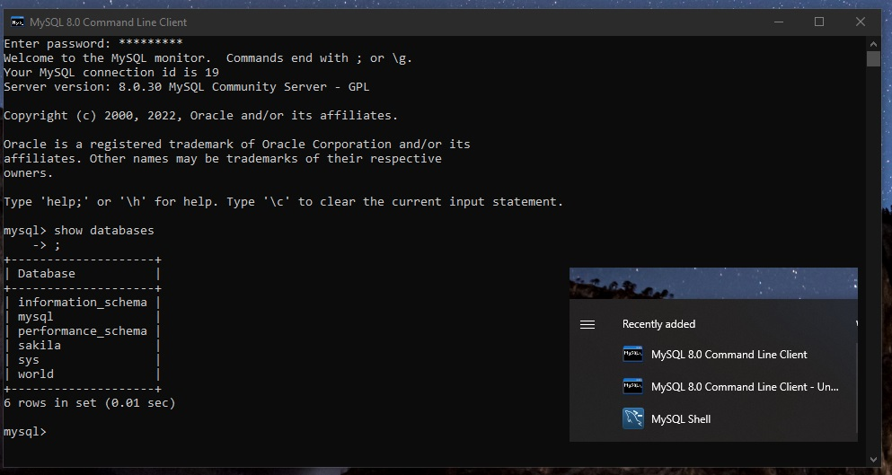

<br/>

🔵 Note: If we cannot start the MySQL Server (eg. "MySQL Workbench" just crashes when we try to start the server):
- Open Windows Start Menu, search and open "Services", manually find `MySQL80` service -> Right click it -> Start.
- (does not work in my case) We can just run (as administrator) the executable from `C:\Program Files\MySQL\MySQL Server 8.0\bin\mysqld.exe`.
- See more here: [Can't startup and connect to MySQL server](https://stackoverflow.com/questions/31387036/cant-startup-and-connect-to-mysql-server).

<br/>

To set up our database in our Java Spring Application, we need to go to `src/main/resource/application.properties`:

- the default port for MySQL is 3306, so the DB address will be `localhost:3306`
- the name of the database will be `employeemanager` => the address will be `localhost:3306/employeemanager`
- the username and the password (Note that we would normally have the password stored on a remote server, or on a different file on our system, or as Environment Variables in our system... and preferably encrypted...)
- `spring.jpa.show-sql=true` will show the SQL queries in the console whenever the JPA (our Java app) is executing an SQL query
- `spring.jpa.hibernate.ddl-auto` specifies the data description language - will tell the application how to manage the database
  - if it's set to `create`, every time we run the application it will drop all the tables and it will create them again
  - if set to `update`, every time we run the app it is going to update all the tables if necesary
- `spring.jpa.properties.hibernate.dialect=org.hibernate.dialect.MySQL5Dialect`

<br/>

`application.properties`:

```
# MySQL Configuration
spring.datasource.url=jdbc:mysql://localhost:3306/employeemanager
spring.datasource.username=root
spring.datasource.password=yourpassword
spring.jpa.show-sql=true
spring.jpa.hibernate.ddl-auto=update
spring.jpa.properties.hibernate.dialect=org.hibernate.dialect.MySQL5Dialect
```

<br/>

Let's now create the `employeemanager` database in MySQL:

- Open "MySQL 8.0 Command Line Client", write: `create database employeemanager;`
- We can check with `show databases;` command

<br/>

We can run our java application by clicking on "Run Application" on our main java function (in `EmployeemanagerApplication.java`):

```
  .   ____          _            __ _ _
 /\\ / ___'_ __ _ _(_)_ __  __ _ \ \ \ \
( ( )\___ | '_ | '_| | '_ \/ _` | \ \ \ \
 \\/  ___)| |_)| | | | | || (_| |  ) ) ) )
  '  |____| .__|_| |_|_| |_\__, | / / / /
 =========|_|==============|___/=/_/_/_/
 :: Spring Boot ::                (v2.7.2)

2022-08-14 21:09:58.036  INFO 8364 --- [           main] c.r.e.EmployeemanagerApplication         : Starting EmployeemanagerApplication using Java 17.0.1 on radu-legion with PID 8364 (E:\Proiecte SSD\SpringBoot\employeemanager\target\classes started by radu in E:\Proiecte SSD\SpringBoot\employeemanager)
```

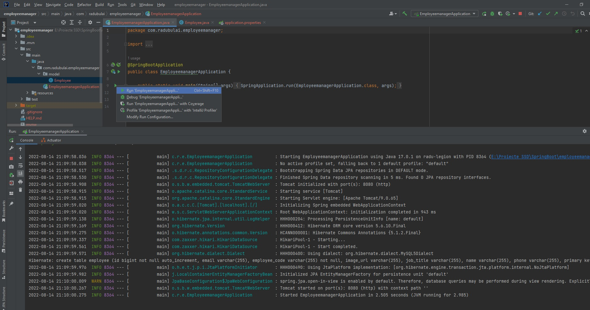

<br/>

🟢 Note: we can also run the Java Application from Terminal, in the main project directory:

```bash
# E:\Proiecte SSD\SpringBoot\employeemanager>
mvn spring-boot:run
```

🟢 Also note, that after running the app, the `Employee` table from the `employeemanager` database is created automatically in MySQL and can be seen via MySQL Workbench App:

- On MySQL Workbench -> Click on "Database" from the menu -> "Reverse Engineer(CTRL+B)" -> next, next, next -> Select your schema -> "execute".

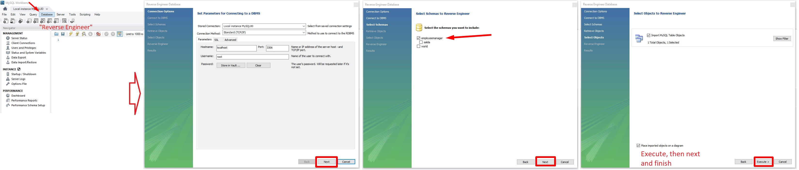

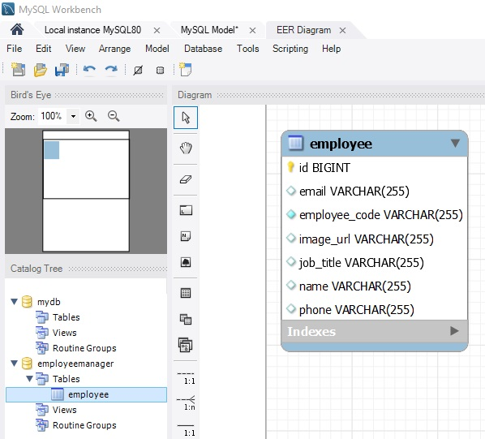

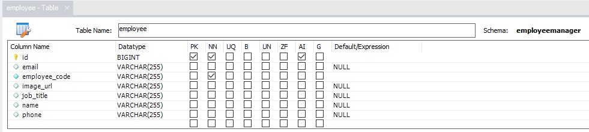

<br/>

## Java CRUD Operations in Database - Service

[Spring Boot Full Stack with Angular - Amigoscode - 0h26m: Employee Repository](https://youtu.be/Gx4iBLKLVHk?t=1561)

All these operations will be created under a "Employee Repository" Java package (with the name of `repo` package) and a `service` package as controller.

<br/>

### Inheriting JPA Repository

For the `repo` package:

- On our main project package -> create a new package called `repo`
- Inside `repo` package, we create a **Java Interface** called `EmployeeRepo`
- This interface `EmployeeRepo` will extend the `JpaRepository`. Also, when extending from `JpaRepository` interface, we need to specify the model type (`Employee`) and the ID data type (`Long`): `public interface EmployeeRepo extends JpaRepository<Employee, Long>`.

> (Note: To inherit from a class, the `extends` keyword is used, eg. we could have an `Animal`/`User` class, and `Dog`/`Author` extends that class - inherits all the properties from `Animal`/`User` main class)

- We can CTRL+Click on `JpaRepository` interface to see its decompilled .class file (its code), and look over its methods, eg: findAll, saveAll, deleteAllInBatch, etc... (those are useful methods as we don't need to implement them from scratch)

```java
// ../repo/EmployeeRepo.java
package com.radubulai.employeemanager.repo;

import com.radubulai.employeemanager.model.Employee;
import org.springframework.data.jpa.repository.JpaRepository;

public interface EmployeeRepo extends JpaRepository<Employee, Long> {

}
```

<br/>

### Employee Service

For the `service` package that we are going to use for our "Controller":

- On our main/base project package -> create a new package called `service`
- Inside `service` package, create a new **Java Class** called `EmployeeService`
- Here in `EmployeeService` we create a `EmployeeRepo` object, and we can also override the constructor
- We also need to annotate the `EmployeeService` class repo with `@Service` decorator

> From https://www.digitalocean.com/community/tutorials/spring-service-annotation
> Spring @Service annotation is used with classes that provide some business functionalities. Spring context will autodetect these classes when annotation-based configuration and classpath scanning is used.

- And, on constructor, we also need to add `@Autowired` decorator so we can bring its dependencies

> From https://www.baeldung.com/spring-autowire
> Starting with Spring 2.5, the framework introduced annotations-driven Dependency Injection. The main annotation of this feature is @Autowired. **It allows Spring to resolve and inject collaborating beans into our bean.**

> The Spring framework enables automatic dependency injection. In other words, by declaring all the bean dependencies in a Spring configuration file, Spring container can autowire relationships between collaborating beans. This is called Spring bean autowiring.

```java
// ../service/EmployeeService.java
package com.radubulai.employeemanager.service;

import com.radubulai.employeemanager.repo.EmployeeRepo;
import org.springframework.beans.factory.annotation.Autowired;
import org.springframework.stereotype.Service;

@Service
public class EmployeeService {
    private final EmployeeRepo employeeRepo;

    @Autowired
    public EmployeeService(EmployeeRepo employeeRepo) {
        this.employeeRepo = employeeRepo;
    }
}

```

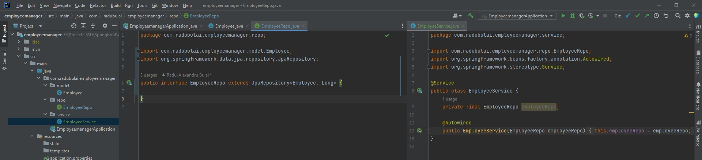

<br/>

And now, we can define all our CRUD operations within this `EmployeeService` class:

1. **addEmployee**

- `addEmployee` method will return an `Employee` object (from the model package we created earlier), and will accept as a parameter an `Employee` object.
- the `id` will be generated/incremented automatically in our database
- we generate an employee code (for the `employeeCode` column) - for this we can use the Java builtin `UUID` class (a 128bit immutable universally unique identifier - UUID): `UUID.randomUUID().toString()`
- we return the returned `Employee` object from calling the JPA Repository `save` method: `return employeeRepo.save(employee);`

```java
// ../service/EmployeeService.java
public Employee addEmployee(Employee employee) {
    employee.setEmployeeCode(UUID.randomUUID().toString());
    return employeeRepo.save(employee);
}
```

[Spring Boot Full Stack with Angular - Amigoscode - 0h31m: Service class](https://youtu.be/Gx4iBLKLVHk?t=1902)

<br/>

2. **findAllEmployees** - Return (View) the list of all employees

- `findAllEmployees` will not take any parameters
- we just return the returned value from calling the JPA Repository method `return employeeRepo.findAll();`

```java
// ../service/EmployeeService.java
public List<Employee> findAllEmployees() {
    return employeeRepo.findAll();
}
```

<br/>

3. **updateEmployee**

```java
// ../service/EmployeeService.java
public Employee updateEmployee(Employee employee) {
    return employeeRepo.save(employee);
}
```


<br/>

4. **deleteEmployee**

- since we can't use `employeeRepo.delete(id);` because the `delete` method from inherited JPA Repo does not accept any `Long` type parameter (as an ID), we will need to create our own `employeeRepo.deleteEmployeeById(id);` inside `/repo/EmployeeRepo.java`
- Spring is smart enough to automatically create queries just by having the method named as `deleteObjecttypeById` 👍. More on this here: https://www.baeldung.com/spring-data-derived-queries

```java
// ../service/EmployeeService.java
public void deleteEmployee(Long id) {
    employeeRepo.deleteEmployeeById(id);
}
```

```java
// ../repo/EmployeeRepo.java
public interface EmployeeRepo extends JpaRepository<Employee, Long> {
    void deleteEmployeeById(Long id);
}
```

<br/>

4. **findEmployeeById** - Find/Return an employee by Id

- findEmployeeById does not exist, but just by calling this method as `findObjectById` (declared within `repo/EmployeeRepo.java`), Spring will automatically define this method as a Query to our database (eg. MySQL) 👍. In this case, the query (based on the method name), will be something like `SELECT Employee BY Id WHERE Id = ProvidedId`. More on this here: https://www.baeldung.com/spring-data-derived-queries

```java
// ../service/EmployeeService.java
public Employee findEmployeeById(Long id) {
    return employeeRepo.findEmployeeById(id);
}
```

- but, we will be having a problem: if there is no Employee in the database with the provided id, we shoul not return anything. For this, we change in /repo/EmployeeRepo the method declaration from `Employee findEmployeeById(Long id);` to `Optional findEmployeeById(Long id);` (`import java.util.Optional;`).
- then, in /service/EmployeeService, we can use some Java 8 methods, like `orElseThrow` - namely, if we find an Employee by the provided Id as parameter, we return that Employee, else, we throw some exception (using Java 8 Lambda functions)

```java
public interface EmployeeRepo extends JpaRepository<Employee, Long> {
    void deleteEmployeeById(Long id);
    Optional<Employee> findEmployeeById(Long id);
}

```

```java
// ../service/EmployeeService.java
public Employee findEmployeeById(Long id) {
    return employeeRepo.findEmployeeById(id).orElseThrow(
            () -> new UserNotFoundException("User by id " + id + " was not found")
    );
}
```

Handling Exceptions:

- but now, we need to create that `UserNotFoundException`... for this, we will create an `exception` package in our main app package and create a `UserNotFoundException` class inside it (Note that creation of `exception` package and `UserNotFoundException` class inside it could be done automatically by IntelliJ IDEA -> Just hover over the error -> "More actions..." -> "Create Class UserNotFoundException" -> change the name for "Destion Package" from "service" to "exception", IntelliJ IDEA will create `exception` automatically for you).
- here in `/exception/UserNotFoundException.java`, we will just inherit from `RuntimeException` class and we'll call its constructor with `super` method, that will just pass the message that we gave earlier as parameter (`"User by id " + id + " was not found"`):

```java
// ../exception/UserNotFoundException
public class UserNotFoundException extends RuntimeException {
    public UserNotFoundException(String message) {
        super(message);
    }
}
```

<br/>
<br/>

Finally, these were all the methods for the `EmployeeService.java`:

```java
// Complete code for ../service/EmployeeService.java
package com.radubulai.employeemanager.service;

import com.radubulai.employeemanager.exception.UserNotFoundException;
import com.radubulai.employeemanager.model.Employee;
import com.radubulai.employeemanager.repo.EmployeeRepo;
import org.springframework.beans.factory.annotation.Autowired;
import org.springframework.stereotype.Service;

import java.util.List;
import java.util.UUID;

@Service
public class EmployeeService {
    private final EmployeeRepo employeeRepo;

    @Autowired
    public EmployeeService(EmployeeRepo employeeRepo) {
        this.employeeRepo = employeeRepo;
    }

    public Employee addEmployee(Employee employee) {
        employee.setEmployeeCode(UUID.randomUUID().toString());
        return employeeRepo.save(employee);
    }

    public List<Employee> findAllEmployees() {
        return employeeRepo.findAll();
    }

    public Employee updateEmployee(Employee employee) {
        return employeeRepo.save(employee);
    }

    public void deleteEmployee(Long id) {
        employeeRepo.deleteEmployeeById(id);
    }

    public Employee findEmployeeById(Long id) {
        return employeeRepo.findEmployeeById(id).orElseThrow(
                () -> new UserNotFoundException("User by id " + id + " was not found")
        );
    }
}
```

```java
// Complete code for ../repo/EmployeeRepo.java
package com.radubulai.employeemanager.repo;

import com.radubulai.employeemanager.model.Employee;
import org.springframework.data.jpa.repository.JpaRepository;

import java.util.Optional;

public interface EmployeeRepo extends JpaRepository<Employee, Long> {

    void deleteEmployeeById(Long id);

    Optional<Employee> findEmployeeById(Long id);
}
```

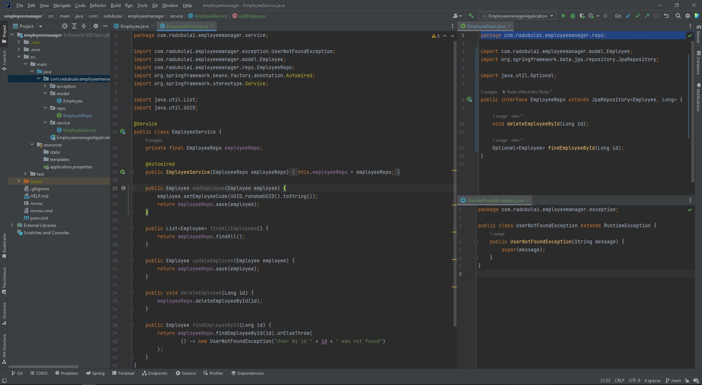


<br/>

## Exposing the API - Controller

(Monday, August 15, 2022)

[Spring Boot Full Stack with Angular - Amigoscode - 0h39m: Exposing the API](https://youtu.be/Gx4iBLKLVHk?t=2335)

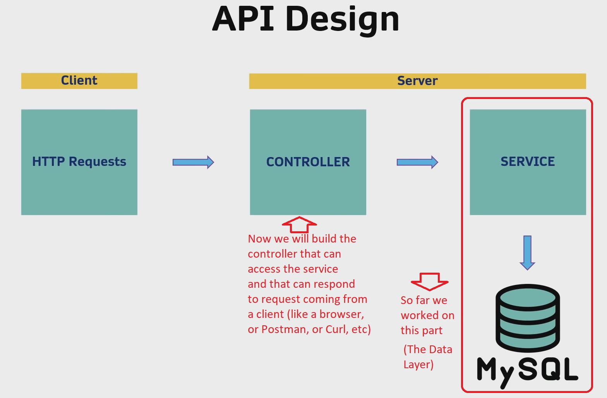

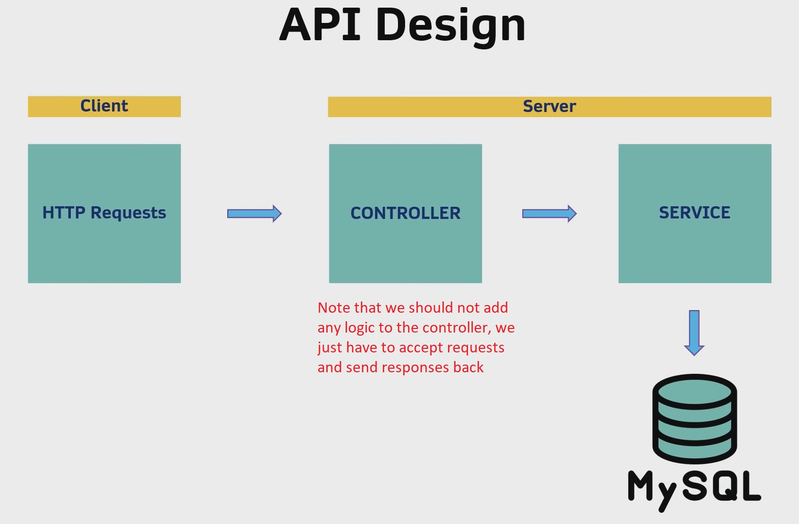

<br/>

Let's create our controller class:

- in the main app package, create a new **Java Class** named "EmployeeResource" (this will be our controller).
- just before the declaration of `EmployeeResource` class, we will add a `@RestController` decorator/annotation
- just before the declaration of `EmployeeResource` class, we will also add `@RequestMapping("/employee")` annotation, where `/employee` would be our REST API route/URL to all employees entries from our database
- inside `EmployeeResource` class, we will bring the service class (`EmployeeService`) that we created earlier (that has our CRUD operations), and we also inject this service into `EmployeeResource`'s constructor so we can autowire the service inside that class: `public EmployeeResource(EmployeeService employeeService)`.

```java
// EmployeeResource.java
@RestController
@RequestMapping("/employee")
public class EmployeeResource {
    private final EmployeeService employeeService;

    public EmployeeResource(EmployeeService employeeService) {
        this.employeeService = employeeService;
    }
}
```

> From https://www.baeldung.com/spring-controller-vs-restcontroller
> Spring 4.0 introduced the `@RestController` annotation in order to simplify the creation of RESTful web services. **It's a convenient annotation that combines `@Controller` and `@ResponseBody`**, which eliminates the need to annotate every request handling method of the controller class with the @ResponseBody annotation.

> We can annotate classic controllers with the `@Controller` annotation. This is simply a specialization of the `@Component` class, **which allows us to auto-detect implementation classes through the classpath scanning**.

> We typically use `@Controller` in combination with a @RequestMapping annotation for request handling methods.

<br/>

1. **getAllEmployees** (GET HTTP Request)

Now, let's create our first (exposed) method (as a REST API) that returns all of our employees from the database:

- we will need to add to this method the `@GetMapping` decorator to tell Spring that this is a `GET` type of request. We can also include a path for this request, like `@GetMapping("/all")`
- `getAllEmployees` method will return an HTTP response, for this we will use `ResponseEntity` generic class from Spring -> for this generic class we will specify as a type a List of Employee objects: `ResponseEntity<List<Employee>>`: so we'll have `public ResponseEntity<List<Employee>> getAllEmployees()`
- now we need to call the `findAllEmployees` method from our `EmployeeServices` that will return all the employees from our database: `List<Employee> employees = employeeService.findAllEmployees();`
- as return for this method, we will `return new ResponseEntity<>(employees, HttpStatus.OK);`, that has all the `employees` inside (list of employees), and the HTTP status code of success

```java
// EmployeeResource.java
@RestController
@RequestMapping("/employee")
public class EmployeeResource {
    private final EmployeeService employeeService;

    public EmployeeResource(EmployeeService employeeService) {
        this.employeeService = employeeService;
    }

    @GetMapping("/all")
    public ResponseEntity<List<Employee>> getAllEmployees() {
        List<Employee> employees = employeeService.findAllEmployees();
        return new ResponseEntity<>(employees, HttpStatus.OK);
    }
}
```

<br/>

2. **getEmployeeById** (GET HTTP Request)

This method will return/find only one user/employee based on provided Id:

- we will need to add to this method the `@GetMapping("/find/{id}")` decorator to tell Spring that this is a `GET` type of request, and the path/URL for this request will be `/employee/find/{id}`
- we will pass this `{id}` from the decorator (that will be provided in the URL/PATH of the request) as a parameter to this method by using `@PathVariable("id")` Spring Annotation => now we have access to the id that was passed into the URL.

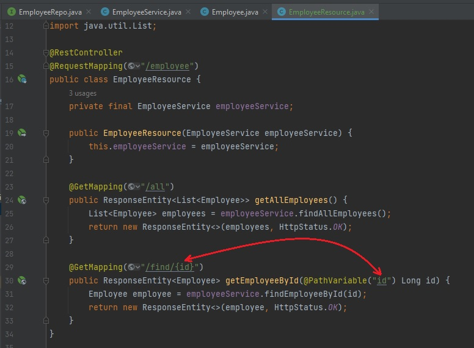

- now we call the `findAllEmployeeById` method from our `EmployeeServices`: `Employee employee = employeeService.findEmployeeById(id);`
- and we `return new ResponseEntity<>(employee, HttpStatus.OK);`

```java
// EmployeeResource.java
@GetMapping("/find/{id}")
public ResponseEntity<Employee> getEmployeeById(@PathVariable("id") Long id) {
    Employee employee = employeeService.findEmployeeById(id);
    return new ResponseEntity<>(employee, HttpStatus.OK);
}
```

<br/>

3. **addEmployee** (POST HTTP Request)

This method will add/create a new employee:

- we will need to add to this method the `@PostMapping("/add")` decorator to tell Spring that this is a `POST` type of HTTP request, and the path/URL for this request will be `/employee/add`
- this `addEmployee` method will return the newly created `Employee` object as a response
- this `addEmployee` method will take as a parameter a whole `Employee` object (with all the required details such as email, image_url, job_title, name, phone) that'll as a JSON format
  - for this, we can use `@RequestBody` Spring annotation: `public ResponseEntity<Employee> addEmployee(@RequestBody Employee employee)`
- we will call the `addEmployee` method from our `EmployeeServices`: `Employee newEmployee = employeeService.addEmployee(employee);`
- we will `return new ResponseEntity<>(newEmployee, HttpStatus.CREATED);`, where `HttpStatus.CREATED` means that we created a new information on the server

```java
// EmployeeResource.java
@PostMapping("/add")
public ResponseEntity<Employee> addEmployee(@RequestBody Employee employee) {
    Employee newEmployee = employeeService.addEmployee(employee);
    return new ResponseEntity<>(newEmployee, HttpStatus.CREATED);
}
```

<br/>

4. **updateEmployee** (PUT HTTP Request)

This method will update an existing employee:

- we will need to add to this method the `@PutMapping("/update")` decorator to tell Spring that this is a `PUT` type of HTTP request, and the path/URL for this request will be `/employee/update`
- this `updateEmployee` method will return the updated `Employee` object as a response
- this `addEmployee` method will take as a parameter a whole `Employee` object (with all the required details such as email, image_url, job_title, name, phone) that'll as a JSON format: `public ResponseEntity<Employee> updateEmployee(@RequestBody Employee employee)`
- we will call the `updateEmployee` method from our `EmployeeServices`: `Employee updatedEmployee = employeeService.updateEmployee(employee);`
- we will `return new ResponseEntity<>(updatedEmployee, HttpStatus.OK);`

```java
// EmployeeResource.java
@PutMapping("/update")
public ResponseEntity<Employee> updateEmployee(@RequestBody Employee employee) {
    Employee updatedEmployee = employeeService.updateEmployee(employee);
    return new ResponseEntity<>(updatedEmployee, HttpStatus.OK);
}
```

<br/>

5. **deleteEmployee** (DELETE HTTP Request)

This method will delete an employee from database based on provided Id through request URL/Path:

- we will need to add to this method the `@DeleteMapping("/delete/{id}")` decorator to tell Spring that this is a `DELETE` type of HTTP request, and the path/URL for this request will be `/employee/delete/{id}`
- this `deleteEmployee` method will only return the HTTP Request status: `public ResponseEntity<?> deleteEmployee(@PathVariable("id") Long id)` (we pass a question mark `?` for the generic type of `ResponseEntity`)

```java
// EmployeeResource.java
@DeleteMapping("/delete/{id}")
public ResponseEntity<?> deleteEmployee(@PathVariable("id") Long id) {
    employeeService.deleteEmployee(id);
    return new ResponseEntity<>(HttpStatus.OK);
}
```

<br/><br/>

Finally, now we can run this application and test those endpoints!

<br/>

Complete code for `src/main/java/.../employeemanager/EmployeeResource.java`:

```java
// Complete code for EmployeeResource.java
package com.radubulai.employeemanager;

import com.radubulai.employeemanager.model.Employee;
import com.radubulai.employeemanager.service.EmployeeService;
import org.springframework.http.HttpStatus;
import org.springframework.http.ResponseEntity;
import org.springframework.web.bind.annotation.*;

import java.util.List;

@RestController
@RequestMapping("/employee")
public class EmployeeResource {
    private final EmployeeService employeeService;

    public EmployeeResource(EmployeeService employeeService) {
        this.employeeService = employeeService;
    }

    @GetMapping("/all")
    public ResponseEntity<List<Employee>> getAllEmployees() {
        List<Employee> employees = employeeService.findAllEmployees();
        return new ResponseEntity<>(employees, HttpStatus.OK);
    }

    @GetMapping("/find/{id}")
    public ResponseEntity<Employee> getEmployeeById(@PathVariable("id") Long id) {
        Employee employee = employeeService.findEmployeeById(id);
        return new ResponseEntity<>(employee, HttpStatus.OK);
    }

    @PostMapping("/add")
    public ResponseEntity<Employee> addEmployee(@RequestBody Employee employee) {
        Employee newEmployee = employeeService.addEmployee(employee);
        return new ResponseEntity<>(newEmployee, HttpStatus.CREATED);
    }

    @PutMapping("/update")
    public ResponseEntity<Employee> updateEmployee(@RequestBody Employee employee) {
        Employee updatedEmployee = employeeService.updateEmployee(employee);
        return new ResponseEntity<>(updatedEmployee, HttpStatus.OK);
    }

    @DeleteMapping("/delete/{id}")
    public ResponseEntity<?> deleteEmployee(@PathVariable("id") Long id) {
        employeeService.deleteEmployee(id);
        return new ResponseEntity<>(HttpStatus.OK);
    }
}
```

<br/>

## Testing with Postman

[Spring Boot Full Stack with Angular - Amigoscode - 0h50m: Testing](https://youtu.be/Gx4iBLKLVHk?t=3002)

You can download Postman from here: https://www.postman.com/downloads/ (Note as Monday, August 15, 2022, it might need an account in order to use Postman).

<br/>

Run the application (`mvn spring-boot:run` in terminal).

🟢 Note that our Java Spring application runs on port `8080` by default (http://localhost:8080/). So we can already make a GET request to http://localhost:8080/employee/all with our browser (Chrome/Edge/Firefox/etc).

<br/>

In Postman, open a new tab... we should see our interface looking like this:

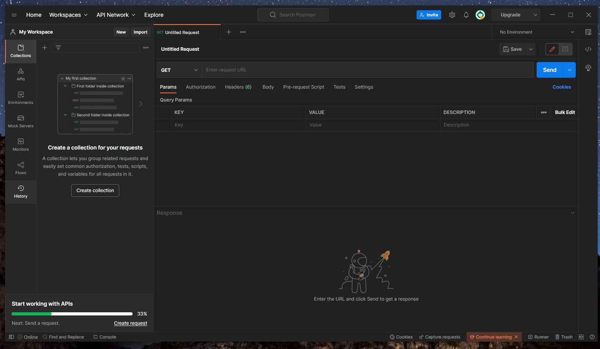

<br/>

🔵 To send a GET request to http://localhost:8080/employee/all (`getAllEmployees`), we just need to add this URL here:

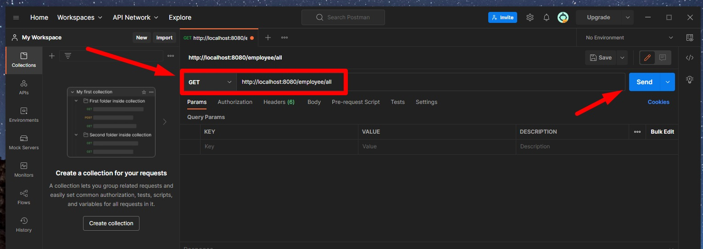

Currently, our request will send us back a response with an empty list (because we don't have any employees/rows in our MySQL database).

<br/>

🔵 So, let's add some users/employees (`addEmployee`)!

- Open a new tab in Postman with the URL of http://localhost:8080/employee/add
- Set the request type to POST request
- Click on "Body" subtab, check the "raw" radio button, and select "JSON" format, and write a JSON like this (Note that the `id` will be generated by Spring JPA, and the `employeeCode` will be a random UUID generated string, so we don't need to pass those in):

```JSON
{
    "email": "alex@example.com",
    "imageUrl": "https://placekitten.com/200/300",
    "jobTitle": "Developer",
    "name": "Alex Craig",
    "phone": "4570090332"
}
```

or

```JSON
{
    "email": "andrew@example.com",
    "imageUrl": "https://placekitten.com/200/300",
    "jobTitle": "Developer",
    "name": "Andrew Johnson",
    "phone": "4570012342"
}
```

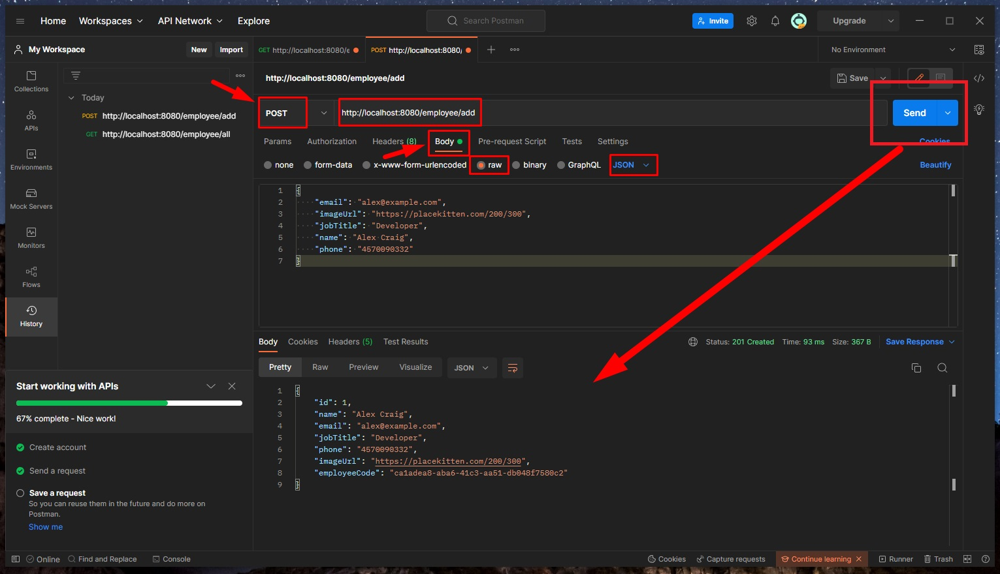

We will receive back (as a response) our complete `Employee` object (as JSON), and this employee has now been added to the database as well (we can check with MySQL Workbench)! We can also see the request status code of `201 (created)`

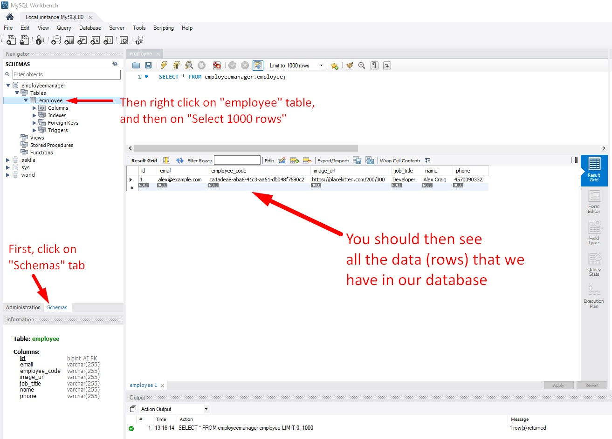

We can also see the rows from this `Employee` table (on `employeemanager` database) from the "MySQL 8.0 Command Line Client". We need to run these commands:

```SQL
show databases;
```

```SQL
use employeemanager;
```

```SQL
show tables;
```

```SQL
select * from employee;
```

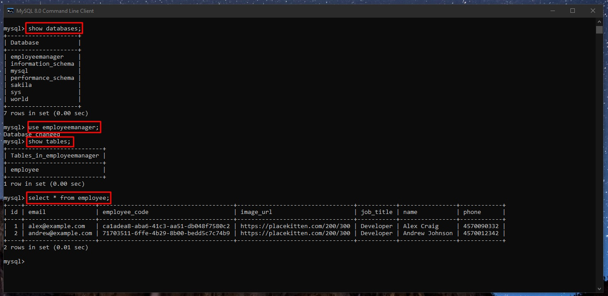

<br/>

Note that in our terminal (that is running our Spring Java App), we could also see the SQL queries that the application has sent (when receiving requests from Postman) to the MySQL database. That's because we have set `spring.jpa.show-sql=true` to true in our `application.properties` file.

```SQL
Hibernate: select employee0_.id as id1_0_, employee0_.email as email2_0_, employee0_.employee_code as employee3_0_, employee0_.image_url as image_ur4_0_, employee0_.job_title as job_titl5_0_, employee0_.name as name6_0_, employee0_.phone as phone7_0_ from employee employee0_

Hibernate: insert into employee (email, employee_code, image_url, job_title, name, phone) values (?, ?, ?, ?, ?, ?)
```

<br/>

🔵 Find one user by its Id (`getEmployeeById`) using Postman

- Open a new tab in Postman to the URL of http://localhost:8080/employee/find/2
- The request type will be GET

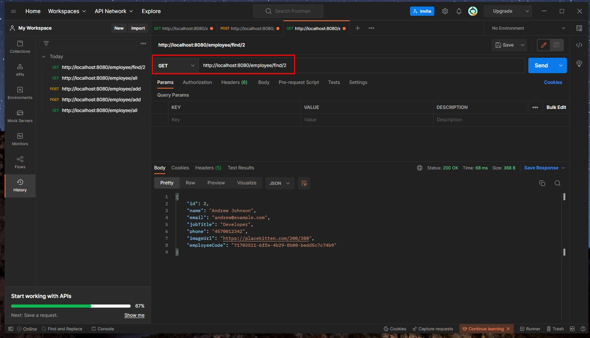

<br/>

🔵 Let's update an employee (`updateEmployee`)!

- Open a new tab in Postman with the URL of http://localhost:8080/employee/update
- Set the request type to PUT request
- Click on "Body" subtab, check the "raw" radio button, and select "JSON" format
- Instead of this entry (that we currenly have in our database):

```JSON
{
    "id": 2,
    "name": "Andrew Johnson",
    "email": "andrew@example.com",
    "jobTitle": "Developer",
    "phone": "4570012342",
    "imageUrl": "https://placekitten.com/200/300",
    "employeeCode": "71703511-6ffe-4b29-8b00-bedd5c7c74b9"
}
```

- We'll send this (where the `name` and `imageUrl` was changed)

```JSON
{
    "id": 2,
    "name": "Andrew Merlin",
    "email": "andrew@example.com",
    "jobTitle": "Developer",
    "phone": "4570012342",
    "imageUrl": "https://placekitten.com/200/200",
    "employeeCode": "71703511-6ffe-4b29-8b00-bedd5c7c74b9"
}
```

- The information for that row (employee) was updated

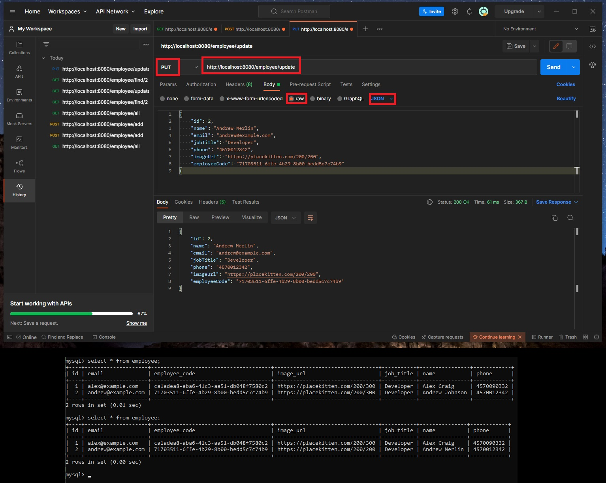


<br/>
<br/>

## Testing with HTTPie

[Spring Boot Full Stack with Angular - Amigoscode - 0h57m: Testing with HTTPie](https://youtu.be/Gx4iBLKLVHk?t=3446)

We can use [HTTPie](https://httpie.io/cli) to do the same tests that we did with Postman.

*This tutorial has skipped this part.*

Note that making request with HTTPie (CLI) instead of Postman (that has a GUI) is useful for applications that are stored in the cloud, so we can just SSH (or use [Putty](https://www.putty.org/)) into the PC/Server/Machine on cloud and start testing the API right there, on terminal.

We can also use [cURL](https://curl.se/) instead of HTTPie.

<br/>

# Front-End

[Spring Boot Full Stack with Angular - Amigoscode - 1h03m: Creating Angular App](https://youtu.be/Gx4iBLKLVHk?t=3815)

We will use [Angular CLI](https://angular.io/cli) to create our Front-End Angular Application!

```bash
### Basic example

# Install the Angular CLI: To install the Angular CLI globally, 
# open a terminal window and run the following command
# (You will run this only once):
npm install -g @angular/cli

# To create a new project (a new workspace for an app)
ng new employeemanager-angular

# Change directory
cd employeemanager-angular

# The Angular CLI includes a server, for you to build and serve your app locally
ng server --open
```

Our new app configuration:
- Would you like to add Angular routing? (y/N): N (it will be a single page app)
- Which stylesheet format would you like to use?: CSS

<br/>

Front-End App Architecture (Client):

- User Interface (UI): What the user will see on the screen (HTML+CSS)
- UI will be connected to a Component
- The Component will have access to a Service that sends HTTP Requests to the Back-End

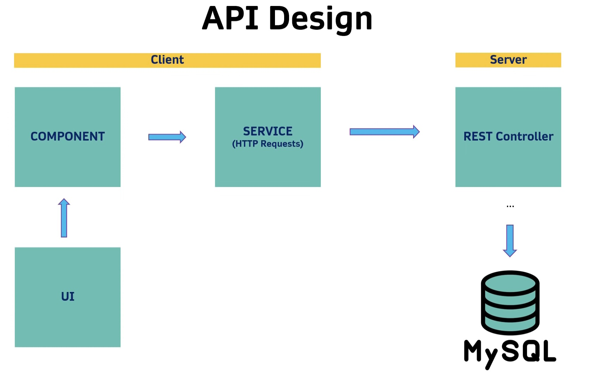

<br/>

Entire App Architecture (Front-End + Back-End):

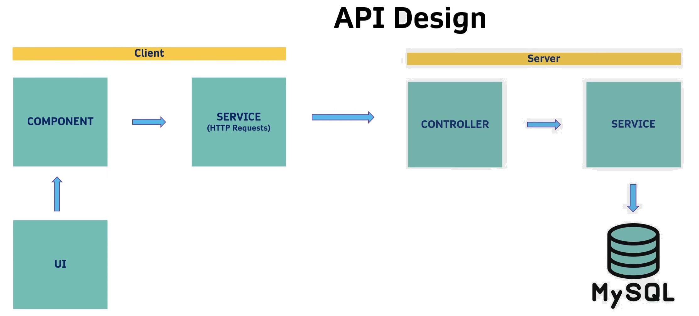

(Saturday, September 03, 2022)

<br/>

## Angular Service (Requests) and Employee Interface Data Type

First we need to create `employee.ts` interface and `employee.service.ts` where we can specify the type of data that the request are going to return.

<br/>

- In the Angular's main `/src/app/app.module.ts` we need to import: `import { HttpClientModule } from '@angular/common/http';`, and also add it to the imports array: `imports: [BrowserModule, HttpClientModule],`

🟠 If we don't import the `HttpClientModule` we will receive the following error from Angular in our browser console: `ERROR NullInjectorError: R3InjectorError(AppModule)[EmployeeService -> HttpClient -> HttpClient -> HttpClient]: NullInjectorError: No provider for HttpClient!`

```typescript
// app.module.ts
import { NgModule } from '@angular/core';
import { BrowserModule } from '@angular/platform-browser';
import { HttpClientModule } from '@angular/common/http';

import { AppComponent } from './app.component';

@NgModule({
  declarations: [AppComponent],
  imports: [BrowserModule, HttpClientModule],
  providers: [],
  bootstrap: [AppComponent],
})
export class AppModule {}
```

<br/>

- In the Angular's `/src/app` we will create `employee.ts` interface and here we are going to define all the attributes that the Employee has:

```typescript
// employee.ts
export interface Employee {
  id: number;
  name: string;
  email: string;
  jobTitle: string;
  phone: string;
  imageUrl: string;
  employeeCode: string;
}
```

<br/>

We will generate the "employee" service that will contain all the methods for the HTTP Requests. With Angular's CLI, in the Angular project path, run:

```bash
ng generate service employee
```

- In the Angular's `/src/app/employee.service.ts` file, we will actually make all the request to our back-end API Server (eg. `getEmployees`)

- We will use Angular's `HttpClient` in order to make HTTP requests (`get`, `post`, `put`, `delete`)

```typescript
// employee.service.ts
import { HttpClient } from '@angular/common/http';
import { Injectable } from '@angular/core';
import { Observable } from 'rxjs';
import { Employee } from './employee';

@Injectable({
  providedIn: 'root',
})
export class EmployeeService {
  private apiServerUrl = '';

  constructor(private http: HttpClient) {}

  public getEmployees(): Observable<any> {
    return this.http.get<Employee[]>(`${this.apiServerUrl}/employee/all`);
  }

  public getEmployeeById(employeeId: number): Observable<Employee> {
    return this.http.get<Employee>(
      `${this.apiServerUrl}/employee/delete/${employeeId}`
    );
  }

  public addEmployee(employee: Employee): Observable<Employee> {
    return this.http.post<Employee>(
      `${this.apiServerUrl}/employee/add`,
      employee
    );
  }

  public updateEmployee(employee: Employee): Observable<Employee> {
    return this.http.put<Employee>(
      `${this.apiServerUrl}/employee/update`,
      employee
    );
  }

  public deleteEmployee(employeeId: number): Observable<void> {
    return this.http.delete<void>(
      `${this.apiServerUrl}/employee/delete/${employeeId}`
    );
  }
}
```

- `getEmployees()` will not take any parameters, and will return an `Observable` generic object with `<any>` type of data (in our case it will return a list/array of Employee objects).

- `addEmployee()` will take an Employee object as parameter, and will use the `post` method in the http request... with the Angular's `HttpClientModule` (`@angular/common/http`) we can just pass (as argument) to the `http.post()` method the employee object as a payload to the POST request.

- `updateEmployee()` will take an Employee object as parameter, and will use the `put` method

- `deleteEmployee()` will take the EmployeeId (number) as parameter, will use the `delete` type of request to the `/employee/delete/${employeeId}` route/URL. Since this method/this request won't return anything from the server (except the status code), this `deleteEmployee()` method in Angular will return `<void>`.


<br/>

Note that on the [Back-End Java Spring **Controller** (`EmployeeResource.java`)](#exposing-the-api---controller) we had the following routes/methods:

```
getAllEmployees() -> GET /employee/all

getEmployeeById(@PathVariable("id") Long id) -> GET /employee/find/{id}

addEmployee(@RequestBody Employee employee) -> POST /employee/add

updateEmployee(@RequestBody Employee employee) -> PUT /employee/update

deleteEmployee(@PathVariable("id") Long id) -> DELETE /employee/delete/{id}
```

<br/>

Now, here in `/src/app/employee.service.ts`, we will replace the `private apiServerUrl = '';` with an environment variable:

- First, in `/src/app/environments/environment.ts` we will add the following key-value pair `apiBaseUrl: 'http://localhost:8080'` (our SpringBoot back-end REST Api - eg. http://localhost:8080/employee/all)

```ts
// environment.ts
export const environment = {
  production: false,
  apiBaseUrl: 'http://localhost:8080',
};
```

- Then, in `employee.service.ts` we will replace `private apiServerUrl = '';` with `private apiServerUrl = environment.apiBaseUrl;`

```typescript
// employee.service.ts
import { HttpClient } from '@angular/common/http';
import { Injectable } from '@angular/core';
import { Observable } from 'rxjs';
import { environment } from 'src/environments/environment';
import { Employee } from './employee';

@Injectable({
  providedIn: 'root',
})
export class EmployeeService {
  private apiServerUrl = environment.apiBaseUrl;

  constructor(private http: HttpClient) {}

  public getEmployees(): Observable<any> {
    return this.http.get<Employee[]>(`${this.apiServerUrl}/employee/all`);
  }

  public getEmployeeById(employeeId: number): Observable<Employee> {
    return this.http.get<Employee>(
      `${this.apiServerUrl}/employee/delete/${employeeId}`
    );
  }

  public addEmployee(employee: Employee): Observable<Employee> {
    return this.http.post<Employee>(
      `${this.apiServerUrl}/employee/add`,
      employee
    );
  }

  public updateEmployee(employee: Employee): Observable<Employee> {
    return this.http.put<Employee>(
      `${this.apiServerUrl}/employee/update`,
      employee
    );
  }

  public deleteEmployee(employeeId: number): Observable<void> {
    return this.http.delete<void>(
      `${this.apiServerUrl}/employee/delete/${employeeId}`
    );
  }
}
```

<br/>

## Angular component

[Spring Boot Full Stack with Angular - Amigoscode - 1h19m: Angular Component](https://youtu.be/Gx4iBLKLVHk?t=4784)

Since we have the `employee` service, we can use it now in our component.

> Ideally we would have separate component for each part of an application (eg. an EmployeesComponent component for visualising and interacting with employees data, and EmployersComponent component for interacting with employers data, or a TasksComponent component for interacting with tasks data, etc) that we would have created with `ng generate component components/employees` or `ng generate component components/employers`, etc.

> But, in this tutorial, since we have only the employee table in our database (which suggests a very simple application), we will write all the code in the Angular project's main `app.component`

<br/>

- In `app.component.ts` we will have our main/global employees variable that will be an array which holds all the Employee objects

- We will create function to call our Angular `employee.service.ts` service. For this we will need to inject the `employee.service.ts`service in this `AppComponent` class by using the `constructor(private employeeService: EmployeeService) {}` (now we have acces to the employee service from the main app component because we have injected it through the app component's class constructor)

```typescript
// app.component.ts
import { Component } from '@angular/core';
import { Employee } from './employee';
import { EmployeeService } from './employee.service';

@Component({
  selector: 'app-root',
  templateUrl: './app.component.html',
  styleUrls: ['./app.component.css'],
})
export class AppComponent {
  title = 'employeemanager-angular';
  public employees: Employee[] = [];

  constructor(private employeeService: EmployeeService) {}
}
```

- Now we will define `getEmployees()` method where we call the `getEmployees` from the `employee.service`.
    - Since this method returns an `Observable` object (which the way Angular handles request and responses that could take time), we need to also `subscribe` to this Observable, so our code from subscibe callback will run only after we receive some data from the request / from the Back-End Server (We can think of this `.subscribe()` method as a `.then()` method when we were using Vanilla JS promises).
    - the `.subscribe` method can receive different callbacks/lambda functions as parameters, namely for success, error, and complete: `(method) Observable<any>.subscribe(next?: ((value: any) => void) | null | undefined, error?: ((error: any) => void) | null | undefined, complete?: (() => void) | null | undefined): Subscription`
    - in the subscribe method, if we succesfully receive the required data, we will just get the data received from the back-end server (as a `response`) and put it in our global `employees` array of Employee objects.
    - however, in case we get an error, we can just console.log it

```typescript
// app.component.ts
import { HttpErrorResponse } from '@angular/common/http';
import { Component, OnInit } from '@angular/core';
import { Employee } from './employee';
import { EmployeeService } from './employee.service';

@Component({
  selector: 'app-root',
  templateUrl: './app.component.html',
  styleUrls: ['./app.component.css'],
})
export class AppComponent implements OnInit {
  title = 'employeemanager-angular';
  public employees: Employee[] = [];

  constructor(private employeeService: EmployeeService) {}

  ngOnInit(): void {
    this.getEmployees();
  }

  public getEmployees(): void {
    this.employeeService.getEmployees().subscribe(
      (response: Employee[]) => {
        this.employees = response;
      },
      (error: HttpErrorResponse) => {
        console.log(error.message);
      }
    );
  }
}
```

- In order to call this `getEmployees` function whenever `app.component` is loaded, we can make this `AppComponent` class to implement `OnInit` interface (that comes from `@angular/core`). And, we will also need to override `ngOnInit()` method (of the `OnInit` interface): `ngOnInit(): void { this.getEmployees(); }`.


<br/>

Now, we can render the `employee` array of Employee objects (that we get from the back-end REST API server) by removing/deleting all the default Angular's placeholder code in `app.component.html` and replacing it with:

- an `*ngFor` directive that will loop through the array of Employee objects (public variable `employees` from `app.component.ts`)

```html
<!-- app.component.html -->
<h1>Employee Manager</h1>
<div *ngFor="let employee of employees">
  <div>{{employee.name}}</div>
</div>
```

<br/>

## Solving "blocked by CORS policy" - CORS Configuration

(Sunday, September 04, 2022)

[Spring Boot Full Stack with Angular - Amigoscode - 1h27m: CORS Configuration](https://youtu.be/Gx4iBLKLVHk?t=5269)

Now, if we start the MySQL Server (Start Menu, search and open "Services", manually find MySQL80 service -> Right click it -> Start), and we are also starting the SpringBoot Back-end Server (`mvn spring-boot:run` and test on http://localhost:8080/employee/all) and the Front-end Angular Application (`ng serve --open` on http://localhost:4200/), we will run into the following CORS issue:

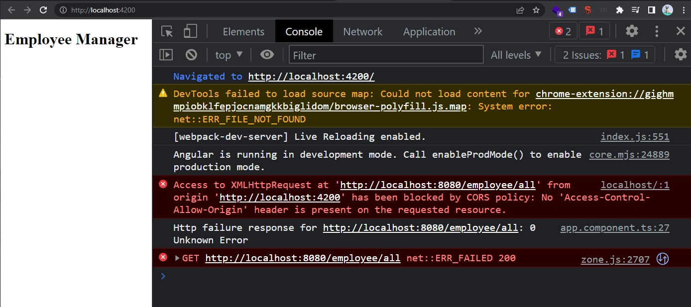

<br/>

About CORS:

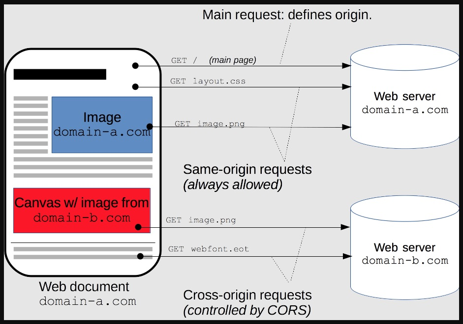

> From https://developer.mozilla.org/en-US/docs/Web/HTTP/CORS

> Cross-Origin Resource Sharing (CORS) is an HTTP-header based mechanism that allows a server to indicate any origins (domain, scheme, or port) other than its own from which a browser should permit loading resources. CORS also relies on a mechanism by which browsers make a "preflight" request to the server hosting the cross-origin resource, in order to check that the server will permit the actual request. In that preflight, the browser sends headers that indicate the HTTP method and headers that will be used in the actual request.

> An example of a cross-origin request: the front-end JavaScript code served from https://domain-a.com uses XMLHttpRequest to make a request for https://domain-b.com/data.json.

> For security reasons, browsers restrict cross-origin HTTP requests initiated from scripts. For example, XMLHttpRequest and the Fetch API follow the same-origin policy. This means that a web application using those APIs can only request resources from the same origin the application was loaded from unless the response from other origins includes the right CORS headers.

<br/>

To solve this issue, we need to tell the back-end to allow the front-end app to run on requested url (origin) in order to access the resources.

On the SpringBoot project, in the main application class `EmployeemangerApplication` we need to add the following CORS Configuration after the `main()` function:

```java
// EmployeemanagerApplication.java
package com.radubulai.employeemanager;

import org.springframework.boot.SpringApplication;
import org.springframework.boot.autoconfigure.SpringBootApplication;
import org.springframework.context.annotation.Bean;
import org.springframework.web.cors.CorsConfiguration;
import org.springframework.web.cors.UrlBasedCorsConfigurationSource;
import org.springframework.web.filter.CorsFilter;

import java.util.Arrays;

@SpringBootApplication
public class EmployeemanagerApplication {

    public static void main(String[] args) {
        SpringApplication.run(EmployeemanagerApplication.class, args);
    }

    @Bean
    public CorsFilter corsFilter() {
        CorsConfiguration corsConfiguration = new CorsConfiguration();
        corsConfiguration.setAllowCredentials(true);
        corsConfiguration.setAllowedOrigins(Arrays.asList("http://localhost:4200"));
        corsConfiguration.setAllowedHeaders(Arrays.asList("Origin", "Access-Control-Allow-Origin", "Content-Type",
                "Accept", "Authorization", "Origin, Accept", "X-Requested-With",
                "Access-Control-Request-Method", "Access-Control-Request-Headers"));
        corsConfiguration.setAllowedHeaders(Arrays.asList("Origin", "Content-Type", "Accept", "Authorization",
                "Access-Control-Allow-Origin", "Access-Control-Allow-Credentials"));
        corsConfiguration.setAllowedMethods(Arrays.asList("GET", "POST", "PUT", "DELETE", "OPTIONS"));
        UrlBasedCorsConfigurationSource urlBasedCorsConfigurationSource = new UrlBasedCorsConfigurationSource();
        urlBasedCorsConfigurationSource.registerCorsConfiguration("/**", corsConfiguration);
        return new CorsFilter(urlBasedCorsConfigurationSource);
    }
}
```

Now we can successfully retrieve data / make a GET request from our Angular App:

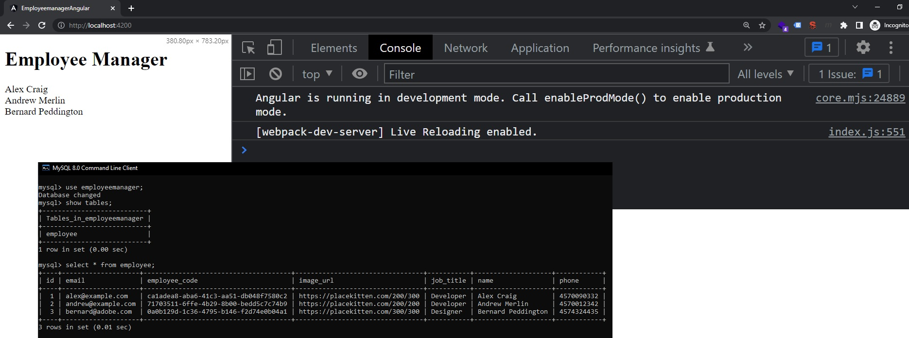

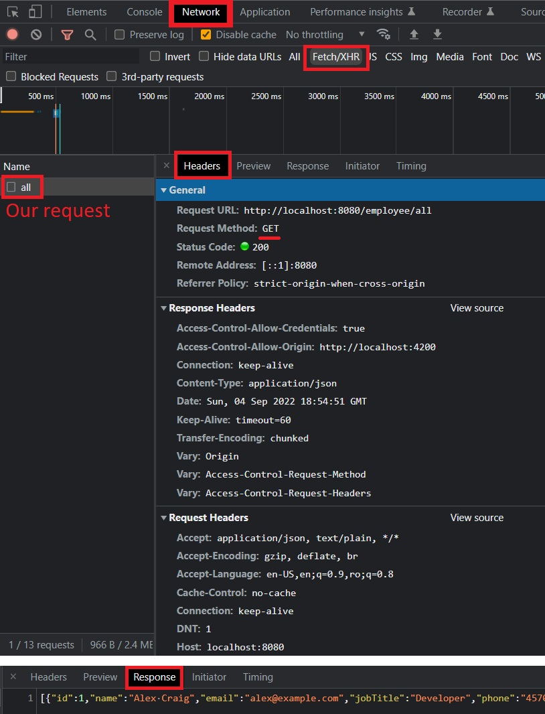

<br/>

## User Interface - Building the HTML

### Basic HTML+CSS Template

(Friday, September 09, 2022)

[Spring Boot Full Stack with Angular - Amigoscode - 1h27m: UI Intro](https://youtu.be/Gx4iBLKLVHk?t=5564)

For this project, we can download a HTML+BOOTSTRAP4 template right from this link: https://www.bootdey.com/snippets/view/bs4-contact-cards (instead of designing and creating an interface - UI - from scratch). From this resource, we will only use/only download the HTML and CSS.

We will copy the HTML from Bootdey.com into the `app.component.html` file:

- we will use the `*ngFor` directive to create an employee card (in the UI) for each Employee object: `*ngFor="let employee of employees"`
- we will also replace the dummy html text (placeholders) with our real values from `employee` array (`public employees: Employee[] = [];` from `app.component.ts`); we pass in the:
    - image: ``
    - name: `<div class="card--name">{{employee.name}}</div>`
    - job title: `<p class="m-0">{{employee.jobTitle}}</p>`
    - email: `<a href="{{'mailto:'+employee.email}}">{{employee.email}}</a>`
    - tel: `<a href="{{'tel:'+employee.phone}}">{{employee.phone}}</a>`

🔵 Note that we can add for image `{{employee?.imageUrl}}` the safe navigation operator (question mark `?`), that check if the employee exists (in order to access its attributes) in the first place and has an imageUrl property.

```html
<!-- app.component.html -->
<!-- Navigation bar -->
<nav class="navbar navbar-expand-lg navbar-dark bg-dark">
  <h1 style="font-size:1rem;"><a class="navbar-brand" style="color:white;">Employee Manager</a></h1>
  <button class="navbar-toggler" type="button" data-toggle="collapse" data-target="#navbarColor02"
    aria-controls="navbarColor02" aria-expanded="false" aria-label="Toggle navigation">
    <span class="navbar-toggler-icon"></span>
  </button>
  <div class="collapse navbar-collapse" id="navbarColor02">
    <ul class="navbar-nav mr-auto">
      <li class="nav-item active">
        <a class="nav-link">Add Employee <span class="sr-only">(current)</span></a>
      </li>
    </ul>
    <form class="form-inline my-2 my-lg-0">
      <input type="search" id="searchName" class="form-control mr-sm-2" placeholder="Search employees..." required>
    </form>
  </div>
</nav>

<!-- Container -->
<div class="container">
  <div class="row">
    <!-- Employee card -->
    <div *ngFor="let employee of employees" class="col-md-6 col-xl-3">
      <div class="card m-b-30">
        <div class="card-body row">
          <div class="col-4">
            <a href="#"></a>
          </div>
          <div class="col-8 card-title align-self-center mb-0">
            <div class="card--name">{{employee.name}}</div>
            <p class="m-0">{{employee.jobTitle}}</p>
          </div>
        </div>
        <ul class="list-group list-group-flush">
          <li class="list-group-item"><i class="fa fa-envelope float-right"></i>Email: <a
              href="{{'mailto:'+employee.email}}">{{employee.email}}</a></li>
          <li class="list-group-item"><i class="fa fa-phone float-right"></i>Phone: <a
              href="{{'tel:'+employee.phone}}">{{employee.phone}}</a></li>
        </ul>
        <div class="card-body">
          <div class="float-right btn-group btn-group-sm">
            <a href="#" class="btn btn-primary tooltips" data-placement="top" data-toggle="tooltip"
              data-original-title="Edit"><i class="fa fa-pencil"></i> </a>
            <a href="#" class="btn btn-secondary tooltips" data-placement="top" data-toggle="tooltip"
              data-original-title="Delete"><i class="fa fa-times"></i></a>
          </div>
          <ul class="social-links list-inline mb-0">
            <li class="list-inline-item"><a title="" data-placement="top" data-toggle="tooltip" class="tooltips" href=""
                data-original-title="LinkedIn"><i class="fa fa-linkedin"></i></a></li>
            <li class="list-inline-item"><a title="" data-placement="top" data-toggle="tooltip" class="tooltips" href=""
                data-original-title="Twitter"><i class="fa fa-twitter"></i></a></li>
            <li class="list-inline-item"><a title="" data-placement="top" data-toggle="tooltip" class="tooltips" href=""
                data-original-title="Skype"><i class="fa fa-skype"></i></a></li>
          </ul>
        </div>
      </div>
    </div>
  </div>
</div>

<!-- Notification for no employees -->
<div *ngIf="employees?.length == 0" class="col-lg-12 col-md-12 col-xl-12">
  <div class="alert alert-info" role="alert">
    <h4 class="alert-heading">NO EMPLOYEES!</h4>
    <p>No Employees were found.</p>
  </div>
</div>
```

<br/>

We will copy the CSS into the `src/styles.css` file and copy the style:

- we also import Bootstrap4 and Fontawesome

```css
@import "https://stackpath.bootstrapcdn.com/bootstrap/4.2.1/css/bootstrap.min.css";
@import "htpps://maxcdn.bootstrapcdn.com/font-awesome/4.3.0/css/font-awesome.min.css";

body {
  background: #fafafa;
  font-size: 16px;
}
.container {
  margin-top: 2rem;
}
.card {
  border: none;
  box-shadow: 1px 2px 5px 1px rgba(0, 0, 0, 0.1);
  margin-bottom: 1rem;
  border-radius: 1rem;
}
.card--name {
  font-size: 1.2rem;
  font-weight: 600;
}
.w-60 {
  width: 4rem;
}

.social-links li a {
  -webkit-border-radius: 50%;
  background-color: rgba(89, 206, 181, 0.85);
  border-radius: 50%;
  color: #fff;
  display: inline-block;
  height: 30px;
  line-height: 30px;
  text-align: center;
  width: 30px;
  font-size: 12px;
}
a {
  color: #707070;
}

```

<br/>

Here's our result:

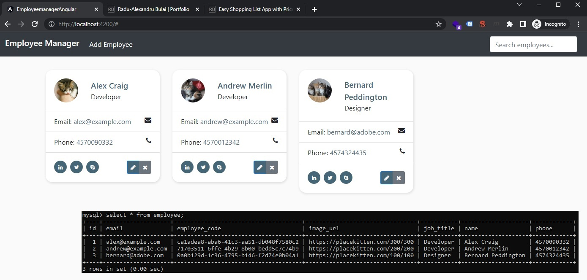

<br/>

## Adding UI Functionalities

### Modal Logic

(Saturday, September 10, 2022)

[Spring Boot Full Stack with Angular - Amigoscode - 1h40m: UI Modal Logic](https://youtu.be/Gx4iBLKLVHk?t=6028)

When we want to add, edit, or delete an employee, we will have a pop-up modal with the necesary inputs and save/cancel buttons.

The modals will be based on this template: https://getbootstrap.com/docs/4.4/components/modal/. The HTML for these modals will be the following:

```html
<!-- HTML for the ADD, EDIT and DELETE modals -->

<!-- Add Employee Modal -->
<div class="modal fade" id="addEmployeeModal" tabindex="-1" role="dialog" aria-labelledby="addEmployeeModalLabel" aria-hidden="true">
  <div class="modal-dialog" role="document">
    <div class="modal-content">
       <div class="modal-header">
          <h5 class="modal-title" id="addEmployeeModalLabel">Add Employee</h5>
          <button type="button" class="close" data-dismiss="modal" aria-label="Close">
          <span aria-hidden="true">&times;</span>
          </button>
       </div>
       <div class="modal-body">
          <form #addForm="ngForm" (ngSubmit)="onAddEmloyee(addForm)">
          <div class="form-group">
             <label for="name">Name</label>
             <input type="text" ngModel name="name" class="form-control" id="name" placeholder="Name" required>
          </div>
          <div class="form-group">
             <label for="email">Email Address</label>
             <input type="email" ngModel name="email" class="form-control" id="email" placeholder="Email" required>
          </div>
          <div class="form-group">
             <label for="phone">Job title</label>
             <input type="text" ngModel name="jobTitle" class="form-control" id="jobTile" placeholder="Job title" required>
          </div>
          <div class="form-group">
             <label for="phone">Phone</label>
             <input type="text" ngModel name="phone" class="form-control" id="phone" placeholder="Phone" required>
          </div>
          <div class="form-group">
             <label for="phone">Image URL</label>
             <input type="text" ngModel name="imageUrl" class="form-control" id="imageUrl" placeholder="Image URL" required>
          </div>
          <div class="modal-footer">
             <button type="button" id="add-employee-form" class="btn btn-secondary" data-dismiss="modal">Close</button>
             <button [disabled]="addForm.invalid" type="submit" class="btn btn-primary" >Save changes</button>
          </div>
          </form>
       </div>
    </div>
  </div>
</div>
```

```HTML
<!-- Edit Modal -->
<div class="modal fade" id="updateEmployeeModal" tabindex="-1" role="dialog" aria-labelledby="employeeEditModalLabel" aria-hidden="true">
  <div class="modal-dialog" role="document">
     <div class="modal-content">
        <div class="modal-header">
           <h5 class="modal-title" id="updateEmployeeModalLabel">Edit Employee {{editEmployee?.name}}</h5>
           <button type="button" class="close" data-dismiss="modal" aria-label="Close">
           <span aria-hidden="true">&times;</span>
           </button>
        </div>
        <div class="modal-body">
           <form #editForm="ngForm">
              <div class="form-group">
                 <label for="name">Name</label>
                 <input type="text" ngModel="{{editEmployee?.name}}" name="name" class="form-control" id="name" aria-describedby="emailHelp" placeholder="Name">
              </div>
              <input type="hidden" ngModel="{{editEmployee?.id}}" name="id" class="form-control" id="id" placeholder="Email">
              <input type="hidden" ngModel="{{editEmployee?.employeeCode}}" name="userCode" class="form-control" id="userCode" placeholder="Email">
              <div class="form-group">
                 <label for="email">Email Address</label>
                 <input type="email" ngModel="{{editEmployee?.email}}" name="email" class="form-control" id="email" placeholder="Email">
              </div>
              <div class="form-group">
                 <label for="phone">Job title</label>
                 <input type="text" ngModel="{{editEmployee?.jobTitle}}" name="jobTitle" class="form-control" id="jobTitle" placeholder="Job title">
              </div>
              <div class="form-group">
                 <label for="phone">Phone</label>
                 <input type="text" ngModel="{{editEmployee?.phone}}" name="phone" class="form-control" id="phone" name="phone" placeholder="Phone">
              </div>
              <div class="form-group">
                 <label for="phone">Image URL</label>
                 <input type="text" ngModel="{{editEmployee?.imageUrl}}" name="imageUrl" class="form-control" id="imageUrl" placeholder="Image URL">
              </div>
              <div class="modal-footer">
                 <button type="button" id="" data-dismiss="modal" class="btn btn-secondary">Close</button>
                 <button (click)="onUpdateEmloyee(editForm.value)" data-dismiss="modal" class="btn btn-primary" >Save changes</button>
              </div>
           </form>
        </div>
     </div>
  </div>
</div>
```

```HTML
<!-- Delete Modal -->
<div class="modal fade" id="deleteEmployeeModal" tabindex="-1" role="dialog" aria-labelledby="deleteModelLabel" aria-hidden="true">
  <div class="modal-dialog" role="document">
     <div class="modal-content">
        <div class="modal-header">
           <h5 class="modal-title" id="deleteModelLabel">Delete Employee</h5>
           <button type="button" class="close" data-dismiss="modal" aria-label="Close">
           <span aria-hidden="true">&times;</span>
           </button>
        </div>
        <div class="modal-body">
           <p>Are you sure you want to delete employee {{deleteEmployee?.name}}?</p>
           <div class="modal-footer">
              <button type="button" class="btn btn-secondary" data-dismiss="modal">No</button>
              <button (click)="onDeleteEmloyee(deleteEmployee?.id)" class="btn btn-danger" data-dismiss="modal">Yes</button>
           </div>
        </div>
     </div>
  </div>
</div>
```

<br/>

For the modal logic (opening a modal by pressing a button):

- first we need to "import" / add the following bootstrap4 JS libraries to our app, in the main Angular `index.html` file, we'll add the following links from https://getbootstrap.com/docs/4.5/getting-started/introduction/:

```html
<script src="https://code.jquery.com/jquery-3.3.1.slim.min.js" defer></script>
<script src="https://cdnjs.cloudflare.com/ajax/libs/popper.js/1.14.6/umd/popper.min.js" defer></script>
<script src="https://stackpath.bootstrapcdn.com/bootstrap/4.2.1/js/bootstrap.min.js" defer></script>
```

> I know, this tutorial is using JQUERY and AJAX for an Angular App 😶... this is not the best practice for a front-end Angular App (or React/Vue/Svelte/etc), in most of the times on a project you will either build the Modal functionalities from scratch via TypeScript and CSS (to show/hide/animate the modal), or you will use an npm package that handles modals...

> 🔴 Please do not import libraries such as jQuery or Ajax within an Angular/React/Vue/Svelte Front-End App for your personal projects (that are build from scratch) or on your currect company project. This tutorial main focus was to create and consume a REST API made with Java SpringBoot. Such libraries have big dimensions that are needed to be downloaded on client's PC/browser, along with their hidden implementation complexity could make the app slower.

- we will create a `onOpenModal` function (in `app.component.ts`) that will have as parameter an employee and the "mode" of the model, that will tell us what the user is wanting to do (or what button has been pressed: ADD, EDIT, or DELETE button) -> this will determine which modal will be opened: `public onOpenModal(employee: Employee, mode: string): void {}`
    - in `onOpenModal` we will create a button (by default, when we createElement button, its default type is "type=submit", but we can change it to "type=button")
    - the button attribute `data-toggle` will be "modal" (needed for Bootstrap4)
    - the button attribute `data-target` will be dynamic (received from the function parameter)

    ```typescript
    // app.component.ts
      public onOpenModal(employee: Employee | null, mode: string): void {
        const container = document.getElementById('main-container');
        const button = document.createElement('button');
        button.type = 'button';
        button.style.display = 'none';
        button.setAttribute('data-toggle', 'modal');

        if (mode == 'add') {
          button.setAttribute('data-target', '#addEmployeeModal');
        }
        if (mode == 'edit') {
          button.setAttribute('data-target', '#editEmployeeModal');
        }
        if (mode == 'delete') {
          button.setAttribute('data-target', '#deleteEmployeeModal');
        }

        container?.appendChild(button);
        button.click();
      }
    ```

    - we want to add these buttons (that opens a specific modal) dinamically to our UI (`app.component.html`): we first can add an ID to the container div in HTML: `<div class="container" id="main-container">`
    - get the container in `app.component.ts`: `const container = document.getElementById('main-container');`
    - append the created button to the div container (in DOM) and click it: `container?.appendChild(button); button.click();`

(From tutorial: *"This implementation of creating an artificially invisible button (from `onOpenModal()`) and virtually pressing it makes our code a bit cleaner.. another method was to implement 3 different functions for add, edit and delete buttons/modals"*... Although, personally I would not recommend this implementation at all... because, every time we press an add/edit/delete button to open the desired modal, a button element will be created and added to the DOM in the `#main-container` div element 😶😶. Luckily, we can just add `button.remove();` right after `button.click()` and everything will be fine ✅)

- within `app.component.html`, we will add a click listener to the add, edit and delete buttons:
    - Add button: `<a class="nav-link" (click)="onOpenModal(null, 'add')">Add Employee <span class="sr-only">(current)</span></a>`

    - Edit button: `<a (click)="onOpenModal(employee, 'edit')" href="#" class="btn btn-primary tooltips" data-placement="top" data-toggle="tooltip" data-original-title="Edit" title="Edit employee"><i class="fa fa-pencil"></i> </a>`

    - Delete button: `<a (click)="onOpenModal(employee, 'delete')" href="#" class="btn btn-secondary tooltips" data-placement="top" data-toggle="tooltip" data-original-title="Delete" title="Delete employee"><i class="fa fa-times"></i></a>`

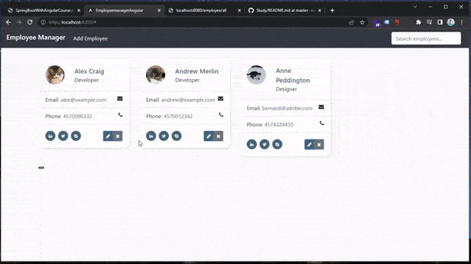

<br/>

### Debugging Modal Logic

[Spring Boot Full Stack with Angular - Amigoscode - 1h55m: Testing Modal Logic](https://youtu.be/Gx4iBLKLVHk?t=6893)

Within our Chrome Browser -> Dev Tools (F12), we can currently check and add breakpoints to our code in order to run the modal functionality line by line.

Our Angular source code can be found on `webpack/src/app/app.component.ts` path.

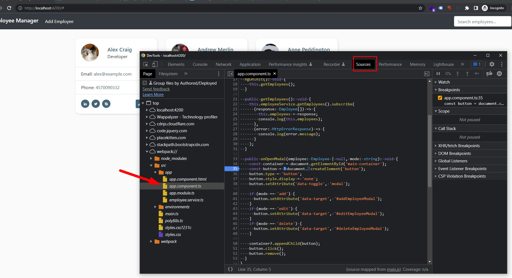


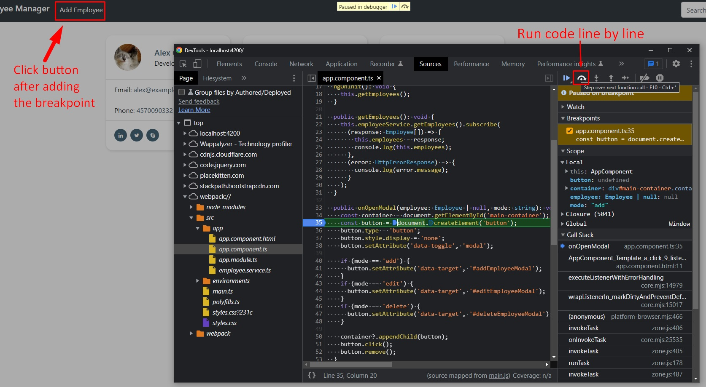


<br/>

### Angular Form Logic

[Spring Boot Full Stack with Angular - Amigoscode - 1h59m: Testing Modal Logic](https://youtu.be/Gx4iBLKLVHk?t=7147)

First, we need to add the `FormsModule` in the main `app.module.ts` file: `import { FormsModule } from '@angular/forms';`

```ts
// app.module.ts
import { NgModule } from '@angular/core';
import { BrowserModule } from '@angular/platform-browser';
import { HttpClientModule } from '@angular/common/http';

import { AppComponent } from './app.component';
import { FormsModule } from '@angular/forms';

@NgModule({
  declarations: [AppComponent],
  imports: [BrowserModule, HttpClientModule, FormsModule],
  providers: [],
  bootstrap: [AppComponent],
})
export class AppModule {}
```

<br/>

#### Add Employee Form

🟢 Now, in the `app.component.html`, in the Add modal, inside `<form>` we can add an Angular Reference such as `<form #addForm="ngForm">`. We will also add an action (eg. calling the `onAddEmployee` method where we will pass in the `<form>` with all of its data) for the submit: `<form #addForm="ngForm" (ngSubmit)="onAddEmployee(addForm)">`

> See Element references inside a HTML template in Angular: https://ultimatecourses.com/blog/element-refs-in-angular-templates

<br/>

> Note 😶: Ideally, we should have had multiple components, such as a Modal/Form Component, and each Add/Edit/Delete form would have been derived from the main abstract Modal/Form Component. We'll just follow along with this tutorial.

<br/>

- On `app.component.html`, normally, each `<input>` field would have the `name` attribute with its key in order to retrieve that value (either with Vanilla JS or with PHP). With Angular, in order to access those values in the form, we will need to add an additional property called `ngModel`.

- We can also add a `[disabled]="addForm.invalid"` on the `Save` Button within our Add Employee Modal, therefore, when the Form does not have all the `required` inputs completed, the user will not be able to press the Save button. (Although ideally there should have been some sort of form validation instead of just disabling the button 😶)... **However this whole functionality of having the button disabled if `required` inputs are not filled is a nice prebuild feature from Angular.**

```html
<!-- app.component.html -->
<!-- Add Employee Modal -->
<div class="modal fade" id="addEmployeeModal" tabindex="-1" role="dialog" aria-labelledby="addEmployeeModalLabel"
  aria-hidden="true">
  <div class="modal-dialog" role="document">
    <div class="modal-content">
      <div class="modal-header">
        <div class="modal-title" id="addEmployeeModalLabel">Add Employee</div>
        <button type="button" class="close" data-dismiss="modal" aria-label="Close">
          <span aria-hidden="true">&times;</span>
        </button>
      </div>
      <div class="modal-body">
        <form #addForm="ngForm" (ngSubmit)="onAddEmployee(addForm)">
          <div class="form-group">
            <label for="name">Name</label>
            <input type="text" ngModel name="name" class="form-control" id="name" placeholder="Name" required>
          </div>
          <div class="form-group">
            <label for="email">Email Address</label>
            <input type="email" ngModel name="email" class="form-control" id="email" placeholder="Email" required>
          </div>
          <div class="form-group">
            <label for="phone">Job title</label>
            <input type="text" ngModel name="jobTitle" class="form-control" id="jobTile" placeholder="Job title"
              required>
          </div>
          <div class="form-group">
            <label for="phone">Phone</label>
            <input type="text" ngModel name="phone" class="form-control" id="phone" placeholder="Phone" required>
          </div>
          <div class="form-group">
            <label for="phone">Image URL</label>
            <input type="text" ngModel name="imageUrl" class="form-control" id="imageUrl" placeholder="Image URL"
              required>
          </div>
          <div class="modal-footer">
            <button type="button" id="add-employee-form-close" class="btn btn-secondary" data-dismiss="modal">Close</button>
            <button type="submit" class="btn btn-primary">Save changes</button>
          </div>
        </form>
      </div>
    </div>
  </div>
</div>
```

<br/>

- Back in `app.component.ts`, we will create the `onAddEmployee()` method:
    
    - First we will call the `employeeService.addEmployee()` method from `employee.service.ts`, that will take as an input the provided parameter: `addForm.value`, which will be a JSON will all the data from the Form (Angular server us the data from the form by default as a JSON, which is really nice).

    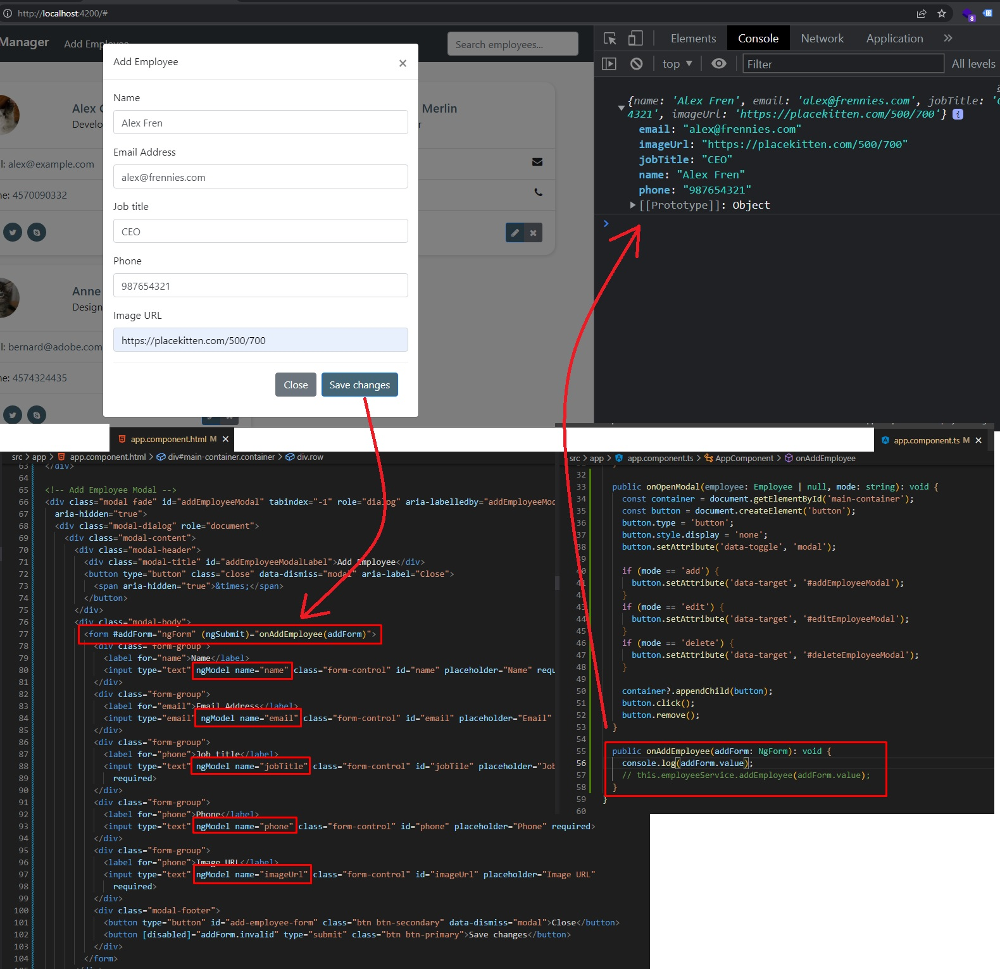

    - `employeeService.addEmployee()` method, we will also add the `subscribe()` call to it (like a `.then()` method), where we will check if we have a response from the Back-End server or not.
        - if we receive a response (with success), we will just call `this.getEmployees();` method that renders all the UI with all the employees from the MySQL Database
        - if we receive an error, we will console.log it. Ideally we should also alert the user somehow with a push notification with a message like "There has been an error in adding the employee".

    ```typescript
    // app.component.ts
    public onAddEmployee(addForm: NgForm): void {
    let methodName = 'onAddEmployee() ';
    this.employeeService.addEmployee(addForm.value).subscribe(
      (response: Employee) => {
        console.debug(
          methodName + 'Response Received: ' + JSON.stringify(response)
        );
        this.getEmployees();
        document.getElementById('add-employee-form-close')?.click();
      },
      (error: HttpErrorResponse) => {
        alert(error.message);
      }
    );
    }
    ```

    - Also at the end we will virtually press the "Close" button for that modal, so after sending Add a new Employee Request and everything is succesful, we will close the modal (not added in the demo below).

Demo of Adding a new employee:

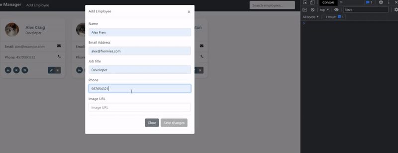

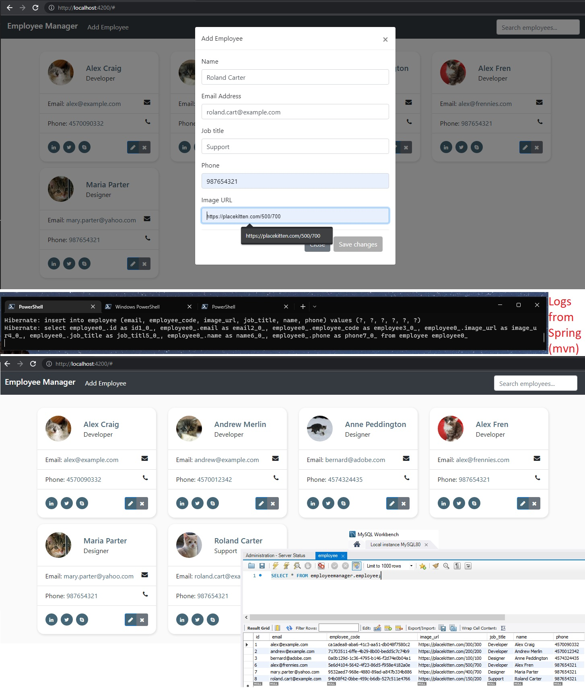

<br/>

#### Update Employee Form

[Spring Boot Full Stack with Angular - Amigoscode - 2h08m: Update Form Functionality](https://youtu.be/Gx4iBLKLVHk?t=7681)

In `app.component.ts` we will create the `onUpdateEmployee` method that will take in as parameter an employee; will call the `updateEmployee` method from `employee.service.ts` and on a succesful response we will re-render the list of employees.

Note that we have added several debug logs (adding the method name, and on success and on error logs).

```typescript
public onUpdateEmployee(employee: Employee): void {
const methodName = 'onUpdateEmployee() ';
this.employeeService.updateEmployee(employee).subscribe(
  (response: Employee) => {
    console.debug(
      methodName + 'Response Received: ' + JSON.stringify(response)
    );
    this.getEmployees();
    document.getElementById('edit-employee-form-close')?.click();
  },
  (error: HttpErrorResponse) => {
    console.error(methodName + error.message);
  }
);
}
```

Now, in `app.component.ts` we will need to call this `onUpdateEmployee` method... however, we don't really have access to the current employee object in our HTML for edit modal `<form>`.

- We need to bind the current employee from the HTML template.

- In `OnInit` method from `app.component.ts`, we add a new `public editEmployee!: Employee;` variable (we used the exclamation mark `!` in order to allow this variable to not have an initial value - we added [a TypeScript definite assigment assertion](https://www.typescriptlang.org/docs/handbook/release-notes/typescript-2-7.html#definite-assignment-assertions))

- On `onOpenModal` method, we will add `this.editEmployee = employee;`... therefore, within our list of employees objects from `app.component.html`, whenever the user click on edit button, that employee object will be passed to the `editEmployee` public variable from `app.component.ts`, that can be accessed on our `onUpdateEmployee` method.

```typescript
// app.component.ts
import { HttpErrorResponse } from '@angular/common/http';
import { Component, OnInit } from '@angular/core';
import { NgForm } from '@angular/forms';
import { Employee } from './employee';
import { EmployeeService } from './employee.service';

@Component({
  selector: 'app-root',
  templateUrl: './app.component.html',
  styleUrls: ['./app.component.css'],
})
export class AppComponent implements OnInit {
  title = 'employeemanager-angular';
  public employees: Employee[] = [];
  public editEmployee!: Employee;

  constructor(private employeeService: EmployeeService) {}

  ngOnInit(): void {
    this.getEmployees();
  }

  public getEmployees(): void {
    const methodName = 'onAddEmployee() ';
    this.employeeService.getEmployees().subscribe(
      (response: Employee[]) => {
        this.employees = response;
        console.debug(
          methodName +
            'Response Received. Showing first two objects: ' +
            JSON.stringify(response.slice(0, 2))
        );
      },
      (error: HttpErrorResponse) => {
        console.error(methodName + error.message);
      }
    );
  }

  public onOpenModal(employee: Employee, mode: string): void {
    const container = document.getElementById('main-container');
    const button = document.createElement('button');
    button.type = 'button';
    button.style.display = 'none';
    button.setAttribute('data-toggle', 'modal');

    if (mode == 'add') {
      button.setAttribute('data-target', '#addEmployeeModal');
    }
    if (mode == 'edit') {
      this.editEmployee = employee;
      button.setAttribute('data-target', '#editEmployeeModal');
    }
    if (mode == 'delete') {
      button.setAttribute('data-target', '#deleteEmployeeModal');
    }

    container?.appendChild(button);
    button.click();
    button.remove();
  }

  public onAddEmployee(addForm: NgForm): void {
    const methodName = 'onAddEmployee() ';
    this.employeeService.addEmployee(addForm.value).subscribe(
      (response: Employee) => {
        console.debug(
          methodName + 'Response Received: ' + JSON.stringify(response)
        );
        this.getEmployees();
        document.getElementById('add-employee-form-close')?.click();
      },
      (error: HttpErrorResponse) => {
        console.error(methodName + error.message);
      }
    );
  }

  public onUpdateEmployee(employee: Employee): void {
    const methodName = 'onUpdateEmployee() ';
    this.employeeService.updateEmployee(employee).subscribe(
      (response: Employee) => {
        console.debug(
          methodName + 'Response Received: ' + JSON.stringify(response)
        );
        this.getEmployees();
        document.getElementById('edit-employee-form-close')?.click();
      },
      (error: HttpErrorResponse) => {
        console.error(methodName + error.message);
      }
    );
  }
}
```

- On `app.component.html` we will add a reference to the edit form: `<form #editForm="ngForm">`, so we can use this reference in the `onUpdateEmployee` method and pass the employee value (JSON object), namely in the `<button (click)="onUpdateEmployee(editForm.value)" data-dismiss="modal" class="btn btn-primary">Save changes</button>` call.

- Now we need to add `ngModel` to every input field, but here each ngModel will be equal to the received `editEmployee.inputField` variable, eg. `<input type="text" ngModel="{{editEmployee.name}}" name="name" class="form-control" id="name" aria-describedby="emailHelp" placeholder="Name">`

```html
<!-- app.component.html -->
<!-- Edit Modal -->
<div class="modal fade" id="editEmployeeModal" tabindex="-1" role="dialog" aria-labelledby="employeeEditModalLabel"
  aria-hidden="true">
  <div class="modal-dialog" role="document">
    <div class="modal-content">
      <div class="modal-header">
        <div class="modal-title" id="updateEmployeeModalLabel">Edit Employee</div>
        <button type="button" class="close" data-dismiss="modal" aria-label="Close">
          <span aria-hidden="true">&times;</span>
        </button>
      </div>
      <div class="modal-body">
        <form #editForm="ngForm">
          <div class="form-group">
            <label for="name">Name *</label>
            <input type="text" ngModel="{{editEmployee?.name}}" name="name" class="form-control" id="name"
              aria-describedby="emailHelp" required>
          </div>
          <input type="hidden" ngModel="{{editEmployee?.id}}" name="id" class="form-control" id="id">
          <input type="hidden" ngModel="{{editEmployee?.employeeCode}}" name="userCode" class="form-control"
            id="userCode">
          <div class="form-group">
            <label for="email">Email Address *</label>
            <input type="email" ngModel="{{editEmployee?.email}}" name="email" class="form-control" id="email"
              placeholder="name@example.com" required>
          </div>
          <div class="form-group">
            <label for="phone">Job title *</label>
            <input type="text" ngModel="{{editEmployee?.jobTitle}}" name="jobTitle" class="form-control" id="jobTitle"
              placeholder="Developer, Manager, Support, etc" required>
          </div>
          <div class="form-group">
            <label for="phone">Phone *</label>
            <input type="text" ngModel="{{editEmployee?.phone}}" name="phone" class="form-control" id="phone"
              placeholder="Phone" required>
          </div>
          <div class="form-group">
            <label for="phone">Image URL *</label>
            <input type="text" ngModel="{{editEmployee?.imageUrl}}" name="imageUrl" class="form-control" id="imageUrl"
              placeholder="Image URL" required>
          </div>
          <div class="form-group">
            <label for="phone">Website URL</label>
            <input type="text" ngModel name="websiteUrl" class="form-control" id="websiteUrl"
              placeholder="https://www.employees-website.com">
          </div>
          <div class="form-group">
            <label for="phone">LinkedIn URL</label>
            <input type="text" ngModel name="linkedinUrl" class="form-control" id="linkedinUrl"
              placeholder="https://www.linkedin.com/in/employee-name/">
          </div>
          <div class="modal-footer">
            <button type="button" id="edit-employee-form-close" data-dismiss="modal"
              class="btn btn-secondary">Close</button>
            <button (click)="onUpdateEmployee(editForm.value)" [disabled]="editForm.invalid" data-dismiss="modal"
              class="btn btn-primary">Save
              changes</button>
          </div>
        </form>
      </div>
    </div>
  </div>
</div>
``` 


<br/><br/>

# Refactoring our app after tutorial


