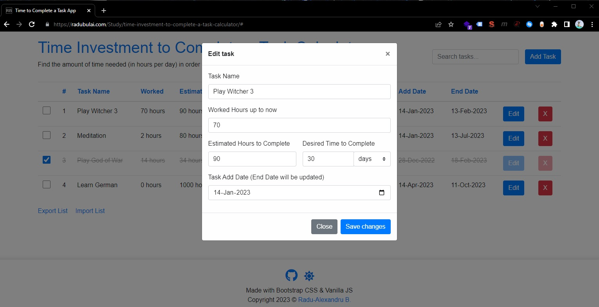

# Time Investment to Complete a Task Calculator

This is a simple web application that helps you plan and track your progress on a task by calculating the number of hours per day you need to invest in order to complete the task in a certain amount of time.

🚀 [App Live Link](https://radubulai.com/Study/time-investment-to-complete-a-task-calculator)

☕ Made with Vanilla JS using Bootstrap CSS 4.5.3 / Font-awesome icons 5.15.4

<br>

Contents:

- [Time Investment to Complete a Task Calculator](#time-investment-to-complete-a-task-calculator)
  - [Features](#features)
  - [Screenshots](#screenshots)
  - [Data format](#data-format)
  - [Building the app with ChatGPT assistance](#building-the-app-with-chatgpt-assistance)
  - [How to run](#how-to-run)
  - [License](#license)

<br>

## Features

- Input a task name, the estimated number of hours required to complete the task, and the desired time to complete the task in days, weeks, or months
- View the number of hours per day you need to invest in order to complete the task in the desired time frame
- All tasks & calculations are saved in localStorage
- Delete tasks/calculations from the list
- Check/Uncheck tasks
- Search through tasks
- Dark mode
- Export current list of tasks to JSON file
- Import list of tasks from JSON file. A modal to choose between "Concatenate to current list" or "Overwrite current list" options will appear

<br/>

## Screenshots





<br/>

## Data format

JSON:

```json
{
  "taskId": "08ee222907db5",
  "taskName": "Play Witcher 3",
  "estimatedHours": "90",
  "desiredTime": "30",
  "desiredTimeUnit": "days",
  "hoursPerDay": 3,
  "addDate": "2023-01-14T00:00:00.000Z",
  "endDate": "2023-02-13T12:03:41.407Z",
  "workedHours": "70",
  "checked": false
}
```

<br/>

## Building the app with ChatGPT assistance

Note: The beggining of this app (boilerplate which was later worked on) was made with the assistence of ChatGPT 3.

The conversation was generated on Monday, December 26, 2022 and can be found here: [Using ChatGPT to create a CRUD Vanilla JS App - "Time Investment in Hours per Day to Complete a Task Calculator --- ChatGPT Conversation"](./TimeInvestmentCalculatorREADME.md)

<br/>

## How to run

👉 Download and install [Visual Studio Code](https://code.visualstudio.com/)

```bash
git clone https://github.com/radualexandrub/Study/tree/master/time-investment-to-complete-a-task-calculator task-calc-app
cd task-calc-app
code .
```

👉 Install the [Live Server Extension for VS Code](https://marketplace.visualstudio.com/items?itemName=ritwickdey.LiveServer)

👉 Press `CTRL+SHIFT+P` within VS Code and select "Open with Live Server"

👉 The app should open at [http://localhost:5500/index.html](http://localhost:5500/index.html) / http://127.0.0.1:5500/index.html

<br/>

## License

Copyright (c) 2022-2023 [Radu-Alexandru Bulai](https://radubulai.com)

Released under [MIT License](./LICENSE)
