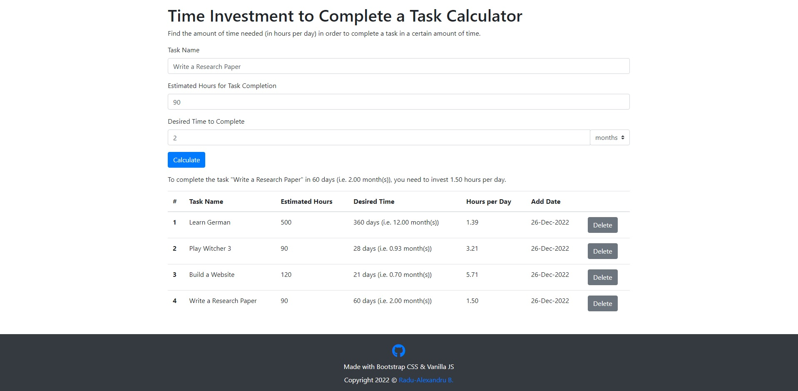
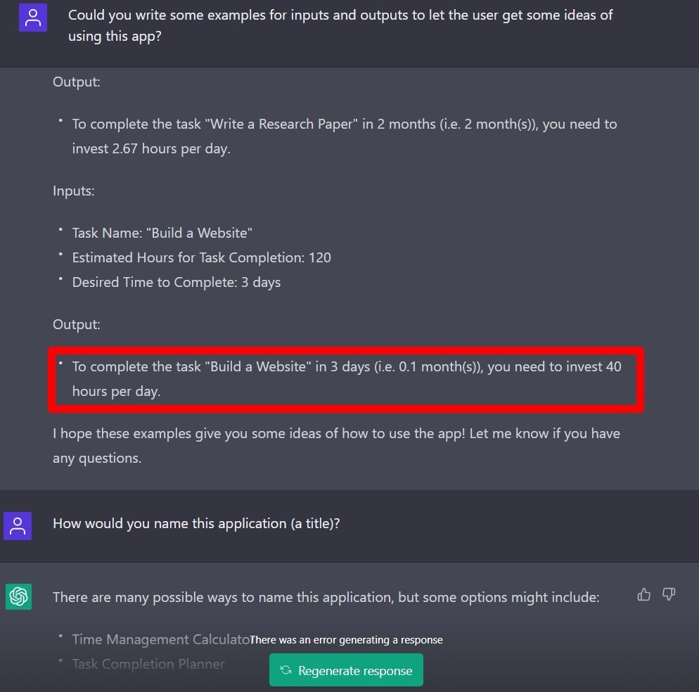

# Time Investment to Complete a Task Calculator

This is a simple web application that helps you plan and track your progress on a task by calculating the number of hours per day you need to invest in order to complete the task in a certain amount of time.

🚀 [App Live Link](https://radubulai.com/Study/time-investment-to-complete-a-task-calculator)



<br>

## Features

- Input a task name, the estimated number of hours required to complete the task, and the desired time to complete the task in days, weeks, or months.
- View the number of hours per day you need to invest in order to complete the task in the desired time frame.
- Save and view a list of your previous calculations.
- Delete calculations from the list.

<br/>

## Building the app with ChatGPT assistance

Conversation generated on Monday, December 26, 2022

### App input

> I have the followings inputs for an application:
> 
> 1) Task Name
> 2) Estimated Hours for Task Completion
> 3) Desired time to Complete (eg. in a few days/weeks/months)
> 
> and the output should be The Hours necessary to invest per day in order to complete the task in the desired interval
> 
> What would be the formula to compute the Hours necessary to invest per day in order to complete the task in the desired interval?

To compute the number of hours you need to invest per day in order to complete a task in a given time interval, you can use the following formula:

(Estimated Hours for Task Completion) / (Desired time to Complete in Days) = Hours necessary to invest per day

For example, if you have a task that will take an estimated 20 hours to complete and you want to complete it in 5 days, you would need to invest 4 hours per day:

(20 hours) / (5 days) = 4 hours/day

Note that in this formula, the "Desired time to Complete" should be expressed in days. If you want to complete the task in a few weeks or months, you will need to convert that time interval into days. For example, if you want to complete the task in 3 weeks, you can multiply the number of weeks by the number of days per week (e.g., 3 weeks * 7 days/week = 21 days).

<br/>

### App HTML

> Could you please write the HTML for the input form using Bootstrap CSS?


Certainly! Here is an example of an HTML input form using Bootstrap CSS that includes fields for the "Task Name," "Estimated Hours for Task Completion," and "Desired time to Complete" inputs you mentioned:

```html
<form>
  <div class="form-group">
    <label for="taskNameInput">Task Name</label>
    <input type="text" class="form-control" id="taskNameInput">
  </div>
  <div class="form-group">
    <label for="estimatedHoursInput">Estimated Hours for Task Completion</label>
    <input type="number" class="form-control" id="estimatedHoursInput">
  </div>
  <div class="form-group">
    <label for="desiredTimeInput">Desired Time to Complete</label>
    <input type="text" class="form-control" id="desiredTimeInput">
  </div>
  <button type="submit" class="btn btn-primary">Calculate</button>
</form>
```

This form includes three input fields: one for the task name (a text field), one for the estimated hours for task completion (a number field), and one for the desired time to complete (a text field). It also includes a submit button that can be used to calculate the number of hours necessary to invest per day in order to complete the task in the desired interval.

<br/>

> Could you please add an additional dropdown near the "Desired Time to Complete" input in order to select between days/weeks/months?

Certainly! Here is an example of how you could modify the HTML input form to include a dropdown menu for selecting between "days," "weeks," and "months" near the "Desired Time to Complete" input:

```html
<form>
  <div class="form-group">
    <label for="taskNameInput">Task Name</label>
    <input type="text" class="form-control" id="taskNameInput">
  </div>
  <div class="form-group">
    <label for="estimatedHoursInput">Estimated Hours for Task Completion</label>
    <input type="number" class="form-control" id="estimatedHoursInput">
  </div>
  <div class="form-group">
    <label for="desiredTimeInput">Desired Time to Complete</label>
    <div class="input-group">
      <input type="number" class="form-control" id="desiredTimeInput">
      <div class="input-group-append">
        <select class="custom-select" id="desiredTimeUnit">
          <option value="days">days</option>
          <option value="weeks">weeks</option>
          <option value="months">months</option>
        </select>
      </div>
    </div>
  </div>
  <button type="submit" class="btn btn-primary">Calculate</button>
</form>
```

This form includes the same three input fields as the previous example, but it replaces the "Desired Time to Complete" text field with a combination of a number field and a dropdown menu for selecting between "days," "weeks," and "months." The dropdown menu is implemented using the `<select>` element, and the options within the dropdown menu are defined using the `<option>` elements.

<br/>

### App JS

> Thanks. Can you write the HTML for displaying the output?

+

> Thanks. Could you please add a preventDefault to the JS code (without any other commentary)?

```html
<form>
  <!-- Input fields and dropdown menu as before -->
  <div id="outputContainer" class="mt-3">
    <!-- Output will be displayed here -->
  </div>
  <button type="submit" class="btn btn-primary">Calculate</button>
</form>
```

This form includes an empty `<div>` element with an id of "outputContainer" that will be used to display the output of the calculation. To display the output, you will need to use JavaScript to retrieve the values of the input fields and dropdown menu, perform the calculation, and update the inner HTML of the "outputContainer" `<div>` element with the result.

Here is an example of how you could do this using JavaScript:

```js
function calculateHoursPerDay() {
  // Prevent the form from being submitted
  event.preventDefault();

  // Get the values of the input fields and dropdown menu
  var taskName = document.getElementById('taskNameInput').value;
  var estimatedHours = document.getElementById('estimatedHoursInput').value;
  var desiredTime = document.getElementById('desiredTimeInput').value;
  var desiredTimeUnit = document.getElementById('desiredTimeUnit').value;

  // Convert the desired time to days if necessary
  if (desiredTimeUnit === 'weeks') {
    desiredTime *= 7;
  } else if (desiredTimeUnit === 'months') {
    desiredTime *= 30;
  }

  // Perform the calculation
  var hoursPerDay = estimatedHours / desiredTime;

  // Update the inner HTML of the output container
  document.getElementById('outputContainer').innerHTML =
    '<p>To complete the task "' + taskName + '" in ' + desiredTime + ' ' + desiredTimeUnit + ', you need to invest ' + hoursPerDay.toFixed(2) + ' hours per day.</p>';
}
```

This function retrieves the values of the input fields and dropdown menu using the getElementById() method, converts the desired time to days if necessary, performs the calculation using the formula provided earlier, and updates the inner HTML of the "outputContainer" `<div>` element with the result.

To call this function when the form is submitted, you can add an onclick attribute to the submit button:

```html
<button type="submit" class="btn btn-primary" onclick="calculateHoursPerDay();">Calculate</button>
```

<br/>

> Could you please save in a list each input and output that the user has entered?

Certainly! Here is an example of how you could modify the JavaScript code to save the input and output of each calculation in a list:

```js
var calculationList = []; // Initialize an empty array to store the calculations

function calculateHoursPerDay(event) {
  // Prevent the form from being submitted
  event.preventDefault();

  // Get the values of the input fields and dropdown menu
  var taskName = document.getElementById('taskNameInput').value;
  var estimatedHours = document.getElementById('estimatedHoursInput').value;
  var desiredTime = document.getElementById('desiredTimeInput').value;
  var desiredTimeUnit = document.getElementById('desiredTimeUnit').value;

  // Convert the desired time to days if necessary
  if (desiredTimeUnit === 'weeks') {
    desiredTime *= 7;
  } else if (desiredTimeUnit === 'months') {
    desiredTime *= 30;
  }

  // Perform the calculation
  var hoursPerDay = estimatedHours / desiredTime;

  // Save the input and output in an object
  var calculation = {
    taskName: taskName,
    estimatedHours: estimatedHours,
    desiredTime: desiredTime,
    desiredTimeUnit: desiredTimeUnit,
    hoursPerDay: hoursPerDay
  };

  // Add the calculation object to the list
  calculationList.push(calculation);

  // Update the inner HTML of the output container
  document.getElementById('outputContainer').innerHTML =
    '<p>To complete the task "' + taskName + '" in ' + desiredTime + ' ' + desiredTimeUnit.slice(0, -1) + ' (i.e. ' + desiredTime / 30 + ' month(s)), you need to invest ' + hoursPerDay.toFixed(2) + ' hours per day.</p>';
}
```

In this version of the code, I added an empty array called calculationList at the top of the script to store the calculations. After performing the calculation, I created an object to represent the input and output of the calculation, and added this object to the calculationList array using the push() method.

You can then use this list to display a history of all the calculations that have been performed. For example, you could add a button to the form that displays the list of calculations when clicked:

```html
<button type="button" class="btn btn-secondary" onclick="displayCalculationList()">Show Calculation List</button>
```
And you could define a function called displayCalculationList() to iterate over the calculationList array and display the input and output of each calculation:

```js
function displayCalculationList() {
  // Clear the output container
  document.getElementById('outputContainer').innerHTML = '';

  // Iterate over the calculationList array
  for (var i = 0; i < calculationList.length; i++) {
    // Get the current calculation
    var calculation = calculationList[i];

    // Construct the HTML for the calculation
    var calculationHTML = '<div class="calculation">';
    calculationHTML += '<h4>Calculation ' + (i + 1) + '</h4>';
    calculationHTML += '<p>Task Name: ' +
```

> continue

Certainly! Here is the rest of the displayCalculationList() function:

```js
function displayCalculationList() {
  // Clear the output container
  document.getElementById('outputContainer').innerHTML = '';

  // Iterate over the calculationList array
  for (var i = 0; i < calculationList.length; i++) {
    // Get the current calculation
    var calculation = calculationList[i];

    // Construct the HTML for the calculation
    var calculationHTML = '<div class="calculation">';
    calculationHTML += '<h4>Calculation ' + (i + 1) + '</h4>';
    calculationHTML += '<p>Task Name: ' + calculation.taskName + '</p>';
    calculationHTML += '<p>Estimated Hours: ' + calculation.estimatedHours + '</p>';
    calculationHTML += '<p>Desired Time: ' + calculation.desiredTime + ' ' + calculation.desiredTimeUnit.slice(0, -1) + ' (i.e. ' + calculation.desiredTime / 30 + ' month(s))</p>';
    calculationHTML += '<p>Hours per Day: ' + calculation.hoursPerDay.toFixed(2) + '</p>';
    calculationHTML += '</div>';

    // Add the calculation HTML to the output container
    document.getElementById('outputContainer').innerHTML += calculationHTML;
  }
}
```

This function iterates over the calculationList array and constructs an HTML representation of each calculation. It then adds this HTML to the inner HTML of the "outputContainer" `<div>` element using the += operator.

I hope this helps! Let me know if you have any questions.

<br/>

### App JS LocalStorage

> Thank you, could you please save calculationList to local storage and update it every time the user has added a new calculation?

Certainly! Here is an example of how you could modify the JavaScript code to save the calculationList array to local storage and update it every time a new calculation is added:

```js
// Check if the calculationList array is stored in local storage
if (localStorage.getItem('calculationList')) {
  // If it is, retrieve it from local storage
  calculationList = JSON.parse(localStorage.getItem('calculationList'));
}

function calculateHoursPerDay(event) {
  // Prevent the form from being submitted
  event.preventDefault();

  // Get the values of the input fields and dropdown menu
  var taskName = document.getElementById('taskNameInput').value;
  var estimatedHours = document.getElementById('estimatedHoursInput').value;
  var desiredTime = document.getElementById('desiredTimeInput').value;
  var desiredTimeUnit = document.getElementById('desiredTimeUnit').value;

  // Convert the desired time to days if necessary
  if (desiredTimeUnit === 'weeks') {
    desiredTime *= 7;
  } else if (desiredTimeUnit === 'months') {
    desiredTime *= 30;
  }

  // Perform the calculation
  var hoursPerDay = estimatedHours / desiredTime;

  // Save the input and output in an object
  var calculation = {
    taskName: taskName,
    estimatedHours: estimatedHours,
    desiredTime: desiredTime,
    desiredTimeUnit: desiredTimeUnit,
    hoursPerDay: hoursPerDay
  };

  // Add the calculation object to the list
  calculationList.push(calculation);

  // Save the updated calculationList array to local storage
  localStorage.setItem('calculationList', JSON.stringify(calculationList));

  // Update the inner HTML of the output container
  document.getElementById('outputContainer').innerHTML =
    '<p>To complete the task "' + taskName + '" in ' + desiredTime + ' ' + desiredTimeUnit.slice(0, -1) + ' (i.e. ' + desiredTime / 30 + ' month(s)), you need to invest ' + hoursPerDay.toFixed(2) + ' hours per day.</p>';
}
```

In this version of the code, I added a check at the beginning of the script to see if the `calculationList`

<br/>

### App JS Deleteion

> Could you please implement a button where the user can delete a calculation from list?

Certainly! Here is an example of how you could modify the JavaScript code to add a button that allows the user to delete a calculation from the calculationList array:

```js
// Check if the calculationList array is stored in local storage
if (localStorage.getItem('calculationList')) {
  // If it is, retrieve it from local storage
  calculationList = JSON.parse(localStorage.getItem('calculationList'));
}

function calculateHoursPerDay(event) {
  // Prevent the form from being submitted
  event.preventDefault();

  // Get the values of the input fields and dropdown menu
  var taskName = document.getElementById('taskNameInput').value;
  var estimatedHours = document.getElementById('estimatedHoursInput').value;
  var desiredTime = document.getElementById('desiredTimeInput').value;
  var desiredTimeUnit = document.getElementById('desiredTimeUnit').value;

  // Convert the desired time to days if necessary
  if (desiredTimeUnit === 'weeks') {
    desiredTime *= 7;
  } else if (desiredTimeUnit === 'months') {
    desiredTime *= 30;
  }

  // Perform the calculation
  var hoursPerDay = estimatedHours / desiredTime;

  // Save the input and output in an object
  var calculation = {
    taskName: taskName,
    estimatedHours: estimatedHours,
    desiredTime: desiredTime,
    desiredTimeUnit: desiredTimeUnit,
    hoursPerDay: hoursPerDay
  };

  // Add the calculation object to the list
  calculationList.push(calculation);

  // Save the updated calculationList array to local storage
  localStorage.setItem('calculationList', JSON.stringify(calculationList));

  // Update the inner HTML of the output container
  document.getElementById('outputContainer').innerHTML =
    '<p>To complete the task "' + taskName + '" in ' + desiredTime + ' ' + desiredTimeUnit.slice(0, -1) + ' (i.e. ' + desiredTime / 30 + ' month(s)), you need to invest ' + hoursPerDay.toFixed(2) + ' hours per day.</p>' +
    '<button type="button" class="btn btn-secondary delete-button" onclick="deleteCalculation(' + (calculationList.length - 1) + ')">Delete</button>';
}

function deleteCalculation(index) {
  // Remove the calculation at the given index from the calculationList array
  calculationList.splice(index, 1);

  // Save the updated calculationList array to local storage
  localStorage.setItem('calculationList', JSON.stringify(calculationList));

  // Display the updated calculation list
  displayCalculationList();
}
```

In this version of the code, I added a delete button to the inner HTML of the "outputContainer" <div> element after each calculation. The deleteCalculation() function is called when...

> continue (the `displayCalculationList()` is still not updated to show a delete button)

Certainly! Here is the rest of the modified displayCalculationList() function:

```js
function displayCalculationList() {
  // Clear the output container
  document.getElementById('outputContainer').innerHTML = '';

  // Iterate over the calculationList array
  for (var i = 0; i < calculationList.length; i++) {
    // Get the current calculation
    var calculation = calculationList[i];

    // Construct the HTML for the calculation
    var calculationHTML = '<div class="calculation">';
    calculationHTML += '<h4>Calculation ' + (i + 1) + '</h4>';
    calculationHTML += '<p>Task Name: ' + calculation.taskName + '</p>';
    calculationHTML += '<p>Estimated Hours: ' + calculation.estimatedHours + '</p>';
    calculationHTML += '<p>Desired Time: ' + calculation.desiredTime + ' ' + calculation.desiredTimeUnit.slice(0, -1) + ' (i.e. ' + calculation.desiredTime / 30 + ' month(s))</p>';
    calculationHTML += '<p>Hours per Day: ' + calculation.hoursPerDay.toFixed(2) + '</p>';
    calculationHTML += '<button type="button" class="btn btn-secondary delete-button" onclick="deleteCalculation(' + i + ')">Delete</button>';
    calculationHTML += '</div>';

    // Add the calculation HTML to the output container
    document.getElementById('outputContainer').innerHTML += calculationHTML;
  }
}
```

In this version of the code, I added a delete button to the HTML representation of each calculation, and added an onclick attribute to call the deleteCalculation() function when the button is clicked. The function is passed the index of the calculation in the calculationList array as an argument, so it knows which calculation to delete.

<br/>

### App Inputs and Outputs examples

> Could you write some examples for inputs and outputs to let the user get some ideas of using this app?

Certainly! Here are some examples of inputs and outputs for the app:

Inputs:

- Task Name: "Learn Java"
- Estimated Hours for Task Completion: 160
- Desired Time to Complete: 4 weeks

Output:

- To complete the task "Learn Java" in 4 weeks (i.e. 1 month(s)), you need to invest 8 hours per day.

Inputs:

- Task Name: "Write a Research Paper"
- Estimated Hours for Task Completion: 80
- Desired Time to Complete: 2 months

Output:

- To complete the task "Write a Research Paper" in 2 months (i.e. 2 month(s)), you need to invest 2.67 hours per day.

Inputs:

- Task Name: "Build a Website"
- Estimated Hours for Task Completion: 120
- Desired Time to Complete: 3 days

Output:

- To complete the task "Build a Website" in 3 days (i.e. 0.1 month(s)), you need to invest 40 hours per day.

I hope these examples give you some ideas of how to use the app! Let me know if you have any questions.



***My commentary here: the last example is kind of funny as it doesn't make any sense***

<br/>

> How would you name this application (a title)?

There are many possible ways to name this application, but some options might include:

- Time Management Calculator
- Task Completion Planner
- Daily Workload Calculator
- Time Investment Tracker
- Task Progress Planner

These are just a few suggestions, and the best name for the application will depend on the specific focus and intended audience of the app. You might also consider using a more creative or descriptive name that reflects the unique features or benefits of the app.

I hope this helps! Let me know if you have any questions.

<br/>

### App README.md

> Could you please write a brief REAMD.MD file for this app?

```md
# Task Completion Planner

This is a simple web application that helps you plan and track your progress on a task by calculating the number of hours per day you need to invest in order to complete the task in a certain amount of time.

## Features
- Input a task name, the estimated number of hours required to complete the task, and the desired time to complete the task in days, weeks, or months.
- View the number of hours per day you need to invest in order to complete the task in the desired time frame.
- Save and view a list of your previous calculations.
- Delete calculations from the list.

## Requirements

- A modern web browser

## How to Use

1. Open the app in your web browser.
2. Enter a task name, the estimated number of hours required to complete the task, and the desired time to complete the task in days, weeks, or months.
3. Click the "Calculate" button.
4. View the number of hours per day you need to invest in order to complete the task in the desired time frame.
5. Click the "Save and Show List" button to view and save a list of your previous calculations.
6. Click the "Delete" button to remove a calculation from the list.
```

I hope this README.md file provides a helpful overview of the app! Let me know if you have any questions.

<br/>

### App HTML Table output

> Could you please show the outputContainer for the calculationList as a HTML table instead?

Certainly! Here is an example of how you could modify the displayCalculationList() function to display the calculationList array as an HTML table:

```js
function displayCalculationList() {
  // Clear the output container
  document.getElementById('outputContainer').innerHTML = '';

  // Check if the calculationList array is empty
  if (calculationList.length === 0) {
    // If it is, display a message
    document.getElementById('outputContainer').innerHTML = '<p>No calculations to display.</p>';
  } else {
    // If it is not, construct the HTML for the table
    var tableHTML = '<table class="table">';
    tableHTML += '<thead>';
    tableHTML += '<tr>';
    tableHTML += '<th scope="col">#</th>';
    tableHTML += '<th scope="col">Task Name</th>';
    tableHTML += '<th scope="col">Estimated Hours</th>';
    tableHTML += '<th scope="col">Desired Time</th>';
    tableHTML += '<th scope="col">Hours per Day</th>';
    tableHTML += '<th scope="col"></th>';
    tableHTML += '</tr>';
    tableHTML += '</thead>';
    tableHTML += '<tbody>';

    // Iterate over the calculationList array
    for (var i = 0; i < calculationList.length; i++) {
      // Get the current calculation
      var calculation = calculationList[i];

      // Construct the HTML for the calculation
      tableHTML += '<tr>';
      tableHTML += '<th scope="row">' + (i + 1) + '</th>';
      tableHTML += '<td>' + calculation.taskName + '</td>';
      tableHTML += '<td>' + calculation.estimatedHours + '</td>';
      tableHTML += '<td>' + calculation.desiredTime + ' ' + calculation.desiredTimeUnit.slice(0, -1) + ' (i.e. ' + calculation.desiredTime / 30 + ' month(s))</td>';
      tableHTML += '<td>' + calculation.hoursPerDay.toFixed(2) + '</td>';
     
```

> Please continue the code without any commentary/comments

(still got stuck in an unfinished answer state)

> Please display only the for (var i = 0; i < calculationList.length; i++) loop

> Can you show the code after this foor loop inside this displayCalculationList function?


Certainly! Here is the modified displayCalculationList() function with only the loop that iterates over the calculationList array:

```js
function displayCalculationList() {
  // Iterate over the calculationList array
  for (var i = 0; i < calculationList.length; i++) {
    // Get the current calculation
    var calculation = calculationList[i];

    // Construct the HTML for the calculation
    var calculationHTML = '<tr>';
    calculationHTML += '<th scope="row">' + (i + 1) + '</th>';
    calculationHTML += '<td>' + calculation.taskName + '</td>';
    calculationHTML += '<td>' + calculation.estimatedHours + '</td>';
    calculationHTML += '<td>' + calculation.desiredTime + ' ' + calculation.desiredTimeUnit.slice(0, -1) + ' (i.e. ' + calculation.desiredTime / 30 + ' month(s))</td>';
    calculationHTML += '<td>' + calculation.hoursPerDay.toFixed(2) + '</td>';
    calculationHTML += '<td><button type="button" class="btn btn-secondary delete-button" onclick="deleteCalculation(' + i + ')">Delete</button></td>';
    calculationHTML += '</tr>';

    // Add the calculation HTML to the output container
    document.getElementById('outputContainer').innerHTML += calculationHTML;
  }
}
```

In this version of the code, I removed the if statement that checks if the calculationList array is empty. Instead, the loop will simply iterate over the array and construct the HTML for each calculation.

...

Certainly! Here is the complete modified displayCalculationList() function that displays the calculationList array as an HTML table:

```js
function displayCalculationList() {
  // Clear the output container
  document.getElementById('outputContainer').innerHTML = '';

  // Check if the calculationList array is empty
  if (calculationList.length === 0) {
    // If it is, display a message
    document.getElementById('outputContainer').innerHTML = '<p>No calculations to display.</p>';
  } else {
    // If it is not, construct the HTML for the table
    var tableHTML = '<table class="table">';
    tableHTML += '<thead>';
    tableHTML += '<tr>';
    tableHTML += '<th scope="col">#</th>';
    tableHTML += '<th scope="col">Task Name</th>';
    tableHTML += '<th scope="col">Estimated Hours</th>';
    tableHTML += '<th scope="col">Desired Time</th>';
    tableHTML += '<th scope="col">Hours per Day</th>';
    tableHTML += '<th scope="col"></th>';
    tableHTML += '</tr>';
    tableHTML += '</thead>';
    tableHTML += '<tbody>';

    // Iterate over the calculationList array
    for (var i = 0; i < calculationList.length; i++) {
      // Get the current calculation
      var calculation = calculationList[i];

      // Construct the HTML for the calculation
      tableHTML += '<tr>';
      tableHTML += '<th scope="row">' + (i + 1) + '</th>';
      tableHTML += '<td>' + calculation.taskName + '</td>';
      tableHTML += '<td>' + calculation.estimatedHours + '</td>';
      tableHTML += '<td>' + calculation.desiredTime + ' ' + calculation.desiredTimeUnit.slice(0, -1) + ' (i.e. ' + calculation.desiredTime / 30 + ' month(s))</td>';
      tableHTML += '<td>' + calculation.hoursPerDay.toFixed(2) + '</td>';
      tableHTML += '<td><button type="button" class="btn btn-secondary delete-button" onclick="deleteCalculation(' + i + ')">Delete</button></td>';
      tableHTML += '</tr>';
    }

    // Close the table HTML
    tableHTML += '</tbody>';
    tableHTML +=
````

> Could you please only display the code after "// Close the table HTML"

Certainly! Here is the code after the "// Close the table HTML" comment in the modified displayCalculationList() function:

```js
    // Close the table HTML
    tableHTML += '</tbody>';
    tableHTML += '</table>';

    // Add the table HTML to the output container
    document.getElementById('outputContainer').innerHTML = tableHTML;
  }
}
```

This code closes the `<tbody>` and `<table>` elements, and then sets the innerHTML of the outputContainer element to the tableHTML variable, which contains the entire HTML for the table.

I hope this helps! Let me know if you have any questions.

***There are still many limitations on the code max output characters***

<br/>

<br/>

> What other features would you add to this app?

There are many possible features that could be added to this app to make it more useful and user-friendly. Here are a few ideas:

Sorting: Allow the user to sort the calculations in the table by task name, estimated hours, desired time, hours per day, or add date.

1. `Filtering`: Allow the user to filter the calculations in the table by task name or desired time unit.
2. `Editing`: Allow the user to edit an existing calculation by clicking on a row in the table.
3. `Validation`: Implement form validation to ensure that the user enters valid input (e.g. a task name that is not empty, an estimated number of hours that is a positive number).
4. `Persistence`: Use a server-side database or a cloud service like Firebase to store the calculations so that they persist even when the user closes the app or clears their local storage.
5. `Security`: Implement authentication and authorization to ensure that only authorized users can access and modify the calculations.

I hope these suggestions are helpful! Let me know if you have any questions.

***Nice, I would also add:***
- ***Add "End Date" (editable, but automatically calculated as Start Date + number of desired days at first)***
- ***Add "Last Updated Date" (if all tasks will be editable)*** 
- ***Add ability for authenticated user to edit/add hours to each task (eg. 5h were added to the task "Research Papers of 100 hours") --- completely optional: an animation of a bucket with the hours completed vs. the total hours needed could be shown***
- ***Each "time addition towards goal completion" could be saved (with the date/day when addition was added) to display a graph with overall progress per hours worked/days for that goal. Namely, x-axis: dates when hours were added, y-axis: quantitative hours added on that day.***
- ***If user did not add any hours towards task completion for a day, send a notification (browser notification)***